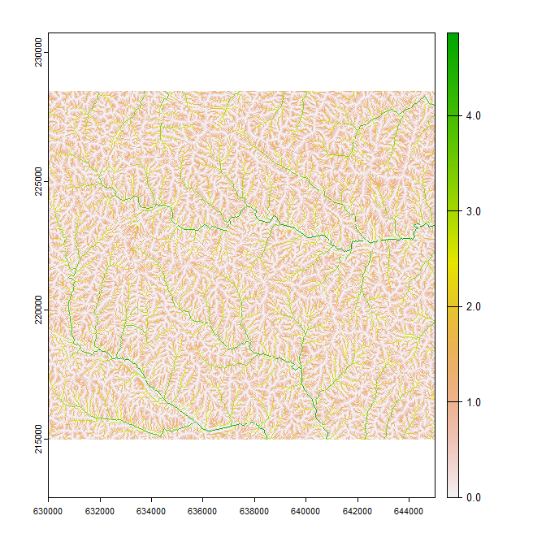

<!-- README.md is generated from README.Rmd. Please edit that file -->

```{r, include = FALSE}
knitr::opts_chunk$set(
  collapse = TRUE,
  comment = "#>",
  fig.path = "man/figures/README-",
  out.width = "100%"
)
```

## Contents

-   [1.0 Introduction](#10-introduction)
-   [2.0 System setup and installation](#20-system-setup-and-installation)
-   [3.0 Prepare DEM and Sampling Points for for analysis](#30-inverse-distance-weighted-rasters-using-hydroweight)
-   [3.1 Generate toy terrain dataset and sampling points](#31-generate-toy-terrain-dataset)
-   [3.2 Process DEM with `process_hydrology()`](#32-generate-targets)

## 1.0 Introduction

```{r pressure, echo=FALSE, out.width = '75%', fig.align = 'center'}
#
```

Add Introduction!

[Back to top](#contents)

## 2.0 System setup and installation

*WhiteboxTools* and *whitebox* are required for ***IntegratedHydrology***. See
[whiteboxR](https://github.com/giswqs/whiteboxR) or below for
installation.

```{r, eval = FALSE}
## Follow instructions for whitebox installation accordingly
## devtools::install_github("giswqs/whiteboxR") # For development version
## whitebox is now available on CRAN
#install.packages("whitebox")

library(whitebox)

if (F){
  install_whitebox()
  # Possible warning message:
  # ------------------------------------------------------------------------
  # Could not find WhiteboxTools!
  # ------------------------------------------------------------------------
  #
  # Your next step is to download and install the WhiteboxTools binary:
  #     > whitebox::install_whitebox()
  #
  # If you have WhiteboxTools installed already run `wbt_init(exe_path=...)`':
  #    > wbt_init(exe_path='/home/user/path/to/whitebox_tools')
  #
  # For whitebox package documentation, ask for help:
  #    > ??whitebox
  #
  # For more information visit https://giswqs.github.io/whiteboxR/
  #
  # ------------------------------------------------------------------------
}

```

[Back to top](#contents)

## 3.0 Prepare DEM and Sampling Points for for analysis

### 3.1 Generate toy terrain dataset and sampling points

Begin by bringing in the digital elevation model and using it to
generate terrain products. The DEM must be processed in a way to remove depressions.
Whitebox offers methods for breaching and filling DEMs to remove depressions. These tools
must be run before applying IntegratedHydrology tools. 

Another factor to consider at this step is whether to burn stream vectors into the DEM.
Whitebox's wbt_fillburn() tool allows for this, but  there are several caveats associated with this process. See [here](https://proceedings.esri.com/library/userconf/proc99/proceed/papers/pap802/p802.htm#Trois)


```{r, message = FALSE, error = FALSE, warning = FALSE}
## Load libraries
library(viridis)
library(IntegratedHydrology)
library(mapview)

# Many function in 'IntegratedHydrology' can be run in parallel internally. However it’s important to remember that
# data has to be passed back and forth between the workers. This means that whatever performance gain you might have
# gotten from your parallelization can be crushed by moving large amounts of data around. In general, passing objects
# as file paths will be faster than passing whole sf or terra objects. Not returning products directly will also speed
# up function processing time dramatically. Products can always be retrieved/read in directly from the output .zip
# file.

plan(multisession, workers = 2)

## Generate save_dir as a temporary directory
save_dir <- tempdir()

## Import toy_dem from whitebox package
toy_file<-sample_dem_data()
toy_file <- system.file("extdata", "DEM.tif", package = "whitebox")
toy_dem <- rast(raster::raster(x = toy_file)) # reading the file from terra directly sometimes crashes R for some reason
crs(toy_dem) <- "epsg:3161"

## Write toy_dem to save_dir
writeRaster(
  x = toy_dem, filename = file.path(save_dir, "toy_dem.tif"),
  overwrite = TRUE
)

## Identify some sampling points
points<-xyFromCell(toy_dem,c(1291,1524,15954,24022)) %>% 
  vect(crs="epsg:3161") %>% 
  st_as_sf() %>% 
  mutate(Sites=row_number()) %>% 
  select(Sites, everything())

## Breach depressions to ensure continuous flow
wbt_breach_depressions(
  dem = file.path(save_dir, "toy_dem.tif"),
  output = file.path(save_dir, "toy_dem_breached.tif")
)

toy_dem<-rast(file.path(save_dir, "toy_dem_breached.tif"))

```


[Back to top](#contents)

### 3.2 Generate predictor layers


```{r, fig.width = 7, fig.height = 7, message = FALSE, error = FALSE, warning = FALSE}

# Categorical Raster
wbt_pennock_landform_class(
  dem = file.path(save_dir, "toy_dem.tif"),
  output = file.path(save_dir, "landform_class.tif")
)

# Numeric Raster
wbt_ruggedness_index(
  dem = file.path(save_dir, "toy_dem.tif"),
  output = file.path(save_dir, "ruggedness_index.tif")
)

# Categorical/Numeric Polygon
lulc_p <- toy_dem
m <- c(0, 220, 1, 220, 300, 2, 300, 400, 3, 400, Inf, 4) 
rclmat <- matrix(m, ncol = 3, byrow = TRUE)
lulc_p <- classify(lulc_p, rclmat)
names(lulc_p)<-"lulc"
lulc_p <- as.polygons(lulc_p, dissolve = T, na.rm = T)
lulc_p <- st_as_sf(lulc_p)

set.seed(123)
lulc_p$var_1 <- sample(c(1:10), size = 4, replace = TRUE)
set.seed(123)
lulc_p$var_2 <- sample(c(20:30), size = 4, replace = TRUE)

lulc_p<-lulc_p %>% 
  select(var_1,var_2)

write_sf(lulc_p,file.path(save_dir,"lulc_p.shp"))

# Combine loi layers
output_filename_loi<-file.path(save_dir,"Processed_loi.zip")

loi_combined<-process_loi(
  dem=toy_dem,
  numb_inputs=list(# Can be given as a mixture of input types (file paths, or any sf or terra format)
    ruggedness=file.path(save_dir, "ruggedness_index.tif"),
    lulc_numbpoly=lulc_p
  ),
  cat_inputs=list(# Can be given as a mixture of input types (file paths, or any sf or terra format)
    landform_class=file.path(save_dir, "landform_class.tif"),
    lulc_catpoly=lulc_p
  ),
  variable_names=list( # any unlisted inputs will be used in their entirety
    lulc_numbpoly=c("var_1"),
    lulc_catpoly=c("var_2")
  ),
  output_filename=output_filename_loi,
  return_products=T,
  temp_dir=NULL,
  verbose=T
)

plot(rast(loi_combined$cat_inputs),type="classes",col=viridis(1))

```

```{r, fig.width = 7, fig.height = 7, message = FALSE, error = FALSE, warning = FALSE}
plot(rast(loi_combined$numb_inputs),type="continuous")

```

[Back to top](#contents)

### 3.3 Generate complete geospatial analysis products with 'process_hydrology()'

```{r, fig.width = 7, fig.height = 7, message = FALSE, error = FALSE, warning = FALSE}

# Run complete hydrology processing tools in one function
output_filename_hydro<-file.path(save_dir,"Processed_Hydrology.zip")

hydro_out_comp<-process_hydrology(
  dem=toy_dem,
  output_filename=output_filename_hydro,
  threshold=1000L,
  extra_attr=c( # Additional attributes to calculate and add to outputs
    "link_slope",
    "cont_slope",
    "USChnLn_To",
    "Elevation",
    "StOrd_Hack",
    "StOrd_Str",
    "StOrd_Hort",
    "StOrd_Shr"
  ),
  points=points,
  snap_distance=10L,
  site_id_col="Sites",
  return_products=T,
  temp_dir=NULL,
  verbose=F
)

# Complete upstream catchments for each reach/sampling point are not stored, but can easily be retrieved
point_catchments<-get_catchment( # retrieve sampling point catchment
  input=hydro_out_comp,
  site_id_col="Sites",
  target_sites=c("2","4")
)

subbasin_catchments<-get_catchment( # retrieve reach catchment
  input=hydro_out_comp,
  site_id_col=NULL,
  target_sites=c("19")
)

mapview(hydro_out_comp$subbasins,zcol="link_id",legend=F)+
  mapview(hydro_out_comp$stream_lines,zcol="link_id",legend=F)+
  mapview(hydro_out_comp$links,zcol="link_id",legend=F)+
  mapview(hydro_out_comp$snapped_points,zcol="Sites",legend=F,color="red")+
  mapview(point_catchments,legend=F, color = "cyan", col.regions = "white", lwd = 3,alpha=0.8)+
  mapview(subbasin_catchments,legend=F, color = "Yellow", col.regions = "white", lwd = 3,alpha=0.8)

```

[Back to top](#contents)

### 3.4 Add layers of interest to  complete geospatial analysis products with 'process_loi()'

```{r, fig.width = 7, fig.height = 7, message = FALSE, error = FALSE, warning = FALSE}

hydro_out_comp<-process_loi(
  input=hydro_out_comp,
  numb_inputs=list(
    ruggedness=file.path(save_dir, "ruggedness_index.tif"),
    lulc_numbpoly=file.path(save_dir,"lulc_p.shp")
  ),
  cat_inputs=list(
    landform_class=file.path(save_dir, "landform_class.tif"),
    lulc_catpoly=file.path(save_dir,"lulc_p.shp")
  ),
  variable_names=list( 
    lulc_numbpoly=c("var_1"),
    lulc_catpoly=c("var_2")
  ),
  return_products=T,
  temp_dir=NULL,
  verbose=F
)

```

[Back to top](#contents)

### 3.5 Calculate weighted spatial summaries at sampleing points 'attrib_points()'

```{r, fig.width = 7, fig.height = 7, message = FALSE, error = FALSE, warning = FALSE}

loi<-list(numb=rast(hydro_out_comp$numb_inputs),
          cat=rast(hydro_out_comp$cat_inputs))

loi_names<-lapply(loi,names) %>% unlist()
names(loi_names)<-loi_names
loi_names<-map(loi_names,~c("distwtd_mean",  "mean",  "min", "max"))

# A 'spec' table can be given to calculate attributes at only select sampling points,
# and/or to only calculate a subset of attributes from select sampling points
specification_table<-tibble(
  Sites=c("1","2","3"),
  loi=list(loi_names)
)
specification_table$loi[[2]]<-specification_table$loi[[2]][c(1:5)]
specification_table$loi[[2]][[1]]<-specification_table$loi[[2]][[1]][c(1:2)]


final_attributes_sub<-attrib_points(
  input=hydro_out_comp,
  spec=specification_table,
  weighting_scheme = c("lumped", "iFLO", "iFLS", "HAiFLO", "HAiFLS"),
  loi_numeric_stats = c("distwtd_mean",  "mean",  "min", "max"),
  OS_combine=F,
  target_streamseg=F, # This will set the target_o parameter as the sampling point
  inv_function = function(x) {
    (x * 0.001 + 1)^-1
  },
  remove_region=NULL,
  return_products=T,
  temp_dir=NULL,
  verbose=F
)

final_attributes_sub

```

[Back to top](#contents)

### 3.6 Calculate weighted spatial summaries at each reach 'attrib_points()'

```{r, fig.width = 7, fig.height = 7, message = FALSE, error = FALSE, warning = FALSE}

# Warning this operation can be very slow
final_attributes_all<-attrib_points(
  input=hydro_out_comp,
  all_reaches=T, # This will calculate attributes for each reach
  weighting_scheme = c("lumped", "iFLO", "iFLS", "HAiFLO", "HAiFLS"),
  loi_numeric_stats = c("distwtd_mean",  "mean",  "min", "max"),
  OS_combine=F,
  target_streamseg=T # This will set the target_o parameter as the entire reach
)

final_attributes_all

```

[Back to top](#contents)

## 4.0 Generate individual geospatial analysis products

### 4.1 Process DEM with `process_flowdir()`

The process_flowdir() function starts the workflow and creates an output zip file which stores results.
It is important that functions are not run repeatedly with the same output file, as later
steps overwrite results from previous iterations.

This function generates d8 pointer, flow accumulation, and stream layers from the specified DEM, 
and flow accumulation threshold.

```{r, fig.width = 7, fig.height = 7, message = FALSE, error = FALSE, warning = FALSE}

output_filename<-file.path(save_dir,"Processed_Hydrology_sub.zip")


hydro_out<-process_flowdir(
  dem=toy_dem,
  threshold=1000L,  
  return_products=T,
  output_filename=output_filename,
  temp_dir=NULL, 
  verbose=T
)

flow_accum<-log(rast(hydro_out$dem_accum_d8.tif))

plot(flow_accum,main="ln-Flow Accumulation")

```

[Back to top](#contents)

### 3.3 Generate Subbasins 'generate_subbasins()'

The generate_subbasins() generates subbasins for each reach identified in process_flowdir()

```{r, fig.width = 7, fig.height = 7, message = FALSE, error = FALSE, warning = FALSE}

hydro_out1<-generate_subbasins(
  input=hydro_out,
  return_products=T,
  temp_dir=NULL,
  verbose=F
) 

# Note polygons are identified with 'link_id' field which matches stream segments generated below

mapview(hydro_out1$subbasins,zcol="link_id")

```

[Back to top](#contents)

### 3.4 Generate Attributed Stream Lines `attrib_streamline()'


```{r, fig.width = 7, fig.height = 7, message = FALSE, error = FALSE, warning = FALSE}

hydro_out2<-attrib_streamline( 
  input=hydro_out1,
  extra_attr=c( # Additional attributes to calculate and add to outputs
    "link_slope",
    "cont_slope",
    "USChnLn_To",
    "Elevation",
    "StOrd_Hack",
    "StOrd_Str",
    "StOrd_Hort",
    "StOrd_Shr"
  ),
  return_products=T,
  temp_dir=NULL,
  verbose=F
)

# hydro_out2$links # Points containing pour points for each subbasins and upstream and downstream 'link_id's and 'extra_attr' fields

# hydro_out2$points # Points containing all points along the stream line, attributed with 'extra_attr' 

# hydro_out2$stream_lines # line segments for each subbasin, as well as and upstream and downstream 'link_id's and 'extra_attr' fields

mapview(hydro_out2$stream_lines,zcol="link_id")


```

[Back to top](#contents)

### 3.5 Insert Sampling Points into Stream Layer

```{r, fig.width = 7, fig.height = 7, message = FALSE, error = FALSE, warning = FALSE}

# Generate some artificial sampling points

points<-rast(hydro_out2$dem_streams_d8.tif) %>% 
  as.points() %>% 
  st_as_sf() %>% 
  filter(st_coordinates(.)[, 1] < 675000) %>% 
  rename(Sites=dem_streams_d8) %>% 
  .[c(10,12,50,100),] %>% 
  mutate(Sites=row_number()) %>% 
  st_jitter(5)

hydro_out25<-insert_points( 
  input=hydro_out2,
  points=points,
  site_id_col="Sites", # Column in points layer that corresponds to unique IDs that will be available in data products
  snap_distance=10,
  return_products=T,
  temp_dir=NULL,
  verbose=F
)

# Segments get split at sampling points, with the most downstream segment retaining the original 'link_id' and 
# upstream segments getting increasingly larger decimal numbers

mapview(hydro_out25$subbasins,zcol="link_id",legend=F)+
  mapview(hydro_out25$stream_lines,zcol="link_id",legend=F)+
  mapview(hydro_out25$links,zcol="link_id",legend=F)+
  mapview(hydro_out25$snapped_points,zcol="Sites",legend=F,color="red")


```

[Back to top](#contents)

### 3.6 Trace Flow Paths

```{r, fig.width = 7, fig.height = 7, message = FALSE, error = FALSE, warning = FALSE}

hydro_out3<-trace_flowpaths(
  input=hydro_out25,
  return_products=T,
  temp_dir=NULL,
  verbose=F
)

hydro_out4<-generate_pwisedist(
  input=hydro_out3,
  return_products=T,
  temp_dir=NULL,
  verbose=F
)


```

[Back to top](#contents)


[Back to top](#contents)

### 3.2 Process DEM with `process_flowdir()`

```{r, fig.width = 7, fig.height = 7, message = FALSE, error = FALSE, warning = FALSE}


```

[Back to top](#contents)
