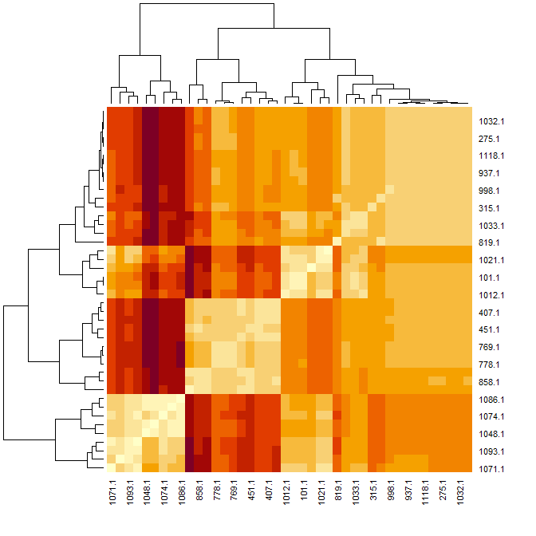
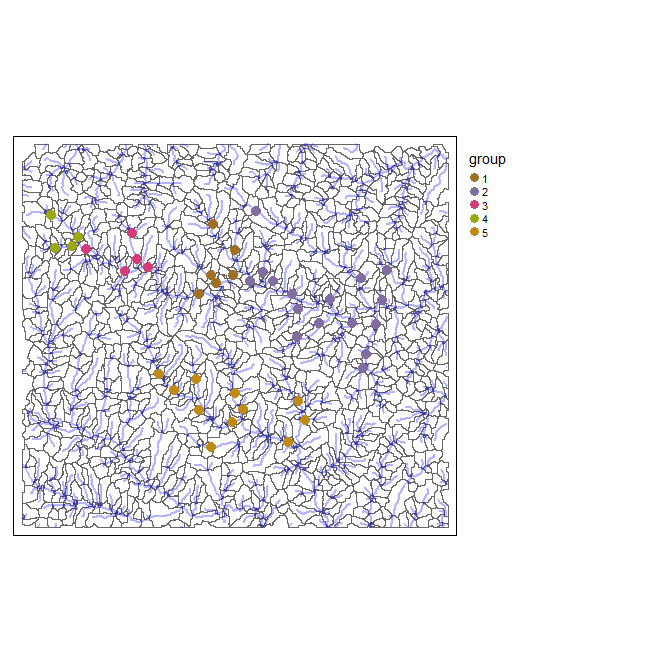
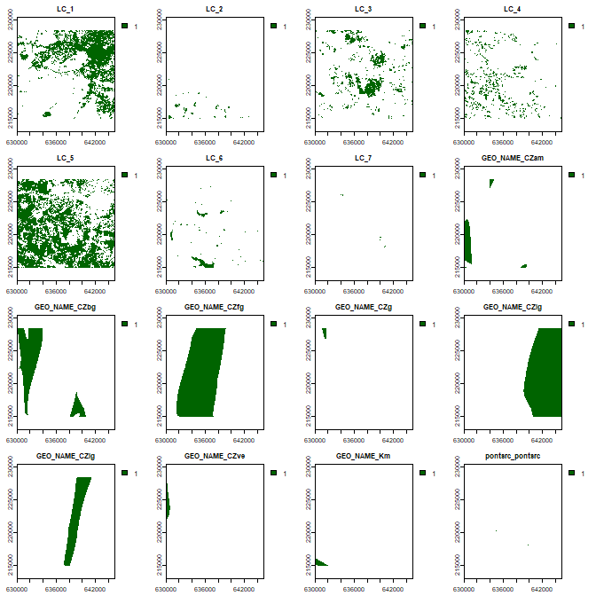
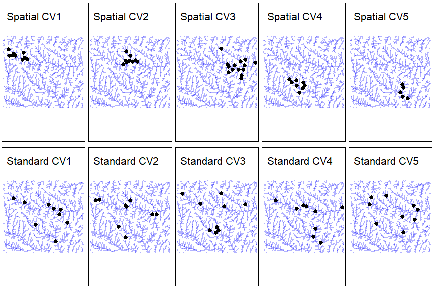
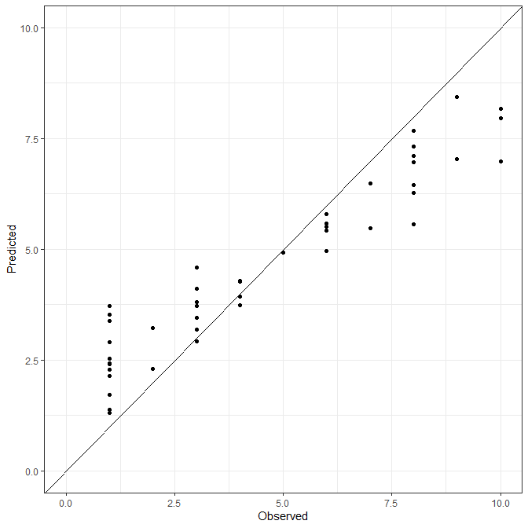
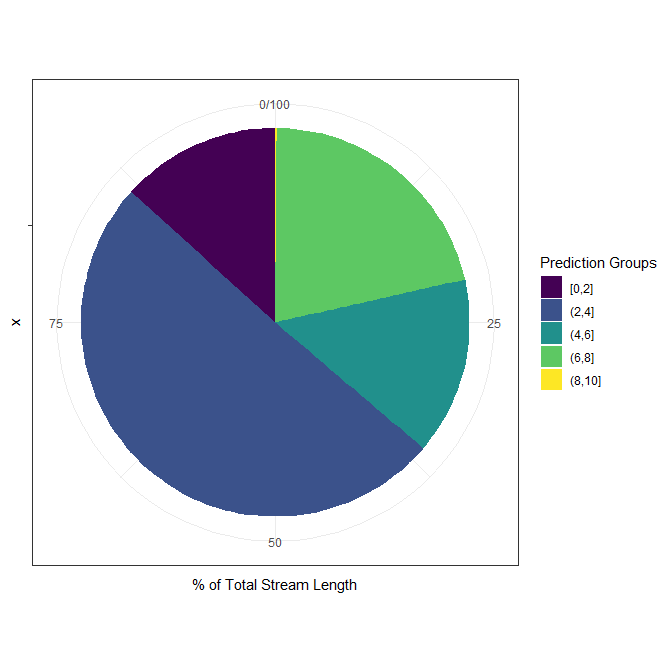

ihydro: Integrated hydrology tools for environmental science
================

- <a href="#ihydro-" id="toc-ihydro-">ihydro
  #</a>
  - <a href="#1-introduction" id="toc-1-introduction">1 Introduction</a>
  - <a href="#2-system-setup-and-installation"
    id="toc-2-system-setup-and-installation">2 System setup and
    installation</a>
  - <a href="#3-prepare-dem-and-sampling-points-for-analysis"
    id="toc-3-prepare-dem-and-sampling-points-for-analysis">3 Prepare DEM
    and Sampling Points for analysis</a>
    - <a href="#31-generate-toy-terrain-dataset-and-sampling-points"
      id="toc-31-generate-toy-terrain-dataset-and-sampling-points">3.1
      Generate toy terrain dataset and sampling points</a>
    - <a
      href="#32-generate-flow-directionaccumulation-geospatial-analysis-products-with-process_flowdir"
      id="toc-32-generate-flow-directionaccumulation-geospatial-analysis-products-with-process_flowdir">3.2
      Generate flow direction/accumulation geospatial analysis products with
      <code>process_flowdir()</code></a>
    - <a
      href="#33-generate-vector-geospatial-analysis-products-with-generate_vectors"
      id="toc-33-generate-vector-geospatial-analysis-products-with-generate_vectors">3.3
      Generate vector geospatial analysis products with
      <code>generate_vectors()</code></a>
    - <a
      href="#34-create-lookup-tables-of-flow-directions-with-trace_flowpaths"
      id="toc-34-create-lookup-tables-of-flow-directions-with-trace_flowpaths">3.4
      Create lookup tables of flow-directions with
      <code>trace_flowpaths()</code></a>
    - <a
      href="#35-generate-complete-upstream-catchment-areas-with-get_catchment"
      id="toc-35-generate-complete-upstream-catchment-areas-with-get_catchment">3.5
      Generate complete upstream catchment areas with
      <code>get_catchment()</code></a>
    - <a href="#36-generate-entire-hydrology-workflow-in-one-step"
      id="toc-36-generate-entire-hydrology-workflow-in-one-step">3.6 Generate
      entire hydrology workflow in one step.</a>
  - <a href="#4-examining-pairwise-instream-distances"
    id="toc-4-examining-pairwise-instream-distances">4 Examining Pairwise
    Instream Distances</a>
  - <a href="#5-process-layers-of-interest"
    id="toc-5-process-layers-of-interest">5 Process layers of interest</a>
    - <a href="#51-separate-from-hydrology-products"
      id="toc-51-separate-from-hydrology-products">5.1 Separate from hydrology
      products</a>
    - <a href="#52-together-with-hydrology-products"
      id="toc-52-together-with-hydrology-products">5.2 Together with hydrology
      products</a>
  - <a href="#6-calculate-weighted-spatial-summaries"
    id="toc-6-calculate-weighted-spatial-summaries">6 Calculate (weighted)
    spatial summaries:</a>
    - <a href="#61-at-specific-sampling-points"
      id="toc-61-at-specific-sampling-points">6.1 At specific sampling
      points</a>
    - <a href="#62-at-all-sampled-points"
      id="toc-62-at-all-sampled-points">6.2 At all sampled points</a>
    - <a href="#63-across-entire-study-area-fasttrib_points"
      id="toc-63-across-entire-study-area-fasttrib_points">6.3 Across entire
      study area <code>fasttrib_points()</code></a>
  - <a href="#7-example-modelling" id="toc-7-example-modelling">7 Example
    Modelling</a>
    - <a href="#71-train-a-random-forest-model"
      id="toc-71-train-a-random-forest-model">7.1 Train a Random Forest
      Model</a>
  - <a href="#8-future-plans" id="toc-8-future-plans">8 Future Plans</a>
  - <a href="#9-references" id="toc-9-references">9 References</a>

<!-- README.md is generated from README.Rmd. Please edit that file -->

# ihydro 

<!-- badges: start -->

[](https://lifecycle.r-lib.org/articles/stages.html#experimental)

<!-- badges: end -->

## 1 Introduction

Aquatic environmental scientists are often interested in relating
landscape features to observed responses (e.g., fish size, water
temperature, invertebrate community composition, etc.) in streams,
rivers and lakes. The computational workflow for conducting these
investigations is complex. Simply describing how water flows and
accumulates across the landscape can be a challenge itself, but for
aquatic scientists it is only the first step. The stream network must
then be extracted from the landscape, and reaches (a.k.a. segments;
i.e., stretches of river between two confluences) identified and given
unique identifiers. These reaches must then be attributed to be
informative (e.g., slope, stream order, upstream channel length, etc.);
and upstream-downstream connectivity between reaches established.

Typically, observed responses are measured at discrete sampling
locations along the stream network. If the location information is to be
preserved (i.e., if samples are upstream and downstream of a particular
effluent outflow), they must be incorporated into the network. This is
done by splitting stream lines and catchments at these points.

Once that is done, landscape features of interest (e.g., land-cover,
geology, climate, etc.) must be related to the reach (or sampling
points). This alone can be complex as the spatial configuration of these
factors relative to flow direction and accumulation can be important
(Peterson ***et al.***, 2011). The ***ihydro*** package uses
***hydroweight*** (Kielstra ***et al.*** 2021) to calculate these
attributes.

The complexity of this workflow can be a rate limiting step in the
scope, content, quality, and applicability of investigations by aquatic
environmental scientists. The ***ihydro*** package offers tools and
workflows to simplify these complex steps. It is capable of handling all
above computation steps, leaving researchers the task of identifying
layers of interest and modeling with (potentially) large numbers of
predictors.

The ***ihydro*** package also implements descriptions of spatial
autocorrelation among sites. Due to the linear nature of flow in streams
and rivers, autocorrelation tends to be asymmetric, with sites generally
more similar when they are flow connected, than not flow connected.
***ihydro*** produces tables that can be transformed into an asymmetric
matrices that describes the relationships between sampling points based
on instream distances and/or the proportions shared catchments.
Proportion of shared upstream catchment (rather than in-stream distance)
are a more relevant measure of spatial autocorrelation in streams
because it accounts for differences in catchment areas between points,
as well as spatial proximity. For example, if water chemistry samples
are taken from a large 6th order stream, and a upstream small 1st order
tributary we would expect the small tributary to have only a small
impact on the larger stream (despite its close physical proximity).
Hence, autocorrelation should be low because the tributary does not
contribute much flow to the larger stream. Using in-stream distances
alone may misrepresent this pattern.

***ihydro*** stores its geospatial products in a geopackage file for
ease of retrieval and extraction in external software (i.e. QGIS). Many
***ihydro*** functions can be run in parallel for increased speed (if
enough memory is available). The functions are also quick at removing
internal intermediate files to keep hard drives from filling up too
fast.

[Back to top](#1-introduction)

## 2 System setup and installation

*WhiteboxTools* and *whitebox* are required for ***ihydro***. See
[whiteboxR](https://github.com/giswqs/whiteboxR) or below for
installation.

``` r
## Follow instructions for whitebox installation accordingly
## devtools::install_github("giswqs/whiteboxR") # For development version
## whitebox is now available on CRAN
#install.packages("whitebox")

library(whitebox)

if (F){
  install_whitebox()
  # Possible warning message:
  # ------------------------------------------------------------------------
  # Could not find WhiteboxTools!
  # ------------------------------------------------------------------------
  #
  # Your next step is to download and install the WhiteboxTools binary:
  #     > whitebox::install_whitebox()
  #
  # If you have WhiteboxTools installed already run `wbt_init(exe_path=...)`':
  #    > wbt_init(exe_path='/home/user/path/to/whitebox_tools')
  #
  # For whitebox package documentation, ask for help:
  #    > ??whitebox
  #
  # For more information visit https://giswqs.github.io/whiteboxR/
  #
  # ------------------------------------------------------------------------
}
```

[Back to top](#1-introduction)

## 3 Prepare DEM and Sampling Points for analysis

### 3.1 Generate toy terrain dataset and sampling points

Begin by bringing in the digital elevation model.

``` r
## Load libraries
# remotes::install_github("p-schaefer/ihydro)
library(ihydro)
library(tmap)
library(furrr)
library(whitebox)
library(terra)
library(sf)
library(dplyr)
library(tidyr)
library(purrr)

# Many function in 'ihydro' can be run in parallel internally. 

# Parallelization is done through the future package, so all parallel backends
# should be supported i.e.,:
plan(multisession(workers=4))

## Generate save_dir as a temporary directory
save_dir <- tempdir()


## Import toy_dem from openSTARS package
# devtools::install_github("MiKatt/openSTARS", ref = "dev")

ot<-system.file("extdata", "nc", "elev_ned_30m.tif", package = "openSTARS") %>% 
  rast() 

crs(ot)<-crs(rast(system.file("extdata", "nc", "landuse_r.tif", package = "openSTARS")))
writeRaster(ot,file.path(save_dir, "toy_dem.tif"),overwrite=T)

toy_dem<-rast(file.path(save_dir, "toy_dem.tif"))

## Identify some sampling points
system.file("extdata", "nc", "sites_nc.shp", package = "openSTARS") %>% 
  vect() %>% 
  st_as_sf() %>% 
  st_transform(st_crs(toy_dem)) %>% 
  vect() %>% 
  writeVector(file.path(save_dir, "sites.shp"),overwrite=T)

plot(toy_dem,main="Elevation")
```


[Back to top](#1-introduction)

### 3.2 Generate flow direction/accumulation geospatial analysis products with `process_flowdir()`

The DEM must be processed in a way to remove depressions. Whitebox
offers methods for breaching and filling DEMs to remove depressions.
These may be applied before had, or through the `depression_corr`
argument in `process_flowdir()`.

Another factor to consider at this step is whether to burn a stream
vector into the DEM; ***ihydro*** implements a simplified stream burning
method that lowers the evation along the DEM by `burn_depth` meters. See
[here](https://proceedings.esri.com/library/userconf/proc99/proceed/papers/pap802/p802.htm#Trois)
for more detailed approaches.

``` r

# Outputs of all functions are always saved to output_filename by default,
# but can be included in function return with return_products=T (note this can
# be very slow for large regions)
output_filename_hydro<-file.path(save_dir,"Processed_Hydrology.gpkg")

# Generates d8 flow direction and accumulation, extracts streams at a specified 
# flow accumulation threshold
hydro_out<-process_flowdir(
  dem=toy_dem,
  burn_streams=system.file("extdata", "nc", "streams.shp", package = "openSTARS"),
  burn_depth=5,
  min_length=3,
  depression_corr="breach",
  threshold=100L,  
  return_products=T,
  output_filename=output_filename_hydro,
  temp_dir=NULL, 
  verbose=T
)

# List files present in gpkg
ihydro_layers(hydro_out)
#> # A tibble: 7 × 3
#>   layer_name       data_type data_group
#>   <chr>            <chr>     <chr>     
#> 1 dem_final        Raster    hydro     
#> 2 dem_d8           Raster    hydro     
#> 3 dem_accum_d8     Raster    hydro     
#> 4 dem_accum_d8_sca Raster    hydro     
#> 5 dem_streams_d8   Raster    hydro     
#> 6 DEM_Extent       Table     meta      
#> 7 DEM_Extent       Vector    meta

# hydro_out$outfile # -> This is the full file path of the resulting geopackage (gpkg) file

# remaining outputs only present when `return_products` == T
# hydro_out$dem_final.tif # -> final dem after stream burning and depression correction 
# hydro_out$dem_d8.tif # -> d8 flow direction
# hydro_out$dem_accum_d8.tif # -> d8 flow accumulation (cells)
# hydro_out$dem_accum_d8_sca.tif # -> d8 flow accumulation (specific catchment areas)
# hydro_out$dem_streams_d8.tif # -> extracted streams at specified `threshold`

# if `return_products` == F, all produces are only available in the gpkg file.
# terra and sf allow access to files directly in the gpkg file, whitebox
# requires them to be extracted to a folder

flow_accum<-rast(hydro_out$outfile,"dem_accum_d8")

plot(log10(flow_accum))
```


To create an ihydro object from an existing geopackage (i.e., created
from a previous R run):

``` r

hydro_out_new<-as.ihydro(output_filename_hydro)
ihydro_layers(hydro_out_new)
#> # A tibble: 7 × 3
#>   layer_name       data_type data_group
#>   <chr>            <chr>     <chr>     
#> 1 dem_final        Raster    hydro     
#> 2 dem_d8           Raster    hydro     
#> 3 dem_accum_d8     Raster    hydro     
#> 4 dem_accum_d8_sca Raster    hydro     
#> 5 dem_streams_d8   Raster    hydro     
#> 6 DEM_Extent       Table     meta      
#> 7 DEM_Extent       Vector    meta
```

[Back to top](#1-introduction)

### 3.3 Generate vector geospatial analysis products with `generate_vectors()`

This function combines `generate_subbasins()` and `attrib_streamline()`
to produce subcatchment polygons, stream lines, stream links (downstream
most points along each subcatchment), stream points (stream line
represented as individual points).

Typically, observed responses are measured at discrete sampling
locations along the stream network. If the location information is to be
preserved (i.e., if samples are upstream and downstream of a particular
effluent outflow), the sampling points must be incorporated into the
network. This is done by splitting stream lines and subcatchments at
these points.

``` r

hydro_out<-generate_vectors(
  input=hydro_out,
  points=file.path(save_dir, "sites.shp"), # These are optional sampling locations
  site_id_col="site_id", # Column name in points layer that corresponds to 
  #                      # unique IDs that will be available in data products
  snap_distance=100L, # points that are more than 100m from closest stream are excluded
  break_on_noSnap =F, # default is to stop when any points don't snap, this will ignore that
  return_products=T,
  temp_dir=NULL,
  verbose=T
) 

ihydro_layers(hydro_out)
#> # A tibble: 22 × 3
#>    layer_name        data_type data_group
#>    <chr>             <chr>     <chr>     
#>  1 dem_final         Raster    hydro     
#>  2 dem_d8            Raster    hydro     
#>  3 dem_accum_d8      Raster    hydro     
#>  4 dem_accum_d8_sca  Raster    hydro     
#>  5 dem_streams_d8    Raster    hydro     
#>  6 Subbasins_poly    Table     hydro     
#>  7 stream_lines      Table     hydro     
#>  8 stream_links      Table     hydro     
#>  9 stream_links_attr Table     hydro     
#> 10 stream_points     Table     hydro     
#> # … with 12 more rows

# Several important columns are used throughout the vector layers:
# `link_id` - identifies reaches/segments (stream length between two confluences)
# `trib_id` - identifies streams/tributaries, with the shortest channel getting
#           # a new trib_id at a confluence, and longest channel retaining the original ID
# `uslink_id` and `dslink_id`  - columns identify upstream and downstream links
# `ustrib_id` and `dstrib_id`  - columns identify upstream and downstream tributaries (longest
#  continuous flow-paths)

# If 'points' are provided, this function modifies the vector outputs by inserting
# links, and splitting lines/subbasins at `points`. Inserted points are given "link_id'
# values that increment with decimal places from downstream to upstream directions 
# (i.e., 10.0 remains the pour point for the segment, and 10.1, 10.2,... identify
# sample points in an upstream direction). 

# New layers added by `generate_vectors()`
# hydro_out$subbasins      # -> polygon subbasins attributed with `link_id` and reach
#                          #  contributing area (in m^2)
# hydro_out$stream_lines   # -> line vectors attributed with `link_id`
# hydro_out$points         # -> point vectors along lines identifying 'nodes' (confluence
#                          #  points), vs 'links' segments joining 'nodes', and also
#                          #  attributed with `link_id`, `trib_id`, upstream
#                          #  and downstream link and trib IDS and a number of extra attributes
# hydro_out$links          # -> point vector representing pour-points for subbasins,
#                          #  attributed with `link_id` and extra attributes
# hydro_out$snapped_points # -> provided points snapped to nearest segment. Any points 
#                          #  beyond snap distance are removed, with a warning if
#                          #  break_on_noSnap == F. 

tm_shape(hydro_out$subbasins) + tm_polygons(col="link_id",palette = "viridis",alpha =0.2,legend.show=F) +
  tm_shape(hydro_out$stream_lines) + tm_lines(col="blue",alpha =0.5,legend.show=F,lwd =3) +
  tm_shape(hydro_out$links) + tm_dots(col="yellow",legend.show=F,size=0.15,border.col="black",border.alpha=1)
```


``` r

# Optional step, inserts sampling points into stream vectors, splitting subbasins
# and lines at sampling points, additional links inserted at sampling points as well

tm_shape(rast(hydro_out$dem_final.tif)) + tm_raster(palette = "cividis",legend.show=F) +
  tm_shape(hydro_out$stream_lines) + tm_lines(col="red",alpha =0.5,legend.show=F,lwd =2) +
  tm_shape(hydro_out$snapped_points %>% mutate(site_id=as.numeric(site_id))) +
  tm_dots(col="darkgray",legend.show=F,size=0.35,border.col="black",border.alpha=1,border.lwd=1) +
  tm_shape(read_sf(file.path(save_dir, "sites.shp"))) +
  tm_dots(col="black",legend.show=F,size=0.35,border.col="black",border.alpha=1,border.lwd=1)
```


[Back to top](#1-introduction)

### 3.4 Create lookup tables of flow-directions with `trace_flowpaths()`

To more efficiently generate catchments, look-ups are created that
identify all upstream and downstream links originating from each link.

``` r

hydro_out<-trace_flowpaths(
  input=hydro_out,
  return_products=T,
  pwise_dist=T, # This will calculate all downstream flow-connected pairwise distances
  pwise_all_links=F, # This will calculate all flow un-connected pairwise distances (can be very time consuming)
  temp_dir=NULL,
  verbose=T
)

ihydro_layers(hydro_out)
#> # A tibble: 25 × 3
#>    layer_name       data_type data_group
#>    <chr>            <chr>     <chr>     
#>  1 dem_final        Raster    hydro     
#>  2 dem_d8           Raster    hydro     
#>  3 dem_accum_d8     Raster    hydro     
#>  4 dem_accum_d8_sca Raster    hydro     
#>  5 dem_streams_d8   Raster    hydro     
#>  6 ds_flowpaths     Table     flow_path 
#>  7 us_flowpaths     Table     flow_path 
#>  8 Subbasins_poly   Table     hydro     
#>  9 stream_lines     Table     hydro     
#> 10 stream_links     Table     hydro     
#> # … with 15 more rows

# We will add these upstream and downstream lookup tables to the output below
con <- DBI::dbConnect(RSQLite::SQLite(), hydro_out$outfile)

hydro_out$us_flowpaths <-collect(tbl(con,"us_flowpaths"))
hydro_out$ds_flowpaths <-collect(tbl(con,"ds_flowpaths"))

DBI::dbDisconnect(con)

head(hydro_out$us_flowpaths)
#> # A tibble: 6 × 2
#>   pour_point_id origin_link_id
#>   <chr>         <chr>         
#> 1 1             1             
#> 2 10            10            
#> 3 100           100           
#> 4 1000          1000          
#> 5 1000          1001          
#> 6 1000          1004

head(hydro_out$ds_flowpaths %>% arrange(destination_link_id))
#> # A tibble: 6 × 2
#>   destination_link_id origin_link_id
#>   <chr>               <chr>         
#> 1 1                   1             
#> 2 10                  10            
#> 3 100                 100           
#> 4 1000                127           
#> 5 1000                1107.1        
#> 6 1000                1107

# Below we demonstrate how to extract the upstream and downstream flowpaths for specific points

us_647<-hydro_out$us_flowpaths %>%
  filter(pour_point_id == "647") # get all upstream link_ids from link_id 647
ds_101.1<-hydro_out$ds_flowpaths %>%
  filter(origin_link_id == "101.1") # get all downstream link_ids from 
#                                   # link_id 101.1 (this corresponds with site_id = 62)

lines_out<-hydro_out$stream_lines %>% 
  filter(link_id %in% us_647$origin_link_id | 
           link_id %in% ds_101.1$destination_link_id  
  )
sub_out<-hydro_out$subbasins %>% 
  filter(link_id %in% us_647$origin_link_id | 
           link_id %in% ds_101.1$destination_link_id 
  )

tm_shape(sub_out) + tm_polygons(col="white",alpha =0.2,legend.show=F) +
  tm_shape(lines_out) + tm_lines(col="blue",alpha =0.5,legend.show=F,lwd =3) +
  tm_shape(hydro_out$links %>% filter(link_id %in% c("647","101.1"))) +
  tm_dots(legend.show=F,size=0.45,border.col="black",border.alpha=1,border.lwd=1) + 
  tm_layout(frame = FALSE)
```


[Back to top](#1-introduction)

### 3.5 Generate complete upstream catchment areas with `get_catchment()`

Once lookups are established, catchments can easily be retrieved

``` r


subbasin_catchments<-get_catchment( # retrieve catchment for an arbitrary reach
  input=hydro_out,
  sample_points=NULL,
  link_id="838"
)

point_catchments<-get_catchment( # retrieve catchments at specified sampling points
  input=hydro_out,
  sample_points=c("1","25"),
  link_id=NULL
)

tm_shape(bind_rows(subbasin_catchments,point_catchments)) + 
  tm_polygons(col="white",alpha =0.2,legend.show=F,lwd =4) +
  tm_shape(hydro_out$stream_lines) +
  tm_lines(col="blue",alpha =0.5,legend.show=F,lwd =2)  
```


[Back to top](#1-introduction)

### 3.6 Generate entire hydrology workflow in one step.

The entire workflow above can be accomplished with a single function:

``` r

output_filename_hydro_sparse<-file.path(save_dir,"Processed_Hydrology_sparse.gpkg")

# In this case we will use a higher stream initiation threshold to speed up calculation.

hydro_out_sparse<-process_hydrology(
  dem=toy_dem,
  output_filename=output_filename_hydro_sparse,
  # burn_streams=system.file("extdata", "nc", "streams.shp", package = "openSTARS"),
  burn_depth=5,
  depression_corr="breach",
  threshold=500L,
  points=hydro_out$snapped_points,
  site_id_col="site_id",
  snap_distance = 1L,
  break_on_noSnap=F, 
  pwise_dist=T,
  pwise_all_links=F,
  return_products=F,
  temp_dir=NULL,
  verbose=F
)

ihydro_layers(hydro_out_sparse)
#> # A tibble: 25 × 3
#>    layer_name       data_type data_group
#>    <chr>            <chr>     <chr>     
#>  1 dem_final        Raster    hydro     
#>  2 dem_d8           Raster    hydro     
#>  3 dem_accum_d8     Raster    hydro     
#>  4 dem_accum_d8_sca Raster    hydro     
#>  5 dem_streams_d8   Raster    hydro     
#>  6 ds_flowpaths     Table     flow_path 
#>  7 us_flowpaths     Table     flow_path 
#>  8 Subbasins_poly   Table     hydro     
#>  9 stream_lines     Table     hydro     
#> 10 stream_links     Table     hydro     
#> # … with 15 more rows

# Since we didn't return the products, we'll verify the outputs exist in the gpkg file

tm_shape(read_sf(hydro_out_sparse$outfile,"Subbasins_poly")) + 
  tm_polygons(col="white",alpha =0.2,legend.show=F) +
  tm_shape(read_sf(hydro_out_sparse$outfile,"stream_lines")) +
  tm_lines(col="blue",alpha =0.3,legend.show=F,lwd =2) +
  tm_shape(read_sf(hydro_out_sparse$outfile,"stream_links")) +
  tm_dots(legend.show=F,size=0.2,border.col="black",border.alpha=1,border.lwd=1)
```


[Back to top](#1-introduction)

## 4 Examining Pairwise Instream Distances

For more complete and thorough treatment on spatial autocorrelation in
stream systems, see [Zimmerman and Hoef
(2007)](https://www.fs.usda.gov/rm/boise/AWAE/projects/NationalStreamInternet/downloads/17ZimmermanVerHoef_TheTorgeg%20amForFluvialVariography.pdf).

In case we didn’t request pairwise distances in `trace_flowpaths()`, we
can calculate them separately with `generate_pdist()`. Below we
calculate a table that summaries relevant pairwise distance measures
between reaches.

``` r

# If pairwise distances were not requested with trace_flowpaths(), they can be added 
# at any point after using generate_pdist()

hydro_out<-generate_pdist(
  input=hydro_out,
  pwise_all_links=T # This will calculate pairwise distances between all stream links
  #                 #  which can be very slow for dense stream networks
)

# New data available in `fcon_pwise_dist` and 'funcon_pwise_dist'
# *_pwise_dist # -> tables of downstream path lengths between each pair of link_ids,
#                   #    with flow-connected in-stream distances (directed_path_length),
#                   #    flow-unconnected in-stream distances (undirected_path_length),
#                   #    and proportions of shared catchments (prop_shared_catchment)
#                   #    and log-transformed catchment proportions (prop_shared_logcatchment)


con <- DBI::dbConnect(RSQLite::SQLite(), hydro_out$outfile)
ihydro_layers(hydro_out)
#> # A tibble: 28 × 3
#>    layer_name       data_type data_group
#>    <chr>            <chr>     <chr>     
#>  1 dem_final        Raster    hydro     
#>  2 dem_d8           Raster    hydro     
#>  3 dem_accum_d8     Raster    hydro     
#>  4 dem_accum_d8_sca Raster    hydro     
#>  5 dem_streams_d8   Raster    hydro     
#>  6 ds_flowpaths     Table     flow_path 
#>  7 us_flowpaths     Table     flow_path 
#>  8 Catchment_poly   Table     hydro     
#>  9 Subbasins_poly   Table     hydro     
#> 10 stream_lines     Table     hydro     
#> # … with 18 more rows

# funcon_pwise_dist is only available if pwise_all_links==T

hydro_out$pwise_dist<-bind_rows(collect(tbl(con,"fcon_pwise_dist")) %>% mutate(dist_type="Flow Connected"),
                                collect(tbl(con,"funcon_pwise_dist")) %>% mutate(dist_type="Flow Unconnected")
)

DBI::dbDisconnect(con)

head(hydro_out$pwise_dist)
#> # A tibble: 6 × 7
#>   origin destination directed_path_length prop_shared_…¹ prop_…² undir…³ dist_…⁴
#>   <chr>  <chr>                      <dbl>          <dbl>   <dbl>   <dbl> <chr>  
#> 1 1      1                          132.          1        1       132.  Flow C…
#> 2 10     10                          42.4         1        1        42.4 Flow C…
#> 3 10     1210                       192.          0.0289   0.763   192.  Flow C…
#> 4 100    100                        230.          1        1       230.  Flow C…
#> 5 100    1132                       465.          0.284    0.904   465.  Flow C…
#> 6 100    1139                       579.          0.218    0.886   579.  Flow C…
#> # … with abbreviated variable names ¹​prop_shared_catchment,
#> #   ²​prop_shared_logcatchment, ³​undirected_path_length, ⁴​dist_type

p1<-hydro_out$stream_lines %>% 
  mutate(link_id=as.character(link_id)) %>% 
  left_join(hydro_out$pwise_dist %>%
              filter(dist_type=="Flow Connected") %>% 
              filter(origin=="1048") %>% 
              mutate(directed_path_length=log(directed_path_length)),
            by=c("link_id"="destination")) %>% 
  tm_shape() +
  tm_lines(col="directed_path_length",alpha =1,legend.show=T,lwd =2,palette = "viridis",style="cont")+
  tm_shape(hydro_out$links %>% filter(link_id=="1048"))+
  tm_dots(legend.show=F,size=0.45,border.col="black",border.alpha=1,border.lwd=1)+
  tm_layout(main.title = "Flow connected path log-length from 1048",legend.outside = TRUE)

p2<-hydro_out$stream_lines %>% 
  mutate(link_id=as.character(link_id)) %>% 
  left_join(hydro_out$pwise_dist %>% 
              filter(origin=="99") %>%
              filter(dist_type=="Flow Unconnected") %>% 
              mutate(undirected_path_length=log(undirected_path_length)),  
            by=c("link_id"="destination"),
            multiple="all") %>% 
  tm_shape() +
  tm_lines(col="undirected_path_length",alpha =1,legend.show=T,lwd =2,palette = "viridis",style="cont")+
  tm_shape(hydro_out$links %>% filter(link_id=="99"))+
  tm_dots(legend.show=F,size=0.45,border.col="black",border.alpha=1,border.lwd=1)+
  tm_layout(main.title = "Flow Unconnected path log-length from 99",legend.outside = TRUE)


# Verify upstream and downstream distances make sense
tmap_arrange(p1,p2,ncol=1)
```


Below. we take these distances and visualize them as heatmaps to
illustrate how pairwise distance matrices can be used to represent
spatial relationships among sites.

``` r

# Examine relationships among sampled sites. 

# Get link_id for sampled points
sel_link_id<-hydro_out$snapped_points 

# filter long table to selected sites, and convert to wide format

# This table describes the flow-connected in-stream distances at destination points (rows)
# from upstream origin points (columns)
dmat<-hydro_out$pwise_dist %>% 
  filter(origin %in% sel_link_id$link_id &
           destination %in% sel_link_id$link_id
  ) %>% 
  filter(origin!=destination) %>% 
  select(-prop_shared_catchment,-undirected_path_length,-prop_shared_logcatchment,-dist_type) %>%
  rename(link_id=origin) %>%
  mutate(directed_path_length=ifelse(directed_path_length==1 | is.na(directed_path_length),0,directed_path_length)) %>% 
  distinct() %>% 
  filter(directed_path_length!=0) %>% 
  pivot_wider(names_from=destination,values_from=directed_path_length,values_fill = 0) %>% 
  data.frame(check.names = F) %>% 
  tibble::column_to_rownames("link_id") %>% 
  log1p()

head(dmat)
#>          1035.1    998.1   1050.1   1012.1 1071.1 968.1 1053.1 1074.1 1037.1
#> 101.1  8.613486 8.995312 9.664710 0.000000      0     0      0      0      0
#> 1012.1 7.494625 8.379798 9.396383 0.000000      0     0      0      0      0
#> 1021.1 8.237140 8.754396 9.548604 7.797961      0     0      0      0      0
#> 1032.1 0.000000 0.000000 8.427519 0.000000      0     0      0      0      0
#> 1033.1 0.000000 8.112417 9.307670 0.000000      0     0      0      0      0
#> 1035.1 0.000000 8.027024 9.282589 0.000000      0     0      0      0      0
#>        1086.1 1093.1 1021.1 924.1 769.1 709.1 780.1 866.1 904.1 850.1
#> 101.1       0      0      0     0     0     0     0     0     0     0
#> 1012.1      0      0      0     0     0     0     0     0     0     0
#> 1021.1      0      0      0     0     0     0     0     0     0     0
#> 1032.1      0      0      0     0     0     0     0     0     0     0
#> 1033.1      0      0      0     0     0     0     0     0     0     0
#> 1035.1      0      0      0     0     0     0     0     0     0     0

# This table describes the proportions of shared catchments at destination points (rows)
# from upstream origin points (columns)
dmat2<-hydro_out$pwise_dist %>% 
  filter(origin %in% sel_link_id$link_id &
           destination %in% sel_link_id$link_id
  ) %>% 
  filter(origin!=destination) %>% 
  select(-directed_path_length,-undirected_path_length,-prop_shared_catchment,-dist_type) %>%
  rename(link_id=origin) %>%
  mutate(prop_shared_logcatchment=ifelse(prop_shared_logcatchment==1 | is.na(prop_shared_logcatchment),
                                         1,prop_shared_logcatchment)) %>% 
  distinct() %>% 
  filter(prop_shared_logcatchment!=0) %>% 
  pivot_wider(names_from=destination,values_from=prop_shared_logcatchment ,values_fill = 0) %>% 
  data.frame(check.names = F) %>% 
  tibble::column_to_rownames("link_id")

head(dmat2)
#>           1035.1     998.1    1050.1    1012.1 1071.1 968.1 1053.1 1074.1
#> 101.1  0.7653298 0.7563228 0.7294989 0.0000000      0     0      0      0
#> 1012.1 0.9872277 0.9756092 0.9410081 0.0000000      0     0      0      0
#> 1021.1 0.8712224 0.8609692 0.8304339 0.8824939      0     0      0      0
#> 1032.1 0.0000000 0.0000000 0.7370728 0.0000000      0     0      0      0
#> 1033.1 0.0000000 0.8142056 0.7853288 0.0000000      0     0      0      0
#> 1035.1 0.0000000 0.9882312 0.9531825 0.0000000      0     0      0      0
#>        1037.1 1086.1 1093.1 1021.1 924.1 769.1 709.1 780.1 866.1 904.1 850.1
#> 101.1       0      0      0      0     0     0     0     0     0     0     0
#> 1012.1      0      0      0      0     0     0     0     0     0     0     0
#> 1021.1      0      0      0      0     0     0     0     0     0     0     0
#> 1032.1      0      0      0      0     0     0     0     0     0     0     0
#> 1033.1      0      0      0      0     0     0     0     0     0     0     0
#> 1035.1      0      0      0      0     0     0     0     0     0     0     0

# Here we multiply the matrices (using the proportions of shared catchments as a rough weighting scheme)
# calculate manhattan distances and generate a heatmap
(dmat*dmat2) %>% 
  dist("man") %>% 
  as.matrix() %>% 
  heatmap()
```



Using these relationships, we can perform a clustering analysis to
identify groups of sites with potentially high spatial autocorrelation.
These groups could for instance be used for cross-validation purposes.

``` r

# Using the above approach, we create 5 groups of spatially proximate points
km<-(dmat*dmat2) %>% 
  dist("man") %>% 
  hclust() %>% 
  cutree(k=5)

gps<-tibble::enframe(km,"link_id","group") %>% 
  mutate(link_id=as.numeric(link_id))

point_groups<-hydro_out$snapped_points %>% 
  left_join(gps) %>% 
  filter(!is.na(group))

# These can be used for cross-validation purposes to see how well the models extrapolate outside of 
# sampled areas

tm_shape(hydro_out$subbasins) + tm_polygons(col="white",alpha =0.2,legend.show=F) +
  tm_shape(hydro_out$stream_lines) + tm_lines(col="blue",alpha =0.3,legend.show=F,lwd =2) +
  tm_shape(point_groups) + tm_dots(col="group", palette = "Dark2",legend.show=T,size=0.45)+
  tm_layout(legend.outside = TRUE)
```



Finally, we’ll examine relationships among our response variable in
terms of in-stream distances, contrasting flow connected sites vs, flow
unconnected sites. Here we see greater differences between responses
with increasing in-stream distance. We expect greater similarity among
flow-connected than flow-unconnected sites, but don’t see it here. This
may be a product of this being an artificial data set.

``` r

# get response variables
response_table<-file.path(save_dir, "sites.shp") %>% 
  read_sf() %>% 
  as_tibble() %>% 
  select(site_id,value) %>% 
  left_join(hydro_out$snapped_points %>% # join by snapped sites to get link_id values
              as_tibble() %>% 
              select(site_id,link_id)) %>% 
  mutate(link_id=as.character(link_id))

# Combine pairwise data with values and examine spatial relationships. 
dmat<-hydro_out$pwise_dist %>% 
  filter(origin %in% sel_link_id$link_id &
           destination %in% sel_link_id$link_id
  ) %>% 
  # Add response values for origin and destination points into the table
  left_join(response_table %>% rename(origin_value=value),by=c("origin"="link_id")) %>% 
  left_join(response_table %>% rename(destination_value=value),by=c("destination"="link_id")) %>% 
  mutate(value_diff=sqrt((origin_value-destination_value)^2)) %>%  # Calculate the squared difference
  filter(origin!=destination) %>% 
  select(-dist_type,-site_id.x,-site_id.y,-origin_value,-destination_value) %>% 
  pivot_longer(c(directed_path_length,undirected_path_length,prop_shared_catchment,prop_shared_logcatchment),
               names_to ="dist_type",
               values_to ="dist") %>% 
  filter(!is.na(dist)) %>% 
  mutate(`Distance Type`=case_when(
    dist_type=="directed_path_length" ~ "Flow Connected",
    dist_type=="undirected_path_length" ~ "Flow Unconnected",
    dist_type=="prop_shared_catchment" ~ "Shared Catchment",
    dist_type=="prop_shared_logcatchment" ~ "Shared log-Catchment",
  )) %>% 
  distinct()

dmat
#> # A tibble: 21,272 × 6
#>    origin destination value_diff dist_type                      dist Distance …¹
#>    <chr>  <chr>            <dbl> <chr>                         <dbl> <chr>      
#>  1 101.1  1035.1               2 directed_path_length      5504.     Flow Conne…
#>  2 101.1  1035.1               2 undirected_path_length    5504.     Flow Uncon…
#>  3 101.1  1035.1               2 prop_shared_catchment        0.0179 Shared Cat…
#>  4 101.1  1035.1               2 prop_shared_logcatchment     0.765  Shared log…
#>  5 101.1  998.1                2 directed_path_length      8064.     Flow Conne…
#>  6 101.1  998.1                2 undirected_path_length    8064.     Flow Uncon…
#>  7 101.1  998.1                2 prop_shared_catchment        0.0146 Shared Cat…
#>  8 101.1  998.1                2 prop_shared_logcatchment     0.756  Shared log…
#>  9 101.1  1050.1               2 directed_path_length     15751.     Flow Conne…
#> 10 101.1  1050.1               2 undirected_path_length   15751.     Flow Uncon…
#> # … with 21,262 more rows, and abbreviated variable name ¹​`Distance Type`

require(ggplot2)
ggplot(dmat %>% filter(dist_type %in% c("directed_path_length","undirected_path_length")),
       aes(x=dist,y=value_diff,col=`Distance Type`))+
  geom_hex(bins=50)+
  geom_smooth(method="gam",se=F)+
  theme_bw()+
  theme(legend.position = "bottom")+
  ylab("Pairwise Value Difference")+
  xlab("Pairwise Distance (m)")+
  scale_x_log10(labels=scales::comma)+
  facet_wrap(~`Distance Type`)
```


Finally, we’ll do a similar comparison but using percent of shared
catchments. Here we expect pairwise differences to decrease as the
percent of shared catchments increases.

``` r

ggplot(dmat %>%
         filter(dist_type %in% c("prop_shared_catchment","prop_shared_logcatchment")) %>% 
         filter(dist>0),
       aes(x=dist,y=value_diff,colour=`Distance Type`))+
  geom_hex()+
  geom_smooth(method="gam",se=F)+
  theme_bw()+
  theme(legend.position = "bottom")+
  ylab("Pairwise Value Difference")+
  xlab("Percent of shared catchments (Flow Connected only)")+
  scale_x_continuous(labels=scales::percent)+
  facet_wrap(~`Distance Type`,scales ="free_x")
```


[Back to top](#1-introduction)

## 5 Process layers of interest

### 5.1 Separate from hydrology products

Layers of interest (loi) represent the features on the landscape we are
interested in relating to the observed responses in the stream. These
can include: land-cover, climate, geology, soils, NDVI, slope, etc.

``` r

## Predictors from openSTARS
system.file("extdata", "nc", "landuse_r.tif", package = "openSTARS") %>% 
  rast() %>% 
  setNames("LC") %>% 
  writeRaster(file.path(save_dir, "LC.tif"),overwrite=T)

landuse_r_path <-file.path(save_dir, "LC.tif") 
geology_path<-system.file("extdata", "nc", "geology.shp", package = "openSTARS")
pointsources_path<-system.file("extdata", "nc", "pointsources.shp", package = "openSTARS")

read_sf(pointsources_path) %>% 
  mutate(pointsource="pontsrc") %>% 
  st_buffer(60) %>% 
  write_sf(file.path(save_dir, "pointsources.shp"),overwrite=T)

pointsources_path<-file.path(save_dir, "pointsources.shp")


# Numeric Raster

wbt_slope(
  dem = file.path(save_dir, "toy_dem.tif"),
  output = file.path(save_dir, "slope.tif")
)

# Combine loi layers
output_filename_loi<-file.path(save_dir,"Processed_loi.gpkg")

# This function standardizes numeric and categorical loi layers.

loi_combined<-process_loi(
  dem=toy_dem,
  num_inputs=list(# Can be given as a mixture of input types (file paths, or any sf or terra format)
    slope=file.path(save_dir, "slope.tif")
  ),
  cat_inputs=list(# Can be given as a mixture of input types (file paths, or any sf or terra format)
    landcover=landuse_r_path,
    geology=geology_path,
    pointsources=pointsources_path
  ),
  variable_names=list( # any unlisted inputs will be used in their entirety
    geology="GEO_NAME", # names listed here will subset those attributes or layers from the inputs
    pointsources="pontsrc"
  ),
  output_filename=output_filename_loi,
  return_products=T,
  temp_dir=NULL,
  verbose=T
)

ihydro_layers(loi_combined)
#> # A tibble: 20 × 3
#>    layer_name      data_type data_group
#>    <chr>           <chr>     <chr>     
#>  1 GEO_NAME_CZam   Raster    loi       
#>  2 GEO_NAME_CZbg   Raster    loi       
#>  3 GEO_NAME_CZfg   Raster    loi       
#>  4 GEO_NAME_CZg    Raster    loi       
#>  5 GEO_NAME_CZig   Raster    loi       
#>  6 GEO_NAME_CZlg   Raster    loi       
#>  7 GEO_NAME_CZve   Raster    loi       
#>  8 GEO_NAME_Km     Raster    loi       
#>  9 LC_1            Raster    loi       
#> 10 LC_2            Raster    loi       
#> 11 LC_3            Raster    loi       
#> 12 LC_4            Raster    loi       
#> 13 LC_5            Raster    loi       
#> 14 LC_6            Raster    loi       
#> 15 LC_7            Raster    loi       
#> 16 pontsrc_pontsrc Raster    loi       
#> 17 slope           Raster    loi       
#> 18 DEM_Extent      Table     meta      
#> 19 loi_meta        Table     meta      
#> 20 DEM_Extent      Vector    meta
```

All categorical layers have been transformed to rasters with 1
indicating presence, and NA for absence. The layers have been rescaled
and projected to match the DEM

``` r

plot(loi_combined$cat_inputs,type="classes",col="darkgreen")
```



All numeric layers have been rescaled and projected to match the DEM.

``` r

plot(loi_combined$num_inputs,type="continuous")
```


[Back to top](#1-introduction)

### 5.2 Together with hydrology products

Instead of processing the loi separately (as was done above), they can
instead be added to the completed workflow, and added to the existing
gpkg file for convenient file storage/organization.

``` r

# In this case, we will use our previously calculated loi results, but if `process_loi` 
# is run with an input parameter specified, the loi rasters will be added to the
# output. This can make for convenient data storage.

hydro_out_sparse<-process_loi(
  input=hydro_out_sparse,
  num_inputs=list(# Can be given as a mixture of input types (file paths, or any sf or terra format)
    slope=file.path(save_dir, "slope.tif")
  ),
  cat_inputs=list(# Can be given as a mixture of input types (file paths, or any sf or terra format)
    landcover=landuse_r_path,
    geology=geology_path,
    pointsources=pointsources_path
  ),
  variable_names=list( # any unlisted inputs will be used in their entirety
    geology="GEO_NAME", # names listed here will subset those attributes or layers from the inputs
    pointsources="pontsrc"
  ),
  return_products=F, # these layers can get large, and it is generally not advised to return them into R 
  temp_dir=NULL,
  verbose=F
)

print(ihydro_layers(hydro_out_sparse),n=40)
#> # A tibble: 43 × 3
#>    layer_name         data_type data_group   
#>    <chr>              <chr>     <chr>        
#>  1 dem_final          Raster    hydro        
#>  2 dem_d8             Raster    hydro        
#>  3 dem_accum_d8       Raster    hydro        
#>  4 dem_accum_d8_sca   Raster    hydro        
#>  5 dem_streams_d8     Raster    hydro        
#>  6 GEO_NAME_CZam      Raster    loi          
#>  7 GEO_NAME_CZbg      Raster    loi          
#>  8 GEO_NAME_CZfg      Raster    loi          
#>  9 GEO_NAME_CZg       Raster    loi          
#> 10 GEO_NAME_CZig      Raster    loi          
#> 11 GEO_NAME_CZlg      Raster    loi          
#> 12 GEO_NAME_CZve      Raster    loi          
#> 13 GEO_NAME_Km        Raster    loi          
#> 14 LC_1               Raster    loi          
#> 15 LC_2               Raster    loi          
#> 16 LC_3               Raster    loi          
#> 17 LC_4               Raster    loi          
#> 18 LC_5               Raster    loi          
#> 19 LC_6               Raster    loi          
#> 20 LC_7               Raster    loi          
#> 21 pontsrc_pontsrc    Raster    loi          
#> 22 slope              Raster    loi          
#> 23 ds_flowpaths       Table     flow_path    
#> 24 us_flowpaths       Table     flow_path    
#> 25 Subbasins_poly     Table     hydro        
#> 26 stream_lines       Table     hydro        
#> 27 stream_links       Table     hydro        
#> 28 stream_links_attr  Table     hydro        
#> 29 stream_points      Table     hydro        
#> 30 stream_points_attr Table     hydro        
#> 31 DEM_Extent         Table     meta         
#> 32 loi_meta           Table     meta         
#> 33 site_id_col        Table     meta         
#> 34 fcon_pwise_dist    Table     pwise_dist   
#> 35 original_points    Table     sample_points
#> 36 snapped_points     Table     sample_points
#> 37 Subbasins_poly     Vector    hydro        
#> 38 stream_lines       Vector    hydro        
#> 39 stream_links       Vector    hydro        
#> 40 stream_points      Vector    hydro        
#> # … with 3 more rows
```

[Back to top](#1-introduction)

## 6 Calculate (weighted) spatial summaries:

New research is showing that the presence of particular features on the
landscape is not always sufficient to predict the in-stream response to
those features, and the location of those features relative to the
locations of streams and areas of higher flow accumulation is very
important (Peterson ***et al.*** 2011).

***ihydro*** provides two functions for calculating weighted spatial
summaries: `attrib_points()` and `fasttrib_points()`. `attrib_points()`
uses the [hydroweight](https://github.com/bkielstr/hydroweight) package
to calculate weighted spatial summaries of supplied loi layers. It can
be used to examine the resulting distance-weighted rasters and
distance-weighted loi layers. However, `attrib_points()` is slow, so
`fasttrib_points()` is available for improved performance for larger
datasets.

### 6.1 At specific sampling points

The `attrib_points()` function uses the
[hydroweight](https://github.com/bkielstr/hydroweight) package and can
calculate and return weighted attributes for any points identified
either through supplied sampling points and/or arbitrary link_ids. The
returned products can be helpful in visualizing how the final weighted
attributes are derived.

``` r

attrib_points_time_small<-system.time(
  final_attributes_sub_slow<-attrib_points(
    input=hydro_out,
    out_filename=file.path(tempdir(),"attrib_points1.csv"),
    loi_file=output_filename_loi,
    loi_cols=NULL,
    sample_points=c("1","25","80"),
    link_id=NULL,
    clip_region=NULL,
    target_o_type=c("point"),
    weighting_scheme = c("lumped","iFLO", "iFLS", "HAiFLO", "HAiFLS"),
    loi_numeric_stats = c("distwtd_mean", "distwtd_sd", "mean", "sd", "median", "min", "max", "sum"),
    inv_function = function(x) {
      (x * 0.001 + 1)^-1
    },
    temp_dir=NULL,
    return_products=T,
    verbose=T
  )
)


final_attributes_sub_slow 
#> # A tibble: 3 × 97
#>   link_id site_id products     slope_l…¹ slope…² slope…³ slope…⁴ slope…⁵ slope…⁶
#>   <chr>   <chr>   <list>           <dbl>   <dbl>   <dbl>   <dbl>   <dbl>   <dbl>
#> 1 1107.1  1       <named list>      2.96   1.49     2.83 0.203     10.2    3613.
#> 2 1050.1  25      <named list>      3.48   2.23     3.10 0.00216   22.8  257020.
#> 3 555.1   80      <named list>      2.23   0.837    2.16 0.400      4.34    353.
#> # … with 88 more variables: slope_iFLO_distwtd_mean <dbl>,
#> #   slope_iFLO_distwtd_sd <dbl>, slope_iFLS_distwtd_mean <dbl>,
#> #   slope_iFLS_distwtd_sd <dbl>, slope_HAiFLO_distwtd_mean <dbl>,
#> #   slope_HAiFLO_distwtd_sd <dbl>, slope_HAiFLS_distwtd_mean <dbl>,
#> #   slope_HAiFLS_distwtd_sd <dbl>, LC_1_lumped_prop <dbl>,
#> #   LC_2_lumped_prop <dbl>, LC_3_lumped_prop <dbl>, LC_4_lumped_prop <dbl>,
#> #   LC_5_lumped_prop <dbl>, LC_6_lumped_prop <dbl>, LC_7_lumped_prop <dbl>, …
```

We can access the weighting layers and weighted attribute layers (if
return_products==T) of the `attrib_points()` output.

``` r

plot(
  rast(
    list(
      rast(final_attributes_sub_slow$products[[2]]$iFLS)%>%
        setNames("iFLS Weighting"),
      log10(rast(final_attributes_sub_slow$products[[2]]$HAiFLO))%>%
        setNames("log10-HAiFLO Weighting"),
      rast(final_attributes_sub_slow$products[[2]]$iFLS_num) %>%
        setNames("iFLS Weighted Slope"),
      log10(rast(final_attributes_sub_slow$products[[2]]$HAiFLO_cat)[[1]]) %>%
        setNames("log10-HAiFLO Weighted Landcover Class 1")
    )
  ),
  col=viridis::viridis(101),
  axes=F
)
```


The `fasttrib_points()` function is faster for larger data sets, more
loi, and more sampling points. For very small datasets `attrib_points()`
may be faster.

``` r

fasttrib_points_time_small<-system.time(
  final_attributes_sub<-fasttrib_points(
    input=hydro_out,
    out_filename="sample_points_wgtattr.csv",
    loi_file=output_filename_loi, # specify loi file, if NULL, function will look for loi in 'input'
    loi_cols=NULL,                # Specify loi columns to use, if NULL, all will be used
    iDW_file=NULL, # Leaving this as NULL will look for iDW in 'input' and calculate any not available
    store_iDW=T,   # This will save the distance weights to the input or iDW_file if it is specified
    sample_points=c("1","25","80"),
    link_id=NULL,
    target_o_type=c("point"),
    weighting_scheme =  c("lumped",  "iFLS", "HAiFLS","iFLO",  "HAiFLO"),
    loi_numeric_stats = c("mean", "sd", "median", "min", "max", "sum"),
    inv_function = function(x) {
      (x * 0.001 + 1)^-1
    },
    temp_dir=NULL,
    verbose=T
  )
)

ihydro_layers(hydro_out)
#> # A tibble: 35 × 3
#>    layer_name                   data_type data_group
#>    <chr>                        <chr>     <chr>     
#>  1 dem_final                    Raster    hydro     
#>  2 dem_d8                       Raster    hydro     
#>  3 dem_accum_d8                 Raster    hydro     
#>  4 dem_accum_d8_sca             Raster    hydro     
#>  5 dem_streams_d8               Raster    hydro     
#>  6 iFLS                         Raster    iDW       
#>  7 HAiFLS                       Raster    iDW       
#>  8 HAiFLO_unn_group0Lec41Mc3Psz Raster    iDW       
#>  9 HAiFLO_unn_group1iBKALOf0eCL Raster    iDW       
#> 10 iFLO_unn_group0Lec41Mc3Psz   Raster    iDW       
#> # … with 25 more rows

final_attributes_sub
#> # A tibble: 3 × 97
#>   link_id site_id status slope…¹ slope…² slope…³ slope…⁴ slope…⁵ slope…⁶ slope…⁷
#>   <chr>   <chr>   <chr>    <dbl>   <dbl>   <dbl>   <dbl>   <dbl>   <dbl>   <dbl>
#> 1 1107.1  1       Compl…    3.02   1.46  0.203     10.2     2.89   3254.    3.08
#> 2 1050.1  25      Compl…    3.51   2.24  0.00216   22.8     3.14 253079.    3.56
#> 3 555.1   80      Compl…    2.34   0.904 0.400      4.34    2.19    273.    2.37
#> # … with 87 more variables: slope_HAiFLS_mean <dbl>, slope_iFLO_mean <dbl>,
#> #   slope_HAiFLO_mean <dbl>, slope_HAiFLO_sd <dbl>, slope_HAiFLS_sd <dbl>,
#> #   slope_iFLO_sd <dbl>, slope_iFLS_sd <dbl>, LC_1_lumped_prop <dbl>,
#> #   LC_1_iFLS_prop <dbl>, LC_1_HAiFLS_prop <dbl>, LC_1_iFLO_prop <dbl>,
#> #   LC_1_HAiFLO_prop <dbl>, LC_2_lumped_prop <dbl>, LC_2_iFLS_prop <dbl>,
#> #   LC_2_HAiFLS_prop <dbl>, LC_2_iFLO_prop <dbl>, LC_2_HAiFLO_prop <dbl>,
#> #   LC_3_lumped_prop <dbl>, LC_3_iFLS_prop <dbl>, LC_3_HAiFLS_prop <dbl>, …
```

[Back to top](#1-introduction)

### 6.2 At all sampled points

``` r

final_attributes<-fasttrib_points(
  input=hydro_out,
  out_filename="sample_points_wgtattr.csv",
  loi_file=output_filename_loi,
  loi_cols=NULL,
  iDW_file=NULL,
  store_iDW=T,
  sample_points=hydro_out$snapped_points$site_id, # here we specify all sampling points
  link_id=NULL,
  target_o_type=c("point"),
  weighting_scheme =  c("lumped", "iFLS", "iFLO",  "HAiFLO",  "HAiFLS"),
  loi_numeric_stats = c("mean", "sd", "min", "max"),
  inv_function = function(x) {
    (x * 0.001 + 1)^-1
  },
  temp_dir=NULL,
  verbose=F
)


final_attributes
#> # A tibble: 45 × 95
#>    link_id site_id status   slope_lump…¹ slope…² slope…³ slope…⁴ slope…⁵ slope…⁶
#>    <chr>   <chr>   <chr>           <dbl>   <dbl>   <dbl>   <dbl>   <dbl>   <dbl>
#>  1 1118.1  41      Complete         2.43    1.57 0.00253   11.4     2.46    2.31
#>  2 1107.1  1       Complete         3.02    1.46 0.203     10.2     3.08    2.79
#>  3 101.1   62      Complete         3.13    1.81 0.0667     8.27    3.19    3.05
#>  4 142.1   26      Complete         2.82    1.37 0.152      7.64    2.86    2.53
#>  5 1086.1  4       Complete         3.37    1.75 0.146     12.3     3.42    3.10
#>  6 1053.1  7       Complete         2.75    1.75 0.0323     9.97    2.84    2.79
#>  7 1048.1  5       Complete         2.52    1.59 0.0323     7.90    2.57    2.53
#>  8 1074.1  8       Complete         3.23    1.90 0.0323    12.3     3.29    3.05
#>  9 1080.1  66      Complete         3.97    2.04 0.110     10.7     4.06    3.53
#> 10 1093.1  28      Complete         3.33    1.80 0.152     10.8     3.38    3.14
#> # … with 35 more rows, 86 more variables: slope_iFLO_mean <dbl>,
#> #   slope_HAiFLO_mean <dbl>, slope_HAiFLO_sd <dbl>, slope_HAiFLS_sd <dbl>,
#> #   slope_iFLO_sd <dbl>, slope_iFLS_sd <dbl>, LC_1_lumped_prop <dbl>,
#> #   LC_1_iFLS_prop <dbl>, LC_1_HAiFLS_prop <dbl>, LC_1_iFLO_prop <dbl>,
#> #   LC_1_HAiFLO_prop <dbl>, LC_2_lumped_prop <dbl>, LC_2_iFLS_prop <dbl>,
#> #   LC_2_HAiFLS_prop <dbl>, LC_2_iFLO_prop <dbl>, LC_2_HAiFLO_prop <dbl>,
#> #   LC_3_lumped_prop <dbl>, LC_3_iFLS_prop <dbl>, LC_3_HAiFLS_prop <dbl>, …
```

[Back to top](#1-introduction)

### 6.3 Across entire study area `fasttrib_points()`

In order to make predictions across the landscape, we will need to
calculate our attributes across the landscape as well. We leave
`sample_points` and `link_id` as NULL to predict across all reaches. At
this point, we may also consider switching our target_o parameter from
the sampling point (as was done above) to the entire reach by setting
`target_o_type`=“segment_whole”. This will calculate all target_o
weighting schemes to be the entire reach. This may be more conservative
for predicting beyond sampling points as it integrates landscape factors
across the length of the whole reach.

``` r

# This function is optional. It will save the hydroweight rasters in either a separate gpkp,
# or the input pkg.

# These can be large and take up a lot of room, so consider whether they are needed before storing.
# Having the raster available does decrease the computation time of fasttrib_points().

dw_time<-system.time(
  Processed_HW<-prep_weights(
    input=hydro_out,
    output_filename=file.path(tempfile(),"Processed_HW_out.gpkg")
  )
)


fasttrib_points_time_big<-system.time(
  final_attributes_all<-fasttrib_points(
    input=hydro_out,
    out_filename="sample_points_wgtattr.csv",
    loi_file=output_filename_loi, 
    loi_cols=NULL,
    iDW_file=file.path(tempfile(),"iDW_temp.gpkg"),
    #iDW_file = file.path(tempfile(),"Processed_HW_out.gpkg"), # to use previously calculated weights
    store_iDW=T,
    sample_points=NULL, # by specifying neither sample_points nor link_id
    link_id=NULL,       #   we get all reaches
    target_o_type=c("segment_point"),
    weighting_scheme =  c("lumped", "iFLS", "iFLO",  "HAiFLO",  "HAiFLS"),
    loi_numeric_stats = c("mean", "sd", "min", "max"),
    inv_function = function(x) {
      (x * 0.001 + 1)^-1
    },
    temp_dir=NULL,
    verbose=F
  )
)

final_attributes_all
#> # A tibble: 1,241 × 95
#>    link_id site_id status   slope_lump…¹ slope…² slope…³ slope…⁴ slope…⁵ slope…⁶
#>    <chr>   <chr>   <chr>           <dbl>   <dbl>   <dbl>   <dbl>   <dbl>   <dbl>
#>  1 6       <NA>    Complete         3.93    1.90  0.178     8.26    3.97    3.25
#>  2 5       <NA>    Complete         4.73    2.43  0.385    10.4     4.85    4.56
#>  3 1202    <NA>    Complete         3.97    1.91  0.0656   12.7     4.03    3.89
#>  4 1210    <NA>    Complete         4.09    2.34  0.119    15.9     4.15    3.92
#>  5 1208    <NA>    Complete         3.58    2.21  0.0485   14.5     3.65    3.46
#>  6 1       <NA>    Complete         4.40    2.32  0.330     9.19    4.44    4.04
#>  7 1199    <NA>    Complete         3.65    2.18  0.117    12.9     3.75    3.62
#>  8 2       <NA>    Complete         3.46    1.73  0.296     8.18    3.55    3.57
#>  9 1200    <NA>    Complete         4.33    2.59  0.162    17.8     4.45    3.92
#> 10 33      <NA>    Complete         4.64    2.82  0.204    15.0     4.79    4.48
#> # … with 1,231 more rows, 86 more variables: slope_iFLO_mean <dbl>,
#> #   slope_HAiFLO_mean <dbl>, slope_HAiFLO_sd <dbl>, slope_HAiFLS_sd <dbl>,
#> #   slope_iFLO_sd <dbl>, slope_iFLS_sd <dbl>, LC_1_lumped_prop <dbl>,
#> #   LC_1_iFLS_prop <dbl>, LC_1_HAiFLS_prop <dbl>, LC_1_iFLO_prop <dbl>,
#> #   LC_1_HAiFLO_prop <dbl>, LC_2_lumped_prop <dbl>, LC_2_iFLS_prop <dbl>,
#> #   LC_2_HAiFLS_prop <dbl>, LC_2_iFLO_prop <dbl>, LC_2_HAiFLO_prop <dbl>,
#> #   LC_3_lumped_prop <dbl>, LC_3_iFLS_prop <dbl>, LC_3_HAiFLS_prop <dbl>, …

attrib_points_time_big<-system.time(
  final_attributes_slow<-attrib_points(
    input=hydro_out,
    out_filename=file.path(tempdir(),"attrib_points1.csv"),
    loi_file=output_filename_loi,
    loi_cols=NULL,
    sample_points=NULL,
    link_id=NULL,
    clip_region=NULL,
    target_o_type=c("segment_point"),
    weighting_scheme = c("lumped","iFLO", "iFLS", "HAiFLO", "HAiFLS"),
    loi_numeric_stats = c("distwtd_mean", "distwtd_sd", "mean", "sd", "min", "max"),
    inv_function = function(x) {
      (x * 0.001 + 1)^-1
    },
    temp_dir=NULL,
    return_products=T,
    verbose=F
  )
)

final_attributes_slow
#> # A tibble: 1,241 × 95
#>    link_id site_id products     slope_…¹ slope…² slope…³ slope…⁴ slope…⁵ slope…⁶
#>    <chr>   <chr>   <list>          <dbl>   <dbl>   <dbl>   <dbl>   <dbl>   <dbl>
#>  1 6       <NA>    <named list>     3.73    1.91  0.100     8.26    3.89    1.92
#>  2 5       <NA>    <named list>     4.20    2.40  0.356    10.4     4.60    2.51
#>  3 1202    <NA>    <named list>     3.86    1.92  0.0656   12.7     4.01    1.91
#>  4 1210    <NA>    <named list>     3.99    2.34  0.119    16.6     4.33    2.40
#>  5 1208    <NA>    <named list>     3.46    2.21  0.0485   14.5     3.76    2.37
#>  6 1       <NA>    <named list>     4.28    2.39  0.330    10.2     4.32    2.35
#>  7 1199    <NA>    <named list>     3.44    2.15  0.117    12.9     3.79    2.26
#>  8 2       <NA>    <named list>     3.18    1.75  0.0870    8.18    3.40    1.78
#>  9 1200    <NA>    <named list>     4.20    2.60  0.162    17.8     4.60    2.75
#> 10 33      <NA>    <named list>     4.44    2.77  0.0765   15.0     4.71    2.86
#> # … with 1,231 more rows, 86 more variables: slope_iFLS_distwtd_mean <dbl>,
#> #   slope_iFLS_distwtd_sd <dbl>, slope_HAiFLO_distwtd_mean <dbl>,
#> #   slope_HAiFLO_distwtd_sd <dbl>, slope_HAiFLS_distwtd_mean <dbl>,
#> #   slope_HAiFLS_distwtd_sd <dbl>, LC_1_lumped_prop <dbl>,
#> #   LC_2_lumped_prop <dbl>, LC_3_lumped_prop <dbl>, LC_4_lumped_prop <dbl>,
#> #   LC_5_lumped_prop <dbl>, LC_6_lumped_prop <dbl>, LC_7_lumped_prop <dbl>,
#> #   GEO_NAME_CZam_lumped_prop <dbl>, GEO_NAME_CZbg_lumped_prop <dbl>, …

pmap(
  list(
    list("attrib_points()","fasttrib_points()",
         "attrib_points()","fasttrib_points()"),
    list(attrib_points_time_small,
         fasttrib_points_time_small,
         attrib_points_time_big,
         fasttrib_points_time_big),
    list(final_attributes_sub_slow %>%
           select(-any_of("products"),-any_of("link_id"),-any_of("site_id"),-any_of("status")),
         final_attributes_sub%>%
           select(-any_of("products"),-any_of("link_id"),-any_of("site_id"),-any_of("status")),
         final_attributes_slow %>%
           select(-any_of("products"),-any_of("link_id"),-any_of("site_id"),-any_of("status")),
         final_attributes_all%>%
           select(-any_of("products"),-any_of("link_id"),-any_of("site_id"),-any_of("status"))
    )),
  function(.z,.x,.y) paste0(.z," took ",
                            round(.x[[3]]/60,2),
                            " min to calculate for ",
                            nrow(.y)," reaches with ",
                            ncol(.y),
                            " attributes using ", nbrOfWorkers(),
                            " cores.")
)
#> [[1]]
#> [1] "attrib_points() took 1 min to calculate for 3 reaches with 94 attributes using 4 cores."
#> 
#> [[2]]
#> [1] "fasttrib_points() took 1.8 min to calculate for 3 reaches with 94 attributes using 4 cores."
#> 
#> [[3]]
#> [1] "attrib_points() took 26.85 min to calculate for 1241 reaches with 92 attributes using 4 cores."
#> 
#> [[4]]
#> [1] "fasttrib_points() took 12.63 min to calculate for 1241 reaches with 92 attributes using 4 cores."

paste0(round(dw_time[[3]]/60,2),
       " min to calculate distance weights for ",
       nrow(final_attributes_all)," reaches using ",
       nbrOfWorkers(),
       " cores.")
#> [1] "2.66 min to calculate distance weights for 1241 reaches using 4 cores."
```

[Back to top](#1-introduction)

## 7 Example Modelling

### 7.1 Train a Random Forest Model

We’ll finish off with a brief demonstration of how to use the geospatial
products calculated above to build, and validate a predictive model.
First we’ll create a combined dataset:

``` r

# As we will ultimately be predicting to our sparse landscape, we will only keep
# autocorrelation variables that are relevant to the sparse landscape. This would
# not necessarily be required if predicting to the more dense landscape.


# get response variables
response_table<-file.path(save_dir, "sites.shp") %>% 
  read_sf() %>% 
  as_tibble() %>% 
  select(site_id,value) %>% 
  left_join(hydro_out$links %>%
              as_tibble() %>% 
              select(site_id,link_id) %>% 
              mutate(site_id=as.character(site_id))) %>% 
  mutate(link_id=as.character(link_id)) %>% 
  filter(!is.na(link_id))

head(response_table)
#> # A tibble: 6 × 3
#>   site_id value link_id
#>   <chr>   <dbl> <chr>  
#> 1 1           1 1107.1 
#> 2 4           1 1086.1 
#> 3 5           1 1048.1 
#> 4 7           1 1053.1 
#> 5 8           1 1074.1 
#> 6 11          2 1037.1

# Columns for spatial cross-validation
# Here we will use a matrix of directed path lengths to perform the
# spatial cross-validation:
clust_data<-hydro_out$pwise_dist %>% 
  filter(origin %in% response_table$link_id) %>% 
  filter(origin!=destination) %>% 
  select(-prop_shared_catchment,-undirected_path_length,-prop_shared_logcatchment,-dist_type) %>%
  rename(link_id=origin) %>%
  mutate(directed_path_length=ifelse(directed_path_length==1 | is.na(directed_path_length),0,directed_path_length)) %>% 
  distinct() %>% 
  filter(directed_path_length!=0) %>% 
  pivot_wider(names_from=destination,values_from=directed_path_length ,values_fill = 0) %>% 
  data.frame(check.names = F) %>% 
  tibble::column_to_rownames("link_id")  %>% 
  log1p() %>% 
  tibble::rownames_to_column("link_id") %>% 
  as_tibble() %>% 
  rename_with(.cols=c(everything(),-link_id),.fn=~paste0("CLUST_",.))

head(clust_data)
#> # A tibble: 6 × 198
#>   link_id CLUST_101 CLUST_1131 CLUST_1…¹ CLUST…² CLUST…³ CLUST…⁴ CLUST…⁵ CLUST…⁶
#>   <chr>       <dbl>      <dbl>     <dbl>   <dbl>   <dbl>   <dbl>   <dbl>   <dbl>
#> 1 101.1        7.74       7.77      7.99    8.03    8.12    8.17    8.33    8.35
#> 2 1012.1       0          0         0       0       0       0       0       0   
#> 3 1021.1       0          0         0       0       0       0       0       0   
#> 4 1032.1       0          0         0       0       0       0       0       0   
#> 5 1033.1       0          0         0       0       0       0       0       0   
#> 6 1035.1       0          0         0       0       0       0       0       0   
#> # … with 189 more variables: CLUST_1063 <dbl>, CLUST_1124 <dbl>,
#> #   CLUST_1035.1 <dbl>, CLUST_1035 <dbl>, CLUST_987 <dbl>, CLUST_1079 <dbl>,
#> #   CLUST_1011 <dbl>, CLUST_966 <dbl>, CLUST_1034 <dbl>, CLUST_974 <dbl>,
#> #   CLUST_998.1 <dbl>, CLUST_998 <dbl>, CLUST_1015 <dbl>, CLUST_962 <dbl>,
#> #   CLUST_943 <dbl>, CLUST_1025 <dbl>, CLUST_977 <dbl>, CLUST_1002 <dbl>,
#> #   CLUST_939 <dbl>, CLUST_965 <dbl>, CLUST_945 <dbl>, CLUST_971 <dbl>,
#> #   CLUST_1143 <dbl>, CLUST_948 <dbl>, CLUST_972 <dbl>, CLUST_989 <dbl>, …

# Combine the data into a single dataset.
comb_data<-response_table %>% 
  left_join(
    final_attributes %>% mutate(site_id=as.character(site_id))   # replaces missing proportions with 0's
  ) %>% 
  left_join(
    hydro_out$pwise_dist %>%
      filter(origin %in% response_table$link_id) %>%
      select(origin,destination,prop_shared_catchment) %>%
      filter(origin!=destination) %>%
      rename(link_id=destination) %>%
      mutate(origin=paste0("Prop_catch_",origin))%>%
      mutate(prop_shared_catchment=ifelse(prop_shared_catchment==1 | is.na(prop_shared_catchment),0,prop_shared_catchment)) %>% 
      distinct() %>% 
      filter(prop_shared_catchment!=0) %>%
      pivot_wider(names_from=origin,values_from=prop_shared_catchment,values_fill=0)
  ) %>%
  left_join(clust_data) %>% 
  filter(!is.na(link_id)) %>% 
  mutate(across(starts_with("Prop_catch_"),~ifelse(is.na(.),0,.)))

head(comb_data)
#> # A tibble: 6 × 338
#>   site_id value link_id status   slope…¹ slope…² slope…³ slope…⁴ slope…⁵ slope…⁶
#>   <chr>   <dbl> <chr>   <chr>      <dbl>   <dbl>   <dbl>   <dbl>   <dbl>   <dbl>
#> 1 1           1 1107.1  Complete    3.02    1.46  0.203    10.2     3.08    2.79
#> 2 4           1 1086.1  Complete    3.37    1.75  0.146    12.3     3.42    3.10
#> 3 5           1 1048.1  Complete    2.52    1.59  0.0323    7.90    2.57    2.53
#> 4 7           1 1053.1  Complete    2.75    1.75  0.0323    9.97    2.84    2.79
#> 5 8           1 1074.1  Complete    3.23    1.90  0.0323   12.3     3.29    3.05
#> 6 11          2 1037.1  Complete    3.42    2.22  0.0323   22.8     3.49    3.17
#> # … with 328 more variables: slope_iFLO_mean <dbl>, slope_HAiFLO_mean <dbl>,
#> #   slope_HAiFLO_sd <dbl>, slope_HAiFLS_sd <dbl>, slope_iFLO_sd <dbl>,
#> #   slope_iFLS_sd <dbl>, LC_1_lumped_prop <dbl>, LC_1_iFLS_prop <dbl>,
#> #   LC_1_HAiFLS_prop <dbl>, LC_1_iFLO_prop <dbl>, LC_1_HAiFLO_prop <dbl>,
#> #   LC_2_lumped_prop <dbl>, LC_2_iFLS_prop <dbl>, LC_2_HAiFLS_prop <dbl>,
#> #   LC_2_iFLO_prop <dbl>, LC_2_HAiFLO_prop <dbl>, LC_3_lumped_prop <dbl>,
#> #   LC_3_iFLS_prop <dbl>, LC_3_HAiFLS_prop <dbl>, LC_3_iFLO_prop <dbl>, …
```

Then, we’ll follow the tidymodels workflow from here:
<https://www.tidymodels.org/>.

``` r
#install.packages("tidymodels")
require(tidymodels)
#install.packages("recipes")
require(recipes)
#install.packages("ranger")
require(ranger)

# Define Model - tune 3 main parameters
rf_mod <- rand_forest(trees = tune(),
                      mtry = tune(),
                      min_n = tune()) %>% 
  set_engine("ranger",
             keep.inbag=TRUE,
             quantreg=TRUE,
             splitrule="extratrees",
             num.random.splits=25,
  ) %>% 
  set_mode("regression") 

# Setup recipes, define column roles, and preprocessing steps
recip<-recipe(x=comb_data %>%
                select(-starts_with("CLUST_"),
                       -contains("site_id"),
                       -contains('link_id'),
                       -contains('pour_point_id'),
                       -contains('status'))
) %>% 
  update_role(c(everything()),new_role="predictor") %>% 
  update_role(value,new_role="outcome") %>% 
  step_zv(starts_with("Prop_catch_")) %>%         # remove variables with zero variance
  step_nzv(contains("lumped"),
           contains("iFLS"),
           contains("iFLO"))                      # remove variables with near zero variance

# Setup Cross-Validation Strategies
set.seed(1234)
cv_strats<-list(
  standard=vfold_cv(comb_data,v=5), # standard random leave group_out cross-validation
  spatial=clustering_cv(
    comb_data, # using spatial information to leave out groups of nearby stations
    cluster_function = "hclust", # hclust did a decent job clustering sites previously
    vars=colnames(comb_data)[grepl("CLUST_",colnames(comb_data))],v=5)
)

# Map hold-out data for each cross-validation fold
spatial_cv<-map2(cv_strats$spatial$splits,1:length(cv_strats$spatial$splits),function(x,y) {
  tm_shape(hydro_out$stream_lines)+
    tm_lines(col="blue",alpha =0.3,legend.show=F,lwd =2)+
    tm_shape(hydro_out$links[hydro_out$links$link_id %in% assessment(x)$link_id,]) +
    tm_dots(legend.show=F,size=0.3,border.col="black",border.alpha=1,border.lwd=1) +
    tm_layout(paste0("Spatial CV",y))
})

standard_cv<-map2(cv_strats$standard$splits,1:length(cv_strats$standard$splits),function(x,y) {
  tm_shape(hydro_out$stream_lines)+
    tm_lines(col="blue",alpha =0.3,legend.show=F,lwd =2)+
    tm_shape(hydro_out$links[hydro_out$links$link_id %in% assessment(x)$link_id,]) +
    tm_dots(legend.show=F,size=0.3,border.col="black",border.alpha=1,border.lwd=1) +
    tm_layout(paste0("Standard CV",y))
})

tmap_arrange(c(spatial_cv,standard_cv),ncol=5)
```



We see the spatial cross-validation hold-out sites cluster nicely
together, whereas the standard cross-validation are randomly distributed
across the region. Depending on the purpose of the model, we may favour
one type of cross-validation over another.

``` r

# Setup final workflow
wf<-workflow() %>%
  add_model(rf_mod) %>% 
  add_recipe(recip)

# Run cross-validation strategies 

# tune_grid() can only work in parallel with the doParallel package
plan(sequential)
# 
library(doParallel)
cl <- makeCluster(4)
registerDoParallel(cl)
set.seed(1234)

par_info<-hardhat::extract_parameter_set_dials(rf_mod) %>% 
  finalize(bake(prep(recip,comb_data),comb_data)) %>% 
  update(trees=dials::trees(range=c(20L,4000L))) # Must increase the default number of trees to get quantile predictions

final_out<-map(cv_strats,
               ~tune_grid(wf,
                          resamples=.,
                          metrics =metric_set(mae,rmse,rsq),
                          param_info = par_info,
                          grid=200  # Choose 200 random hyper-parameter configurations
               ) 
)

stopCluster(cl)

# We expect the standard cross-validation to have higher accuracy than spatial
# cross-validation because the spatial autocorrelation variables should allow more accurate
# predictions from nearby sites. Conversely, the spatial cross-validation models
# show the best possible accuracy for predicting beyond the spatial extents of 
# Where the data was collected.

map_dfr(final_out,show_best,5,metric = "mae",.id="Cross-validation strategy")
#> # A tibble: 10 × 10
#>    Cross-validat…¹  mtry trees min_n .metric .esti…²  mean     n std_err .config
#>    <chr>           <int> <int> <int> <chr>   <chr>   <dbl> <int>   <dbl> <chr>  
#>  1 standard           63   211     6 mae     standa…  2.51     5   0.249 Prepro…
#>  2 standard          102   336    14 mae     standa…  2.51     5   0.245 Prepro…
#>  3 standard           88   236     8 mae     standa…  2.51     5   0.229 Prepro…
#>  4 standard           71   278    14 mae     standa…  2.51     5   0.230 Prepro…
#>  5 standard           58   473    12 mae     standa…  2.51     5   0.246 Prepro…
#>  6 spatial           106  2713    17 mae     standa…  2.56     5   0.248 Prepro…
#>  7 spatial            95  2675    19 mae     standa…  2.57     5   0.246 Prepro…
#>  8 spatial           103  3843    17 mae     standa…  2.57     5   0.245 Prepro…
#>  9 spatial            54   424    20 mae     standa…  2.58     5   0.255 Prepro…
#> 10 spatial            80  2439    17 mae     standa…  2.58     5   0.238 Prepro…
#> # … with abbreviated variable names ¹​`Cross-validation strategy`, ²​.estimator

map_dfr(final_out,show_best,5,metric = "rsq",.id="Cross-validation strategy")
#> # A tibble: 10 × 10
#>    Cross-valida…¹  mtry trees min_n .metric .esti…²   mean     n std_err .config
#>    <chr>          <int> <int> <int> <chr>   <chr>    <dbl> <int>   <dbl> <chr>  
#>  1 standard         107  1005     9 rsq     standa… 0.252      5  0.108  Prepro…
#>  2 standard         102   336    14 rsq     standa… 0.238      5  0.0996 Prepro…
#>  3 standard          97  2585    10 rsq     standa… 0.236      5  0.0992 Prepro…
#>  4 standard          94  1990     5 rsq     standa… 0.235      5  0.0986 Prepro…
#>  5 standard           1  3145    34 rsq     standa… 0.235      5  0.132  Prepro…
#>  6 spatial            1  2732     8 rsq     standa… 0.0940     5  0.0509 Prepro…
#>  7 spatial            2  3483    16 rsq     standa… 0.0621     5  0.0254 Prepro…
#>  8 spatial           39  1600    36 rsq     standa… 0.0605     2  0.0599 Prepro…
#>  9 spatial           67  1644    36 rsq     standa… 0.0603     2  0.0603 Prepro…
#> 10 spatial           46  1287    36 rsq     standa… 0.0597     2  0.0580 Prepro…
#> # … with abbreviated variable names ¹​`Cross-validation strategy`, ²​.estimator
```

Next we build the final model. We will use the hyper-parameters that
yielded the highest mean absolute error (mae) prediction accuracy using
standard cross-validation. The spatial cross-validation may provide
better predictions as the distance from sampled areas increases, but
with so few samples, it is difficult to evaluate that aspect of the
model.

``` r

# We will use mae to select best metrics overall as it is better suited
# for model selection in this context than r^2

best_tunes<-map(final_out,select_best,metric = "mae")

best_tunes
#> $standard
#> # A tibble: 1 × 4
#>    mtry trees min_n .config               
#>   <int> <int> <int> <chr>                 
#> 1    63   211     6 Preprocessor1_Model176
#> 
#> $spatial
#> # A tibble: 1 × 4
#>    mtry trees min_n .config               
#>   <int> <int> <int> <chr>                 
#> 1   106  2713    17 Preprocessor1_Model021

# Final ranger results
final_model<-finalize_workflow(wf,best_tunes$standard) %>% 
  fit(comb_data) %>% 
  extract_fit_engine()

# Overall observed vs expected leaves room for improvement, but is acceptable
# given the small data size and limited predictor consideration

tibble(
  Observed=comb_data$value,
  Predicted=predict(final_model,data=bake(prep(recip),new_data=comb_data))$predictions
) %>% 
  ggplot(aes(x=Observed,y=Predicted))+
  geom_point()+
  geom_abline(slope=1,intercept = 0) + 
  scale_x_continuous(limits=c(0,10))+
  scale_y_continuous(limits=c(0,10))+
  theme_bw()
```



Finally, we will use the model to predict across the whole landscape.
First we’ll assemble a table to predict from:

``` r

prediction_data<-final_attributes_all %>% 
  left_join(
    # Add spatial autocorrelation variables
    hydro_out$pwise_dist %>%
      filter(origin %in% response_table$link_id) %>%
      select(origin,destination,prop_shared_catchment) %>%
      filter(origin!=destination) %>%
      rename(link_id=destination) %>%
      mutate(origin=paste0("Prop_catch_",origin)) %>%
      mutate(prop_shared_catchment=ifelse(prop_shared_catchment==1 | is.na(prop_shared_catchment),0,prop_shared_catchment)) %>% 
      distinct() %>% 
      filter(prop_shared_catchment!=0) %>%
      pivot_wider(names_from=origin,values_from=prop_shared_catchment,values_fill=0),
    by=c("link_id")
  ) %>% 
  mutate(across(starts_with("Prop_catch_"),~ifelse(is.na(.),0,.))) %>% 
  tidyr::drop_na(c(everything(),-site_id))

prediction_data
#> # A tibble: 1,196 × 140
#>    link_id site_id status   slope_lump…¹ slope…² slope…³ slope…⁴ slope…⁵ slope…⁶
#>    <chr>   <chr>   <chr>           <dbl>   <dbl>   <dbl>   <dbl>   <dbl>   <dbl>
#>  1 6       <NA>    Complete         3.93    1.90  0.178     8.26    3.97    3.25
#>  2 5       <NA>    Complete         4.73    2.43  0.385    10.4     4.85    4.56
#>  3 1202    <NA>    Complete         3.97    1.91  0.0656   12.7     4.03    3.89
#>  4 1210    <NA>    Complete         4.09    2.34  0.119    15.9     4.15    3.92
#>  5 1208    <NA>    Complete         3.58    2.21  0.0485   14.5     3.65    3.46
#>  6 1       <NA>    Complete         4.40    2.32  0.330     9.19    4.44    4.04
#>  7 1199    <NA>    Complete         3.65    2.18  0.117    12.9     3.75    3.62
#>  8 2       <NA>    Complete         3.46    1.73  0.296     8.18    3.55    3.57
#>  9 1200    <NA>    Complete         4.33    2.59  0.162    17.8     4.45    3.92
#> 10 33      <NA>    Complete         4.64    2.82  0.204    15.0     4.79    4.48
#> # … with 1,186 more rows, 131 more variables: slope_iFLO_mean <dbl>,
#> #   slope_HAiFLO_mean <dbl>, slope_HAiFLO_sd <dbl>, slope_HAiFLS_sd <dbl>,
#> #   slope_iFLO_sd <dbl>, slope_iFLS_sd <dbl>, LC_1_lumped_prop <dbl>,
#> #   LC_1_iFLS_prop <dbl>, LC_1_HAiFLS_prop <dbl>, LC_1_iFLO_prop <dbl>,
#> #   LC_1_HAiFLO_prop <dbl>, LC_2_lumped_prop <dbl>, LC_2_iFLS_prop <dbl>,
#> #   LC_2_HAiFLS_prop <dbl>, LC_2_iFLO_prop <dbl>, LC_2_HAiFLO_prop <dbl>,
#> #   LC_3_lumped_prop <dbl>, LC_3_iFLS_prop <dbl>, LC_3_HAiFLS_prop <dbl>, …
```

And finally, we can predict across the landscape. We’ll use the range of
quantile predictions to estimate uncertainty in the model predictions.
The final map we produce here shows sampled points at their measured
value, stream segments are coloured according to their predicted values,
and the width of the stream segment corresponds to the uncertainty in
the prediction.

``` r

prediction_tbl<-tibble(
  link_id=prediction_data$link_id) %>% 
  bind_cols(
    predict(final_model,
            data=bake(prep(recip),new_data=prediction_data),
            type ="quantiles",quantiles=c(0.25,0.5,0.75))$predictions %>% 
      as_tibble() %>% 
      setNames(c("p25","p50","p75"))
  ) %>% 
  mutate(`Uncertainty` = p75-p25,
         `Predicted`=p50) 

prediction_tbl
#> # A tibble: 1,196 × 6
#>    link_id   p25   p50   p75 Uncertainty Predicted
#>    <chr>   <dbl> <dbl> <dbl>       <dbl>     <dbl>
#>  1 6         1       3   5           4           3
#>  2 5         2.5     3   4           1.5         3
#>  3 1202      1       2   4           3           2
#>  4 1210      1       2   4           3           2
#>  5 1208      2       3   4           2           3
#>  6 1         3       4   6.5         3.5         4
#>  7 1199      2       3   4           2           3
#>  8 2         2       8   8           6           8
#>  9 1200      3       4   6           3           4
#> 10 33        2       3   4           2           3
#> # … with 1,186 more rows

# Since we only have predictions for entire stream segments
# This will merge and breaks in stream lines
Streams<-read_sf(hydro_out$outfile,"stream_lines") %>% 
  mutate(link_id=floor(link_id)) %>% 
  group_by(link_id) %>%              
  summarize(geom=sf::st_union(geom)) %>%
  ungroup() %>% 
  mutate(link_id=as.character(link_id)) 

Streams<-Streams %>% 
  left_join(prediction_tbl)

Points<-read_sf(hydro_out$outfile,"snapped_points") %>% 
  mutate(link_id=as.character(link_id)) %>% 
  left_join(response_table %>% select(-link_id)) %>% 
  filter(!is.na(link_id)) %>% 
  mutate(Observed=value)

tm_shape(Streams) + 
  tm_lines(col="Predicted",
           palette = "viridis",
           alpha =0.8,
           style="fixed",
           breaks =c(0,2,4,6,8,10),
           legend.show=T,
           lwd ="Uncertainty",
           scale=3) +
  tm_shape(Points) + 
  tm_dots(col="Observed", 
          palette = "viridis",
          legend.show=T,
          style="fixed",
          breaks =c(0,2,4,6,8,10),
          size=0.45,
          border.col="black",
          border.alpha=1,
          border.lwd=1)+
  tm_layout(legend.outside = TRUE)
```


We can also summarize the percent of stream lengths that fall within
predicted value classes:

``` r

Streams %>% 
  mutate(strm_len=as.numeric(st_length(geom))) %>% 
  as_tibble() %>% 
  drop_na() %>% 
  mutate(`Prediction Groups` = cut(Predicted, 
                                   breaks = c(0,2,4,6,8,10), 
                                   include.lowest=TRUE)
  ) %>% 
  mutate(total_strm_len=sum(strm_len)) %>% 
  group_by(`Prediction Groups`) %>% 
  summarize(`% of Total Stream Length`=sum(strm_len)/total_strm_len*100) %>% 
  distinct() %>% 
  ggplot(aes(x="",y=`% of Total Stream Length`,fill=`Prediction Groups`))+
  geom_bar(width = 1, stat = "identity")+
  coord_polar("y", start=0) +
  scale_fill_viridis_d()+
  theme_bw()
```



Next we will explore the final model in more detail. The
[DALEX](https://github.com/ModelOriented/DALEX) package is a great tool
for evaluating machine learning models. A supplemental ebook is
available with great detailed examples and explanations of all the
features available in this package ([Biecek and Burzykowski,
2020](https://ema.drwhy.ai/)).

``` r
# install.packages("DALEX)
library(DALEX)

# Prepare some datasets using the tidymodels recipe we specified for the model.
# We will prepare a full dataset to allow inferences about the full study region,
# as well as some spatial subsets to explore things more locally.

# Full dataset
final_data<-bake(prep(recip,comb_data),comb_data) 

# One of the spatial validation folds in the upper stream 
subset1_data<-assessment(cv_strats$spatial$splits[[1]]) 
subset1_data<-bake(prep(recip,comb_data),subset1_data)

# One of the spatial validation folds in the lower stream
subset2_data<-assessment(cv_strats$spatial$splits[[3]]) 
subset2_data<-bake(prep(recip,comb_data),subset2_data)

# Create some explainer objects
explainer_full <- explain(final_model,
                          data = final_data %>% select(-value),
                          y =final_data %>% select(value),
                          label = "Full-Dataset")
#> Preparation of a new explainer is initiated
#>   -> model label       :  Full-Dataset 
#>   -> data              :  45  rows  109  cols 
#>   -> data              :  tibble converted into a data.frame 
#>   -> target variable   :  Argument 'y' was a data frame. Converted to a vector. (  WARNING  )
#>   -> target variable   :  45  values 
#>   -> predict function  :  yhat.ranger  will be used (  default  )
#>   -> predicted values  :  No value for predict function target column. (  default  )
#>   -> model_info        :  package ranger , ver. 0.14.1 , task regression (  default  ) 
#>   -> predicted values  :  numerical, min =  1.312164 , mean =  4.608348 , max =  8.441153  
#>   -> residual function :  difference between y and yhat (  default  )
#>   -> residuals         :  numerical, min =  -2.723223 , mean =  -0.03057048 , max =  3.021722  
#>   A new explainer has been created!

explainer_sub1 <- explain(final_model,
                          data = subset1_data %>% select(-value),
                          y =subset1_data %>% select(value),
                          label = "Subset 1")
#> Preparation of a new explainer is initiated
#>   -> model label       :  Subset 1 
#>   -> data              :  9  rows  109  cols 
#>   -> data              :  tibble converted into a data.frame 
#>   -> target variable   :  Argument 'y' was a data frame. Converted to a vector. (  WARNING  )
#>   -> target variable   :  9  values 
#>   -> predict function  :  yhat.ranger  will be used (  default  )
#>   -> predicted values  :  No value for predict function target column. (  default  )
#>   -> model_info        :  package ranger , ver. 0.14.1 , task regression (  default  ) 
#>   -> predicted values  :  numerical, min =  1.312164 , mean =  3.013893 , max =  6.271169  
#>   -> residual function :  difference between y and yhat (  default  )
#>   -> residuals         :  numerical, min =  -2.384044 , mean =  -0.1250044 , max =  2.434518  
#>   A new explainer has been created!

explainer_sub2 <- explain(final_model,
                          data = subset2_data %>% select(-value),
                          y =subset2_data %>% select(value),
                          label = "Subset 2")
#> Preparation of a new explainer is initiated
#>   -> model label       :  Subset 2 
#>   -> data              :  14  rows  109  cols 
#>   -> data              :  tibble converted into a data.frame 
#>   -> target variable   :  Argument 'y' was a data frame. Converted to a vector. (  WARNING  )
#>   -> target variable   :  14  values 
#>   -> predict function  :  yhat.ranger  will be used (  default  )
#>   -> predicted values  :  No value for predict function target column. (  default  )
#>   -> model_info        :  package ranger , ver. 0.14.1 , task regression (  default  ) 
#>   -> predicted values  :  numerical, min =  2.150553 , mean =  5.80567 , max =  8.441153  
#>   -> residual function :  difference between y and yhat (  default  )
#>   -> residuals         :  numerical, min =  -2.521722 , mean =  0.1943297 , max =  2.035782  
#>   A new explainer has been created!

explainer_list<-list(
  `Full-Dataset`=explainer_full,
  `Subset 1`=explainer_sub1,
  `Subset 2`=explainer_sub2
)

imp_full<-lapply(explainer_list,
                 feature_importance,
                 B=100,
                 type = "ratio")
# Setting type = "ratio" means variable importance

plot(imp_full,
     max_vars = 7, # just show the top 7 predictors for each model
     bar_width =4)
```


The above plots show the relative importance of individual predictor
variables expressed as a percent loss in model accuracy (measured as
RMSE) when that variable is permuted. A greater loss in predictive
accuracy implies that variable is more important in model accuracy.

As we expect, the relative importance of predictors varies depending on
the region we are investigating. However, with this many predictors, it
is difficult to make confident statements about the overall importance
of broader groups of predictors (i.e., the relative importance of
Land-cover overall vs geology; or the relative importance of local
affects measured through HAIFLO vs upstream effects measured through
HAIFLS). We can make these inferences by defining predictor groups.

``` r
# Define predictor variable groups
predictor_groups<-list(
  Autocorrelation = colnames(final_data)[grepl("Prop_catch_",colnames(final_data))],
  Landcover = colnames(final_data)[grepl("^LC_",colnames(final_data))],
  Geology = colnames(final_data)[grepl("^GEO_NAME_",colnames(final_data))],
  Slope = colnames(final_data)[grepl("^slope_",colnames(final_data))]
)

weighting_groups<-list(
  `lumped` = colnames(final_data)[grepl("lumped",colnames(final_data))],
  `iFLS` = colnames(final_data)[grepl("_iFLS",colnames(final_data))],
  `iFLO` = colnames(final_data)[grepl("_iFLO",colnames(final_data))],
  `HAiFLS` = colnames(final_data)[grepl("HAiFLS",colnames(final_data))],
  `HAiFLO` = colnames(final_data)[grepl("HAiFLO",colnames(final_data))]
)

imp_pred_gp<-map(explainer_list,
                 ~feature_importance(.,
                                     label=paste0(.$label," Predictor Groups"),
                                     B=100,
                                     variable_groups = predictor_groups,
                                     type = "ratio"))

imp_weighting_gp<-map(explainer_list,
                      ~feature_importance(.,
                                          label=paste0(.$label," Weighting Groups"),
                                          B=100,
                                          variable_groups = weighting_groups,
                                          type = "ratio"))

# install.packages("cowplot)

cowplot::plot_grid(
  plot(imp_pred_gp,
     bar_width =7,
     title = NULL,
     subtitle=""),
  plot(imp_weighting_gp,
     bar_width =7,
     title = NULL,
     subtitle=""),
  ncol=2
)
```


These plots show the relative importance of different predictors and
weighting schemes for the three subsets of data.

There are many more ways to explore model results with the DALEX
package, but we’ll leave that for you to explore.

## 8 Future Plans

This package is considered in early alpha, and bugs are expected. There
is lots of room for improvements in many of the functions. The core
functions may still change as the package develops and matures.

- One big area of improvement will be the handling of the output gpkg
  file structure.
- output gpkg may be replaced by a spatialite/rasterlite database file.
- Many functions can be cleaned and optimized further.

## 9 References

Kielstra, B., Mackereth, R., Melles, S., & Emilson E. (2021).
hydroweight: Inverse distance-weighted rasters and landscape attributes
(v1.0.0). Zenodo. <https://doi.org/10.5281/zenodo.4728559>

Lindsay, J.B. (2016). Whitebox GAT: A case study in geomorphometric
analysis. Computers & Geosciences, 95: 75-84.
<https://doi.org/10.1016/j.cageo.2016.07.003>

Peterson, E. E., Sheldon, F., Darnell, R., Bunn, S. E., & Harch, B. D.
(2011). A comparison of spatially explicit landscape representation
methods and their relationship to stream condition. Freshwater Biology,
56(3), 590–610. <https://doi.org/10.1111/j.1365-2427.2010.02507.x>

Przemyslaw Biecek and Tomasz Burzykowski. (2020). Explanatory Model
Analysis. <https://pbiecek.github.io/ema/>

R Core Team (2022). R: A language and environment for statistical
computing. R Foundation for Statistical Computing, Vienna, Austria.
<https://www.R-project.org/>

Wickham, H., Bryan, J. (2021). R Packages. 2nd edition.
<https://r-pkgs.org/>.

Wu, Q. (2020). whitebox: ‘WhiteboxTools’ R Frontend. R package version
1.4.0. <https://github.com/giswqs/whiteboxR>

Zimmerman, Dale L., and Jay M. Ver Hoef. (2017).”The Torgegram for
fluvial variography: characterizing spatial dependence on stream
networks. Journal of Computational and Graphical Statistics 26.2
253-264. <https://doi.org/10.1080/10618600.2016.1247006>

[Back to top](#1-introduction)
