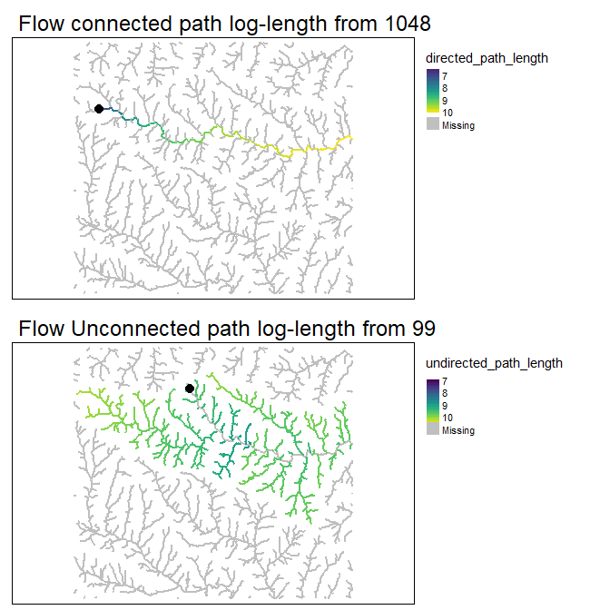

ihydro: Integrated hydrology tools for environmental science
================

-   <a href="#10-introduction" id="toc-10-introduction">1.0 Introduction</a>
-   <a href="#20-system-setup-and-installation"
    id="toc-20-system-setup-and-installation">2.0 System setup and
    installation</a>
-   <a href="#30-prepare-dem-and-sampling-points-for-for-analysis"
    id="toc-30-prepare-dem-and-sampling-points-for-for-analysis">3.0 Prepare
    DEM and Sampling Points for for analysis</a>
    -   <a href="#31-generate-toy-terrain-dataset-and-sampling-points"
        id="toc-31-generate-toy-terrain-dataset-and-sampling-points">3.1
        Generate toy terrain dataset and sampling points</a>
    -   <a href="#32-generate-predictor-layers"
        id="toc-32-generate-predictor-layers">3.2 Generate predictor layers</a>
-   <a href="#40-generate-geospatial-analysis-products"
    id="toc-40-generate-geospatial-analysis-products">4.0 Generate
    geospatial analysis products</a>
    -   <a href="#41-method-1-with-individual-function"
        id="toc-41-method-1-with-individual-function">4.1 METHOD 1: With
        individual function</a>
    -   <a href="#42-method-2-with-a-single-function"
        id="toc-42-method-2-with-a-single-function">4.2 METHOD 2: With a single
        function</a>
-   <a
    href="#50-add-layers-of-interest-to-geospatial-analysis-products-with-process_loi"
    id="toc-50-add-layers-of-interest-to-geospatial-analysis-products-with-process_loi">5.0
    Add layers of interest to geospatial analysis products with
    <code>process_loi()</code></a>
-   <a href="#60-calculate-weighted-spatial-summaries"
    id="toc-60-calculate-weighted-spatial-summaries">6.0 Calculate
    (weighted) spatial summaries</a>
    -   <a
        href="#61-at-sampleing-points-with-site-specific-attributes-attrib_points"
        id="toc-61-at-sampleing-points-with-site-specific-attributes-attrib_points">6.1
        At sampleing points with site specific attributes
        <code>attrib_points()</code></a>
    -   <a href="#62-at-all-sampling-points-attrib_points"
        id="toc-62-at-all-sampling-points-attrib_points">6.2 At all sampling
        points <code>attrib_points()</code></a>
    -   <a href="#63-across-entire-study-area-attrib_points"
        id="toc-63-across-entire-study-area-attrib_points">6.3 Across entire
        study area <code>attrib_points()</code></a>
-   <a href="#70-example-model" id="toc-70-example-model">7.0 Example
    Model</a>
    -   <a href="#71-train-a-random-forest-model"
        id="toc-71-train-a-random-forest-model">7.1 Train a Random Forest
        Model</a>
-   <a href="#80-future-plans" id="toc-80-future-plans">8.0 Future Plans</a>
-   <a href="#90-references" id="toc-90-references">9.0 References</a>

<!-- README.md is generated from README.Rmd. Please edit that file -->

## 1.0 Introduction


Aquatic environmental scientists are often interested in relating
landscape features to observed responses (e.g., fish size, water
temperature, invertebrate community composition, etc.) in streams,
rivers and lakes. The computational workflow for conducting these
investigations is complex. Simply describing how water flows and
accumulates across the landscape can be a challenge itself, but for
aquatic scientists it is only the first step. The stream network must
then be extracted from the landscape, and reaches (a.k.a. segments;
i.e., stretches of river between two confluences) identified and given
unique identifiers. These reaches must then be attributed to be
informative (e.g., slope, stream order, upstream channel length, etc.);
and upstream-downstream connectivity between reaches established.

Typically, observed responses are measured at discrete sampling
locations along the stream network. If the location information is to be
preserved (i.e., if samples are upstream and downstream of a particular
effluent outflow), they must be incorporated into the network. This is
done by splitting stream lines and catchments at these points.

Once that is done, landscape features of interest (e.g., land-cover,
geology, climate, etc.) must be related to the reach (or sampling
points). This alone can be complex as the spatial configuration of these
factors relative to flow direction and accumulation can be important
important (Peterson ***et al.***, 2011). The ***ihydro*** package uses
***hydroweight*** (Kielstra ***et al.*** 2021) to calculate these
attributes.

The complexity of this workflow can be a rate limiting step in the
scope, content, quality, and applicability of aquatic environmental
scientist investigations. The ***ihydro*** package offers tools and
workflows to simplify these complex steps. It is capable of handling all
above computation steps, leaving researchers the task of identifying
layers of interest and modeling with (potentially) large numbers of
predictors.

The ***ihydro*** package also implements descriptions of spatial
autocorrelation among sites. Due to the linear nature of flow in streams
and rivers, autocorrelation tends to be asymmetric, with sites generally
more similar when they are flow connected, than not flow connected.
***ihydro*** produces tables that can be transformed into a asymmetric
matrices that describes the relationships between sampling points based
on instream distances and/or the proportions of an upstream catchment
that is shared with a target site. Proportion of shared upstream
catchment (rather than in-stream distance) are a more relevant measure
of spatial autocorrelation in streams because it accounts for
differences in catchment areas between points, as well as spatial
proximity. For example, if water chemistry samples are taken from a
large 6th order stream, and a upstream small 1st order tributary we
would expect the small tributary to have only a small impact on the
larger stream. Hence autocorrelation should be low because the tributary
because it is not contributing much flow to the large stream. If using
in-stream distances, the assumed autocorrelation may be high because the
physical distance is small, but this would be incorrect.

***ihydro*** stores its geospatial products in a file for easy of
retrieval and plotting in external software. This can be one of the
slower aspects of the functions, as it means output need to be
compressed and added to the existing file. Many ***ihydro*** function
can be run in parallel for increased speed (if enough memory is
available), and are quick at removing internal intermediate files to
keep hard drives from filling up too fast.

[Back to top](#10-introduction)

## 2.0 System setup and installation

*WhiteboxTools* and *whitebox* are required for ***ihydro***. See
[whiteboxR](https://github.com/giswqs/whiteboxR) or below for
installation.

``` r
## Follow instructions for whitebox installation accordingly
## devtools::install_github("giswqs/whiteboxR") # For development version
## whitebox is now available on CRAN
#install.packages("whitebox")

library(whitebox)

if (F){
  install_whitebox()
  # Possible warning message:
  # ------------------------------------------------------------------------
  # Could not find WhiteboxTools!
  # ------------------------------------------------------------------------
  #
  # Your next step is to download and install the WhiteboxTools binary:
  #     > whitebox::install_whitebox()
  #
  # If you have WhiteboxTools installed already run `wbt_init(exe_path=...)`':
  #    > wbt_init(exe_path='/home/user/path/to/whitebox_tools')
  #
  # For whitebox package documentation, ask for help:
  #    > ??whitebox
  #
  # For more information visit https://giswqs.github.io/whiteboxR/
  #
  # ------------------------------------------------------------------------
}
```

[Back to top](#10-introduction)

## 3.0 Prepare DEM and Sampling Points for for analysis

### 3.1 Generate toy terrain dataset and sampling points

Begin by bringing in the digital elevation model and using it to
generate terrain products. The DEM must be processed in a way to remove
depressions. Whitebox offers methods for breaching and filling DEMs to
remove depressions. These tools must be run before applying ihydro
tools.

Another factor to consider at this step is whether to burn stream
vectors into the DEM; tool allows for this, but there are several
caveats associated with this process. See
[here](https://proceedings.esri.com/library/userconf/proc99/proceed/papers/pap802/p802.htm#Trois)

``` r
## Load libraries
library(viridis)
library(ihydro)
library(tmap)
library(furrr)
library(whitebox)
library(terra)
library(sf)
library(dplyr)

# Many function in 'ihydro' can be run in parallel internally. However it’s important to remember that
# data has to be passed back and forth between the workers. This means that whatever performance gain you might have
# gotten from your parallelization can be crushed by moving large amounts of data around. In general, passing objects
# as file paths will be faster than passing whole sf or terra objects. Not returning products directly will also speed
# up function processing time dramatically. Products can always be retrieved/read in directly from the output .zip
# file.
if (F) plan(multisession)

## Generate save_dir as a temporary directory
save_dir <- tempdir()


## Import toy_dem from openSTARS package
# devtools::install_github("MiKatt/openSTARS", ref = "dev")

ot<-system.file("extdata", "nc", "elev_ned_30m.tif", package = "openSTARS") %>% 
  rast() 

crs(ot)<-crs(rast(system.file("extdata", "nc", "landuse_r.tif", package = "openSTARS")))
writeRaster(ot,file.path(save_dir, "toy_dem1.tif"),overwrite=T)

toy_dem<-rast(file.path(save_dir, "toy_dem1.tif"))


# Bring in and process stream vector
system.file("extdata", "nc", "streams.shp", package = "openSTARS") %>% 
  vect() %>% 
  st_as_sf() %>% 
  st_transform(st_crs(toy_dem)) %>% 
  vect() %>% 
  writeVector(file.path(save_dir, "toy_streams.shp"),overwrite=T)

burn_lyr<-vect(file.path(save_dir, "toy_streams.shp")) %>% 
  rasterize(toy_dem)

# rudimentary stream burning
burn_lyr2<-toy_dem
burn_lyr2[is.na(burn_lyr)]<-NA 
burn_lyr2<-burn_lyr2-5
toy_dem[!is.na(burn_lyr2)]<-burn_lyr2[!is.na(burn_lyr2)]

writeRaster(toy_dem,file.path(save_dir, "toy_dem.tif"),overwrite=T)

## Breach depressions to ensure continuous flow
wbt_breach_depressions(
  dem = file.path(save_dir, "toy_dem.tif"),
  output = file.path(save_dir, "toy_dem_breached.tif")
)

toy_dem<-rast(file.path(save_dir, "toy_dem_breached.tif"))

## Identify some sampling points
system.file("extdata", "nc", "sites_nc.shp", package = "openSTARS") %>% 
  vect() %>% 
  st_as_sf() %>% 
  st_transform(st_crs(toy_dem)) %>% 
  vect() %>% 
  writeVector(file.path(save_dir, "sites.shp"),overwrite=T)

plot(toy_dem)
```


[Back to top](#10-introduction)

### 3.2 Generate predictor layers

``` r

## Predictors from openSTARS
system.file("extdata", "nc", "landuse_r.tif", package = "openSTARS") %>% 
  rast() %>% 
  setNames("LC") %>% 
  writeRaster(file.path(save_dir, "LC.tif"),overwrite=T)

landuse_r_path <-file.path(save_dir, "LC.tif") 
geology_path<-system.file("extdata", "nc", "geology.shp", package = "openSTARS")
pointsources_path<-system.file("extdata", "nc", "pointsources.shp", package = "openSTARS")

read_sf(pointsources_path) %>% 
  mutate(pointsource="pontsrc") %>% 
  st_buffer(60) %>% 
  write_sf(file.path(save_dir, "pointsources.shp"),overwrite=T)

pointsources_path<-file.path(save_dir, "pointsources.shp")


# Numeric Raster

wbt_slope(
  dem = file.path(save_dir, "toy_dem.tif"),
  output = file.path(save_dir, "slope.tif")
)

# Combine loi layers
output_filename_loi<-file.path(save_dir,"Processed_loi.zip")

# This function sequentially combines numeric and categorical loi layers,
# it can be run with at most 2 processes (1 numeric and 1 categorical).
# Most operations occur out of memory, but the sequential nature means 
# temporary files won't eat valuable hardrive space.
plan(multisession(workers=2))

loi_combined<-process_loi(
  dem=toy_dem,
  num_inputs=list(# Can be given as a mixture of input types (file paths, or any sf or terra format)
    slope=file.path(save_dir, "slope.tif")
  ),
  cat_inputs=list(# Can be given as a mixture of input types (file paths, or any sf or terra format)
    landcover=landuse_r_path,
    geology=geology_path,
    pointsources=pointsources_path
  ),
  variable_names=list( # any unlisted inputs will be used in their entirety
    geology="GEO_NAME",
    pointsources="pontsrc"
  ),
  output_filename=output_filename_loi,
  return_products=T,
  temp_dir=NULL,
  verbose=T
)
#> [1] "Preparing DEM"
#> [1] "Processing loi"
#> [1] "Generating Outputs"

# All layers have been transformed to rasters with 1 indicating presence, and NA for absence
plot(rast(loi_combined$cat_inputs),type="classes",col="darkgreen")
```


``` r
# Numeric Rasters
plot(rast(loi_combined$num_inputs),type="continuous")
```


[Back to top](#10-introduction)

## 4.0 Generate geospatial analysis products

### 4.1 METHOD 1: With individual function

#### 4.1.1 Generate flow direction/accumulation geospatial analysis products with `process_flowdir()`

``` r

# Outputs of all functions are always saved to output_filename by default,
# but can be included in function return with return_products=T (note this can
# be very slow for large regions)
output_filename_hydro<-file.path(save_dir,"Processed_Hydrology.zip")

# Generates d8 flow direction and accumulation, extracts streams at a specified 
# flow accumulation threshold
hydro_out<-process_flowdir(
  dem=toy_dem,
  threshold=100L,  
  return_products=T,
  output_filename=output_filename_hydro,
  temp_dir=NULL, 
  verbose=F
)

# hydro_out$outfile # -> This is the full file path of the resulting .zip file

# remaining outputs only present when `return_products` == T
# hydro_out$dem_final.tif # -> dem
# hydro_out$dem_d8.tif # -> d8 flow direction
# hydro_out$dem_accum_d8.tif # -> d8 flow accumulation (cells)
# hydro_out$dem_accum_d8_sca.tif # -> d8 flow accumulation (specific catchment areas)
# hydro_out$dem_streams_d8.tif # -> extracted streams at specified `threshold`

# if `return_products` == F, all produces are also available in the .zip file
# terra and sf allow access to files directly in the .zip file, whitebox
# requires them to be extracted to a folder

# List files present in .zip
fl<-unzip(list=T, # when list==T, contents are listed only, if F, they are extracted
          hydro_out$outfile)

flow_accum_path<-file.path("/vsizip", # "/vsizip" allows terra and sf functions to read from .zip files
                           hydro_out$outfile, # Then specify the full path to the zip file
                           fl$Name[grepl("dem_accum_d8.tif",fl$Name)] # finally specify the file to extract
)

# > flow_accum_path
# [1] "/vsizip/C:\\Users\\PSCHAE~1\\AppData\\Local\\Temp\\RtmpMnq0AY\\Processed_Hydrology.zip/dem_accum_d8.tif"

flow_accum<-rast(flow_accum_path)

plot(log10(flow_accum))
```


[Back to top](#10-introduction)

#### 4.1.2 Generate vector geospatial analysis products with `generate_vectors()`

This function combines `generate_subbasins()` and `attrib_streamline()`
to produce a number of vector layers.

``` r

plan(multisession(workers=4)) # improve processing time in some functions with parallel processing

# generates vector layers, including subbasins, stream lines, and links representing
# pour-points for each subbasin
hydro_out<-generate_vectors(
  input=hydro_out,
  return_products=T,
  temp_dir=NULL,
  verbose=F
) 

# Several important columns are used throughout the vector layers:
# `link_id` - identifies reaches/segments (steam between two confluences)
# `trib_id` - identifies streams/tributaries, with the shortest channel getting
#           # a new trib_id at a confluence, and longest channel retaining the original ID
# `uslink_id` and `dslink_id`  - columns identify upstream and downstream links
# `ustrib_id` and `dstrib_id`  - columns identify upstream and downstream tributaries

# New layers added by `generate_vectors()`
# hydro_out$subbasins # -> polygon subbasins attributed with `link_id` and reach
#                     #    contributing area (in m^2)
# hydro_out$stream_lines # -> line vectors attributed with `link_id`, `trib_id`, upstream
#                        #    and downstream link and trib IDS and a number of extra attributes
# hydro_out$points # -> point vectors along lines identifying 'nodes' (confluence
#                  #     points), vs 'links' segments joining 'nodes', and also
#                  #     attributed with `link_id`, `trib_id`, upstream
#                  #     and downstream link and trib IDS and a number of extra attributes
# hydro_out$links # -> point vector representing pour-points for subbasins,
#                 #   attributed with `link_id` and extra attributes

tm_shape(hydro_out$subbasins) + tm_polygons(col="link_id",palette = "viridis",alpha =0.2,legend.show=F) +
  tm_shape(hydro_out$stream_lines) + tm_lines(col="blue",alpha =0.5,legend.show=F,lwd =3) +
  tm_shape(hydro_out$links) + tm_dots(col="yellow",legend.show=F,size=0.15,border.col="black",border.alpha=1)
```


[Back to top](#10-introduction)

#### 4.1.3 Split vector geospatial analysis products at sampling points `insert_points()`

Typically, observed responses are measured at discrete sampling
locations along the stream network. If the location information is to be
preserved (i.e., if samples are upstream and downstream of a particular
effluent outflow), they must be incorporated into the network. This is
done by splitting stream lines and catchments at these points.

``` r

# Optional step, inserts sampling points into stream vectors, splitting subbasins
# and lines at sampling points, additional links inserted at sampling points as well
hydro_out<-insert_points( 
  input=hydro_out,
  points=file.path(save_dir, "sites.shp"),
  site_id_col="site_id", # Column in points layer that corresponds to unique IDs that will be available in data products
  snap_distance=250L,
  return_products=T,
  temp_dir=NULL,
  verbose=F
)
#> [1] "Snapping Points"
#> [1] "Splitting Subbasins"
#> [1] "Splitting Points"
#> [1] "Splitting Lines"
#> [1] "Splitting Links"

# New layers added by `insert_points()`
# hydro_out$snapped_points # -> provided points snapped to nearest segment. Any points 
#                          #   beyond snap distance are removed, with a warning. 

# This function modifies the existing vector outputs by inserting links, and 
# splitting lines/subbasins at `points`, and adds the `site_id_col` column to 
# all vector outputs. Inserted points are given "link_id' values that increment
# with decimal places from downstream to upstream directions (i.e., 10.0 remains
# the pout point for the segment, and 10.1, 10.2,... identify sample points in
# an upstream direction). 

## !!IMPORTANT!!
# If you need to rerun insert_points(), you will have to run generate_vectors() again
# first to generate new vector layers to split.

tm_shape(hydro_out$subbasins) + tm_polygons(col="white",alpha =0.2,legend.show=F) +
  tm_shape(hydro_out$stream_lines) + tm_lines(col="blue",alpha =0.5,legend.show=F,lwd =3) +
  tm_shape(hydro_out$snapped_points %>% mutate(site_id=as.numeric(site_id))) + tm_dots(col="site_id",palette = "viridis",legend.show=F,size=0.45,border.col="black",border.alpha=1,border.lwd=1)
```


[Back to top](#10-introduction)

#### 4.1.4 Create lookup table of flow-directions with `trace_flowpaths()`

To more efficiently generate catchments, look-ups are created that
identify the upstream and downstream links from each link. If
`insert_points()` was run previously, inserted points are also included
in lookups.

``` r

# Creates lookup tables of upstream and downstream flow paths
hydro_out<-trace_flowpaths(
  input=hydro_out,
  return_products=T,
  temp_dir=NULL,
  verbose=F
)
#> [1] "Generating Flowpaths"

# New layers added by `insert_points()`
# hydro_out$ds_flowpaths # -> named list of all link_ids, giving all downstream link_ids
#                        #    trib_ids, link lengths (in meters) and subbasin areas (in meters^2)
# hydro_out$us_flowpaths # -> named list of all link_ids, giving all upstream link_ids
#                        #    trib_ids, link lengths (in meters) and subbasin areas (in meters^2)

us_777<-hydro_out$us_flowpaths[["777"]] # get all upstream link_ids from link_id 777
ds_1107.1<-hydro_out$ds_flowpaths[["1107.1"]] # get all downstream link_ids from 
#                                             # link_id 1107.1 (this corresponds with site_id = 45)

lines_out<-hydro_out$stream_lines %>% 
  filter(link_id %in% us_777$link_id | 
           link_id %in% ds_1107.1$link_id 
  )
sub_out<-hydro_out$subbasins %>% 
  filter(link_id %in% us_777$link_id | 
           link_id %in% ds_1107.1$link_id
  )

tm_shape(sub_out) + tm_polygons(col="white",alpha =0.2,legend.show=F) +
  tm_shape(lines_out) + tm_lines(col="blue",alpha =0.5,legend.show=F,lwd =3) +
  tm_shape(hydro_out$links %>% filter(link_id %in% c("777","1107.1"))) + tm_dots(legend.show=F,size=0.45,border.col="black",border.alpha=1,border.lwd=1)
```


[Back to top](#10-introduction)

#### 4.1.5 Generate complete upstream catchment areas with `get_catchment()`

``` r

# Once lookup tables are calculated (not necessarily returned, can be return_products = F),
# catchments can easily be retrieved:

subbasin_catchments<-get_catchment( # retrieve catchment for an arbitrary reach
  input=hydro_out,
  site_id_col=NULL,
  target_points=c("838")
)

point_catchments<-get_catchment( # retrieve sampling point catchments
  input=hydro_out,
  site_id_col="site_id",
  target_points=c("1","25")
)

tm_shape(bind_rows(subbasin_catchments,point_catchments)) + tm_polygons(col="white",alpha =0.2,legend.show=F) +
  tm_shape(hydro_out$stream_lines) + tm_lines(col="blue",alpha =0.5,legend.show=F,lwd =3)  
```


[Back to top](#10-introduction)

#### 4.1.6 Generate pairwise distances with `generate_pwisedist()`

For more complete and thorough treatment on spatial autocorrelation in
stream systems, see [Zimmerman and Hoef
(2007)](https://www.fs.usda.gov/rm/boise/AWAE/projects/NationalStreamInternet/downloads/17ZimmermanVerHoef_TheTorgegramForFluvialVariography.pdf).

Below we calculate pairwise distances between sampled areas. We take
these distances and visualize them as heatmaps to illustrate how
pairwise distance matrices can be used to represent spatial
relationships among sites.

``` r

hydro_out<-generate_pwisedist(
  input=hydro_out,
  return_products=T,
  temp_dir=NULL,
  verbose=F
)
#> [1] "Generating Flow Connected Distances"
#> [1] "Generating Flow Unconnected Distances"

# New layers added by `generate_pwisedist()`
# hydro_out$pwise_dist # -> table of downstream path lengths between each pair of link_ids,
#                                 #    with flow-connected in-stream distances (directed_path_length),
#                                 #    flow-unconnected in-stream distances (undirected_path_length),
#                                 #    and proportions of shared catchments (prop_shared_catchment)


# Examine relationships among sampled sites. 

# Get link_id for sampled points
sel_link_id<-hydro_out$snapped_points 


# filter long table to selected sites, and convert to wide format

# This table describes the flow-connected in-stream distances at destination points (rows)
# from upstream origin points (columns)
dmat<-hydro_out$pwise_dist %>% 
  filter(origin %in% sel_link_id$link_id &
           destination %in% sel_link_id$link_id
  ) %>% 
  filter(origin!=destination) %>% 
  select(-prop_shared_catchment,-undirected_path_length) %>%
  rename(link_id=origin) %>%
  select(-origin_catchment,-destination_catchment) %>%
  mutate(directed_path_length=ifelse(directed_path_length==1 | is.na(directed_path_length),0,directed_path_length)) %>% 
  pivot_wider(names_from=destination,values_from=directed_path_length ,values_fill = 0) %>% 
  data.frame(check.names = F) %>% 
  tibble::column_to_rownames("link_id") 

# This table describes the proportions of shared catchments at destination points (rows)
# from upstream origin points (columns)
dmat2<-hydro_out$pwise_dist %>% 
  filter(origin %in% sel_link_id$link_id &
           destination %in% sel_link_id$link_id
  ) %>% 
  filter(origin!=destination) %>% 
  select(-directed_path_length,-undirected_path_length) %>%
  rename(link_id=origin) %>%
  select(-origin_catchment,-destination_catchment) %>%
  mutate(prop_shared_catchment=ifelse(prop_shared_catchment==1 | is.na(prop_shared_catchment),1,prop_shared_catchment)) %>% 
  pivot_wider(names_from=destination,values_from=prop_shared_catchment ,values_fill = 0) %>% 
  data.frame(check.names = F) %>% 
  tibble::column_to_rownames("link_id") 

# Here we multiply the matrixes (using the proportions of shared catchments as a rough weighting scheme)
# then take ln(x+1) to normalize the data a bit, calculate manhattan distances and generate a heatmap
(dmat*dmat2) %>% 
  log1p() %>% 
  dist("manhattan") %>% 
  as.matrix() %>% 
  heatmap()
```



Using these relationships, we can perform a clustering analysis to
identify groups of sites with potentially high spatial autocorrelation.
These groups could for instance be used for cross-validation purposes.

``` r

# Using the above approach, we create 5 groups of spatially proximate points
km<-(dmat*dmat2) %>% 
  log1p() %>% 
  dist("manhattan") %>% 
  hclust() %>% 
  cutree(k=5)

gps<-tibble::enframe(km,"link_id","group") %>% 
  mutate(link_id=as.numeric(link_id))

point_groups<-hydro_out$snapped_points %>% 
  left_join(gps) %>% 
  filter(!is.na(group))

# These can be used for cross-validation purposes to see how well the models extrapolate outside of 
# sampled areas

tm_shape(hydro_out$subbasins) + tm_polygons(col="white",alpha =0.2,legend.show=F) +
  tm_shape(hydro_out$stream_lines) + tm_lines(col="blue",alpha =0.3,legend.show=F,lwd =2) +
  tm_shape(point_groups) + tm_dots(col="group", palette = "Set1",legend.show=F,size=0.45,border.col="black",border.alpha=1,border.lwd=1)
```


Finally, we’ll examine relationships among our response variable in
terms of in-stream distances, contrasting flow connected sites vs, flow
unconnected sites. Here we see greater differences between responses
with increasing in-stream distance. Within the first 10,000m (10km)
range, response values are more similar in flow connected sites, than
flow unconnected.

``` r

# get response variables
response_table<-file.path(save_dir, "sites.shp") %>% 
  read_sf() %>% 
  as_tibble() %>% 
  select(site_id,value) %>% 
  left_join(hydro_out$snapped_points %>%
              as_tibble() %>% 
              select(site_id,link_id)) %>% 
  mutate(link_id=as.character(link_id))

# Combine pairwise data with values and examine spatial relationships. For more 
# precise version, see:
# https://www.fs.usda.gov/rm/boise/AWAE/projects/NationalStreamInternet/downloads/17ZimmermanVerHoef_TheTorgegramForFluvialVariography.pdf

dmat<-hydro_out$pwise_dist %>% 
  filter(origin %in% sel_link_id$link_id &
           destination %in% sel_link_id$link_id
  ) %>% 
  left_join(response_table %>% rename(origin_value=value),by=c("origin"="link_id")) %>% 
  left_join(response_table %>% rename(destination_value=value),by=c("destination"="link_id")) %>% 
  mutate(value_diff=sqrt((origin_value-destination_value)^2)) %>% 
  filter(origin!=destination) %>% 
  mutate(undirected_path_length=case_when(
    is.na(directed_path_length) ~ undirected_path_length,
    directed_path_length==0 ~ undirected_path_length,
    T ~ NA_real_
  )) %>% 
  pivot_longer(c(directed_path_length,undirected_path_length),names_to ="dist_type",values_to ="dist") %>% 
  filter(!is.na(dist)) %>% 
  mutate(`Distance Type`=case_when(
    dist_type=="directed_path_length" ~ "Flow Connected",
    dist_type=="undirected_path_length" ~ "Flow Unconnected",
  ))
#mutate(directed_path_length=ifelse(directed_path_length==1 | is.na(directed_path_length),0,directed_path_length)) %>% 
#pivot_wider(names_from=origin,values_from=prop_shared_catchment ,values_fill = 0) %>% 
#data.frame(check.names = F) %>% 
#tibble::column_to_rownames("link_id") 

require(ggplot2)
ggplot(dmat,aes(x=dist,y=value_diff,col=`Distance Type`))+
  geom_hex()+
  geom_smooth(se=F)+
  facet_wrap(~`Distance Type`)+
  theme_bw()+
  theme(legend.position = "bottom")+
  ylab("Pairwise Value Difference")+
  xlab("Pairwise Distance (m)")+
  scale_x_log10(labels=scales::comma)
```


Finally, we’ll do a similar comparison but using percent of shared
catchments. Here we expect pairwise differences to decrease as the
percent of shared catchments increases.

``` r

ggplot(dmat,aes(x=prop_shared_catchment,y=value_diff))+
  geom_hex()+
  geom_smooth(se=F)+
  theme_bw()+
  theme(legend.position = "bottom")+
  ylab("Pairwise Value Difference")+
  xlab("Percent of shared catchments (flow connected only)")+
  scale_x_continuous(labels=scales::percent)
```


[Back to top](#10-introduction)

### 4.2 METHOD 2: With a single function

#### 4.2.1 `process_hydrology()`

The entire workflow above can be accomplished with a single function:

``` r

output_filename_hydro_sparse<-file.path(save_dir,"Processed_Hydrology_sparse.zip")

# In this case we use a higher stream initiation threshold.
# We will use this layer to more quickly make predictions across the landscape.

hydro_out_sparse<-process_hydrology(
  dem=toy_dem,
  output_filename=output_filename_hydro_sparse,
  threshold=500L,
  points=hydro_out$snapped_points, 
  site_id_col="site_id",
  snap_distance = 1L, # make sure not to accidentally snap tributary points
  break_on_noSnap=F, # Will run functions with whichever points can be snapped
  pwise_dist=T,
  return_products=F,
  temp_dir=NULL,
  verbose=F
)
#> [1] "Snapping Points"
#> [1] "Splitting Subbasins"
#> [1] "Splitting Points"
#> [1] "Splitting Lines"
#> [1] "Splitting Links"
#> [1] "Generating Flowpaths"
#> [1] "Generating Flow Connected Distances"
#> [1] "Generating Flow Unconnected Distances"

# Since we didn't return the producs, we'll verify the outputs exist in the .zip file
# unzip(list=T,hydro_out_sparse$outfile)

tm_shape(read_sf(file.path("/vsizip",hydro_out_sparse$outfile,"Subbasins_poly.shp"))) + 
  tm_polygons(col="white",alpha =0.2,legend.show=F) +
  tm_shape(read_sf(file.path("/vsizip",hydro_out_sparse$outfile,"stream_lines.shp"))) +
  tm_lines(col="blue",alpha =0.3,legend.show=F,lwd =2) +
  tm_shape(read_sf(file.path("/vsizip",hydro_out_sparse$outfile,"stream_links.shp"))) +
  tm_dots(legend.show=F,size=0.45,border.col="black",border.alpha=1,border.lwd=1)
```


[Back to top](#10-introduction)

## 5.0 Add layers of interest to geospatial analysis products with `process_loi()`

Instead of processing the loi separately (as was done above), they can
instead be added to the completed workflow, and added to the existing
.zip file for convenient file storage/organization. If run separately
(as above), “num_rast.tif” and/or “cat_rast.tif” can also manually be
added to the .zip file as well.

``` r


# Here we will out our previously calculated loi results below

if (F) {
  plan(multisession(workers=2))
  hydro_out<-process_loi(
    input=hydro_out,
    num_inputs=list(# Can be given as a mixture of input types (file paths, or any sf or terra format)
      slope=file.path(save_dir, "slope.tif")
    ),
    cat_inputs=list(# Can be given as a mixture of input types (file paths, or any sf or terra format)
      landcover=landuse_r_path,
      geology=geology_path,
      pointsources=pointsources_path
    ),
    variable_names=list( # any unlisted inputs will be used in their entirety
      geology="GEO_NAME",
      pointsources="pontsrc"
    ),
    return_products=T, # these layers can get large, and it is generally not advised to return them into R 
    temp_dir=NULL,
    verbose=F
  )
}
```

[Back to top](#10-introduction)

## 6.0 Calculate (weighted) spatial summaries

### 6.1 At sampleing points with site specific attributes `attrib_points()`

``` r

# This retrieves loi names
loi<-list(numb=rast(loi_combined$num_inputs),
          cat=rast(loi_combined$cat_inputs))

loi_names<-lapply(loi,names) %>% unlist()
names(loi_names)<-loi_names

# Here we assign which summaries we would like calculated for each loi layer
loi_names<-map(loi_names,~c("distwtd_mean",  "mean", "distwtd_sd",  "min", "max"))

# A 'spec' table can be given to calculate attributes at only select sampling points,
# and/or to only calculate a subset of attributes from select sampling points
specification_table<-tibble(
  site_id=c("1","25","80"),
  loi=list(loi_names)
)
specification_table$loi[[2]]<-specification_table$loi[[2]][c(1:2)]
specification_table$loi[[2]][[1]]<-specification_table$loi[[2]][[1]][c(1:2)]

# specification_table$loi[[2]]

final_attributes_sub<-attrib_points(
  input=hydro_out,
  loi_file=output_filename_loi, #output file path from process_loi()
  spec=specification_table,
  weighting_scheme = c("lumped", "iFLO", "iFLS", "HAiFLO", "HAiFLS"),
  OS_combine=F,
  target_streamseg=F, # This will set the target_o parameter as the sampling point
  inv_function = function(x) {
    (x * 0.001 + 1)^-1
  },
  remove_region=NULL,
  return_products=T,
  temp_dir=NULL,
  verbose=F
)

# Site 25 should only contain mean and distwtd_mean variables for ruggedness
final_attributes_sub %>% 
  select(site_id,contains("slope"))
#> # A tibble: 3 × 26
#>   site_id slope_lumped…¹ slope…² slope…³ slope…⁴ slope…⁵ slope…⁶ slope…⁷ slope…⁸
#>   <chr>            <dbl>   <dbl>   <dbl>   <dbl>   <dbl>   <dbl>   <dbl>   <dbl>
#> 1 1                 3.31 0.149      15.9    3.16    2.13    3.39    2.26    3.33
#> 2 25               NA    0.00515    26.3   NA       2.93   NA       2.85   NA   
#> 3 80                3.52 0.400      10.1    3.52    2.39    4.04    2.47    3.98
#> # … with 17 more variables: slope_iFLS_distwtd_sd <dbl>,
#> #   slope_HAiFLO_distwtd_mean <dbl>, slope_HAiFLO_distwtd_sd <dbl>,
#> #   slope_HAiFLS_distwtd_mean <dbl>, slope_HAiFLS_distwtd_sd <dbl>,
#> #   slope_lumped_mean.x <dbl>, slope_lumped_distwtd_mean.x <dbl>,
#> #   slope_iFLO_distwtd_mean.x <dbl>, slope_iFLS_distwtd_mean.x <dbl>,
#> #   slope_HAiFLO_distwtd_mean.x <dbl>, slope_HAiFLS_distwtd_mean.x <dbl>,
#> #   slope_lumped_mean.y <dbl>, slope_lumped_distwtd_mean.y <dbl>, …
```

``` r

# We can also access the weighting layers and weighted attribute layers (if return_products==T)
plot(rast(
  list(rast(final_attributes_sub$distance_weights[[2]]$iFLS.tif)%>% 
         setNames("iFLS Weighting"),
       log10(rast(final_attributes_sub$distance_weights[[2]]$HAiFLS.tif))%>% 
         setNames("HAiFLS Weighting"),
       rast(final_attributes_sub$weighted_attr[[2]]$num_rast.distwtd_meandistwtd_sdmaxmeanmin.iFLS_num_rast.loi_dist_rast) %>% 
         project(rast(final_attributes_sub$distance_weights[[2]]$HAiFLS.tif)) %>% 
         setNames("iFLS Weighted Slope"),
       rast(final_attributes_sub$weighted_attr[[2]]$cat_rast.mean.iFLS_cat_rast.loi_dist_rast)[[1]] %>% 
         project(rast(final_attributes_sub$distance_weights[[2]]$HAiFLS.tif)) %>% 
         setNames("HAiFLS Weighted Landcover Class 1")
  )
))
```


[Back to top](#10-introduction)

### 6.2 At all sampling points `attrib_points()`

``` r

loi_names<-lapply(loi,names) %>% unlist()
names(loi_names)<-loi_names
loi_names<-map(loi_names,~c("distwtd_mean"))

# Here we will calculate the attributes for all sampled points
specification_table<-tibble(
  site_id=hydro_out$snapped_points$site_id,
  loi=list(loi_names)
)


final_attributes_samples<-attrib_points(
  input=hydro_out,
  loi_file=output_filename_loi,
  spec=specification_table,
  weighting_scheme = c("HAiFLO", "HAiFLS"),
  OS_combine=F,
  target_streamseg=F, # This will set the target_o parameter as the sampling point
  inv_function = function(x) {
    (x * 0.001 + 1)^-1
  },
  remove_region=NULL,
  return_products=F,
  temp_dir=NULL,
  verbose=F
)

final_attributes_samples
#> # A tibble: 60 × 37
#>    site_id distance_we…¹ weigh…² slope…³ slope…⁴ LC_1_…⁵ LC_2_…⁶ LC_3_…⁷ LC_4_…⁸
#>    <chr>   <list>        <list>    <dbl>   <dbl>   <dbl>   <dbl>   <dbl>   <dbl>
#>  1 1       <NULL>        <NULL>     3.71    3.37  0.0927       0 0       0.0428 
#>  2 11      <NULL>        <NULL>     5.71    3.97  0.179        0 1.45e-3 0.219  
#>  3 12      <NULL>        <NULL>     3.44    3.54  0.820        0 0       0      
#>  4 15      <NULL>        <NULL>     3.23    4.23  0.128        0 7.28e-4 0.0357 
#>  5 16      <NULL>        <NULL>     3.34    4.39  0.0906       0 5.89e-4 0.0256 
#>  6 17      <NULL>        <NULL>     3.35    4.39  0.125        0 9.73e-4 0.0181 
#>  7 18      <NULL>        <NULL>     3.36    4.42  0.124        0 2.03e-3 0.0128 
#>  8 19      <NULL>        <NULL>     3.71    4.35  0            0 9.24e-1 0      
#>  9 20      <NULL>        <NULL>     3.10    4.47  0.0604       0 3.05e-1 0.00915
#> 10 21      <NULL>        <NULL>     3.08    2.25  0.845        0 2.82e-2 0      
#> # … with 50 more rows, 28 more variables: LC_5_HAiFLO_prop <dbl>,
#> #   LC_6_HAiFLO_prop <dbl>, LC_7_HAiFLO_prop <dbl>,
#> #   GEO_NAME_CZam_HAiFLO_prop <dbl>, GEO_NAME_CZbg_HAiFLO_prop <dbl>,
#> #   GEO_NAME_CZfg_HAiFLO_prop <dbl>, GEO_NAME_CZg_HAiFLO_prop <dbl>,
#> #   GEO_NAME_CZig_HAiFLO_prop <dbl>, GEO_NAME_CZlg_HAiFLO_prop <dbl>,
#> #   GEO_NAME_CZve_HAiFLO_prop <dbl>, GEO_NAME_Km_HAiFLO_prop <dbl>,
#> #   pontsrc_pontsrc_HAiFLO_prop <dbl>, LC_1_HAiFLS_prop <dbl>, …
```

[Back to top](#10-introduction)

### 6.3 Across entire study area `attrib_points()`

``` r

# Warning this operation can be very slow - but we will use our sparse
# hydrology network to speed up calculations

specification_table<-tibble(
  link_id=read_sf(file.path("/vsizip",hydro_out_sparse$outfile,"stream_links.shp"))$link_id,
  loi=list(loi_names)
)

final_attributes_all<-attrib_points(
  input=hydro_out_sparse,
  spec = specification_table,
  loi_file=output_filename_loi,
  all_reaches=F, # This will calculate attributes for each reach
  weighting_scheme = c("HAiFLO", "HAiFLS"),
  loi_numeric_stats = c("distwtd_mean"),
  OS_combine=F,
  target_streamseg=T # This will set the target_o parameter as the entire reach
)

final_attributes_all
#> # A tibble: 264 × 37
#>    link_id distance_we…¹ weigh…² slope…³ slope…⁴ LC_1_…⁵ LC_2_…⁶ LC_3_…⁷ LC_4_…⁸
#>      <dbl> <list>        <list>    <dbl>   <dbl>   <dbl>   <dbl>   <dbl>   <dbl>
#>  1     213 <NULL>        <NULL>     3.41    5.00 0.00481       0 1.03e-1 1.97e-1
#>  2      15 <NULL>        <NULL>     4.32    4.32 0.102         0 3.76e-3 2.06e-2
#>  3     210 <NULL>        <NULL>     4.70    4.07 0.0355        0 1.71e-1 2.72e-2
#>  4       2 <NULL>        <NULL>     3.77    4.81 0.0846        0 2.26e-1 2.67e-2
#>  5       5 <NULL>        <NULL>     5.19    4.89 0.316         0 2.47e-1 1.25e-1
#>  6       7 <NULL>        <NULL>     4.38    4.77 0.740         0 4.52e-3 1.38e-3
#>  7      11 <NULL>        <NULL>     3.93    4.54 0.556         0 4.22e-4 0      
#>  8     211 <NULL>        <NULL>     3.71    5.09 0.00613       0 8.28e-2 1.13e-2
#>  9       1 <NULL>        <NULL>     4.27    4.66 0             0 1.67e-1 5.39e-1
#> 10     203 <NULL>        <NULL>     2.87    3.31 0.791         0 2.79e-2 4.30e-4
#> # … with 254 more rows, 28 more variables: LC_5_HAiFLO_prop <dbl>,
#> #   LC_6_HAiFLO_prop <dbl>, LC_7_HAiFLO_prop <dbl>,
#> #   GEO_NAME_CZam_HAiFLO_prop <dbl>, GEO_NAME_CZbg_HAiFLO_prop <dbl>,
#> #   GEO_NAME_CZfg_HAiFLO_prop <dbl>, GEO_NAME_CZg_HAiFLO_prop <dbl>,
#> #   GEO_NAME_CZig_HAiFLO_prop <dbl>, GEO_NAME_CZlg_HAiFLO_prop <dbl>,
#> #   GEO_NAME_CZve_HAiFLO_prop <dbl>, GEO_NAME_Km_HAiFLO_prop <dbl>,
#> #   pontsrc_pontsrc_HAiFLO_prop <dbl>, LC_1_HAiFLS_prop <dbl>, …
```

[Back to top](#10-introduction)

## 7.0 Example Model

### 7.1 Train a Random Forest Model

We’ll finish off with a brief demonstration of how to use the geospatial
products calculated above to build, and validate a predictive model.
First we’ll create a combined dataset:

``` r

# As we will ultimately be predicting to our sparse landscape, we will only keep
# autocorrelation variables that are relevant to the sparse landscape. This would
# not necessarily be required if predicting to the more dense landscape.


# get response variables
response_table<-file.path(save_dir, "sites.shp") %>% 
  read_sf() %>% 
  as_tibble() %>% 
  select(site_id,value) %>% 
  left_join(hydro_out$snapped_points %>%
              as_tibble() %>% 
              select(site_id,link_id)) %>% 
  mutate(link_id=as.character(link_id))

sub_tbl<-read_sf(file.path("/vsizip",hydro_out_sparse$outfile,"snapped_points.shp"))

sub_id_keep<-response_table %>% 
  filter(site_id %in% sub_tbl$site_id)

# Columns for spatial cross-validation
clust_data<-hydro_out$pwise_dist %>% 
  filter(origin %in% response_table$link_id &
           destination %in% sub_id_keep$link_id
  ) %>% 
  filter(origin!=destination) %>% 
  select(-prop_shared_catchment,-undirected_path_length) %>%
  rename(link_id=origin) %>%
  select(-origin_catchment,-destination_catchment) %>%
  mutate(directed_path_length=ifelse(directed_path_length==1 | is.na(directed_path_length),0,directed_path_length)) %>% 
  pivot_wider(names_from=destination,values_from=directed_path_length ,values_fill = 0) %>% 
  data.frame(check.names = F) %>% 
  tibble::column_to_rownames("link_id")  %>% 
  log1p() %>% 
  tibble::rownames_to_column("link_id") %>% 
  as_tibble() %>% 
  rename_with(.cols=c(everything(),-link_id),.fn=~paste0("CLUST_",.))

# Combine the data into a single dataset.
comb_data<-response_table %>% 
  left_join(final_attributes_samples %>%
              select(-distance_weights,-weighted_attr) %>% 
              mutate(across(c(everything(),-site_id),as.numeric)) %>% 
              mutate(across(ends_with("_prop"),~case_when(is.na(.) | is.nan(.) ~ 0, T ~ .)))   # replaces missing proportions with 0's
  ) %>% 
  left_join(
    hydro_out$pwise_dist %>%
      filter(origin %in% sub_id_keep$link_id &
               destination %in% response_table$link_id
      ) %>%
      select(origin,destination,prop_shared_catchment) %>%
      filter(origin!=destination) %>%
      rename(link_id=destination) %>%
      mutate(origin=paste0("Prop_catch_",origin)) %>%
      pivot_wider(names_from=origin,values_from=prop_shared_catchment,values_fill=0)
  ) %>%
left_join(clust_data)
```

Then, we’ll follow the tidymodels workflow from here:
<https://www.tidymodels.org/>.

``` r
#install.packages("tidymodels")
require(tidymodels)
#install.packages("recipes")
require(recipes)
#install.packages("spatialsample")
require(spatialsample)
#install.packages("ranger")
require(ranger)

# Define Model - tune 3 main parameters
rf_mod <- rand_forest(trees = tune(),
                      mtry = tune(),
                      min_n = tune()) %>% 
  set_engine("ranger",
             keep.inbag=TRUE,
             quantreg=TRUE,
             splitrule="extratrees", # for generally improved performance
             num.random.splits = 5
  ) %>% 
  set_mode("regression")

# Setup recipes, define column roles, and preprocessing steps
recip<-recipe(x=comb_data %>%
                select(-starts_with("CLUST_"),-contains("site_id"),-contains('link_id'))
) %>% 
  update_role(c(everything()),new_role="predictor") %>% 
  update_role(value,new_role="outcome") %>% 
  step_zv() %>% # remove variables with near zero variance
  step_lincomb() # remove variables that are linear combinations of other variables

# Setup Cross-Validation Strategies
set.seed(1234)
cv_strats<-list(
  standard=vfold_cv(comb_data,v=5), # standard leave group_out cross-validation
  spatial=spatial_clustering_cv(comb_data, # using spatial information to leave out groups of nearby stations
                                cluster_function = "hclust", # hclust did a decent job clustering sites previously
                                coords=colnames(comb_data)[grepl("CLUST_",colnames(comb_data))],v=5)
)

# Setup final workflow
wf<-workflow() %>%
  add_model(rf_mod) %>% 
  add_recipe(recip)

# Run cross-validation strategies 
set.seed(1234)
final_out<-future_map(cv_strats,
                      ~tune_grid(wf,resamples=.,grid=50)
)

# We expect the standard cross-validation to have higher accuracy than spatial
# cross-validation because the spatial autocorrelation variables should allow more accurate
# predictions from nearby sites

map_dfr(final_out,show_best,5,metric = "rmse",.id="Cross-validation strategy")
#> # A tibble: 10 × 10
#>    Cross-validat…¹  mtry trees min_n .metric .esti…²  mean     n std_err .config
#>    <chr>           <int> <int> <int> <chr>   <chr>   <dbl> <int>   <dbl> <chr>  
#>  1 standard           60    81    10 rmse    standa…  2.80     5   0.219 Prepro…
#>  2 standard           64  1894    11 rmse    standa…  2.83     5   0.205 Prepro…
#>  3 standard           72  1796     8 rmse    standa…  2.83     5   0.206 Prepro…
#>  4 standard           47  1462    15 rmse    standa…  2.84     5   0.207 Prepro…
#>  5 standard           54   475    10 rmse    standa…  2.84     5   0.213 Prepro…
#>  6 spatial             8  1505    37 rmse    standa…  3.03     5   0.241 Prepro…
#>  7 spatial            54   268    37 rmse    standa…  3.04     5   0.228 Prepro…
#>  8 spatial            37   573    34 rmse    standa…  3.04     5   0.230 Prepro…
#>  9 spatial            54  1798    40 rmse    standa…  3.05     5   0.236 Prepro…
#> 10 spatial            17  1188    32 rmse    standa…  3.05     5   0.237 Prepro…
#> # … with abbreviated variable names ¹​`Cross-validation strategy`, ²​.estimator
```

Next we build the final model. We will use the hyper-parameters that
yielded the highest prediction accuracy using standard cross-validation.
The spatial cross-validation may provide better predictions as the
distance from sampled areas increases, but with so few samples available
in this data, it is difficult to evaluate that aspect of the model.

``` r

# Will use rmse to select best metrics overall as it is better suited
# for model selection in this context

best_tunes<-map(final_out,select_best,1,metric = "rmse")

# Final ranger results
final_model<-finalize_workflow(wf,best_tunes$standard) %>% 
  fit(comb_data) %>% 
  extract_fit_engine()

# Overall observed vs expected leaves room for improvement, but is acceptable
# given the small data size and limited predictor consideration

tibble(
  Observed=comb_data$value,
  Predicted=predict(final_model,data=bake(prep(recip),new_data=comb_data))$predictions
) %>% 
  ggplot(aes(x=Observed,y=Predicted))+
  geom_point()+
  geom_abline(slope=1,intercept = 0) + 
  scale_x_continuous(limits=c(0,10))+
  scale_y_continuous(limits=c(0,10))+
  theme_bw()
```


Finally, we will use the model to predict across our sparse landscape.
The first step is to create a lookup table of link_ids between the two
landscapes, as link_ids are specific to the stream initiation threshold.

``` r

# link_ids won't match between the sparse and full landscapes, so need to make a lookup table
# to combine the link_ids

lkp<-read_sf(file.path("/vsizip",hydro_out_sparse$outfile,"stream_links.shp")) %>% 
  select(site_id,link_id) %>% 
  rename(sparse_link_id=link_id) %>% 
  st_join(hydro_out$links %>% select(link_id) %>%  rename(comp_link_id=link_id))
```

We now need to build a data set for our prediction sites.

``` r

prediction_data<-lkp %>% 
  as_tibble() %>% 
  mutate(comp_link_id=as.character(comp_link_id)) %>% 
  mutate(site_id=as.numeric(site_id)) %>% 
  select(link_id=sparse_link_id,comp_link_id,site_id) %>% 
  left_join(
    final_attributes_all %>%
      select(-distance_weights,-weighted_attr) %>% 
      mutate(across(c(everything()),as.numeric)) %>% 
      mutate(across(ends_with("_prop"),~case_when(is.na(.) | is.nan(.) ~ 0, T ~ .)))
  ) %>% 
  left_join(
    hydro_out$pwise_dist %>%
      filter(origin %in% sub_id_keep$link_id) %>%
      select(origin,destination,prop_shared_catchment) %>%
      filter(origin!=destination) %>%
      rename(link_id=destination) %>%
      mutate(origin=paste0("Prop_catch_",origin)) %>%
      pivot_wider(names_from=origin,values_from=prop_shared_catchment,values_fill=0),
    by=c("comp_link_id"="link_id")
  ) %>% 
  filter(!if_any(c(contains("Prop_catch"),contains("HAiFLO")),is.na))
```

And finally, we can predict across the landscape. We’ll use the range of
quantile predictions to estimate uncertainty in the model predictions.
The final map we produce here shows sampled points at thier measured
value, stream segments are coloured according to their predictied
values, and the width of the stream segment corresponds to the
uncertainty in the prediction.

``` r

prediction_tbl<-tibble(
  link_id=prediction_data$link_id) %>% 
  bind_cols(
    predict(final_model,
            data=bake(prep(recip),new_data=prediction_data),
            type ="quantiles",quantiles=c(0.25,0.5,0.75))$predictions %>% 
      as_tibble() %>% 
      setNames(c("p25","p50","p75"))
  ) %>% 
  mutate(`Uncertainty` = p75-p25,
         `Predicted`=p50)

Streams<-read_sf(file.path("/vsizip",hydro_out_sparse$outfile,"stream_lines.shp")) %>% 
  #mutate(link_id=floor(link_id)) %>% #this will assign the predicted value to the entire reach,
  #not just the unsampled portion
  left_join(prediction_tbl)

Points<-read_sf(file.path("/vsizip",hydro_out_sparse$outfile,"snapped_points.shp")) %>% 
  mutate(link_id=as.character(link_id)) %>% 
  left_join(response_table %>% select(-link_id)) %>% 
  mutate(Observed=value)

tm_shape(Streams) + 
  tm_lines(col="Predicted", palette = "viridis",alpha =0.8,legend.show=T,lwd ="Uncertainty",scale=5) +
  tm_shape(Points) + 
  tm_dots(col="Observed", palette = "viridis",legend.show=T,size=0.45,border.col="black",border.alpha=1,border.lwd=1)+
  tm_layout(legend.outside = TRUE)
```


## 8.0 Future Plans

This package is considered in early alpha, and bugs are expected. There
is lots of room for improvements in many of the functions. The core
functions may still change as the package develops and matures.

## 9.0 References

Brian W Kielstra, Robert W Mackereth, Stephanie J Melles, & Erik JS
Emilson. (2021). hydroweight: Inverse distance-weighted rasters and
landscape attributes (v1.0.0). Zenodo.
<https://doi.org/10.5281/zenodo.4728559>

Lindsay, J.B. (2016). Whitebox GAT: A case study in geomorphometric
analysis. Computers & Geosciences, 95: 75-84.
<https://doi.org/10.1016/j.cageo.2016.07.003>

Peterson, E. E., Sheldon, F., Darnell, R., Bunn, S. E., & Harch, B. D.
(2011). A comparison of spatially explicit landscape representation
methods and their relationship to stream condition. Freshwater Biology,
56(3), 590–610. <https://doi.org/10.1111/j.1365-2427.2010.02507.x>

R Core Team (2022). R: A language and environment for statistical
computing. R Foundation for Statistical Computing, Vienna, Austria.
<https://www.R-project.org/>

Wickham, H., Bryan, J. (2021). R Packages. 2nd edition.
<https://r-pkgs.org/>.

Wu, Q. (2020). whitebox: ‘WhiteboxTools’ R Frontend. R package version
1.4.0. <https://github.com/giswqs/whiteboxR>

Zimmerman, Dale L., and Jay M. Ver Hoef. (2017).”The Torgegram for
fluvial variography: characterizing spatial dependence on stream
networks. Journal of Computational and Graphical Statistics 26.2
253-264. <https://doi.org/10.1080/10618600.2016.1247006>

[Back to top](#10-introduction)
