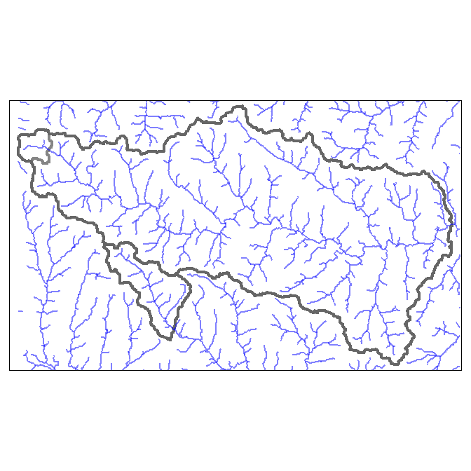
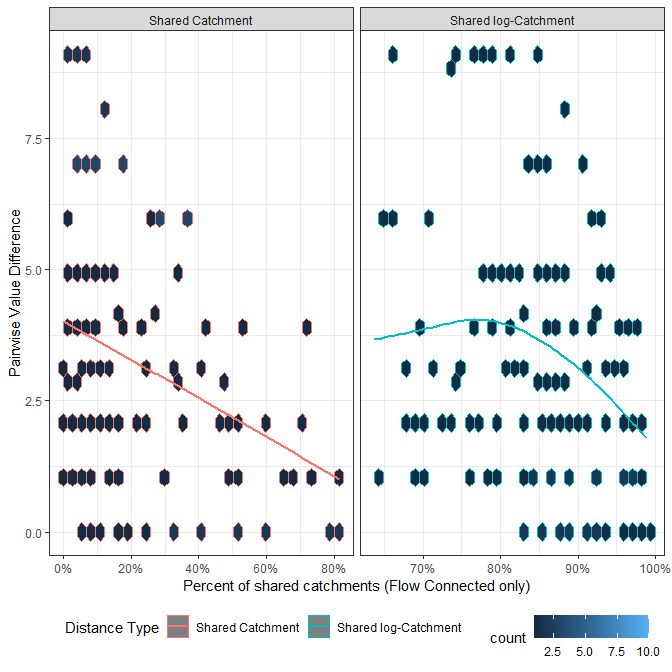
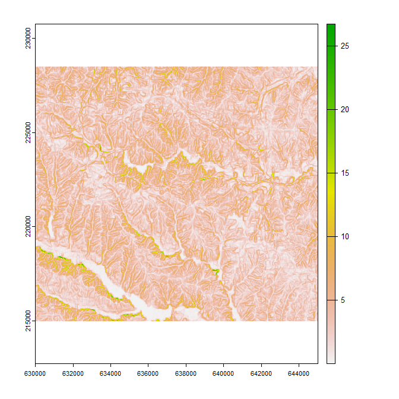

ihydro: Integrated hydrology tools for environmental science
================

-   <a href="#1-introduction" id="toc-1-introduction">1 Introduction</a>
-   <a href="#2-system-setup-and-installation"
    id="toc-2-system-setup-and-installation">2 System setup and
    installation</a>
-   <a href="#3-prepare-dem-and-sampling-points-for-analysis"
    id="toc-3-prepare-dem-and-sampling-points-for-analysis">3 Prepare DEM
    and Sampling Points for analysis</a>
    -   <a href="#31-generate-toy-terrain-dataset-and-sampling-points"
        id="toc-31-generate-toy-terrain-dataset-and-sampling-points">3.1
        Generate toy terrain dataset and sampling points</a>
    -   <a href="#32-generate-layers-of-interest"
        id="toc-32-generate-layers-of-interest">3.2 Generate layers of
        interest</a>
-   <a href="#4-generate-geospatial-analysis-products"
    id="toc-4-generate-geospatial-analysis-products">4 Generate geospatial
    analysis products</a>
    -   <a href="#41-method-1-with-individual-functions"
        id="toc-41-method-1-with-individual-functions">4.1 METHOD 1: With
        individual functions</a>
    -   <a href="#42-method-2-with-a-single-function"
        id="toc-42-method-2-with-a-single-function">4.2 METHOD 2: With a single
        function</a>
-   <a
    href="#5-add-layers-of-interest-to-geospatial-analysis-products-with-process_loi"
    id="toc-5-add-layers-of-interest-to-geospatial-analysis-products-with-process_loi">5
    Add layers of interest to geospatial analysis products with
    <code>process_loi()</code></a>
-   <a href="#6-calculate-weighted-spatial-summaries"
    id="toc-6-calculate-weighted-spatial-summaries">6 Calculate (weighted)
    spatial summaries:</a>
    -   <a href="#61-at-specific-sampling-points-with-site-specific-attributes"
        id="toc-61-at-specific-sampling-points-with-site-specific-attributes">6.1
        At specific sampling points with site specific attributes</a>
    -   <a
        href="#62-at-all-sampled-points-comparing-attrib_points-and-fasttrib_points"
        id="toc-62-at-all-sampled-points-comparing-attrib_points-and-fasttrib_points">6.2
        At all sampled points, comparing <code>attrib_points()</code> and
        <code>fasttrib_points()</code></a>
    -   <a href="#63-across-entire-study-area-fasttrib_points"
        id="toc-63-across-entire-study-area-fasttrib_points">6.3 Across entire
        study area <code>fasttrib_points()</code></a>
-   <a href="#7-example-modelling" id="toc-7-example-modelling">7 Example
    Modelling</a>
    -   <a href="#71-train-a-random-forest-model"
        id="toc-71-train-a-random-forest-model">7.1 Train a Random Forest
        Model</a>
-   <a href="#8-future-plans" id="toc-8-future-plans">8 Future Plans</a>
-   <a href="#9-references" id="toc-9-references">9 References</a>

<!-- README.md is generated from README.Rmd. Please edit that file -->
<!-- badges: start -->

[](https://lifecycle.r-lib.org/articles/stages.html#experimental)
<!-- badges: end -->

## 1 Introduction


Aquatic environmental scientists are often interested in relating
landscape features to observed responses (e.g., fish size, water
temperature, invertebrate community composition, etc.) in streams,
rivers and lakes. The computational workflow for conducting these
investigations is complex. Simply describing how water flows and
accumulates across the landscape can be a challenge itself, but for
aquatic scientists it is only the first step. The stream network must
then be extracted from the landscape, and reaches (a.k.a. segments;
i.e., stretches of river between two confluences) identified and given
unique identifiers. These reaches must then be attributed to be
informative (e.g., slope, stream order, upstream channel length, etc.);
and upstream-downstream connectivity between reaches established.

Typically, observed responses are measured at discrete sampling
locations along the stream network. If the location information is to be
preserved (i.e., if samples are upstream and downstream of a particular
effluent outflow), they must be incorporated into the network. This is
done by splitting stream lines and catchments at these points.

Once that is done, landscape features of interest (e.g., land-cover,
geology, climate, etc.) must be related to the reach (or sampling
points). This alone can be complex as the spatial configuration of these
factors relative to flow direction and accumulation can be important
(Peterson ***et al.***, 2011). The ***ihydro*** package uses
***hydroweight*** (Kielstra ***et al.*** 2021) to calculate these
attributes.

The complexity of this workflow can be a rate limiting step in the
scope, content, quality, and applicability of investigations by aquatic
environmental scientist. The ***ihydro*** package offers tools and
workflows to simplify these complex steps. It is capable of handling all
above computation steps, leaving researchers the task of identifying
layers of interest and modeling with (potentially) large numbers of
predictors.

The ***ihydro*** package also implements descriptions of spatial
autocorrelation among sites. Due to the linear nature of flow in streams
and rivers, autocorrelation tends to be asymmetric, with sites generally
more similar when they are flow connected, than not flow connected.
***ihydro*** produces tables that can be transformed into a asymmetric
matrices that describes the relationships between sampling points based
on instream distances and/or the proportions shared catchments.
Proportion of shared upstream catchment (rather than in-stream distance)
are a more relevant measure of spatial autocorrelation in streams
because it accounts for differences in catchment areas between points,
as well as spatial proximity. For example, if water chemistry samples
are taken from a large 6th order stream, and a upstream small 1st order
tributary we would expect the small tributary to have only a small
impact on the larger stream (despite its close physical proximity).
Hence, autocorrelation should be low because the tributary does not
contribute much flow to the larger stream. Using in-stream distances
alone may misrepresent this pattern.

***ihydro*** stores its geospatial products in a zip file for ease of
retrieval and extraction in external software (i.e. QGIS). Due to the
compression involved, generating, and adding results to the zip file can
be time consuming, however, many ***ihydro*** function can be run in
parallel for increased speed (if enough memory is available). The
functions are also quick at removing internal intermediate files to keep
hard drives from filling up too fast.

[Back to top](#1-introduction)

## 2 System setup and installation

*WhiteboxTools* and *whitebox* are required for ***ihydro***. See
[whiteboxR](https://github.com/giswqs/whiteboxR) or below for
installation.

``` r
## Follow instructions for whitebox installation accordingly
## devtools::install_github("giswqs/whiteboxR") # For development version
## whitebox is now available on CRAN
#install.packages("whitebox")

library(whitebox)

if (F){
  install_whitebox()
  # Possible warning message:
  # ------------------------------------------------------------------------
  # Could not find WhiteboxTools!
  # ------------------------------------------------------------------------
  #
  # Your next step is to download and install the WhiteboxTools binary:
  #     > whitebox::install_whitebox()
  #
  # If you have WhiteboxTools installed already run `wbt_init(exe_path=...)`':
  #    > wbt_init(exe_path='/home/user/path/to/whitebox_tools')
  #
  # For whitebox package documentation, ask for help:
  #    > ??whitebox
  #
  # For more information visit https://giswqs.github.io/whiteboxR/
  #
  # ------------------------------------------------------------------------
}
```

[Back to top](#1-introduction)

## 3 Prepare DEM and Sampling Points for analysis

### 3.1 Generate toy terrain dataset and sampling points

Begin by bringing in the digital elevation model and using it to
generate terrain products.

``` r
## Load libraries
library(ihydro)
library(tmap)
library(furrr)
library(whitebox)
library(terra)
library(sf)
library(dplyr)

# Many function in 'ihydro' can be run in parallel internally. However it’s 
# important to remember that data has to be passed back and forth between the 
# workers. This means that whatever performance gain you might have gotten from
# your parallelization can be crushed by moving large amounts of data around.
# Not returning products directly will speed up function processing time 
# dramatically. Products can always be retrieved/read in directly from the
# output .zip file.

# Parallelization is done through the future package, so all parallel backends
# should be supported i.e.,:
plan(multisession)

## Generate save_dir as a temporary directory
save_dir <- tempdir()


## Import toy_dem from openSTARS package
# devtools::install_github("MiKatt/openSTARS", ref = "dev")

ot<-system.file("extdata", "nc", "elev_ned_30m.tif", package = "openSTARS") %>% 
  rast() 

crs(ot)<-crs(rast(system.file("extdata", "nc", "landuse_r.tif", package = "openSTARS")))
writeRaster(ot,file.path(save_dir, "toy_dem.tif"),overwrite=T)

toy_dem<-rast(file.path(save_dir, "toy_dem.tif"))

## Identify some sampling points
system.file("extdata", "nc", "sites_nc.shp", package = "openSTARS") %>% 
  vect() %>% 
  st_as_sf() %>% 
  st_transform(st_crs(toy_dem)) %>% 
  vect() %>% 
  writeVector(file.path(save_dir, "sites.shp"),overwrite=T)

plot(toy_dem,main="Elevation")
```


[Back to top](#1-introduction)

### 3.2 Generate layers of interest

``` r

## Predictors from openSTARS
system.file("extdata", "nc", "landuse_r.tif", package = "openSTARS") %>% 
  rast() %>% 
  setNames("LC") %>% 
  writeRaster(file.path(save_dir, "LC.tif"),overwrite=T)

landuse_r_path <-file.path(save_dir, "LC.tif") 
geology_path<-system.file("extdata", "nc", "geology.shp", package = "openSTARS")
pointsources_path<-system.file("extdata", "nc", "pointsources.shp", package = "openSTARS")

read_sf(pointsources_path) %>% 
  mutate(pointsource="pontsrc") %>% 
  st_buffer(60) %>% 
  write_sf(file.path(save_dir, "pointsources.shp"),overwrite=T)

pointsources_path<-file.path(save_dir, "pointsources.shp")


# Numeric Raster

wbt_slope(
  dem = file.path(save_dir, "toy_dem.tif"),
  output = file.path(save_dir, "slope.tif")
)

# Combine loi layers
output_filename_loi<-file.path(save_dir,"Processed_loi.zip")

# This function sequentially combines numeric and categorical loi layers,
# it can be run with at most 2 processes (1 numeric and 1 categorical).
# Most operations occur out of memory, but the sequential nature means 
# temporary files won't eat valuable hardrive space.

loi_combined<-process_loi(
  dem=toy_dem,
  num_inputs=list(# Can be given as a mixture of input types (file paths, or any sf or terra format)
    slope=file.path(save_dir, "slope.tif")
  ),
  cat_inputs=list(# Can be given as a mixture of input types (file paths, or any sf or terra format)
    landcover=landuse_r_path,
    geology=geology_path,
    pointsources=pointsources_path
  ),
  variable_names=list( # any unlisted inputs will be used in their entirety
    geology="GEO_NAME",
    pointsources="pontsrc"
  ),
  output_filename=output_filename_loi,
  return_products=T,
  temp_dir=NULL,
  verbose=T
)
#> [1] "Preparing DEM"
#> [1] "Processing loi"
#> [1] "Generating Outputs"

# All layers have been transformed to rasters with 1 indicating presence, and NA for absence
plot(rast(loi_combined$cat_inputs),type="classes",col="darkgreen")
```


``` r
# Numeric Rasters
plot(rast(loi_combined$num_inputs),type="continuous")
```


[Back to top](#1-introduction)

## 4 Generate geospatial analysis products

### 4.1 METHOD 1: With individual functions

#### 4.1.1 Generate flow direction/accumulation geospatial analysis products with `process_flowdir()`

The DEM must be processed in a way to remove depressions. Whitebox
offers methods for breaching and filling DEMs to remove depressions.

Another factor to consider at this step is whether to burn stream
vectors into the DEM; ***ihydro*** impliments a simplified stream
burning method that lowers the levation along the DEM by `burn_depth`
meters. See
[here](https://proceedings.esri.com/library/userconf/proc99/proceed/papers/pap802/p802.htm#Trois)
for more detailed approaches.

``` r

# Outputs of all functions are always saved to output_filename by default,
# but can be included in function return with return_products=T (note this can
# be very slow for large regions)
output_filename_hydro<-file.path(save_dir,"Processed_Hydrology.zip")

# Generates d8 flow direction and accumulation, extracts streams at a specified 
# flow accumulation threshold
hydro_out<-process_flowdir(
  dem=toy_dem,
  burn_streams=system.file("extdata", "nc", "streams.shp", package = "openSTARS"),
  burn_depth=5,
  min_length=3,
  depression_corr="breach",
  threshold=100L,  
  return_products=T,
  output_filename=output_filename_hydro,
  temp_dir=NULL, 
  verbose=F
)

# hydro_out$outfile # -> This is the full file path of the resulting .zip file

# remaining outputs only present when `return_products` == T
# hydro_out$dem_final.tif # -> final dem after stream burning and depression correction 
# hydro_out$dem_d8.tif # -> d8 flow direction
# hydro_out$dem_accum_d8.tif # -> d8 flow accumulation (cells)
# hydro_out$dem_accum_d8_sca.tif # -> d8 flow accumulation (specific catchment areas)
# hydro_out$dem_streams_d8.tif # -> extracted streams at specified `threshold`

# if `return_products` == F, all produces are only available in the .zip file.
# Terra and sf allow access to files directly in the .zip file, whitebox
# requires them to be extracted to a folder

# List files present in .zip
fl<-unzip(list=T, # when list==T, contents are listed only, if F, they are extracted
          hydro_out$outfile)

fl
#>                   Name  Length                Date
#> 1        dem_final.tif 1804210 2022-10-02 16:32:00
#> 2           dem_d8.tif  454212 2022-10-02 16:32:00
#> 3     dem_accum_d8.tif  904212 2022-10-02 16:32:00
#> 4 dem_accum_d8_sca.tif  904212 2022-10-02 16:32:00
#> 5   dem_streams_d8.tif  904212 2022-10-02 16:32:00

flow_accum_path<-file.path("/vsizip", # "/vsizip" allows terra and sf functions to read from .zip files
                           hydro_out$outfile, # Then specify the full path to the zip file
                           fl$Name[grepl("dem_accum_d8.tif",fl$Name)] # finally specify the file to extract
)

flow_accum_path
#> [1] "/vsizip/C:\\Users\\PSCHAE~1\\AppData\\Local\\Temp\\RtmpasWeVh\\Processed_Hydrology.zip/dem_accum_d8.tif"

flow_accum<-rast(flow_accum_path)

plot(log10(flow_accum))
```


[Back to top](#1-introduction)

#### 4.1.2 Generate vector geospatial analysis products with `generate_vectors()`

This function combines `generate_subbasins()` and `attrib_streamline()`
to produce a number of vector layers.

Typically, observed responses are measured at discrete sampling
locations along the stream network. If the location information is to be
preserved (i.e., if samples are upstream and downstream of a particular
effluent outflow), they must be incorporated into the network. This is
done by splitting stream lines and catchments at these points.

``` r


# generates vector layers, including subbasins, stream lines, and links representing
# pour-points for each subbasin
hydro_out<-generate_vectors(
  input=hydro_out,
  points=file.path(save_dir, "sites.shp"), # These are optional
  site_id_col="site_id", # Column name in points layer that corresponds to 
  #                      # unique IDs that will be available in data products
  snap_distance=100L, # points that are more than 100m from closest stream are excluded
  break_on_noSnap =F, # default is to stop when any points don't snap, this will ignore that
  return_products=T,
  temp_dir=NULL,
  verbose=F
) 
#> [1] "Snapping Points"
#> [1] "Splitting Subbasins"

# Several important columns are used throughout the vector layers:
# `link_id` - identifies reaches/segments (steam between two confluences)
# `trib_id` - identifies streams/tributaries, with the shortest channel getting
#           # a new trib_id at a confluence, and longest channel retaining the original ID
# `uslink_id` and `dslink_id`  - columns identify upstream and downstream links
# `ustrib_id` and `dstrib_id`  - columns identify upstream and downstream tributaries

# If 'points' are provided, this function modifies the vector outputs by inserting
# links, and splitting lines/subbasins at `points`. Inserted points are given "link_id'
# values that increment with decimal places from downstream to upstream directions 
# (i.e., 10.0 remains the pout point for the segment, and 10.1, 10.2,... identify
# sample points in an upstream direction). 

# New layers added by `generate_vectors()`
# hydro_out$subbasins # -> polygon subbasins attributed with `link_id` and reach
#                     #    contributing area (in m^2)
# hydro_out$stream_lines # -> line vectors attributed with `link_id`, `trib_id`, upstream
#                        #    and downstream link and trib IDS and a number of extra attributes
# hydro_out$points # -> point vectors along lines identifying 'nodes' (confluence
#                  #     points), vs 'links' segments joining 'nodes', and also
#                  #     attributed with `link_id`, `trib_id`, upstream
#                  #     and downstream link and trib IDS and a number of extra attributes
# hydro_out$links # -> point vector representing pour-points for subbasins,
#                 #   attributed with `link_id` and extra attributes
# hydro_out$snapped_points # -> provided points snapped to nearest segment. Any points 
#                          #   beyond snap distance are removed, with a warning if
#                          #   break_on_noSnap == F. 

tm_shape(hydro_out$subbasins) + tm_polygons(col="link_id",palette = "viridis",alpha =0.2,legend.show=F) +
  tm_shape(hydro_out$stream_lines) + tm_lines(col="blue",alpha =0.5,legend.show=F,lwd =3) +
  tm_shape(hydro_out$links) + tm_dots(col="yellow",legend.show=F,size=0.15,border.col="black",border.alpha=1)
```


[Back to top](#1-introduction)

#### 4.1.3 Split vector geospatial analysis products at sampling points `generate_vectors()`

``` r

# Optional step, inserts sampling points into stream vectors, splitting subbasins
# and lines at sampling points, additional links inserted at sampling points as well

tm_shape(rast(hydro_out$dem_final.tif)) + tm_raster(palette = "cividis",legend.show=F) +
  tm_shape(hydro_out$stream_lines) + tm_lines(col="red",alpha =0.5,legend.show=F,lwd =2) +
  tm_shape(hydro_out$snapped_points %>% mutate(site_id=as.numeric(site_id))) +
  tm_dots(col="darkgray",legend.show=F,size=0.35,border.col="black",border.alpha=1,border.lwd=1) +
  tm_shape(read_sf(file.path(save_dir, "sites.shp"))) +
  tm_dots(col="black",legend.show=F,size=0.35,border.col="black",border.alpha=1,border.lwd=1)
```


[Back to top](#1-introduction)

#### 4.1.4 Create lookup table of flow-directions with `trace_flowpaths()`

To more efficiently generate catchments, look-ups are created that
identify the upstream and downstream links from each link. If
`insert_points()` was run previously, inserted points are also included
in lookups.

``` r

# Creates lookup tables of upstream and downstream flow paths
hydro_out<-trace_flowpaths(
  input=hydro_out,
  return_products=T,
  temp_dir=NULL,
  verbose=F
)

# New layers added by `trace_flowpaths()`
# hydro_out$db_loc       # -> sqlite database file path containing tables:
#                        #    "us_flowpaths", "ds_flowpaths", and "pairwise_dist"
# hydro_out$catchments   # -> Catchment polygons of each link_id


con <- DBI::dbConnect(RSQLite::SQLite(), hydro_out$db_loc)
DBI::dbListTables(con)
#> [1] "ds_flowpaths"  "pairwise_dist" "us_flowpaths"

hydro_out$us_flowpaths <-collect(tbl(con,"us_flowpaths"))
hydro_out$ds_flowpaths <-collect(tbl(con,"ds_flowpaths"))

DBI::dbDisconnect(con)

us_790<-hydro_out$us_flowpaths %>%
  filter(source_id == "790") # get all upstream link_ids from link_id 790
ds_145.1<-hydro_out$ds_flowpaths %>%
  filter(origin_id == "145.1") # get all downstream link_ids from 
#                              # link_id 145.1 (this corresponds with site_id = 29)

lines_out<-hydro_out$stream_lines %>% 
  filter(link_id %in% us_790$link_id | 
           link_id %in% ds_145.1$link_id 
  )
sub_out<-hydro_out$subbasins %>% 
  filter(link_id %in% us_790$link_id | 
           link_id %in% ds_145.1$link_id
  )

tm_shape(sub_out) + tm_polygons(col="white",alpha =0.2,legend.show=F) +
  tm_shape(lines_out) + tm_lines(col="blue",alpha =0.5,legend.show=F,lwd =3) +
  tm_shape(hydro_out$links %>% filter(link_id %in% c("790","145.1"))) +
  tm_dots(legend.show=F,size=0.45,border.col="black",border.alpha=1,border.lwd=1)
```



[Back to top](#1-introduction)

#### 4.1.5 Generate complete upstream catchment areas with `get_catchment()`

``` r

# Once lookup tables are calculated (not necessarily returned, can be return_products = F),
# catchments can easily be retrieved:

subbasin_catchments<-get_catchment( # retrieve catchment for an arbitrary reach
  input=hydro_out,
  site_id_col=NULL,
  target_points=c("838") 
)

point_catchments<-get_catchment( # retrieve sampling point catchments
  input=hydro_out,
  site_id_col="site_id",
  # target_points = hydro_out$snapped_points$site_id
  target_points=c("1","25")
)

tm_shape(bind_rows(subbasin_catchments,point_catchments)) + 
  tm_polygons(col="white",alpha =0.2,legend.show=F,lwd =4) +
  tm_shape(hydro_out$stream_lines) +
  tm_lines(col="blue",alpha =0.5,legend.show=F,lwd =2)  
```


[Back to top](#1-introduction)

#### 4.1.6 Examine pairwise distances

For more complete and thorough treatment on spatial autocorrelation in
stream systems, see [Zimmerman and Hoef
(2007)](https://www.fs.usda.gov/rm/boise/AWAE/projects/NationalStreamInternet/downloads/17ZimmermanVerHoef_TheTorgegramForFluvialVariography.pdf).

Below we calculate pairwise distances between sampled areas. We take
these distances and visualize them as heatmaps to illustrate how
pairwise distance matrices can be used to represent spatial
relationships among sites.

``` r

con <- DBI::dbConnect(RSQLite::SQLite(), hydro_out$db_loc)
DBI::dbListTables(con)
#> [1] "ds_flowpaths"  "pairwise_dist" "us_flowpaths"

hydro_out$pwise_dist<-collect(tbl(con,"pairwise_dist"))

DBI::dbDisconnect(con)

hydro_out$pwise_dist
#> # A tibble: 541,206 × 6
#>    origin destination directed_path_length prop_shared_catchment prop_…¹ undir…²
#>    <chr>  <chr>                      <dbl>                 <dbl>   <dbl>   <dbl>
#>  1 1      1                          132.                1         1       132. 
#>  2 10     10                          42.4               1         1        42.4
#>  3 10     1217                       192.                0.00615   0.692   192. 
#>  4 100    100                        627.                1         1       627. 
#>  5 100    1141                       862.                0.0287    0.782   862. 
#>  6 100    1135                      1122.                0.0253    0.776  1122. 
#>  7 100    1145                      1581.                0.0136    0.748  1581. 
#>  8 100    1193                      1841.                0.0124    0.744  1841. 
#>  9 100    1152                      1883.                0.0122    0.743  1883. 
#> 10 100    1210                      2233.                0.0107    0.738  2233. 
#> # … with 541,196 more rows, and abbreviated variable names
#> #   ¹​prop_shared_logcatchment, ²​undirected_path_length

# New data available in `pairwise_dist`
# pairwise_dist # -> table of downstream path lengths between each pair of link_ids,
#                   #    with flow-connected in-stream distances (directed_path_length),
#                   #    flow-unconnected in-stream distances (undirected_path_length),
#                   #    and proportions of shared catchments (prop_shared_catchment)
#                   #    and log-transformed catchment proportions (prop_shared_logcatchment)

#hydro_out$pwise_dist

# Examine relationships among sampled sites. 

# Get link_id for sampled points
sel_link_id<-hydro_out$snapped_points 

# filter long table to selected sites, and convert to wide format

# This table describes the flow-connected in-stream distances at destination points (rows)
# from upstream origin points (columns)
dmat<-hydro_out$pwise_dist %>% 
  filter(origin %in% sel_link_id$link_id &
           destination %in% sel_link_id$link_id
  ) %>% 
  filter(origin!=destination) %>% 
  select(-prop_shared_catchment,-undirected_path_length,-prop_shared_logcatchment) %>%
  rename(link_id=origin) %>%
  mutate(directed_path_length=ifelse(directed_path_length==1 | is.na(directed_path_length),0,directed_path_length)) %>% 
  distinct() %>% 
  filter(directed_path_length!=0) %>% 
  pivot_wider(names_from=destination,values_from=directed_path_length,values_fill = 0) %>% 
  data.frame(check.names = F) %>% 
  tibble::column_to_rownames("link_id") %>% 
  log1p()

head(dmat)
#>          1055.1   1040.1   1003.1   1017.1 1076.1 973.1 1058.1 1079.1 1042.1
#> 1003.1 8.967618 0.000000 0.000000 0.000000      0     0      0      0      0
#> 1017.1 9.396383 7.494625 8.379798 0.000000      0     0      0      0      0
#> 1026.1 9.548604 8.237140 8.754396 7.797961      0     0      0      0      0
#> 103.1  9.664710 8.613486 8.995312 0.000000      0     0      0      0      0
#> 1037.1 8.427519 0.000000 0.000000 0.000000      0     0      0      0      0
#> 1038.1 9.307670 0.000000 8.112417 0.000000      0     0      0      0      0
#>        1091.1 1098.1 1026.1 929.1 774.1 714.1 785.1 871.1 909.1 855.1
#> 1003.1      0      0      0     0     0     0     0     0     0     0
#> 1017.1      0      0      0     0     0     0     0     0     0     0
#> 1026.1      0      0      0     0     0     0     0     0     0     0
#> 103.1       0      0      0     0     0     0     0     0     0     0
#> 1037.1      0      0      0     0     0     0     0     0     0     0
#> 1038.1      0      0      0     0     0     0     0     0     0     0

# This table describes the proportions of shared catchments at destination points (rows)
# from upstream origin points (columns)
dmat2<-hydro_out$pwise_dist %>% 
  filter(origin %in% sel_link_id$link_id &
           destination %in% sel_link_id$link_id
  ) %>% 
  filter(origin!=destination) %>% 
  select(-directed_path_length,-undirected_path_length,-prop_shared_catchment) %>%
  rename(link_id=origin) %>%
  mutate(prop_shared_logcatchment=ifelse(prop_shared_logcatchment==1 | is.na(prop_shared_logcatchment),
                                         1,prop_shared_logcatchment)) %>% 
  distinct() %>% 
  filter(prop_shared_logcatchment!=0) %>% 
  pivot_wider(names_from=destination,values_from=prop_shared_logcatchment ,values_fill = 0) %>% 
  data.frame(check.names = F) %>% 
  tibble::column_to_rownames("link_id")

head(dmat2)
#>           1055.1    1040.1    1003.1    1017.1 1076.1 973.1 1058.1 1079.1
#> 1003.1 0.9532776 0.0000000 0.0000000 0.0000000      0     0      0      0
#> 1017.1 0.9266871 0.9860508 0.9721062 0.0000000      0     0      0      0
#> 1026.1 0.7821849 0.8322917 0.8205216 0.8440658      0     0      0      0
#> 103.1  0.6264628 0.6665940 0.6571672 0.0000000      0     0      0      0
#> 1037.1 0.6478149 0.0000000 0.0000000 0.0000000      0     0      0      0
#> 1038.1 0.7239796 0.0000000 0.7594636 0.0000000      0     0      0      0
#>        1042.1 1091.1 1098.1 1026.1 929.1 774.1 714.1 785.1 871.1 909.1 855.1
#> 1003.1      0      0      0      0     0     0     0     0     0     0     0
#> 1017.1      0      0      0      0     0     0     0     0     0     0     0
#> 1026.1      0      0      0      0     0     0     0     0     0     0     0
#> 103.1       0      0      0      0     0     0     0     0     0     0     0
#> 1037.1      0      0      0      0     0     0     0     0     0     0     0
#> 1038.1      0      0      0      0     0     0     0     0     0     0     0

# Here we multiply the matrices (using the proportions of shared catchments as a rough weighting scheme)
# calculate manhattan distances and generate a heatmap
(dmat*dmat2) %>% 
  dist("man") %>% 
  as.matrix() %>% 
  heatmap()
```


Using these relationships, we can perform a clustering analysis to
identify groups of sites with potentially high spatial autocorrelation.
These groups could for instance be used for cross-validation purposes.

``` r

# Using the above approach, we create 5 groups of spatially proximate points
km<-(dmat*dmat2) %>% 
  dist("man") %>% 
  hclust() %>% 
  cutree(k=5)

gps<-tibble::enframe(km,"link_id","group") %>% 
  mutate(link_id=as.numeric(link_id))

point_groups<-hydro_out$snapped_points %>% 
  left_join(gps) %>% 
  filter(!is.na(group))

# These can be used for cross-validation purposes to see how well the models extrapolate outside of 
# sampled areas

tm_shape(hydro_out$subbasins) + tm_polygons(col="white",alpha =0.2,legend.show=F) +
  tm_shape(hydro_out$stream_lines) + tm_lines(col="blue",alpha =0.3,legend.show=F,lwd =2) +
  tm_shape(point_groups) + tm_dots(col="group", palette = "Dark2",legend.show=T,size=0.45)+
  tm_layout(legend.outside = TRUE)
```


Finally, we’ll examine relationships among our response variable in
terms of in-stream distances, contrasting flow connected sites vs, flow
unconnected sites. Here we see greater differences between responses
with increasing in-stream distance. We expect greater similarity among
flow-connected than flow-unconnected sites, but don’t see it here. This
may be a product of this being an artificial data set.

``` r

# get response variables
response_table<-file.path(save_dir, "sites.shp") %>% 
  read_sf() %>% 
  as_tibble() %>% 
  select(site_id,value) %>% 
  left_join(hydro_out$snapped_points %>% # join by snapped sites to get link_id values
              as_tibble() %>% 
              select(site_id,link_id)) %>% 
  mutate(link_id=as.character(link_id))

# Combine pairwise data with values and examine spatial relationships. 
dmat<-hydro_out$pwise_dist %>% 
  filter(origin %in% sel_link_id$link_id &
           destination %in% sel_link_id$link_id
  ) %>% 
  # Add response values for origin and destination points into the table
  left_join(response_table %>% rename(origin_value=value),by=c("origin"="link_id")) %>% 
  left_join(response_table %>% rename(destination_value=value),by=c("destination"="link_id")) %>% 
  mutate(value_diff=sqrt((origin_value-destination_value)^2)) %>%  # Calculate the squared difference
  filter(origin!=destination) %>% 
  mutate(undirected_path_length=case_when(
    is.na(directed_path_length) ~ undirected_path_length,
    directed_path_length==0 ~ undirected_path_length,
    T ~ NA_real_
  )) %>% 
  pivot_longer(c(directed_path_length,undirected_path_length),
               names_to ="dist_type",
               values_to ="dist") %>% 
  filter(!is.na(dist)) %>% 
  mutate(`Distance Type`=case_when(
    dist_type=="directed_path_length" ~ "Flow Connected",
    dist_type=="undirected_path_length" ~ "Flow Unconnected",
  ))

dmat
#> # A tibble: 5,596 × 12
#>    origin destination prop_sha…¹ prop_…² site_…³ origi…⁴ site_…⁵ desti…⁶ value…⁷
#>    <chr>  <chr>            <dbl>   <dbl> <chr>     <dbl> <chr>     <dbl>   <dbl>
#>  1 1003.1 1055.1         0.376     0.953 20            6 25           10       4
#>  2 1017.1 1040.1         0.760     0.986 17            5 18            6       1
#>  3 1017.1 1003.1         0.573     0.972 17            5 20            6       1
#>  4 1017.1 1055.1         0.215     0.927 17            5 25           10       5
#>  5 1026.1 1017.1         0.0485    0.844 37            3 17            5       2
#>  6 1026.1 1040.1         0.0368    0.832 37            3 18            6       3
#>  7 1026.1 1003.1         0.0278    0.821 37            3 20            6       3
#>  8 1026.1 1055.1         0.0104    0.782 37            3 25           10       7
#>  9 103.1  1040.1         0.00141   0.667 62            8 18            6       2
#> 10 103.1  1003.1         0.00106   0.657 62            8 20            6       2
#> # … with 5,586 more rows, 3 more variables: dist_type <chr>, dist <dbl>,
#> #   `Distance Type` <chr>, and abbreviated variable names
#> #   ¹​prop_shared_catchment, ²​prop_shared_logcatchment, ³​site_id.x,
#> #   ⁴​origin_value, ⁵​site_id.y, ⁶​destination_value, ⁷​value_diff

require(ggplot2)
ggplot(dmat,aes(x=dist,y=value_diff,col=`Distance Type`))+
  geom_hex()+
  geom_smooth(method="gam",se=F)+
  theme_bw()+
  theme(legend.position = "bottom")+
  ylab("Pairwise Value Difference")+
  xlab("Pairwise Distance (m)")+
  scale_x_log10(labels=scales::comma)
```


Finally, we’ll do a similar comparison but using percent of shared
catchments. Here we expect pairwise differences to decrease as the
percent of shared catchments increases.

``` r

ggplot(dmat %>%
         filter(prop_shared_catchment>0) %>% 
         select(origin,destination,prop_shared_catchment,value_diff) %>%
         distinct(),
       aes(x=prop_shared_catchment,y=value_diff))+
  geom_hex()+
  geom_smooth(method="gam",se=F)+
  theme_bw()+
  theme(legend.position = "bottom")+
  ylab("Pairwise Value Difference")+
  xlab("Percent of shared catchments (Flow Connected only)")+
  scale_x_continuous(labels=scales::percent)
```


[Back to top](#1-introduction)

### 4.2 METHOD 2: With a single function

#### 4.2.1 `process_hydrology()`

The entire workflow above can be accomplished with a single function:

``` r

output_filename_hydro_sparse<-file.path(save_dir,"Processed_Hydrology_sparse.zip")

# In this case we could use a higher stream initiation threshold.
# We could use this layer to more quickly make predictions across the landscape.

hydro_out_sparse<-process_hydrology(
  dem=toy_dem,
  output_filename=output_filename_hydro_sparse,
  # burn_streams=system.file("extdata", "nc", "streams.shp", package = "openSTARS"),
  burn_depth=5,
  depression_corr="breach",
  threshold=500L,
  # points=hydro_out$snapped_points, 
  # site_id_col="site_id",
  # snap_distance = 1L, 
  break_on_noSnap=F, 
  return_products=F,
  temp_dir=NULL,
  verbose=F
)

# Since we didn't return the products, we'll verify the outputs exist in the .zip file
unzip(list=T,hydro_out_sparse$outfile)
#>                    Name  Length                Date
#> 1         dem_final.tif 1804210 2022-10-02 16:35:00
#> 2            dem_d8.tif  454212 2022-10-02 16:35:00
#> 3      dem_accum_d8.tif  904212 2022-10-02 16:35:00
#> 4  dem_accum_d8_sca.tif  904212 2022-10-02 16:35:00
#> 5    dem_streams_d8.tif  904212 2022-10-02 16:35:00
#> 6       site_id_col.csv      22 2022-10-02 16:35:00
#> 7      stream_links.csv   35955 2022-10-02 16:35:00
#> 8      stream_links.dbf    5716 2022-10-02 16:35:00
#> 9      stream_links.prj     503 2022-10-02 16:35:00
#> 10     stream_links.shp    6428 2022-10-02 16:35:00
#> 11     stream_links.shx    1908 2022-10-02 16:35:00
#> 12     stream_lines.dbf    5691 2022-10-02 16:35:00
#> 13     stream_lines.prj     503 2022-10-02 16:35:00
#> 14     stream_lines.shp   70924 2022-10-02 16:35:00
#> 15     stream_lines.shx    1900 2022-10-02 16:35:00
#> 16    stream_points.csv  797174 2022-10-02 16:35:00
#> 17    stream_points.dbf  145016 2022-10-02 16:35:00
#> 18    stream_points.prj     503 2022-10-02 16:35:00
#> 19    stream_points.shp  162444 2022-10-02 16:35:00
#> 20    stream_points.shx   46484 2022-10-02 16:35:00
#> 21   Subbasins_poly.dbf    7782 2022-10-02 16:35:00
#> 22   Subbasins_poly.prj     503 2022-10-02 16:35:00
#> 23   Subbasins_poly.shp  380032 2022-10-02 16:35:00
#> 24   Subbasins_poly.shx    1908 2022-10-02 16:35:00
#> 25   Catchment_poly.dbf   18372 2022-10-02 16:35:00
#> 26   Catchment_poly.prj     503 2022-10-02 16:35:00
#> 27   Catchment_poly.shp  997812 2022-10-02 16:35:00
#> 28   Catchment_poly.shx    1908 2022-10-02 16:35:00

tm_shape(read_sf(file.path("/vsizip",hydro_out_sparse$outfile,"Subbasins_poly.shp"))) + 
  tm_polygons(col="white",alpha =0.2,legend.show=F) +
  tm_shape(read_sf(file.path("/vsizip",hydro_out_sparse$outfile,"stream_lines.shp"))) +
  tm_lines(col="blue",alpha =0.3,legend.show=F,lwd =2) +
  tm_shape(read_sf(file.path("/vsizip",hydro_out_sparse$outfile,"stream_links.shp"))) +
  tm_dots(legend.show=F,size=0.45,border.col="black",border.alpha=1,border.lwd=1)
```



[Back to top](#1-introduction)

## 5 Add layers of interest to geospatial analysis products with `process_loi()`

Layers of interest (loi) represent the features on the landscape we are
interested in relating to the observed responses in the stream. These
can include land-cover, climate, geology, soils, NDVI, slope, etc.

Instead of processing the loi separately (as was done above), they can
instead be added to the completed workflow, and added to the existing
.zip file for convenient file storage/organization. If run separately
(as above), “num_rast.tif” and/or “cat_rast.tif” can manually be added
to the .zip file as well.

``` r

# In this case, we will use out previously calculated loi results, but if `process_loi` 
# is run with an input parameter specified, the loi rasters will be added to the
# output. This can make for convenient data storage.

if (F) {
  hydro_out<-process_loi(
    input=hydro_out,
    num_inputs=list(# Can be given as a mixture of input types (file paths, or any sf or terra format)
      slope=file.path(save_dir, "slope.tif")
    ),
    cat_inputs=list(# Can be given as a mixture of input types (file paths, or any sf or terra format)
      landcover=landuse_r_path,
      geology=geology_path,
      pointsources=pointsources_path
    ),
    variable_names=list( # any unlisted inputs will be used in their entirety
      geology="GEO_NAME",
      pointsources="pontsrc"
    ),
    return_products=T, # these layers can get large, and it is generally not advised to return them into R 
    temp_dir=NULL,
    verbose=F
  )
}
```

[Back to top](#1-introduction)

## 6 Calculate (weighted) spatial summaries:

New research is showing that the presence of particular features on the
landscape is not always sufficient to predict the in-stream response to
those features, and the location of those features relative to the
locations of streams and areas of higher flow accumulation is very
important (Peterson ***et al.*** 2011).

***ihydro*** provides 2 functions for calculating weighted spatial
summaries: `attrib_points()` and `fasttrib_points()`. `attrib_points()`
uses the [hydroweight](https://github.com/bkielstr/hydroweight) package
to calculate weighted spatial summaries of supplied loi layers. It can
be used to examine the resulting distance-weighted rasters and
distance-weighted loi layers. However, `attrib_points()` is very slow,
so `fasttrib_points()` is available for improved performance for larger
datasets.

### 6.1 At specific sampling points with site specific attributes

The `attrib_points()` function can be run with a specification table to
specify at which sites loi summaries should be calculated for, which loi
to summarize, and type of numeric summary to use for those particular
loi.

``` r

# This retrieves loi names
loi<-list(numb=rast(loi_combined$num_inputs),
          cat=rast(loi_combined$cat_inputs))

loi_names<-lapply(loi,names) %>% unlist()
names(loi_names)<-loi_names

# Here we assign which summaries we would like calculated for each loi layer
loi_names<-map(loi_names,~c("distwtd_mean",  "mean", "distwtd_sd","sd",  "min", "max"))

# A 'spec' table can be given to calculate attributes at only select sampling points,
# and/or to only calculate a subset of attributes from select sampling points
specification_table<-tibble(
  site_id=c("1","25","80"),
  loi=list(loi_names)
)
specification_table$loi[[2]]<-specification_table$loi[[2]][c(1:2)]
specification_table$loi[[2]][[1]]<-specification_table$loi[[2]][[1]][c(1:2)]

attrib_points_time_small<-system.time(
  final_attributes_sub_slow<-attrib_points(
    input=hydro_out,
    loi_file=output_filename_loi, #output file path from process_loi()
    spec=specification_table,
    weighting_scheme = c("lumped", "iFLS", "iFLO",  "HAiFLO",  "HAiFLS"),
    OS_combine=F,
    target_streamseg=F, # This will set the target_o parameter as the sampling point
    inv_function = function(x) { # Function used by hydroweight to calculate
      # spatial weights across the landscape
      (x * 0.001 + 1)^-1
    },
    remove_region=NULL,
    return_products=T,
    temp_dir=NULL,
    verbose=F
  )
)


# Site 25 should only contain mean and distwtd_mean variables for slope
final_attributes_sub_slow %>%
  select(site_id,contains("slope"))
#> # A tibble: 3 × 13
#>   site_id slope_lumped…¹ slope…² slope…³ slope…⁴ slope…⁵ slope…⁶ slope…⁷ slope…⁸
#>     <dbl>          <dbl>   <dbl>   <dbl>   <dbl>   <dbl>   <dbl>   <dbl>   <dbl>
#> 1       1           2.98   1.48    0.203   10.2     3.02   1.50     2.40   1.54 
#> 2      25           3.48  NA      NA       NA       3.36  NA        1.50  NA    
#> 3      80           2.30   0.917   0.400    5.58    2.40   0.971    1.84   0.828
#> # … with 4 more variables: slope_iFLS_distwtd_mean <dbl>,
#> #   slope_iFLS_distwtd_sd <dbl>, slope_HAiFLS_distwtd_mean <dbl>,
#> #   slope_HAiFLS_distwtd_sd <dbl>, and abbreviated variable names
#> #   ¹​slope_lumped_mean, ²​slope_lumped_sd, ³​slope_lumped_min, ⁴​slope_lumped_max,
#> #   ⁵​slope_iFLO_distwtd_mean, ⁶​slope_iFLO_distwtd_sd,
#> #   ⁷​slope_HAiFLO_distwtd_mean, ⁸​slope_HAiFLO_distwtd_sd
```

We can access the weighting layers and weighted attribute layers (if
return_products==T) of the `attrib_points()` output.

``` r

plot(
  rast(
    list(
      rast(final_attributes_sub_slow$distance_weights[[2]]$iFLS)%>%
        setNames("iFLS Weighting"),
      log10(rast(final_attributes_sub_slow$distance_weights[[2]]$HAiFLO))%>%
        setNames("log10-HAiFLO Weighting"),
      rast(final_attributes_sub_slow$weighted_attr[[2]]$num_rast.distwtd_meanmean.iFLS_num_rast.loi_dist_rast) %>%
        project(rast(final_attributes_sub_slow$distance_weights[[2]][[1]])) %>%
        setNames("iFLS Weighted Slope"),
      log10(rast(final_attributes_sub_slow$weighted_attr[[2]]$cat_rast.mean.HAiFLO_cat_rast.loi_dist_rast)) %>%
        project(rast(final_attributes_sub_slow$distance_weights[[2]][[1]])) %>%
        setNames("log10-HAiFLO Weighted Landcover Class 1")
    )
  ),
  col=viridis::viridis(101),
  axes=F
)
```



The `fasttrib_points()` function is a bit less flexible in its inputs,
but is considerably faster for larger data sets, more loi, and more
sampling points. For very small datasets `attrib_points()` may be
faster.

``` r

fasttrib_points_time_small<-system.time(
  final_attributes_sub<-fasttrib_points(
    input=hydro_out,
    loi_file=output_filename_loi,
    sample_points=c("1","25","80"),
    out_filename="subsample_points_wgtattr.csv",
    link_id=NULL,
    weighting_scheme = c("lumped", "iFLS", "iFLO",  "HAiFLO",  "HAiFLS"),
    loi_numeric_stats = c("mean", "sd",  "min", "max"),
    approx_distwtdsd=F,
    inv_function = function(x) {
      (x * 0.001 + 1)^-1
    },
    temp_dir=NULL,
    verbose=F
  )
)
```

[Back to top](#1-introduction)

### 6.2 At all sampled points, comparing `attrib_points()` and `fasttrib_points()`

``` r

attrib_points_time_big<-system.time(
  final_attributes_slow<-attrib_points(
    input=hydro_out,
    loi_file=output_filename_loi, #output file path from process_loi()
    spec=specification_table<-tibble(
      site_id=hydro_out$snapped_points$site_id,
      loi=list(loi_names)
    ),
    weighting_scheme =  c("lumped", "iFLS", "iFLO",  "HAiFLO",  "HAiFLS"),
    OS_combine=F,
    target_streamseg=F,
    inv_function = function(x) { 
      (x * 0.001 + 1)^-1
    },
    remove_region=NULL,
    return_products=F,
    temp_dir=NULL,
    verbose=F
  )
)

fasttrib_points_time_big<-system.time(
  final_attributes<-fasttrib_points(
    input=hydro_out,
    loi_file=output_filename_loi,
    sample_points=hydro_out$snapped_points$site_id, # here we generate summaries for all sampled points
    out_filename="sample_points_wgtattr.csv",
    link_id=NULL,
    weighting_scheme =  c("lumped", "iFLS", "iFLO",  "HAiFLO",  "HAiFLS"),
    loi_numeric_stats = c("mean", "sd",  "min", "max"),
    approx_distwtdsd=F,
    inv_function = function(x) {
      (x * 0.001 + 1)^-1
    },
    temp_dir=NULL,
    verbose=F
  )
)

pmap(
  list(
    list("attrib_points()","fasttrib_points()",
         "attrib_points()","fasttrib_points()"),
    list(attrib_points_time_small,
         fasttrib_points_time_small,
         attrib_points_time_big,
         fasttrib_points_time_big),
    list(final_attributes_sub_slow %>% select(-distance_weights,-weighted_attr),
         final_attributes_sub,
         final_attributes_slow %>% select(-distance_weights,-weighted_attr),
         final_attributes)),
  function(.z,.x,.y) paste0(.z," took ",
                            round(.x[[3]]/60,2),
                            " min to calculate for ",
                            nrow(.y)," reaches with ",
                            ncol(.y)-1,
                            " attributes using ", nbrOfWorkers(),
                            " cores.")
)
#> [[1]]
#> [1] "attrib_points() took 3.08 min to calculate for 3 reaches with 92 attributes using 8 cores."
#> 
#> [[2]]
#> [1] "fasttrib_points() took 3.06 min to calculate for 3 reaches with 93 attributes using 8 cores."
#> 
#> [[3]]
#> [1] "attrib_points() took 20.19 min to calculate for 255 reaches with 92 attributes using 8 cores."
#> 
#> [[4]]
#> [1] "fasttrib_points() took 4.67 min to calculate for 45 reaches with 93 attributes using 8 cores."


final_attributes
#> # A tibble: 45 × 94
#>    link_id site_id slope_lumpe…¹ slope…² slope…³ slope…⁴ LC_1_…⁵ LC_2_…⁶ LC_3_…⁷
#>    <chr>     <int>         <dbl>   <dbl>   <dbl>   <dbl>   <dbl>   <dbl>   <dbl>
#>  1 1124.1       41          2.43    1.57 0.00253   11.4    0.675       0 1.30e-1
#>  2 1118.1        1          3.04    1.46 0.203     10.2    0.304       0 9.23e-4
#>  3 103.1        62          3.13    1.81 0.0667     8.27   0.715       0 1.35e-1
#>  4 145.1        26          2.82    1.37 0.152      7.64   0.439       0 0      
#>  5 1091.1        4          3.38    1.75 0.146     12.3    0.184       0 5.26e-2
#>  6 1058.1        7          2.75    1.75 0.0323     9.97   0.504       0 6.47e-2
#>  7 1053.1        5          2.52    1.59 0.0323     7.90   0.587       0 8.05e-2
#>  8 1079.1        8          3.23    1.90 0.0323    12.3    0.275       0 5.28e-2
#>  9 1085.1       66          3.97    2.04 0.110     10.7    0.675       0 5.63e-2
#> 10 1098.1       28          3.33    1.80 0.152     10.8    0.468       0 2.15e-2
#> # … with 35 more rows, 85 more variables: LC_4_lumped_prop <dbl>,
#> #   LC_5_lumped_prop <dbl>, LC_6_lumped_prop <dbl>, LC_7_lumped_prop <dbl>,
#> #   GEO_NAME_CZam_lumped_prop <dbl>, GEO_NAME_CZbg_lumped_prop <dbl>,
#> #   GEO_NAME_CZfg_lumped_prop <dbl>, GEO_NAME_CZg_lumped_prop <dbl>,
#> #   GEO_NAME_CZig_lumped_prop <dbl>, GEO_NAME_CZlg_lumped_prop <dbl>,
#> #   GEO_NAME_CZve_lumped_prop <dbl>, GEO_NAME_Km_lumped_prop <dbl>,
#> #   pontsrc_pontsrc_lumped_prop <dbl>, slope_HAiFLS_mean <dbl>, …
```

[Back to top](#1-introduction)

### 6.3 Across entire study area `fasttrib_points()`

In order to make predictions across the landscape, we will need to
calculate our attributes across the landscape as well. We leave
`sample_points` and `link_id` as NULL to predict across all reaches. At
this point, we may also consider switching our target_o parameter from
the sampling point (as was done above) to the entire reach by setting
`target_o_type`=“segment_whole”. This will calculate all target_o
weighting schemes to be the entire reach. This may be more conservative
for predicting beyond sampling points as it integrates landscape factors
across the length of the whole reach.

``` r

full_time<-system.time(
  final_attributes_all<-fasttrib_points(
    input=hydro_out, # We could use our sparse 'hydro_out_sparse', but with fasttrib_points(), we run all reaches
    loi_file=output_filename_loi,
    sample_points=NULL, 
    link_id=NULL,
    target_o_type="segment_whole",
    out_filename="all_points_wgtattr.csv",
    weighting_scheme =  c("lumped", "iFLS", "iFLO",  "HAiFLO",  "HAiFLS"),
    loi_numeric_stats = c("mean", "sd", "max","min"),
    approx_distwtdsd=F,
    inv_function = function(x) {
      (x * 0.001 + 1)^-1
    },
    temp_dir=NULL,
    verbose=F
  )
)

final_attributes_all
#> # A tibble: 1,206 × 93
#>    link_id slope_lumpe…¹ slope…² slope…³ slope…⁴ LC_1_…⁵ LC_2_…⁶ LC_3_…⁷ LC_4_…⁸
#>    <chr>           <dbl>   <dbl>   <dbl>   <dbl>   <dbl>   <dbl>   <dbl>   <dbl>
#>  1 7                3.95    1.92    8.26  0.178   0            0  0       0.442 
#>  2 5                4.70    2.44   10.4   0.385   0            0  0       0.0955
#>  3 1209             3.99    1.91   12.7   0.0656  0.0622       0  0.0916  0.0811
#>  4 1217             4.08    2.34   15.9   0.119   0.178        0  0.0585  0.0943
#>  5 1215             3.58    2.22   14.5   0.0485  0.101        0  0.294   0.0738
#>  6 1                4.65    2.19    9.09  1.11    0.0863       0  0.612   0.137 
#>  7 1206             3.66    2.17   12.9   0.117   0.267        0  0.313   0.0678
#>  8 3                3.45    1.78    8.18  0.296   0.769        0  0.0410  0     
#>  9 1207             4.33    2.60   17.8   0.162   0.302        0  0.423   0.0995
#> 10 33               4.55    2.77   15.0   0.204   0.329        0  0.0416  0.138 
#> # … with 1,196 more rows, 84 more variables: LC_5_lumped_prop <dbl>,
#> #   LC_6_lumped_prop <dbl>, LC_7_lumped_prop <dbl>,
#> #   GEO_NAME_CZam_lumped_prop <dbl>, GEO_NAME_CZbg_lumped_prop <dbl>,
#> #   GEO_NAME_CZfg_lumped_prop <dbl>, GEO_NAME_CZg_lumped_prop <dbl>,
#> #   GEO_NAME_CZig_lumped_prop <dbl>, GEO_NAME_CZlg_lumped_prop <dbl>,
#> #   GEO_NAME_CZve_lumped_prop <dbl>, GEO_NAME_Km_lumped_prop <dbl>,
#> #   pontsrc_pontsrc_lumped_prop <dbl>, slope_HAiFLS_mean <dbl>, …

paste0(round(full_time[[3]]/60,2),
       " min to calculate attributes for ",
       nrow(final_attributes_all)," reaches with ",
       ncol(final_attributes_all)-1,
       " attributes using ", nbrOfWorkers(),
       " cores.")
#> [1] "21.47 min to calculate attributes for 1206 reaches with 92 attributes using 8 cores."

# Plot some attributes along their respective stream lines for visualization:
targ_param<-c("slope_lumped_mean","slope_iFLS_mean","slope_HAiFLO_mean",
              "LC_1_lumped_prop","LC_1_iFLS_prop","LC_1_HAiFLO_prop", 
              "GEO_NAME_CZfg_lumped_prop","GEO_NAME_CZfg_iFLS_prop","GEO_NAME_CZfg_HAiFLO_prop")

targ_param_nm<-paste0(
  rep(c("Lumped-Weighted\n","iFLS-Weighted\n","HAiFLO-Weighted\n"),length.out=9),
  rep(c("mean Slope","% LC-1","% Geoclass-CZfg"),each=3)
)

attr_lines<-hydro_out$stream_lines %>%
  mutate(link_id=floor(link_id)) %>% 
  group_by(link_id) %>%              
  summarize(geometry=st_union(geometry)) %>%
  ungroup() %>% 
  mutate(link_id=as.character(link_id)) %>% 
  left_join(final_attributes_all) %>% 
  select(any_of(targ_param))

pout<-map2(targ_param,targ_param_nm,function(x,y) tm_shape(attr_lines) +
             tm_lines(col=x,
                      palette = "viridis",
                      alpha =0.8,
                      legend.col.show=F,
                      legend.lwd.show=F,
                      scale=1)+
             tm_layout(main.title=y,main.title.size=1)
)

tmap_arrange(pout,ncol=3)
```


[Back to top](#1-introduction)

## 7 Example Modelling

### 7.1 Train a Random Forest Model

We’ll finish off with a brief demonstration of how to use the geospatial
products calculated above to build, and validate a predictive model.
First we’ll create a combined dataset:

``` r

# As we will ultimately be predicting to our sparse landscape, we will only keep
# autocorrelation variables that are relevant to the sparse landscape. This would
# not necessarily be required if predicting to the more dense landscape.


# get response variables
response_table<-file.path(save_dir, "sites.shp") %>% 
  read_sf() %>% 
  as_tibble() %>% 
  select(site_id,value) %>% 
  left_join(hydro_out$links %>%
              as_tibble() %>% 
              select(site_id,link_id) %>% 
              mutate(site_id=as.character(site_id))) %>% 
  mutate(link_id=as.character(link_id)) %>% 
  filter(!is.na(link_id))

response_table
#> # A tibble: 45 × 3
#>    site_id value link_id
#>    <chr>   <dbl> <chr>  
#>  1 1           1 1118.1 
#>  2 4           1 1091.1 
#>  3 5           1 1053.1 
#>  4 7           1 1058.1 
#>  5 8           1 1079.1 
#>  6 11          2 1042.1 
#>  7 12          3 1076.1 
#>  8 15          4 973.1  
#>  9 17          5 1017.1 
#> 10 18          6 1040.1 
#> # … with 35 more rows

# Columns for spatial cross-validation
# Here we will use a matrix of directed path lengths to perform the
# spatial cross-validation:
clust_data<-hydro_out$pwise_dist %>% 
  filter(origin %in% response_table$link_id) %>% 
  filter(origin!=destination) %>% 
  select(-prop_shared_catchment,-undirected_path_length,-prop_shared_logcatchment) %>%
  rename(link_id=origin) %>%
  mutate(directed_path_length=ifelse(directed_path_length==1 | is.na(directed_path_length),0,directed_path_length)) %>% 
  distinct() %>% 
  filter(directed_path_length!=0) %>% 
  pivot_wider(names_from=destination,values_from=directed_path_length ,values_fill = 0) %>% 
  data.frame(check.names = F) %>% 
  tibble::column_to_rownames("link_id")  %>% 
  log1p() %>% 
  tibble::rownames_to_column("link_id") %>% 
  as_tibble() %>% 
  rename_with(.cols=c(everything(),-link_id),.fn=~paste0("CLUST_",.))

clust_data
#> # A tibble: 45 × 198
#>    link_id CLUST_1003 CLUST_1020 CLUST…¹ CLUST…² CLUST…³ CLUST…⁴ CLUST…⁵ CLUST…⁶
#>    <chr>        <dbl>      <dbl>   <dbl>   <dbl>   <dbl>   <dbl>   <dbl>   <dbl>
#>  1 1003.1        5.75       6.45    7.19    7.22    7.39    7.58    7.79    7.81
#>  2 1017.1        8.42       8.48    8.62    8.62    8.67    8.72    8.80    8.80
#>  3 1026.1        8.78       8.83    8.92    8.93    8.96    9.00    9.06    9.06
#>  4 103.1         9.01       9.05    9.13    9.13    9.16    9.20    9.24    9.25
#>  5 1037.1        0          0       0       0       0       0       0       0   
#>  6 1038.1        8.16       8.24    8.41    8.42    8.47    8.54    8.63    8.64
#>  7 1040.1        8.08       8.17    8.35    8.36    8.42    8.49    8.58    8.59
#>  8 1042.1        9.38       9.41    9.46    9.47    9.48    9.51    9.54    9.55
#>  9 1053.1        9.71       9.73    9.77    9.77    9.79    9.81    9.83    9.83
#> 10 1055.1        0          0       0       0       0       0       0       0   
#> # … with 35 more rows, 189 more variables: CLUST_970 <dbl>, CLUST_950 <dbl>,
#> #   CLUST_976 <dbl>, CLUST_1150 <dbl>, CLUST_953 <dbl>, CLUST_977 <dbl>,
#> #   CLUST_994 <dbl>, CLUST_968 <dbl>, CLUST_981 <dbl>, CLUST_920 <dbl>,
#> #   CLUST_1067 <dbl>, CLUST_960 <dbl>, CLUST_969 <dbl>, CLUST_990 <dbl>,
#> #   CLUST_1055.1 <dbl>, CLUST_1055 <dbl>, CLUST_1088 <dbl>, CLUST_980 <dbl>,
#> #   CLUST_1017 <dbl>, CLUST_1130 <dbl>, CLUST_1040.1 <dbl>, CLUST_1040 <dbl>,
#> #   CLUST_992 <dbl>, CLUST_1084 <dbl>, CLUST_1016 <dbl>, CLUST_971 <dbl>, …

# Combine the data into a single dataset.
comb_data<-response_table %>% 
  left_join(
    final_attributes %>% mutate(site_id=as.character(site_id))   # replaces missing proportions with 0's
  ) %>% 
  left_join(
    hydro_out$pwise_dist %>%
      filter(origin %in% response_table$link_id) %>%
      select(origin,destination,prop_shared_catchment) %>%
      filter(origin!=destination) %>%
      rename(link_id=destination) %>%
      mutate(origin=paste0("Prop_catch_",origin))%>%
      mutate(prop_shared_catchment=ifelse(prop_shared_catchment==1 | is.na(prop_shared_catchment),0,prop_shared_catchment)) %>% 
      distinct() %>% 
      filter(prop_shared_catchment!=0) %>%
      pivot_wider(names_from=origin,values_from=prop_shared_catchment,values_fill=0)
  ) %>%
  left_join(clust_data) %>% 
  filter(!is.na(link_id)) %>% 
  mutate(across(starts_with("Prop_catch_"),~ifelse(is.na(.),0,.)))

comb_data
#> # A tibble: 45 × 337
#>    site_id value link_id slope…¹ slope…² slope…³ slope…⁴ LC_1_…⁵ LC_2_…⁶ LC_3_…⁷
#>    <chr>   <dbl> <chr>     <dbl>   <dbl>   <dbl>   <dbl>   <dbl>   <dbl>   <dbl>
#>  1 1           1 1118.1     3.04    1.46 0.203     10.2    0.304       0 9.23e-4
#>  2 4           1 1091.1     3.38    1.75 0.146     12.3    0.184       0 5.26e-2
#>  3 5           1 1053.1     2.52    1.59 0.0323     7.90   0.587       0 8.05e-2
#>  4 7           1 1058.1     2.75    1.75 0.0323     9.97   0.504       0 6.47e-2
#>  5 8           1 1079.1     3.23    1.90 0.0323    12.3    0.275       0 5.28e-2
#>  6 11          2 1042.1     3.42    2.22 0.0323    22.8    0.261       0 4.82e-2
#>  7 12          3 1076.1     3.35    2.16 0.0323    22.8    0.372       0 4.22e-2
#>  8 15          4 973.1      3.66    2.43 0.00216   22.8    0.315       0 4.33e-2
#>  9 17          5 1017.1     3.75    2.40 0.00216   22.8    0.326       0 4.45e-2
#> 10 18          6 1040.1     3.78    2.37 0.00216   22.8    0.386       0 4.51e-2
#> # … with 35 more rows, 327 more variables: LC_4_lumped_prop <dbl>,
#> #   LC_5_lumped_prop <dbl>, LC_6_lumped_prop <dbl>, LC_7_lumped_prop <dbl>,
#> #   GEO_NAME_CZam_lumped_prop <dbl>, GEO_NAME_CZbg_lumped_prop <dbl>,
#> #   GEO_NAME_CZfg_lumped_prop <dbl>, GEO_NAME_CZg_lumped_prop <dbl>,
#> #   GEO_NAME_CZig_lumped_prop <dbl>, GEO_NAME_CZlg_lumped_prop <dbl>,
#> #   GEO_NAME_CZve_lumped_prop <dbl>, GEO_NAME_Km_lumped_prop <dbl>,
#> #   pontsrc_pontsrc_lumped_prop <dbl>, slope_HAiFLS_mean <dbl>, …
```

Then, we’ll follow the tidymodels workflow from here:
<https://www.tidymodels.org/>.

``` r
#install.packages("tidymodels")
require(tidymodels)
#install.packages("recipes")
require(recipes)
#install.packages("spatialsample")
require(spatialsample)
#install.packages("ranger")
require(ranger)

# Define Model - tune 3 main parameters
rf_mod <- rand_forest(trees = tune(),
                      mtry = tune(),
                      min_n = tune()) %>% 
  set_engine("ranger",
             keep.inbag=TRUE,
             quantreg=TRUE,
             splitrule="extratrees", # for generally improved accuracy
             num.random.splits = 5
  ) %>% 
  set_mode("regression")

# Setup recipes, define column roles, and preprocessing steps
recip<-recipe(x=comb_data %>%
                select(-starts_with("CLUST_"),
                       -contains("site_id"),
                       -contains('link_id'))
) %>% 
  update_role(c(everything()),new_role="predictor") %>% 
  update_role(value,new_role="outcome") %>% 
  step_zv() %>% # remove variables with zero variance
  step_lincomb() # remove variables that are linear combinations of other 
#                # variables (can happen with proportional variables)

# Setup Cross-Validation Strategies
set.seed(1234)
cv_strats<-list(
  standard=vfold_cv(comb_data,v=5), # standard random leave group_out cross-validation
  spatial=spatial_clustering_cv(
    comb_data, # using spatial information to leave out groups of nearby stations
    cluster_function = "hclust", # hclust did a decent job clustering sites previously
    coords=colnames(comb_data)[grepl("CLUST_",colnames(comb_data))],v=5)
)

# Map hold-out data for each cross-validation fold
spatial_cv<-map2(cv_strats$spatial$splits,1:length(cv_strats$spatial$splits),function(x,y) {
  tm_shape(hydro_out$stream_lines)+
    tm_lines(col="blue",alpha =0.3,legend.show=F,lwd =2)+
    tm_shape(hydro_out$links[hydro_out$links$link_id %in% assessment(x)$link_id,]) +
    tm_dots(legend.show=F,size=0.3,border.col="black",border.alpha=1,border.lwd=1) +
    tm_layout(paste0("Spatial CV",y))
})

standard_cv<-map2(cv_strats$standard$splits,1:length(cv_strats$standard$splits),function(x,y) {
  tm_shape(hydro_out$stream_lines)+
    tm_lines(col="blue",alpha =0.3,legend.show=F,lwd =2)+
    tm_shape(hydro_out$links[hydro_out$links$link_id %in% assessment(x)$link_id,]) +
    tm_dots(legend.show=F,size=0.3,border.col="black",border.alpha=1,border.lwd=1) +
    tm_layout(paste0("Standard CV",y))
})

tmap_arrange(c(spatial_cv,standard_cv),ncol=5)
```


We see the spatial-cross validation hold-out sites cluster nicely
together, whereas the standard cross-validation are randomly distributed
across the region. Depending on the purpose of the model, we may favour
one type of cross-validation over another.

``` r

# Setup final workflow
wf<-workflow() %>%
  add_model(rf_mod) %>% 
  add_recipe(recip)

# Run cross-validation strategies 

# tune_grid() can only work in parallel with the doParallel package
plan(sequential)

library(doParallel)
cl <- makeCluster(8)
registerDoParallel(cl)
set.seed(1234)

final_out<-map(cv_strats,
               ~tune_grid(wf,resamples=.,
                          grid=50  # Choose 50 hyper-parameter configurations
                          ) 
)

stopCluster(cl)
# We expect the standard cross-validation to have higher accuracy than spatial
# cross-validation because the spatial autocorrelation variables should allow more accurate
# predictions from nearby sites. Conversely, the spatial cross-validation models
# show the best possible accuracy for predicting beyond the spatial extents of 
# Where the data was collected.

map_dfr(final_out,show_best,5,metric = "rmse",.id="Cross-validation strategy")
#> # A tibble: 10 × 10
#>    Cross-validat…¹  mtry trees min_n .metric .esti…²  mean     n std_err .config
#>    <chr>           <int> <int> <int> <chr>   <chr>   <dbl> <int>   <dbl> <chr>  
#>  1 standard           54    54    10 rmse    standa…  2.94     4  0.161  Prepro…
#>  2 standard            2   827    18 rmse    standa…  2.97     5  0.0928 Prepro…
#>  3 standard            8  1720     3 rmse    standa…  2.98     5  0.161  Prepro…
#>  4 standard           11  1992    28 rmse    standa…  2.99     5  0.0979 Prepro…
#>  5 standard            5   981    30 rmse    standa…  2.99     5  0.0840 Prepro…
#>  6 spatial            90  1051    40 rmse    standa…  2.96     5  0.350  Prepro…
#>  7 spatial           114  1284    36 rmse    standa…  2.96     5  0.335  Prepro…
#>  8 spatial            35  1627    38 rmse    standa…  2.97     5  0.339  Prepro…
#>  9 spatial            10   651    30 rmse    standa…  2.97     5  0.282  Prepro…
#> 10 spatial            44  1941    39 rmse    standa…  2.98     5  0.340  Prepro…
#> # … with abbreviated variable names ¹​`Cross-validation strategy`, ²​.estimator
```

Next we build the final model. We will use the hyper-parameters that
yielded the highest prediction accuracy using spatial cross-validation.
The spatial cross-validation may provide better predictions as the
distance from sampled areas increases, but with so few samples available
in this data, it is difficult to evaluate that aspect of the model.

``` r

# We will use rmse to select best metrics overall as it is better suited
# for model selection in this context than r^2

best_tunes<-map(final_out,select_by_pct_loss,1,metric = "rmse")

best_tunes
#> $standard
#> # A tibble: 1 × 11
#>    mtry trees min_n .metric .estimator  mean     n std_err .config   .best .loss
#>   <int> <int> <int> <chr>   <chr>      <dbl> <int>   <dbl> <chr>     <dbl> <dbl>
#> 1    12  1571    34 rmse    standard    3.00     5  0.0856 Preproce…  2.94  1.98
#> 
#> $spatial
#> # A tibble: 1 × 11
#>    mtry trees min_n .metric .estimator  mean     n std_err .config   .best .loss
#>   <int> <int> <int> <chr>   <chr>      <dbl> <int>   <dbl> <chr>     <dbl> <dbl>
#> 1   126   685    26 rmse    standard    3.01     5   0.249 Preproce…  2.96  1.75

# Final ranger results
final_model<-finalize_workflow(wf,best_tunes$spatial) %>% 
  fit(comb_data) %>% 
  extract_fit_engine()

# Overall observed vs expected leaves room for improvement, but is acceptable
# given the small data size and limited predictor consideration

tibble(
  Observed=comb_data$value,
  Predicted=predict(final_model,data=bake(prep(recip),new_data=comb_data))$predictions
) %>% 
  ggplot(aes(x=Observed,y=Predicted))+
  geom_point()+
  geom_abline(slope=1,intercept = 0) + 
  scale_x_continuous(limits=c(0,10))+
  scale_y_continuous(limits=c(0,10))+
  theme_bw()
```


Finally, we will use the model to predict across the whole landscape.
First we’ll assemble a table to predict from:

``` r

prediction_data<-final_attributes_all %>% 
  left_join(
    # Add spatial autocorrelation variables
    hydro_out$pwise_dist %>%
      filter(origin %in% response_table$link_id) %>%
      select(origin,destination,prop_shared_catchment) %>%
      filter(origin!=destination) %>%
      rename(link_id=destination) %>%
      mutate(origin=paste0("Prop_catch_",origin)) %>%
      mutate(prop_shared_catchment=ifelse(prop_shared_catchment==1 | is.na(prop_shared_catchment),0,prop_shared_catchment)) %>% 
      distinct() %>% 
      filter(prop_shared_catchment!=0) %>%
      pivot_wider(names_from=origin,values_from=prop_shared_catchment,values_fill=0),
    by=c("link_id")
  ) %>% 
  mutate(across(starts_with("Prop_catch_"),~ifelse(is.na(.),0,.)))

prediction_data
#> # A tibble: 1,206 × 138
#>    link_id slope_lumpe…¹ slope…² slope…³ slope…⁴ LC_1_…⁵ LC_2_…⁶ LC_3_…⁷ LC_4_…⁸
#>    <chr>           <dbl>   <dbl>   <dbl>   <dbl>   <dbl>   <dbl>   <dbl>   <dbl>
#>  1 7                3.95    1.92    8.26  0.178   0            0  0       0.442 
#>  2 5                4.70    2.44   10.4   0.385   0            0  0       0.0955
#>  3 1209             3.99    1.91   12.7   0.0656  0.0622       0  0.0916  0.0811
#>  4 1217             4.08    2.34   15.9   0.119   0.178        0  0.0585  0.0943
#>  5 1215             3.58    2.22   14.5   0.0485  0.101        0  0.294   0.0738
#>  6 1                4.65    2.19    9.09  1.11    0.0863       0  0.612   0.137 
#>  7 1206             3.66    2.17   12.9   0.117   0.267        0  0.313   0.0678
#>  8 3                3.45    1.78    8.18  0.296   0.769        0  0.0410  0     
#>  9 1207             4.33    2.60   17.8   0.162   0.302        0  0.423   0.0995
#> 10 33               4.55    2.77   15.0   0.204   0.329        0  0.0416  0.138 
#> # … with 1,196 more rows, 129 more variables: LC_5_lumped_prop <dbl>,
#> #   LC_6_lumped_prop <dbl>, LC_7_lumped_prop <dbl>,
#> #   GEO_NAME_CZam_lumped_prop <dbl>, GEO_NAME_CZbg_lumped_prop <dbl>,
#> #   GEO_NAME_CZfg_lumped_prop <dbl>, GEO_NAME_CZg_lumped_prop <dbl>,
#> #   GEO_NAME_CZig_lumped_prop <dbl>, GEO_NAME_CZlg_lumped_prop <dbl>,
#> #   GEO_NAME_CZve_lumped_prop <dbl>, GEO_NAME_Km_lumped_prop <dbl>,
#> #   pontsrc_pontsrc_lumped_prop <dbl>, slope_HAiFLS_mean <dbl>, …
```

And finally, we can predict across the landscape. We’ll use the range of
quantile predictions to estimate uncertainty in the model predictions.
The final map we produce here shows sampled points at their measured
value, stream segments are coloured according to their predicted values,
and the width of the stream segment corresponds to the uncertainty in
the prediction.

``` r

prediction_tbl<-tibble(
  link_id=prediction_data$link_id) %>% 
  bind_cols(
    predict(final_model,
            data=bake(prep(recip),new_data=prediction_data),
            type ="quantiles",quantiles=c(0.25,0.5,0.75))$predictions %>% 
      as_tibble() %>% 
      setNames(c("p25","p50","p75"))
  ) %>% 
  mutate(`Uncertainty` = p75-p25,
         `Predicted`=p50) 

prediction_tbl
#> # A tibble: 1,206 × 6
#>    link_id   p25   p50   p75 Uncertainty Predicted
#>    <chr>   <dbl> <dbl> <dbl>       <dbl>     <dbl>
#>  1 7           1     3     6           5         3
#>  2 5           1     3     6           5         3
#>  3 1209        1     2     4           3         2
#>  4 1217        1     2     4           3         2
#>  5 1215        1     3     6           5         3
#>  6 1           3     4     8           5         4
#>  7 1206        1     3     6           5         3
#>  8 3           3     7     8           5         7
#>  9 1207        3     4     8           5         4
#> 10 33          1     3     6           5         3
#> # … with 1,196 more rows

# Since we only have predictions for entire stream segments
# This will merge and breaks in stream lines
Streams<-read_sf(file.path("/vsizip",hydro_out$outfile,"stream_lines.shp")) %>% 
  mutate(link_id=floor(link_id)) %>% 
  group_by(link_id) %>%              
  summarize(geometry=st_union(geometry)) %>%
  ungroup() %>% 
  mutate(link_id=as.character(link_id)) 

Streams<-Streams %>% 
  left_join(prediction_tbl)

Points<-read_sf(file.path("/vsizip",hydro_out$outfile,"snapped_points.shp")) %>% 
  mutate(link_id=as.character(link_id)) %>% 
  left_join(response_table %>% select(-link_id)) %>% 
  filter(!is.na(link_id)) %>% 
  mutate(Observed=value)

tm_shape(Streams) + 
  tm_lines(col="Predicted",
           palette = "viridis",
           alpha =0.8,
           style="fixed",
           breaks =c(0,2,4,6,8,10),
           legend.show=T,
           lwd ="Uncertainty",
           scale=3) +
  tm_shape(Points) + 
  tm_dots(col="Observed", 
          palette = "viridis",
          legend.show=T,
          style="fixed",
          breaks =c(0,2,4,6,8,10),
          size=0.45,
          border.col="black",
          border.alpha=1,
          border.lwd=1)+
  tm_layout(legend.outside = TRUE)
```


## 8 Future Plans

This package is considered in early alpha, and bugs are expected. There
is lots of room for improvements in many of the functions. The core
functions may still change as the package develops and matures.

-   One big area of improvement will be the handling of the output .zip
    file structure.
-   output .zip may be replaced by a spatialite database file.
-   Many functions can be cleaned and optimized further.

## 9 References

Brian W Kielstra, Robert W Mackereth, Stephanie J Melles, & Erik JS
Emilson. (2021). hydroweight: Inverse distance-weighted rasters and
landscape attributes (v1.0.0). Zenodo.
<https://doi.org/10.5281/zenodo.4728559>

Lindsay, J.B. (2016). Whitebox GAT: A case study in geomorphometric
analysis. Computers & Geosciences, 95: 75-84.
<https://doi.org/10.1016/j.cageo.2016.07.003>

Peterson, E. E., Sheldon, F., Darnell, R., Bunn, S. E., & Harch, B. D.
(2011). A comparison of spatially explicit landscape representation
methods and their relationship to stream condition. Freshwater Biology,
56(3), 590–610. <https://doi.org/10.1111/j.1365-2427.2010.02507.x>

R Core Team (2022). R: A language and environment for statistical
computing. R Foundation for Statistical Computing, Vienna, Austria.
<https://www.R-project.org/>

Wickham, H., Bryan, J. (2021). R Packages. 2nd edition.
<https://r-pkgs.org/>.

Wu, Q. (2020). whitebox: ‘WhiteboxTools’ R Frontend. R package version
1.4.0. <https://github.com/giswqs/whiteboxR>

Zimmerman, Dale L., and Jay M. Ver Hoef. (2017).”The Torgegram for
fluvial variography: characterizing spatial dependence on stream
networks. Journal of Computational and Graphical Statistics 26.2
253-264. <https://doi.org/10.1080/10618600.2016.1247006>

[Back to top](#1-introduction)
