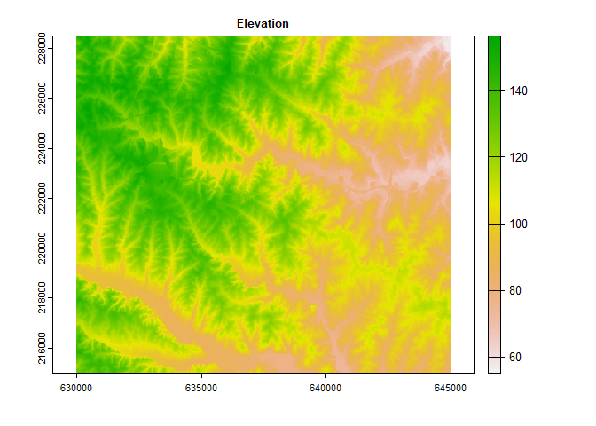
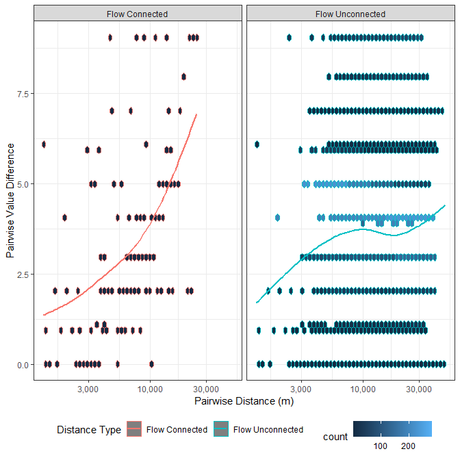
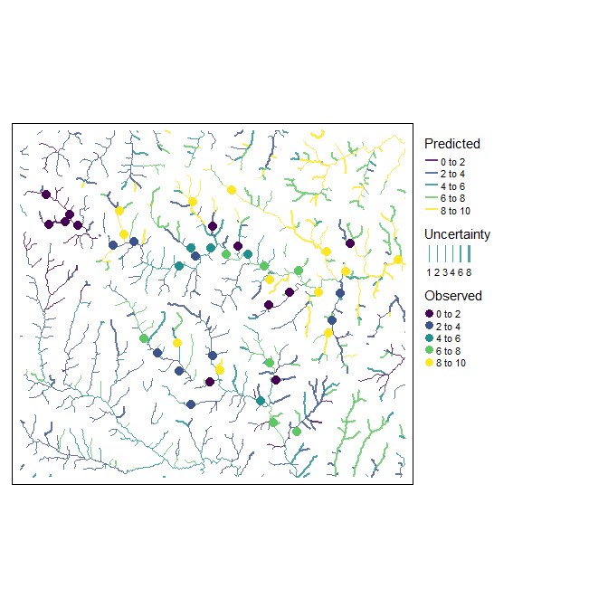

ihydro: Integrated hydrology tools for environmental science
================

-   <a href="#1-introduction" id="toc-1-introduction">1 Introduction</a>
-   <a href="#2-system-setup-and-installation"
    id="toc-2-system-setup-and-installation">2 System setup and
    installation</a>
-   <a href="#3-prepare-dem-and-sampling-points-for-analysis"
    id="toc-3-prepare-dem-and-sampling-points-for-analysis">3 Prepare DEM
    and Sampling Points for analysis</a>
    -   <a href="#31-generate-toy-terrain-dataset-and-sampling-points"
        id="toc-31-generate-toy-terrain-dataset-and-sampling-points">3.1
        Generate toy terrain dataset and sampling points</a>
    -   <a href="#32-generate-layers-of-interest"
        id="toc-32-generate-layers-of-interest">3.2 Generate layers of
        interest</a>
-   <a href="#4-generate-geospatial-analysis-products"
    id="toc-4-generate-geospatial-analysis-products">4 Generate geospatial
    analysis products</a>
    -   <a href="#41-method-1-with-individual-functions"
        id="toc-41-method-1-with-individual-functions">4.1 METHOD 1: With
        individual functions</a>
    -   <a href="#42-method-2-with-a-single-function"
        id="toc-42-method-2-with-a-single-function">4.2 METHOD 2: With a single
        function</a>
-   <a
    href="#5-add-layers-of-interest-to-geospatial-analysis-products-with-process_loi"
    id="toc-5-add-layers-of-interest-to-geospatial-analysis-products-with-process_loi">5
    Add layers of interest to geospatial analysis products with
    <code>process_loi()</code></a>
-   <a href="#6-calculate-weighted-spatial-summaries"
    id="toc-6-calculate-weighted-spatial-summaries">6 Calculate (weighted)
    spatial summaries:</a>
    -   <a href="#61-at-specific-sampling-points-with-site-specific-attributes"
        id="toc-61-at-specific-sampling-points-with-site-specific-attributes">6.1
        At specific sampling points with site specific attributes</a>
    -   <a
        href="#62-at-all-sampled-points-comparing-attrib_points-and-fasttrib_points"
        id="toc-62-at-all-sampled-points-comparing-attrib_points-and-fasttrib_points">6.2
        At all sampled points, comparing <code>attrib_points()</code> and
        <code>fasttrib_points()</code></a>
    -   <a href="#63-across-entire-study-area-fasttrib_points"
        id="toc-63-across-entire-study-area-fasttrib_points">6.3 Across entire
        study area <code>fasttrib_points()</code></a>
-   <a href="#7-example-modelling" id="toc-7-example-modelling">7 Example
    Modelling</a>
    -   <a href="#71-train-a-random-forest-model"
        id="toc-71-train-a-random-forest-model">7.1 Train a Random Forest
        Model</a>
-   <a href="#8-future-plans" id="toc-8-future-plans">8 Future Plans</a>
-   <a href="#9-references" id="toc-9-references">9 References</a>

<!-- README.md is generated from README.Rmd. Please edit that file -->
<!-- badges: start -->

[](https://lifecycle.r-lib.org/articles/stages.html#experimental)
<!-- badges: end -->

## 1 Introduction


Aquatic environmental scientists are often interested in relating
landscape features to observed responses (e.g., fish size, water
temperature, invertebrate community composition, etc.) in streams,
rivers and lakes. The computational workflow for conducting these
investigations is complex. Simply describing how water flows and
accumulates across the landscape can be a challenge itself, but for
aquatic scientists it is only the first step. The stream network must
then be extracted from the landscape, and reaches (a.k.a. segments;
i.e., stretches of river between two confluences) identified and given
unique identifiers. These reaches must then be attributed to be
informative (e.g., slope, stream order, upstream channel length, etc.);
and upstream-downstream connectivity between reaches established.

Typically, observed responses are measured at discrete sampling
locations along the stream network. If the location information is to be
preserved (i.e., if samples are upstream and downstream of a particular
effluent outflow), they must be incorporated into the network. This is
done by splitting stream lines and catchments at these points.

Once that is done, landscape features of interest (e.g., land-cover,
geology, climate, etc.) must be related to the reach (or sampling
points). This alone can be complex as the spatial configuration of these
factors relative to flow direction and accumulation can be important
(Peterson ***et al.***, 2011). The ***ihydro*** package uses
***hydroweight*** (Kielstra ***et al.*** 2021) to calculate these
attributes.

The complexity of this workflow can be a rate limiting step in the
scope, content, quality, and applicability of investigations by aquatic
environmental scientist. The ***ihydro*** package offers tools and
workflows to simplify these complex steps. It is capable of handling all
above computation steps, leaving researchers the task of identifying
layers of interest and modeling with (potentially) large numbers of
predictors.

The ***ihydro*** package also implements descriptions of spatial
autocorrelation among sites. Due to the linear nature of flow in streams
and rivers, autocorrelation tends to be asymmetric, with sites generally
more similar when they are flow connected, than not flow connected.
***ihydro*** produces tables that can be transformed into a asymmetric
matrices that describes the relationships between sampling points based
on instream distances and/or the proportions shared catchments.
Proportion of shared upstream catchment (rather than in-stream distance)
are a more relevant measure of spatial autocorrelation in streams
because it accounts for differences in catchment areas between points,
as well as spatial proximity. For example, if water chemistry samples
are taken from a large 6th order stream, and a upstream small 1st order
tributary we would expect the small tributary to have only a small
impact on the larger stream (despite its close physical proximity).
Hence, autocorrelation should be low because the tributary does not
contribute much flow to the larger stream. Using in-stream distances
alone may misrepresent this pattern.

***ihydro*** stores its geospatial products in a zip file for ease of
retrieval and extraction in external software (i.e. QGIS). Due to the
compression involved, generating, and adding results to the zip file can
be time consuming, however, many ***ihydro*** function can be run in
parallel for increased speed (if enough memory is available). The
functions are also quick at removing internal intermediate files to keep
hard drives from filling up too fast.

[Back to top](#1-introduction)

## 2 System setup and installation

*WhiteboxTools* and *whitebox* are required for ***ihydro***. See
[whiteboxR](https://github.com/giswqs/whiteboxR) or below for
installation.

``` r
## Follow instructions for whitebox installation accordingly
## devtools::install_github("giswqs/whiteboxR") # For development version
## whitebox is now available on CRAN
#install.packages("whitebox")

library(whitebox)

if (F){
  install_whitebox()
  # Possible warning message:
  # ------------------------------------------------------------------------
  # Could not find WhiteboxTools!
  # ------------------------------------------------------------------------
  #
  # Your next step is to download and install the WhiteboxTools binary:
  #     > whitebox::install_whitebox()
  #
  # If you have WhiteboxTools installed already run `wbt_init(exe_path=...)`':
  #    > wbt_init(exe_path='/home/user/path/to/whitebox_tools')
  #
  # For whitebox package documentation, ask for help:
  #    > ??whitebox
  #
  # For more information visit https://giswqs.github.io/whiteboxR/
  #
  # ------------------------------------------------------------------------
}
```

[Back to top](#1-introduction)

## 3 Prepare DEM and Sampling Points for analysis

### 3.1 Generate toy terrain dataset and sampling points

Begin by bringing in the digital elevation model and using it to
generate terrain products.

``` r
## Load libraries
library(ihydro)
library(tmap)
library(furrr)
library(whitebox)
library(terra)
library(sf)
library(dplyr)
library(tidyr)
library(purrr)

# Many function in 'ihydro' can be run in parallel internally. 

# Parallelization is done through the future package, so all parallel backends
# should be supported i.e.,:
plan(multisession(workers=8))

## Generate save_dir as a temporary directory
save_dir <- tempdir()


## Import toy_dem from openSTARS package
# devtools::install_github("MiKatt/openSTARS", ref = "dev")

ot<-system.file("extdata", "nc", "elev_ned_30m.tif", package = "openSTARS") %>% 
  rast() 

crs(ot)<-crs(rast(system.file("extdata", "nc", "landuse_r.tif", package = "openSTARS")))
writeRaster(ot,file.path(save_dir, "toy_dem.tif"),overwrite=T)

toy_dem<-rast(file.path(save_dir, "toy_dem.tif"))

## Identify some sampling points
system.file("extdata", "nc", "sites_nc.shp", package = "openSTARS") %>% 
  vect() %>% 
  st_as_sf() %>% 
  st_transform(st_crs(toy_dem)) %>% 
  vect() %>% 
  writeVector(file.path(save_dir, "sites.shp"),overwrite=T)

plot(toy_dem,main="Elevation")
```



[Back to top](#1-introduction)

### 3.2 Generate layers of interest

``` r

## Predictors from openSTARS
system.file("extdata", "nc", "landuse_r.tif", package = "openSTARS") %>% 
  rast() %>% 
  setNames("LC") %>% 
  writeRaster(file.path(save_dir, "LC.tif"),overwrite=T)

landuse_r_path <-file.path(save_dir, "LC.tif") 
geology_path<-system.file("extdata", "nc", "geology.shp", package = "openSTARS")
pointsources_path<-system.file("extdata", "nc", "pointsources.shp", package = "openSTARS")

read_sf(pointsources_path) %>% 
  mutate(pointsource="pontsrc") %>% 
  st_buffer(60) %>% 
  write_sf(file.path(save_dir, "pointsources.shp"),overwrite=T)

pointsources_path<-file.path(save_dir, "pointsources.shp")


# Numeric Raster

wbt_slope(
  dem = file.path(save_dir, "toy_dem.tif"),
  output = file.path(save_dir, "slope.tif")
)

# Combine loi layers
output_filename_loi<-file.path(save_dir,"Processed_loi.zip")

# This function standardizes numeric and categorical loi layers.

loi_combined<-process_loi(
  dem=toy_dem,
  num_inputs=list(# Can be given as a mixture of input types (file paths, or any sf or terra format)
    slope=file.path(save_dir, "slope.tif")
  ),
  cat_inputs=list(# Can be given as a mixture of input types (file paths, or any sf or terra format)
    landcover=landuse_r_path,
    geology=geology_path,
    pointsources=pointsources_path
  ),
  variable_names=list( # any unlisted inputs will be used in their entirety
    geology="GEO_NAME", # names listed here will subset those attributes or layers from the inputs
    pointsources="pontsrc"
  ),
  output_filename=output_filename_loi,
  return_products=T,
  temp_dir=NULL,
  verbose=T
)
#> [1] "Preparing DEM"
#> [1] "Processing loi"
#> [1] "Generating Outputs"
```

``` r

# All layers have been transformed to rasters with 1 indicating presence, and NA for absence
plot(rast(loi_combined$cat_inputs),type="classes",col="darkgreen")
```


``` r
# Numeric Rasters
plot(rast(loi_combined$num_inputs),type="continuous")
```


[Back to top](#1-introduction)

## 4 Generate geospatial analysis products

### 4.1 METHOD 1: With individual functions

#### 4.1.1 Generate flow direction/accumulation geospatial analysis products with `process_flowdir()`

The DEM must be processed in a way to remove depressions. Whitebox
offers methods for breaching and filling DEMs to remove depressions.

Another factor to consider at this step is whether to burn stream
vectors into the DEM; ***ihydro*** impliments a simplified stream
burning method that lowers the levation along the DEM by `burn_depth`
meters. See
[here](https://proceedings.esri.com/library/userconf/proc99/proceed/papers/pap802/p802.htm#Trois)
for more detailed approaches.

``` r

# Outputs of all functions are always saved to output_filename by default,
# but can be included in function return with return_products=T (note this can
# be very slow for large regions)
output_filename_hydro<-file.path(save_dir,"Processed_Hydrology.zip")

# Generates d8 flow direction and accumulation, extracts streams at a specified 
# flow accumulation threshold
hydro_out<-process_flowdir(
  dem=toy_dem,
  burn_streams=system.file("extdata", "nc", "streams.shp", package = "openSTARS"),
  burn_depth=5,
  min_length=3,
  depression_corr="breach",
  threshold=100L,  
  return_products=T,
  output_filename=output_filename_hydro,
  temp_dir=NULL, 
  verbose=F
)

# hydro_out$outfile # -> This is the full file path of the resulting .zip file

# remaining outputs only present when `return_products` == T
# hydro_out$dem_final.tif # -> final dem after stream burning and depression correction 
# hydro_out$dem_d8.tif # -> d8 flow direction
# hydro_out$dem_accum_d8.tif # -> d8 flow accumulation (cells)
# hydro_out$dem_accum_d8_sca.tif # -> d8 flow accumulation (specific catchment areas)
# hydro_out$dem_streams_d8.tif # -> extracted streams at specified `threshold`

# if `return_products` == F, all produces are only available in the .zip file.
# Terra and sf allow access to files directly in the .zip file, whitebox
# requires them to be extracted to a folder

# List files present in .zip
fl<-unzip(list=T, # when list==T, contents are listed only, if F, they are extracted
          hydro_out$outfile)

fl
#>                   Name  Length                Date
#> 1        dem_final.tif 1804210 2022-10-31 16:06:00
#> 2           dem_d8.tif  454212 2022-10-31 16:06:00
#> 3     dem_accum_d8.tif  904212 2022-10-31 16:06:00
#> 4 dem_accum_d8_sca.tif  904212 2022-10-31 16:06:00
#> 5   dem_streams_d8.tif  904212 2022-10-31 16:06:00

flow_accum_path<-file.path("/vsizip", # "/vsizip" allows terra and sf functions to read from .zip files
                           hydro_out$outfile, # Then specify the full path to the zip file
                           fl$Name[grepl("dem_accum_d8.tif",fl$Name)] # finally specify the file to extract
)

flow_accum_path
#> [1] "/vsizip/C:\\Users\\PSCHAE~1\\AppData\\Local\\Temp\\RtmpY18vAx\\Processed_Hydrology.zip/dem_accum_d8.tif"

flow_accum<-rast(flow_accum_path)

plot(log10(flow_accum))
```


[Back to top](#1-introduction)

#### 4.1.2 Generate vector geospatial analysis products with `generate_vectors()`

This function combines `generate_subbasins()` and `attrib_streamline()`
to produce a number of vector layers.

Typically, observed responses are measured at discrete sampling
locations along the stream network. If the location information is to be
preserved (i.e., if samples are upstream and downstream of a particular
effluent outflow), they must be incorporated into the network. This is
done by splitting stream lines and catchments at these points.

``` r


# generates vector layers, including subbasins, stream lines, and links representing
# pour-points for each subbasin
hydro_out<-generate_vectors(
  input=hydro_out,
  points=file.path(save_dir, "sites.shp"), # These are optional
  site_id_col="site_id", # Column name in points layer that corresponds to 
  #                      # unique IDs that will be available in data products
  snap_distance=100L, # points that are more than 100m from closest stream are excluded
  break_on_noSnap =F, # default is to stop when any points don't snap, this will ignore that
  return_products=T,
  temp_dir=NULL,
  verbose=F
) 
#> [1] "Snapping Points"
#> [1] "Splitting Subbasins"

# Several important columns are used throughout the vector layers:
# `link_id` - identifies reaches/segments (steam between two confluences)
# `trib_id` - identifies streams/tributaries, with the shortest channel getting
#           # a new trib_id at a confluence, and longest channel retaining the original ID
# `uslink_id` and `dslink_id`  - columns identify upstream and downstream links
# `ustrib_id` and `dstrib_id`  - columns identify upstream and downstream tributaries

# If 'points' are provided, this function modifies the vector outputs by inserting
# links, and splitting lines/subbasins at `points`. Inserted points are given "link_id'
# values that increment with decimal places from downstream to upstream directions 
# (i.e., 10.0 remains the pour point for the segment, and 10.1, 10.2,... identify
# sample points in an upstream direction). 

# New layers added by `generate_vectors()`
# hydro_out$db_loc       # -> sqlite database file path containing tables:
#                        #    "stream_links", "stream_points"
# hydro_out$subbasins # -> polygon subbasins attributed with `link_id` and reach
#                     #    contributing area (in m^2)
# hydro_out$stream_lines # -> line vectors attributed with `link_id`, `trib_id`, upstream
#                        #    and downstream link and trib IDS and a number of extra attributes
# hydro_out$points # -> point vectors along lines identifying 'nodes' (confluence
#                  #     points), vs 'links' segments joining 'nodes', and also
#                  #     attributed with `link_id`, `trib_id`, upstream
#                  #     and downstream link and trib IDS and a number of extra attributes
# hydro_out$links # -> point vector representing pour-points for subbasins,
#                 #   attributed with `link_id` and extra attributes
# hydro_out$snapped_points # -> provided points snapped to nearest segment. Any points 
#                          #   beyond snap distance are removed, with a warning if
#                          #   break_on_noSnap == F. 

tm_shape(hydro_out$subbasins) + tm_polygons(col="link_id",palette = "viridis",alpha =0.2,legend.show=F) +
  tm_shape(hydro_out$stream_lines) + tm_lines(col="blue",alpha =0.5,legend.show=F,lwd =3) +
  tm_shape(hydro_out$links) + tm_dots(col="yellow",legend.show=F,size=0.15,border.col="black",border.alpha=1)
```


[Back to top](#1-introduction)

#### 4.1.3 Split vector geospatial analysis products at sampling points `generate_vectors()`

``` r

# Optional step, inserts sampling points into stream vectors, splitting subbasins
# and lines at sampling points, additional links inserted at sampling points as well

tm_shape(rast(hydro_out$dem_final.tif)) + tm_raster(palette = "cividis",legend.show=F) +
  tm_shape(hydro_out$stream_lines) + tm_lines(col="red",alpha =0.5,legend.show=F,lwd =2) +
  tm_shape(hydro_out$snapped_points %>% mutate(site_id=as.numeric(site_id))) +
  tm_dots(col="darkgray",legend.show=F,size=0.35,border.col="black",border.alpha=1,border.lwd=1) +
  tm_shape(read_sf(file.path(save_dir, "sites.shp"))) +
  tm_dots(col="black",legend.show=F,size=0.35,border.col="black",border.alpha=1,border.lwd=1)
```


[Back to top](#1-introduction)

#### 4.1.4 Create lookup table of flow-directions with `trace_flowpaths()`

To more efficiently generate catchments, look-ups are created that
identify the upstream and downstream links from each link. If
`insert_points()` was run previously, inserted points are also included
in lookups.

``` r

# Creates lookup tables of upstream and downstream flow paths
hydro_out<-trace_flowpaths(
  input=hydro_out,
  return_products=T,
  calc_catch="all",
  pwise_dist=T,
  temp_dir=NULL,
  verbose=F
)

# New layers added by `trace_flowpaths()`
# hydro_out$db_loc       # -> sqlite database file path with added tables:
#                        #    "us_flowpaths", "ds_flowpaths", "fcon_pwise_dist",
#                        #    and "funcon_pwise_dist"
#                        #    
# hydro_out$catchments   # -> Catchment polygons by link_id


con <- DBI::dbConnect(RSQLite::SQLite(), hydro_out$db_loc)
DBI::dbListTables(con)
#> [1] "ds_flowpaths"      "fcon_pwise_dist"   "link_id_cellstats"
#> [4] "sqlite_stat1"      "sqlite_stat4"      "stream_links"     
#> [7] "stream_points"     "us_flowpaths"

hydro_out$us_flowpaths <-collect(tbl(con,"us_flowpaths"))
hydro_out$ds_flowpaths <-collect(tbl(con,"ds_flowpaths"))

DBI::dbDisconnect(con)

head(hydro_out$us_flowpaths)
#> # A tibble: 6 × 2
#>   pour_point_id origin_link_id
#>   <chr>         <chr>         
#> 1 1             1             
#> 2 10            10            
#> 3 100           100           
#> 4 1000          1000          
#> 5 1000          1005          
#> 6 1000          1006

head(hydro_out$ds_flowpaths %>% arrange(destination_link_id))
#> # A tibble: 6 × 2
#>   destination_link_id origin_link_id
#>   <chr>               <chr>         
#> 1 1                   1             
#> 2 10                  10            
#> 3 100                 100           
#> 4 1000                130           
#> 5 1000                1112          
#> 6 1000                1118.1

us_790<-hydro_out$us_flowpaths %>%
  filter(pour_point_id == "790") # get all upstream link_ids from link_id 790
ds_145.1<-hydro_out$ds_flowpaths %>%
  filter(origin_link_id == "145.1") # get all downstream link_ids from 
#                                   # link_id 145.1 (this corresponds with site_id = 29)

lines_out<-hydro_out$stream_lines %>% 
  filter(link_id %in% us_790$origin_link_id | 
           link_id %in% ds_145.1$destination_link_id  
  )
sub_out<-hydro_out$subbasins %>% 
  filter(link_id %in% us_790$origin_link_id | 
           link_id %in% ds_145.1$destination_link_id 
  )

tm_shape(sub_out) + tm_polygons(col="white",alpha =0.2,legend.show=F) +
  tm_shape(lines_out) + tm_lines(col="blue",alpha =0.5,legend.show=F,lwd =3) +
  tm_shape(hydro_out$links %>% filter(link_id %in% c("790","145.1"))) +
  tm_dots(legend.show=F,size=0.45,border.col="black",border.alpha=1,border.lwd=1)
```


[Back to top](#1-introduction)

#### 4.1.5 Generate complete upstream catchment areas with `get_catchment()`

``` r

# Once lookup tables are calculated (not necessarily returned, can be return_products = F),
# catchments can easily be retrieved:

subbasin_catchments<-get_catchment( # retrieve catchment for an arbitrary reach
  input=hydro_out,
  site_id_col=NULL,
  target_points=c("838") 
)

point_catchments<-get_catchment( # retrieve sampling point catchments
  input=hydro_out,
  site_id_col="site_id",
  # target_points = hydro_out$snapped_points$site_id
  target_points=c("1","25")
)

tm_shape(bind_rows(subbasin_catchments,point_catchments)) + 
  tm_polygons(col="white",alpha =0.2,legend.show=F,lwd =4) +
  tm_shape(hydro_out$stream_lines) +
  tm_lines(col="blue",alpha =0.5,legend.show=F,lwd =2)  
```


[Back to top](#1-introduction)

#### 4.1.6 Examine pairwise distances

For more complete and thorough treatment on spatial autocorrelation in
stream systems, see [Zimmerman and Hoef
(2007)](https://www.fs.usda.gov/rm/boise/AWAE/projects/NationalStreamInternet/downloads/17ZimmermanVerHoef_TheTorgegramForFluvialVariography.pdf).

Below we calculate pairwise distances between sampled areas. We take
these distances and visualize them as heatmaps to illustrate how
pairwise distance matrices can be used to represent spatial
relationships among sites.

``` r

# If pairwise distances were not requested with trace_flowpaths(), they can be added 
# at any point after using generate_pdist()

hydro_out<-generate_pdist(
  input=hydro_out,
  pwise_all_links=T # This will calculate pairwise distances between all stream links
  #                 #  which can be very slow for dense stream networks
)

# New data available in `pairwise_dist`
# pairwise_dist # -> tables of downstream path lengths between each pair of link_ids,
#                   #    with flow-connected in-stream distances (directed_path_length),
#                   #    flow-unconnected in-stream distances (undirected_path_length),
#                   #    and proportions of shared catchments (prop_shared_catchment)
#                   #    and log-transformed catchment proportions (prop_shared_logcatchment)


con <- DBI::dbConnect(RSQLite::SQLite(), hydro_out$db_loc)
DBI::dbListTables(con)
#> [1] "ds_flowpaths"      "fcon_pwise_dist"   "funcon_pwise_dist"
#> [4] "link_id_cellstats" "sqlite_stat1"      "sqlite_stat4"     
#> [7] "stream_links"      "stream_points"     "us_flowpaths"

# funcon_pwise_dist is only available if pwise_all_links==T

hydro_out$pwise_dist<-bind_rows(collect(tbl(con,"fcon_pwise_dist")) %>% mutate(dist_type="Flow Connected"),
                                collect(tbl(con,"funcon_pwise_dist")) %>% mutate(dist_type="Flow Unconnected")
)

DBI::dbDisconnect(con)

head(hydro_out$pwise_dist)
#> # A tibble: 6 × 7
#>   origin destination directed_path_length prop_shared_…¹ prop_…² undir…³ dist_…⁴
#>   <chr>  <chr>                      <dbl>          <dbl>   <dbl>   <dbl> <chr>  
#> 1 1      1                          132.          1        1       132.  Flow C…
#> 2 10     10                          42.4         1        1        42.4 Flow C…
#> 3 10     1217                       192.          0.0289   0.763   192.  Flow C…
#> 4 100    100                        627.          1        1       627.  Flow C…
#> 5 100    1141                       862.          0.111    0.853   862.  Flow C…
#> 6 100    1135                      1122.          0.0997   0.847  1122.  Flow C…
#> # … with abbreviated variable names ¹​prop_shared_catchment,
#> #   ²​prop_shared_logcatchment, ³​undirected_path_length, ⁴​dist_type

p1<-hydro_out$stream_lines %>% 
  mutate(link_id=as.character(link_id)) %>% 
  left_join(hydro_out$pwise_dist %>%
              filter(dist_type=="Flow Connected") %>% 
              filter(origin=="1048") %>% 
              mutate(directed_path_length=log(directed_path_length)),
            by=c("link_id"="destination")) %>% 
  tm_shape() +
  tm_lines(col="directed_path_length",alpha =1,legend.show=T,lwd =2,palette = "viridis",style="cont")+
  tm_shape(hydro_out$links %>% filter(link_id=="1048"))+
  tm_dots(legend.show=F,size=0.45,border.col="black",border.alpha=1,border.lwd=1)+
  tm_layout(main.title = "Flow connected path log-length from 1048",legend.outside = TRUE)

p2<-hydro_out$stream_lines %>% 
  mutate(link_id=as.character(link_id)) %>% 
  left_join(hydro_out$pwise_dist %>% 
              filter(origin=="1048") %>%
              filter(dist_type=="Flow Unconnected") %>% 
              mutate(undirected_path_length=log(undirected_path_length)),  
            by=c("link_id"="destination")) %>% 
  tm_shape() +
  tm_lines(col="undirected_path_length",alpha =1,legend.show=T,lwd =2,palette = "viridis",style="cont")+
  tm_shape(hydro_out$links %>% filter(link_id=="1048"))+
  tm_dots(legend.show=F,size=0.45,border.col="black",border.alpha=1,border.lwd=1)+
  tm_layout(main.title = "Flow Unconnected path log-length from 1048",legend.outside = TRUE)


# Verify upstream and downstream distances make sense
tmap_arrange(p1,p2,ncol=1)
```


``` r

# Examine relationships among sampled sites. 

# Get link_id for sampled points
sel_link_id<-hydro_out$snapped_points 

# filter long table to selected sites, and convert to wide format

# This table describes the flow-connected in-stream distances at destination points (rows)
# from upstream origin points (columns)
dmat<-hydro_out$pwise_dist %>% 
  filter(origin %in% sel_link_id$link_id &
           destination %in% sel_link_id$link_id
  ) %>% 
  filter(origin!=destination) %>% 
  select(-prop_shared_catchment,-undirected_path_length,-prop_shared_logcatchment,-dist_type) %>%
  rename(link_id=origin) %>%
  mutate(directed_path_length=ifelse(directed_path_length==1 | is.na(directed_path_length),0,directed_path_length)) %>% 
  distinct() %>% 
  filter(directed_path_length!=0) %>% 
  pivot_wider(names_from=destination,values_from=directed_path_length,values_fill = 0) %>% 
  data.frame(check.names = F) %>% 
  tibble::column_to_rownames("link_id") %>% 
  log1p()

head(dmat)
#>          1055.1   1040.1   1003.1   1017.1 1076.1 973.1 1058.1 1079.1 1042.1
#> 1003.1 8.967618 0.000000 0.000000 0.000000      0     0      0      0      0
#> 1017.1 9.396383 7.494625 8.379798 0.000000      0     0      0      0      0
#> 1026.1 9.548604 8.237140 8.754396 7.797961      0     0      0      0      0
#> 103.1  9.664710 8.613486 8.995312 0.000000      0     0      0      0      0
#> 1037.1 8.427519 0.000000 0.000000 0.000000      0     0      0      0      0
#> 1038.1 9.307670 0.000000 8.112417 0.000000      0     0      0      0      0
#>        1091.1 1098.1 1026.1 929.1 774.1 714.1 785.1 871.1 909.1 855.1
#> 1003.1      0      0      0     0     0     0     0     0     0     0
#> 1017.1      0      0      0     0     0     0     0     0     0     0
#> 1026.1      0      0      0     0     0     0     0     0     0     0
#> 103.1       0      0      0     0     0     0     0     0     0     0
#> 1037.1      0      0      0     0     0     0     0     0     0     0
#> 1038.1      0      0      0     0     0     0     0     0     0     0

# This table describes the proportions of shared catchments at destination points (rows)
# from upstream origin points (columns)
dmat2<-hydro_out$pwise_dist %>% 
  filter(origin %in% sel_link_id$link_id &
           destination %in% sel_link_id$link_id
  ) %>% 
  filter(origin!=destination) %>% 
  select(-directed_path_length,-undirected_path_length,-prop_shared_catchment,-dist_type) %>%
  rename(link_id=origin) %>%
  mutate(prop_shared_logcatchment=ifelse(prop_shared_logcatchment==1 | is.na(prop_shared_logcatchment),
                                         1,prop_shared_logcatchment)) %>% 
  distinct() %>% 
  filter(prop_shared_logcatchment!=0) %>% 
  pivot_wider(names_from=destination,values_from=prop_shared_logcatchment ,values_fill = 0) %>% 
  data.frame(check.names = F) %>% 
  tibble::column_to_rownames("link_id")

head(dmat2)
#>           1055.1    1040.1    1003.1    1017.1 1076.1 973.1 1058.1 1079.1
#> 1003.1 0.9645389 0.0000000 0.0000000 0.0000000      0     0      0      0
#> 1017.1 0.9410187 0.9872311 0.9756151 0.0000000      0     0      0      0
#> 1026.1 0.8304294 0.8712109 0.8609600 0.8824792      0     0      0      0
#> 103.1  0.7294950 0.7653197 0.7563147 0.0000000      0     0      0      0
#> 1037.1 0.7370688 0.0000000 0.0000000 0.0000000      0     0      0      0
#> 1038.1 0.7853246 0.0000000 0.8141969 0.0000000      0     0      0      0
#>        1042.1 1091.1 1098.1 1026.1 929.1 774.1 714.1 785.1 871.1 909.1 855.1
#> 1003.1      0      0      0      0     0     0     0     0     0     0     0
#> 1017.1      0      0      0      0     0     0     0     0     0     0     0
#> 1026.1      0      0      0      0     0     0     0     0     0     0     0
#> 103.1       0      0      0      0     0     0     0     0     0     0     0
#> 1037.1      0      0      0      0     0     0     0     0     0     0     0
#> 1038.1      0      0      0      0     0     0     0     0     0     0     0

# Here we multiply the matrices (using the proportions of shared catchments as a rough weighting scheme)
# calculate manhattan distances and generate a heatmap
(dmat*dmat2) %>% 
  dist("man") %>% 
  as.matrix() %>% 
  heatmap()
```


Using these relationships, we can perform a clustering analysis to
identify groups of sites with potentially high spatial autocorrelation.
These groups could for instance be used for cross-validation purposes.

``` r

# Using the above approach, we create 5 groups of spatially proximate points
km<-(dmat*dmat2) %>% 
  dist("man") %>% 
  hclust() %>% 
  cutree(k=5)

gps<-tibble::enframe(km,"link_id","group") %>% 
  mutate(link_id=as.numeric(link_id))

point_groups<-hydro_out$snapped_points %>% 
  left_join(gps) %>% 
  filter(!is.na(group))

# These can be used for cross-validation purposes to see how well the models extrapolate outside of 
# sampled areas

tm_shape(hydro_out$subbasins) + tm_polygons(col="white",alpha =0.2,legend.show=F) +
  tm_shape(hydro_out$stream_lines) + tm_lines(col="blue",alpha =0.3,legend.show=F,lwd =2) +
  tm_shape(point_groups) + tm_dots(col="group", palette = "Dark2",legend.show=T,size=0.45)+
  tm_layout(legend.outside = TRUE)
```



Finally, we’ll examine relationships among our response variable in
terms of in-stream distances, contrasting flow connected sites vs, flow
unconnected sites. Here we see greater differences between responses
with increasing in-stream distance. We expect greater similarity among
flow-connected than flow-unconnected sites, but don’t see it here. This
may be a product of this being an artificial data set.

``` r

# get response variables
response_table<-file.path(save_dir, "sites.shp") %>% 
  read_sf() %>% 
  as_tibble() %>% 
  select(site_id,value) %>% 
  left_join(hydro_out$snapped_points %>% # join by snapped sites to get link_id values
              as_tibble() %>% 
              select(site_id,link_id)) %>% 
  mutate(link_id=as.character(link_id))

# Combine pairwise data with values and examine spatial relationships. 
dmat<-hydro_out$pwise_dist %>% 
  filter(origin %in% sel_link_id$link_id &
           destination %in% sel_link_id$link_id
  ) %>% 
  # Add response values for origin and destination points into the table
  left_join(response_table %>% rename(origin_value=value),by=c("origin"="link_id")) %>% 
  left_join(response_table %>% rename(destination_value=value),by=c("destination"="link_id")) %>% 
  mutate(value_diff=sqrt((origin_value-destination_value)^2)) %>%  # Calculate the squared difference
  filter(origin!=destination) %>% 
  select(-dist_type,-site_id.x,-site_id.y,-origin_value,-destination_value) %>% 
  pivot_longer(c(directed_path_length,undirected_path_length,prop_shared_catchment,prop_shared_logcatchment),
               names_to ="dist_type",
               values_to ="dist") %>% 
  filter(!is.na(dist)) %>% 
  mutate(`Distance Type`=case_when(
    dist_type=="directed_path_length" ~ "Flow Connected",
    dist_type=="undirected_path_length" ~ "Flow Unconnected",
    dist_type=="prop_shared_catchment" ~ "Shared Catchment",
    dist_type=="prop_shared_logcatchment" ~ "Shared log-Catchment",
  )) %>% 
  distinct()

dmat
#> # A tibble: 21,380 × 6
#>    origin destination value_diff dist_type                    dist Distance Ty…¹
#>    <chr>  <chr>            <dbl> <chr>                       <dbl> <chr>        
#>  1 1003.1 1055.1               4 directed_path_length     7844.    Flow Connect…
#>  2 1003.1 1055.1               4 undirected_path_length   7844.    Flow Unconne…
#>  3 1003.1 1055.1               4 prop_shared_catchment       0.528 Shared Catch…
#>  4 1003.1 1055.1               4 prop_shared_logcatchment    0.965 Shared log-C…
#>  5 1017.1 1040.1               1 directed_path_length     1797.    Flow Connect…
#>  6 1017.1 1040.1               1 undirected_path_length   1797.    Flow Unconne…
#>  7 1017.1 1040.1               1 prop_shared_catchment       0.803 Shared Catch…
#>  8 1017.1 1040.1               1 prop_shared_logcatchment    0.987 Shared log-C…
#>  9 1017.1 1003.1               1 directed_path_length     4357.    Flow Connect…
#> 10 1017.1 1003.1               1 undirected_path_length   4357.    Flow Unconne…
#> # … with 21,370 more rows, and abbreviated variable name ¹​`Distance Type`

require(ggplot2)
ggplot(dmat %>% filter(dist_type %in% c("directed_path_length","undirected_path_length")),
       aes(x=dist,y=value_diff,col=`Distance Type`))+
  geom_hex(bins=50)+
  geom_smooth(method="gam",se=F)+
  theme_bw()+
  theme(legend.position = "bottom")+
  ylab("Pairwise Value Difference")+
  xlab("Pairwise Distance (m)")+
  scale_x_log10(labels=scales::comma)+
  facet_wrap(~`Distance Type`)
```


Finally, we’ll do a similar comparison but using percent of shared
catchments. Here we expect pairwise differences to decrease as the
percent of shared catchments increases.

``` r

ggplot(dmat %>%
         filter(dist_type %in% c("prop_shared_catchment","prop_shared_logcatchment")) %>% 
         filter(dist>0),
       aes(x=dist,y=value_diff,colour=`Distance Type`))+
  geom_hex()+
  geom_smooth(method="gam",se=F)+
  theme_bw()+
  theme(legend.position = "bottom")+
  ylab("Pairwise Value Difference")+
  xlab("Percent of shared catchments (Flow Connected only)")+
  scale_x_continuous(labels=scales::percent)+
  facet_wrap(~`Distance Type`,scales ="free_x")
```


[Back to top](#1-introduction)

### 4.2 METHOD 2: With a single function

#### 4.2.1 `process_hydrology()`

The entire workflow above can be accomplished with a single function:

``` r

output_filename_hydro_sparse<-file.path(save_dir,"Processed_Hydrology_sparse.zip")

# In this case we could use a higher stream initiation threshold.
# We could use this layer to more quickly make predictions across the landscape.

hydro_out_sparse<-process_hydrology(
  dem=toy_dem,
  output_filename=output_filename_hydro_sparse,
  # burn_streams=system.file("extdata", "nc", "streams.shp", package = "openSTARS"),
  burn_depth=5,
  depression_corr="breach",
  threshold=500L,
  # points=hydro_out$snapped_points, 
  # site_id_col="site_id",
  # snap_distance = 1L, 
  break_on_noSnap=F, 
  return_products=F,
  temp_dir=NULL,
  verbose=F
)

# Since we didn't return the products, we'll verify the outputs exist in the .zip file
unzip(list=T,hydro_out_sparse$outfile)
#>                    Name  Length                Date
#> 1         dem_final.tif 1804210 2022-10-31 16:12:00
#> 2            dem_d8.tif  454212 2022-10-31 16:12:00
#> 3      dem_accum_d8.tif  904212 2022-10-31 16:12:00
#> 4  dem_accum_d8_sca.tif  904212 2022-10-31 16:12:00
#> 5    dem_streams_d8.tif  904212 2022-10-31 16:12:00
#> 6       site_id_col.csv      22 2022-10-31 16:13:00
#> 7      stream_links.dbf   18372 2022-10-31 16:13:00
#> 8      stream_links.prj     503 2022-10-31 16:13:00
#> 9      stream_links.shp    6428 2022-10-31 16:13:00
#> 10     stream_links.shx    1908 2022-10-31 16:13:00
#> 11     stream_lines.dbf    5691 2022-10-31 16:13:00
#> 12     stream_lines.prj     503 2022-10-31 16:13:00
#> 13     stream_lines.shp   70924 2022-10-31 16:13:00
#> 14     stream_lines.shx    1900 2022-10-31 16:13:00
#> 15    stream_points.dbf  145016 2022-10-31 16:13:00
#> 16    stream_points.prj     503 2022-10-31 16:13:00
#> 17    stream_points.shp  162444 2022-10-31 16:13:00
#> 18    stream_points.shx   46484 2022-10-31 16:13:00
#> 19   Subbasins_poly.dbf    7782 2022-10-31 16:13:00
#> 20   Subbasins_poly.prj     503 2022-10-31 16:13:00
#> 21   Subbasins_poly.shp  380032 2022-10-31 16:13:00
#> 22   Subbasins_poly.shx    1908 2022-10-31 16:13:00
#> 23   Catchment_poly.dbf   18372 2022-10-31 16:13:00
#> 24   Catchment_poly.prj     503 2022-10-31 16:13:00
#> 25   Catchment_poly.shp  997812 2022-10-31 16:13:00
#> 26   Catchment_poly.shx    1908 2022-10-31 16:13:00

tm_shape(read_sf(file.path("/vsizip",hydro_out_sparse$outfile,"Subbasins_poly.shp"))) + 
  tm_polygons(col="white",alpha =0.2,legend.show=F) +
  tm_shape(read_sf(file.path("/vsizip",hydro_out_sparse$outfile,"stream_lines.shp"))) +
  tm_lines(col="blue",alpha =0.3,legend.show=F,lwd =2) +
  tm_shape(read_sf(file.path("/vsizip",hydro_out_sparse$outfile,"stream_links.shp"))) +
  tm_dots(legend.show=F,size=0.45,border.col="black",border.alpha=1,border.lwd=1)
```


[Back to top](#1-introduction)

## 5 Add layers of interest to geospatial analysis products with `process_loi()`

Layers of interest (loi) represent the features on the landscape we are
interested in relating to the observed responses in the stream. These
can include land-cover, climate, geology, soils, NDVI, slope, etc.

Instead of processing the loi separately (as was done above), they can
instead be added to the completed workflow, and added to the existing
.zip file for convenient file storage/organization. If run separately
(as above), “num_rast.tif” and/or “cat_rast.tif” can manually be added
to the .zip file as well.

``` r

# In this case, we will use out previously calculated loi results, but if `process_loi` 
# is run with an input parameter specified, the loi rasters will be added to the
# output. This can make for convenient data storage.

if (F) {
  hydro_out<-process_loi(
    input=hydro_out,
    num_inputs=list(# Can be given as a mixture of input types (file paths, or any sf or terra format)
      slope=file.path(save_dir, "slope.tif")
    ),
    cat_inputs=list(# Can be given as a mixture of input types (file paths, or any sf or terra format)
      landcover=landuse_r_path,
      geology=geology_path,
      pointsources=pointsources_path
    ),
    variable_names=list( # any unlisted inputs will be used in their entirety
      geology="GEO_NAME",
      pointsources="pontsrc"
    ),
    return_products=T, # these layers can get large, and it is generally not advised to return them into R 
    temp_dir=NULL,
    verbose=F
  )
}
```

[Back to top](#1-introduction)

## 6 Calculate (weighted) spatial summaries:

New research is showing that the presence of particular features on the
landscape is not always sufficient to predict the in-stream response to
those features, and the location of those features relative to the
locations of streams and areas of higher flow accumulation is very
important (Peterson ***et al.*** 2011).

***ihydro*** provides 2 functions for calculating weighted spatial
summaries: `attrib_points()` and `fasttrib_points()`. `attrib_points()`
uses the [hydroweight](https://github.com/bkielstr/hydroweight) package
to calculate weighted spatial summaries of supplied loi layers. It can
be used to examine the resulting distance-weighted rasters and
distance-weighted loi layers. However, `attrib_points()` is very slow,
so `fasttrib_points()` is available for improved performance for larger
datasets.

### 6.1 At specific sampling points with site specific attributes

The `attrib_points()` function can be run with a specification table to
specify at which sites loi summaries should be calculated for, which loi
to summarize, and type of numeric summary to use for those particular
loi.

``` r

# This retrieves loi names
loi<-list(numb=rast(loi_combined$num_inputs),
          cat=rast(loi_combined$cat_inputs))

loi_names<-lapply(loi,names) %>% unlist()
names(loi_names)<-loi_names

# Here we assign which summaries we would like calculated for each loi layer
loi_names<-map(loi_names,~c("distwtd_mean",  "mean", "distwtd_sd","sd",  "min", "max"))

# A 'spec' table can be given to calculate attributes at only select sampling points,
# and/or to only calculate a subset of attributes from select sampling points
specification_table<-tibble(
  site_id=c("1","25","80"),
  loi=list(loi_names)
)
specification_table$loi[[2]]<-specification_table$loi[[2]][c(1:2)]
specification_table$loi[[2]][[1]]<-specification_table$loi[[2]][[1]][c(1:2)]

attrib_points_time_small<-system.time(
  final_attributes_sub_slow<-attrib_points(
    input=hydro_out,
    loi_file=output_filename_loi, #output file path from process_loi()
    spec=specification_table,
    weighting_scheme = c("lumped", "iFLS", "iFLO",  "HAiFLO",  "HAiFLS"),
    OS_combine=F,
    target_streamseg=F, # This will set the target_o parameter as the sampling point
    inv_function = function(x) { # Function used by hydroweight to calculate
      # spatial weights across the landscape
      (x * 0.001 + 1)^-1
    },
    remove_region=NULL,
    return_products=T,
    temp_dir=NULL,
    verbose=F
  )
)


# Site 25 should only contain mean and distwtd_mean variables for slope
final_attributes_sub_slow %>%
  select(site_id,contains("slope"))
#> # A tibble: 3 × 13
#>   site_id slope_lumped…¹ slope…² slope…³ slope…⁴ slope…⁵ slope…⁶ slope…⁷ slope…⁸
#>     <dbl>          <dbl>   <dbl>   <dbl>   <dbl>   <dbl>   <dbl>   <dbl>   <dbl>
#> 1       1           2.99   1.46    0.203   10.2     3.02   1.49     2.40   1.54 
#> 2      25           3.48  NA      NA       NA       3.36  NA        1.50  NA    
#> 3      80           2.23   0.837   0.400    4.34    2.28   0.881    1.77   0.714
#> # … with 4 more variables: slope_iFLS_distwtd_mean <dbl>,
#> #   slope_iFLS_distwtd_sd <dbl>, slope_HAiFLS_distwtd_mean <dbl>,
#> #   slope_HAiFLS_distwtd_sd <dbl>, and abbreviated variable names
#> #   ¹​slope_lumped_mean, ²​slope_lumped_sd, ³​slope_lumped_min, ⁴​slope_lumped_max,
#> #   ⁵​slope_iFLO_distwtd_mean, ⁶​slope_iFLO_distwtd_sd,
#> #   ⁷​slope_HAiFLO_distwtd_mean, ⁸​slope_HAiFLO_distwtd_sd
```

We can access the weighting layers and weighted attribute layers (if
return_products==T) of the `attrib_points()` output.

``` r

plot(
  rast(
    list(
      rast(final_attributes_sub_slow$distance_weights[[2]]$iFLS)%>%
        setNames("iFLS Weighting"),
      log10(rast(final_attributes_sub_slow$distance_weights[[2]]$HAiFLO))%>%
        setNames("log10-HAiFLO Weighting"),
      rast(final_attributes_sub_slow$weighted_attr[[2]][[8]]) %>%
        project(rast(final_attributes_sub_slow$distance_weights[[2]][[1]])) %>%
        setNames("iFLS Weighted Slope"),
      log10(rast(final_attributes_sub_slow$weighted_attr[[2]][[2]])) %>%
        project(rast(final_attributes_sub_slow$distance_weights[[2]][[1]])) %>%
        setNames("log10-HAiFLO Weighted Landcover Class 1")
    )
  ),
  col=viridis::viridis(101),
  axes=F
)
```


The `fasttrib_points()` function is a bit less flexible in its inputs,
but is considerably faster for larger data sets, more loi, and more
sampling points. For very small datasets `attrib_points()` may be
faster.

``` r

fasttrib_points_time_small<-system.time(
  final_attributes_sub<-fasttrib_points(
    input=hydro_out,
    loi_file=output_filename_loi,
    sample_points=c("1","25","80"),
    out_filename="subsample_points_wgtattr.csv",
    link_id=NULL,
    weighting_scheme = c("lumped", "iFLS", "iFLO",  "HAiFLO",  "HAiFLS"),
    loi_numeric_stats = c("mean", "sd",  "min", "max"),
    inv_function = function(x) {
      (x * 0.001 + 1)^-1
    },
    temp_dir=NULL,
    verbose=F
  )
)

# Verify database

trg_id<-"1118.1" #this correponds to sample point 1

con_attr<-DBI::dbConnect(RSQLite::SQLite(),
                         gsub(basename(hydro_out$db_loc),gsub(".db","_Attr.db",basename(hydro_out$db_loc)),hydro_out$db_loc))

DBI::dbListTables(con_attr)
#>  [1] "attrib_tbl"        "ds_flowpaths"      "fcon_pwise_dist"  
#>  [4] "funcon_pwise_dist" "link_id_cellstats" "o_target_weights" 
#>  [7] "s_target_weights"  "sqlite_stat1"      "sqlite_stat4"     
#> [10] "stream_links"      "stream_points"     "subb_sum"         
#> [13] "us_flowpaths"

# This creates a table of all raster values from the database
dd<-tbl(con_attr,"us_flowpaths") %>% 
  filter(pour_point_id  %in% local(trg_id)) %>% 
  rename(subb_link_id=origin_link_id ) %>% 
  left_join(tbl(con_attr,"link_id_cellstats"),
            by=c("subb_link_id")) %>% 
  left_join(tbl(con_attr,"attrib_tbl"),
            by=c("subb_link_id","cell_number")) %>% 
  left_join(tbl(con_attr,"s_target_weights"),
            by=c("subb_link_id","cell_number")) %>% 
  left_join(tbl(con_attr,"o_target_weights") %>% 
              filter(catch_link_id %in% local(trg_id)),
            by=c("pour_point_id"="catch_link_id","cell_number")) %>% 
  collect()

DBI::dbDisconnect(con_attr)

outline<-hydro_out$catchments %>% 
  filter(link_id %in% trg_id) %>% 
  vect()

r1<-dd %>% 
  select(row,col,attr=iFLO) %>% 
  pivot_wider(id_cols=row,names_from=col,values_from=attr) %>%
  arrange(row) %>% 
  data.frame(check.names = F) %>% 
  tibble::column_to_rownames("row") %>% 
  .[order(as.numeric(rownames(.))),order(as.numeric(colnames(.)))] %>% 
  as.matrix() %>% 
  rast(crs=crs(toy_dem),extent=ext(outline))

plot(r1)
plot(outline,add=T)
```


[Back to top](#1-introduction)

### 6.2 At all sampled points, comparing `attrib_points()` and `fasttrib_points()`

``` r


final_attributes<-fasttrib_points(
  input=hydro_out,
  loi_file=output_filename_loi,
  sample_points=hydro_out$snapped_points$site_id, # here we generate summaries for all sampled points
  out_filename="sample_points_wgtattr.csv",
  link_id=NULL,
  weighting_scheme =  c("lumped", "iFLS", "HAiFLS","iFLO","HAiFLO"), 
  loi_numeric_stats = c("mean", "sd",  "min", "max"), 
  inv_function = function(x) {
    (x * 0.001 + 1)^-1
  },
  temp_dir=NULL,
  verbose=F
)


final_attributes
#> # A tibble: 45 × 94
#>    link_id site_id LC_1_iFLS_p…¹ LC_2_…² LC_3_…³ LC_4_…⁴ LC_5_…⁵ LC_6_…⁶ LC_7_…⁷
#>    <chr>   <chr>           <dbl>   <dbl>   <dbl>   <dbl>   <dbl>   <dbl>   <dbl>
#>  1 1124.1  41              0.672       0 1.28e-1  0.107   0.0924       0       0
#>  2 1118.1  1               0.290       0 7.30e-4  0.0662  0.643        0       0
#>  3 103.1   62              0.706       0 1.44e-1  0       0.150        0       0
#>  4 145.1   26              0.413       0 0        0.131   0.456        0       0
#>  5 1091.1  4               0.174       0 4.90e-2  0.0437  0.733        0       0
#>  6 1058.1  7               0.495       0 6.90e-2  0.0254  0.411        0       0
#>  7 1053.1  5               0.594       0 8.35e-2  0.0118  0.311        0       0
#>  8 1079.1  8               0.264       0 5.17e-2  0.0390  0.645        0       0
#>  9 1085.1  66              0.667       0 5.05e-2  0       0.283        0       0
#> 10 1098.1  28              0.462       0 1.96e-2  0.0900  0.428        0       0
#> # … with 35 more rows, 85 more variables: GEO_NAME_CZam_iFLS_prop <dbl>,
#> #   GEO_NAME_CZbg_iFLS_prop <dbl>, GEO_NAME_CZfg_iFLS_prop <dbl>,
#> #   GEO_NAME_CZg_iFLS_prop <dbl>, GEO_NAME_CZig_iFLS_prop <dbl>,
#> #   GEO_NAME_CZlg_iFLS_prop <dbl>, GEO_NAME_CZve_iFLS_prop <dbl>,
#> #   GEO_NAME_Km_iFLS_prop <dbl>, pontsrc_pontsrc_iFLS_prop <dbl>,
#> #   slope_iFLS_mean <dbl>, LC_1_HAiFLS_prop <dbl>, LC_2_HAiFLS_prop <dbl>,
#> #   LC_3_HAiFLS_prop <dbl>, LC_4_HAiFLS_prop <dbl>, LC_5_HAiFLS_prop <dbl>, …
```

[Back to top](#1-introduction)

### 6.3 Across entire study area `fasttrib_points()`

In order to make predictions across the landscape, we will need to
calculate our attributes across the landscape as well. We leave
`sample_points` and `link_id` as NULL to predict across all reaches. At
this point, we may also consider switching our target_o parameter from
the sampling point (as was done above) to the entire reach by setting
`target_o_type`=“segment_whole”. This will calculate all target_o
weighting schemes to be the entire reach. This may be more conservative
for predicting beyond sampling points as it integrates landscape factors
across the length of the whole reach.

``` r

# This function is optional. It will save the hydroweight rasters in the output zip file.
# These can be large and take up a lot of room, so consider whether they are needed before storing.
# Having the raster available does increase the computation time of fasttrib_points().

dw_time<-system.time(
  hydro_out<-prep_weights(
    input=hydro_out,
    sample_points=NULL,
    link_id=NULL,
    target_o_type=c("segment_whole"),
    weighting_scheme =  c( "iFLS", "HAiFLS","iFLO",  "HAiFLO"),
    inv_function = function(x) {
      (x * 0.001 + 1)^-1
    },
    temp_dir=NULL,
    verbose=F
  )
)


fasttrib_points_time_big<-system.time(
  final_attributes_all<-fasttrib_points(
    input=hydro_out, # We could use our sparse 'hydro_out_sparse', but with fasttrib_points(), we run all reaches
    loi_file=output_filename_loi,
    sample_points=NULL, 
    link_id=NULL,
    target_o_type="segment_whole",
    out_filename="all_points_wgtattr.csv",
    weighting_scheme =  c("lumped", "iFLS", "iFLO",  "HAiFLO",  "HAiFLS"),
    loi_numeric_stats = c("mean", "sd", "max","min"),
    inv_function = function(x) {
      (x * 0.001 + 1)^-1
    },
    use_existing_attr =F, # Setting this to TRUE will attempt to use previous distance weights
    #                     # and attributes to recalculate summaries
    store_hw=F, # Setting this to TRUE will save the resulting hydroweight rasters, as if running prep_weights(). 
    #           # This adds to the size of the zip file, and increases the computation time.
    use_exising_hw=F, # This will attempt to use existing hydroweights when available, 
    #                 # we'll keep it FALSE to make a fair comparison with attrib_points()
    subb_per_core=10000, # we don't need to worry about running out of memory with this dataset
    #                    # but if it were an issue, this allows you to lower the amount of data held in memory
    catch_per_core=2000,
    temp_dir=NULL,
    verbose=T
  )
)
#> [1] "Reading in data"
#> [1] "Merging stream segments"
#> [1] "Generating Stream Targeted Weights"
#> [1] "Writing S-targeted weights to attributes database"
#> [1] "Generating Site Targeted Weights"
#> [1] "Unnesting Basins"
#> [1] "Writing O-targeted weights to attributes database"
#> [1] "Writing LOI to attributes database"
#> [1] "Writing subbasin summaries to database"
#> [1] "Calculating lumped and s-targeted Attributes"
#> [1] "Calculating o-targeted Attributes"

final_attributes_all
#> # A tibble: 1,206 × 93
#>    link_id LC_1_iFLS_p…¹ LC_2_…² LC_3_…³ LC_4_…⁴ LC_5_…⁵ LC_6_…⁶ LC_7_…⁷ GEO_N…⁸
#>    <chr>           <dbl>   <dbl>   <dbl>   <dbl>   <dbl>   <dbl>   <dbl>   <dbl>
#>  1 7              0            0  0       0.429    0.571 0        0       0     
#>  2 5              0            0  0       0.0834   0.917 0        0       0     
#>  3 1209           0.0584       0  0.0901  0.0798   0.772 0        0       0     
#>  4 1217           0.179        0  0.0540  0.0903   0.677 0        0       0.0112
#>  5 1215           0.0946       0  0.290   0.0729   0.521 0.00754  0.0136  0.101 
#>  6 1              0.0642       0  0.659   0.120    0.157 0        0       0.0488
#>  7 1206           0.254        0  0.303   0.0706   0.373 0        0       0     
#>  8 3              0.755        0  0.0387  0        0.206 0        0       0     
#>  9 1207           0.285        0  0.428   0.104    0.167 0.0162   0       0     
#> 10 33             0.319        0  0.0354  0.138    0.508 0        0       0     
#> # … with 1,196 more rows, 84 more variables: GEO_NAME_CZbg_iFLS_prop <dbl>,
#> #   GEO_NAME_CZfg_iFLS_prop <dbl>, GEO_NAME_CZg_iFLS_prop <dbl>,
#> #   GEO_NAME_CZig_iFLS_prop <dbl>, GEO_NAME_CZlg_iFLS_prop <dbl>,
#> #   GEO_NAME_CZve_iFLS_prop <dbl>, GEO_NAME_Km_iFLS_prop <dbl>,
#> #   pontsrc_pontsrc_iFLS_prop <dbl>, slope_iFLS_mean <dbl>,
#> #   LC_1_HAiFLS_prop <dbl>, LC_2_HAiFLS_prop <dbl>, LC_3_HAiFLS_prop <dbl>,
#> #   LC_4_HAiFLS_prop <dbl>, LC_5_HAiFLS_prop <dbl>, LC_6_HAiFLS_prop <dbl>, …

attrib_points_time_big<-system.time(
  final_attributes_slow<-attrib_points(
    input=hydro_out,
    loi_file=output_filename_loi, #output file path from process_loi()
    spec=NULL, # attrib_points() can be run without a spec table to calculate attributes across all reaches
    weighting_scheme =  c("lumped", "iFLS", "iFLO",  "HAiFLO",  "HAiFLS"),
    loi_numeric_stats = c("distwtd_mean", "distwtd_sd", "mean", "sd", "min", "max"),
    OS_combine=F,
    all_reaches=T,
    target_streamseg=T,
    inv_function = function(x) { 
      (x * 0.001 + 1)^-1
    },
    remove_region=NULL,
    return_products=F,
    temp_dir=NULL,
    verbose=F
  )
)

final_attributes_slow
#> # A tibble: 1,206 × 95
#>    link_id distance_we…¹ weigh…² LC_1_…³ LC_1_…⁴ LC_1_…⁵ LC_1_…⁶ LC_1_…⁷ LC_2_…⁸
#>      <dbl> <list>        <list>    <dbl>   <dbl>   <dbl>   <dbl>   <dbl>   <dbl>
#>  1       1 <NULL>        <NULL>   0.0910 0.0205   0.118   0.110   0.0369       0
#>  2       2 <NULL>        <NULL>   0.576  0.800    0.565   0.575   0.718        0
#>  3       3 <NULL>        <NULL>   0.737  0.798    0.763   0.749   0.719        0
#>  4       4 <NULL>        <NULL>   0.866  0.896    0.874   0.866   0.858        0
#>  5       5 <NULL>        <NULL>   0      0        0       0       0            0
#>  6       6 <NULL>        <NULL>   0.132  0.0251   0.150   0.128   0.0558       0
#>  7       7 <NULL>        <NULL>   0      0        0       0       0            0
#>  8       8 <NULL>        <NULL>   0      0        0       0       0            0
#>  9       9 <NULL>        <NULL>   0.228  0.371    0.220   0.230   0.288        0
#> 10      10 <NULL>        <NULL>   0.0624 0.00905  0.0650  0.0650  0.0116       0
#> # … with 1,196 more rows, 86 more variables: LC_2_HAiFLO_prop <dbl>,
#> #   LC_2_lumped_prop <dbl>, LC_2_iFLS_prop <dbl>, LC_2_HAiFLS_prop <dbl>,
#> #   LC_3_iFLO_prop <dbl>, LC_3_HAiFLO_prop <dbl>, LC_3_lumped_prop <dbl>,
#> #   LC_3_iFLS_prop <dbl>, LC_3_HAiFLS_prop <dbl>, LC_4_iFLO_prop <dbl>,
#> #   LC_4_HAiFLO_prop <dbl>, LC_4_lumped_prop <dbl>, LC_4_iFLS_prop <dbl>,
#> #   LC_4_HAiFLS_prop <dbl>, LC_5_iFLO_prop <dbl>, LC_5_HAiFLO_prop <dbl>,
#> #   LC_5_lumped_prop <dbl>, LC_5_iFLS_prop <dbl>, LC_5_HAiFLS_prop <dbl>, …

pmap(
  list(
    list("attrib_points()","fasttrib_points()",
         "attrib_points()","fasttrib_points()"),
    list(attrib_points_time_small,
         fasttrib_points_time_small,
         attrib_points_time_big,
         fasttrib_points_time_big),
    list(final_attributes_sub_slow %>%
           select(-any_of("distance_weights"),-any_of("weighted_attr"),-any_of("link_id"),-any_of("site_id")),
         final_attributes_sub%>%
           select(-any_of("distance_weights"),-any_of("weighted_attr"),-any_of("link_id"),-any_of("site_id")),
         final_attributes_slow %>%
           select(-any_of("distance_weights"),-any_of("weighted_attr"),-any_of("link_id"),-any_of("site_id")),
         final_attributes_all%>%
           select(-any_of("distance_weights"),-any_of("weighted_attr"),-any_of("link_id"),-any_of("site_id"))
    )),
  function(.z,.x,.y) paste0(.z," took ",
                            round(.x[[3]]/60,2),
                            " min to calculate for ",
                            nrow(.y)," reaches with ",
                            ncol(.y),
                            " attributes using ", nbrOfWorkers(),
                            " cores.")
)
#> [[1]]
#> [1] "attrib_points() took 0.8 min to calculate for 3 reaches with 92 attributes using 8 cores."
#> 
#> [[2]]
#> [1] "fasttrib_points() took 1.85 min to calculate for 3 reaches with 92 attributes using 8 cores."
#> 
#> [[3]]
#> [1] "attrib_points() took 114.86 min to calculate for 1206 reaches with 92 attributes using 8 cores."
#> 
#> [[4]]
#> [1] "fasttrib_points() took 25.81 min to calculate for 1206 reaches with 92 attributes using 8 cores."

paste0(round(dw_time[[3]]/60,2),
       " min to calculate distance weights for ",
       nrow(final_attributes_all)," reaches using ",
       nbrOfWorkers(),
       " cores.")
#> [1] "4.61 min to calculate distance weights for 1206 reaches using 8 cores."


# Plot some attributes along their respective stream lines for visualization:
targ_param<-c("slope_lumped_mean","slope_iFLS_mean","slope_HAiFLO_mean",
              "LC_1_lumped_prop","LC_1_iFLS_prop","LC_1_HAiFLO_prop", 
              "GEO_NAME_CZfg_lumped_prop","GEO_NAME_CZfg_iFLS_prop","GEO_NAME_CZfg_HAiFLO_prop")

targ_param_nm<-paste0(
  rep(c("Lumped-Weighted\n","iFLS-Weighted\n","HAiFLO-Weighted\n"),length.out=9),
  rep(c("mean Slope","% LC-1","% Geoclass-CZfg"),each=3)
)

attr_lines<-hydro_out$stream_lines %>%
  mutate(link_id=floor(link_id)) %>% 
  group_by(link_id) %>%              
  summarize(geometry=st_union(geometry)) %>%
  ungroup() %>% 
  mutate(link_id=as.character(link_id)) %>% 
  left_join(final_attributes_all) %>% 
  select(link_id,any_of(targ_param))

pout<-map2(targ_param,targ_param_nm,function(x,y) tm_shape(attr_lines) +
             tm_lines(col=x,
                      palette = "viridis",
                      alpha =0.8,
                      legend.col.show=F,
                      legend.lwd.show=F,
                      scale=1)+
             tm_layout(main.title=y,main.title.size=1)
)

tmap_arrange(pout,ncol=3)
```


``` r


a1<-fasttrib_points(
    input=hydro_out,
    loi_file=output_filename_loi,
    link_id="988",
    out_filename="subsample_points_wgtattr.csv",
    weighting_scheme = c("lumped", "iFLS", "iFLO",  "HAiFLO",  "HAiFLS"),
    loi_numeric_stats = c("mean", "sd",  "min", "max"),
    inv_function = function(x) {
        (x * 0.001 + 1)^-1
    },
    temp_dir=NULL,use_exising_hw=T,
    verbose=F
)

mapview::mapview(attr_lines,zcol="GEO_NAME_CZfg_lumped_prop")
```

<div id="htmlwidget-459bda4cf4295bda7639" style="width:100%;height:1152px;" class="leaflet html-widget"></div>
<script type="application/json" data-for="htmlwidget-459bda4cf4295bda7639">{"x":{"options":{"minZoom":1,"maxZoom":52,"crs":{"crsClass":"L.CRS.EPSG3857","code":null,"proj4def":null,"projectedBounds":null,"options":{}},"preferCanvas":false,"bounceAtZoomLimits":false,"maxBounds":[[[-90,-370]],[[90,370]]]},"calls":[{"method":"addProviderTiles","args":["CartoDB.Positron","CartoDB.Positron","CartoDB.Positron",{"errorTileUrl":"","noWrap":false,"detectRetina":false,"pane":"tilePane"}]},{"method":"addProviderTiles","args":["CartoDB.DarkMatter","CartoDB.DarkMatter","CartoDB.DarkMatter",{"errorTileUrl":"","noWrap":false,"detectRetina":false,"pane":"tilePane"}]},{"method":"addProviderTiles","args":["OpenStreetMap","OpenStreetMap","OpenStreetMap",{"errorTileUrl":"","noWrap":false,"detectRetina":false,"pane":"tilePane"}]},{"method":"addProviderTiles","args":["Esri.WorldImagery","Esri.WorldImagery","Esri.WorldImagery",{"errorTileUrl":"","noWrap":false,"detectRetina":false,"pane":"tilePane"}]},{"method":"addProviderTiles","args":["OpenTopoMap","OpenTopoMap","OpenTopoMap",{"errorTileUrl":"","noWrap":false,"detectRetina":false,"pane":"tilePane"}]},{"method":"createMapPane","args":["line",430]},{"method":"addPolylines","args":[[[[{"lng":[-78.7229962285436,-78.7233281828104,-78.7236592130116,-78.7239911684008,-78.7239902454329],"lat":[35.8088276017534,35.8088283558266,35.8090995083957,35.809100260663,35.8093706600408]}]],[[{"lng":[-78.659261132861,-78.6605889446715,-78.6609197637763,-78.6609186299019,-78.6612505851012],"lat":[35.8086660666624,35.8086697719555,35.8089410949029,35.8092114937629,35.8092124169275]}]],[[{"lng":[-78.7093870808218,-78.7097180630319,-78.7100500170451,-78.7103810025917,-78.7110449128706,-78.7113759028703,-78.7117078591359],"lat":[35.8085255069148,35.8087966973769,35.8087974876182,35.809068676255,35.8090702522218,35.8093414381317,35.8093422238571]}]],[[{"lng":[-78.6493037209107,-78.6489717693192,-78.6479794459934,-78.6473155495411,-78.6463232529022,-78.6456593631887,-78.6453262323617,-78.6449942864148,-78.643994877308,-78.6439936868542,-78.6436605449273,-78.6436569701641],"lat":[35.8083674170224,35.8083664613159,35.8075523922542,35.8075504727222,35.8067363899516,35.8067344613966,35.807003894675,35.8070029281339,35.8078112196369,35.8080816184383,35.8083510470414,35.8091622432147]}]],[[{"lng":[-78.757853078406,-78.7578522686788,-78.7571867372525,-78.757185925289],"lat":[35.8083610431543,35.80863144284,35.8091709211569,35.8094413207646]}]],[[{"lng":[-78.7137034263426,-78.7140353782131,-78.7143663749501,-78.715362233949,-78.7156951376612,-78.7160261399801],"lat":[35.8082653218715,35.8082661012573,35.8085372791185,35.8085396091458,35.8082699846237,35.8085411579764]}]],[[{"lng":[-78.7664846300581,-78.7648209396067,-78.764488982404],"lat":[35.808107486844,35.8094562937267,35.8094556526747]}]],[[{"lng":[-78.7475633929293,-78.748227295684,-78.7485584062675,-78.7498862163069,-78.7502190040829,-78.7508829069273],"lat":[35.8080697620719,35.8080711354788,35.8083422204751,35.8083449528308,35.808075233999,35.8080765929388]}]],[[{"lng":[-78.66424379603,-78.6642426732859],"lat":[35.8078686900239,35.8081390890122]}]],[[{"lng":[-78.7332903811206,-78.7336214403887],"lat":[35.8077689594463,35.8080400850503]}]],[[{"lng":[-78.6818392694043,-78.6815073215194,-78.6805082728669,-78.6801763216806,-78.6798432999202,-78.6795113476382,-78.6788452952517,-78.6785133407712,-78.678180310145],"lat":[35.8073750934012,35.807374226317,35.8081828171046,35.8081819463951,35.8084514738818,35.8084506013612,35.8089896517171,35.8089887764781,35.8092582993473]}]],[[{"lng":[-78.6675677401148,-78.6669016217424,-78.6659057790938,-78.6655749498408,-78.6652430034237],"lat":[35.8067961940949,35.8073351794703,35.8073324534404,35.8070611438815,35.8070602324953]}]],[[{"lng":[-78.7372772957814,-78.7369453501412,-78.7366142852342,-78.7349545627008],"lat":[35.806696013542,35.8066952974638,35.8064241807672,35.8064205823046]}]],[[{"lng":[-78.7020910920858,-78.7010952571797,-78.700764312828,-78.6974448747436,-78.697111918159],"lat":[35.8066150775053,35.8066126390297,35.806341424951,35.8063332289125,35.8066028037515]}]],[[{"lng":[-78.6602660801287,-78.6609277006847,-78.6609265668634,-78.6622498390246,-78.6622487096054,-78.662910361211,-78.6642381822346],"lat":[35.8065056550747,35.8070483021941,35.8073187012263,35.8084039843061,35.8086743832273,35.8092170191873,35.8092206847195]}]],[[{"lng":[-78.7223416048058,-78.7226735479603,-78.7233355840418,-78.7233346589095,-78.7239985519216,-78.7243295766283,-78.7246615242598,-78.7249925523027,-78.7253245010564,-78.7259865660344],"lat":[35.8061220956412,35.8061228514983,35.8066651597617,35.8069355593558,35.8069370647555,35.8072082156759,35.8072089661177,35.8074801152126,35.8074808638485,35.808023157463]}]],[[{"lng":[-78.6523029123541,-78.6516413609375,-78.6516425257757,-78.6513117544993,-78.6513129204319,-78.6509821524774,-78.6503182847422,-78.6493260009033,-78.6486621399057,-78.648331385301,-78.6479994559317,-78.647007208789,-78.6470083890792,-78.646677645573,-78.6466788269572,-78.6463480867725,-78.6463528166381,-78.6460220830805,-78.646023266629,-78.6456925363927,-78.6456960902962],"lat":[35.80567198804,35.8051292938473,35.8048588947042,35.8045875462027,35.8043171470137,35.8040457975683,35.8040438943921,35.803229835115,35.803227922916,35.8029565661768,35.80295560782,35.8021415293653,35.8018711299964,35.8015997686456,35.801329369231,35.8010580069365,35.799976408949,35.7997050456472,35.7994346460681,35.7991632818228,35.7983520828754]}]],[[{"lng":[-78.7289831877801,-78.7286521551752,-78.7279882775309,-78.7276572493779,-78.72699337399,-78.7266605223154,-78.7266596083196],"lat":[35.8053258417899,35.8050547033392,35.8050532232903,35.8047820821123,35.8047805966433,35.8050502523426,35.8053206521082]}]],[[{"lng":[-78.6327208889756,-78.6323889511052,-78.6323938679084,-78.6327270294097,-78.6323963262608,-78.6323975554246,-78.6317361579892,-78.6317398520411,-78.6310760029946,-78.6304096824096,-78.6300789925954,-78.6294126631647,-78.6284168797927],"lat":[35.8050737384265,35.8050727375495,35.803991141566,35.8037217433697,35.8034503434274,35.8031799443214,35.802637141628,35.8018259440359,35.8018239360311,35.8023627228029,35.8020913164485,35.8026300977204,35.802627065341]}]],[[{"lng":[-78.6270779463013,-78.6267472566532,-78.6267510008479,-78.6264203167242],"lat":[35.8050566005516,35.8047851854006,35.8039739885437,35.8037025724072]}]],[[{"lng":[-78.6184475680617,-78.6181169074906],"lat":[35.8050298842614,35.8047584456894]}]],[[{"lng":[-78.6781975277271,-78.6772049523797,-78.6768730179145,-78.6765421650221,-78.6755463650213,-78.675213345697],"lat":[35.8049319122021,35.8041180802128,35.8041172005044,35.8038459204274,35.8038432731734,35.8041127884]}]],[[{"lng":[-78.74159863806,-78.7412658349605,-78.7409338959099,-78.740934762173,-78.7406036916053,-78.7399398179729,-78.7396087518565,-78.7392768161648,-78.7386146928228,-78.7376188924771,-78.7372878374831,-78.7362920405374],"lat":[35.8048124415194,35.8050821371055,35.8050814318913,35.8048110319997,35.8045399259699,35.8045385110298,35.8042674022722,35.8042666925441,35.8037244704532,35.803722330433,35.803451215296,35.803449064433]}]],[[{"lng":[-78.6386981882823,-78.637375295286,-78.6373765078019,-78.637045791204,-78.6370470048134,-78.6367162915369,-78.63671750624,-78.6353946797374,-78.6353971179326,-78.6347357224055],"lat":[35.8045508015371,35.8034652613554,35.8031948622009,35.8029234748287,35.8026530756284,35.8023816873128,35.8021112880669,35.8010257254984,35.8004849267635,35.7999421398622]}]],[[{"lng":[-78.7658309062866,-78.7654989690478,-78.7648335218947,-78.7641696430142,-78.7635073457255,-78.7631754085235,-78.7628442643242,-78.7625123282427,-78.7621811873784,-78.7618492524175,-78.7615181148882,-78.760190379559,-78.7585347475139,-78.758867482035,-78.7588682883027],"lat":[35.8045910137719,35.8045903754699,35.8051298962763,35.8051286133348,35.8045865266704,35.8045858820393,35.8043148364183,35.804314189981,35.8040431425336,35.80404249429,35.8037714450161,35.8037688393923,35.8024135611169,35.8021438181332,35.8018734178528]}]],[[{"lng":[-78.7475752101882,-78.7475735220761,-78.7482357144966,-78.7482348726407,-78.7485659732851,-78.7485651325278,-78.7488962364964,-78.7488953968379,-78.7492265041309,-78.7492256655711,-78.749889561722,-78.7508829069273],"lat":[35.8042841645009,35.8048249644482,35.8053671376597,35.805637537552,35.8059086227491,35.8061790225946,35.8064501068452,35.8067205066439,35.806991589948,35.8072619896997,35.8072633540514,35.8080765929388]}]],[[{"lng":[-78.7034277973305,-78.7030968550921,-78.7030978478596,-78.7001104530242,-78.6997795241578,-78.6987837293496,-78.6984528060527],"lat":[35.8041847200687,35.8039135121039,35.8036431123952,35.8036357972302,35.8033645802067,35.8033621228393,35.8030909021881]}]],[[{"lng":[-78.7704795631095,-78.7708114982062,-78.7718095925699,-78.7721415243574,-78.7724742169343,-78.7724749777136,-78.7728076669558,-78.7731395954289,-78.7734722813466,-78.7738042087201],"lat":[35.8040590547728,35.8040596795084,35.803250347646,35.8032509687589,35.8029811887,35.8027107884078,35.8024410073897,35.8024416257842,35.8021718429274,35.8021724595116]}]],[[{"lng":[-78.7127229409351,-78.7130548750271,-78.7133858507581,-78.7140497211939,-78.7143826114591],"lat":[35.8039365850824,35.8039373671401,35.804208548058,35.8042101076578,35.8039404863295]}]],[[{"lng":[-78.6967911260665,-78.6971240714706,-78.6974560030329,-78.697786924083],"lat":[35.8036275833754,35.8033580091442,35.8033588336915,35.8036300570254]}]],[[{"lng":[-78.6835138250903,-78.6825180279676,-78.6821871582908,-78.681191364583,-78.6808605004769,-78.6792008500251,-78.6788699937238,-78.6785369898945,-78.6772092697196,-78.6768784201207,-78.6765464912121],"lat":[35.8035938238127,35.8035912335282,35.8033199687302,35.8033173676045,35.8030460991796,35.8030417413808,35.8027704675265,35.8030399919323,35.8030364821857,35.8027652029237,35.8027643223254]}]],[[{"lng":[-78.6635978950053,-78.6642617589141,-78.6645925693657,-78.6652564355392],"lat":[35.8035404720407,35.8035423028733,35.8038136163171,35.8038154417308]}]],[[{"lng":[-78.6918141978903,-78.6914812359543,-78.6914771094863,-78.690478196958,-78.6904771619732,-78.6901441855739,-78.690475091983,-78.6904740569775,-78.6908049667095,-78.6908039328001,-78.6911348458551,-78.6911338130419,-78.692126568836,-78.6924585202748,-78.6927894444297,-78.6931213969924,-78.6931193446102,-78.6927863625161],"lat":[35.8030742937578,35.8033438535066,35.8044254519168,35.8052341252319,35.8055045246915,35.8057740805677,35.8060453235372,35.8063157229232,35.8065869649477,35.8068573642874,35.8071286053669,35.8073990046602,35.8082127222935,35.808213560452,35.808484796915,35.8084856332678,35.8090264316169,35.8092959943935]}]],[[{"lng":[-78.7545507882543,-78.755214646845,-78.7558768729067,-78.7558760566231],"lat":[35.8026760035313,35.8026773388751,35.8032194709534,35.8034898710922]}]],[[{"lng":[-78.6971281223578,-78.6981208755801,-78.6981198661777],"lat":[35.8022764101583,35.8030900803559,35.8033604800737]}]],[[{"lng":[-78.6327343976595,-78.6324024719977,-78.6320717765766,-78.632073006801,-78.6317410833752,-78.6314103923934,-78.6314116248209],"lat":[35.8020993484938,35.8020983476526,35.8018269466821,35.8015565474327,35.8015555447897,35.8012841419752,35.8010137426834]}]],[[{"lng":[-78.7133935175175,-78.7133916008661],"lat":[35.802045349258,35.8025861491048]}]],[[{"lng":[-78.7021080259643,-78.7017770970177,-78.7014451720272,-78.7011142464167,-78.7007823225494],"lat":[35.8020182834257,35.8017470716802,35.8017462589026,35.8014750453324,35.8014742307492]}]],[[{"lng":[-78.6184628774497,-78.619124178819,-78.6191229052862,-78.6197842177369,-78.6197829463982],"lat":[35.8017850968091,35.8023279716939,35.8025983707407,35.803141241896,35.8034116408761]}]],[[{"lng":[-78.7426039194014,-78.7422719936464,-78.7419409307611,-78.7412770814996,-78.7409460230652,-78.7409468892471,-78.7406158341364,-78.740617568691,-78.7402865180078],"lat":[35.8018401484693,35.8018394468991,35.8015683442328,35.8015669365763,35.8012958311824,35.8010254309484,35.8007543246083,35.8002135240229,35.7999424167147]}]],[[{"lng":[-78.6556395906139,-78.6546472828856,-78.6546495923289,-78.6543188297294,-78.6543222971425,-78.6539915400687],"lat":[35.8016254241557,35.8008114075519,35.8002706084033,35.7999992676479,35.7991880686779,35.7989167269362]}]],[[{"lng":[-78.6523203510476,-78.6519895907608,-78.6516576679644,-78.6513269110148,-78.6509949893438,-78.6506642357314,-78.6503323151858,-78.6503334843387,-78.6500027351655,-78.6500097565299],"lat":[35.801615998965,35.801344652009,35.8013437036163,35.8010723548369,35.801071404639,35.8008000540362,35.8007991020332,35.8005287025111,35.8002573500637,35.7986349522911]}]],[[{"lng":[-78.6400391714698,-78.6400415786229,-78.6403747024871,-78.6400439857438,-78.6400463928325,-78.6393849704114,-78.638721140966,-78.6377290306877,-78.6373971193307],"lat":[35.8015803396281,35.801039540901,35.8007701215312,35.8004987420762,35.7999579431537,35.7994151813924,35.7994132150348,35.7985990600719,35.7985980728343]}]],[[{"lng":[-78.6134866002112,-78.6134853078457,-78.6131520914086,-78.6131443303233,-78.6128111049555,-78.6131417432257,-78.6131378625143,-78.6118049253535,-78.6114729846857],"lat":[35.8012286080008,35.8014990070875,35.8017683528729,35.8033907467128,35.8036600913955,35.8039315444637,35.8047427409063,35.8058201134653,35.8058190556162]}]],[[{"lng":[-78.7097452398025,-78.710738107063,-78.7110700333473,-78.7114009946564,-78.7120648494769,-78.7123958152383,-78.7133916008661],"lat":[35.8012255071682,35.8020390748561,35.8020398623208,35.8023110488017,35.8023126192155,35.8025838029698,35.8025861491048]}]],[[{"lng":[-78.7014481667978,-78.7007823225494],"lat":[35.8009350591559,35.8014742307492]}]],[[{"lng":[-78.6665964309687,-78.6662645100565],"lat":[35.800844686947,35.8008437783413]}]],[[{"lng":[-78.770156850505,-78.7704887722783,-78.7708199277641,-78.7711518506574,-78.7714830094777,-78.7731426295958,-78.7734737962104,-78.773473038781,-78.7738042087201],"lat":[35.8008136253574,35.8008142509727,35.801085276137,35.8010858999461,35.8013569232839,35.8013600242571,35.8016310421599,35.8019014425558,35.8021724595116]}]],[[{"lng":[-78.7187090423837,-78.7193728841663,-78.720365841915,-78.7226893117884,-78.7233550103904,-78.7240170089955,-78.7243498549917,-78.725673878887],"lat":[35.8007057242236,35.8007072548258,35.8015207442063,35.8015260538999,35.8009867626262,35.8015290681199,35.8012594193235,35.8023440157081]}]],[[{"lng":[-78.6858489067912,-78.6855169865687,-78.6851861189702,-78.6841903616956,-78.6828669268993,-78.6825350122893,-78.681873310442],"lat":[35.8006254393037,35.8006245831394,35.8003533262153,35.8003507495936,35.7992657018523,35.7992648375651,35.7987223063547]}]],[[{"lng":[-78.6745647113474,-78.6745603587825,-78.6742273462046,-78.6742218997491,-78.6745527415137,-78.6745516533034,-78.6748824983903,-78.6752144317022],"lat":[35.8003254227446,35.8014070216576,35.8016765344091,35.8030285323639,35.8032998188145,35.8035702183106,35.8038415038167,35.8038423889471]}]],[[{"lng":[-78.6300876506623,-78.6297544948834,-78.6300851769703,-78.6300839401118],"lat":[35.8001985214974,35.8004679127948,35.8007393201769,35.8010097194801]}]],[[{"lng":[-78.7286693934117,-78.7276736402162,-78.7273426341505,-78.7270098047829,-78.7266778870754,-78.7263468843575],"lat":[35.7999171028684,35.7999148815761,35.7996437390777,35.7999133961941,35.7999126521469,35.7996415069435]}]],[[{"lng":[-78.6987968221978,-78.6997925737227],"lat":[35.7998469245315,35.7998493817949]}]],[[{"lng":[-78.6636136420273,-78.6649413077247,-78.6662645100565],"lat":[35.7997548782267,35.7997585361087,35.8008437783413]}]],[[{"lng":[-78.7648492478614,-78.7641854133753,-78.7638527065623,-78.7628569515591,-78.7625242392131],"lat":[35.799721890644,35.799720607786,35.7999903655082,35.7999884317218,35.8002581857927]}]],[[{"lng":[-78.7465938073603,-78.7462627388059],"lat":[35.7996852943161,35.7994142031966]}]],[[{"lng":[-78.6211296726214,-78.6211284058408,-78.6214590555516,-78.6214552584629,-78.6217859136972,-78.6217846490854,-78.6221153076407],"lat":[35.79935978884,35.7996301881755,35.7999016190413,35.8007128168386,35.8009842467194,35.8012546459153,35.8015260748532]}]],[[{"lng":[-78.6576414372907,-78.6573095232414,-78.6569764622811,-78.6563126320011,-78.6559818671205,-78.6549861251106,-78.6546553658018,-78.6539915400687],"lat":[35.799197439347,35.7991965063485,35.7994659721514,35.7994641016278,35.7991927653136,35.7991899500445,35.7989186101048,35.7989167269362]}]],[[{"lng":[-78.7532346226822,-78.7535665364155,-78.7538976272994],"lat":[35.798887717045,35.798888388755,35.7991594600773]}]],[[{"lng":[-78.6440365381773,-78.6440377283446,-78.6443708266923,-78.644372015734],"lat":[35.7983472461525,35.7980768464704,35.7978074159103,35.7975370161763]}]],[[{"lng":[-78.6646161195861,-78.665939290994,-78.66627120524,-78.666602004758,-78.666600890015],"lat":[35.7981352241275,35.7992204704787,35.7992213799708,35.7994926883511,35.7997630881191]}]],[[{"lng":[-78.7482584424787,-78.7482576007748,-78.7472593313847,-78.7465955019165,-78.7462627388059],"lat":[35.7980663313213,35.7983367318733,35.7991458721378,35.7991444934537,35.7994142031966]}]],[[{"lng":[-78.6845338835159,-78.6842019766387,-78.6832030784349,-78.6828711682568,-78.6822052228183,-78.681873310442],"lat":[35.7973772094118,35.7973763496646,35.7981849652462,35.7981841018742,35.7987231724446,35.7987223063547]}]],[[{"lng":[-78.6108507433217,-78.6111826484582],"lat":[35.7971641677088,35.7971652272559]}]],[[{"lng":[-78.7306699052578,-78.7300060919103,-78.7296750890708,-78.7293431835219,-78.7290103719345,-78.7266870255366],"lat":[35.7972175171112,35.7972160480509,35.7969449116448,35.7969441748568,35.7972138376798,35.7972086485046]}]],[[{"lng":[-78.6918368669245,-78.6918378972559,-78.6921708312889,-78.6921728896979,-78.6918420185126],"lat":[35.7971254949167,35.7968550946891,35.7965855333825,35.7960447328003,35.7957734935355]}]],[[{"lng":[-78.7031226648899,-78.7027917535532,-78.7017960417981,-78.7014631397497,-78.7014611434429,-78.7011282369423,-78.7011272376624,-78.700794327826,-78.7007933274231,-78.7004604142507,-78.7004594127246,-78.6997935774884,-78.6997925737227],"lat":[35.7968831117391,35.796611902285,35.7966094695273,35.7968790571299,35.7974198577167,35.7976894443315,35.7979598445614,35.7982294302156,35.7984998303942,35.7987694150876,35.7990398152148,35.7995789817462,35.7998493817949]}]],[[{"lng":[-78.6208104367866,-78.6211423399612,-78.6221342594102,-78.6224661659477,-78.6234581087258,-78.6237900186262],"lat":[35.7966547617254,35.7966557941438,35.7974700846692,35.7974711134813,35.798285393009,35.7982864182149]}]],[[{"lng":[-78.7117531620162,-78.7120850661244,-78.7120841034913,-78.7124150471858,-78.7127469535264,-78.7130798191838,-78.713741715489,-78.7140745789527,-78.7144055304472,-78.7147383917042,-78.7157341108793],"lat":[35.7966334309564,35.7966342156576,35.7969046160707,35.7971758002617,35.7971765831599,35.7969069647576,35.7974493268071,35.7971797057119,35.7974508844719,35.7971812615635,35.7971835885603]}]],[[{"lng":[-78.7529101443632,-78.7529093182288,-78.7532403980484,-78.7532387479714,-78.7535698322188,-78.7535681843282,-78.7538992730035,-78.7538976272994],"lat":[35.7964534387463,35.7967238394753,35.7969949127787,35.7975357141193,35.7978067864544,35.7983475876534,35.7986186590201,35.7991594600773]}]],[[{"lng":[-78.743948745491,-78.7439478893948],"lat":[35.7964349369608,35.7967053376296]}]],[[{"lng":[-78.6546669121687,-78.6543361660992,-78.6536723647952,-78.6533416231799,-78.6530097236569],"lat":[35.7962146116806,35.7959432706058,35.7959413856964,35.7956700418974,35.7956690971857]}]],[[{"lng":[-78.764195662979,-78.7638629706613,-78.7635310667482],"lat":[35.7962053989457,35.7964751570117,35.7964745133475]}]],[[{"lng":[-78.7207164427203,-78.7217093575823],"lat":[35.796113499532,35.7969269792095]}]],[[{"lng":[-78.7701706828482,-78.7724939955405,-78.7731562823424,-78.7738200904737,-78.7741512394332],"lat":[35.7959464131067,35.7959507731721,35.7964928125556,35.7964940465438,35.7967650630449]}]],[[{"lng":[-78.6954929230637,-78.6951620418161,-78.69449824316,-78.6944992645728,-78.6938354681634,-78.6935025452272,-78.6928387466395,-78.6925058192784,-78.6918420185126],"lat":[35.7957826721207,35.7955114418479,35.795509779348,35.7952393789528,35.7952377128422,35.7955072788178,35.7955056072774,35.7957751705057,35.7957734935355]}]],[[{"lng":[-78.6788979091617,-78.6792298092669],"lat":[35.7957400698225,35.7957409440179]}]],[[{"lng":[-78.6712642087373,-78.6709312085934,-78.6699355055159,-78.6692739150162,-78.6689420162392],"lat":[35.7957197138092,35.7959892180635,35.7959865249522,35.7954439247353,35.7954430234212]}]],[[{"lng":[-78.6662857105495,-78.6669495102114,-78.6672802976343,-78.6676121985935,-78.6679429893528,-78.6682748914366],"lat":[35.7957061804923,35.7957079966872,35.7959793035434,35.7959802093837,35.7962515144162,35.7962524184513]}]],[[{"lng":[-78.6795627807338,-78.6792298092669],"lat":[35.7954714170631,35.7957409440179]}]],[[{"lng":[-78.6533439412069,-78.6530108837839,-78.6530097236569],"lat":[35.795129241848,35.7953986971762,35.7956690971857]}]],[[{"lng":[-78.6294485945053,-78.6284491809815,-78.6281172820609,-78.6274509930792,-78.6267871908576,-78.6261208885933,-78.6251251787156,-78.6247920209505],"lat":[35.7947885124657,35.7955966797668,35.795595667251,35.7961344389624,35.7961324075893,35.7966711719313,35.796668112647,35.7969374906933]}]],[[{"lng":[-78.6221468928671,-78.6228106837574,-78.6231413192364,-78.6238051123965,-78.6244663944845,-78.6247982933133],"lat":[35.7947660881691,35.7947681448224,35.7950395715624,35.7950416227981,35.7955844699102,35.7955854923705]}]],[[{"lng":[-78.7320055963238,-78.7316736996102,-78.7313409046739,-78.7310090068626,-78.7306780095052,-78.7286866294581,-78.7283538245893,-78.7280219268324,-78.7276891186408,-78.727688208194,-78.7266925083201],"lat":[35.7947868386792,35.7947861082387,35.7950557776204,35.7950550453695,35.7947839114931,35.7947794935925,35.7950491548162,35.7950484144288,35.7953180738129,35.7955884744642,35.795586245151]}]],[[{"lng":[-78.7622090164404,-78.7625401186485,-78.7625393247272,-78.7632015380101,-78.7632007462922,-78.763531857367,-78.7635310667482],"lat":[35.794579123446,35.794850171673,35.79512057261,35.7956626662472,35.7959330671155,35.7962041125257,35.7964745133475]}]],[[{"lng":[-78.6344306964487,-78.634429474222,-78.6340963573567,-78.6344270297441,-78.6340939106431,-78.634085346888,-78.6344160291887,-78.634409917483,-78.6347406075109,-78.6347381649745,-78.6350688594251],"lat":[35.7939923510972,35.7942627510513,35.7945321547513,35.7948035508867,35.7950729545316,35.7969657529973,35.7972371489431,35.7985891470119,35.7988605419302,35.799401340945,35.799672734899]}]],[[{"lng":[-78.7144188981584,-78.7147498364264,-78.7147488827346,-78.7150798243251,-78.7150760139073,-78.7154069621302,-78.7154060106131,-78.7160679159236,-78.7157350613121,-78.7157341108793],"lat":[35.7936652769096,35.793936455051,35.7942068557273,35.7944780329237,35.795559635299,35.7958308114852,35.7961012119965,35.7966435615552,35.7969131881437,35.7971835885603]}]],[[{"lng":[-78.7024707921466,-78.7021398962785,-78.7018080056825,-78.7011462228364,-78.7011472219893,-78.7008163349979,-78.700819335725,-78.7004884542614,-78.7004904569184,-78.7008233366009,-78.7008243368032,-78.7011572131505,-78.7011582122299,-78.701491085242,-78.7014990687074,-78.7018319305716,-78.7011702006615,-78.701171199654,-78.7015040581565,-78.7015060538894],"lat":[35.7936366869503,35.7933654754335,35.7933646636419,35.7928222360366,35.7925518353452,35.7922806201366,35.7914694178524,35.7911982016561,35.7906573999693,35.7903878144681,35.7901174135616,35.7898478271001,35.7895774261426,35.7893078387208,35.7871446299772,35.7868750414078,35.7863326127696,35.7860622114984,35.7857926237288,35.7852518210608]}]],[[{"lng":[-78.7559070715628,-78.7562381470645,-78.7565700386533,-78.7572321985446,-78.7575640923689,-78.7582262633673,-78.7582254550258,-78.7585565449582,-78.7585533159555,-78.7582206048638,-78.7585517014218,-78.7585508941468,-78.7582181797098,-78.7582133292558,-78.7578806059085,-78.7578765581389,-78.7572110936333],"lat":[35.7932146486719,35.7934857141458,35.7934863776757,35.7940285040477,35.7940291648698,35.794571285742,35.7948416866757,35.7951127457037,35.796194349107,35.7964640917678,35.7967351506628,35.7970055514042,35.7972752939856,35.7988976977644,35.7991674392541,35.8005194416004,35.8010589215162]}]],[[{"lng":[-78.719731044237,-78.7207267137617,-78.7210576710256,-78.7213895619955,-78.7217205225943,-78.724707551645,-78.7250385245053,-78.7253704177687,-78.7260323723786,-78.7266961633868],"lat":[35.7931368059302,35.793139092132,35.7934102531878,35.7934110125454,35.7936821717762,35.7936889571994,35.7939601073926,35.7939608559068,35.7945031517197,35.7945046424293]}]],[[{"lng":[-78.6088802358422,-78.6085470397797],"lat":[35.7928313976668,35.7931007316361]}]],[[{"lng":[-78.7715066935252,-78.7718385831374,-78.7721697110491,-78.7725016017812,-78.7728327330267,-78.7734965167355,-78.7738276524297,-78.7741595454063],"lat":[35.7929744985431,35.7929751204833,35.793246142686,35.7932467628202,35.7935177831966,35.7935190189487,35.7937900365969,35.7937906522148]}]],[[{"lng":[-78.7366583140951,-78.7366574336621,-78.7363246619745,-78.73632289886,-78.7373159445521,-78.7373141880365,-78.7376452099133,-78.7376434555818,-78.7379744818857,-78.737973605815,-78.738304635442,-78.7383037604693,-78.7389658285894,-78.7389623374711,-78.739293379276,-78.7392898924801],"lat":[35.7929041638935,35.7931745648272,35.7934442479646,35.7939850497061,35.7947984027755,35.7953392042884,35.795610320087,35.7961511214587,35.7964222362896,35.7966926369171,35.7969637508022,35.7972341513834,35.7977763763384,35.7988579782432,35.7991290892469,35.8002106906736]}]],[[{"lng":[-78.6719400738606,-78.6709444106633,-78.6702784305255,-78.6699465406033,-78.6696135461034],"lat":[35.7927470995674,35.7927444146974,35.7932834210559,35.7932825224773,35.7935520233485]}]],[[{"lng":[-78.6563425070939,-78.6566755412074,-78.6566766890285,-78.6570097198057,-78.6570108665019],"lat":[35.7924337015374,35.7921642368378,35.7918938364793,35.7916243708181,35.7913539704081]}]],[[{"lng":[-78.6238176896133,-78.6254771171806,-78.6258077516927],"lat":[35.7923376239454,35.7923427360475,35.7926141557702]}]],[[{"lng":[-78.7499355521056,-78.7496028279181,-78.7479433872541,-78.7476123429431,-78.7472804559424,-78.7472813008512,-78.7469502609785,-78.7469511069856,-78.746620070436],"lat":[35.7923913311631,35.7926610506323,35.7926576290519,35.7923865409662,35.7923858530362,35.7921154519567,35.7918443620234,35.7915739608977,35.7913028700187]}]],[[{"lng":[-78.6603262786401,-78.6586668524198,-78.6583361094719,-78.6580042253679,-78.6576734857563,-78.6573416027772,-78.6570108665019],"lat":[35.7921744691204,35.7921698316431,35.7918985010619,35.7918975699534,35.7916262375491,35.7916253046356,35.7913539704081]}]],[[{"lng":[-78.648378414148,-78.6480453524896,-78.6480441758043,-78.6473804014277,-78.6467142648118,-78.6463835576809,-78.646384739922,-78.6447253042373,-78.6443922282256,-78.6440615300189,-78.643728451804,-78.6430646754143],"lat":[35.7921405748423,35.7924100168645,35.7926804170944,35.7926784979058,35.7932173754633,35.7929460125328,35.7926756123428,35.7926707849905,35.7929402169793,35.7926688477215,35.7929382778959,35.7929363351964]}]],[[{"lng":[-78.7071231519143,-78.7064613443798,-78.7064623257465,-78.7061314264108,-78.7061324088739,-78.7058015128603,-78.7058024964198,-78.7054716037282,-78.705474557676],"lat":[35.7920255401307,35.7914831411542,35.7912127402997,35.7909415394054,35.7906711385051,35.7903999366662,35.7901295357202,35.7898583329367,35.7890471298891]}]],[[{"lng":[-78.6689564047918,-78.6689552980245,-78.6686223046859,-78.6692838664685,-78.6692827607812,-78.6696135461034],"lat":[35.7919278192144,35.7921982196834,35.7924677179424,35.793010322233,35.7932807226081,35.7935520233485]}]],[[{"lng":[-78.6965038451608,-78.6965048598207,-78.6968377560856,-78.6968387696224,-78.6965079037597,-78.6965139914544,-78.6968468776727,-78.6968489046175,-78.6971817863844,-78.6971827987304,-78.6975156771622,-78.6975176996015,-78.6985163148866,-78.6985173227477,-78.6991830529447,-78.6991840585668,-78.69885320915,-78.699518928213,-78.7001826338736],"lat":[35.7917291480314,35.7914587472805,35.7911891727401,35.7909187719381,35.7906475448827,35.7890251394343,35.7887555646521,35.7882147625891,35.7879451868198,35.7876747857253,35.7874052089957,35.7868644066807,35.7860556707306,35.7857852694567,35.7852461074363,35.7849757060848,35.7847044848668,35.7841653208194,35.7841669559741]}],[{"lng":[-78.7001826338736,-78.7011781924148],"lat":[35.7841669559741,35.7841694019266]}]],[[{"lng":[-78.6165226211699,-78.6168532199903],"lat":[35.7909628622384,35.791234306383]}]],[[{"lng":[-78.7303587339876,-78.7300268528383,-78.7293612809483,-78.7283656309157],"lat":[35.7909975648239,35.7909968298967,35.7915361594084,35.7915339437642]}]],[[{"lng":[-78.6371003955969,-78.6374322747667,-78.6380936132745,-78.6384254946876,-78.6387585838216,-78.6390892575379,-78.6390880509265,-78.6404107723886,-78.640407165724,-78.6400740720389,-78.6400716653204,-78.6404023567254,-78.6417299359114,-78.6420606340064,-78.6423925299405],"lat":[35.7907554866892,35.7907564747377,35.7912992486591,35.7913002340019,35.7910308181783,35.7913022019757,35.7915726022172,35.7926581281043,35.7934693284311,35.793738748544,35.7942795485858,35.7945509285273,35.7945548393153,35.7948262147315,35.7948271892675]}]],[[{"lng":[-78.6281396611055,-78.6278090264765,-78.6274771486546,-78.6271465173625,-78.6268146406667],"lat":[35.7907284676686,35.7904570541045,35.7904560398433,35.7901846244569,35.7901836083911]}]],[[{"lng":[-78.7409797998689,-78.7413116801037,-78.7416426966014,-78.7423064593189,-78.7426374802663,-78.7429702220594,-78.7436339848228,-78.7439650102315,-78.7446287752484,-78.7449615104185,-78.7456235723769,-78.7456218714805],"lat":[35.7907502040208,35.7907509091134,35.7910220144641,35.7910234201339,35.7912945227575,35.7910248221877,35.7910262206254,35.7912973196421,35.7912987126603,35.7910290066528,35.7915711965485,35.7921119987578]}]],[[{"lng":[-78.6596704728146,-78.6593385953373,-78.6590078578684,-78.6586748404056,-78.6576792080652,-78.6573484761821,-78.6563528472621],"lat":[35.790279813633,35.7902788861587,35.7900075572312,35.790277028498,35.790274235227,35.7900029017948,35.7900000976849]}]],[[{"lng":[-78.6241596274016,-78.6244902486329,-78.6248221263796,-78.6251527509478,-78.6254846298208,-78.6258152577259],"lat":[35.7901754473205,35.790446870813,35.7904478932101,35.7907193148804,35.7907203354728,35.7909917553209]}]],[[{"lng":[-78.7648775493021,-78.7645464591672,-78.7645488206258,-78.7652141361932,-78.7652157060137],"lat":[35.789987455959,35.7897164136473,35.7889052092731,35.788365687111,35.7878248839693]}]],[[{"lng":[-78.7552539280451,-78.7555858040837,-78.7559184961331,-78.7562503710731,-78.7569157463067,-78.7569165589672,-78.7572492421406,-78.7575811126644,-78.758579145559],"lat":[35.7896981014306,35.7896987676422,35.7894290315713,35.7894296959728,35.7888902192211,35.7886198177635,35.7883500779627,35.7883507387397,35.7875415110245]}]],[[{"lng":[-78.7071319641251,-78.7068000889637,-78.7064691951298,-78.7058054470589,-78.705474557676],"lat":[35.7895919319587,35.7895911337639,35.7893199336415,35.7893183327373,35.7890471298891]}]],[[{"lng":[-78.7589053707889,-78.7589069828121,-78.7585759171608,-78.758579145559],"lat":[35.7894349786413,35.7888941757728,35.7886231171391,35.7875415110245]}]],[[{"lng":[-78.7476216244249,-78.7472889047767,-78.7472872150551,-78.7469544909576,-78.7469527989829,-78.746620070436],"lat":[35.7894121277356,35.7896818411517,35.7902226437221,35.7904923561527,35.7910331585736,35.7913028700187]}]],[[{"lng":[-78.7137704256286,-78.7141022998163,-78.7144351286969,-78.714767001788,-78.7150998273465,-78.7154316993409,-78.7167629749732,-78.7167639218553,-78.7170967341003,-78.7171043000031,-78.7174371011035,-78.7174399348657,-78.7177727304004,-78.7177736738595],"lat":[35.789337304935,35.7893380841434,35.7890684613383,35.7890692387362,35.7887996140914,35.7888003896788,35.7877218781422,35.7874514768703,35.7871818466267,35.7850186353715,35.7847490039822,35.7839377992847,35.7836681668827,35.7833977652423]}]],[[{"lng":[-78.6895436276845,-78.6892117539903,-78.68888092042,-78.6885480066226,-78.6882161329492,-78.6868844511598],"lat":[35.7892779810501,35.7892771349466,35.7890058870332,35.7892754400276,35.7892745912121,35.7903527902256]}]],[[{"lng":[-78.6772643056814,-78.6772686214338,-78.6769378324689,-78.6766059645912,-78.6762751789619,-78.6766081268474,-78.6766092079647,-78.676278425642,-78.6759465622165,-78.6752850064608,-78.6749531452759,-78.674622371843,-78.6746267227493,-78.6749596649791,-78.6749607515708,-78.6746299858526,-78.6749629247326,-78.6749640113025],"lat":[35.7892460731646,35.7881644697897,35.7878931893489,35.7878923089083,35.787621026644,35.7873515070392,35.7870811060685,35.7868098237405,35.7868089415034,35.7862663722783,35.786265487335,35.785994200438,35.784912595998,35.7846430806577,35.7843726794606,35.7841013924153,35.7838318769943,35.7835614757251]}]],[[{"lng":[-78.7220682113909,-78.722399156568,-78.722398228503,-78.7227291770024,-78.7227282500346,-78.7233901558971,-78.7237220358147,-78.7243839527849,-78.7247158349401],"lat":[35.7890861127806,35.7893572705561,35.7896276717013,35.7898988285318,35.7901692296311,35.7907115404791,35.790712293484,35.7912545988357,35.7912553491335]}]],[[{"lng":[-78.7303659455555,-78.7300331707479,-78.7300322682075,-78.7290339271242,-78.7290330212311,-78.7287002353164,-78.7286984212808,-78.7283656309157],"lat":[35.788834355487,35.7891040218282,35.7893744230533,35.7901834163997,35.790453817521,35.7907234800773,35.7912642821941,35.7915339437642]}]],[[{"lng":[-78.6314683075774,-78.6308020987494,-78.6278152479057,-78.6274821302526,-78.6271502568769,-78.6268171359037],"lat":[35.7885753489585,35.7891141402464,35.7891050527236,35.7893744388001,35.7893734236482,35.7896428078827]}]],[[{"lng":[-78.640098137454,-78.6407618759761,-78.6407606750006,-78.6414220182367,-78.6417550885172,-78.6420869600333,-78.6420881565788,-78.6424212224215,-78.6427518974159,-78.6437475087315,-78.6437463177333],"lat":[35.7883307427982,35.7883327016618,35.7886031021851,35.7891458584262,35.788876434219,35.7888774095892,35.7886070090773,35.7883375830012,35.7886089570995,35.788611872353,35.7888822728807]}]],[[{"lng":[-78.6118905782618,-78.6105631085995,-78.6102325442336,-78.6092369454327,-78.6085758300663],"lat":[35.7879737483963,35.7879695124846,35.7876980509805,35.7876948618535,35.7871519306788]}]],[[{"lng":[-78.7715204433,-78.7711893386017],"lat":[35.7881072734793,35.7878362490517]}]],[[{"lng":[-78.7350148156506,-78.735346684685,-78.7356794373748,-78.7356803210184,-78.7360130703739,-78.7360139528963,-78.7366794427201],"lat":[35.7880333452824,35.7880340666236,35.7877643856748,35.7874939842646,35.7872243023566,35.7869539008959,35.7864145342288]}]],[[{"lng":[-78.7078015756662,-78.7054784961809,-78.7051476134285,-78.7048157460729,-78.7044848666554,-78.7041530004225],"lat":[35.7879711190696,35.7879655254876,35.7876943216305,35.7876935180301,35.7874223123488,35.7874215069431]}]],[[{"lng":[-78.6659861963614,-78.6659873129954,-78.6663202950457,-78.6663247570392,-78.6659940126421,-78.6659951292238,-78.666328103456,-78.6663292189133,-78.6666621898099,-78.666663304143,-78.6669962717041,-78.6679918314551,-78.6683247934917,-78.6683270110124,-78.6679962709338,-78.6686621838544,-78.6686632914721,-78.6689962434878,-78.6689973499813,-78.6693302986618,-78.6693314040313,-78.6696643493765],"lat":[35.7878636575092,35.78759325668,35.7873237651885,35.7862421615222,35.7859708511984,35.7857004502004,35.7854309585196,35.7851605574705,35.7848910648287,35.7846206637287,35.7843511701259,35.7843538872667,35.7840843900094,35.7835435876114,35.7832722824825,35.7827332868184,35.7824628855084,35.7821933862488,35.7819229848878,35.7816534846675,35.7813830832557,35.7811135820747]}]],[[{"lng":[-78.7247277988198,-78.7247259582906,-78.7250569090831,-78.7247241177368,-78.7247231974507,-78.7243904027698,-78.7243894813619,-78.7247204365554,-78.7247158349401],"lat":[35.7877401340238,35.788280936614,35.7885520872423,35.7888217391077,35.7890921403183,35.7893617912241,35.789632192384,35.7899033438053,35.7912553491335]}]],[[{"lng":[-78.6191967561134,-78.6188636187765,-78.6188610704371,-78.6185279286454,-78.618526653345,-78.617860360869,-78.6178539730588,-78.6175208179023,-78.6175195391966,-78.6168532199903],"lat":[35.7869151857974,35.7871845485037,35.7877253492862,35.7879947110026,35.7882651113302,35.7888038319034,35.7901558329036,35.7904251916501,35.7906955917501,35.791234306383]}]],[[{"lng":[-78.7725190942046,-78.7721872289916,-78.7711893386017],"lat":[35.7870275298219,35.7870269097342,35.7878362490517]}]],[[{"lng":[-78.7449742995308,-78.746305151111,-78.7463059992125,-78.7466387054455,-78.7466420933345,-78.7463110877024,-78.7463127838203,-78.7459817826141,-78.7459834809166,-78.7463161759881,-78.7463170240158,-78.7466497157537],"lat":[35.7869729863439,35.7858941514034,35.7856237497511,35.7853540386584,35.7842724317033,35.7840013393321,35.7834605356667,35.7831894423285,35.7826486385236,35.7823789280479,35.7821085260832,35.7818388146488]}]],[[{"lng":[-78.7393325993042,-78.7380051406707,-78.7376741529962,-78.7373422894677,-78.7370113051274,-78.7366794427201],"lat":[35.7869610464174,35.7869581990564,35.7866870834597,35.7866863684579,35.7864152510362,35.7864145342288]}]],[[{"lng":[-78.6238440990313,-78.6241747048309,-78.6245065681462,-78.6251677886377,-78.6251665355429,-78.6264890075566,-78.6264877588578],"lat":[35.7866592184764,35.78693064314,35.7869316663979,35.7874745111597,35.7877449116025,35.7888305899856,35.7891009903211]}]],[[{"lng":[-78.6716334360906,-78.6716345338273,-78.6713037715614,-78.6713048703928,-78.6716378269933,-78.6713070680336,-78.6716400224006,-78.6716411200933,-78.6713103644396,-78.6713147595449,-78.6716477060951,-78.6716499013703],"lat":[35.7865269891845,35.7862565881848,35.7859852922773,35.7857148912323,35.7854453850414,35.7851740890703,35.7849045828254,35.7846341816813,35.7843628856467,35.7832812807455,35.7830117743119,35.7824709716633]}]],[[{"lng":[-78.7532733949553,-78.7536060802382,-78.7536085513058,-78.7539412310252,-78.7539428761463,-78.7542755514172,-78.7542763728547,-78.7549417145108,-78.75494335291,-78.7546123260277,-78.7546131463229],"lat":[35.7861788655977,35.785909135528,35.7850979303526,35.7848281992718,35.7842873956488,35.7840176635831,35.7837472617093,35.7832077947286,35.7826669908042,35.7823959208451,35.782125518825]}]],[[{"lng":[-78.6915482755923,-78.6915503378883,-78.6908886904127],"lat":[35.7857678247444,35.7852270222379,35.784684537465]}]],[[{"lng":[-78.6258402756617,-78.6268321066248,-78.6271639677882,-78.6274945836646],"lat":[35.7855837475397,35.7863980028044,35.7863990188239,35.786670434502]}]],[[{"lng":[-78.6905537321535,-78.6908866237067,-78.6908886904127],"lat":[35.7854948988675,35.7852253400568,35.784684537465]}]],[[{"lng":[-78.6089168459801,-78.608584989724],"lat":[35.7852601936468,35.7852591279238]}]],[[{"lng":[-78.65703838491,-78.6563769719016,-78.6557132659226,-78.6537152025121,-78.6533833429242,-78.6517182235575],"lat":[35.7848643533227,35.7843216810895,35.7843198072911,35.7859365698806,35.7859356261834,35.7872828981167]}]],[[{"lng":[-78.7356900407078,-78.7353581860898],"lat":[35.7845195671626,35.7845188467558]}]],[[{"lng":[-78.6613547677196,-78.6613626920346,-78.6620286423271,-78.6620309018816,-78.6623638714664,-78.6623650001155,-78.6626979663649,-78.6626990938897,-78.6630320568039,-78.6630331832044,-78.6636991001439],"lat":[35.7843356193267,35.7824428111183,35.7819038515677,35.7813630488984,35.7810935676683,35.7808231662707,35.7805536840798,35.7802832826313,35.7800137994797,35.7797433979803,35.7792044288217]}]],[[{"lng":[-78.6407798896437,-78.6407774879257],"lat":[35.7842766909187,35.7848174926641]}]],[[{"lng":[-78.7320405360122,-78.7320432233032,-78.7323759680667,-78.732376862703,-78.7330423433434],"lat":[35.7842411912979,35.7834299861341,35.7831603137992,35.7828899120035,35.7823505644828]}]],[[{"lng":[-78.725735321625,-78.7260680906971,-78.7267317951649,-78.7270645598118,-78.7273964109516,-78.7277291722766,-78.7280610223192,-78.7287265361067,-78.7287274429395,-78.7290601953899,-78.7293920410196,-78.7300575370581,-78.7307212239225,-78.7317194447213],"lat":[35.7842271601177,35.7839575050823,35.7839589956028,35.7836893378218,35.7836900808198,35.7834204211998,35.7834211623875,35.7828818385364,35.782611436743,35.7823417733919,35.7823425109543,35.7818031796415,35.7818046484294,35.7809956390273]}],[{"lng":[-78.7317194447213,-78.7323831249902],"lat":[35.7809956390273,35.7809970987619]}]],[[{"lng":[-78.7094745159098,-78.7088108098794,-78.7084799314074,-78.7068206720245,-78.7064898013506,-78.7058260998751,-78.7054952336517,-78.7051633840397,-78.7051643696469,-78.7048325211508,-78.7045016604806,-78.7028424236791,-78.7025095818635,-78.701845884984,-78.7011801902864,-78.7008483396513],"lat":[35.7841894684882,35.7841878839537,35.7839166888094,35.7839127071477,35.7836415065739,35.7836399057791,35.7833687024799,35.7833678998253,35.783097498258,35.7830966947021,35.7828254886562,35.7828214528112,35.7830910445008,35.7830894220222,35.7836285989754,35.7836277845671]}]],[[{"lng":[-78.649741084398,-78.6494080606651,-78.6494068886532,-78.6484078007905,-78.6480759435462,-78.6470768324103,-78.6470756525777,-78.6464095651585],"lat":[35.7840323794036,35.7843018258714,35.784572226838,35.7853805605546,35.7853796024006,35.7861879249878,35.7864583257641,35.786997202763]}]],[[{"lng":[-78.6387899815231,-78.6394536844801,-78.640445633083,-78.6407774879257],"lat":[35.784000402878,35.784002368871,35.7848165137257,35.7848174926641]}]],[[{"lng":[-78.7167762307461,-78.7174418240089,-78.7177736738595],"lat":[35.7839362581441,35.7833969960329,35.7833977652423]}]],[[{"lng":[-78.6324860336232,-78.6321529537394,-78.6314892511409,-78.6311561668363,-78.6301606096971,-78.6298275198705,-78.6294956664062,-78.6291625732599],"lat":[35.7837111447588,35.7839805440841,35.7839785383184,35.7842479348948,35.7842449167451,35.7845143096654,35.7845133009004,35.784782691979]}]],[[{"lng":[-78.719763836292,-78.7194329232068,-78.7191010733248,-78.7184392560416,-78.7177755607588],"lat":[35.7836727631718,35.7834015977306,35.7834008330407,35.7828584975865,35.7828569618894]}]],[[{"lng":[-78.7506268390907,-78.7519575576365,-78.7519583868062,-78.7522910597812,-78.7522918878305,-78.7532898900997],"lat":[35.7834694425426,35.7823905446162,35.7821201426137,35.7818504157751,35.7815800137224,35.7807708275345]}]],[[{"lng":[-78.7443233911171,-78.7459868774536,-78.7463187200544,-78.7466497157537],"lat":[35.7829155695428,35.7815670306257,35.7815677220818,35.7818388146488]}]],[[{"lng":[-78.6467603233965,-78.6467591425572,-78.6470898100479,-78.6470886303021,-78.6467555999918,-78.6467496955583,-78.6464166574431,-78.646411929285,-78.6460788844818,-78.6460777013052],"lat":[35.7826717509686,35.7829421520544,35.7832135148609,35.7834839159018,35.7837533551675,35.7851053598754,35.785374798071,35.7864564012954,35.7867258384479,35.7869962391665]}]],[[{"lng":[-78.6149031337875,-78.614239443158,-78.6135783360758,-78.6135809195541,-78.6132503715421,-78.613252957187],"lat":[35.7825752154528,35.7825731157129,35.7820302107695,35.7814894090857,35.7812179551913,35.7806771533703]}]],[[{"lng":[-78.6962064936879,-78.6962075092265,-78.6965403686432,-78.6965413830589,-78.6968742391409,-78.6968752524338,-78.6972081051812,-78.6972091173513,-78.6975419667642,-78.6975429778115,-78.6978758238899,-78.6978768338144],"lat":[35.7825346819083,35.7822642803406,35.7819947057961,35.7817243041778,35.7814547286733,35.7811843270043,35.7809147505399,35.7806443488203,35.7803747713961,35.7801043696259,35.7798347912418,35.779564389421]}]],[[{"lng":[-78.6288418856017,-78.6285087991942],"lat":[35.7823480738401,35.7826174633228]}]],[[{"lng":[-78.6892387659279,-78.6892398047548,-78.6902384424535],"lat":[35.7822467034913,35.7819763019569,35.7811676325607]}]],[[{"lng":[-78.681939244228,-78.6816084649823,-78.6816095293087,-78.6809479796773,-78.6809501127172,-78.6802885763683,-78.6802907137881,-78.6799599511454,-78.6799620907407,-78.6802949885418,-78.6802971258759,-78.6799663698454],"lat":[35.7819574606262,35.7816861923128,35.7814157907946,35.7808732513588,35.7803324481658,35.7797899049567,35.7792491015834,35.7789778285535,35.7784370250423,35.7781674945497,35.7776266908894,35.777355417733]}]],[[{"lng":[-78.6125853970377,-78.6129185318125,-78.6129198257486,-78.613252957187],"lat":[35.7814862473143,35.7812169012709,35.7809465003758,35.7806771533703]}]],[[{"lng":[-78.6573851296848,-78.6573885655487,-78.657721547206,-78.6570601671851,-78.6570681915363,-78.6574011631266,-78.6570704841391,-78.6570739229859,-78.6564125782747,-78.6564148752067,-78.6560842083813],"lat":[35.7813500719792,35.7805388679221,35.7802693993078,35.7797267299655,35.7778339191794,35.7775644512024,35.7772931158824,35.7764819107579,35.7759392372281,35.7753984336092,35.7751270954203]}]],[[{"lng":[-78.6261921276629,-78.6268533130904,-78.626852065718,-78.6275132622215,-78.6285087991942],"lat":[35.7812583530473,35.7818011896736,35.7820715906382,35.7826144235381,35.7826174633228]}]],[[{"lng":[-78.6899066020267,-78.6902384424535],"lat":[35.7811667883476,35.7811676325607]}]],[[{"lng":[-78.7658990084018,-78.7655679513598,-78.7655710859551,-78.7652400355476,-78.7652408202873,-78.7649097732022,-78.765242389751],"lat":[35.7810661137204,35.780795073389,35.7797134643091,35.7794424229665,35.7791720206148,35.7789009783267,35.7786312158397]}]],[[{"lng":[-78.7536225530858,-78.7532898900997],"lat":[35.7805010969407,35.7807708275345]}]],[[{"lng":[-78.7380261596912,-78.7380322896036,-78.7383649944336,-78.7383737398036,-78.7380427973575,-78.7380471753395,-78.7377162406278,-78.7377179939861],"lat":[35.780468556447,35.7785757414166,35.7783060522957,35.7756020285298,35.7753309129256,35.7739789000406,35.7737077834058,35.7731669780422]}]],[[{"lng":[-78.7237571302357,-78.7237580536527,-78.7244235693528,-78.7244254117067,-78.7247581639984,-78.7247600040969,-78.7250918330086,-78.7254245797481,-78.725426415373,-78.7257591576635,-78.725761907709,-78.7260946444354,-78.726098306616,-78.7264310366631,-78.7264328654863,-78.7267655910849,-78.7267692441972,-78.727101963117,-78.7271046995417,-78.7267738104502,-78.7267747236824,-78.7264438379118,-78.7264456665638],"lat":[35.780437036322,35.7801666343492,35.779627333429,35.7790865293061,35.7788168773942,35.7782760731228,35.7782768223995,35.778007168596,35.7774663641714,35.7771967093826,35.7763855024877,35.7761158466874,35.7750342370551,35.7747645802171,35.7742237752054,35.7739541173825,35.7728725069685,35.7726028481082,35.7717916399694,35.771520493416,35.7712500906342,35.7709789431367,35.7704381374593]}]],[[{"lng":[-78.6188967440877,-78.6188980180231,-78.61856745873,-78.6185687337576,-78.6179076240279,-78.6172439643027,-78.6162523230524,-78.6159204965559,-78.6149288786238,-78.6145970554891],"lat":[35.7801541295725,35.7798837285203,35.7796122889103,35.7793418878136,35.7787990057894,35.7787969224149,35.7779825870681,35.7779815413236,35.7771671949868,35.7771661456372]}]],[[{"lng":[-78.7011941746392,-78.7005305044357,-78.7001976671773,-78.6998658309831,-78.6995329904037,-78.6992021586147,-78.6988703224406],"lat":[35.7798429756285,35.7798413459822,35.7801109316188,35.7801101145333,35.7803796983301,35.7801084776506,35.7801076578534]}]],[[{"lng":[-78.7592662189617,-78.759269437774,-78.7589384129581,-78.7589416360995],"lat":[35.7797011684619,35.7786195591591,35.7783485005955,35.7772668908232]}]],[[{"lng":[-78.7138048701951,-78.7148032329901,-78.7148118127161,-78.7151445858378],"lat":[35.7796028500082,35.7787939786437,35.7763603593405,35.7760907334489]}]],[[{"lng":[-78.7712130491221,-78.7712122843433,-78.7722055057118,-78.7722047442404,-78.7725358235711,-78.7728676643834,-78.7735298319291,-78.7735283178148,-78.773859407124,-78.7738578951979,-78.7741889889343,-78.7741882340679],"lat":[35.7794537869024,35.7797241892672,35.780537261759,35.780807664034,35.7810786863284,35.7810793054678,35.7816213454812,35.7821621498316,35.7824331684086,35.7829739726191,35.7832449902281,35.7835153922753]}]],[[{"lng":[-78.6753153984444,-78.6756472285762,-78.6759779756037,-78.6766437999011,-78.6769756289527,-78.6773085366719,-78.6776403646287,-78.6793048644395],"lat":[35.7786951336393,35.7786960175981,35.7789673023624,35.7784282623122,35.7784291426526,35.7781596203204,35.7781604988503,35.776812868654]}]],[[{"lng":[-78.7655742204666,-78.765242389751],"lat":[35.7786318548463,35.7786312158397]}]],[[{"lng":[-78.6477747008904,-78.6474440509899,-78.6474452294688,-78.6471134033077,-78.6464521145984,-78.6464556599228],"lat":[35.7783482126894,35.7780768513093,35.7778064497861,35.7778054890077,35.7772627616401,35.7764515568119]}]],[[{"lng":[-78.6865997221612,-78.6869325968039,-78.686936782682,-78.6872696506417,-78.6872706959776,-78.687603560603,-78.6876056490216,-78.6882713671532,-78.6882734510796,-78.6902705388464,-78.6902715741032,-78.690604413185],"lat":[35.7781838774942,35.7779143288415,35.7768327211054,35.7765631714127,35.7762927693923,35.7760232187398,35.7754824145742,35.7749433103629,35.7744025059956,35.772785170647,35.7725147682682,35.7722452090844]}]],[[{"lng":[-78.636825582291,-78.6364949703583,-78.6364961854316,-78.6368292241836,-78.636498615554,-78.636499830603,-78.6368328660032,-78.6368389355402,-78.6358471427299,-78.6351835198138,-78.6345223401665,-78.6345260049595,-78.6348590313243,-78.6341978671218,-78.6342015350948,-78.6345345558574],"lat":[35.7780456579857,35.7777742668621,35.7775038654197,35.7772344536489,35.7769630624633,35.7766926609492,35.7764232490971,35.7750712410334,35.7742570642177,35.7742550785709,35.7737122858188,35.7729010804052,35.7726316736165,35.7720888788166,35.7712776729846,35.771008266941]}]],[[{"lng":[-78.680959711044,-78.6802981945322,-78.6799663698454],"lat":[35.777898832612,35.7773562890234,35.777355417733]}]],[[{"lng":[-78.6676866399107,-78.6673548132827,-78.6653571420572,-78.6653560234288],"lat":[35.7778633480656,35.7778624424228,35.7794793993521,35.7797498008963]}]],[[{"lng":[-78.6514271440138,-78.6510964840289,-78.6507634915114,-78.6500998390402,-78.6497691835232,-78.6494373584163,-78.6477841196908,-78.6477864743122],"lat":[35.7778179086254,35.777546557112,35.7778160078574,35.777814103474,35.7775427483576,35.7775417939094,35.7761850000008,35.77564419659]}]],[[{"lng":[-78.7426804942159,-78.7430131802535,-78.7430140392709,-78.744012080729,-78.744012936396,-78.7446782840469,-78.7446791374785,-78.7443481749528,-78.7443490294822,-78.7446808443247,-78.7450135114783,-78.7453453252232,-78.7456779890553],"lat":[35.7777744360067,35.7775047341208,35.7772343317478,35.7764252204179,35.7761548179426,35.7756154056758,35.7753450031244,35.775073904628,35.7748035020312,35.7748041979502,35.7745344903402,35.7745351844492,35.774265475001]}]],[[{"lng":[-78.7061795593798,-78.7061844700207,-78.7058536324533,-78.7065192337908,-78.7065241386236,-78.7061933087608,-78.706195272853,-78.7058644474132,-78.7058664136842,-78.7055355926674,-78.7055414979371],"lat":[35.7776918669658,35.7763398563365,35.7760686533626,35.7755294495399,35.7741774379434,35.7739062357009,35.7733654308532,35.7730942276459,35.7725534226606,35.7722822184886,35.7706598028354]}]],[[{"lng":[-78.6962247723432,-78.6958929462128],"lat":[35.7776674500243,35.7776666221163]}]],[[{"lng":[-78.6441293473314,-78.6451248189697,-78.6454578279751,-78.6457896507692,-78.6464556599228],"lat":[35.7772559982734,35.7772589022822,35.7769894669014,35.7769904321896,35.7764515568119]}]],[[{"lng":[-78.6540852231744,-78.6544182013273,-78.6544216667472,-78.6547546393312,-78.6550864567985,-78.6557523931092,-78.6560842083813],"lat":[35.7770142706439,35.7767448107482,35.7759336055537,35.7756641446435,35.7756650846086,35.7751261581728,35.7751270954203]}]],[[{"lng":[-78.7566196743055,-78.7566188607694],"lat":[35.7769918698408,35.7772622723285]}]],[[{"lng":[-78.7101643823347,-78.7104971731256,-78.7104981408218,-78.7118292773402,-78.7118302405677],"lat":[35.7768901995701,35.7766205864209,35.7763501842136,35.7752717221827,35.775001319846]}]],[[{"lng":[-78.6325179736176,-78.6325192019681,-78.6331852947387],"lat":[35.7766807141813,35.7764103126822,35.7758715097595]}]],[[{"lng":[-78.6192451256118,-78.6192489437331,-78.618918399832,-78.6189196736226,-78.6185891330402,-78.618590407923,-78.6182598706593,-78.61792805853,-78.6175975246021,-78.6172657135989,-78.6169351830067,-78.6166033731297,-78.6166046546327,-78.6159436045389,-78.6159448882342,-78.6156143676148,-78.6156272150999],"lat":[35.7766399516209,35.7758287474502,35.7755573084329,35.7752869069744,35.7750154670157,35.774745065513,35.7744736246129,35.7744725843356,35.7742011416142,35.7742000995327,35.77392865499,35.7739276111042,35.7736572095265,35.7731143158371,35.7728439141947,35.7725724659484,35.7698684480145]}]],[[{"lng":[-78.6331828424989,-78.6335158877915,-78.6331852947387],"lat":[35.7764123128422,35.7761429100337,35.7758715097595]}]],[[{"lng":[-78.7635895582637,-78.7632577364531],"lat":[35.776464787276,35.776464142863]}]],[[{"lng":[-78.676652446729,-78.6769853466191,-78.6793080803049],"lat":[35.7762650475396,35.7759955259002,35.7760016627951]}]],[[{"lng":[-78.6414807486659,-78.6421467775132,-78.6421479736588,-78.6424809836381,-78.6424821786587,-78.6431481897286,-78.6431493825071,-78.6434823835978,-78.643814191926,-78.6441471896976,-78.6441507579561,-78.6454827134583,-78.6444908797595,-78.6444920679985,-78.6448250501646,-78.6448262372788,-78.6451592161101,-78.6454910078431,-78.6458239833555,-78.6464875646433,-78.6468181748543,-78.647484114853,-78.6474852930641],"lat":[35.7758962065507,35.7753573545388,35.7750869528272,35.7748175253932,35.7745471236308,35.7740082659068,35.7737378640666,35.7734684337767,35.773469404447,35.7731999723162,35.7723887664816,35.7713110282963,35.7704969208636,35.7702265187018,35.7699570844341,35.7696866822217,35.7694172469933,35.7694182130974,35.7691487760283,35.7691507037113,35.7694220684759,35.7688831861489,35.7686127838165]}]],[[{"lng":[-78.6272125710767,-78.6275456339499,-78.6272150632114,-78.6272237854206,-78.6275568382373,-78.6275580831165,-78.6278911325977,-78.6282229372164,-78.6288890273233,-78.6292208297489,-78.6295538703746,-78.630217473049,-78.6308835432436,-78.6312153423917],"lat":[35.7758533782844,35.7755839917497,35.7753125752243,35.7734197637631,35.7731503769843,35.7728799752246,35.7726105874845,35.7726116006241,35.7720728205272,35.7720738309487,35.771804438592,35.7718064549095,35.7712676637654,35.7712686687543]}]],[[{"lng":[-78.7672419325936,-78.7669101140527,-78.766577515282,-78.7655820563787,-78.765249452078,-78.7645858106276,-78.7639205909558,-78.7635887680307],"lat":[35.7756606082128,35.7756599737483,35.7759297410505,35.7759278295163,35.7761975931689,35.7761963124816,35.7767358333675,35.7767351898562]}]],[[{"lng":[-78.6982237991702,-78.697890972049,-78.6975591536487,-78.6972263232069,-78.6965626842219,-78.6958970122741,-78.6955651905871,-78.6952343876235],"lat":[35.7755091817042,35.77577876142,35.7757779380501,35.7760475159264,35.7760458646621,35.7765850139893,35.7765841851883,35.7763129533974]}]],[[{"lng":[-78.6245630478179,-78.6245643027287,-78.6248973688206,-78.6249023839103,-78.6245718320175,-78.6245768513756,-78.6249099062934,-78.6249111599945,-78.6252442115769,-78.6252467167194,-78.6255797638492,-78.6255847695645,-78.6259178100072,-78.6259228111196,-78.6255922778865,-78.6255960319346,-78.6249349787248,-78.6249362322584],"lat":[35.7747636197424,35.7744932181555,35.7742238387422,35.7731422320476,35.7728708081335,35.7717892009764,35.7715198212919,35.7712494194162,35.7709800387704,35.7704392348934,35.7701698532594,35.7690882451125,35.7688188624362,35.767737253802,35.7674658321812,35.7666546253959,35.7661117792698,35.7658413769201]}]],[[{"lng":[-78.6112905184724,-78.6129560524462],"lat":[35.7747219904384,35.7733752656045]}]],[[{"lng":[-78.7204583762937,-78.7204630481226,-78.7207957902275,-78.720798589904,-78.7211313264449,-78.7211322585427,-78.720470522724,-78.7211359868715,-78.7211369189382,-78.7214696465698,-78.7214724393867],"lat":[35.774751020596,35.7733990081089,35.7731293665201,35.7723181586634,35.7720485160633,35.7717781133706,35.7712357868925,35.7706965023624,35.770426099551,35.770156455861,35.7693452472059]}]],[[{"lng":[-78.7715593920102,-78.7722245408439,-78.772225302183,-78.7725578721585,-78.7725593925932,-78.7722283474886,-78.7722313927127,-78.7732290692463,-78.7722359603963,-78.7722374829167,-78.771906453277,-78.7719072156334],"lat":[35.7743167601375,35.7737771971145,35.7735067942187,35.7732370112839,35.7726962053692,35.7724251823974,35.7713435701959,35.7705342179779,35.7697211511813,35.7691803446533,35.7689093204975,35.7686389171763]}]],[[{"lng":[-78.6623932138913,-78.6613943855864,-78.6603989427537,-78.6597330395172],"lat":[35.7740631235578,35.7748715665445,35.7748687954835,35.7754077473653]}]],[[{"lng":[-78.7403733265268,-78.7397114525389],"lat":[35.7729022618526,35.7723600401093]}]],[[{"lng":[-78.7363925239622,-78.736061600341],"lat":[35.7726233076373,35.7723521863878]}]],[[{"lng":[-78.7178114070524,-78.7188096431415,-78.7188105829961,-78.7194760604015,-78.7194769980193,-78.7198097322798,-78.7198106687761,-78.7204761284128,-78.7211397151006,-78.7214724393867],"lat":[35.7725816799937,35.7717727739442,35.7715023712451,35.7709630958302,35.770692693055,35.7704230539225,35.7701526510973,35.7696133699826,35.7696148909744,35.7693452472059]}]],[[{"lng":[-78.6846308911707,-78.6849637489873,-78.6849648019745,-78.685297656457,-78.6852987083212,-78.6856315594696,-78.6856336609447,-78.6869650344312,-78.6869660806943,-78.6866353365028,-78.6866363838609,-78.6859749043351,-78.68597595389],"lat":[35.7725002952221,35.77223075145,35.7719603490681,35.7716908043362,35.771420401904,35.7711508562125,35.7706100512236,35.7695318589146,35.7692614562786,35.7689902004916,35.768719797811,35.7681772834296,35.7679068806835]}]],[[{"lng":[-78.6693678770795,-78.6693689821978,-78.6700347947465,-78.6700358976247,-78.6707016990687,-78.6707027997068,-78.6713685900464,-78.6713696884445,-78.6717025791711,-78.6713718852186,-78.6713729835946,-78.6717058709724,-78.67170806547,-78.6720409483975,-78.672042044519,-78.6723749241125,-78.6720442367401,-78.6720475250169,-78.6717168431668,-78.6717201346821,-78.6720519092832,-78.6723847788311,-78.6723858737632,-78.6720551974061,-78.6720562934324,-78.6723891585158,-78.6723913483142,-78.6720606774643,-78.672061773454,-78.6723946329569],"lat":[35.7724598232496,35.7721894210259,35.771650415908,35.7713800136072,35.7708410047023,35.7705706023244,35.7700315896328,35.7697611871779,35.7694916794055,35.7692203821969,35.7689499796708,35.7686804718185,35.7681396666421,35.7678701578034,35.7675997551531,35.7673302453545,35.7670589497814,35.7662477415466,35.7659764449897,35.76516523648,35.7651661302359,35.7648966201984,35.7646262172852,35.7643549215049,35.7640845185474,35.7638150084039,35.7632742023651,35.7630029064814,35.762732503406,35.7624629931301]}]],[[{"lng":[-78.6766686582848,-78.677000461827,-78.6773333438709,-78.6776651463185,-78.6779958724968,-78.6789912832313,-78.6793220149762,-78.6796548904236,-78.679655961155],"lat":[35.7722090157272,35.7722098960017,35.7719403730555,35.7719412515195,35.7722125314025,35.7722151586691,35.7724864349273,35.7722169056611,35.7719465033242]}]],[[{"lng":[-78.6358580971102,-78.6351969328099,-78.6348651335634,-78.6345345558574],"lat":[35.7718234476463,35.7712806581265,35.771279663983,35.771008266941]}]],[[{"lng":[-78.6119697087095,-78.6123028043273,-78.6126346030022,-78.6129676953018],"lat":[35.7714792871773,35.7712099419383,35.7712109975394,35.7709416504587]}]],[[{"lng":[-78.7699080176467,-78.7699103248157,-78.7702428913772,-78.7702436593091,-78.7705762225385,-78.7705769893512,-78.7719072156334],"lat":[35.7716096081666,35.7707983988799,35.770528622028,35.7702582188592,35.76998844105,35.7697180378317,35.7686389171763]}]],[[{"lng":[-78.7032159398095,-78.7042143080497,-78.704216285292,-78.7045490680383],"lat":[35.7714653740113,35.7706565872853,35.7701157818985,35.7698461844049]}]],[[{"lng":[-78.6182777335295,-78.6179472138908,-78.6172836229282,-78.6166225947744,-78.6156272150999],"lat":[35.7706880007892,35.7704165586827,35.7704144755183,35.7698715849417,35.7698684480145]}]],[[{"lng":[-78.7390548205656,-78.7393857453954,-78.7393848743228,-78.7407086002344],"lat":[35.7701953972442,35.7704665105518,35.7707369134947,35.7718213574104]}]],[[{"lng":[-78.7612859560297,-78.7609549598463,-78.7609557588136,-78.7612883496048,-78.7612955300422,-78.7619606849148,-78.7619614804861,-78.7622940534817,-78.7623012033571],"lat":[35.7699705886885,35.7696995348413,35.7694291316595,35.7691593791369,35.7667257492028,35.7661862408983,35.7659158374025,35.7656460818272,35.7632124490712]}]],[[{"lng":[-78.6597569225536,-78.6597603341422,-78.660093260071,-78.6601000763441,-78.6604329933561,-78.6604352631534],"lat":[35.7697293029807,35.768918095785,35.7686486196681,35.7670262044767,35.7667567272663,35.7662159219599]}]],[[{"lng":[-78.7669272535045,-78.7682544301037,-78.7685869977277,-78.7689187907867,-78.7695839171735,-78.7695846872925,-78.7699172460451,-78.7699180150448,-78.7702505704654,-78.7705823568966,-78.7709149089956,-78.771246694328,-78.7712474588768],"lat":[35.7697111089301,35.7697136411835,35.7694438687577,35.7694444986558,35.7689049491978,35.7686345458909,35.7683647697388,35.7680943663824,35.7678245892731,35.7678252146401,35.7675554356935,35.767556059251,35.7672856558155]}]],[[{"lng":[-78.7583006076622,-78.7563098437507,-78.7559772341774,-78.7556454391076,-78.7553128262128],"lat":[35.7696942968089,35.769690330326,35.7699600692082,35.7699594040586,35.770229141103]}]],[[{"lng":[-78.7553144618684,-78.7553128262128],"lat":[35.7696883348835,35.770229141103]}]],[[{"lng":[-78.6995731608399,-78.6995741649632,-78.6999069597948,-78.6999079627957,-78.7002407542938,-78.7002417561724,-78.7009073302839],"lat":[35.7695636082623,35.7692932055229,35.7690236206401,35.7687532178506,35.7684836320086,35.7682132291692,35.7676740546343]}],[{"lng":[-78.7009073302839,-78.7009083299246,-78.7012411125381],"lat":[35.7676740546343,35.7674036517185,35.7671340630257]}]],[[{"lng":[-78.7506710137556,-78.7500057593318,-78.7500007458373,-78.749668108611,-78.7496672718945,-78.7493346313356,-78.7493329556565],"lat":[35.7691381090161,35.7696775551495,35.7712999733128,35.7715696948259,35.7718400977441,35.7721098182992,35.7726506240123]}]],[[{"lng":[-78.6395211675422,-78.6395223723673,-78.6405213416497,-78.6405225431159,-78.6415214890876,-78.6421850502084,-78.6425180255618],"lat":[35.7688598805059,35.7685894782494,35.7677812129733,35.7675108106125,35.7667025368517,35.7667044879754,35.7664350597072]}],[{"lng":[-78.6425180255618,-78.6428509986974,-78.6428521923535],"lat":[35.7664350597072,35.7661656305052,35.7658952279802]}]],[[{"lng":[-78.7125169335825,-78.7125236593883,-78.7121928403165,-78.7121938022226,-78.7125265417802,-78.7125284633427,-78.7128611984521,-78.7128621581085,-78.713194889885,-78.7131996824945,-78.7135324064775,-78.7132015994935,-78.7135343212461,-78.7135362359892,-78.713868953294,-78.7138699095408],"lat":[35.7685132245969,35.7666204035493,35.7663492169363,35.7660788138138,35.7658091941741,35.7652683878058,35.7649987671813,35.7647283639356,35.7644587423526,35.7631067256395,35.7628371029935,35.7625659187893,35.762296296091,35.7617554890944,35.7614858654117,35.761215461852]}]],[[{"lng":[-78.7473573195207,-78.7473556307138,-78.7476865756882,-78.7476857323796,-78.7480166806751,-78.7476840457454,-78.7476832024198,-78.7480141540253,-78.7480133117975,-78.748675223869,-78.7486735438098,-78.74834090217,-78.7483392198591,-78.7476739254668],"lat":[35.7677792563754,35.7683200628208,35.768591153741,35.7688615569068,35.7691326468825,35.7694023631672,35.7696727662618,35.7699438561731,35.7702142592226,35.7707564362331,35.7712972421749,35.7715669600639,35.7721077658587,35.7726471987367]}]],[[{"lng":[-78.7437076732398,-78.7437068166412,-78.7433741718277,-78.7437051034268,-78.7430398071233,-78.7430346539662,-78.7433655943796,-78.7430329362012,-78.7430312184133],"lat":[35.7677716317387,35.7680420349484,35.7683117395586,35.7685828412969,35.7691222494814,35.7707446676462,35.771015770093,35.7712854735113,35.7718262792815]}]],[[{"lng":[-78.6654063543048,-78.6654130639444,-78.6650824055208,-78.6650846442103,-78.665417536888,-78.6654186551052,-78.6667501991747,-78.6670819670122,-78.6670841922767,-78.6677499443387,-78.6670886427165,-78.6680872540891],"lat":[35.7675817077987,35.7659592917524,35.765687977159,35.7651471715798,35.7648776805822,35.7646072777306,35.7635293043015,35.7635302115956,35.7629894056034,35.7624504113702,35.7619077933361,35.7610993002689]}]],[[{"lng":[-78.6232697936895,-78.623602835132,-78.6236040931346,-78.6249362322584],"lat":[35.7674586710544,35.7671892945656,35.7669188923238,35.7658413769201]}]],[[{"lng":[-78.7178293267846,-78.7194929365628,-78.7194948115665,-78.7198275246387,-78.719828461016,-78.7191667892516,-78.7191686663977,-78.719501373882,-78.7195023113306,-78.7198350154822],"lat":[35.7674440261496,35.7660958422488,35.765555035822,35.7652853961926,35.7650149929177,35.7644726581695,35.7639318514644,35.7636622125847,35.7633918091707,35.7631221693326]}]],[[{"lng":[-78.6936101057149,-78.692946540074],"lat":[35.7671151067053,35.7671134357359]}]],[[{"lng":[-78.6750313644561,-78.6750324505685,-78.6756981787799,-78.676029956795,-78.6763628164725,-78.6763638981206],"lat":[35.766796550352,35.766526147581,35.7659871105189,35.7659879934388,35.7657184726015,35.7654480697244]}],[{"lng":[-78.6763638981206,-78.6766967544644],"lat":[35.7654480697244,35.7651785479275]}]],[[{"lng":[-78.6610965553649,-78.6604352631534],"lat":[35.7667585753637,35.7662159219599]}]],[[{"lng":[-78.6169710308006,-78.6163074731565,-78.6153159938243,-78.614652442919],"lat":[35.7663574017399,35.7663553132548,35.7655409669931,35.7655388694912]}]],[[{"lng":[-78.6448416690408,-78.6445098906304,-78.6438439531502],"lat":[35.7661714513039,35.7661704834301,35.7667093499693]}]],[[{"lng":[-78.6820019622959,-78.6816701841517,-78.6813394710373,-78.6810076940162],"lat":[35.7660037314574,35.7660028648048,35.7657315943523,35.765730725895]}]],[[{"lng":[-78.7082144079309,-78.7082163583102,-78.7078855603516,-78.7078865366338,-78.7082192838302,-78.7078884891785,-78.7078914179467,-78.7075606288194],"lat":[35.76552853496,35.7649877286113,35.7647165301568,35.7644461269261,35.7641765189111,35.7639053203937,35.7630941104183,35.7628229109158]}]],[[{"lng":[-78.6597762539847,-78.6601080283172],"lat":[35.7651324593873,35.7651333856772]}]],[[{"lng":[-78.7224826570082,-78.7221508824874],"lat":[35.7650210693184,35.7650203129314]}]],[[{"lng":[-78.7652824039865,-78.765283188443,-78.7656157448324,-78.7656165281696,-78.7659490812273,-78.7662808509583,-78.7666134006949,-78.7669451693275,-78.7679428019211,-78.7679435774655,-78.7689411867594,-78.7689419589569],"lat":[35.764840661893,35.7645702582582,35.7643004934961,35.764030089812,35.7637603240928,35.7637609611775,35.7634911936211,35.7634918288964,35.7626825179213,35.7624121140813,35.7616027946471,35.7613323907068]}]],[[{"lng":[-78.6504889120254,-78.6504924163196,-78.650825351866,-78.6508265188319,-78.6511594510442,-78.6511606168857,-78.651493545764,-78.6518253088163],"lat":[35.7645653509504,35.7637541426635,35.7634846914296,35.7632142885934,35.7629448363994,35.762674433513,35.7624049803589,35.762405929211]}]],[[{"lng":[-78.7317741389815,-78.7314423665076,-78.730777022024,-78.7304452473504,-78.7301125706793,-78.7297807949089],"lat":[35.7645010744479,35.7645003433699,35.7650396852842,35.7650389514902,35.7653086201431,35.7653078845393]}]],[[{"lng":[-78.7168443836984,-78.7171771011304,-78.7171780463532,-78.7178434723341,-78.7178463012739,-78.7181790075928],"lat":[35.7644672812561,35.764197648772,35.7639272454227,35.7633879776053,35.7625767672594,35.7623071318741]}]],[[{"lng":[-78.759643850754,-78.759976424789,-78.7603081955336,-78.7606407662474,-78.7616360752028,-78.7623012033571],"lat":[35.7642888550929,35.7640191057042,35.7640197590579,35.7637500078317,35.7637519597531,35.7632124490712]}]],[[{"lng":[-78.6700667752192,-78.6700689805405,-78.669407656684,-78.6690758921209,-78.669076998082,-78.6694098663814,-78.669410971219],"lat":[35.7638087395624,35.7632679335644,35.7627253282647,35.7627244273053,35.7624540242327,35.7621845220899,35.7619141189672]}]],[[{"lng":[-78.6388805212439,-78.6392134953198,-78.6398770297167,-78.6402075944726,-78.6405393627999,-78.641205297727,-78.6415358658494,-78.6418676331,-78.6421982045567,-78.6425299729321,-78.6428629348998],"lat":[35.7637202680734,35.7634508485794,35.7634528122788,35.763724195485,35.7637251750786,35.763186326088,35.7634577057124,35.7634586816881,35.7637300594911,35.7637310336625,35.7634616041927]}]],[[{"lng":[-78.7553324526364,-78.7559976227199,-78.7559992536562,-78.7566644104126,-78.7583232251125,-78.7586557946478,-78.7593193183589,-78.7599844463636,-78.7603162060204,-78.7613138780864,-78.7616456344385,-78.7619781862555,-78.7626416967689],"lat":[35.7637394602201,35.7631999839604,35.7626591765031,35.7621196964142,35.7621229992562,35.7618532532852,35.7618545662845,35.7613150679247,35.7613157212571,35.7605064640141,35.7605071137255,35.7602373585425,35.7602386534426]}]],[[{"lng":[-78.6913010387567,-78.6919625165234,-78.6919614870251,-78.6936152257598],"lat":[35.7635940031491,35.7641364894089,35.7644068925356,35.7657630919484]}]],[[{"lng":[-78.7413990004115,-78.7404036958003,-78.7400710589045,-78.7387439817589],"lat":[35.7634402684457,35.7634381511518,35.7637078471423,35.7637050078078]}]],[[{"lng":[-78.7354271735314,-78.7357580585236,-78.7360898277484,-78.7364224778796,-78.7367542460075],"lat":[35.7634274426818,35.7636985664381,35.7636992857607,35.7634296006426,35.7634303181554]}]],[[{"lng":[-78.7039092310756,-78.7035784542302,-78.7042439639096],"lat":[35.7633549004976,35.7630836902029,35.7625444965429]}]],[[{"lng":[-78.6962795951141,-78.6966113613669,-78.6969421147874],"lat":[35.7630657080666,35.7630665349253,35.7633377641419]}]],[[{"lng":[-78.6435288521825,-78.6431958946499,-78.6428641284761],"lat":[35.7629227424523,35.7631921737893,35.7631912014317]}]],[[{"lng":[-78.6352347277659,-78.6349041830648],"lat":[35.7628981850737,35.7626267882991]}]],[[{"lng":[-78.634571198031,-78.6349041830648],"lat":[35.7628961960835,35.7626267882991]}]],[[{"lng":[-78.6876547188217,-78.6863276590306,-78.6849963883177,-78.6846646189804,-78.6843317946566,-78.6843307396559],"lat":[35.7627734893317,35.7627700788858,35.7638482665857,35.763847408089,35.7641169517753,35.7643873548384]}]],[[{"lng":[-78.652155909369,-78.6518253088163],"lat":[35.7626772800787,35.762405929211]}]],[[{"lng":[-78.6179867955504,-78.6179855188507,-78.617319436559,-78.6169876721386,-78.6166571888784,-78.6169902322161],"lat":[35.762034088767,35.7623044913765,35.7628432135504,35.7628421707076,35.7625707244122,35.7623013655795]}]],[[{"lng":[-78.7496973901674,-78.7497007361948,-78.7503659215027],"lat":[35.7621055777691,35.7610239625501,35.7604845165759]}]],[[{"lng":[-78.7254805552693,-78.7251478765509,-78.7244843540274,-78.7241516708863,-78.7234881461824,-78.7231554586186,-78.7228236951734,-78.7221583111882,-78.7221573826224,-78.7218256158694,-78.721492918333],"lat":[35.7615125908709,35.7617822462698,35.7617807471101,35.7620503997645,35.7620488951778,35.7623185450879,35.7623177905328,35.7628570857442,35.7631274892251,35.7631267319516,35.7633963772267]}]],[[{"lng":[-78.6601239311472,-78.6604568247152,-78.6601262028586,-78.6601273387029],"lat":[35.7613477446092,35.7610782668401,35.7608069383655,35.7605365352083]}]],[[{"lng":[-78.7530191456359,-78.7533517272527,-78.7533525515386,-78.7536851298238,-78.753690891872,-78.7533599698644,-78.7533607940952,-78.754025926165],"lat":[35.7607603314439,35.7604905998381,35.7602201959033,35.7599504633402,35.7580576349594,35.7577865594334,35.7575161552639,35.7569766886933]}]],[[{"lng":[-78.7473792719561,-78.7473801162044,-78.7483753845866,-78.7487079805331,-78.7497032456566,-78.750034165336,-78.7503659215027],"lat":[35.7607487639874,35.760478360116,35.7604804204024,35.7602107014533,35.7602127508889,35.7604838361395,35.7604845165759]}]],[[{"lng":[-78.73012790392,-78.7301261000997,-78.7297934379332,-78.7297925348993,-78.7301233943241,-78.7301134726828,-78.7297807949089],"lat":[35.760711759978,35.7612525674095,35.7615222355197,35.7617926391742,35.7620637783803,35.7650382167926,35.7653078845393]}]],[[{"lng":[-78.737096557877,-78.7370948006464,-78.7360968836569,-78.7364277631584,-78.7364242396628,-78.7367551257932,-78.7367542460075],"lat":[35.7601861904278,35.7607269980525,35.7615360568238,35.7618071789258,35.7628887934978,35.7631599145925,35.7634303181554]}]],[[{"lng":[-78.6558168185039,-78.6564826208867],"lat":[35.7599836173128,35.7594446841503]}]],[[{"lng":[-78.6312671054291,-78.6312695699732,-78.6319355307943,-78.6319367608203,-78.6316062448962,-78.6322721945816,-78.6319416808418],"lat":[35.7599117659656,35.7593709600334,35.7588321609733,35.7585617579185,35.7582903518156,35.7577515507279,35.7574801454647]}]],[[{"lng":[-78.6097032053761,-78.6097019010278,-78.6100323509229,-78.6100258345506,-78.6093597039233],"lat":[35.7598445709913,35.7601149737034,35.7603864390849,35.7617384521925,35.7622771309328]}]],[[{"lng":[-78.6737325910971,-78.6737315007314,-78.6727329589203,-78.6710741746161,-78.670741317404,-78.6704095594638,-78.670076698933,-78.6704073564779],"lat":[35.7597625229566,35.7600329263053,35.7608414659265,35.7608369973797,35.7611065041878,35.7611056068608,35.7613751118294,35.7616464132415]}]],[[{"lng":[-78.6946340311382,-78.6949647635404,-78.6956282693891,-78.6959590062396,-78.6962907602897,-78.6972829874922,-78.6976147448954,-78.6979454928465,-78.697944483381,-78.6982762430151],"lat":[35.7595463159194,35.7598175508127,35.7598192107912,35.7600904429609,35.7600912706937,35.7609049589691,35.7609057830953,35.7611770097758,35.7614474132103,35.7614482355345]}]],[[{"lng":[-78.6355823253994,-78.6352517938888],"lat":[35.7593839407862,35.7591125446483]}]],[[{"lng":[-78.6465324578292,-78.6465348203126,-78.6462042563546,-78.644877275682,-78.6445467184073,-78.6445479062731,-78.6442173523164],"lat":[35.7588753997298,35.7583345933153,35.7580632268117,35.7580593647311,35.7577879937047,35.7575175904342,35.7572462184668]}]],[[{"lng":[-78.771603670487,-78.7706084242589,-78.7702774432325,-78.7699456956138,-78.7696147179186,-78.7692829714188,-78.7689519970546,-78.7682885062982,-78.7679575363789],"lat":[35.7586333560083,35.7586314855369,35.7583604560322,35.7583598298328,35.7580887985035,35.7580881704988,35.7578171373448,35.7578158768213,35.7575448409412]}]],[[{"lng":[-78.7274829561531,-78.7258242272841,-78.7254915641609,-78.722505842661],"lat":[35.7580018117958,35.7579980889178,35.7582677455597,35.7582609792945]}]],[[{"lng":[-78.7079109415671,-78.7079099654481,-78.7075772428001,-78.7075762655594,-78.707243539579,-78.7075743110583,-78.707573333798,-78.707240604472,-78.70723962609,-78.7069068934314,-78.7069059139275,-78.7059076993017,-78.7059067164455],"lat":[35.7576860385035,35.7579564423224,35.7582260500316,35.758496453801,35.7587660605519,35.7590372612693,35.7593076649682,35.759577271641,35.7598476752903,35.7601172810046,35.7603876846044,35.7611964960746,35.7614668995725]}]],[[{"lng":[-78.6962998948228,-78.6966306250893,-78.6969623702836,-78.6976238396992,-78.6982873345697],"lat":[35.7576576380008,35.7579288685348,35.7579296944387,35.7584721509396,35.7584737964326]}]],[[{"lng":[-78.6876755949125,-78.6873428072811,-78.687011063395,-78.6866803665799,-78.6863486238164,-78.6860158317785,-78.684688856388,-78.6843581673825],"lat":[35.757365420216,35.7576349726916,35.7576341205847,35.7573628639036,35.7573620099922,35.7576315588421,35.7576281305343,35.7573568675473]}]],[[{"lng":[-78.6495252222978,-78.6498581343508,-78.6498593044553,-78.6501910441866,-78.6515226613581,-78.6515238258806,-78.6518567235144],"lat":[35.7572616088058,35.7569921596536,35.7567217562627,35.7567227095682,35.7556448998939,35.7553744963704,35.7551050415924]}]],[[{"lng":[-78.6143606224474,-78.614027591537,-78.6150189584497,-78.6153507039711,-78.6156811651603,-78.6156798808111,-78.6160103453177,-78.6163420941907,-78.6166725620318,-78.6170043120306,-78.6176652565992,-78.617997008841],"lat":[35.7571553374685,35.7574246895558,35.7582390484327,35.7582400966396,35.7585115468578,35.7587819497492,35.7590533990269,35.7590544445332,35.7593258919904,35.7593269356928,35.7598698260456,35.7598708670438]}]],[[{"lng":[-78.6329393620489,-78.6326063938661,-78.6322746523422],"lat":[35.7569423427004,35.7572117456049,35.7572107444006]}]],[[{"lng":[-78.66677804056,-78.6667758134204],"lat":[35.7567692227098,35.7573100297771]}],[{"lng":[-78.6667758134204,-78.6664440710903,-78.6661112129694,-78.6664418417037,-78.6664407269992,-78.6667724726551,-78.6674337412099,-78.667432629809],"lat":[35.7573100297771,35.7573091216474,35.7575786161066,35.7578499286151,35.7581203320638,35.7581212402024,35.7586638606135,35.7589342640006]}]],[[{"lng":[-78.7454014916024,-78.7457340818757,-78.7457349315766,-78.745404044031,-78.7457366309614,-78.7457374806453],"lat":[35.7566885586672,35.7564188475113,35.7561484432757,35.7558773459672,35.7556076347344,35.7553372304287]}]],[[{"lng":[-78.7354492772801,-78.7354519294817,-78.7357845494956,-78.7357854324365,-78.7361180491188],"lat":[35.7566673467878,35.755856134295,35.75558645024,35.7553160460032,35.7550463609906]}]],[[{"lng":[-78.7148813847578,-78.7145486908307,-78.7142169497224,-78.7138842524759,-78.7128890258825,-78.7125563231122,-78.712224579825],"lat":[35.7566209317374,35.7568905586069,35.7568897806064,35.7571594056376,35.7571570634958,35.7574266848763,35.7574259014489]}]],[[{"lng":[-78.6860210781151,-78.6846899101038,-78.6843581673825],"lat":[35.756279540283,35.7573577268806,35.7573568675473]}]],[[{"lng":[-78.674741979383,-78.6734150271374,-78.6730821966061,-78.6717552400722,-78.6710939601211,-78.6707622232378],"lat":[35.7562499392912,35.7562463881458,35.7565159017483,35.7565123325188,35.755969735198,35.7559688388302]}]],[[{"lng":[-78.7702835846966,-78.7682931522756,-78.7679621889769],"lat":[35.7561972215333,35.7561934508802,35.7559224148719]}]],[[{"lng":[-78.7268276807116,-78.7264950309283,-78.7258315571368,-78.7254989029315,-78.7248354269595,-78.7238374444258,-78.7235057031417,-78.7225076973458,-78.722505842661],"lat":[35.7555666888568,35.7558363484497,35.7558348566263,35.7561045134752,35.7561030162252,35.7569119757439,35.7569112230453,35.757720171458,35.7582609792945]}]],[[{"lng":[-78.6186821770866,-78.6193430998242,-78.6196748354793,-78.6200053012908,-78.6200040314303],"lat":[35.7552760950626,35.7558189770148,35.755820013444,35.7560914521395,35.7563618552858]}]],[[{"lng":[-78.7437479269179,-78.7440796608046,-78.7444105405845,-78.7457374806453],"lat":[35.7550626542887,35.7550633518495,35.7553344528269,35.7553372304287]}]],[[{"lng":[-78.6226655006067,-78.6213335138821,-78.6206700424956],"lat":[35.7547476876235,35.7558251820358,35.75582311731]}]],[[{"lng":[-78.7328016048186,-78.7328024977187,-78.7334677420265,-78.7334686326917,-78.7338012504055,-78.7338021399503],"lat":[35.7547687235887,35.754498319303,35.7539589644993,35.7536885601387,35.7534188813137,35.753148476904]}]],[[{"lng":[-78.6720946497381,-78.6714311870203,-78.6707655239163],"lat":[35.7546204002161,35.7546186120276,35.755157627737]}]],[[{"lng":[-78.73844193363,-78.7381110772162,-78.7377793467594,-78.7367815166311,-78.7361180491188],"lat":[35.7545105617953,35.7542394445309,35.7542387307119,35.7550477967752,35.7550463609906]}]],[[{"lng":[-78.6906747185467,-78.6903440248836,-78.6886853883516,-78.6880240188307,-78.6880261038461,-78.6870340728011],"lat":[35.7538577900786,35.7535865430181,35.7535823143176,35.7530398084238,35.752499000242,35.7516852343675]}]],[[{"lng":[-78.6382617162626,-78.6372701709104,-78.6369384470091],"lat":[35.7537133836558,35.752899212818,35.7528982243161]}]],[[{"lng":[-78.6790674448253,-78.6793980983571,-78.6793970270109,-78.679727683861,-78.6797255433498,-78.6800572737775,-78.6803879361631,-78.6807207346545,-78.6813841955599],"lat":[35.7530165344435,35.7532878121724,35.753558216132,35.7538294929192,35.7543703007273,35.7543711726803,35.7546424476043,35.7543729138754,35.7543746514561]}]],[[{"lng":[-78.710582305637,-78.7099169181296,-78.7102476764881,-78.7102467082265,-78.7105774699041,-78.7105765027381,-78.7109072677348,-78.7109063016645,-78.7112380349486,-78.7122303498927],"lat":[35.7528251015066,35.7533643314792,35.7536355254048,35.7539059295928,35.7541771225758,35.7544475267195,35.7547187187599,35.7549891228595,35.7549899098784,35.7558034777026]}]],[[{"lng":[-78.6518671938206,-78.6515354706784,-78.6508743577172,-78.6505426368152,-78.6502120847763,-78.6502132536237,-78.6498827049023],"lat":[35.7526714085913,35.7526704598503,35.7521277520858,35.7521268006403,35.7518554444764,35.7515850406384,35.7513136835337]}]],[[{"lng":[-78.620021808706,-78.6203522624341,-78.6210157094163,-78.6213461675953],"lat":[35.7525762091079,35.7528476471431,35.7528497136022,35.7531211489168]}]],[[{"lng":[-78.6671286913202,-78.6664630196735,-78.6654678492637,-78.664802162143,-78.6648010420227,-78.6644681940208,-78.6644637090005,-78.6634651383003,-78.6631334026965,-78.6631322769659,-78.6621336796601,-78.661138459659,-78.660807853187,-78.6594808977562,-78.6591480198613,-78.6591457417261,-78.6594774838906,-78.6594763459202,-78.6588105789834,-78.6588082985548,-78.6591389071377],"lat":[35.7521732660288,35.7527122586416,35.7527095289815,35.7532485124236,35.7535189162553,35.7537884065507,35.7548700215385,35.7556784865108,35.7556775693626,35.7559479729689,35.7567564267453,35.7567536617103,35.7564823347096,35.7564786317429,35.7567481072423,35.7572889141722,35.757289842182,35.7575602456148,35.7580991954687,35.7586400021581,35.7589113343992]}]],[[{"lng":[-78.7198733997693,-78.719871527609,-78.720202316107,-78.7202004461263,-78.7205312390458,-78.7205303051483,-78.7201976411083,-78.720195771065,-78.7198631025783,-78.7201939009968,-78.7201920309035,-78.7198593579576,-78.7201901607853,-78.7198574856096,-78.7198565494263,-78.720187355561,-78.7191893133487,-78.7191883749168,-78.7181903094043,-78.7181893676213,-78.7178566735675,-78.7178547877526,-78.7175220892515,-78.717517369029],"lat":[35.7520356080713,35.7525764168504,35.7528475838064,35.7533883924505,35.7536595584428,35.7539299627089,35.7541996052415,35.7547404136521,35.755010055201,35.7552812219691,35.7558220301926,35.756091671638,35.7563628383225,35.7566324797161,35.75690288372,35.7571740503417,35.7579829714933,35.758253375375,35.7590622880601,35.7593326918405,35.759602327512,35.7601431349504,35.7604127696377,35.7617647876923]}]],[[{"lng":[-78.6969856607572,-78.6973163690153,-78.6976480898351,-78.6983095152327,-78.6986412382896,-78.698971955429,-78.6996354037935,-78.6999661253803],"lat":[35.7517104026872,35.7519816318745,35.7519824559122,35.7525249097204,35.7525257310526,35.7527969556735,35.7527985938254,35.7530698157228]}]],[[{"lng":[-78.6873657922994,-78.6870340728011],"lat":[35.7516860864134,35.7516852343675]}]],[[{"lng":[-78.6614916929844,-78.6611599740536,-78.6608271217533,-78.6604954017291,-78.6601625461111,-78.6598308249936,-78.659500241702,-78.658836801722],"lat":[35.7516169133911,35.7516159908662,35.7518854713736,35.7518845470385,35.7521540257063,35.752153099561,35.7518817686118,35.7518799118095]}]],[[{"lng":[-78.7712917939626,-78.7709608393983,-78.7706291205918,-78.769967220341,-78.768640354075,-78.7679784716006,-78.7676467572742,-78.7673158204759,-78.7666508345813],"lat":[35.7516022162771,35.7513311880206,35.7513305636813,35.7507885025967,35.7507859889916,35.7502439170038,35.7502432845405,35.749972246261,35.7505117866147]}]],[[{"lng":[-78.6452386598725,-78.6462302658023],"lat":[35.7513002432515,35.7521143496227]}]],[[{"lng":[-78.613393822569,-78.6130633988974,-78.6127316833666,-78.6120708449082,-78.6117391316202],"lat":[35.7512033104624,35.7509318534039,35.7509307989641,35.7503878802869,35.7503868231433]}]],[[{"lng":[-78.7152321575097,-78.7152312059332,-78.7142331843568,-78.7142322294293,-78.7135668683973,-78.7135649540637,-78.7142264997307,-78.7132284347887,-78.7128967014659,-78.7122313115481,-78.7122303498927],"lat":[35.751213623641,35.7514840280771,35.752292910084,35.7525633144192,35.7531025643789,35.7536433728759,35.7541857399406,35.754994613016,35.7549938314188,35.7555330736629,35.7558034777026]}]],[[{"lng":[-78.7046171897591,-78.704284483969,-78.7039527652325,-78.7036200561237,-78.7036190657382,-78.7032863532973,-78.7032853617901,-78.7029526460172,-78.7026209217648,-78.7026199280273,-78.7022872078204,-78.7026179405323,-78.7026159530108,-78.7029466901435,-78.7026139654627,-78.7026129716787,-78.7022802436656,-78.7022782538472,-78.7019455213866,-78.7019435293112,-78.7016107924029,-78.7016087980703,-78.7012760567142,-78.7012740601244,-78.7009413143204,-78.7009393154732,-78.7006065652214,-78.7006055646724,-78.6999400552859,-78.6996083011616,-78.6996062933647,-78.6992735320126,-78.6989417745756],"lat":[35.7511883389833,35.7514579382799,35.7514571323192,35.7517267297775,35.7519971340767,35.752266730577,35.752537134827,35.7528067303691,35.7528059207808,35.7530763249789,35.7533459186566,35.7536171333051,35.7541579415378,35.7544291552232,35.7546987496771,35.7549691537117,35.7552387472074,35.7557795551543,35.7560491476656,35.7565899554668,35.7568595469937,35.7574003546491,35.7576699451914,35.7582107527009,35.7584803422587,35.7590211496221,35.7592907381952,35.7595611418156,35.7601003161121,35.7600994983197,35.76064030538,35.7609098901708,35.7609090705631]}]],[[{"lng":[-78.754707443704,-78.7550399796988,-78.755703412386,-78.756368473313,-78.7567001874589,-78.7573652373125,-78.7576969492577,-78.7583619880381,-78.7586936977827,-78.7590262127447],"lat":[35.7510291280495,35.7507593909938,35.7507607236964,35.7502212431685,35.750221906353,35.749682420289,35.7496830807585,35.7491435891586,35.7491442469131,35.7488744988109]}]],[[{"lng":[-78.7009712938223,-78.7009702946024,-78.7006375789227,-78.7012990155794,-78.7012960211449,-78.7006305763905,-78.6999671279858,-78.6999661253803],"lat":[35.7503682205728,35.7506386249675,35.7509082143476,35.7514506521046,35.7522618649471,35.7528010442762,35.7527994115459,35.7530698157228]}]],[[{"lng":[-78.6747658903396,-78.6711049510399,-78.6711027529149,-78.6707699247179,-78.6707655239163],"lat":[35.7503010528075,35.7532656973734,35.7538065051253,35.7540760126188,35.755157627737]}]],[[{"lng":[-78.621360085703,-78.6223514372415,-78.6220184584228,-78.6223489133524,-78.6220159323,-78.6220134061434,-78.6213474329201,-78.6213461675953],"lat":[35.7501467097896,35.7509610108709,35.7512303853413,35.7515018180751,35.7517711924921,35.7523119995497,35.7528507454764,35.7531211489168]}]],[[{"lng":[-78.6359566568834,-78.6366176517612,-78.6369493656784],"lat":[35.7499208124112,35.7504636015352,35.7504645909118]}]],[[{"lng":[-78.7241940713851,-78.7251919603254,-78.7251937968425,-78.7255264198267,-78.7255273369615,-78.7258599566145,-78.7258617886368],"lat":[35.7496118103655,35.7488028460408,35.7482620365311,35.7479923798415,35.7477219750261,35.7474523173793,35.7469115076276]}]],[[{"lng":[-78.7437659085171,-78.7444310377081,-78.7450944545203],"lat":[35.7493841582696,35.7488447427029,35.7488461332024]}]],[[{"lng":[-78.6920201574449,-78.6916894791482,-78.6913577717524,-78.6910270967877,-78.6900319779873,-78.6897013085852,-78.6890378983168,-78.688707233362,-78.688043825352],"lat":[35.7489938768439,35.7487226330166,35.7487217927473,35.7484505470979,35.7484480181664,35.7481767688933,35.7481750766197,35.7479038246237,35.7479021269344]}]],[[{"lng":[-78.7666555129728,-78.7663230233819,-78.7659913135152],"lat":[35.7488893569539,35.7491591258863,35.7491584889135]}]],[[{"lng":[-78.7109285196492,-78.7105977788965,-78.7102651040897,-78.7099333963197,-78.7092719237201,-78.7089402181862,-78.7086075389849,-78.7072807125072,-78.70694998512,-78.7066182796318,-78.7062875555762,-78.7046290338083,-78.7042983175441,-78.7039666143253,-78.7036359013927,-78.7033041992954,-78.700327892686,-78.6996645085808,-78.6993338211593,-78.6990021302318,-78.6986714461419,-78.698339756336,-78.6980090755776,-78.6976773868935,-78.6973467094665],"lat":[35.7487698226654,35.7484986301687,35.7487682460348,35.7487674563642,35.7482250650433,35.7482242726672,35.7484938840285,35.7484907018641,35.7482194994361,35.7482187007352,35.7479474964848,35.7479434849225,35.7476722752458,35.7476714693218,35.7474002578228,35.7473994500944,35.7449584970298,35.7449568626467,35.7446856392309,35.7446848197832,35.7444135945452,35.7444127732932,35.7441415462332,35.7441407231768,35.7438694942946]}]],[[{"lng":[-78.6688016853888,-78.6681382715903,-78.6678076747125,-78.6674759689401,-78.6668147840662],"lat":[35.7486625347188,35.7486607285875,35.7483894198889,35.7483885145673,35.7478458926063]}],[{"lng":[-78.6668147840662,-78.6668158973793,-78.6664853093683],"lat":[35.7478458926063,35.7475754882678,35.7473041758858]}]],[[{"lng":[-78.6150665550486,-78.6144031460598],"lat":[35.7482341243942,35.7482320255221]}]],[[{"lng":[-78.7577009974853,-78.7580318953677,-78.7583636028902,-78.7586945041031,-78.7590262127447],"lat":[35.7483310560351,35.7486021205836,35.7486027792374,35.748873841962,35.7488744988109]}]],[[{"lng":[-78.7334864447452,-78.7324913267982,-78.7321587258481,-78.7314953117085,-78.731162706337,-78.7304992900166,-78.7301666802236,-78.7295032617226,-78.729170647508,-78.7288389371642,-78.7285063196305,-78.7285054124284,-78.72817369988],"lat":[35.7482804680314,35.7482782860683,35.7485479617571,35.7485465007855,35.748816173731,35.7488147073333,35.7490843775354,35.7490829057116,35.7493525731701,35.749351834997,35.7496215006179,35.7498919052924,35.7498911653073]}]],[[{"lng":[-78.6535466486148,-78.6532149453852,-78.6525538608851,-78.6522221598953],"lat":[35.7478088667971,35.7478079226294,35.7472652231428,35.7472642762707]}]],[[{"lng":[-78.6625037664374,-78.6628343421593,-78.6628332155385],"lat":[35.7475636134889,35.7478349366574,35.7481053409369]}]],[[{"lng":[-78.6482405732539,-78.6485711009864,-78.6485699267065,-78.6489004577561,-78.648898111374,-78.6495591845256,-78.6498908943198],"lat":[35.7475232475216,35.7477946094107,35.748065013559,35.7483363745074,35.748877182694,35.7494199017486,35.7494208558738]}]],[[{"lng":[-78.7397914680713,-78.7411182792294,-78.7414491181056,-78.7421125259476,-78.7424433692688,-78.743106779362,-78.7434376271281,-78.7444327456533,-78.7447635989784],"lat":[35.7474828835385,35.7474857114761,35.7477568211536,35.7477582278987,35.7480293348516,35.74803073618,35.7483018404082,35.7483039329204,35.7485750335225]}]],[[{"lng":[-78.72022101454,-78.7202219493961,-78.7212198479215,-78.7218832439492,-78.7222158701535,-78.7232109609352,-78.7238762000813,-78.7242078948166,-78.7248731228921],"lat":[35.7474394922399,35.7471690874174,35.7463601550152,35.7463616719671,35.7460920241578,35.7460942900914,35.7455549862419,35.7455557379342,35.7450164285464]}]],[[{"lng":[-78.6256861065101,-78.6263495072086,-78.6266799601563,-78.6273433631215,-78.6276738205192,-78.628005523131,-78.6286664468098],"lat":[35.747185599072,35.7471876364771,35.7474590578069,35.7474610897974,35.7477325084067,35.7477335221464,35.748276354804]}]],[[{"lng":[-78.7450995649871,-78.7450987132569,-78.7454295655021,-78.7454287148688,-78.745096158032,-78.7447644518398,-78.7447635989784],"lat":[35.7472237035491,35.7474941085493,35.7477652074118,35.7480356123679,35.7483053234109,35.7483046286174,35.7485750335225]}]],[[{"lng":[-78.6300019205876,-78.6293385263562],"lat":[35.7463875654167,35.7463855479089]}]],[[{"lng":[-78.696674212903,-78.696675226424,-78.6970079352518,-78.6970099600434,-78.6973426644245,-78.6973436756952,-78.6970129971802,-78.6970140095456,-78.6973467094665],"lat":[35.7463014870891,35.7460310823574,35.7457615033855,35.7452206938009,35.7449511138452,35.7446807089923,35.7444094792502,35.7441390743537,35.7438694942946]}]],[[{"lng":[-78.681416133962,-78.6814108113396,-78.6817414506547,-78.6817403872101,-78.682071029843,-78.6820699674926,-78.6824006134436,-78.6823995521874,-78.6833915066449,-78.6833904486856,-78.6837211057064,-78.6837200488413,-78.6840507091804,-78.6840485976318],"lat":[35.746262524121,35.7476145467973,35.7478858186301,35.7481562230753,35.7484274939665,35.7486978983681,35.7489691683178,35.7492395726757,35.7500533769364,35.7503237812096,35.7505950474336,35.7508654516631,35.7511367169454,35.7516775252936]}]],[[{"lng":[-78.6708029269807,-78.6704712311168,-78.6701384330749,-78.6688116452894],"lat":[35.7459638873428,35.7459629901794,35.7462324966195,35.7462288953049]}]],[[{"lng":[-78.7135936663808,-78.7122668882818,-78.7119361562926,-78.7119428937493,-78.7122755407518,-78.7122765021052,-78.7132744264701,-78.7132763424701,-78.713608977263,-78.7139406540721,-78.7142732855469,-78.7142742402,-78.714606868344,-78.7146078218761,-78.7156056896669,-78.7156066398492,-78.7159392568991,-78.7162709237794,-78.7179339702773,-78.7179358550339,-78.7186010536626,-78.7186019938027,-78.7189345886786,-78.7189355276982,-78.7192681192437,-78.7192690571427],"lat":[35.7455312356401,35.7455281078004,35.7452569186599,35.7433640835588,35.7430944626475,35.7428240575148,35.742015189114,35.7414743786255,35.7412047539106,35.7412055335712,35.7409359070187,35.7406655016861,35.7403958741764,35.7401254687951,35.7393165806,35.739046175119,35.738776543832,35.7387773171456,35.7374291422088,35.7368883308666,35.7363490542699,35.7360786485134,35.7358090087926,35.7355386029876,35.73526896231,35.7349985564567]}]],[[{"lng":[-78.7069597769185,-78.7053062283202,-78.7053072129726,-78.7049765110042,-78.7049774967517,-78.7046467981014,-78.7046477849439,-78.7049804539546,-78.7049824253902,-78.7059804124352,-78.7063120890953,-78.7069774005069,-78.706978379533,-78.70764367985,-78.7076446566402,-78.7079773023597,-78.7079782780287],"lat":[35.7455154518796,35.7441594248876,35.7438890199017,35.7436178117185,35.7433474066889,35.7430761975638,35.7428057924906,35.7425361914615,35.7419953811944,35.741186572362,35.7411873728023,35.7406481604431,35.7403777551439,35.7398385390065,35.739568133633,35.7392985241412,35.7390281187189]}]],[[{"lng":[-78.6674881907554,-78.6674870797185,-78.6678176644714,-78.6678143346185,-78.6674815244221],"lat":[35.7454140660137,35.7456844705436,35.7459557803454,35.7467669937354,35.7470364928456]}]],[[{"lng":[-78.764675482792,-78.7640136711692],"lat":[35.7453702600258,35.7448281655568]}]],[[{"lng":[-78.6863957843395,-78.6867264304737,-78.6867253837174,-78.6870560331695,-78.6870549875076,-78.6880469524675,-78.688043825352],"lat":[35.7451938207784,35.7454650792839,35.74573548398,35.746006741544,35.7462771461964,35.7470909133002,35.7479021269344]}]],[[{"lng":[-78.6359785518103,-78.6366395070801,-78.636971201047,-78.6373016831232,-78.6376333782146,-78.6389553331507],"lat":[35.7450535392867,35.7455963291306,35.7455973184492,35.7458687110905,35.7458696986053,35.7469552563666]}]],[[{"lng":[-78.6207220082353,-78.6203915863869,-78.6200598972678,-78.619399062454,-78.6190673755769],"lat":[35.7447365669879,35.7444651292565,35.7444640947759,35.7439212147531,35.7439201775688]}]],[[{"lng":[-78.7281909567407,-78.7278601745602,-78.727527573779,-78.7271958823072,-78.7268632782073,-78.7265315856395,-78.7261989782208,-78.7255355908992,-78.7248740421761],"lat":[35.7447534725669,35.7444823266136,35.7447519899778,35.7447512473279,35.7450209088547,35.7450201643954,35.7452898240848,35.7452883306438,35.7447460234809]}]],[[{"lng":[-78.6741253303423,-78.6731302591772,-78.6724690671966],"lat":[35.7446207862263,35.7446181191743,35.7440755272661]}]],[[{"lng":[-78.7739651917365,-78.7742976370248,-78.7742983911599],"lat":[35.7445766379326,35.7443068477433,35.7440364422774]}]],[[{"lng":[-78.6927020574465,-78.6930347716861,-78.6930357973369,-78.6933685082449,-78.6933705572957,-78.6937032637572,-78.6937053105505,-78.6940380125655,-78.6940400571015],"lat":[35.7441282689123,35.7438587006339,35.7435882957235,35.7433187264872,35.7427779165454,35.7425083463254,35.7419675362396,35.7416979650359,35.7411571548061]}]],[[{"lng":[-78.6436134177442,-78.6426183586587,-78.6422878675235,-78.6416244970721,-78.6412916133231,-78.6409599270093,-78.6406270399436,-78.6406258391758,-78.6402929487773,-78.6402917468852,-78.639958853154,-78.6399576501375],"lat":[35.7437240844277,35.7437211680384,35.7434497896423,35.7434478390647,35.7437172668706,35.7437162893199,35.7439857152861,35.7442561196833,35.7445255446901,35.7447959490379,35.7450653730853,35.7453357773835]}]],[[{"lng":[-78.6154201054768,-78.6154188204913,-78.6150858476144,-78.615081989256,-78.6157428038308],"lat":[35.7436383047419,35.7439087089116,35.7441780650285,35.744989277319,35.7455321805865]}]],[[{"lng":[-78.612766620387,-78.61243363983,-78.6121019531331,-78.6121006570566,-78.6117676720668,-78.6117663748648,-78.6114333865415,-78.6114320882139,-78.6110990965571,-78.6110977971039,-78.6104318049067,-78.6101001082874],"lat":[35.7436298952625,35.7438992441507,35.7438981879932,35.7441685921054,35.7444379391266,35.7447083431892,35.7449776892502,35.745248093263,35.7455174383639,35.7457878423268,35.7463265296746,35.746325468065]}]],[[{"lng":[-78.7587098231656,-78.7593731983382,-78.7597056888204,-78.7620274943728,-78.7623599749182,-78.7633550312117],"lat":[35.7437361434816,35.7437374561945,35.7434677057745,35.7434722654703,35.7432025077801,35.7432044456663]}]],[[{"lng":[-78.676451487609,-78.6757881155894,-78.6754575139706,-78.6734674047787,-78.6724690671966],"lat":[35.7435453587816,35.7435435943224,35.7432723059526,35.7432669854878,35.7440755272661]}]],[[{"lng":[-78.6625218089576,-78.6602000169506,-78.6598694688677,-78.6595377854413,-78.6588766981564,-78.6585450169693],"lat":[35.7432371415385,35.7432306845159,35.7429593538005,35.7429584268543,35.7424157608609,35.7424148312103]}]],[[{"lng":[-78.7348301037728,-78.7348371915608,-78.734506402527,-78.7345081766193,-78.7335158294292,-78.733516719773],"lat":[35.7431456683769,35.7409824253352,35.7407112971137,35.7401704860811,35.7393570957617,35.7390866901488]}]],[[{"lng":[-78.7202359714871,-78.7212338198597,-78.7215655012465,-78.7232285320296,-78.7232294567623],"lat":[35.743113012299,35.7423040787435,35.7423048376342,35.7409565918818,35.7406861864818]}]],[[{"lng":[-78.6273645303445,-78.627696212999,-78.6286875390933],"lat":[35.7428642188276,35.7428652334114,35.7436794847918]}]],[[{"lng":[-78.7172517542643,-78.7172545884168,-78.7175872122169,-78.7175909865404,-78.7179226612093,-78.7185878910409,-78.7189195635123,-78.7192502979719,-78.7205807266824,-78.7209123958669,-78.7215775947208,-78.7215794551621],"lat":[35.7428357119944,35.742024496344,35.7417548608084,35.7406732395156,35.7406740083296,35.7401347324472,35.7401354985458,35.7404066691573,35.7393280990695,35.7393288597399,35.7387895672955,35.7382487561285]}]],[[{"lng":[-78.7520793861118,-78.7517477030758],"lat":[35.7426411959591,35.7426405201863]}]],[[{"lng":[-78.7404704831996,-78.7401396686131,-78.7401414050976,-78.7398105949323,-78.7398114642682],"lat":[35.7426170063386,35.7423458935611,35.7418050827261,35.741533968985,35.7412635635122]}]],[[{"lng":[-78.7381487034589,-78.7384812600535,-78.7391446234599,-78.7394771756334,-78.7391463665937,-78.7398114642682],"lat":[35.7426120356025,35.7423423430469,35.742343765963,35.7420740706645,35.7418029551419,35.7412635635122]}]],[[{"lng":[-78.609124609371,-78.6091219973659,-78.6094523746443,-78.6094471549274,-78.6091141611412,-78.6091089368168,-78.6101001082874],"lat":[35.7422662169455,35.7428070253622,35.7430784938145,35.7441601102919,35.7444294500575,35.7455110660581,35.746325468065]}]],[[{"lng":[-78.7686658636314,-78.7683341836524,-78.768003278824,-78.7673399211082,-78.766678122554,-78.7660147693125,-78.7656838755867,-78.7656862242167,-78.7650244500315],"lat":[35.741862615878,35.7418619852855,35.7415909481543,35.7415896824561,35.7410476018207,35.741046328903,35.7407752853989,35.7399640681904,35.7394219782894]}]],[[{"lng":[-78.7447849188034,-78.7451174500075,-78.7451208563935,-78.7454533809258,-78.745455081857,-78.7471176601365,-78.7471185050247,-78.7467876869019,-78.7467893788662,-78.747121884521,-78.7471227293809,-78.7477877318148,-78.7477894170631,-78.7487868974114,-78.7491177100896,-78.7507801330729,-78.751111779525,-78.7527741415975,-78.7527749675266,-78.7537723548392],"lat":[35.7418149039391,35.7415451931919,35.7404635710158,35.7401938592363,35.7396530479593,35.7383044748437,35.7380340690443,35.7377629739373,35.737222162228,35.7369524456168,35.7366820397024,35.7361426036369,35.7356017916385,35.734792630408,35.735063720336,35.7337150952672,35.7337157736776,35.7323671208132,35.7320967144715,35.73128751151]}]],[[{"lng":[-78.698682520837,-78.6980171476598,-78.6976854678415,-78.6973527768269,-78.6970210959139,-78.6963557050326,-78.6960240219235],"lat":[35.7414391392644,35.7419783061641,35.7419774831292,35.742247064275,35.7422462394304,35.7427853971139,35.7427845695535]}]],[[{"lng":[-78.7315195339063,-78.7311887549117,-78.7311896530483,-78.731854794719,-78.7318556906214,-78.7321882570182,-78.7325199275245,-78.733185051465,-78.733516719773],"lat":[35.7412455627189,35.7409744255071,35.7407040200491,35.7401646716949,35.739894266163,35.7396245905636,35.7396253196158,35.7390859638117,35.7390866901488]}]],[[{"lng":[-78.6897282642774,-78.690393685832,-78.6903947202657,-78.6913928326301,-78.6913938637118,-78.6923919527849,-78.6927236180885],"lat":[35.7411462440464,35.7406071223009,35.7403367171353,35.7395280274496,35.7392576221836,35.7384489240331,35.7384497614881]}]],[[{"lng":[-78.6781195971543,-78.6777879210786,-78.6774573226761,-78.677125647723,-78.6758032807373,-78.6751399397757,-78.6748093558007,-78.6744776864462,-78.6741471058028,-78.6738154375709,-78.6731542851637,-78.6728226191699,-78.6724920474059,-78.6724931416212,-78.6721625731742],"lat":[35.7411161100146,35.7411152327799,35.7408439496317,35.7408430705929,35.7397579251895,35.739756157197,35.7394848667432,35.7394839804912,35.739212688216,35.7392118001601,35.7386692110466,35.7386683202861,35.7383970234479,35.7381266182506,35.7378553204716]}]],[[{"lng":[-78.6283695119507,-78.6283608200642,-78.6286912610123,-78.6286875390933],"lat":[35.7407040240784,35.7425968554756,35.7428682717419,35.7436794847918]}]],[[{"lng":[-78.760708743648,-78.7610404190734,-78.7613728917922,-78.7617037699404,-78.7640254981418],"lat":[35.740765609804,35.7407662611679,35.7404965059425,35.7407675611853,35.7407720827872]}]],[[{"lng":[-78.6917203823823,-78.6920520565371,-78.6927174582138,-78.6927184848767,-78.6930511812756,-78.6930522068167],"lat":[35.7406104884705,35.7406113277542,35.7400721932188,35.7398017879879,35.7395322192965,35.7392618140168]}]],[[{"lng":[-78.6519195359069,-78.651586698544,-78.6512550241754,-78.6509221834959],"lat":[35.7405032153234,35.7407726715226,35.740771722014,35.7410411763739]}]],[[{"lng":[-78.7089684197624,-78.7089693921331,-78.7086386933257,-78.7086396667915,-78.7079782780287],"lat":[35.7403825279243,35.7401121225865,35.739840924026,35.7395705186447,35.7390281187189]}]],[[{"lng":[-78.7262163594579,-78.7248896690636,-78.7245570761927,-78.7235620551555,-78.723231306209],"lat":[35.7401521241401,35.7401491338292,35.7404187894487,35.7404165345114,35.7401453756127]}]],[[{"lng":[-78.6184231261246,-78.6190839212478,-78.6197472661977,-78.620077669317,-78.62007639994],"lat":[35.7398620350601,35.7404049210752,35.7404069944525,35.7406784342803,35.7409488387515]}]],[[{"lng":[-78.6840950451809,-78.6847604930236,-78.6847636527137,-78.6850963699653,-78.6860913621144,-78.6864240738466,-78.6870873997788,-78.6874201070927,-78.6884150927402,-78.6887477945346,-78.6894111161321,-78.6897438135081,-78.6910704523817,-78.6920685179994],"lat":[35.7397797201821,35.7392406289901,35.7384294132199,35.7381598661483,35.7381624354214,35.7378928846991,35.7378945912183,35.7376250377517,35.737627588036,35.7373580309188,35.7373597247789,35.7370901649175,35.7370935381719,35.7362848421223]}]],[[{"lng":[-78.6661848396577,-78.6651898288662,-78.6648570388712,-78.663862024845,-78.6635292293318,-78.6628658844839,-78.6625330845532,-78.66220141104,-78.6618686077923,-78.661536933186,-78.6612041266214,-78.6608724509221,-78.6605396410406,-78.6598762874635,-78.6592106566491,-78.6588789776708,-78.6588778379174,-78.6585450169693],"lat":[35.7397319355985,35.7397292036546,35.7399986961913,35.7399959533971,35.7402654422821,35.7402636074226,35.7405330935622,35.7405321738708,35.7408016581714,35.7408007366701,35.7410702191318,35.7410692958205,35.7413387764432,35.7413369252974,35.7418758801191,35.741874951378,35.742145356131,35.7424148312103]}]],[[{"lng":[-78.6204144159117,-78.620746085092],"lat":[35.7395978505846,35.739598884101]}]],[[{"lng":[-78.6950422187687,-78.694710550093,-78.6943778603155,-78.6933828510253],"lat":[35.739266814403,35.7392659832639,35.7395355565119,35.7395330549555]}]],[[{"lng":[-78.6555748469882,-78.6555725454791,-78.6562335862364,-78.6562301405179,-78.6565606675223,-78.6565595200346,-78.6568900503559,-78.6568866111484,-78.6572171469876],"lat":[35.7388911608049,35.7394319707344,35.7399746551772,35.7407858697787,35.7410572105594,35.7413276153605,35.7415989552007,35.7424101694052,35.7426815082648]}]],[[{"lng":[-78.6419765184914,-78.6416460493915,-78.6413143841247],"lat":[35.7388519355158,35.7385805549609,35.7385795783741]}]],[[{"lng":[-78.6330215289822,-78.6330227550758,-78.6340214185522,-78.6340226412888],"lat":[35.7388252748735,35.7385548700887,35.7377466503745,35.737476245488]}]],[[{"lng":[-78.6714959552678,-78.6721614778582,-78.6721625731742],"lat":[35.7386647482097,35.738125725689,35.7378553204716]}]],[[{"lng":[-78.6091428924292,-78.6088125349577],"lat":[35.7384805554434,35.738209085758]}]],[[{"lng":[-78.751761803202,-78.7520934673994,-78.7524243044436,-78.7527559697601],"lat":[35.7380436242004,35.7380442999358,35.7383153806027,35.7383160545334]}]],[[{"lng":[-78.700685587463,-78.7006905874671,-78.7003599308463,-78.7003629340726,-78.7000322829718,-78.7000362915851,-78.7003689403446,-78.7003809521663,-78.7007135853345,-78.7007145851616,-78.7010472149996,-78.7010492124047,-78.7013818377979,-78.7013838329473,-78.7017164538958,-78.7017184467896,-78.702383677582,-78.70238467179,-78.7027172827484,-78.7027182758354,-78.7037160920742,-78.7033854705734],"lat":[35.7379287784878,35.73657675086,35.7363055295142,35.7354943126009,35.7352230902732,35.7341414673198,35.733871878155,35.7306270067903,35.7303574163875,35.7300870102664,35.7298174189066,35.729276606545,35.7290070142029,35.7284662016991,35.7281966083747,35.7276557957289,35.7271166061842,35.7268461997764,35.7265766035816,35.7263061971256,35.7254974028774,35.7252261888098]}]],[[{"lng":[-78.7729890811317,-78.7733215018986,-78.7739848265546,-78.7743157348761],"lat":[35.7378146439554,35.7375448558556,35.7375460889686,35.7378171101893]}]],[[{"lng":[-78.7597225482256,-78.7600542114456,-78.7603866752247,-78.7617133237473,-78.7620457808992,-78.7623774419404,-78.7627098957734,-78.7630415557171,-78.7633740062312,-78.7637056650775,-78.7643674082988,-78.764699069377,-78.7650299454252],"lat":[35.7377891865969,35.7377898406478,35.7375200878624,35.7375226914094,35.7372529340712,35.7372535817939,35.7369838226195,35.7369844685332,35.7367147075228,35.7367153516275,35.7372574491578,35.7372580905564,35.7375291370369]}]],[[{"lng":[-78.6310376957475,-78.6320326775207,-78.6323631098514,-78.6326947715752,-78.6330276593679,-78.6340226412888],"lat":[35.7374672367901,35.7374702478202,35.7377416545603,35.73774265553,35.7374732507195,35.737476245488]}]],[[{"lng":[-78.7676840193161,-78.7666890359561,-78.7663581554443,-78.7656948354569],"lat":[35.7372638224902,35.7372619199764,35.7369908779818,35.7369896033195]}]],[[{"lng":[-78.6250703119553,-78.6247374000008,-78.6244069955457,-78.6230803628272,-78.6227474442748,-78.6224157850166],"lat":[35.7369081901985,35.7371775733006,35.7369061458182,35.7369020462166,35.7371714238782,35.7371703958126]}]],[[{"lng":[-78.7069911062769,-78.7073227652268],"lat":[35.7368624841583,35.7368632818465]}]],[[{"lng":[-78.6509408436602,-78.6509373450313,-78.6512678409777,-78.6512655107201,-78.6509326800838,-78.6509315138274,-78.6512620152753,-78.6505963450911,-78.650926848724,-78.6509221834959],"lat":[35.7367146972591,35.7375259125419,35.7377972679681,35.7383380780019,35.738607532597,35.7388779375533,35.7391492928799,35.7396882009808,35.739959557148,35.7410411763739]}]],[[{"lng":[-78.6220866509782,-78.6224170465184,-78.6224157850166],"lat":[35.7366285571929,35.7368999909954,35.7371703958126]}]],[[{"lng":[-78.6791328505772,-78.6784716844972,-78.6784727587022,-78.6771504575378,-78.677151536139,-78.6768209674886,-78.6768220471833,-78.6764914818496,-78.6764925626378,-78.6761620006208,-78.6764947241926,-78.6764958049591],"lat":[35.7365218477498,35.7359792870516,35.7357088815957,35.7346237490711,35.7343533435119,35.7340820580592,35.733811652457,35.7335403660637,35.7332699604185,35.7329986730846,35.7327291490596,35.7324587433458]}]],[[{"lng":[-78.6738274250226,-78.6731662968324,-78.6728346430273,-78.6715124177005],"lat":[35.7362373423564,35.7356947528009,35.7356938620723,35.7346086683127]}]],[[{"lng":[-78.670180310944,-78.6705119657985,-78.6711774726854],"lat":[35.7359571091046,35.7359580070634,35.7354189894627]}]],[[{"lng":[-78.7282218319708,-78.7282236479424,-78.728556206408,-78.7285598338222,-78.7288923856156,-78.72889329134,-78.7292258398036,-78.7292267444079,-78.7295592895416,-78.7295601930259,-78.7298927348297],"lat":[35.7355596857777,35.7350188739617,35.7347492078695,35.7336675838611,35.7333979167365,35.7331275106518,35.7328578425708,35.732587436438,35.7323177674006,35.7320473612196,35.731777691226]}]],[[{"lng":[-78.7428154646116,-78.7424838116528,-78.7418222308552],"lat":[35.7353209788829,35.7353202778742,35.734778061092]}]],[[{"lng":[-78.7136309837886,-78.7152939963474,-78.7152968497992,-78.7156294423202,-78.7156303923439,-78.7159629815347],"lat":[35.7349854260825,35.7336372855992,35.7328260676484,35.7325564366814,35.7322860306267,35.732016398703]}]],[[{"lng":[-78.6482958072699,-78.6482946322587,-78.6479618051108,-78.6479606289759,-78.6462964544163,-78.6456331369647,-78.6449674472278,-78.6426458209953,-78.6423153551638],"lat":[35.734814225522,35.7350846307751,35.7353540775246,35.7356244827287,35.7369717023565,35.7369697736133,35.7375086513096,35.7375018595588,35.7372304807052]}]],[[{"lng":[-78.6589097481339,-78.6595753209024,-78.6599069677617,-78.6622363949475,-78.66223752334,-78.6625702886734,-78.6625736704594],"lat":[35.7345740143379,35.7340350599239,35.7340359867705,35.7321496106086,35.7318792049751,35.7316097189114,35.7307985017963]}]],[[{"lng":[-78.7199342313572,-78.7196025821364,-78.7192718708021,-78.7189392837136],"lat":[35.7344592722567,35.7344585089207,35.7341873387592,35.7344569795385]}]],[[{"lng":[-78.6254144850074,-78.6250828378701,-78.6247499370794],"lat":[35.7342051612988,35.734204140497,35.7344735238619]}]],[[{"lng":[-78.6148017808019,-78.6148056414531,-78.6144752858856,-78.6144765738515,-78.6141462215992,-78.6144791497574,-78.614484301466],"lat":[35.7341720475631,35.7333608325189,35.733089377762,35.732818972682,35.7325475169861,35.7322781624532,35.7311965417213]}]],[[{"lng":[-78.6333752436401,-78.6340385361206,-78.6343714038873,-78.6363612749256,-78.6366941338775],"lat":[35.7339589843478,35.7339609798722,35.7336915710682,35.7336975305206,35.7334281153442]}]],[[{"lng":[-78.6101600278703,-78.6101613302653,-78.6095006504125,-78.6095019549973,-78.6088412862063],"lat":[35.7338868644706,35.733616459504,35.7330735239115,35.7328031188831,35.7322601795743]}]],[[{"lng":[-78.711976576306,-78.7123091843001,-78.7123101454287,-78.7126427500925,-78.7126437101003,-78.7129763114338,-78.7129782292015,-78.7133108260904,-78.7133117838504,-78.7143095578795,-78.7133175302757,-78.7133184879908],"lat":[35.7338998911003,35.7336302692942,35.7333598633563,35.7330902405935,35.7328198346073,35.7325502108875,35.7320093987956,35.7317397740938,35.7314693679881,35.7306604882185,35.7298469308743,35.7295765246088]}]],[[{"lng":[-78.6947309486715,-78.694069699802,-78.6934064112519,-78.6930757923706,-78.6930819445277],"lat":[35.7338578725709,35.7333153961276,35.7333137276448,35.7330424862405,35.7314200509131]}]],[[{"lng":[-78.6648827911395,-78.6648839107135,-78.6645533866316,-78.6645578692549,-78.6638968365421,-78.6638979593801,-78.6635674474478,-78.6632358126927,-78.6629053040916,-78.6625736704594],"lat":[35.7337793755665,35.7335089700465,35.7332376512166,35.732156028828,35.7316133882482,35.7313429825541,35.7310716608639,35.7310707439873,35.7307994204766,35.7307985017963]}]],[[{"lng":[-78.679809002093,-78.6791457141446,-78.6788151432064,-78.6784824262247,-78.6781507822756,-78.6778202146828,-78.677488571856,-78.6768274455484,-78.6764958049591],"lat":[35.7332787274201,35.7332769812468,35.7330057011171,35.73327523146,35.7332743552115,35.7330030723802,35.7330021943279,35.7324596241025,35.7324587433458]}]],[[{"lng":[-78.7623893498016,-78.7630526386594,-78.7637175062995,-78.764049148531,-78.7643815779245,-78.7647132190586,-78.7650456451335,-78.7653772851701],"lat":[35.7331974895126,35.7331987821845,35.7326592585323,35.7326599017021,35.7323901375749,35.732390778936,35.7321210129728,35.7321216525251]}]],[[{"lng":[-78.6234321506948,-78.6237625342072,-78.6237600203114,-78.6240904082387,-78.6240891523778,-78.6247499370794],"lat":[35.7325765921158,35.732848022612,35.7333888329383,35.7336602624758,35.733930667585,35.7344735238619]}]],[[{"lng":[-78.7196091394105,-78.718282573613,-78.7179499899049],"lat":[35.7325656669677,35.7325626046595,35.7328322428736]}]],[[{"lng":[-78.6164689845475,-78.6164715471241],"lat":[35.7322844470197,35.7317436366585]}]],[[{"lng":[-78.68511951456,-78.6857848933538,-78.6874430807475,-78.6877757613161,-78.6881063557539,-78.6891043842067,-78.6897676526352,-78.6901003221526,-78.6904319552763,-78.690764621477,-78.6917595175865],"lat":[35.7322109436161,35.7316718455451,35.7316761137818,35.7314065588179,35.731677814753,35.7308691416293,35.7308708335504,35.7306012721668,35.7306021158662,35.7303325526449,35.7303350756047]}],[{"lng":[-78.6917595175865,-78.6920921782685],"lat":[35.7303350756047,35.7300655087335]}]],[[{"lng":[-78.6181284561945,-78.6174651800271,-78.6171348210245,-78.6164715471241],"lat":[35.7320192541298,35.7320171719281,35.7317457242735,35.7317436366585]}]],[[{"lng":[-78.7418317185086,-78.7415000799707,-78.7411693061337],"lat":[35.7318035931539,35.7318028894647,35.7315317785634]}]],[[{"lng":[-78.7395102488643,-78.7405077651071,-78.7411710355067,-78.7415035342852],"lat":[35.7317986483594,35.7309895539957,35.730990965877,35.7307212640829]}]],[[{"lng":[-78.7285661815636,-78.7298927348297],"lat":[35.7317747409648,35.731777691226]}]],[[{"lng":[-78.6944095115098,-78.6937462406729,-78.693413581037,-78.6930819445277],"lat":[35.7311529818237,35.7311513151911,35.7314208864905,35.7314200509131]}]],[[{"lng":[-78.6622420368346,-78.6625736704594],"lat":[35.7307975822127,35.7307985017963]}]],[[{"lng":[-78.655278884089,-78.6556116669506,-78.6552811873064,-78.6552823389035,-78.6556151184185,-78.6556174193587,-78.6559501944269,-78.6562818190443,-78.6566145907968,-78.6569462143217,-78.6579445129849,-78.658276133217],"lat":[35.7305076565991,35.7302381894399,35.7299668451622,35.7296964394096,35.7294269721727,35.7288861605472,35.7286166923264,35.7286176290493,35.7283481589899,35.7283490939031,35.7275406754127,35.7275416067034]}]],[[{"lng":[-78.6665555024385,-78.666556616376,-78.6662261010229,-78.6662272160534,-78.6668926980186,-78.6668949235961,-78.6672276590247],"lat":[35.7302686547426,35.7299982489105,35.729726934324,35.7294565284493,35.7289175331733,35.7283767212523,35.7281072221648]}]],[[{"lng":[-78.6297444531913,-78.6297432162731,-78.6300736121973,-78.630406479767,-78.6314013750697,-78.6314026064486,-78.6317354673876,-78.6320670969642,-78.6327279022552,-78.633059534072,-78.6333923906288,-78.6343872828295,-78.6347201338715,-78.6350517635216,-78.6353846112482,-78.6357162398068],"lat":[35.7301622699719,35.7304326754348,35.7307040889865,35.7304346907483,35.7304377069436,35.7301673014643,35.7298978995475,35.7298989022293,35.7304417158904,35.7304427158688,35.730173309445,35.7301763012402,35.729906891164,35.7299078857158,35.7296384738003,35.7296394665422]}]],[[{"lng":[-78.614821083284,-78.614488165157,-78.6144868772686,-78.6141539558094],"lat":[35.7301159702825,35.7303853259324,35.7306557312182,35.7309250859088]}]],[[{"lng":[-78.7514550509185,-78.7517866818708,-78.7521191409239,-78.7534456603793],"lat":[35.7299307620441,35.7299314386169,35.7296617077433,35.7296644013787]}]],[[{"lng":[-78.7113277488151,-78.7113287131774],"lat":[35.7298422291606,35.7295718229104]}]],[[{"lng":[-78.6194664501417,-78.6184715657138,-78.6171399372119,-78.6171386581778,-78.6164728283996,-78.6164715471241],"lat":[35.7295897598673,35.7295866461415,35.7306641032496,35.7309345085399,35.7314732314436,35.7317436366585]}]],[[{"lng":[-78.7434967666428,-78.7425018775492,-78.7421711091883,-78.7418394806155],"lat":[35.7296438468102,35.7296417466379,35.7293706382754,35.7293699355102]}]],[[{"lng":[-78.6383704766574,-78.6383692685679,-78.6380364307389,-78.6380352215254,-78.6373695369885,-78.6370379039579,-78.6367050572661,-78.6363734231438],"lat":[35.7293769703416,35.7296473759574,35.7299167960318,35.7301872015987,35.7307260388978,35.7307250506597,35.7309944670037,35.7309934769557]}]],[[{"lng":[-78.6871208505657,-78.6874535222015,-78.6874556104086,-78.6877882775992,-78.6877893205775,-78.6884546460823,-78.6887862658773,-78.6894515803181,-78.6897831979183,-78.6904485012952],"lat":[35.7292416080585,35.7289720537703,35.7284312414942,35.7281616862232,35.7278912800254,35.7273521666374,35.7273530148204,35.7268138958939,35.7268147413614,35.7262756168965]}]],[[{"lng":[-78.6489837340091,-78.6486521073467,-78.6479912059303,-78.6476595815071,-78.6473267789376,-78.6469951534224,-78.6466623475373,-78.6459990943305],"lat":[35.7291376240263,35.7291366674241,35.7285939399806,35.7285929806746,35.728862426235,35.7288614651193,35.7291309088408,35.7291289820864]}]],[[{"lng":[-78.7295701309548,-78.7322231490974],"lat":[35.7290728917205,35.7290787559173]}]],[[{"lng":[-78.7219427059599,-78.7212813139758,-78.7212831761604,-78.7236109980956,-78.7239426130468,-78.7246076828852,-78.7252709083996,-78.7256034377923,-78.726266661128,-78.726599186102,-78.7269307966774,-78.7279283550017,-78.7282599622783],"lat":[35.7290557101162,35.7285133806693,35.727972567767,35.72608501412,35.7260857665393,35.7255464553071,35.7255479538129,35.725278294989,35.7252797880701,35.7250101265039,35.7250108707838,35.7242018777829,35.7242026184424]}]],[[{"lng":[-78.7332189222253,-78.7325556698335,-78.7322249381897],"lat":[35.7288105336048,35.7288090784004,35.7285379429463]}]],[[{"lng":[-78.6761803916266,-78.6758476847959,-78.6758466019148,-78.6755138917535,-78.6755117237394,-78.6751790091322,-78.6751768388589,-78.6748441198057,-78.6741808520161,-78.6738481285458,-78.6738470389522],"lat":[35.7284017732795,35.7286712968097,35.7289417028375,35.7292112254102,35.7297520373461,35.7300215589355,35.7305623707287,35.7308318913347,35.730830118112,35.7310996359736,35.7313700417787]}]],[[{"lng":[-78.642354786574,-78.6423535918106,-78.6426840224434,-78.642676860294,-78.6433377414053,-78.6436693756963,-78.6439998206915],"lat":[35.7283071031817,35.7285775089269,35.7288488884117,35.7304713222861,35.7310140782604,35.731015049338,35.7312864250451]}]],[[{"lng":[-78.7630668866334,-78.7630676781373,-78.7637325034771,-78.764064124659,-78.7643965329029,-78.7643973199544,-78.7647297248697],"lat":[35.7283314645744,35.7280610578237,35.7275215332242,35.7275221763544,35.7272524117538,35.7269820049037,35.7267122393481]}]],[[{"lng":[-78.7491395007521,-78.7508017789834,-78.7517966319421,-78.7521290776349,-78.7531239273368,-78.7537888054623,-78.7544520342153,-78.7547844677502],"lat":[35.7280331546014,35.7266845262752,35.726686558624,35.7264168274507,35.7264188489533,35.7258793783825,35.7258807179123,35.7256109794204]}]],[[{"lng":[-78.6698839488772,-78.6695512255974,-78.6695501216971,-78.668219201961],"lat":[35.7273032267024,35.7275727331172,35.727843139181,35.7289211554175]}]],[[{"lng":[-78.645675753481,-78.6456745698273,-78.6460050072181,-78.6460038246564,-78.6456710188187,-78.6460014595093,-78.6459990943305],"lat":[35.7272351767573,35.7275055826251,35.7277769531868,35.7280473590123,35.7283168000922,35.7285881705949,35.7291289820864]}]],[[{"lng":[-78.6821549330969,-78.6821581184237,-78.6818275660694,-78.6818307546342,-78.6815002077974,-78.6815065913389,-78.6821719207685,-78.6818413827222,-78.6821740440997,-78.6821751057547,-78.6828404196346,-78.682841479053,-78.6825109453806,-78.6825130663973,-78.6818520101001,-78.681855198175,-78.6815246766505,-78.6815268041992,-78.6811962870907,-78.6811973519548],"lat":[35.7270654733126,35.7262542545203,35.7259829819755,35.7251717629189,35.7249004893941,35.7232780505483,35.7227389707242,35.7224676979211,35.7221981574922,35.7219277508423,35.7213886671391,35.7211182604156,35.7208469892944,35.72030617574,35.7197636306578,35.7189524100379,35.7186811360573,35.7181403221584,35.7178690472181,35.7175986402151]}]],[[{"lng":[-78.7657237958931,-78.7650605579133,-78.7647297248697],"lat":[35.726984564761,35.726983286639,35.7267122393481]}]],[[{"lng":[-78.6536369218426,-78.6543001554682,-78.6546306185645,-78.6572835622984,-78.6576140365339,-78.6579456556505,-78.658276133217],"lat":[35.7267172685355,35.7267191536815,35.7269905008967,35.7269979981463,35.7272693372395,35.7272702694305,35.7275416067034]}]],[[{"lng":[-78.6111900367093,-78.6111887378638,-78.6115190569843],"lat":[35.7265891037106,35.7268595092812,35.7271309734834]}]],[[{"lng":[-78.6330779208058,-78.6337411512297],"lat":[35.7263866310412,35.7263886281903]}]],[[{"lng":[-78.687132347622,-78.6884629718222,-78.6887945827551],"lat":[35.7262671396936,35.7251889158275,35.7251897639884]}],[{"lng":[-78.6887945827551,-78.6894598793608,-78.6894619540521],"lat":[35.7251897639884,35.724650644654,35.7241098316169]}]],[[{"lng":[-78.6363952878911,-78.6360624579707,-78.6357308426975,-78.6350651740108,-78.6350639549161,-78.6353943555013,-78.6353931374981],"lat":[35.726126174785,35.7263955897583,35.7263945979585,35.7269334232944,35.727203829083,35.7274752284682,35.7277456342144]}]],[[{"lng":[-78.6984082803969,-78.6987409012249,-78.6987439202848,-78.699076535554,-78.6990795512101,-78.6994121609206,-78.6990815616139,-78.6997467743619,-78.6997487802814,-78.7000813811037,-78.700082382939],"lat":[35.7260251871918,35.7257556017924,35.7249443822472,35.7246747958403,35.7238635760146,35.7235939886002,35.723322762684,35.7227835868227,35.7222427733001,35.721973183922,35.7217027771014]}]],[[{"lng":[-78.6251216628876,-78.6244584373251,-78.6241280801656,-78.6231332452331,-78.6221421970927,-78.619157722887,-78.6188273879833,-78.6184957808968],"lat":[35.7258215718829,35.7258195277755,35.725548098573,35.7255450229374,35.7247307217143,35.7247214217318,35.724449978053,35.7244489393053]}]],[[{"lng":[-78.7564417206056,-78.756442534217,-78.7561117356265,-78.7561125503348,-78.7557809392514,-78.7554485112498,-78.7547852868949],"lat":[35.7258847148227,35.7256143079099,35.7253432370852,35.7250728301292,35.7250721653389,35.725341906597,35.7253405724957]}]],[[{"lng":[-78.7716967519696,-78.7710350546062,-78.7720321731791],"lat":[35.7256438704449,35.7251018107842,35.724292456485]}]],[[{"lng":[-78.7149909157191,-78.7143276905924,-78.7136663784949,-78.7120083269313,-78.7100128530679,-78.7100118843453,-78.7096792964995,-78.7096783266562,-78.7080153486216],"lat":[35.7255243209418,35.7255227664317,35.724980395021,35.7249764839306,35.7265942002343,35.7268646067248,35.7271342228243,35.7274046292668,35.728752695669]}]],[[{"lng":[-78.7335621194202,-78.732900680313],"lat":[35.7252959734933,35.7247537065395]}]],[[{"lng":[-78.7275931078726,-78.7275949278141,-78.7282599622783],"lat":[35.7252827633929,35.7247419498519,35.7242026184424]}]],[[{"lng":[-78.676856593604,-78.6775219694567,-78.6775262783207,-78.6768652290552,-78.6768663084542,-78.6771989874541,-78.6772033005184,-78.6782013108486,-78.6782109847229,-78.6785436403698,-78.6785490089197],"lat":[35.7251586611238,35.7246196070284,35.7235379812677,35.7229954096483,35.7227250031118,35.7224554763001,35.7213738498255,35.7205652634944,35.7181316019161,35.717862071047,35.7165100359201]}]],[[{"lng":[-78.7401952246106,-78.7405268354298,-78.7408593119132,-78.7431805800954],"lat":[35.7250399012822,35.7250406085272,35.7247709079927,35.7247758270765]}]],[[{"lng":[-78.6184945064901,-78.6184957808968],"lat":[35.7247193451329,35.7244489393053]}]],[[{"lng":[-78.7063719336847,-78.7060393426395,-78.705707732463,-78.7053751381011],"lat":[35.7246926106869,35.7249622170242,35.724961415837,35.7252310203372]}],[{"lng":[-78.7053751381011,-78.70504352683,-78.7047109291514,-78.7043803043075],"lat":[35.7252310203372,35.7252302173409,35.7254998200039,35.7252286086383]}]],[[{"lng":[-78.7697101479194,-78.7693793092176,-78.7690477012455,-78.768716865872,-78.7683844853168,-78.7677228212367,-78.7677235971429,-78.7673927695284,-78.767393546532,-78.7664010802883,-78.7660694812243,-78.7657370996393,-78.7647446567035,-78.7644122729347,-78.7640806750098],"lat":[35.7245584946433,35.7242874597837,35.7242868311313,35.7240157944486,35.7242855711166,35.7237434932244,35.7234730860583,35.7232020457088,35.7229316384994,35.7221185118585,35.7221178750931,35.7223876446915,35.7215745044094,35.7218442704358,35.7218436282529]}]],[[{"lng":[-78.6715552123046,-78.6705603939346,-78.6702276862369,-78.669232864632,-78.6689001514179,-78.667242110056,-78.6665811211182,-78.6662484002169,-78.6659167930968,-78.665586303081],"lat":[35.7240628364888,35.7240601484181,35.7243296569532,35.7243269580345,35.724596462919,35.7245919421244,35.7240493148406,35.724318812501,35.7243179029253,35.7240465861224]}]],[[{"lng":[-78.6334205572,-78.6337509390107,-78.6337497155667,-78.6340801006923,-78.6337472686541,-78.6337411512297],"lat":[35.7239539766838,35.7242253808031,35.724495786806,35.7247671899863,35.7250365987437,35.7263886281903]}]],[[{"lng":[-78.7726961485213,-78.7723645416058,-78.7720321731791],"lat":[35.7240232894761,35.7240226698585,35.724292456485]}]],[[{"lng":[-78.7610899095492,-78.7610907076146,-78.7614231101981,-78.761424704087,-78.7610938998233,-78.7610954958956,-78.7601006989731,-78.7597682975454,-78.7594375010514,-78.7594399117346,-78.7597723098125,-78.7604354988838,-78.7607678925418,-78.760768691651,-78.7611010819809],"lat":[35.7240010654086,35.7237306583069,35.7234609015074,35.7229200871865,35.7226490296735,35.7221082152208,35.7221062588583,35.7223760121601,35.7221049501004,35.7212937282834,35.721023975788,35.7210252827224,35.720755527486,35.7204851201147,35.7202153639235]}]],[[{"lng":[-78.7478264868279,-78.7481589335002,-78.7481614572474,-78.7491587739523,-78.7491596118503,-78.7501569052779,-78.7501577398307,-78.7504901654296,-78.7508217564868,-78.7508225888133,-78.7504918322922,-78.7504943325442],"lat":[35.7237039045386,35.7234341839572,35.7226229627028,35.7218137951524,35.7215433879477,35.7207342119496,35.7204638046477,35.7201940774296,35.7201947566327,35.7199243492812,35.7196532627084,35.7188420404572]}]],[[{"lng":[-78.6423774855637,-78.6423798747634,-78.6430454593612,-78.6430466517178,-78.6433794395782,-78.6433806308113,-78.6437122252233,-78.6440450086531,-78.6440509535836,-78.643720555879,-78.6437253160788,-78.6433949249878],"lat":[35.7231693897,35.7226285772777,35.7220897112277,35.7218193049309,35.7215498704817,35.7212794641365,35.7212804351003,35.7210109987867,35.7196589665766,35.7193875900283,35.7183059637758,35.7180345862304]}]],[[{"lng":[-78.6556438779606,-78.6559754782001,-78.6563059303731,-78.6566375317355,-78.6569702789645,-78.6579650797977,-78.6582978215113,-78.6589610199049,-78.6592937572031,-78.661283345966],"lat":[35.7226668203112,35.7226677578702,35.722939100879,35.7229400366345,35.7226705651276,35.7226733642557,35.7224038890978,35.7224057488543,35.7221362709519,35.7221418231056]}]],[[{"lng":[-78.7176541914667,-78.7176570208762,-78.7179895600083,-78.7179942699953,-78.7183268013427,-78.7183277422073,-78.7193253196167,-78.7193262571335,-78.7199912954365],"lat":[35.7225560283134,35.721744807509,35.7214751691652,35.720123133913,35.7198534945127,35.7195830873693,35.7187741635083,35.7185037562671,35.7179644689891]}]],[[{"lng":[-78.7030637785044,-78.7027321783566,-78.7023995841136,-78.7017363816357,-78.7014057778314,-78.7010741777168],"lat":[35.7225213136498,35.7225205043568,35.7227901009317,35.722788477824,35.7225172581521,35.7225164443427]}]],[[{"lng":[-78.6473550524645,-78.6466942149664,-78.6467001157114,-78.6470328858975,-78.6470340649074,-78.6473668317628,-78.6473750768035,-78.6477078336359,-78.6480394126447],"lat":[35.7223726814842,35.7218299458594,35.7204779138627,35.7202084693144,35.7199380628214,35.7196686173153,35.7177757710523,35.7175063244342,35.7175072836121]}]],[[{"lng":[-78.6954379941505,-78.6954390114996,-78.6951084321715,-78.6954410461775,-78.6954430808281,-78.6947819331936,-78.6944503420748],"lat":[35.7222320646472,35.7219616578868,35.7216904210439,35.7214208442982,35.720880030619,35.7203375558532,35.7203367240004]}]],[[{"lng":[-78.6878112215122,-78.6881438619639,-78.6884754595976],"lat":[35.72221274462,35.7219431878568,35.7219440368878]}]],[[{"lng":[-78.6609540129006,-78.660952880364,-78.661283345966],"lat":[35.7216000870552,35.7218704935413,35.7221418231056]}]],[[{"lng":[-78.6287892446989,-78.6284576495447,-78.6281272965824,-78.6277957025525,-78.6271300234962,-78.626466831064,-78.6261339860144,-78.625470791417,-78.6251379419535,-78.6234799501101,-78.622481371939,-78.6221497702978,-78.6211511688911,-78.6204879590386,-78.6201576229678,-78.6181680003109],"lat":[35.7215062537197,35.7215052421066,35.7212338233937,35.7212328099774,35.7217715927858,35.7217695596173,35.7220389478096,35.7220369092149,35.7223062946616,35.7223011778351,35.7231093149806,35.7231082861857,35.7239164122177,35.7239143464784,35.7236429063412,35.7236366820454]}]],[[{"lng":[-78.739543313699,-78.7395441837129,-78.7398766479133,-78.7395459237232,-78.739549403674,-78.739881861194,-78.7398931559187],"lat":[35.7215231930431,35.7212527858815,35.7209830877142,35.7207119714904,35.719630342437,35.7193606441203,35.7158453468796]}]],[[{"lng":[-78.7213055204348,-78.7213111059436,-78.7209804485225,-78.7209813805202,-78.7206507264156,-78.7206516595084,-78.7203210087203,-78.7203219429082,-78.7199912954365],"lat":[35.7214828058484,35.7198603633287,35.7195891965766,35.7193187893908,35.7190476216977,35.7187772144692,35.7185060458352,35.718235638564,35.7179644689891]}]],[[{"lng":[-78.6503441151229,-78.6500136896261,-78.6500160277484,-78.6493551877997,-78.6490235987915,-78.6486931832553,-78.6486943567116,-78.6483639444902,-78.6483674681111,-78.648037061404,-78.6480394126447],"lat":[35.7212996646951,35.7210283053657,35.7204874924368,35.7199447709409,35.7199438153478,35.7196724523203,35.7194020457666,35.7191306818,35.7183194619449,35.7180480970005,35.7175072836121]}]],[[{"lng":[-78.6370815507737,-78.6384127547066,-78.638743136761,-78.639406316508,-78.6400670917248,-78.6407326760986,-78.6407338761526,-78.6413994494345,-78.6414006472493,-78.6420638182641,-78.6433949249878],"lat":[35.7209904379003,35.7199127594633,35.7201841503735,35.7201861166632,35.7207288921251,35.7201900384036,35.7199196319707,35.7193807744688,35.7191103679618,35.7191123197743,35.7180345862304]}]],[[{"lng":[-78.6211650891426,-78.6208322298534,-78.6208296967426,-78.6198310988872,-78.619499499529,-78.6181680003109],"lat":[35.7209419458212,35.7212113195861,35.72175213181,35.7225602473529,35.7225592113387,35.7236366820454]}]],[[{"lng":[-78.7518140426475,-78.7521456370497,-78.7524780582625,-78.752478885062,-78.7528113029464,-78.7528129543026],"lat":[35.7210080107615,35.7210086863583,35.7207389537571,35.7204685464398,35.7201988128835,35.7196579981315]}]],[[{"lng":[-78.704065498747,-78.7037339063327,-78.7034013231926,-78.7030697296839,-78.7020719636691,-78.7014087700657,-78.7010781717798,-78.700412978983],"lat":[35.7206308879851,35.7206300814202,35.7208996808897,35.7208988725157,35.7217076626195,35.7217060377265,35.7214348170739,35.7219740004358]}]],[[{"lng":[-78.6715694746949,-78.6715727658398,-78.6719054501817,-78.6719120255844,-78.6715815419039,-78.6715848328069,-78.671254354642,-78.671256550741,-78.6715892205751,-78.6715914144153],"lat":[35.7205475515269,35.7197363313771,35.7194668187829,35.7178443777205,35.7175730766508,35.7167618557562,35.7164905537076,35.7159497396261,35.7156802275814,35.715139413359]}]],[[{"lng":[-78.7133529614751,-78.7130213722015,-78.7126907426279,-78.7113643900536,-78.7103725279919,-78.7103734954127,-78.7100428802568,-78.7100457857838,-78.7097151761461],"lat":[35.7198418839039,35.7198411026374,35.7195699133673,35.7195667756665,35.7187531915238,35.7184827843509,35.7182115877754,35.7174003660615,35.7171291685054]}]],[[{"lng":[-78.7272806276111,-78.7276131258916,-78.7276158553936,-78.727948348118,-78.7279492568262,-78.728281746222,-78.7282826538105,-78.7286142334027,-78.7302766360806,-78.7306082101715,-78.7319380880383,-78.7319389833842,-78.7326039068011,-78.7322732346471,-78.7326056930214,-78.732937257187,-78.733269712245,-78.7336012753151,-78.7339337270568,-78.7342652890314,-78.7345977374567,-78.7345986238956,-78.7349310689928,-78.735262627663],"lat":[35.7196034742651,35.7193338094554,35.7185225876156,35.7182529218003,35.7179825144502,35.7177128476793,35.7174424402818,35.7174431799778,35.7160948275121,35.7160955617769,35.7150168594331,35.7147464517841,35.71420709498,35.7139359584322,35.7136662795152,35.7136670074363,35.7133973266834,35.7133980527959,35.7131283702071,35.7131290945109,35.7128594100863,35.7125890022387,35.712319316859,35.7123200384462]}]],[[{"lng":[-78.69943023353,-78.69876505201,-78.697107118229,-78.6967745186422],"lat":[35.7187266649092,35.7192658397174,35.7192617256684,35.7195313071462]}]],[[{"lng":[-78.6738982419825,-78.6739004204783,-78.6735699290085,-78.6735753806217,-78.6732448968681,-78.6732470796628,-78.6735797417812,-78.6735808320528],"lat":[35.7186609443382,35.7181201305708,35.7178488349225,35.7164968000111,35.7162255033447,35.7156846891832,35.7154151716766,35.7151447645367]}]],[[{"lng":[-78.6384200013796,-78.6387515834881,-78.6390843711402,-78.6400791142156,-78.6404118963542,-78.6407434762959,-78.641409031729,-78.6417406094796,-78.6420733827741,-78.6424049594333],"lat":[35.7182903205258,35.718291305003,35.718021882002,35.7180248272952,35.7177554006428,35.7177563796944,35.7172175217804,35.717218498116,35.7169490668545,35.7169500413805]}]],[[{"lng":[-78.6284725419096,-78.6288053636418,-78.6284750238544,-78.628807843355,-78.6288090831991,-78.6291418993689,-78.6291493315653,-78.6288190016541,-78.6291518088979,-78.6291530475518],"lat":[35.7182603662158,35.717990971315,35.7177195532511,35.7174501582987,35.7171797517567,35.716910355846,35.7152879159661,35.7150164986098,35.7147471024928,35.7144766957224]}]],[[{"lng":[-78.7707225908127,-78.770721824973,-78.7703902402408,-78.7697255324516,-78.7697247632738,-78.7693931752343,-78.7693924049438,-78.7680629494716,-78.7680621747248],"lat":[35.718341003067,35.7186114106813,35.7186107856848,35.7191503481307,35.7194207556712,35.7194201279589,35.7196905354747,35.7207696453895,35.7210400527842]}]],[[{"lng":[-78.6201855353633,-78.620184266707,-78.619851416397,-78.6198501466163,-78.6195172929752,-78.6195160220699,-78.619184437119,-78.617852991543,-78.6175214022044,-78.6171885341734],"lat":[35.7176939705351,35.7179643769454,35.718233748276,35.7185041546378,35.71877352501,35.7190439313233,35.7190428944497,35.7201203628827,35.7201193214794,35.7203886853495]}]],[[{"lng":[-78.6523499404715,-78.6520195236796,-78.6520241728756,-78.6523569076206,-78.652358068785,-78.6520276596911,-78.6520311464368,-78.6523638744905,-78.6523685189153,-78.6520381197184,-78.6520520654434,-78.6517216816562,-78.6517240080341],"lat":[35.7175196707331,35.7172483165316,35.716166689245,35.7158972297848,35.7156268228813,35.7153554685437,35.7145442476399,35.7142747880262,35.7131931597376,35.7129218052256,35.7096769179745,35.7094055623113,35.7088647474174]}]],[[{"lng":[-78.6314629339378,-78.6314653958649,-78.6311350537468,-78.6311375178394,-78.6308071801348,-78.6308096463929,-78.6304793131016,-78.6304817815251],"lat":[35.7169174051338,35.7163765918847,35.7161051809046,35.7155643675269,35.7152929555892,35.714752142083,35.7144807291878,35.7139399155533]}]],[[{"lng":[-78.7103792998021,-78.7100467542798,-78.7097151761461],"lat":[35.7168603408402,35.7171299587785,35.7171291685054]}]],[[{"lng":[-78.6414126249573,-78.6420757738218,-78.6424061538536,-78.6424049594333],"lat":[35.7164063016502,35.7164082533991,35.7166796346609,35.7169500413805]}]],[[{"lng":[-78.6579924983678,-78.6589872195247,-78.659319931174,-78.6599830764503,-78.6603157836849,-78.6609789267917,-78.6613116296115,-78.6616432000764,-78.6623085968716,-78.6633033017118,-78.6636359934873,-78.6639675606825,-78.664632935389,-78.6649645003918,-78.665629864039,-78.6659603111509,-78.6662918750762,-78.6666223255177,-78.6669550029489],"lat":[35.7161836046315,35.7161863954121,35.7159169169208,35.7159187711128,35.7156492898773,35.7156511386442,35.7153816546646,35.7153825767871,35.7148436042205,35.7148463597318,35.7145768693326,35.7145777851238,35.7140387997181,35.7140397127939,35.7135007218497,35.7137720394174,35.7137729488775,35.7140442646253,35.7137747650883]}]],[[{"lng":[-78.7703979094828,-78.7684084676489,-78.7680761193744,-78.7677453204122,-78.7667482623297,-78.7660851084999,-78.7654203876274,-78.7650888085157,-78.7650880238685,-78.7644232897056],"lat":[35.7159067085475,35.7159029397232,35.7161727162254,35.7159016762229,35.7167109975085,35.7167097249639,35.7172492642172,35.7172486247795,35.717519032449,35.7180585661229]}]],[[{"lng":[-78.6168799789874,-78.6172102709255,-78.6172077137887,-78.6181986094865],"lat":[35.715520327565,35.715791777277,35.7163325903296,35.7171469338375]}]],[[{"lng":[-78.6138971345509,-78.6135642745214,-78.6135629837837,-78.6132301204232,-78.6132210772053,-78.6112238036489,-78.6108922166975,-78.6105593289196,-78.610227740878,-78.6098948497862,-78.6092316715314,-78.6088987760266],"lat":[35.7152404920057,35.7155098463704,35.7157802528929,35.7160496062992,35.7179424511447,35.7195585509059,35.719557491445,35.7198268372341,35.7198257759632,35.7200951199129,35.7200929928481,35.7203623340516]}]],[[{"lng":[-78.6314752432441,-78.631143677927,-78.6308133457184,-78.6308145788104],"lat":[35.7142133379877,35.7142123336889,35.7139409216551,35.7136705148009]}]],[[{"lng":[-78.6255070688013,-78.6258373842576,-78.6261689505496,-78.6264992693365,-78.6268308367526,-78.6271611588702,-78.6284874330807,-78.6291530475518],"lat":[35.7141951224245,35.714466548837,35.7144675675898,35.7147389921834,35.7147400091332,35.7150114319079,35.7150154870758,35.7144766957224]}]],[[{"lng":[-78.6188757670418,-78.618874494066,-78.6192047883042,-78.619202244525,-78.619532543176,-78.6195312723727,-78.6188655829974,-78.6188643099536,-78.6181986094865],"lat":[35.7141745397065,35.714444946396,35.7147163907857,35.715257204059,35.7155286474916,35.7157990540754,35.7163377925926,35.716608199102,35.7171469338375]}]],[[{"lng":[-78.7037576553454,-78.7040902095313],"lat":[35.714140308087,35.7138707070825]}]],[[{"lng":[-78.7160265440204,-78.7160303378958,-78.7163628457774,-78.7163675824106,-78.7170325803928,-78.7170335254731,-78.7173660200286,-78.7173669639889,-78.7176994552161,-78.7177022837186,-78.7180347693904,-78.7180413612142],"lat":[35.7138991395433,35.7128175089233,35.7125478742815,35.7111958353771,35.7106565630526,35.7103861551546,35.7101165175717,35.7098461096265,35.7095764710881,35.7087652470438,35.7084956075004,35.7066027504413]}]],[[{"lng":[-78.6400995506068,-78.6400983485304,-78.6407590754346,-78.6420853376928,-78.6424157089289,-78.6427472756288,-78.6430776501952,-78.6434104090526,-78.6437419757765,-78.6440747313196,-78.644406296952,-78.6447366759957],"lat":[35.7134279119106,35.7136983188779,35.7142410916684,35.7142449986772,35.7145163800936,35.7145173536879,35.714788733285,35.7145192981669,35.7145202690517,35.7142508320953,35.7142518011706,35.7145231762869]}]],[[{"lng":[-78.7621157208,-78.7621141317133,-78.7624449040439,-78.7624441105948,-78.763105664105,-78.7631048728549,-78.7634356540346,-78.763434073723,-78.7640956471361,-78.7640948591769,-78.7644256503082,-78.7644232897056],"lat":[35.7134571197237,35.7139979356323,35.7142689910963,35.7145393989966,35.7150815071196,35.7153519149566,35.7156229676155,35.7161637831814,35.7167058856531,35.7169762933614,35.7172473431945,35.7180585661229]}]],[[{"lng":[-78.6434163641042,-78.6447378625922,-78.6450694282404],"lat":[35.7131672632841,35.7142527693427,35.7142537366116]}]],[[{"lng":[-78.7060825431113,-78.7054174524186,-78.7054164685028],"lat":[35.7130643044105,35.7136035165084,35.7138739240476]}]],[[{"lng":[-78.6845321169156,-78.6845310632535,-78.6835332092748,-78.6835310952426,-78.683198470591,-78.6831952961463,-78.6828626659362,-78.6828616066593,-78.6825289731198,-78.6821973988713,-78.6818647620164,-78.6812016113401,-78.6808711019486,-78.6802058172207,-78.6795448051397,-78.6792132309554],"lat":[35.7127399487016,35.7130103561377,35.7138189962435,35.7143598108967,35.7146293556856,35.715440577421,35.7157101212028,35.7159805283776,35.7162500712027,35.7162492059723,35.71651874696,35.7165170119776,35.7162457360187,35.7167848098147,35.7162422516141,35.716241378255]}]],[[{"lng":[-78.745871659406,-78.7448769795342,-78.7435473135941,-78.7432157492414,-78.7428833261176,-78.7432140338968,-78.7428816085466,-78.7428790321472,-78.7425466012425,-78.742545741318],"lat":[35.71261306032,35.7126109795449,35.7136898240396,35.7136891250198,35.7139588329126,35.7142299406334,35.7144996484767,35.7153108716543,35.7155805784931,35.7158509861493]}]],[[{"lng":[-78.7296252280352,-78.7296324522166],"lat":[35.7125780564696,35.7104147931672]}]],[[{"lng":[-78.6808860243053,-78.6805533986527,-78.6805512647439,-78.6798860023363,-78.6798806562938,-78.6795480161948,-78.6795469458502,-78.6792143024217,-78.6792132309554],"lat":[35.7124600340773,35.7127295717953,35.7132703865774,35.7138094591184,35.7151614954276,35.7154310301745,35.7157014373436,35.7159709711338,35.716241378255]}]],[[{"lng":[-78.758804113491,-78.7584717488318,-78.758140189766,-78.7578078217901,-78.7574762616277,-78.7571438903349,-78.756812329076,-78.7564799544665,-78.7564791411051,-78.7558143830158,-78.7558135674232,-78.7554811839434,-78.7554795505161,-78.7551471625956,-78.7548155914023,-78.7541508067124,-78.7538192333207,-78.7531544375669,-78.7528228619766,-78.7514998797722],"lat":[35.712098554621,35.7123683052142,35.7123676468477,35.7126373956057,35.7126367354308,35.7129064823537,35.7129058203703,35.7131755654579,35.7134459734096,35.7139854607457,35.7142558686258,35.7145256108743,35.7150664265176,35.7153361677868,35.7153355003649,35.7158749783025,35.7158743081667,35.7164137805733,35.7164131077235,35.7153287764706]}]],[[{"lng":[-78.7402368760222,-78.7399061870747,-78.7395746305372,-78.7382519013471,-78.7372572451279],"lat":[35.7120603459438,35.711789229954,35.7117885210156,35.710704044244,35.7107019012]}]],[[{"lng":[-78.7551577939506,-78.7548254182827,-78.7541623024909,-78.7538299224045,-78.7534983634149,-78.7521688165136],"lat":[35.7118208648197,35.7120906054791,35.712089267978,35.7123590058968,35.7123583348862,35.7134372736403]}]],[[{"lng":[-78.6324822145072,-78.6321506602393],"lat":[35.7115122759738,35.7115112744171]}]],[[{"lng":[-78.6560237369039,-78.6560248857556,-78.6543728945743,-78.6543832833764,-78.65405290168,-78.6540540570523],"lat":[35.7113106707795,35.7110402634605,35.7096835304363,35.7072498626896,35.7069785131532,35.7067081054949]}]],[[{"lng":[-78.6895117383297,-78.689842255789,-78.68983604023,-78.6901665665068,-78.6901644967995,-78.6898318963856],"lat":[35.7111302916086,35.7114015445314,35.7130239897506,35.7132952416353,35.7138360564894,35.7141056194479]}]],[[{"lng":[-78.6729340792339,-78.6729318944724,-78.6712686287615,-78.6712675307963,-78.670604407161,-78.6699434883373,-78.6686172500731,-78.6682845826011],"lat":[35.7110868747167,35.7116276896359,35.7129752605694,35.7132456678687,35.7132438751518,35.7127012642247,35.7126976607513,35.7129671649205]}]],[[{"lng":[-78.7130530021594,-78.7130539605341,-78.713386469415,-78.7133883839178,-78.7137208883565,-78.7137218444847,-78.7140543455951,-78.7140553006032,-78.7147202939531,-78.7150518356391,-78.7153843278913,-78.7153862289919,-78.71638368578,-78.7170467559347,-78.7173773471369,-78.7177088833373,-78.7180413612142],"lat":[35.7109176563452,35.7106472485001,35.7103776218099,35.7098368060025,35.7095671783319,35.7092967703697,35.7090271417437,35.7087567337342,35.7082174736407,35.7082182502823,35.7079486179341,35.7074078016941,35.7065988989178,35.7066004422365,35.7068716207544,35.7068723901585,35.7066027504413]}]],[[{"lng":[-78.6142506072833,-78.6142531839931,-78.6145860195054,-78.6149175666842,-78.6152503988831,-78.6155819449717,-78.6159147738573,-78.6159173394083,-78.6162501638477,-78.6162527271327,-78.6165855471259,-78.6165868276398,-78.6169183649047,-78.6169196443028],"lat":[35.7106446284636,35.7101038145294,35.7098344578342,35.7098355072367,35.7095661487027,35.7095671962955,35.7092978359227,35.7087570217306,35.708487660374,35.707946846041,35.7076774837006,35.7074070764749,35.707408120428,35.7071377131766]}]],[[{"lng":[-78.7289684453721,-78.7292999972905,-78.7296324522166],"lat":[35.7106837264025,35.710684464232,35.7104147931672]}]],[[{"lng":[-78.7511832679307,-78.7511824369061,-78.7508500524675,-78.7508475560219,-78.7511782817002,-78.7511774506423,-78.7515081796372,-78.7515073496757,-78.7521688165136],"lat":[35.7104607560076,35.7107311641485,35.7110008940422,35.7118121182568,35.7120832045171,35.7123536125236,35.7126246978425,35.7128951058064,35.7134372736403]}]],[[{"lng":[-78.6931619001323,-78.6924967458695,-78.6924936647391,-78.692161080943,-78.691829524211,-78.6911643477737,-78.6911633162664,-78.6908307236112,-78.6908296909827,-78.6904970949985,-78.6904939937286],"lat":[35.7103283172609,35.710867459207,35.7116786821177,35.7119482516188,35.7119474126247,35.7124865470222,35.712756954536,35.713026520313,35.7132969277792,35.7135664925999,35.7143777147883]}]],[[{"lng":[-78.6616646714478,-78.6619973497691,-78.6629919947883,-78.6636573381885,-78.6636584615188,-78.6659792770113,-78.6659826237043,-78.6663152799248,-78.6669783612894],"lat":[35.7102448393062,35.7099753530055,35.7099781110646,35.709439130232,35.7091687226869,35.7091751138426,35.7083638910108,35.7080943927535,35.70809620884]}]],[[{"lng":[-78.7680939350978,-78.7677631614868,-78.7677693664355,-78.7681016802107,-78.7681024546936,-78.7684347651419,-78.7684409519194,-78.7687732512543,-78.7687747956724,-78.7691070905684,-78.7691078616574,-78.7697724425818,-78.7697732114411,-78.7701054974698],"lat":[35.7099533311255,35.7096822906543,35.7075190233319,35.7072492469519,35.7069788384118,35.706709061078,35.7045457917597,35.7042760133018,35.7037351957011,35.7034654162652,35.7031950074072,35.7026554456988,35.7023850367701,35.7021152544976]}]],[[{"lng":[-78.6411110189918,-78.6411122176259,-78.6421104404229,-78.6454258640834,-78.6457562233848,-78.6460877669096,-78.6464181295408,-78.6467496741887,-78.6470800401497,-78.6474115859206,-78.6480723267166,-78.6484038747257,-78.6490646266104,-78.6493961768577],"lat":[35.7096451488819,35.7093747415689,35.7085664481973,35.7085761518337,35.7088475246546,35.7088484891512,35.709119860153,35.7091208228465,35.7093921920291,35.7093931529195,35.709935886727,35.7099368449143,35.7104795732448,35.710480528729]}]],[[{"lng":[-78.6185684080065,-78.61857222972,-78.6182419640855,-78.6189075886729,-78.6185773252188,-78.6185824205815],"lat":[35.7090357697888,35.7082245483186,35.7079531016727,35.7074143651819,35.7071429193789,35.7060612900822]}]],[[{"lng":[-78.7442249653453,-78.7435618742731,-78.7425698170332,-78.741906732662],"lat":[35.7090942829167,35.7090928876639,35.7082795632942,35.7082781590241]}]],[[{"lng":[-78.7743963858278,-78.7743971393032,-78.7740663500674,-78.7740678592075,-78.7737370743908,-78.7737378300555,-78.7730762692699],"lat":[35.708883536948,35.7086131285032,35.7083421050511,35.7078012880539,35.7075302636397,35.7072598550873,35.7067178034542]}]],[[{"lng":[-78.7395850678098,-78.7395833283224],"lat":[35.7085436238711,35.7090844402855]}]],[[{"lng":[-78.7004630071794,-78.7004640075729,-78.7014616229851,-78.7014626200301,-78.7017951529579,-78.7017961488824,-78.7021286784819,-78.7021306680832],"lat":[35.7084536316646,35.708183223717,35.7073744434323,35.7071040353875,35.7068344400729,35.7065640319807,35.7062944357105,35.7057536194095]}]],[[{"lng":[-78.6364754361401,-78.6358147866043,-78.6358160028982,-78.6351553644185,-78.6341607579147],"lat":[35.7082793373949,35.707736540362,35.7074661329439,35.706923332197,35.7069203466582]}]],[[{"lng":[-78.6248727561332,-78.6245424703994,-78.6245437243395,-78.624876514632,-78.6248790202559,-78.6242184619912,-78.6242259918481,-78.6232351908368],"lat":[35.7079737189728,35.7077022894031,35.7074318820965,35.7071624970432,35.706621682312,35.7060788220639,35.7044563771076,35.7036420795047]}]],[[{"lng":[-78.7074273556182,-78.7070967934227,-78.706765254106,-78.7064346952388,-78.7044454661591,-78.7034538228931,-78.7031222880777,-78.7021306680832],"lat":[35.7079297510165,35.7076585455613,35.7076577472504,35.7073865399745,35.7073817257413,35.7065680821838,35.7065672739494,35.7057536194095]}]],[[{"lng":[-78.6301798624268,-78.6311744752789,-78.6315072435926,-78.6318375505548,-78.6321703166705,-78.6325018532218,-78.632834616024,-78.633497686953,-78.6338304453427,-78.6341619797204],"lat":[35.7074491380173,35.7074521560869,35.7071827529058,35.7074541636179,35.7071847586241,35.7071857601286,35.7069163532965,35.7069183517835,35.7066489422068,35.7066499391893]}]],[[{"lng":[-78.7724109169245,-78.7730755114009,-78.7730762692699],"lat":[35.7075277910804,35.7069882120472,35.7067178034542]}]],[[{"lng":[-78.6159250358556,-78.6169196443028],"lat":[35.7071345786181,35.7071377131766]}]],[[{"lng":[-78.7611393795294,-78.7608086403021,-78.7608150308482,-78.7611473566399,-78.7611481543217,-78.7621451150734,-78.7628081602589,-78.7634727852811,-78.763473575181],"lat":[35.7072357824482,35.7069647228531,35.7048014540974,35.7045316964824,35.7042612877634,35.7034520092681,35.7034533032831,35.7029137760181,35.7026433671509]}]],[[{"lng":[-78.7432363315896,-78.741906732662],"lat":[35.7071993306649,35.7082781590241]}]],[[{"lng":[-78.7273225251842,-78.7276549722441,-78.7276558818047,-78.7293180783212],"lat":[35.7071647182976,35.7068950523441,35.7066246440545,35.7052763002105]}]],[[{"lng":[-78.6845542421945,-78.6842216509324,-78.6832270377313,-78.6828944409541,-78.6822313633217,-78.6815661587232,-78.6815640317003,-78.6812314238505,-78.681230359214,-78.6808977480352,-78.6808966822771,-78.6805640677693,-78.6805630008897,-78.679565140735,-78.6795640705048,-78.6782335548346,-78.6782314054366,-78.677898768753,-78.6778976929286,-78.6775650529156,-78.6782260318158,-78.67822173279,-78.6775564371448],"lat":[35.7070613873712,35.7073309355583,35.7073283509832,35.7075978955216,35.7075961661442,35.7081352488041,35.7086760643644,35.7089456042474,35.7092160119689,35.7094855508956,35.7097559585695,35.7100254965398,35.7102959041662,35.7111045124144,35.7113749199427,35.7124530511354,35.7129938659225,35.713263396342,35.7135338036766,35.7138033331393,35.7143459024975,35.715427531353,35.7159665908045]}]],[[{"lng":[-78.6626728393666,-78.6630043755339,-78.663669694409,-78.6640012283844,-78.6646665362023,-78.6649980679858],"lat":[35.7070027089801,35.7070036273971,35.7064646460074,35.7064655617092,35.705926574782,35.7059274877685]}]],[[{"lng":[-78.658031333818,-78.6580336179816,-78.6583662927916,-78.658368574695,-78.6580381862173,-78.6580404702893],"lat":[35.7069897563175,35.7064489409054,35.7061794642171,35.7056386486651,35.7053673098136,35.704826494134]}]],[[{"lng":[-78.644439549441,-78.6457656880294,-78.6460960407505,-78.6467591123224,-78.6470894694883,-78.6484156171868,-78.6487459810275,-78.649409057154],"lat":[35.7066803977178,35.7066842646345,35.7069556366897,35.7069575629296,35.7072289322659,35.7072327703088,35.707504135126,35.7075060469289]}]],[[{"lng":[-78.6765995249349,-78.6762669094991,-78.6749407681225,-78.6746103195134,-78.6729526485284,-78.6722917690985,-78.6719602371524],"lat":[35.70649968919,35.7067692156851,35.7067656811047,35.7064943873366,35.7064899442906,35.7059473449938,35.705946451875]}]],[[{"lng":[-78.6112887235891,-78.6112913199357,-78.6106308619491,-78.610633462655,-78.6103032391801,-78.61031104768,-78.6093204103124,-78.6093217149938,-78.6089915080646,-78.6089928138356],"lat":[35.706038214215,35.7054973995833,35.70495446541,35.7044136506139,35.704142182112,35.702519737077,35.7017053257235,35.7014349180837,35.7011634457772,35.7008930380964]}]],[[{"lng":[-78.691853195726,-78.6928477895399,-78.69318034551,-78.6931813701882,-78.69417902147,-78.6941810641218],"lat":[35.705728032473,35.7057305465574,35.705460974668,35.7051905665342,35.7043818452062,35.7038410287221]}]],[[{"lng":[-78.7528575325819,-78.752860834037,-78.7525301358466,-78.7525309622983,-78.751208196086,-78.7512090269385,-78.7505476593209],"lat":[35.7050559658323,35.7039743312163,35.7037032488568,35.7034328401271,35.7023485014003,35.7020780925684,35.70153591764]}]],[[{"lng":[-78.6381488522947,-78.6371542721445,-78.636823958327,-78.6364924327417,-78.6351712040759,-78.6348396829597],"lat":[35.7047689793621,35.7047660182838,35.7044946217786,35.7044936320465,35.7034080332379,35.7034070390034]}]],[[{"lng":[-78.7551790538913,-78.7551798715076,-78.7558445561121,-78.7558470022526,-78.7565116713243,-78.7565124844685,-78.7568448145704,-78.7568456265966,-78.7571779533718,-78.7571860622104,-78.7575183756468,-78.7571876839131,-78.7575199951246,-78.7575232340155],"lat":[35.7047902475361,35.7045198388779,35.7039803534469,35.7031691271925,35.7026296378966,35.7023592290519,35.7020894829852,35.701819074094,35.7015493270735,35.6988452366989,35.6985754885058,35.6983044183584,35.6980346701167,35.6969530330734]}]],[[{"lng":[-78.747885439001,-78.747554754197,-78.7475581264662,-78.7472274482825,-78.747559812567,-78.747560655609,-78.7472299807298,-78.7472308248676,-78.7475631847011,-78.7475640277206,-78.7469026889881,-78.7469043794159,-78.7465737155737,-78.7465745618806,-78.7459132430414,-78.7459140915453,-78.7452527837651,-78.7452561865347,-78.7455885340606,-78.7455893836262,-78.7452587385523,-78.7452612905187,-78.7449306509625,-78.7449315027078,-78.7446008664667,-78.7446017193076],"lat":[35.7047753575097,35.7045042616976,35.7034226270454,35.7031515302325,35.702881809586,35.7026114008229,35.7023403039501,35.7020698951449,35.7018001744006,35.7015297655487,35.7009875707227,35.7004467528728,35.7001756540389,35.6999052450608,35.6993630445913,35.6990926355512,35.6985504313594,35.6974687948193,35.697199079092,35.6969286698774,35.6966575671823,35.6958463393467,35.6955752356716,35.6953048263292,35.6950337217139,35.6947633123296]}]],[[{"lng":[-78.6679873984937,-78.6676547622625,-78.6676525424068,-78.6673199017321,-78.6673176796175,-78.6669850344991,-78.6669839223161,-78.66731434639,-78.6673121242013],"lat":[35.7045836244173,35.7048531275331,35.7053939433862,35.7056634455203,35.7062042612339,35.7064737623863,35.7067441701843,35.7070154846369,35.7075563001274]}]],[[{"lng":[-78.649421936504,-78.6504130117231,-78.6507445409638,-78.6530571351169,-78.6533886721702],"lat":[35.7045315624281,35.7053456465978,35.7053465984106,35.7072460896694,35.7072470342791]}]],[[{"lng":[-78.7107553184944,-78.7110878094666,-78.7110887743242,-78.7124187116156],"lat":[35.7044223687581,35.7041527478355,35.7038823394478,35.7028038463541]}]],[[{"lng":[-78.6948420730297,-78.6941810641218],"lat":[35.7043835094954,35.7038410287221]}]],[[{"lng":[-78.6709722344942,-78.6709678390994,-78.6706352094228,-78.670631909456],"lat":[35.7043213193649,35.7054029512774,35.7056724624717,35.7064836860966]}]],[[{"lng":[-78.6474339587398,-78.6477654834814,-78.6477643071426,-78.648425010591,-78.6484238364429,-78.648754192588,-78.6487530195314,-78.6490833789902,-78.6490786910832,-78.649409057154],"lat":[35.7042554085911,35.704256368519,35.704526776319,35.7050695090174,35.7053399167569,35.7056112817083,35.7058816894063,35.7061530534194,35.7072346839117,35.7075060469289]}]],[[{"lng":[-78.7362837278532,-78.7359522023836,-78.735619793986,-78.7352882674209,-78.7349558557077,-78.7326351622096],"lat":[35.7042099509367,35.7042092321292,35.7044789209658,35.7044782003498,35.704747887351,35.7047428114153]}]],[[{"lng":[-78.6282067790772,-78.6285395427805,-78.6288710648478,-78.629203825238,-78.6295353462146,-78.6318645992558,-78.6325276258497,-78.6328603652297,-78.6331918774401,-78.633524613507,-78.6348506580346,-78.6351809508737],"lat":[35.7039277800066,35.7036583846504,35.703659396046,35.7033899988516,35.7033910084379,35.7015051956414,35.7015071994164,35.7012377920486,35.7012387916753,35.7009693824695,35.7009733683209,35.7012447704718]}]],[[{"lng":[-78.6732950937685,-78.6736255269206,-78.6736244369475,-78.6732918205277,-78.6732907294329,-78.6719602371524],"lat":[35.7037867549439,35.7040580525064,35.7043284605635,35.7045979791063,35.7048683871159,35.705946451875]}]],[[{"lng":[-78.7634704155498,-78.763471995376,-78.7638043056781,-78.763473575181],"lat":[35.7037250024863,35.7031841848631,35.7029144198607,35.7026433671509]}]],[[{"lng":[-78.7127473532051,-78.7124167908025,-78.7124187116156],"lat":[35.7036158546679,35.7033446633056,35.7028038463541]}]],[[{"lng":[-78.6550624856689,-78.6557232293789],"lat":[35.7034660347207,35.7040087279738]}],[{"lng":[-78.6557232293789,-78.6560536045553,-78.6560501585525,-78.6563805392417],"lat":[35.7040087279738,35.7042800732215,35.7050912967862,35.7053626410571]}]],[[{"lng":[-78.6829124439714,-78.6829156207622,-78.6832481952546,-78.6832492530565,-78.6835818242206,-78.6835828809013],"lat":[35.7030009587079,35.7021897338969,35.7019201888571,35.7016497805174,35.7013802345218,35.7011098261349]}]],[[{"lng":[-78.6865602111688,-78.6862286922009,-78.6862307879122,-78.6859003201179,-78.6849057732414,-78.6842448509799,-78.6839133375967,-78.6835828809013],"lat":[35.7027399969098,35.7027391426569,35.702198326038,35.7019270625476,35.7019244916865,35.7013819565454,35.7013810959851,35.7011098261349]}]],[[{"lng":[-78.7585007864706,-78.7585056253982,-78.7581749204125,-78.7581773431086,-78.7585096576898,-78.758510464132,-78.7581797657562,-78.7581829958775,-78.7588476072522],"lat":[35.7026336011778,35.7010111476996,35.7007400804346,35.6999288533361,35.6996591025246,35.6993886934232,35.6991176260382,35.6980359893314,35.6974964864393]}]],[[{"lng":[-78.735294455584,-78.7349629367749,-78.7346305317518,-78.7342990118475,-78.7336341929563,-78.7336333033973,-78.7333008895171,-78.7332999988391,-78.7326351622096],"lat":[35.7025853400694,35.7025846185668,35.7028543048346,35.7028535815236,35.7033929494585,35.7036633580582,35.7039330406061,35.7042034491589,35.7047428114153]}]],[[{"lng":[-78.6116384133782,-78.6113081953435,-78.6106451654017,-78.6103149518126,-78.6099834379705,-78.6089928138356],"lat":[35.70225356826,35.7019821023067,35.7019799829303,35.7017085142595,35.7017074523172,35.7008930380964]}]],[[{"lng":[-78.6583845471655,-78.65904985447,-78.6593813673039],"lat":[35.7018529373088,35.7013139803294,35.7013149086169]}]],[[{"lng":[-78.7505468262653,-78.7505476593209],"lat":[35.7018063265119,35.70153591764]}]],[[{"lng":[-78.6915371170611,-78.6922001463688,-78.6925326878294,-78.6928642013933,-78.6931967395396,-78.6935282520101,-78.6941933194598,-78.6941943406936,-78.6948593970591,-78.6951909040284,-78.6958559493371],"lat":[35.7016710688355,35.701672747519,35.7014031770668,35.7014040141482,35.7011344418595,35.7011352771322,35.7005961279514,35.7003257194097,35.6997865664567,35.6997873972007,35.699248238714]}]],[[{"lng":[-78.6239082827081,-78.6242397958019,-78.6245700551481],"lat":[35.7014808685963,35.701481892608,35.7017533235129]}]],[[{"lng":[-78.7435858529638,-78.7435884218433,-78.7439207882285,-78.74392420887,-78.74425656859,-78.7442574226234,-78.7439267742911,-78.7439344702462,-78.7436038340392,-78.7436064025584,-78.7439387455769],"lat":[35.7015214489779,35.7007102223706,35.7004405114624,35.6993588755781,35.6990891636424,35.6988187545916,35.6985476484324,35.6961139658019,35.6958428585438,35.6950316305437,35.6947619191236]}]],[[{"lng":[-78.7313198193709,-78.7309883050616,-78.7306576902336,-78.7296631506812,-78.7293307336055,-78.7289992193324],"lat":[35.7014949876163,35.7014942552867,35.7012231132981,35.7012209081892,35.7014905800932,35.7014898423454]}]],[[{"lng":[-78.7667926623806,-78.7664611485792,-78.7657996852239],"lat":[35.7012977201455,35.7012970844429,35.7007549922763]}]],[[{"lng":[-78.7061257308876,-78.7061267122805,-78.7064592041843,-78.7064621449827,-78.7067946313316,-78.7064641054823,-78.7064680264029,-78.707132983524,-78.7071339615107,-78.7074664356369,-78.7074693662174,-78.7071388513464,-78.7071417851694],"lat":[35.7011663483488,35.7008959397556,35.7006263311895,35.6998151052026,35.6995454956319,35.6992742877673,35.698192652631,35.6976534322625,35.6973830233738,35.6971134117694,35.6963021848966,35.6960309785988,35.6952197514691]}]],[[{"lng":[-78.6786101977164,-78.6789427820515,-78.678943854217,-78.6792764352237,-78.6789459985265,-78.6792785773048,-78.6789481428074,-78.6789502870596,-78.6792828613813,-78.6792860743635,-78.6799512096799,-78.6799533471758,-78.6806184691802,-78.6809499614594],"lat":[35.7010967958643,35.7008272625007,35.700556854109,35.7002873197895,35.7000160372592,35.6997465028897,35.6994752203208,35.6989344032938,35.6986648688244,35.6978536430431,35.6973145711622,35.6967737537644,35.6962346780607,35.6962355475975]}]],[[{"lng":[-78.6414832771512,-78.6395014459847,-78.6395026498336,-78.6388420593548,-78.6385105602907,-78.6381802694873,-78.6381814777319],"lat":[35.7004522647722,35.698823940322,35.6985535321352,35.6980107499307,35.6980097656939,35.6977383723138,35.6974679640514]}]],[[{"lng":[-78.7170684890075,-78.7190631759323],"lat":[35.7003810472486,35.6987632022981]}]],[[{"lng":[-78.7091132313853,-78.7091161455756,-78.7114434263052,-78.7114443898947,-78.712441759372,-78.7121112277998,-78.7124436798516,-78.7127751705663,-78.7134400658273],"lat":[35.7000918817312,35.6992806555491,35.6973933179585,35.6971229090142,35.6963140360196,35.6960428432278,35.6957732179168,35.6957740007628,35.6952347455395]}]],[[{"lng":[-78.6166226785564,-78.6169554639804,-78.6169567431308,-78.6166265193284,-78.6166290798003,-78.6172946372789,-78.617295915271,-78.6176286895738,-78.6176299664419,-78.6179627374153,-78.6179652888949,-78.6182980554236,-78.6183031538188],"lat":[35.6998356651147,35.6995663010986,35.6992958932026,35.6990244414366,35.6984836255405,35.6979448963212,35.6976744882889,35.697405122256,35.6971347141761,35.6968653471858,35.6963245309089,35.6960551629358,35.6949735300154]}]],[[{"lng":[-78.6524265637561,-78.6527592293863,-78.6527603889706,-78.6534257113594,-78.6534268687065,-78.6544248323405,-78.6544271403234],"lat":[35.699672775951,35.6994033140345,35.6991329057663,35.698593979089,35.6983235707483,35.6975151736724,35.6969743567736]}]],[[{"lng":[-78.6683410773096,-78.6676780689568,-78.6673454539161,-78.6670150606338,-78.6663520523404,-78.666021663501,-78.6656901604799,-78.665359774969],"lat":[35.6991763643767,35.6991745557094,35.6994440584221,35.69917274343,35.6991709275387,35.6988996098273,35.698898699627,35.6986273800964]}]],[[{"lng":[-78.7542025292509,-78.7542058124869,-78.7538751351823,-78.753543637088,-78.7532129631098,-78.753217083581],"lat":[35.6988392473493,35.6977576106578,35.6974865314423,35.6974858605519,35.6972147795148,35.6958627329654]}]],[[{"lng":[-78.7250302312093,-78.7250293129688,-78.7243644635865,-78.7243635431135,-78.724031113988,-78.724361702149,-78.72435986116],"lat":[35.6987768307889,35.6990472397032,35.699586557622,35.6998569664649,35.7001266240047,35.7003977840844,35.7009386016153]}]],[[{"lng":[-78.7714414888965,-78.7707769523576,-78.7707761868811,-78.7704446807671,-78.7701124069625,-78.7701116392616,-78.7691171143236,-78.768784833887,-78.7687840617476,-78.7684525512362],"lat":[35.6986024336694,35.6991420051545,35.6994124143554,35.6994117895034,35.6996815729229,35.6999519820754,35.69995009938,35.7002198791309,35.7004902882309,35.7004896579526]}]],[[{"lng":[-78.7406126172061,-78.7402819833167,-78.7402828506111,-78.7399522200368,-78.739954825189,-78.7396242001321,-78.7396250696057,-78.7399574302889,-78.7396268085355,-78.7396302863253,-78.7399626403321,-78.7396320251853,-78.7396328946067],"lat":[35.6982702188348,35.6979991027281,35.6977286936163,35.6974575765693,35.6966463490419,35.6963752310151,35.6961048217754,35.6958351213159,35.6955640032298,35.6944823658742,35.6942126652685,35.6939415470642,35.6936711376261]}]],[[{"lng":[-78.6501130322794,-78.6507783633377,-78.651109860481,-78.65144252159,-78.653100001927,-78.6534326553261,-78.6544271403234],"lat":[35.6980436766999,35.6975047643184,35.6975057151382,35.6972362566445,35.6972409926685,35.6969715287132,35.6969743567736]}]],[[{"lng":[-78.6885680460278,-78.6885722059234,-78.6889047394348,-78.6889068171131,-78.6899043976809,-78.6899064686484,-78.6895760194015,-78.6889130499817,-78.6885826051762],"lat":[35.6978777503519,35.6967961153534,35.6965265544166,35.6959857367352,35.6951770481927,35.6946362302742,35.6943649761448,35.6943632831616,35.6940920263123]}]],[[{"lng":[-78.7058079725646,-78.7064729274063,-78.7064768480912,-78.7071417851694],"lat":[35.6973798251076,35.6968406082133,35.6957589722818,35.6952197514691]}]],[[{"lng":[-78.6660283551213,-78.666026124611,-78.6653608924642,-78.665359774969],"lat":[35.6972771588956,35.6978179759612,35.6983569716469,35.6986273800964]}]],[[{"lng":[-78.6739864477847,-78.673987536447,-78.6743201172374,-78.67465160938,-78.6749841868568,-78.6749852721766,-78.6753178463254,-78.675649335169,-78.6756536674913,-78.67598623387],"lat":[35.696757915084,35.6964875064036,35.6962179852974,35.6962188719906,35.6959493490477,35.6956789402924,35.6954094163938,35.6954103003695,35.6943286650167,35.6940591391818]}]],[[{"lng":[-78.6405055572352,-78.6401752652364,-78.6391807878968,-78.6385202172306],"lat":[35.6966636160348,35.6963922279589,35.6963892834332,35.6958464991269]}]],[[{"lng":[-78.6365276349323,-78.6368591284131,-78.6375196945224,-78.6381851024174],"lat":[35.6966517999683,35.6966527896069,35.6971955827976,35.6966567391314]}]],[[{"lng":[-78.6126614195216,-78.6126627129594,-78.6123325168398,-78.6123338113673,-78.612002322934,-78.6116721312419,-78.6113406439328,-78.6106802694213,-78.6100172992914,-78.6093569380973,-78.6096897242573,-78.6096910275791,-78.6093608513834,-78.6093621557947,-78.6096949374924,-78.6093647645911,-78.6093660689763,-78.6096988473274,-78.6097001505883,-78.6100329256104,-78.6103643973889],"lat":[35.6963077648755,35.6960373567586,35.6957658930741,35.6954954849165,35.6954944284715,35.6952229629508,35.6952219047033,35.6946789691085,35.6946768463067,35.6941339034416,35.6938645588307,35.6935941505464,35.6933226785992,35.6930522702744,35.6927829255617,35.6925114535588,35.692241045168,35.6919717003789,35.6917012919407,35.6914319461943,35.6914330080052]}]],[[{"lng":[-78.7684656957239,-78.7674688912085,-78.7674673382028,-78.7677980600108,-78.767797284602,-78.7674650086555,-78.7674587963009,-78.7671265092426],"lat":[35.6958927002789,35.696702032401,35.6972428511375,35.6975138934373,35.6977843027524,35.6980540790765,35.7002173526077,35.700487127809]}]],[[{"lng":[-78.6176389042795,-78.6179703917519,-78.6183031538188],"lat":[35.6952418569991,35.6952428980903,35.6949735300154]}]],[[{"lng":[-78.6464795259648,-78.6474739872256,-78.6478066503921,-78.6484696224072,-78.6484719700839,-78.6498025829024,-78.6498049216303,-78.6501375670714,-78.650138735309,-78.6504713774217,-78.6504725445369,-78.6508051833215,-78.6511366550064,-78.6524671836127,-78.6524683440405,-78.6541314494215,-78.6544629101163,-78.6547932181768,-78.6557876036506],"lat":[35.6950586454188,35.6950615303013,35.6947920815478,35.6947939984758,35.6942531812472,35.6931753694715,35.6926345519538,35.6923650966318,35.6920946878149,35.6918252315366,35.6915548226727,35.6912853654383,35.6912863161869,35.6902084743147,35.6899380653005,35.6885907418877,35.6885916835764,35.6888630335075,35.6888658504569]}]],[[{"lng":[-78.734325629078,-78.7359874706211,-78.7359892337857,-78.7356577548163,-78.7356586374966,-78.7363233541431],"lat":[35.694741311756,35.693392871976,35.6928520530412,35.6928513334291,35.692580923931,35.6920415431761]}]],[[{"lng":[-78.6236107075321,-78.6226200384542,-78.6226225587206,-78.6219621281309,-78.6219633904483,-78.6213029709099],"lat":[35.6941788250881,35.6933645199454,35.6928237030012,35.6922808282402,35.6920104196978,35.6914675412268]}]],[[{"lng":[-78.6832788686437,-78.6832809838309],"lat":[35.6940783380189,35.6935375200355]}]],[[{"lng":[-78.6756547505537,-78.67598623387],"lat":[35.6940582561234,35.6940591391818]}]],[[{"lng":[-78.7038318464757,-78.7035003636851,-78.7025088955076,-78.7011829777734,-78.700850499444,-78.7005190189269,-78.7001865372835,-78.6998560579127,-78.699523574069,-78.6988626219954,-78.6988646330826,-78.6985341625666],"lat":[35.6938596833968,35.693858876189,35.6930452215997,35.6930419729355,35.6933115677037,35.6933107523747,35.693580345307,35.6933091190078,35.6935787101289,35.69303625301,35.6924954345928,35.6922242046153]}]],[[{"lng":[-78.7661515011348,-78.7658192363618,-78.7658184543789,-78.7654869693749,-78.7651547001742,-78.7648232140738,-78.7638263898839,-78.7631649928017,-78.7621705312902],"lat":[35.6937249870006,35.6939947591614,35.6942651687508,35.694264530393,35.6945343006955,35.6945336605298,35.6953429631472,35.6948008556854,35.6947989162197]}]],[[{"lng":[-78.7588588808521,-78.7588580756299,-78.7585257855097,-78.7585241728247,-78.7581918782661],"lat":[35.6937107545054,35.6939811640724,35.6942509162977,35.6947917353175,35.6950614865651]}]],[[{"lng":[-78.7330032486331,-78.7330077063384,-78.7336724383741,-78.7336733276717],"lat":[35.6936567723322,35.6923047250461,35.6917653587271,35.6914949491553]}]],[[{"lng":[-78.7625059837142,-78.7625028115178,-78.7621705312902],"lat":[35.6934475157691,35.6945291540868,35.6947989162197]}]],[[{"lng":[-78.6677024819879,-78.6673710021753,-78.6660495434833,-78.6653865927944,-78.6650562358841,-78.6647236421355,-78.6643921668172,-78.6640595697555,-78.6630651405476,-78.6627325379743,-78.662069583008,-78.6617392350423,-78.6610762823349,-78.6607436731658,-78.6584233312336],"lat":[35.6932255652357,35.6932246596125,35.6921393923717,35.6921375712166,35.691866250309,35.6921357464497,35.6921348327119,35.6924043270159,35.6924015776671,35.6926710683224,35.6926692290967,35.6923978992276,35.6923960545903,35.69266553981,35.6926590487954]}]],[[{"lng":[-78.6120165743413,-78.6116850980921,-78.6113523240988,-78.6103617953029,-78.6103643973889],"lat":[35.6925199373213,35.6925188800113,35.6927882301878,35.6919738249174,35.6914330080052]}]],[[{"lng":[-78.6547782331306,-78.6554411855485,-78.6557738111905,-78.6564367614407,-78.6567670904763,-78.6570997117216,-78.6574311868735],"lat":[35.692378350401,35.6923802293497,35.6921107586004,35.6921126321254,35.692383976412,35.6921145020387,35.692115435641]}]],[[{"lng":[-78.6421821431101,-78.6418494712945,-78.6408550403239,-78.6398642170728,-78.6392012698215],"lat":[35.6923419641481,35.6926113977243,35.6926084668769,35.6917943017453,35.6917923379339]}]],[[{"lng":[-78.7724542341642,-78.7731171866837,-78.773449419435,-78.7734501759138,-78.77444685755],"lat":[35.6921144686254,35.6921157064814,35.6918459142427,35.6915755044084,35.690766122047]}]],[[{"lng":[-78.6796411088066,-78.6799736519632,-78.6799747205648,-78.6809723334109],"lat":[35.691905521016,35.6916359840879,35.6913655749375,35.6905569584953]}]],[[{"lng":[-78.7257170520157,-78.725717967877,-78.7250568575165],"lat":[35.6917476873616,35.6914772778474,35.6909349626777]}]],[[{"lng":[-78.7379824823287,-78.7379798575842,-78.7376475047599,-78.7373160268681],"lat":[35.6915043039601,35.6923155327011,35.6925852280454,35.6925845129503]}]],[[{"lng":[-78.7098072589587,-78.7094748159166],"lat":[35.6914403749768,35.6917099934368]}]],[[{"lng":[-78.6315798391581,-78.6312495992388,-78.6305866590513],"lat":[35.6912286771257,35.6909572643819,35.6909552536381]}]],[[{"lng":[-78.7558836884786,-78.7558812430732,-78.7555489519381,-78.7555481356798,-78.7548835445441,-78.7548827260558,-78.754550426055,-78.7545496064488,-78.7538849975814,-78.7538833539031,-78.7535510439239,-78.7535502209641,-78.7532179076587,-78.753217083581],"lat":[35.6910007094728,35.6918119387094,35.692081682982,35.6923520926594,35.6928915783684,35.6931619879756,35.6934317294121,35.6937021389731,35.6942416190096,35.6947824379689,35.6950521765447,35.695322585967,35.6955923235893,35.6958627329654]}]],[[{"lng":[-78.7512430871132,-78.7512422564882,-78.7505776456167,-78.750575147034,-78.750905793389,-78.7509041298421,-78.7502394989695,-78.7492450480562,-78.7489127259953,-78.7485820808086,-78.7482497565452,-78.7462608483297],"lat":[35.690991311421,35.6912617211579,35.6918011835269,35.6926124124608,35.6928835010411,35.6934243201809,35.6939637803526,35.6939617352602,35.6942314612365,35.6939603673506,35.6942300915164,35.6942259606855]}]],[[{"lng":[-78.7472654296645,-78.745939544028,-78.7456072231923,-78.7436183883009,-78.7432877730274,-78.742956301678,-78.7426256897306,-78.7422942194995,-78.7416295536154,-78.7393092467446,-78.7386445565917,-78.7389751595921,-78.7386428111835,-78.738311334381,-78.7376466287208],"lat":[35.6909831150923,35.6909803540893,35.6912500712801,35.6912458972568,35.690974788743,35.6909740890115,35.6907029786768,35.6907022771418,35.6912416907282,35.6912367420285,35.6917761392239,35.6920472602876,35.6923169583719,35.692316245988,35.6928556375575]}]],[[{"lng":[-78.7744476106883,-78.77444685755],"lat":[35.6904957121189,35.690766122047]}]],[[{"lng":[-78.7283733820553,-78.7280419131847,-78.7277113535103,-78.7273798857587],"lat":[35.6904015877165,35.6904008473585,35.6901296964591,35.6901289542976]}]],[[{"lng":[-78.6587650635654,-78.6584347366366,-78.6584358771349,-78.6581055535188,-78.6577740894194,-78.6574437691312,-78.6574449129269,-78.6571145959512,-78.657116885718,-78.6567865731539],"lat":[35.6902262981293,35.6899549590907,35.6896845499996,35.6894132100233,35.6894122782573,35.6891409364624,35.6888705273146,35.6885991845822,35.6880583661832,35.6877870224944]}]],[[{"lng":[-78.6206476269846,-78.6209778268266,-78.6219722264342],"lat":[35.6898430243965,35.6901144660017,35.6901175592862]}]],[[{"lng":[-78.6501504172559,-78.6508156769764,-78.6511471387004,-78.6521450083834,-78.6524764668183,-78.6528090845202],"lat":[35.6893905984381,35.6888516844498,35.6888526351705,35.6880442544876,35.6880452015874,35.687775738592]}]],[[{"lng":[-78.696224988232,-78.6955600275358,-78.6962209309365,-78.6965523991912,-78.6968828553254,-78.6965503727164,-78.6958874317866,-78.6952224555277,-78.6955529116077,-78.6955508784243,-78.6962118016253],"lat":[35.6892439313118,35.6897830934396,35.6903255690261,35.6903263960637,35.6905976315776,35.6908672147947,35.6908655598058,35.6914047198267,35.6916759588645,35.6922167773597,35.6927592525997]}]],[[{"lng":[-78.6886013220812,-78.6882688175424,-78.6879373527796,-78.6879352687936,-78.6876027587141,-78.6876017155969,-78.68726920219,-78.6869377319143,-78.686605215194,-78.6862737438254,-78.6856087015444,-78.6852782788759,-78.684945754429,-78.6846153339881,-78.6839502784816,-78.6836188038487],"lat":[35.6892246604941,35.6894942211936,35.6894933715915,35.690034190312,35.6903037491261,35.6905741584287,35.6908437162877,35.690842863963,35.6911124199859,35.6911115658526,35.6916506732956,35.6913794072525,35.6916489586973,35.691377690854,35.6919167891904,35.6919159278253]}]],[[{"lng":[-78.6693764413443,-78.6700415713337,-78.6700426730587,-78.6707077919661,-78.6720336230133],"lat":[35.6891739436102,35.6886349244862,35.6883645151812,35.6878254922851,35.6878290730095]}]],[[{"lng":[-78.6375560042777,-78.6378874667913,-78.6382201372994,-78.6388830601534],"lat":[35.6890833242092,35.6890843110488,35.688814888019,35.6888168571774]}]],[[{"lng":[-78.7611928159975,-78.7611944107485,-78.7615266687015,-78.761527464957],"lat":[35.6891183641757,35.6885775441995,35.6883077842281,35.6880373741831]}]],[[{"lng":[-78.6428605979519,-78.6425291364248,-78.6421988696032,-78.6408730280331,-78.6405427678839,-78.6398798493763,-78.63954959367,-78.6395507971973],"lat":[35.6888285962846,35.6888276229916,35.6885562397689,35.688552333969,35.6882809462291,35.6882789861124,35.6880075956547,35.6877371865878]}]],[[{"lng":[-78.6259560703822,-78.6246352393534],"lat":[35.6887778071535,35.6876920888256]}]],[[{"lng":[-78.6130290932967,-78.6126989257125,-78.6117045467438,-78.611371789482,-78.6107088680168],"lat":[35.6887373838335,35.6884659205479,35.6884627514814,35.6887321020388,35.6887299830007]}]],[[{"lng":[-78.6819741739369,-78.6816437756173],"lat":[35.6886666962634,35.688395420109]}]],[[{"lng":[-78.7681551073937,-78.7688195748236],"lat":[35.688591005677,35.6880514467961]}]],[[{"lng":[-78.7131344411636,-78.7118086067093],"lat":[35.6879329101793,35.6879297772856]}]],[[{"lng":[-78.6753482011421,-78.6756785760988,-78.6776673300075,-78.6779998641667,-78.6786606341161,-78.6789920942544,-78.6793246251292,-78.679656084175,-78.6799886117369],"lat":[35.6878379616187,35.6881092549119,35.688114539339,35.6878450074985,35.6883875787656,35.6883884536375,35.6881189181988,35.6881197912621,35.6878502539873]}]],[[{"lng":[-78.6816437756173,-78.6816448385997,-78.6813144435931],"lat":[35.688395420109,35.6881250106814,35.6878537335888]}]],[[{"lng":[-78.6107088680168,-78.6103787082402,-78.6107114676808,-78.6107127674997,-78.6110455236115],"lat":[35.6887299830007,35.6884585134189,35.6881891655552,35.6879187567996,35.6876494079788]}]],[[{"lng":[-78.6388830601534,-78.6388878831648],"lat":[35.6888168571774,35.6877352210666]}]],[[{"lng":[-78.6836188038487,-78.6832883867635,-78.6829569132516,-78.6826264994938,-78.6822939662489,-78.6819624927582,-78.6813016741398,-78.6813027383,-78.6809723334109],"lat":[35.6919159278253,35.6916446564006,35.6916437932325,35.6913725199885,35.6916420641875,35.6916411983106,35.6910986455028,35.6908282362972,35.6905569584953]}]],[[{"lng":[-78.6962118016253,-78.6955468119759,-78.6955457953469,-78.6958762613409,-78.6955437620684],"lat":[35.6927592525997,35.6932984140865,35.6935688232132,35.6938400611964,35.6941096414006]}]],[[{"lng":[-78.6219722264342,-78.6226376796126,-78.6226401996435,-78.6229729206821,-78.6229754384491,-78.6236408694256],"lat":[35.6901175592862,35.6895787994901,35.689037981931,35.6887686005851,35.688227782888,35.6876890173008]}]],[[{"lng":[-78.7273798857587,-78.7270475066095,-78.7267169502736,-78.7263845689231,-78.726054014813,-78.7250568575165],"lat":[35.6901289542976,35.690398620867,35.6901274672661,35.6903971320247,35.6901259766228,35.6909349626777]}]],[[{"lng":[-78.7376466287208,-78.7373160268681],"lat":[35.6928556375575,35.6925845129503]}]],[[{"lng":[-78.7462608483297,-78.7459302120431,-78.7455987284729,-78.7446017193076],"lat":[35.6942259606855,35.6939548595939,35.693954167061,35.6947633123296]}]],[[{"lng":[-78.6305866590513,-78.6305952933708,-78.6312606805111,-78.6312619117225,-78.630931685002,-78.6309329173036],"lat":[35.6909552536381,35.6890623920086,35.6885235848876,35.6882531759454,35.6879817620968,35.6877113531141]}]],[[{"lng":[-78.7094748159166,-78.7088138124403,-78.7084813672105,-78.7081498942897],"lat":[35.6917099934368,35.6911675900653,35.6914372058334,35.6914364112902]}]],[[{"lng":[-78.7373160268681,-78.7369854272291,-78.7366539504557,-78.7363233541431],"lat":[35.6925845129503,35.6923133874229,35.6923126705243,35.6920415431761]}]],[[{"lng":[-78.7250568575165,-78.7247244673239,-78.7243939154764,-78.7240615230824,-78.7237309734607,-78.7233985788655,-78.7217412184313,-78.7214088161193,-78.7187570309431,-78.7184246176129,-78.7174301949735,-78.717097776128,-78.716766300827,-78.7164338786674,-78.7157709258832,-78.715438499309,-78.7151070218259,-78.7147745919374,-78.7144431133602,-78.7141106801576,-78.7137801562249,-78.7134477208213,-78.7134467639695,-78.7124494411366,-78.7121179570697],"lat":[35.6909349626777,35.6912046228365,35.6909334629907,35.6912031213388,35.690931959692,35.6912016162294,35.6911978376547,35.6914674887353,35.6914613888207,35.6917310317282,35.6917287266456,35.6919983659069,35.6919975948348,35.6922672322607,35.6922656855968,35.6925353202818,35.69253454469,35.6928041775396,35.6928034001394,35.6930730311536,35.6928018426301,35.6930714718333,35.6933418811236,35.6941507630795,35.6941499793459]}]],[[{"lng":[-78.6809723334109,-78.6809765943792,-78.6813091231119,-78.6809787248207,-78.6813112513257],"lat":[35.6905569584953,35.6894753213772,35.6892057806031,35.6889345026866,35.688664961863]}]],[[{"lng":[-78.6392012698215,-78.6392036793068,-78.6388734137442,-78.6388806485995,-78.6392133169263,-78.6388830601534],"lat":[35.6917923379339,35.6912515203983,35.6909801283471,35.6893576751014,35.6890882493784,35.6888168571774]}]],[[{"lng":[-78.6574311868735,-78.6574323307533,-78.6567716748347,-78.6564402030185,-78.6557795581832,-78.6557818569265,-78.6554515400274,-78.6557841556392,-78.6557876036506],"lat":[35.692115435641,35.6918450267345,35.6913023407665,35.6913014053675,35.6907587139246,35.6902178959006,35.6899465487633,35.6896770777889,35.6888658504569]}]],[[{"lng":[-78.6103643973889,-78.611029938596,-78.6110364325042,-78.6107062683181,-78.6107088680168],"lat":[35.6914330080052,35.6908943119043,35.6895422689855,35.6892708003586,35.6887299830007]}]],[[{"lng":[-78.6584233312336,-78.6580929955265,-78.6577615192525],"lat":[35.6926590487954,35.6923877090273,35.6923867772279]}]],[[{"lng":[-78.7621705312902,-78.7618382488489,-78.7615067605874,-78.7611760698265,-78.7598501212827,-78.7595178311303,-78.7581918782661],"lat":[35.6947989162197,35.6950686774234,35.6950680282239,35.6947969686274,35.6947943591962,35.6950641140642,35.6950614865651]}]],[[{"lng":[-78.7336733276717,-78.7333427446764,-78.7323483278512,-78.7323492215642,-78.7320186452217,-78.7323510089723,-78.7320204348314,-78.7310260313594,-78.7306954627704,-78.7303630957414,-78.7300325293779,-78.7300334308084,-78.7297028677592,-78.7297037702845,-78.7290408435687,-78.7283761029665,-78.7280446374163,-78.7273798857587],"lat":[35.6914949491553,35.691223813643,35.69122163047,35.6909512208638,35.6906800817102,35.6904104015854,35.6901392623927,35.6901370684132,35.6898659255988,35.6901356012457,35.6898644566302,35.689594046931,35.689322901376,35.6890524916354,35.6890510172637,35.6895903587207,35.6895896183699,35.6901289542976]}]],[[{"lng":[-78.7581918782661,-78.7575289018663,-78.7571982244528,-78.7558722761675,-78.7555416054172,-78.7552101194718,-78.7548794520476,-78.7542148409335,-78.7542123786956],"lat":[35.6950614865651,35.6950601673978,35.6947890969914,35.694786444218,35.6945153692877,35.6945147029361,35.6942436261844,35.6947831079345,35.6955943362146]}]],[[{"lng":[-78.7542123786956,-78.7538800664806,-78.753217083581],"lat":[35.6955943362146,35.6958640756229,35.6958627329654]}]],[[{"lng":[-78.6985341625666,-78.6975397344584,-78.6965422665464,-78.6962118016253],"lat":[35.6922242046153,35.6922217369899,35.6930304888403,35.6927592525997]}]],[[{"lng":[-78.67598623387,-78.6763187980351,-78.676650280259,-78.6769828411106,-78.6769871555208,-78.6776522616706,-78.6776544143764,-78.6779858866675,-78.6786509773076,-78.678652050315,-78.6789845912007,-78.678985663087,-78.6796507359899,-78.6796528752854,-78.6799854061888,-78.6803168674624,-78.6806493950527,-78.6809797900308,-78.6813112513257],"lat":[35.6940591391818,35.6937896124161,35.6937904936657,35.6935209650636,35.6924393290485,35.6919002688533,35.6913594506145,35.6913603282265,35.6908212623981,35.6905508531933,35.6902813188584,35.6900109096069,35.6894718380961,35.6889310194282,35.6886614822275,35.6886623534907,35.6883928144538,35.6886640933085,35.688664961863]}]],[[{"lng":[-78.6832809838309,-78.6832820414139,-78.6836145780429],"lat":[35.6935375200355,35.6932671110107,35.6929975642433]}]],[[{"lng":[-78.6213029709099,-78.6216357063786,-78.621636969769,-78.621969701909,-78.6219722264342],"lat":[35.6914675412268,35.6911981637335,35.6909277551066,35.6906583766564,35.6901175592862]}]],[[{"lng":[-78.7363233541431,-78.7359927600442,-78.7356612855022,-78.7353306947296,-78.7343362744771,-78.7340056892563,-78.7336733276717],"lat":[35.6920415431761,35.6917704149076,35.6917696953049,35.6914985652157,35.6914963982882,35.6912252645771,35.6914949491553]}]],[[{"lng":[-78.6557876036506,-78.6557922008916],"lat":[35.6888658504569,35.6877842137077]}]],[[{"lng":[-78.6183031538188,-78.6183044283963,-78.6186371871341,-78.6186384605877,-78.6189712159964,-78.6189724883261,-78.6193052404057,-78.6193065116116,-78.6209702332276,-78.6209714988485,-78.6213029709099],"lat":[35.6949735300154,35.6947031217302,35.6944337526981,35.6941633443655,35.6938939743762,35.6936235659961,35.6933541950498,35.6930837866223,35.6917369177884,35.6914665092122,35.6914675412268]}]],[[{"lng":[-78.7671265092426,-78.766463488277,-78.7661311968008,-78.7657996852239],"lat":[35.700487127809,35.7004858573191,35.7007556297809,35.7007549922763]}]],[[{"lng":[-78.6381851024174,-78.638187518834,-78.6385202172306],"lat":[35.6966567391314,35.6961159224077,35.6958464991269]}]],[[{"lng":[-78.6385202172306,-78.638522631385,-78.6388553253379,-78.6385250455071,-78.638527459597,-78.6388601490901,-78.638861355008,-78.6391940411724,-78.6391976555332,-78.6395303361393,-78.6392000650668,-78.6392012698215],"lat":[35.6958464991269,35.6953056822644,35.6950362580016,35.6947648653137,35.6942240482749,35.6939546239111,35.6936842153335,35.6934147900131,35.6926035640724,35.6923341377451,35.6920627466687,35.6917923379339]}]],[[{"lng":[-78.6813112513257,-78.6816437756173],"lat":[35.688664961863,35.688395420109]}]],[[{"lng":[-78.665359774969,-78.6627077599855,-78.6623773856045,-78.6620447563146,-78.6617132544905,-78.6613806218872,-78.661050250865,-78.6607176160628,-78.6603861131619],"lat":[35.6986273800964,35.6986200587863,35.6983487311363,35.6986182194287,35.6986172983955,35.6988867848507,35.6986154536199,35.6988849382632,35.6988840136149]}]],[[{"lng":[-78.7071417851694,-78.7071447189337,-78.7068142128788,-78.7068151918875,-78.7078125675012,-78.7078135431632,-78.7081459961603,-78.7081469707024,-78.7078164701101,-78.707817445746,-78.7081498942897],"lat":[35.6952197514691,35.6944085241409,35.6941373168066,35.6938669076338,35.6930580717858,35.6927876625171,35.6925180486829,35.6922476393677,35.6919764345793,35.6917060252227,35.6914364112902]}]],[[{"lng":[-78.6885826051762,-78.6875850247751,-78.6869241418889,-78.6859296879367,-78.685268820589,-78.68493733818,-78.6846069089407,-78.6842754276527,-78.6836145780429],"lat":[35.6940920263123,35.6949007042837,35.6943581825412,35.6943556200411,35.6938130892199,35.693812231447,35.6935409637572,35.6935401041812,35.6929975642433]}]],[[{"lng":[-78.6544271403234,-78.6554250773441,-78.6554262279801,-78.6560915060287,-78.6560926544278,-78.6564252890168,-78.6564264362937,-78.6570916966012,-78.6570928416414,-78.65742546736,-78.657426611278,-78.6577592336684,-78.6577615192525],"lat":[35.6969743567736,35.6961659511659,35.695895542608,35.6953566008302,35.6950861922,35.6948167198893,35.694546311212,35.6940073637472,35.6937369549977,35.6934674798437,35.6931970710471,35.692927594937,35.6923867772279]}]],[[{"lng":[-78.7396328946067,-78.7389716731565,-78.7386401930276,-78.7383095867358,-78.7376466287208],"lat":[35.6936711376261,35.693128898417,35.6931281869291,35.6928570650435,35.6928556375575]}]],[[{"lng":[-78.7684525512362,-78.7681202663714,-78.7677895302291,-78.7671265092426],"lat":[35.7004896579526,35.700759435845,35.7004883946869,35.700487127809]}]],[[{"lng":[-78.72435986116,-78.7236968372311,-78.7233662490947,-78.7223717165873,-78.7220411340048],"lat":[35.7009386016153,35.7009370981354,35.7006659362939,35.7006636715997,35.7003925061362]}]],[[{"lng":[-78.753217083581,-78.7528855921394,-78.7525549269949,-78.749903004561,-78.7492416987132,-78.748910210659,-78.7485778830468,-78.7482472345674,-78.7469212824517],"lat":[35.6958627329654,35.6958620602821,35.6955909773242,35.6955855561451,35.6950433730552,35.695042689543,35.695312414517,35.6950413198096,35.6950385695072]}]],[[{"lng":[-78.6603861131619,-78.6603883813699,-78.6600580158901,-78.6600602862666,-78.6607255469092,-78.6607266798569,-78.6603963198591,-78.6603974538987,-78.6607300786549,-78.6600693674692,-78.6604019899813,-78.660403123983,-78.660072772795,-78.6600739078885,-78.6584221906514,-78.6584233312336],"lat":[35.6988840136149,35.6983431968278,35.6980718628588,35.697531045945,35.6969920791001,35.6967216705599,35.6964503373764,35.696179928795,35.6959104448067,35.6953677774063,35.6950982942488,35.6948278855571,35.6945565513404,35.6942861426077,35.6929294576451,35.6926590487954]}]],[[{"lng":[-78.6577615192525,-78.6574311868735],"lat":[35.6923867772279,35.692115435641]}]],[[{"lng":[-78.7134400658273,-78.7121179570697],"lat":[35.6952347455395,35.6941499793459]}]],[[{"lng":[-78.7190631759323,-78.7184020506578,-78.7180705498726,-78.7177399916696],"lat":[35.6987632022981,35.6982208521652,35.6982200846473,35.6979489073001]}]],[[{"lng":[-78.6381814777319,-78.6381851024174],"lat":[35.6974679640514,35.6966567391314]}]],[[{"lng":[-78.6809499614594,-78.6809510268615,-78.6806206021913,-78.680624868128,-78.6809563537657,-78.6812889036631,-78.6816203882081,-78.682285479162,-78.6826169615145,-78.6829495025711,-78.6832809838309],"lat":[35.6962355475975,35.6959651388128,35.695693860475,35.6946122250391,35.6946130945588,35.6943435542558,35.6943444219669,35.6938053367575,35.693806201754,35.6935366568477,35.6935375200355]}]],[[{"lng":[-78.7081498942897,-78.7078193969983,-78.7074879251974,-78.7071554755664,-78.7064944898772,-78.7058315485477,-78.7054990945288,-78.7051686072444,-78.7045036925921,-78.7041732075476,-78.703178792381,-78.702846328447,-78.7025158489697,-78.7021843772739,-78.7015194405913,-78.7011889644676,-78.7008574916917,-78.699860066805,-78.6995295940485,-78.698866644143,-78.6985341625666],"lat":[35.6914364112902,35.6911652064437,35.6911644100973,35.6914340222432,35.6908916062285,35.6908900054146,35.6911596130575,35.690888400989,35.6914276117226,35.6911563969725,35.6911539754282,35.6914235758021,35.6911523565506,35.6911515457575,35.6916907401419,35.6914195173086,35.6914187029011,35.6922274821416,35.6919562548456,35.6919546160878,35.6922242046153]}]],[[{"lng":[-78.7657996852239,-78.7648075067971,-78.7644759985624,-78.7641452779606,-78.7638137708434,-78.7634830535681,-78.7628200415742,-78.7621586181149,-78.7618263189894],"lat":[35.7007549922763,35.6999418471188,35.6999412060083,35.6996701548796,35.6996695119652,35.6993984590145,35.6993971686749,35.6988550564071,35.6991248172479]}]],[[{"lng":[-78.7289992193324,-78.7286677050653,-78.7283370980291,-78.7276722528552,-78.7273416480575,-78.7273425586036,-78.7266813578526,-78.7263498469492,-78.7260174210898,-78.7256868251609,-78.7253553142759,-78.7246904537371],"lat":[35.7014898423454,35.7014891036945,35.7012179554015,35.701757291036,35.7014861400608,35.7012157313289,35.7006734265781,35.7006726816133,35.700942344512,35.7006711889746,35.7006704413007,35.7012097607353]}]],[[{"lng":[-78.7439387455769,-78.743608114876,-78.7436089710262,-78.7432774863889,-78.7429468601156,-78.7422838930834,-78.7419532712491,-78.740958824082,-78.7406282077994,-78.7399652452754,-78.7396328946067],"lat":[35.6947619191236,35.6944908117667,35.6942204023452,35.6942197034894,35.6939485942916,35.6939471920698,35.6936760801503,35.6936739673434,35.6934028518015,35.6934014369475,35.6936711376261]}]],[[{"lng":[-78.6245700551481,-78.6249015693656,-78.6258998600262,-78.6259011093288,-78.6265666231345,-78.6265691172531,-78.6269018686041,-78.6269031145356,-78.6272358625572,-78.6272371073651,-78.6275698520574,-78.6275710957416,-78.6279038371048,-78.6279088072975,-78.6282415419857,-78.6282440248018,-78.6289094830758,-78.628911961398,-78.6292446849839,-78.6292483990598,-78.6295811170866,-78.6295823539802,-78.6299150686781,-78.6299163044484,-78.6302490158176,-78.6299187759642,-78.6302514851032,-78.6302527197337,-78.6305854255441,-78.6305866590513],"lat":[35.7017533235129,35.7017543457218,35.7009461834356,35.7006757755596,35.7001369959919,35.6995961800715,35.6993267888391,35.6990563808202,35.6987869886305,35.6985165805641,35.6982471874172,35.6979767793032,35.6977073851992,35.6966257524206,35.6963563572835,35.6958155407109,35.6952767475402,35.694735930778,35.6944665327446,35.6936553073602,35.6933859083193,35.6931154997885,35.6928460997908,35.6925756912127,35.6923062902582,35.6920348739906,35.6917654729856,35.6914950643163,35.6912256623546,35.6909552536381]}]],[[{"lng":[-78.6958559493371,-78.6958569650017,-78.6961894832212,-78.6961945558737,-78.6965270663104],"lat":[35.699248238714,35.6989778300479,35.698708249384,35.6973562055981,35.6970866238796]}]],[[{"lng":[-78.7505476593209,-78.7505518245154,-78.7498904767695,-78.7498913119946,-78.7495606425443,-78.7495631514905,-78.7492324875585,-78.7492349997587,-78.7479123793866,-78.7479132211809,-78.7469212824517],"lat":[35.70153591764,35.7001838729481,35.6996416941371,35.6993712850923,35.6991001942859,35.6982889669592,35.6980178751724,35.6972066475871,35.6961222709952,35.6958518616766,35.6950385695072]}]],[[{"lng":[-78.6593813673039,-78.6603793083563,-78.6603815766551,-78.6607142170151,-78.6607153500386],"lat":[35.7013149086169,35.7005064634452,35.6999656469237,35.699696163287,35.6994257549679]}]],[[{"lng":[-78.6089928138356,-78.6089941195979],"lat":[35.7008930380964,35.7006226303936]}]],[[{"lng":[-78.7326351622096,-78.7313126410664,-78.7309811179002,-78.7296586366383,-78.729659539459,-78.7289983143156,-78.7289992193324],"lat":[35.7047428114153,35.7036582569031,35.7036575245544,35.7025729517112,35.7023025430512,35.7017602510672,35.7014898423454]}]],[[{"lng":[-78.7588476072522,-78.7585169154754,-78.7581854184118,-78.7578547299613,-78.7575232340155],"lat":[35.6974964864393,35.6972254198155,35.6972247615691,35.6969536931236,35.6969530330734]}]],[[{"lng":[-78.6835828809013,-78.6832524264201,-78.6832534841938,-78.6829230330267,-78.6829262096054,-78.6822653205132,-78.6822695646518,-78.6812782608173,-78.6812803894433,-78.6809499614594],"lat":[35.7011098261349,35.7008385553651,35.7005681469367,35.7002968752279,35.6994856497516,35.6989431034596,35.6978614690268,35.6970476424613,35.6965068249967,35.6962355475975]}]],[[{"lng":[-78.6836145780429,-78.6839471124583,-78.6839481678065,-78.6836177474078,-78.6836188038487],"lat":[35.6929975642433,35.6927280165452,35.6924576074489,35.6921863369627,35.6919159278253]}]],[[{"lng":[-78.6563805392417,-78.6567132150901,-78.657043598009,-78.6573762716583,-78.6577077999539,-78.6580404702893],"lat":[35.7053626410571,35.7050931687981,35.7053645112689,35.7050950371977,35.7050959700429,35.704826494134]}]],[[{"lng":[-78.7124187116156,-78.7127511904028,-78.7127521496863,-78.7130846251457,-78.7130855833092,-78.714082993062,-78.7140839478787,-78.715081334364,-78.7154128417345,-78.7160777527861,-78.7157471968603,-78.7160796490524,-78.7164111520138,-78.7174084920039,-78.7177399916696],"lat":[35.7028038463541,35.7025342207547,35.7022638122208,35.7019941856663,35.7017237770856,35.7009148917661,35.7006444830889,35.699835589323,35.699836364983,35.6992970960102,35.6990259133385,35.6987562783377,35.6987570512787,35.6979481379787,35.6979489073001]}]],[[{"lng":[-78.763473575181,-78.7634743650756,-78.7631436378946,-78.7631444288858,-78.7628137050208,-78.7628152891909,-78.7621538525106,-78.7621554410666,-78.7618247282512,-78.7618263189894],"lat":[35.7026433671509,35.7023729582616,35.7021019046106,35.701831495679,35.7015604410869,35.7010196231169,35.7004775110896,35.6999366929507,35.6996656355155,35.6991248172479]}]],[[{"lng":[-78.6719602371524,-78.6716287052136,-78.6709634435872,-78.670631909456],"lat":[35.705946451875,35.7059455578531,35.7064845828336,35.7064836860966]}]],[[{"lng":[-78.6351809508737,-78.6358464076066,-78.6358476236894,-78.6361803476195,-78.636181562579,-78.6365142831799,-78.6365154970161,-78.6368482142878,-78.6368494270008,-78.6378475621867,-78.6378487715463,-78.6381814777319],"lat":[35.7012447704718,35.7007059402534,35.7004355322569,35.7001661157248,35.6998957076808,35.6996262901917,35.6993558821002,35.6990864636541,35.6988160555151,35.6980077945115,35.6977373862743,35.6974679640514]}]],[[{"lng":[-78.7246904537371,-78.72435986116],"lat":[35.7012097607353,35.7009386016153]}]],[[{"lng":[-78.649409057154,-78.649740595229,-78.6500709646294,-78.6504025038272,-78.6510632515016,-78.6513947929373,-78.6517251712114],"lat":[35.7075060469289,35.7075070014758,35.7077783626738,35.7077793154176,35.708322033256,35.7083229832966,35.708594339937]}]],[[{"lng":[-78.670631909456,-78.6699688412156,-78.6696362037812,-78.6693046685722,-78.6689720278234,-78.6686404915219,-78.6683078474589,-78.667976310065,-78.6676436626876,-78.6673121242013],"lat":[35.7064836860966,35.7064818899134,35.7067513982888,35.7067504979366,35.7070200044747,35.7070191023133,35.7072886070141,35.7072877030436,35.7075572059071,35.7075563001274]}]],[[{"lng":[-78.6941810641218,-78.6941841280484,-78.6945166684772,-78.6945187088329,-78.6955163101506,-78.6955203774137,-78.6958529023025,-78.6958559493371],"lat":[35.7038410287221,35.7030298038292,35.702760228067,35.7022194113108,35.7014106782906,35.7003290442133,35.7000594645792,35.699248238714]}]],[[{"lng":[-78.7177399916696,-78.7177409342393,-78.7170798266767,-78.7167483303446,-78.7160872338642,-78.715755739765,-78.7147641149886,-78.7147650674703,-78.7144345314065,-78.7141020881845,-78.7137715543473,-78.7134400658273],"lat":[35.6979489073001,35.6976784983518,35.6971361408582,35.6971353697383,35.6965930067635,35.6965922329397,35.695778678876,35.6955082697738,35.6952370832264,35.6955067140196,35.6952355256714,35.6952347455395]}]],[[{"lng":[-78.6533886721702,-78.6540540570523],"lat":[35.7072470342791,35.7067081054949]}]],[[{"lng":[-78.6673121242013,-78.6669794735096],"lat":[35.7075563001274,35.7078258011535]}]],[[{"lng":[-78.7446017193076,-78.7439387455769],"lat":[35.6947633123296,35.6947619191236]}]],[[{"lng":[-78.7575232340155,-78.7571925488913,-78.7568610540633,-78.7561996926813,-78.7558673848504,-78.7552060323459,-78.7545430494023,-78.7542123786956],"lat":[35.6969530330734,35.6966819628063,35.6966813009523,35.6961391558543,35.6964089006451,35.6958667501024,35.6958654146686,35.6955943362146]}]],[[{"lng":[-78.6348396829597,-78.6348445608522,-78.6351772958856,-78.6351809508737],"lat":[35.7034070390034,35.702325407811,35.7020559941756,35.7012447704718]}]],[[{"lng":[-78.7469212824517,-78.7469221275442,-78.7462608483297],"lat":[35.6950385695072,35.6947681601072,35.6942259606855]}]],[[{"lng":[-78.6965270663104,-78.6961965848873,-78.6965290930965,-78.6968605868158,-78.6971930917109,-78.6965321332249,-78.6965351732924,-78.6962047006706,-78.6962057151131,-78.6958752458052,-78.6955437620684],"lat":[35.6970866238796,35.696815387929,35.696545806161,35.6965466323576,35.6962770487535,35.6957345794176,35.6949233524757,35.6946521163702,35.6943817073262,35.6941104702818,35.6941096414006]}]],[[{"lng":[-78.6669794735096,-78.6656577817616,-78.6656588983735],"lat":[35.7078258011535,35.706740534458,35.7064701266718]}],[{"lng":[-78.6656588983735,-78.6649980679858],"lat":[35.7064701266718,35.7059274877685]}]],[[{"lng":[-78.6517251712114,-78.6533886721702],"lat":[35.708594339937,35.7072470342791]}]],[[{"lng":[-78.6580404702893,-78.6590384680096,-78.6590396066899,-78.6593722670533,-78.6590418840276,-78.6590487158582,-78.6593813673039],"lat":[35.704826494134,35.7040180608193,35.7037476528704,35.7034781732108,35.7032068369056,35.7015843884783,35.7013149086169]}]],[[{"lng":[-78.6649980679858,-78.6650014243752,-78.6640102052988,-78.6640113273794,-78.6633505279327,-78.6633516522051,-78.6616996978357,-78.6617019573536,-78.6613715753214,-78.6613760986647,-78.6607153500386],"lat":[35.7059274877685,35.7051162641602,35.7043022987361,35.7040318907643,35.703489242513,35.7032188344805,35.7018621976685,35.7013213813446,35.7010500511861,35.6999684181956,35.6994257549679]}]],[[{"lng":[-78.6775564371448,-78.6772237859998,-78.6768922118657,-78.676561718065,-78.6762301450528,-78.6758974895067,-78.6755669990501,-78.6752354260596,-78.6749049389327,-78.6745733670642,-78.6742428832669,-78.6739113125204,-78.6735808320528],"lat":[35.7159665908045,35.7162361191331,35.7162352394517,35.7159639517686,35.7159630702836,35.716232594988,35.7159613046041,35.7159604204095,35.7156891282053,35.7156882422073,35.7154169481828,35.7154160603813,35.7151447645367]}]],[[{"lng":[-78.7293180783212,-78.7289874536434,-78.7286559249835,-78.7279946844975,-78.7279965012888,-78.7270046637737,-78.7266731429003,-78.7256813286533],"lat":[35.7052763002105,35.7050051539962,35.7050044153141,35.7044621183226,35.7039213013155,35.7031078488057,35.7031071047221,35.7022936412266]}]],[[{"lng":[-78.741906732662,-78.7412436483139,-78.7409112408427,-78.7405796975758,-78.7402472867884,-78.7399157424258,-78.7395833283224],"lat":[35.7082781590241,35.7082767511414,35.7085464540954,35.708545747894,35.7088154490125,35.7088147410026,35.7090844402855]}]],[[{"lng":[-78.7618263189894,-78.7614948141233,-78.7611641068377,-78.7608326030893,-78.7605018991301,-78.7601703964994,-78.7595089974478,-78.7591774970472,-78.7588468019547,-78.7588476072522],"lat":[35.6991248172479,35.6991241680166,35.6988531087196,35.6988524576844,35.6985813965656,35.6985807437265,35.6980386169246,35.6980379613808,35.6977668956977,35.6974964864393]}]],[[{"lng":[-78.6169196443028,-78.6172524587513,-78.6172537370251,-78.6179193570472,-78.6185824205815],"lat":[35.7071377131766,35.7068683489461,35.7065979416466,35.7060592103377,35.7060612900822]}]],[[{"lng":[-78.7730762692699,-78.7730777849929,-78.7724162374738,-78.772416997532,-78.7720862281963,-78.7720869893515,-78.7717562233322,-78.7717577478315,-78.7704347147142,-78.7707670007633,-78.7704362480094,-78.7704370146493,-78.7701054974698],"lat":[35.7067178034542,35.7061769862014,35.7056349308017,35.7053645221013,35.7050934929993,35.7048230842564,35.7045520542128,35.7040112366199,35.7029271070715,35.7026573230373,35.7023862892281,35.7021158802731,35.7021152544976]}]],[[{"lng":[-78.6341619797204,-78.6341632015179,-78.6344959554787,-78.6344996174763,-78.6341693103831,-78.6345020587672,-78.6345069412511,-78.6348396829597],"lat":[35.7066499391893,35.7063795316982,35.7061101202577,35.705298897574,35.7050274939082,35.7047580823401,35.7036764516053,35.7034070390034]}]],[[{"lng":[-78.7021306680832,-78.702132657658,-78.7018021242897,-78.7018041160389,-78.7011430603476,-78.7011440584132,-78.7008135349894,-78.7008175315871,-78.7004870147793,-78.7004890152389,-78.6998279926676,-78.6998289950882,-78.6994984882241,-78.6995014987467,-78.6988404982628,-78.6988415039575,-78.6981805145303,-78.6981815224188,-78.6978510321265,-78.6978520411086,-78.6975215541304,-78.6965270663104],"lat":[35.7057536194095,35.7052128030194,35.7049415829601,35.7044007664417,35.7038583234845,35.7035879151527,35.7033166922745,35.7022350586471,35.7019638347707,35.7014230177847,35.7008805671942,35.7006101586288,35.7003389319343,35.699527706047,35.6989852497814,35.6987148410691,35.6981723810856,35.6979019723122,35.6976307409214,35.6973603321066,35.6970890997766,35.6970866238796]}]],[[{"lng":[-78.6232351908368,-78.6235679699065,-78.623569227034,-78.6239020027739,-78.6239032587776,-78.6242360311878,-78.6242372860675,-78.6245700551481],"lat":[35.7036420795047,35.7033726977185,35.7031022900656,35.7028329073218,35.7025624996211,35.70229311592,35.7020227081715,35.7017533235129]}]],[[{"lng":[-78.6341607579147,-78.6341619797204],"lat":[35.7069203466582,35.7066499391893]}]],[[{"lng":[-78.6955437620684,-78.6948787568821,-78.6938842991121,-78.692892917917,-78.6928939434078,-78.692563488537,-78.692564515121,-78.6922340635639,-78.6919015566458,-78.6919005278481,-78.6915680176025,-78.6912365361683,-78.6905756397777,-78.690244160578,-78.689913716817,-78.6885836450633,-78.6885826051762],"lat":[35.6941096414006,35.6946487990177,35.6946463015223,35.6938325687833,35.6935621597003,35.6932909135957,35.6930205044714,35.692749257428,35.6930188277688,35.6932892368876,35.6935588062732,35.693557965659,35.6930154635282,35.6930146202107,35.6927433668659,35.693821617287,35.6940920263123]}]],[[{"lng":[-78.7395833283224,-78.7389184934719,-78.7385869458106,-78.7372572451279],"lat":[35.7090844402855,35.7096238360613,35.7096231244319,35.7107019012]}]],[[{"lng":[-78.7701054974698,-78.7694440030331,-78.7691124880832,-78.7687817452984,-78.768783289603,-78.7684525512362],"lat":[35.7021152544976,35.7015731822733,35.7015725537928,35.701301515398,35.7007606973088,35.7004896579526]}]],[[{"lng":[-78.7372572451279,-78.7369265717067,-78.7365950207586,-78.7362625889615,-78.7359310369178,-78.7349390366568,-78.7346074879587,-78.7342750517795,-78.7339435019859],"lat":[35.7107019012,35.7104307770025,35.7104300599474,35.7106997500277,35.7106990311641,35.7098856449995,35.7098849225303,35.7101546072272,35.7101538829495]}]],[[{"lng":[-78.6185824205815,-78.6189152250737,-78.6189177704726,-78.6199161639688,-78.6202476891396,-78.6205804814443,-78.621243529614,-78.6215763175071,-78.6225708865288,-78.6229036689115,-78.6232351908368],"lat":[35.7060612900822,35.7057919212166,35.7052511063832,35.7044429940397,35.7044440289248,35.7041746553731,35.7041767206213,35.7039073443248,35.7039104327049,35.7036410527571,35.7036420795047]}]],[[{"lng":[-78.6493961768577,-78.6500616148889,-78.6500627836338,-78.6507282105763,-78.6510597553261,-78.651392464376,-78.6517240080341],"lat":[35.710480528729,35.709941622304,35.7096712149285,35.7091323047257,35.7091332556788,35.7088637982737,35.7088647474174]}]],[[{"lng":[-78.7121179570697,-78.7117874354148,-78.7114559524677,-78.7104644041254,-78.7107968494329,-78.7094748159166],"lat":[35.6941499793459,35.6938787854978,35.6938779999608,35.6930644101964,35.6927947891426,35.6917099934368]}]],[[{"lng":[-78.6669783612894,-78.6669794735096],"lat":[35.70809620884,35.7078258011535]}]],[[{"lng":[-78.6904939937286,-78.6901624270644,-78.6898318963856],"lat":[35.7143777147883,35.7143768712538,35.7141056194479]}]],[[{"lng":[-78.7521688165136,-78.7521646776416,-78.7514998797722],"lat":[35.7134372736403,35.7147893129203,35.7153287764706]}]],[[{"lng":[-78.7296324522166,-78.7306298037068,-78.730961351226,-78.7316262389438,-78.7319577842664,-78.732290223702,-78.7329533121626],"lat":[35.7104147931672,35.709605774391,35.7096065076952,35.709067155382,35.7090678859722,35.7087982075148,35.7087996641747]}]],[[{"lng":[-78.7180413612142,-78.7180423028782,-78.7183747774272,-78.7183766585092,-78.7187091286168,-78.718710068035,-78.7190425348147,-78.7190434731132,-78.7193759365651,-78.7193768737439,-78.7203742474737,-78.720375181306,-78.7200445965964,-78.7207094990933,-78.7207104317935,-78.7210428786074,-78.7210438101881,-78.7220411340048],"lat":[35.7066027504413,35.7063323422008,35.7060627015284,35.705521884931,35.7052522432787,35.7049818349218,35.7047121923144,35.7044417839104,35.704172140348,35.7039017318971,35.7030927955541,35.7028223870068,35.7025512162976,35.7020119224634,35.7017415138248,35.7014718654877,35.7012014568024,35.7003925061362]}]],[[{"lng":[-78.6682845826011,-78.6676214613134],"lat":[35.7129671649205,35.7129653559527]}]],[[{"lng":[-78.6898318963856,-78.6891666889132,-78.6888351211693,-78.6881699026364,-78.688168861093,-78.6878362473897,-78.6878352047249,-78.6875025876923,-78.6871710133384,-78.6868383929902,-78.6868373469821,-78.6855068389814],"lat":[35.7141056194479,35.7146447425713,35.7146438954213,35.7151830130082,35.7154534202727,35.7157229776441,35.7159933848608,35.7162629412756,35.7162620895931,35.7165316441707,35.7168020513116,35.717880260208]}]],[[{"lng":[-78.6540540570523,-78.6543855919143,-78.6547182799342,-78.6547194330767,-78.6553848002434,-78.6557163307073,-78.6560490098696,-78.6563805392417],"lat":[35.7067081054949,35.7067090473892,35.7064395806937,35.7061691729846,35.7056302367484,35.7056311750181,35.7053617045966,35.7053626410571]}]],[[{"lng":[-78.6321506602393,-78.6321518888278,-78.6324846694613,-78.6324858969261,-78.6328186742294,-78.6328199005705,-78.6331526745436,-78.633153899761,-78.6338194388326,-78.6338206618108,-78.6341534269093,-78.6341607579147],"lat":[35.7115112744171,35.7112408673479,35.7109714618064,35.7107010546891,35.7104316481899,35.7101612410246,35.7098918335677,35.7096214263544,35.7090826085934,35.7088122013065,35.7085427910025,35.7069203466582]}]],[[{"lng":[-78.7514998797722,-78.7511683086395,-78.7505034997065,-78.7498403530503,-78.7495096163979,-78.7488447942198,-78.7475184966116,-78.7471860777926],"lat":[35.7153287764706,35.7153280991136,35.7158675571328,35.7158661960877,35.715595106507,35.7161345554227,35.716131811647,35.7164015310878]}]],[[{"lng":[-78.7339435019859,-78.7339443905802,-78.7332830748256,-78.7332839656167,-78.7329533121626],"lat":[35.7101538829495,35.7098834748826,35.7093412074309,35.7090707993017,35.7087996641747]}]],[[{"lng":[-78.7471860777926,-78.7458597758672,-78.7455273504258,-78.7451957738568],"lat":[35.7164015310878,35.7163987692393,35.7166684841281,35.7166677905025]}]],[[{"lng":[-78.6792132309554,-78.6788805841972],"lat":[35.716241378255,35.7165109110885]}]],[[{"lng":[-78.7329533121626,-78.7329542040491,-78.7326235539109,-78.7326253398686,-78.7322946941476,-78.7326271258025,-78.73196584098,-78.731633409349,-78.7309721334084,-78.7309730318846,-78.7306423983371,-78.7303108663255,-78.7299802361057,-78.7296487052133,-78.7293180783212],"lat":[35.7087996641747,35.7085292560032,35.7082581199356,35.7077173034855,35.7074461664572,35.7071764869461,35.7066342118893,35.7069038896388,35.7063616091379,35.7060912007797,35.7058200591285,35.7058193249545,35.705548181482,35.7055474455043,35.7052763002105]}]],[[{"lng":[-78.742545741318,-78.74155102175,-78.741218584212,-78.7408870099324,-78.7405563022339,-78.7398931559187],"lat":[35.7158509861493,35.7158488781971,35.7161185813644,35.7161178760018,35.7158467621161,35.7158453468796]}]],[[{"lng":[-78.6788805841972,-78.6785490089197],"lat":[35.7165109110885,35.7165100359201]}]],[[{"lng":[-78.7054164685028,-78.7040902095313],"lat":[35.7138739240476,35.7138707070825]}]],[[{"lng":[-78.6450694282404,-78.6464004150706],"lat":[35.7142537366116,35.713175968591]}]],[[{"lng":[-78.7644232897056,-78.7644225028276,-78.7640901313107,-78.7634269620593,-78.7630945861227,-78.7627630004026,-78.7617658559951],"lat":[35.7180585661229,35.7183289737206,35.718598739138,35.7185974521127,35.7188672147895,35.7188665690167,35.7196758487509]}]],[[{"lng":[-78.6447366759957,-78.6450694282404],"lat":[35.7145231762869,35.7142537366116]}]],[[{"lng":[-78.7220411340048,-78.7210493995417,-78.7210503310789,-78.7203891880422,-78.7200576850053,-78.7197271179213,-78.7193946789504,-78.7190631759323],"lat":[35.7003925061362,35.6995790042245,35.699308595384,35.6987662561358,35.6987654940309,35.698494322126,35.6987639671121,35.6987632022981]}]],[[{"lng":[-78.7040902095313,-78.7034290611993,-78.7017712487741,-78.7014406835006,-78.7011091221495,-78.7007765613987,-78.7004449989536],"lat":[35.7138707070825,35.7133282781116,35.7133242275787,35.7130530072101,35.7130521934935,35.713321786421,35.7133209708955]}],[{"lng":[-78.7004449989536,-78.7001124348873,-78.6997818740835,-78.6987871868285,-78.6984546172586,-78.6977914902542,-78.6971263400672,-78.6951369460082,-78.6948043609885,-78.6938096607489,-78.6934770702125,-78.6921507989196,-78.6918202604543,-78.6904939937286],"lat":[35.7133209708955,35.7135905619862,35.7133193371349,35.7133168797203,35.7135864662819,35.713584821678,35.7141239883849,35.714119022027,35.7143885985487,35.7143861004593,35.7146556733323,35.7146523262784,35.7143810798948,35.7143777147883]}]],[[{"lng":[-78.6181986094865,-78.6181973342021,-78.61786447953,-78.6178619267037,-78.6175290675845,-78.6175252349328,-78.6171923702503,-78.6171885341734],"lat":[35.7171469338375,35.7174173402726,35.7176867062156,35.7182275189663,35.7184968839249,35.7193081028038,35.7195774667519,35.7203886853495]}]],[[{"lng":[-78.6291530475518,-78.629485851465,-78.6298174167409,-78.6301502173402,-78.6304817815251],"lat":[35.7144766957224,35.7142072986473,35.714208307462,35.7139389085482,35.7139399155533]}]],[[{"lng":[-78.6308145788104,-78.6308170449697,-78.6311498378088,-78.6311510697605,-78.6314838592693,-78.6314850900972,-78.6321506602393],"lat":[35.7136705148009,35.713129701025,35.7128602992891,35.7125898923418,35.7123204896479,35.7120500826525,35.7115112744171]}]],[[{"lng":[-78.6171885341734,-78.6168556639273,-78.6168531042678,-78.6165202295742,-78.6165176676481,-78.6161847885069,-78.6161796600871],"lat":[35.7203886853495,35.720658048287,35.7211988605203,35.7214682224731,35.7220090345639,35.7222783955318,35.7233600193372]}]],[[{"lng":[-78.7617658559951,-78.7614350638461,-78.7611026779573,-78.7607710889464],"lat":[35.7196758487509,35.719404791893,35.7196745490637,35.7196738978652]}]],[[{"lng":[-78.6669550029489,-78.6676203511668,-78.6676214613134],"lat":[35.7137747650883,35.7132357632197,35.7129653559527]}]],[[{"lng":[-78.6424049594333,-78.6427365361005,-78.6430693049809,-78.64373245614,-78.6440652206064,-78.6440664094734],"lat":[35.7169500413805,35.7169510150033,35.716681580997,35.7166835237203,35.7164140869692,35.7161436801887]}]],[[{"lng":[-78.7097151761461,-78.7090539635158,-78.7087223876166,-78.7087233605232,-78.7057480332621,-78.7054164685028],"lat":[35.7171291685054,35.7165867706315,35.716585977654,35.7163155703137,35.713874726031,35.7138739240476]}]],[[{"lng":[-78.6304817815251,-78.6308145788104],"lat":[35.7139399155533,35.7136705148009]}]],[[{"lng":[-78.6517240080341,-78.6517251712114],"lat":[35.7088647474174,35.708594339937]}]],[[{"lng":[-78.6161796600871,-78.6148481035092,-78.6145164965254,-78.6145152088262,-78.6141823119279,-78.6141810231038,-78.6138494128141,-78.6135165114848,-78.6135152204281,-78.6131836079402,-78.6121848840132,-78.6121835884909,-78.6118506749678,-78.6115190569843],"lat":[35.7233600193372,35.7244374534644,35.7244364038774,35.7247068096642,35.7249761649312,35.7252465706692,35.7252455192653,35.7255148726666,35.7257852783523,35.725784225135,35.7265922769428,35.7268626825238,35.7271320312343,35.7271309734834]}]],[[{"lng":[-78.7680621747248,-78.7673989854113,-78.7670681688319,-78.7664034211898,-78.7660718254488,-78.7657410122183,-78.7654094175954,-78.7650786076931,-78.7647470141882,-78.764416207614,-78.7634214304697,-78.7630906294493,-78.7627590381913,-78.762097445022,-78.7617658559951],"lat":[35.7210400527842,35.7210387873992,35.7207677459634,35.7213072899091,35.7213066531499,35.7210356081299,35.7210349695663,35.7207639227234,35.7207632823554,35.7204922336897,35.7204903044627,35.7202192521718,35.7202186063885,35.7196764972397,35.7196758487509]}]],[[{"lng":[-78.6440664094734,-78.6443991706094,-78.6444015460886,-78.6447343027789,-78.6447366759957],"lat":[35.7161436801887,35.7158742424799,35.7153334288001,35.715063990108,35.7145231762869]}]],[[{"lng":[-78.6735808320528,-78.6729176928111,-78.6725872167879,-78.6719240798049,-78.6715914144153],"lat":[35.7151447645367,35.7151429844235,35.7148716858585,35.714869900332,35.715139413359]}]],[[{"lng":[-78.6967745186422,-78.6964439447639,-78.6957787389719,-78.6954481673358,-78.6951165795262,-78.6947839722203,-78.6947829527103,-78.6944503420748],"lat":[35.7195313071462,35.7192600737262,35.719799232127,35.7195279960253,35.719527165987,35.719796742004,35.7200671489399,35.7203367240004]}]],[[{"lng":[-78.735262627663,-78.7352635118753,-78.7346021695919,-78.7346030560011,-78.734272389283,-78.7342741642866,-78.7339435019859],"lat":[35.7123200384462,35.7120496305491,35.7115073706241,35.7112369626645,35.7109658313007,35.7104250152741,35.7101538829495]}]],[[{"lng":[-78.6855068389814,-78.6851752580244,-78.6848426243861,-78.6845120961315,-78.6841805151956,-78.6838499902707,-78.683517353345,-78.6831857724303,-78.6828531321891,-78.682521550181,-78.6821910297286,-78.6815278679629,-78.6811973519548],"lat":[35.717880260208,35.7178794030896,35.7181489520794,35.7178776861431,35.717876826315,35.7176055585582,35.7178751039493,35.7178742414116,35.7181437849653,35.7181429206184,35.7178716483793,35.7178699151751,35.7175986402151]}]],[[{"lng":[-78.6715914144153,-78.6706000063676],"lat":[35.715139413359,35.7143255041012]}],[{"lng":[-78.6706000063676,-78.6702695414481,-78.6689432810063,-78.6682823667302,-78.6682845826011],"lat":[35.7143255041012,35.7140541991756,35.7140505992562,35.7135079794439,35.7129671649205]}]],[[{"lng":[-78.700412978983,-78.700082382939],"lat":[35.7219740004358,35.7217027771014]}]],[[{"lng":[-78.7528129543026,-78.7524821922048],"lat":[35.7196579981315,35.7193869169445]}]],[[{"lng":[-78.6181680003109,-78.6178376731525],"lat":[35.7236366820454,35.7233652355896]}]],[[{"lng":[-78.6433949249878,-78.643727696131,-78.6437300761514,-78.644395607331,-78.6443967950984,-78.6440664094734],"lat":[35.7180345862304,35.7177651505142,35.7172243371623,35.7166854628308,35.7164150560697,35.7161436801887]}]],[[{"lng":[-78.6480394126447,-78.6480429394469,-78.6477125404531,-78.6477137171377,-78.6473833214585,-78.6473856770034,-78.6467248966881,-78.6467272565998,-78.6463968719636,-78.6464004150706],"lat":[35.7175072836121,35.7166960633603,35.7164246973993,35.7161542905843,35.7158829236844,35.715342109948,35.7147993733124,35.7142585594087,35.7139871896731,35.713175968591]}]],[[{"lng":[-78.7199912954365,-78.7199922307195,-78.7203247454346,-78.720329416187,-78.7209944278347,-78.7209962916372,-78.7213287919113,-78.7213353072283,-78.722000285541,-78.721669656728,-78.7220021425498,-78.7220039995338,-78.722668960079,-78.7226763699508,-78.7230088379934,-78.7230106881726,-78.7233431517738,-78.7233449997015,-78.7236774588614,-78.7236783817025,-78.7243432911523,-78.7243442117605,-78.7246766620504,-78.7243460529586,-78.7246785010218,-78.7246794204983,-78.7250118652339,-78.7246812594328,-78.7250137019418,-78.7250155386252,-78.7256804125473,-78.7256813286533],"lat":[35.7179644689891,35.7176940616753,35.7174244166151,35.716072379583,35.7155330864207,35.7149922713503,35.7147226233233,35.7128297696946,35.7122904704998,35.7120193049881,35.7117496548757,35.711208839162,35.7106695360462,35.7085062718985,35.7082366187463,35.7076958024363,35.7074261483043,35.7068853318554,35.7066156767436,35.7063452684609,35.7058059553968,35.7055355470425,35.7052658890903,35.7049947302669,35.7047250722653,35.7044546638195,35.704185004863,35.703913846861,35.7036441878551,35.7031033707584,35.7025640498576,35.7022936412266]}]],[[{"lng":[-78.7398931559187,-78.7385703561802,-78.7379072187946,-78.7369151489271],"lat":[35.7158453468796,35.7147608749192,35.7147594488629,35.7139460798168]}]],[[{"lng":[-78.6178376731525,-78.6161796600871],"lat":[35.7233652355896,35.7233600193372]}]],[[{"lng":[-78.661283345966,-78.6619465422808,-78.6622792685631,-78.6632740597916,-78.6636067805584,-78.6646015685541],"lat":[35.7221418231056,35.7221436665974,35.721874180513,35.7218769362576,35.7216074465225,35.7216101914192]}],[{"lng":[-78.6646015685541,-78.6649342838051,-78.6652647605886,-78.6659279526531,-78.665926836731,-78.6662573190602,-78.6665900310406],"lat":[35.7216101914192,35.7213406980336,35.721612016834,35.7216138386359,35.7218842451668,35.722155561227,35.7218860633615]}]],[[{"lng":[-78.6884754595976,-78.6888080967334,-78.6888101757028,-78.688479621967,-78.6891448851067,-78.6871616090437,-78.6868300247291,-78.6864994875861,-78.686167904393,-78.6855068389814],"lat":[35.7219440368878,35.7216744782871,35.7211336647625,35.7208624098495,35.7203232915137,35.718695753277,35.7186949006663,35.7184236401721,35.7184227857578,35.717880260208]}]],[[{"lng":[-78.6944503420748,-78.6941187509629,-78.6937881826973,-78.6927903342382,-78.6927893080553,-78.6924566863573],"lat":[35.7203367240004,35.7203358912442,35.7200646506796,35.7208733649135,35.7211437717427,35.7214133412661]}],[{"lng":[-78.6924566863573,-78.692125090856,-78.6917945248741,-78.6914618998739,-78.6911303043932,-78.690797676077,-78.6904660795024,-78.6901334478702,-78.6898018502018,-78.6894692152536,-78.6888060177362],"lat":[35.7214133412661,35.7214125030796,35.7211412571915,35.7214108239969,35.7214099831007,35.7216795480687,35.7216787053633,35.721948268494,35.7219474239793,35.7222169852725,35.7222152917213]}]],[[{"lng":[-78.6464004150706,-78.6477313664642,-78.6477325430231,-78.6480652742194,-78.6480664496552,-78.6487319031734,-78.6490634545201,-78.6493961768577],"lat":[35.713175968591,35.7120981856603,35.7118277784858,35.711558330398,35.7112879231755,35.7107490241535,35.7107499805439,35.710480528729]}]],[[{"lng":[-78.7010741777168,-78.700412978983],"lat":[35.7225164443427,35.7219740004358]}]],[[{"lng":[-78.7256813286533,-78.7246895343343,-78.7246904537371],"lat":[35.7022936412266,35.7014801694478,35.7012097607353]}]],[[{"lng":[-78.6665900310406,-78.6665922584468,-78.6662617783031,-78.6662651226571,-78.6659346480291,-78.6662673521892,-78.6662695816914,-78.6666022814063,-78.666605622259,-78.6669383164138,-78.6666078494568,-78.6666089630446,-78.6669416538546,-78.66694276632,-78.6672754538,-78.6676070288296,-78.6679397129946,-78.6679408221152,-78.6669494409563,-78.6669550029489],"lat":[35.7218860633615,35.7213452502653,35.7210739350463,35.7202627151732,35.7199913989753,35.7197219018113,35.7191810883592,35.7189115902124,35.7181003697882,35.7178308706332,35.7175595560593,35.717289149161,35.7170196499295,35.7167492429832,35.7164797427945,35.7164806486715,35.7162111466451,35.7159407396224,35.7151268008325,35.7137747650883]}]],[[{"lng":[-78.6607153500386,-78.6607164830545,-78.6603861131619],"lat":[35.6994257549679,35.6991553466266,35.6988840136149]}]],[[{"lng":[-78.7504943325442,-78.7498311615224,-78.7495004127488,-78.7495012494721,-78.7491705040156,-78.7488389218469,-78.7481774398053,-78.7481782809364,-78.7478475443401,-78.7478483865674,-78.747517653288,-78.7471860777926],"lat":[35.7188420404572,35.7188406793633,35.718569590006,35.7182991825279,35.7180280922289,35.7180274085274,35.7174852233635,35.7172148158041,35.7169437218199,35.7166733142177,35.716402219292,35.7164015310878]}]],[[{"lng":[-78.7611010819809,-78.7607702898532,-78.7607710889464],"lat":[35.7202153639235,35.7199443053043,35.7196738978652]}]],[[{"lng":[-78.7720321731791,-78.77170132779,-78.771702090409,-78.7710404084823,-78.7710411733013,-78.7713735394719,-78.7707118685913,-78.7703802694602,-78.7700494384557,-78.7697178404425,-78.769387012766,-78.7687238189806,-78.7680621747248],"lat":[35.724292456485,35.7240214279135,35.7237510207455,35.7232089607956,35.7229385535636,35.7226687695295,35.7221267076121,35.722126082589,35.7218550493463,35.7218544225188,35.7215833874531,35.7215821292859,35.7210400527842]}]],[[{"lng":[-78.6337411512297,-78.6353931374981],"lat":[35.7263886281903,35.7277456342144]}]],[[{"lng":[-78.665586303081,-78.6655907713939,-78.66592348892,-78.6665866898755,-78.6669194029858,-78.6669205155999,-78.6665900310406],"lat":[35.7240465861224,35.7229649605998,35.7226954646236,35.7226972828362,35.7224277841157,35.7221573776212,35.7218860633615]}]],[[{"lng":[-78.7640806750098,-78.7630882553819,-78.762755868327,-78.7624242726438,-78.7611010819809],"lat":[35.7218436282529,35.7210304743301,35.7213002358793,35.7212995891843,35.7202153639235]}]],[[{"lng":[-78.7043803043075,-78.7040496816791,-78.7037180715421,-78.7033854705734],"lat":[35.7252286086383,35.724957396352,35.7249565897451,35.7252261888098]}]],[[{"lng":[-78.6184957808968,-78.617835119968,-78.6178376731525],"lat":[35.7244489393053,35.7239060473902,35.7233652355896]}]],[[{"lng":[-78.7431805800954,-78.7435130466496,-78.743518187275,-78.7438506449333,-78.7435199007711,-78.7435216142442,-78.743854067449,-78.7438566342757,-78.7435258978269,-78.7441907908878,-78.7441916453605,-78.7445240874549,-78.7445249408087,-78.7451898161255,-78.745190667247,-78.7458555314768,-78.7451940716763,-78.7451957738568],"lat":[35.7247758270765,35.7245061192725,35.7228836772931,35.7226139684089,35.7223428631187,35.7218020488536,35.7215323398697,35.7207211182277,35.720450012795,35.7199105936478,35.7196401863184,35.7193704753244,35.7191000679477,35.7185606431189,35.7182902356699,35.7177508070704,35.7172086056485,35.7166677905025]}]],[[{"lng":[-78.6785490089197,-78.6782174336493,-78.6775564371448],"lat":[35.7165100359201,35.7165091598485,35.7159665908045]}]],[[{"lng":[-78.7282599622783,-78.7282608700123,-78.7295909079008,-78.7299225096691,-78.7302550125012,-78.7305866131739,-78.7312516099888,-78.7315832084642,-78.731915702447,-78.7322472998267,-78.7325797904926,-78.7329113867766,-78.7332438741255,-78.7332447651785,-78.7335763592591],"lat":[35.7242026184424,35.7239322115876,35.722853537499,35.7228542736301,35.7225846018754,35.7225853361976,35.7220459880849,35.7220467196925,35.7217770433345,35.7217777731332,35.7215080949389,35.7215088229288,35.7212391428982,35.7209687357584,35.7209694619371]}]],[[{"lng":[-78.732900680313,-78.7329033570094,-78.7325726440842,-78.7325762173361,-78.7332412009309,-78.7335727994421,-78.7335736894053,-78.7339061756644,-78.7339070645081,-78.7335763592591],"lat":[35.7247537065395,35.7239424859429,35.7236713510232,35.7225897231623,35.7220503641819,35.7220510903699,35.7217806832957,35.7215110014789,35.721240594357,35.7209694619371]}]],[[{"lng":[-78.7080153486216,-78.706688845762,-78.7063582010174,-78.7060265764333],"lat":[35.728752695669,35.7287495070343,35.7284783013146,35.7284775009968]}]],[[{"lng":[-78.7607710889464,-78.7601095135411,-78.7597771243562,-78.7591155578329,-78.7587839721769,-78.7584531933509,-78.7577900242809,-78.757459249896,-78.757127666482,-78.7567968954252,-78.7561337308396,-78.7551365303172,-78.7544733591408,-78.7541409523322,-78.7528146056368,-78.7524821922048],"lat":[35.7196738978652,35.719131777821,35.719401531395,35.7188594059034,35.7188587492919,35.7185876842627,35.718586366528,35.7183152987751,35.7183146376519,35.7180435680765,35.7180422413181,35.7188514669529,35.7188501311494,35.7191198693566,35.7191171832891,35.7193869169445]}]],[[{"lng":[-78.7547852868949,-78.7547877442962,-78.7541261692806,-78.7547910207547,-78.754792658951,-78.7551250791387,-78.7551258971155,-78.7554583139746,-78.7551275330528,-78.7554599476857,-78.7554607645331,-78.7557931758376,-78.7551316228004,-78.7547992115177,-78.754467618179,-78.7538060762508,-78.7534736616727,-78.7531428940424,-78.7531437186157,-78.7528129543026],"lat":[35.7253405724957,35.7245293515854,35.7239871998389,35.7234477233872,35.7229069091521,35.7226371694812,35.7223667623048,35.7220970216787,35.721825947884,35.7215562072084,35.7212857999393,35.7210160583086,35.7204739114362,35.7207436513057,35.720742982937,35.7202008288152,35.7204705650878,35.720199485764,35.7199290783971,35.7196579981315]}]],[[{"lng":[-78.6115190569843,-78.6111861401466,-78.6108545210727,-78.6101886785523,-78.6101860741188,-78.60952021827,-78.6095189138072,-78.6088530468626],"lat":[35.7271309734834,35.7274003203542,35.7273992607932,35.7279379499224,35.7284787607925,35.7290174460846,35.729287851433,35.7298265329403]}]],[[{"lng":[-78.700082382939,-78.7000833847677,-78.6980998616296,-78.6974366836936,-78.6971061064858,-78.6967745186422],"lat":[35.7217027771014,35.7214323702582,35.719805010801,35.7198033642674,35.7195321326684,35.7195313071462]}]],[[{"lng":[-78.6353931374981,-78.6353919194869,-78.6357223244869,-78.6357186737033,-78.636049084218,-78.6357162398068],"lat":[35.7277456342144,35.7280160399379,35.7282874383644,35.7290986553395,35.7293700527876,35.7296394665422]}]],[[{"lng":[-78.6894619540521,-78.6894640287158,-78.6891334628444,-78.6891365780901,-78.6888060177362],"lat":[35.7241098316169,35.723569018489,35.723297765556,35.7224865456344,35.7222152917213]}]],[[{"lng":[-78.6357162398068,-78.6357150228464,-78.63637585269,-78.6363734231438],"lat":[35.7296394665422,35.7299098721094,35.7304526659683,35.7309934769557]}]],[[{"lng":[-78.658276133217,-78.6586066129991,-78.658939373704,-78.6602658547694,-78.660598608858,-78.6609302280431,-78.6615957273732,-78.6625905783725,-78.6635888008491],"lat":[35.7275416067034,35.7278129430564,35.727543466575,35.7275471754784,35.7272776944396,35.7272786185009,35.7267396518144,35.7267424131403,35.7259339479635]}]],[[{"lng":[-78.6811973519548,-78.6808668381617,-78.6805352595188,-78.6802047490554,-78.6792100165135,-78.6788795116091,-78.6788805841972],"lat":[35.7175986402151,35.7173273643351,35.7173264945773,35.7170552168768,35.7170525994834,35.7167813181618,35.7165109110885]}]],[[{"lng":[-78.6459990943305,-78.6453334715136,-78.6453322866808,-78.6449994708331,-78.6449982848766,-78.6439998206915],"lat":[35.7291289820864,35.7296678631063,35.7299382687659,35.7302077078512,35.730478113462,35.7312864250451]}]],[[{"lng":[-78.668219201961,-78.6678875759643,-78.6672265473549,-78.6672276590247],"lat":[35.7289211554175,35.7289202512114,35.7283776281624,35.7281072221648]}]],[[{"lng":[-78.7547844677502,-78.7547852868949],"lat":[35.7256109794204,35.7253405724957]}]],[[{"lng":[-78.7647297248697,-78.764731296731,-78.7653960954628,-78.7650652668189,-78.7650660516181,-78.7647352262922,-78.7647360121887,-78.7644051901806,-78.7644059771743,-78.7640751584842,-78.764407551146,-78.7640767346607,-78.7637451312027,-78.7637467095735,-78.7640790988859,-78.7640806750098],"lat":[35.7267122393481,35.72617142553,35.7256318915287,35.7253608450358,35.7250904380224,35.7248193905869,35.7245489835302,35.7242779351523,35.7240075280523,35.723736478732,35.7234667137842,35.7231956644227,35.7231950213261,35.7226542069304,35.7223844427888,35.7218436282529]}]],[[{"lng":[-78.6439998206915,-78.6433341668225,-78.6433270174418,-78.6429941804882,-78.6429894096115,-78.6426565659782,-78.642652984389,-78.6423201351918,-78.6423153551638],"lat":[35.7312864250451,35.7318252947713,35.7334477271756,35.7337171604835,35.734798781524,35.735068213795,35.7358794292562,35.7361488605162,35.7372304807052]}]],[[{"lng":[-78.6738470389522,-78.6731837667747,-78.6728532236142,-78.6708634139482,-78.6705328796947,-78.6702012458913,-78.6695401862621],"lat":[35.7313700417787,35.7313682631244,35.7310969666458,35.7310916035995,35.7308203007979,35.7308194028947,35.7302767927295]}]],[[{"lng":[-78.7322249381897,-78.7322267272581,-78.7318960000337,-78.7322285163026,-78.7318977912818,-78.7318986868969,-78.7322311998246,-78.7322320943199,-78.7325646039182,-78.7325663906636,-78.732898895819,-78.732900680313],"lat":[35.7285379429463,35.7279971298841,35.7277259934678,35.7274563167308,35.7271851802737,35.7269147736426,35.7266450968302,35.7263746901511,35.7261050123828,35.7255641989063,35.725294520157,35.7247537065395]}]],[[{"lng":[-78.7335763592591,-78.735238751699,-78.7352414047966,-78.7355738732986,-78.7352431734987,-78.735244057841,-78.7355765230026,-78.7355774062255,-78.7352467108322,-78.7352493637703,-78.7359142785175,-78.7359160426598,-78.7362484944842,-78.7362502563763,-78.7369151489271],"lat":[35.7209694619371,35.7196210431727,35.7188098212363,35.7185401346171,35.7182690064992,35.7179985990968,35.7177289124028,35.7174585049529,35.7171873767543,35.716376154209,35.7158367795921,35.7152959643499,35.7150262755962,35.7144854602145,35.7139460798168]}]],[[{"lng":[-78.7322231490974,-78.7322249381897],"lat":[35.7290787559173,35.7285379429463]}]],[[{"lng":[-78.6423153551638,-78.6416496411927,-78.6416484439337,-78.6413155825079],"lat":[35.7372304807052,35.7377693402176,35.738039745155,35.7383091734858]}],[{"lng":[-78.6413155825079,-78.6413143841247],"lat":[35.7383091734858,35.7385795783741]}]],[[{"lng":[-78.6904485012952,-78.6901179210719,-78.6901189562402,-78.6897883793332,-78.690121026556,-78.6897904518507,-78.6897925243404,-78.6894619540521],"lat":[35.7262756168965,35.7260043668646,35.7257339604655,35.7254627094932,35.7251931475991,35.7249218965868,35.7243810835895,35.7241098316169]}]],[[{"lng":[-78.6363734231438,-78.6363709935651,-78.6360381413257,-78.6360357094825,-78.6363661343103,-78.6363649194763,-78.6366953476198,-78.6366941338775],"lat":[35.7309934769557,35.7315342878517,35.7318037023043,35.7323445130567,35.7326159093692,35.7328863146914,35.7331577100645,35.7334281153442]}]],[[{"lng":[-78.7418394806155,-78.7418412054648,-78.74217369313,-78.7421771383051,-78.7428420980801,-78.7425113396263,-78.7428438161789,-78.7428463932842,-78.7431788642808,-78.7431805800954],"lat":[35.7293699355102,35.7288291224495,35.7285594186433,35.7274777921481,35.7269383815431,35.7266672738766,35.7263975680587,35.7255863476617,35.7253166408382,35.7247758270765]}]],[[{"lng":[-78.7113287131774,-78.7109970840644,-78.71033576121,-78.7100031655512,-78.7096725074605,-78.7090092537369,-78.7086786000905,-78.7080153486216],"lat":[35.7295718229104,35.7295710361323,35.7290286473126,35.7292982641152,35.7290270674434,35.7290254839608,35.7287542845664,35.728752695669]}]],[[{"lng":[-78.7534456603793,-78.7534464840376,-78.7537789353522,-78.7541105630196,-78.7544430110162,-78.7544438313345,-78.7541130272978,-78.7541138487129,-78.754778733584,-78.7547844677502],"lat":[35.7296644013787,35.7293939948042,35.729124259353,35.7291249295958,35.7288551923086,35.7285847856591,35.728313709654,35.7280433029612,35.7275038272566,35.7256109794204]}]],[[{"lng":[-78.6141539558094,-78.6138223222559,-78.6134919799317,-78.6131603475033,-78.6128300085112,-78.6111718520815,-78.6101808651475,-78.6095176093356,-78.6091846758546,-78.6088530468626],"lat":[35.7309250859088,35.730924034433,35.7306525768012,35.7306515235222,35.7303800640712,35.7303747796264,35.7295603822591,35.7295582567585,35.7298275979524,35.7298265329403]}]],[[{"lng":[-78.6366941338775,-78.6373549990119,-78.6373513643356,-78.6376818035263,-78.6376805930513,-78.6380110355579,-78.6380098261747,-78.638670720036,-78.6386683056451],"lat":[35.7334281153442,35.7339709032915,35.7347821188748,35.7350535114095,35.7353239165383,35.7355953081334,35.7358657132196,35.7364084936105,35.7369493036349]}]],[[{"lng":[-78.6672276590247,-78.6665666414786],"lat":[35.7281072221648,35.7275645953953]}],[{"lng":[-78.6665666414786,-78.6668993746619,-78.6669004874097,-78.6659089809637,-78.6655773660969,-78.6652468694945,-78.6652524606669],"lat":[35.7275645953953,35.7272950971368,35.727024691051,35.7262107465778,35.7262098360781,35.7259385185132,35.7245864873625]}]],[[{"lng":[-78.6635888008491,-78.6639204145632,-78.6642531498574,-78.6639226599165,-78.6642553929802,-78.6642565145304,-78.6645892442635,-78.6652524606669],"lat":[35.7259339479635,35.7259348638801,35.7256653727175,35.7253940515117,35.7251245602978,35.7248541540538,35.7245846618822,35.7245864873625]}]],[[{"lng":[-78.6930819445277,-78.6924207266256,-78.6924217541632],"lat":[35.7314200509131,35.7308775651004,35.7306071590922]}]],[[{"lng":[-78.7298927348297,-78.7305578117899,-78.7312210840516,-78.732218676262],"lat":[35.731777691226,35.7312383484456,35.731239814533,35.7304307879457]}]],[[{"lng":[-78.7415035342852,-78.7415043978494,-78.7418368932984,-78.7415061249605,-78.7415069885074,-78.7418394806155],"lat":[35.7307212640829,35.7304508576803,35.7301811549302,35.7299100448066,35.7296396383356,35.7293699355102]}]],[[{"lng":[-78.7411693061337,-78.7411701708231,-78.7415026707152,-78.7415035342852],"lat":[35.7315317785634,35.7312613722316,35.7309916704626,35.7307212640829]}]],[[{"lng":[-78.6164715471241,-78.6161399101868,-78.6158095567493,-78.615477920937,-78.6151475708318,-78.614484301466],"lat":[35.7317436366585,35.731742591496,35.731471140222,35.7314700932562,35.7311986401629,35.7311965417213]}]],[[{"lng":[-78.6920921782685,-78.6924248367348,-78.692425864245,-78.6920952641225,-78.6920962927268,-78.6924289467342,-78.6924330566238,-78.6917698146731,-78.6914392244866,-78.6914402552584,-78.6904485012952],"lat":[35.7300655087335,35.7297959409307,35.7295255348312,35.7292542904432,35.7289838843009,35.7287143163959,35.7276326914964,35.7276310140945,35.727359767765,35.7270893614686,35.7262756168965]}]],[[{"lng":[-78.614484301466,-78.6141539558094],"lat":[35.7311965417213,35.7309250859088]}]],[[{"lng":[-78.7179499899049,-78.717617403981,-78.7166253132074,-78.7166262599009,-78.7162955685097,-78.7159629815347],"lat":[35.7328322428736,35.7331018801564,35.7322883503862,35.7320179443009,35.7317467658481,35.732016398703]}]],[[{"lng":[-78.6247499370794,-78.6230853998862,-78.6230828813736,-78.622749965054,-78.6227487046686,-78.6224157850166],"lat":[35.7344735238619,35.7358204266915,35.7363612365,35.7366306142143,35.7369010190577,35.7371703958126]}]],[[{"lng":[-78.7653772851701,-78.7657097079265,-78.7660413468657,-78.7663737663036,-78.7653812042299,-78.7653851231587,-78.7650542790789,-78.765057418538,-78.7653898257004,-78.7647281529875,-78.7647297248697],"lat":[35.7321216525251,35.731851884726,35.7318525224695,35.7315827528346,35.7307696200676,35.7294175870391,35.7291465408357,35.7280649139195,35.7277951466525,35.7272530530752,35.7267122393481]}]],[[{"lng":[-78.6764958049591,-78.675504135462,-78.674177586559,-78.6738470389522],"lat":[35.7324587433458,35.7316448784025,35.731641335536,35.7313700417787]}]],[[{"lng":[-78.6625736704594,-78.6625781794019,-78.6629109347116,-78.662912060813,-78.6632448127917,-78.6632459377703,-78.6635786864179,-78.6635831817957,-78.6632526874838,-78.6632549373281,-78.6635876770534,-78.6635888008491],"lat":[35.7307985017963,35.7297168786564,35.7294473914797,35.7291769856118,35.7289074974772,35.7286370915607,35.7283676024682,35.7272859784715,35.7270146555837,35.7264738434092,35.7262043541106,35.7259339479635]}]],[[{"lng":[-78.6924217541632,-78.6924227816939,-78.6920921782685],"lat":[35.7306071590922,35.7303367530612,35.7300655087335]}]],[[{"lng":[-78.7133184879908,-78.7129878176558,-78.7126561896185,-78.7123236005552,-78.7113287131774],"lat":[35.7295765246088,35.7293053369649,35.7293045547061,35.7295741778246,35.7295718229104]}]],[[{"lng":[-78.6386683056451,-78.6396596696575,-78.6396548539792,-78.6399853174824,-78.6399841146428,-78.6403145814623],"lat":[35.7369493036349,35.7377634672027,35.7388450867379,35.7391164726746,35.739386877481,35.7396582624777]}]],[[{"lng":[-78.7189392837136,-78.7186085746078,-78.7186104547813,-78.7182797500948,-78.7182806912738,-78.7179499899049],"lat":[35.7344569795385,35.7341858075753,35.7336449956723,35.7333738227469,35.7331034167407,35.7328322428736]}]],[[{"lng":[-78.6652524606669,-78.6652535788789,-78.665586303081],"lat":[35.7245864873625,35.7243160810642,35.7240465861224]}]],[[{"lng":[-78.6413143841247,-78.6409815193666,-78.640979120344,-78.6406462511375,-78.6403145814623],"lat":[35.7385795783741,35.7388490057459,35.739389815401,35.7396592417875,35.7396582624777]}]],[[{"lng":[-78.7159629815347,-78.7149709206941],"lat":[35.732016398703,35.7312028551758]}],[{"lng":[-78.7149709206941,-78.7153035076311,-78.7136501171488,-78.7133184879908],"lat":[35.7312028551758,35.7309332249624,35.7295773050635,35.7295765246088]}]],[[{"lng":[-78.7418222308552,-78.741823093398,-78.7414923074254,-78.7414992163776,-78.7411684414385,-78.7411693061337],"lat":[35.734778061092,35.7345076550303,35.734236545236,35.7320732957531,35.7318021848723,35.7315317785634]}]],[[{"lng":[-78.732218676262,-78.732219570841,-78.7325520960324,-78.7325529894917,-78.7322222545423,-78.7322231490974],"lat":[35.7304307879457,35.7301603815857,35.7298907041695,35.7296202977614,35.7293491623686,35.7290787559173]}]],[[{"lng":[-78.6711774726854,-78.6715102228048,-78.6715124177005],"lat":[35.7354189894627,35.7351494792641,35.7346086683127]}]],[[{"lng":[-78.6715124177005,-78.6715146125668,-78.6711840639764,-78.6711851624992,-78.6708546172253,-78.6708557168414,-78.6705251748839,-78.6705262755933,-78.6698652005272,-78.6698696120952,-78.669539082288,-78.6695401862621],"lat":[35.7346086683127,35.7340678572695,35.7337965564883,35.7335261509124,35.7332548491908,35.7329844435719,35.7327131409099,35.7324427352483,35.7319001271231,35.7308185040881,35.7305471985653,35.7302767927295]}]],[[{"lng":[-78.6695401862621,-78.6692096597711,-78.6692107648383,-78.668219201961],"lat":[35.7302767927295,35.7300054862665,35.729735080388,35.7289211554175]}]],[[{"lng":[-78.6224157850166,-78.6224145235063,-78.6210828182708,-78.621081552286,-78.6214119532737,-78.621079020291,-78.6210777542808,-78.620746085092],"lat":[35.7371703958126,35.7374408006067,35.7385182981894,35.7387887028551,35.7390601392006,35.7393295121174,35.7395999167141,35.739598884101]}]],[[{"lng":[-78.6509221834959,-78.6505893406,-78.6505881731575,-78.6502553269294,-78.6502541583631,-78.6499213088026,-78.64990961155,-78.6495767486124,-78.6495755777281,-78.6499061022218,-78.6499049324301,-78.6502354602408,-78.6502319541203,-78.651223560757],"lat":[35.7410411763739,35.7413106298011,35.7415810345238,35.741850486992,35.7421208916654,35.7423903431747,35.7450943883746,35.7453638386887,35.7456342430551,35.7459056014832,35.7461760058063,35.7464473632938,35.7472585760639,35.7480726428222]}]],[[{"lng":[-78.7073227652268,-78.7073247208732,-78.7069940430608,-78.7066623874416,-78.7063317129598,-78.7063326940842,-78.7066653274907,-78.7066663074939,-78.706335637418],"lat":[35.7368632818465,35.7363224705755,35.7360512672251,35.7360504686412,35.7357792634687,35.7355088577607,35.7352392515092,35.7349688457526,35.7346976404988]}],[{"lng":[-78.706335637418,-78.7060049695581,-78.7060138091182,-78.7056831533867,-78.7056851198639,-78.7060177376409,-78.7060216660587,-78.7056910191378,-78.7056929855099,-78.7060255943715,-78.7060265764333],"lat":[35.7346976404988,35.7344264343239,35.7319927811183,35.7317215738397,35.731180761724,35.7309111568765,35.7298295322692,35.7295583248289,35.7290175123479,35.7287479072969,35.7284775009968]}]],[[{"lng":[-78.620746085092,-78.62074355083,-78.6204106111816,-78.6204093429213,-78.62007639994],"lat":[35.739598884101,35.7401396932184,35.740409064216,35.7406794687136,35.7409488387515]}]],[[{"lng":[-78.7656948354569,-78.76569796666,-78.7660304038986,-78.7660311855731,-78.7663636194823,-78.7660327489063,-78.7660374387807,-78.7663698637843,-78.7663706442986,-78.7660397836474,-78.7657081424923,-78.7653772851701],"lat":[35.7369896033195,35.7359079790403,35.7356382106857,35.7353678045335,35.7350980352232,35.7348269921602,35.7332045544905,35.7329347849804,35.732664378597,35.7323933353465,35.7323926975989,35.7321216525251]}]],[[{"lng":[-78.6340226412888,-78.6343555235658,-78.6346871831225,-78.6350200620835,-78.6356833790217,-78.636013821431,-78.6363466959924,-78.6366783544899,-78.6370112257352,-78.6383378554065,-78.6386683056451],"lat":[35.737476245488,35.7372068370245,35.7372078325672,35.7369384222641,35.7369404088259,35.7372118057037,35.736942391774,35.736943381893,35.7366739661239,35.7366779139389,35.7369493036349]}]],[[{"lng":[-78.7650299454252,-78.7656948354569],"lat":[35.7375291370369,35.7369896033195]}]],[[{"lng":[-78.7033854705734,-78.7030548512879,-78.7030558432274,-78.702724234218,-78.7020630067244,-78.7020640019671,-78.7014027855372,-78.7014037829752,-78.7010731791844,-78.7010741777168],"lat":[35.7252261888098,35.7249549738214,35.7246845672264,35.7246837579123,35.724141323332,35.7238709166769,35.7233284783738,35.7230580716558,35.7227868511033,35.7225164443427]}]],[[{"lng":[-78.7527559697601,-78.7527567958106,-78.7530892849615,-78.7530925846542,-78.7534250671346,-78.7534258909304,-78.7537575473989,-78.7544225012793,-78.7540916685792,-78.7540933116893,-78.7544257830674,-78.7544274239286,-78.7547598908638,-78.7547607101727,-78.7550931737786,-78.7550964465058,-78.7547656259113,-78.754433987154,-78.7541031698887,-78.7541039913697,-78.7537723548392],"lat":[35.7383160545334,35.7380456486963,35.7377759158591,35.73669429218,35.7364245583114,35.736154152309,35.7361548235119,35.7356153511208,35.7353442756535,35.7348034634335,35.7345337266721,35.7339929143102,35.733723176568,35.7334527703276,35.7331830316297,35.732101406339,35.7318303324046,35.7318296639467,35.7315585881893,35.7312881817703,35.73128751151]}]],[[{"lng":[-78.6721625731742,-78.6721658590783,-78.6718352961497,-78.6718385852902,-78.6711774726854],"lat":[35.7378553204716,35.7370441046814,35.7367728059216,35.7359615898643,35.7354189894627]}]],[[{"lng":[-78.6403145814623,-78.6403001599614],"lat":[35.7396582624777,35.7429031181177]}],[{"lng":[-78.6403001599614,-78.6399672740441,-78.6399648681157,-78.6396319777494,-78.6396307736569,-78.6392978799578,-78.6392966747409,-78.6399576501375],"lat":[35.7429031181177,35.7431725423495,35.7437133512468,35.743982774493,35.7442531788806,35.7445226011674,35.7447930055056,35.7453357773835]}]],[[{"lng":[-78.6399576501375,-78.639956447113,-78.6396235489326,-78.6396223447837,-78.6392894432704,-78.6392882379971,-78.6389553331507],"lat":[35.7453357773835,35.7456061816586,35.7458756047203,35.7461460089458,35.746415431048,35.7466858352239,35.7469552563666]}]],[[{"lng":[-78.6572171469876,-78.6572160016703,-78.656884318305,-78.6558858189585,-78.6558846691777,-78.6555518305133,-78.6558823695929,-78.6555495286967,-78.6552178376121,-78.6548849933987,-78.6548838402546,-78.6545521469689,-78.6538864474594,-78.6538852909673,-78.6535524367717,-78.6528890414034,-78.6528878815709,-78.6522221598953],"lat":[35.7426815082648,35.7429519129333,35.7429509787593,35.7437593846465,35.7440297892104,35.7442992559478,35.7445705982687,35.7448400649537,35.7448391262409,35.7451085910866,35.7453789955255,35.7453780549995,35.745916980027,35.7461873843872,35.7464568454754,35.7464549562672,35.7467253605718,35.7472642762707]}]],[[{"lng":[-78.6933828510253,-78.6930522068167],"lat":[35.7395330549555,35.7392618140168]}]],[[{"lng":[-78.62007639994,-78.6200687835002,-78.6197358316026,-78.6197345610496,-78.619401605819,-78.6194003341407,-78.6190673755769],"lat":[35.7409488387515,35.7425712650943,35.7428406340401,35.7431110383232,35.7433804063092,35.7436508105427,35.7439201775688]}]],[[{"lng":[-78.6585450169693,-78.6582133357898,-78.6578827977036,-78.6572171469876],"lat":[35.7424148312103,35.7424139006562,35.7421425644778,35.7426815082648]}]],[[{"lng":[-78.6920685179994,-78.6924012021065,-78.6924022297746,-78.6920716043277,-78.6920736618455,-78.6924063403782,-78.6924073680119,-78.6920767480706,-78.6924094232588,-78.6920788055197,-78.6924114784781,-78.6924176439715,-78.6920870350411,-78.6920890923527,-78.6924217541632],"lat":[35.7362848421223,35.7360152749088,35.7357448693356,35.7354736254111,35.7349328141556,35.7346632468136,35.7343928411258,35.7341215971003,35.7338520296814,35.7335807856155,35.7333112181453,35.7316887829878,35.7314175387607,35.7308767268183,35.7306071590922]}]],[[{"lng":[-78.6190673755769,-78.6187356887082,-78.6184027268282,-78.6180710388683,-78.6177380736721,-78.6174063846211,-78.6167404453796,-78.6164087541378,-78.6157428038308],"lat":[35.7439201775688,35.7439191394811,35.7441885046669,35.7441874647688,35.7444568281143,35.7444557864058,35.7449945084829,35.7449934640571,35.7455321805865]}]],[[{"lng":[-78.723231306209,-78.7229005594789,-78.7229014852949,-78.7222400006873,-78.722240928701,-78.7215794551621],"lat":[35.7401453756127,35.7398742157924,35.7396038103027,35.7390614878562,35.7387910823023,35.7382487561285]}]],[[{"lng":[-78.7079782780287,-78.707984131906,-78.7073227652268],"lat":[35.7390281187189,35.7374056857024,35.7368632818465]}]],[[{"lng":[-78.651223560757,-78.6512223953362,-78.6508895234072,-78.6505578169147,-78.6502249416684,-78.6502237728991,-78.6498908943198],"lat":[35.7480726428222,35.7483430469721,35.748612500597,35.7486115491917,35.748881000977,35.7491514050479,35.7494208558738]}]],[[{"lng":[-78.6930522068167,-78.6930542578784,-78.6927236180885],"lat":[35.7392618140168,35.7387210033884,35.7384497614881]}]],[[{"lng":[-78.7640254981418,-78.7640270749819,-78.7650244500315],"lat":[35.7407720827872,35.7402312713588,35.7394219782894]}]],[[{"lng":[-78.6286875390933,-78.6286825764187,-78.6290130272829,-78.6290105480957,-78.6293410033765,-78.6293385263562],"lat":[35.7436794847918,35.7447611018679,35.7450325170752,35.7455733254346,35.7458447396821,35.7463855479089]}]],[[{"lng":[-78.6676214613134,-78.6672899006807,-78.6662985625108,-78.6666312332381,-78.6663007915961,-78.6666334600938,-78.6666345735105,-78.6672999016323,-78.6673010128121,-78.6666401404825,-78.6666412538545,-78.6669739123343,-78.6669783612894],"lat":[35.7129653559527,35.712964450114,35.7121505052789,35.7118810064702,35.7116096905666,35.7113401917071,35.711069784292,35.7105307837281,35.7102603762398,35.7097177468804,35.7094473393309,35.7091778393627,35.70809620884]}]],[[{"lng":[-78.6927236180885,-78.6930563089126,-78.6930583599194,-78.6927277245344,-78.6927287511288,-78.6923981190611,-78.6923991467498,-78.6920685179994],"lat":[35.7384497614881,35.738180192668,35.7376393818555,35.737368139874,35.737097734413,35.7368264914904,35.7365560859861,35.7362848421223]}]],[[{"lng":[-78.733516719773,-78.7335176101109,-78.733186834351,-78.7331975311667,-78.7328667708482,-78.7328676633129,-78.7325369063124,-78.7325404805194,-78.732209730143,-78.7325422675871,-78.732543161112,-78.7322124140414,-78.7322133086623,-78.7318825649096,-78.7318852520421,-78.732217781677,-78.732218676262],"lat":[35.7390866901488,35.7388162845128,35.7385451525215,35.7353002828491,35.7350291496888,35.734758743713,35.7344876096105,35.7334059853957,35.7331348502896,35.7328651731509,35.7325947669942,35.7323236318265,35.7320532256264,35.7317820895167,35.7309708707178,35.730701194283,35.7304307879457]}]],[[{"lng":[-78.6960240219235,-78.6956923388212,-78.694369691201,-78.6943707123642,-78.6940400571015],"lat":[35.7427845695535,35.7427837410897,35.7416987980063,35.7414283929002,35.7411571548061]}]],[[{"lng":[-78.7537723548392,-78.7534415420056,-78.7537740000005,-78.7537748225728,-78.7534440130463,-78.7534456603793],"lat":[35.73128751151,35.7310164339089,35.7307466986077,35.7304762921223,35.7302052144592,35.7296644013787]}]],[[{"lng":[-78.7650244500315,-78.7650252351035,-78.7653576879075,-78.7650268052317,-78.765359255809,-78.7653608236895,-78.7650299454252],"lat":[35.7394219782894,35.7391515724652,35.7388818062223,35.7386107607478,35.7383409944547,35.7378001825951,35.7375291370369]}]],[[{"lng":[-78.6101001082874,-78.6100988054832,-78.6104292015062,-78.6104278997929,-78.6107582991322,-78.6107569985098,-78.6117482131265,-78.6117469157945,-78.6120773261999,-78.6120760299589,-78.6117430237464,-78.6117417263797],"lat":[35.746325468065,35.7465958719481,35.7468673374244,35.7471377412645,35.7474092058012,35.7476796095983,35.7484939976301,35.7487644013446,35.7490358621623,35.7493062658338,35.7495756123486,35.7498460159701]}]],[[{"lng":[-78.7398114642682,-78.740144009781,-78.7401448779971,-78.7404774201796,-78.7404791543666,-78.7408116921049,-78.7408151559538,-78.7404843567887,-78.7404860908831,-78.7408186197101,-78.7408212174666,-78.741153740736,-78.7411546055294,-78.7418196431923,-78.7418222308552],"lat":[35.7412635635122,35.7409938663006,35.7407234607792,35.7404537626111,35.7399129514486,35.7396432522987,35.7385616295958,35.7382905174082,35.7377497058772,35.7374800065248,35.7366687889801,35.7363990886208,35.7361286827014,35.7355892791395,35.734778061092]}]],[[{"lng":[-78.7451957738568,-78.7448650494827,-78.7432071722891,-78.742545741318],"lat":[35.7166677905025,35.7163966883692,35.7163932021886,35.7158509861493]}]],[[{"lng":[-78.7517477030758,-78.7517493619973,-78.7520818711611,-78.7520826994998,-78.7524152053335,-78.752416032553,-78.7520851844828,-78.7524176869753,-78.7524185141782,-78.7527510133408,-78.7527559697601],"lat":[35.7426405201863,35.7420997092398,35.7418299794981,35.7415595739649,35.741289843267,35.7410194376855,35.740748357227,35.7404786264533,35.7402082208026,35.7399384890728,35.7383160545334]}]],[[{"lng":[-78.7215794551621,-78.7215831759701,-78.7212524469323,-78.7212533782206,-78.7209226525008,-78.7209235848847],"lat":[35.7382487561285,35.7371671335186,35.7368959689673,35.7366255632369,35.7363543977437,35.7360839919698]}],[{"lng":[-78.7209235848847,-78.719931424327,-78.7195997717822,-78.7192690571427],"lat":[35.7360839919698,35.7352704899003,35.7352697265569,35.7349985564567]}]],[[{"lng":[-78.6293385263562,-78.6293372878337,-78.629004349983,-78.6290018706799,-78.6286689283793,-78.6286664468098],"lat":[35.7463855479089,35.7466559519875,35.7469253459272,35.7474661539619,35.7477355469153,35.748276354804]}]],[[{"lng":[-78.7232294567623,-78.723231306209],"lat":[35.7406861864818,35.7401453756127]}]],[[{"lng":[-78.7369151489271,-78.736584463401,-78.7365853432131,-78.735262627663],"lat":[35.7139460798168,35.7136749549595,35.7134045471652,35.7123200384462]}]],[[{"lng":[-78.6522221598953,-78.6518904589134,-78.6512247261701,-78.651223560757],"lat":[35.7472642762707,35.7472633284951,35.7478022386491,35.7480726428222]}]],[[{"lng":[-78.6724690671966,-78.6721373790539,-78.6714718073816,-78.6711401170444,-78.6708073267825,-78.6704756353518,-78.6701428417724,-78.6698111492481,-78.668812751908,-78.6688116452894],"lat":[35.7440755272661,35.7440746346406,35.7446136560177,35.7446127606759,35.7448822690594,35.7448813719076,35.7451508784521,35.7451499794905,35.7459584908095,35.7462288953049]}]],[[{"lng":[-78.7633550312117,-78.7636875062318,-78.7636898749352,-78.7640223443983,-78.7636914540444,-78.763692243591,-78.7640247097138,-78.7640254981418],"lat":[35.7432044456663,35.7429346843286,35.7421234677114,35.7418537053673,35.7415826565179,35.7413122508865,35.7410424884668,35.7407720827872]}]],[[{"lng":[-78.6117417263797,-78.6117391316202],"lat":[35.7498460159701,35.7503868231433]}]],[[{"lng":[-78.6157428038308,-78.6157415198935,-78.6154085402984,-78.6154072552356,-78.615074272307,-78.6150704137164,-78.6144044345078,-78.6144031460598],"lat":[35.7455321805865,35.7458025845974,35.7460719414353,35.7463423453964,35.7466117012742,35.7474229129386,35.7479616217337,35.7482320255221]}]],[[{"lng":[-78.6389553331507,-78.6389493010815,-78.6386163884365,-78.6382846822376,-78.6376188480968,-78.6376164262972,-78.6372835036687,-78.6372822916402,-78.6369493656784],"lat":[35.7469552563666,35.748307276766,35.7485766968434,35.7485757120071,35.7491145475488,35.7496553553808,35.7499247716989,35.7501951755535,35.7504645909118]}]],[[{"lng":[-78.6940400571015,-78.6940421016101,-78.6933808021389,-78.6933828510253],"lat":[35.7411571548061,35.740616344484,35.7400738654512,35.7395330549555]}]],[[{"lng":[-78.6688116452894,-78.6678132246527,-78.6674815244221],"lat":[35.7462288953049,35.7470373981524,35.7470364928456]}]],[[{"lng":[-78.7248740421761,-78.7248767999911,-78.7245460322608,-78.7245469526222,-78.7242161882104,-78.7242171096678,-78.7238863485746,-78.723888193675,-78.7235574370022,-78.7235602079127,-78.7232294567623],"lat":[35.7447460234809,35.7439348081453,35.7436636531191,35.7433932479403,35.7431220919716,35.742851686749,35.742580529838,35.7420397192822,35.7417685614082,35.7409573453393,35.7406861864818]}]],[[{"lng":[-78.6144031460598,-78.6144018576033,-78.61373586506,-78.6137345743608,-78.613401573647,-78.6130698636496,-78.6127368596193,-78.6124051485307,-78.6120747337092,-78.6117417263797],"lat":[35.7482320255221,35.7485024292873,35.7490411342412,35.7493115379298,35.7495808889797,35.7495798354606,35.7498491846697,35.7498481293401,35.749576669482,35.7498460159701]}]],[[{"lng":[-78.6369493656784,-78.6369445130176,-78.6366115803727,-78.6366091517605],"lat":[35.7504645909118,35.7515462059912,35.7518156203102,35.752356427657]}],[{"lng":[-78.6366091517605,-78.636939660227,-78.6369384470091],"lat":[35.752356427657,35.7526278206978,35.7528982243161]}]],[[{"lng":[-78.688043825352,-78.6870455762356,-78.687043484765,-78.6867107283953,-78.6867096815341,-78.6863769218322,-78.6863758738486,-78.6860431108144,-78.6860420617084,-78.6857092953419,-78.6857082451134],"lat":[35.7479021269344,35.7487107870241,35.7492515958414,35.749521147288,35.7497915516357,35.7500611021238,35.7503315064222,35.7506010559519,35.7508714602009,35.7511410087721,35.7514114129718]}]],[[{"lng":[-78.7640136711692,-78.7636827686826,-78.7636843478868,-78.7640168251445,-78.7633550312117],"lat":[35.7448281655568,35.7445571169387,35.7440163061611,35.7437465439935,35.7432044456663]}]],[[{"lng":[-78.6674815244221,-78.6671487120091,-78.6664853093683],"lat":[35.7470364928456,35.747305991023,35.7473041758858]}]],[[{"lng":[-78.7060265764333,-78.7056959350187,-78.7056969181752,-78.7053662800775,-78.7053672643287,-78.7047059969825,-78.7047069834295,-78.7043763541809,-78.7043773417225,-78.7040467157906,-78.7040477044267,-78.7043803043075],"lat":[35.7284775009968,35.7282062934555,35.7279358871124,35.72766467863,35.7273942722441,35.7268518524764,35.7265814460274,35.7263102347422,35.7260398282504,35.7257686160243,35.7254982094896,35.7252286086383]}]],[[{"lng":[-78.7192690571427,-78.7192699950354,-78.7189392837136],"lat":[35.7349985564567,35.7347281505805,35.7344569795385]}]],[[{"lng":[-78.6664853093683,-78.664495101625,-78.6638294525349,-78.6634977490688,-78.6631649200979,-78.6628332155385],"lat":[35.7473041758858,35.7472987087893,35.7478376878423,35.7478367716842,35.7481062589051,35.7481053409369]}]],[[{"lng":[-78.6840485976318,-78.6833830427721,-78.6833819847562,-78.6830492028854,-78.6830481437469,-78.6827153585435,-78.682713238014,-78.6823815097463,-78.6820487189934,-78.6817169896314,-78.6813841955599],"lat":[35.7516775252936,35.7522166104703,35.7524870145572,35.7527565557207,35.7530269597581,35.7532964999629,35.7538373079153,35.7538364431968,35.7541059815102,35.7541051149817,35.7543746514561]}]],[[{"lng":[-78.6973467094665,-78.6960240219235],"lat":[35.7438694942946,35.7427845695535]}]],[[{"lng":[-78.6286664468098,-78.6289969119743,-78.6289931928581,-78.628660242741,-78.6286527975847,-78.6283198385505,-78.6283161125102,-78.6279831479088,-78.6279794184434,-78.6283099022769,-78.6283086602054,-78.6286391473561,-78.6286354243924,-78.6289659170609,-78.6289634372441,-78.6292939343303,-78.6292902178438,-78.6289572375571],"lat":[35.748276354804,35.7485477697526,35.7493589813515,35.7496283741192,35.7512507965294,35.7515201882041,35.7523313990149,35.7526007896763,35.7534120001972,35.7536834165663,35.7539538200065,35.7542252354351,35.7550364455552,35.7553078600031,35.7558486665928,35.7561200800801,35.7569312897286,35.7572006826572]}]],[[{"lng":[-78.7447635989784,-78.7450944545203],"lat":[35.7485750335225,35.7488461332024]}]],[[{"lng":[-78.6289572375571,-78.6282937546993,-78.6279607699947,-78.6269655424694,-78.6266350477001,-78.6263020574942,-78.6256385725523,-78.6253055779287,-78.6249738343701,-78.624640836429,-78.6239773471364],"lat":[35.7572006826572,35.7571986594649,35.757468049646,35.7574650053595,35.7571935856705,35.7574629713169,35.7574609336598,35.7577303165586,35.7577292954677,35.7579986765257,35.757996629819]}]],[[{"lng":[-78.7248731228921,-78.7248740421761],"lat":[35.7450164285464,35.7447460234809]}]],[[{"lng":[-78.7450944545203,-78.7454253122789,-78.7474155695362,-78.7477481219961,-78.7480789886672,-78.7487424078206],"lat":[35.7488461332024,35.74911723196,35.7491213763654,35.7488516590583,35.7491227506055,35.7491241212313]}]],[[{"lng":[-78.6498908943198,-78.649885044775,-78.6502155912951,-78.6498827049023],"lat":[35.7494208558738,35.7507728757473,35.7510442328924,35.7513136835337]}]],[[{"lng":[-78.6628332155385,-78.6611690319287,-78.6608373218728,-78.6605044773997,-78.6601727662505,-78.6598399184598,-78.6598387818031,-78.658840221782,-78.658836801722],"lat":[35.7481053409369,35.7494527585173,35.7494518351129,35.749721314924,35.7497203897094,35.7499898676811,35.7502602717476,35.7510686999865,35.7518799118095]}]],[[{"lng":[-78.6498827049023,-78.6495498162926,-78.6492192698037,-78.6475606821946,-78.6465619866023,-78.6462302658023],"lat":[35.7513136835337,35.7515831332419,35.7513117743362,35.7513069855301,35.7521153128147,35.7521143496227]}]],[[{"lng":[-78.72817369988,-78.7275120958497,-78.7275130063648,-78.7271822087772,-78.7271849435928,-78.7258617886368],"lat":[35.7498911653073,35.7493488732688,35.749078468555,35.748807321132,35.7479961067889,35.7469115076276]}]],[[{"lng":[-78.7590262127447,-78.7596896300442,-78.7606871550114,-78.7610188603601,-78.7613513631459,-78.7613521605725,-78.761684660028,-78.7620163620676,-78.7623488582034,-78.7633439610449,-78.7636764516549],"lat":[35.7488744988109,35.7488758097979,35.7480665544706,35.7480672058918,35.7477974513484,35.7475270462641,35.7472572907643,35.7472579394685,35.7469881821321,35.7469901201066,35.7467203591224]}]],[[{"lng":[-78.6117391316202,-78.6107400896282,-78.6107374881314,-78.6104044674661,-78.6104031655876,-78.6100701415882,-78.6100688385837,-78.6097358112502,-78.6094040869386,-78.6090710562883,-78.6090684435675,-78.6087354084658,-78.608734100975],"lat":[35.7503868231433,35.7511948568451,35.7517356637646,35.7520050064108,35.7522754098088,35.7525447514944,35.7528151548423,35.7530844955672,35.7530834320641,35.7533527709482,35.7538935774597,35.7541629153563,35.7544333185502]}]],[[{"lng":[-78.658836801722,-78.6588356616867,-78.658169934993],"lat":[35.7518799118095,35.7521503157039,35.7526892629878]}],[{"lng":[-78.658169934993,-78.6575041994314,-78.6571736195492,-78.6568418951749,-78.6565113186257,-78.6555126954455,-78.6551809688926,-78.6548480889643,-78.6548469355736,-78.6558386716415,-78.6558375215456,-78.6551717504806,-78.6548400150672,-78.654509434207,-78.6541776999176,-78.6538471223908,-78.6535153892253,-78.6531848150319,-78.6525190285863,-78.6521872943433],"lat":[35.7526892629878,35.7532282065398,35.7529568693679,35.7529559350813,35.7526845960879,35.7534929964169,35.7534920576063,35.7537615216098,35.7540319253043,35.7548459527253,35.7551163563355,35.755655286719,35.7556543469803,35.7553830027868,35.7553820612439,35.755110715229,35.7551097718819,35.7548384240456,35.7553773399751,35.7553763930105]}]],[[{"lng":[-78.6888060177362,-78.6884754595976],"lat":[35.7222152917213,35.7219440368878]}]],[[{"lng":[-78.7659913135152,-78.7656603866978,-78.7656619527702,-78.7653310303759,-78.7653333827547,-78.7646715512348,-78.7646723375567,-78.7643414262248,-78.7640097285815],"lat":[35.7491584889135,35.7488874460418,35.7483466359812,35.7480755921446,35.7472643768161,35.7467222862482,35.7464518810501,35.7461808343612,35.7461801919901]}]],[[{"lng":[-78.6857082451134,-78.6850427034989,-78.6847120365092,-78.6840485976318],"lat":[35.7514114129718,35.7519505072646,35.7516792447461,35.7516775252936]}]],[[{"lng":[-78.7487424078206,-78.7490749558695,-78.7490757943276,-78.7494083390457,-78.7494091763842,-78.7497417177716,-78.7494108510445,-78.7500759271469,-78.749745062614,-78.7504101298274,-78.7504109637962,-78.750743492964,-78.7507468243282,-78.7510793468241,-78.7510801785374,-78.7514126977029,-78.7514151894681,-78.7517477030758],"lat":[35.7491241212313,35.7488544003011,35.74858399539,35.7483142735031,35.7480438685434,35.7477741456997,35.7475030585542,35.746963611834,35.7466925255268,35.7461530768427,35.7458826716907,35.7456129459265,35.7445313249852,35.7442615981885,35.7439911928699,35.7437214651168,35.7429102489463,35.7426405201863]}]],[[{"lng":[-78.7258617886368,-78.7255310054395,-78.7255328396418,-78.7252020608655,-78.7252038972475,-78.7248731228921],"lat":[35.7469115076276,35.7466403555326,35.7460995456466,35.7458283925883,35.7452875825681,35.7450164285464]}]],[[{"lng":[-78.6369384470091,-78.6359396256749,-78.6359359759229,-78.6365970082125,-78.635931109473,-78.6369226744383],"lat":[35.7528982243161,35.7537064640745,35.7545176745501,35.7550604629905,35.7555992881903,35.756413469228]}]],[[{"lng":[-78.6213461675953,-78.6213423715701,-78.6206763805433,-78.6206738453496,-78.621004311212,-78.6210030447025,-78.6206700424956],"lat":[35.7531211489168,35.7539323590979,35.7544711010762,35.7550119076399,35.7552833436947,35.7555537469214,35.75582311731]}]],[[{"lng":[-78.6707655239163,-78.6707622232378],"lat":[35.755157627737,35.7559688388302]}]],[[{"lng":[-78.6999661253803,-78.6999651227682,-78.6996323926315,-78.6993006651204,-78.6986351959923,-78.6986271392191,-78.6982943924071,-78.6982933841648,-78.698624117818,-78.6986200891891,-78.6982873345697],"lat":[35.7530698157228,35.7533402198764,35.753609806278,35.7536089876459,35.7541481558399,35.756311387581,35.756580970071,35.7568513739073,35.7571225990978,35.7582042141254,35.7584737964326]}]],[[{"lng":[-78.7636764516549,-78.7636772413018,-78.7640097285815],"lat":[35.7467203591224,35.7464499539305,35.7461801919901]}]],[[{"lng":[-78.7122303498927,-78.712224579825],"lat":[35.7558034777026,35.7574259014489]}]],[[{"lng":[-78.6462302658023,-78.645564455455],"lat":[35.7521143496227,35.7526532279998]}],[{"lng":[-78.645564455455,-78.6468866276054],"lat":[35.7526532279998,35.7537386973146]}]],[[{"lng":[-78.7666508345813,-78.7659889676768,-78.7659913135152],"lat":[35.7505117866147,35.7499697037664,35.7491584889135]}]],[[{"lng":[-78.6521872943433,-78.6518567235144],"lat":[35.7553763930105,35.7551050415924]}]],[[{"lng":[-78.6870340728011,-78.6860389143482,-78.6857082451134],"lat":[35.7516852343675,35.7516826728084,35.7514114129718]}]],[[{"lng":[-78.6982873345697,-78.6982822930551,-78.6986130388293,-78.698280276402,-78.6989417745756],"lat":[35.7584737964326,35.7598258145586,35.7600970395204,35.7603666216446,35.7609090705631]}]],[[{"lng":[-78.717517369029,-78.7171856079075,-78.7168547930668,-78.7161912730729,-78.7155296545042,-78.7151969449413,-78.7148651860816,-78.7145343812513,-78.7142016683814,-78.7138699095408],"lat":[35.7617647876923,35.7617640177794,35.761492843404,35.7614912990649,35.7609489439428,35.7612185722087,35.761217795975,35.7609466152495,35.7612162407967,35.761215461852]}]],[[{"lng":[-78.6591389071377,-78.6588060180957],"lat":[35.7589113343992,35.7591808087536]}]],[[{"lng":[-78.6206700424956,-78.6200040314303],"lat":[35.75582311731,35.7563618552858]}]],[[{"lng":[-78.6468866276054,-78.6465537190431,-78.6462219904838,-78.6458890786038,-78.6452256193076,-78.6448927030094,-78.6448915163394,-78.6445585967077,-78.6445574089134,-78.6448879562821,-78.6448832094281,-78.6442173523164],"lat":[35.7537386973146,35.7540081386243,35.7540071754103,35.7542766148801,35.7542746839278,35.7545441206508,35.754814524182,35.7550839599452,35.7553543634265,35.7556257346354,35.7567073482455,35.7572462184668]}]],[[{"lng":[-78.712224579825,-78.7122236181246,-78.7115582014977,-78.7118889852695,-78.7112235597476,-78.7112225946826,-78.7105571580612,-78.7102254048348,-78.7095599571395,-78.7095589864987,-78.7098897734997],"lat":[35.7574259014489,35.7576963053246,35.7582355434246,35.7585067324698,35.7590459686013,35.7593163723286,35.759855604679,35.7598548158067,35.7603940426155,35.7606644462125,35.7609356404759]}]],[[{"lng":[-78.6813841955599,-78.6813831308362,-78.6817137987859,-78.68171167152,-78.6813788718703,-78.6813767423447,-78.6810439382464,-78.6810418064608],"lat":[35.7543746514561,35.7546450553393,35.7549163266397,35.7554571342948,35.7557266706381,35.7562674781472,35.7565370135054,35.7570778208683]}]],[[{"lng":[-78.6369226744383,-78.6362567667328,-78.636255551168,-78.6359225928727,-78.6359177260651,-78.6352517938888],"lat":[35.756413469228,35.7569522959752,35.7572226992129,35.7574921111595,35.7585737237692,35.7591125446483]}]],[[{"lng":[-78.6810418064608,-78.6810407405574,-78.6807079308947,-78.6807057968349,-78.6800401663948,-78.6800390971227,-78.6797062774609,-78.6797052070657,-78.6800358892633,-78.679703066254,-78.6797009254137,-78.6793680979553,-78.6793670264086,-78.6790341956169,-78.6790320502702,-78.6783663775709,-78.6780346139197,-78.6777017731423,-78.6773700083968,-78.6770393230095,-78.6767064789274,-78.6763747142035,-78.6760440321642,-78.6753783351733],"lat":[35.7570778208683,35.7573482245146,35.7576177588614,35.7581585660311,35.7586976318212,35.7589680353183,35.7592375667878,35.7595079702351,35.7597792456687,35.7600487770593,35.7605895837894,35.7608591141944,35.7611295174979,35.7613990469437,35.7619398534272,35.7624789094145,35.7624780328579,35.7627475585456,35.7627466801787,35.7624753977659,35.7627449207339,35.7627440396559,35.7624727545406,35.7630117941042]}]],[[{"lng":[-78.7361180491188,-78.7347946591487,-78.7347955453798,-78.7344647045325,-78.7341329774661,-78.7338021399503],"lat":[35.7550463609906,35.7539618613319,35.7536914569619,35.7534203297205,35.7534196059689,35.753148476904]}]],[[{"lng":[-78.6707622232378,-78.670761122997,-78.6700954420971,-78.6697637019101,-78.6690980099391,-78.6694286476164,-78.669427542897,-78.6690946924548,-78.6687629467469,-78.6680972370084,-78.6677654891054,-78.667432629809],"lat":[35.7559688388302,35.7562392424811,35.7567782542485,35.756777355161,35.7573163613836,35.7575876658063,35.757858069305,35.7581275718707,35.7581266700576,35.758665670577,35.758664766047,35.7589342640006]}]],[[{"lng":[-78.7338021399503,-78.7334713046515,-78.7328078549941,-78.7318153690863,-78.73148364761,-78.7311528245225,-78.7308211041666,-78.729167027555,-78.7288353127775,-78.72817369988],"lat":[35.753148476904,35.7528773469169,35.752875893098,35.7520624921963,35.7520617612278,35.7517906248484,35.751789892075,35.7504341918406,35.7504334536578,35.7498911653073]}]],[[{"lng":[-78.6200040314303,-78.6200027615612,-78.6193367393931,-78.6190049982036,-78.6186719826937,-78.6190024517544,-78.6190011785171],"lat":[35.7563618552858,35.7566322584088,35.757170992596,35.7571699552462,35.757439320032,35.7577107613079,35.7579811643036]}]],[[{"lng":[-78.7457374806453,-78.7464009507099,-78.7467335321031,-78.74673437845,-78.7473995323569,-78.7474003764697,-78.7477329489834,-78.7477337919764,-78.7480663611589,-78.7480747796384,-78.7487398890707,-78.7487424078206],"lat":[35.7553372304287,35.7553386138078,35.7550688998061,35.7547984954468,35.7542590645976,35.7539886601637,35.7537189433163,35.7534485388335,35.7531788210291,35.7504747746623,35.7499353357486,35.7491241212313]}]],[[{"lng":[-78.6190011785171,-78.6183351385773,-78.6183325876084,-78.6179995620783,-78.617997008841],"lat":[35.7579811643036,35.7585198927804,35.759060698594,35.7593300613778,35.7598708670438]}]],[[{"lng":[-78.722505842661,-78.7221731673982,-78.7221713104588,-78.721838630749,-78.7218377011551,-78.721505018113,-78.721504087398,-78.7211714010237,-78.7208396453767,-78.7208377794808,-78.7195069984795,-78.7195051236387,-78.7191724206146],"lat":[35.7582609792945,35.7585306268496,35.7590714345404,35.7593410811115,35.7596114848958,35.7598811305089,35.7601515342437,35.7604211788988,35.7604204189389,35.7609612262811,35.7620397917473,35.7625805987873,35.7628502377713]}]],[[{"lng":[-78.7679621889769,-78.7676312278953,-78.7676320044136,-78.7673010466525,-78.7673026018802,-78.7669716485429,-78.767304157087,-78.7669732059565,-78.7669778780722,-78.7673103777066,-78.7673111552607,-78.7666492750758,-78.7666508345813],"lat":[35.7559224148719,35.7556513779406,35.7553809734925,35.755109935617,35.7545691266079,35.7542980877669,35.7540283175053,35.7537572786218,35.7521348506259,35.7518650801611,35.7515946753881,35.7510525963155,35.7505117866147]}]],[[{"lng":[-78.667432629809,-78.6670997682952,-78.6670986557708,-78.666435153365,-78.6661045180236,-78.665772767948,-78.6654398998121],"lat":[35.7589342640006,35.7592037610212,35.7594741643584,35.7594723489553,35.7592010365698,35.759200126612,35.7594696190731]}]],[[{"lng":[-78.6843581673825,-78.6836946819608,-78.6833639974038,-78.6823687726714,-78.6820380936786,-78.6813746127905,-78.6810418064608],"lat":[35.7573568675473,35.7573551461699,35.7570838804597,35.7570812889138,35.7568100195797,35.7568082855626,35.7570778208683]}]],[[{"lng":[-78.7098897734997,-78.7092243146784,-78.7092233429029,-78.7085578729813,-78.7082261098155,-78.7075606288194],"lat":[35.7609356404759,35.7614748652635,35.7617452687639,35.7622844897698,35.7622836954521,35.7628229109158]}]],[[{"lng":[-78.7524821922048,-78.7521506044427,-78.7514890891187,-78.7504943325442],"lat":[35.7193869169445,35.7193862422641,35.7188440753237,35.7188420404572]}]],[[{"lng":[-78.6654398998121,-78.6651081486427,-78.6647775177659,-78.6644457677202,-78.6641128951796,-78.6631210192465,-78.6627892714556,-78.6624586516954,-78.6617951583686,-78.661464543058,-78.6604659024483,-78.6591389071377],"lat":[35.7594696190731,35.759468707305,35.7591973913168,35.7591964777444,35.7594659665789,35.7586520077444,35.7586510896597,35.7583797673053,35.7583779266236,35.7581066015467,35.758915041089,35.7589113343992]}]],[[{"lng":[-78.6322746523422,-78.6319416808418],"lat":[35.7572107444006,35.7574801454647]}]],[[{"lng":[-78.617997008841,-78.6179944555695,-78.6176614233532,-78.6176601455875,-78.6169940722681,-78.6173245522449,-78.6173232733363,-78.6169902322161],"lat":[35.7598708670438,35.7604116726157,35.7606810343581,35.7609514370819,35.7614901577109,35.7617616031865,35.7620320058128,35.7623013655795]}]],[[{"lng":[-78.6518567235144,-78.6511955885076,-78.6502003958723,-78.6498698350435,-78.649538105297,-78.6492075478017,-78.6488746458275,-78.6475477269827,-78.6468866276054],"lat":[35.7551050415924,35.7545623359936,35.7545594815734,35.7542881246913,35.7542871705102,35.7540158118068,35.7542852594371,35.7542814264478,35.7537386973146]}]],[[{"lng":[-78.6753783351733,-78.6750476553805,-78.6737205966736,-78.6733899235624,-78.6723946329569],"lat":[35.7630117941042,35.7627405063071,35.7627369584992,35.7624656661774,35.7624629931301]}]],[[{"lng":[-78.6989417745756,-78.6982762430151],"lat":[35.7609090705631,35.7614482355345]}]],[[{"lng":[-78.7059067164455,-78.7052412267104],"lat":[35.7614668995725,35.7620061025049]}],[{"lng":[-78.7052412267104,-78.7049084785167,-78.704576715423,-78.7042439639096],"lat":[35.7620061025049,35.7622757025725,35.7622748983142,35.7625444965429]}]],[[{"lng":[-78.7191724206146,-78.7188415946739,-78.7188425343149,-78.7185117116942,-78.7181790075928],"lat":[35.7628502377713,35.7625790688872,35.762308665384,35.7620374955566,35.7623071318741]}]],[[{"lng":[-78.7679575363789,-78.7679598627012,-78.7676288983095,-78.7676296748433,-78.7679621889769],"lat":[35.7575448409412,35.7567336280119,35.7564625911447,35.7561921867668,35.7559224148719]}]],[[{"lng":[-78.6442173523164,-78.6438868005768,-78.6418963565561,-78.6415634180866,-78.6408999346091,-78.6405693940354,-78.6402376534253,-78.6399047094529,-78.6389094843692,-78.6385789504954],"lat":[35.7572462184668,35.7569748455785,35.7569690091586,35.7572384365482,35.7572364820321,35.7569651001393,35.7569641206254,35.7572335434809,35.7572305967968,35.7569592095014]}]],[[{"lng":[-78.6352517938888,-78.6342602126606],"lat":[35.7591125446483,35.7582983507109]}]],[[{"lng":[-78.6982762430151,-78.6982742262812,-78.6976086813889,-78.6976076707808,-78.6969421147874],"lat":[35.7614482355345,35.7619890423382,35.7625282034745,35.7627986067886,35.7633377641419]}]],[[{"lng":[-78.6704073564779,-78.6700744937148,-78.669410971219],"lat":[35.7616464132415,35.7619159181571,35.7619141189672]}]],[[{"lng":[-78.6093597039233,-78.6090279419277,-78.6086948721879],"lat":[35.7622771309328,35.7622760664082,35.7625454034699]}]],[[{"lng":[-78.6319416808418,-78.6316099382258,-78.6312769634078,-78.6299499886248,-78.629619482703,-78.6292877401448,-78.6289572375571],"lat":[35.7574801454647,35.7574791424498,35.7577485416734,35.7577445169498,35.7574731053841,35.7574720960438,35.7572006826572]}]],[[{"lng":[-78.6564826208867,-78.6544990430192,-78.6538332408212],"lat":[35.7594446841503,35.757816633904,35.7583555565043]}]],[[{"lng":[-78.7367542460075,-78.7384130867348,-78.7387439817589],"lat":[35.7634303181554,35.763433892164,35.7637050078078]}]],[[{"lng":[-78.7297807949089,-78.7294481149173,-78.729447210684,-78.7291145273598,-78.7291136220056,-78.7287809353487,-78.7281173727739,-78.7277846816938,-78.7277837718858,-78.7274510774729,-78.7277819522516,-78.7271165567481,-78.7267847688346,-78.7264520666533,-78.7261202776432,-78.7254548644213,-78.7251230732117,-78.7247903621712,-78.7251212357493,-78.7247885224785,-78.7244567279544],"lat":[35.7653078845393,35.7655775513539,35.7658479546524,35.7661176205089,35.7663880237577,35.7666576886559,35.7666562092907,35.7669258714444,35.7671962746127,35.7674659358081,35.7677370808783,35.7682764022325,35.7682756584686,35.7685453168411,35.7685445712672,35.769083883403,35.7690831351129,35.7693527888761,35.7696239410081,35.769893594719,35.769892844614]}]],[[{"lng":[-78.7503659215027,-78.7516962655096,-78.7516995847055,-78.7520313320306,-78.752363906929,-78.7526956531565,-78.7530282247345,-78.753029050074,-78.75369418435,-78.754025926165],"lat":[35.7604845165759,35.7594056134485,35.7583239972365,35.7583246731369,35.7580549440177,35.7580556181086,35.7577858871519,35.7575154829846,35.7569760182257,35.7569766886933]}]],[[{"lng":[-78.754025926165,-78.754358488874,-78.7543593097571,-78.7553569812388,-78.7560204538432,-78.7576831842722,-78.7580149150669,-78.7583474533983,-78.7583482609241,-78.7586807959245,-78.7586816023311,-78.7590141340006,-78.7593458592743,-78.7603434376714,-78.7610068816161],"lat":[35.7569766886933,35.7567069540109,35.7564365497412,35.7556273400288,35.7556286710022,35.7542799604635,35.7542806200659,35.7540108742586,35.753740469729,35.7534707229649,35.7532003183865,35.7529305706657,35.752931226643,35.7521219751762,35.7521232789857]}]],[[{"lng":[-78.6601273387029,-78.6601284745396,-78.6597978571026,-78.659466103844,-78.6591354897407,-78.6591366288806,-78.6588060180957],"lat":[35.7605365352083,35.7602661320277,35.7599948025909,35.7599938754545,35.7597225441959,35.7594521409538,35.7591808087536]}]],[[{"lng":[-78.721492918333,-78.7211611504836,-78.7208303156477,-78.7204985489196,-78.7201677174163,-78.7198350154822],"lat":[35.7633963772267,35.7633956181433,35.7631244547087,35.7631236938204,35.7628525285623,35.7631221693326]}]],[[{"lng":[-78.7610068816161,-78.7613394011083,-78.7613401986148,-78.7616727147763,-78.7616743075457,-78.7620068192627,-78.7620092050356,-78.7623417111946,-78.7623425053279,-78.7626750081564,-78.7626765941797,-78.763009092564,-78.7630106763388,-78.7636756620027,-78.7636764516549],"lat":[35.7521232789857,35.7518535248231,35.7515831200877,35.7513133649685,35.750772555377,35.7505027992759,35.7496915846379,35.7494218275296,35.7491514225784,35.7488816645137,35.7483408544908,35.7480710954444,35.747530285278,35.746990764291,35.7467203591224]}]],[[{"lng":[-78.6169902322161,-78.6163292723139,-78.6159962290105,-78.6156644679505,-78.6153314213295,-78.6143361349007,-78.6140030827618,-78.6136713195359,-78.6133382640794,-78.6136687372663,-78.613335679575],"lat":[35.7623013655795,35.7617584719878,35.7620278290602,35.7620267826128,35.7622961378441,35.7622929903585,35.7625623419344,35.7625612900581,35.7628306397927,35.7631020950707,35.7633714447514]}]],[[{"lng":[-78.6518253088163,-78.6534899144407,-78.6534910724668,-78.654822712587],"lat":[35.762405929211,35.7610586449055,35.7607882418327,35.7597103974817]}],[{"lng":[-78.654822712587,-78.6548238661397,-78.654493269867,-78.654161520057,-78.653830927118,-78.6538332408212],"lat":[35.7597103974817,35.7594399942791,35.759168650371,35.7591677087851,35.7588963630553,35.7583555565043]}]],[[{"lng":[-78.6843307396559,-78.6836671965814,-78.6833343667205,-78.6823422338171,-78.6820094017812,-78.6816786952628,-78.6800198490015,-78.679687009254,-78.67968593873],"lat":[35.7643873548384,35.7643856333153,35.7646551742293,35.7638413733084,35.7641109106491,35.763839640952,35.763835294246,35.7641048252409,35.7643752282645]}]],[[{"lng":[-78.6349041830648,-78.6349078435274,-78.6345773043456,-78.634578525584,-78.6342479897202,-78.6342553235825],"lat":[35.7626267882991,35.7618155799639,35.7615441822076,35.7612737793618,35.7610023806646,35.7593799629742]}],[{"lng":[-78.6342553235825,-78.6339247965391,-78.6339272432955,-78.6342602126606],"lat":[35.7593799629742,35.7591085632347,35.7585677571095,35.7582983507109]}]],[[{"lng":[-78.6342602126606,-78.6335991695949,-78.6332662002625,-78.6322746523422],"lat":[35.7582983507109,35.7577555501495,35.7580249547877,35.7572107444006]}]],[[{"lng":[-78.6428641284761,-78.6425335569875,-78.6425347516566,-78.6428677091573,-78.6422065750021,-78.6425395302534,-78.641878404936,-78.6418796017666,-78.6412184875203,-78.6408867335904,-78.64055618091,-78.6405585833687,-78.6395669452352,-78.6395681497543,-78.6382460010203,-78.6385789504954],"lat":[35.7631912014317,35.7629198253889,35.7626494225839,35.7623799930072,35.7618372398784,35.7615678111284,35.7610250560764,35.760754653113,35.760211894337,35.7602109165921,35.7599395349224,35.7593987288094,35.7585845781538,35.7583141750013,35.7572286278227,35.7569592095014]}]],[[{"lng":[-78.6969421147874,-78.6966093334643,-78.6966062915597],"lat":[35.7633377641419,35.7636073414196,35.7644185509843]}]],[[{"lng":[-78.7042439639096,-78.7039131892553,-78.7035814261814,-78.7032506548599,-78.7025871309627,-78.7022563640895,-78.7019246032663,-78.701593839726,-78.7009303203302,-78.7005995612381,-78.6992725269886,-78.6989417745756],"lat":[35.7625444965429,35.7622732870865,35.7622724801172,35.7620012688377,35.7619996503858,35.7617284363822,35.7617276248997,35.7614564090732,35.7614547815949,35.7611835630444,35.7611802936395,35.7609090705631]}]],[[{"lng":[-78.7387439817589,-78.7387413623073,-78.7380760663511,-78.7377442915469,-78.7370789845141,-78.7370781057843,-78.7357474606473,-78.7354156781223,-78.7350830101907,-78.7347512265687,-78.7340858818462,-78.7340841043263,-78.7337514264087,-78.733750536525,-78.7334187462732],"lat":[35.7637050078078,35.7645162183262,35.7650556001077,35.7650548861958,35.7655942624373,35.7658646657902,35.7669434069851,35.7669426867306,35.7672123687931,35.7672116467288,35.7677510062452,35.7682918125067,35.7685614908146,35.7688318938839,35.7688311681904]}]],[[{"lng":[-78.7334187462732,-78.7317597951038,-78.7314271072356,-78.7304317332971,-78.7300990399022,-78.7297672474985,-78.7294345507829,-78.7294336464589,-78.7291009464103],"lat":[35.7688311681904,35.7688275261666,35.7690971980795,35.7690949993015,35.7693646675637,35.769363931924,35.7696335983477,35.7699040012912,35.7701736667565]}]],[[{"lng":[-78.6936152257598,-78.6929496187747,-78.692948592548,-78.6926157846131,-78.692946540074],"lat":[35.7657630919484,35.766302226969,35.7665726299149,35.7668421959997,35.7671134357359]}]],[[{"lng":[-78.7626416967689,-78.7626432832375,-78.7629750362847,-78.7629758284024,-78.76330837135,-78.7633123262891,-78.7629813730778,-78.7629821651531,-78.7626512152623,-78.7626543879238,-78.7629869174938,-78.762987709532,-78.7623258274137,-78.7623282101162,-78.7619972756924,-78.7619980710192,-78.7623305927709,-78.7610068816161],"lat":[35.7602386534426,35.7596978453824,35.7596984914727,35.7594280874052,35.7591583284968,35.7578063076796,35.7575352582759,35.7572648540208,35.7569938036729,35.7559121863329,35.7556424279982,35.7553720235791,35.7548299216623,35.7540187081374,35.753747655731,35.7534772511547,35.7532074944021,35.7521232789857]}]],[[{"lng":[-78.6428629348998,-78.6428641284761],"lat":[35.7634616041927,35.7631912014317]}]],[[{"lng":[-78.669410971219,-78.6690803159211,-78.6687485558003],"lat":[35.7619141189672,35.7616428148733,35.7616419130221]}],[{"lng":[-78.6687485558003,-78.6680872540891],"lat":[35.7616419130221,35.7610993002689]}]],[[{"lng":[-78.7623012033571,-78.7623035865533,-78.7626361439618,-78.7623051753242,-78.7623059697017,-78.7626385237681,-78.7626416967689],"lat":[35.7632124490712,35.7624012377281,35.762131480913,35.7618604300484,35.7615900261732,35.7613202692811,35.7602386534426]}]],[[{"lng":[-78.7181790075928,-78.717517369029],"lat":[35.7623071318741,35.7617647876923]}]],[[{"lng":[-78.7244567279544,-78.7241258555037,-78.7237940621008,-78.7234631929832,-78.7227996084262,-78.7224687437567,-78.7224696713502],"lat":[35.769892844614,35.7696216907006,35.7696209387906,35.7693497830533,35.7693482747192,35.7690771162567,35.7688067132931]}]],[[{"lng":[-78.6538332408212,-78.6531720659986,-78.6531743840744,-78.6538401817452,-78.653179020133,-78.6528472825488,-78.6521861320379,-78.6521872943433],"lat":[35.7583555565043,35.7578128622002,35.7572720554738,35.7567331362883,35.7561904417398,35.7561894965732,35.7556467965401,35.7553763930105]}]],[[{"lng":[-78.7689419589569,-78.7689427311492,-78.7686117457602,-78.7686132923364,-78.7682823113719,-78.768614838892,-78.7686156121621,-78.7682846345081,-78.7682854088765,-78.7679544345433,-78.76795521001,-78.7676242389976,-78.7679567609278,-78.7679575363789],"lat":[35.7613323907068,35.7610619867431,35.7607909529232,35.7602501448822,35.7599791100963,35.7597093367471,35.7594389326443,35.7591678977942,35.7588974936466,35.758626457852,35.7583560536595,35.7580850169205,35.757815245204,35.7575448409412]}]],[[{"lng":[-78.7221508824874,-78.721820037691,-78.7224854394911,-78.721492918333],"lat":[35.7650203129314,35.7647491523272,35.7642098592927,35.7633963772267]}]],[[{"lng":[-78.6601080283172,-78.6604409375141,-78.6601103002411,-78.6604432072053,-78.6601125721347,-78.6604454768661,-78.6604477464966,-78.6607806467777,-78.6607851814824,-78.6611180750807,-78.6611192076216,-78.6601273387029],"lat":[35.7651333856772,35.7648639082803,35.7645925800933,35.7643231026432,35.7640517744151,35.7637822969117,35.7632414910858,35.762972012596,35.7618904005553,35.7616209210259,35.7613505179303,35.7605365352083]}]],[[{"lng":[-78.7075606288194,-78.7068990572173,-78.706900036767,-78.7062384762393,-78.7059067164455],"lat":[35.7628229109158,35.7622805091446,35.7620101057095,35.7614677002082,35.7614668995725]}]],[[{"lng":[-78.6810076940162,-78.6810087601405,-78.67968593873],"lat":[35.765730725895,35.7654603229781,35.7643752282645]}]],[[{"lng":[-78.6438439531502,-78.6428521923535],"lat":[35.7667093499693,35.7658952279802]}]],[[{"lng":[-78.614652442919,-78.6146537308093,-78.614323245469,-78.6143271123889,-78.6139966325668,-78.613997922623,-78.6136674461185,-78.613335679575],"lat":[35.7655388694912,35.7652684671987,35.7649970147829,35.7641858077033,35.7639143543064,35.7636439518792,35.7633724975418,35.7633714447514]}]],[[{"lng":[-78.6604352631534,-78.6601046203742,-78.6601080283172],"lat":[35.7662159219599,35.765944593876,35.7651333856772]}]],[[{"lng":[-78.6766967544644,-78.676366061395,-78.6763671430214,-78.6757057657386,-78.6757068495609,-78.6753761653475,-78.6753783351733],"lat":[35.7651785479275,35.7649072638995,35.7646368609516,35.7640942900893,35.7638238870764,35.7635526002422,35.7630117941042]}]],[[{"lng":[-78.692946540074,-78.6919481029216,-78.6916163168054],"lat":[35.7671134357359,35.7679221310332,35.7679212914735]}],[{"lng":[-78.6916163168054,-78.6906178563867,-78.6902871021243,-78.6892886217866],"lat":[35.7679212914735,35.7687299756552,35.7684587297375,35.7692674028826]}]],[[{"lng":[-78.7198350154822,-78.7195041862089,-78.7191724206146],"lat":[35.7631221693326,35.762851002272,35.7628502377713]}]],[[{"lng":[-78.6249362322584,-78.6262683358994],"lat":[35.7658413769201,35.7647638465723]}]],[[{"lng":[-78.6680872540891,-78.6674259612476,-78.6670942055988,-78.6664329238591,-78.66610117045,-78.6654398998121],"lat":[35.7610993002689,35.7605566838304,35.7605557774725,35.7600131555475,35.7600122464845,35.7594696190731]}]],[[{"lng":[-78.7430312184133,-78.7423676131905,-78.7420349483581,-78.7417040079908,-78.7407086002344],"lat":[35.7718262792815,35.7718248775516,35.7720945781736,35.7718234722065,35.7718213574104]}]],[[{"lng":[-78.7476739254668,-78.7470086222021,-78.7456813893246,-78.7453504322817,-78.7450186251912],"lat":[35.7726471987367,35.7731866278865,35.773183864149,35.7729127681849,35.7729120740895]}]],[[{"lng":[-78.7138699095408,-78.7135391080557,-78.7132063918788,-78.7118793566319,-78.7115485618376,-78.711215839047,-78.7108850464831,-78.7105532888155,-78.710220562718,-78.7098897734997],"lat":[35.761215461852,35.760944278423,35.7612139012516,35.7612107692066,35.7609395803707,35.7612091977619,35.7609380071239,35.7609372191449,35.7612068338174,35.7609356404759]}]],[[{"lng":[-78.6428521923535,-78.6428557732741,-78.6431887397248,-78.6428581605146,-78.6428593541228,-78.6431923172233,-78.6431935097068,-78.6428629348998],"lat":[35.7658952279802,35.7650840202635,35.7648145900206,35.7645432150009,35.7642728123342,35.7640033820111,35.7637329792941,35.7634616041927]}]],[[{"lng":[-78.7493329556565,-78.7476739254668],"lat":[35.7726506240123,35.7726471987367]}]],[[{"lng":[-78.7012411125381,-78.7002487691351,-78.7002497709602,-78.6999189953635,-78.6995862139191,-78.6992554405535,-78.6992564456917,-78.6989256756459,-78.6989266818794],"lat":[35.7671340630257,35.7663204086301,35.7660500056014,35.7657787856044,35.7660483708032,35.7657771490041,35.7655067459361,35.765235523194,35.7649651200814]}],[{"lng":[-78.6989266818794,-78.698265150645,-78.698266159076,-78.6969390762294,-78.6966062915597],"lat":[35.7649651200814,35.7644226717894,35.7641522686113,35.7641489737854,35.7644185509843]}]],[[{"lng":[-78.7553128262128,-78.7546492338827,-78.754316616563,-78.7539848193026,-78.7529869507251,-78.7526551501598,-78.7509919859862,-78.7506601799091,-78.7503275393167,-78.7499957321417,-78.7496647617112,-78.7493329556565],"lat":[35.770229141103,35.7702278062805,35.7704975405812,35.7704968709083,35.7713060655011,35.7713053922065,35.7726540266927,35.7726533479642,35.7729230711595,35.7729223906212,35.772651306356,35.7726506240123]}]],[[{"lng":[-78.7450186251912,-78.7446868181065,-78.7440249151338,-78.744025770715,-78.7436939669745,-78.7433630210333,-78.7430312184133],"lat":[35.7729120740895,35.7729113790902,35.7723691807865,35.772098777954,35.7720980802501,35.7718269787907,35.7718262792815]}]],[[{"lng":[-78.7712474588768,-78.7715800065402,-78.7715830602282,-78.771252046062,-78.771252810575,-78.7705907911032,-78.7705961580028,-78.7699341628529,-78.7696023986088,-78.769271405474,-78.769272947667,-78.7689419589569],"lat":[35.7672856558155,35.7670158750059,35.7659342609247,35.7656632347058,35.7653928311048,35.7648507758539,35.7629579496844,35.762415890439,35.7624152633053,35.7621442313961,35.7616034235821,35.7613323907068]}]],[[{"lng":[-78.6588060180957,-78.6584731268363,-78.6571461228393,-78.6568155187522,-78.6564826208867],"lat":[35.7591808087536,35.7594502821749,35.7594465537732,35.7591752161692,35.7594446841503]}]],[[{"lng":[-78.7640097285815,-78.7636788205799,-78.763679610211,-78.7633487055289,-78.7640136711692],"lat":[35.7461801919901,35.7459091434773,35.7456387382159,35.7453676887595,35.7448281655568]}]],[[{"lng":[-78.7407086002344,-78.7400432573192,-78.7397114525389],"lat":[35.7718213574104,35.7723607486612,35.7723600401093]}]],[[{"lng":[-78.6156272150999,-78.6152967077024,-78.615297993504,-78.6156310691779,-78.6156336385204,-78.6153031366245,-78.6153044223832,-78.6149739238055,-78.6153069938747,-78.6153082796076,-78.6146472912715,-78.614652442919],"lat":[35.7698684480145,35.7695969986441,35.7693265966998,35.7690572421715,35.7685164381576,35.7682449886856,35.7679745866229,35.76770313621,35.7674337824263,35.7671633802925,35.7666204784247,35.7655388694912]}]],[[{"lng":[-78.7045490680383,-78.702233475901,-78.7019016895748,-78.7012401140129,-78.7012411125381],"lat":[35.7698461844049,35.7679477091222,35.7679468975789,35.7674044659678,35.7671340630257]}]],[[{"lng":[-78.7719072156334,-78.7719079779848,-78.7715769527705,-78.7715784796656,-78.7712474588768],"lat":[35.7686389171763,35.7683685138314,35.7680974887088,35.7675566819047,35.7672856558155]}]],[[{"lng":[-78.6129676953018,-78.6129689889092,-78.6123079876113,-78.6123092834107,-78.6119787871889,-78.6119800840798,-78.6109886120224,-78.6109899122053,-78.6113229977126,-78.6113242967693,-78.610332851221,-78.6103341535696,-78.6106672345718,-78.6103367582406,-78.6103393628767,-78.6106724394088,-78.6103419674781,-78.6103432697657,-78.6106763429452,-78.6103458743148,-78.6106789452594],"lat":[35.7709416504587,35.770671248657,35.7701283347116,35.7698579328456,35.7695864744716,35.7693160725616,35.7685016918554,35.7682312898609,35.7679619470176,35.7676915449723,35.7668771585,35.7666067563704,35.7663374151787,35.7660659520402,35.7655251476155,35.7652558063155,35.7649843430963,35.7647139408013,35.76444459942,35.7641731361404,35.7639037947051]}]],[[{"lng":[-78.6345345558574,-78.6342039803693,-78.6342052029943,-78.633874630825,-78.633542836047,-78.6328817005963,-78.6325499080608,-78.631888783716],"lat":[35.771008266941,35.7707368689779,35.7704664669389,35.7701950680342,35.7701940702886,35.7696512679152,35.7696502674647,35.7691074596065]}],[{"lng":[-78.631888783716,-78.6315582248703,-78.6312252031383],"lat":[35.7691074596065,35.7688360542959,35.7691054523921]}]],[[{"lng":[-78.679655961155,-78.6799888332682,-78.6799973899331,-78.6803302508993,-78.6803323877619,-78.680665244278],"lat":[35.7719465033242,35.7716769730982,35.7695137533353,35.7692442219635,35.7687034167325,35.7684338843745]}],[{"lng":[-78.680665244278,-78.6806663115826,-78.6803355930022,-78.6803387981782,-78.6800080851208,-78.6800091546002,-78.6803420032899,-78.6803430716462,-78.6806748497619,-78.6810076940162],"lat":[35.7684338843745,35.768163481697,35.7678922087083,35.7670810004711,35.7668097264982,35.7665393236843,35.7662697920209,35.7659993891569,35.7660002594245,35.765730725895]}]],[[{"lng":[-78.6723946329569,-78.6720639654114,-78.67106867822,-78.6704073564779],"lat":[35.7624629931301,35.7621916971845,35.7621890133017,35.7616464132415]}]],[[{"lng":[-78.68597595389,-78.6856452185557,-78.6856462692055,-78.686311933602,-78.6859812015593,-78.6859833005779,-78.6856525729566,-78.6856536235572],"lat":[35.7679068806835,35.7676356220891,35.7673652192983,35.7668261243745,35.7665548665976,35.7660140607977,35.7657428020573,35.7654723991011]}],[{"lng":[-78.6856536235572,-78.6843307396559],"lat":[35.7654723991011,35.7643873548384]}]],[[{"lng":[-78.7214724393867,-78.7214733703132,-78.7218060912662,-78.7221369526027,-78.7224696713502],"lat":[35.7693452472059,35.7690748442734,35.7688051995463,35.7690763598327,35.7688067132931]}]],[[{"lng":[-78.736061600341,-78.7360633647309,-78.735732445534,-78.7360651290972,-78.7360668934399,-78.7357359786554,-78.736068657759,-78.7360695399097,-78.7357386284344,-78.7354068348202,-78.7350759266777,-78.7347441341843,-78.7344132293745,-78.7337496466353],"lat":[35.7723521863878,35.7718113808097,35.7715402585945,35.7712705751365,35.7707297693684,35.7704586470676,35.7701889635053,35.7699185605382,35.7696474381732,35.7696467178953,35.7693755937061,35.7693748716231,35.7691037456097,35.7691022969294]}],[{"lng":[-78.7337496466353,-78.7334187462732],"lat":[35.7691022969294,35.7688311681904]}]],[[{"lng":[-78.7397114525389,-78.739380518872,-78.7387151649014,-78.7383833590354,-78.7377179939861],"lat":[35.7723600401093,35.7720889278533,35.772628311803,35.7726275996336,35.7731669780422]}]],[[{"lng":[-78.6597330395172,-78.6594012230518,-78.6590705461757,-78.6587387308346,-78.6584080572935,-78.6567489862864,-78.6564183205471],"lat":[35.7754077473653,35.775406820057,35.7751354899753,35.7751345608622,35.7748632289581,35.7748585653316,35.7745872280019]}]],[[{"lng":[-78.7224696713502,-78.7224715265186,-78.7221406673752,-78.7221415960528,-78.7218107402299,-78.7218116700039,-78.7211499672167,-78.7211527631175,-78.7221508824874],"lat":[35.7688067132931,35.7682659072949,35.7679947478462,35.7677243447904,35.7674531843979,35.7671827812972,35.7666404577025,35.7658292481315,35.7650203129314]}]],[[{"lng":[-78.6129560524462,-78.6129676953018],"lat":[35.7733752656045,35.7709416504587]}]],[[{"lng":[-78.6262683358994,-78.6262695849559,-78.6259390638114,-78.6259428142321,-78.6256122986065,-78.6256160522531,-78.6259490647661,-78.6259503148478,-78.6262833240262,-78.6262883198013,-78.6259578151627,-78.6262908176387,-78.626292066545,-78.6253005691839,-78.624967567875,-78.624637073206,-78.6246383276221,-78.6239773471364],"lat":[35.7647638465723,35.7644934440912,35.7642220231269,35.7634108154813,35.7631393935355,35.762328185617,35.7620588022671,35.7617883995536,35.761519015243,35.7604374040463,35.7601659827784,35.7598965983068,35.7596261954019,35.7588119286552,35.7590813105131,35.758809885543,35.7585394825607,35.757996629819]}]],[[{"lng":[-78.6952343876235,-78.6952354063333,-78.6945738092655,-78.6945758510738,-78.6942450580718,-78.6942471020574,-78.693916313478,-78.6939173365628,-78.6925942088353,-78.6915987939087],"lat":[35.7763129533974,35.7760425512875,35.7755000848965,35.7749592805205,35.7746880458994,35.7741472413859,35.7738760058003,35.7736056034867,35.7725206518382,35.772518135731]}]],[[{"lng":[-78.7635887680307,-78.7632577364531],"lat":[35.7767351898562,35.776464142863]}]],[[{"lng":[-78.6312153423917,-78.6312178076278,-78.6315508360629,-78.6315520675514,-78.6312215054201,-78.6312252031383],"lat":[35.7712686687543,35.7707278648062,35.7704584668719,35.7701880648352,35.7699166587059,35.7691054523921]}]],[[{"lng":[-78.6474852930641,-78.6474864712673,-78.6471558632268,-78.6468240769988,-78.6461581392968,-78.6458263508748,-78.6445039499516,-78.6445051381033,-78.6441745445179,-78.6441757337625,-78.6438439531502],"lat":[35.7686127838165,35.7683423814604,35.7680710184149,35.7680700568453,35.7686089357057,35.7686079714186,35.7675224957793,35.7672520933567,35.7669807221236,35.7667103196569,35.7667093499693]}]],[[{"lng":[-78.6793080803049,-78.6793123680251,-78.6796452535184,-78.6796516781863,-78.6799845547641,-78.6799866940304,-78.679655961155],"lat":[35.7760016627951,35.7749200546491,35.7746505256228,35.7730281125291,35.7727585824096,35.7722177778014,35.7719465033242]}]],[[{"lng":[-78.7632577364531,-78.7625956799527,-78.7622638603762,-78.7612660077036],"lat":[35.776464142863,35.775922046106,35.7759213989856,35.7767306599693]}],[{"lng":[-78.7612660077036,-78.7606023619437,-78.760269737742,-78.7599379137662,-78.7596052862423,-78.7589416360995],"lat":[35.7767306599693,35.7767293575813,35.7769991075667,35.7769984541109,35.7772682022583,35.7772668908232]}]],[[{"lng":[-78.6331852947387,-78.6331877469458,-78.632857158313,-78.6328608398646,-78.6321996758588,-78.6322021345889,-78.6318715581148,-78.6318740190136,-78.6315434469591,-78.631544678497,-78.6312141097613,-78.6312153423917],"lat":[35.7758715097595,35.7753307065813,35.7750593053447,35.774248100337,35.7737052949769,35.7731644914371,35.7728930873343,35.7723522836583,35.7720808785934,35.7718104766992,35.7715390706928,35.7712686687543]}]],[[{"lng":[-78.613335679575,-78.612672146514,-78.6123390844049,-78.611343781578],"lat":[35.7633714447514,35.7633693364597,35.763638683392,35.7636355114552]}],[{"lng":[-78.611343781578,-78.6110120139863,-78.6106789452594],"lat":[35.7636355114552,35.7636344523355,35.7639037947051]}]],[[{"lng":[-78.6312252031383,-78.630894646527,-78.6305628573677,-78.6302323040913,-78.630236011666,-78.6299054639094,-78.6299091747116,-78.6295786324745,-78.629582346504,-78.6292518097864,-78.6289200350837,-78.6285895017008,-78.6279259545545,-78.627592936356,-78.6272624074416,-78.6265988603619,-78.6262683358994],"lat":[35.7691054523921,35.7688340452806,35.7688330394173,35.7685616304844,35.7677504238446,35.7674790139295,35.7666678070156,35.7663963961186,35.7655851889307,35.7653137770518,35.7653127667124,35.7650413530124,35.7650393278217,35.7653087163178,35.7650372990161,35.7650352665956,35.7647638465723]}]],[[{"lng":[-78.7118302405677,-78.7118312037887,-78.7115003538714,-78.7108367276269,-78.7088516880904,-78.7088526612412,-78.7085218301844,-78.7085228044312,-78.7075303278763,-78.7071985281373,-78.7062060748909,-78.705874278505,-78.7055414979371],"lat":[35.775001319846,35.7747309174855,35.7744597297054,35.7744581562025,35.7728309993343,35.7725605968064,35.7722894007453,35.7720189981724,35.7712054043911,35.7712046072767,35.7703910024906,35.7703902017689,35.7706598028354]}]],[[{"lng":[-78.7566188607694,-78.7542960857059],"lat":[35.7772622723285,35.7772576095448]}],[{"lng":[-78.7542960857059,-78.7539642607188,-78.7532989614891,-78.7529671343001,-78.752634480254,-78.7523026519669],"lat":[35.7772576095448,35.7772569398174,35.7777964025115,35.7777957300681,35.7780654591109,35.7780647848576]}]],[[{"lng":[-78.6560842083813,-78.6560853579372,-78.6564183205471],"lat":[35.7751270954203,35.7748566935542,35.7745872280019]}]],[[{"lng":[-78.6464556599228,-78.6464568416818,-78.6467898418142,-78.6474534786005,-78.6477864743122],"lat":[35.7764515568119,35.7761811551547,35.7759117160379,35.7759136384547,35.77564419659]}]],[[{"lng":[-78.6958929462128,-78.6955621377238,-78.6955631553517,-78.6952323501834,-78.6952343876235],"lat":[35.7776666221163,35.7773953913113,35.7771249892942,35.7768537575457,35.7763129533974]}]],[[{"lng":[-78.7055414979371,-78.7045490680383],"lat":[35.7706598028354,35.7698461844049]}]],[[{"lng":[-78.7456779890553,-78.7456788391311,-78.745347878778,-78.7453487299516,-78.74501777292,-78.7450186251912],"lat":[35.774265475001,35.7739950723237,35.7737239764242,35.7734535737016,35.7731824768574,35.7729120740895]}]],[[{"lng":[-78.6477864743122,-78.6477888289021,-78.648454809203,-78.6484559842523,-78.6487889699586,-78.6487936656094,-78.6491266446301,-78.6487960133878,-78.6487971872652,-78.6491301629352,-78.6491313356879,-78.648139461829,-78.6481406378773,-78.6484736090486,-78.6484747839722],"lat":[35.77564419659,35.7751033930837,35.7745645064446,35.7742941046018,35.7740246598545,35.7729430521375,35.7726736063487,35.7724022481363,35.7721318461,35.7718624002305,35.7715919981435,35.7707779204944,35.7705075183218,35.7702380741049,35.7699676718817]}]],[[{"lng":[-78.6653560234288,-78.6650241890885,-78.6646934756026,-78.6640298091779,-78.6636991001439],"lat":[35.7797498008963,35.7797488889057,35.7794775744729,35.7794757459781,35.7792044288217]}]],[[{"lng":[-78.6799663698454,-78.6793048644395],"lat":[35.777355417733,35.776812868654]}]],[[{"lng":[-78.6239773471364,-78.6236443447776,-78.6233138578774,-78.6226503686521,-78.6223173618925,-78.6216563992458,-78.6213233903027,-78.6209929123221,-78.6206599011787,-78.6203294254323,-78.6199976820001,-78.6196646675562,-78.6190011785171],"lat":[35.757996629819,35.7582660081293,35.7579945794976,35.7579925255617,35.7582619002441,35.7577190348578,35.7579884068461,35.7577169718922,35.7579863420664,35.757714905312,35.7577138706664,35.7579832381197,35.7579811643036]}]],[[{"lng":[-78.690604413185,-78.690606481446,-78.6902757150611,-78.6902788207068,-78.6899480598461,-78.6899490961496,-78.6896183386088,-78.6896193760074,-78.6892886217866],"lat":[35.7722452090844,35.7717044042026,35.7714331585156,35.7706219509517,35.7703507042797,35.77008030169,35.769809054075,35.7695386514406,35.7692674028826]}]],[[{"lng":[-78.6484747839722,-78.6478111959362,-78.6478159044235,-78.6474852930641],"lat":[35.7699676718817,35.7699657550252,35.7688841459203,35.7686127838165]}]],[[{"lng":[-78.765242389751,-78.7649113448738,-78.7649129165244,-78.7635887680307],"lat":[35.7786312158397,35.7783601735079,35.7778193685936,35.7767351898562]}]],[[{"lng":[-78.6793048644395,-78.6793059364018,-78.6789751881283,-78.6793080803049],"lat":[35.776812868654,35.7765424667249,35.7762711907813,35.7760016627951]}]],[[{"lng":[-78.7151445858378,-78.7141519927346,-78.7134864443496,-78.7128228069369,-78.7124919492623,-78.7124929102779,-78.7121620559242,-78.7118302405677],"lat":[35.7760907334489,35.775277194699,35.7758164402695,35.7758148775871,35.775543692596,35.775273290278,35.775002104343,35.775001319846]}]],[[{"lng":[-78.7589416360995,-78.7586098110361,-78.7582787939683,-78.7569514982272,-78.7566188607694],"lat":[35.7772668908232,35.7772662337498,35.776995173274,35.7769925323351,35.7772622723285]}]],[[{"lng":[-78.6988703224406,-78.6982086677499,-78.6978768338144],"lat":[35.7801076578534,35.7795652119245,35.779564389421]}]],[[{"lng":[-78.6145970554891,-78.6139359901947,-78.6139385711093,-78.6136080439905,-78.6136093355354,-78.6132788117352,-78.6132865674256,-78.6129560524462],"lat":[35.7771661456372,35.7766232416739,35.776082439026,35.7758109856222,35.775540584242,35.7752691298969,35.7736467209928,35.7733752656045]}]],[[{"lng":[-78.7264456665638,-78.7251184795095,-78.724787602623],"lat":[35.7704381374593,35.770435149673,35.7701639976048]}],[{"lng":[-78.724787602623,-78.7244567279544],"lat":[35.7701639976048,35.769892844614]}]],[[{"lng":[-78.7377179939861,-78.7373861859195,-78.736393405057,-78.736061600341],"lat":[35.7731669780422,35.7731662631567,35.7723529048815,35.7723521863878]}]],[[{"lng":[-78.7523026519669,-78.7516406557839,-78.7516414859629,-78.7513104923026,-78.7513113235796,-78.7509803332412,-78.7496530468571,-78.7493220631958,-78.7489902427285],"lat":[35.7780647848576,35.7775226288487,35.7772522264175,35.7769811470063,35.7767107445296,35.7764396641734,35.7764369437128,35.7761658588268,35.7761651755504]}],[{"lng":[-78.7489902427285,-78.7486575821277,-78.7483257605625,-78.7479947813602],"lat":[35.7761651755504,35.7764348938769,35.7764342087906,35.7761631202981]}]],[[{"lng":[-78.6902384424535,-78.6905713172494],"lat":[35.7811676325607,35.7808980742286]}]],[[{"lng":[-78.6285087991942,-78.6285075573432,-78.6288381633767,-78.6288369226185,-78.6285038317405,-78.6285025898564,-78.628833200294,-78.6288319595025,-78.6291625732599],"lat":[35.7826174633228,35.7828878642319,35.7831592765772,35.7834296774416,35.783699066815,35.7839694676281,35.7842408798905,35.7845112806587,35.784782691979]}]],[[{"lng":[-78.6564183205471,-78.6560876570259,-78.6560922551111,-78.6554309435341,-78.6550991382589,-78.6547684869142,-78.6544366827635,-78.6544378377876,-78.654107190879,-78.6537753889617,-78.6524528279741,-78.6521210305315,-78.6517903969463,-78.6504632117209,-78.6501325848206,-78.6488054041873,-78.6484747839722],"lat":[35.7745872280019,35.7743158897507,35.7732342818578,35.7726916024246,35.772690663397,35.7724193213974,35.7724183805652,35.7721479784765,35.771876634634,35.7718756920003,35.7707903038136,35.7707893566733,35.7705180064224,35.7705142052206,35.7702428504457,35.7702390311806,35.7699676718817]}]],[[{"lng":[-78.613252957187,-78.613586086407,-78.6132555427974,-78.6132568355897,-78.613923085104,-78.6139256661911,-78.6142587853851,-78.6142626535977,-78.6145957672199,-78.6145970554891],"lat":[35.7806771533703,35.7804078054301,35.7801363514536,35.7798659504593,35.7793272534799,35.77878645131,35.7785171013636,35.7777058978473,35.7774365468844,35.7771661456372]}]],[[{"lng":[-78.67968593873,-78.6793530956489,-78.6793520240019,-78.6790191775871,-78.6790181048169,-78.6783524031024,-78.6780206250368,-78.6776877697514,-78.6773570689274,-78.6773581472561,-78.6766967544644],"lat":[35.7643752282645,35.7646447583,35.7649151612736,35.7651846903496,35.7654550932731,35.7659941485731,35.7659932719794,35.7662627973232,35.7659915160808,35.7657211132188,35.7651785479275]}]],[[{"lng":[-78.6905713172494,-78.6905723516045,-78.6909052230657,-78.690907289523,-78.6912401565333,-78.6912556373412],"lat":[35.7808980742286,35.7806276725632,35.7803581132711,35.7798173098152,35.7795477495363,35.7754917201684]}],[{"lng":[-78.6912556373412,-78.6912566693398,-78.6915895162749,-78.6915936397366,-78.6912628611869,-78.6915957014262,-78.6915987939087],"lat":[35.7754917201684,35.7752213180195,35.7749517563815,35.7738701474415,35.7735989046261,35.7733293428287,35.772518135731]}]],[[{"lng":[-78.6291625732599,-78.6288294778948,-78.6288282370785,-78.6281620374568,-78.6281607943968,-78.6274945836646],"lat":[35.784782691979,35.785052082123,35.785322482819,35.7858612602485,35.7861316608658,35.786670434502]}]],[[{"lng":[-78.6978768338144,-78.6968843717647,-78.6968853849898,-78.6958929462128],"lat":[35.779564389421,35.7787507109056,35.7784803089972,35.7776666221163]}]],[[{"lng":[-78.6106789452594,-78.6100180146164,-78.610020621296,-78.6093597039233],"lat":[35.7639037947051,35.7633608671448,35.7628200622549,35.7622771309328]}]],[[{"lng":[-78.6460777013052,-78.6457458374598,-78.6454127882189,-78.6450809232799,-78.6447478707187],"lat":[35.7869962391665,35.786995274666,35.7872647099498,35.7872637436382,35.7875331770805]}]],[[{"lng":[-78.7466497157537,-78.7469807136715,-78.7473134032021,-78.7476444033499,-78.7479770906731,-78.7483089344171,-78.7486416184181,-78.7486449793676,-78.7483139824969,-78.7483148238239,-78.7479838302754,-78.7473201605525,-78.7469891714522,-78.7473218498337,-78.7469908629405,-78.7469917086761,-78.747324383713,-78.7469934001305,-78.7473260729377,-78.7469950915622,-78.7469959372696,-78.7473286067324,-78.7473294513193,-78.7479947813602],"lat":[35.7818388146488,35.7821099062925,35.7818401930459,35.7821112828862,35.7818415678273,35.7818422538621,35.7815725369646,35.7804909286115,35.7802198413458,35.7799494391758,35.779678350965,35.7796769762194,35.779405885282,35.7791361717733,35.7788650807925,35.7785946785119,35.7783249649248,35.7780538738789,35.7777841602396,35.7775130691504,35.7772426667503,35.7769729530326,35.7767025505825,35.7761631202981]}]],[[{"lng":[-78.7532898900997,-78.7526278651545,-78.7526286920613,-78.7529613539105],"lat":[35.7807708275345,35.7802286773702,35.7799582751716,35.7796885463115]}],[{"lng":[-78.7529613539105,-78.752962179697,-78.7526311727485,-78.7526319996332,-78.7523009960068,-78.7523026519669],"lat":[35.7796885463115,35.7794181440628,35.779147068432,35.7788766661376,35.7786055895616,35.7780647848576]}]],[[{"lng":[-78.7177755607588,-78.7177821647077,-78.7181149468677,-78.7181158891481,-78.7177849948769,-78.7177887683475,-78.7171269952836,-78.7171279408413,-78.7164661788567,-78.7164671266138,-78.7158053757082,-78.7158063256646,-78.7151445858378],"lat":[35.7828569618894,35.7809641493984,35.7806945157985,35.7804241138917,35.7801529436855,35.779071335733,35.7785289923806,35.7782585902898,35.7777162432036,35.7774458410462,35.7769034902263,35.7766330880022,35.7760907334489]}]],[[{"lng":[-78.6274945836646,-78.6274896023997,-78.6271564892344,-78.6271552427795,-78.6268221262775,-78.6268208786966,-78.6264877588578],"lat":[35.786670434502,35.7877520365108,35.7880214218173,35.7882918222317,35.788561206576,35.7888316069389,35.7891009903211]}]],[[{"lng":[-78.7177736738595,-78.7177755607588],"lat":[35.7833977652423,35.7828569618894]}]],[[{"lng":[-78.6407774879257,-78.6411093427765,-78.641439998983,-78.6417730525021,-78.6421049073769,-78.6427662287128,-78.642765034482,-78.6430956995795,-78.6427626459964,-78.6440853285105,-78.6447490583488,-78.6447478707187],"lat":[35.7848174926641,35.7848184706986,35.7850898486721,35.7848204240556,35.7848213993783,35.785364148999,35.7856345498066,35.7859059232136,35.7861753513495,35.7872608392797,35.7872627764227,35.7875331770805]}]],[[{"lng":[-78.6464095651585,-78.6460777013052],"lat":[35.786997202763,35.7869962391665]}]],[[{"lng":[-78.7008483396513,-78.700186642902,-78.7005194924361,-78.700188647376,-78.7001906518232,-78.700522495789,-78.7008553397565,-78.7005244979908,-78.7005254990817,-78.7001936584438,-78.6988703224406],"lat":[35.7836277845671,35.7830853500073,35.7828157646637,35.7825445468798,35.7820037436563,35.7820045598565,35.7817349734998,35.7814637565318,35.7811933548334,35.7811925386412,35.7801076578534]}]],[[{"lng":[-78.7323831249902,-78.732387597873,-78.7320566589497,-78.7320602415612,-78.7317293092692,-78.7317319994745,-78.7314010727104,-78.7314028683569,-78.7310719460173,-78.7310737438461,-78.7307428259311,-78.7304110091166,-78.7300800945349,-78.7300809967556,-78.7304137124513,-78.7300828011788,-78.7300837033814,-78.7297527954301,-78.7297546020231,-78.729423698496,-78.7294246028865],"lat":[35.7809970987619,35.7796450885845,35.779373957076,35.7782923484171,35.7780212158995,35.7772100090897,35.7769388755845,35.7763980708823,35.7761269364112,35.7755861315706,35.7753149961336,35.7753142622489,35.7750431249876,35.774772722491,35.774503054752,35.7742319174264,35.7739615148583,35.7736903765884,35.7731495713381,35.7728784321027,35.7726080294204]}],[{"lng":[-78.7294246028865,-78.7294273160217,-78.7297600216575,-78.7294291247483,-78.7294318377928,-78.7291009464103],"lat":[35.7726080294204,35.771796821231,35.7715271550163,35.7712560156526,35.770444807107,35.7701736667565]}]],[[{"lng":[-78.7330423433434,-78.7330432357433,-78.7327122846599,-78.7327140716483,-78.7323831249902],"lat":[35.7823505644828,35.7820801626104,35.7818090330993,35.7812682292393,35.7809970987619]}]],[[{"lng":[-78.6447478707187,-78.6447454954346,-78.6437463177333],"lat":[35.7875331770805,35.7880739783239,35.7888822728807]}]],[[{"lng":[-78.6636991001439,-78.6627069863522,-78.662710368723,-78.6620489772301,-78.6617171540569,-78.6597330395172],"lat":[35.7792044288217,35.7783904718214,35.7775792668298,35.7770366240951,35.7770357030956,35.7754077473653]}]],[[{"lng":[-78.7353581860898,-78.7353590707718,-78.7330423433434],"lat":[35.7845188467558,35.784248445059,35.7823505644828]}]],[[{"lng":[-78.6517182235575,-78.6507226283159,-78.650391932013,-78.6497282041254,-78.6493951681031,-78.6490633030695,-78.6487326123528,-78.6480688845436,-78.6477381982804,-78.6474051567659,-78.6464095651585],"lat":[35.7872828981167,35.787280047996,35.7870086954127,35.7870067890107,35.7872762351795,35.7872752797155,35.787003922628,35.7870020071864,35.7867306473753,35.7870000881289,35.786997202763]}]],[[{"lng":[-78.6908886904127,-78.690899023528,-78.6905682141424,-78.6905713172494],"lat":[35.784684537465,35.7819805230637,35.7817092790807,35.7808980742286]}]],[[{"lng":[-78.6264877588578,-78.6268183835097,-78.6268171359037],"lat":[35.7891009903211,35.7893724075923,35.7896428078827]}]],[[{"lng":[-78.6915987939087,-78.6909351839922,-78.690604413185],"lat":[35.772518135731,35.7725164538072,35.7722452090844]}]],[[{"lng":[-78.7546131463229,-78.7532890653949,-78.7532898900997],"lat":[35.782125518825,35.7810412296657,35.7807708275345]}]],[[{"lng":[-78.6716499013703,-78.6713191545325,-78.6709873100755,-78.6709884099133,-78.6706576675127,-78.6703258252889,-78.6696643493765],"lat":[35.7824709716633,35.7821996754598,35.7821987797129,35.7819283783343,35.7816570802868,35.7816561827379,35.7811135820747]}]],[[{"lng":[-78.6268171359037,-78.6268146406667],"lat":[35.7896428078827,35.7901836083911]}]],[[{"lng":[-78.7366794427201,-78.7363484617139,-78.7363493431033,-78.7356873899543,-78.7356891571292,-78.7353581860898],"lat":[35.7864145342288,35.7861434149821,35.7858730134226,35.7853307721157,35.7847899688377,35.7845188467558]}]],[[{"lng":[-78.7479947813602,-78.7476638043763,-78.7473319850462,-78.7470010113953,-78.7466691931856,-78.7456762888865,-78.7456779890553],"lat":[35.7761631202981,35.7758920308824,35.775891343089,35.7756202518484,35.7756195622496,35.774806280284,35.774265475001]}]],[[{"lng":[-78.7711893386017,-78.770856704034,-78.7698610951734,-78.7695299960481,-78.7691973559587,-78.7688662590626,-78.7685336167646,-78.7682025220979,-78.7672069166896,-78.7668758275856,-78.7655483582395,-78.7652157060137],"lat":[35.7878362490517,35.7881060269599,35.7881041504009,35.7878331214635,35.7881028948417,35.7878318641004,35.7881016356665,35.7878306031215,35.7878287048732,35.7875576686984,35.7875551214374,35.7878248839693]}]],[[{"lng":[-78.6168532199903,-78.6168519390398,-78.61651877499,-78.6165174929129,-78.6161843255258,-78.616179192659,-78.6158460185802,-78.6155141277481,-78.6151809503491,-78.6151796637649,-78.6138469275036,-78.6138456364379,-78.6135124457061,-78.6131805460573,-78.6128473520052,-78.612515451264,-78.6118490542998,-78.6115171513653,-78.6111839484532,-78.6111826484582],"lat":[35.791234306383,35.7915047064036,35.79177406229,35.7920444622587,35.7923138171825,35.7933954167047,35.7936647705828,35.7936637237369,35.7939330757725,35.7942034755337,35.7952808742139,35.79555127384,35.7958206211444,35.7958195679429,35.7960889134046,35.7960878583916,35.7966265446942,35.7966254869621,35.7968948278031,35.7971652272559]}]],[[{"lng":[-78.7247158349401,-78.7267016458036,-78.7266998183558],"lat":[35.7912553491335,35.7928822376188,35.7934230393193]}]],[[{"lng":[-78.6696643493765,-78.6693336147481,-78.6690017758816,-78.6683403155136,-78.6666811324591,-78.6663504111862,-78.6660185757143,-78.6656878577765,-78.6653560234288],"lat":[35.7811135820747,35.78084228036,35.7808413792042,35.7802987712071,35.7802942428603,35.7800229329741,35.7800220236921,35.7797507119831,35.7797498008963]}]],[[{"lng":[-78.7041530004225,-78.7041539894568,-78.7031613711741,-78.7028285159532,-78.7024976476433,-78.7024986421982,-78.7015060538894],"lat":[35.7874215069431,35.7871511057446,35.7863374803952,35.7866070726444,35.7863358614691,35.7860654601874,35.7852518210608]}]],[[{"lng":[-78.7291009464103,-78.7271101722265,-78.7267774633427,-78.7264456665638],"lat":[35.7701736667565,35.7701692230505,35.7704388821464,35.7704381374593]}]],[[{"lng":[-78.7652157060137,-78.7642201007465,-78.763557944822,-78.7635587352611,-78.7628950051205,-78.7625639338202],"lat":[35.7878248839693,35.7878229613137,35.787280871806,35.7870104701612,35.7870091802676,35.7867381323023]}],[{"lng":[-78.7625639338202,-78.7622328647388,-78.7619010019059,-78.761569936158,-78.7612380744452,-78.7609070120309,-78.7605751514382,-78.7595819808524,-78.7589182663716],"lat":[35.7867381323023,35.7864670834131,35.7864664353066,35.7861953845917,35.7861947346794,35.7859236821389,35.7859230304208,35.785109864551,35.7851085529921]}]],[[{"lng":[-78.6437463177333,-78.6440769994005,-78.6437439357129,-78.6437427446908,-78.6440734296625,-78.6440686699006,-78.6430694487138,-78.6434001402631,-78.6433989480517,-78.6430658687511,-78.6430646754143],"lat":[35.7888822728807,35.7891536433339,35.7894230738638,35.7896934743191,35.7899648447092,35.7910464462045,35.7918547344167,35.7921261064402,35.7923965066504,35.7926659350378,35.7929363351964]}]],[[{"lng":[-78.6268146406667,-78.6258152577259],"lat":[35.7901836083911,35.7909917553209]}]],[[{"lng":[-78.7283656309157,-78.7280328383316,-78.7280310198092,-78.7266998183558],"lat":[35.7915339437642,35.7918036044013,35.7923444063149,35.7934230393193]}]],[[{"lng":[-78.7266998183558,-78.7266989046227,-78.7270298841775,-78.7266970771382,-78.7266961633868],"lat":[35.7934230393193,35.7936934401332,35.7939645849168,35.7942342416882,35.7945046424293]}]],[[{"lng":[-78.6749640113025,-78.6746321612185,-78.6743013999232,-78.6736377020102,-78.6733069451666,-78.6729750973377,-78.6726443438294,-78.6723124971244,-78.6719817469514,-78.6716499013703],"lat":[35.7835614757251,35.7835605899067,35.7832893018969,35.7832875257462,35.7830162350122,35.78301534468,35.7827440521228,35.7827431599856,35.7824718656053,35.7824709716633]}]],[[{"lng":[-78.6868844511598,-78.6865525730834,-78.6862217440348,-78.6858898670818,-78.6855590413688,-78.6852271655394,-78.684896343162,-78.6848973965998,-78.6845665775438,-78.684234705064,-78.6832422645592,-78.6829103954361,-78.6825795874889],"lat":[35.7903527902256,35.7903519368791,35.7900806818416,35.7900798266898,35.7898085698285,35.7898077128716,35.7895364541864,35.789266053338,35.788994793709,35.7889939340485,35.7881801469225,35.7881792836545,35.787908018533]}],[{"lng":[-78.6825795874889,-78.6819179782511,-78.6815861124848,-78.6792705578621,-78.6789386999187,-78.6779463559976,-78.6776145014111,-78.6772837256581,-78.6769518721953,-78.6766210997776,-78.675957395107,-78.675626627141,-78.6752947759332,-78.6749640113025],"lat":[35.787908018533,35.7873654855227,35.7873646186473,35.7854657177472,35.7854648436599,35.78465101245,35.7846501347555,35.7843788549398,35.7843779754403,35.7841066938014,35.7841049302884,35.7838336459251,35.7838327619116,35.7835614757251]}]],[[{"lng":[-78.6966062915597,-78.6969370504902,-78.696935024724,-78.6966022355919,-78.6956069069161,-78.6952741122601,-78.6946105576395,-78.6942798021102,-78.6939480259258,-78.6936152257598],"lat":[35.7644185509843,35.7646897800965,35.7652305863131,35.7655001634068,35.7654976800468,35.7657672534885,35.7657655915837,35.7654943562479,35.7654935230389,35.7657630919484]}]],[[{"lng":[-78.746620070436,-78.7462873396699,-78.7462864914437,-78.7459537573433,-78.7456218714805],"lat":[35.7913028700187,35.7915725805311,35.7918429816524,35.7921126912056,35.7921119987578]}]],[[{"lng":[-78.758579145559,-78.7585847950481,-78.7589174604381,-78.7589182663716],"lat":[35.7875415110245,35.7856486993959,35.7853789547758,35.7851085529921]}]],[[{"lng":[-78.705474557676,-78.7054755423121,-78.7051446562511,-78.7048127855671,-78.7048147592442,-78.7041530004225],"lat":[35.7890471298891,35.788776728825,35.7885055250324,35.7885047214242,35.7879639191856,35.7874215069431]}]],[[{"lng":[-78.7589182663716,-78.7582545519123,-78.7575924582005,-78.7575932685553,-78.7549449912872,-78.7546131463229],"lat":[35.7851085529921,35.7851072378174,35.7845651154044,35.784294713557,35.7821261867838,35.782125518825]}]],[[{"lng":[-78.6892886217866,-78.6889557905716,-78.6886239978641,-78.6873010076788,-78.686637431212,-78.68597595389],"lat":[35.7692674028826,35.7695369587317,35.7695361110216,35.7684511004461,35.7684493951066,35.7679068806835]}]],[[{"lng":[-78.6258152577259,-78.6258127557483,-78.6261433880748,-78.6261421381747,-78.6258090027192,-78.6258077516927],"lat":[35.7909917553209,35.7915325555675,35.7918039744523,35.7920743745183,35.7923437557559,35.7926141557702]}]],[[{"lng":[-78.6563528472621,-78.6553606749812,-78.6556936989937,-78.655694850051,-78.6543719890871,-78.6533763903308,-78.6530456839886,-78.6517182235575],"lat":[35.7900000976849,35.7891860837472,35.7889166214419,35.7886462208024,35.7875608594121,35.7875580309774,35.7872866856222,35.7872828981167]}]],[[{"lng":[-78.7456218714805,-78.7446236525527,-78.7452857277348,-78.7452840245396,-78.7449512782051,-78.7452823213215,-78.7452797664517,-78.7449470145406,-78.7446151142698,-78.7446134065447,-78.7439478893948],"lat":[35.7921119987578,35.7929211191022,35.7934633104941,35.7940041123596,35.7942738189821,35.7945449141282,35.795356116599,35.7956258230887,35.7956251278995,35.7961659293676,35.7967053376296]}]],[[{"lng":[-78.6258077516927,-78.6261383884241,-78.6261358885485,-78.6258027475033,-78.6258014964351,-78.6254683520527,-78.6254658476551,-78.6251326988175,-78.6251314454882,-78.6247982933133],"lat":[35.7926141557702,35.7928855745713,35.7934263744854,35.7936957555852,35.7939661554783,35.7942355356155,35.7947763352738,35.7950457144209,35.795316114186,35.7955854923705]}]],[[{"lng":[-78.6423925299405,-78.6423913343206,-78.6420582405392,-78.6420570437936,-78.6410577457804,-78.6410565456738],"lat":[35.7948271892675,35.7950975892257,35.7953670146172,35.7956374145236,35.7964456850075,35.7967160848072]}]],[[{"lng":[-78.7266961633868,-78.7266925083201],"lat":[35.7945046424293,35.795586245151]}]],[[{"lng":[-78.6111826484582,-78.611180048442,-78.6115106568952,-78.6115054611627,-78.6111722481849,-78.6111709481116,-78.6098380695314,-78.6095061500032,-78.6091729237082,-78.6091716169239,-78.6088383872908,-78.6088331555922,-78.6084999192651],"lat":[35.7971652272559,35.7977060260884,35.7979774841216,35.7990590814109,35.7993284220016,35.7995988212352,35.800676174133,35.8006751109246,35.800944445903,35.8012148449694,35.8014841789844,35.802565774894,35.8028351078618]}]],[[{"lng":[-78.7011781924148,-78.7011791913539,-78.7008483396513],"lat":[35.7841694019266,35.783899000463,35.7836277845671]}]],[[{"lng":[-78.6696135461034,-78.6692805493843,-78.6692750207627,-78.6689420162392],"lat":[35.7935520233485,35.7938215232855,35.7951735245544,35.7954430234212]}]],[[{"lng":[-78.7015060538894,-78.7011751955574,-78.7011761945165,-78.7008453395059,-78.7011781924148],"lat":[35.7852518210608,35.7849806061732,35.7847102047817,35.7844389889499,35.7841694019266]}]],[[{"lng":[-78.6430646754143,-78.6430622887166,-78.6427292038442,-78.6427280093658,-78.6423949211565,-78.6423925299405],"lat":[35.7929363351964,35.7934771354408,35.7937465628114,35.7940169628698,35.7942863892784,35.7948271892675]}]],[[{"lng":[-78.6570108665019,-78.6570131598712,-78.6566824280187,-78.6566835757937,-78.6563528472621],"lat":[35.7913539704081,35.7908131695156,35.7905418343237,35.7902714338201,35.7900000976849]}]],[[{"lng":[-78.7439478893948,-78.7439470332929,-78.7436142702734,-78.7436134130503,-78.7432806466959,-78.7432789300016],"lat":[35.7967053376296,35.796975738274,35.7972454409791,35.7975158415726,35.7977855433181,35.7983263443789]}]],[[{"lng":[-78.6247982933133,-78.6251289388043,-78.6247957843933,-78.6247920209505],"lat":[35.7955854923705,35.7958569136433,35.7961262917726,35.7969374906933]}]],[[{"lng":[-78.6410565456738,-78.6410553455591,-78.640389131316,-78.6400584277931,-78.6397253173586,-78.6387295964828,-78.6373971193307],"lat":[35.7967160848072,35.7969864845825,35.7975253267881,35.7972539470788,35.7975233658996,35.7975204177864,35.7985980728343]}]],[[{"lng":[-78.6689420162392,-78.6686090094964,-78.6686079015158,-78.6682748914366],"lat":[35.7954430234212,35.7957125213537,35.7959829214802,35.7962524184513]}]],[[{"lng":[-78.7392898924801,-78.7379587117163,-78.7379578355402,-78.7372922296091,-78.7372913511956,-78.7369585437848,-78.7369576642498,-78.7362920405374],"lat":[35.8002106906736,35.8012894438579,35.8015598440467,35.8020992149863,35.8023696150972,35.8026392991403,35.8029096992,35.803449064433]}]],[[{"lng":[-78.7266925083201,-78.7266870255366],"lat":[35.795586245151,35.7972086485046]}]],[[{"lng":[-78.7572110936333,-78.7575422056197,-78.7575397735147],"lat":[35.8010589215162,35.8013299827393,35.8021411836281]}]],[[{"lng":[-78.6385789504954,-78.6375873621771,-78.6372556249653,-78.6369226744383],"lat":[35.7569592095014,35.7561450420911,35.7561440544541,35.756413469228]}]],[[{"lng":[-78.7157341108793,-78.7170617365351,-78.7173945878491,-78.7177264931755,-78.7180574558434,-78.718389362292,-78.7187222091925,-78.7207136413961,-78.7210464794565,-78.7213774521807,-78.7217093575823],"lat":[35.7971835885603,35.7971866785657,35.7969170483776,35.7969178177122,35.7971889865769,35.7971897541058,35.7969201202915,35.7969247010402,35.7966550608531,35.7969262207238,35.7969269792095]}]],[[{"lng":[-78.6350688594251,-78.6347357224055],"lat":[35.799672734899,35.7999421398622]}]],[[{"lng":[-78.7635310667482,-78.7631983711067,-78.7631975793676,-78.7628648803917,-78.7628640875323,-78.7631952041186,-78.7631936205928,-78.7628609160417,-78.7628577444662,-78.7625250332353,-78.7625242392131],"lat":[35.7964745133475,35.7967442695747,35.7970146703459,35.7972844256141,35.7975548263344,35.7978258725132,35.7983666738364,35.7986364289724,35.7997180312207,35.7999877853181,35.8002581857927]}]],[[{"lng":[-78.7266870255366,-78.7263542040044],"lat":[35.7972086485046,35.7974783040489]}]],[[{"lng":[-78.6247920209505,-78.6247907664527,-78.6244576053501,-78.6244550940933,-78.624121928535,-78.6237900186262],"lat":[35.7969374906933,35.7972078902849,35.7974772673686,35.7980180664234,35.7982874425166,35.7982864182149]}]],[[{"lng":[-78.6237900186262,-78.6237875028801,-78.6241181582324,-78.6234518137486,-78.6234505547279,-78.6231173780386,-78.6231161178913,-78.6224497556174,-78.6224484932252,-78.6221153076407],"lat":[35.7982864182149,35.7988272171102,35.7990986408331,35.7996373900479,35.7999077893826,35.8001771625595,35.800447561842,35.8009863053348,35.8012567045374,35.8015260748532]}]],[[{"lng":[-78.6530097236569,-78.6530085635221,-78.6523424375484,-78.6523412751709,-78.6506759158102,-78.6503440063622,-78.6500109267299,-78.6496790161878],"lat":[35.7956690971857,35.7959394971708,35.7964784049142,35.7967488048203,35.7980960576868,35.7980951057148,35.7983645525771,35.7983635987937]}]],[[{"lng":[-78.6792298092669,-78.6792276643172,-78.6788946883973,-78.6792255193388,-78.6792244468388,-78.6788914675683,-78.6788893203131,-78.6792201567672,-78.6792190842314,-78.6788860993764,-78.6788807310051],"lat":[35.7957409440179,35.7962817444315,35.796551270398,35.7968225447479,35.7970929448696,35.7973624707545,35.7979032708706,35.798174545113,35.798444945113,35.798714470862,35.8000664703603]}]],[[{"lng":[-78.6682748914366,-78.668271564099,-78.6679385484491,-78.6679374382046,-78.6676044192182,-78.6676021964726,-78.6672691730324,-78.6666053489421,-78.6666042342215,-78.6669350337544,-78.6669339201287,-78.666600890015],"lat":[35.7962524184513,35.7970636186032,35.7973331145582,35.7976035145329,35.7978730095264,35.7984138093481,35.7986833033527,35.7986814889009,35.798951888742,35.7992231962426,35.7994935960379,35.7997630881191]}]],[[{"lng":[-78.666600890015,-78.6665986605068,-78.6662656259391,-78.6662645100565],"lat":[35.7997630881191,35.8003038875818,35.8005733786739,35.8008437783413]}]],[[{"lng":[-78.6788807310051,-78.6775487470505,-78.6775476688867,-78.6768816613577,-78.6768795005402,-78.6765464912121],"lat":[35.8000664703603,35.8011445634697,35.8014149631871,35.8019540040818,35.8024948033342,35.8027643223254]}]],[[{"lng":[-78.6918420185126,-78.6905185559647,-78.6905206253737,-78.6885355113618,-78.6885375939749,-78.6878759114681,-78.6878769549693,-78.6868844511598],"lat":[35.7957734935355,35.7946885272479,35.7941477263529,35.7925202489787,35.7919794477288,35.7914369478029,35.7911665470988,35.7903527902256]}]],[[{"lng":[-78.7217093575823,-78.7253603174092,-78.7256913057434,-78.726023212335,-78.7263542040044],"lat":[35.7969269792095,35.7969352628835,35.7972064110112,35.7972071577464,35.7974783040489]}]],[[{"lng":[-78.7625242392131,-78.7611933676329,-78.7608614437867,-78.7601959924698,-78.7588682883027],"lat":[35.8002581857927,35.8013371927491,35.8013365418143,35.8018760378834,35.8018734178528]}]],[[{"lng":[-78.6496790161878,-78.6490151951272,-78.6486844592398,-78.6480206404457,-78.6476875531002,-78.6466918216627,-78.6463610935985,-78.6456972749149,-78.6456960902962],"lat":[35.7983635987937,35.7983616885149,35.7980903322933,35.7980884165961,35.7983578571081,35.7983549740601,35.7980836115318,35.7980816831775,35.7983520828754]}]],[[{"lng":[-78.7432789300016,-78.7422806109288,-78.7419495590838,-78.7416167816321,-78.7412848669924,-78.7409520862171,-78.7409512200699,-78.7406184359595,-78.7402865180078],"lat":[35.7983263443789,35.7991354438576,35.7988643409701,35.7991340380506,35.7991333337909,35.7994030290319,35.7996734294123,35.7999431236936,35.7999424167147]}]],[[{"lng":[-78.7538976272994,-78.7545598157258,-78.7548917328103,-78.7552228314681,-78.7552220130304,-78.7555531150121,-78.7558850354425,-78.7562161407591,-78.7565480623101,-78.7568791709616,-78.7572110936333],"lat":[35.7991594600773,35.7997015999495,35.7997022680496,35.7999733356976,35.8002437361252,35.8005148028268,35.8005154682211,35.8007865330966,35.8007871966848,35.8010582597341,35.8010589215162]}]],[[{"lng":[-78.7263542040044,-78.7260213802528,-78.7263523741294,-78.726349629271,-78.72601679994,-78.7260158838591,-78.7263468843575],"lat":[35.7974783040489,35.79774795866,35.7980191049187,35.7988303060407,35.7990999605179,35.7993703608164,35.7996415069435]}]],[[{"lng":[-78.6221153076407,-78.6221127805944],"lat":[35.8015260748532,35.8020668731295]}]],[[{"lng":[-78.6997925737227,-78.7001234882485,-78.7001224855792,-78.6997895623854,-78.6997865509876],"lat":[35.7998493817949,35.8001205991016,35.8003909991041,35.8006605817948,35.8014717815749]}]],[[{"lng":[-78.7263468843575,-78.7260140516788,-78.7260113033625,-78.7263423093793,-78.726009471121,-78.7260067227128,-78.725673878887],"lat":[35.7996415069435,35.7999111613402,35.800722361943,35.8009935079602,35.8012631622229,35.8020743624594,35.8023440157081]}]],[[{"lng":[-78.681873310442,-78.681540333291,-78.6812084198191,-78.6805424566532,-78.6802105409833,-78.6798775549683,-78.6792137214447,-78.6788807310051],"lat":[35.7987223063547,35.7989918393319,35.798990971431,35.7995300327691,35.7995291621503,35.7997986905112,35.7997969447474,35.8000664703603]}]],[[{"lng":[-78.7462627388059,-78.7459316724711,-78.7452678430483,-78.744936781164,-78.743941040419,-78.7432789300016],"lat":[35.7994142031966,35.7991431111532,35.7991417252364,35.7988706304653,35.7988685421037,35.7983263443789]}]],[[{"lng":[-78.644372015734,-78.6440401086553,-78.6433786792393,-78.6427148695764,-78.6423841604329,-78.6410565456738],"lat":[35.7975370161763,35.7975360470331,35.7969933065122,35.7969913619098,35.7967199884644,35.7967160848072]}]],[[{"lng":[-78.7575397735147,-78.7572070345759,-78.7572062227481,-78.7565407359806,-78.7562088044409,-78.7558760566231],"lat":[35.8021411836281,35.8024109229867,35.8026813232075,35.8032207990728,35.8032201354652,35.8034898710922]}]],[[{"lng":[-78.6539915400687,-78.6536596272138,-78.653328873477,-78.6529958015271,-78.6526638886954,-78.6523331383111,-78.6500097565299],"lat":[35.7989167269362,35.7989157839957,35.7986444404306,35.7989138954026,35.7989129497498,35.7986416034817,35.7986349522911]}]],[[{"lng":[-78.6221127805944,-78.6217795905537,-78.6217783258996,-78.6211119369224,-78.6204480773127,-78.6201148772918,-78.6197829463982],"lat":[35.8020668731295,35.8023362424545,35.8026066415282,35.8031453773167,35.8031433114146,35.8034126760909,35.8034116408761]}]],[[{"lng":[-78.7402865180078,-78.739954600062,-78.7396218115241,-78.7392898924801],"lat":[35.7999424167147,35.7999417088318,35.8002114003671,35.8002106906736]}]],[[{"lng":[-78.7588682883027,-78.7582044362514,-78.7578717006367,-78.7575397735147],"lat":[35.8018734178528,35.8018721024128,35.8021418436106,35.8021411836281]}]],[[{"lng":[-78.6662645100565,-78.6655984320278,-78.665591723168,-78.6652586741203,-78.6652564355392],"lat":[35.8008437783413,35.8013827576674,35.8030051548302,35.8032746429271,35.8038154417308]}]],[[{"lng":[-78.6997865509876,-78.6991206912419,-78.6991186791435,-78.698785743708,-78.6987847365321,-78.6984528060527],"lat":[35.8014717815749,35.802010943992,35.802551743615,35.8028213233685,35.8030917231161,35.8030909021881]}]],[[{"lng":[-78.725673878887,-78.72600489041,-78.7260039742495,-78.7256711270757,-78.7256692925041,-78.7260003095459,-78.7259975609539,-78.7266596083196],"lat":[35.8023440157081,35.8026151624949,35.802885562476,35.803155215644,35.8036960154791,35.8039671621558,35.8047783616585,35.8053206521082]}]],[[{"lng":[-78.6300839401118,-78.629417619626,-78.6294163805231,-78.6284168797927],"lat":[35.8010097194801,35.8015485009738,35.8018189001971,35.802627065341]}]],[[{"lng":[-78.6752144317022,-78.675213345697],"lat":[35.8038423889471,35.8041127884]}]],[[{"lng":[-78.6765464912121,-78.6752144317022],"lat":[35.8027643223254,35.8038423889471]}]],[[{"lng":[-78.7266596083196,-78.7263267533091,-78.7266577803095,-78.7266550382486,-78.7263221776577,-78.7263194321935,-78.7259865660344],"lat":[35.8053206521082,35.8055903068472,35.8058614515659,35.8066726505685,35.8069423051726,35.8077535038734,35.808023157463]}]],[[{"lng":[-78.7738042087201,-78.7741361360986],"lat":[35.8021724595116,35.8021730751916]}]],[[{"lng":[-78.6652564355392,-78.6652474809153,-78.6655783046409,-78.6655771863817,-78.6652441228078,-78.6652430034237],"lat":[35.8038154417308,35.8059786359661,35.8062499465126,35.8065203456601,35.8067898333998,35.8070602324953]}]],[[{"lng":[-78.7007823225494,-78.6997865509876],"lat":[35.8014742307492,35.8014717815749]}]],[[{"lng":[-78.7133916008661,-78.7137225721961,-78.7137216149643,-78.7143835664904,-78.7143826114591],"lat":[35.8025861491048,35.8028573292308,35.8031277290956,35.8036700865331,35.8039404863295]}]],[[{"lng":[-78.6114729846857,-78.6111410440266,-78.6108078019843,-78.6101465257045,-78.6104797677119,-78.6094878698887,-78.6088213837586,-78.608489446499],"lat":[35.8058190556162,35.8058179968629,35.8060873358485,35.8055444165174,35.805275079291,35.80446069602,35.8049993642593,35.8049982982831]}]],[[{"lng":[-78.6373971193307,-78.6363977381621,-78.6357339088626,-78.6354007751642,-78.6350688594251],"lat":[35.7985980728343,35.799406304304,35.7994043216727,35.7996737284781,35.799672734899]}]],[[{"lng":[-78.6500097565299,-78.6496790161878],"lat":[35.7986349522911,35.7983635987937]}]],[[{"lng":[-78.6456960902962,-78.6453641798565,-78.6450334562629,-78.6450346430931,-78.6447027348887,-78.644372015734],"lat":[35.7983520828754,35.798351117339,35.7980797512069,35.797809351491,35.7978083841527,35.7975370161763]}]],[[{"lng":[-78.7362920405374,-78.7359592253516,-78.7359583424633,-78.7352927032007,-78.7352918180749,-78.734958993998,-78.7349545627008],"lat":[35.803449064433,35.8037187456496,35.8039891456043,35.804528505184,35.8047989050606,35.8050685834235,35.8064205823046]}]],[[{"lng":[-78.6197829463982,-78.6194510155132,-78.6181181844212,-78.6181169074906],"lat":[35.8034116408761,35.8034106047573,35.8044880468486,35.8047584456894]}]],[[{"lng":[-78.6984528060527,-78.6981198661777],"lat":[35.8030909021881,35.8033604800737]}]],[[{"lng":[-78.7143826114591,-78.7153755587072,-78.7147097758804,-78.7147088219208,-78.7150398098545,-78.7153717517607,-78.7153679447124,-78.7156989403968,-78.7156960883546,-78.7160270895699,-78.7160261399801],"lat":[35.8039404863295,35.8047540154932,35.805293262494,35.805563662146,35.805834838424,35.8058356141704,35.8069172124552,35.8071883868198,35.8079995852096,35.8082707585844,35.8085411579764]}]],[[{"lng":[-78.6314116248209,-78.6310797036313,-78.6307465478028,-78.6304146255198,-78.6300839401118],"lat":[35.8010137426834,35.8010127382387,35.8012821321753,35.8012811259191,35.8010097194801]}]],[[{"lng":[-78.6981198661777,-78.697786924083],"lat":[35.8033604800737,35.8036300570254]}]],[[{"lng":[-78.7558760566231,-78.755875240334,-78.7555424891811,-78.7555400369351,-78.7535434633234,-78.7535426392045,-78.7532098680507,-78.7532082175653,-78.7525426641357,-78.7525418366537],"lat":[35.8034898710922,35.8037602712065,35.8040300058739,35.80484120599,35.8064595939214,35.806729993751,35.8069997217804,35.8075405213124,35.808079974465,35.8083503741406]}]],[[{"lng":[-78.6652430034237,-78.6649099365124,-78.6649088160033,-78.6642426732859],"lat":[35.8070602324953,35.8073297192728,35.8076001183162,35.8081390890122]}]],[[{"lng":[-78.675213345697,-78.6745473003892,-78.6745429473585,-78.674209916906,-78.67420555929,-78.6738725221486,-78.6738681599468,-78.6735351161163,-78.6735340244303,-78.6738648882189],"lat":[35.8041127884,35.8046518160498,35.8057334133971,35.8060029257108,35.807084522556,35.8073540338255,35.808435630168,35.8087051403931,35.8089755393898,35.8092468271668]}]],[[{"lng":[-78.697786924083,-78.6974539797685,-78.6974529681261,-78.6977838924856,-78.6977818713868,-78.697448921489,-78.6974458864401,-78.6971129309723,-78.697111918159],"lat":[35.8036300570254,35.8038996330431,35.8041700326821,35.8044412559506,35.8049820551116,35.8052516309934,35.8060628294695,35.8063324043357,35.8066028037515]}]],[[{"lng":[-78.7160261399801,-78.7170191602572],"lat":[35.8085411579764,35.809354672492]}]],[[{"lng":[-78.697111918159,-78.6964459983301,-78.6957821041751,-78.6951161710535,-78.6951141320326,-78.696106937962,-78.696105921751],"lat":[35.8066028037515,35.8071419506271,35.8071402951281,35.8076794346398,35.8082202331689,35.8090339181521,35.8093043173141]}]],[[{"lng":[-78.7508829069273,-78.751546809794,-78.7518779315336,-78.7525418366537],"lat":[35.8080765929388,35.8080779482619,35.8083490242383,35.8083503741406]}]],[[{"lng":[-78.7525418366537,-78.7528729628445,-78.7528721364614,-78.7535343977122],"lat":[35.8083503741406,35.8086214473887,35.8088918470173,35.8094339906954]}]],[[{"lng":[-78.6347357224055,-78.6344038055729,-78.6340706652322,-78.6334068293884,-78.6330736846249,-78.6327417656137,-78.6324086175291,-78.6320766974246,-78.6317435460188,-78.6314116248209],"lat":[35.7999421398622,35.7999411444716,35.8002105475924,35.8002085522843,35.8004779526554,35.8004769527378,35.8007463512666,35.8007453495375,35.8010147462239,35.8010137426834]}]],[[{"lng":[-78.7349545627008,-78.7346217308247,-78.7346208434315,-78.7336223311356,-78.7336214403887],"lat":[35.8064205823046,35.8066902595998,35.8069606592755,35.8077696854798,35.8080400850503]}]],[[{"lng":[-78.6181169074906,-78.6177836930497,-78.6174517555566,-78.6167853178126,-78.6164533781253,-78.6157869292993,-78.615123045545,-78.6134568736184,-78.6131249262476,-78.6118023292206,-78.6118036272914,-78.6114729846857],"lat":[35.8047584456894,35.8050278038459,35.8050267622818,35.8055654739733,35.80556442969,35.8061031358244,35.8061010409151,35.8074477808036,35.8074467274547,35.8063609107475,35.8060905121187,35.8058190556162]}]],[[{"lng":[-78.6264203167242,-78.6260883845607,-78.6257577037751,-78.6254257727381,-78.6250950952904,-78.6250963488629,-78.6257627091693,-78.624440025847,-78.6241068468708,-78.6237749236447,-78.6231085568305,-78.62277663141,-78.622443443572,-78.6221127805944],"lat":[35.8037025724072,35.8037015543677,35.8034301364083,35.8034291165639,35.8031576967817,35.8028872977236,35.8023485401003,35.801262858705,35.8015322344655,35.8015312101238,35.8020699570243,35.8020689299635,35.8023383011034,35.8020668731295]}]],[[{"lng":[-78.6284168797927,-78.6280837084431,-78.6277517795675,-78.6274186048968,-78.627086674928,-78.6264203167242],"lat":[35.802627065341,35.8028964518519,35.8028954383431,35.8031648230114,35.803163807691,35.8037025724072]}]],[[{"lng":[-78.7259865660344,-78.7263176018534,-78.7263166866742,-78.7266477258171,-78.7266468117357,-78.7269778542026],"lat":[35.808023157463,35.8082943028844,35.808564702353,35.8088358468283,35.8091062462503,35.8093773897794]}]],[[{"lng":[-78.7336214403887,-78.7336169865649],"lat":[35.8080400850503,35.8093920825337]}]],[[{"lng":[-78.6642426732859,-78.6639095985973,-78.6639084747281,-78.6642393050087,-78.6642381822346],"lat":[35.8081390890122,35.8084085729581,35.8086789718942,35.8089502858296,35.8092206847195]}]]],null,"attr_lines - GEO_NAME_CZfg_lumped_prop",{"crs":{"crsClass":"L.CRS.EPSG3857","code":null,"proj4def":null,"projectedBounds":null,"options":{}},"pane":"line","stroke":true,"color":["#C4DF33","#481864","#DCE12C","#481864","#481864","#DCE12C","#481864","#481864","#481864","#481864","#DCE12C","#481864","#481864","#DCE12C","#481864","#D1E02E","#481864","#462069","#481864","#481864","#481864","#DCE12C","#481864","#481864","#481864","#481864","#DCE12C","#481864","#DCE12C","#DCE12C","#DCE12C","#481864","#DCE12C","#481864","#DCE12C","#481864","#DCE12C","#DCE12C","#481864","#481864","#481864","#481864","#481864","#481864","#DCE12C","#DCE12C","#481864","#481864","#DCE12C","#DCE12C","#422D71","#481864","#007996","#DCE12C","#481864","#481864","#481864","#481864","#481864","#481864","#481864","#481864","#481864","#DCE12C","#481864","#009197","#DCE12C","#DCE12C","#481864","#DCE12C","#481864","#481864","#481864","#481864","#DCE12C","#481864","#DCE12C","#00B785","#481864","#481864","#DCE12C","#481864","#481864","#481864","#008E98","#481864","#481864","#DCE12C","#DCE12C","#481864","#DCE12C","#481864","#481864","#481864","#481864","#481864","#481864","#481864","#481864","#481864","#DCE12C","#481864","#DCE12C","#481864","#00B388","#481864","#481864","#481864","#481864","#481864","#481864","#481864","#DCE12C","#481864","#481864","#DCE12C","#DCE12C","#007996","#DCE12C","#CFE02F","#481864","#481864","#481864","#481864","#481A65","#DCE12C","#481864","#DCE12C","#481864","#481864","#481864","#481864","#481864","#481864","#481864","#DCE12C","#481864","#DCE12C","#481864","#481864","#481864","#481864","#481864","#D9E12C","#DCE12C","#DCE12C","#481864","#481864","#DCE12C","#481864","#DCE12C","#481864","#481864","#481864","#481864","#DCE12C","#481864","#DCE12C","#76D25A","#481864","#481864","#481864","#DCE12C","#481864","#481864","#471F68","#DCE12C","#481864","#DCE12C","#481864","#DCE12C","#481864","#481864","#481864","#481864","#DCE12C","#481864","#DCE12C","#481864","#481864","#481864","#DCE12C","#DCE12C","#481864","#481864","#481864","#DCE12C","#481864","#481864","#481864","#481864","#481864","#481864","#481864","#481864","#DCE12C","#481864","#481864","#DCE12C","#481864","#481864","#481864","#D1E02E","#DCE12C","#DCE12C","#481864","#481864","#481864","#481864","#481864","#DCE12C","#481864","#009896","#481864","#481864","#481864","#481864","#481864","#DCE12C","#481864","#481864","#DCE12C","#481864","#481864","#481864","#481864","#DCE12C","#DCE12C","#481864","#481864","#481864","#481864","#BFDE36","#DCE12C","#481864","#DCE12C","#481864","#481864","#DCE12C","#DCE12C","#481864","#481864","#481864","#481864","#DCE12C","#005A8C","#DCE12C","#DCE12C","#DCE12C","#481864","#481864","#481864","#DCE12C","#481864","#481864","#481864","#DCE12C","#481864","#481864","#481864","#DCE12C","#DCE12C","#481864","#481864","#481864","#481864","#DCE12C","#481864","#481864","#481864","#DCE12C","#DCE12C","#DCE12C","#DCE12C","#481864","#481864","#481864","#481864","#46226A","#DCE12C","#DCE12C","#DCE12C","#481864","#481864","#DCE12C","#481864","#00B686","#481864","#DCE12C","#481864","#DCE12C","#DCE12C","#481864","#481864","#DCE12C","#481864","#481864","#481864","#DCE12C","#DCE12C","#DCE12C","#481864","#481864","#481864","#481864","#DCE12C","#DCE12C","#481864","#DCE12C","#481864","#481864","#481864","#DCE12C","#DCE12C","#DCE12C","#481864","#DCE12C","#481864","#481864","#481864","#DCE12C","#481864","#481864","#481864","#DCE12C","#DCE12C","#481864","#D7E12D","#481864","#DCE12C","#481864","#481864","#DCE12C","#DCE12C","#481864","#481864","#009996","#481864","#481864","#DCE12C","#481864","#481864","#DCE12C","#481864","#481864","#481864","#481864","#481864","#481864","#DCE12C","#DCE12C","#481864","#DCE12C","#481864","#DCE12C","#DCE12C","#481864","#481864","#9ED947","#DCE12C","#DCE12C","#39C96E","#481864","#481864","#481864","#DCE12C","#481864","#DCE12C","#DCE12C","#481864","#175087","#481864","#481864","#DCE12C","#481864","#481864","#481864","#481864","#481864","#009097","#DCE12C","#481864","#481864","#481864","#481864","#481864","#DCE12C","#481864","#481864","#481864","#481864","#481864","#DCE12C","#DCE12C","#DCE12C","#481864","#481864","#DCE12C","#481864","#481864","#481864","#481864","#DCE12C","#DCE12C","#481864","#481864","#481864","#481864","#DCE12C","#481864","#2E4480","#481864","#DCE12C","#DCE12C","#DCE12C","#DCE12C","#481864","#481864","#481864","#481864","#481864","#BCDD37","#DCE12C","#481864","#DCE12C","#481864","#462069","#481864","#DCE12C","#DCE12C","#DCE12C","#481864","#481864","#481864","#BCDD37","#481864","#481864","#481864","#481864","#481864","#481864","#481864","#481864","#481864","#DCE12C","#481864","#481864","#481864","#DCE12C","#DCE12C","#DCE12C","#481864","#DCE12C","#481864","#DCE12C","#481864","#481864","#481864","#481864","#481864","#DCE12C","#481864","#481864","#DCE12C","#DCE12C","#481864","#DCE12C","#481864","#481864","#481864","#DCE12C","#DCE12C","#481864","#481864","#481864","#DCE12C","#DCE12C","#481864","#DCE12C","#DCE12C","#DCE12C","#481864","#481864","#481864","#481864","#481864","#481864","#481864","#DCE12C","#481864","#481864","#481864","#481864","#481864","#481864","#481864","#481864","#DCE12C","#DCE12C","#481864","#481864","#481864","#DCE12C","#481864","#DCE12C","#DCE12C","#481864","#007194","#DCE12C","#8CD650","#481864","#481864","#481864","#481864","#DCE12C","#481864","#DCE12C","#DCE12C","#00A890","#481864","#481864","#481864","#481864","#DCE12C","#481864","#DCE12C","#DCE12C","#481864","#481864","#DCE12C","#481864","#481864","#481864","#481864","#DCE12C","#DCE12C","#481864","#481864","#481864","#481864","#481864","#481864","#00598B","#DCE12C","#481864","#4DCB69","#DCE12C","#481864","#481864","#DCE12C","#DCE12C","#481864","#481864","#DCE12C","#481864","#481864","#481864","#DCE12C","#481864","#481864","#481864","#481864","#DCE12C","#481864","#481864","#DCE12C","#44286E","#481864","#DCE12C","#DCE12C","#481864","#DCE12C","#481864","#481864","#DCE12C","#DCE12C","#481864","#481864","#481864","#DCE12C","#DCE12C","#481864","#DCE12C","#481864","#481864","#DCE12C","#481864","#481864","#481864","#481864","#481864","#481864","#481864","#481864","#DCE12C","#481864","#481864","#481864","#DCE12C","#481864","#481864","#DCE12C","#481864","#481864","#481864","#481864","#481864","#481864","#481864","#DCE12C","#DCE12C","#DCE12C","#481864","#009A95","#9ED947","#DCE12C","#481864","#DCE12C","#481864","#481864","#481864","#00C279","#481864","#481864","#481864","#481864","#481864","#481864","#481864","#481864","#481864","#DCE12C","#481864","#00A591","#481864","#481864","#00A790","#00AC8E","#481864","#00A890","#009A95","#007495","#481864","#00A98F","#009C95","#00B18A","#00A790","#481864","#008598","#481864","#008998","#481864","#00A691","#3C3777","#3C3777","#00AB8E","#481864","#481864","#481864","#00A093","#008498","#481864","#481864","#481864","#481864","#00A591","#481864","#DCE12C","#00AB8E","#481864","#009297","#481864","#009E94","#055389","#008A98","#008698","#00A691","#00A293","#481864","#481864","#00AB8E","#481864","#DCE12C","#008B98","#481864","#008A98","#DCE12C","#481864","#481864","#DCE12C","#481864","#481864","#00A890","#481864","#DCE12C","#481864","#481864","#481864","#009D95","#481864","#481864","#00A98F","#00A492","#481864","#481864","#008197","#3D3576","#481864","#006A92","#39C96E","#009E94","#481864","#481864","#009D95","#39C96E","#009397","#DCE12C","#481864","#481864","#481864","#481864","#DCE12C","#481864","#481864","#00AC8E","#DCE12C","#481864","#DCE12C","#481864","#481864","#00A98F","#00A392","#B4DC3B","#B4DC3B","#DCE12C","#DCE12C","#00C475","#59CD65","#481864","#481864","#00BE7D","#008F97","#0D5288","#481864","#009297","#006C93","#68D060","#DCE12C","#481864","#481864","#481864","#00A293","#D4E02D","#481864","#481864","#481864","#481864","#481864","#481864","#481864","#DCE12C","#481864","#481864","#481864","#481864","#481864","#2DC770","#DCE12C","#008B98","#89D551","#0FC573","#DCE12C","#009097","#481864","#481864","#481864","#DCE12C","#007094","#481864","#481864","#98D84A","#D9E12C","#481864","#DCE12C","#009A95","#481864","#008C98","#264983","#481864","#481864","#481864","#481864","#481864","#DCE12C","#481864","#DCE12C","#59CD65","#DCE12C","#DCE12C","#DCE12C","#481B66","#008D98","#481864","#DCE12C","#481864","#00C07B","#481864","#481864","#79D359","#481864","#481864","#008F97","#481864","#481864","#481864","#DCE12C","#DCE12C","#DCE12C","#481864","#00C574","#481864","#DCE12C","#DCE12C","#008998","#481864","#481864","#481864","#481864","#DCE12C","#DCE12C","#DCE12C","#DCE12C","#481864","#48CB6A","#481864","#DCE12C","#481864","#481864","#481864","#481864","#76D25A","#DCE12C","#481864","#DCE12C","#481864","#481864","#DCE12C","#DCE12C","#DCE12C","#481864","#481864","#481864","#481864","#481864","#DCE12C","#481864","#481864","#481864","#481864","#DCE12C","#006B93","#481864","#481864","#481864","#481864","#DCE12C","#481864","#481864","#61CF62","#481864","#DCE12C","#DCE12C","#481864","#DCE12C","#481864","#481864","#00A492","#CFE02F","#DCE12C","#DCE12C","#008798","#481864","#481864","#DCE12C","#006A92","#007896","#DCE12C","#481864","#DCE12C","#008798","#481864","#481864","#481864","#481864","#481864","#481864","#DCE12C","#481864","#DCE12C","#481864","#481864","#00BF7B","#481864","#481864","#DCE12C","#DCE12C","#481864","#00A293","#DCE12C","#481864","#D9E12C","#008698","#DCE12C","#8FD64E","#481864","#481864","#481864","#DCE12C","#481864","#481864","#481864","#A6DA42","#481864","#65CF61","#008598","#DCE12C","#481864","#481864","#481864","#DCE12C","#481864","#DCE12C","#481864","#481864","#00A790","#DCE12C","#DCE12C","#009197","#00B289","#481864","#009E94","#DCE12C","#009497","#008A98","#009397","#DCE12C","#481864","#DCE12C","#481864","#244B84","#008097","#DCE12C","#481864","#481864","#86D553","#009C95","#30437F","#00B389","#008998","#008097","#00A691","#00BC80","#00A890","#009F94","#008B98","#481864","#009D95","#008A98","#00A98F","#00B884","#007B97","#008998","#00AE8C","#D4E02D","#DCE12C","#481864","#481864","#481864","#008197","#481864","#008097","#481864","#00C277","#481864","#008998","#005589","#00AA8F","#00A193","#39C96E","#2B4781","#00B686","#481864","#00598B","#00B884","#481864","#008D98","#007495","#00AC8D","#481864","#007F97","#481864","#009D95","#008D98","#005D8D","#481864","#481864","#00BF7C","#00B785","#008398","#481864","#00B785","#481864","#481864","#009497","#005A8C","#481864","#DCE12C","#481864","#481864","#481864","#00AE8C","#481864","#481B66","#481864","#DCE12C","#481864","#481864","#481864","#008798","#00B983","#00C277","#DCE12C","#422D71","#471D67","#008398","#007C97","#481864","#481864","#DCE12C","#481864","#481864","#005F8E","#009F94","#481864","#481864","#007D97","#481864","#DCE12C","#481864","#481864","#481864","#DCE12C","#DCE12C","#481864","#481864","#009896","#92D74D","#008297","#DCE12C","#006590","#481864","#00AF8B","#DCE12C","#481864","#DCE12C","#481864","#006B93","#471F68","#481864","#DCE12C","#481864","#007194","#481864","#00BF7B","#DCE12C","#481864","#DCE12C","#007C97","#481864","#481864","#481864","#DCE12C","#481864","#DCE12C","#481864","#481864","#DCE12C","#00BC80","#007295","#481864","#008B98","#432B70","#481864","#DCE12C","#481864","#DCE12C","#481864","#00BA82","#481864","#481A65","#481864","#481864","#481864","#DCE12C","#00A193","#DCE12C","#005F8E","#481864","#481864","#481864","#8FD64E","#B7DD3A","#48CB6A","#C2DE34","#00B587","#481864","#481864","#DCE12C","#481864","#00C279","#481864","#481864","#481864","#481864","#481864","#C2DE34","#481864","#DCE12C","#481864","#DCE12C","#481864","#481864","#481864","#481864","#481864","#481864","#481864","#9BD848","#481864","#009397","#DCE12C","#481864","#481864","#83D454","#481864","#481864","#481864","#A9DB41","#481864","#481864","#CADF31","#DCE12C","#DCE12C","#481864","#481864","#481864","#481864","#A6DA42","#481864","#DCE12C","#9BD848","#DCE12C","#481864","#481864","#481864","#481864","#481864","#481864","#481864","#481864","#DCE12C","#A1D945","#481864","#6FD15D","#CCE030","#79D359","#481864","#481864","#DCE12C","#DCE12C","#481864","#481864","#481864","#481864","#481864","#481864","#DCE12C","#DCE12C","#481864","#DCE12C","#481864","#481864","#2DC770","#DCE12C","#DCE12C","#DCE12C","#481864","#481864","#481864","#481864","#481864","#481864","#481864","#76D25A","#481864","#481864"],"weight":2,"opacity":[0.9,0.9,0.9,0.9,0.9,0.9,0.9,0.9,0.9,0.9,0.9,0.9,0.9,0.9,0.9,0.9,0.9,0.9,0.9,0.9,0.9,0.9,0.9,0.9,0.9,0.9,0.9,0.9,0.9,0.9,0.9,0.9,0.9,0.9,0.9,0.9,0.9,0.9,0.9,0.9,0.9,0.9,0.9,0.9,0.9,0.9,0.9,0.9,0.9,0.9,0.9,0.9,0.9,0.9,0.9,0.9,0.9,0.9,0.9,0.9,0.9,0.9,0.9,0.9,0.9,0.9,0.9,0.9,0.9,0.9,0.9,0.9,0.9,0.9,0.9,0.9,0.9,0.9,0.9,0.9,0.9,0.9,0.9,0.9,0.9,0.9,0.9,0.9,0.9,0.9,0.9,0.9,0.9,0.9,0.9,0.9,0.9,0.9,0.9,0.9,0.9,0.9,0.9,0.9,0.9,0.9,0.9,0.9,0.9,0.9,0.9,0.9,0.9,0.9,0.9,0.9,0.9,0.9,0.9,0.9,0.9,0.9,0.9,0.9,0.9,0.9,0.9,0.9,0.9,0.9,0.9,0.9,0.9,0.9,0.9,0.9,0.9,0.9,0.9,0.9,0.9,0.9,0.9,0.9,0.9,0.9,0.9,0.9,0.9,0.9,0.9,0.9,0.9,0.9,0.9,0.9,0.9,0.9,0.9,0.9,0.9,0.9,0.9,0.9,0.9,0.9,0.9,0.9,0.9,0.9,0.9,0.9,0.9,0.9,0.9,0.9,0.9,0.9,0.9,0.9,0.9,0.9,0.9,0.9,0.9,0.9,0.9,0.9,0.9,0.9,0.9,0.9,0.9,0.9,0.9,0.9,0.9,0.9,0.9,0.9,0.9,0.9,0.9,0.9,0.9,0.9,0.9,0.9,0.9,0.9,0.9,0.9,0.9,0.9,0.9,0.9,0.9,0.9,0.9,0.9,0.9,0.9,0.9,0.9,0.9,0.9,0.9,0.9,0.9,0.9,0.9,0.9,0.9,0.9,0.9,0.9,0.9,0.9,0.9,0.9,0.9,0.9,0.9,0.9,0.9,0.9,0.9,0.9,0.9,0.9,0.9,0.9,0.9,0.9,0.9,0.9,0.9,0.9,0.9,0.9,0.9,0.9,0.9,0.9,0.9,0.9,0.9,0.9,0.9,0.9,0.9,0.9,0.9,0.9,0.9,0.9,0.9,0.9,0.9,0.9,0.9,0.9,0.9,0.9,0.9,0.9,0.9,0.9,0.9,0.9,0.9,0.9,0.9,0.9,0.9,0.9,0.9,0.9,0.9,0.9,0.9,0.9,0.9,0.9,0.9,0.9,0.9,0.9,0.9,0.9,0.9,0.9,0.9,0.9,0.9,0.9,0.9,0.9,0.9,0.9,0.9,0.9,0.9,0.9,0.9,0.9,0.9,0.9,0.9,0.9,0.9,0.9,0.9,0.9,0.9,0.9,0.9,0.9,0.9,0.9,0.9,0.9,0.9,0.9,0.9,0.9,0.9,0.9,0.9,0.9,0.9,0.9,0.9,0.9,0.9,0.9,0.9,0.9,0.9,0.9,0.9,0.9,0.9,0.9,0.9,0.9,0.9,0.9,0.9,0.9,0.9,0.9,0.9,0.9,0.9,0.9,0.9,0.9,0.9,0.9,0.9,0.9,0.9,0.9,0.9,0.9,0.9,0.9,0.9,0.9,0.9,0.9,0.9,0.9,0.9,0.9,0.9,0.9,0.9,0.9,0.9,0.9,0.9,0.9,0.9,0.9,0.9,0.9,0.9,0.9,0.9,0.9,0.9,0.9,0.9,0.9,0.9,0.9,0.9,0.9,0.9,0.9,0.9,0.9,0.9,0.9,0.9,0.9,0.9,0.9,0.9,0.9,0.9,0.9,0.9,0.9,0.9,0.9,0.9,0.9,0.9,0.9,0.9,0.9,0.9,0.9,0.9,0.9,0.9,0.9,0.9,0.9,0.9,0.9,0.9,0.9,0.9,0.9,0.9,0.9,0.9,0.9,0.9,0.9,0.9,0.9,0.9,0.9,0.9,0.9,0.9,0.9,0.9,0.9,0.9,0.9,0.9,0.9,0.9,0.9,0.9,0.9,0.9,0.9,0.9,0.9,0.9,0.9,0.9,0.9,0.9,0.9,0.9,0.9,0.9,0.9,0.9,0.9,0.9,0.9,0.9,0.9,0.9,0.9,0.9,0.9,0.9,0.9,0.9,0.9,0.9,0.9,0.9,0.9,0.9,0.9,0.9,0.9,0.9,0.9,0.9,0.9,0.9,0.9,0.9,0.9,0.9,0.9,0.9,0.9,0.9,0.9,0.9,0.9,0.9,0.9,0.9,0.9,0.9,0.9,0.9,0.9,0.9,0.9,0.9,0.9,0.9,0.9,0.9,0.9,0.9,0.9,0.9,0.9,0.9,0.9,0.9,0.9,0.9,0.9,0.9,0.9,0.9,0.9,0.9,0.9,0.9,0.9,0.9,0.9,0.9,0.9,0.9,0.9,0.9,0.9,0.9,0.9,0.9,0.9,0.9,0.9,0.9,0.9,0.9,0.9,0.9,0.9,0.9,0.9,0.9,0.9,0.9,0.9,0.9,0.9,0.9,0.9,0.9,0.9,0.9,0.9,0.9,0.9,0.9,0.9,0.9,0.9,0.9,0.9,0.9,0.9,0.9,0.9,0.9,0.9,0.9,0.9,0.9,0.9,0.9,0.9,0.9,0.9,0.9,0.9,0.9,0.9,0.9,0.9,0.9,0.9,0.9,0.9,0.9,0.9,0.9,0.9,0.9,0.9,0.9,0.9,0.9,0.9,0.9,0.9,0.9,0.9,0.9,0.9,0.9,0.9,0.9,0.9,0.9,0.9,0.9,0.9,0.9,0.9,0.9,0.9,0.9,0.9,0.9,0.9,0.9,0.9,0.9,0.9,0.9,0.9,0.9,0.9,0.9,0.9,0.9,0.9,0.9,0.9,0.9,0.9,0.9,0.9,0.9,0.9,0.9,0.9,0.9,0.9,0.9,0.9,0.9,0.9,0.9,0.9,0.9,0.9,0.9,0.9,0.9,0.9,0.9,0.9,0.9,0.9,0.9,0.9,0.9,0.9,0.9,0.9,0.9,0.9,0.9,0.9,0.9,0.9,0.9,0.9,0.9,0.9,0.9,0.9,0.9,0.9,0.9,0.9,0.9,0.9,0.9,0.9,0.9,0.9,0.9,0.9,0.9,0.9,0.9,0.9,0.9,0.9,0.9,0.9,0.9,0.9,0.9,0.9,0.9,0.9,0.9,0.9,0.9,0.9,0.9,0.9,0.9,0.9,0.9,0.9,0.9,0.9,0.9,0.9,0.9,0.9,0.9,0.9,0.9,0.9,0.9,0.9,0.9,0.9,0.9,0.9,0.9,0.9,0.9,0.9,0.9,0.9,0.9,0.9,0.9,0.9,0.9,0.9,0.9,0.9,0.9,0.9,0.9,0.9,0.9,0.9,0.9,0.9,0.9,0.9,0.9,0.9,0.9,0.9,0.9,0.9,0.9,0.9,0.9,0.9,0.9,0.9,0.9,0.9,0.9,0.9,0.9,0.9,0.9,0.9,0.9,0.9,0.9,0.9,0.9,0.9,0.9,0.9,0.9,0.9,0.9,0.9,0.9,0.9,0.9,0.9,0.9,0.9,0.9,0.9,0.9,0.9,0.9,0.9,0.9,0.9,0.9,0.9,0.9,0.9,0.9,0.9,0.9,0.9,0.9,0.9,0.9,0.9,0.9,0.9,0.9,0.9,0.9,0.9,0.9,0.9,0.9,0.9,0.9,0.9,0.9,0.9,0.9,0.9,0.9,0.9,0.9,0.9,0.9,0.9,0.9,0.9,0.9,0.9,0.9,0.9,0.9,0.9,0.9,0.9,0.9,0.9,0.9,0.9,0.9,0.9,0.9,0.9,0.9,0.9,0.9,0.9,0.9,0.9,0.9,0.9,0.9,0.9,0.9,0.9,0.9,0.9,0.9,0.9,0.9,0.9,0.9,0.9,0.9,0.9,0.9,0.9,0.9,0.9,0.9,0.9,0.9,0.9,0.9,0.9,0.9,0.9,0.9,0.9,0.9,0.9,0.9,0.9,0.9,0.9,0.9,0.9,0.9,0.9,0.9,0.9,0.9,0.9,0.9,0.9,0.9,0.9,0.9,0.9,0.9,0.9,0.9,0.9,0.9,0.9,0.9,0.9,0.9,0.9,0.9,0.9,0.9,0.9,0.9,0.9,0.9,0.9,0.9,0.9,0.9,0.9,0.9,0.9,0.9,0.9,0.9,0.9,0.9,0.9,0.9,0.9,0.9,0.9,0.9,0.9,0.9,0.9,0.9,0.9,0.9,0.9,0.9,0.9,0.9,0.9,0.9,0.9,0.9,0.9,0.9,0.9,0.9,0.9,0.9,0.9,0.9,0.9,0.9,0.9,0.9,0.9,0.9,0.9,0.9,0.9,0.9,0.9,0.9,0.9,0.9,0.9,0.9,0.9,0.9,0.9,0.9,0.9,0.9,0.9,0.9,0.9,0.9,0.9,0.9,0.9,0.9,0.9,0.9,0.9,0.9,0.9,0.9,0.9,0.9,0.9,0.9,0.9,0.9,0.9,0.9,0.9,0.9,0.9,0.9,0.9,0.9,0.9,0.9,0.9,0.9,0.9,0.9,0.9,0.9,0.9,0.9,0.9,0.9,0.9,0.9,0.9,0.9,0.9,0.9,0.9,0.9,0.9,0.9,0.9,0.9,0.9,0.9,0.9,0.9,0.9,0.9,0.9,0.9,0.9,0.9,0.9,0.9,0.9,0.9,0.9,0.9,0.9,0.9,0.9,0.9,0.9,0.9,0.9,0.9,0.9,0.9,0.9,0.9,0.9,0.9,0.9,0.9,0.9,0.9,0.9,0.9,0.9,0.9,0.9,0.9,0.9,0.9,0.9,0.9,0.9,0.9,0.9,0.9,0.9,0.9,0.9,0.9,0.9,0.9,0.9,0.9,0.9,0.9,0.9,0.9,0.9,0.9,0.9,0.9,0.9,0.9,0.9,0.9,0.9,0.9,0.9,0.9,0.9,0.9,0.9,0.9,0.9,0.9,0.9,0.9,0.9,0.9,0.9,0.9,0.9,0.9,0.9,0.9,0.9,0.9,0.9,0.9,0.9,0.9,0.9,0.9,0.9,0.9,0.9,0.9,0.9,0.9,0.9,0.9,0.9,0.9,0.9,0.9,0.9,0.9,0.9,0.9,0.9,0.9,0.9,0.9,0.9,0.9,0.9,0.9,0.9],"fill":false,"fillColor":["#C4DF33","#481864","#DCE12C","#481864","#481864","#DCE12C","#481864","#481864","#481864","#481864","#DCE12C","#481864","#481864","#DCE12C","#481864","#D1E02E","#481864","#462069","#481864","#481864","#481864","#DCE12C","#481864","#481864","#481864","#481864","#DCE12C","#481864","#DCE12C","#DCE12C","#DCE12C","#481864","#DCE12C","#481864","#DCE12C","#481864","#DCE12C","#DCE12C","#481864","#481864","#481864","#481864","#481864","#481864","#DCE12C","#DCE12C","#481864","#481864","#DCE12C","#DCE12C","#422D71","#481864","#007996","#DCE12C","#481864","#481864","#481864","#481864","#481864","#481864","#481864","#481864","#481864","#DCE12C","#481864","#009197","#DCE12C","#DCE12C","#481864","#DCE12C","#481864","#481864","#481864","#481864","#DCE12C","#481864","#DCE12C","#00B785","#481864","#481864","#DCE12C","#481864","#481864","#481864","#008E98","#481864","#481864","#DCE12C","#DCE12C","#481864","#DCE12C","#481864","#481864","#481864","#481864","#481864","#481864","#481864","#481864","#481864","#DCE12C","#481864","#DCE12C","#481864","#00B388","#481864","#481864","#481864","#481864","#481864","#481864","#481864","#DCE12C","#481864","#481864","#DCE12C","#DCE12C","#007996","#DCE12C","#CFE02F","#481864","#481864","#481864","#481864","#481A65","#DCE12C","#481864","#DCE12C","#481864","#481864","#481864","#481864","#481864","#481864","#481864","#DCE12C","#481864","#DCE12C","#481864","#481864","#481864","#481864","#481864","#D9E12C","#DCE12C","#DCE12C","#481864","#481864","#DCE12C","#481864","#DCE12C","#481864","#481864","#481864","#481864","#DCE12C","#481864","#DCE12C","#76D25A","#481864","#481864","#481864","#DCE12C","#481864","#481864","#471F68","#DCE12C","#481864","#DCE12C","#481864","#DCE12C","#481864","#481864","#481864","#481864","#DCE12C","#481864","#DCE12C","#481864","#481864","#481864","#DCE12C","#DCE12C","#481864","#481864","#481864","#DCE12C","#481864","#481864","#481864","#481864","#481864","#481864","#481864","#481864","#DCE12C","#481864","#481864","#DCE12C","#481864","#481864","#481864","#D1E02E","#DCE12C","#DCE12C","#481864","#481864","#481864","#481864","#481864","#DCE12C","#481864","#009896","#481864","#481864","#481864","#481864","#481864","#DCE12C","#481864","#481864","#DCE12C","#481864","#481864","#481864","#481864","#DCE12C","#DCE12C","#481864","#481864","#481864","#481864","#BFDE36","#DCE12C","#481864","#DCE12C","#481864","#481864","#DCE12C","#DCE12C","#481864","#481864","#481864","#481864","#DCE12C","#005A8C","#DCE12C","#DCE12C","#DCE12C","#481864","#481864","#481864","#DCE12C","#481864","#481864","#481864","#DCE12C","#481864","#481864","#481864","#DCE12C","#DCE12C","#481864","#481864","#481864","#481864","#DCE12C","#481864","#481864","#481864","#DCE12C","#DCE12C","#DCE12C","#DCE12C","#481864","#481864","#481864","#481864","#46226A","#DCE12C","#DCE12C","#DCE12C","#481864","#481864","#DCE12C","#481864","#00B686","#481864","#DCE12C","#481864","#DCE12C","#DCE12C","#481864","#481864","#DCE12C","#481864","#481864","#481864","#DCE12C","#DCE12C","#DCE12C","#481864","#481864","#481864","#481864","#DCE12C","#DCE12C","#481864","#DCE12C","#481864","#481864","#481864","#DCE12C","#DCE12C","#DCE12C","#481864","#DCE12C","#481864","#481864","#481864","#DCE12C","#481864","#481864","#481864","#DCE12C","#DCE12C","#481864","#D7E12D","#481864","#DCE12C","#481864","#481864","#DCE12C","#DCE12C","#481864","#481864","#009996","#481864","#481864","#DCE12C","#481864","#481864","#DCE12C","#481864","#481864","#481864","#481864","#481864","#481864","#DCE12C","#DCE12C","#481864","#DCE12C","#481864","#DCE12C","#DCE12C","#481864","#481864","#9ED947","#DCE12C","#DCE12C","#39C96E","#481864","#481864","#481864","#DCE12C","#481864","#DCE12C","#DCE12C","#481864","#175087","#481864","#481864","#DCE12C","#481864","#481864","#481864","#481864","#481864","#009097","#DCE12C","#481864","#481864","#481864","#481864","#481864","#DCE12C","#481864","#481864","#481864","#481864","#481864","#DCE12C","#DCE12C","#DCE12C","#481864","#481864","#DCE12C","#481864","#481864","#481864","#481864","#DCE12C","#DCE12C","#481864","#481864","#481864","#481864","#DCE12C","#481864","#2E4480","#481864","#DCE12C","#DCE12C","#DCE12C","#DCE12C","#481864","#481864","#481864","#481864","#481864","#BCDD37","#DCE12C","#481864","#DCE12C","#481864","#462069","#481864","#DCE12C","#DCE12C","#DCE12C","#481864","#481864","#481864","#BCDD37","#481864","#481864","#481864","#481864","#481864","#481864","#481864","#481864","#481864","#DCE12C","#481864","#481864","#481864","#DCE12C","#DCE12C","#DCE12C","#481864","#DCE12C","#481864","#DCE12C","#481864","#481864","#481864","#481864","#481864","#DCE12C","#481864","#481864","#DCE12C","#DCE12C","#481864","#DCE12C","#481864","#481864","#481864","#DCE12C","#DCE12C","#481864","#481864","#481864","#DCE12C","#DCE12C","#481864","#DCE12C","#DCE12C","#DCE12C","#481864","#481864","#481864","#481864","#481864","#481864","#481864","#DCE12C","#481864","#481864","#481864","#481864","#481864","#481864","#481864","#481864","#DCE12C","#DCE12C","#481864","#481864","#481864","#DCE12C","#481864","#DCE12C","#DCE12C","#481864","#007194","#DCE12C","#8CD650","#481864","#481864","#481864","#481864","#DCE12C","#481864","#DCE12C","#DCE12C","#00A890","#481864","#481864","#481864","#481864","#DCE12C","#481864","#DCE12C","#DCE12C","#481864","#481864","#DCE12C","#481864","#481864","#481864","#481864","#DCE12C","#DCE12C","#481864","#481864","#481864","#481864","#481864","#481864","#00598B","#DCE12C","#481864","#4DCB69","#DCE12C","#481864","#481864","#DCE12C","#DCE12C","#481864","#481864","#DCE12C","#481864","#481864","#481864","#DCE12C","#481864","#481864","#481864","#481864","#DCE12C","#481864","#481864","#DCE12C","#44286E","#481864","#DCE12C","#DCE12C","#481864","#DCE12C","#481864","#481864","#DCE12C","#DCE12C","#481864","#481864","#481864","#DCE12C","#DCE12C","#481864","#DCE12C","#481864","#481864","#DCE12C","#481864","#481864","#481864","#481864","#481864","#481864","#481864","#481864","#DCE12C","#481864","#481864","#481864","#DCE12C","#481864","#481864","#DCE12C","#481864","#481864","#481864","#481864","#481864","#481864","#481864","#DCE12C","#DCE12C","#DCE12C","#481864","#009A95","#9ED947","#DCE12C","#481864","#DCE12C","#481864","#481864","#481864","#00C279","#481864","#481864","#481864","#481864","#481864","#481864","#481864","#481864","#481864","#DCE12C","#481864","#00A591","#481864","#481864","#00A790","#00AC8E","#481864","#00A890","#009A95","#007495","#481864","#00A98F","#009C95","#00B18A","#00A790","#481864","#008598","#481864","#008998","#481864","#00A691","#3C3777","#3C3777","#00AB8E","#481864","#481864","#481864","#00A093","#008498","#481864","#481864","#481864","#481864","#00A591","#481864","#DCE12C","#00AB8E","#481864","#009297","#481864","#009E94","#055389","#008A98","#008698","#00A691","#00A293","#481864","#481864","#00AB8E","#481864","#DCE12C","#008B98","#481864","#008A98","#DCE12C","#481864","#481864","#DCE12C","#481864","#481864","#00A890","#481864","#DCE12C","#481864","#481864","#481864","#009D95","#481864","#481864","#00A98F","#00A492","#481864","#481864","#008197","#3D3576","#481864","#006A92","#39C96E","#009E94","#481864","#481864","#009D95","#39C96E","#009397","#DCE12C","#481864","#481864","#481864","#481864","#DCE12C","#481864","#481864","#00AC8E","#DCE12C","#481864","#DCE12C","#481864","#481864","#00A98F","#00A392","#B4DC3B","#B4DC3B","#DCE12C","#DCE12C","#00C475","#59CD65","#481864","#481864","#00BE7D","#008F97","#0D5288","#481864","#009297","#006C93","#68D060","#DCE12C","#481864","#481864","#481864","#00A293","#D4E02D","#481864","#481864","#481864","#481864","#481864","#481864","#481864","#DCE12C","#481864","#481864","#481864","#481864","#481864","#2DC770","#DCE12C","#008B98","#89D551","#0FC573","#DCE12C","#009097","#481864","#481864","#481864","#DCE12C","#007094","#481864","#481864","#98D84A","#D9E12C","#481864","#DCE12C","#009A95","#481864","#008C98","#264983","#481864","#481864","#481864","#481864","#481864","#DCE12C","#481864","#DCE12C","#59CD65","#DCE12C","#DCE12C","#DCE12C","#481B66","#008D98","#481864","#DCE12C","#481864","#00C07B","#481864","#481864","#79D359","#481864","#481864","#008F97","#481864","#481864","#481864","#DCE12C","#DCE12C","#DCE12C","#481864","#00C574","#481864","#DCE12C","#DCE12C","#008998","#481864","#481864","#481864","#481864","#DCE12C","#DCE12C","#DCE12C","#DCE12C","#481864","#48CB6A","#481864","#DCE12C","#481864","#481864","#481864","#481864","#76D25A","#DCE12C","#481864","#DCE12C","#481864","#481864","#DCE12C","#DCE12C","#DCE12C","#481864","#481864","#481864","#481864","#481864","#DCE12C","#481864","#481864","#481864","#481864","#DCE12C","#006B93","#481864","#481864","#481864","#481864","#DCE12C","#481864","#481864","#61CF62","#481864","#DCE12C","#DCE12C","#481864","#DCE12C","#481864","#481864","#00A492","#CFE02F","#DCE12C","#DCE12C","#008798","#481864","#481864","#DCE12C","#006A92","#007896","#DCE12C","#481864","#DCE12C","#008798","#481864","#481864","#481864","#481864","#481864","#481864","#DCE12C","#481864","#DCE12C","#481864","#481864","#00BF7B","#481864","#481864","#DCE12C","#DCE12C","#481864","#00A293","#DCE12C","#481864","#D9E12C","#008698","#DCE12C","#8FD64E","#481864","#481864","#481864","#DCE12C","#481864","#481864","#481864","#A6DA42","#481864","#65CF61","#008598","#DCE12C","#481864","#481864","#481864","#DCE12C","#481864","#DCE12C","#481864","#481864","#00A790","#DCE12C","#DCE12C","#009197","#00B289","#481864","#009E94","#DCE12C","#009497","#008A98","#009397","#DCE12C","#481864","#DCE12C","#481864","#244B84","#008097","#DCE12C","#481864","#481864","#86D553","#009C95","#30437F","#00B389","#008998","#008097","#00A691","#00BC80","#00A890","#009F94","#008B98","#481864","#009D95","#008A98","#00A98F","#00B884","#007B97","#008998","#00AE8C","#D4E02D","#DCE12C","#481864","#481864","#481864","#008197","#481864","#008097","#481864","#00C277","#481864","#008998","#005589","#00AA8F","#00A193","#39C96E","#2B4781","#00B686","#481864","#00598B","#00B884","#481864","#008D98","#007495","#00AC8D","#481864","#007F97","#481864","#009D95","#008D98","#005D8D","#481864","#481864","#00BF7C","#00B785","#008398","#481864","#00B785","#481864","#481864","#009497","#005A8C","#481864","#DCE12C","#481864","#481864","#481864","#00AE8C","#481864","#481B66","#481864","#DCE12C","#481864","#481864","#481864","#008798","#00B983","#00C277","#DCE12C","#422D71","#471D67","#008398","#007C97","#481864","#481864","#DCE12C","#481864","#481864","#005F8E","#009F94","#481864","#481864","#007D97","#481864","#DCE12C","#481864","#481864","#481864","#DCE12C","#DCE12C","#481864","#481864","#009896","#92D74D","#008297","#DCE12C","#006590","#481864","#00AF8B","#DCE12C","#481864","#DCE12C","#481864","#006B93","#471F68","#481864","#DCE12C","#481864","#007194","#481864","#00BF7B","#DCE12C","#481864","#DCE12C","#007C97","#481864","#481864","#481864","#DCE12C","#481864","#DCE12C","#481864","#481864","#DCE12C","#00BC80","#007295","#481864","#008B98","#432B70","#481864","#DCE12C","#481864","#DCE12C","#481864","#00BA82","#481864","#481A65","#481864","#481864","#481864","#DCE12C","#00A193","#DCE12C","#005F8E","#481864","#481864","#481864","#8FD64E","#B7DD3A","#48CB6A","#C2DE34","#00B587","#481864","#481864","#DCE12C","#481864","#00C279","#481864","#481864","#481864","#481864","#481864","#C2DE34","#481864","#DCE12C","#481864","#DCE12C","#481864","#481864","#481864","#481864","#481864","#481864","#481864","#9BD848","#481864","#009397","#DCE12C","#481864","#481864","#83D454","#481864","#481864","#481864","#A9DB41","#481864","#481864","#CADF31","#DCE12C","#DCE12C","#481864","#481864","#481864","#481864","#A6DA42","#481864","#DCE12C","#9BD848","#DCE12C","#481864","#481864","#481864","#481864","#481864","#481864","#481864","#481864","#DCE12C","#A1D945","#481864","#6FD15D","#CCE030","#79D359","#481864","#481864","#DCE12C","#DCE12C","#481864","#481864","#481864","#481864","#481864","#481864","#DCE12C","#DCE12C","#481864","#DCE12C","#481864","#481864","#2DC770","#DCE12C","#DCE12C","#DCE12C","#481864","#481864","#481864","#481864","#481864","#481864","#481864","#76D25A","#481864","#481864"],"fillOpacity":[1,1,1,1,1,1,1,1,1,1,1,1,1,1,1,1,1,1,1,1,1,1,1,1,1,1,1,1,1,1,1,1,1,1,1,1,1,1,1,1,1,1,1,1,1,1,1,1,1,1,1,1,1,1,1,1,1,1,1,1,1,1,1,1,1,1,1,1,1,1,1,1,1,1,1,1,1,1,1,1,1,1,1,1,1,1,1,1,1,1,1,1,1,1,1,1,1,1,1,1,1,1,1,1,1,1,1,1,1,1,1,1,1,1,1,1,1,1,1,1,1,1,1,1,1,1,1,1,1,1,1,1,1,1,1,1,1,1,1,1,1,1,1,1,1,1,1,1,1,1,1,1,1,1,1,1,1,1,1,1,1,1,1,1,1,1,1,1,1,1,1,1,1,1,1,1,1,1,1,1,1,1,1,1,1,1,1,1,1,1,1,1,1,1,1,1,1,1,1,1,1,1,1,1,1,1,1,1,1,1,1,1,1,1,1,1,1,1,1,1,1,1,1,1,1,1,1,1,1,1,1,1,1,1,1,1,1,1,1,1,1,1,1,1,1,1,1,1,1,1,1,1,1,1,1,1,1,1,1,1,1,1,1,1,1,1,1,1,1,1,1,1,1,1,1,1,1,1,1,1,1,1,1,1,1,1,1,1,1,1,1,1,1,1,1,1,1,1,1,1,1,1,1,1,1,1,1,1,1,1,1,1,1,1,1,1,1,1,1,1,1,1,1,1,1,1,1,1,1,1,1,1,1,1,1,1,1,1,1,1,1,1,1,1,1,1,1,1,1,1,1,1,1,1,1,1,1,1,1,1,1,1,1,1,1,1,1,1,1,1,1,1,1,1,1,1,1,1,1,1,1,1,1,1,1,1,1,1,1,1,1,1,1,1,1,1,1,1,1,1,1,1,1,1,1,1,1,1,1,1,1,1,1,1,1,1,1,1,1,1,1,1,1,1,1,1,1,1,1,1,1,1,1,1,1,1,1,1,1,1,1,1,1,1,1,1,1,1,1,1,1,1,1,1,1,1,1,1,1,1,1,1,1,1,1,1,1,1,1,1,1,1,1,1,1,1,1,1,1,1,1,1,1,1,1,1,1,1,1,1,1,1,1,1,1,1,1,1,1,1,1,1,1,1,1,1,1,1,1,1,1,1,1,1,1,1,1,1,1,1,1,1,1,1,1,1,1,1,1,1,1,1,1,1,1,1,1,1,1,1,1,1,1,1,1,1,1,1,1,1,1,1,1,1,1,1,1,1,1,1,1,1,1,1,1,1,1,1,1,1,1,1,1,1,1,1,1,1,1,1,1,1,1,1,1,1,1,1,1,1,1,1,1,1,1,1,1,1,1,1,1,1,1,1,1,1,1,1,1,1,1,1,1,1,1,1,1,1,1,1,1,1,1,1,1,1,1,1,1,1,1,1,1,1,1,1,1,1,1,1,1,1,1,1,1,1,1,1,1,1,1,1,1,1,1,1,1,1,1,1,1,1,1,1,1,1,1,1,1,1,1,1,1,1,1,1,1,1,1,1,1,1,1,1,1,1,1,1,1,1,1,1,1,1,1,1,1,1,1,1,1,1,1,1,1,1,1,1,1,1,1,1,1,1,1,1,1,1,1,1,1,1,1,1,1,1,1,1,1,1,1,1,1,1,1,1,1,1,1,1,1,1,1,1,1,1,1,1,1,1,1,1,1,1,1,1,1,1,1,1,1,1,1,1,1,1,1,1,1,1,1,1,1,1,1,1,1,1,1,1,1,1,1,1,1,1,1,1,1,1,1,1,1,1,1,1,1,1,1,1,1,1,1,1,1,1,1,1,1,1,1,1,1,1,1,1,1,1,1,1,1,1,1,1,1,1,1,1,1,1,1,1,1,1,1,1,1,1,1,1,1,1,1,1,1,1,1,1,1,1,1,1,1,1,1,1,1,1,1,1,1,1,1,1,1,1,1,1,1,1,1,1,1,1,1,1,1,1,1,1,1,1,1,1,1,1,1,1,1,1,1,1,1,1,1,1,1,1,1,1,1,1,1,1,1,1,1,1,1,1,1,1,1,1,1,1,1,1,1,1,1,1,1,1,1,1,1,1,1,1,1,1,1,1,1,1,1,1,1,1,1,1,1,1,1,1,1,1,1,1,1,1,1,1,1,1,1,1,1,1,1,1,1,1,1,1,1,1,1,1,1,1,1,1,1,1,1,1,1,1,1,1,1,1,1,1,1,1,1,1,1,1,1,1,1,1,1,1,1,1,1,1,1,1,1,1,1,1,1,1,1,1,1,1,1,1,1,1,1,1,1,1,1,1,1,1,1,1,1,1,1,1,1,1,1,1,1,1,1,1,1,1,1,1,1,1,1,1,1,1,1,1,1,1,1,1,1,1,1,1,1,1,1,1,1,1,1,1,1,1,1,1,1,1,1,1,1,1,1,1,1,1,1,1,1,1,1,1,1,1,1,1,1,1,1,1,1,1,1,1,1,1,1,1,1,1,1,1,1,1,1,1,1,1,1,1,1,1,1,1,1,1,1,1,1,1,1,1,1,1,1,1,1,1,1,1,1,1,1,1,1,1,1,1,1,1,1,1,1,1,1,1,1,1,1,1,1,1,1,1,1,1,1,1,1,1,1,1,1,1,1,1,1,1,1,1,1,1,1,1,1,1,1,1,1,1,1,1,1,1,1,1,1,1,1,1,1,1,1,1,1,1,1,1,1,1],"smoothFactor":1,"noClip":false},["<div class='scrollableContainer'><table class=mapview-popup id='popup'><tr class='coord'><td><\/td><th><b>Feature ID&emsp;<\/b><\/th><td>1&emsp;<\/td><\/tr><tr><td>1<\/td><th>link_id&emsp;<\/th><td>1&emsp;<\/td><\/tr><tr><td>2<\/td><th>slope_lumped_mean&emsp;<\/th><td>3.8440948&emsp;<\/td><\/tr><tr><td>3<\/td><th>slope_iFLS_mean&emsp;<\/th><td>3.7932006&emsp;<\/td><\/tr><tr><td>4<\/td><th>slope_HAiFLO_mean&emsp;<\/th><td>2.8594099&emsp;<\/td><\/tr><tr><td>5<\/td><th>LC_1_lumped_prop&emsp;<\/th><td>0.086330935&emsp;<\/td><\/tr><tr><td>6<\/td><th>LC_1_iFLS_prop&emsp;<\/th><td>0.064209084&emsp;<\/td><\/tr><tr><td>7<\/td><th>LC_1_HAiFLO_prop&emsp;<\/th><td>0.01690985193&emsp;<\/td><\/tr><tr><td>8<\/td><th>GEO_NAME_CZfg_lumped_prop&emsp;<\/th><td>0.956834532&emsp;<\/td><\/tr><tr><td>9<\/td><th>GEO_NAME_CZfg_iFLS_prop&emsp;<\/th><td>0.951228563&emsp;<\/td><\/tr><tr><td>10<\/td><th>GEO_NAME_CZfg_HAiFLO_prop&emsp;<\/th><td>0.9929540772&emsp;<\/td><\/tr><tr><td>11<\/td><th>geometry&emsp;<\/th><td>sfc_MULTILINESTRING&emsp;<\/td><\/tr><\/table><\/div>","<div class='scrollableContainer'><table class=mapview-popup id='popup'><tr class='coord'><td><\/td><th><b>Feature ID&emsp;<\/b><\/th><td>2&emsp;<\/td><\/tr><tr><td>1<\/td><th>link_id&emsp;<\/th><td>2&emsp;<\/td><\/tr><tr><td>2<\/td><th>slope_lumped_mean&emsp;<\/th><td>3.3216353&emsp;<\/td><\/tr><tr><td>3<\/td><th>slope_iFLS_mean&emsp;<\/th><td>3.3488579&emsp;<\/td><\/tr><tr><td>4<\/td><th>slope_HAiFLO_mean&emsp;<\/th><td>2.5533689&emsp;<\/td><\/tr><tr><td>5<\/td><th>LC_1_lumped_prop&emsp;<\/th><td>0.573333333&emsp;<\/td><\/tr><tr><td>6<\/td><th>LC_1_iFLS_prop&emsp;<\/th><td>0.585100205&emsp;<\/td><\/tr><tr><td>7<\/td><th>LC_1_HAiFLO_prop&emsp;<\/th><td>0.80264543857&emsp;<\/td><\/tr><tr><td>8<\/td><th>GEO_NAME_CZfg_lumped_prop&emsp;<\/th><td>0.000000000&emsp;<\/td><\/tr><tr><td>9<\/td><th>GEO_NAME_CZfg_iFLS_prop&emsp;<\/th><td>0.000000000&emsp;<\/td><\/tr><tr><td>10<\/td><th>GEO_NAME_CZfg_HAiFLO_prop&emsp;<\/th><td>0.0000000000&emsp;<\/td><\/tr><tr><td>11<\/td><th>geometry&emsp;<\/th><td>sfc_MULTILINESTRING&emsp;<\/td><\/tr><\/table><\/div>","<div class='scrollableContainer'><table class=mapview-popup id='popup'><tr class='coord'><td><\/td><th><b>Feature ID&emsp;<\/b><\/th><td>3&emsp;<\/td><\/tr><tr><td>1<\/td><th>link_id&emsp;<\/th><td>3&emsp;<\/td><\/tr><tr><td>2<\/td><th>slope_lumped_mean&emsp;<\/th><td>2.6529494&emsp;<\/td><\/tr><tr><td>3<\/td><th>slope_iFLS_mean&emsp;<\/th><td>2.6879540&emsp;<\/td><\/tr><tr><td>4<\/td><th>slope_HAiFLO_mean&emsp;<\/th><td>2.0346710&emsp;<\/td><\/tr><tr><td>5<\/td><th>LC_1_lumped_prop&emsp;<\/th><td>0.769230769&emsp;<\/td><\/tr><tr><td>6<\/td><th>LC_1_iFLS_prop&emsp;<\/th><td>0.754957680&emsp;<\/td><\/tr><tr><td>7<\/td><th>LC_1_HAiFLO_prop&emsp;<\/th><td>0.79990802375&emsp;<\/td><\/tr><tr><td>8<\/td><th>GEO_NAME_CZfg_lumped_prop&emsp;<\/th><td>1.000000000&emsp;<\/td><\/tr><tr><td>9<\/td><th>GEO_NAME_CZfg_iFLS_prop&emsp;<\/th><td>1.000000000&emsp;<\/td><\/tr><tr><td>10<\/td><th>GEO_NAME_CZfg_HAiFLO_prop&emsp;<\/th><td>1.0000000000&emsp;<\/td><\/tr><tr><td>11<\/td><th>geometry&emsp;<\/th><td>sfc_MULTILINESTRING&emsp;<\/td><\/tr><\/table><\/div>","<div class='scrollableContainer'><table class=mapview-popup id='popup'><tr class='coord'><td><\/td><th><b>Feature ID&emsp;<\/b><\/th><td>4&emsp;<\/td><\/tr><tr><td>1<\/td><th>link_id&emsp;<\/th><td>4&emsp;<\/td><\/tr><tr><td>2<\/td><th>slope_lumped_mean&emsp;<\/th><td>3.1738153&emsp;<\/td><\/tr><tr><td>3<\/td><th>slope_iFLS_mean&emsp;<\/th><td>3.2501915&emsp;<\/td><\/tr><tr><td>4<\/td><th>slope_HAiFLO_mean&emsp;<\/th><td>2.2408468&emsp;<\/td><\/tr><tr><td>5<\/td><th>LC_1_lumped_prop&emsp;<\/th><td>0.870967742&emsp;<\/td><\/tr><tr><td>6<\/td><th>LC_1_iFLS_prop&emsp;<\/th><td>0.864039627&emsp;<\/td><\/tr><tr><td>7<\/td><th>LC_1_HAiFLO_prop&emsp;<\/th><td>0.89581283383&emsp;<\/td><\/tr><tr><td>8<\/td><th>GEO_NAME_CZfg_lumped_prop&emsp;<\/th><td>0.000000000&emsp;<\/td><\/tr><tr><td>9<\/td><th>GEO_NAME_CZfg_iFLS_prop&emsp;<\/th><td>0.000000000&emsp;<\/td><\/tr><tr><td>10<\/td><th>GEO_NAME_CZfg_HAiFLO_prop&emsp;<\/th><td>0.0000000000&emsp;<\/td><\/tr><tr><td>11<\/td><th>geometry&emsp;<\/th><td>sfc_MULTILINESTRING&emsp;<\/td><\/tr><\/table><\/div>","<div class='scrollableContainer'><table class=mapview-popup id='popup'><tr class='coord'><td><\/td><th><b>Feature ID&emsp;<\/b><\/th><td>5&emsp;<\/td><\/tr><tr><td>1<\/td><th>link_id&emsp;<\/th><td>5&emsp;<\/td><\/tr><tr><td>2<\/td><th>slope_lumped_mean&emsp;<\/th><td>4.1615566&emsp;<\/td><\/tr><tr><td>3<\/td><th>slope_iFLS_mean&emsp;<\/th><td>4.2155262&emsp;<\/td><\/tr><tr><td>4<\/td><th>slope_HAiFLO_mean&emsp;<\/th><td>3.0743714&emsp;<\/td><\/tr><tr><td>5<\/td><th>LC_1_lumped_prop&emsp;<\/th><td>0.000000000&emsp;<\/td><\/tr><tr><td>6<\/td><th>LC_1_iFLS_prop&emsp;<\/th><td>0.000000000&emsp;<\/td><\/tr><tr><td>7<\/td><th>LC_1_HAiFLO_prop&emsp;<\/th><td>0.00000000000&emsp;<\/td><\/tr><tr><td>8<\/td><th>GEO_NAME_CZfg_lumped_prop&emsp;<\/th><td>0.000000000&emsp;<\/td><\/tr><tr><td>9<\/td><th>GEO_NAME_CZfg_iFLS_prop&emsp;<\/th><td>0.000000000&emsp;<\/td><\/tr><tr><td>10<\/td><th>GEO_NAME_CZfg_HAiFLO_prop&emsp;<\/th><td>0.0000000000&emsp;<\/td><\/tr><tr><td>11<\/td><th>geometry&emsp;<\/th><td>sfc_MULTILINESTRING&emsp;<\/td><\/tr><\/table><\/div>","<div class='scrollableContainer'><table class=mapview-popup id='popup'><tr class='coord'><td><\/td><th><b>Feature ID&emsp;<\/b><\/th><td>6&emsp;<\/td><\/tr><tr><td>1<\/td><th>link_id&emsp;<\/th><td>6&emsp;<\/td><\/tr><tr><td>2<\/td><th>slope_lumped_mean&emsp;<\/th><td>2.9073377&emsp;<\/td><\/tr><tr><td>3<\/td><th>slope_iFLS_mean&emsp;<\/th><td>2.8824478&emsp;<\/td><\/tr><tr><td>4<\/td><th>slope_HAiFLO_mean&emsp;<\/th><td>2.7008130&emsp;<\/td><\/tr><tr><td>5<\/td><th>LC_1_lumped_prop&emsp;<\/th><td>0.131944444&emsp;<\/td><\/tr><tr><td>6<\/td><th>LC_1_iFLS_prop&emsp;<\/th><td>0.113874521&emsp;<\/td><\/tr><tr><td>7<\/td><th>LC_1_HAiFLO_prop&emsp;<\/th><td>0.01553533196&emsp;<\/td><\/tr><tr><td>8<\/td><th>GEO_NAME_CZfg_lumped_prop&emsp;<\/th><td>1.000000000&emsp;<\/td><\/tr><tr><td>9<\/td><th>GEO_NAME_CZfg_iFLS_prop&emsp;<\/th><td>1.000000000&emsp;<\/td><\/tr><tr><td>10<\/td><th>GEO_NAME_CZfg_HAiFLO_prop&emsp;<\/th><td>1.0000000000&emsp;<\/td><\/tr><tr><td>11<\/td><th>geometry&emsp;<\/th><td>sfc_MULTILINESTRING&emsp;<\/td><\/tr><\/table><\/div>","<div class='scrollableContainer'><table class=mapview-popup id='popup'><tr class='coord'><td><\/td><th><b>Feature ID&emsp;<\/b><\/th><td>7&emsp;<\/td><\/tr><tr><td>1<\/td><th>link_id&emsp;<\/th><td>7&emsp;<\/td><\/tr><tr><td>2<\/td><th>slope_lumped_mean&emsp;<\/th><td>3.3225952&emsp;<\/td><\/tr><tr><td>3<\/td><th>slope_iFLS_mean&emsp;<\/th><td>3.3325358&emsp;<\/td><\/tr><tr><td>4<\/td><th>slope_HAiFLO_mean&emsp;<\/th><td>1.7497605&emsp;<\/td><\/tr><tr><td>5<\/td><th>LC_1_lumped_prop&emsp;<\/th><td>0.000000000&emsp;<\/td><\/tr><tr><td>6<\/td><th>LC_1_iFLS_prop&emsp;<\/th><td>0.000000000&emsp;<\/td><\/tr><tr><td>7<\/td><th>LC_1_HAiFLO_prop&emsp;<\/th><td>0.00000000000&emsp;<\/td><\/tr><tr><td>8<\/td><th>GEO_NAME_CZfg_lumped_prop&emsp;<\/th><td>0.000000000&emsp;<\/td><\/tr><tr><td>9<\/td><th>GEO_NAME_CZfg_iFLS_prop&emsp;<\/th><td>0.000000000&emsp;<\/td><\/tr><tr><td>10<\/td><th>GEO_NAME_CZfg_HAiFLO_prop&emsp;<\/th><td>0.0000000000&emsp;<\/td><\/tr><tr><td>11<\/td><th>geometry&emsp;<\/th><td>sfc_MULTILINESTRING&emsp;<\/td><\/tr><\/table><\/div>","<div class='scrollableContainer'><table class=mapview-popup id='popup'><tr class='coord'><td><\/td><th><b>Feature ID&emsp;<\/b><\/th><td>8&emsp;<\/td><\/tr><tr><td>1<\/td><th>link_id&emsp;<\/th><td>8&emsp;<\/td><\/tr><tr><td>2<\/td><th>slope_lumped_mean&emsp;<\/th><td>2.8640630&emsp;<\/td><\/tr><tr><td>3<\/td><th>slope_iFLS_mean&emsp;<\/th><td>2.9241062&emsp;<\/td><\/tr><tr><td>4<\/td><th>slope_HAiFLO_mean&emsp;<\/th><td>2.8348826&emsp;<\/td><\/tr><tr><td>5<\/td><th>LC_1_lumped_prop&emsp;<\/th><td>0.000000000&emsp;<\/td><\/tr><tr><td>6<\/td><th>LC_1_iFLS_prop&emsp;<\/th><td>0.000000000&emsp;<\/td><\/tr><tr><td>7<\/td><th>LC_1_HAiFLO_prop&emsp;<\/th><td>0.00000000000&emsp;<\/td><\/tr><tr><td>8<\/td><th>GEO_NAME_CZfg_lumped_prop&emsp;<\/th><td>0.000000000&emsp;<\/td><\/tr><tr><td>9<\/td><th>GEO_NAME_CZfg_iFLS_prop&emsp;<\/th><td>0.000000000&emsp;<\/td><\/tr><tr><td>10<\/td><th>GEO_NAME_CZfg_HAiFLO_prop&emsp;<\/th><td>0.0000000000&emsp;<\/td><\/tr><tr><td>11<\/td><th>geometry&emsp;<\/th><td>sfc_MULTILINESTRING&emsp;<\/td><\/tr><\/table><\/div>","<div class='scrollableContainer'><table class=mapview-popup id='popup'><tr class='coord'><td><\/td><th><b>Feature ID&emsp;<\/b><\/th><td>9&emsp;<\/td><\/tr><tr><td>1<\/td><th>link_id&emsp;<\/th><td>9&emsp;<\/td><\/tr><tr><td>2<\/td><th>slope_lumped_mean&emsp;<\/th><td>4.2525903&emsp;<\/td><\/tr><tr><td>3<\/td><th>slope_iFLS_mean&emsp;<\/th><td>4.3153393&emsp;<\/td><\/tr><tr><td>4<\/td><th>slope_HAiFLO_mean&emsp;<\/th><td>4.2396420&emsp;<\/td><\/tr><tr><td>5<\/td><th>LC_1_lumped_prop&emsp;<\/th><td>0.206896552&emsp;<\/td><\/tr><tr><td>6<\/td><th>LC_1_iFLS_prop&emsp;<\/th><td>0.219937931&emsp;<\/td><\/tr><tr><td>7<\/td><th>LC_1_HAiFLO_prop&emsp;<\/th><td>0.37184645277&emsp;<\/td><\/tr><tr><td>8<\/td><th>GEO_NAME_CZfg_lumped_prop&emsp;<\/th><td>0.000000000&emsp;<\/td><\/tr><tr><td>9<\/td><th>GEO_NAME_CZfg_iFLS_prop&emsp;<\/th><td>0.000000000&emsp;<\/td><\/tr><tr><td>10<\/td><th>GEO_NAME_CZfg_HAiFLO_prop&emsp;<\/th><td>0.0000000000&emsp;<\/td><\/tr><tr><td>11<\/td><th>geometry&emsp;<\/th><td>sfc_MULTILINESTRING&emsp;<\/td><\/tr><\/table><\/div>","<div class='scrollableContainer'><table class=mapview-popup id='popup'><tr class='coord'><td><\/td><th><b>Feature ID&emsp;<\/b><\/th><td>10&emsp;<\/td><\/tr><tr><td>1<\/td><th>link_id&emsp;<\/th><td>10&emsp;<\/td><\/tr><tr><td>2<\/td><th>slope_lumped_mean&emsp;<\/th><td>4.8348694&emsp;<\/td><\/tr><tr><td>3<\/td><th>slope_iFLS_mean&emsp;<\/th><td>4.9321118&emsp;<\/td><\/tr><tr><td>4<\/td><th>slope_HAiFLO_mean&emsp;<\/th><td>4.1811060&emsp;<\/td><\/tr><tr><td>5<\/td><th>LC_1_lumped_prop&emsp;<\/th><td>0.029702970&emsp;<\/td><\/tr><tr><td>6<\/td><th>LC_1_iFLS_prop&emsp;<\/th><td>0.029352976&emsp;<\/td><\/tr><tr><td>7<\/td><th>LC_1_HAiFLO_prop&emsp;<\/th><td>0.00346672210&emsp;<\/td><\/tr><tr><td>8<\/td><th>GEO_NAME_CZfg_lumped_prop&emsp;<\/th><td>0.000000000&emsp;<\/td><\/tr><tr><td>9<\/td><th>GEO_NAME_CZfg_iFLS_prop&emsp;<\/th><td>0.000000000&emsp;<\/td><\/tr><tr><td>10<\/td><th>GEO_NAME_CZfg_HAiFLO_prop&emsp;<\/th><td>0.0000000000&emsp;<\/td><\/tr><tr><td>11<\/td><th>geometry&emsp;<\/th><td>sfc_MULTILINESTRING&emsp;<\/td><\/tr><\/table><\/div>","<div class='scrollableContainer'><table class=mapview-popup id='popup'><tr class='coord'><td><\/td><th><b>Feature ID&emsp;<\/b><\/th><td>11&emsp;<\/td><\/tr><tr><td>1<\/td><th>link_id&emsp;<\/th><td>11&emsp;<\/td><\/tr><tr><td>2<\/td><th>slope_lumped_mean&emsp;<\/th><td>3.9007132&emsp;<\/td><\/tr><tr><td>3<\/td><th>slope_iFLS_mean&emsp;<\/th><td>3.9563936&emsp;<\/td><\/tr><tr><td>4<\/td><th>slope_HAiFLO_mean&emsp;<\/th><td>2.4791376&emsp;<\/td><\/tr><tr><td>5<\/td><th>LC_1_lumped_prop&emsp;<\/th><td>0.539033457&emsp;<\/td><\/tr><tr><td>6<\/td><th>LC_1_iFLS_prop&emsp;<\/th><td>0.538536169&emsp;<\/td><\/tr><tr><td>7<\/td><th>LC_1_HAiFLO_prop&emsp;<\/th><td>0.41295921996&emsp;<\/td><\/tr><tr><td>8<\/td><th>GEO_NAME_CZfg_lumped_prop&emsp;<\/th><td>1.000000000&emsp;<\/td><\/tr><tr><td>9<\/td><th>GEO_NAME_CZfg_iFLS_prop&emsp;<\/th><td>1.000000000&emsp;<\/td><\/tr><tr><td>10<\/td><th>GEO_NAME_CZfg_HAiFLO_prop&emsp;<\/th><td>1.0000000000&emsp;<\/td><\/tr><tr><td>11<\/td><th>geometry&emsp;<\/th><td>sfc_MULTILINESTRING&emsp;<\/td><\/tr><\/table><\/div>","<div class='scrollableContainer'><table class=mapview-popup id='popup'><tr class='coord'><td><\/td><th><b>Feature ID&emsp;<\/b><\/th><td>12&emsp;<\/td><\/tr><tr><td>1<\/td><th>link_id&emsp;<\/th><td>12&emsp;<\/td><\/tr><tr><td>2<\/td><th>slope_lumped_mean&emsp;<\/th><td>4.5107129&emsp;<\/td><\/tr><tr><td>3<\/td><th>slope_iFLS_mean&emsp;<\/th><td>4.5800456&emsp;<\/td><\/tr><tr><td>4<\/td><th>slope_HAiFLO_mean&emsp;<\/th><td>3.9964067&emsp;<\/td><\/tr><tr><td>5<\/td><th>LC_1_lumped_prop&emsp;<\/th><td>0.174129353&emsp;<\/td><\/tr><tr><td>6<\/td><th>LC_1_iFLS_prop&emsp;<\/th><td>0.166479010&emsp;<\/td><\/tr><tr><td>7<\/td><th>LC_1_HAiFLO_prop&emsp;<\/th><td>0.05697860688&emsp;<\/td><\/tr><tr><td>8<\/td><th>GEO_NAME_CZfg_lumped_prop&emsp;<\/th><td>0.000000000&emsp;<\/td><\/tr><tr><td>9<\/td><th>GEO_NAME_CZfg_iFLS_prop&emsp;<\/th><td>0.000000000&emsp;<\/td><\/tr><tr><td>10<\/td><th>GEO_NAME_CZfg_HAiFLO_prop&emsp;<\/th><td>0.0000000000&emsp;<\/td><\/tr><tr><td>11<\/td><th>geometry&emsp;<\/th><td>sfc_MULTILINESTRING&emsp;<\/td><\/tr><\/table><\/div>","<div class='scrollableContainer'><table class=mapview-popup id='popup'><tr class='coord'><td><\/td><th><b>Feature ID&emsp;<\/b><\/th><td>13&emsp;<\/td><\/tr><tr><td>1<\/td><th>link_id&emsp;<\/th><td>13&emsp;<\/td><\/tr><tr><td>2<\/td><th>slope_lumped_mean&emsp;<\/th><td>4.7410780&emsp;<\/td><\/tr><tr><td>3<\/td><th>slope_iFLS_mean&emsp;<\/th><td>4.7741828&emsp;<\/td><\/tr><tr><td>4<\/td><th>slope_HAiFLO_mean&emsp;<\/th><td>4.2171170&emsp;<\/td><\/tr><tr><td>5<\/td><th>LC_1_lumped_prop&emsp;<\/th><td>0.148648649&emsp;<\/td><\/tr><tr><td>6<\/td><th>LC_1_iFLS_prop&emsp;<\/th><td>0.137101698&emsp;<\/td><\/tr><tr><td>7<\/td><th>LC_1_HAiFLO_prop&emsp;<\/th><td>0.08465952536&emsp;<\/td><\/tr><tr><td>8<\/td><th>GEO_NAME_CZfg_lumped_prop&emsp;<\/th><td>0.000000000&emsp;<\/td><\/tr><tr><td>9<\/td><th>GEO_NAME_CZfg_iFLS_prop&emsp;<\/th><td>0.000000000&emsp;<\/td><\/tr><tr><td>10<\/td><th>GEO_NAME_CZfg_HAiFLO_prop&emsp;<\/th><td>0.0000000000&emsp;<\/td><\/tr><tr><td>11<\/td><th>geometry&emsp;<\/th><td>sfc_MULTILINESTRING&emsp;<\/td><\/tr><\/table><\/div>","<div class='scrollableContainer'><table class=mapview-popup id='popup'><tr class='coord'><td><\/td><th><b>Feature ID&emsp;<\/b><\/th><td>14&emsp;<\/td><\/tr><tr><td>1<\/td><th>link_id&emsp;<\/th><td>14&emsp;<\/td><\/tr><tr><td>2<\/td><th>slope_lumped_mean&emsp;<\/th><td>5.0230985&emsp;<\/td><\/tr><tr><td>3<\/td><th>slope_iFLS_mean&emsp;<\/th><td>5.1460044&emsp;<\/td><\/tr><tr><td>4<\/td><th>slope_HAiFLO_mean&emsp;<\/th><td>5.4413798&emsp;<\/td><\/tr><tr><td>5<\/td><th>LC_1_lumped_prop&emsp;<\/th><td>0.198380567&emsp;<\/td><\/tr><tr><td>6<\/td><th>LC_1_iFLS_prop&emsp;<\/th><td>0.180299477&emsp;<\/td><\/tr><tr><td>7<\/td><th>LC_1_HAiFLO_prop&emsp;<\/th><td>0.02010114642&emsp;<\/td><\/tr><tr><td>8<\/td><th>GEO_NAME_CZfg_lumped_prop&emsp;<\/th><td>1.000000000&emsp;<\/td><\/tr><tr><td>9<\/td><th>GEO_NAME_CZfg_iFLS_prop&emsp;<\/th><td>1.000000000&emsp;<\/td><\/tr><tr><td>10<\/td><th>GEO_NAME_CZfg_HAiFLO_prop&emsp;<\/th><td>1.0000000000&emsp;<\/td><\/tr><tr><td>11<\/td><th>geometry&emsp;<\/th><td>sfc_MULTILINESTRING&emsp;<\/td><\/tr><\/table><\/div>","<div class='scrollableContainer'><table class=mapview-popup id='popup'><tr class='coord'><td><\/td><th><b>Feature ID&emsp;<\/b><\/th><td>15&emsp;<\/td><\/tr><tr><td>1<\/td><th>link_id&emsp;<\/th><td>15&emsp;<\/td><\/tr><tr><td>2<\/td><th>slope_lumped_mean&emsp;<\/th><td>3.7131138&emsp;<\/td><\/tr><tr><td>3<\/td><th>slope_iFLS_mean&emsp;<\/th><td>3.7636749&emsp;<\/td><\/tr><tr><td>4<\/td><th>slope_HAiFLO_mean&emsp;<\/th><td>2.3676247&emsp;<\/td><\/tr><tr><td>5<\/td><th>LC_1_lumped_prop&emsp;<\/th><td>0.299435028&emsp;<\/td><\/tr><tr><td>6<\/td><th>LC_1_iFLS_prop&emsp;<\/th><td>0.306304010&emsp;<\/td><\/tr><tr><td>7<\/td><th>LC_1_HAiFLO_prop&emsp;<\/th><td>0.26336088608&emsp;<\/td><\/tr><tr><td>8<\/td><th>GEO_NAME_CZfg_lumped_prop&emsp;<\/th><td>0.000000000&emsp;<\/td><\/tr><tr><td>9<\/td><th>GEO_NAME_CZfg_iFLS_prop&emsp;<\/th><td>0.000000000&emsp;<\/td><\/tr><tr><td>10<\/td><th>GEO_NAME_CZfg_HAiFLO_prop&emsp;<\/th><td>0.0000000000&emsp;<\/td><\/tr><tr><td>11<\/td><th>geometry&emsp;<\/th><td>sfc_MULTILINESTRING&emsp;<\/td><\/tr><\/table><\/div>","<div class='scrollableContainer'><table class=mapview-popup id='popup'><tr class='coord'><td><\/td><th><b>Feature ID&emsp;<\/b><\/th><td>16&emsp;<\/td><\/tr><tr><td>1<\/td><th>link_id&emsp;<\/th><td>16&emsp;<\/td><\/tr><tr><td>2<\/td><th>slope_lumped_mean&emsp;<\/th><td>3.1277697&emsp;<\/td><\/tr><tr><td>3<\/td><th>slope_iFLS_mean&emsp;<\/th><td>3.1622861&emsp;<\/td><\/tr><tr><td>4<\/td><th>slope_HAiFLO_mean&emsp;<\/th><td>2.9448647&emsp;<\/td><\/tr><tr><td>5<\/td><th>LC_1_lumped_prop&emsp;<\/th><td>0.130232558&emsp;<\/td><\/tr><tr><td>6<\/td><th>LC_1_iFLS_prop&emsp;<\/th><td>0.133782700&emsp;<\/td><\/tr><tr><td>7<\/td><th>LC_1_HAiFLO_prop&emsp;<\/th><td>0.02492898615&emsp;<\/td><\/tr><tr><td>8<\/td><th>GEO_NAME_CZfg_lumped_prop&emsp;<\/th><td>0.981395349&emsp;<\/td><\/tr><tr><td>9<\/td><th>GEO_NAME_CZfg_iFLS_prop&emsp;<\/th><td>0.978443413&emsp;<\/td><\/tr><tr><td>10<\/td><th>GEO_NAME_CZfg_HAiFLO_prop&emsp;<\/th><td>0.8633031709&emsp;<\/td><\/tr><tr><td>11<\/td><th>geometry&emsp;<\/th><td>sfc_MULTILINESTRING&emsp;<\/td><\/tr><\/table><\/div>","<div class='scrollableContainer'><table class=mapview-popup id='popup'><tr class='coord'><td><\/td><th><b>Feature ID&emsp;<\/b><\/th><td>17&emsp;<\/td><\/tr><tr><td>1<\/td><th>link_id&emsp;<\/th><td>17&emsp;<\/td><\/tr><tr><td>2<\/td><th>slope_lumped_mean&emsp;<\/th><td>3.0069316&emsp;<\/td><\/tr><tr><td>3<\/td><th>slope_iFLS_mean&emsp;<\/th><td>3.0709885&emsp;<\/td><\/tr><tr><td>4<\/td><th>slope_HAiFLO_mean&emsp;<\/th><td>2.3004111&emsp;<\/td><\/tr><tr><td>5<\/td><th>LC_1_lumped_prop&emsp;<\/th><td>0.868044515&emsp;<\/td><\/tr><tr><td>6<\/td><th>LC_1_iFLS_prop&emsp;<\/th><td>0.871902544&emsp;<\/td><\/tr><tr><td>7<\/td><th>LC_1_HAiFLO_prop&emsp;<\/th><td>0.95366837736&emsp;<\/td><\/tr><tr><td>8<\/td><th>GEO_NAME_CZfg_lumped_prop&emsp;<\/th><td>0.000000000&emsp;<\/td><\/tr><tr><td>9<\/td><th>GEO_NAME_CZfg_iFLS_prop&emsp;<\/th><td>0.000000000&emsp;<\/td><\/tr><tr><td>10<\/td><th>GEO_NAME_CZfg_HAiFLO_prop&emsp;<\/th><td>0.0000000000&emsp;<\/td><\/tr><tr><td>11<\/td><th>geometry&emsp;<\/th><td>sfc_MULTILINESTRING&emsp;<\/td><\/tr><\/table><\/div>","<div class='scrollableContainer'><table class=mapview-popup id='popup'><tr class='coord'><td><\/td><th><b>Feature ID&emsp;<\/b><\/th><td>18&emsp;<\/td><\/tr><tr><td>1<\/td><th>link_id&emsp;<\/th><td>18&emsp;<\/td><\/tr><tr><td>2<\/td><th>slope_lumped_mean&emsp;<\/th><td>4.3242786&emsp;<\/td><\/tr><tr><td>3<\/td><th>slope_iFLS_mean&emsp;<\/th><td>4.4383632&emsp;<\/td><\/tr><tr><td>4<\/td><th>slope_HAiFLO_mean&emsp;<\/th><td>4.4083595&emsp;<\/td><\/tr><tr><td>5<\/td><th>LC_1_lumped_prop&emsp;<\/th><td>0.013215859&emsp;<\/td><\/tr><tr><td>6<\/td><th>LC_1_iFLS_prop&emsp;<\/th><td>0.013094022&emsp;<\/td><\/tr><tr><td>7<\/td><th>LC_1_HAiFLO_prop&emsp;<\/th><td>0.00084015081&emsp;<\/td><\/tr><tr><td>8<\/td><th>GEO_NAME_CZfg_lumped_prop&emsp;<\/th><td>0.022026432&emsp;<\/td><\/tr><tr><td>9<\/td><th>GEO_NAME_CZfg_iFLS_prop&emsp;<\/th><td>0.025993753&emsp;<\/td><\/tr><tr><td>10<\/td><th>GEO_NAME_CZfg_HAiFLO_prop&emsp;<\/th><td>0.0842025116&emsp;<\/td><\/tr><tr><td>11<\/td><th>geometry&emsp;<\/th><td>sfc_MULTILINESTRING&emsp;<\/td><\/tr><\/table><\/div>","<div class='scrollableContainer'><table class=mapview-popup id='popup'><tr class='coord'><td><\/td><th><b>Feature ID&emsp;<\/b><\/th><td>19&emsp;<\/td><\/tr><tr><td>1<\/td><th>link_id&emsp;<\/th><td>19&emsp;<\/td><\/tr><tr><td>2<\/td><th>slope_lumped_mean&emsp;<\/th><td>2.3562999&emsp;<\/td><\/tr><tr><td>3<\/td><th>slope_iFLS_mean&emsp;<\/th><td>2.3517549&emsp;<\/td><\/tr><tr><td>4<\/td><th>slope_HAiFLO_mean&emsp;<\/th><td>1.6119575&emsp;<\/td><\/tr><tr><td>5<\/td><th>LC_1_lumped_prop&emsp;<\/th><td>0.986486486&emsp;<\/td><\/tr><tr><td>6<\/td><th>LC_1_iFLS_prop&emsp;<\/th><td>0.985043121&emsp;<\/td><\/tr><tr><td>7<\/td><th>LC_1_HAiFLO_prop&emsp;<\/th><td>0.99592317453&emsp;<\/td><\/tr><tr><td>8<\/td><th>GEO_NAME_CZfg_lumped_prop&emsp;<\/th><td>0.000000000&emsp;<\/td><\/tr><tr><td>9<\/td><th>GEO_NAME_CZfg_iFLS_prop&emsp;<\/th><td>0.000000000&emsp;<\/td><\/tr><tr><td>10<\/td><th>GEO_NAME_CZfg_HAiFLO_prop&emsp;<\/th><td>0.0000000000&emsp;<\/td><\/tr><tr><td>11<\/td><th>geometry&emsp;<\/th><td>sfc_MULTILINESTRING&emsp;<\/td><\/tr><\/table><\/div>","<div class='scrollableContainer'><table class=mapview-popup id='popup'><tr class='coord'><td><\/td><th><b>Feature ID&emsp;<\/b><\/th><td>20&emsp;<\/td><\/tr><tr><td>1<\/td><th>link_id&emsp;<\/th><td>20&emsp;<\/td><\/tr><tr><td>2<\/td><th>slope_lumped_mean&emsp;<\/th><td>2.7415282&emsp;<\/td><\/tr><tr><td>3<\/td><th>slope_iFLS_mean&emsp;<\/th><td>2.7693684&emsp;<\/td><\/tr><tr><td>4<\/td><th>slope_HAiFLO_mean&emsp;<\/th><td>2.6687003&emsp;<\/td><\/tr><tr><td>5<\/td><th>LC_1_lumped_prop&emsp;<\/th><td>0.871794872&emsp;<\/td><\/tr><tr><td>6<\/td><th>LC_1_iFLS_prop&emsp;<\/th><td>0.884611792&emsp;<\/td><\/tr><tr><td>7<\/td><th>LC_1_HAiFLO_prop&emsp;<\/th><td>0.98384314076&emsp;<\/td><\/tr><tr><td>8<\/td><th>GEO_NAME_CZfg_lumped_prop&emsp;<\/th><td>0.000000000&emsp;<\/td><\/tr><tr><td>9<\/td><th>GEO_NAME_CZfg_iFLS_prop&emsp;<\/th><td>0.000000000&emsp;<\/td><\/tr><tr><td>10<\/td><th>GEO_NAME_CZfg_HAiFLO_prop&emsp;<\/th><td>0.0000000000&emsp;<\/td><\/tr><tr><td>11<\/td><th>geometry&emsp;<\/th><td>sfc_MULTILINESTRING&emsp;<\/td><\/tr><\/table><\/div>","<div class='scrollableContainer'><table class=mapview-popup id='popup'><tr class='coord'><td><\/td><th><b>Feature ID&emsp;<\/b><\/th><td>21&emsp;<\/td><\/tr><tr><td>1<\/td><th>link_id&emsp;<\/th><td>21&emsp;<\/td><\/tr><tr><td>2<\/td><th>slope_lumped_mean&emsp;<\/th><td>2.3160840&emsp;<\/td><\/tr><tr><td>3<\/td><th>slope_iFLS_mean&emsp;<\/th><td>2.3564924&emsp;<\/td><\/tr><tr><td>4<\/td><th>slope_HAiFLO_mean&emsp;<\/th><td>1.8366663&emsp;<\/td><\/tr><tr><td>5<\/td><th>LC_1_lumped_prop&emsp;<\/th><td>0.881944444&emsp;<\/td><\/tr><tr><td>6<\/td><th>LC_1_iFLS_prop&emsp;<\/th><td>0.867871310&emsp;<\/td><\/tr><tr><td>7<\/td><th>LC_1_HAiFLO_prop&emsp;<\/th><td>0.81872667192&emsp;<\/td><\/tr><tr><td>8<\/td><th>GEO_NAME_CZfg_lumped_prop&emsp;<\/th><td>0.000000000&emsp;<\/td><\/tr><tr><td>9<\/td><th>GEO_NAME_CZfg_iFLS_prop&emsp;<\/th><td>0.000000000&emsp;<\/td><\/tr><tr><td>10<\/td><th>GEO_NAME_CZfg_HAiFLO_prop&emsp;<\/th><td>0.0000000000&emsp;<\/td><\/tr><tr><td>11<\/td><th>geometry&emsp;<\/th><td>sfc_MULTILINESTRING&emsp;<\/td><\/tr><\/table><\/div>","<div class='scrollableContainer'><table class=mapview-popup id='popup'><tr class='coord'><td><\/td><th><b>Feature ID&emsp;<\/b><\/th><td>22&emsp;<\/td><\/tr><tr><td>1<\/td><th>link_id&emsp;<\/th><td>22&emsp;<\/td><\/tr><tr><td>2<\/td><th>slope_lumped_mean&emsp;<\/th><td>3.4854834&emsp;<\/td><\/tr><tr><td>3<\/td><th>slope_iFLS_mean&emsp;<\/th><td>3.5560794&emsp;<\/td><\/tr><tr><td>4<\/td><th>slope_HAiFLO_mean&emsp;<\/th><td>3.0421549&emsp;<\/td><\/tr><tr><td>5<\/td><th>LC_1_lumped_prop&emsp;<\/th><td>0.673469388&emsp;<\/td><\/tr><tr><td>6<\/td><th>LC_1_iFLS_prop&emsp;<\/th><td>0.710121629&emsp;<\/td><\/tr><tr><td>7<\/td><th>LC_1_HAiFLO_prop&emsp;<\/th><td>0.89767474498&emsp;<\/td><\/tr><tr><td>8<\/td><th>GEO_NAME_CZfg_lumped_prop&emsp;<\/th><td>1.000000000&emsp;<\/td><\/tr><tr><td>9<\/td><th>GEO_NAME_CZfg_iFLS_prop&emsp;<\/th><td>1.000000000&emsp;<\/td><\/tr><tr><td>10<\/td><th>GEO_NAME_CZfg_HAiFLO_prop&emsp;<\/th><td>1.0000000000&emsp;<\/td><\/tr><tr><td>11<\/td><th>geometry&emsp;<\/th><td>sfc_MULTILINESTRING&emsp;<\/td><\/tr><\/table><\/div>","<div class='scrollableContainer'><table class=mapview-popup id='popup'><tr class='coord'><td><\/td><th><b>Feature ID&emsp;<\/b><\/th><td>23&emsp;<\/td><\/tr><tr><td>1<\/td><th>link_id&emsp;<\/th><td>23&emsp;<\/td><\/tr><tr><td>2<\/td><th>slope_lumped_mean&emsp;<\/th><td>4.4875565&emsp;<\/td><\/tr><tr><td>3<\/td><th>slope_iFLS_mean&emsp;<\/th><td>4.5073960&emsp;<\/td><\/tr><tr><td>4<\/td><th>slope_HAiFLO_mean&emsp;<\/th><td>2.9082759&emsp;<\/td><\/tr><tr><td>5<\/td><th>LC_1_lumped_prop&emsp;<\/th><td>0.142857143&emsp;<\/td><\/tr><tr><td>6<\/td><th>LC_1_iFLS_prop&emsp;<\/th><td>0.148681889&emsp;<\/td><\/tr><tr><td>7<\/td><th>LC_1_HAiFLO_prop&emsp;<\/th><td>0.16386435614&emsp;<\/td><\/tr><tr><td>8<\/td><th>GEO_NAME_CZfg_lumped_prop&emsp;<\/th><td>0.000000000&emsp;<\/td><\/tr><tr><td>9<\/td><th>GEO_NAME_CZfg_iFLS_prop&emsp;<\/th><td>0.000000000&emsp;<\/td><\/tr><tr><td>10<\/td><th>GEO_NAME_CZfg_HAiFLO_prop&emsp;<\/th><td>0.0000000000&emsp;<\/td><\/tr><tr><td>11<\/td><th>geometry&emsp;<\/th><td>sfc_MULTILINESTRING&emsp;<\/td><\/tr><\/table><\/div>","<div class='scrollableContainer'><table class=mapview-popup id='popup'><tr class='coord'><td><\/td><th><b>Feature ID&emsp;<\/b><\/th><td>24&emsp;<\/td><\/tr><tr><td>1<\/td><th>link_id&emsp;<\/th><td>24&emsp;<\/td><\/tr><tr><td>2<\/td><th>slope_lumped_mean&emsp;<\/th><td>3.0268865&emsp;<\/td><\/tr><tr><td>3<\/td><th>slope_iFLS_mean&emsp;<\/th><td>3.0551565&emsp;<\/td><\/tr><tr><td>4<\/td><th>slope_HAiFLO_mean&emsp;<\/th><td>2.3245422&emsp;<\/td><\/tr><tr><td>5<\/td><th>LC_1_lumped_prop&emsp;<\/th><td>0.953987730&emsp;<\/td><\/tr><tr><td>6<\/td><th>LC_1_iFLS_prop&emsp;<\/th><td>0.952191430&emsp;<\/td><\/tr><tr><td>7<\/td><th>LC_1_HAiFLO_prop&emsp;<\/th><td>0.94885831330&emsp;<\/td><\/tr><tr><td>8<\/td><th>GEO_NAME_CZfg_lumped_prop&emsp;<\/th><td>0.000000000&emsp;<\/td><\/tr><tr><td>9<\/td><th>GEO_NAME_CZfg_iFLS_prop&emsp;<\/th><td>0.000000000&emsp;<\/td><\/tr><tr><td>10<\/td><th>GEO_NAME_CZfg_HAiFLO_prop&emsp;<\/th><td>0.0000000000&emsp;<\/td><\/tr><tr><td>11<\/td><th>geometry&emsp;<\/th><td>sfc_MULTILINESTRING&emsp;<\/td><\/tr><\/table><\/div>","<div class='scrollableContainer'><table class=mapview-popup id='popup'><tr class='coord'><td><\/td><th><b>Feature ID&emsp;<\/b><\/th><td>25&emsp;<\/td><\/tr><tr><td>1<\/td><th>link_id&emsp;<\/th><td>25&emsp;<\/td><\/tr><tr><td>2<\/td><th>slope_lumped_mean&emsp;<\/th><td>3.5411991&emsp;<\/td><\/tr><tr><td>3<\/td><th>slope_iFLS_mean&emsp;<\/th><td>3.6001850&emsp;<\/td><\/tr><tr><td>4<\/td><th>slope_HAiFLO_mean&emsp;<\/th><td>2.2748656&emsp;<\/td><\/tr><tr><td>5<\/td><th>LC_1_lumped_prop&emsp;<\/th><td>0.033783784&emsp;<\/td><\/tr><tr><td>6<\/td><th>LC_1_iFLS_prop&emsp;<\/th><td>0.026416185&emsp;<\/td><\/tr><tr><td>7<\/td><th>LC_1_HAiFLO_prop&emsp;<\/th><td>0.00199388873&emsp;<\/td><\/tr><tr><td>8<\/td><th>GEO_NAME_CZfg_lumped_prop&emsp;<\/th><td>0.000000000&emsp;<\/td><\/tr><tr><td>9<\/td><th>GEO_NAME_CZfg_iFLS_prop&emsp;<\/th><td>0.000000000&emsp;<\/td><\/tr><tr><td>10<\/td><th>GEO_NAME_CZfg_HAiFLO_prop&emsp;<\/th><td>0.0000000000&emsp;<\/td><\/tr><tr><td>11<\/td><th>geometry&emsp;<\/th><td>sfc_MULTILINESTRING&emsp;<\/td><\/tr><\/table><\/div>","<div class='scrollableContainer'><table class=mapview-popup id='popup'><tr class='coord'><td><\/td><th><b>Feature ID&emsp;<\/b><\/th><td>26&emsp;<\/td><\/tr><tr><td>1<\/td><th>link_id&emsp;<\/th><td>26&emsp;<\/td><\/tr><tr><td>2<\/td><th>slope_lumped_mean&emsp;<\/th><td>3.8460040&emsp;<\/td><\/tr><tr><td>3<\/td><th>slope_iFLS_mean&emsp;<\/th><td>3.9039803&emsp;<\/td><\/tr><tr><td>4<\/td><th>slope_HAiFLO_mean&emsp;<\/th><td>2.8441301&emsp;<\/td><\/tr><tr><td>5<\/td><th>LC_1_lumped_prop&emsp;<\/th><td>0.000000000&emsp;<\/td><\/tr><tr><td>6<\/td><th>LC_1_iFLS_prop&emsp;<\/th><td>0.000000000&emsp;<\/td><\/tr><tr><td>7<\/td><th>LC_1_HAiFLO_prop&emsp;<\/th><td>0.00000000000&emsp;<\/td><\/tr><tr><td>8<\/td><th>GEO_NAME_CZfg_lumped_prop&emsp;<\/th><td>0.000000000&emsp;<\/td><\/tr><tr><td>9<\/td><th>GEO_NAME_CZfg_iFLS_prop&emsp;<\/th><td>0.000000000&emsp;<\/td><\/tr><tr><td>10<\/td><th>GEO_NAME_CZfg_HAiFLO_prop&emsp;<\/th><td>0.0000000000&emsp;<\/td><\/tr><tr><td>11<\/td><th>geometry&emsp;<\/th><td>sfc_MULTILINESTRING&emsp;<\/td><\/tr><\/table><\/div>","<div class='scrollableContainer'><table class=mapview-popup id='popup'><tr class='coord'><td><\/td><th><b>Feature ID&emsp;<\/b><\/th><td>27&emsp;<\/td><\/tr><tr><td>1<\/td><th>link_id&emsp;<\/th><td>27&emsp;<\/td><\/tr><tr><td>2<\/td><th>slope_lumped_mean&emsp;<\/th><td>4.2482186&emsp;<\/td><\/tr><tr><td>3<\/td><th>slope_iFLS_mean&emsp;<\/th><td>4.3746880&emsp;<\/td><\/tr><tr><td>4<\/td><th>slope_HAiFLO_mean&emsp;<\/th><td>3.7011909&emsp;<\/td><\/tr><tr><td>5<\/td><th>LC_1_lumped_prop&emsp;<\/th><td>0.545454545&emsp;<\/td><\/tr><tr><td>6<\/td><th>LC_1_iFLS_prop&emsp;<\/th><td>0.542165448&emsp;<\/td><\/tr><tr><td>7<\/td><th>LC_1_HAiFLO_prop&emsp;<\/th><td>0.78252558723&emsp;<\/td><\/tr><tr><td>8<\/td><th>GEO_NAME_CZfg_lumped_prop&emsp;<\/th><td>1.000000000&emsp;<\/td><\/tr><tr><td>9<\/td><th>GEO_NAME_CZfg_iFLS_prop&emsp;<\/th><td>1.000000000&emsp;<\/td><\/tr><tr><td>10<\/td><th>GEO_NAME_CZfg_HAiFLO_prop&emsp;<\/th><td>1.0000000000&emsp;<\/td><\/tr><tr><td>11<\/td><th>geometry&emsp;<\/th><td>sfc_MULTILINESTRING&emsp;<\/td><\/tr><\/table><\/div>","<div class='scrollableContainer'><table class=mapview-popup id='popup'><tr class='coord'><td><\/td><th><b>Feature ID&emsp;<\/b><\/th><td>28&emsp;<\/td><\/tr><tr><td>1<\/td><th>link_id&emsp;<\/th><td>28&emsp;<\/td><\/tr><tr><td>2<\/td><th>slope_lumped_mean&emsp;<\/th><td>4.3355754&emsp;<\/td><\/tr><tr><td>3<\/td><th>slope_iFLS_mean&emsp;<\/th><td>4.3806386&emsp;<\/td><\/tr><tr><td>4<\/td><th>slope_HAiFLO_mean&emsp;<\/th><td>2.8341296&emsp;<\/td><\/tr><tr><td>5<\/td><th>LC_1_lumped_prop&emsp;<\/th><td>0.103448276&emsp;<\/td><\/tr><tr><td>6<\/td><th>LC_1_iFLS_prop&emsp;<\/th><td>0.106232417&emsp;<\/td><\/tr><tr><td>7<\/td><th>LC_1_HAiFLO_prop&emsp;<\/th><td>0.17082340463&emsp;<\/td><\/tr><tr><td>8<\/td><th>GEO_NAME_CZfg_lumped_prop&emsp;<\/th><td>0.000000000&emsp;<\/td><\/tr><tr><td>9<\/td><th>GEO_NAME_CZfg_iFLS_prop&emsp;<\/th><td>0.000000000&emsp;<\/td><\/tr><tr><td>10<\/td><th>GEO_NAME_CZfg_HAiFLO_prop&emsp;<\/th><td>0.0000000000&emsp;<\/td><\/tr><tr><td>11<\/td><th>geometry&emsp;<\/th><td>sfc_MULTILINESTRING&emsp;<\/td><\/tr><\/table><\/div>","<div class='scrollableContainer'><table class=mapview-popup id='popup'><tr class='coord'><td><\/td><th><b>Feature ID&emsp;<\/b><\/th><td>29&emsp;<\/td><\/tr><tr><td>1<\/td><th>link_id&emsp;<\/th><td>29&emsp;<\/td><\/tr><tr><td>2<\/td><th>slope_lumped_mean&emsp;<\/th><td>3.4581094&emsp;<\/td><\/tr><tr><td>3<\/td><th>slope_iFLS_mean&emsp;<\/th><td>3.6436687&emsp;<\/td><\/tr><tr><td>4<\/td><th>slope_HAiFLO_mean&emsp;<\/th><td>4.3537626&emsp;<\/td><\/tr><tr><td>5<\/td><th>LC_1_lumped_prop&emsp;<\/th><td>0.686440678&emsp;<\/td><\/tr><tr><td>6<\/td><th>LC_1_iFLS_prop&emsp;<\/th><td>0.666161140&emsp;<\/td><\/tr><tr><td>7<\/td><th>LC_1_HAiFLO_prop&emsp;<\/th><td>0.46447734961&emsp;<\/td><\/tr><tr><td>8<\/td><th>GEO_NAME_CZfg_lumped_prop&emsp;<\/th><td>1.000000000&emsp;<\/td><\/tr><tr><td>9<\/td><th>GEO_NAME_CZfg_iFLS_prop&emsp;<\/th><td>1.000000000&emsp;<\/td><\/tr><tr><td>10<\/td><th>GEO_NAME_CZfg_HAiFLO_prop&emsp;<\/th><td>1.0000000000&emsp;<\/td><\/tr><tr><td>11<\/td><th>geometry&emsp;<\/th><td>sfc_MULTILINESTRING&emsp;<\/td><\/tr><\/table><\/div>","<div class='scrollableContainer'><table class=mapview-popup id='popup'><tr class='coord'><td><\/td><th><b>Feature ID&emsp;<\/b><\/th><td>30&emsp;<\/td><\/tr><tr><td>1<\/td><th>link_id&emsp;<\/th><td>30&emsp;<\/td><\/tr><tr><td>2<\/td><th>slope_lumped_mean&emsp;<\/th><td>3.9849022&emsp;<\/td><\/tr><tr><td>3<\/td><th>slope_iFLS_mean&emsp;<\/th><td>3.9943362&emsp;<\/td><\/tr><tr><td>4<\/td><th>slope_HAiFLO_mean&emsp;<\/th><td>3.1471041&emsp;<\/td><\/tr><tr><td>5<\/td><th>LC_1_lumped_prop&emsp;<\/th><td>0.579439252&emsp;<\/td><\/tr><tr><td>6<\/td><th>LC_1_iFLS_prop&emsp;<\/th><td>0.556629003&emsp;<\/td><\/tr><tr><td>7<\/td><th>LC_1_HAiFLO_prop&emsp;<\/th><td>0.53071307882&emsp;<\/td><\/tr><tr><td>8<\/td><th>GEO_NAME_CZfg_lumped_prop&emsp;<\/th><td>1.000000000&emsp;<\/td><\/tr><tr><td>9<\/td><th>GEO_NAME_CZfg_iFLS_prop&emsp;<\/th><td>1.000000000&emsp;<\/td><\/tr><tr><td>10<\/td><th>GEO_NAME_CZfg_HAiFLO_prop&emsp;<\/th><td>1.0000000000&emsp;<\/td><\/tr><tr><td>11<\/td><th>geometry&emsp;<\/th><td>sfc_MULTILINESTRING&emsp;<\/td><\/tr><\/table><\/div>","<div class='scrollableContainer'><table class=mapview-popup id='popup'><tr class='coord'><td><\/td><th><b>Feature ID&emsp;<\/b><\/th><td>31&emsp;<\/td><\/tr><tr><td>1<\/td><th>link_id&emsp;<\/th><td>31&emsp;<\/td><\/tr><tr><td>2<\/td><th>slope_lumped_mean&emsp;<\/th><td>4.0841326&emsp;<\/td><\/tr><tr><td>3<\/td><th>slope_iFLS_mean&emsp;<\/th><td>4.1578338&emsp;<\/td><\/tr><tr><td>4<\/td><th>slope_HAiFLO_mean&emsp;<\/th><td>3.0941703&emsp;<\/td><\/tr><tr><td>5<\/td><th>LC_1_lumped_prop&emsp;<\/th><td>0.322500000&emsp;<\/td><\/tr><tr><td>6<\/td><th>LC_1_iFLS_prop&emsp;<\/th><td>0.324639880&emsp;<\/td><\/tr><tr><td>7<\/td><th>LC_1_HAiFLO_prop&emsp;<\/th><td>0.48675961901&emsp;<\/td><\/tr><tr><td>8<\/td><th>GEO_NAME_CZfg_lumped_prop&emsp;<\/th><td>1.000000000&emsp;<\/td><\/tr><tr><td>9<\/td><th>GEO_NAME_CZfg_iFLS_prop&emsp;<\/th><td>1.000000000&emsp;<\/td><\/tr><tr><td>10<\/td><th>GEO_NAME_CZfg_HAiFLO_prop&emsp;<\/th><td>1.0000000000&emsp;<\/td><\/tr><tr><td>11<\/td><th>geometry&emsp;<\/th><td>sfc_MULTILINESTRING&emsp;<\/td><\/tr><\/table><\/div>","<div class='scrollableContainer'><table class=mapview-popup id='popup'><tr class='coord'><td><\/td><th><b>Feature ID&emsp;<\/b><\/th><td>32&emsp;<\/td><\/tr><tr><td>1<\/td><th>link_id&emsp;<\/th><td>32&emsp;<\/td><\/tr><tr><td>2<\/td><th>slope_lumped_mean&emsp;<\/th><td>4.0063177&emsp;<\/td><\/tr><tr><td>3<\/td><th>slope_iFLS_mean&emsp;<\/th><td>4.0823016&emsp;<\/td><\/tr><tr><td>4<\/td><th>slope_HAiFLO_mean&emsp;<\/th><td>4.1237767&emsp;<\/td><\/tr><tr><td>5<\/td><th>LC_1_lumped_prop&emsp;<\/th><td>0.460992908&emsp;<\/td><\/tr><tr><td>6<\/td><th>LC_1_iFLS_prop&emsp;<\/th><td>0.440904650&emsp;<\/td><\/tr><tr><td>7<\/td><th>LC_1_HAiFLO_prop&emsp;<\/th><td>0.17480368167&emsp;<\/td><\/tr><tr><td>8<\/td><th>GEO_NAME_CZfg_lumped_prop&emsp;<\/th><td>0.000000000&emsp;<\/td><\/tr><tr><td>9<\/td><th>GEO_NAME_CZfg_iFLS_prop&emsp;<\/th><td>0.000000000&emsp;<\/td><\/tr><tr><td>10<\/td><th>GEO_NAME_CZfg_HAiFLO_prop&emsp;<\/th><td>0.0000000000&emsp;<\/td><\/tr><tr><td>11<\/td><th>geometry&emsp;<\/th><td>sfc_MULTILINESTRING&emsp;<\/td><\/tr><\/table><\/div>","<div class='scrollableContainer'><table class=mapview-popup id='popup'><tr class='coord'><td><\/td><th><b>Feature ID&emsp;<\/b><\/th><td>33&emsp;<\/td><\/tr><tr><td>1<\/td><th>link_id&emsp;<\/th><td>33&emsp;<\/td><\/tr><tr><td>2<\/td><th>slope_lumped_mean&emsp;<\/th><td>4.3794565&emsp;<\/td><\/tr><tr><td>3<\/td><th>slope_iFLS_mean&emsp;<\/th><td>4.5037444&emsp;<\/td><\/tr><tr><td>4<\/td><th>slope_HAiFLO_mean&emsp;<\/th><td>3.5240241&emsp;<\/td><\/tr><tr><td>5<\/td><th>LC_1_lumped_prop&emsp;<\/th><td>0.329450915&emsp;<\/td><\/tr><tr><td>6<\/td><th>LC_1_iFLS_prop&emsp;<\/th><td>0.318647624&emsp;<\/td><\/tr><tr><td>7<\/td><th>LC_1_HAiFLO_prop&emsp;<\/th><td>0.10547157719&emsp;<\/td><\/tr><tr><td>8<\/td><th>GEO_NAME_CZfg_lumped_prop&emsp;<\/th><td>1.000000000&emsp;<\/td><\/tr><tr><td>9<\/td><th>GEO_NAME_CZfg_iFLS_prop&emsp;<\/th><td>1.000000000&emsp;<\/td><\/tr><tr><td>10<\/td><th>GEO_NAME_CZfg_HAiFLO_prop&emsp;<\/th><td>1.0000000000&emsp;<\/td><\/tr><tr><td>11<\/td><th>geometry&emsp;<\/th><td>sfc_MULTILINESTRING&emsp;<\/td><\/tr><\/table><\/div>","<div class='scrollableContainer'><table class=mapview-popup id='popup'><tr class='coord'><td><\/td><th><b>Feature ID&emsp;<\/b><\/th><td>34&emsp;<\/td><\/tr><tr><td>1<\/td><th>link_id&emsp;<\/th><td>34&emsp;<\/td><\/tr><tr><td>2<\/td><th>slope_lumped_mean&emsp;<\/th><td>4.0346302&emsp;<\/td><\/tr><tr><td>3<\/td><th>slope_iFLS_mean&emsp;<\/th><td>4.1452450&emsp;<\/td><\/tr><tr><td>4<\/td><th>slope_HAiFLO_mean&emsp;<\/th><td>3.7571643&emsp;<\/td><\/tr><tr><td>5<\/td><th>LC_1_lumped_prop&emsp;<\/th><td>0.000000000&emsp;<\/td><\/tr><tr><td>6<\/td><th>LC_1_iFLS_prop&emsp;<\/th><td>0.000000000&emsp;<\/td><\/tr><tr><td>7<\/td><th>LC_1_HAiFLO_prop&emsp;<\/th><td>0.00000000000&emsp;<\/td><\/tr><tr><td>8<\/td><th>GEO_NAME_CZfg_lumped_prop&emsp;<\/th><td>0.000000000&emsp;<\/td><\/tr><tr><td>9<\/td><th>GEO_NAME_CZfg_iFLS_prop&emsp;<\/th><td>0.000000000&emsp;<\/td><\/tr><tr><td>10<\/td><th>GEO_NAME_CZfg_HAiFLO_prop&emsp;<\/th><td>0.0000000000&emsp;<\/td><\/tr><tr><td>11<\/td><th>geometry&emsp;<\/th><td>sfc_MULTILINESTRING&emsp;<\/td><\/tr><\/table><\/div>","<div class='scrollableContainer'><table class=mapview-popup id='popup'><tr class='coord'><td><\/td><th><b>Feature ID&emsp;<\/b><\/th><td>35&emsp;<\/td><\/tr><tr><td>1<\/td><th>link_id&emsp;<\/th><td>35&emsp;<\/td><\/tr><tr><td>2<\/td><th>slope_lumped_mean&emsp;<\/th><td>4.9445343&emsp;<\/td><\/tr><tr><td>3<\/td><th>slope_iFLS_mean&emsp;<\/th><td>5.1240514&emsp;<\/td><\/tr><tr><td>4<\/td><th>slope_HAiFLO_mean&emsp;<\/th><td>3.5931230&emsp;<\/td><\/tr><tr><td>5<\/td><th>LC_1_lumped_prop&emsp;<\/th><td>0.162393162&emsp;<\/td><\/tr><tr><td>6<\/td><th>LC_1_iFLS_prop&emsp;<\/th><td>0.142810409&emsp;<\/td><\/tr><tr><td>7<\/td><th>LC_1_HAiFLO_prop&emsp;<\/th><td>0.12341807308&emsp;<\/td><\/tr><tr><td>8<\/td><th>GEO_NAME_CZfg_lumped_prop&emsp;<\/th><td>1.000000000&emsp;<\/td><\/tr><tr><td>9<\/td><th>GEO_NAME_CZfg_iFLS_prop&emsp;<\/th><td>1.000000000&emsp;<\/td><\/tr><tr><td>10<\/td><th>GEO_NAME_CZfg_HAiFLO_prop&emsp;<\/th><td>1.0000000000&emsp;<\/td><\/tr><tr><td>11<\/td><th>geometry&emsp;<\/th><td>sfc_MULTILINESTRING&emsp;<\/td><\/tr><\/table><\/div>","<div class='scrollableContainer'><table class=mapview-popup id='popup'><tr class='coord'><td><\/td><th><b>Feature ID&emsp;<\/b><\/th><td>36&emsp;<\/td><\/tr><tr><td>1<\/td><th>link_id&emsp;<\/th><td>36&emsp;<\/td><\/tr><tr><td>2<\/td><th>slope_lumped_mean&emsp;<\/th><td>2.2453393&emsp;<\/td><\/tr><tr><td>3<\/td><th>slope_iFLS_mean&emsp;<\/th><td>2.2287401&emsp;<\/td><\/tr><tr><td>4<\/td><th>slope_HAiFLO_mean&emsp;<\/th><td>1.8865493&emsp;<\/td><\/tr><tr><td>5<\/td><th>LC_1_lumped_prop&emsp;<\/th><td>0.868217054&emsp;<\/td><\/tr><tr><td>6<\/td><th>LC_1_iFLS_prop&emsp;<\/th><td>0.855272059&emsp;<\/td><\/tr><tr><td>7<\/td><th>LC_1_HAiFLO_prop&emsp;<\/th><td>0.80099371015&emsp;<\/td><\/tr><tr><td>8<\/td><th>GEO_NAME_CZfg_lumped_prop&emsp;<\/th><td>0.000000000&emsp;<\/td><\/tr><tr><td>9<\/td><th>GEO_NAME_CZfg_iFLS_prop&emsp;<\/th><td>0.000000000&emsp;<\/td><\/tr><tr><td>10<\/td><th>GEO_NAME_CZfg_HAiFLO_prop&emsp;<\/th><td>0.0000000000&emsp;<\/td><\/tr><tr><td>11<\/td><th>geometry&emsp;<\/th><td>sfc_MULTILINESTRING&emsp;<\/td><\/tr><\/table><\/div>","<div class='scrollableContainer'><table class=mapview-popup id='popup'><tr class='coord'><td><\/td><th><b>Feature ID&emsp;<\/b><\/th><td>37&emsp;<\/td><\/tr><tr><td>1<\/td><th>link_id&emsp;<\/th><td>37&emsp;<\/td><\/tr><tr><td>2<\/td><th>slope_lumped_mean&emsp;<\/th><td>3.0367545&emsp;<\/td><\/tr><tr><td>3<\/td><th>slope_iFLS_mean&emsp;<\/th><td>3.1097042&emsp;<\/td><\/tr><tr><td>4<\/td><th>slope_HAiFLO_mean&emsp;<\/th><td>2.8765998&emsp;<\/td><\/tr><tr><td>5<\/td><th>LC_1_lumped_prop&emsp;<\/th><td>0.000000000&emsp;<\/td><\/tr><tr><td>6<\/td><th>LC_1_iFLS_prop&emsp;<\/th><td>0.000000000&emsp;<\/td><\/tr><tr><td>7<\/td><th>LC_1_HAiFLO_prop&emsp;<\/th><td>0.00000000000&emsp;<\/td><\/tr><tr><td>8<\/td><th>GEO_NAME_CZfg_lumped_prop&emsp;<\/th><td>1.000000000&emsp;<\/td><\/tr><tr><td>9<\/td><th>GEO_NAME_CZfg_iFLS_prop&emsp;<\/th><td>1.000000000&emsp;<\/td><\/tr><tr><td>10<\/td><th>GEO_NAME_CZfg_HAiFLO_prop&emsp;<\/th><td>1.0000000000&emsp;<\/td><\/tr><tr><td>11<\/td><th>geometry&emsp;<\/th><td>sfc_MULTILINESTRING&emsp;<\/td><\/tr><\/table><\/div>","<div class='scrollableContainer'><table class=mapview-popup id='popup'><tr class='coord'><td><\/td><th><b>Feature ID&emsp;<\/b><\/th><td>38&emsp;<\/td><\/tr><tr><td>1<\/td><th>link_id&emsp;<\/th><td>38&emsp;<\/td><\/tr><tr><td>2<\/td><th>slope_lumped_mean&emsp;<\/th><td>3.8233643&emsp;<\/td><\/tr><tr><td>3<\/td><th>slope_iFLS_mean&emsp;<\/th><td>3.9092609&emsp;<\/td><\/tr><tr><td>4<\/td><th>slope_HAiFLO_mean&emsp;<\/th><td>3.1625929&emsp;<\/td><\/tr><tr><td>5<\/td><th>LC_1_lumped_prop&emsp;<\/th><td>0.225806452&emsp;<\/td><\/tr><tr><td>6<\/td><th>LC_1_iFLS_prop&emsp;<\/th><td>0.193396750&emsp;<\/td><\/tr><tr><td>7<\/td><th>LC_1_HAiFLO_prop&emsp;<\/th><td>0.03240797359&emsp;<\/td><\/tr><tr><td>8<\/td><th>GEO_NAME_CZfg_lumped_prop&emsp;<\/th><td>1.000000000&emsp;<\/td><\/tr><tr><td>9<\/td><th>GEO_NAME_CZfg_iFLS_prop&emsp;<\/th><td>1.000000000&emsp;<\/td><\/tr><tr><td>10<\/td><th>GEO_NAME_CZfg_HAiFLO_prop&emsp;<\/th><td>1.0000000000&emsp;<\/td><\/tr><tr><td>11<\/td><th>geometry&emsp;<\/th><td>sfc_MULTILINESTRING&emsp;<\/td><\/tr><\/table><\/div>","<div class='scrollableContainer'><table class=mapview-popup id='popup'><tr class='coord'><td><\/td><th><b>Feature ID&emsp;<\/b><\/th><td>39&emsp;<\/td><\/tr><tr><td>1<\/td><th>link_id&emsp;<\/th><td>39&emsp;<\/td><\/tr><tr><td>2<\/td><th>slope_lumped_mean&emsp;<\/th><td>4.1808095&emsp;<\/td><\/tr><tr><td>3<\/td><th>slope_iFLS_mean&emsp;<\/th><td>4.2005819&emsp;<\/td><\/tr><tr><td>4<\/td><th>slope_HAiFLO_mean&emsp;<\/th><td>2.9541966&emsp;<\/td><\/tr><tr><td>5<\/td><th>LC_1_lumped_prop&emsp;<\/th><td>0.776119403&emsp;<\/td><\/tr><tr><td>6<\/td><th>LC_1_iFLS_prop&emsp;<\/th><td>0.775194049&emsp;<\/td><\/tr><tr><td>7<\/td><th>LC_1_HAiFLO_prop&emsp;<\/th><td>0.81429502261&emsp;<\/td><\/tr><tr><td>8<\/td><th>GEO_NAME_CZfg_lumped_prop&emsp;<\/th><td>0.000000000&emsp;<\/td><\/tr><tr><td>9<\/td><th>GEO_NAME_CZfg_iFLS_prop&emsp;<\/th><td>0.000000000&emsp;<\/td><\/tr><tr><td>10<\/td><th>GEO_NAME_CZfg_HAiFLO_prop&emsp;<\/th><td>0.0000000000&emsp;<\/td><\/tr><tr><td>11<\/td><th>geometry&emsp;<\/th><td>sfc_MULTILINESTRING&emsp;<\/td><\/tr><\/table><\/div>","<div class='scrollableContainer'><table class=mapview-popup id='popup'><tr class='coord'><td><\/td><th><b>Feature ID&emsp;<\/b><\/th><td>40&emsp;<\/td><\/tr><tr><td>1<\/td><th>link_id&emsp;<\/th><td>40&emsp;<\/td><\/tr><tr><td>2<\/td><th>slope_lumped_mean&emsp;<\/th><td>3.5779181&emsp;<\/td><\/tr><tr><td>3<\/td><th>slope_iFLS_mean&emsp;<\/th><td>3.6036439&emsp;<\/td><\/tr><tr><td>4<\/td><th>slope_HAiFLO_mean&emsp;<\/th><td>2.9200813&emsp;<\/td><\/tr><tr><td>5<\/td><th>LC_1_lumped_prop&emsp;<\/th><td>0.112903226&emsp;<\/td><\/tr><tr><td>6<\/td><th>LC_1_iFLS_prop&emsp;<\/th><td>0.124109439&emsp;<\/td><\/tr><tr><td>7<\/td><th>LC_1_HAiFLO_prop&emsp;<\/th><td>0.23160320782&emsp;<\/td><\/tr><tr><td>8<\/td><th>GEO_NAME_CZfg_lumped_prop&emsp;<\/th><td>0.000000000&emsp;<\/td><\/tr><tr><td>9<\/td><th>GEO_NAME_CZfg_iFLS_prop&emsp;<\/th><td>0.000000000&emsp;<\/td><\/tr><tr><td>10<\/td><th>GEO_NAME_CZfg_HAiFLO_prop&emsp;<\/th><td>0.0000000000&emsp;<\/td><\/tr><tr><td>11<\/td><th>geometry&emsp;<\/th><td>sfc_MULTILINESTRING&emsp;<\/td><\/tr><\/table><\/div>","<div class='scrollableContainer'><table class=mapview-popup id='popup'><tr class='coord'><td><\/td><th><b>Feature ID&emsp;<\/b><\/th><td>41&emsp;<\/td><\/tr><tr><td>1<\/td><th>link_id&emsp;<\/th><td>41&emsp;<\/td><\/tr><tr><td>2<\/td><th>slope_lumped_mean&emsp;<\/th><td>3.3056123&emsp;<\/td><\/tr><tr><td>3<\/td><th>slope_iFLS_mean&emsp;<\/th><td>3.3516966&emsp;<\/td><\/tr><tr><td>4<\/td><th>slope_HAiFLO_mean&emsp;<\/th><td>2.6982758&emsp;<\/td><\/tr><tr><td>5<\/td><th>LC_1_lumped_prop&emsp;<\/th><td>0.556886228&emsp;<\/td><\/tr><tr><td>6<\/td><th>LC_1_iFLS_prop&emsp;<\/th><td>0.557315561&emsp;<\/td><\/tr><tr><td>7<\/td><th>LC_1_HAiFLO_prop&emsp;<\/th><td>0.30368754670&emsp;<\/td><\/tr><tr><td>8<\/td><th>GEO_NAME_CZfg_lumped_prop&emsp;<\/th><td>0.000000000&emsp;<\/td><\/tr><tr><td>9<\/td><th>GEO_NAME_CZfg_iFLS_prop&emsp;<\/th><td>0.000000000&emsp;<\/td><\/tr><tr><td>10<\/td><th>GEO_NAME_CZfg_HAiFLO_prop&emsp;<\/th><td>0.0000000000&emsp;<\/td><\/tr><tr><td>11<\/td><th>geometry&emsp;<\/th><td>sfc_MULTILINESTRING&emsp;<\/td><\/tr><\/table><\/div>","<div class='scrollableContainer'><table class=mapview-popup id='popup'><tr class='coord'><td><\/td><th><b>Feature ID&emsp;<\/b><\/th><td>42&emsp;<\/td><\/tr><tr><td>1<\/td><th>link_id&emsp;<\/th><td>42&emsp;<\/td><\/tr><tr><td>2<\/td><th>slope_lumped_mean&emsp;<\/th><td>3.1966397&emsp;<\/td><\/tr><tr><td>3<\/td><th>slope_iFLS_mean&emsp;<\/th><td>3.2690000&emsp;<\/td><\/tr><tr><td>4<\/td><th>slope_HAiFLO_mean&emsp;<\/th><td>2.7137054&emsp;<\/td><\/tr><tr><td>5<\/td><th>LC_1_lumped_prop&emsp;<\/th><td>0.733944954&emsp;<\/td><\/tr><tr><td>6<\/td><th>LC_1_iFLS_prop&emsp;<\/th><td>0.748284374&emsp;<\/td><\/tr><tr><td>7<\/td><th>LC_1_HAiFLO_prop&emsp;<\/th><td>0.87910578660&emsp;<\/td><\/tr><tr><td>8<\/td><th>GEO_NAME_CZfg_lumped_prop&emsp;<\/th><td>0.000000000&emsp;<\/td><\/tr><tr><td>9<\/td><th>GEO_NAME_CZfg_iFLS_prop&emsp;<\/th><td>0.000000000&emsp;<\/td><\/tr><tr><td>10<\/td><th>GEO_NAME_CZfg_HAiFLO_prop&emsp;<\/th><td>0.0000000000&emsp;<\/td><\/tr><tr><td>11<\/td><th>geometry&emsp;<\/th><td>sfc_MULTILINESTRING&emsp;<\/td><\/tr><\/table><\/div>","<div class='scrollableContainer'><table class=mapview-popup id='popup'><tr class='coord'><td><\/td><th><b>Feature ID&emsp;<\/b><\/th><td>43&emsp;<\/td><\/tr><tr><td>1<\/td><th>link_id&emsp;<\/th><td>43&emsp;<\/td><\/tr><tr><td>2<\/td><th>slope_lumped_mean&emsp;<\/th><td>3.1854205&emsp;<\/td><\/tr><tr><td>3<\/td><th>slope_iFLS_mean&emsp;<\/th><td>3.2085676&emsp;<\/td><\/tr><tr><td>4<\/td><th>slope_HAiFLO_mean&emsp;<\/th><td>2.2277022&emsp;<\/td><\/tr><tr><td>5<\/td><th>LC_1_lumped_prop&emsp;<\/th><td>0.927710843&emsp;<\/td><\/tr><tr><td>6<\/td><th>LC_1_iFLS_prop&emsp;<\/th><td>0.922516994&emsp;<\/td><\/tr><tr><td>7<\/td><th>LC_1_HAiFLO_prop&emsp;<\/th><td>0.95079970401&emsp;<\/td><\/tr><tr><td>8<\/td><th>GEO_NAME_CZfg_lumped_prop&emsp;<\/th><td>0.000000000&emsp;<\/td><\/tr><tr><td>9<\/td><th>GEO_NAME_CZfg_iFLS_prop&emsp;<\/th><td>0.000000000&emsp;<\/td><\/tr><tr><td>10<\/td><th>GEO_NAME_CZfg_HAiFLO_prop&emsp;<\/th><td>0.0000000000&emsp;<\/td><\/tr><tr><td>11<\/td><th>geometry&emsp;<\/th><td>sfc_MULTILINESTRING&emsp;<\/td><\/tr><\/table><\/div>","<div class='scrollableContainer'><table class=mapview-popup id='popup'><tr class='coord'><td><\/td><th><b>Feature ID&emsp;<\/b><\/th><td>44&emsp;<\/td><\/tr><tr><td>1<\/td><th>link_id&emsp;<\/th><td>44&emsp;<\/td><\/tr><tr><td>2<\/td><th>slope_lumped_mean&emsp;<\/th><td>3.7861300&emsp;<\/td><\/tr><tr><td>3<\/td><th>slope_iFLS_mean&emsp;<\/th><td>3.8756682&emsp;<\/td><\/tr><tr><td>4<\/td><th>slope_HAiFLO_mean&emsp;<\/th><td>2.6855498&emsp;<\/td><\/tr><tr><td>5<\/td><th>LC_1_lumped_prop&emsp;<\/th><td>0.731343284&emsp;<\/td><\/tr><tr><td>6<\/td><th>LC_1_iFLS_prop&emsp;<\/th><td>0.726529365&emsp;<\/td><\/tr><tr><td>7<\/td><th>LC_1_HAiFLO_prop&emsp;<\/th><td>0.77574357046&emsp;<\/td><\/tr><tr><td>8<\/td><th>GEO_NAME_CZfg_lumped_prop&emsp;<\/th><td>0.000000000&emsp;<\/td><\/tr><tr><td>9<\/td><th>GEO_NAME_CZfg_iFLS_prop&emsp;<\/th><td>0.000000000&emsp;<\/td><\/tr><tr><td>10<\/td><th>GEO_NAME_CZfg_HAiFLO_prop&emsp;<\/th><td>0.0000000000&emsp;<\/td><\/tr><tr><td>11<\/td><th>geometry&emsp;<\/th><td>sfc_MULTILINESTRING&emsp;<\/td><\/tr><\/table><\/div>","<div class='scrollableContainer'><table class=mapview-popup id='popup'><tr class='coord'><td><\/td><th><b>Feature ID&emsp;<\/b><\/th><td>45&emsp;<\/td><\/tr><tr><td>1<\/td><th>link_id&emsp;<\/th><td>45&emsp;<\/td><\/tr><tr><td>2<\/td><th>slope_lumped_mean&emsp;<\/th><td>3.0480776&emsp;<\/td><\/tr><tr><td>3<\/td><th>slope_iFLS_mean&emsp;<\/th><td>3.1405228&emsp;<\/td><\/tr><tr><td>4<\/td><th>slope_HAiFLO_mean&emsp;<\/th><td>2.5903516&emsp;<\/td><\/tr><tr><td>5<\/td><th>LC_1_lumped_prop&emsp;<\/th><td>0.555045872&emsp;<\/td><\/tr><tr><td>6<\/td><th>LC_1_iFLS_prop&emsp;<\/th><td>0.537951577&emsp;<\/td><\/tr><tr><td>7<\/td><th>LC_1_HAiFLO_prop&emsp;<\/th><td>0.32162163216&emsp;<\/td><\/tr><tr><td>8<\/td><th>GEO_NAME_CZfg_lumped_prop&emsp;<\/th><td>1.000000000&emsp;<\/td><\/tr><tr><td>9<\/td><th>GEO_NAME_CZfg_iFLS_prop&emsp;<\/th><td>1.000000000&emsp;<\/td><\/tr><tr><td>10<\/td><th>GEO_NAME_CZfg_HAiFLO_prop&emsp;<\/th><td>1.0000000000&emsp;<\/td><\/tr><tr><td>11<\/td><th>geometry&emsp;<\/th><td>sfc_MULTILINESTRING&emsp;<\/td><\/tr><\/table><\/div>","<div class='scrollableContainer'><table class=mapview-popup id='popup'><tr class='coord'><td><\/td><th><b>Feature ID&emsp;<\/b><\/th><td>46&emsp;<\/td><\/tr><tr><td>1<\/td><th>link_id&emsp;<\/th><td>46&emsp;<\/td><\/tr><tr><td>2<\/td><th>slope_lumped_mean&emsp;<\/th><td>3.1770519&emsp;<\/td><\/tr><tr><td>3<\/td><th>slope_iFLS_mean&emsp;<\/th><td>3.2269492&emsp;<\/td><\/tr><tr><td>4<\/td><th>slope_HAiFLO_mean&emsp;<\/th><td>3.1106936&emsp;<\/td><\/tr><tr><td>5<\/td><th>LC_1_lumped_prop&emsp;<\/th><td>0.371428571&emsp;<\/td><\/tr><tr><td>6<\/td><th>LC_1_iFLS_prop&emsp;<\/th><td>0.343576401&emsp;<\/td><\/tr><tr><td>7<\/td><th>LC_1_HAiFLO_prop&emsp;<\/th><td>0.12144473534&emsp;<\/td><\/tr><tr><td>8<\/td><th>GEO_NAME_CZfg_lumped_prop&emsp;<\/th><td>1.000000000&emsp;<\/td><\/tr><tr><td>9<\/td><th>GEO_NAME_CZfg_iFLS_prop&emsp;<\/th><td>1.000000000&emsp;<\/td><\/tr><tr><td>10<\/td><th>GEO_NAME_CZfg_HAiFLO_prop&emsp;<\/th><td>1.0000000000&emsp;<\/td><\/tr><tr><td>11<\/td><th>geometry&emsp;<\/th><td>sfc_MULTILINESTRING&emsp;<\/td><\/tr><\/table><\/div>","<div class='scrollableContainer'><table class=mapview-popup id='popup'><tr class='coord'><td><\/td><th><b>Feature ID&emsp;<\/b><\/th><td>47&emsp;<\/td><\/tr><tr><td>1<\/td><th>link_id&emsp;<\/th><td>47&emsp;<\/td><\/tr><tr><td>2<\/td><th>slope_lumped_mean&emsp;<\/th><td>4.9890194&emsp;<\/td><\/tr><tr><td>3<\/td><th>slope_iFLS_mean&emsp;<\/th><td>5.0689463&emsp;<\/td><\/tr><tr><td>4<\/td><th>slope_HAiFLO_mean&emsp;<\/th><td>4.7399984&emsp;<\/td><\/tr><tr><td>5<\/td><th>LC_1_lumped_prop&emsp;<\/th><td>0.137254902&emsp;<\/td><\/tr><tr><td>6<\/td><th>LC_1_iFLS_prop&emsp;<\/th><td>0.156521151&emsp;<\/td><\/tr><tr><td>7<\/td><th>LC_1_HAiFLO_prop&emsp;<\/th><td>0.44247706995&emsp;<\/td><\/tr><tr><td>8<\/td><th>GEO_NAME_CZfg_lumped_prop&emsp;<\/th><td>0.000000000&emsp;<\/td><\/tr><tr><td>9<\/td><th>GEO_NAME_CZfg_iFLS_prop&emsp;<\/th><td>0.000000000&emsp;<\/td><\/tr><tr><td>10<\/td><th>GEO_NAME_CZfg_HAiFLO_prop&emsp;<\/th><td>0.0000000000&emsp;<\/td><\/tr><tr><td>11<\/td><th>geometry&emsp;<\/th><td>sfc_MULTILINESTRING&emsp;<\/td><\/tr><\/table><\/div>","<div class='scrollableContainer'><table class=mapview-popup id='popup'><tr class='coord'><td><\/td><th><b>Feature ID&emsp;<\/b><\/th><td>48&emsp;<\/td><\/tr><tr><td>1<\/td><th>link_id&emsp;<\/th><td>48&emsp;<\/td><\/tr><tr><td>2<\/td><th>slope_lumped_mean&emsp;<\/th><td>3.6224991&emsp;<\/td><\/tr><tr><td>3<\/td><th>slope_iFLS_mean&emsp;<\/th><td>3.6863460&emsp;<\/td><\/tr><tr><td>4<\/td><th>slope_HAiFLO_mean&emsp;<\/th><td>4.0773343&emsp;<\/td><\/tr><tr><td>5<\/td><th>LC_1_lumped_prop&emsp;<\/th><td>0.485477178&emsp;<\/td><\/tr><tr><td>6<\/td><th>LC_1_iFLS_prop&emsp;<\/th><td>0.480543821&emsp;<\/td><\/tr><tr><td>7<\/td><th>LC_1_HAiFLO_prop&emsp;<\/th><td>0.19840735863&emsp;<\/td><\/tr><tr><td>8<\/td><th>GEO_NAME_CZfg_lumped_prop&emsp;<\/th><td>0.000000000&emsp;<\/td><\/tr><tr><td>9<\/td><th>GEO_NAME_CZfg_iFLS_prop&emsp;<\/th><td>0.000000000&emsp;<\/td><\/tr><tr><td>10<\/td><th>GEO_NAME_CZfg_HAiFLO_prop&emsp;<\/th><td>0.0000000000&emsp;<\/td><\/tr><tr><td>11<\/td><th>geometry&emsp;<\/th><td>sfc_MULTILINESTRING&emsp;<\/td><\/tr><\/table><\/div>","<div class='scrollableContainer'><table class=mapview-popup id='popup'><tr class='coord'><td><\/td><th><b>Feature ID&emsp;<\/b><\/th><td>49&emsp;<\/td><\/tr><tr><td>1<\/td><th>link_id&emsp;<\/th><td>49&emsp;<\/td><\/tr><tr><td>2<\/td><th>slope_lumped_mean&emsp;<\/th><td>3.3794757&emsp;<\/td><\/tr><tr><td>3<\/td><th>slope_iFLS_mean&emsp;<\/th><td>3.4944726&emsp;<\/td><\/tr><tr><td>4<\/td><th>slope_HAiFLO_mean&emsp;<\/th><td>3.5819873&emsp;<\/td><\/tr><tr><td>5<\/td><th>LC_1_lumped_prop&emsp;<\/th><td>0.000000000&emsp;<\/td><\/tr><tr><td>6<\/td><th>LC_1_iFLS_prop&emsp;<\/th><td>0.000000000&emsp;<\/td><\/tr><tr><td>7<\/td><th>LC_1_HAiFLO_prop&emsp;<\/th><td>0.00000000000&emsp;<\/td><\/tr><tr><td>8<\/td><th>GEO_NAME_CZfg_lumped_prop&emsp;<\/th><td>1.000000000&emsp;<\/td><\/tr><tr><td>9<\/td><th>GEO_NAME_CZfg_iFLS_prop&emsp;<\/th><td>1.000000000&emsp;<\/td><\/tr><tr><td>10<\/td><th>GEO_NAME_CZfg_HAiFLO_prop&emsp;<\/th><td>1.0000000000&emsp;<\/td><\/tr><tr><td>11<\/td><th>geometry&emsp;<\/th><td>sfc_MULTILINESTRING&emsp;<\/td><\/tr><\/table><\/div>","<div class='scrollableContainer'><table class=mapview-popup id='popup'><tr class='coord'><td><\/td><th><b>Feature ID&emsp;<\/b><\/th><td>50&emsp;<\/td><\/tr><tr><td>1<\/td><th>link_id&emsp;<\/th><td>50&emsp;<\/td><\/tr><tr><td>2<\/td><th>slope_lumped_mean&emsp;<\/th><td>3.3671631&emsp;<\/td><\/tr><tr><td>3<\/td><th>slope_iFLS_mean&emsp;<\/th><td>3.4458889&emsp;<\/td><\/tr><tr><td>4<\/td><th>slope_HAiFLO_mean&emsp;<\/th><td>2.8073509&emsp;<\/td><\/tr><tr><td>5<\/td><th>LC_1_lumped_prop&emsp;<\/th><td>0.406392694&emsp;<\/td><\/tr><tr><td>6<\/td><th>LC_1_iFLS_prop&emsp;<\/th><td>0.403998048&emsp;<\/td><\/tr><tr><td>7<\/td><th>LC_1_HAiFLO_prop&emsp;<\/th><td>0.26651483232&emsp;<\/td><\/tr><tr><td>8<\/td><th>GEO_NAME_CZfg_lumped_prop&emsp;<\/th><td>1.000000000&emsp;<\/td><\/tr><tr><td>9<\/td><th>GEO_NAME_CZfg_iFLS_prop&emsp;<\/th><td>1.000000000&emsp;<\/td><\/tr><tr><td>10<\/td><th>GEO_NAME_CZfg_HAiFLO_prop&emsp;<\/th><td>1.0000000000&emsp;<\/td><\/tr><tr><td>11<\/td><th>geometry&emsp;<\/th><td>sfc_MULTILINESTRING&emsp;<\/td><\/tr><\/table><\/div>","<div class='scrollableContainer'><table class=mapview-popup id='popup'><tr class='coord'><td><\/td><th><b>Feature ID&emsp;<\/b><\/th><td>51&emsp;<\/td><\/tr><tr><td>1<\/td><th>link_id&emsp;<\/th><td>51&emsp;<\/td><\/tr><tr><td>2<\/td><th>slope_lumped_mean&emsp;<\/th><td>3.6108260&emsp;<\/td><\/tr><tr><td>3<\/td><th>slope_iFLS_mean&emsp;<\/th><td>3.7201497&emsp;<\/td><\/tr><tr><td>4<\/td><th>slope_HAiFLO_mean&emsp;<\/th><td>2.7836151&emsp;<\/td><\/tr><tr><td>5<\/td><th>LC_1_lumped_prop&emsp;<\/th><td>0.489675516&emsp;<\/td><\/tr><tr><td>6<\/td><th>LC_1_iFLS_prop&emsp;<\/th><td>0.481032084&emsp;<\/td><\/tr><tr><td>7<\/td><th>LC_1_HAiFLO_prop&emsp;<\/th><td>0.70251201580&emsp;<\/td><\/tr><tr><td>8<\/td><th>GEO_NAME_CZfg_lumped_prop&emsp;<\/th><td>0.058997050&emsp;<\/td><\/tr><tr><td>9<\/td><th>GEO_NAME_CZfg_iFLS_prop&emsp;<\/th><td>0.056335569&emsp;<\/td><\/tr><tr><td>10<\/td><th>GEO_NAME_CZfg_HAiFLO_prop&emsp;<\/th><td>0.0514591469&emsp;<\/td><\/tr><tr><td>11<\/td><th>geometry&emsp;<\/th><td>sfc_MULTILINESTRING&emsp;<\/td><\/tr><\/table><\/div>","<div class='scrollableContainer'><table class=mapview-popup id='popup'><tr class='coord'><td><\/td><th><b>Feature ID&emsp;<\/b><\/th><td>52&emsp;<\/td><\/tr><tr><td>1<\/td><th>link_id&emsp;<\/th><td>52&emsp;<\/td><\/tr><tr><td>2<\/td><th>slope_lumped_mean&emsp;<\/th><td>3.0865654&emsp;<\/td><\/tr><tr><td>3<\/td><th>slope_iFLS_mean&emsp;<\/th><td>3.1341443&emsp;<\/td><\/tr><tr><td>4<\/td><th>slope_HAiFLO_mean&emsp;<\/th><td>2.8989646&emsp;<\/td><\/tr><tr><td>5<\/td><th>LC_1_lumped_prop&emsp;<\/th><td>0.598290598&emsp;<\/td><\/tr><tr><td>6<\/td><th>LC_1_iFLS_prop&emsp;<\/th><td>0.618157044&emsp;<\/td><\/tr><tr><td>7<\/td><th>LC_1_HAiFLO_prop&emsp;<\/th><td>0.86455936621&emsp;<\/td><\/tr><tr><td>8<\/td><th>GEO_NAME_CZfg_lumped_prop&emsp;<\/th><td>0.000000000&emsp;<\/td><\/tr><tr><td>9<\/td><th>GEO_NAME_CZfg_iFLS_prop&emsp;<\/th><td>0.000000000&emsp;<\/td><\/tr><tr><td>10<\/td><th>GEO_NAME_CZfg_HAiFLO_prop&emsp;<\/th><td>0.0000000000&emsp;<\/td><\/tr><tr><td>11<\/td><th>geometry&emsp;<\/th><td>sfc_MULTILINESTRING&emsp;<\/td><\/tr><\/table><\/div>","<div class='scrollableContainer'><table class=mapview-popup id='popup'><tr class='coord'><td><\/td><th><b>Feature ID&emsp;<\/b><\/th><td>53&emsp;<\/td><\/tr><tr><td>1<\/td><th>link_id&emsp;<\/th><td>53&emsp;<\/td><\/tr><tr><td>2<\/td><th>slope_lumped_mean&emsp;<\/th><td>3.4777088&emsp;<\/td><\/tr><tr><td>3<\/td><th>slope_iFLS_mean&emsp;<\/th><td>3.5444899&emsp;<\/td><\/tr><tr><td>4<\/td><th>slope_HAiFLO_mean&emsp;<\/th><td>3.5576847&emsp;<\/td><\/tr><tr><td>5<\/td><th>LC_1_lumped_prop&emsp;<\/th><td>0.000000000&emsp;<\/td><\/tr><tr><td>6<\/td><th>LC_1_iFLS_prop&emsp;<\/th><td>0.000000000&emsp;<\/td><\/tr><tr><td>7<\/td><th>LC_1_HAiFLO_prop&emsp;<\/th><td>0.00000000000&emsp;<\/td><\/tr><tr><td>8<\/td><th>GEO_NAME_CZfg_lumped_prop&emsp;<\/th><td>0.349650350&emsp;<\/td><\/tr><tr><td>9<\/td><th>GEO_NAME_CZfg_iFLS_prop&emsp;<\/th><td>0.390060911&emsp;<\/td><\/tr><tr><td>10<\/td><th>GEO_NAME_CZfg_HAiFLO_prop&emsp;<\/th><td>0.7067361402&emsp;<\/td><\/tr><tr><td>11<\/td><th>geometry&emsp;<\/th><td>sfc_MULTILINESTRING&emsp;<\/td><\/tr><\/table><\/div>","<div class='scrollableContainer'><table class=mapview-popup id='popup'><tr class='coord'><td><\/td><th><b>Feature ID&emsp;<\/b><\/th><td>54&emsp;<\/td><\/tr><tr><td>1<\/td><th>link_id&emsp;<\/th><td>54&emsp;<\/td><\/tr><tr><td>2<\/td><th>slope_lumped_mean&emsp;<\/th><td>3.2653039&emsp;<\/td><\/tr><tr><td>3<\/td><th>slope_iFLS_mean&emsp;<\/th><td>3.3890449&emsp;<\/td><\/tr><tr><td>4<\/td><th>slope_HAiFLO_mean&emsp;<\/th><td>3.1183141&emsp;<\/td><\/tr><tr><td>5<\/td><th>LC_1_lumped_prop&emsp;<\/th><td>0.132231405&emsp;<\/td><\/tr><tr><td>6<\/td><th>LC_1_iFLS_prop&emsp;<\/th><td>0.116986603&emsp;<\/td><\/tr><tr><td>7<\/td><th>LC_1_HAiFLO_prop&emsp;<\/th><td>0.01978924619&emsp;<\/td><\/tr><tr><td>8<\/td><th>GEO_NAME_CZfg_lumped_prop&emsp;<\/th><td>1.000000000&emsp;<\/td><\/tr><tr><td>9<\/td><th>GEO_NAME_CZfg_iFLS_prop&emsp;<\/th><td>1.000000000&emsp;<\/td><\/tr><tr><td>10<\/td><th>GEO_NAME_CZfg_HAiFLO_prop&emsp;<\/th><td>1.0000000000&emsp;<\/td><\/tr><tr><td>11<\/td><th>geometry&emsp;<\/th><td>sfc_MULTILINESTRING&emsp;<\/td><\/tr><\/table><\/div>","<div class='scrollableContainer'><table class=mapview-popup id='popup'><tr class='coord'><td><\/td><th><b>Feature ID&emsp;<\/b><\/th><td>55&emsp;<\/td><\/tr><tr><td>1<\/td><th>link_id&emsp;<\/th><td>55&emsp;<\/td><\/tr><tr><td>2<\/td><th>slope_lumped_mean&emsp;<\/th><td>3.6337904&emsp;<\/td><\/tr><tr><td>3<\/td><th>slope_iFLS_mean&emsp;<\/th><td>3.6982730&emsp;<\/td><\/tr><tr><td>4<\/td><th>slope_HAiFLO_mean&emsp;<\/th><td>3.2225163&emsp;<\/td><\/tr><tr><td>5<\/td><th>LC_1_lumped_prop&emsp;<\/th><td>0.851612903&emsp;<\/td><\/tr><tr><td>6<\/td><th>LC_1_iFLS_prop&emsp;<\/th><td>0.851612143&emsp;<\/td><\/tr><tr><td>7<\/td><th>LC_1_HAiFLO_prop&emsp;<\/th><td>0.80551880142&emsp;<\/td><\/tr><tr><td>8<\/td><th>GEO_NAME_CZfg_lumped_prop&emsp;<\/th><td>0.000000000&emsp;<\/td><\/tr><tr><td>9<\/td><th>GEO_NAME_CZfg_iFLS_prop&emsp;<\/th><td>0.000000000&emsp;<\/td><\/tr><tr><td>10<\/td><th>GEO_NAME_CZfg_HAiFLO_prop&emsp;<\/th><td>0.0000000000&emsp;<\/td><\/tr><tr><td>11<\/td><th>geometry&emsp;<\/th><td>sfc_MULTILINESTRING&emsp;<\/td><\/tr><\/table><\/div>","<div class='scrollableContainer'><table class=mapview-popup id='popup'><tr class='coord'><td><\/td><th><b>Feature ID&emsp;<\/b><\/th><td>56&emsp;<\/td><\/tr><tr><td>1<\/td><th>link_id&emsp;<\/th><td>56&emsp;<\/td><\/tr><tr><td>2<\/td><th>slope_lumped_mean&emsp;<\/th><td>3.7959552&emsp;<\/td><\/tr><tr><td>3<\/td><th>slope_iFLS_mean&emsp;<\/th><td>3.8930601&emsp;<\/td><\/tr><tr><td>4<\/td><th>slope_HAiFLO_mean&emsp;<\/th><td>3.4081645&emsp;<\/td><\/tr><tr><td>5<\/td><th>LC_1_lumped_prop&emsp;<\/th><td>0.164179104&emsp;<\/td><\/tr><tr><td>6<\/td><th>LC_1_iFLS_prop&emsp;<\/th><td>0.159453269&emsp;<\/td><\/tr><tr><td>7<\/td><th>LC_1_HAiFLO_prop&emsp;<\/th><td>0.06169993437&emsp;<\/td><\/tr><tr><td>8<\/td><th>GEO_NAME_CZfg_lumped_prop&emsp;<\/th><td>0.000000000&emsp;<\/td><\/tr><tr><td>9<\/td><th>GEO_NAME_CZfg_iFLS_prop&emsp;<\/th><td>0.000000000&emsp;<\/td><\/tr><tr><td>10<\/td><th>GEO_NAME_CZfg_HAiFLO_prop&emsp;<\/th><td>0.0000000000&emsp;<\/td><\/tr><tr><td>11<\/td><th>geometry&emsp;<\/th><td>sfc_MULTILINESTRING&emsp;<\/td><\/tr><\/table><\/div>","<div class='scrollableContainer'><table class=mapview-popup id='popup'><tr class='coord'><td><\/td><th><b>Feature ID&emsp;<\/b><\/th><td>57&emsp;<\/td><\/tr><tr><td>1<\/td><th>link_id&emsp;<\/th><td>57&emsp;<\/td><\/tr><tr><td>2<\/td><th>slope_lumped_mean&emsp;<\/th><td>3.6733567&emsp;<\/td><\/tr><tr><td>3<\/td><th>slope_iFLS_mean&emsp;<\/th><td>3.7867210&emsp;<\/td><\/tr><tr><td>4<\/td><th>slope_HAiFLO_mean&emsp;<\/th><td>3.3720998&emsp;<\/td><\/tr><tr><td>5<\/td><th>LC_1_lumped_prop&emsp;<\/th><td>0.000000000&emsp;<\/td><\/tr><tr><td>6<\/td><th>LC_1_iFLS_prop&emsp;<\/th><td>0.000000000&emsp;<\/td><\/tr><tr><td>7<\/td><th>LC_1_HAiFLO_prop&emsp;<\/th><td>0.00000000000&emsp;<\/td><\/tr><tr><td>8<\/td><th>GEO_NAME_CZfg_lumped_prop&emsp;<\/th><td>0.000000000&emsp;<\/td><\/tr><tr><td>9<\/td><th>GEO_NAME_CZfg_iFLS_prop&emsp;<\/th><td>0.000000000&emsp;<\/td><\/tr><tr><td>10<\/td><th>GEO_NAME_CZfg_HAiFLO_prop&emsp;<\/th><td>0.0000000000&emsp;<\/td><\/tr><tr><td>11<\/td><th>geometry&emsp;<\/th><td>sfc_MULTILINESTRING&emsp;<\/td><\/tr><\/table><\/div>","<div class='scrollableContainer'><table class=mapview-popup id='popup'><tr class='coord'><td><\/td><th><b>Feature ID&emsp;<\/b><\/th><td>58&emsp;<\/td><\/tr><tr><td>1<\/td><th>link_id&emsp;<\/th><td>58&emsp;<\/td><\/tr><tr><td>2<\/td><th>slope_lumped_mean&emsp;<\/th><td>3.0273559&emsp;<\/td><\/tr><tr><td>3<\/td><th>slope_iFLS_mean&emsp;<\/th><td>3.0402663&emsp;<\/td><\/tr><tr><td>4<\/td><th>slope_HAiFLO_mean&emsp;<\/th><td>2.5312028&emsp;<\/td><\/tr><tr><td>5<\/td><th>LC_1_lumped_prop&emsp;<\/th><td>0.895061728&emsp;<\/td><\/tr><tr><td>6<\/td><th>LC_1_iFLS_prop&emsp;<\/th><td>0.907722979&emsp;<\/td><\/tr><tr><td>7<\/td><th>LC_1_HAiFLO_prop&emsp;<\/th><td>0.97230912137&emsp;<\/td><\/tr><tr><td>8<\/td><th>GEO_NAME_CZfg_lumped_prop&emsp;<\/th><td>0.000000000&emsp;<\/td><\/tr><tr><td>9<\/td><th>GEO_NAME_CZfg_iFLS_prop&emsp;<\/th><td>0.000000000&emsp;<\/td><\/tr><tr><td>10<\/td><th>GEO_NAME_CZfg_HAiFLO_prop&emsp;<\/th><td>0.0000000000&emsp;<\/td><\/tr><tr><td>11<\/td><th>geometry&emsp;<\/th><td>sfc_MULTILINESTRING&emsp;<\/td><\/tr><\/table><\/div>","<div class='scrollableContainer'><table class=mapview-popup id='popup'><tr class='coord'><td><\/td><th><b>Feature ID&emsp;<\/b><\/th><td>59&emsp;<\/td><\/tr><tr><td>1<\/td><th>link_id&emsp;<\/th><td>59&emsp;<\/td><\/tr><tr><td>2<\/td><th>slope_lumped_mean&emsp;<\/th><td>4.0328464&emsp;<\/td><\/tr><tr><td>3<\/td><th>slope_iFLS_mean&emsp;<\/th><td>4.0988774&emsp;<\/td><\/tr><tr><td>4<\/td><th>slope_HAiFLO_mean&emsp;<\/th><td>3.3352995&emsp;<\/td><\/tr><tr><td>5<\/td><th>LC_1_lumped_prop&emsp;<\/th><td>0.788235294&emsp;<\/td><\/tr><tr><td>6<\/td><th>LC_1_iFLS_prop&emsp;<\/th><td>0.779529473&emsp;<\/td><\/tr><tr><td>7<\/td><th>LC_1_HAiFLO_prop&emsp;<\/th><td>0.51197982489&emsp;<\/td><\/tr><tr><td>8<\/td><th>GEO_NAME_CZfg_lumped_prop&emsp;<\/th><td>0.000000000&emsp;<\/td><\/tr><tr><td>9<\/td><th>GEO_NAME_CZfg_iFLS_prop&emsp;<\/th><td>0.000000000&emsp;<\/td><\/tr><tr><td>10<\/td><th>GEO_NAME_CZfg_HAiFLO_prop&emsp;<\/th><td>0.0000000000&emsp;<\/td><\/tr><tr><td>11<\/td><th>geometry&emsp;<\/th><td>sfc_MULTILINESTRING&emsp;<\/td><\/tr><\/table><\/div>","<div class='scrollableContainer'><table class=mapview-popup id='popup'><tr class='coord'><td><\/td><th><b>Feature ID&emsp;<\/b><\/th><td>60&emsp;<\/td><\/tr><tr><td>1<\/td><th>link_id&emsp;<\/th><td>60&emsp;<\/td><\/tr><tr><td>2<\/td><th>slope_lumped_mean&emsp;<\/th><td>4.3893418&emsp;<\/td><\/tr><tr><td>3<\/td><th>slope_iFLS_mean&emsp;<\/th><td>4.4487418&emsp;<\/td><\/tr><tr><td>4<\/td><th>slope_HAiFLO_mean&emsp;<\/th><td>3.5266739&emsp;<\/td><\/tr><tr><td>5<\/td><th>LC_1_lumped_prop&emsp;<\/th><td>0.000000000&emsp;<\/td><\/tr><tr><td>6<\/td><th>LC_1_iFLS_prop&emsp;<\/th><td>0.000000000&emsp;<\/td><\/tr><tr><td>7<\/td><th>LC_1_HAiFLO_prop&emsp;<\/th><td>0.00000000000&emsp;<\/td><\/tr><tr><td>8<\/td><th>GEO_NAME_CZfg_lumped_prop&emsp;<\/th><td>0.000000000&emsp;<\/td><\/tr><tr><td>9<\/td><th>GEO_NAME_CZfg_iFLS_prop&emsp;<\/th><td>0.000000000&emsp;<\/td><\/tr><tr><td>10<\/td><th>GEO_NAME_CZfg_HAiFLO_prop&emsp;<\/th><td>0.0000000000&emsp;<\/td><\/tr><tr><td>11<\/td><th>geometry&emsp;<\/th><td>sfc_MULTILINESTRING&emsp;<\/td><\/tr><\/table><\/div>","<div class='scrollableContainer'><table class=mapview-popup id='popup'><tr class='coord'><td><\/td><th><b>Feature ID&emsp;<\/b><\/th><td>61&emsp;<\/td><\/tr><tr><td>1<\/td><th>link_id&emsp;<\/th><td>61&emsp;<\/td><\/tr><tr><td>2<\/td><th>slope_lumped_mean&emsp;<\/th><td>2.7330265&emsp;<\/td><\/tr><tr><td>3<\/td><th>slope_iFLS_mean&emsp;<\/th><td>2.7524770&emsp;<\/td><\/tr><tr><td>4<\/td><th>slope_HAiFLO_mean&emsp;<\/th><td>2.3012054&emsp;<\/td><\/tr><tr><td>5<\/td><th>LC_1_lumped_prop&emsp;<\/th><td>0.837837838&emsp;<\/td><\/tr><tr><td>6<\/td><th>LC_1_iFLS_prop&emsp;<\/th><td>0.833070559&emsp;<\/td><\/tr><tr><td>7<\/td><th>LC_1_HAiFLO_prop&emsp;<\/th><td>0.79107999826&emsp;<\/td><\/tr><tr><td>8<\/td><th>GEO_NAME_CZfg_lumped_prop&emsp;<\/th><td>0.000000000&emsp;<\/td><\/tr><tr><td>9<\/td><th>GEO_NAME_CZfg_iFLS_prop&emsp;<\/th><td>0.000000000&emsp;<\/td><\/tr><tr><td>10<\/td><th>GEO_NAME_CZfg_HAiFLO_prop&emsp;<\/th><td>0.0000000000&emsp;<\/td><\/tr><tr><td>11<\/td><th>geometry&emsp;<\/th><td>sfc_MULTILINESTRING&emsp;<\/td><\/tr><\/table><\/div>","<div class='scrollableContainer'><table class=mapview-popup id='popup'><tr class='coord'><td><\/td><th><b>Feature ID&emsp;<\/b><\/th><td>62&emsp;<\/td><\/tr><tr><td>1<\/td><th>link_id&emsp;<\/th><td>62&emsp;<\/td><\/tr><tr><td>2<\/td><th>slope_lumped_mean&emsp;<\/th><td>3.7526482&emsp;<\/td><\/tr><tr><td>3<\/td><th>slope_iFLS_mean&emsp;<\/th><td>3.9029149&emsp;<\/td><\/tr><tr><td>4<\/td><th>slope_HAiFLO_mean&emsp;<\/th><td>3.2928973&emsp;<\/td><\/tr><tr><td>5<\/td><th>LC_1_lumped_prop&emsp;<\/th><td>0.704225352&emsp;<\/td><\/tr><tr><td>6<\/td><th>LC_1_iFLS_prop&emsp;<\/th><td>0.690291970&emsp;<\/td><\/tr><tr><td>7<\/td><th>LC_1_HAiFLO_prop&emsp;<\/th><td>0.67786671259&emsp;<\/td><\/tr><tr><td>8<\/td><th>GEO_NAME_CZfg_lumped_prop&emsp;<\/th><td>0.000000000&emsp;<\/td><\/tr><tr><td>9<\/td><th>GEO_NAME_CZfg_iFLS_prop&emsp;<\/th><td>0.000000000&emsp;<\/td><\/tr><tr><td>10<\/td><th>GEO_NAME_CZfg_HAiFLO_prop&emsp;<\/th><td>0.0000000000&emsp;<\/td><\/tr><tr><td>11<\/td><th>geometry&emsp;<\/th><td>sfc_MULTILINESTRING&emsp;<\/td><\/tr><\/table><\/div>","<div class='scrollableContainer'><table class=mapview-popup id='popup'><tr class='coord'><td><\/td><th><b>Feature ID&emsp;<\/b><\/th><td>63&emsp;<\/td><\/tr><tr><td>1<\/td><th>link_id&emsp;<\/th><td>63&emsp;<\/td><\/tr><tr><td>2<\/td><th>slope_lumped_mean&emsp;<\/th><td>3.6422619&emsp;<\/td><\/tr><tr><td>3<\/td><th>slope_iFLS_mean&emsp;<\/th><td>3.7912042&emsp;<\/td><\/tr><tr><td>4<\/td><th>slope_HAiFLO_mean&emsp;<\/th><td>3.1639230&emsp;<\/td><\/tr><tr><td>5<\/td><th>LC_1_lumped_prop&emsp;<\/th><td>0.038709677&emsp;<\/td><\/tr><tr><td>6<\/td><th>LC_1_iFLS_prop&emsp;<\/th><td>0.032403449&emsp;<\/td><\/tr><tr><td>7<\/td><th>LC_1_HAiFLO_prop&emsp;<\/th><td>0.00302466364&emsp;<\/td><\/tr><tr><td>8<\/td><th>GEO_NAME_CZfg_lumped_prop&emsp;<\/th><td>0.000000000&emsp;<\/td><\/tr><tr><td>9<\/td><th>GEO_NAME_CZfg_iFLS_prop&emsp;<\/th><td>0.000000000&emsp;<\/td><\/tr><tr><td>10<\/td><th>GEO_NAME_CZfg_HAiFLO_prop&emsp;<\/th><td>0.0000000000&emsp;<\/td><\/tr><tr><td>11<\/td><th>geometry&emsp;<\/th><td>sfc_MULTILINESTRING&emsp;<\/td><\/tr><\/table><\/div>","<div class='scrollableContainer'><table class=mapview-popup id='popup'><tr class='coord'><td><\/td><th><b>Feature ID&emsp;<\/b><\/th><td>64&emsp;<\/td><\/tr><tr><td>1<\/td><th>link_id&emsp;<\/th><td>64&emsp;<\/td><\/tr><tr><td>2<\/td><th>slope_lumped_mean&emsp;<\/th><td>3.5991258&emsp;<\/td><\/tr><tr><td>3<\/td><th>slope_iFLS_mean&emsp;<\/th><td>3.6522670&emsp;<\/td><\/tr><tr><td>4<\/td><th>slope_HAiFLO_mean&emsp;<\/th><td>2.7563046&emsp;<\/td><\/tr><tr><td>5<\/td><th>LC_1_lumped_prop&emsp;<\/th><td>0.494623656&emsp;<\/td><\/tr><tr><td>6<\/td><th>LC_1_iFLS_prop&emsp;<\/th><td>0.507629120&emsp;<\/td><\/tr><tr><td>7<\/td><th>LC_1_HAiFLO_prop&emsp;<\/th><td>0.72734744225&emsp;<\/td><\/tr><tr><td>8<\/td><th>GEO_NAME_CZfg_lumped_prop&emsp;<\/th><td>1.000000000&emsp;<\/td><\/tr><tr><td>9<\/td><th>GEO_NAME_CZfg_iFLS_prop&emsp;<\/th><td>1.000000000&emsp;<\/td><\/tr><tr><td>10<\/td><th>GEO_NAME_CZfg_HAiFLO_prop&emsp;<\/th><td>1.0000000000&emsp;<\/td><\/tr><tr><td>11<\/td><th>geometry&emsp;<\/th><td>sfc_MULTILINESTRING&emsp;<\/td><\/tr><\/table><\/div>","<div class='scrollableContainer'><table class=mapview-popup id='popup'><tr class='coord'><td><\/td><th><b>Feature ID&emsp;<\/b><\/th><td>65&emsp;<\/td><\/tr><tr><td>1<\/td><th>link_id&emsp;<\/th><td>65&emsp;<\/td><\/tr><tr><td>2<\/td><th>slope_lumped_mean&emsp;<\/th><td>1.6907768&emsp;<\/td><\/tr><tr><td>3<\/td><th>slope_iFLS_mean&emsp;<\/th><td>1.7449180&emsp;<\/td><\/tr><tr><td>4<\/td><th>slope_HAiFLO_mean&emsp;<\/th><td>2.2316939&emsp;<\/td><\/tr><tr><td>5<\/td><th>LC_1_lumped_prop&emsp;<\/th><td>0.745614035&emsp;<\/td><\/tr><tr><td>6<\/td><th>LC_1_iFLS_prop&emsp;<\/th><td>0.771754127&emsp;<\/td><\/tr><tr><td>7<\/td><th>LC_1_HAiFLO_prop&emsp;<\/th><td>0.80450309060&emsp;<\/td><\/tr><tr><td>8<\/td><th>GEO_NAME_CZfg_lumped_prop&emsp;<\/th><td>0.000000000&emsp;<\/td><\/tr><tr><td>9<\/td><th>GEO_NAME_CZfg_iFLS_prop&emsp;<\/th><td>0.000000000&emsp;<\/td><\/tr><tr><td>10<\/td><th>GEO_NAME_CZfg_HAiFLO_prop&emsp;<\/th><td>0.0000000000&emsp;<\/td><\/tr><tr><td>11<\/td><th>geometry&emsp;<\/th><td>sfc_MULTILINESTRING&emsp;<\/td><\/tr><\/table><\/div>","<div class='scrollableContainer'><table class=mapview-popup id='popup'><tr class='coord'><td><\/td><th><b>Feature ID&emsp;<\/b><\/th><td>66&emsp;<\/td><\/tr><tr><td>1<\/td><th>link_id&emsp;<\/th><td>66&emsp;<\/td><\/tr><tr><td>2<\/td><th>slope_lumped_mean&emsp;<\/th><td>4.0380673&emsp;<\/td><\/tr><tr><td>3<\/td><th>slope_iFLS_mean&emsp;<\/th><td>4.0374803&emsp;<\/td><\/tr><tr><td>4<\/td><th>slope_HAiFLO_mean&emsp;<\/th><td>2.8301248&emsp;<\/td><\/tr><tr><td>5<\/td><th>LC_1_lumped_prop&emsp;<\/th><td>0.000000000&emsp;<\/td><\/tr><tr><td>6<\/td><th>LC_1_iFLS_prop&emsp;<\/th><td>0.000000000&emsp;<\/td><\/tr><tr><td>7<\/td><th>LC_1_HAiFLO_prop&emsp;<\/th><td>0.00000000000&emsp;<\/td><\/tr><tr><td>8<\/td><th>GEO_NAME_CZfg_lumped_prop&emsp;<\/th><td>0.454545455&emsp;<\/td><\/tr><tr><td>9<\/td><th>GEO_NAME_CZfg_iFLS_prop&emsp;<\/th><td>0.485906997&emsp;<\/td><\/tr><tr><td>10<\/td><th>GEO_NAME_CZfg_HAiFLO_prop&emsp;<\/th><td>0.8250198883&emsp;<\/td><\/tr><tr><td>11<\/td><th>geometry&emsp;<\/th><td>sfc_MULTILINESTRING&emsp;<\/td><\/tr><\/table><\/div>","<div class='scrollableContainer'><table class=mapview-popup id='popup'><tr class='coord'><td><\/td><th><b>Feature ID&emsp;<\/b><\/th><td>67&emsp;<\/td><\/tr><tr><td>1<\/td><th>link_id&emsp;<\/th><td>67&emsp;<\/td><\/tr><tr><td>2<\/td><th>slope_lumped_mean&emsp;<\/th><td>2.0808471&emsp;<\/td><\/tr><tr><td>3<\/td><th>slope_iFLS_mean&emsp;<\/th><td>2.0923794&emsp;<\/td><\/tr><tr><td>4<\/td><th>slope_HAiFLO_mean&emsp;<\/th><td>1.1257811&emsp;<\/td><\/tr><tr><td>5<\/td><th>LC_1_lumped_prop&emsp;<\/th><td>0.437869822&emsp;<\/td><\/tr><tr><td>6<\/td><th>LC_1_iFLS_prop&emsp;<\/th><td>0.411960257&emsp;<\/td><\/tr><tr><td>7<\/td><th>LC_1_HAiFLO_prop&emsp;<\/th><td>0.09854801128&emsp;<\/td><\/tr><tr><td>8<\/td><th>GEO_NAME_CZfg_lumped_prop&emsp;<\/th><td>1.000000000&emsp;<\/td><\/tr><tr><td>9<\/td><th>GEO_NAME_CZfg_iFLS_prop&emsp;<\/th><td>1.000000000&emsp;<\/td><\/tr><tr><td>10<\/td><th>GEO_NAME_CZfg_HAiFLO_prop&emsp;<\/th><td>1.0000000000&emsp;<\/td><\/tr><tr><td>11<\/td><th>geometry&emsp;<\/th><td>sfc_MULTILINESTRING&emsp;<\/td><\/tr><\/table><\/div>","<div class='scrollableContainer'><table class=mapview-popup id='popup'><tr class='coord'><td><\/td><th><b>Feature ID&emsp;<\/b><\/th><td>68&emsp;<\/td><\/tr><tr><td>1<\/td><th>link_id&emsp;<\/th><td>68&emsp;<\/td><\/tr><tr><td>2<\/td><th>slope_lumped_mean&emsp;<\/th><td>3.1378671&emsp;<\/td><\/tr><tr><td>3<\/td><th>slope_iFLS_mean&emsp;<\/th><td>3.1748076&emsp;<\/td><\/tr><tr><td>4<\/td><th>slope_HAiFLO_mean&emsp;<\/th><td>2.7265404&emsp;<\/td><\/tr><tr><td>5<\/td><th>LC_1_lumped_prop&emsp;<\/th><td>0.295739348&emsp;<\/td><\/tr><tr><td>6<\/td><th>LC_1_iFLS_prop&emsp;<\/th><td>0.275939221&emsp;<\/td><\/tr><tr><td>7<\/td><th>LC_1_HAiFLO_prop&emsp;<\/th><td>0.08038346167&emsp;<\/td><\/tr><tr><td>8<\/td><th>GEO_NAME_CZfg_lumped_prop&emsp;<\/th><td>1.000000000&emsp;<\/td><\/tr><tr><td>9<\/td><th>GEO_NAME_CZfg_iFLS_prop&emsp;<\/th><td>1.000000000&emsp;<\/td><\/tr><tr><td>10<\/td><th>GEO_NAME_CZfg_HAiFLO_prop&emsp;<\/th><td>1.0000000000&emsp;<\/td><\/tr><tr><td>11<\/td><th>geometry&emsp;<\/th><td>sfc_MULTILINESTRING&emsp;<\/td><\/tr><\/table><\/div>","<div class='scrollableContainer'><table class=mapview-popup id='popup'><tr class='coord'><td><\/td><th><b>Feature ID&emsp;<\/b><\/th><td>69&emsp;<\/td><\/tr><tr><td>1<\/td><th>link_id&emsp;<\/th><td>69&emsp;<\/td><\/tr><tr><td>2<\/td><th>slope_lumped_mean&emsp;<\/th><td>2.7784693&emsp;<\/td><\/tr><tr><td>3<\/td><th>slope_iFLS_mean&emsp;<\/th><td>2.9111541&emsp;<\/td><\/tr><tr><td>4<\/td><th>slope_HAiFLO_mean&emsp;<\/th><td>2.7664897&emsp;<\/td><\/tr><tr><td>5<\/td><th>LC_1_lumped_prop&emsp;<\/th><td>0.569148936&emsp;<\/td><\/tr><tr><td>6<\/td><th>LC_1_iFLS_prop&emsp;<\/th><td>0.568289770&emsp;<\/td><\/tr><tr><td>7<\/td><th>LC_1_HAiFLO_prop&emsp;<\/th><td>0.41757402504&emsp;<\/td><\/tr><tr><td>8<\/td><th>GEO_NAME_CZfg_lumped_prop&emsp;<\/th><td>0.000000000&emsp;<\/td><\/tr><tr><td>9<\/td><th>GEO_NAME_CZfg_iFLS_prop&emsp;<\/th><td>0.000000000&emsp;<\/td><\/tr><tr><td>10<\/td><th>GEO_NAME_CZfg_HAiFLO_prop&emsp;<\/th><td>0.0000000000&emsp;<\/td><\/tr><tr><td>11<\/td><th>geometry&emsp;<\/th><td>sfc_MULTILINESTRING&emsp;<\/td><\/tr><\/table><\/div>","<div class='scrollableContainer'><table class=mapview-popup id='popup'><tr class='coord'><td><\/td><th><b>Feature ID&emsp;<\/b><\/th><td>70&emsp;<\/td><\/tr><tr><td>1<\/td><th>link_id&emsp;<\/th><td>70&emsp;<\/td><\/tr><tr><td>2<\/td><th>slope_lumped_mean&emsp;<\/th><td>2.3605849&emsp;<\/td><\/tr><tr><td>3<\/td><th>slope_iFLS_mean&emsp;<\/th><td>2.4086050&emsp;<\/td><\/tr><tr><td>4<\/td><th>slope_HAiFLO_mean&emsp;<\/th><td>2.3357080&emsp;<\/td><\/tr><tr><td>5<\/td><th>LC_1_lumped_prop&emsp;<\/th><td>0.054794521&emsp;<\/td><\/tr><tr><td>6<\/td><th>LC_1_iFLS_prop&emsp;<\/th><td>0.048428953&emsp;<\/td><\/tr><tr><td>7<\/td><th>LC_1_HAiFLO_prop&emsp;<\/th><td>0.00862131960&emsp;<\/td><\/tr><tr><td>8<\/td><th>GEO_NAME_CZfg_lumped_prop&emsp;<\/th><td>1.000000000&emsp;<\/td><\/tr><tr><td>9<\/td><th>GEO_NAME_CZfg_iFLS_prop&emsp;<\/th><td>1.000000000&emsp;<\/td><\/tr><tr><td>10<\/td><th>GEO_NAME_CZfg_HAiFLO_prop&emsp;<\/th><td>1.0000000000&emsp;<\/td><\/tr><tr><td>11<\/td><th>geometry&emsp;<\/th><td>sfc_MULTILINESTRING&emsp;<\/td><\/tr><\/table><\/div>","<div class='scrollableContainer'><table class=mapview-popup id='popup'><tr class='coord'><td><\/td><th><b>Feature ID&emsp;<\/b><\/th><td>71&emsp;<\/td><\/tr><tr><td>1<\/td><th>link_id&emsp;<\/th><td>71&emsp;<\/td><\/tr><tr><td>2<\/td><th>slope_lumped_mean&emsp;<\/th><td>4.0053619&emsp;<\/td><\/tr><tr><td>3<\/td><th>slope_iFLS_mean&emsp;<\/th><td>4.0893885&emsp;<\/td><\/tr><tr><td>4<\/td><th>slope_HAiFLO_mean&emsp;<\/th><td>3.5854800&emsp;<\/td><\/tr><tr><td>5<\/td><th>LC_1_lumped_prop&emsp;<\/th><td>0.149484536&emsp;<\/td><\/tr><tr><td>6<\/td><th>LC_1_iFLS_prop&emsp;<\/th><td>0.133262824&emsp;<\/td><\/tr><tr><td>7<\/td><th>LC_1_HAiFLO_prop&emsp;<\/th><td>0.03715038177&emsp;<\/td><\/tr><tr><td>8<\/td><th>GEO_NAME_CZfg_lumped_prop&emsp;<\/th><td>0.000000000&emsp;<\/td><\/tr><tr><td>9<\/td><th>GEO_NAME_CZfg_iFLS_prop&emsp;<\/th><td>0.000000000&emsp;<\/td><\/tr><tr><td>10<\/td><th>GEO_NAME_CZfg_HAiFLO_prop&emsp;<\/th><td>0.0000000000&emsp;<\/td><\/tr><tr><td>11<\/td><th>geometry&emsp;<\/th><td>sfc_MULTILINESTRING&emsp;<\/td><\/tr><\/table><\/div>","<div class='scrollableContainer'><table class=mapview-popup id='popup'><tr class='coord'><td><\/td><th><b>Feature ID&emsp;<\/b><\/th><td>72&emsp;<\/td><\/tr><tr><td>1<\/td><th>link_id&emsp;<\/th><td>72&emsp;<\/td><\/tr><tr><td>2<\/td><th>slope_lumped_mean&emsp;<\/th><td>4.1170836&emsp;<\/td><\/tr><tr><td>3<\/td><th>slope_iFLS_mean&emsp;<\/th><td>4.1181018&emsp;<\/td><\/tr><tr><td>4<\/td><th>slope_HAiFLO_mean&emsp;<\/th><td>3.0595282&emsp;<\/td><\/tr><tr><td>5<\/td><th>LC_1_lumped_prop&emsp;<\/th><td>0.600000000&emsp;<\/td><\/tr><tr><td>6<\/td><th>LC_1_iFLS_prop&emsp;<\/th><td>0.619050249&emsp;<\/td><\/tr><tr><td>7<\/td><th>LC_1_HAiFLO_prop&emsp;<\/th><td>0.54153202476&emsp;<\/td><\/tr><tr><td>8<\/td><th>GEO_NAME_CZfg_lumped_prop&emsp;<\/th><td>0.000000000&emsp;<\/td><\/tr><tr><td>9<\/td><th>GEO_NAME_CZfg_iFLS_prop&emsp;<\/th><td>0.000000000&emsp;<\/td><\/tr><tr><td>10<\/td><th>GEO_NAME_CZfg_HAiFLO_prop&emsp;<\/th><td>0.0000000000&emsp;<\/td><\/tr><tr><td>11<\/td><th>geometry&emsp;<\/th><td>sfc_MULTILINESTRING&emsp;<\/td><\/tr><\/table><\/div>","<div class='scrollableContainer'><table class=mapview-popup id='popup'><tr class='coord'><td><\/td><th><b>Feature ID&emsp;<\/b><\/th><td>73&emsp;<\/td><\/tr><tr><td>1<\/td><th>link_id&emsp;<\/th><td>73&emsp;<\/td><\/tr><tr><td>2<\/td><th>slope_lumped_mean&emsp;<\/th><td>3.6085838&emsp;<\/td><\/tr><tr><td>3<\/td><th>slope_iFLS_mean&emsp;<\/th><td>3.6533966&emsp;<\/td><\/tr><tr><td>4<\/td><th>slope_HAiFLO_mean&emsp;<\/th><td>3.0161911&emsp;<\/td><\/tr><tr><td>5<\/td><th>LC_1_lumped_prop&emsp;<\/th><td>0.913043478&emsp;<\/td><\/tr><tr><td>6<\/td><th>LC_1_iFLS_prop&emsp;<\/th><td>0.925475963&emsp;<\/td><\/tr><tr><td>7<\/td><th>LC_1_HAiFLO_prop&emsp;<\/th><td>0.97184604586&emsp;<\/td><\/tr><tr><td>8<\/td><th>GEO_NAME_CZfg_lumped_prop&emsp;<\/th><td>0.000000000&emsp;<\/td><\/tr><tr><td>9<\/td><th>GEO_NAME_CZfg_iFLS_prop&emsp;<\/th><td>0.000000000&emsp;<\/td><\/tr><tr><td>10<\/td><th>GEO_NAME_CZfg_HAiFLO_prop&emsp;<\/th><td>0.0000000000&emsp;<\/td><\/tr><tr><td>11<\/td><th>geometry&emsp;<\/th><td>sfc_MULTILINESTRING&emsp;<\/td><\/tr><\/table><\/div>","<div class='scrollableContainer'><table class=mapview-popup id='popup'><tr class='coord'><td><\/td><th><b>Feature ID&emsp;<\/b><\/th><td>74&emsp;<\/td><\/tr><tr><td>1<\/td><th>link_id&emsp;<\/th><td>74&emsp;<\/td><\/tr><tr><td>2<\/td><th>slope_lumped_mean&emsp;<\/th><td>2.6560315&emsp;<\/td><\/tr><tr><td>3<\/td><th>slope_iFLS_mean&emsp;<\/th><td>2.7166121&emsp;<\/td><\/tr><tr><td>4<\/td><th>slope_HAiFLO_mean&emsp;<\/th><td>2.5149727&emsp;<\/td><\/tr><tr><td>5<\/td><th>LC_1_lumped_prop&emsp;<\/th><td>0.127819549&emsp;<\/td><\/tr><tr><td>6<\/td><th>LC_1_iFLS_prop&emsp;<\/th><td>0.114841894&emsp;<\/td><\/tr><tr><td>7<\/td><th>LC_1_HAiFLO_prop&emsp;<\/th><td>0.02179314983&emsp;<\/td><\/tr><tr><td>8<\/td><th>GEO_NAME_CZfg_lumped_prop&emsp;<\/th><td>0.000000000&emsp;<\/td><\/tr><tr><td>9<\/td><th>GEO_NAME_CZfg_iFLS_prop&emsp;<\/th><td>0.000000000&emsp;<\/td><\/tr><tr><td>10<\/td><th>GEO_NAME_CZfg_HAiFLO_prop&emsp;<\/th><td>0.0000000000&emsp;<\/td><\/tr><tr><td>11<\/td><th>geometry&emsp;<\/th><td>sfc_MULTILINESTRING&emsp;<\/td><\/tr><\/table><\/div>","<div class='scrollableContainer'><table class=mapview-popup id='popup'><tr class='coord'><td><\/td><th><b>Feature ID&emsp;<\/b><\/th><td>75&emsp;<\/td><\/tr><tr><td>1<\/td><th>link_id&emsp;<\/th><td>75&emsp;<\/td><\/tr><tr><td>2<\/td><th>slope_lumped_mean&emsp;<\/th><td>3.3712580&emsp;<\/td><\/tr><tr><td>3<\/td><th>slope_iFLS_mean&emsp;<\/th><td>3.4272093&emsp;<\/td><\/tr><tr><td>4<\/td><th>slope_HAiFLO_mean&emsp;<\/th><td>2.8901667&emsp;<\/td><\/tr><tr><td>5<\/td><th>LC_1_lumped_prop&emsp;<\/th><td>0.000000000&emsp;<\/td><\/tr><tr><td>6<\/td><th>LC_1_iFLS_prop&emsp;<\/th><td>0.000000000&emsp;<\/td><\/tr><tr><td>7<\/td><th>LC_1_HAiFLO_prop&emsp;<\/th><td>0.00000000000&emsp;<\/td><\/tr><tr><td>8<\/td><th>GEO_NAME_CZfg_lumped_prop&emsp;<\/th><td>1.000000000&emsp;<\/td><\/tr><tr><td>9<\/td><th>GEO_NAME_CZfg_iFLS_prop&emsp;<\/th><td>1.000000000&emsp;<\/td><\/tr><tr><td>10<\/td><th>GEO_NAME_CZfg_HAiFLO_prop&emsp;<\/th><td>1.0000000000&emsp;<\/td><\/tr><tr><td>11<\/td><th>geometry&emsp;<\/th><td>sfc_MULTILINESTRING&emsp;<\/td><\/tr><\/table><\/div>","<div class='scrollableContainer'><table class=mapview-popup id='popup'><tr class='coord'><td><\/td><th><b>Feature ID&emsp;<\/b><\/th><td>76&emsp;<\/td><\/tr><tr><td>1<\/td><th>link_id&emsp;<\/th><td>76&emsp;<\/td><\/tr><tr><td>2<\/td><th>slope_lumped_mean&emsp;<\/th><td>3.4496586&emsp;<\/td><\/tr><tr><td>3<\/td><th>slope_iFLS_mean&emsp;<\/th><td>3.5121561&emsp;<\/td><\/tr><tr><td>4<\/td><th>slope_HAiFLO_mean&emsp;<\/th><td>2.3125749&emsp;<\/td><\/tr><tr><td>5<\/td><th>LC_1_lumped_prop&emsp;<\/th><td>0.003144654&emsp;<\/td><\/tr><tr><td>6<\/td><th>LC_1_iFLS_prop&emsp;<\/th><td>0.002550053&emsp;<\/td><\/tr><tr><td>7<\/td><th>LC_1_HAiFLO_prop&emsp;<\/th><td>0.00016102381&emsp;<\/td><\/tr><tr><td>8<\/td><th>GEO_NAME_CZfg_lumped_prop&emsp;<\/th><td>0.000000000&emsp;<\/td><\/tr><tr><td>9<\/td><th>GEO_NAME_CZfg_iFLS_prop&emsp;<\/th><td>0.000000000&emsp;<\/td><\/tr><tr><td>10<\/td><th>GEO_NAME_CZfg_HAiFLO_prop&emsp;<\/th><td>0.0000000000&emsp;<\/td><\/tr><tr><td>11<\/td><th>geometry&emsp;<\/th><td>sfc_MULTILINESTRING&emsp;<\/td><\/tr><\/table><\/div>","<div class='scrollableContainer'><table class=mapview-popup id='popup'><tr class='coord'><td><\/td><th><b>Feature ID&emsp;<\/b><\/th><td>77&emsp;<\/td><\/tr><tr><td>1<\/td><th>link_id&emsp;<\/th><td>77&emsp;<\/td><\/tr><tr><td>2<\/td><th>slope_lumped_mean&emsp;<\/th><td>2.5098734&emsp;<\/td><\/tr><tr><td>3<\/td><th>slope_iFLS_mean&emsp;<\/th><td>2.5365115&emsp;<\/td><\/tr><tr><td>4<\/td><th>slope_HAiFLO_mean&emsp;<\/th><td>1.5726172&emsp;<\/td><\/tr><tr><td>5<\/td><th>LC_1_lumped_prop&emsp;<\/th><td>0.752747253&emsp;<\/td><\/tr><tr><td>6<\/td><th>LC_1_iFLS_prop&emsp;<\/th><td>0.761144993&emsp;<\/td><\/tr><tr><td>7<\/td><th>LC_1_HAiFLO_prop&emsp;<\/th><td>0.72279891118&emsp;<\/td><\/tr><tr><td>8<\/td><th>GEO_NAME_CZfg_lumped_prop&emsp;<\/th><td>1.000000000&emsp;<\/td><\/tr><tr><td>9<\/td><th>GEO_NAME_CZfg_iFLS_prop&emsp;<\/th><td>1.000000000&emsp;<\/td><\/tr><tr><td>10<\/td><th>GEO_NAME_CZfg_HAiFLO_prop&emsp;<\/th><td>1.0000000000&emsp;<\/td><\/tr><tr><td>11<\/td><th>geometry&emsp;<\/th><td>sfc_MULTILINESTRING&emsp;<\/td><\/tr><\/table><\/div>","<div class='scrollableContainer'><table class=mapview-popup id='popup'><tr class='coord'><td><\/td><th><b>Feature ID&emsp;<\/b><\/th><td>78&emsp;<\/td><\/tr><tr><td>1<\/td><th>link_id&emsp;<\/th><td>78&emsp;<\/td><\/tr><tr><td>2<\/td><th>slope_lumped_mean&emsp;<\/th><td>2.8401787&emsp;<\/td><\/tr><tr><td>3<\/td><th>slope_iFLS_mean&emsp;<\/th><td>2.9003527&emsp;<\/td><\/tr><tr><td>4<\/td><th>slope_HAiFLO_mean&emsp;<\/th><td>2.5036043&emsp;<\/td><\/tr><tr><td>5<\/td><th>LC_1_lumped_prop&emsp;<\/th><td>0.594059406&emsp;<\/td><\/tr><tr><td>6<\/td><th>LC_1_iFLS_prop&emsp;<\/th><td>0.583620623&emsp;<\/td><\/tr><tr><td>7<\/td><th>LC_1_HAiFLO_prop&emsp;<\/th><td>0.47802630220&emsp;<\/td><\/tr><tr><td>8<\/td><th>GEO_NAME_CZfg_lumped_prop&emsp;<\/th><td>0.643564356&emsp;<\/td><\/tr><tr><td>9<\/td><th>GEO_NAME_CZfg_iFLS_prop&emsp;<\/th><td>0.667091923&emsp;<\/td><\/tr><tr><td>10<\/td><th>GEO_NAME_CZfg_HAiFLO_prop&emsp;<\/th><td>0.8970197607&emsp;<\/td><\/tr><tr><td>11<\/td><th>geometry&emsp;<\/th><td>sfc_MULTILINESTRING&emsp;<\/td><\/tr><\/table><\/div>","<div class='scrollableContainer'><table class=mapview-popup id='popup'><tr class='coord'><td><\/td><th><b>Feature ID&emsp;<\/b><\/th><td>79&emsp;<\/td><\/tr><tr><td>1<\/td><th>link_id&emsp;<\/th><td>79&emsp;<\/td><\/tr><tr><td>2<\/td><th>slope_lumped_mean&emsp;<\/th><td>4.0587728&emsp;<\/td><\/tr><tr><td>3<\/td><th>slope_iFLS_mean&emsp;<\/th><td>4.1479410&emsp;<\/td><\/tr><tr><td>4<\/td><th>slope_HAiFLO_mean&emsp;<\/th><td>4.1729015&emsp;<\/td><\/tr><tr><td>5<\/td><th>LC_1_lumped_prop&emsp;<\/th><td>0.781954887&emsp;<\/td><\/tr><tr><td>6<\/td><th>LC_1_iFLS_prop&emsp;<\/th><td>0.757811736&emsp;<\/td><\/tr><tr><td>7<\/td><th>LC_1_HAiFLO_prop&emsp;<\/th><td>0.37185052453&emsp;<\/td><\/tr><tr><td>8<\/td><th>GEO_NAME_CZfg_lumped_prop&emsp;<\/th><td>0.000000000&emsp;<\/td><\/tr><tr><td>9<\/td><th>GEO_NAME_CZfg_iFLS_prop&emsp;<\/th><td>0.000000000&emsp;<\/td><\/tr><tr><td>10<\/td><th>GEO_NAME_CZfg_HAiFLO_prop&emsp;<\/th><td>0.0000000000&emsp;<\/td><\/tr><tr><td>11<\/td><th>geometry&emsp;<\/th><td>sfc_MULTILINESTRING&emsp;<\/td><\/tr><\/table><\/div>","<div class='scrollableContainer'><table class=mapview-popup id='popup'><tr class='coord'><td><\/td><th><b>Feature ID&emsp;<\/b><\/th><td>80&emsp;<\/td><\/tr><tr><td>1<\/td><th>link_id&emsp;<\/th><td>80&emsp;<\/td><\/tr><tr><td>2<\/td><th>slope_lumped_mean&emsp;<\/th><td>3.9612562&emsp;<\/td><\/tr><tr><td>3<\/td><th>slope_iFLS_mean&emsp;<\/th><td>4.0945357&emsp;<\/td><\/tr><tr><td>4<\/td><th>slope_HAiFLO_mean&emsp;<\/th><td>3.8791713&emsp;<\/td><\/tr><tr><td>5<\/td><th>LC_1_lumped_prop&emsp;<\/th><td>0.769230769&emsp;<\/td><\/tr><tr><td>6<\/td><th>LC_1_iFLS_prop&emsp;<\/th><td>0.768930280&emsp;<\/td><\/tr><tr><td>7<\/td><th>LC_1_HAiFLO_prop&emsp;<\/th><td>0.79237501549&emsp;<\/td><\/tr><tr><td>8<\/td><th>GEO_NAME_CZfg_lumped_prop&emsp;<\/th><td>0.000000000&emsp;<\/td><\/tr><tr><td>9<\/td><th>GEO_NAME_CZfg_iFLS_prop&emsp;<\/th><td>0.000000000&emsp;<\/td><\/tr><tr><td>10<\/td><th>GEO_NAME_CZfg_HAiFLO_prop&emsp;<\/th><td>0.0000000000&emsp;<\/td><\/tr><tr><td>11<\/td><th>geometry&emsp;<\/th><td>sfc_MULTILINESTRING&emsp;<\/td><\/tr><\/table><\/div>","<div class='scrollableContainer'><table class=mapview-popup id='popup'><tr class='coord'><td><\/td><th><b>Feature ID&emsp;<\/b><\/th><td>81&emsp;<\/td><\/tr><tr><td>1<\/td><th>link_id&emsp;<\/th><td>81&emsp;<\/td><\/tr><tr><td>2<\/td><th>slope_lumped_mean&emsp;<\/th><td>3.2964009&emsp;<\/td><\/tr><tr><td>3<\/td><th>slope_iFLS_mean&emsp;<\/th><td>3.3406230&emsp;<\/td><\/tr><tr><td>4<\/td><th>slope_HAiFLO_mean&emsp;<\/th><td>2.9161014&emsp;<\/td><\/tr><tr><td>5<\/td><th>LC_1_lumped_prop&emsp;<\/th><td>0.625000000&emsp;<\/td><\/tr><tr><td>6<\/td><th>LC_1_iFLS_prop&emsp;<\/th><td>0.622229167&emsp;<\/td><\/tr><tr><td>7<\/td><th>LC_1_HAiFLO_prop&emsp;<\/th><td>0.73723197354&emsp;<\/td><\/tr><tr><td>8<\/td><th>GEO_NAME_CZfg_lumped_prop&emsp;<\/th><td>1.000000000&emsp;<\/td><\/tr><tr><td>9<\/td><th>GEO_NAME_CZfg_iFLS_prop&emsp;<\/th><td>1.000000000&emsp;<\/td><\/tr><tr><td>10<\/td><th>GEO_NAME_CZfg_HAiFLO_prop&emsp;<\/th><td>1.0000000000&emsp;<\/td><\/tr><tr><td>11<\/td><th>geometry&emsp;<\/th><td>sfc_MULTILINESTRING&emsp;<\/td><\/tr><\/table><\/div>","<div class='scrollableContainer'><table class=mapview-popup id='popup'><tr class='coord'><td><\/td><th><b>Feature ID&emsp;<\/b><\/th><td>82&emsp;<\/td><\/tr><tr><td>1<\/td><th>link_id&emsp;<\/th><td>82&emsp;<\/td><\/tr><tr><td>2<\/td><th>slope_lumped_mean&emsp;<\/th><td>3.0390795&emsp;<\/td><\/tr><tr><td>3<\/td><th>slope_iFLS_mean&emsp;<\/th><td>3.0813368&emsp;<\/td><\/tr><tr><td>4<\/td><th>slope_HAiFLO_mean&emsp;<\/th><td>2.5912112&emsp;<\/td><\/tr><tr><td>5<\/td><th>LC_1_lumped_prop&emsp;<\/th><td>0.838461538&emsp;<\/td><\/tr><tr><td>6<\/td><th>LC_1_iFLS_prop&emsp;<\/th><td>0.847484293&emsp;<\/td><\/tr><tr><td>7<\/td><th>LC_1_HAiFLO_prop&emsp;<\/th><td>0.91066620207&emsp;<\/td><\/tr><tr><td>8<\/td><th>GEO_NAME_CZfg_lumped_prop&emsp;<\/th><td>0.000000000&emsp;<\/td><\/tr><tr><td>9<\/td><th>GEO_NAME_CZfg_iFLS_prop&emsp;<\/th><td>0.000000000&emsp;<\/td><\/tr><tr><td>10<\/td><th>GEO_NAME_CZfg_HAiFLO_prop&emsp;<\/th><td>0.0000000000&emsp;<\/td><\/tr><tr><td>11<\/td><th>geometry&emsp;<\/th><td>sfc_MULTILINESTRING&emsp;<\/td><\/tr><\/table><\/div>","<div class='scrollableContainer'><table class=mapview-popup id='popup'><tr class='coord'><td><\/td><th><b>Feature ID&emsp;<\/b><\/th><td>83&emsp;<\/td><\/tr><tr><td>1<\/td><th>link_id&emsp;<\/th><td>83&emsp;<\/td><\/tr><tr><td>2<\/td><th>slope_lumped_mean&emsp;<\/th><td>2.6830169&emsp;<\/td><\/tr><tr><td>3<\/td><th>slope_iFLS_mean&emsp;<\/th><td>2.7349417&emsp;<\/td><\/tr><tr><td>4<\/td><th>slope_HAiFLO_mean&emsp;<\/th><td>2.1191227&emsp;<\/td><\/tr><tr><td>5<\/td><th>LC_1_lumped_prop&emsp;<\/th><td>0.820143885&emsp;<\/td><\/tr><tr><td>6<\/td><th>LC_1_iFLS_prop&emsp;<\/th><td>0.814993735&emsp;<\/td><\/tr><tr><td>7<\/td><th>LC_1_HAiFLO_prop&emsp;<\/th><td>0.91625593419&emsp;<\/td><\/tr><tr><td>8<\/td><th>GEO_NAME_CZfg_lumped_prop&emsp;<\/th><td>0.000000000&emsp;<\/td><\/tr><tr><td>9<\/td><th>GEO_NAME_CZfg_iFLS_prop&emsp;<\/th><td>0.000000000&emsp;<\/td><\/tr><tr><td>10<\/td><th>GEO_NAME_CZfg_HAiFLO_prop&emsp;<\/th><td>0.0000000000&emsp;<\/td><\/tr><tr><td>11<\/td><th>geometry&emsp;<\/th><td>sfc_MULTILINESTRING&emsp;<\/td><\/tr><\/table><\/div>","<div class='scrollableContainer'><table class=mapview-popup id='popup'><tr class='coord'><td><\/td><th><b>Feature ID&emsp;<\/b><\/th><td>84&emsp;<\/td><\/tr><tr><td>1<\/td><th>link_id&emsp;<\/th><td>84&emsp;<\/td><\/tr><tr><td>2<\/td><th>slope_lumped_mean&emsp;<\/th><td>3.3135190&emsp;<\/td><\/tr><tr><td>3<\/td><th>slope_iFLS_mean&emsp;<\/th><td>3.3537435&emsp;<\/td><\/tr><tr><td>4<\/td><th>slope_HAiFLO_mean&emsp;<\/th><td>2.5209329&emsp;<\/td><\/tr><tr><td>5<\/td><th>LC_1_lumped_prop&emsp;<\/th><td>0.421052632&emsp;<\/td><\/tr><tr><td>6<\/td><th>LC_1_iFLS_prop&emsp;<\/th><td>0.427904600&emsp;<\/td><\/tr><tr><td>7<\/td><th>LC_1_HAiFLO_prop&emsp;<\/th><td>0.56770379630&emsp;<\/td><\/tr><tr><td>8<\/td><th>GEO_NAME_CZfg_lumped_prop&emsp;<\/th><td>0.000000000&emsp;<\/td><\/tr><tr><td>9<\/td><th>GEO_NAME_CZfg_iFLS_prop&emsp;<\/th><td>0.000000000&emsp;<\/td><\/tr><tr><td>10<\/td><th>GEO_NAME_CZfg_HAiFLO_prop&emsp;<\/th><td>0.0000000000&emsp;<\/td><\/tr><tr><td>11<\/td><th>geometry&emsp;<\/th><td>sfc_MULTILINESTRING&emsp;<\/td><\/tr><\/table><\/div>","<div class='scrollableContainer'><table class=mapview-popup id='popup'><tr class='coord'><td><\/td><th><b>Feature ID&emsp;<\/b><\/th><td>85&emsp;<\/td><\/tr><tr><td>1<\/td><th>link_id&emsp;<\/th><td>85&emsp;<\/td><\/tr><tr><td>2<\/td><th>slope_lumped_mean&emsp;<\/th><td>4.1401745&emsp;<\/td><\/tr><tr><td>3<\/td><th>slope_iFLS_mean&emsp;<\/th><td>4.1688830&emsp;<\/td><\/tr><tr><td>4<\/td><th>slope_HAiFLO_mean&emsp;<\/th><td>3.0834303&emsp;<\/td><\/tr><tr><td>5<\/td><th>LC_1_lumped_prop&emsp;<\/th><td>0.000000000&emsp;<\/td><\/tr><tr><td>6<\/td><th>LC_1_iFLS_prop&emsp;<\/th><td>0.000000000&emsp;<\/td><\/tr><tr><td>7<\/td><th>LC_1_HAiFLO_prop&emsp;<\/th><td>0.00000000000&emsp;<\/td><\/tr><tr><td>8<\/td><th>GEO_NAME_CZfg_lumped_prop&emsp;<\/th><td>0.439252336&emsp;<\/td><\/tr><tr><td>9<\/td><th>GEO_NAME_CZfg_iFLS_prop&emsp;<\/th><td>0.469383407&emsp;<\/td><\/tr><tr><td>10<\/td><th>GEO_NAME_CZfg_HAiFLO_prop&emsp;<\/th><td>0.8028045632&emsp;<\/td><\/tr><tr><td>11<\/td><th>geometry&emsp;<\/th><td>sfc_MULTILINESTRING&emsp;<\/td><\/tr><\/table><\/div>","<div class='scrollableContainer'><table class=mapview-popup id='popup'><tr class='coord'><td><\/td><th><b>Feature ID&emsp;<\/b><\/th><td>86&emsp;<\/td><\/tr><tr><td>1<\/td><th>link_id&emsp;<\/th><td>86&emsp;<\/td><\/tr><tr><td>2<\/td><th>slope_lumped_mean&emsp;<\/th><td>2.8668002&emsp;<\/td><\/tr><tr><td>3<\/td><th>slope_iFLS_mean&emsp;<\/th><td>2.9126809&emsp;<\/td><\/tr><tr><td>4<\/td><th>slope_HAiFLO_mean&emsp;<\/th><td>2.5763736&emsp;<\/td><\/tr><tr><td>5<\/td><th>LC_1_lumped_prop&emsp;<\/th><td>0.230769231&emsp;<\/td><\/tr><tr><td>6<\/td><th>LC_1_iFLS_prop&emsp;<\/th><td>0.226556552&emsp;<\/td><\/tr><tr><td>7<\/td><th>LC_1_HAiFLO_prop&emsp;<\/th><td>0.05384617683&emsp;<\/td><\/tr><tr><td>8<\/td><th>GEO_NAME_CZfg_lumped_prop&emsp;<\/th><td>0.000000000&emsp;<\/td><\/tr><tr><td>9<\/td><th>GEO_NAME_CZfg_iFLS_prop&emsp;<\/th><td>0.000000000&emsp;<\/td><\/tr><tr><td>10<\/td><th>GEO_NAME_CZfg_HAiFLO_prop&emsp;<\/th><td>0.0000000000&emsp;<\/td><\/tr><tr><td>11<\/td><th>geometry&emsp;<\/th><td>sfc_MULTILINESTRING&emsp;<\/td><\/tr><\/table><\/div>","<div class='scrollableContainer'><table class=mapview-popup id='popup'><tr class='coord'><td><\/td><th><b>Feature ID&emsp;<\/b><\/th><td>87&emsp;<\/td><\/tr><tr><td>1<\/td><th>link_id&emsp;<\/th><td>87&emsp;<\/td><\/tr><tr><td>2<\/td><th>slope_lumped_mean&emsp;<\/th><td>3.8062828&emsp;<\/td><\/tr><tr><td>3<\/td><th>slope_iFLS_mean&emsp;<\/th><td>3.9404983&emsp;<\/td><\/tr><tr><td>4<\/td><th>slope_HAiFLO_mean&emsp;<\/th><td>4.1608113&emsp;<\/td><\/tr><tr><td>5<\/td><th>LC_1_lumped_prop&emsp;<\/th><td>0.914215686&emsp;<\/td><\/tr><tr><td>6<\/td><th>LC_1_iFLS_prop&emsp;<\/th><td>0.913813243&emsp;<\/td><\/tr><tr><td>7<\/td><th>LC_1_HAiFLO_prop&emsp;<\/th><td>0.98960489052&emsp;<\/td><\/tr><tr><td>8<\/td><th>GEO_NAME_CZfg_lumped_prop&emsp;<\/th><td>0.000000000&emsp;<\/td><\/tr><tr><td>9<\/td><th>GEO_NAME_CZfg_iFLS_prop&emsp;<\/th><td>0.000000000&emsp;<\/td><\/tr><tr><td>10<\/td><th>GEO_NAME_CZfg_HAiFLO_prop&emsp;<\/th><td>0.0000000000&emsp;<\/td><\/tr><tr><td>11<\/td><th>geometry&emsp;<\/th><td>sfc_MULTILINESTRING&emsp;<\/td><\/tr><\/table><\/div>","<div class='scrollableContainer'><table class=mapview-popup id='popup'><tr class='coord'><td><\/td><th><b>Feature ID&emsp;<\/b><\/th><td>88&emsp;<\/td><\/tr><tr><td>1<\/td><th>link_id&emsp;<\/th><td>88&emsp;<\/td><\/tr><tr><td>2<\/td><th>slope_lumped_mean&emsp;<\/th><td>2.6097592&emsp;<\/td><\/tr><tr><td>3<\/td><th>slope_iFLS_mean&emsp;<\/th><td>2.6674335&emsp;<\/td><\/tr><tr><td>4<\/td><th>slope_HAiFLO_mean&emsp;<\/th><td>2.1585170&emsp;<\/td><\/tr><tr><td>5<\/td><th>LC_1_lumped_prop&emsp;<\/th><td>0.115384615&emsp;<\/td><\/tr><tr><td>6<\/td><th>LC_1_iFLS_prop&emsp;<\/th><td>0.102487208&emsp;<\/td><\/tr><tr><td>7<\/td><th>LC_1_HAiFLO_prop&emsp;<\/th><td>0.01167425885&emsp;<\/td><\/tr><tr><td>8<\/td><th>GEO_NAME_CZfg_lumped_prop&emsp;<\/th><td>1.000000000&emsp;<\/td><\/tr><tr><td>9<\/td><th>GEO_NAME_CZfg_iFLS_prop&emsp;<\/th><td>1.000000000&emsp;<\/td><\/tr><tr><td>10<\/td><th>GEO_NAME_CZfg_HAiFLO_prop&emsp;<\/th><td>1.0000000000&emsp;<\/td><\/tr><tr><td>11<\/td><th>geometry&emsp;<\/th><td>sfc_MULTILINESTRING&emsp;<\/td><\/tr><\/table><\/div>","<div class='scrollableContainer'><table class=mapview-popup id='popup'><tr class='coord'><td><\/td><th><b>Feature ID&emsp;<\/b><\/th><td>89&emsp;<\/td><\/tr><tr><td>1<\/td><th>link_id&emsp;<\/th><td>89&emsp;<\/td><\/tr><tr><td>2<\/td><th>slope_lumped_mean&emsp;<\/th><td>3.0382834&emsp;<\/td><\/tr><tr><td>3<\/td><th>slope_iFLS_mean&emsp;<\/th><td>3.1064545&emsp;<\/td><\/tr><tr><td>4<\/td><th>slope_HAiFLO_mean&emsp;<\/th><td>2.2442111&emsp;<\/td><\/tr><tr><td>5<\/td><th>LC_1_lumped_prop&emsp;<\/th><td>0.831010453&emsp;<\/td><\/tr><tr><td>6<\/td><th>LC_1_iFLS_prop&emsp;<\/th><td>0.837443882&emsp;<\/td><\/tr><tr><td>7<\/td><th>LC_1_HAiFLO_prop&emsp;<\/th><td>0.70101000387&emsp;<\/td><\/tr><tr><td>8<\/td><th>GEO_NAME_CZfg_lumped_prop&emsp;<\/th><td>1.000000000&emsp;<\/td><\/tr><tr><td>9<\/td><th>GEO_NAME_CZfg_iFLS_prop&emsp;<\/th><td>1.000000000&emsp;<\/td><\/tr><tr><td>10<\/td><th>GEO_NAME_CZfg_HAiFLO_prop&emsp;<\/th><td>1.0000000000&emsp;<\/td><\/tr><tr><td>11<\/td><th>geometry&emsp;<\/th><td>sfc_MULTILINESTRING&emsp;<\/td><\/tr><\/table><\/div>","<div class='scrollableContainer'><table class=mapview-popup id='popup'><tr class='coord'><td><\/td><th><b>Feature ID&emsp;<\/b><\/th><td>90&emsp;<\/td><\/tr><tr><td>1<\/td><th>link_id&emsp;<\/th><td>90&emsp;<\/td><\/tr><tr><td>2<\/td><th>slope_lumped_mean&emsp;<\/th><td>4.2429406&emsp;<\/td><\/tr><tr><td>3<\/td><th>slope_iFLS_mean&emsp;<\/th><td>4.3053810&emsp;<\/td><\/tr><tr><td>4<\/td><th>slope_HAiFLO_mean&emsp;<\/th><td>3.5782744&emsp;<\/td><\/tr><tr><td>5<\/td><th>LC_1_lumped_prop&emsp;<\/th><td>0.143322476&emsp;<\/td><\/tr><tr><td>6<\/td><th>LC_1_iFLS_prop&emsp;<\/th><td>0.140980205&emsp;<\/td><\/tr><tr><td>7<\/td><th>LC_1_HAiFLO_prop&emsp;<\/th><td>0.02475184553&emsp;<\/td><\/tr><tr><td>8<\/td><th>GEO_NAME_CZfg_lumped_prop&emsp;<\/th><td>0.000000000&emsp;<\/td><\/tr><tr><td>9<\/td><th>GEO_NAME_CZfg_iFLS_prop&emsp;<\/th><td>0.000000000&emsp;<\/td><\/tr><tr><td>10<\/td><th>GEO_NAME_CZfg_HAiFLO_prop&emsp;<\/th><td>0.0000000000&emsp;<\/td><\/tr><tr><td>11<\/td><th>geometry&emsp;<\/th><td>sfc_MULTILINESTRING&emsp;<\/td><\/tr><\/table><\/div>","<div class='scrollableContainer'><table class=mapview-popup id='popup'><tr class='coord'><td><\/td><th><b>Feature ID&emsp;<\/b><\/th><td>91&emsp;<\/td><\/tr><tr><td>1<\/td><th>link_id&emsp;<\/th><td>91&emsp;<\/td><\/tr><tr><td>2<\/td><th>slope_lumped_mean&emsp;<\/th><td>3.2989988&emsp;<\/td><\/tr><tr><td>3<\/td><th>slope_iFLS_mean&emsp;<\/th><td>3.4023844&emsp;<\/td><\/tr><tr><td>4<\/td><th>slope_HAiFLO_mean&emsp;<\/th><td>2.8938399&emsp;<\/td><\/tr><tr><td>5<\/td><th>LC_1_lumped_prop&emsp;<\/th><td>0.065420561&emsp;<\/td><\/tr><tr><td>6<\/td><th>LC_1_iFLS_prop&emsp;<\/th><td>0.054246774&emsp;<\/td><\/tr><tr><td>7<\/td><th>LC_1_HAiFLO_prop&emsp;<\/th><td>0.00469180077&emsp;<\/td><\/tr><tr><td>8<\/td><th>GEO_NAME_CZfg_lumped_prop&emsp;<\/th><td>1.000000000&emsp;<\/td><\/tr><tr><td>9<\/td><th>GEO_NAME_CZfg_iFLS_prop&emsp;<\/th><td>1.000000000&emsp;<\/td><\/tr><tr><td>10<\/td><th>GEO_NAME_CZfg_HAiFLO_prop&emsp;<\/th><td>1.0000000000&emsp;<\/td><\/tr><tr><td>11<\/td><th>geometry&emsp;<\/th><td>sfc_MULTILINESTRING&emsp;<\/td><\/tr><\/table><\/div>","<div class='scrollableContainer'><table class=mapview-popup id='popup'><tr class='coord'><td><\/td><th><b>Feature ID&emsp;<\/b><\/th><td>92&emsp;<\/td><\/tr><tr><td>1<\/td><th>link_id&emsp;<\/th><td>92&emsp;<\/td><\/tr><tr><td>2<\/td><th>slope_lumped_mean&emsp;<\/th><td>2.3002079&emsp;<\/td><\/tr><tr><td>3<\/td><th>slope_iFLS_mean&emsp;<\/th><td>2.2651109&emsp;<\/td><\/tr><tr><td>4<\/td><th>slope_HAiFLO_mean&emsp;<\/th><td>1.6303703&emsp;<\/td><\/tr><tr><td>5<\/td><th>LC_1_lumped_prop&emsp;<\/th><td>0.523437500&emsp;<\/td><\/tr><tr><td>6<\/td><th>LC_1_iFLS_prop&emsp;<\/th><td>0.514228442&emsp;<\/td><\/tr><tr><td>7<\/td><th>LC_1_HAiFLO_prop&emsp;<\/th><td>0.38002914554&emsp;<\/td><\/tr><tr><td>8<\/td><th>GEO_NAME_CZfg_lumped_prop&emsp;<\/th><td>0.000000000&emsp;<\/td><\/tr><tr><td>9<\/td><th>GEO_NAME_CZfg_iFLS_prop&emsp;<\/th><td>0.000000000&emsp;<\/td><\/tr><tr><td>10<\/td><th>GEO_NAME_CZfg_HAiFLO_prop&emsp;<\/th><td>0.0000000000&emsp;<\/td><\/tr><tr><td>11<\/td><th>geometry&emsp;<\/th><td>sfc_MULTILINESTRING&emsp;<\/td><\/tr><\/table><\/div>","<div class='scrollableContainer'><table class=mapview-popup id='popup'><tr class='coord'><td><\/td><th><b>Feature ID&emsp;<\/b><\/th><td>93&emsp;<\/td><\/tr><tr><td>1<\/td><th>link_id&emsp;<\/th><td>93&emsp;<\/td><\/tr><tr><td>2<\/td><th>slope_lumped_mean&emsp;<\/th><td>2.5042568&emsp;<\/td><\/tr><tr><td>3<\/td><th>slope_iFLS_mean&emsp;<\/th><td>2.5852275&emsp;<\/td><\/tr><tr><td>4<\/td><th>slope_HAiFLO_mean&emsp;<\/th><td>1.9017385&emsp;<\/td><\/tr><tr><td>5<\/td><th>LC_1_lumped_prop&emsp;<\/th><td>0.342105263&emsp;<\/td><\/tr><tr><td>6<\/td><th>LC_1_iFLS_prop&emsp;<\/th><td>0.316121880&emsp;<\/td><\/tr><tr><td>7<\/td><th>LC_1_HAiFLO_prop&emsp;<\/th><td>0.06384369190&emsp;<\/td><\/tr><tr><td>8<\/td><th>GEO_NAME_CZfg_lumped_prop&emsp;<\/th><td>0.000000000&emsp;<\/td><\/tr><tr><td>9<\/td><th>GEO_NAME_CZfg_iFLS_prop&emsp;<\/th><td>0.000000000&emsp;<\/td><\/tr><tr><td>10<\/td><th>GEO_NAME_CZfg_HAiFLO_prop&emsp;<\/th><td>0.0000000000&emsp;<\/td><\/tr><tr><td>11<\/td><th>geometry&emsp;<\/th><td>sfc_MULTILINESTRING&emsp;<\/td><\/tr><\/table><\/div>","<div class='scrollableContainer'><table class=mapview-popup id='popup'><tr class='coord'><td><\/td><th><b>Feature ID&emsp;<\/b><\/th><td>94&emsp;<\/td><\/tr><tr><td>1<\/td><th>link_id&emsp;<\/th><td>94&emsp;<\/td><\/tr><tr><td>2<\/td><th>slope_lumped_mean&emsp;<\/th><td>4.2015484&emsp;<\/td><\/tr><tr><td>3<\/td><th>slope_iFLS_mean&emsp;<\/th><td>4.3237044&emsp;<\/td><\/tr><tr><td>4<\/td><th>slope_HAiFLO_mean&emsp;<\/th><td>3.8569973&emsp;<\/td><\/tr><tr><td>5<\/td><th>LC_1_lumped_prop&emsp;<\/th><td>0.061538462&emsp;<\/td><\/tr><tr><td>6<\/td><th>LC_1_iFLS_prop&emsp;<\/th><td>0.052758477&emsp;<\/td><\/tr><tr><td>7<\/td><th>LC_1_HAiFLO_prop&emsp;<\/th><td>0.00551254027&emsp;<\/td><\/tr><tr><td>8<\/td><th>GEO_NAME_CZfg_lumped_prop&emsp;<\/th><td>0.000000000&emsp;<\/td><\/tr><tr><td>9<\/td><th>GEO_NAME_CZfg_iFLS_prop&emsp;<\/th><td>0.000000000&emsp;<\/td><\/tr><tr><td>10<\/td><th>GEO_NAME_CZfg_HAiFLO_prop&emsp;<\/th><td>0.0000000000&emsp;<\/td><\/tr><tr><td>11<\/td><th>geometry&emsp;<\/th><td>sfc_MULTILINESTRING&emsp;<\/td><\/tr><\/table><\/div>","<div class='scrollableContainer'><table class=mapview-popup id='popup'><tr class='coord'><td><\/td><th><b>Feature ID&emsp;<\/b><\/th><td>95&emsp;<\/td><\/tr><tr><td>1<\/td><th>link_id&emsp;<\/th><td>95&emsp;<\/td><\/tr><tr><td>2<\/td><th>slope_lumped_mean&emsp;<\/th><td>3.4812076&emsp;<\/td><\/tr><tr><td>3<\/td><th>slope_iFLS_mean&emsp;<\/th><td>3.5501759&emsp;<\/td><\/tr><tr><td>4<\/td><th>slope_HAiFLO_mean&emsp;<\/th><td>2.6850637&emsp;<\/td><\/tr><tr><td>5<\/td><th>LC_1_lumped_prop&emsp;<\/th><td>0.915322581&emsp;<\/td><\/tr><tr><td>6<\/td><th>LC_1_iFLS_prop&emsp;<\/th><td>0.912624597&emsp;<\/td><\/tr><tr><td>7<\/td><th>LC_1_HAiFLO_prop&emsp;<\/th><td>0.98365850980&emsp;<\/td><\/tr><tr><td>8<\/td><th>GEO_NAME_CZfg_lumped_prop&emsp;<\/th><td>0.000000000&emsp;<\/td><\/tr><tr><td>9<\/td><th>GEO_NAME_CZfg_iFLS_prop&emsp;<\/th><td>0.000000000&emsp;<\/td><\/tr><tr><td>10<\/td><th>GEO_NAME_CZfg_HAiFLO_prop&emsp;<\/th><td>0.0000000000&emsp;<\/td><\/tr><tr><td>11<\/td><th>geometry&emsp;<\/th><td>sfc_MULTILINESTRING&emsp;<\/td><\/tr><\/table><\/div>","<div class='scrollableContainer'><table class=mapview-popup id='popup'><tr class='coord'><td><\/td><th><b>Feature ID&emsp;<\/b><\/th><td>96&emsp;<\/td><\/tr><tr><td>1<\/td><th>link_id&emsp;<\/th><td>96&emsp;<\/td><\/tr><tr><td>2<\/td><th>slope_lumped_mean&emsp;<\/th><td>2.5627460&emsp;<\/td><\/tr><tr><td>3<\/td><th>slope_iFLS_mean&emsp;<\/th><td>2.5552161&emsp;<\/td><\/tr><tr><td>4<\/td><th>slope_HAiFLO_mean&emsp;<\/th><td>1.9255860&emsp;<\/td><\/tr><tr><td>5<\/td><th>LC_1_lumped_prop&emsp;<\/th><td>0.888888889&emsp;<\/td><\/tr><tr><td>6<\/td><th>LC_1_iFLS_prop&emsp;<\/th><td>0.905975936&emsp;<\/td><\/tr><tr><td>7<\/td><th>LC_1_HAiFLO_prop&emsp;<\/th><td>0.98032250498&emsp;<\/td><\/tr><tr><td>8<\/td><th>GEO_NAME_CZfg_lumped_prop&emsp;<\/th><td>0.000000000&emsp;<\/td><\/tr><tr><td>9<\/td><th>GEO_NAME_CZfg_iFLS_prop&emsp;<\/th><td>0.000000000&emsp;<\/td><\/tr><tr><td>10<\/td><th>GEO_NAME_CZfg_HAiFLO_prop&emsp;<\/th><td>0.0000000000&emsp;<\/td><\/tr><tr><td>11<\/td><th>geometry&emsp;<\/th><td>sfc_MULTILINESTRING&emsp;<\/td><\/tr><\/table><\/div>","<div class='scrollableContainer'><table class=mapview-popup id='popup'><tr class='coord'><td><\/td><th><b>Feature ID&emsp;<\/b><\/th><td>97&emsp;<\/td><\/tr><tr><td>1<\/td><th>link_id&emsp;<\/th><td>97&emsp;<\/td><\/tr><tr><td>2<\/td><th>slope_lumped_mean&emsp;<\/th><td>2.5940252&emsp;<\/td><\/tr><tr><td>3<\/td><th>slope_iFLS_mean&emsp;<\/th><td>2.5931228&emsp;<\/td><\/tr><tr><td>4<\/td><th>slope_HAiFLO_mean&emsp;<\/th><td>1.9536779&emsp;<\/td><\/tr><tr><td>5<\/td><th>LC_1_lumped_prop&emsp;<\/th><td>0.922480620&emsp;<\/td><\/tr><tr><td>6<\/td><th>LC_1_iFLS_prop&emsp;<\/th><td>0.936664888&emsp;<\/td><\/tr><tr><td>7<\/td><th>LC_1_HAiFLO_prop&emsp;<\/th><td>0.99233893870&emsp;<\/td><\/tr><tr><td>8<\/td><th>GEO_NAME_CZfg_lumped_prop&emsp;<\/th><td>0.000000000&emsp;<\/td><\/tr><tr><td>9<\/td><th>GEO_NAME_CZfg_iFLS_prop&emsp;<\/th><td>0.000000000&emsp;<\/td><\/tr><tr><td>10<\/td><th>GEO_NAME_CZfg_HAiFLO_prop&emsp;<\/th><td>0.0000000000&emsp;<\/td><\/tr><tr><td>11<\/td><th>geometry&emsp;<\/th><td>sfc_MULTILINESTRING&emsp;<\/td><\/tr><\/table><\/div>","<div class='scrollableContainer'><table class=mapview-popup id='popup'><tr class='coord'><td><\/td><th><b>Feature ID&emsp;<\/b><\/th><td>98&emsp;<\/td><\/tr><tr><td>1<\/td><th>link_id&emsp;<\/th><td>98&emsp;<\/td><\/tr><tr><td>2<\/td><th>slope_lumped_mean&emsp;<\/th><td>2.4857500&emsp;<\/td><\/tr><tr><td>3<\/td><th>slope_iFLS_mean&emsp;<\/th><td>2.5130916&emsp;<\/td><\/tr><tr><td>4<\/td><th>slope_HAiFLO_mean&emsp;<\/th><td>2.7023876&emsp;<\/td><\/tr><tr><td>5<\/td><th>LC_1_lumped_prop&emsp;<\/th><td>0.408653846&emsp;<\/td><\/tr><tr><td>6<\/td><th>LC_1_iFLS_prop&emsp;<\/th><td>0.401237746&emsp;<\/td><\/tr><tr><td>7<\/td><th>LC_1_HAiFLO_prop&emsp;<\/th><td>0.19755112092&emsp;<\/td><\/tr><tr><td>8<\/td><th>GEO_NAME_CZfg_lumped_prop&emsp;<\/th><td>0.000000000&emsp;<\/td><\/tr><tr><td>9<\/td><th>GEO_NAME_CZfg_iFLS_prop&emsp;<\/th><td>0.000000000&emsp;<\/td><\/tr><tr><td>10<\/td><th>GEO_NAME_CZfg_HAiFLO_prop&emsp;<\/th><td>0.0000000000&emsp;<\/td><\/tr><tr><td>11<\/td><th>geometry&emsp;<\/th><td>sfc_MULTILINESTRING&emsp;<\/td><\/tr><\/table><\/div>","<div class='scrollableContainer'><table class=mapview-popup id='popup'><tr class='coord'><td><\/td><th><b>Feature ID&emsp;<\/b><\/th><td>99&emsp;<\/td><\/tr><tr><td>1<\/td><th>link_id&emsp;<\/th><td>99&emsp;<\/td><\/tr><tr><td>2<\/td><th>slope_lumped_mean&emsp;<\/th><td>2.8438536&emsp;<\/td><\/tr><tr><td>3<\/td><th>slope_iFLS_mean&emsp;<\/th><td>2.8844396&emsp;<\/td><\/tr><tr><td>4<\/td><th>slope_HAiFLO_mean&emsp;<\/th><td>2.2576762&emsp;<\/td><\/tr><tr><td>5<\/td><th>LC_1_lumped_prop&emsp;<\/th><td>0.964285714&emsp;<\/td><\/tr><tr><td>6<\/td><th>LC_1_iFLS_prop&emsp;<\/th><td>0.967200822&emsp;<\/td><\/tr><tr><td>7<\/td><th>LC_1_HAiFLO_prop&emsp;<\/th><td>0.99537341129&emsp;<\/td><\/tr><tr><td>8<\/td><th>GEO_NAME_CZfg_lumped_prop&emsp;<\/th><td>0.000000000&emsp;<\/td><\/tr><tr><td>9<\/td><th>GEO_NAME_CZfg_iFLS_prop&emsp;<\/th><td>0.000000000&emsp;<\/td><\/tr><tr><td>10<\/td><th>GEO_NAME_CZfg_HAiFLO_prop&emsp;<\/th><td>0.0000000000&emsp;<\/td><\/tr><tr><td>11<\/td><th>geometry&emsp;<\/th><td>sfc_MULTILINESTRING&emsp;<\/td><\/tr><\/table><\/div>","<div class='scrollableContainer'><table class=mapview-popup id='popup'><tr class='coord'><td><\/td><th><b>Feature ID&emsp;<\/b><\/th><td>100&emsp;<\/td><\/tr><tr><td>1<\/td><th>link_id&emsp;<\/th><td>100&emsp;<\/td><\/tr><tr><td>2<\/td><th>slope_lumped_mean&emsp;<\/th><td>3.4851839&emsp;<\/td><\/tr><tr><td>3<\/td><th>slope_iFLS_mean&emsp;<\/th><td>3.5874638&emsp;<\/td><\/tr><tr><td>4<\/td><th>slope_HAiFLO_mean&emsp;<\/th><td>3.3775816&emsp;<\/td><\/tr><tr><td>5<\/td><th>LC_1_lumped_prop&emsp;<\/th><td>0.582245431&emsp;<\/td><\/tr><tr><td>6<\/td><th>LC_1_iFLS_prop&emsp;<\/th><td>0.572420436&emsp;<\/td><\/tr><tr><td>7<\/td><th>LC_1_HAiFLO_prop&emsp;<\/th><td>0.57746695364&emsp;<\/td><\/tr><tr><td>8<\/td><th>GEO_NAME_CZfg_lumped_prop&emsp;<\/th><td>0.000000000&emsp;<\/td><\/tr><tr><td>9<\/td><th>GEO_NAME_CZfg_iFLS_prop&emsp;<\/th><td>0.000000000&emsp;<\/td><\/tr><tr><td>10<\/td><th>GEO_NAME_CZfg_HAiFLO_prop&emsp;<\/th><td>0.0000000000&emsp;<\/td><\/tr><tr><td>11<\/td><th>geometry&emsp;<\/th><td>sfc_MULTILINESTRING&emsp;<\/td><\/tr><\/table><\/div>","<div class='scrollableContainer'><table class=mapview-popup id='popup'><tr class='coord'><td><\/td><th><b>Feature ID&emsp;<\/b><\/th><td>101&emsp;<\/td><\/tr><tr><td>1<\/td><th>link_id&emsp;<\/th><td>101&emsp;<\/td><\/tr><tr><td>2<\/td><th>slope_lumped_mean&emsp;<\/th><td>2.3203909&emsp;<\/td><\/tr><tr><td>3<\/td><th>slope_iFLS_mean&emsp;<\/th><td>2.3969966&emsp;<\/td><\/tr><tr><td>4<\/td><th>slope_HAiFLO_mean&emsp;<\/th><td>2.8331919&emsp;<\/td><\/tr><tr><td>5<\/td><th>LC_1_lumped_prop&emsp;<\/th><td>0.916279070&emsp;<\/td><\/tr><tr><td>6<\/td><th>LC_1_iFLS_prop&emsp;<\/th><td>0.928866224&emsp;<\/td><\/tr><tr><td>7<\/td><th>LC_1_HAiFLO_prop&emsp;<\/th><td>0.99407738397&emsp;<\/td><\/tr><tr><td>8<\/td><th>GEO_NAME_CZfg_lumped_prop&emsp;<\/th><td>1.000000000&emsp;<\/td><\/tr><tr><td>9<\/td><th>GEO_NAME_CZfg_iFLS_prop&emsp;<\/th><td>1.000000000&emsp;<\/td><\/tr><tr><td>10<\/td><th>GEO_NAME_CZfg_HAiFLO_prop&emsp;<\/th><td>1.0000000000&emsp;<\/td><\/tr><tr><td>11<\/td><th>geometry&emsp;<\/th><td>sfc_MULTILINESTRING&emsp;<\/td><\/tr><\/table><\/div>","<div class='scrollableContainer'><table class=mapview-popup id='popup'><tr class='coord'><td><\/td><th><b>Feature ID&emsp;<\/b><\/th><td>102&emsp;<\/td><\/tr><tr><td>1<\/td><th>link_id&emsp;<\/th><td>102&emsp;<\/td><\/tr><tr><td>2<\/td><th>slope_lumped_mean&emsp;<\/th><td>3.2872789&emsp;<\/td><\/tr><tr><td>3<\/td><th>slope_iFLS_mean&emsp;<\/th><td>3.3493610&emsp;<\/td><\/tr><tr><td>4<\/td><th>slope_HAiFLO_mean&emsp;<\/th><td>3.5263026&emsp;<\/td><\/tr><tr><td>5<\/td><th>LC_1_lumped_prop&emsp;<\/th><td>0.741496599&emsp;<\/td><\/tr><tr><td>6<\/td><th>LC_1_iFLS_prop&emsp;<\/th><td>0.735388746&emsp;<\/td><\/tr><tr><td>7<\/td><th>LC_1_HAiFLO_prop&emsp;<\/th><td>0.67388059043&emsp;<\/td><\/tr><tr><td>8<\/td><th>GEO_NAME_CZfg_lumped_prop&emsp;<\/th><td>0.000000000&emsp;<\/td><\/tr><tr><td>9<\/td><th>GEO_NAME_CZfg_iFLS_prop&emsp;<\/th><td>0.000000000&emsp;<\/td><\/tr><tr><td>10<\/td><th>GEO_NAME_CZfg_HAiFLO_prop&emsp;<\/th><td>0.0000000000&emsp;<\/td><\/tr><tr><td>11<\/td><th>geometry&emsp;<\/th><td>sfc_MULTILINESTRING&emsp;<\/td><\/tr><\/table><\/div>","<div class='scrollableContainer'><table class=mapview-popup id='popup'><tr class='coord'><td><\/td><th><b>Feature ID&emsp;<\/b><\/th><td>103&emsp;<\/td><\/tr><tr><td>1<\/td><th>link_id&emsp;<\/th><td>103&emsp;<\/td><\/tr><tr><td>2<\/td><th>slope_lumped_mean&emsp;<\/th><td>3.1276928&emsp;<\/td><\/tr><tr><td>3<\/td><th>slope_iFLS_mean&emsp;<\/th><td>3.1868477&emsp;<\/td><\/tr><tr><td>4<\/td><th>slope_HAiFLO_mean&emsp;<\/th><td>2.4022304&emsp;<\/td><\/tr><tr><td>5<\/td><th>LC_1_lumped_prop&emsp;<\/th><td>0.718360071&emsp;<\/td><\/tr><tr><td>6<\/td><th>LC_1_iFLS_prop&emsp;<\/th><td>0.709349099&emsp;<\/td><\/tr><tr><td>7<\/td><th>LC_1_HAiFLO_prop&emsp;<\/th><td>1.00000000000&emsp;<\/td><\/tr><tr><td>8<\/td><th>GEO_NAME_CZfg_lumped_prop&emsp;<\/th><td>1.000000000&emsp;<\/td><\/tr><tr><td>9<\/td><th>GEO_NAME_CZfg_iFLS_prop&emsp;<\/th><td>1.000000000&emsp;<\/td><\/tr><tr><td>10<\/td><th>GEO_NAME_CZfg_HAiFLO_prop&emsp;<\/th><td>1.0000000000&emsp;<\/td><\/tr><tr><td>11<\/td><th>geometry&emsp;<\/th><td>sfc_MULTILINESTRING&emsp;<\/td><\/tr><\/table><\/div>","<div class='scrollableContainer'><table class=mapview-popup id='popup'><tr class='coord'><td><\/td><th><b>Feature ID&emsp;<\/b><\/th><td>104&emsp;<\/td><\/tr><tr><td>1<\/td><th>link_id&emsp;<\/th><td>104&emsp;<\/td><\/tr><tr><td>2<\/td><th>slope_lumped_mean&emsp;<\/th><td>2.0313109&emsp;<\/td><\/tr><tr><td>3<\/td><th>slope_iFLS_mean&emsp;<\/th><td>2.0566570&emsp;<\/td><\/tr><tr><td>4<\/td><th>slope_HAiFLO_mean&emsp;<\/th><td>1.8346542&emsp;<\/td><\/tr><tr><td>5<\/td><th>LC_1_lumped_prop&emsp;<\/th><td>0.842592593&emsp;<\/td><\/tr><tr><td>6<\/td><th>LC_1_iFLS_prop&emsp;<\/th><td>0.830257259&emsp;<\/td><\/tr><tr><td>7<\/td><th>LC_1_HAiFLO_prop&emsp;<\/th><td>0.74298355339&emsp;<\/td><\/tr><tr><td>8<\/td><th>GEO_NAME_CZfg_lumped_prop&emsp;<\/th><td>0.000000000&emsp;<\/td><\/tr><tr><td>9<\/td><th>GEO_NAME_CZfg_iFLS_prop&emsp;<\/th><td>0.000000000&emsp;<\/td><\/tr><tr><td>10<\/td><th>GEO_NAME_CZfg_HAiFLO_prop&emsp;<\/th><td>0.0000000000&emsp;<\/td><\/tr><tr><td>11<\/td><th>geometry&emsp;<\/th><td>sfc_MULTILINESTRING&emsp;<\/td><\/tr><\/table><\/div>","<div class='scrollableContainer'><table class=mapview-popup id='popup'><tr class='coord'><td><\/td><th><b>Feature ID&emsp;<\/b><\/th><td>105&emsp;<\/td><\/tr><tr><td>1<\/td><th>link_id&emsp;<\/th><td>105&emsp;<\/td><\/tr><tr><td>2<\/td><th>slope_lumped_mean&emsp;<\/th><td>3.8644466&emsp;<\/td><\/tr><tr><td>3<\/td><th>slope_iFLS_mean&emsp;<\/th><td>3.9065151&emsp;<\/td><\/tr><tr><td>4<\/td><th>slope_HAiFLO_mean&emsp;<\/th><td>3.5427309&emsp;<\/td><\/tr><tr><td>5<\/td><th>LC_1_lumped_prop&emsp;<\/th><td>0.000000000&emsp;<\/td><\/tr><tr><td>6<\/td><th>LC_1_iFLS_prop&emsp;<\/th><td>0.000000000&emsp;<\/td><\/tr><tr><td>7<\/td><th>LC_1_HAiFLO_prop&emsp;<\/th><td>0.00000000000&emsp;<\/td><\/tr><tr><td>8<\/td><th>GEO_NAME_CZfg_lumped_prop&emsp;<\/th><td>0.622950820&emsp;<\/td><\/tr><tr><td>9<\/td><th>GEO_NAME_CZfg_iFLS_prop&emsp;<\/th><td>0.662049741&emsp;<\/td><\/tr><tr><td>10<\/td><th>GEO_NAME_CZfg_HAiFLO_prop&emsp;<\/th><td>0.9005503046&emsp;<\/td><\/tr><tr><td>11<\/td><th>geometry&emsp;<\/th><td>sfc_MULTILINESTRING&emsp;<\/td><\/tr><\/table><\/div>","<div class='scrollableContainer'><table class=mapview-popup id='popup'><tr class='coord'><td><\/td><th><b>Feature ID&emsp;<\/b><\/th><td>106&emsp;<\/td><\/tr><tr><td>1<\/td><th>link_id&emsp;<\/th><td>106&emsp;<\/td><\/tr><tr><td>2<\/td><th>slope_lumped_mean&emsp;<\/th><td>2.0001762&emsp;<\/td><\/tr><tr><td>3<\/td><th>slope_iFLS_mean&emsp;<\/th><td>2.0057513&emsp;<\/td><\/tr><tr><td>4<\/td><th>slope_HAiFLO_mean&emsp;<\/th><td>1.9556388&emsp;<\/td><\/tr><tr><td>5<\/td><th>LC_1_lumped_prop&emsp;<\/th><td>0.903323263&emsp;<\/td><\/tr><tr><td>6<\/td><th>LC_1_iFLS_prop&emsp;<\/th><td>0.899539789&emsp;<\/td><\/tr><tr><td>7<\/td><th>LC_1_HAiFLO_prop&emsp;<\/th><td>0.94782244740&emsp;<\/td><\/tr><tr><td>8<\/td><th>GEO_NAME_CZfg_lumped_prop&emsp;<\/th><td>0.000000000&emsp;<\/td><\/tr><tr><td>9<\/td><th>GEO_NAME_CZfg_iFLS_prop&emsp;<\/th><td>0.000000000&emsp;<\/td><\/tr><tr><td>10<\/td><th>GEO_NAME_CZfg_HAiFLO_prop&emsp;<\/th><td>0.0000000000&emsp;<\/td><\/tr><tr><td>11<\/td><th>geometry&emsp;<\/th><td>sfc_MULTILINESTRING&emsp;<\/td><\/tr><\/table><\/div>","<div class='scrollableContainer'><table class=mapview-popup id='popup'><tr class='coord'><td><\/td><th><b>Feature ID&emsp;<\/b><\/th><td>107&emsp;<\/td><\/tr><tr><td>1<\/td><th>link_id&emsp;<\/th><td>107&emsp;<\/td><\/tr><tr><td>2<\/td><th>slope_lumped_mean&emsp;<\/th><td>2.8700548&emsp;<\/td><\/tr><tr><td>3<\/td><th>slope_iFLS_mean&emsp;<\/th><td>2.8878411&emsp;<\/td><\/tr><tr><td>4<\/td><th>slope_HAiFLO_mean&emsp;<\/th><td>2.6140151&emsp;<\/td><\/tr><tr><td>5<\/td><th>LC_1_lumped_prop&emsp;<\/th><td>0.872000000&emsp;<\/td><\/tr><tr><td>6<\/td><th>LC_1_iFLS_prop&emsp;<\/th><td>0.851373892&emsp;<\/td><\/tr><tr><td>7<\/td><th>LC_1_HAiFLO_prop&emsp;<\/th><td>0.44773589362&emsp;<\/td><\/tr><tr><td>8<\/td><th>GEO_NAME_CZfg_lumped_prop&emsp;<\/th><td>0.000000000&emsp;<\/td><\/tr><tr><td>9<\/td><th>GEO_NAME_CZfg_iFLS_prop&emsp;<\/th><td>0.000000000&emsp;<\/td><\/tr><tr><td>10<\/td><th>GEO_NAME_CZfg_HAiFLO_prop&emsp;<\/th><td>0.0000000000&emsp;<\/td><\/tr><tr><td>11<\/td><th>geometry&emsp;<\/th><td>sfc_MULTILINESTRING&emsp;<\/td><\/tr><\/table><\/div>","<div class='scrollableContainer'><table class=mapview-popup id='popup'><tr class='coord'><td><\/td><th><b>Feature ID&emsp;<\/b><\/th><td>108&emsp;<\/td><\/tr><tr><td>1<\/td><th>link_id&emsp;<\/th><td>108&emsp;<\/td><\/tr><tr><td>2<\/td><th>slope_lumped_mean&emsp;<\/th><td>2.6643351&emsp;<\/td><\/tr><tr><td>3<\/td><th>slope_iFLS_mean&emsp;<\/th><td>2.7125855&emsp;<\/td><\/tr><tr><td>4<\/td><th>slope_HAiFLO_mean&emsp;<\/th><td>2.1161014&emsp;<\/td><\/tr><tr><td>5<\/td><th>LC_1_lumped_prop&emsp;<\/th><td>0.121673004&emsp;<\/td><\/tr><tr><td>6<\/td><th>LC_1_iFLS_prop&emsp;<\/th><td>0.129189637&emsp;<\/td><\/tr><tr><td>7<\/td><th>LC_1_HAiFLO_prop&emsp;<\/th><td>0.47340840919&emsp;<\/td><\/tr><tr><td>8<\/td><th>GEO_NAME_CZfg_lumped_prop&emsp;<\/th><td>0.000000000&emsp;<\/td><\/tr><tr><td>9<\/td><th>GEO_NAME_CZfg_iFLS_prop&emsp;<\/th><td>0.000000000&emsp;<\/td><\/tr><tr><td>10<\/td><th>GEO_NAME_CZfg_HAiFLO_prop&emsp;<\/th><td>0.0000000000&emsp;<\/td><\/tr><tr><td>11<\/td><th>geometry&emsp;<\/th><td>sfc_MULTILINESTRING&emsp;<\/td><\/tr><\/table><\/div>","<div class='scrollableContainer'><table class=mapview-popup id='popup'><tr class='coord'><td><\/td><th><b>Feature ID&emsp;<\/b><\/th><td>109&emsp;<\/td><\/tr><tr><td>1<\/td><th>link_id&emsp;<\/th><td>109&emsp;<\/td><\/tr><tr><td>2<\/td><th>slope_lumped_mean&emsp;<\/th><td>2.6867785&emsp;<\/td><\/tr><tr><td>3<\/td><th>slope_iFLS_mean&emsp;<\/th><td>2.7098153&emsp;<\/td><\/tr><tr><td>4<\/td><th>slope_HAiFLO_mean&emsp;<\/th><td>2.4648122&emsp;<\/td><\/tr><tr><td>5<\/td><th>LC_1_lumped_prop&emsp;<\/th><td>0.940928270&emsp;<\/td><\/tr><tr><td>6<\/td><th>LC_1_iFLS_prop&emsp;<\/th><td>0.940540460&emsp;<\/td><\/tr><tr><td>7<\/td><th>LC_1_HAiFLO_prop&emsp;<\/th><td>0.77258468709&emsp;<\/td><\/tr><tr><td>8<\/td><th>GEO_NAME_CZfg_lumped_prop&emsp;<\/th><td>0.000000000&emsp;<\/td><\/tr><tr><td>9<\/td><th>GEO_NAME_CZfg_iFLS_prop&emsp;<\/th><td>0.000000000&emsp;<\/td><\/tr><tr><td>10<\/td><th>GEO_NAME_CZfg_HAiFLO_prop&emsp;<\/th><td>0.0000000000&emsp;<\/td><\/tr><tr><td>11<\/td><th>geometry&emsp;<\/th><td>sfc_MULTILINESTRING&emsp;<\/td><\/tr><\/table><\/div>","<div class='scrollableContainer'><table class=mapview-popup id='popup'><tr class='coord'><td><\/td><th><b>Feature ID&emsp;<\/b><\/th><td>110&emsp;<\/td><\/tr><tr><td>1<\/td><th>link_id&emsp;<\/th><td>110&emsp;<\/td><\/tr><tr><td>2<\/td><th>slope_lumped_mean&emsp;<\/th><td>2.6974187&emsp;<\/td><\/tr><tr><td>3<\/td><th>slope_iFLS_mean&emsp;<\/th><td>2.7322624&emsp;<\/td><\/tr><tr><td>4<\/td><th>slope_HAiFLO_mean&emsp;<\/th><td>2.4291698&emsp;<\/td><\/tr><tr><td>5<\/td><th>LC_1_lumped_prop&emsp;<\/th><td>0.379562044&emsp;<\/td><\/tr><tr><td>6<\/td><th>LC_1_iFLS_prop&emsp;<\/th><td>0.376722475&emsp;<\/td><\/tr><tr><td>7<\/td><th>LC_1_HAiFLO_prop&emsp;<\/th><td>0.48746094210&emsp;<\/td><\/tr><tr><td>8<\/td><th>GEO_NAME_CZfg_lumped_prop&emsp;<\/th><td>0.000000000&emsp;<\/td><\/tr><tr><td>9<\/td><th>GEO_NAME_CZfg_iFLS_prop&emsp;<\/th><td>0.000000000&emsp;<\/td><\/tr><tr><td>10<\/td><th>GEO_NAME_CZfg_HAiFLO_prop&emsp;<\/th><td>0.0000000000&emsp;<\/td><\/tr><tr><td>11<\/td><th>geometry&emsp;<\/th><td>sfc_MULTILINESTRING&emsp;<\/td><\/tr><\/table><\/div>","<div class='scrollableContainer'><table class=mapview-popup id='popup'><tr class='coord'><td><\/td><th><b>Feature ID&emsp;<\/b><\/th><td>111&emsp;<\/td><\/tr><tr><td>1<\/td><th>link_id&emsp;<\/th><td>111&emsp;<\/td><\/tr><tr><td>2<\/td><th>slope_lumped_mean&emsp;<\/th><td>2.7107271&emsp;<\/td><\/tr><tr><td>3<\/td><th>slope_iFLS_mean&emsp;<\/th><td>2.7431221&emsp;<\/td><\/tr><tr><td>4<\/td><th>slope_HAiFLO_mean&emsp;<\/th><td>2.1969994&emsp;<\/td><\/tr><tr><td>5<\/td><th>LC_1_lumped_prop&emsp;<\/th><td>0.829694323&emsp;<\/td><\/tr><tr><td>6<\/td><th>LC_1_iFLS_prop&emsp;<\/th><td>0.810082709&emsp;<\/td><\/tr><tr><td>7<\/td><th>LC_1_HAiFLO_prop&emsp;<\/th><td>0.46719076229&emsp;<\/td><\/tr><tr><td>8<\/td><th>GEO_NAME_CZfg_lumped_prop&emsp;<\/th><td>0.000000000&emsp;<\/td><\/tr><tr><td>9<\/td><th>GEO_NAME_CZfg_iFLS_prop&emsp;<\/th><td>0.000000000&emsp;<\/td><\/tr><tr><td>10<\/td><th>GEO_NAME_CZfg_HAiFLO_prop&emsp;<\/th><td>0.0000000000&emsp;<\/td><\/tr><tr><td>11<\/td><th>geometry&emsp;<\/th><td>sfc_MULTILINESTRING&emsp;<\/td><\/tr><\/table><\/div>","<div class='scrollableContainer'><table class=mapview-popup id='popup'><tr class='coord'><td><\/td><th><b>Feature ID&emsp;<\/b><\/th><td>112&emsp;<\/td><\/tr><tr><td>1<\/td><th>link_id&emsp;<\/th><td>112&emsp;<\/td><\/tr><tr><td>2<\/td><th>slope_lumped_mean&emsp;<\/th><td>3.6767528&emsp;<\/td><\/tr><tr><td>3<\/td><th>slope_iFLS_mean&emsp;<\/th><td>3.7446579&emsp;<\/td><\/tr><tr><td>4<\/td><th>slope_HAiFLO_mean&emsp;<\/th><td>2.6796951&emsp;<\/td><\/tr><tr><td>5<\/td><th>LC_1_lumped_prop&emsp;<\/th><td>0.093896714&emsp;<\/td><\/tr><tr><td>6<\/td><th>LC_1_iFLS_prop&emsp;<\/th><td>0.094116499&emsp;<\/td><\/tr><tr><td>7<\/td><th>LC_1_HAiFLO_prop&emsp;<\/th><td>0.01152118011&emsp;<\/td><\/tr><tr><td>8<\/td><th>GEO_NAME_CZfg_lumped_prop&emsp;<\/th><td>0.000000000&emsp;<\/td><\/tr><tr><td>9<\/td><th>GEO_NAME_CZfg_iFLS_prop&emsp;<\/th><td>0.000000000&emsp;<\/td><\/tr><tr><td>10<\/td><th>GEO_NAME_CZfg_HAiFLO_prop&emsp;<\/th><td>0.0000000000&emsp;<\/td><\/tr><tr><td>11<\/td><th>geometry&emsp;<\/th><td>sfc_MULTILINESTRING&emsp;<\/td><\/tr><\/table><\/div>","<div class='scrollableContainer'><table class=mapview-popup id='popup'><tr class='coord'><td><\/td><th><b>Feature ID&emsp;<\/b><\/th><td>113&emsp;<\/td><\/tr><tr><td>1<\/td><th>link_id&emsp;<\/th><td>113&emsp;<\/td><\/tr><tr><td>2<\/td><th>slope_lumped_mean&emsp;<\/th><td>3.4679523&emsp;<\/td><\/tr><tr><td>3<\/td><th>slope_iFLS_mean&emsp;<\/th><td>3.5767223&emsp;<\/td><\/tr><tr><td>4<\/td><th>slope_HAiFLO_mean&emsp;<\/th><td>3.2550366&emsp;<\/td><\/tr><tr><td>5<\/td><th>LC_1_lumped_prop&emsp;<\/th><td>1.000000000&emsp;<\/td><\/tr><tr><td>6<\/td><th>LC_1_iFLS_prop&emsp;<\/th><td>1.000000000&emsp;<\/td><\/tr><tr><td>7<\/td><th>LC_1_HAiFLO_prop&emsp;<\/th><td>1.00000000000&emsp;<\/td><\/tr><tr><td>8<\/td><th>GEO_NAME_CZfg_lumped_prop&emsp;<\/th><td>1.000000000&emsp;<\/td><\/tr><tr><td>9<\/td><th>GEO_NAME_CZfg_iFLS_prop&emsp;<\/th><td>1.000000000&emsp;<\/td><\/tr><tr><td>10<\/td><th>GEO_NAME_CZfg_HAiFLO_prop&emsp;<\/th><td>1.0000000000&emsp;<\/td><\/tr><tr><td>11<\/td><th>geometry&emsp;<\/th><td>sfc_MULTILINESTRING&emsp;<\/td><\/tr><\/table><\/div>","<div class='scrollableContainer'><table class=mapview-popup id='popup'><tr class='coord'><td><\/td><th><b>Feature ID&emsp;<\/b><\/th><td>114&emsp;<\/td><\/tr><tr><td>1<\/td><th>link_id&emsp;<\/th><td>114&emsp;<\/td><\/tr><tr><td>2<\/td><th>slope_lumped_mean&emsp;<\/th><td>3.3981183&emsp;<\/td><\/tr><tr><td>3<\/td><th>slope_iFLS_mean&emsp;<\/th><td>3.4674810&emsp;<\/td><\/tr><tr><td>4<\/td><th>slope_HAiFLO_mean&emsp;<\/th><td>2.9993504&emsp;<\/td><\/tr><tr><td>5<\/td><th>LC_1_lumped_prop&emsp;<\/th><td>0.161538462&emsp;<\/td><\/tr><tr><td>6<\/td><th>LC_1_iFLS_prop&emsp;<\/th><td>0.142733438&emsp;<\/td><\/tr><tr><td>7<\/td><th>LC_1_HAiFLO_prop&emsp;<\/th><td>0.02835660546&emsp;<\/td><\/tr><tr><td>8<\/td><th>GEO_NAME_CZfg_lumped_prop&emsp;<\/th><td>0.000000000&emsp;<\/td><\/tr><tr><td>9<\/td><th>GEO_NAME_CZfg_iFLS_prop&emsp;<\/th><td>0.000000000&emsp;<\/td><\/tr><tr><td>10<\/td><th>GEO_NAME_CZfg_HAiFLO_prop&emsp;<\/th><td>0.0000000000&emsp;<\/td><\/tr><tr><td>11<\/td><th>geometry&emsp;<\/th><td>sfc_MULTILINESTRING&emsp;<\/td><\/tr><\/table><\/div>","<div class='scrollableContainer'><table class=mapview-popup id='popup'><tr class='coord'><td><\/td><th><b>Feature ID&emsp;<\/b><\/th><td>115&emsp;<\/td><\/tr><tr><td>1<\/td><th>link_id&emsp;<\/th><td>115&emsp;<\/td><\/tr><tr><td>2<\/td><th>slope_lumped_mean&emsp;<\/th><td>3.6392207&emsp;<\/td><\/tr><tr><td>3<\/td><th>slope_iFLS_mean&emsp;<\/th><td>3.7362375&emsp;<\/td><\/tr><tr><td>4<\/td><th>slope_HAiFLO_mean&emsp;<\/th><td>3.6729324&emsp;<\/td><\/tr><tr><td>5<\/td><th>LC_1_lumped_prop&emsp;<\/th><td>0.703296703&emsp;<\/td><\/tr><tr><td>6<\/td><th>LC_1_iFLS_prop&emsp;<\/th><td>0.732491698&emsp;<\/td><\/tr><tr><td>7<\/td><th>LC_1_HAiFLO_prop&emsp;<\/th><td>0.94031297581&emsp;<\/td><\/tr><tr><td>8<\/td><th>GEO_NAME_CZfg_lumped_prop&emsp;<\/th><td>0.000000000&emsp;<\/td><\/tr><tr><td>9<\/td><th>GEO_NAME_CZfg_iFLS_prop&emsp;<\/th><td>0.000000000&emsp;<\/td><\/tr><tr><td>10<\/td><th>GEO_NAME_CZfg_HAiFLO_prop&emsp;<\/th><td>0.0000000000&emsp;<\/td><\/tr><tr><td>11<\/td><th>geometry&emsp;<\/th><td>sfc_MULTILINESTRING&emsp;<\/td><\/tr><\/table><\/div>","<div class='scrollableContainer'><table class=mapview-popup id='popup'><tr class='coord'><td><\/td><th><b>Feature ID&emsp;<\/b><\/th><td>116&emsp;<\/td><\/tr><tr><td>1<\/td><th>link_id&emsp;<\/th><td>116&emsp;<\/td><\/tr><tr><td>2<\/td><th>slope_lumped_mean&emsp;<\/th><td>2.3213686&emsp;<\/td><\/tr><tr><td>3<\/td><th>slope_iFLS_mean&emsp;<\/th><td>2.3764824&emsp;<\/td><\/tr><tr><td>4<\/td><th>slope_HAiFLO_mean&emsp;<\/th><td>1.6508387&emsp;<\/td><\/tr><tr><td>5<\/td><th>LC_1_lumped_prop&emsp;<\/th><td>0.793738490&emsp;<\/td><\/tr><tr><td>6<\/td><th>LC_1_iFLS_prop&emsp;<\/th><td>0.786387294&emsp;<\/td><\/tr><tr><td>7<\/td><th>LC_1_HAiFLO_prop&emsp;<\/th><td>0.71423621787&emsp;<\/td><\/tr><tr><td>8<\/td><th>GEO_NAME_CZfg_lumped_prop&emsp;<\/th><td>1.000000000&emsp;<\/td><\/tr><tr><td>9<\/td><th>GEO_NAME_CZfg_iFLS_prop&emsp;<\/th><td>1.000000000&emsp;<\/td><\/tr><tr><td>10<\/td><th>GEO_NAME_CZfg_HAiFLO_prop&emsp;<\/th><td>1.0000000000&emsp;<\/td><\/tr><tr><td>11<\/td><th>geometry&emsp;<\/th><td>sfc_MULTILINESTRING&emsp;<\/td><\/tr><\/table><\/div>","<div class='scrollableContainer'><table class=mapview-popup id='popup'><tr class='coord'><td><\/td><th><b>Feature ID&emsp;<\/b><\/th><td>117&emsp;<\/td><\/tr><tr><td>1<\/td><th>link_id&emsp;<\/th><td>117&emsp;<\/td><\/tr><tr><td>2<\/td><th>slope_lumped_mean&emsp;<\/th><td>1.7285576&emsp;<\/td><\/tr><tr><td>3<\/td><th>slope_iFLS_mean&emsp;<\/th><td>1.7595858&emsp;<\/td><\/tr><tr><td>4<\/td><th>slope_HAiFLO_mean&emsp;<\/th><td>1.7986102&emsp;<\/td><\/tr><tr><td>5<\/td><th>LC_1_lumped_prop&emsp;<\/th><td>0.730496454&emsp;<\/td><\/tr><tr><td>6<\/td><th>LC_1_iFLS_prop&emsp;<\/th><td>0.738036135&emsp;<\/td><\/tr><tr><td>7<\/td><th>LC_1_HAiFLO_prop&emsp;<\/th><td>0.75245951878&emsp;<\/td><\/tr><tr><td>8<\/td><th>GEO_NAME_CZfg_lumped_prop&emsp;<\/th><td>1.000000000&emsp;<\/td><\/tr><tr><td>9<\/td><th>GEO_NAME_CZfg_iFLS_prop&emsp;<\/th><td>1.000000000&emsp;<\/td><\/tr><tr><td>10<\/td><th>GEO_NAME_CZfg_HAiFLO_prop&emsp;<\/th><td>1.0000000000&emsp;<\/td><\/tr><tr><td>11<\/td><th>geometry&emsp;<\/th><td>sfc_MULTILINESTRING&emsp;<\/td><\/tr><\/table><\/div>","<div class='scrollableContainer'><table class=mapview-popup id='popup'><tr class='coord'><td><\/td><th><b>Feature ID&emsp;<\/b><\/th><td>118&emsp;<\/td><\/tr><tr><td>1<\/td><th>link_id&emsp;<\/th><td>118&emsp;<\/td><\/tr><tr><td>2<\/td><th>slope_lumped_mean&emsp;<\/th><td>2.3966108&emsp;<\/td><\/tr><tr><td>3<\/td><th>slope_iFLS_mean&emsp;<\/th><td>2.4033615&emsp;<\/td><\/tr><tr><td>4<\/td><th>slope_HAiFLO_mean&emsp;<\/th><td>1.9386941&emsp;<\/td><\/tr><tr><td>5<\/td><th>LC_1_lumped_prop&emsp;<\/th><td>0.910828025&emsp;<\/td><\/tr><tr><td>6<\/td><th>LC_1_iFLS_prop&emsp;<\/th><td>0.921196671&emsp;<\/td><\/tr><tr><td>7<\/td><th>LC_1_HAiFLO_prop&emsp;<\/th><td>0.99261546483&emsp;<\/td><\/tr><tr><td>8<\/td><th>GEO_NAME_CZfg_lumped_prop&emsp;<\/th><td>0.348195329&emsp;<\/td><\/tr><tr><td>9<\/td><th>GEO_NAME_CZfg_iFLS_prop&emsp;<\/th><td>0.333732144&emsp;<\/td><\/tr><tr><td>10<\/td><th>GEO_NAME_CZfg_HAiFLO_prop&emsp;<\/th><td>0.1001596808&emsp;<\/td><\/tr><tr><td>11<\/td><th>geometry&emsp;<\/th><td>sfc_MULTILINESTRING&emsp;<\/td><\/tr><\/table><\/div>","<div class='scrollableContainer'><table class=mapview-popup id='popup'><tr class='coord'><td><\/td><th><b>Feature ID&emsp;<\/b><\/th><td>119&emsp;<\/td><\/tr><tr><td>1<\/td><th>link_id&emsp;<\/th><td>119&emsp;<\/td><\/tr><tr><td>2<\/td><th>slope_lumped_mean&emsp;<\/th><td>2.8504103&emsp;<\/td><\/tr><tr><td>3<\/td><th>slope_iFLS_mean&emsp;<\/th><td>2.9420284&emsp;<\/td><\/tr><tr><td>4<\/td><th>slope_HAiFLO_mean&emsp;<\/th><td>2.6240717&emsp;<\/td><\/tr><tr><td>5<\/td><th>LC_1_lumped_prop&emsp;<\/th><td>0.541666667&emsp;<\/td><\/tr><tr><td>6<\/td><th>LC_1_iFLS_prop&emsp;<\/th><td>0.506097545&emsp;<\/td><\/tr><tr><td>7<\/td><th>LC_1_HAiFLO_prop&emsp;<\/th><td>0.19751840700&emsp;<\/td><\/tr><tr><td>8<\/td><th>GEO_NAME_CZfg_lumped_prop&emsp;<\/th><td>1.000000000&emsp;<\/td><\/tr><tr><td>9<\/td><th>GEO_NAME_CZfg_iFLS_prop&emsp;<\/th><td>1.000000000&emsp;<\/td><\/tr><tr><td>10<\/td><th>GEO_NAME_CZfg_HAiFLO_prop&emsp;<\/th><td>1.0000000000&emsp;<\/td><\/tr><tr><td>11<\/td><th>geometry&emsp;<\/th><td>sfc_MULTILINESTRING&emsp;<\/td><\/tr><\/table><\/div>","<div class='scrollableContainer'><table class=mapview-popup id='popup'><tr class='coord'><td><\/td><th><b>Feature ID&emsp;<\/b><\/th><td>120&emsp;<\/td><\/tr><tr><td>1<\/td><th>link_id&emsp;<\/th><td>120&emsp;<\/td><\/tr><tr><td>2<\/td><th>slope_lumped_mean&emsp;<\/th><td>3.3101645&emsp;<\/td><\/tr><tr><td>3<\/td><th>slope_iFLS_mean&emsp;<\/th><td>3.3762905&emsp;<\/td><\/tr><tr><td>4<\/td><th>slope_HAiFLO_mean&emsp;<\/th><td>2.9391102&emsp;<\/td><\/tr><tr><td>5<\/td><th>LC_1_lumped_prop&emsp;<\/th><td>0.372549020&emsp;<\/td><\/tr><tr><td>6<\/td><th>LC_1_iFLS_prop&emsp;<\/th><td>0.360217965&emsp;<\/td><\/tr><tr><td>7<\/td><th>LC_1_HAiFLO_prop&emsp;<\/th><td>0.11890897037&emsp;<\/td><\/tr><tr><td>8<\/td><th>GEO_NAME_CZfg_lumped_prop&emsp;<\/th><td>0.976470588&emsp;<\/td><\/tr><tr><td>9<\/td><th>GEO_NAME_CZfg_iFLS_prop&emsp;<\/th><td>0.979591429&emsp;<\/td><\/tr><tr><td>10<\/td><th>GEO_NAME_CZfg_HAiFLO_prop&emsp;<\/th><td>0.9985399276&emsp;<\/td><\/tr><tr><td>11<\/td><th>geometry&emsp;<\/th><td>sfc_MULTILINESTRING&emsp;<\/td><\/tr><\/table><\/div>","<div class='scrollableContainer'><table class=mapview-popup id='popup'><tr class='coord'><td><\/td><th><b>Feature ID&emsp;<\/b><\/th><td>121&emsp;<\/td><\/tr><tr><td>1<\/td><th>link_id&emsp;<\/th><td>121&emsp;<\/td><\/tr><tr><td>2<\/td><th>slope_lumped_mean&emsp;<\/th><td>3.4179436&emsp;<\/td><\/tr><tr><td>3<\/td><th>slope_iFLS_mean&emsp;<\/th><td>3.4966849&emsp;<\/td><\/tr><tr><td>4<\/td><th>slope_HAiFLO_mean&emsp;<\/th><td>2.9113515&emsp;<\/td><\/tr><tr><td>5<\/td><th>LC_1_lumped_prop&emsp;<\/th><td>0.955056180&emsp;<\/td><\/tr><tr><td>6<\/td><th>LC_1_iFLS_prop&emsp;<\/th><td>0.951026038&emsp;<\/td><\/tr><tr><td>7<\/td><th>LC_1_HAiFLO_prop&emsp;<\/th><td>0.75070190758&emsp;<\/td><\/tr><tr><td>8<\/td><th>GEO_NAME_CZfg_lumped_prop&emsp;<\/th><td>0.000000000&emsp;<\/td><\/tr><tr><td>9<\/td><th>GEO_NAME_CZfg_iFLS_prop&emsp;<\/th><td>0.000000000&emsp;<\/td><\/tr><tr><td>10<\/td><th>GEO_NAME_CZfg_HAiFLO_prop&emsp;<\/th><td>0.0000000000&emsp;<\/td><\/tr><tr><td>11<\/td><th>geometry&emsp;<\/th><td>sfc_MULTILINESTRING&emsp;<\/td><\/tr><\/table><\/div>","<div class='scrollableContainer'><table class=mapview-popup id='popup'><tr class='coord'><td><\/td><th><b>Feature ID&emsp;<\/b><\/th><td>122&emsp;<\/td><\/tr><tr><td>1<\/td><th>link_id&emsp;<\/th><td>122&emsp;<\/td><\/tr><tr><td>2<\/td><th>slope_lumped_mean&emsp;<\/th><td>2.3575038&emsp;<\/td><\/tr><tr><td>3<\/td><th>slope_iFLS_mean&emsp;<\/th><td>2.4692754&emsp;<\/td><\/tr><tr><td>4<\/td><th>slope_HAiFLO_mean&emsp;<\/th><td>3.1386414&emsp;<\/td><\/tr><tr><td>5<\/td><th>LC_1_lumped_prop&emsp;<\/th><td>0.968992248&emsp;<\/td><\/tr><tr><td>6<\/td><th>LC_1_iFLS_prop&emsp;<\/th><td>0.969334335&emsp;<\/td><\/tr><tr><td>7<\/td><th>LC_1_HAiFLO_prop&emsp;<\/th><td>0.99229614505&emsp;<\/td><\/tr><tr><td>8<\/td><th>GEO_NAME_CZfg_lumped_prop&emsp;<\/th><td>0.000000000&emsp;<\/td><\/tr><tr><td>9<\/td><th>GEO_NAME_CZfg_iFLS_prop&emsp;<\/th><td>0.000000000&emsp;<\/td><\/tr><tr><td>10<\/td><th>GEO_NAME_CZfg_HAiFLO_prop&emsp;<\/th><td>0.0000000000&emsp;<\/td><\/tr><tr><td>11<\/td><th>geometry&emsp;<\/th><td>sfc_MULTILINESTRING&emsp;<\/td><\/tr><\/table><\/div>","<div class='scrollableContainer'><table class=mapview-popup id='popup'><tr class='coord'><td><\/td><th><b>Feature ID&emsp;<\/b><\/th><td>123&emsp;<\/td><\/tr><tr><td>1<\/td><th>link_id&emsp;<\/th><td>123&emsp;<\/td><\/tr><tr><td>2<\/td><th>slope_lumped_mean&emsp;<\/th><td>2.0860904&emsp;<\/td><\/tr><tr><td>3<\/td><th>slope_iFLS_mean&emsp;<\/th><td>2.1212210&emsp;<\/td><\/tr><tr><td>4<\/td><th>slope_HAiFLO_mean&emsp;<\/th><td>1.5463781&emsp;<\/td><\/tr><tr><td>5<\/td><th>LC_1_lumped_prop&emsp;<\/th><td>0.899109792&emsp;<\/td><\/tr><tr><td>6<\/td><th>LC_1_iFLS_prop&emsp;<\/th><td>0.896953330&emsp;<\/td><\/tr><tr><td>7<\/td><th>LC_1_HAiFLO_prop&emsp;<\/th><td>0.85365774748&emsp;<\/td><\/tr><tr><td>8<\/td><th>GEO_NAME_CZfg_lumped_prop&emsp;<\/th><td>0.000000000&emsp;<\/td><\/tr><tr><td>9<\/td><th>GEO_NAME_CZfg_iFLS_prop&emsp;<\/th><td>0.000000000&emsp;<\/td><\/tr><tr><td>10<\/td><th>GEO_NAME_CZfg_HAiFLO_prop&emsp;<\/th><td>0.0000000000&emsp;<\/td><\/tr><tr><td>11<\/td><th>geometry&emsp;<\/th><td>sfc_MULTILINESTRING&emsp;<\/td><\/tr><\/table><\/div>","<div class='scrollableContainer'><table class=mapview-popup id='popup'><tr class='coord'><td><\/td><th><b>Feature ID&emsp;<\/b><\/th><td>124&emsp;<\/td><\/tr><tr><td>1<\/td><th>link_id&emsp;<\/th><td>124&emsp;<\/td><\/tr><tr><td>2<\/td><th>slope_lumped_mean&emsp;<\/th><td>1.8180193&emsp;<\/td><\/tr><tr><td>3<\/td><th>slope_iFLS_mean&emsp;<\/th><td>1.8628193&emsp;<\/td><\/tr><tr><td>4<\/td><th>slope_HAiFLO_mean&emsp;<\/th><td>1.5849444&emsp;<\/td><\/tr><tr><td>5<\/td><th>LC_1_lumped_prop&emsp;<\/th><td>0.851485149&emsp;<\/td><\/tr><tr><td>6<\/td><th>LC_1_iFLS_prop&emsp;<\/th><td>0.837897237&emsp;<\/td><\/tr><tr><td>7<\/td><th>LC_1_HAiFLO_prop&emsp;<\/th><td>0.63329897308&emsp;<\/td><\/tr><tr><td>8<\/td><th>GEO_NAME_CZfg_lumped_prop&emsp;<\/th><td>0.000000000&emsp;<\/td><\/tr><tr><td>9<\/td><th>GEO_NAME_CZfg_iFLS_prop&emsp;<\/th><td>0.000000000&emsp;<\/td><\/tr><tr><td>10<\/td><th>GEO_NAME_CZfg_HAiFLO_prop&emsp;<\/th><td>0.0000000000&emsp;<\/td><\/tr><tr><td>11<\/td><th>geometry&emsp;<\/th><td>sfc_MULTILINESTRING&emsp;<\/td><\/tr><\/table><\/div>","<div class='scrollableContainer'><table class=mapview-popup id='popup'><tr class='coord'><td><\/td><th><b>Feature ID&emsp;<\/b><\/th><td>125&emsp;<\/td><\/tr><tr><td>1<\/td><th>link_id&emsp;<\/th><td>125&emsp;<\/td><\/tr><tr><td>2<\/td><th>slope_lumped_mean&emsp;<\/th><td>2.1600485&emsp;<\/td><\/tr><tr><td>3<\/td><th>slope_iFLS_mean&emsp;<\/th><td>2.1798805&emsp;<\/td><\/tr><tr><td>4<\/td><th>slope_HAiFLO_mean&emsp;<\/th><td>2.0300430&emsp;<\/td><\/tr><tr><td>5<\/td><th>LC_1_lumped_prop&emsp;<\/th><td>0.588571429&emsp;<\/td><\/tr><tr><td>6<\/td><th>LC_1_iFLS_prop&emsp;<\/th><td>0.601845872&emsp;<\/td><\/tr><tr><td>7<\/td><th>LC_1_HAiFLO_prop&emsp;<\/th><td>0.58244342324&emsp;<\/td><\/tr><tr><td>8<\/td><th>GEO_NAME_CZfg_lumped_prop&emsp;<\/th><td>0.005714286&emsp;<\/td><\/tr><tr><td>9<\/td><th>GEO_NAME_CZfg_iFLS_prop&emsp;<\/th><td>0.005735735&emsp;<\/td><\/tr><tr><td>10<\/td><th>GEO_NAME_CZfg_HAiFLO_prop&emsp;<\/th><td>0.0004680923&emsp;<\/td><\/tr><tr><td>11<\/td><th>geometry&emsp;<\/th><td>sfc_MULTILINESTRING&emsp;<\/td><\/tr><\/table><\/div>","<div class='scrollableContainer'><table class=mapview-popup id='popup'><tr class='coord'><td><\/td><th><b>Feature ID&emsp;<\/b><\/th><td>126&emsp;<\/td><\/tr><tr><td>1<\/td><th>link_id&emsp;<\/th><td>126&emsp;<\/td><\/tr><tr><td>2<\/td><th>slope_lumped_mean&emsp;<\/th><td>3.9500854&emsp;<\/td><\/tr><tr><td>3<\/td><th>slope_iFLS_mean&emsp;<\/th><td>3.9933896&emsp;<\/td><\/tr><tr><td>4<\/td><th>slope_HAiFLO_mean&emsp;<\/th><td>3.0851174&emsp;<\/td><\/tr><tr><td>5<\/td><th>LC_1_lumped_prop&emsp;<\/th><td>0.593939394&emsp;<\/td><\/tr><tr><td>6<\/td><th>LC_1_iFLS_prop&emsp;<\/th><td>0.607732095&emsp;<\/td><\/tr><tr><td>7<\/td><th>LC_1_HAiFLO_prop&emsp;<\/th><td>0.74374996228&emsp;<\/td><\/tr><tr><td>8<\/td><th>GEO_NAME_CZfg_lumped_prop&emsp;<\/th><td>1.000000000&emsp;<\/td><\/tr><tr><td>9<\/td><th>GEO_NAME_CZfg_iFLS_prop&emsp;<\/th><td>1.000000000&emsp;<\/td><\/tr><tr><td>10<\/td><th>GEO_NAME_CZfg_HAiFLO_prop&emsp;<\/th><td>1.0000000000&emsp;<\/td><\/tr><tr><td>11<\/td><th>geometry&emsp;<\/th><td>sfc_MULTILINESTRING&emsp;<\/td><\/tr><\/table><\/div>","<div class='scrollableContainer'><table class=mapview-popup id='popup'><tr class='coord'><td><\/td><th><b>Feature ID&emsp;<\/b><\/th><td>127&emsp;<\/td><\/tr><tr><td>1<\/td><th>link_id&emsp;<\/th><td>127&emsp;<\/td><\/tr><tr><td>2<\/td><th>slope_lumped_mean&emsp;<\/th><td>3.0356162&emsp;<\/td><\/tr><tr><td>3<\/td><th>slope_iFLS_mean&emsp;<\/th><td>3.0655967&emsp;<\/td><\/tr><tr><td>4<\/td><th>slope_HAiFLO_mean&emsp;<\/th><td>2.2647551&emsp;<\/td><\/tr><tr><td>5<\/td><th>LC_1_lumped_prop&emsp;<\/th><td>0.968468468&emsp;<\/td><\/tr><tr><td>6<\/td><th>LC_1_iFLS_prop&emsp;<\/th><td>0.968103929&emsp;<\/td><\/tr><tr><td>7<\/td><th>LC_1_HAiFLO_prop&emsp;<\/th><td>0.99533553664&emsp;<\/td><\/tr><tr><td>8<\/td><th>GEO_NAME_CZfg_lumped_prop&emsp;<\/th><td>0.000000000&emsp;<\/td><\/tr><tr><td>9<\/td><th>GEO_NAME_CZfg_iFLS_prop&emsp;<\/th><td>0.000000000&emsp;<\/td><\/tr><tr><td>10<\/td><th>GEO_NAME_CZfg_HAiFLO_prop&emsp;<\/th><td>0.0000000000&emsp;<\/td><\/tr><tr><td>11<\/td><th>geometry&emsp;<\/th><td>sfc_MULTILINESTRING&emsp;<\/td><\/tr><\/table><\/div>","<div class='scrollableContainer'><table class=mapview-popup id='popup'><tr class='coord'><td><\/td><th><b>Feature ID&emsp;<\/b><\/th><td>128&emsp;<\/td><\/tr><tr><td>1<\/td><th>link_id&emsp;<\/th><td>128&emsp;<\/td><\/tr><tr><td>2<\/td><th>slope_lumped_mean&emsp;<\/th><td>2.9083929&emsp;<\/td><\/tr><tr><td>3<\/td><th>slope_iFLS_mean&emsp;<\/th><td>2.9457789&emsp;<\/td><\/tr><tr><td>4<\/td><th>slope_HAiFLO_mean&emsp;<\/th><td>2.7139780&emsp;<\/td><\/tr><tr><td>5<\/td><th>LC_1_lumped_prop&emsp;<\/th><td>0.588235294&emsp;<\/td><\/tr><tr><td>6<\/td><th>LC_1_iFLS_prop&emsp;<\/th><td>0.570559812&emsp;<\/td><\/tr><tr><td>7<\/td><th>LC_1_HAiFLO_prop&emsp;<\/th><td>0.38798345304&emsp;<\/td><\/tr><tr><td>8<\/td><th>GEO_NAME_CZfg_lumped_prop&emsp;<\/th><td>1.000000000&emsp;<\/td><\/tr><tr><td>9<\/td><th>GEO_NAME_CZfg_iFLS_prop&emsp;<\/th><td>1.000000000&emsp;<\/td><\/tr><tr><td>10<\/td><th>GEO_NAME_CZfg_HAiFLO_prop&emsp;<\/th><td>1.0000000000&emsp;<\/td><\/tr><tr><td>11<\/td><th>geometry&emsp;<\/th><td>sfc_MULTILINESTRING&emsp;<\/td><\/tr><\/table><\/div>","<div class='scrollableContainer'><table class=mapview-popup id='popup'><tr class='coord'><td><\/td><th><b>Feature ID&emsp;<\/b><\/th><td>129&emsp;<\/td><\/tr><tr><td>1<\/td><th>link_id&emsp;<\/th><td>129&emsp;<\/td><\/tr><tr><td>2<\/td><th>slope_lumped_mean&emsp;<\/th><td>2.2285554&emsp;<\/td><\/tr><tr><td>3<\/td><th>slope_iFLS_mean&emsp;<\/th><td>2.2613937&emsp;<\/td><\/tr><tr><td>4<\/td><th>slope_HAiFLO_mean&emsp;<\/th><td>1.8594238&emsp;<\/td><\/tr><tr><td>5<\/td><th>LC_1_lumped_prop&emsp;<\/th><td>0.650519031&emsp;<\/td><\/tr><tr><td>6<\/td><th>LC_1_iFLS_prop&emsp;<\/th><td>0.633824205&emsp;<\/td><\/tr><tr><td>7<\/td><th>LC_1_HAiFLO_prop&emsp;<\/th><td>0.49568637475&emsp;<\/td><\/tr><tr><td>8<\/td><th>GEO_NAME_CZfg_lumped_prop&emsp;<\/th><td>0.000000000&emsp;<\/td><\/tr><tr><td>9<\/td><th>GEO_NAME_CZfg_iFLS_prop&emsp;<\/th><td>0.000000000&emsp;<\/td><\/tr><tr><td>10<\/td><th>GEO_NAME_CZfg_HAiFLO_prop&emsp;<\/th><td>0.0000000000&emsp;<\/td><\/tr><tr><td>11<\/td><th>geometry&emsp;<\/th><td>sfc_MULTILINESTRING&emsp;<\/td><\/tr><\/table><\/div>","<div class='scrollableContainer'><table class=mapview-popup id='popup'><tr class='coord'><td><\/td><th><b>Feature ID&emsp;<\/b><\/th><td>130&emsp;<\/td><\/tr><tr><td>1<\/td><th>link_id&emsp;<\/th><td>130&emsp;<\/td><\/tr><tr><td>2<\/td><th>slope_lumped_mean&emsp;<\/th><td>2.4902482&emsp;<\/td><\/tr><tr><td>3<\/td><th>slope_iFLS_mean&emsp;<\/th><td>2.5077503&emsp;<\/td><\/tr><tr><td>4<\/td><th>slope_HAiFLO_mean&emsp;<\/th><td>1.5355020&emsp;<\/td><\/tr><tr><td>5<\/td><th>LC_1_lumped_prop&emsp;<\/th><td>0.033898305&emsp;<\/td><\/tr><tr><td>6<\/td><th>LC_1_iFLS_prop&emsp;<\/th><td>0.036271111&emsp;<\/td><\/tr><tr><td>7<\/td><th>LC_1_HAiFLO_prop&emsp;<\/th><td>0.00457931172&emsp;<\/td><\/tr><tr><td>8<\/td><th>GEO_NAME_CZfg_lumped_prop&emsp;<\/th><td>0.000000000&emsp;<\/td><\/tr><tr><td>9<\/td><th>GEO_NAME_CZfg_iFLS_prop&emsp;<\/th><td>0.000000000&emsp;<\/td><\/tr><tr><td>10<\/td><th>GEO_NAME_CZfg_HAiFLO_prop&emsp;<\/th><td>0.0000000000&emsp;<\/td><\/tr><tr><td>11<\/td><th>geometry&emsp;<\/th><td>sfc_MULTILINESTRING&emsp;<\/td><\/tr><\/table><\/div>","<div class='scrollableContainer'><table class=mapview-popup id='popup'><tr class='coord'><td><\/td><th><b>Feature ID&emsp;<\/b><\/th><td>131&emsp;<\/td><\/tr><tr><td>1<\/td><th>link_id&emsp;<\/th><td>131&emsp;<\/td><\/tr><tr><td>2<\/td><th>slope_lumped_mean&emsp;<\/th><td>3.2320024&emsp;<\/td><\/tr><tr><td>3<\/td><th>slope_iFLS_mean&emsp;<\/th><td>3.3034251&emsp;<\/td><\/tr><tr><td>4<\/td><th>slope_HAiFLO_mean&emsp;<\/th><td>2.6658088&emsp;<\/td><\/tr><tr><td>5<\/td><th>LC_1_lumped_prop&emsp;<\/th><td>0.101408451&emsp;<\/td><\/tr><tr><td>6<\/td><th>LC_1_iFLS_prop&emsp;<\/th><td>0.091487524&emsp;<\/td><\/tr><tr><td>7<\/td><th>LC_1_HAiFLO_prop&emsp;<\/th><td>0.00854573896&emsp;<\/td><\/tr><tr><td>8<\/td><th>GEO_NAME_CZfg_lumped_prop&emsp;<\/th><td>0.000000000&emsp;<\/td><\/tr><tr><td>9<\/td><th>GEO_NAME_CZfg_iFLS_prop&emsp;<\/th><td>0.000000000&emsp;<\/td><\/tr><tr><td>10<\/td><th>GEO_NAME_CZfg_HAiFLO_prop&emsp;<\/th><td>0.0000000000&emsp;<\/td><\/tr><tr><td>11<\/td><th>geometry&emsp;<\/th><td>sfc_MULTILINESTRING&emsp;<\/td><\/tr><\/table><\/div>","<div class='scrollableContainer'><table class=mapview-popup id='popup'><tr class='coord'><td><\/td><th><b>Feature ID&emsp;<\/b><\/th><td>132&emsp;<\/td><\/tr><tr><td>1<\/td><th>link_id&emsp;<\/th><td>132&emsp;<\/td><\/tr><tr><td>2<\/td><th>slope_lumped_mean&emsp;<\/th><td>2.7295989&emsp;<\/td><\/tr><tr><td>3<\/td><th>slope_iFLS_mean&emsp;<\/th><td>2.7617584&emsp;<\/td><\/tr><tr><td>4<\/td><th>slope_HAiFLO_mean&emsp;<\/th><td>1.7421489&emsp;<\/td><\/tr><tr><td>5<\/td><th>LC_1_lumped_prop&emsp;<\/th><td>0.685279188&emsp;<\/td><\/tr><tr><td>6<\/td><th>LC_1_iFLS_prop&emsp;<\/th><td>0.680353425&emsp;<\/td><\/tr><tr><td>7<\/td><th>LC_1_HAiFLO_prop&emsp;<\/th><td>0.66089108887&emsp;<\/td><\/tr><tr><td>8<\/td><th>GEO_NAME_CZfg_lumped_prop&emsp;<\/th><td>0.000000000&emsp;<\/td><\/tr><tr><td>9<\/td><th>GEO_NAME_CZfg_iFLS_prop&emsp;<\/th><td>0.000000000&emsp;<\/td><\/tr><tr><td>10<\/td><th>GEO_NAME_CZfg_HAiFLO_prop&emsp;<\/th><td>0.0000000000&emsp;<\/td><\/tr><tr><td>11<\/td><th>geometry&emsp;<\/th><td>sfc_MULTILINESTRING&emsp;<\/td><\/tr><\/table><\/div>","<div class='scrollableContainer'><table class=mapview-popup id='popup'><tr class='coord'><td><\/td><th><b>Feature ID&emsp;<\/b><\/th><td>133&emsp;<\/td><\/tr><tr><td>1<\/td><th>link_id&emsp;<\/th><td>133&emsp;<\/td><\/tr><tr><td>2<\/td><th>slope_lumped_mean&emsp;<\/th><td>3.0022558&emsp;<\/td><\/tr><tr><td>3<\/td><th>slope_iFLS_mean&emsp;<\/th><td>3.0190025&emsp;<\/td><\/tr><tr><td>4<\/td><th>slope_HAiFLO_mean&emsp;<\/th><td>2.4176519&emsp;<\/td><\/tr><tr><td>5<\/td><th>LC_1_lumped_prop&emsp;<\/th><td>0.521235521&emsp;<\/td><\/tr><tr><td>6<\/td><th>LC_1_iFLS_prop&emsp;<\/th><td>0.475499046&emsp;<\/td><\/tr><tr><td>7<\/td><th>LC_1_HAiFLO_prop&emsp;<\/th><td>0.20074507378&emsp;<\/td><\/tr><tr><td>8<\/td><th>GEO_NAME_CZfg_lumped_prop&emsp;<\/th><td>0.000000000&emsp;<\/td><\/tr><tr><td>9<\/td><th>GEO_NAME_CZfg_iFLS_prop&emsp;<\/th><td>0.000000000&emsp;<\/td><\/tr><tr><td>10<\/td><th>GEO_NAME_CZfg_HAiFLO_prop&emsp;<\/th><td>0.0000000000&emsp;<\/td><\/tr><tr><td>11<\/td><th>geometry&emsp;<\/th><td>sfc_MULTILINESTRING&emsp;<\/td><\/tr><\/table><\/div>","<div class='scrollableContainer'><table class=mapview-popup id='popup'><tr class='coord'><td><\/td><th><b>Feature ID&emsp;<\/b><\/th><td>134&emsp;<\/td><\/tr><tr><td>1<\/td><th>link_id&emsp;<\/th><td>134&emsp;<\/td><\/tr><tr><td>2<\/td><th>slope_lumped_mean&emsp;<\/th><td>2.3768143&emsp;<\/td><\/tr><tr><td>3<\/td><th>slope_iFLS_mean&emsp;<\/th><td>2.3670306&emsp;<\/td><\/tr><tr><td>4<\/td><th>slope_HAiFLO_mean&emsp;<\/th><td>1.8350571&emsp;<\/td><\/tr><tr><td>5<\/td><th>LC_1_lumped_prop&emsp;<\/th><td>1.000000000&emsp;<\/td><\/tr><tr><td>6<\/td><th>LC_1_iFLS_prop&emsp;<\/th><td>1.000000000&emsp;<\/td><\/tr><tr><td>7<\/td><th>LC_1_HAiFLO_prop&emsp;<\/th><td>1.00000000000&emsp;<\/td><\/tr><tr><td>8<\/td><th>GEO_NAME_CZfg_lumped_prop&emsp;<\/th><td>0.000000000&emsp;<\/td><\/tr><tr><td>9<\/td><th>GEO_NAME_CZfg_iFLS_prop&emsp;<\/th><td>0.000000000&emsp;<\/td><\/tr><tr><td>10<\/td><th>GEO_NAME_CZfg_HAiFLO_prop&emsp;<\/th><td>0.0000000000&emsp;<\/td><\/tr><tr><td>11<\/td><th>geometry&emsp;<\/th><td>sfc_MULTILINESTRING&emsp;<\/td><\/tr><\/table><\/div>","<div class='scrollableContainer'><table class=mapview-popup id='popup'><tr class='coord'><td><\/td><th><b>Feature ID&emsp;<\/b><\/th><td>135&emsp;<\/td><\/tr><tr><td>1<\/td><th>link_id&emsp;<\/th><td>135&emsp;<\/td><\/tr><tr><td>2<\/td><th>slope_lumped_mean&emsp;<\/th><td>3.3843866&emsp;<\/td><\/tr><tr><td>3<\/td><th>slope_iFLS_mean&emsp;<\/th><td>3.4133588&emsp;<\/td><\/tr><tr><td>4<\/td><th>slope_HAiFLO_mean&emsp;<\/th><td>2.3510086&emsp;<\/td><\/tr><tr><td>5<\/td><th>LC_1_lumped_prop&emsp;<\/th><td>0.000000000&emsp;<\/td><\/tr><tr><td>6<\/td><th>LC_1_iFLS_prop&emsp;<\/th><td>0.000000000&emsp;<\/td><\/tr><tr><td>7<\/td><th>LC_1_HAiFLO_prop&emsp;<\/th><td>0.00000000000&emsp;<\/td><\/tr><tr><td>8<\/td><th>GEO_NAME_CZfg_lumped_prop&emsp;<\/th><td>0.000000000&emsp;<\/td><\/tr><tr><td>9<\/td><th>GEO_NAME_CZfg_iFLS_prop&emsp;<\/th><td>0.000000000&emsp;<\/td><\/tr><tr><td>10<\/td><th>GEO_NAME_CZfg_HAiFLO_prop&emsp;<\/th><td>0.0000000000&emsp;<\/td><\/tr><tr><td>11<\/td><th>geometry&emsp;<\/th><td>sfc_MULTILINESTRING&emsp;<\/td><\/tr><\/table><\/div>","<div class='scrollableContainer'><table class=mapview-popup id='popup'><tr class='coord'><td><\/td><th><b>Feature ID&emsp;<\/b><\/th><td>136&emsp;<\/td><\/tr><tr><td>1<\/td><th>link_id&emsp;<\/th><td>136&emsp;<\/td><\/tr><tr><td>2<\/td><th>slope_lumped_mean&emsp;<\/th><td>3.0087573&emsp;<\/td><\/tr><tr><td>3<\/td><th>slope_iFLS_mean&emsp;<\/th><td>3.0310751&emsp;<\/td><\/tr><tr><td>4<\/td><th>slope_HAiFLO_mean&emsp;<\/th><td>2.9065766&emsp;<\/td><\/tr><tr><td>5<\/td><th>LC_1_lumped_prop&emsp;<\/th><td>0.760000000&emsp;<\/td><\/tr><tr><td>6<\/td><th>LC_1_iFLS_prop&emsp;<\/th><td>0.777802042&emsp;<\/td><\/tr><tr><td>7<\/td><th>LC_1_HAiFLO_prop&emsp;<\/th><td>0.91196781942&emsp;<\/td><\/tr><tr><td>8<\/td><th>GEO_NAME_CZfg_lumped_prop&emsp;<\/th><td>1.000000000&emsp;<\/td><\/tr><tr><td>9<\/td><th>GEO_NAME_CZfg_iFLS_prop&emsp;<\/th><td>1.000000000&emsp;<\/td><\/tr><tr><td>10<\/td><th>GEO_NAME_CZfg_HAiFLO_prop&emsp;<\/th><td>1.0000000000&emsp;<\/td><\/tr><tr><td>11<\/td><th>geometry&emsp;<\/th><td>sfc_MULTILINESTRING&emsp;<\/td><\/tr><\/table><\/div>","<div class='scrollableContainer'><table class=mapview-popup id='popup'><tr class='coord'><td><\/td><th><b>Feature ID&emsp;<\/b><\/th><td>137&emsp;<\/td><\/tr><tr><td>1<\/td><th>link_id&emsp;<\/th><td>137&emsp;<\/td><\/tr><tr><td>2<\/td><th>slope_lumped_mean&emsp;<\/th><td>2.7547506&emsp;<\/td><\/tr><tr><td>3<\/td><th>slope_iFLS_mean&emsp;<\/th><td>2.8226632&emsp;<\/td><\/tr><tr><td>4<\/td><th>slope_HAiFLO_mean&emsp;<\/th><td>2.4442300&emsp;<\/td><\/tr><tr><td>5<\/td><th>LC_1_lumped_prop&emsp;<\/th><td>0.455882353&emsp;<\/td><\/tr><tr><td>6<\/td><th>LC_1_iFLS_prop&emsp;<\/th><td>0.397987483&emsp;<\/td><\/tr><tr><td>7<\/td><th>LC_1_HAiFLO_prop&emsp;<\/th><td>0.15076195488&emsp;<\/td><\/tr><tr><td>8<\/td><th>GEO_NAME_CZfg_lumped_prop&emsp;<\/th><td>0.000000000&emsp;<\/td><\/tr><tr><td>9<\/td><th>GEO_NAME_CZfg_iFLS_prop&emsp;<\/th><td>0.000000000&emsp;<\/td><\/tr><tr><td>10<\/td><th>GEO_NAME_CZfg_HAiFLO_prop&emsp;<\/th><td>0.0000000000&emsp;<\/td><\/tr><tr><td>11<\/td><th>geometry&emsp;<\/th><td>sfc_MULTILINESTRING&emsp;<\/td><\/tr><\/table><\/div>","<div class='scrollableContainer'><table class=mapview-popup id='popup'><tr class='coord'><td><\/td><th><b>Feature ID&emsp;<\/b><\/th><td>138&emsp;<\/td><\/tr><tr><td>1<\/td><th>link_id&emsp;<\/th><td>138&emsp;<\/td><\/tr><tr><td>2<\/td><th>slope_lumped_mean&emsp;<\/th><td>2.7387767&emsp;<\/td><\/tr><tr><td>3<\/td><th>slope_iFLS_mean&emsp;<\/th><td>2.7929602&emsp;<\/td><\/tr><tr><td>4<\/td><th>slope_HAiFLO_mean&emsp;<\/th><td>2.5088115&emsp;<\/td><\/tr><tr><td>5<\/td><th>LC_1_lumped_prop&emsp;<\/th><td>0.728070175&emsp;<\/td><\/tr><tr><td>6<\/td><th>LC_1_iFLS_prop&emsp;<\/th><td>0.732386378&emsp;<\/td><\/tr><tr><td>7<\/td><th>LC_1_HAiFLO_prop&emsp;<\/th><td>0.78072003955&emsp;<\/td><\/tr><tr><td>8<\/td><th>GEO_NAME_CZfg_lumped_prop&emsp;<\/th><td>1.000000000&emsp;<\/td><\/tr><tr><td>9<\/td><th>GEO_NAME_CZfg_iFLS_prop&emsp;<\/th><td>1.000000000&emsp;<\/td><\/tr><tr><td>10<\/td><th>GEO_NAME_CZfg_HAiFLO_prop&emsp;<\/th><td>1.0000000000&emsp;<\/td><\/tr><tr><td>11<\/td><th>geometry&emsp;<\/th><td>sfc_MULTILINESTRING&emsp;<\/td><\/tr><\/table><\/div>","<div class='scrollableContainer'><table class=mapview-popup id='popup'><tr class='coord'><td><\/td><th><b>Feature ID&emsp;<\/b><\/th><td>139&emsp;<\/td><\/tr><tr><td>1<\/td><th>link_id&emsp;<\/th><td>139&emsp;<\/td><\/tr><tr><td>2<\/td><th>slope_lumped_mean&emsp;<\/th><td>2.8264476&emsp;<\/td><\/tr><tr><td>3<\/td><th>slope_iFLS_mean&emsp;<\/th><td>2.8567606&emsp;<\/td><\/tr><tr><td>4<\/td><th>slope_HAiFLO_mean&emsp;<\/th><td>2.1168443&emsp;<\/td><\/tr><tr><td>5<\/td><th>LC_1_lumped_prop&emsp;<\/th><td>0.626984127&emsp;<\/td><\/tr><tr><td>6<\/td><th>LC_1_iFLS_prop&emsp;<\/th><td>0.619988507&emsp;<\/td><\/tr><tr><td>7<\/td><th>LC_1_HAiFLO_prop&emsp;<\/th><td>0.61844844518&emsp;<\/td><\/tr><tr><td>8<\/td><th>GEO_NAME_CZfg_lumped_prop&emsp;<\/th><td>0.000000000&emsp;<\/td><\/tr><tr><td>9<\/td><th>GEO_NAME_CZfg_iFLS_prop&emsp;<\/th><td>0.000000000&emsp;<\/td><\/tr><tr><td>10<\/td><th>GEO_NAME_CZfg_HAiFLO_prop&emsp;<\/th><td>0.0000000000&emsp;<\/td><\/tr><tr><td>11<\/td><th>geometry&emsp;<\/th><td>sfc_MULTILINESTRING&emsp;<\/td><\/tr><\/table><\/div>","<div class='scrollableContainer'><table class=mapview-popup id='popup'><tr class='coord'><td><\/td><th><b>Feature ID&emsp;<\/b><\/th><td>140&emsp;<\/td><\/tr><tr><td>1<\/td><th>link_id&emsp;<\/th><td>140&emsp;<\/td><\/tr><tr><td>2<\/td><th>slope_lumped_mean&emsp;<\/th><td>3.0420103&emsp;<\/td><\/tr><tr><td>3<\/td><th>slope_iFLS_mean&emsp;<\/th><td>3.1181297&emsp;<\/td><\/tr><tr><td>4<\/td><th>slope_HAiFLO_mean&emsp;<\/th><td>2.6265424&emsp;<\/td><\/tr><tr><td>5<\/td><th>LC_1_lumped_prop&emsp;<\/th><td>0.691756272&emsp;<\/td><\/tr><tr><td>6<\/td><th>LC_1_iFLS_prop&emsp;<\/th><td>0.697532275&emsp;<\/td><\/tr><tr><td>7<\/td><th>LC_1_HAiFLO_prop&emsp;<\/th><td>0.49294801298&emsp;<\/td><\/tr><tr><td>8<\/td><th>GEO_NAME_CZfg_lumped_prop&emsp;<\/th><td>0.000000000&emsp;<\/td><\/tr><tr><td>9<\/td><th>GEO_NAME_CZfg_iFLS_prop&emsp;<\/th><td>0.000000000&emsp;<\/td><\/tr><tr><td>10<\/td><th>GEO_NAME_CZfg_HAiFLO_prop&emsp;<\/th><td>0.0000000000&emsp;<\/td><\/tr><tr><td>11<\/td><th>geometry&emsp;<\/th><td>sfc_MULTILINESTRING&emsp;<\/td><\/tr><\/table><\/div>","<div class='scrollableContainer'><table class=mapview-popup id='popup'><tr class='coord'><td><\/td><th><b>Feature ID&emsp;<\/b><\/th><td>141&emsp;<\/td><\/tr><tr><td>1<\/td><th>link_id&emsp;<\/th><td>141&emsp;<\/td><\/tr><tr><td>2<\/td><th>slope_lumped_mean&emsp;<\/th><td>2.7334435&emsp;<\/td><\/tr><tr><td>3<\/td><th>slope_iFLS_mean&emsp;<\/th><td>2.7939670&emsp;<\/td><\/tr><tr><td>4<\/td><th>slope_HAiFLO_mean&emsp;<\/th><td>3.0847374&emsp;<\/td><\/tr><tr><td>5<\/td><th>LC_1_lumped_prop&emsp;<\/th><td>0.009803922&emsp;<\/td><\/tr><tr><td>6<\/td><th>LC_1_iFLS_prop&emsp;<\/th><td>0.008570414&emsp;<\/td><\/tr><tr><td>7<\/td><th>LC_1_HAiFLO_prop&emsp;<\/th><td>0.00077650667&emsp;<\/td><\/tr><tr><td>8<\/td><th>GEO_NAME_CZfg_lumped_prop&emsp;<\/th><td>0.000000000&emsp;<\/td><\/tr><tr><td>9<\/td><th>GEO_NAME_CZfg_iFLS_prop&emsp;<\/th><td>0.000000000&emsp;<\/td><\/tr><tr><td>10<\/td><th>GEO_NAME_CZfg_HAiFLO_prop&emsp;<\/th><td>0.0000000000&emsp;<\/td><\/tr><tr><td>11<\/td><th>geometry&emsp;<\/th><td>sfc_MULTILINESTRING&emsp;<\/td><\/tr><\/table><\/div>","<div class='scrollableContainer'><table class=mapview-popup id='popup'><tr class='coord'><td><\/td><th><b>Feature ID&emsp;<\/b><\/th><td>142&emsp;<\/td><\/tr><tr><td>1<\/td><th>link_id&emsp;<\/th><td>142&emsp;<\/td><\/tr><tr><td>2<\/td><th>slope_lumped_mean&emsp;<\/th><td>3.4225099&emsp;<\/td><\/tr><tr><td>3<\/td><th>slope_iFLS_mean&emsp;<\/th><td>3.4614770&emsp;<\/td><\/tr><tr><td>4<\/td><th>slope_HAiFLO_mean&emsp;<\/th><td>2.7325051&emsp;<\/td><\/tr><tr><td>5<\/td><th>LC_1_lumped_prop&emsp;<\/th><td>0.827361564&emsp;<\/td><\/tr><tr><td>6<\/td><th>LC_1_iFLS_prop&emsp;<\/th><td>0.826529151&emsp;<\/td><\/tr><tr><td>7<\/td><th>LC_1_HAiFLO_prop&emsp;<\/th><td>0.64325495096&emsp;<\/td><\/tr><tr><td>8<\/td><th>GEO_NAME_CZfg_lumped_prop&emsp;<\/th><td>0.000000000&emsp;<\/td><\/tr><tr><td>9<\/td><th>GEO_NAME_CZfg_iFLS_prop&emsp;<\/th><td>0.000000000&emsp;<\/td><\/tr><tr><td>10<\/td><th>GEO_NAME_CZfg_HAiFLO_prop&emsp;<\/th><td>0.0000000000&emsp;<\/td><\/tr><tr><td>11<\/td><th>geometry&emsp;<\/th><td>sfc_MULTILINESTRING&emsp;<\/td><\/tr><\/table><\/div>","<div class='scrollableContainer'><table class=mapview-popup id='popup'><tr class='coord'><td><\/td><th><b>Feature ID&emsp;<\/b><\/th><td>143&emsp;<\/td><\/tr><tr><td>1<\/td><th>link_id&emsp;<\/th><td>143&emsp;<\/td><\/tr><tr><td>2<\/td><th>slope_lumped_mean&emsp;<\/th><td>1.8872498&emsp;<\/td><\/tr><tr><td>3<\/td><th>slope_iFLS_mean&emsp;<\/th><td>1.9229732&emsp;<\/td><\/tr><tr><td>4<\/td><th>slope_HAiFLO_mean&emsp;<\/th><td>1.9998323&emsp;<\/td><\/tr><tr><td>5<\/td><th>LC_1_lumped_prop&emsp;<\/th><td>1.000000000&emsp;<\/td><\/tr><tr><td>6<\/td><th>LC_1_iFLS_prop&emsp;<\/th><td>1.000000000&emsp;<\/td><\/tr><tr><td>7<\/td><th>LC_1_HAiFLO_prop&emsp;<\/th><td>1.00000000000&emsp;<\/td><\/tr><tr><td>8<\/td><th>GEO_NAME_CZfg_lumped_prop&emsp;<\/th><td>0.000000000&emsp;<\/td><\/tr><tr><td>9<\/td><th>GEO_NAME_CZfg_iFLS_prop&emsp;<\/th><td>0.000000000&emsp;<\/td><\/tr><tr><td>10<\/td><th>GEO_NAME_CZfg_HAiFLO_prop&emsp;<\/th><td>0.0000000000&emsp;<\/td><\/tr><tr><td>11<\/td><th>geometry&emsp;<\/th><td>sfc_MULTILINESTRING&emsp;<\/td><\/tr><\/table><\/div>","<div class='scrollableContainer'><table class=mapview-popup id='popup'><tr class='coord'><td><\/td><th><b>Feature ID&emsp;<\/b><\/th><td>144&emsp;<\/td><\/tr><tr><td>1<\/td><th>link_id&emsp;<\/th><td>144&emsp;<\/td><\/tr><tr><td>2<\/td><th>slope_lumped_mean&emsp;<\/th><td>2.9403768&emsp;<\/td><\/tr><tr><td>3<\/td><th>slope_iFLS_mean&emsp;<\/th><td>2.9821686&emsp;<\/td><\/tr><tr><td>4<\/td><th>slope_HAiFLO_mean&emsp;<\/th><td>2.2675186&emsp;<\/td><\/tr><tr><td>5<\/td><th>LC_1_lumped_prop&emsp;<\/th><td>0.053140097&emsp;<\/td><\/tr><tr><td>6<\/td><th>LC_1_iFLS_prop&emsp;<\/th><td>0.046845737&emsp;<\/td><\/tr><tr><td>7<\/td><th>LC_1_HAiFLO_prop&emsp;<\/th><td>0.00581053242&emsp;<\/td><\/tr><tr><td>8<\/td><th>GEO_NAME_CZfg_lumped_prop&emsp;<\/th><td>0.995169082&emsp;<\/td><\/tr><tr><td>9<\/td><th>GEO_NAME_CZfg_iFLS_prop&emsp;<\/th><td>0.995533799&emsp;<\/td><\/tr><tr><td>10<\/td><th>GEO_NAME_CZfg_HAiFLO_prop&emsp;<\/th><td>0.9996593557&emsp;<\/td><\/tr><tr><td>11<\/td><th>geometry&emsp;<\/th><td>sfc_MULTILINESTRING&emsp;<\/td><\/tr><\/table><\/div>","<div class='scrollableContainer'><table class=mapview-popup id='popup'><tr class='coord'><td><\/td><th><b>Feature ID&emsp;<\/b><\/th><td>145&emsp;<\/td><\/tr><tr><td>1<\/td><th>link_id&emsp;<\/th><td>145&emsp;<\/td><\/tr><tr><td>2<\/td><th>slope_lumped_mean&emsp;<\/th><td>2.8095591&emsp;<\/td><\/tr><tr><td>3<\/td><th>slope_iFLS_mean&emsp;<\/th><td>2.8499182&emsp;<\/td><\/tr><tr><td>4<\/td><th>slope_HAiFLO_mean&emsp;<\/th><td>2.8076759&emsp;<\/td><\/tr><tr><td>5<\/td><th>LC_1_lumped_prop&emsp;<\/th><td>0.460317460&emsp;<\/td><\/tr><tr><td>6<\/td><th>LC_1_iFLS_prop&emsp;<\/th><td>0.436249967&emsp;<\/td><\/tr><tr><td>7<\/td><th>LC_1_HAiFLO_prop&emsp;<\/th><td>0.99645535459&emsp;<\/td><\/tr><tr><td>8<\/td><th>GEO_NAME_CZfg_lumped_prop&emsp;<\/th><td>1.000000000&emsp;<\/td><\/tr><tr><td>9<\/td><th>GEO_NAME_CZfg_iFLS_prop&emsp;<\/th><td>1.000000000&emsp;<\/td><\/tr><tr><td>10<\/td><th>GEO_NAME_CZfg_HAiFLO_prop&emsp;<\/th><td>1.0000000000&emsp;<\/td><\/tr><tr><td>11<\/td><th>geometry&emsp;<\/th><td>sfc_MULTILINESTRING&emsp;<\/td><\/tr><\/table><\/div>","<div class='scrollableContainer'><table class=mapview-popup id='popup'><tr class='coord'><td><\/td><th><b>Feature ID&emsp;<\/b><\/th><td>146&emsp;<\/td><\/tr><tr><td>1<\/td><th>link_id&emsp;<\/th><td>146&emsp;<\/td><\/tr><tr><td>2<\/td><th>slope_lumped_mean&emsp;<\/th><td>3.8616554&emsp;<\/td><\/tr><tr><td>3<\/td><th>slope_iFLS_mean&emsp;<\/th><td>3.9335244&emsp;<\/td><\/tr><tr><td>4<\/td><th>slope_HAiFLO_mean&emsp;<\/th><td>3.0383697&emsp;<\/td><\/tr><tr><td>5<\/td><th>LC_1_lumped_prop&emsp;<\/th><td>0.559865093&emsp;<\/td><\/tr><tr><td>6<\/td><th>LC_1_iFLS_prop&emsp;<\/th><td>0.550371759&emsp;<\/td><\/tr><tr><td>7<\/td><th>LC_1_HAiFLO_prop&emsp;<\/th><td>0.46111196587&emsp;<\/td><\/tr><tr><td>8<\/td><th>GEO_NAME_CZfg_lumped_prop&emsp;<\/th><td>1.000000000&emsp;<\/td><\/tr><tr><td>9<\/td><th>GEO_NAME_CZfg_iFLS_prop&emsp;<\/th><td>1.000000000&emsp;<\/td><\/tr><tr><td>10<\/td><th>GEO_NAME_CZfg_HAiFLO_prop&emsp;<\/th><td>1.0000000000&emsp;<\/td><\/tr><tr><td>11<\/td><th>geometry&emsp;<\/th><td>sfc_MULTILINESTRING&emsp;<\/td><\/tr><\/table><\/div>","<div class='scrollableContainer'><table class=mapview-popup id='popup'><tr class='coord'><td><\/td><th><b>Feature ID&emsp;<\/b><\/th><td>147&emsp;<\/td><\/tr><tr><td>1<\/td><th>link_id&emsp;<\/th><td>147&emsp;<\/td><\/tr><tr><td>2<\/td><th>slope_lumped_mean&emsp;<\/th><td>3.0663648&emsp;<\/td><\/tr><tr><td>3<\/td><th>slope_iFLS_mean&emsp;<\/th><td>3.1045972&emsp;<\/td><\/tr><tr><td>4<\/td><th>slope_HAiFLO_mean&emsp;<\/th><td>2.6078904&emsp;<\/td><\/tr><tr><td>5<\/td><th>LC_1_lumped_prop&emsp;<\/th><td>1.000000000&emsp;<\/td><\/tr><tr><td>6<\/td><th>LC_1_iFLS_prop&emsp;<\/th><td>1.000000000&emsp;<\/td><\/tr><tr><td>7<\/td><th>LC_1_HAiFLO_prop&emsp;<\/th><td>1.00000000000&emsp;<\/td><\/tr><tr><td>8<\/td><th>GEO_NAME_CZfg_lumped_prop&emsp;<\/th><td>0.000000000&emsp;<\/td><\/tr><tr><td>9<\/td><th>GEO_NAME_CZfg_iFLS_prop&emsp;<\/th><td>0.000000000&emsp;<\/td><\/tr><tr><td>10<\/td><th>GEO_NAME_CZfg_HAiFLO_prop&emsp;<\/th><td>0.0000000000&emsp;<\/td><\/tr><tr><td>11<\/td><th>geometry&emsp;<\/th><td>sfc_MULTILINESTRING&emsp;<\/td><\/tr><\/table><\/div>","<div class='scrollableContainer'><table class=mapview-popup id='popup'><tr class='coord'><td><\/td><th><b>Feature ID&emsp;<\/b><\/th><td>148&emsp;<\/td><\/tr><tr><td>1<\/td><th>link_id&emsp;<\/th><td>148&emsp;<\/td><\/tr><tr><td>2<\/td><th>slope_lumped_mean&emsp;<\/th><td>1.8766207&emsp;<\/td><\/tr><tr><td>3<\/td><th>slope_iFLS_mean&emsp;<\/th><td>1.9115894&emsp;<\/td><\/tr><tr><td>4<\/td><th>slope_HAiFLO_mean&emsp;<\/th><td>2.2544980&emsp;<\/td><\/tr><tr><td>5<\/td><th>LC_1_lumped_prop&emsp;<\/th><td>1.000000000&emsp;<\/td><\/tr><tr><td>6<\/td><th>LC_1_iFLS_prop&emsp;<\/th><td>1.000000000&emsp;<\/td><\/tr><tr><td>7<\/td><th>LC_1_HAiFLO_prop&emsp;<\/th><td>1.00000000000&emsp;<\/td><\/tr><tr><td>8<\/td><th>GEO_NAME_CZfg_lumped_prop&emsp;<\/th><td>0.000000000&emsp;<\/td><\/tr><tr><td>9<\/td><th>GEO_NAME_CZfg_iFLS_prop&emsp;<\/th><td>0.000000000&emsp;<\/td><\/tr><tr><td>10<\/td><th>GEO_NAME_CZfg_HAiFLO_prop&emsp;<\/th><td>0.0000000000&emsp;<\/td><\/tr><tr><td>11<\/td><th>geometry&emsp;<\/th><td>sfc_MULTILINESTRING&emsp;<\/td><\/tr><\/table><\/div>","<div class='scrollableContainer'><table class=mapview-popup id='popup'><tr class='coord'><td><\/td><th><b>Feature ID&emsp;<\/b><\/th><td>149&emsp;<\/td><\/tr><tr><td>1<\/td><th>link_id&emsp;<\/th><td>149&emsp;<\/td><\/tr><tr><td>2<\/td><th>slope_lumped_mean&emsp;<\/th><td>2.9941193&emsp;<\/td><\/tr><tr><td>3<\/td><th>slope_iFLS_mean&emsp;<\/th><td>3.0381842&emsp;<\/td><\/tr><tr><td>4<\/td><th>slope_HAiFLO_mean&emsp;<\/th><td>2.7146901&emsp;<\/td><\/tr><tr><td>5<\/td><th>LC_1_lumped_prop&emsp;<\/th><td>0.854700855&emsp;<\/td><\/tr><tr><td>6<\/td><th>LC_1_iFLS_prop&emsp;<\/th><td>0.851512884&emsp;<\/td><\/tr><tr><td>7<\/td><th>LC_1_HAiFLO_prop&emsp;<\/th><td>0.97480491068&emsp;<\/td><\/tr><tr><td>8<\/td><th>GEO_NAME_CZfg_lumped_prop&emsp;<\/th><td>1.000000000&emsp;<\/td><\/tr><tr><td>9<\/td><th>GEO_NAME_CZfg_iFLS_prop&emsp;<\/th><td>1.000000000&emsp;<\/td><\/tr><tr><td>10<\/td><th>GEO_NAME_CZfg_HAiFLO_prop&emsp;<\/th><td>1.0000000000&emsp;<\/td><\/tr><tr><td>11<\/td><th>geometry&emsp;<\/th><td>sfc_MULTILINESTRING&emsp;<\/td><\/tr><\/table><\/div>","<div class='scrollableContainer'><table class=mapview-popup id='popup'><tr class='coord'><td><\/td><th><b>Feature ID&emsp;<\/b><\/th><td>150&emsp;<\/td><\/tr><tr><td>1<\/td><th>link_id&emsp;<\/th><td>150&emsp;<\/td><\/tr><tr><td>2<\/td><th>slope_lumped_mean&emsp;<\/th><td>2.9272198&emsp;<\/td><\/tr><tr><td>3<\/td><th>slope_iFLS_mean&emsp;<\/th><td>3.0021086&emsp;<\/td><\/tr><tr><td>4<\/td><th>slope_HAiFLO_mean&emsp;<\/th><td>2.4465230&emsp;<\/td><\/tr><tr><td>5<\/td><th>LC_1_lumped_prop&emsp;<\/th><td>0.983818770&emsp;<\/td><\/tr><tr><td>6<\/td><th>LC_1_iFLS_prop&emsp;<\/th><td>0.982916304&emsp;<\/td><\/tr><tr><td>7<\/td><th>LC_1_HAiFLO_prop&emsp;<\/th><td>0.99619978118&emsp;<\/td><\/tr><tr><td>8<\/td><th>GEO_NAME_CZfg_lumped_prop&emsp;<\/th><td>0.000000000&emsp;<\/td><\/tr><tr><td>9<\/td><th>GEO_NAME_CZfg_iFLS_prop&emsp;<\/th><td>0.000000000&emsp;<\/td><\/tr><tr><td>10<\/td><th>GEO_NAME_CZfg_HAiFLO_prop&emsp;<\/th><td>0.0000000000&emsp;<\/td><\/tr><tr><td>11<\/td><th>geometry&emsp;<\/th><td>sfc_MULTILINESTRING&emsp;<\/td><\/tr><\/table><\/div>","<div class='scrollableContainer'><table class=mapview-popup id='popup'><tr class='coord'><td><\/td><th><b>Feature ID&emsp;<\/b><\/th><td>151&emsp;<\/td><\/tr><tr><td>1<\/td><th>link_id&emsp;<\/th><td>151&emsp;<\/td><\/tr><tr><td>2<\/td><th>slope_lumped_mean&emsp;<\/th><td>2.7675335&emsp;<\/td><\/tr><tr><td>3<\/td><th>slope_iFLS_mean&emsp;<\/th><td>2.7760832&emsp;<\/td><\/tr><tr><td>4<\/td><th>slope_HAiFLO_mean&emsp;<\/th><td>1.9599066&emsp;<\/td><\/tr><tr><td>5<\/td><th>LC_1_lumped_prop&emsp;<\/th><td>0.910112360&emsp;<\/td><\/tr><tr><td>6<\/td><th>LC_1_iFLS_prop&emsp;<\/th><td>0.910436635&emsp;<\/td><\/tr><tr><td>7<\/td><th>LC_1_HAiFLO_prop&emsp;<\/th><td>0.96955410067&emsp;<\/td><\/tr><tr><td>8<\/td><th>GEO_NAME_CZfg_lumped_prop&emsp;<\/th><td>1.000000000&emsp;<\/td><\/tr><tr><td>9<\/td><th>GEO_NAME_CZfg_iFLS_prop&emsp;<\/th><td>1.000000000&emsp;<\/td><\/tr><tr><td>10<\/td><th>GEO_NAME_CZfg_HAiFLO_prop&emsp;<\/th><td>1.0000000000&emsp;<\/td><\/tr><tr><td>11<\/td><th>geometry&emsp;<\/th><td>sfc_MULTILINESTRING&emsp;<\/td><\/tr><\/table><\/div>","<div class='scrollableContainer'><table class=mapview-popup id='popup'><tr class='coord'><td><\/td><th><b>Feature ID&emsp;<\/b><\/th><td>152&emsp;<\/td><\/tr><tr><td>1<\/td><th>link_id&emsp;<\/th><td>152&emsp;<\/td><\/tr><tr><td>2<\/td><th>slope_lumped_mean&emsp;<\/th><td>3.1607750&emsp;<\/td><\/tr><tr><td>3<\/td><th>slope_iFLS_mean&emsp;<\/th><td>3.1619464&emsp;<\/td><\/tr><tr><td>4<\/td><th>slope_HAiFLO_mean&emsp;<\/th><td>2.4946148&emsp;<\/td><\/tr><tr><td>5<\/td><th>LC_1_lumped_prop&emsp;<\/th><td>0.205607477&emsp;<\/td><\/tr><tr><td>6<\/td><th>LC_1_iFLS_prop&emsp;<\/th><td>0.195098382&emsp;<\/td><\/tr><tr><td>7<\/td><th>LC_1_HAiFLO_prop&emsp;<\/th><td>0.21467755823&emsp;<\/td><\/tr><tr><td>8<\/td><th>GEO_NAME_CZfg_lumped_prop&emsp;<\/th><td>0.000000000&emsp;<\/td><\/tr><tr><td>9<\/td><th>GEO_NAME_CZfg_iFLS_prop&emsp;<\/th><td>0.000000000&emsp;<\/td><\/tr><tr><td>10<\/td><th>GEO_NAME_CZfg_HAiFLO_prop&emsp;<\/th><td>0.0000000000&emsp;<\/td><\/tr><tr><td>11<\/td><th>geometry&emsp;<\/th><td>sfc_MULTILINESTRING&emsp;<\/td><\/tr><\/table><\/div>","<div class='scrollableContainer'><table class=mapview-popup id='popup'><tr class='coord'><td><\/td><th><b>Feature ID&emsp;<\/b><\/th><td>153&emsp;<\/td><\/tr><tr><td>1<\/td><th>link_id&emsp;<\/th><td>153&emsp;<\/td><\/tr><tr><td>2<\/td><th>slope_lumped_mean&emsp;<\/th><td>3.5464666&emsp;<\/td><\/tr><tr><td>3<\/td><th>slope_iFLS_mean&emsp;<\/th><td>3.5995604&emsp;<\/td><\/tr><tr><td>4<\/td><th>slope_HAiFLO_mean&emsp;<\/th><td>2.4234641&emsp;<\/td><\/tr><tr><td>5<\/td><th>LC_1_lumped_prop&emsp;<\/th><td>0.000000000&emsp;<\/td><\/tr><tr><td>6<\/td><th>LC_1_iFLS_prop&emsp;<\/th><td>0.000000000&emsp;<\/td><\/tr><tr><td>7<\/td><th>LC_1_HAiFLO_prop&emsp;<\/th><td>0.00000000000&emsp;<\/td><\/tr><tr><td>8<\/td><th>GEO_NAME_CZfg_lumped_prop&emsp;<\/th><td>0.000000000&emsp;<\/td><\/tr><tr><td>9<\/td><th>GEO_NAME_CZfg_iFLS_prop&emsp;<\/th><td>0.000000000&emsp;<\/td><\/tr><tr><td>10<\/td><th>GEO_NAME_CZfg_HAiFLO_prop&emsp;<\/th><td>0.0000000000&emsp;<\/td><\/tr><tr><td>11<\/td><th>geometry&emsp;<\/th><td>sfc_MULTILINESTRING&emsp;<\/td><\/tr><\/table><\/div>","<div class='scrollableContainer'><table class=mapview-popup id='popup'><tr class='coord'><td><\/td><th><b>Feature ID&emsp;<\/b><\/th><td>154&emsp;<\/td><\/tr><tr><td>1<\/td><th>link_id&emsp;<\/th><td>154&emsp;<\/td><\/tr><tr><td>2<\/td><th>slope_lumped_mean&emsp;<\/th><td>2.9930609&emsp;<\/td><\/tr><tr><td>3<\/td><th>slope_iFLS_mean&emsp;<\/th><td>3.0045979&emsp;<\/td><\/tr><tr><td>4<\/td><th>slope_HAiFLO_mean&emsp;<\/th><td>2.2669920&emsp;<\/td><\/tr><tr><td>5<\/td><th>LC_1_lumped_prop&emsp;<\/th><td>1.000000000&emsp;<\/td><\/tr><tr><td>6<\/td><th>LC_1_iFLS_prop&emsp;<\/th><td>1.000000000&emsp;<\/td><\/tr><tr><td>7<\/td><th>LC_1_HAiFLO_prop&emsp;<\/th><td>1.00000000000&emsp;<\/td><\/tr><tr><td>8<\/td><th>GEO_NAME_CZfg_lumped_prop&emsp;<\/th><td>0.000000000&emsp;<\/td><\/tr><tr><td>9<\/td><th>GEO_NAME_CZfg_iFLS_prop&emsp;<\/th><td>0.000000000&emsp;<\/td><\/tr><tr><td>10<\/td><th>GEO_NAME_CZfg_HAiFLO_prop&emsp;<\/th><td>0.0000000000&emsp;<\/td><\/tr><tr><td>11<\/td><th>geometry&emsp;<\/th><td>sfc_MULTILINESTRING&emsp;<\/td><\/tr><\/table><\/div>","<div class='scrollableContainer'><table class=mapview-popup id='popup'><tr class='coord'><td><\/td><th><b>Feature ID&emsp;<\/b><\/th><td>155&emsp;<\/td><\/tr><tr><td>1<\/td><th>link_id&emsp;<\/th><td>155&emsp;<\/td><\/tr><tr><td>2<\/td><th>slope_lumped_mean&emsp;<\/th><td>2.8732465&emsp;<\/td><\/tr><tr><td>3<\/td><th>slope_iFLS_mean&emsp;<\/th><td>2.9241411&emsp;<\/td><\/tr><tr><td>4<\/td><th>slope_HAiFLO_mean&emsp;<\/th><td>2.1436003&emsp;<\/td><\/tr><tr><td>5<\/td><th>LC_1_lumped_prop&emsp;<\/th><td>1.000000000&emsp;<\/td><\/tr><tr><td>6<\/td><th>LC_1_iFLS_prop&emsp;<\/th><td>1.000000000&emsp;<\/td><\/tr><tr><td>7<\/td><th>LC_1_HAiFLO_prop&emsp;<\/th><td>1.00000000000&emsp;<\/td><\/tr><tr><td>8<\/td><th>GEO_NAME_CZfg_lumped_prop&emsp;<\/th><td>0.000000000&emsp;<\/td><\/tr><tr><td>9<\/td><th>GEO_NAME_CZfg_iFLS_prop&emsp;<\/th><td>0.000000000&emsp;<\/td><\/tr><tr><td>10<\/td><th>GEO_NAME_CZfg_HAiFLO_prop&emsp;<\/th><td>0.0000000000&emsp;<\/td><\/tr><tr><td>11<\/td><th>geometry&emsp;<\/th><td>sfc_MULTILINESTRING&emsp;<\/td><\/tr><\/table><\/div>","<div class='scrollableContainer'><table class=mapview-popup id='popup'><tr class='coord'><td><\/td><th><b>Feature ID&emsp;<\/b><\/th><td>156&emsp;<\/td><\/tr><tr><td>1<\/td><th>link_id&emsp;<\/th><td>156&emsp;<\/td><\/tr><tr><td>2<\/td><th>slope_lumped_mean&emsp;<\/th><td>4.2287789&emsp;<\/td><\/tr><tr><td>3<\/td><th>slope_iFLS_mean&emsp;<\/th><td>4.3658784&emsp;<\/td><\/tr><tr><td>4<\/td><th>slope_HAiFLO_mean&emsp;<\/th><td>3.4760840&emsp;<\/td><\/tr><tr><td>5<\/td><th>LC_1_lumped_prop&emsp;<\/th><td>0.368686869&emsp;<\/td><\/tr><tr><td>6<\/td><th>LC_1_iFLS_prop&emsp;<\/th><td>0.351955314&emsp;<\/td><\/tr><tr><td>7<\/td><th>LC_1_HAiFLO_prop&emsp;<\/th><td>0.30136897866&emsp;<\/td><\/tr><tr><td>8<\/td><th>GEO_NAME_CZfg_lumped_prop&emsp;<\/th><td>1.000000000&emsp;<\/td><\/tr><tr><td>9<\/td><th>GEO_NAME_CZfg_iFLS_prop&emsp;<\/th><td>1.000000000&emsp;<\/td><\/tr><tr><td>10<\/td><th>GEO_NAME_CZfg_HAiFLO_prop&emsp;<\/th><td>1.0000000000&emsp;<\/td><\/tr><tr><td>11<\/td><th>geometry&emsp;<\/th><td>sfc_MULTILINESTRING&emsp;<\/td><\/tr><\/table><\/div>","<div class='scrollableContainer'><table class=mapview-popup id='popup'><tr class='coord'><td><\/td><th><b>Feature ID&emsp;<\/b><\/th><td>157&emsp;<\/td><\/tr><tr><td>1<\/td><th>link_id&emsp;<\/th><td>157&emsp;<\/td><\/tr><tr><td>2<\/td><th>slope_lumped_mean&emsp;<\/th><td>2.7249903&emsp;<\/td><\/tr><tr><td>3<\/td><th>slope_iFLS_mean&emsp;<\/th><td>2.7724206&emsp;<\/td><\/tr><tr><td>4<\/td><th>slope_HAiFLO_mean&emsp;<\/th><td>2.1698407&emsp;<\/td><\/tr><tr><td>5<\/td><th>LC_1_lumped_prop&emsp;<\/th><td>1.000000000&emsp;<\/td><\/tr><tr><td>6<\/td><th>LC_1_iFLS_prop&emsp;<\/th><td>1.000000000&emsp;<\/td><\/tr><tr><td>7<\/td><th>LC_1_HAiFLO_prop&emsp;<\/th><td>1.00000000000&emsp;<\/td><\/tr><tr><td>8<\/td><th>GEO_NAME_CZfg_lumped_prop&emsp;<\/th><td>0.000000000&emsp;<\/td><\/tr><tr><td>9<\/td><th>GEO_NAME_CZfg_iFLS_prop&emsp;<\/th><td>0.000000000&emsp;<\/td><\/tr><tr><td>10<\/td><th>GEO_NAME_CZfg_HAiFLO_prop&emsp;<\/th><td>0.0000000000&emsp;<\/td><\/tr><tr><td>11<\/td><th>geometry&emsp;<\/th><td>sfc_MULTILINESTRING&emsp;<\/td><\/tr><\/table><\/div>","<div class='scrollableContainer'><table class=mapview-popup id='popup'><tr class='coord'><td><\/td><th><b>Feature ID&emsp;<\/b><\/th><td>158&emsp;<\/td><\/tr><tr><td>1<\/td><th>link_id&emsp;<\/th><td>158&emsp;<\/td><\/tr><tr><td>2<\/td><th>slope_lumped_mean&emsp;<\/th><td>3.0541671&emsp;<\/td><\/tr><tr><td>3<\/td><th>slope_iFLS_mean&emsp;<\/th><td>3.1303416&emsp;<\/td><\/tr><tr><td>4<\/td><th>slope_HAiFLO_mean&emsp;<\/th><td>2.8231522&emsp;<\/td><\/tr><tr><td>5<\/td><th>LC_1_lumped_prop&emsp;<\/th><td>0.846153846&emsp;<\/td><\/tr><tr><td>6<\/td><th>LC_1_iFLS_prop&emsp;<\/th><td>0.828757779&emsp;<\/td><\/tr><tr><td>7<\/td><th>LC_1_HAiFLO_prop&emsp;<\/th><td>0.64079644033&emsp;<\/td><\/tr><tr><td>8<\/td><th>GEO_NAME_CZfg_lumped_prop&emsp;<\/th><td>1.000000000&emsp;<\/td><\/tr><tr><td>9<\/td><th>GEO_NAME_CZfg_iFLS_prop&emsp;<\/th><td>1.000000000&emsp;<\/td><\/tr><tr><td>10<\/td><th>GEO_NAME_CZfg_HAiFLO_prop&emsp;<\/th><td>1.0000000000&emsp;<\/td><\/tr><tr><td>11<\/td><th>geometry&emsp;<\/th><td>sfc_MULTILINESTRING&emsp;<\/td><\/tr><\/table><\/div>","<div class='scrollableContainer'><table class=mapview-popup id='popup'><tr class='coord'><td><\/td><th><b>Feature ID&emsp;<\/b><\/th><td>159&emsp;<\/td><\/tr><tr><td>1<\/td><th>link_id&emsp;<\/th><td>159&emsp;<\/td><\/tr><tr><td>2<\/td><th>slope_lumped_mean&emsp;<\/th><td>2.9960583&emsp;<\/td><\/tr><tr><td>3<\/td><th>slope_iFLS_mean&emsp;<\/th><td>3.0169504&emsp;<\/td><\/tr><tr><td>4<\/td><th>slope_HAiFLO_mean&emsp;<\/th><td>2.4475130&emsp;<\/td><\/tr><tr><td>5<\/td><th>LC_1_lumped_prop&emsp;<\/th><td>0.715068493&emsp;<\/td><\/tr><tr><td>6<\/td><th>LC_1_iFLS_prop&emsp;<\/th><td>0.695999130&emsp;<\/td><\/tr><tr><td>7<\/td><th>LC_1_HAiFLO_prop&emsp;<\/th><td>0.40727284090&emsp;<\/td><\/tr><tr><td>8<\/td><th>GEO_NAME_CZfg_lumped_prop&emsp;<\/th><td>0.830136986&emsp;<\/td><\/tr><tr><td>9<\/td><th>GEO_NAME_CZfg_iFLS_prop&emsp;<\/th><td>0.846671900&emsp;<\/td><\/tr><tr><td>10<\/td><th>GEO_NAME_CZfg_HAiFLO_prop&emsp;<\/th><td>0.9661682783&emsp;<\/td><\/tr><tr><td>11<\/td><th>geometry&emsp;<\/th><td>sfc_MULTILINESTRING&emsp;<\/td><\/tr><\/table><\/div>","<div class='scrollableContainer'><table class=mapview-popup id='popup'><tr class='coord'><td><\/td><th><b>Feature ID&emsp;<\/b><\/th><td>160&emsp;<\/td><\/tr><tr><td>1<\/td><th>link_id&emsp;<\/th><td>160&emsp;<\/td><\/tr><tr><td>2<\/td><th>slope_lumped_mean&emsp;<\/th><td>1.8219936&emsp;<\/td><\/tr><tr><td>3<\/td><th>slope_iFLS_mean&emsp;<\/th><td>1.8920198&emsp;<\/td><\/tr><tr><td>4<\/td><th>slope_HAiFLO_mean&emsp;<\/th><td>1.9953355&emsp;<\/td><\/tr><tr><td>5<\/td><th>LC_1_lumped_prop&emsp;<\/th><td>0.784172662&emsp;<\/td><\/tr><tr><td>6<\/td><th>LC_1_iFLS_prop&emsp;<\/th><td>0.775791139&emsp;<\/td><\/tr><tr><td>7<\/td><th>LC_1_HAiFLO_prop&emsp;<\/th><td>0.81463912756&emsp;<\/td><\/tr><tr><td>8<\/td><th>GEO_NAME_CZfg_lumped_prop&emsp;<\/th><td>0.000000000&emsp;<\/td><\/tr><tr><td>9<\/td><th>GEO_NAME_CZfg_iFLS_prop&emsp;<\/th><td>0.000000000&emsp;<\/td><\/tr><tr><td>10<\/td><th>GEO_NAME_CZfg_HAiFLO_prop&emsp;<\/th><td>0.0000000000&emsp;<\/td><\/tr><tr><td>11<\/td><th>geometry&emsp;<\/th><td>sfc_MULTILINESTRING&emsp;<\/td><\/tr><\/table><\/div>","<div class='scrollableContainer'><table class=mapview-popup id='popup'><tr class='coord'><td><\/td><th><b>Feature ID&emsp;<\/b><\/th><td>161&emsp;<\/td><\/tr><tr><td>1<\/td><th>link_id&emsp;<\/th><td>161&emsp;<\/td><\/tr><tr><td>2<\/td><th>slope_lumped_mean&emsp;<\/th><td>3.8604199&emsp;<\/td><\/tr><tr><td>3<\/td><th>slope_iFLS_mean&emsp;<\/th><td>3.9290769&emsp;<\/td><\/tr><tr><td>4<\/td><th>slope_HAiFLO_mean&emsp;<\/th><td>3.0866202&emsp;<\/td><\/tr><tr><td>5<\/td><th>LC_1_lumped_prop&emsp;<\/th><td>0.846325167&emsp;<\/td><\/tr><tr><td>6<\/td><th>LC_1_iFLS_prop&emsp;<\/th><td>0.840085710&emsp;<\/td><\/tr><tr><td>7<\/td><th>LC_1_HAiFLO_prop&emsp;<\/th><td>0.56968513035&emsp;<\/td><\/tr><tr><td>8<\/td><th>GEO_NAME_CZfg_lumped_prop&emsp;<\/th><td>0.000000000&emsp;<\/td><\/tr><tr><td>9<\/td><th>GEO_NAME_CZfg_iFLS_prop&emsp;<\/th><td>0.000000000&emsp;<\/td><\/tr><tr><td>10<\/td><th>GEO_NAME_CZfg_HAiFLO_prop&emsp;<\/th><td>0.0000000000&emsp;<\/td><\/tr><tr><td>11<\/td><th>geometry&emsp;<\/th><td>sfc_MULTILINESTRING&emsp;<\/td><\/tr><\/table><\/div>","<div class='scrollableContainer'><table class=mapview-popup id='popup'><tr class='coord'><td><\/td><th><b>Feature ID&emsp;<\/b><\/th><td>162&emsp;<\/td><\/tr><tr><td>1<\/td><th>link_id&emsp;<\/th><td>162&emsp;<\/td><\/tr><tr><td>2<\/td><th>slope_lumped_mean&emsp;<\/th><td>2.3235524&emsp;<\/td><\/tr><tr><td>3<\/td><th>slope_iFLS_mean&emsp;<\/th><td>2.3750031&emsp;<\/td><\/tr><tr><td>4<\/td><th>slope_HAiFLO_mean&emsp;<\/th><td>2.1006823&emsp;<\/td><\/tr><tr><td>5<\/td><th>LC_1_lumped_prop&emsp;<\/th><td>1.000000000&emsp;<\/td><\/tr><tr><td>6<\/td><th>LC_1_iFLS_prop&emsp;<\/th><td>1.000000000&emsp;<\/td><\/tr><tr><td>7<\/td><th>LC_1_HAiFLO_prop&emsp;<\/th><td>1.00000000000&emsp;<\/td><\/tr><tr><td>8<\/td><th>GEO_NAME_CZfg_lumped_prop&emsp;<\/th><td>0.000000000&emsp;<\/td><\/tr><tr><td>9<\/td><th>GEO_NAME_CZfg_iFLS_prop&emsp;<\/th><td>0.000000000&emsp;<\/td><\/tr><tr><td>10<\/td><th>GEO_NAME_CZfg_HAiFLO_prop&emsp;<\/th><td>0.0000000000&emsp;<\/td><\/tr><tr><td>11<\/td><th>geometry&emsp;<\/th><td>sfc_MULTILINESTRING&emsp;<\/td><\/tr><\/table><\/div>","<div class='scrollableContainer'><table class=mapview-popup id='popup'><tr class='coord'><td><\/td><th><b>Feature ID&emsp;<\/b><\/th><td>163&emsp;<\/td><\/tr><tr><td>1<\/td><th>link_id&emsp;<\/th><td>163&emsp;<\/td><\/tr><tr><td>2<\/td><th>slope_lumped_mean&emsp;<\/th><td>3.8387035&emsp;<\/td><\/tr><tr><td>3<\/td><th>slope_iFLS_mean&emsp;<\/th><td>3.9286622&emsp;<\/td><\/tr><tr><td>4<\/td><th>slope_HAiFLO_mean&emsp;<\/th><td>3.3916194&emsp;<\/td><\/tr><tr><td>5<\/td><th>LC_1_lumped_prop&emsp;<\/th><td>0.623931624&emsp;<\/td><\/tr><tr><td>6<\/td><th>LC_1_iFLS_prop&emsp;<\/th><td>0.601874117&emsp;<\/td><\/tr><tr><td>7<\/td><th>LC_1_HAiFLO_prop&emsp;<\/th><td>0.71239864701&emsp;<\/td><\/tr><tr><td>8<\/td><th>GEO_NAME_CZfg_lumped_prop&emsp;<\/th><td>1.000000000&emsp;<\/td><\/tr><tr><td>9<\/td><th>GEO_NAME_CZfg_iFLS_prop&emsp;<\/th><td>1.000000000&emsp;<\/td><\/tr><tr><td>10<\/td><th>GEO_NAME_CZfg_HAiFLO_prop&emsp;<\/th><td>1.0000000000&emsp;<\/td><\/tr><tr><td>11<\/td><th>geometry&emsp;<\/th><td>sfc_MULTILINESTRING&emsp;<\/td><\/tr><\/table><\/div>","<div class='scrollableContainer'><table class=mapview-popup id='popup'><tr class='coord'><td><\/td><th><b>Feature ID&emsp;<\/b><\/th><td>164&emsp;<\/td><\/tr><tr><td>1<\/td><th>link_id&emsp;<\/th><td>164&emsp;<\/td><\/tr><tr><td>2<\/td><th>slope_lumped_mean&emsp;<\/th><td>2.5743392&emsp;<\/td><\/tr><tr><td>3<\/td><th>slope_iFLS_mean&emsp;<\/th><td>2.6006817&emsp;<\/td><\/tr><tr><td>4<\/td><th>slope_HAiFLO_mean&emsp;<\/th><td>1.8898760&emsp;<\/td><\/tr><tr><td>5<\/td><th>LC_1_lumped_prop&emsp;<\/th><td>0.289682540&emsp;<\/td><\/tr><tr><td>6<\/td><th>LC_1_iFLS_prop&emsp;<\/th><td>0.315931980&emsp;<\/td><\/tr><tr><td>7<\/td><th>LC_1_HAiFLO_prop&emsp;<\/th><td>0.65175407232&emsp;<\/td><\/tr><tr><td>8<\/td><th>GEO_NAME_CZfg_lumped_prop&emsp;<\/th><td>0.000000000&emsp;<\/td><\/tr><tr><td>9<\/td><th>GEO_NAME_CZfg_iFLS_prop&emsp;<\/th><td>0.000000000&emsp;<\/td><\/tr><tr><td>10<\/td><th>GEO_NAME_CZfg_HAiFLO_prop&emsp;<\/th><td>0.0000000000&emsp;<\/td><\/tr><tr><td>11<\/td><th>geometry&emsp;<\/th><td>sfc_MULTILINESTRING&emsp;<\/td><\/tr><\/table><\/div>","<div class='scrollableContainer'><table class=mapview-popup id='popup'><tr class='coord'><td><\/td><th><b>Feature ID&emsp;<\/b><\/th><td>165&emsp;<\/td><\/tr><tr><td>1<\/td><th>link_id&emsp;<\/th><td>165&emsp;<\/td><\/tr><tr><td>2<\/td><th>slope_lumped_mean&emsp;<\/th><td>3.6820711&emsp;<\/td><\/tr><tr><td>3<\/td><th>slope_iFLS_mean&emsp;<\/th><td>3.7936627&emsp;<\/td><\/tr><tr><td>4<\/td><th>slope_HAiFLO_mean&emsp;<\/th><td>3.9059719&emsp;<\/td><\/tr><tr><td>5<\/td><th>LC_1_lumped_prop&emsp;<\/th><td>0.000000000&emsp;<\/td><\/tr><tr><td>6<\/td><th>LC_1_iFLS_prop&emsp;<\/th><td>0.000000000&emsp;<\/td><\/tr><tr><td>7<\/td><th>LC_1_HAiFLO_prop&emsp;<\/th><td>0.00000000000&emsp;<\/td><\/tr><tr><td>8<\/td><th>GEO_NAME_CZfg_lumped_prop&emsp;<\/th><td>0.000000000&emsp;<\/td><\/tr><tr><td>9<\/td><th>GEO_NAME_CZfg_iFLS_prop&emsp;<\/th><td>0.000000000&emsp;<\/td><\/tr><tr><td>10<\/td><th>GEO_NAME_CZfg_HAiFLO_prop&emsp;<\/th><td>0.0000000000&emsp;<\/td><\/tr><tr><td>11<\/td><th>geometry&emsp;<\/th><td>sfc_MULTILINESTRING&emsp;<\/td><\/tr><\/table><\/div>","<div class='scrollableContainer'><table class=mapview-popup id='popup'><tr class='coord'><td><\/td><th><b>Feature ID&emsp;<\/b><\/th><td>166&emsp;<\/td><\/tr><tr><td>1<\/td><th>link_id&emsp;<\/th><td>166&emsp;<\/td><\/tr><tr><td>2<\/td><th>slope_lumped_mean&emsp;<\/th><td>3.8593478&emsp;<\/td><\/tr><tr><td>3<\/td><th>slope_iFLS_mean&emsp;<\/th><td>3.9099832&emsp;<\/td><\/tr><tr><td>4<\/td><th>slope_HAiFLO_mean&emsp;<\/th><td>2.8941477&emsp;<\/td><\/tr><tr><td>5<\/td><th>LC_1_lumped_prop&emsp;<\/th><td>0.309090909&emsp;<\/td><\/tr><tr><td>6<\/td><th>LC_1_iFLS_prop&emsp;<\/th><td>0.321687776&emsp;<\/td><\/tr><tr><td>7<\/td><th>LC_1_HAiFLO_prop&emsp;<\/th><td>0.39578645782&emsp;<\/td><\/tr><tr><td>8<\/td><th>GEO_NAME_CZfg_lumped_prop&emsp;<\/th><td>0.015909091&emsp;<\/td><\/tr><tr><td>9<\/td><th>GEO_NAME_CZfg_iFLS_prop&emsp;<\/th><td>0.015987800&emsp;<\/td><\/tr><tr><td>10<\/td><th>GEO_NAME_CZfg_HAiFLO_prop&emsp;<\/th><td>0.0008392887&emsp;<\/td><\/tr><tr><td>11<\/td><th>geometry&emsp;<\/th><td>sfc_MULTILINESTRING&emsp;<\/td><\/tr><\/table><\/div>","<div class='scrollableContainer'><table class=mapview-popup id='popup'><tr class='coord'><td><\/td><th><b>Feature ID&emsp;<\/b><\/th><td>167&emsp;<\/td><\/tr><tr><td>1<\/td><th>link_id&emsp;<\/th><td>167&emsp;<\/td><\/tr><tr><td>2<\/td><th>slope_lumped_mean&emsp;<\/th><td>3.5831167&emsp;<\/td><\/tr><tr><td>3<\/td><th>slope_iFLS_mean&emsp;<\/th><td>3.6076530&emsp;<\/td><\/tr><tr><td>4<\/td><th>slope_HAiFLO_mean&emsp;<\/th><td>2.5371727&emsp;<\/td><\/tr><tr><td>5<\/td><th>LC_1_lumped_prop&emsp;<\/th><td>0.607142857&emsp;<\/td><\/tr><tr><td>6<\/td><th>LC_1_iFLS_prop&emsp;<\/th><td>0.604148327&emsp;<\/td><\/tr><tr><td>7<\/td><th>LC_1_HAiFLO_prop&emsp;<\/th><td>0.55293572769&emsp;<\/td><\/tr><tr><td>8<\/td><th>GEO_NAME_CZfg_lumped_prop&emsp;<\/th><td>1.000000000&emsp;<\/td><\/tr><tr><td>9<\/td><th>GEO_NAME_CZfg_iFLS_prop&emsp;<\/th><td>1.000000000&emsp;<\/td><\/tr><tr><td>10<\/td><th>GEO_NAME_CZfg_HAiFLO_prop&emsp;<\/th><td>1.0000000000&emsp;<\/td><\/tr><tr><td>11<\/td><th>geometry&emsp;<\/th><td>sfc_MULTILINESTRING&emsp;<\/td><\/tr><\/table><\/div>","<div class='scrollableContainer'><table class=mapview-popup id='popup'><tr class='coord'><td><\/td><th><b>Feature ID&emsp;<\/b><\/th><td>168&emsp;<\/td><\/tr><tr><td>1<\/td><th>link_id&emsp;<\/th><td>168&emsp;<\/td><\/tr><tr><td>2<\/td><th>slope_lumped_mean&emsp;<\/th><td>3.1681047&emsp;<\/td><\/tr><tr><td>3<\/td><th>slope_iFLS_mean&emsp;<\/th><td>3.2547409&emsp;<\/td><\/tr><tr><td>4<\/td><th>slope_HAiFLO_mean&emsp;<\/th><td>2.5488171&emsp;<\/td><\/tr><tr><td>5<\/td><th>LC_1_lumped_prop&emsp;<\/th><td>0.983561644&emsp;<\/td><\/tr><tr><td>6<\/td><th>LC_1_iFLS_prop&emsp;<\/th><td>0.983162646&emsp;<\/td><\/tr><tr><td>7<\/td><th>LC_1_HAiFLO_prop&emsp;<\/th><td>0.99873212679&emsp;<\/td><\/tr><tr><td>8<\/td><th>GEO_NAME_CZfg_lumped_prop&emsp;<\/th><td>0.000000000&emsp;<\/td><\/tr><tr><td>9<\/td><th>GEO_NAME_CZfg_iFLS_prop&emsp;<\/th><td>0.000000000&emsp;<\/td><\/tr><tr><td>10<\/td><th>GEO_NAME_CZfg_HAiFLO_prop&emsp;<\/th><td>0.0000000000&emsp;<\/td><\/tr><tr><td>11<\/td><th>geometry&emsp;<\/th><td>sfc_MULTILINESTRING&emsp;<\/td><\/tr><\/table><\/div>","<div class='scrollableContainer'><table class=mapview-popup id='popup'><tr class='coord'><td><\/td><th><b>Feature ID&emsp;<\/b><\/th><td>169&emsp;<\/td><\/tr><tr><td>1<\/td><th>link_id&emsp;<\/th><td>169&emsp;<\/td><\/tr><tr><td>2<\/td><th>slope_lumped_mean&emsp;<\/th><td>4.4119367&emsp;<\/td><\/tr><tr><td>3<\/td><th>slope_iFLS_mean&emsp;<\/th><td>4.5630400&emsp;<\/td><\/tr><tr><td>4<\/td><th>slope_HAiFLO_mean&emsp;<\/th><td>3.7246583&emsp;<\/td><\/tr><tr><td>5<\/td><th>LC_1_lumped_prop&emsp;<\/th><td>0.662983425&emsp;<\/td><\/tr><tr><td>6<\/td><th>LC_1_iFLS_prop&emsp;<\/th><td>0.674683452&emsp;<\/td><\/tr><tr><td>7<\/td><th>LC_1_HAiFLO_prop&emsp;<\/th><td>0.62799108993&emsp;<\/td><\/tr><tr><td>8<\/td><th>GEO_NAME_CZfg_lumped_prop&emsp;<\/th><td>1.000000000&emsp;<\/td><\/tr><tr><td>9<\/td><th>GEO_NAME_CZfg_iFLS_prop&emsp;<\/th><td>1.000000000&emsp;<\/td><\/tr><tr><td>10<\/td><th>GEO_NAME_CZfg_HAiFLO_prop&emsp;<\/th><td>1.0000000000&emsp;<\/td><\/tr><tr><td>11<\/td><th>geometry&emsp;<\/th><td>sfc_MULTILINESTRING&emsp;<\/td><\/tr><\/table><\/div>","<div class='scrollableContainer'><table class=mapview-popup id='popup'><tr class='coord'><td><\/td><th><b>Feature ID&emsp;<\/b><\/th><td>170&emsp;<\/td><\/tr><tr><td>1<\/td><th>link_id&emsp;<\/th><td>170&emsp;<\/td><\/tr><tr><td>2<\/td><th>slope_lumped_mean&emsp;<\/th><td>3.4079757&emsp;<\/td><\/tr><tr><td>3<\/td><th>slope_iFLS_mean&emsp;<\/th><td>3.4982022&emsp;<\/td><\/tr><tr><td>4<\/td><th>slope_HAiFLO_mean&emsp;<\/th><td>2.8234650&emsp;<\/td><\/tr><tr><td>5<\/td><th>LC_1_lumped_prop&emsp;<\/th><td>0.167630058&emsp;<\/td><\/tr><tr><td>6<\/td><th>LC_1_iFLS_prop&emsp;<\/th><td>0.147641286&emsp;<\/td><\/tr><tr><td>7<\/td><th>LC_1_HAiFLO_prop&emsp;<\/th><td>0.05246130835&emsp;<\/td><\/tr><tr><td>8<\/td><th>GEO_NAME_CZfg_lumped_prop&emsp;<\/th><td>0.000000000&emsp;<\/td><\/tr><tr><td>9<\/td><th>GEO_NAME_CZfg_iFLS_prop&emsp;<\/th><td>0.000000000&emsp;<\/td><\/tr><tr><td>10<\/td><th>GEO_NAME_CZfg_HAiFLO_prop&emsp;<\/th><td>0.0000000000&emsp;<\/td><\/tr><tr><td>11<\/td><th>geometry&emsp;<\/th><td>sfc_MULTILINESTRING&emsp;<\/td><\/tr><\/table><\/div>","<div class='scrollableContainer'><table class=mapview-popup id='popup'><tr class='coord'><td><\/td><th><b>Feature ID&emsp;<\/b><\/th><td>171&emsp;<\/td><\/tr><tr><td>1<\/td><th>link_id&emsp;<\/th><td>171&emsp;<\/td><\/tr><tr><td>2<\/td><th>slope_lumped_mean&emsp;<\/th><td>3.1878463&emsp;<\/td><\/tr><tr><td>3<\/td><th>slope_iFLS_mean&emsp;<\/th><td>3.2085353&emsp;<\/td><\/tr><tr><td>4<\/td><th>slope_HAiFLO_mean&emsp;<\/th><td>2.1365892&emsp;<\/td><\/tr><tr><td>5<\/td><th>LC_1_lumped_prop&emsp;<\/th><td>0.577464789&emsp;<\/td><\/tr><tr><td>6<\/td><th>LC_1_iFLS_prop&emsp;<\/th><td>0.580406008&emsp;<\/td><\/tr><tr><td>7<\/td><th>LC_1_HAiFLO_prop&emsp;<\/th><td>0.72060265239&emsp;<\/td><\/tr><tr><td>8<\/td><th>GEO_NAME_CZfg_lumped_prop&emsp;<\/th><td>1.000000000&emsp;<\/td><\/tr><tr><td>9<\/td><th>GEO_NAME_CZfg_iFLS_prop&emsp;<\/th><td>1.000000000&emsp;<\/td><\/tr><tr><td>10<\/td><th>GEO_NAME_CZfg_HAiFLO_prop&emsp;<\/th><td>1.0000000000&emsp;<\/td><\/tr><tr><td>11<\/td><th>geometry&emsp;<\/th><td>sfc_MULTILINESTRING&emsp;<\/td><\/tr><\/table><\/div>","<div class='scrollableContainer'><table class=mapview-popup id='popup'><tr class='coord'><td><\/td><th><b>Feature ID&emsp;<\/b><\/th><td>172&emsp;<\/td><\/tr><tr><td>1<\/td><th>link_id&emsp;<\/th><td>172&emsp;<\/td><\/tr><tr><td>2<\/td><th>slope_lumped_mean&emsp;<\/th><td>1.8137538&emsp;<\/td><\/tr><tr><td>3<\/td><th>slope_iFLS_mean&emsp;<\/th><td>1.7721266&emsp;<\/td><\/tr><tr><td>4<\/td><th>slope_HAiFLO_mean&emsp;<\/th><td>0.6003260&emsp;<\/td><\/tr><tr><td>5<\/td><th>LC_1_lumped_prop&emsp;<\/th><td>0.014662757&emsp;<\/td><\/tr><tr><td>6<\/td><th>LC_1_iFLS_prop&emsp;<\/th><td>0.013145527&emsp;<\/td><\/tr><tr><td>7<\/td><th>LC_1_HAiFLO_prop&emsp;<\/th><td>0.00071429810&emsp;<\/td><\/tr><tr><td>8<\/td><th>GEO_NAME_CZfg_lumped_prop&emsp;<\/th><td>0.000000000&emsp;<\/td><\/tr><tr><td>9<\/td><th>GEO_NAME_CZfg_iFLS_prop&emsp;<\/th><td>0.000000000&emsp;<\/td><\/tr><tr><td>10<\/td><th>GEO_NAME_CZfg_HAiFLO_prop&emsp;<\/th><td>0.0000000000&emsp;<\/td><\/tr><tr><td>11<\/td><th>geometry&emsp;<\/th><td>sfc_MULTILINESTRING&emsp;<\/td><\/tr><\/table><\/div>","<div class='scrollableContainer'><table class=mapview-popup id='popup'><tr class='coord'><td><\/td><th><b>Feature ID&emsp;<\/b><\/th><td>173&emsp;<\/td><\/tr><tr><td>1<\/td><th>link_id&emsp;<\/th><td>173&emsp;<\/td><\/tr><tr><td>2<\/td><th>slope_lumped_mean&emsp;<\/th><td>3.1942410&emsp;<\/td><\/tr><tr><td>3<\/td><th>slope_iFLS_mean&emsp;<\/th><td>3.1991025&emsp;<\/td><\/tr><tr><td>4<\/td><th>slope_HAiFLO_mean&emsp;<\/th><td>2.5092276&emsp;<\/td><\/tr><tr><td>5<\/td><th>LC_1_lumped_prop&emsp;<\/th><td>0.726415094&emsp;<\/td><\/tr><tr><td>6<\/td><th>LC_1_iFLS_prop&emsp;<\/th><td>0.742131294&emsp;<\/td><\/tr><tr><td>7<\/td><th>LC_1_HAiFLO_prop&emsp;<\/th><td>0.91808853663&emsp;<\/td><\/tr><tr><td>8<\/td><th>GEO_NAME_CZfg_lumped_prop&emsp;<\/th><td>0.000000000&emsp;<\/td><\/tr><tr><td>9<\/td><th>GEO_NAME_CZfg_iFLS_prop&emsp;<\/th><td>0.000000000&emsp;<\/td><\/tr><tr><td>10<\/td><th>GEO_NAME_CZfg_HAiFLO_prop&emsp;<\/th><td>0.0000000000&emsp;<\/td><\/tr><tr><td>11<\/td><th>geometry&emsp;<\/th><td>sfc_MULTILINESTRING&emsp;<\/td><\/tr><\/table><\/div>","<div class='scrollableContainer'><table class=mapview-popup id='popup'><tr class='coord'><td><\/td><th><b>Feature ID&emsp;<\/b><\/th><td>174&emsp;<\/td><\/tr><tr><td>1<\/td><th>link_id&emsp;<\/th><td>174&emsp;<\/td><\/tr><tr><td>2<\/td><th>slope_lumped_mean&emsp;<\/th><td>2.7065623&emsp;<\/td><\/tr><tr><td>3<\/td><th>slope_iFLS_mean&emsp;<\/th><td>2.7369423&emsp;<\/td><\/tr><tr><td>4<\/td><th>slope_HAiFLO_mean&emsp;<\/th><td>3.0897526&emsp;<\/td><\/tr><tr><td>5<\/td><th>LC_1_lumped_prop&emsp;<\/th><td>0.372549020&emsp;<\/td><\/tr><tr><td>6<\/td><th>LC_1_iFLS_prop&emsp;<\/th><td>0.379286908&emsp;<\/td><\/tr><tr><td>7<\/td><th>LC_1_HAiFLO_prop&emsp;<\/th><td>0.60241208261&emsp;<\/td><\/tr><tr><td>8<\/td><th>GEO_NAME_CZfg_lumped_prop&emsp;<\/th><td>0.000000000&emsp;<\/td><\/tr><tr><td>9<\/td><th>GEO_NAME_CZfg_iFLS_prop&emsp;<\/th><td>0.000000000&emsp;<\/td><\/tr><tr><td>10<\/td><th>GEO_NAME_CZfg_HAiFLO_prop&emsp;<\/th><td>0.0000000000&emsp;<\/td><\/tr><tr><td>11<\/td><th>geometry&emsp;<\/th><td>sfc_MULTILINESTRING&emsp;<\/td><\/tr><\/table><\/div>","<div class='scrollableContainer'><table class=mapview-popup id='popup'><tr class='coord'><td><\/td><th><b>Feature ID&emsp;<\/b><\/th><td>175&emsp;<\/td><\/tr><tr><td>1<\/td><th>link_id&emsp;<\/th><td>175&emsp;<\/td><\/tr><tr><td>2<\/td><th>slope_lumped_mean&emsp;<\/th><td>2.4812762&emsp;<\/td><\/tr><tr><td>3<\/td><th>slope_iFLS_mean&emsp;<\/th><td>2.4979329&emsp;<\/td><\/tr><tr><td>4<\/td><th>slope_HAiFLO_mean&emsp;<\/th><td>1.9989522&emsp;<\/td><\/tr><tr><td>5<\/td><th>LC_1_lumped_prop&emsp;<\/th><td>1.000000000&emsp;<\/td><\/tr><tr><td>6<\/td><th>LC_1_iFLS_prop&emsp;<\/th><td>1.000000000&emsp;<\/td><\/tr><tr><td>7<\/td><th>LC_1_HAiFLO_prop&emsp;<\/th><td>1.00000000000&emsp;<\/td><\/tr><tr><td>8<\/td><th>GEO_NAME_CZfg_lumped_prop&emsp;<\/th><td>0.000000000&emsp;<\/td><\/tr><tr><td>9<\/td><th>GEO_NAME_CZfg_iFLS_prop&emsp;<\/th><td>0.000000000&emsp;<\/td><\/tr><tr><td>10<\/td><th>GEO_NAME_CZfg_HAiFLO_prop&emsp;<\/th><td>0.0000000000&emsp;<\/td><\/tr><tr><td>11<\/td><th>geometry&emsp;<\/th><td>sfc_MULTILINESTRING&emsp;<\/td><\/tr><\/table><\/div>","<div class='scrollableContainer'><table class=mapview-popup id='popup'><tr class='coord'><td><\/td><th><b>Feature ID&emsp;<\/b><\/th><td>176&emsp;<\/td><\/tr><tr><td>1<\/td><th>link_id&emsp;<\/th><td>176&emsp;<\/td><\/tr><tr><td>2<\/td><th>slope_lumped_mean&emsp;<\/th><td>4.0232988&emsp;<\/td><\/tr><tr><td>3<\/td><th>slope_iFLS_mean&emsp;<\/th><td>4.0803548&emsp;<\/td><\/tr><tr><td>4<\/td><th>slope_HAiFLO_mean&emsp;<\/th><td>2.7662023&emsp;<\/td><\/tr><tr><td>5<\/td><th>LC_1_lumped_prop&emsp;<\/th><td>0.668407311&emsp;<\/td><\/tr><tr><td>6<\/td><th>LC_1_iFLS_prop&emsp;<\/th><td>0.664741417&emsp;<\/td><\/tr><tr><td>7<\/td><th>LC_1_HAiFLO_prop&emsp;<\/th><td>0.79639452011&emsp;<\/td><\/tr><tr><td>8<\/td><th>GEO_NAME_CZfg_lumped_prop&emsp;<\/th><td>1.000000000&emsp;<\/td><\/tr><tr><td>9<\/td><th>GEO_NAME_CZfg_iFLS_prop&emsp;<\/th><td>1.000000000&emsp;<\/td><\/tr><tr><td>10<\/td><th>GEO_NAME_CZfg_HAiFLO_prop&emsp;<\/th><td>1.0000000000&emsp;<\/td><\/tr><tr><td>11<\/td><th>geometry&emsp;<\/th><td>sfc_MULTILINESTRING&emsp;<\/td><\/tr><\/table><\/div>","<div class='scrollableContainer'><table class=mapview-popup id='popup'><tr class='coord'><td><\/td><th><b>Feature ID&emsp;<\/b><\/th><td>177&emsp;<\/td><\/tr><tr><td>1<\/td><th>link_id&emsp;<\/th><td>177&emsp;<\/td><\/tr><tr><td>2<\/td><th>slope_lumped_mean&emsp;<\/th><td>1.6303971&emsp;<\/td><\/tr><tr><td>3<\/td><th>slope_iFLS_mean&emsp;<\/th><td>1.6375786&emsp;<\/td><\/tr><tr><td>4<\/td><th>slope_HAiFLO_mean&emsp;<\/th><td>1.4200606&emsp;<\/td><\/tr><tr><td>5<\/td><th>LC_1_lumped_prop&emsp;<\/th><td>1.000000000&emsp;<\/td><\/tr><tr><td>6<\/td><th>LC_1_iFLS_prop&emsp;<\/th><td>1.000000000&emsp;<\/td><\/tr><tr><td>7<\/td><th>LC_1_HAiFLO_prop&emsp;<\/th><td>1.00000000000&emsp;<\/td><\/tr><tr><td>8<\/td><th>GEO_NAME_CZfg_lumped_prop&emsp;<\/th><td>0.000000000&emsp;<\/td><\/tr><tr><td>9<\/td><th>GEO_NAME_CZfg_iFLS_prop&emsp;<\/th><td>0.000000000&emsp;<\/td><\/tr><tr><td>10<\/td><th>GEO_NAME_CZfg_HAiFLO_prop&emsp;<\/th><td>0.0000000000&emsp;<\/td><\/tr><tr><td>11<\/td><th>geometry&emsp;<\/th><td>sfc_MULTILINESTRING&emsp;<\/td><\/tr><\/table><\/div>","<div class='scrollableContainer'><table class=mapview-popup id='popup'><tr class='coord'><td><\/td><th><b>Feature ID&emsp;<\/b><\/th><td>178&emsp;<\/td><\/tr><tr><td>1<\/td><th>link_id&emsp;<\/th><td>178&emsp;<\/td><\/tr><tr><td>2<\/td><th>slope_lumped_mean&emsp;<\/th><td>3.2349904&emsp;<\/td><\/tr><tr><td>3<\/td><th>slope_iFLS_mean&emsp;<\/th><td>3.2903194&emsp;<\/td><\/tr><tr><td>4<\/td><th>slope_HAiFLO_mean&emsp;<\/th><td>2.8385725&emsp;<\/td><\/tr><tr><td>5<\/td><th>LC_1_lumped_prop&emsp;<\/th><td>0.336000000&emsp;<\/td><\/tr><tr><td>6<\/td><th>LC_1_iFLS_prop&emsp;<\/th><td>0.331457815&emsp;<\/td><\/tr><tr><td>7<\/td><th>LC_1_HAiFLO_prop&emsp;<\/th><td>0.36537204556&emsp;<\/td><\/tr><tr><td>8<\/td><th>GEO_NAME_CZfg_lumped_prop&emsp;<\/th><td>1.000000000&emsp;<\/td><\/tr><tr><td>9<\/td><th>GEO_NAME_CZfg_iFLS_prop&emsp;<\/th><td>1.000000000&emsp;<\/td><\/tr><tr><td>10<\/td><th>GEO_NAME_CZfg_HAiFLO_prop&emsp;<\/th><td>1.0000000000&emsp;<\/td><\/tr><tr><td>11<\/td><th>geometry&emsp;<\/th><td>sfc_MULTILINESTRING&emsp;<\/td><\/tr><\/table><\/div>","<div class='scrollableContainer'><table class=mapview-popup id='popup'><tr class='coord'><td><\/td><th><b>Feature ID&emsp;<\/b><\/th><td>179&emsp;<\/td><\/tr><tr><td>1<\/td><th>link_id&emsp;<\/th><td>179&emsp;<\/td><\/tr><tr><td>2<\/td><th>slope_lumped_mean&emsp;<\/th><td>3.7069114&emsp;<\/td><\/tr><tr><td>3<\/td><th>slope_iFLS_mean&emsp;<\/th><td>3.7838051&emsp;<\/td><\/tr><tr><td>4<\/td><th>slope_HAiFLO_mean&emsp;<\/th><td>3.4531504&emsp;<\/td><\/tr><tr><td>5<\/td><th>LC_1_lumped_prop&emsp;<\/th><td>0.000000000&emsp;<\/td><\/tr><tr><td>6<\/td><th>LC_1_iFLS_prop&emsp;<\/th><td>0.000000000&emsp;<\/td><\/tr><tr><td>7<\/td><th>LC_1_HAiFLO_prop&emsp;<\/th><td>0.00000000000&emsp;<\/td><\/tr><tr><td>8<\/td><th>GEO_NAME_CZfg_lumped_prop&emsp;<\/th><td>0.000000000&emsp;<\/td><\/tr><tr><td>9<\/td><th>GEO_NAME_CZfg_iFLS_prop&emsp;<\/th><td>0.000000000&emsp;<\/td><\/tr><tr><td>10<\/td><th>GEO_NAME_CZfg_HAiFLO_prop&emsp;<\/th><td>0.0000000000&emsp;<\/td><\/tr><tr><td>11<\/td><th>geometry&emsp;<\/th><td>sfc_MULTILINESTRING&emsp;<\/td><\/tr><\/table><\/div>","<div class='scrollableContainer'><table class=mapview-popup id='popup'><tr class='coord'><td><\/td><th><b>Feature ID&emsp;<\/b><\/th><td>180&emsp;<\/td><\/tr><tr><td>1<\/td><th>link_id&emsp;<\/th><td>180&emsp;<\/td><\/tr><tr><td>2<\/td><th>slope_lumped_mean&emsp;<\/th><td>3.3627633&emsp;<\/td><\/tr><tr><td>3<\/td><th>slope_iFLS_mean&emsp;<\/th><td>3.4425956&emsp;<\/td><\/tr><tr><td>4<\/td><th>slope_HAiFLO_mean&emsp;<\/th><td>3.3742986&emsp;<\/td><\/tr><tr><td>5<\/td><th>LC_1_lumped_prop&emsp;<\/th><td>1.000000000&emsp;<\/td><\/tr><tr><td>6<\/td><th>LC_1_iFLS_prop&emsp;<\/th><td>1.000000000&emsp;<\/td><\/tr><tr><td>7<\/td><th>LC_1_HAiFLO_prop&emsp;<\/th><td>1.00000000000&emsp;<\/td><\/tr><tr><td>8<\/td><th>GEO_NAME_CZfg_lumped_prop&emsp;<\/th><td>0.000000000&emsp;<\/td><\/tr><tr><td>9<\/td><th>GEO_NAME_CZfg_iFLS_prop&emsp;<\/th><td>0.000000000&emsp;<\/td><\/tr><tr><td>10<\/td><th>GEO_NAME_CZfg_HAiFLO_prop&emsp;<\/th><td>0.0000000000&emsp;<\/td><\/tr><tr><td>11<\/td><th>geometry&emsp;<\/th><td>sfc_MULTILINESTRING&emsp;<\/td><\/tr><\/table><\/div>","<div class='scrollableContainer'><table class=mapview-popup id='popup'><tr class='coord'><td><\/td><th><b>Feature ID&emsp;<\/b><\/th><td>181&emsp;<\/td><\/tr><tr><td>1<\/td><th>link_id&emsp;<\/th><td>181&emsp;<\/td><\/tr><tr><td>2<\/td><th>slope_lumped_mean&emsp;<\/th><td>2.4299668&emsp;<\/td><\/tr><tr><td>3<\/td><th>slope_iFLS_mean&emsp;<\/th><td>2.4298460&emsp;<\/td><\/tr><tr><td>4<\/td><th>slope_HAiFLO_mean&emsp;<\/th><td>2.1309101&emsp;<\/td><\/tr><tr><td>5<\/td><th>LC_1_lumped_prop&emsp;<\/th><td>0.491228070&emsp;<\/td><\/tr><tr><td>6<\/td><th>LC_1_iFLS_prop&emsp;<\/th><td>0.519744016&emsp;<\/td><\/tr><tr><td>7<\/td><th>LC_1_HAiFLO_prop&emsp;<\/th><td>0.71807133522&emsp;<\/td><\/tr><tr><td>8<\/td><th>GEO_NAME_CZfg_lumped_prop&emsp;<\/th><td>0.000000000&emsp;<\/td><\/tr><tr><td>9<\/td><th>GEO_NAME_CZfg_iFLS_prop&emsp;<\/th><td>0.000000000&emsp;<\/td><\/tr><tr><td>10<\/td><th>GEO_NAME_CZfg_HAiFLO_prop&emsp;<\/th><td>0.0000000000&emsp;<\/td><\/tr><tr><td>11<\/td><th>geometry&emsp;<\/th><td>sfc_MULTILINESTRING&emsp;<\/td><\/tr><\/table><\/div>","<div class='scrollableContainer'><table class=mapview-popup id='popup'><tr class='coord'><td><\/td><th><b>Feature ID&emsp;<\/b><\/th><td>182&emsp;<\/td><\/tr><tr><td>1<\/td><th>link_id&emsp;<\/th><td>182&emsp;<\/td><\/tr><tr><td>2<\/td><th>slope_lumped_mean&emsp;<\/th><td>3.4740567&emsp;<\/td><\/tr><tr><td>3<\/td><th>slope_iFLS_mean&emsp;<\/th><td>3.5504962&emsp;<\/td><\/tr><tr><td>4<\/td><th>slope_HAiFLO_mean&emsp;<\/th><td>2.7635726&emsp;<\/td><\/tr><tr><td>5<\/td><th>LC_1_lumped_prop&emsp;<\/th><td>0.542222222&emsp;<\/td><\/tr><tr><td>6<\/td><th>LC_1_iFLS_prop&emsp;<\/th><td>0.539327839&emsp;<\/td><\/tr><tr><td>7<\/td><th>LC_1_HAiFLO_prop&emsp;<\/th><td>0.48801040934&emsp;<\/td><\/tr><tr><td>8<\/td><th>GEO_NAME_CZfg_lumped_prop&emsp;<\/th><td>1.000000000&emsp;<\/td><\/tr><tr><td>9<\/td><th>GEO_NAME_CZfg_iFLS_prop&emsp;<\/th><td>1.000000000&emsp;<\/td><\/tr><tr><td>10<\/td><th>GEO_NAME_CZfg_HAiFLO_prop&emsp;<\/th><td>1.0000000000&emsp;<\/td><\/tr><tr><td>11<\/td><th>geometry&emsp;<\/th><td>sfc_MULTILINESTRING&emsp;<\/td><\/tr><\/table><\/div>","<div class='scrollableContainer'><table class=mapview-popup id='popup'><tr class='coord'><td><\/td><th><b>Feature ID&emsp;<\/b><\/th><td>183&emsp;<\/td><\/tr><tr><td>1<\/td><th>link_id&emsp;<\/th><td>183&emsp;<\/td><\/tr><tr><td>2<\/td><th>slope_lumped_mean&emsp;<\/th><td>4.8785696&emsp;<\/td><\/tr><tr><td>3<\/td><th>slope_iFLS_mean&emsp;<\/th><td>4.9647763&emsp;<\/td><\/tr><tr><td>4<\/td><th>slope_HAiFLO_mean&emsp;<\/th><td>3.5298017&emsp;<\/td><\/tr><tr><td>5<\/td><th>LC_1_lumped_prop&emsp;<\/th><td>0.588235294&emsp;<\/td><\/tr><tr><td>6<\/td><th>LC_1_iFLS_prop&emsp;<\/th><td>0.620518649&emsp;<\/td><\/tr><tr><td>7<\/td><th>LC_1_HAiFLO_prop&emsp;<\/th><td>0.80708222659&emsp;<\/td><\/tr><tr><td>8<\/td><th>GEO_NAME_CZfg_lumped_prop&emsp;<\/th><td>1.000000000&emsp;<\/td><\/tr><tr><td>9<\/td><th>GEO_NAME_CZfg_iFLS_prop&emsp;<\/th><td>1.000000000&emsp;<\/td><\/tr><tr><td>10<\/td><th>GEO_NAME_CZfg_HAiFLO_prop&emsp;<\/th><td>1.0000000000&emsp;<\/td><\/tr><tr><td>11<\/td><th>geometry&emsp;<\/th><td>sfc_MULTILINESTRING&emsp;<\/td><\/tr><\/table><\/div>","<div class='scrollableContainer'><table class=mapview-popup id='popup'><tr class='coord'><td><\/td><th><b>Feature ID&emsp;<\/b><\/th><td>184&emsp;<\/td><\/tr><tr><td>1<\/td><th>link_id&emsp;<\/th><td>184&emsp;<\/td><\/tr><tr><td>2<\/td><th>slope_lumped_mean&emsp;<\/th><td>1.9708087&emsp;<\/td><\/tr><tr><td>3<\/td><th>slope_iFLS_mean&emsp;<\/th><td>1.9974341&emsp;<\/td><\/tr><tr><td>4<\/td><th>slope_HAiFLO_mean&emsp;<\/th><td>1.5458243&emsp;<\/td><\/tr><tr><td>5<\/td><th>LC_1_lumped_prop&emsp;<\/th><td>1.000000000&emsp;<\/td><\/tr><tr><td>6<\/td><th>LC_1_iFLS_prop&emsp;<\/th><td>1.000000000&emsp;<\/td><\/tr><tr><td>7<\/td><th>LC_1_HAiFLO_prop&emsp;<\/th><td>1.00000000000&emsp;<\/td><\/tr><tr><td>8<\/td><th>GEO_NAME_CZfg_lumped_prop&emsp;<\/th><td>0.000000000&emsp;<\/td><\/tr><tr><td>9<\/td><th>GEO_NAME_CZfg_iFLS_prop&emsp;<\/th><td>0.000000000&emsp;<\/td><\/tr><tr><td>10<\/td><th>GEO_NAME_CZfg_HAiFLO_prop&emsp;<\/th><td>0.0000000000&emsp;<\/td><\/tr><tr><td>11<\/td><th>geometry&emsp;<\/th><td>sfc_MULTILINESTRING&emsp;<\/td><\/tr><\/table><\/div>","<div class='scrollableContainer'><table class=mapview-popup id='popup'><tr class='coord'><td><\/td><th><b>Feature ID&emsp;<\/b><\/th><td>185&emsp;<\/td><\/tr><tr><td>1<\/td><th>link_id&emsp;<\/th><td>185&emsp;<\/td><\/tr><tr><td>2<\/td><th>slope_lumped_mean&emsp;<\/th><td>2.9629879&emsp;<\/td><\/tr><tr><td>3<\/td><th>slope_iFLS_mean&emsp;<\/th><td>2.9864366&emsp;<\/td><\/tr><tr><td>4<\/td><th>slope_HAiFLO_mean&emsp;<\/th><td>3.1651116&emsp;<\/td><\/tr><tr><td>5<\/td><th>LC_1_lumped_prop&emsp;<\/th><td>1.000000000&emsp;<\/td><\/tr><tr><td>6<\/td><th>LC_1_iFLS_prop&emsp;<\/th><td>1.000000000&emsp;<\/td><\/tr><tr><td>7<\/td><th>LC_1_HAiFLO_prop&emsp;<\/th><td>1.00000000000&emsp;<\/td><\/tr><tr><td>8<\/td><th>GEO_NAME_CZfg_lumped_prop&emsp;<\/th><td>0.000000000&emsp;<\/td><\/tr><tr><td>9<\/td><th>GEO_NAME_CZfg_iFLS_prop&emsp;<\/th><td>0.000000000&emsp;<\/td><\/tr><tr><td>10<\/td><th>GEO_NAME_CZfg_HAiFLO_prop&emsp;<\/th><td>0.0000000000&emsp;<\/td><\/tr><tr><td>11<\/td><th>geometry&emsp;<\/th><td>sfc_MULTILINESTRING&emsp;<\/td><\/tr><\/table><\/div>","<div class='scrollableContainer'><table class=mapview-popup id='popup'><tr class='coord'><td><\/td><th><b>Feature ID&emsp;<\/b><\/th><td>186&emsp;<\/td><\/tr><tr><td>1<\/td><th>link_id&emsp;<\/th><td>186&emsp;<\/td><\/tr><tr><td>2<\/td><th>slope_lumped_mean&emsp;<\/th><td>1.5369815&emsp;<\/td><\/tr><tr><td>3<\/td><th>slope_iFLS_mean&emsp;<\/th><td>1.6701574&emsp;<\/td><\/tr><tr><td>4<\/td><th>slope_HAiFLO_mean&emsp;<\/th><td>2.8259001&emsp;<\/td><\/tr><tr><td>5<\/td><th>LC_1_lumped_prop&emsp;<\/th><td>0.960396040&emsp;<\/td><\/tr><tr><td>6<\/td><th>LC_1_iFLS_prop&emsp;<\/th><td>0.955158902&emsp;<\/td><\/tr><tr><td>7<\/td><th>LC_1_HAiFLO_prop&emsp;<\/th><td>0.91612898864&emsp;<\/td><\/tr><tr><td>8<\/td><th>GEO_NAME_CZfg_lumped_prop&emsp;<\/th><td>0.000000000&emsp;<\/td><\/tr><tr><td>9<\/td><th>GEO_NAME_CZfg_iFLS_prop&emsp;<\/th><td>0.000000000&emsp;<\/td><\/tr><tr><td>10<\/td><th>GEO_NAME_CZfg_HAiFLO_prop&emsp;<\/th><td>0.0000000000&emsp;<\/td><\/tr><tr><td>11<\/td><th>geometry&emsp;<\/th><td>sfc_MULTILINESTRING&emsp;<\/td><\/tr><\/table><\/div>","<div class='scrollableContainer'><table class=mapview-popup id='popup'><tr class='coord'><td><\/td><th><b>Feature ID&emsp;<\/b><\/th><td>187&emsp;<\/td><\/tr><tr><td>1<\/td><th>link_id&emsp;<\/th><td>187&emsp;<\/td><\/tr><tr><td>2<\/td><th>slope_lumped_mean&emsp;<\/th><td>3.4446675&emsp;<\/td><\/tr><tr><td>3<\/td><th>slope_iFLS_mean&emsp;<\/th><td>3.4882602&emsp;<\/td><\/tr><tr><td>4<\/td><th>slope_HAiFLO_mean&emsp;<\/th><td>3.0686361&emsp;<\/td><\/tr><tr><td>5<\/td><th>LC_1_lumped_prop&emsp;<\/th><td>0.538461538&emsp;<\/td><\/tr><tr><td>6<\/td><th>LC_1_iFLS_prop&emsp;<\/th><td>0.534572985&emsp;<\/td><\/tr><tr><td>7<\/td><th>LC_1_HAiFLO_prop&emsp;<\/th><td>0.34803199419&emsp;<\/td><\/tr><tr><td>8<\/td><th>GEO_NAME_CZfg_lumped_prop&emsp;<\/th><td>1.000000000&emsp;<\/td><\/tr><tr><td>9<\/td><th>GEO_NAME_CZfg_iFLS_prop&emsp;<\/th><td>1.000000000&emsp;<\/td><\/tr><tr><td>10<\/td><th>GEO_NAME_CZfg_HAiFLO_prop&emsp;<\/th><td>1.0000000000&emsp;<\/td><\/tr><tr><td>11<\/td><th>geometry&emsp;<\/th><td>sfc_MULTILINESTRING&emsp;<\/td><\/tr><\/table><\/div>","<div class='scrollableContainer'><table class=mapview-popup id='popup'><tr class='coord'><td><\/td><th><b>Feature ID&emsp;<\/b><\/th><td>188&emsp;<\/td><\/tr><tr><td>1<\/td><th>link_id&emsp;<\/th><td>188&emsp;<\/td><\/tr><tr><td>2<\/td><th>slope_lumped_mean&emsp;<\/th><td>2.0668842&emsp;<\/td><\/tr><tr><td>3<\/td><th>slope_iFLS_mean&emsp;<\/th><td>2.0843859&emsp;<\/td><\/tr><tr><td>4<\/td><th>slope_HAiFLO_mean&emsp;<\/th><td>1.8365530&emsp;<\/td><\/tr><tr><td>5<\/td><th>LC_1_lumped_prop&emsp;<\/th><td>1.000000000&emsp;<\/td><\/tr><tr><td>6<\/td><th>LC_1_iFLS_prop&emsp;<\/th><td>1.000000000&emsp;<\/td><\/tr><tr><td>7<\/td><th>LC_1_HAiFLO_prop&emsp;<\/th><td>1.00000000000&emsp;<\/td><\/tr><tr><td>8<\/td><th>GEO_NAME_CZfg_lumped_prop&emsp;<\/th><td>0.000000000&emsp;<\/td><\/tr><tr><td>9<\/td><th>GEO_NAME_CZfg_iFLS_prop&emsp;<\/th><td>0.000000000&emsp;<\/td><\/tr><tr><td>10<\/td><th>GEO_NAME_CZfg_HAiFLO_prop&emsp;<\/th><td>0.0000000000&emsp;<\/td><\/tr><tr><td>11<\/td><th>geometry&emsp;<\/th><td>sfc_MULTILINESTRING&emsp;<\/td><\/tr><\/table><\/div>","<div class='scrollableContainer'><table class=mapview-popup id='popup'><tr class='coord'><td><\/td><th><b>Feature ID&emsp;<\/b><\/th><td>189&emsp;<\/td><\/tr><tr><td>1<\/td><th>link_id&emsp;<\/th><td>189&emsp;<\/td><\/tr><tr><td>2<\/td><th>slope_lumped_mean&emsp;<\/th><td>2.5668039&emsp;<\/td><\/tr><tr><td>3<\/td><th>slope_iFLS_mean&emsp;<\/th><td>2.6250529&emsp;<\/td><\/tr><tr><td>4<\/td><th>slope_HAiFLO_mean&emsp;<\/th><td>1.8142101&emsp;<\/td><\/tr><tr><td>5<\/td><th>LC_1_lumped_prop&emsp;<\/th><td>0.750000000&emsp;<\/td><\/tr><tr><td>6<\/td><th>LC_1_iFLS_prop&emsp;<\/th><td>0.737146979&emsp;<\/td><\/tr><tr><td>7<\/td><th>LC_1_HAiFLO_prop&emsp;<\/th><td>0.58514855633&emsp;<\/td><\/tr><tr><td>8<\/td><th>GEO_NAME_CZfg_lumped_prop&emsp;<\/th><td>0.000000000&emsp;<\/td><\/tr><tr><td>9<\/td><th>GEO_NAME_CZfg_iFLS_prop&emsp;<\/th><td>0.000000000&emsp;<\/td><\/tr><tr><td>10<\/td><th>GEO_NAME_CZfg_HAiFLO_prop&emsp;<\/th><td>0.0000000000&emsp;<\/td><\/tr><tr><td>11<\/td><th>geometry&emsp;<\/th><td>sfc_MULTILINESTRING&emsp;<\/td><\/tr><\/table><\/div>","<div class='scrollableContainer'><table class=mapview-popup id='popup'><tr class='coord'><td><\/td><th><b>Feature ID&emsp;<\/b><\/th><td>190&emsp;<\/td><\/tr><tr><td>1<\/td><th>link_id&emsp;<\/th><td>190&emsp;<\/td><\/tr><tr><td>2<\/td><th>slope_lumped_mean&emsp;<\/th><td>1.8610722&emsp;<\/td><\/tr><tr><td>3<\/td><th>slope_iFLS_mean&emsp;<\/th><td>1.9055600&emsp;<\/td><\/tr><tr><td>4<\/td><th>slope_HAiFLO_mean&emsp;<\/th><td>1.8881929&emsp;<\/td><\/tr><tr><td>5<\/td><th>LC_1_lumped_prop&emsp;<\/th><td>1.000000000&emsp;<\/td><\/tr><tr><td>6<\/td><th>LC_1_iFLS_prop&emsp;<\/th><td>1.000000000&emsp;<\/td><\/tr><tr><td>7<\/td><th>LC_1_HAiFLO_prop&emsp;<\/th><td>1.00000000000&emsp;<\/td><\/tr><tr><td>8<\/td><th>GEO_NAME_CZfg_lumped_prop&emsp;<\/th><td>0.000000000&emsp;<\/td><\/tr><tr><td>9<\/td><th>GEO_NAME_CZfg_iFLS_prop&emsp;<\/th><td>0.000000000&emsp;<\/td><\/tr><tr><td>10<\/td><th>GEO_NAME_CZfg_HAiFLO_prop&emsp;<\/th><td>0.0000000000&emsp;<\/td><\/tr><tr><td>11<\/td><th>geometry&emsp;<\/th><td>sfc_MULTILINESTRING&emsp;<\/td><\/tr><\/table><\/div>","<div class='scrollableContainer'><table class=mapview-popup id='popup'><tr class='coord'><td><\/td><th><b>Feature ID&emsp;<\/b><\/th><td>191&emsp;<\/td><\/tr><tr><td>1<\/td><th>link_id&emsp;<\/th><td>191&emsp;<\/td><\/tr><tr><td>2<\/td><th>slope_lumped_mean&emsp;<\/th><td>2.0141481&emsp;<\/td><\/tr><tr><td>3<\/td><th>slope_iFLS_mean&emsp;<\/th><td>2.0994863&emsp;<\/td><\/tr><tr><td>4<\/td><th>slope_HAiFLO_mean&emsp;<\/th><td>2.6007291&emsp;<\/td><\/tr><tr><td>5<\/td><th>LC_1_lumped_prop&emsp;<\/th><td>1.000000000&emsp;<\/td><\/tr><tr><td>6<\/td><th>LC_1_iFLS_prop&emsp;<\/th><td>1.000000000&emsp;<\/td><\/tr><tr><td>7<\/td><th>LC_1_HAiFLO_prop&emsp;<\/th><td>1.00000000000&emsp;<\/td><\/tr><tr><td>8<\/td><th>GEO_NAME_CZfg_lumped_prop&emsp;<\/th><td>0.000000000&emsp;<\/td><\/tr><tr><td>9<\/td><th>GEO_NAME_CZfg_iFLS_prop&emsp;<\/th><td>0.000000000&emsp;<\/td><\/tr><tr><td>10<\/td><th>GEO_NAME_CZfg_HAiFLO_prop&emsp;<\/th><td>0.0000000000&emsp;<\/td><\/tr><tr><td>11<\/td><th>geometry&emsp;<\/th><td>sfc_MULTILINESTRING&emsp;<\/td><\/tr><\/table><\/div>","<div class='scrollableContainer'><table class=mapview-popup id='popup'><tr class='coord'><td><\/td><th><b>Feature ID&emsp;<\/b><\/th><td>192&emsp;<\/td><\/tr><tr><td>1<\/td><th>link_id&emsp;<\/th><td>192&emsp;<\/td><\/tr><tr><td>2<\/td><th>slope_lumped_mean&emsp;<\/th><td>3.6339949&emsp;<\/td><\/tr><tr><td>3<\/td><th>slope_iFLS_mean&emsp;<\/th><td>3.6431185&emsp;<\/td><\/tr><tr><td>4<\/td><th>slope_HAiFLO_mean&emsp;<\/th><td>3.3278828&emsp;<\/td><\/tr><tr><td>5<\/td><th>LC_1_lumped_prop&emsp;<\/th><td>0.273809524&emsp;<\/td><\/tr><tr><td>6<\/td><th>LC_1_iFLS_prop&emsp;<\/th><td>0.297785035&emsp;<\/td><\/tr><tr><td>7<\/td><th>LC_1_HAiFLO_prop&emsp;<\/th><td>0.52936704196&emsp;<\/td><\/tr><tr><td>8<\/td><th>GEO_NAME_CZfg_lumped_prop&emsp;<\/th><td>0.000000000&emsp;<\/td><\/tr><tr><td>9<\/td><th>GEO_NAME_CZfg_iFLS_prop&emsp;<\/th><td>0.000000000&emsp;<\/td><\/tr><tr><td>10<\/td><th>GEO_NAME_CZfg_HAiFLO_prop&emsp;<\/th><td>0.0000000000&emsp;<\/td><\/tr><tr><td>11<\/td><th>geometry&emsp;<\/th><td>sfc_MULTILINESTRING&emsp;<\/td><\/tr><\/table><\/div>","<div class='scrollableContainer'><table class=mapview-popup id='popup'><tr class='coord'><td><\/td><th><b>Feature ID&emsp;<\/b><\/th><td>193&emsp;<\/td><\/tr><tr><td>1<\/td><th>link_id&emsp;<\/th><td>193&emsp;<\/td><\/tr><tr><td>2<\/td><th>slope_lumped_mean&emsp;<\/th><td>3.1759299&emsp;<\/td><\/tr><tr><td>3<\/td><th>slope_iFLS_mean&emsp;<\/th><td>3.2077996&emsp;<\/td><\/tr><tr><td>4<\/td><th>slope_HAiFLO_mean&emsp;<\/th><td>2.1928123&emsp;<\/td><\/tr><tr><td>5<\/td><th>LC_1_lumped_prop&emsp;<\/th><td>1.000000000&emsp;<\/td><\/tr><tr><td>6<\/td><th>LC_1_iFLS_prop&emsp;<\/th><td>1.000000000&emsp;<\/td><\/tr><tr><td>7<\/td><th>LC_1_HAiFLO_prop&emsp;<\/th><td>1.00000000000&emsp;<\/td><\/tr><tr><td>8<\/td><th>GEO_NAME_CZfg_lumped_prop&emsp;<\/th><td>0.000000000&emsp;<\/td><\/tr><tr><td>9<\/td><th>GEO_NAME_CZfg_iFLS_prop&emsp;<\/th><td>0.000000000&emsp;<\/td><\/tr><tr><td>10<\/td><th>GEO_NAME_CZfg_HAiFLO_prop&emsp;<\/th><td>0.0000000000&emsp;<\/td><\/tr><tr><td>11<\/td><th>geometry&emsp;<\/th><td>sfc_MULTILINESTRING&emsp;<\/td><\/tr><\/table><\/div>","<div class='scrollableContainer'><table class=mapview-popup id='popup'><tr class='coord'><td><\/td><th><b>Feature ID&emsp;<\/b><\/th><td>194&emsp;<\/td><\/tr><tr><td>1<\/td><th>link_id&emsp;<\/th><td>194&emsp;<\/td><\/tr><tr><td>2<\/td><th>slope_lumped_mean&emsp;<\/th><td>2.4088862&emsp;<\/td><\/tr><tr><td>3<\/td><th>slope_iFLS_mean&emsp;<\/th><td>2.4426411&emsp;<\/td><\/tr><tr><td>4<\/td><th>slope_HAiFLO_mean&emsp;<\/th><td>1.8124855&emsp;<\/td><\/tr><tr><td>5<\/td><th>LC_1_lumped_prop&emsp;<\/th><td>1.000000000&emsp;<\/td><\/tr><tr><td>6<\/td><th>LC_1_iFLS_prop&emsp;<\/th><td>1.000000000&emsp;<\/td><\/tr><tr><td>7<\/td><th>LC_1_HAiFLO_prop&emsp;<\/th><td>1.00000000000&emsp;<\/td><\/tr><tr><td>8<\/td><th>GEO_NAME_CZfg_lumped_prop&emsp;<\/th><td>0.000000000&emsp;<\/td><\/tr><tr><td>9<\/td><th>GEO_NAME_CZfg_iFLS_prop&emsp;<\/th><td>0.000000000&emsp;<\/td><\/tr><tr><td>10<\/td><th>GEO_NAME_CZfg_HAiFLO_prop&emsp;<\/th><td>0.0000000000&emsp;<\/td><\/tr><tr><td>11<\/td><th>geometry&emsp;<\/th><td>sfc_MULTILINESTRING&emsp;<\/td><\/tr><\/table><\/div>","<div class='scrollableContainer'><table class=mapview-popup id='popup'><tr class='coord'><td><\/td><th><b>Feature ID&emsp;<\/b><\/th><td>195&emsp;<\/td><\/tr><tr><td>1<\/td><th>link_id&emsp;<\/th><td>195&emsp;<\/td><\/tr><tr><td>2<\/td><th>slope_lumped_mean&emsp;<\/th><td>1.8382651&emsp;<\/td><\/tr><tr><td>3<\/td><th>slope_iFLS_mean&emsp;<\/th><td>1.8653903&emsp;<\/td><\/tr><tr><td>4<\/td><th>slope_HAiFLO_mean&emsp;<\/th><td>1.9493799&emsp;<\/td><\/tr><tr><td>5<\/td><th>LC_1_lumped_prop&emsp;<\/th><td>0.992805755&emsp;<\/td><\/tr><tr><td>6<\/td><th>LC_1_iFLS_prop&emsp;<\/th><td>0.991685639&emsp;<\/td><\/tr><tr><td>7<\/td><th>LC_1_HAiFLO_prop&emsp;<\/th><td>0.92652591071&emsp;<\/td><\/tr><tr><td>8<\/td><th>GEO_NAME_CZfg_lumped_prop&emsp;<\/th><td>0.000000000&emsp;<\/td><\/tr><tr><td>9<\/td><th>GEO_NAME_CZfg_iFLS_prop&emsp;<\/th><td>0.000000000&emsp;<\/td><\/tr><tr><td>10<\/td><th>GEO_NAME_CZfg_HAiFLO_prop&emsp;<\/th><td>0.0000000000&emsp;<\/td><\/tr><tr><td>11<\/td><th>geometry&emsp;<\/th><td>sfc_MULTILINESTRING&emsp;<\/td><\/tr><\/table><\/div>","<div class='scrollableContainer'><table class=mapview-popup id='popup'><tr class='coord'><td><\/td><th><b>Feature ID&emsp;<\/b><\/th><td>196&emsp;<\/td><\/tr><tr><td>1<\/td><th>link_id&emsp;<\/th><td>196&emsp;<\/td><\/tr><tr><td>2<\/td><th>slope_lumped_mean&emsp;<\/th><td>4.8096173&emsp;<\/td><\/tr><tr><td>3<\/td><th>slope_iFLS_mean&emsp;<\/th><td>4.8603238&emsp;<\/td><\/tr><tr><td>4<\/td><th>slope_HAiFLO_mean&emsp;<\/th><td>3.5815743&emsp;<\/td><\/tr><tr><td>5<\/td><th>LC_1_lumped_prop&emsp;<\/th><td>0.325000000&emsp;<\/td><\/tr><tr><td>6<\/td><th>LC_1_iFLS_prop&emsp;<\/th><td>0.338287561&emsp;<\/td><\/tr><tr><td>7<\/td><th>LC_1_HAiFLO_prop&emsp;<\/th><td>0.45034934311&emsp;<\/td><\/tr><tr><td>8<\/td><th>GEO_NAME_CZfg_lumped_prop&emsp;<\/th><td>1.000000000&emsp;<\/td><\/tr><tr><td>9<\/td><th>GEO_NAME_CZfg_iFLS_prop&emsp;<\/th><td>1.000000000&emsp;<\/td><\/tr><tr><td>10<\/td><th>GEO_NAME_CZfg_HAiFLO_prop&emsp;<\/th><td>1.0000000000&emsp;<\/td><\/tr><tr><td>11<\/td><th>geometry&emsp;<\/th><td>sfc_MULTILINESTRING&emsp;<\/td><\/tr><\/table><\/div>","<div class='scrollableContainer'><table class=mapview-popup id='popup'><tr class='coord'><td><\/td><th><b>Feature ID&emsp;<\/b><\/th><td>197&emsp;<\/td><\/tr><tr><td>1<\/td><th>link_id&emsp;<\/th><td>197&emsp;<\/td><\/tr><tr><td>2<\/td><th>slope_lumped_mean&emsp;<\/th><td>2.7862683&emsp;<\/td><\/tr><tr><td>3<\/td><th>slope_iFLS_mean&emsp;<\/th><td>2.8327679&emsp;<\/td><\/tr><tr><td>4<\/td><th>slope_HAiFLO_mean&emsp;<\/th><td>2.1145137&emsp;<\/td><\/tr><tr><td>5<\/td><th>LC_1_lumped_prop&emsp;<\/th><td>0.907235622&emsp;<\/td><\/tr><tr><td>6<\/td><th>LC_1_iFLS_prop&emsp;<\/th><td>0.902437660&emsp;<\/td><\/tr><tr><td>7<\/td><th>LC_1_HAiFLO_prop&emsp;<\/th><td>0.77038039649&emsp;<\/td><\/tr><tr><td>8<\/td><th>GEO_NAME_CZfg_lumped_prop&emsp;<\/th><td>0.000000000&emsp;<\/td><\/tr><tr><td>9<\/td><th>GEO_NAME_CZfg_iFLS_prop&emsp;<\/th><td>0.000000000&emsp;<\/td><\/tr><tr><td>10<\/td><th>GEO_NAME_CZfg_HAiFLO_prop&emsp;<\/th><td>0.0000000000&emsp;<\/td><\/tr><tr><td>11<\/td><th>geometry&emsp;<\/th><td>sfc_MULTILINESTRING&emsp;<\/td><\/tr><\/table><\/div>","<div class='scrollableContainer'><table class=mapview-popup id='popup'><tr class='coord'><td><\/td><th><b>Feature ID&emsp;<\/b><\/th><td>198&emsp;<\/td><\/tr><tr><td>1<\/td><th>link_id&emsp;<\/th><td>198&emsp;<\/td><\/tr><tr><td>2<\/td><th>slope_lumped_mean&emsp;<\/th><td>2.7880672&emsp;<\/td><\/tr><tr><td>3<\/td><th>slope_iFLS_mean&emsp;<\/th><td>2.9627566&emsp;<\/td><\/tr><tr><td>4<\/td><th>slope_HAiFLO_mean&emsp;<\/th><td>3.3650317&emsp;<\/td><\/tr><tr><td>5<\/td><th>LC_1_lumped_prop&emsp;<\/th><td>0.652173913&emsp;<\/td><\/tr><tr><td>6<\/td><th>LC_1_iFLS_prop&emsp;<\/th><td>0.652894367&emsp;<\/td><\/tr><tr><td>7<\/td><th>LC_1_HAiFLO_prop&emsp;<\/th><td>0.63105297999&emsp;<\/td><\/tr><tr><td>8<\/td><th>GEO_NAME_CZfg_lumped_prop&emsp;<\/th><td>0.000000000&emsp;<\/td><\/tr><tr><td>9<\/td><th>GEO_NAME_CZfg_iFLS_prop&emsp;<\/th><td>0.000000000&emsp;<\/td><\/tr><tr><td>10<\/td><th>GEO_NAME_CZfg_HAiFLO_prop&emsp;<\/th><td>0.0000000000&emsp;<\/td><\/tr><tr><td>11<\/td><th>geometry&emsp;<\/th><td>sfc_MULTILINESTRING&emsp;<\/td><\/tr><\/table><\/div>","<div class='scrollableContainer'><table class=mapview-popup id='popup'><tr class='coord'><td><\/td><th><b>Feature ID&emsp;<\/b><\/th><td>199&emsp;<\/td><\/tr><tr><td>1<\/td><th>link_id&emsp;<\/th><td>199&emsp;<\/td><\/tr><tr><td>2<\/td><th>slope_lumped_mean&emsp;<\/th><td>3.6777312&emsp;<\/td><\/tr><tr><td>3<\/td><th>slope_iFLS_mean&emsp;<\/th><td>3.6949707&emsp;<\/td><\/tr><tr><td>4<\/td><th>slope_HAiFLO_mean&emsp;<\/th><td>2.5845107&emsp;<\/td><\/tr><tr><td>5<\/td><th>LC_1_lumped_prop&emsp;<\/th><td>0.820610687&emsp;<\/td><\/tr><tr><td>6<\/td><th>LC_1_iFLS_prop&emsp;<\/th><td>0.821427317&emsp;<\/td><\/tr><tr><td>7<\/td><th>LC_1_HAiFLO_prop&emsp;<\/th><td>0.70571172773&emsp;<\/td><\/tr><tr><td>8<\/td><th>GEO_NAME_CZfg_lumped_prop&emsp;<\/th><td>1.000000000&emsp;<\/td><\/tr><tr><td>9<\/td><th>GEO_NAME_CZfg_iFLS_prop&emsp;<\/th><td>1.000000000&emsp;<\/td><\/tr><tr><td>10<\/td><th>GEO_NAME_CZfg_HAiFLO_prop&emsp;<\/th><td>1.0000000000&emsp;<\/td><\/tr><tr><td>11<\/td><th>geometry&emsp;<\/th><td>sfc_MULTILINESTRING&emsp;<\/td><\/tr><\/table><\/div>","<div class='scrollableContainer'><table class=mapview-popup id='popup'><tr class='coord'><td><\/td><th><b>Feature ID&emsp;<\/b><\/th><td>200&emsp;<\/td><\/tr><tr><td>1<\/td><th>link_id&emsp;<\/th><td>200&emsp;<\/td><\/tr><tr><td>2<\/td><th>slope_lumped_mean&emsp;<\/th><td>2.9325380&emsp;<\/td><\/tr><tr><td>3<\/td><th>slope_iFLS_mean&emsp;<\/th><td>2.9929965&emsp;<\/td><\/tr><tr><td>4<\/td><th>slope_HAiFLO_mean&emsp;<\/th><td>2.2820826&emsp;<\/td><\/tr><tr><td>5<\/td><th>LC_1_lumped_prop&emsp;<\/th><td>0.056074766&emsp;<\/td><\/tr><tr><td>6<\/td><th>LC_1_iFLS_prop&emsp;<\/th><td>0.049881847&emsp;<\/td><\/tr><tr><td>7<\/td><th>LC_1_HAiFLO_prop&emsp;<\/th><td>0.00639117155&emsp;<\/td><\/tr><tr><td>8<\/td><th>GEO_NAME_CZfg_lumped_prop&emsp;<\/th><td>0.000000000&emsp;<\/td><\/tr><tr><td>9<\/td><th>GEO_NAME_CZfg_iFLS_prop&emsp;<\/th><td>0.000000000&emsp;<\/td><\/tr><tr><td>10<\/td><th>GEO_NAME_CZfg_HAiFLO_prop&emsp;<\/th><td>0.0000000000&emsp;<\/td><\/tr><tr><td>11<\/td><th>geometry&emsp;<\/th><td>sfc_MULTILINESTRING&emsp;<\/td><\/tr><\/table><\/div>","<div class='scrollableContainer'><table class=mapview-popup id='popup'><tr class='coord'><td><\/td><th><b>Feature ID&emsp;<\/b><\/th><td>201&emsp;<\/td><\/tr><tr><td>1<\/td><th>link_id&emsp;<\/th><td>201&emsp;<\/td><\/tr><tr><td>2<\/td><th>slope_lumped_mean&emsp;<\/th><td>3.0061374&emsp;<\/td><\/tr><tr><td>3<\/td><th>slope_iFLS_mean&emsp;<\/th><td>2.9969093&emsp;<\/td><\/tr><tr><td>4<\/td><th>slope_HAiFLO_mean&emsp;<\/th><td>2.6009545&emsp;<\/td><\/tr><tr><td>5<\/td><th>LC_1_lumped_prop&emsp;<\/th><td>0.000000000&emsp;<\/td><\/tr><tr><td>6<\/td><th>LC_1_iFLS_prop&emsp;<\/th><td>0.000000000&emsp;<\/td><\/tr><tr><td>7<\/td><th>LC_1_HAiFLO_prop&emsp;<\/th><td>0.00000000000&emsp;<\/td><\/tr><tr><td>8<\/td><th>GEO_NAME_CZfg_lumped_prop&emsp;<\/th><td>0.000000000&emsp;<\/td><\/tr><tr><td>9<\/td><th>GEO_NAME_CZfg_iFLS_prop&emsp;<\/th><td>0.000000000&emsp;<\/td><\/tr><tr><td>10<\/td><th>GEO_NAME_CZfg_HAiFLO_prop&emsp;<\/th><td>0.0000000000&emsp;<\/td><\/tr><tr><td>11<\/td><th>geometry&emsp;<\/th><td>sfc_MULTILINESTRING&emsp;<\/td><\/tr><\/table><\/div>","<div class='scrollableContainer'><table class=mapview-popup id='popup'><tr class='coord'><td><\/td><th><b>Feature ID&emsp;<\/b><\/th><td>202&emsp;<\/td><\/tr><tr><td>1<\/td><th>link_id&emsp;<\/th><td>202&emsp;<\/td><\/tr><tr><td>2<\/td><th>slope_lumped_mean&emsp;<\/th><td>3.2521343&emsp;<\/td><\/tr><tr><td>3<\/td><th>slope_iFLS_mean&emsp;<\/th><td>3.2916160&emsp;<\/td><\/tr><tr><td>4<\/td><th>slope_HAiFLO_mean&emsp;<\/th><td>3.0891141&emsp;<\/td><\/tr><tr><td>5<\/td><th>LC_1_lumped_prop&emsp;<\/th><td>0.598130841&emsp;<\/td><\/tr><tr><td>6<\/td><th>LC_1_iFLS_prop&emsp;<\/th><td>0.557135802&emsp;<\/td><\/tr><tr><td>7<\/td><th>LC_1_HAiFLO_prop&emsp;<\/th><td>0.27523443283&emsp;<\/td><\/tr><tr><td>8<\/td><th>GEO_NAME_CZfg_lumped_prop&emsp;<\/th><td>0.000000000&emsp;<\/td><\/tr><tr><td>9<\/td><th>GEO_NAME_CZfg_iFLS_prop&emsp;<\/th><td>0.000000000&emsp;<\/td><\/tr><tr><td>10<\/td><th>GEO_NAME_CZfg_HAiFLO_prop&emsp;<\/th><td>0.0000000000&emsp;<\/td><\/tr><tr><td>11<\/td><th>geometry&emsp;<\/th><td>sfc_MULTILINESTRING&emsp;<\/td><\/tr><\/table><\/div>","<div class='scrollableContainer'><table class=mapview-popup id='popup'><tr class='coord'><td><\/td><th><b>Feature ID&emsp;<\/b><\/th><td>203&emsp;<\/td><\/tr><tr><td>1<\/td><th>link_id&emsp;<\/th><td>203&emsp;<\/td><\/tr><tr><td>2<\/td><th>slope_lumped_mean&emsp;<\/th><td>3.5662388&emsp;<\/td><\/tr><tr><td>3<\/td><th>slope_iFLS_mean&emsp;<\/th><td>3.5601412&emsp;<\/td><\/tr><tr><td>4<\/td><th>slope_HAiFLO_mean&emsp;<\/th><td>2.6454289&emsp;<\/td><\/tr><tr><td>5<\/td><th>LC_1_lumped_prop&emsp;<\/th><td>0.504201681&emsp;<\/td><\/tr><tr><td>6<\/td><th>LC_1_iFLS_prop&emsp;<\/th><td>0.501059828&emsp;<\/td><\/tr><tr><td>7<\/td><th>LC_1_HAiFLO_prop&emsp;<\/th><td>0.50157827092&emsp;<\/td><\/tr><tr><td>8<\/td><th>GEO_NAME_CZfg_lumped_prop&emsp;<\/th><td>0.983193277&emsp;<\/td><\/tr><tr><td>9<\/td><th>GEO_NAME_CZfg_iFLS_prop&emsp;<\/th><td>0.984597770&emsp;<\/td><\/tr><tr><td>10<\/td><th>GEO_NAME_CZfg_HAiFLO_prop&emsp;<\/th><td>0.9987673758&emsp;<\/td><\/tr><tr><td>11<\/td><th>geometry&emsp;<\/th><td>sfc_MULTILINESTRING&emsp;<\/td><\/tr><\/table><\/div>","<div class='scrollableContainer'><table class=mapview-popup id='popup'><tr class='coord'><td><\/td><th><b>Feature ID&emsp;<\/b><\/th><td>204&emsp;<\/td><\/tr><tr><td>1<\/td><th>link_id&emsp;<\/th><td>204&emsp;<\/td><\/tr><tr><td>2<\/td><th>slope_lumped_mean&emsp;<\/th><td>4.1584497&emsp;<\/td><\/tr><tr><td>3<\/td><th>slope_iFLS_mean&emsp;<\/th><td>4.2022982&emsp;<\/td><\/tr><tr><td>4<\/td><th>slope_HAiFLO_mean&emsp;<\/th><td>2.9123740&emsp;<\/td><\/tr><tr><td>5<\/td><th>LC_1_lumped_prop&emsp;<\/th><td>0.295719844&emsp;<\/td><\/tr><tr><td>6<\/td><th>LC_1_iFLS_prop&emsp;<\/th><td>0.279374723&emsp;<\/td><\/tr><tr><td>7<\/td><th>LC_1_HAiFLO_prop&emsp;<\/th><td>0.05185089260&emsp;<\/td><\/tr><tr><td>8<\/td><th>GEO_NAME_CZfg_lumped_prop&emsp;<\/th><td>1.000000000&emsp;<\/td><\/tr><tr><td>9<\/td><th>GEO_NAME_CZfg_iFLS_prop&emsp;<\/th><td>1.000000000&emsp;<\/td><\/tr><tr><td>10<\/td><th>GEO_NAME_CZfg_HAiFLO_prop&emsp;<\/th><td>1.0000000000&emsp;<\/td><\/tr><tr><td>11<\/td><th>geometry&emsp;<\/th><td>sfc_MULTILINESTRING&emsp;<\/td><\/tr><\/table><\/div>","<div class='scrollableContainer'><table class=mapview-popup id='popup'><tr class='coord'><td><\/td><th><b>Feature ID&emsp;<\/b><\/th><td>205&emsp;<\/td><\/tr><tr><td>1<\/td><th>link_id&emsp;<\/th><td>205&emsp;<\/td><\/tr><tr><td>2<\/td><th>slope_lumped_mean&emsp;<\/th><td>3.3365138&emsp;<\/td><\/tr><tr><td>3<\/td><th>slope_iFLS_mean&emsp;<\/th><td>3.3349049&emsp;<\/td><\/tr><tr><td>4<\/td><th>slope_HAiFLO_mean&emsp;<\/th><td>1.8233742&emsp;<\/td><\/tr><tr><td>5<\/td><th>LC_1_lumped_prop&emsp;<\/th><td>0.350168350&emsp;<\/td><\/tr><tr><td>6<\/td><th>LC_1_iFLS_prop&emsp;<\/th><td>0.332760399&emsp;<\/td><\/tr><tr><td>7<\/td><th>LC_1_HAiFLO_prop&emsp;<\/th><td>0.11614596144&emsp;<\/td><\/tr><tr><td>8<\/td><th>GEO_NAME_CZfg_lumped_prop&emsp;<\/th><td>1.000000000&emsp;<\/td><\/tr><tr><td>9<\/td><th>GEO_NAME_CZfg_iFLS_prop&emsp;<\/th><td>1.000000000&emsp;<\/td><\/tr><tr><td>10<\/td><th>GEO_NAME_CZfg_HAiFLO_prop&emsp;<\/th><td>1.0000000000&emsp;<\/td><\/tr><tr><td>11<\/td><th>geometry&emsp;<\/th><td>sfc_MULTILINESTRING&emsp;<\/td><\/tr><\/table><\/div>","<div class='scrollableContainer'><table class=mapview-popup id='popup'><tr class='coord'><td><\/td><th><b>Feature ID&emsp;<\/b><\/th><td>206&emsp;<\/td><\/tr><tr><td>1<\/td><th>link_id&emsp;<\/th><td>206&emsp;<\/td><\/tr><tr><td>2<\/td><th>slope_lumped_mean&emsp;<\/th><td>3.8925213&emsp;<\/td><\/tr><tr><td>3<\/td><th>slope_iFLS_mean&emsp;<\/th><td>4.0024895&emsp;<\/td><\/tr><tr><td>4<\/td><th>slope_HAiFLO_mean&emsp;<\/th><td>3.3453320&emsp;<\/td><\/tr><tr><td>5<\/td><th>LC_1_lumped_prop&emsp;<\/th><td>0.000000000&emsp;<\/td><\/tr><tr><td>6<\/td><th>LC_1_iFLS_prop&emsp;<\/th><td>0.000000000&emsp;<\/td><\/tr><tr><td>7<\/td><th>LC_1_HAiFLO_prop&emsp;<\/th><td>0.00000000000&emsp;<\/td><\/tr><tr><td>8<\/td><th>GEO_NAME_CZfg_lumped_prop&emsp;<\/th><td>0.000000000&emsp;<\/td><\/tr><tr><td>9<\/td><th>GEO_NAME_CZfg_iFLS_prop&emsp;<\/th><td>0.000000000&emsp;<\/td><\/tr><tr><td>10<\/td><th>GEO_NAME_CZfg_HAiFLO_prop&emsp;<\/th><td>0.0000000000&emsp;<\/td><\/tr><tr><td>11<\/td><th>geometry&emsp;<\/th><td>sfc_MULTILINESTRING&emsp;<\/td><\/tr><\/table><\/div>","<div class='scrollableContainer'><table class=mapview-popup id='popup'><tr class='coord'><td><\/td><th><b>Feature ID&emsp;<\/b><\/th><td>207&emsp;<\/td><\/tr><tr><td>1<\/td><th>link_id&emsp;<\/th><td>207&emsp;<\/td><\/tr><tr><td>2<\/td><th>slope_lumped_mean&emsp;<\/th><td>3.6342994&emsp;<\/td><\/tr><tr><td>3<\/td><th>slope_iFLS_mean&emsp;<\/th><td>3.6263255&emsp;<\/td><\/tr><tr><td>4<\/td><th>slope_HAiFLO_mean&emsp;<\/th><td>3.2958702&emsp;<\/td><\/tr><tr><td>5<\/td><th>LC_1_lumped_prop&emsp;<\/th><td>0.058295964&emsp;<\/td><\/tr><tr><td>6<\/td><th>LC_1_iFLS_prop&emsp;<\/th><td>0.056910349&emsp;<\/td><\/tr><tr><td>7<\/td><th>LC_1_HAiFLO_prop&emsp;<\/th><td>0.00561621218&emsp;<\/td><\/tr><tr><td>8<\/td><th>GEO_NAME_CZfg_lumped_prop&emsp;<\/th><td>0.000000000&emsp;<\/td><\/tr><tr><td>9<\/td><th>GEO_NAME_CZfg_iFLS_prop&emsp;<\/th><td>0.000000000&emsp;<\/td><\/tr><tr><td>10<\/td><th>GEO_NAME_CZfg_HAiFLO_prop&emsp;<\/th><td>0.0000000000&emsp;<\/td><\/tr><tr><td>11<\/td><th>geometry&emsp;<\/th><td>sfc_MULTILINESTRING&emsp;<\/td><\/tr><\/table><\/div>","<div class='scrollableContainer'><table class=mapview-popup id='popup'><tr class='coord'><td><\/td><th><b>Feature ID&emsp;<\/b><\/th><td>208&emsp;<\/td><\/tr><tr><td>1<\/td><th>link_id&emsp;<\/th><td>208&emsp;<\/td><\/tr><tr><td>2<\/td><th>slope_lumped_mean&emsp;<\/th><td>2.1184513&emsp;<\/td><\/tr><tr><td>3<\/td><th>slope_iFLS_mean&emsp;<\/th><td>2.1409215&emsp;<\/td><\/tr><tr><td>4<\/td><th>slope_HAiFLO_mean&emsp;<\/th><td>2.0754540&emsp;<\/td><\/tr><tr><td>5<\/td><th>LC_1_lumped_prop&emsp;<\/th><td>1.000000000&emsp;<\/td><\/tr><tr><td>6<\/td><th>LC_1_iFLS_prop&emsp;<\/th><td>1.000000000&emsp;<\/td><\/tr><tr><td>7<\/td><th>LC_1_HAiFLO_prop&emsp;<\/th><td>1.00000000000&emsp;<\/td><\/tr><tr><td>8<\/td><th>GEO_NAME_CZfg_lumped_prop&emsp;<\/th><td>0.000000000&emsp;<\/td><\/tr><tr><td>9<\/td><th>GEO_NAME_CZfg_iFLS_prop&emsp;<\/th><td>0.000000000&emsp;<\/td><\/tr><tr><td>10<\/td><th>GEO_NAME_CZfg_HAiFLO_prop&emsp;<\/th><td>0.0000000000&emsp;<\/td><\/tr><tr><td>11<\/td><th>geometry&emsp;<\/th><td>sfc_MULTILINESTRING&emsp;<\/td><\/tr><\/table><\/div>","<div class='scrollableContainer'><table class=mapview-popup id='popup'><tr class='coord'><td><\/td><th><b>Feature ID&emsp;<\/b><\/th><td>209&emsp;<\/td><\/tr><tr><td>1<\/td><th>link_id&emsp;<\/th><td>209&emsp;<\/td><\/tr><tr><td>2<\/td><th>slope_lumped_mean&emsp;<\/th><td>3.7615664&emsp;<\/td><\/tr><tr><td>3<\/td><th>slope_iFLS_mean&emsp;<\/th><td>3.8719839&emsp;<\/td><\/tr><tr><td>4<\/td><th>slope_HAiFLO_mean&emsp;<\/th><td>3.9105485&emsp;<\/td><\/tr><tr><td>5<\/td><th>LC_1_lumped_prop&emsp;<\/th><td>0.740740741&emsp;<\/td><\/tr><tr><td>6<\/td><th>LC_1_iFLS_prop&emsp;<\/th><td>0.728169268&emsp;<\/td><\/tr><tr><td>7<\/td><th>LC_1_HAiFLO_prop&emsp;<\/th><td>0.54653615610&emsp;<\/td><\/tr><tr><td>8<\/td><th>GEO_NAME_CZfg_lumped_prop&emsp;<\/th><td>0.000000000&emsp;<\/td><\/tr><tr><td>9<\/td><th>GEO_NAME_CZfg_iFLS_prop&emsp;<\/th><td>0.000000000&emsp;<\/td><\/tr><tr><td>10<\/td><th>GEO_NAME_CZfg_HAiFLO_prop&emsp;<\/th><td>0.0000000000&emsp;<\/td><\/tr><tr><td>11<\/td><th>geometry&emsp;<\/th><td>sfc_MULTILINESTRING&emsp;<\/td><\/tr><\/table><\/div>","<div class='scrollableContainer'><table class=mapview-popup id='popup'><tr class='coord'><td><\/td><th><b>Feature ID&emsp;<\/b><\/th><td>210&emsp;<\/td><\/tr><tr><td>1<\/td><th>link_id&emsp;<\/th><td>210&emsp;<\/td><\/tr><tr><td>2<\/td><th>slope_lumped_mean&emsp;<\/th><td>3.0967990&emsp;<\/td><\/tr><tr><td>3<\/td><th>slope_iFLS_mean&emsp;<\/th><td>3.1355829&emsp;<\/td><\/tr><tr><td>4<\/td><th>slope_HAiFLO_mean&emsp;<\/th><td>2.2885414&emsp;<\/td><\/tr><tr><td>5<\/td><th>LC_1_lumped_prop&emsp;<\/th><td>0.251396648&emsp;<\/td><\/tr><tr><td>6<\/td><th>LC_1_iFLS_prop&emsp;<\/th><td>0.223455830&emsp;<\/td><\/tr><tr><td>7<\/td><th>LC_1_HAiFLO_prop&emsp;<\/th><td>0.04189825858&emsp;<\/td><\/tr><tr><td>8<\/td><th>GEO_NAME_CZfg_lumped_prop&emsp;<\/th><td>0.000000000&emsp;<\/td><\/tr><tr><td>9<\/td><th>GEO_NAME_CZfg_iFLS_prop&emsp;<\/th><td>0.000000000&emsp;<\/td><\/tr><tr><td>10<\/td><th>GEO_NAME_CZfg_HAiFLO_prop&emsp;<\/th><td>0.0000000000&emsp;<\/td><\/tr><tr><td>11<\/td><th>geometry&emsp;<\/th><td>sfc_MULTILINESTRING&emsp;<\/td><\/tr><\/table><\/div>","<div class='scrollableContainer'><table class=mapview-popup id='popup'><tr class='coord'><td><\/td><th><b>Feature ID&emsp;<\/b><\/th><td>211&emsp;<\/td><\/tr><tr><td>1<\/td><th>link_id&emsp;<\/th><td>211&emsp;<\/td><\/tr><tr><td>2<\/td><th>slope_lumped_mean&emsp;<\/th><td>3.7069400&emsp;<\/td><\/tr><tr><td>3<\/td><th>slope_iFLS_mean&emsp;<\/th><td>3.8109771&emsp;<\/td><\/tr><tr><td>4<\/td><th>slope_HAiFLO_mean&emsp;<\/th><td>3.2982528&emsp;<\/td><\/tr><tr><td>5<\/td><th>LC_1_lumped_prop&emsp;<\/th><td>0.171428571&emsp;<\/td><\/tr><tr><td>6<\/td><th>LC_1_iFLS_prop&emsp;<\/th><td>0.162160032&emsp;<\/td><\/tr><tr><td>7<\/td><th>LC_1_HAiFLO_prop&emsp;<\/th><td>0.12050732730&emsp;<\/td><\/tr><tr><td>8<\/td><th>GEO_NAME_CZfg_lumped_prop&emsp;<\/th><td>1.000000000&emsp;<\/td><\/tr><tr><td>9<\/td><th>GEO_NAME_CZfg_iFLS_prop&emsp;<\/th><td>1.000000000&emsp;<\/td><\/tr><tr><td>10<\/td><th>GEO_NAME_CZfg_HAiFLO_prop&emsp;<\/th><td>1.0000000000&emsp;<\/td><\/tr><tr><td>11<\/td><th>geometry&emsp;<\/th><td>sfc_MULTILINESTRING&emsp;<\/td><\/tr><\/table><\/div>","<div class='scrollableContainer'><table class=mapview-popup id='popup'><tr class='coord'><td><\/td><th><b>Feature ID&emsp;<\/b><\/th><td>212&emsp;<\/td><\/tr><tr><td>1<\/td><th>link_id&emsp;<\/th><td>212&emsp;<\/td><\/tr><tr><td>2<\/td><th>slope_lumped_mean&emsp;<\/th><td>2.8844716&emsp;<\/td><\/tr><tr><td>3<\/td><th>slope_iFLS_mean&emsp;<\/th><td>2.8915301&emsp;<\/td><\/tr><tr><td>4<\/td><th>slope_HAiFLO_mean&emsp;<\/th><td>2.3118696&emsp;<\/td><\/tr><tr><td>5<\/td><th>LC_1_lumped_prop&emsp;<\/th><td>0.965517241&emsp;<\/td><\/tr><tr><td>6<\/td><th>LC_1_iFLS_prop&emsp;<\/th><td>0.964436094&emsp;<\/td><\/tr><tr><td>7<\/td><th>LC_1_HAiFLO_prop&emsp;<\/th><td>0.99308401562&emsp;<\/td><\/tr><tr><td>8<\/td><th>GEO_NAME_CZfg_lumped_prop&emsp;<\/th><td>0.000000000&emsp;<\/td><\/tr><tr><td>9<\/td><th>GEO_NAME_CZfg_iFLS_prop&emsp;<\/th><td>0.000000000&emsp;<\/td><\/tr><tr><td>10<\/td><th>GEO_NAME_CZfg_HAiFLO_prop&emsp;<\/th><td>0.0000000000&emsp;<\/td><\/tr><tr><td>11<\/td><th>geometry&emsp;<\/th><td>sfc_MULTILINESTRING&emsp;<\/td><\/tr><\/table><\/div>","<div class='scrollableContainer'><table class=mapview-popup id='popup'><tr class='coord'><td><\/td><th><b>Feature ID&emsp;<\/b><\/th><td>213&emsp;<\/td><\/tr><tr><td>1<\/td><th>link_id&emsp;<\/th><td>213&emsp;<\/td><\/tr><tr><td>2<\/td><th>slope_lumped_mean&emsp;<\/th><td>4.1922722&emsp;<\/td><\/tr><tr><td>3<\/td><th>slope_iFLS_mean&emsp;<\/th><td>4.3680220&emsp;<\/td><\/tr><tr><td>4<\/td><th>slope_HAiFLO_mean&emsp;<\/th><td>4.9648651&emsp;<\/td><\/tr><tr><td>5<\/td><th>LC_1_lumped_prop&emsp;<\/th><td>0.502958580&emsp;<\/td><\/tr><tr><td>6<\/td><th>LC_1_iFLS_prop&emsp;<\/th><td>0.506452904&emsp;<\/td><\/tr><tr><td>7<\/td><th>LC_1_HAiFLO_prop&emsp;<\/th><td>0.81854374547&emsp;<\/td><\/tr><tr><td>8<\/td><th>GEO_NAME_CZfg_lumped_prop&emsp;<\/th><td>0.485207101&emsp;<\/td><\/tr><tr><td>9<\/td><th>GEO_NAME_CZfg_iFLS_prop&emsp;<\/th><td>0.451562462&emsp;<\/td><\/tr><tr><td>10<\/td><th>GEO_NAME_CZfg_HAiFLO_prop&emsp;<\/th><td>0.3449818998&emsp;<\/td><\/tr><tr><td>11<\/td><th>geometry&emsp;<\/th><td>sfc_MULTILINESTRING&emsp;<\/td><\/tr><\/table><\/div>","<div class='scrollableContainer'><table class=mapview-popup id='popup'><tr class='coord'><td><\/td><th><b>Feature ID&emsp;<\/b><\/th><td>214&emsp;<\/td><\/tr><tr><td>1<\/td><th>link_id&emsp;<\/th><td>214&emsp;<\/td><\/tr><tr><td>2<\/td><th>slope_lumped_mean&emsp;<\/th><td>2.5959090&emsp;<\/td><\/tr><tr><td>3<\/td><th>slope_iFLS_mean&emsp;<\/th><td>2.6287448&emsp;<\/td><\/tr><tr><td>4<\/td><th>slope_HAiFLO_mean&emsp;<\/th><td>1.5186312&emsp;<\/td><\/tr><tr><td>5<\/td><th>LC_1_lumped_prop&emsp;<\/th><td>0.405579399&emsp;<\/td><\/tr><tr><td>6<\/td><th>LC_1_iFLS_prop&emsp;<\/th><td>0.384665924&emsp;<\/td><\/tr><tr><td>7<\/td><th>LC_1_HAiFLO_prop&emsp;<\/th><td>0.13951145136&emsp;<\/td><\/tr><tr><td>8<\/td><th>GEO_NAME_CZfg_lumped_prop&emsp;<\/th><td>0.000000000&emsp;<\/td><\/tr><tr><td>9<\/td><th>GEO_NAME_CZfg_iFLS_prop&emsp;<\/th><td>0.000000000&emsp;<\/td><\/tr><tr><td>10<\/td><th>GEO_NAME_CZfg_HAiFLO_prop&emsp;<\/th><td>0.0000000000&emsp;<\/td><\/tr><tr><td>11<\/td><th>geometry&emsp;<\/th><td>sfc_MULTILINESTRING&emsp;<\/td><\/tr><\/table><\/div>","<div class='scrollableContainer'><table class=mapview-popup id='popup'><tr class='coord'><td><\/td><th><b>Feature ID&emsp;<\/b><\/th><td>215&emsp;<\/td><\/tr><tr><td>1<\/td><th>link_id&emsp;<\/th><td>215&emsp;<\/td><\/tr><tr><td>2<\/td><th>slope_lumped_mean&emsp;<\/th><td>3.1508125&emsp;<\/td><\/tr><tr><td>3<\/td><th>slope_iFLS_mean&emsp;<\/th><td>3.1899040&emsp;<\/td><\/tr><tr><td>4<\/td><th>slope_HAiFLO_mean&emsp;<\/th><td>2.5007842&emsp;<\/td><\/tr><tr><td>5<\/td><th>LC_1_lumped_prop&emsp;<\/th><td>0.157181572&emsp;<\/td><\/tr><tr><td>6<\/td><th>LC_1_iFLS_prop&emsp;<\/th><td>0.148927812&emsp;<\/td><\/tr><tr><td>7<\/td><th>LC_1_HAiFLO_prop&emsp;<\/th><td>0.02593265583&emsp;<\/td><\/tr><tr><td>8<\/td><th>GEO_NAME_CZfg_lumped_prop&emsp;<\/th><td>0.000000000&emsp;<\/td><\/tr><tr><td>9<\/td><th>GEO_NAME_CZfg_iFLS_prop&emsp;<\/th><td>0.000000000&emsp;<\/td><\/tr><tr><td>10<\/td><th>GEO_NAME_CZfg_HAiFLO_prop&emsp;<\/th><td>0.0000000000&emsp;<\/td><\/tr><tr><td>11<\/td><th>geometry&emsp;<\/th><td>sfc_MULTILINESTRING&emsp;<\/td><\/tr><\/table><\/div>","<div class='scrollableContainer'><table class=mapview-popup id='popup'><tr class='coord'><td><\/td><th><b>Feature ID&emsp;<\/b><\/th><td>216&emsp;<\/td><\/tr><tr><td>1<\/td><th>link_id&emsp;<\/th><td>216&emsp;<\/td><\/tr><tr><td>2<\/td><th>slope_lumped_mean&emsp;<\/th><td>3.3340852&emsp;<\/td><\/tr><tr><td>3<\/td><th>slope_iFLS_mean&emsp;<\/th><td>3.3974014&emsp;<\/td><\/tr><tr><td>4<\/td><th>slope_HAiFLO_mean&emsp;<\/th><td>2.3329179&emsp;<\/td><\/tr><tr><td>5<\/td><th>LC_1_lumped_prop&emsp;<\/th><td>0.347169811&emsp;<\/td><\/tr><tr><td>6<\/td><th>LC_1_iFLS_prop&emsp;<\/th><td>0.314980818&emsp;<\/td><\/tr><tr><td>7<\/td><th>LC_1_HAiFLO_prop&emsp;<\/th><td>0.09604682854&emsp;<\/td><\/tr><tr><td>8<\/td><th>GEO_NAME_CZfg_lumped_prop&emsp;<\/th><td>0.000000000&emsp;<\/td><\/tr><tr><td>9<\/td><th>GEO_NAME_CZfg_iFLS_prop&emsp;<\/th><td>0.000000000&emsp;<\/td><\/tr><tr><td>10<\/td><th>GEO_NAME_CZfg_HAiFLO_prop&emsp;<\/th><td>0.0000000000&emsp;<\/td><\/tr><tr><td>11<\/td><th>geometry&emsp;<\/th><td>sfc_MULTILINESTRING&emsp;<\/td><\/tr><\/table><\/div>","<div class='scrollableContainer'><table class=mapview-popup id='popup'><tr class='coord'><td><\/td><th><b>Feature ID&emsp;<\/b><\/th><td>217&emsp;<\/td><\/tr><tr><td>1<\/td><th>link_id&emsp;<\/th><td>217&emsp;<\/td><\/tr><tr><td>2<\/td><th>slope_lumped_mean&emsp;<\/th><td>2.2427719&emsp;<\/td><\/tr><tr><td>3<\/td><th>slope_iFLS_mean&emsp;<\/th><td>2.2909324&emsp;<\/td><\/tr><tr><td>4<\/td><th>slope_HAiFLO_mean&emsp;<\/th><td>1.6170860&emsp;<\/td><\/tr><tr><td>5<\/td><th>LC_1_lumped_prop&emsp;<\/th><td>0.169154229&emsp;<\/td><\/tr><tr><td>6<\/td><th>LC_1_iFLS_prop&emsp;<\/th><td>0.155735475&emsp;<\/td><\/tr><tr><td>7<\/td><th>LC_1_HAiFLO_prop&emsp;<\/th><td>0.11369641017&emsp;<\/td><\/tr><tr><td>8<\/td><th>GEO_NAME_CZfg_lumped_prop&emsp;<\/th><td>0.000000000&emsp;<\/td><\/tr><tr><td>9<\/td><th>GEO_NAME_CZfg_iFLS_prop&emsp;<\/th><td>0.000000000&emsp;<\/td><\/tr><tr><td>10<\/td><th>GEO_NAME_CZfg_HAiFLO_prop&emsp;<\/th><td>0.0000000000&emsp;<\/td><\/tr><tr><td>11<\/td><th>geometry&emsp;<\/th><td>sfc_MULTILINESTRING&emsp;<\/td><\/tr><\/table><\/div>","<div class='scrollableContainer'><table class=mapview-popup id='popup'><tr class='coord'><td><\/td><th><b>Feature ID&emsp;<\/b><\/th><td>218&emsp;<\/td><\/tr><tr><td>1<\/td><th>link_id&emsp;<\/th><td>218&emsp;<\/td><\/tr><tr><td>2<\/td><th>slope_lumped_mean&emsp;<\/th><td>2.1445844&emsp;<\/td><\/tr><tr><td>3<\/td><th>slope_iFLS_mean&emsp;<\/th><td>2.1624158&emsp;<\/td><\/tr><tr><td>4<\/td><th>slope_HAiFLO_mean&emsp;<\/th><td>2.2406932&emsp;<\/td><\/tr><tr><td>5<\/td><th>LC_1_lumped_prop&emsp;<\/th><td>0.000000000&emsp;<\/td><\/tr><tr><td>6<\/td><th>LC_1_iFLS_prop&emsp;<\/th><td>0.000000000&emsp;<\/td><\/tr><tr><td>7<\/td><th>LC_1_HAiFLO_prop&emsp;<\/th><td>0.00000000000&emsp;<\/td><\/tr><tr><td>8<\/td><th>GEO_NAME_CZfg_lumped_prop&emsp;<\/th><td>0.000000000&emsp;<\/td><\/tr><tr><td>9<\/td><th>GEO_NAME_CZfg_iFLS_prop&emsp;<\/th><td>0.000000000&emsp;<\/td><\/tr><tr><td>10<\/td><th>GEO_NAME_CZfg_HAiFLO_prop&emsp;<\/th><td>0.0000000000&emsp;<\/td><\/tr><tr><td>11<\/td><th>geometry&emsp;<\/th><td>sfc_MULTILINESTRING&emsp;<\/td><\/tr><\/table><\/div>","<div class='scrollableContainer'><table class=mapview-popup id='popup'><tr class='coord'><td><\/td><th><b>Feature ID&emsp;<\/b><\/th><td>219&emsp;<\/td><\/tr><tr><td>1<\/td><th>link_id&emsp;<\/th><td>219&emsp;<\/td><\/tr><tr><td>2<\/td><th>slope_lumped_mean&emsp;<\/th><td>4.6501694&emsp;<\/td><\/tr><tr><td>3<\/td><th>slope_iFLS_mean&emsp;<\/th><td>4.7374790&emsp;<\/td><\/tr><tr><td>4<\/td><th>slope_HAiFLO_mean&emsp;<\/th><td>2.7319962&emsp;<\/td><\/tr><tr><td>5<\/td><th>LC_1_lumped_prop&emsp;<\/th><td>0.305389222&emsp;<\/td><\/tr><tr><td>6<\/td><th>LC_1_iFLS_prop&emsp;<\/th><td>0.312083713&emsp;<\/td><\/tr><tr><td>7<\/td><th>LC_1_HAiFLO_prop&emsp;<\/th><td>0.03559863570&emsp;<\/td><\/tr><tr><td>8<\/td><th>GEO_NAME_CZfg_lumped_prop&emsp;<\/th><td>1.000000000&emsp;<\/td><\/tr><tr><td>9<\/td><th>GEO_NAME_CZfg_iFLS_prop&emsp;<\/th><td>1.000000000&emsp;<\/td><\/tr><tr><td>10<\/td><th>GEO_NAME_CZfg_HAiFLO_prop&emsp;<\/th><td>1.0000000000&emsp;<\/td><\/tr><tr><td>11<\/td><th>geometry&emsp;<\/th><td>sfc_MULTILINESTRING&emsp;<\/td><\/tr><\/table><\/div>","<div class='scrollableContainer'><table class=mapview-popup id='popup'><tr class='coord'><td><\/td><th><b>Feature ID&emsp;<\/b><\/th><td>220&emsp;<\/td><\/tr><tr><td>1<\/td><th>link_id&emsp;<\/th><td>220&emsp;<\/td><\/tr><tr><td>2<\/td><th>slope_lumped_mean&emsp;<\/th><td>3.2514919&emsp;<\/td><\/tr><tr><td>3<\/td><th>slope_iFLS_mean&emsp;<\/th><td>3.3440941&emsp;<\/td><\/tr><tr><td>4<\/td><th>slope_HAiFLO_mean&emsp;<\/th><td>3.0135328&emsp;<\/td><\/tr><tr><td>5<\/td><th>LC_1_lumped_prop&emsp;<\/th><td>0.017647059&emsp;<\/td><\/tr><tr><td>6<\/td><th>LC_1_iFLS_prop&emsp;<\/th><td>0.014805230&emsp;<\/td><\/tr><tr><td>7<\/td><th>LC_1_HAiFLO_prop&emsp;<\/th><td>0.00111002709&emsp;<\/td><\/tr><tr><td>8<\/td><th>GEO_NAME_CZfg_lumped_prop&emsp;<\/th><td>0.000000000&emsp;<\/td><\/tr><tr><td>9<\/td><th>GEO_NAME_CZfg_iFLS_prop&emsp;<\/th><td>0.000000000&emsp;<\/td><\/tr><tr><td>10<\/td><th>GEO_NAME_CZfg_HAiFLO_prop&emsp;<\/th><td>0.0000000000&emsp;<\/td><\/tr><tr><td>11<\/td><th>geometry&emsp;<\/th><td>sfc_MULTILINESTRING&emsp;<\/td><\/tr><\/table><\/div>","<div class='scrollableContainer'><table class=mapview-popup id='popup'><tr class='coord'><td><\/td><th><b>Feature ID&emsp;<\/b><\/th><td>221&emsp;<\/td><\/tr><tr><td>1<\/td><th>link_id&emsp;<\/th><td>221&emsp;<\/td><\/tr><tr><td>2<\/td><th>slope_lumped_mean&emsp;<\/th><td>3.5612008&emsp;<\/td><\/tr><tr><td>3<\/td><th>slope_iFLS_mean&emsp;<\/th><td>3.5639481&emsp;<\/td><\/tr><tr><td>4<\/td><th>slope_HAiFLO_mean&emsp;<\/th><td>1.1072287&emsp;<\/td><\/tr><tr><td>5<\/td><th>LC_1_lumped_prop&emsp;<\/th><td>0.856353591&emsp;<\/td><\/tr><tr><td>6<\/td><th>LC_1_iFLS_prop&emsp;<\/th><td>0.846371422&emsp;<\/td><\/tr><tr><td>7<\/td><th>LC_1_HAiFLO_prop&emsp;<\/th><td>1.00000000000&emsp;<\/td><\/tr><tr><td>8<\/td><th>GEO_NAME_CZfg_lumped_prop&emsp;<\/th><td>0.000000000&emsp;<\/td><\/tr><tr><td>9<\/td><th>GEO_NAME_CZfg_iFLS_prop&emsp;<\/th><td>0.000000000&emsp;<\/td><\/tr><tr><td>10<\/td><th>GEO_NAME_CZfg_HAiFLO_prop&emsp;<\/th><td>0.0000000000&emsp;<\/td><\/tr><tr><td>11<\/td><th>geometry&emsp;<\/th><td>sfc_MULTILINESTRING&emsp;<\/td><\/tr><\/table><\/div>","<div class='scrollableContainer'><table class=mapview-popup id='popup'><tr class='coord'><td><\/td><th><b>Feature ID&emsp;<\/b><\/th><td>222&emsp;<\/td><\/tr><tr><td>1<\/td><th>link_id&emsp;<\/th><td>222&emsp;<\/td><\/tr><tr><td>2<\/td><th>slope_lumped_mean&emsp;<\/th><td>3.8598763&emsp;<\/td><\/tr><tr><td>3<\/td><th>slope_iFLS_mean&emsp;<\/th><td>3.8984372&emsp;<\/td><\/tr><tr><td>4<\/td><th>slope_HAiFLO_mean&emsp;<\/th><td>2.5058555&emsp;<\/td><\/tr><tr><td>5<\/td><th>LC_1_lumped_prop&emsp;<\/th><td>0.270655271&emsp;<\/td><\/tr><tr><td>6<\/td><th>LC_1_iFLS_prop&emsp;<\/th><td>0.268173100&emsp;<\/td><\/tr><tr><td>7<\/td><th>LC_1_HAiFLO_prop&emsp;<\/th><td>0.11048079166&emsp;<\/td><\/tr><tr><td>8<\/td><th>GEO_NAME_CZfg_lumped_prop&emsp;<\/th><td>1.000000000&emsp;<\/td><\/tr><tr><td>9<\/td><th>GEO_NAME_CZfg_iFLS_prop&emsp;<\/th><td>1.000000000&emsp;<\/td><\/tr><tr><td>10<\/td><th>GEO_NAME_CZfg_HAiFLO_prop&emsp;<\/th><td>1.0000000000&emsp;<\/td><\/tr><tr><td>11<\/td><th>geometry&emsp;<\/th><td>sfc_MULTILINESTRING&emsp;<\/td><\/tr><\/table><\/div>","<div class='scrollableContainer'><table class=mapview-popup id='popup'><tr class='coord'><td><\/td><th><b>Feature ID&emsp;<\/b><\/th><td>223&emsp;<\/td><\/tr><tr><td>1<\/td><th>link_id&emsp;<\/th><td>223&emsp;<\/td><\/tr><tr><td>2<\/td><th>slope_lumped_mean&emsp;<\/th><td>3.5777524&emsp;<\/td><\/tr><tr><td>3<\/td><th>slope_iFLS_mean&emsp;<\/th><td>3.7139553&emsp;<\/td><\/tr><tr><td>4<\/td><th>slope_HAiFLO_mean&emsp;<\/th><td>3.3058120&emsp;<\/td><\/tr><tr><td>5<\/td><th>LC_1_lumped_prop&emsp;<\/th><td>0.530120482&emsp;<\/td><\/tr><tr><td>6<\/td><th>LC_1_iFLS_prop&emsp;<\/th><td>0.503542225&emsp;<\/td><\/tr><tr><td>7<\/td><th>LC_1_HAiFLO_prop&emsp;<\/th><td>0.25795022638&emsp;<\/td><\/tr><tr><td>8<\/td><th>GEO_NAME_CZfg_lumped_prop&emsp;<\/th><td>0.000000000&emsp;<\/td><\/tr><tr><td>9<\/td><th>GEO_NAME_CZfg_iFLS_prop&emsp;<\/th><td>0.000000000&emsp;<\/td><\/tr><tr><td>10<\/td><th>GEO_NAME_CZfg_HAiFLO_prop&emsp;<\/th><td>0.0000000000&emsp;<\/td><\/tr><tr><td>11<\/td><th>geometry&emsp;<\/th><td>sfc_MULTILINESTRING&emsp;<\/td><\/tr><\/table><\/div>","<div class='scrollableContainer'><table class=mapview-popup id='popup'><tr class='coord'><td><\/td><th><b>Feature ID&emsp;<\/b><\/th><td>224&emsp;<\/td><\/tr><tr><td>1<\/td><th>link_id&emsp;<\/th><td>224&emsp;<\/td><\/tr><tr><td>2<\/td><th>slope_lumped_mean&emsp;<\/th><td>3.9193101&emsp;<\/td><\/tr><tr><td>3<\/td><th>slope_iFLS_mean&emsp;<\/th><td>4.0614872&emsp;<\/td><\/tr><tr><td>4<\/td><th>slope_HAiFLO_mean&emsp;<\/th><td>4.5067474&emsp;<\/td><\/tr><tr><td>5<\/td><th>LC_1_lumped_prop&emsp;<\/th><td>0.509293680&emsp;<\/td><\/tr><tr><td>6<\/td><th>LC_1_iFLS_prop&emsp;<\/th><td>0.486343807&emsp;<\/td><\/tr><tr><td>7<\/td><th>LC_1_HAiFLO_prop&emsp;<\/th><td>0.12391452388&emsp;<\/td><\/tr><tr><td>8<\/td><th>GEO_NAME_CZfg_lumped_prop&emsp;<\/th><td>0.000000000&emsp;<\/td><\/tr><tr><td>9<\/td><th>GEO_NAME_CZfg_iFLS_prop&emsp;<\/th><td>0.000000000&emsp;<\/td><\/tr><tr><td>10<\/td><th>GEO_NAME_CZfg_HAiFLO_prop&emsp;<\/th><td>0.0000000000&emsp;<\/td><\/tr><tr><td>11<\/td><th>geometry&emsp;<\/th><td>sfc_MULTILINESTRING&emsp;<\/td><\/tr><\/table><\/div>","<div class='scrollableContainer'><table class=mapview-popup id='popup'><tr class='coord'><td><\/td><th><b>Feature ID&emsp;<\/b><\/th><td>225&emsp;<\/td><\/tr><tr><td>1<\/td><th>link_id&emsp;<\/th><td>225&emsp;<\/td><\/tr><tr><td>2<\/td><th>slope_lumped_mean&emsp;<\/th><td>4.1564391&emsp;<\/td><\/tr><tr><td>3<\/td><th>slope_iFLS_mean&emsp;<\/th><td>4.1915904&emsp;<\/td><\/tr><tr><td>4<\/td><th>slope_HAiFLO_mean&emsp;<\/th><td>2.8743019&emsp;<\/td><\/tr><tr><td>5<\/td><th>LC_1_lumped_prop&emsp;<\/th><td>0.122891566&emsp;<\/td><\/tr><tr><td>6<\/td><th>LC_1_iFLS_prop&emsp;<\/th><td>0.115803987&emsp;<\/td><\/tr><tr><td>7<\/td><th>LC_1_HAiFLO_prop&emsp;<\/th><td>0.01704323062&emsp;<\/td><\/tr><tr><td>8<\/td><th>GEO_NAME_CZfg_lumped_prop&emsp;<\/th><td>0.000000000&emsp;<\/td><\/tr><tr><td>9<\/td><th>GEO_NAME_CZfg_iFLS_prop&emsp;<\/th><td>0.000000000&emsp;<\/td><\/tr><tr><td>10<\/td><th>GEO_NAME_CZfg_HAiFLO_prop&emsp;<\/th><td>0.0000000000&emsp;<\/td><\/tr><tr><td>11<\/td><th>geometry&emsp;<\/th><td>sfc_MULTILINESTRING&emsp;<\/td><\/tr><\/table><\/div>","<div class='scrollableContainer'><table class=mapview-popup id='popup'><tr class='coord'><td><\/td><th><b>Feature ID&emsp;<\/b><\/th><td>226&emsp;<\/td><\/tr><tr><td>1<\/td><th>link_id&emsp;<\/th><td>226&emsp;<\/td><\/tr><tr><td>2<\/td><th>slope_lumped_mean&emsp;<\/th><td>2.7788505&emsp;<\/td><\/tr><tr><td>3<\/td><th>slope_iFLS_mean&emsp;<\/th><td>2.8405142&emsp;<\/td><\/tr><tr><td>4<\/td><th>slope_HAiFLO_mean&emsp;<\/th><td>2.3421631&emsp;<\/td><\/tr><tr><td>5<\/td><th>LC_1_lumped_prop&emsp;<\/th><td>0.889473684&emsp;<\/td><\/tr><tr><td>6<\/td><th>LC_1_iFLS_prop&emsp;<\/th><td>0.885400468&emsp;<\/td><\/tr><tr><td>7<\/td><th>LC_1_HAiFLO_prop&emsp;<\/th><td>0.97824543341&emsp;<\/td><\/tr><tr><td>8<\/td><th>GEO_NAME_CZfg_lumped_prop&emsp;<\/th><td>0.000000000&emsp;<\/td><\/tr><tr><td>9<\/td><th>GEO_NAME_CZfg_iFLS_prop&emsp;<\/th><td>0.000000000&emsp;<\/td><\/tr><tr><td>10<\/td><th>GEO_NAME_CZfg_HAiFLO_prop&emsp;<\/th><td>0.0000000000&emsp;<\/td><\/tr><tr><td>11<\/td><th>geometry&emsp;<\/th><td>sfc_MULTILINESTRING&emsp;<\/td><\/tr><\/table><\/div>","<div class='scrollableContainer'><table class=mapview-popup id='popup'><tr class='coord'><td><\/td><th><b>Feature ID&emsp;<\/b><\/th><td>227&emsp;<\/td><\/tr><tr><td>1<\/td><th>link_id&emsp;<\/th><td>227&emsp;<\/td><\/tr><tr><td>2<\/td><th>slope_lumped_mean&emsp;<\/th><td>3.7171424&emsp;<\/td><\/tr><tr><td>3<\/td><th>slope_iFLS_mean&emsp;<\/th><td>3.7558706&emsp;<\/td><\/tr><tr><td>4<\/td><th>slope_HAiFLO_mean&emsp;<\/th><td>2.6017471&emsp;<\/td><\/tr><tr><td>5<\/td><th>LC_1_lumped_prop&emsp;<\/th><td>0.017777778&emsp;<\/td><\/tr><tr><td>6<\/td><th>LC_1_iFLS_prop&emsp;<\/th><td>0.016302248&emsp;<\/td><\/tr><tr><td>7<\/td><th>LC_1_HAiFLO_prop&emsp;<\/th><td>0.00088787213&emsp;<\/td><\/tr><tr><td>8<\/td><th>GEO_NAME_CZfg_lumped_prop&emsp;<\/th><td>1.000000000&emsp;<\/td><\/tr><tr><td>9<\/td><th>GEO_NAME_CZfg_iFLS_prop&emsp;<\/th><td>1.000000000&emsp;<\/td><\/tr><tr><td>10<\/td><th>GEO_NAME_CZfg_HAiFLO_prop&emsp;<\/th><td>1.0000000000&emsp;<\/td><\/tr><tr><td>11<\/td><th>geometry&emsp;<\/th><td>sfc_MULTILINESTRING&emsp;<\/td><\/tr><\/table><\/div>","<div class='scrollableContainer'><table class=mapview-popup id='popup'><tr class='coord'><td><\/td><th><b>Feature ID&emsp;<\/b><\/th><td>228&emsp;<\/td><\/tr><tr><td>1<\/td><th>link_id&emsp;<\/th><td>228&emsp;<\/td><\/tr><tr><td>2<\/td><th>slope_lumped_mean&emsp;<\/th><td>3.8047150&emsp;<\/td><\/tr><tr><td>3<\/td><th>slope_iFLS_mean&emsp;<\/th><td>3.7842412&emsp;<\/td><\/tr><tr><td>4<\/td><th>slope_HAiFLO_mean&emsp;<\/th><td>3.6775423&emsp;<\/td><\/tr><tr><td>5<\/td><th>LC_1_lumped_prop&emsp;<\/th><td>0.533834586&emsp;<\/td><\/tr><tr><td>6<\/td><th>LC_1_iFLS_prop&emsp;<\/th><td>0.557845173&emsp;<\/td><\/tr><tr><td>7<\/td><th>LC_1_HAiFLO_prop&emsp;<\/th><td>0.48795381716&emsp;<\/td><\/tr><tr><td>8<\/td><th>GEO_NAME_CZfg_lumped_prop&emsp;<\/th><td>1.000000000&emsp;<\/td><\/tr><tr><td>9<\/td><th>GEO_NAME_CZfg_iFLS_prop&emsp;<\/th><td>1.000000000&emsp;<\/td><\/tr><tr><td>10<\/td><th>GEO_NAME_CZfg_HAiFLO_prop&emsp;<\/th><td>1.0000000000&emsp;<\/td><\/tr><tr><td>11<\/td><th>geometry&emsp;<\/th><td>sfc_MULTILINESTRING&emsp;<\/td><\/tr><\/table><\/div>","<div class='scrollableContainer'><table class=mapview-popup id='popup'><tr class='coord'><td><\/td><th><b>Feature ID&emsp;<\/b><\/th><td>229&emsp;<\/td><\/tr><tr><td>1<\/td><th>link_id&emsp;<\/th><td>229&emsp;<\/td><\/tr><tr><td>2<\/td><th>slope_lumped_mean&emsp;<\/th><td>5.0266900&emsp;<\/td><\/tr><tr><td>3<\/td><th>slope_iFLS_mean&emsp;<\/th><td>5.0434068&emsp;<\/td><\/tr><tr><td>4<\/td><th>slope_HAiFLO_mean&emsp;<\/th><td>3.9431810&emsp;<\/td><\/tr><tr><td>5<\/td><th>LC_1_lumped_prop&emsp;<\/th><td>0.000000000&emsp;<\/td><\/tr><tr><td>6<\/td><th>LC_1_iFLS_prop&emsp;<\/th><td>0.000000000&emsp;<\/td><\/tr><tr><td>7<\/td><th>LC_1_HAiFLO_prop&emsp;<\/th><td>0.00000000000&emsp;<\/td><\/tr><tr><td>8<\/td><th>GEO_NAME_CZfg_lumped_prop&emsp;<\/th><td>0.000000000&emsp;<\/td><\/tr><tr><td>9<\/td><th>GEO_NAME_CZfg_iFLS_prop&emsp;<\/th><td>0.000000000&emsp;<\/td><\/tr><tr><td>10<\/td><th>GEO_NAME_CZfg_HAiFLO_prop&emsp;<\/th><td>0.0000000000&emsp;<\/td><\/tr><tr><td>11<\/td><th>geometry&emsp;<\/th><td>sfc_MULTILINESTRING&emsp;<\/td><\/tr><\/table><\/div>","<div class='scrollableContainer'><table class=mapview-popup id='popup'><tr class='coord'><td><\/td><th><b>Feature ID&emsp;<\/b><\/th><td>230&emsp;<\/td><\/tr><tr><td>1<\/td><th>link_id&emsp;<\/th><td>230&emsp;<\/td><\/tr><tr><td>2<\/td><th>slope_lumped_mean&emsp;<\/th><td>2.6206502&emsp;<\/td><\/tr><tr><td>3<\/td><th>slope_iFLS_mean&emsp;<\/th><td>2.6785891&emsp;<\/td><\/tr><tr><td>4<\/td><th>slope_HAiFLO_mean&emsp;<\/th><td>2.7241316&emsp;<\/td><\/tr><tr><td>5<\/td><th>LC_1_lumped_prop&emsp;<\/th><td>0.000000000&emsp;<\/td><\/tr><tr><td>6<\/td><th>LC_1_iFLS_prop&emsp;<\/th><td>0.000000000&emsp;<\/td><\/tr><tr><td>7<\/td><th>LC_1_HAiFLO_prop&emsp;<\/th><td>0.00000000000&emsp;<\/td><\/tr><tr><td>8<\/td><th>GEO_NAME_CZfg_lumped_prop&emsp;<\/th><td>0.000000000&emsp;<\/td><\/tr><tr><td>9<\/td><th>GEO_NAME_CZfg_iFLS_prop&emsp;<\/th><td>0.000000000&emsp;<\/td><\/tr><tr><td>10<\/td><th>GEO_NAME_CZfg_HAiFLO_prop&emsp;<\/th><td>0.0000000000&emsp;<\/td><\/tr><tr><td>11<\/td><th>geometry&emsp;<\/th><td>sfc_MULTILINESTRING&emsp;<\/td><\/tr><\/table><\/div>","<div class='scrollableContainer'><table class=mapview-popup id='popup'><tr class='coord'><td><\/td><th><b>Feature ID&emsp;<\/b><\/th><td>231&emsp;<\/td><\/tr><tr><td>1<\/td><th>link_id&emsp;<\/th><td>231&emsp;<\/td><\/tr><tr><td>2<\/td><th>slope_lumped_mean&emsp;<\/th><td>2.9878206&emsp;<\/td><\/tr><tr><td>3<\/td><th>slope_iFLS_mean&emsp;<\/th><td>2.9878453&emsp;<\/td><\/tr><tr><td>4<\/td><th>slope_HAiFLO_mean&emsp;<\/th><td>2.5545652&emsp;<\/td><\/tr><tr><td>5<\/td><th>LC_1_lumped_prop&emsp;<\/th><td>0.594202899&emsp;<\/td><\/tr><tr><td>6<\/td><th>LC_1_iFLS_prop&emsp;<\/th><td>0.569130138&emsp;<\/td><\/tr><tr><td>7<\/td><th>LC_1_HAiFLO_prop&emsp;<\/th><td>0.52122848342&emsp;<\/td><\/tr><tr><td>8<\/td><th>GEO_NAME_CZfg_lumped_prop&emsp;<\/th><td>0.000000000&emsp;<\/td><\/tr><tr><td>9<\/td><th>GEO_NAME_CZfg_iFLS_prop&emsp;<\/th><td>0.000000000&emsp;<\/td><\/tr><tr><td>10<\/td><th>GEO_NAME_CZfg_HAiFLO_prop&emsp;<\/th><td>0.0000000000&emsp;<\/td><\/tr><tr><td>11<\/td><th>geometry&emsp;<\/th><td>sfc_MULTILINESTRING&emsp;<\/td><\/tr><\/table><\/div>","<div class='scrollableContainer'><table class=mapview-popup id='popup'><tr class='coord'><td><\/td><th><b>Feature ID&emsp;<\/b><\/th><td>232&emsp;<\/td><\/tr><tr><td>1<\/td><th>link_id&emsp;<\/th><td>232&emsp;<\/td><\/tr><tr><td>2<\/td><th>slope_lumped_mean&emsp;<\/th><td>4.3593835&emsp;<\/td><\/tr><tr><td>3<\/td><th>slope_iFLS_mean&emsp;<\/th><td>4.3313526&emsp;<\/td><\/tr><tr><td>4<\/td><th>slope_HAiFLO_mean&emsp;<\/th><td>2.9706270&emsp;<\/td><\/tr><tr><td>5<\/td><th>LC_1_lumped_prop&emsp;<\/th><td>0.882352941&emsp;<\/td><\/tr><tr><td>6<\/td><th>LC_1_iFLS_prop&emsp;<\/th><td>0.869578816&emsp;<\/td><\/tr><tr><td>7<\/td><th>LC_1_HAiFLO_prop&emsp;<\/th><td>0.67016802188&emsp;<\/td><\/tr><tr><td>8<\/td><th>GEO_NAME_CZfg_lumped_prop&emsp;<\/th><td>0.000000000&emsp;<\/td><\/tr><tr><td>9<\/td><th>GEO_NAME_CZfg_iFLS_prop&emsp;<\/th><td>0.000000000&emsp;<\/td><\/tr><tr><td>10<\/td><th>GEO_NAME_CZfg_HAiFLO_prop&emsp;<\/th><td>0.0000000000&emsp;<\/td><\/tr><tr><td>11<\/td><th>geometry&emsp;<\/th><td>sfc_MULTILINESTRING&emsp;<\/td><\/tr><\/table><\/div>","<div class='scrollableContainer'><table class=mapview-popup id='popup'><tr class='coord'><td><\/td><th><b>Feature ID&emsp;<\/b><\/th><td>233&emsp;<\/td><\/tr><tr><td>1<\/td><th>link_id&emsp;<\/th><td>233&emsp;<\/td><\/tr><tr><td>2<\/td><th>slope_lumped_mean&emsp;<\/th><td>1.5689575&emsp;<\/td><\/tr><tr><td>3<\/td><th>slope_iFLS_mean&emsp;<\/th><td>1.5584127&emsp;<\/td><\/tr><tr><td>4<\/td><th>slope_HAiFLO_mean&emsp;<\/th><td>1.5128452&emsp;<\/td><\/tr><tr><td>5<\/td><th>LC_1_lumped_prop&emsp;<\/th><td>0.000000000&emsp;<\/td><\/tr><tr><td>6<\/td><th>LC_1_iFLS_prop&emsp;<\/th><td>0.000000000&emsp;<\/td><\/tr><tr><td>7<\/td><th>LC_1_HAiFLO_prop&emsp;<\/th><td>0.00000000000&emsp;<\/td><\/tr><tr><td>8<\/td><th>GEO_NAME_CZfg_lumped_prop&emsp;<\/th><td>0.946428571&emsp;<\/td><\/tr><tr><td>9<\/td><th>GEO_NAME_CZfg_iFLS_prop&emsp;<\/th><td>0.937603903&emsp;<\/td><\/tr><tr><td>10<\/td><th>GEO_NAME_CZfg_HAiFLO_prop&emsp;<\/th><td>0.7383792670&emsp;<\/td><\/tr><tr><td>11<\/td><th>geometry&emsp;<\/th><td>sfc_MULTILINESTRING&emsp;<\/td><\/tr><\/table><\/div>","<div class='scrollableContainer'><table class=mapview-popup id='popup'><tr class='coord'><td><\/td><th><b>Feature ID&emsp;<\/b><\/th><td>234&emsp;<\/td><\/tr><tr><td>1<\/td><th>link_id&emsp;<\/th><td>234&emsp;<\/td><\/tr><tr><td>2<\/td><th>slope_lumped_mean&emsp;<\/th><td>4.4317503&emsp;<\/td><\/tr><tr><td>3<\/td><th>slope_iFLS_mean&emsp;<\/th><td>4.5174431&emsp;<\/td><\/tr><tr><td>4<\/td><th>slope_HAiFLO_mean&emsp;<\/th><td>3.4866345&emsp;<\/td><\/tr><tr><td>5<\/td><th>LC_1_lumped_prop&emsp;<\/th><td>0.225108225&emsp;<\/td><\/tr><tr><td>6<\/td><th>LC_1_iFLS_prop&emsp;<\/th><td>0.217676970&emsp;<\/td><\/tr><tr><td>7<\/td><th>LC_1_HAiFLO_prop&emsp;<\/th><td>0.09467791339&emsp;<\/td><\/tr><tr><td>8<\/td><th>GEO_NAME_CZfg_lumped_prop&emsp;<\/th><td>1.000000000&emsp;<\/td><\/tr><tr><td>9<\/td><th>GEO_NAME_CZfg_iFLS_prop&emsp;<\/th><td>1.000000000&emsp;<\/td><\/tr><tr><td>10<\/td><th>GEO_NAME_CZfg_HAiFLO_prop&emsp;<\/th><td>1.0000000000&emsp;<\/td><\/tr><tr><td>11<\/td><th>geometry&emsp;<\/th><td>sfc_MULTILINESTRING&emsp;<\/td><\/tr><\/table><\/div>","<div class='scrollableContainer'><table class=mapview-popup id='popup'><tr class='coord'><td><\/td><th><b>Feature ID&emsp;<\/b><\/th><td>235&emsp;<\/td><\/tr><tr><td>1<\/td><th>link_id&emsp;<\/th><td>235&emsp;<\/td><\/tr><tr><td>2<\/td><th>slope_lumped_mean&emsp;<\/th><td>2.7668854&emsp;<\/td><\/tr><tr><td>3<\/td><th>slope_iFLS_mean&emsp;<\/th><td>2.7808553&emsp;<\/td><\/tr><tr><td>4<\/td><th>slope_HAiFLO_mean&emsp;<\/th><td>3.0026662&emsp;<\/td><\/tr><tr><td>5<\/td><th>LC_1_lumped_prop&emsp;<\/th><td>0.029411765&emsp;<\/td><\/tr><tr><td>6<\/td><th>LC_1_iFLS_prop&emsp;<\/th><td>0.026245354&emsp;<\/td><\/tr><tr><td>7<\/td><th>LC_1_HAiFLO_prop&emsp;<\/th><td>0.00362131298&emsp;<\/td><\/tr><tr><td>8<\/td><th>GEO_NAME_CZfg_lumped_prop&emsp;<\/th><td>0.000000000&emsp;<\/td><\/tr><tr><td>9<\/td><th>GEO_NAME_CZfg_iFLS_prop&emsp;<\/th><td>0.000000000&emsp;<\/td><\/tr><tr><td>10<\/td><th>GEO_NAME_CZfg_HAiFLO_prop&emsp;<\/th><td>0.0000000000&emsp;<\/td><\/tr><tr><td>11<\/td><th>geometry&emsp;<\/th><td>sfc_MULTILINESTRING&emsp;<\/td><\/tr><\/table><\/div>","<div class='scrollableContainer'><table class=mapview-popup id='popup'><tr class='coord'><td><\/td><th><b>Feature ID&emsp;<\/b><\/th><td>236&emsp;<\/td><\/tr><tr><td>1<\/td><th>link_id&emsp;<\/th><td>236&emsp;<\/td><\/tr><tr><td>2<\/td><th>slope_lumped_mean&emsp;<\/th><td>5.3649208&emsp;<\/td><\/tr><tr><td>3<\/td><th>slope_iFLS_mean&emsp;<\/th><td>5.3934402&emsp;<\/td><\/tr><tr><td>4<\/td><th>slope_HAiFLO_mean&emsp;<\/th><td>4.2331543&emsp;<\/td><\/tr><tr><td>5<\/td><th>LC_1_lumped_prop&emsp;<\/th><td>0.000000000&emsp;<\/td><\/tr><tr><td>6<\/td><th>LC_1_iFLS_prop&emsp;<\/th><td>0.000000000&emsp;<\/td><\/tr><tr><td>7<\/td><th>LC_1_HAiFLO_prop&emsp;<\/th><td>0.00000000000&emsp;<\/td><\/tr><tr><td>8<\/td><th>GEO_NAME_CZfg_lumped_prop&emsp;<\/th><td>1.000000000&emsp;<\/td><\/tr><tr><td>9<\/td><th>GEO_NAME_CZfg_iFLS_prop&emsp;<\/th><td>1.000000000&emsp;<\/td><\/tr><tr><td>10<\/td><th>GEO_NAME_CZfg_HAiFLO_prop&emsp;<\/th><td>1.0000000000&emsp;<\/td><\/tr><tr><td>11<\/td><th>geometry&emsp;<\/th><td>sfc_MULTILINESTRING&emsp;<\/td><\/tr><\/table><\/div>","<div class='scrollableContainer'><table class=mapview-popup id='popup'><tr class='coord'><td><\/td><th><b>Feature ID&emsp;<\/b><\/th><td>237&emsp;<\/td><\/tr><tr><td>1<\/td><th>link_id&emsp;<\/th><td>237&emsp;<\/td><\/tr><tr><td>2<\/td><th>slope_lumped_mean&emsp;<\/th><td>3.1250588&emsp;<\/td><\/tr><tr><td>3<\/td><th>slope_iFLS_mean&emsp;<\/th><td>3.1439711&emsp;<\/td><\/tr><tr><td>4<\/td><th>slope_HAiFLO_mean&emsp;<\/th><td>2.2285147&emsp;<\/td><\/tr><tr><td>5<\/td><th>LC_1_lumped_prop&emsp;<\/th><td>0.000000000&emsp;<\/td><\/tr><tr><td>6<\/td><th>LC_1_iFLS_prop&emsp;<\/th><td>0.000000000&emsp;<\/td><\/tr><tr><td>7<\/td><th>LC_1_HAiFLO_prop&emsp;<\/th><td>0.00000000000&emsp;<\/td><\/tr><tr><td>8<\/td><th>GEO_NAME_CZfg_lumped_prop&emsp;<\/th><td>0.000000000&emsp;<\/td><\/tr><tr><td>9<\/td><th>GEO_NAME_CZfg_iFLS_prop&emsp;<\/th><td>0.000000000&emsp;<\/td><\/tr><tr><td>10<\/td><th>GEO_NAME_CZfg_HAiFLO_prop&emsp;<\/th><td>0.0000000000&emsp;<\/td><\/tr><tr><td>11<\/td><th>geometry&emsp;<\/th><td>sfc_MULTILINESTRING&emsp;<\/td><\/tr><\/table><\/div>","<div class='scrollableContainer'><table class=mapview-popup id='popup'><tr class='coord'><td><\/td><th><b>Feature ID&emsp;<\/b><\/th><td>238&emsp;<\/td><\/tr><tr><td>1<\/td><th>link_id&emsp;<\/th><td>238&emsp;<\/td><\/tr><tr><td>2<\/td><th>slope_lumped_mean&emsp;<\/th><td>1.9671542&emsp;<\/td><\/tr><tr><td>3<\/td><th>slope_iFLS_mean&emsp;<\/th><td>2.0107845&emsp;<\/td><\/tr><tr><td>4<\/td><th>slope_HAiFLO_mean&emsp;<\/th><td>1.8876787&emsp;<\/td><\/tr><tr><td>5<\/td><th>LC_1_lumped_prop&emsp;<\/th><td>0.838709677&emsp;<\/td><\/tr><tr><td>6<\/td><th>LC_1_iFLS_prop&emsp;<\/th><td>0.857296330&emsp;<\/td><\/tr><tr><td>7<\/td><th>LC_1_HAiFLO_prop&emsp;<\/th><td>0.85838217749&emsp;<\/td><\/tr><tr><td>8<\/td><th>GEO_NAME_CZfg_lumped_prop&emsp;<\/th><td>0.000000000&emsp;<\/td><\/tr><tr><td>9<\/td><th>GEO_NAME_CZfg_iFLS_prop&emsp;<\/th><td>0.000000000&emsp;<\/td><\/tr><tr><td>10<\/td><th>GEO_NAME_CZfg_HAiFLO_prop&emsp;<\/th><td>0.0000000000&emsp;<\/td><\/tr><tr><td>11<\/td><th>geometry&emsp;<\/th><td>sfc_MULTILINESTRING&emsp;<\/td><\/tr><\/table><\/div>","<div class='scrollableContainer'><table class=mapview-popup id='popup'><tr class='coord'><td><\/td><th><b>Feature ID&emsp;<\/b><\/th><td>239&emsp;<\/td><\/tr><tr><td>1<\/td><th>link_id&emsp;<\/th><td>239&emsp;<\/td><\/tr><tr><td>2<\/td><th>slope_lumped_mean&emsp;<\/th><td>4.2543132&emsp;<\/td><\/tr><tr><td>3<\/td><th>slope_iFLS_mean&emsp;<\/th><td>4.3560592&emsp;<\/td><\/tr><tr><td>4<\/td><th>slope_HAiFLO_mean&emsp;<\/th><td>4.0825110&emsp;<\/td><\/tr><tr><td>5<\/td><th>LC_1_lumped_prop&emsp;<\/th><td>0.698113208&emsp;<\/td><\/tr><tr><td>6<\/td><th>LC_1_iFLS_prop&emsp;<\/th><td>0.663610235&emsp;<\/td><\/tr><tr><td>7<\/td><th>LC_1_HAiFLO_prop&emsp;<\/th><td>0.32294462054&emsp;<\/td><\/tr><tr><td>8<\/td><th>GEO_NAME_CZfg_lumped_prop&emsp;<\/th><td>1.000000000&emsp;<\/td><\/tr><tr><td>9<\/td><th>GEO_NAME_CZfg_iFLS_prop&emsp;<\/th><td>1.000000000&emsp;<\/td><\/tr><tr><td>10<\/td><th>GEO_NAME_CZfg_HAiFLO_prop&emsp;<\/th><td>1.0000000000&emsp;<\/td><\/tr><tr><td>11<\/td><th>geometry&emsp;<\/th><td>sfc_MULTILINESTRING&emsp;<\/td><\/tr><\/table><\/div>","<div class='scrollableContainer'><table class=mapview-popup id='popup'><tr class='coord'><td><\/td><th><b>Feature ID&emsp;<\/b><\/th><td>240&emsp;<\/td><\/tr><tr><td>1<\/td><th>link_id&emsp;<\/th><td>240&emsp;<\/td><\/tr><tr><td>2<\/td><th>slope_lumped_mean&emsp;<\/th><td>3.4008415&emsp;<\/td><\/tr><tr><td>3<\/td><th>slope_iFLS_mean&emsp;<\/th><td>3.4669022&emsp;<\/td><\/tr><tr><td>4<\/td><th>slope_HAiFLO_mean&emsp;<\/th><td>2.5789365&emsp;<\/td><\/tr><tr><td>5<\/td><th>LC_1_lumped_prop&emsp;<\/th><td>0.208333333&emsp;<\/td><\/tr><tr><td>6<\/td><th>LC_1_iFLS_prop&emsp;<\/th><td>0.216550070&emsp;<\/td><\/tr><tr><td>7<\/td><th>LC_1_HAiFLO_prop&emsp;<\/th><td>0.17789326754&emsp;<\/td><\/tr><tr><td>8<\/td><th>GEO_NAME_CZfg_lumped_prop&emsp;<\/th><td>1.000000000&emsp;<\/td><\/tr><tr><td>9<\/td><th>GEO_NAME_CZfg_iFLS_prop&emsp;<\/th><td>1.000000000&emsp;<\/td><\/tr><tr><td>10<\/td><th>GEO_NAME_CZfg_HAiFLO_prop&emsp;<\/th><td>1.0000000000&emsp;<\/td><\/tr><tr><td>11<\/td><th>geometry&emsp;<\/th><td>sfc_MULTILINESTRING&emsp;<\/td><\/tr><\/table><\/div>","<div class='scrollableContainer'><table class=mapview-popup id='popup'><tr class='coord'><td><\/td><th><b>Feature ID&emsp;<\/b><\/th><td>241&emsp;<\/td><\/tr><tr><td>1<\/td><th>link_id&emsp;<\/th><td>241&emsp;<\/td><\/tr><tr><td>2<\/td><th>slope_lumped_mean&emsp;<\/th><td>3.4423026&emsp;<\/td><\/tr><tr><td>3<\/td><th>slope_iFLS_mean&emsp;<\/th><td>3.4595150&emsp;<\/td><\/tr><tr><td>4<\/td><th>slope_HAiFLO_mean&emsp;<\/th><td>2.9197901&emsp;<\/td><\/tr><tr><td>5<\/td><th>LC_1_lumped_prop&emsp;<\/th><td>0.000000000&emsp;<\/td><\/tr><tr><td>6<\/td><th>LC_1_iFLS_prop&emsp;<\/th><td>0.000000000&emsp;<\/td><\/tr><tr><td>7<\/td><th>LC_1_HAiFLO_prop&emsp;<\/th><td>0.00000000000&emsp;<\/td><\/tr><tr><td>8<\/td><th>GEO_NAME_CZfg_lumped_prop&emsp;<\/th><td>0.000000000&emsp;<\/td><\/tr><tr><td>9<\/td><th>GEO_NAME_CZfg_iFLS_prop&emsp;<\/th><td>0.000000000&emsp;<\/td><\/tr><tr><td>10<\/td><th>GEO_NAME_CZfg_HAiFLO_prop&emsp;<\/th><td>0.0000000000&emsp;<\/td><\/tr><tr><td>11<\/td><th>geometry&emsp;<\/th><td>sfc_MULTILINESTRING&emsp;<\/td><\/tr><\/table><\/div>","<div class='scrollableContainer'><table class=mapview-popup id='popup'><tr class='coord'><td><\/td><th><b>Feature ID&emsp;<\/b><\/th><td>242&emsp;<\/td><\/tr><tr><td>1<\/td><th>link_id&emsp;<\/th><td>242&emsp;<\/td><\/tr><tr><td>2<\/td><th>slope_lumped_mean&emsp;<\/th><td>4.0347449&emsp;<\/td><\/tr><tr><td>3<\/td><th>slope_iFLS_mean&emsp;<\/th><td>4.0395325&emsp;<\/td><\/tr><tr><td>4<\/td><th>slope_HAiFLO_mean&emsp;<\/th><td>2.6016626&emsp;<\/td><\/tr><tr><td>5<\/td><th>LC_1_lumped_prop&emsp;<\/th><td>0.000000000&emsp;<\/td><\/tr><tr><td>6<\/td><th>LC_1_iFLS_prop&emsp;<\/th><td>0.000000000&emsp;<\/td><\/tr><tr><td>7<\/td><th>LC_1_HAiFLO_prop&emsp;<\/th><td>0.00000000000&emsp;<\/td><\/tr><tr><td>8<\/td><th>GEO_NAME_CZfg_lumped_prop&emsp;<\/th><td>0.000000000&emsp;<\/td><\/tr><tr><td>9<\/td><th>GEO_NAME_CZfg_iFLS_prop&emsp;<\/th><td>0.000000000&emsp;<\/td><\/tr><tr><td>10<\/td><th>GEO_NAME_CZfg_HAiFLO_prop&emsp;<\/th><td>0.0000000000&emsp;<\/td><\/tr><tr><td>11<\/td><th>geometry&emsp;<\/th><td>sfc_MULTILINESTRING&emsp;<\/td><\/tr><\/table><\/div>","<div class='scrollableContainer'><table class=mapview-popup id='popup'><tr class='coord'><td><\/td><th><b>Feature ID&emsp;<\/b><\/th><td>243&emsp;<\/td><\/tr><tr><td>1<\/td><th>link_id&emsp;<\/th><td>243&emsp;<\/td><\/tr><tr><td>2<\/td><th>slope_lumped_mean&emsp;<\/th><td>2.4316547&emsp;<\/td><\/tr><tr><td>3<\/td><th>slope_iFLS_mean&emsp;<\/th><td>2.4390067&emsp;<\/td><\/tr><tr><td>4<\/td><th>slope_HAiFLO_mean&emsp;<\/th><td>1.5490727&emsp;<\/td><\/tr><tr><td>5<\/td><th>LC_1_lumped_prop&emsp;<\/th><td>1.000000000&emsp;<\/td><\/tr><tr><td>6<\/td><th>LC_1_iFLS_prop&emsp;<\/th><td>1.000000000&emsp;<\/td><\/tr><tr><td>7<\/td><th>LC_1_HAiFLO_prop&emsp;<\/th><td>1.00000000000&emsp;<\/td><\/tr><tr><td>8<\/td><th>GEO_NAME_CZfg_lumped_prop&emsp;<\/th><td>0.000000000&emsp;<\/td><\/tr><tr><td>9<\/td><th>GEO_NAME_CZfg_iFLS_prop&emsp;<\/th><td>0.000000000&emsp;<\/td><\/tr><tr><td>10<\/td><th>GEO_NAME_CZfg_HAiFLO_prop&emsp;<\/th><td>0.0000000000&emsp;<\/td><\/tr><tr><td>11<\/td><th>geometry&emsp;<\/th><td>sfc_MULTILINESTRING&emsp;<\/td><\/tr><\/table><\/div>","<div class='scrollableContainer'><table class=mapview-popup id='popup'><tr class='coord'><td><\/td><th><b>Feature ID&emsp;<\/b><\/th><td>244&emsp;<\/td><\/tr><tr><td>1<\/td><th>link_id&emsp;<\/th><td>244&emsp;<\/td><\/tr><tr><td>2<\/td><th>slope_lumped_mean&emsp;<\/th><td>3.4596683&emsp;<\/td><\/tr><tr><td>3<\/td><th>slope_iFLS_mean&emsp;<\/th><td>3.5091436&emsp;<\/td><\/tr><tr><td>4<\/td><th>slope_HAiFLO_mean&emsp;<\/th><td>2.5232455&emsp;<\/td><\/tr><tr><td>5<\/td><th>LC_1_lumped_prop&emsp;<\/th><td>0.000000000&emsp;<\/td><\/tr><tr><td>6<\/td><th>LC_1_iFLS_prop&emsp;<\/th><td>0.000000000&emsp;<\/td><\/tr><tr><td>7<\/td><th>LC_1_HAiFLO_prop&emsp;<\/th><td>0.00000000000&emsp;<\/td><\/tr><tr><td>8<\/td><th>GEO_NAME_CZfg_lumped_prop&emsp;<\/th><td>0.000000000&emsp;<\/td><\/tr><tr><td>9<\/td><th>GEO_NAME_CZfg_iFLS_prop&emsp;<\/th><td>0.000000000&emsp;<\/td><\/tr><tr><td>10<\/td><th>GEO_NAME_CZfg_HAiFLO_prop&emsp;<\/th><td>0.0000000000&emsp;<\/td><\/tr><tr><td>11<\/td><th>geometry&emsp;<\/th><td>sfc_MULTILINESTRING&emsp;<\/td><\/tr><\/table><\/div>","<div class='scrollableContainer'><table class=mapview-popup id='popup'><tr class='coord'><td><\/td><th><b>Feature ID&emsp;<\/b><\/th><td>245&emsp;<\/td><\/tr><tr><td>1<\/td><th>link_id&emsp;<\/th><td>245&emsp;<\/td><\/tr><tr><td>2<\/td><th>slope_lumped_mean&emsp;<\/th><td>6.0993143&emsp;<\/td><\/tr><tr><td>3<\/td><th>slope_iFLS_mean&emsp;<\/th><td>6.3956013&emsp;<\/td><\/tr><tr><td>4<\/td><th>slope_HAiFLO_mean&emsp;<\/th><td>4.1546598&emsp;<\/td><\/tr><tr><td>5<\/td><th>LC_1_lumped_prop&emsp;<\/th><td>0.000000000&emsp;<\/td><\/tr><tr><td>6<\/td><th>LC_1_iFLS_prop&emsp;<\/th><td>0.000000000&emsp;<\/td><\/tr><tr><td>7<\/td><th>LC_1_HAiFLO_prop&emsp;<\/th><td>0.00000000000&emsp;<\/td><\/tr><tr><td>8<\/td><th>GEO_NAME_CZfg_lumped_prop&emsp;<\/th><td>1.000000000&emsp;<\/td><\/tr><tr><td>9<\/td><th>GEO_NAME_CZfg_iFLS_prop&emsp;<\/th><td>1.000000000&emsp;<\/td><\/tr><tr><td>10<\/td><th>GEO_NAME_CZfg_HAiFLO_prop&emsp;<\/th><td>1.0000000000&emsp;<\/td><\/tr><tr><td>11<\/td><th>geometry&emsp;<\/th><td>sfc_MULTILINESTRING&emsp;<\/td><\/tr><\/table><\/div>","<div class='scrollableContainer'><table class=mapview-popup id='popup'><tr class='coord'><td><\/td><th><b>Feature ID&emsp;<\/b><\/th><td>246&emsp;<\/td><\/tr><tr><td>1<\/td><th>link_id&emsp;<\/th><td>246&emsp;<\/td><\/tr><tr><td>2<\/td><th>slope_lumped_mean&emsp;<\/th><td>2.9115942&emsp;<\/td><\/tr><tr><td>3<\/td><th>slope_iFLS_mean&emsp;<\/th><td>3.0135364&emsp;<\/td><\/tr><tr><td>4<\/td><th>slope_HAiFLO_mean&emsp;<\/th><td>2.9098712&emsp;<\/td><\/tr><tr><td>5<\/td><th>LC_1_lumped_prop&emsp;<\/th><td>0.849137931&emsp;<\/td><\/tr><tr><td>6<\/td><th>LC_1_iFLS_prop&emsp;<\/th><td>0.829958584&emsp;<\/td><\/tr><tr><td>7<\/td><th>LC_1_HAiFLO_prop&emsp;<\/th><td>0.43794766527&emsp;<\/td><\/tr><tr><td>8<\/td><th>GEO_NAME_CZfg_lumped_prop&emsp;<\/th><td>0.224137931&emsp;<\/td><\/tr><tr><td>9<\/td><th>GEO_NAME_CZfg_iFLS_prop&emsp;<\/th><td>0.245313349&emsp;<\/td><\/tr><tr><td>10<\/td><th>GEO_NAME_CZfg_HAiFLO_prop&emsp;<\/th><td>0.5145536896&emsp;<\/td><\/tr><tr><td>11<\/td><th>geometry&emsp;<\/th><td>sfc_MULTILINESTRING&emsp;<\/td><\/tr><\/table><\/div>","<div class='scrollableContainer'><table class=mapview-popup id='popup'><tr class='coord'><td><\/td><th><b>Feature ID&emsp;<\/b><\/th><td>247&emsp;<\/td><\/tr><tr><td>1<\/td><th>link_id&emsp;<\/th><td>247&emsp;<\/td><\/tr><tr><td>2<\/td><th>slope_lumped_mean&emsp;<\/th><td>3.4215233&emsp;<\/td><\/tr><tr><td>3<\/td><th>slope_iFLS_mean&emsp;<\/th><td>3.6976839&emsp;<\/td><\/tr><tr><td>4<\/td><th>slope_HAiFLO_mean&emsp;<\/th><td>4.1144900&emsp;<\/td><\/tr><tr><td>5<\/td><th>LC_1_lumped_prop&emsp;<\/th><td>0.593103448&emsp;<\/td><\/tr><tr><td>6<\/td><th>LC_1_iFLS_prop&emsp;<\/th><td>0.592100569&emsp;<\/td><\/tr><tr><td>7<\/td><th>LC_1_HAiFLO_prop&emsp;<\/th><td>0.45515630689&emsp;<\/td><\/tr><tr><td>8<\/td><th>GEO_NAME_CZfg_lumped_prop&emsp;<\/th><td>1.000000000&emsp;<\/td><\/tr><tr><td>9<\/td><th>GEO_NAME_CZfg_iFLS_prop&emsp;<\/th><td>1.000000000&emsp;<\/td><\/tr><tr><td>10<\/td><th>GEO_NAME_CZfg_HAiFLO_prop&emsp;<\/th><td>1.0000000000&emsp;<\/td><\/tr><tr><td>11<\/td><th>geometry&emsp;<\/th><td>sfc_MULTILINESTRING&emsp;<\/td><\/tr><\/table><\/div>","<div class='scrollableContainer'><table class=mapview-popup id='popup'><tr class='coord'><td><\/td><th><b>Feature ID&emsp;<\/b><\/th><td>248&emsp;<\/td><\/tr><tr><td>1<\/td><th>link_id&emsp;<\/th><td>248&emsp;<\/td><\/tr><tr><td>2<\/td><th>slope_lumped_mean&emsp;<\/th><td>5.0250928&emsp;<\/td><\/tr><tr><td>3<\/td><th>slope_iFLS_mean&emsp;<\/th><td>5.0200013&emsp;<\/td><\/tr><tr><td>4<\/td><th>slope_HAiFLO_mean&emsp;<\/th><td>3.7562613&emsp;<\/td><\/tr><tr><td>5<\/td><th>LC_1_lumped_prop&emsp;<\/th><td>0.244094488&emsp;<\/td><\/tr><tr><td>6<\/td><th>LC_1_iFLS_prop&emsp;<\/th><td>0.239181424&emsp;<\/td><\/tr><tr><td>7<\/td><th>LC_1_HAiFLO_prop&emsp;<\/th><td>0.05336896943&emsp;<\/td><\/tr><tr><td>8<\/td><th>GEO_NAME_CZfg_lumped_prop&emsp;<\/th><td>1.000000000&emsp;<\/td><\/tr><tr><td>9<\/td><th>GEO_NAME_CZfg_iFLS_prop&emsp;<\/th><td>1.000000000&emsp;<\/td><\/tr><tr><td>10<\/td><th>GEO_NAME_CZfg_HAiFLO_prop&emsp;<\/th><td>1.0000000000&emsp;<\/td><\/tr><tr><td>11<\/td><th>geometry&emsp;<\/th><td>sfc_MULTILINESTRING&emsp;<\/td><\/tr><\/table><\/div>","<div class='scrollableContainer'><table class=mapview-popup id='popup'><tr class='coord'><td><\/td><th><b>Feature ID&emsp;<\/b><\/th><td>249&emsp;<\/td><\/tr><tr><td>1<\/td><th>link_id&emsp;<\/th><td>249&emsp;<\/td><\/tr><tr><td>2<\/td><th>slope_lumped_mean&emsp;<\/th><td>4.6311990&emsp;<\/td><\/tr><tr><td>3<\/td><th>slope_iFLS_mean&emsp;<\/th><td>4.7307528&emsp;<\/td><\/tr><tr><td>4<\/td><th>slope_HAiFLO_mean&emsp;<\/th><td>4.3302161&emsp;<\/td><\/tr><tr><td>5<\/td><th>LC_1_lumped_prop&emsp;<\/th><td>0.220183486&emsp;<\/td><\/tr><tr><td>6<\/td><th>LC_1_iFLS_prop&emsp;<\/th><td>0.191957369&emsp;<\/td><\/tr><tr><td>7<\/td><th>LC_1_HAiFLO_prop&emsp;<\/th><td>0.04662455821&emsp;<\/td><\/tr><tr><td>8<\/td><th>GEO_NAME_CZfg_lumped_prop&emsp;<\/th><td>1.000000000&emsp;<\/td><\/tr><tr><td>9<\/td><th>GEO_NAME_CZfg_iFLS_prop&emsp;<\/th><td>1.000000000&emsp;<\/td><\/tr><tr><td>10<\/td><th>GEO_NAME_CZfg_HAiFLO_prop&emsp;<\/th><td>1.0000000000&emsp;<\/td><\/tr><tr><td>11<\/td><th>geometry&emsp;<\/th><td>sfc_MULTILINESTRING&emsp;<\/td><\/tr><\/table><\/div>","<div class='scrollableContainer'><table class=mapview-popup id='popup'><tr class='coord'><td><\/td><th><b>Feature ID&emsp;<\/b><\/th><td>250&emsp;<\/td><\/tr><tr><td>1<\/td><th>link_id&emsp;<\/th><td>250&emsp;<\/td><\/tr><tr><td>2<\/td><th>slope_lumped_mean&emsp;<\/th><td>3.7483787&emsp;<\/td><\/tr><tr><td>3<\/td><th>slope_iFLS_mean&emsp;<\/th><td>3.7830997&emsp;<\/td><\/tr><tr><td>4<\/td><th>slope_HAiFLO_mean&emsp;<\/th><td>3.1608182&emsp;<\/td><\/tr><tr><td>5<\/td><th>LC_1_lumped_prop&emsp;<\/th><td>0.880597015&emsp;<\/td><\/tr><tr><td>6<\/td><th>LC_1_iFLS_prop&emsp;<\/th><td>0.865404543&emsp;<\/td><\/tr><tr><td>7<\/td><th>LC_1_HAiFLO_prop&emsp;<\/th><td>0.42201860790&emsp;<\/td><\/tr><tr><td>8<\/td><th>GEO_NAME_CZfg_lumped_prop&emsp;<\/th><td>0.000000000&emsp;<\/td><\/tr><tr><td>9<\/td><th>GEO_NAME_CZfg_iFLS_prop&emsp;<\/th><td>0.000000000&emsp;<\/td><\/tr><tr><td>10<\/td><th>GEO_NAME_CZfg_HAiFLO_prop&emsp;<\/th><td>0.0000000000&emsp;<\/td><\/tr><tr><td>11<\/td><th>geometry&emsp;<\/th><td>sfc_MULTILINESTRING&emsp;<\/td><\/tr><\/table><\/div>","<div class='scrollableContainer'><table class=mapview-popup id='popup'><tr class='coord'><td><\/td><th><b>Feature ID&emsp;<\/b><\/th><td>251&emsp;<\/td><\/tr><tr><td>1<\/td><th>link_id&emsp;<\/th><td>251&emsp;<\/td><\/tr><tr><td>2<\/td><th>slope_lumped_mean&emsp;<\/th><td>1.8559073&emsp;<\/td><\/tr><tr><td>3<\/td><th>slope_iFLS_mean&emsp;<\/th><td>1.8040673&emsp;<\/td><\/tr><tr><td>4<\/td><th>slope_HAiFLO_mean&emsp;<\/th><td>1.3504395&emsp;<\/td><\/tr><tr><td>5<\/td><th>LC_1_lumped_prop&emsp;<\/th><td>1.000000000&emsp;<\/td><\/tr><tr><td>6<\/td><th>LC_1_iFLS_prop&emsp;<\/th><td>1.000000000&emsp;<\/td><\/tr><tr><td>7<\/td><th>LC_1_HAiFLO_prop&emsp;<\/th><td>1.00000000000&emsp;<\/td><\/tr><tr><td>8<\/td><th>GEO_NAME_CZfg_lumped_prop&emsp;<\/th><td>0.000000000&emsp;<\/td><\/tr><tr><td>9<\/td><th>GEO_NAME_CZfg_iFLS_prop&emsp;<\/th><td>0.000000000&emsp;<\/td><\/tr><tr><td>10<\/td><th>GEO_NAME_CZfg_HAiFLO_prop&emsp;<\/th><td>0.0000000000&emsp;<\/td><\/tr><tr><td>11<\/td><th>geometry&emsp;<\/th><td>sfc_MULTILINESTRING&emsp;<\/td><\/tr><\/table><\/div>","<div class='scrollableContainer'><table class=mapview-popup id='popup'><tr class='coord'><td><\/td><th><b>Feature ID&emsp;<\/b><\/th><td>252&emsp;<\/td><\/tr><tr><td>1<\/td><th>link_id&emsp;<\/th><td>252&emsp;<\/td><\/tr><tr><td>2<\/td><th>slope_lumped_mean&emsp;<\/th><td>2.1539926&emsp;<\/td><\/tr><tr><td>3<\/td><th>slope_iFLS_mean&emsp;<\/th><td>2.1261334&emsp;<\/td><\/tr><tr><td>4<\/td><th>slope_HAiFLO_mean&emsp;<\/th><td>1.5669000&emsp;<\/td><\/tr><tr><td>5<\/td><th>LC_1_lumped_prop&emsp;<\/th><td>1.000000000&emsp;<\/td><\/tr><tr><td>6<\/td><th>LC_1_iFLS_prop&emsp;<\/th><td>1.000000000&emsp;<\/td><\/tr><tr><td>7<\/td><th>LC_1_HAiFLO_prop&emsp;<\/th><td>1.00000000000&emsp;<\/td><\/tr><tr><td>8<\/td><th>GEO_NAME_CZfg_lumped_prop&emsp;<\/th><td>0.000000000&emsp;<\/td><\/tr><tr><td>9<\/td><th>GEO_NAME_CZfg_iFLS_prop&emsp;<\/th><td>0.000000000&emsp;<\/td><\/tr><tr><td>10<\/td><th>GEO_NAME_CZfg_HAiFLO_prop&emsp;<\/th><td>0.0000000000&emsp;<\/td><\/tr><tr><td>11<\/td><th>geometry&emsp;<\/th><td>sfc_MULTILINESTRING&emsp;<\/td><\/tr><\/table><\/div>","<div class='scrollableContainer'><table class=mapview-popup id='popup'><tr class='coord'><td><\/td><th><b>Feature ID&emsp;<\/b><\/th><td>253&emsp;<\/td><\/tr><tr><td>1<\/td><th>link_id&emsp;<\/th><td>253&emsp;<\/td><\/tr><tr><td>2<\/td><th>slope_lumped_mean&emsp;<\/th><td>4.9172008&emsp;<\/td><\/tr><tr><td>3<\/td><th>slope_iFLS_mean&emsp;<\/th><td>5.0633745&emsp;<\/td><\/tr><tr><td>4<\/td><th>slope_HAiFLO_mean&emsp;<\/th><td>4.0653035&emsp;<\/td><\/tr><tr><td>5<\/td><th>LC_1_lumped_prop&emsp;<\/th><td>0.000000000&emsp;<\/td><\/tr><tr><td>6<\/td><th>LC_1_iFLS_prop&emsp;<\/th><td>0.000000000&emsp;<\/td><\/tr><tr><td>7<\/td><th>LC_1_HAiFLO_prop&emsp;<\/th><td>0.00000000000&emsp;<\/td><\/tr><tr><td>8<\/td><th>GEO_NAME_CZfg_lumped_prop&emsp;<\/th><td>1.000000000&emsp;<\/td><\/tr><tr><td>9<\/td><th>GEO_NAME_CZfg_iFLS_prop&emsp;<\/th><td>1.000000000&emsp;<\/td><\/tr><tr><td>10<\/td><th>GEO_NAME_CZfg_HAiFLO_prop&emsp;<\/th><td>1.0000000000&emsp;<\/td><\/tr><tr><td>11<\/td><th>geometry&emsp;<\/th><td>sfc_MULTILINESTRING&emsp;<\/td><\/tr><\/table><\/div>","<div class='scrollableContainer'><table class=mapview-popup id='popup'><tr class='coord'><td><\/td><th><b>Feature ID&emsp;<\/b><\/th><td>254&emsp;<\/td><\/tr><tr><td>1<\/td><th>link_id&emsp;<\/th><td>254&emsp;<\/td><\/tr><tr><td>2<\/td><th>slope_lumped_mean&emsp;<\/th><td>2.5743236&emsp;<\/td><\/tr><tr><td>3<\/td><th>slope_iFLS_mean&emsp;<\/th><td>2.6137631&emsp;<\/td><\/tr><tr><td>4<\/td><th>slope_HAiFLO_mean&emsp;<\/th><td>2.5736927&emsp;<\/td><\/tr><tr><td>5<\/td><th>LC_1_lumped_prop&emsp;<\/th><td>0.811881188&emsp;<\/td><\/tr><tr><td>6<\/td><th>LC_1_iFLS_prop&emsp;<\/th><td>0.834594330&emsp;<\/td><\/tr><tr><td>7<\/td><th>LC_1_HAiFLO_prop&emsp;<\/th><td>0.85023903601&emsp;<\/td><\/tr><tr><td>8<\/td><th>GEO_NAME_CZfg_lumped_prop&emsp;<\/th><td>0.000000000&emsp;<\/td><\/tr><tr><td>9<\/td><th>GEO_NAME_CZfg_iFLS_prop&emsp;<\/th><td>0.000000000&emsp;<\/td><\/tr><tr><td>10<\/td><th>GEO_NAME_CZfg_HAiFLO_prop&emsp;<\/th><td>0.0000000000&emsp;<\/td><\/tr><tr><td>11<\/td><th>geometry&emsp;<\/th><td>sfc_MULTILINESTRING&emsp;<\/td><\/tr><\/table><\/div>","<div class='scrollableContainer'><table class=mapview-popup id='popup'><tr class='coord'><td><\/td><th><b>Feature ID&emsp;<\/b><\/th><td>255&emsp;<\/td><\/tr><tr><td>1<\/td><th>link_id&emsp;<\/th><td>255&emsp;<\/td><\/tr><tr><td>2<\/td><th>slope_lumped_mean&emsp;<\/th><td>3.0012904&emsp;<\/td><\/tr><tr><td>3<\/td><th>slope_iFLS_mean&emsp;<\/th><td>2.9875169&emsp;<\/td><\/tr><tr><td>4<\/td><th>slope_HAiFLO_mean&emsp;<\/th><td>1.6835882&emsp;<\/td><\/tr><tr><td>5<\/td><th>LC_1_lumped_prop&emsp;<\/th><td>0.232638889&emsp;<\/td><\/tr><tr><td>6<\/td><th>LC_1_iFLS_prop&emsp;<\/th><td>0.217228737&emsp;<\/td><\/tr><tr><td>7<\/td><th>LC_1_HAiFLO_prop&emsp;<\/th><td>0.10146177661&emsp;<\/td><\/tr><tr><td>8<\/td><th>GEO_NAME_CZfg_lumped_prop&emsp;<\/th><td>0.000000000&emsp;<\/td><\/tr><tr><td>9<\/td><th>GEO_NAME_CZfg_iFLS_prop&emsp;<\/th><td>0.000000000&emsp;<\/td><\/tr><tr><td>10<\/td><th>GEO_NAME_CZfg_HAiFLO_prop&emsp;<\/th><td>0.0000000000&emsp;<\/td><\/tr><tr><td>11<\/td><th>geometry&emsp;<\/th><td>sfc_MULTILINESTRING&emsp;<\/td><\/tr><\/table><\/div>","<div class='scrollableContainer'><table class=mapview-popup id='popup'><tr class='coord'><td><\/td><th><b>Feature ID&emsp;<\/b><\/th><td>256&emsp;<\/td><\/tr><tr><td>1<\/td><th>link_id&emsp;<\/th><td>256&emsp;<\/td><\/tr><tr><td>2<\/td><th>slope_lumped_mean&emsp;<\/th><td>2.5800956&emsp;<\/td><\/tr><tr><td>3<\/td><th>slope_iFLS_mean&emsp;<\/th><td>2.6566803&emsp;<\/td><\/tr><tr><td>4<\/td><th>slope_HAiFLO_mean&emsp;<\/th><td>2.3074996&emsp;<\/td><\/tr><tr><td>5<\/td><th>LC_1_lumped_prop&emsp;<\/th><td>0.606965174&emsp;<\/td><\/tr><tr><td>6<\/td><th>LC_1_iFLS_prop&emsp;<\/th><td>0.598876464&emsp;<\/td><\/tr><tr><td>7<\/td><th>LC_1_HAiFLO_prop&emsp;<\/th><td>0.62133758349&emsp;<\/td><\/tr><tr><td>8<\/td><th>GEO_NAME_CZfg_lumped_prop&emsp;<\/th><td>0.000000000&emsp;<\/td><\/tr><tr><td>9<\/td><th>GEO_NAME_CZfg_iFLS_prop&emsp;<\/th><td>0.000000000&emsp;<\/td><\/tr><tr><td>10<\/td><th>GEO_NAME_CZfg_HAiFLO_prop&emsp;<\/th><td>0.0000000000&emsp;<\/td><\/tr><tr><td>11<\/td><th>geometry&emsp;<\/th><td>sfc_MULTILINESTRING&emsp;<\/td><\/tr><\/table><\/div>","<div class='scrollableContainer'><table class=mapview-popup id='popup'><tr class='coord'><td><\/td><th><b>Feature ID&emsp;<\/b><\/th><td>257&emsp;<\/td><\/tr><tr><td>1<\/td><th>link_id&emsp;<\/th><td>257&emsp;<\/td><\/tr><tr><td>2<\/td><th>slope_lumped_mean&emsp;<\/th><td>5.0452011&emsp;<\/td><\/tr><tr><td>3<\/td><th>slope_iFLS_mean&emsp;<\/th><td>5.1561062&emsp;<\/td><\/tr><tr><td>4<\/td><th>slope_HAiFLO_mean&emsp;<\/th><td>4.3466802&emsp;<\/td><\/tr><tr><td>5<\/td><th>LC_1_lumped_prop&emsp;<\/th><td>0.224000000&emsp;<\/td><\/tr><tr><td>6<\/td><th>LC_1_iFLS_prop&emsp;<\/th><td>0.206965299&emsp;<\/td><\/tr><tr><td>7<\/td><th>LC_1_HAiFLO_prop&emsp;<\/th><td>0.05191219284&emsp;<\/td><\/tr><tr><td>8<\/td><th>GEO_NAME_CZfg_lumped_prop&emsp;<\/th><td>1.000000000&emsp;<\/td><\/tr><tr><td>9<\/td><th>GEO_NAME_CZfg_iFLS_prop&emsp;<\/th><td>1.000000000&emsp;<\/td><\/tr><tr><td>10<\/td><th>GEO_NAME_CZfg_HAiFLO_prop&emsp;<\/th><td>1.0000000000&emsp;<\/td><\/tr><tr><td>11<\/td><th>geometry&emsp;<\/th><td>sfc_MULTILINESTRING&emsp;<\/td><\/tr><\/table><\/div>","<div class='scrollableContainer'><table class=mapview-popup id='popup'><tr class='coord'><td><\/td><th><b>Feature ID&emsp;<\/b><\/th><td>258&emsp;<\/td><\/tr><tr><td>1<\/td><th>link_id&emsp;<\/th><td>258&emsp;<\/td><\/tr><tr><td>2<\/td><th>slope_lumped_mean&emsp;<\/th><td>2.7400420&emsp;<\/td><\/tr><tr><td>3<\/td><th>slope_iFLS_mean&emsp;<\/th><td>2.6477754&emsp;<\/td><\/tr><tr><td>4<\/td><th>slope_HAiFLO_mean&emsp;<\/th><td>1.9914608&emsp;<\/td><\/tr><tr><td>5<\/td><th>LC_1_lumped_prop&emsp;<\/th><td>0.617886179&emsp;<\/td><\/tr><tr><td>6<\/td><th>LC_1_iFLS_prop&emsp;<\/th><td>0.643881467&emsp;<\/td><\/tr><tr><td>7<\/td><th>LC_1_HAiFLO_prop&emsp;<\/th><td>0.75471971654&emsp;<\/td><\/tr><tr><td>8<\/td><th>GEO_NAME_CZfg_lumped_prop&emsp;<\/th><td>0.000000000&emsp;<\/td><\/tr><tr><td>9<\/td><th>GEO_NAME_CZfg_iFLS_prop&emsp;<\/th><td>0.000000000&emsp;<\/td><\/tr><tr><td>10<\/td><th>GEO_NAME_CZfg_HAiFLO_prop&emsp;<\/th><td>0.0000000000&emsp;<\/td><\/tr><tr><td>11<\/td><th>geometry&emsp;<\/th><td>sfc_MULTILINESTRING&emsp;<\/td><\/tr><\/table><\/div>","<div class='scrollableContainer'><table class=mapview-popup id='popup'><tr class='coord'><td><\/td><th><b>Feature ID&emsp;<\/b><\/th><td>259&emsp;<\/td><\/tr><tr><td>1<\/td><th>link_id&emsp;<\/th><td>259&emsp;<\/td><\/tr><tr><td>2<\/td><th>slope_lumped_mean&emsp;<\/th><td>3.4566635&emsp;<\/td><\/tr><tr><td>3<\/td><th>slope_iFLS_mean&emsp;<\/th><td>3.5036845&emsp;<\/td><\/tr><tr><td>4<\/td><th>slope_HAiFLO_mean&emsp;<\/th><td>3.0829395&emsp;<\/td><\/tr><tr><td>5<\/td><th>LC_1_lumped_prop&emsp;<\/th><td>0.037558685&emsp;<\/td><\/tr><tr><td>6<\/td><th>LC_1_iFLS_prop&emsp;<\/th><td>0.042316394&emsp;<\/td><\/tr><tr><td>7<\/td><th>LC_1_HAiFLO_prop&emsp;<\/th><td>0.12907510500&emsp;<\/td><\/tr><tr><td>8<\/td><th>GEO_NAME_CZfg_lumped_prop&emsp;<\/th><td>0.000000000&emsp;<\/td><\/tr><tr><td>9<\/td><th>GEO_NAME_CZfg_iFLS_prop&emsp;<\/th><td>0.000000000&emsp;<\/td><\/tr><tr><td>10<\/td><th>GEO_NAME_CZfg_HAiFLO_prop&emsp;<\/th><td>0.0000000000&emsp;<\/td><\/tr><tr><td>11<\/td><th>geometry&emsp;<\/th><td>sfc_MULTILINESTRING&emsp;<\/td><\/tr><\/table><\/div>","<div class='scrollableContainer'><table class=mapview-popup id='popup'><tr class='coord'><td><\/td><th><b>Feature ID&emsp;<\/b><\/th><td>260&emsp;<\/td><\/tr><tr><td>1<\/td><th>link_id&emsp;<\/th><td>260&emsp;<\/td><\/tr><tr><td>2<\/td><th>slope_lumped_mean&emsp;<\/th><td>3.3308510&emsp;<\/td><\/tr><tr><td>3<\/td><th>slope_iFLS_mean&emsp;<\/th><td>3.4539321&emsp;<\/td><\/tr><tr><td>4<\/td><th>slope_HAiFLO_mean&emsp;<\/th><td>2.0543120&emsp;<\/td><\/tr><tr><td>5<\/td><th>LC_1_lumped_prop&emsp;<\/th><td>0.774193548&emsp;<\/td><\/tr><tr><td>6<\/td><th>LC_1_iFLS_prop&emsp;<\/th><td>0.750676209&emsp;<\/td><\/tr><tr><td>7<\/td><th>LC_1_HAiFLO_prop&emsp;<\/th><td>0.88960272505&emsp;<\/td><\/tr><tr><td>8<\/td><th>GEO_NAME_CZfg_lumped_prop&emsp;<\/th><td>0.000000000&emsp;<\/td><\/tr><tr><td>9<\/td><th>GEO_NAME_CZfg_iFLS_prop&emsp;<\/th><td>0.000000000&emsp;<\/td><\/tr><tr><td>10<\/td><th>GEO_NAME_CZfg_HAiFLO_prop&emsp;<\/th><td>0.0000000000&emsp;<\/td><\/tr><tr><td>11<\/td><th>geometry&emsp;<\/th><td>sfc_MULTILINESTRING&emsp;<\/td><\/tr><\/table><\/div>","<div class='scrollableContainer'><table class=mapview-popup id='popup'><tr class='coord'><td><\/td><th><b>Feature ID&emsp;<\/b><\/th><td>261&emsp;<\/td><\/tr><tr><td>1<\/td><th>link_id&emsp;<\/th><td>261&emsp;<\/td><\/tr><tr><td>2<\/td><th>slope_lumped_mean&emsp;<\/th><td>3.3584170&emsp;<\/td><\/tr><tr><td>3<\/td><th>slope_iFLS_mean&emsp;<\/th><td>3.4054477&emsp;<\/td><\/tr><tr><td>4<\/td><th>slope_HAiFLO_mean&emsp;<\/th><td>2.5320830&emsp;<\/td><\/tr><tr><td>5<\/td><th>LC_1_lumped_prop&emsp;<\/th><td>0.257731959&emsp;<\/td><\/tr><tr><td>6<\/td><th>LC_1_iFLS_prop&emsp;<\/th><td>0.236585536&emsp;<\/td><\/tr><tr><td>7<\/td><th>LC_1_HAiFLO_prop&emsp;<\/th><td>0.07636242981&emsp;<\/td><\/tr><tr><td>8<\/td><th>GEO_NAME_CZfg_lumped_prop&emsp;<\/th><td>1.000000000&emsp;<\/td><\/tr><tr><td>9<\/td><th>GEO_NAME_CZfg_iFLS_prop&emsp;<\/th><td>1.000000000&emsp;<\/td><\/tr><tr><td>10<\/td><th>GEO_NAME_CZfg_HAiFLO_prop&emsp;<\/th><td>1.0000000000&emsp;<\/td><\/tr><tr><td>11<\/td><th>geometry&emsp;<\/th><td>sfc_MULTILINESTRING&emsp;<\/td><\/tr><\/table><\/div>","<div class='scrollableContainer'><table class=mapview-popup id='popup'><tr class='coord'><td><\/td><th><b>Feature ID&emsp;<\/b><\/th><td>262&emsp;<\/td><\/tr><tr><td>1<\/td><th>link_id&emsp;<\/th><td>262&emsp;<\/td><\/tr><tr><td>2<\/td><th>slope_lumped_mean&emsp;<\/th><td>1.2969657&emsp;<\/td><\/tr><tr><td>3<\/td><th>slope_iFLS_mean&emsp;<\/th><td>1.2863885&emsp;<\/td><\/tr><tr><td>4<\/td><th>slope_HAiFLO_mean&emsp;<\/th><td>1.6864862&emsp;<\/td><\/tr><tr><td>5<\/td><th>LC_1_lumped_prop&emsp;<\/th><td>0.832535885&emsp;<\/td><\/tr><tr><td>6<\/td><th>LC_1_iFLS_prop&emsp;<\/th><td>0.852826142&emsp;<\/td><\/tr><tr><td>7<\/td><th>LC_1_HAiFLO_prop&emsp;<\/th><td>0.90632315757&emsp;<\/td><\/tr><tr><td>8<\/td><th>GEO_NAME_CZfg_lumped_prop&emsp;<\/th><td>1.000000000&emsp;<\/td><\/tr><tr><td>9<\/td><th>GEO_NAME_CZfg_iFLS_prop&emsp;<\/th><td>1.000000000&emsp;<\/td><\/tr><tr><td>10<\/td><th>GEO_NAME_CZfg_HAiFLO_prop&emsp;<\/th><td>1.0000000000&emsp;<\/td><\/tr><tr><td>11<\/td><th>geometry&emsp;<\/th><td>sfc_MULTILINESTRING&emsp;<\/td><\/tr><\/table><\/div>","<div class='scrollableContainer'><table class=mapview-popup id='popup'><tr class='coord'><td><\/td><th><b>Feature ID&emsp;<\/b><\/th><td>263&emsp;<\/td><\/tr><tr><td>1<\/td><th>link_id&emsp;<\/th><td>263&emsp;<\/td><\/tr><tr><td>2<\/td><th>slope_lumped_mean&emsp;<\/th><td>2.9484836&emsp;<\/td><\/tr><tr><td>3<\/td><th>slope_iFLS_mean&emsp;<\/th><td>2.8465275&emsp;<\/td><\/tr><tr><td>4<\/td><th>slope_HAiFLO_mean&emsp;<\/th><td>1.9257313&emsp;<\/td><\/tr><tr><td>5<\/td><th>LC_1_lumped_prop&emsp;<\/th><td>0.787234043&emsp;<\/td><\/tr><tr><td>6<\/td><th>LC_1_iFLS_prop&emsp;<\/th><td>0.792907132&emsp;<\/td><\/tr><tr><td>7<\/td><th>LC_1_HAiFLO_prop&emsp;<\/th><td>0.67790903766&emsp;<\/td><\/tr><tr><td>8<\/td><th>GEO_NAME_CZfg_lumped_prop&emsp;<\/th><td>0.000000000&emsp;<\/td><\/tr><tr><td>9<\/td><th>GEO_NAME_CZfg_iFLS_prop&emsp;<\/th><td>0.000000000&emsp;<\/td><\/tr><tr><td>10<\/td><th>GEO_NAME_CZfg_HAiFLO_prop&emsp;<\/th><td>0.0000000000&emsp;<\/td><\/tr><tr><td>11<\/td><th>geometry&emsp;<\/th><td>sfc_MULTILINESTRING&emsp;<\/td><\/tr><\/table><\/div>","<div class='scrollableContainer'><table class=mapview-popup id='popup'><tr class='coord'><td><\/td><th><b>Feature ID&emsp;<\/b><\/th><td>264&emsp;<\/td><\/tr><tr><td>1<\/td><th>link_id&emsp;<\/th><td>264&emsp;<\/td><\/tr><tr><td>2<\/td><th>slope_lumped_mean&emsp;<\/th><td>2.0246837&emsp;<\/td><\/tr><tr><td>3<\/td><th>slope_iFLS_mean&emsp;<\/th><td>2.0058665&emsp;<\/td><\/tr><tr><td>4<\/td><th>slope_HAiFLO_mean&emsp;<\/th><td>1.5699886&emsp;<\/td><\/tr><tr><td>5<\/td><th>LC_1_lumped_prop&emsp;<\/th><td>0.846153846&emsp;<\/td><\/tr><tr><td>6<\/td><th>LC_1_iFLS_prop&emsp;<\/th><td>0.831802694&emsp;<\/td><\/tr><tr><td>7<\/td><th>LC_1_HAiFLO_prop&emsp;<\/th><td>0.75133175513&emsp;<\/td><\/tr><tr><td>8<\/td><th>GEO_NAME_CZfg_lumped_prop&emsp;<\/th><td>0.000000000&emsp;<\/td><\/tr><tr><td>9<\/td><th>GEO_NAME_CZfg_iFLS_prop&emsp;<\/th><td>0.000000000&emsp;<\/td><\/tr><tr><td>10<\/td><th>GEO_NAME_CZfg_HAiFLO_prop&emsp;<\/th><td>0.0000000000&emsp;<\/td><\/tr><tr><td>11<\/td><th>geometry&emsp;<\/th><td>sfc_MULTILINESTRING&emsp;<\/td><\/tr><\/table><\/div>","<div class='scrollableContainer'><table class=mapview-popup id='popup'><tr class='coord'><td><\/td><th><b>Feature ID&emsp;<\/b><\/th><td>265&emsp;<\/td><\/tr><tr><td>1<\/td><th>link_id&emsp;<\/th><td>265&emsp;<\/td><\/tr><tr><td>2<\/td><th>slope_lumped_mean&emsp;<\/th><td>2.2719040&emsp;<\/td><\/tr><tr><td>3<\/td><th>slope_iFLS_mean&emsp;<\/th><td>2.1789076&emsp;<\/td><\/tr><tr><td>4<\/td><th>slope_HAiFLO_mean&emsp;<\/th><td>1.5632888&emsp;<\/td><\/tr><tr><td>5<\/td><th>LC_1_lumped_prop&emsp;<\/th><td>0.611111111&emsp;<\/td><\/tr><tr><td>6<\/td><th>LC_1_iFLS_prop&emsp;<\/th><td>0.623053666&emsp;<\/td><\/tr><tr><td>7<\/td><th>LC_1_HAiFLO_prop&emsp;<\/th><td>0.65757224889&emsp;<\/td><\/tr><tr><td>8<\/td><th>GEO_NAME_CZfg_lumped_prop&emsp;<\/th><td>0.000000000&emsp;<\/td><\/tr><tr><td>9<\/td><th>GEO_NAME_CZfg_iFLS_prop&emsp;<\/th><td>0.000000000&emsp;<\/td><\/tr><tr><td>10<\/td><th>GEO_NAME_CZfg_HAiFLO_prop&emsp;<\/th><td>0.0000000000&emsp;<\/td><\/tr><tr><td>11<\/td><th>geometry&emsp;<\/th><td>sfc_MULTILINESTRING&emsp;<\/td><\/tr><\/table><\/div>","<div class='scrollableContainer'><table class=mapview-popup id='popup'><tr class='coord'><td><\/td><th><b>Feature ID&emsp;<\/b><\/th><td>266&emsp;<\/td><\/tr><tr><td>1<\/td><th>link_id&emsp;<\/th><td>266&emsp;<\/td><\/tr><tr><td>2<\/td><th>slope_lumped_mean&emsp;<\/th><td>5.0802624&emsp;<\/td><\/tr><tr><td>3<\/td><th>slope_iFLS_mean&emsp;<\/th><td>4.9596209&emsp;<\/td><\/tr><tr><td>4<\/td><th>slope_HAiFLO_mean&emsp;<\/th><td>2.0514699&emsp;<\/td><\/tr><tr><td>5<\/td><th>LC_1_lumped_prop&emsp;<\/th><td>0.000000000&emsp;<\/td><\/tr><tr><td>6<\/td><th>LC_1_iFLS_prop&emsp;<\/th><td>0.000000000&emsp;<\/td><\/tr><tr><td>7<\/td><th>LC_1_HAiFLO_prop&emsp;<\/th><td>0.00000000000&emsp;<\/td><\/tr><tr><td>8<\/td><th>GEO_NAME_CZfg_lumped_prop&emsp;<\/th><td>0.000000000&emsp;<\/td><\/tr><tr><td>9<\/td><th>GEO_NAME_CZfg_iFLS_prop&emsp;<\/th><td>0.000000000&emsp;<\/td><\/tr><tr><td>10<\/td><th>GEO_NAME_CZfg_HAiFLO_prop&emsp;<\/th><td>0.0000000000&emsp;<\/td><\/tr><tr><td>11<\/td><th>geometry&emsp;<\/th><td>sfc_MULTILINESTRING&emsp;<\/td><\/tr><\/table><\/div>","<div class='scrollableContainer'><table class=mapview-popup id='popup'><tr class='coord'><td><\/td><th><b>Feature ID&emsp;<\/b><\/th><td>267&emsp;<\/td><\/tr><tr><td>1<\/td><th>link_id&emsp;<\/th><td>267&emsp;<\/td><\/tr><tr><td>2<\/td><th>slope_lumped_mean&emsp;<\/th><td>4.6737144&emsp;<\/td><\/tr><tr><td>3<\/td><th>slope_iFLS_mean&emsp;<\/th><td>4.7692839&emsp;<\/td><\/tr><tr><td>4<\/td><th>slope_HAiFLO_mean&emsp;<\/th><td>3.4251192&emsp;<\/td><\/tr><tr><td>5<\/td><th>LC_1_lumped_prop&emsp;<\/th><td>0.231707317&emsp;<\/td><\/tr><tr><td>6<\/td><th>LC_1_iFLS_prop&emsp;<\/th><td>0.236443308&emsp;<\/td><\/tr><tr><td>7<\/td><th>LC_1_HAiFLO_prop&emsp;<\/th><td>0.25044143211&emsp;<\/td><\/tr><tr><td>8<\/td><th>GEO_NAME_CZfg_lumped_prop&emsp;<\/th><td>1.000000000&emsp;<\/td><\/tr><tr><td>9<\/td><th>GEO_NAME_CZfg_iFLS_prop&emsp;<\/th><td>1.000000000&emsp;<\/td><\/tr><tr><td>10<\/td><th>GEO_NAME_CZfg_HAiFLO_prop&emsp;<\/th><td>1.0000000000&emsp;<\/td><\/tr><tr><td>11<\/td><th>geometry&emsp;<\/th><td>sfc_MULTILINESTRING&emsp;<\/td><\/tr><\/table><\/div>","<div class='scrollableContainer'><table class=mapview-popup id='popup'><tr class='coord'><td><\/td><th><b>Feature ID&emsp;<\/b><\/th><td>268&emsp;<\/td><\/tr><tr><td>1<\/td><th>link_id&emsp;<\/th><td>268&emsp;<\/td><\/tr><tr><td>2<\/td><th>slope_lumped_mean&emsp;<\/th><td>2.5148349&emsp;<\/td><\/tr><tr><td>3<\/td><th>slope_iFLS_mean&emsp;<\/th><td>2.6225862&emsp;<\/td><\/tr><tr><td>4<\/td><th>slope_HAiFLO_mean&emsp;<\/th><td>3.5319804&emsp;<\/td><\/tr><tr><td>5<\/td><th>LC_1_lumped_prop&emsp;<\/th><td>0.980392157&emsp;<\/td><\/tr><tr><td>6<\/td><th>LC_1_iFLS_prop&emsp;<\/th><td>0.978545001&emsp;<\/td><\/tr><tr><td>7<\/td><th>LC_1_HAiFLO_prop&emsp;<\/th><td>0.99755747033&emsp;<\/td><\/tr><tr><td>8<\/td><th>GEO_NAME_CZfg_lumped_prop&emsp;<\/th><td>0.000000000&emsp;<\/td><\/tr><tr><td>9<\/td><th>GEO_NAME_CZfg_iFLS_prop&emsp;<\/th><td>0.000000000&emsp;<\/td><\/tr><tr><td>10<\/td><th>GEO_NAME_CZfg_HAiFLO_prop&emsp;<\/th><td>0.0000000000&emsp;<\/td><\/tr><tr><td>11<\/td><th>geometry&emsp;<\/th><td>sfc_MULTILINESTRING&emsp;<\/td><\/tr><\/table><\/div>","<div class='scrollableContainer'><table class=mapview-popup id='popup'><tr class='coord'><td><\/td><th><b>Feature ID&emsp;<\/b><\/th><td>269&emsp;<\/td><\/tr><tr><td>1<\/td><th>link_id&emsp;<\/th><td>269&emsp;<\/td><\/tr><tr><td>2<\/td><th>slope_lumped_mean&emsp;<\/th><td>3.3651049&emsp;<\/td><\/tr><tr><td>3<\/td><th>slope_iFLS_mean&emsp;<\/th><td>3.4146395&emsp;<\/td><\/tr><tr><td>4<\/td><th>slope_HAiFLO_mean&emsp;<\/th><td>2.8591491&emsp;<\/td><\/tr><tr><td>5<\/td><th>LC_1_lumped_prop&emsp;<\/th><td>0.939534884&emsp;<\/td><\/tr><tr><td>6<\/td><th>LC_1_iFLS_prop&emsp;<\/th><td>0.940767510&emsp;<\/td><\/tr><tr><td>7<\/td><th>LC_1_HAiFLO_prop&emsp;<\/th><td>0.99383690902&emsp;<\/td><\/tr><tr><td>8<\/td><th>GEO_NAME_CZfg_lumped_prop&emsp;<\/th><td>0.000000000&emsp;<\/td><\/tr><tr><td>9<\/td><th>GEO_NAME_CZfg_iFLS_prop&emsp;<\/th><td>0.000000000&emsp;<\/td><\/tr><tr><td>10<\/td><th>GEO_NAME_CZfg_HAiFLO_prop&emsp;<\/th><td>0.0000000000&emsp;<\/td><\/tr><tr><td>11<\/td><th>geometry&emsp;<\/th><td>sfc_MULTILINESTRING&emsp;<\/td><\/tr><\/table><\/div>","<div class='scrollableContainer'><table class=mapview-popup id='popup'><tr class='coord'><td><\/td><th><b>Feature ID&emsp;<\/b><\/th><td>270&emsp;<\/td><\/tr><tr><td>1<\/td><th>link_id&emsp;<\/th><td>270&emsp;<\/td><\/tr><tr><td>2<\/td><th>slope_lumped_mean&emsp;<\/th><td>3.7133584&emsp;<\/td><\/tr><tr><td>3<\/td><th>slope_iFLS_mean&emsp;<\/th><td>3.8833018&emsp;<\/td><\/tr><tr><td>4<\/td><th>slope_HAiFLO_mean&emsp;<\/th><td>3.4558895&emsp;<\/td><\/tr><tr><td>5<\/td><th>LC_1_lumped_prop&emsp;<\/th><td>0.014851485&emsp;<\/td><\/tr><tr><td>6<\/td><th>LC_1_iFLS_prop&emsp;<\/th><td>0.013096988&emsp;<\/td><\/tr><tr><td>7<\/td><th>LC_1_HAiFLO_prop&emsp;<\/th><td>0.00112949497&emsp;<\/td><\/tr><tr><td>8<\/td><th>GEO_NAME_CZfg_lumped_prop&emsp;<\/th><td>0.000000000&emsp;<\/td><\/tr><tr><td>9<\/td><th>GEO_NAME_CZfg_iFLS_prop&emsp;<\/th><td>0.000000000&emsp;<\/td><\/tr><tr><td>10<\/td><th>GEO_NAME_CZfg_HAiFLO_prop&emsp;<\/th><td>0.0000000000&emsp;<\/td><\/tr><tr><td>11<\/td><th>geometry&emsp;<\/th><td>sfc_MULTILINESTRING&emsp;<\/td><\/tr><\/table><\/div>","<div class='scrollableContainer'><table class=mapview-popup id='popup'><tr class='coord'><td><\/td><th><b>Feature ID&emsp;<\/b><\/th><td>271&emsp;<\/td><\/tr><tr><td>1<\/td><th>link_id&emsp;<\/th><td>271&emsp;<\/td><\/tr><tr><td>2<\/td><th>slope_lumped_mean&emsp;<\/th><td>4.2537817&emsp;<\/td><\/tr><tr><td>3<\/td><th>slope_iFLS_mean&emsp;<\/th><td>4.3344466&emsp;<\/td><\/tr><tr><td>4<\/td><th>slope_HAiFLO_mean&emsp;<\/th><td>3.3951840&emsp;<\/td><\/tr><tr><td>5<\/td><th>LC_1_lumped_prop&emsp;<\/th><td>0.522167488&emsp;<\/td><\/tr><tr><td>6<\/td><th>LC_1_iFLS_prop&emsp;<\/th><td>0.528440092&emsp;<\/td><\/tr><tr><td>7<\/td><th>LC_1_HAiFLO_prop&emsp;<\/th><td>0.18798500696&emsp;<\/td><\/tr><tr><td>8<\/td><th>GEO_NAME_CZfg_lumped_prop&emsp;<\/th><td>1.000000000&emsp;<\/td><\/tr><tr><td>9<\/td><th>GEO_NAME_CZfg_iFLS_prop&emsp;<\/th><td>1.000000000&emsp;<\/td><\/tr><tr><td>10<\/td><th>GEO_NAME_CZfg_HAiFLO_prop&emsp;<\/th><td>1.0000000000&emsp;<\/td><\/tr><tr><td>11<\/td><th>geometry&emsp;<\/th><td>sfc_MULTILINESTRING&emsp;<\/td><\/tr><\/table><\/div>","<div class='scrollableContainer'><table class=mapview-popup id='popup'><tr class='coord'><td><\/td><th><b>Feature ID&emsp;<\/b><\/th><td>272&emsp;<\/td><\/tr><tr><td>1<\/td><th>link_id&emsp;<\/th><td>272&emsp;<\/td><\/tr><tr><td>2<\/td><th>slope_lumped_mean&emsp;<\/th><td>4.8961323&emsp;<\/td><\/tr><tr><td>3<\/td><th>slope_iFLS_mean&emsp;<\/th><td>5.0225876&emsp;<\/td><\/tr><tr><td>4<\/td><th>slope_HAiFLO_mean&emsp;<\/th><td>3.8708801&emsp;<\/td><\/tr><tr><td>5<\/td><th>LC_1_lumped_prop&emsp;<\/th><td>0.000000000&emsp;<\/td><\/tr><tr><td>6<\/td><th>LC_1_iFLS_prop&emsp;<\/th><td>0.000000000&emsp;<\/td><\/tr><tr><td>7<\/td><th>LC_1_HAiFLO_prop&emsp;<\/th><td>0.00000000000&emsp;<\/td><\/tr><tr><td>8<\/td><th>GEO_NAME_CZfg_lumped_prop&emsp;<\/th><td>1.000000000&emsp;<\/td><\/tr><tr><td>9<\/td><th>GEO_NAME_CZfg_iFLS_prop&emsp;<\/th><td>1.000000000&emsp;<\/td><\/tr><tr><td>10<\/td><th>GEO_NAME_CZfg_HAiFLO_prop&emsp;<\/th><td>1.0000000000&emsp;<\/td><\/tr><tr><td>11<\/td><th>geometry&emsp;<\/th><td>sfc_MULTILINESTRING&emsp;<\/td><\/tr><\/table><\/div>","<div class='scrollableContainer'><table class=mapview-popup id='popup'><tr class='coord'><td><\/td><th><b>Feature ID&emsp;<\/b><\/th><td>273&emsp;<\/td><\/tr><tr><td>1<\/td><th>link_id&emsp;<\/th><td>273&emsp;<\/td><\/tr><tr><td>2<\/td><th>slope_lumped_mean&emsp;<\/th><td>4.6543344&emsp;<\/td><\/tr><tr><td>3<\/td><th>slope_iFLS_mean&emsp;<\/th><td>4.8125949&emsp;<\/td><\/tr><tr><td>4<\/td><th>slope_HAiFLO_mean&emsp;<\/th><td>4.0714912&emsp;<\/td><\/tr><tr><td>5<\/td><th>LC_1_lumped_prop&emsp;<\/th><td>0.000000000&emsp;<\/td><\/tr><tr><td>6<\/td><th>LC_1_iFLS_prop&emsp;<\/th><td>0.000000000&emsp;<\/td><\/tr><tr><td>7<\/td><th>LC_1_HAiFLO_prop&emsp;<\/th><td>0.00000000000&emsp;<\/td><\/tr><tr><td>8<\/td><th>GEO_NAME_CZfg_lumped_prop&emsp;<\/th><td>1.000000000&emsp;<\/td><\/tr><tr><td>9<\/td><th>GEO_NAME_CZfg_iFLS_prop&emsp;<\/th><td>1.000000000&emsp;<\/td><\/tr><tr><td>10<\/td><th>GEO_NAME_CZfg_HAiFLO_prop&emsp;<\/th><td>1.0000000000&emsp;<\/td><\/tr><tr><td>11<\/td><th>geometry&emsp;<\/th><td>sfc_MULTILINESTRING&emsp;<\/td><\/tr><\/table><\/div>","<div class='scrollableContainer'><table class=mapview-popup id='popup'><tr class='coord'><td><\/td><th><b>Feature ID&emsp;<\/b><\/th><td>274&emsp;<\/td><\/tr><tr><td>1<\/td><th>link_id&emsp;<\/th><td>274&emsp;<\/td><\/tr><tr><td>2<\/td><th>slope_lumped_mean&emsp;<\/th><td>3.7306549&emsp;<\/td><\/tr><tr><td>3<\/td><th>slope_iFLS_mean&emsp;<\/th><td>3.7561737&emsp;<\/td><\/tr><tr><td>4<\/td><th>slope_HAiFLO_mean&emsp;<\/th><td>2.9254795&emsp;<\/td><\/tr><tr><td>5<\/td><th>LC_1_lumped_prop&emsp;<\/th><td>0.000000000&emsp;<\/td><\/tr><tr><td>6<\/td><th>LC_1_iFLS_prop&emsp;<\/th><td>0.000000000&emsp;<\/td><\/tr><tr><td>7<\/td><th>LC_1_HAiFLO_prop&emsp;<\/th><td>0.00000000000&emsp;<\/td><\/tr><tr><td>8<\/td><th>GEO_NAME_CZfg_lumped_prop&emsp;<\/th><td>1.000000000&emsp;<\/td><\/tr><tr><td>9<\/td><th>GEO_NAME_CZfg_iFLS_prop&emsp;<\/th><td>1.000000000&emsp;<\/td><\/tr><tr><td>10<\/td><th>GEO_NAME_CZfg_HAiFLO_prop&emsp;<\/th><td>1.0000000000&emsp;<\/td><\/tr><tr><td>11<\/td><th>geometry&emsp;<\/th><td>sfc_MULTILINESTRING&emsp;<\/td><\/tr><\/table><\/div>","<div class='scrollableContainer'><table class=mapview-popup id='popup'><tr class='coord'><td><\/td><th><b>Feature ID&emsp;<\/b><\/th><td>275&emsp;<\/td><\/tr><tr><td>1<\/td><th>link_id&emsp;<\/th><td>275&emsp;<\/td><\/tr><tr><td>2<\/td><th>slope_lumped_mean&emsp;<\/th><td>1.8759787&emsp;<\/td><\/tr><tr><td>3<\/td><th>slope_iFLS_mean&emsp;<\/th><td>1.9143322&emsp;<\/td><\/tr><tr><td>4<\/td><th>slope_HAiFLO_mean&emsp;<\/th><td>1.9571678&emsp;<\/td><\/tr><tr><td>5<\/td><th>LC_1_lumped_prop&emsp;<\/th><td>0.955555556&emsp;<\/td><\/tr><tr><td>6<\/td><th>LC_1_iFLS_prop&emsp;<\/th><td>0.952604175&emsp;<\/td><\/tr><tr><td>7<\/td><th>LC_1_HAiFLO_prop&emsp;<\/th><td>0.91697124029&emsp;<\/td><\/tr><tr><td>8<\/td><th>GEO_NAME_CZfg_lumped_prop&emsp;<\/th><td>0.000000000&emsp;<\/td><\/tr><tr><td>9<\/td><th>GEO_NAME_CZfg_iFLS_prop&emsp;<\/th><td>0.000000000&emsp;<\/td><\/tr><tr><td>10<\/td><th>GEO_NAME_CZfg_HAiFLO_prop&emsp;<\/th><td>0.0000000000&emsp;<\/td><\/tr><tr><td>11<\/td><th>geometry&emsp;<\/th><td>sfc_MULTILINESTRING&emsp;<\/td><\/tr><\/table><\/div>","<div class='scrollableContainer'><table class=mapview-popup id='popup'><tr class='coord'><td><\/td><th><b>Feature ID&emsp;<\/b><\/th><td>276&emsp;<\/td><\/tr><tr><td>1<\/td><th>link_id&emsp;<\/th><td>276&emsp;<\/td><\/tr><tr><td>2<\/td><th>slope_lumped_mean&emsp;<\/th><td>3.5316198&emsp;<\/td><\/tr><tr><td>3<\/td><th>slope_iFLS_mean&emsp;<\/th><td>3.5564986&emsp;<\/td><\/tr><tr><td>4<\/td><th>slope_HAiFLO_mean&emsp;<\/th><td>2.9384859&emsp;<\/td><\/tr><tr><td>5<\/td><th>LC_1_lumped_prop&emsp;<\/th><td>0.809701493&emsp;<\/td><\/tr><tr><td>6<\/td><th>LC_1_iFLS_prop&emsp;<\/th><td>0.799267626&emsp;<\/td><\/tr><tr><td>7<\/td><th>LC_1_HAiFLO_prop&emsp;<\/th><td>0.63806895082&emsp;<\/td><\/tr><tr><td>8<\/td><th>GEO_NAME_CZfg_lumped_prop&emsp;<\/th><td>0.000000000&emsp;<\/td><\/tr><tr><td>9<\/td><th>GEO_NAME_CZfg_iFLS_prop&emsp;<\/th><td>0.000000000&emsp;<\/td><\/tr><tr><td>10<\/td><th>GEO_NAME_CZfg_HAiFLO_prop&emsp;<\/th><td>0.0000000000&emsp;<\/td><\/tr><tr><td>11<\/td><th>geometry&emsp;<\/th><td>sfc_MULTILINESTRING&emsp;<\/td><\/tr><\/table><\/div>","<div class='scrollableContainer'><table class=mapview-popup id='popup'><tr class='coord'><td><\/td><th><b>Feature ID&emsp;<\/b><\/th><td>277&emsp;<\/td><\/tr><tr><td>1<\/td><th>link_id&emsp;<\/th><td>277&emsp;<\/td><\/tr><tr><td>2<\/td><th>slope_lumped_mean&emsp;<\/th><td>4.5606319&emsp;<\/td><\/tr><tr><td>3<\/td><th>slope_iFLS_mean&emsp;<\/th><td>4.6310067&emsp;<\/td><\/tr><tr><td>4<\/td><th>slope_HAiFLO_mean&emsp;<\/th><td>4.1589167&emsp;<\/td><\/tr><tr><td>5<\/td><th>LC_1_lumped_prop&emsp;<\/th><td>0.627450980&emsp;<\/td><\/tr><tr><td>6<\/td><th>LC_1_iFLS_prop&emsp;<\/th><td>0.599868262&emsp;<\/td><\/tr><tr><td>7<\/td><th>LC_1_HAiFLO_prop&emsp;<\/th><td>0.17514103874&emsp;<\/td><\/tr><tr><td>8<\/td><th>GEO_NAME_CZfg_lumped_prop&emsp;<\/th><td>0.000000000&emsp;<\/td><\/tr><tr><td>9<\/td><th>GEO_NAME_CZfg_iFLS_prop&emsp;<\/th><td>0.000000000&emsp;<\/td><\/tr><tr><td>10<\/td><th>GEO_NAME_CZfg_HAiFLO_prop&emsp;<\/th><td>0.0000000000&emsp;<\/td><\/tr><tr><td>11<\/td><th>geometry&emsp;<\/th><td>sfc_MULTILINESTRING&emsp;<\/td><\/tr><\/table><\/div>","<div class='scrollableContainer'><table class=mapview-popup id='popup'><tr class='coord'><td><\/td><th><b>Feature ID&emsp;<\/b><\/th><td>278&emsp;<\/td><\/tr><tr><td>1<\/td><th>link_id&emsp;<\/th><td>278&emsp;<\/td><\/tr><tr><td>2<\/td><th>slope_lumped_mean&emsp;<\/th><td>4.1159080&emsp;<\/td><\/tr><tr><td>3<\/td><th>slope_iFLS_mean&emsp;<\/th><td>4.0857024&emsp;<\/td><\/tr><tr><td>4<\/td><th>slope_HAiFLO_mean&emsp;<\/th><td>2.5995527&emsp;<\/td><\/tr><tr><td>5<\/td><th>LC_1_lumped_prop&emsp;<\/th><td>0.957055215&emsp;<\/td><\/tr><tr><td>6<\/td><th>LC_1_iFLS_prop&emsp;<\/th><td>0.963358297&emsp;<\/td><\/tr><tr><td>7<\/td><th>LC_1_HAiFLO_prop&emsp;<\/th><td>0.86452730771&emsp;<\/td><\/tr><tr><td>8<\/td><th>GEO_NAME_CZfg_lumped_prop&emsp;<\/th><td>0.000000000&emsp;<\/td><\/tr><tr><td>9<\/td><th>GEO_NAME_CZfg_iFLS_prop&emsp;<\/th><td>0.000000000&emsp;<\/td><\/tr><tr><td>10<\/td><th>GEO_NAME_CZfg_HAiFLO_prop&emsp;<\/th><td>0.0000000000&emsp;<\/td><\/tr><tr><td>11<\/td><th>geometry&emsp;<\/th><td>sfc_MULTILINESTRING&emsp;<\/td><\/tr><\/table><\/div>","<div class='scrollableContainer'><table class=mapview-popup id='popup'><tr class='coord'><td><\/td><th><b>Feature ID&emsp;<\/b><\/th><td>279&emsp;<\/td><\/tr><tr><td>1<\/td><th>link_id&emsp;<\/th><td>279&emsp;<\/td><\/tr><tr><td>2<\/td><th>slope_lumped_mean&emsp;<\/th><td>2.7053823&emsp;<\/td><\/tr><tr><td>3<\/td><th>slope_iFLS_mean&emsp;<\/th><td>2.7285453&emsp;<\/td><\/tr><tr><td>4<\/td><th>slope_HAiFLO_mean&emsp;<\/th><td>2.2981212&emsp;<\/td><\/tr><tr><td>5<\/td><th>LC_1_lumped_prop&emsp;<\/th><td>0.236263736&emsp;<\/td><\/tr><tr><td>6<\/td><th>LC_1_iFLS_prop&emsp;<\/th><td>0.224652271&emsp;<\/td><\/tr><tr><td>7<\/td><th>LC_1_HAiFLO_prop&emsp;<\/th><td>0.07342667450&emsp;<\/td><\/tr><tr><td>8<\/td><th>GEO_NAME_CZfg_lumped_prop&emsp;<\/th><td>0.027472527&emsp;<\/td><\/tr><tr><td>9<\/td><th>GEO_NAME_CZfg_iFLS_prop&emsp;<\/th><td>0.024448320&emsp;<\/td><\/tr><tr><td>10<\/td><th>GEO_NAME_CZfg_HAiFLO_prop&emsp;<\/th><td>0.0064825962&emsp;<\/td><\/tr><tr><td>11<\/td><th>geometry&emsp;<\/th><td>sfc_MULTILINESTRING&emsp;<\/td><\/tr><\/table><\/div>","<div class='scrollableContainer'><table class=mapview-popup id='popup'><tr class='coord'><td><\/td><th><b>Feature ID&emsp;<\/b><\/th><td>280&emsp;<\/td><\/tr><tr><td>1<\/td><th>link_id&emsp;<\/th><td>280&emsp;<\/td><\/tr><tr><td>2<\/td><th>slope_lumped_mean&emsp;<\/th><td>2.5285393&emsp;<\/td><\/tr><tr><td>3<\/td><th>slope_iFLS_mean&emsp;<\/th><td>2.5457817&emsp;<\/td><\/tr><tr><td>4<\/td><th>slope_HAiFLO_mean&emsp;<\/th><td>1.6944156&emsp;<\/td><\/tr><tr><td>5<\/td><th>LC_1_lumped_prop&emsp;<\/th><td>0.090163934&emsp;<\/td><\/tr><tr><td>6<\/td><th>LC_1_iFLS_prop&emsp;<\/th><td>0.088255975&emsp;<\/td><\/tr><tr><td>7<\/td><th>LC_1_HAiFLO_prop&emsp;<\/th><td>0.01506147577&emsp;<\/td><\/tr><tr><td>8<\/td><th>GEO_NAME_CZfg_lumped_prop&emsp;<\/th><td>1.000000000&emsp;<\/td><\/tr><tr><td>9<\/td><th>GEO_NAME_CZfg_iFLS_prop&emsp;<\/th><td>1.000000000&emsp;<\/td><\/tr><tr><td>10<\/td><th>GEO_NAME_CZfg_HAiFLO_prop&emsp;<\/th><td>1.0000000000&emsp;<\/td><\/tr><tr><td>11<\/td><th>geometry&emsp;<\/th><td>sfc_MULTILINESTRING&emsp;<\/td><\/tr><\/table><\/div>","<div class='scrollableContainer'><table class=mapview-popup id='popup'><tr class='coord'><td><\/td><th><b>Feature ID&emsp;<\/b><\/th><td>281&emsp;<\/td><\/tr><tr><td>1<\/td><th>link_id&emsp;<\/th><td>281&emsp;<\/td><\/tr><tr><td>2<\/td><th>slope_lumped_mean&emsp;<\/th><td>5.5316180&emsp;<\/td><\/tr><tr><td>3<\/td><th>slope_iFLS_mean&emsp;<\/th><td>5.6355873&emsp;<\/td><\/tr><tr><td>4<\/td><th>slope_HAiFLO_mean&emsp;<\/th><td>4.7663215&emsp;<\/td><\/tr><tr><td>5<\/td><th>LC_1_lumped_prop&emsp;<\/th><td>0.162500000&emsp;<\/td><\/tr><tr><td>6<\/td><th>LC_1_iFLS_prop&emsp;<\/th><td>0.148370377&emsp;<\/td><\/tr><tr><td>7<\/td><th>LC_1_HAiFLO_prop&emsp;<\/th><td>0.09334519728&emsp;<\/td><\/tr><tr><td>8<\/td><th>GEO_NAME_CZfg_lumped_prop&emsp;<\/th><td>1.000000000&emsp;<\/td><\/tr><tr><td>9<\/td><th>GEO_NAME_CZfg_iFLS_prop&emsp;<\/th><td>1.000000000&emsp;<\/td><\/tr><tr><td>10<\/td><th>GEO_NAME_CZfg_HAiFLO_prop&emsp;<\/th><td>1.0000000000&emsp;<\/td><\/tr><tr><td>11<\/td><th>geometry&emsp;<\/th><td>sfc_MULTILINESTRING&emsp;<\/td><\/tr><\/table><\/div>","<div class='scrollableContainer'><table class=mapview-popup id='popup'><tr class='coord'><td><\/td><th><b>Feature ID&emsp;<\/b><\/th><td>282&emsp;<\/td><\/tr><tr><td>1<\/td><th>link_id&emsp;<\/th><td>282&emsp;<\/td><\/tr><tr><td>2<\/td><th>slope_lumped_mean&emsp;<\/th><td>3.5023094&emsp;<\/td><\/tr><tr><td>3<\/td><th>slope_iFLS_mean&emsp;<\/th><td>3.5182199&emsp;<\/td><\/tr><tr><td>4<\/td><th>slope_HAiFLO_mean&emsp;<\/th><td>2.7856569&emsp;<\/td><\/tr><tr><td>5<\/td><th>LC_1_lumped_prop&emsp;<\/th><td>0.000000000&emsp;<\/td><\/tr><tr><td>6<\/td><th>LC_1_iFLS_prop&emsp;<\/th><td>0.000000000&emsp;<\/td><\/tr><tr><td>7<\/td><th>LC_1_HAiFLO_prop&emsp;<\/th><td>0.00000000000&emsp;<\/td><\/tr><tr><td>8<\/td><th>GEO_NAME_CZfg_lumped_prop&emsp;<\/th><td>1.000000000&emsp;<\/td><\/tr><tr><td>9<\/td><th>GEO_NAME_CZfg_iFLS_prop&emsp;<\/th><td>1.000000000&emsp;<\/td><\/tr><tr><td>10<\/td><th>GEO_NAME_CZfg_HAiFLO_prop&emsp;<\/th><td>1.0000000000&emsp;<\/td><\/tr><tr><td>11<\/td><th>geometry&emsp;<\/th><td>sfc_MULTILINESTRING&emsp;<\/td><\/tr><\/table><\/div>","<div class='scrollableContainer'><table class=mapview-popup id='popup'><tr class='coord'><td><\/td><th><b>Feature ID&emsp;<\/b><\/th><td>283&emsp;<\/td><\/tr><tr><td>1<\/td><th>link_id&emsp;<\/th><td>283&emsp;<\/td><\/tr><tr><td>2<\/td><th>slope_lumped_mean&emsp;<\/th><td>6.8269234&emsp;<\/td><\/tr><tr><td>3<\/td><th>slope_iFLS_mean&emsp;<\/th><td>6.9114585&emsp;<\/td><\/tr><tr><td>4<\/td><th>slope_HAiFLO_mean&emsp;<\/th><td>4.6493405&emsp;<\/td><\/tr><tr><td>5<\/td><th>LC_1_lumped_prop&emsp;<\/th><td>0.386934673&emsp;<\/td><\/tr><tr><td>6<\/td><th>LC_1_iFLS_prop&emsp;<\/th><td>0.398739754&emsp;<\/td><\/tr><tr><td>7<\/td><th>LC_1_HAiFLO_prop&emsp;<\/th><td>0.59804447616&emsp;<\/td><\/tr><tr><td>8<\/td><th>GEO_NAME_CZfg_lumped_prop&emsp;<\/th><td>0.000000000&emsp;<\/td><\/tr><tr><td>9<\/td><th>GEO_NAME_CZfg_iFLS_prop&emsp;<\/th><td>0.000000000&emsp;<\/td><\/tr><tr><td>10<\/td><th>GEO_NAME_CZfg_HAiFLO_prop&emsp;<\/th><td>0.0000000000&emsp;<\/td><\/tr><tr><td>11<\/td><th>geometry&emsp;<\/th><td>sfc_MULTILINESTRING&emsp;<\/td><\/tr><\/table><\/div>","<div class='scrollableContainer'><table class=mapview-popup id='popup'><tr class='coord'><td><\/td><th><b>Feature ID&emsp;<\/b><\/th><td>284&emsp;<\/td><\/tr><tr><td>1<\/td><th>link_id&emsp;<\/th><td>284&emsp;<\/td><\/tr><tr><td>2<\/td><th>slope_lumped_mean&emsp;<\/th><td>3.8438701&emsp;<\/td><\/tr><tr><td>3<\/td><th>slope_iFLS_mean&emsp;<\/th><td>3.9427962&emsp;<\/td><\/tr><tr><td>4<\/td><th>slope_HAiFLO_mean&emsp;<\/th><td>3.7817552&emsp;<\/td><\/tr><tr><td>5<\/td><th>LC_1_lumped_prop&emsp;<\/th><td>0.000000000&emsp;<\/td><\/tr><tr><td>6<\/td><th>LC_1_iFLS_prop&emsp;<\/th><td>0.000000000&emsp;<\/td><\/tr><tr><td>7<\/td><th>LC_1_HAiFLO_prop&emsp;<\/th><td>0.00000000000&emsp;<\/td><\/tr><tr><td>8<\/td><th>GEO_NAME_CZfg_lumped_prop&emsp;<\/th><td>0.000000000&emsp;<\/td><\/tr><tr><td>9<\/td><th>GEO_NAME_CZfg_iFLS_prop&emsp;<\/th><td>0.000000000&emsp;<\/td><\/tr><tr><td>10<\/td><th>GEO_NAME_CZfg_HAiFLO_prop&emsp;<\/th><td>0.0000000000&emsp;<\/td><\/tr><tr><td>11<\/td><th>geometry&emsp;<\/th><td>sfc_MULTILINESTRING&emsp;<\/td><\/tr><\/table><\/div>","<div class='scrollableContainer'><table class=mapview-popup id='popup'><tr class='coord'><td><\/td><th><b>Feature ID&emsp;<\/b><\/th><td>285&emsp;<\/td><\/tr><tr><td>1<\/td><th>link_id&emsp;<\/th><td>285&emsp;<\/td><\/tr><tr><td>2<\/td><th>slope_lumped_mean&emsp;<\/th><td>3.8087625&emsp;<\/td><\/tr><tr><td>3<\/td><th>slope_iFLS_mean&emsp;<\/th><td>3.9850736&emsp;<\/td><\/tr><tr><td>4<\/td><th>slope_HAiFLO_mean&emsp;<\/th><td>5.0135459&emsp;<\/td><\/tr><tr><td>5<\/td><th>LC_1_lumped_prop&emsp;<\/th><td>0.069264069&emsp;<\/td><\/tr><tr><td>6<\/td><th>LC_1_iFLS_prop&emsp;<\/th><td>0.075987651&emsp;<\/td><\/tr><tr><td>7<\/td><th>LC_1_HAiFLO_prop&emsp;<\/th><td>0.11399880675&emsp;<\/td><\/tr><tr><td>8<\/td><th>GEO_NAME_CZfg_lumped_prop&emsp;<\/th><td>1.000000000&emsp;<\/td><\/tr><tr><td>9<\/td><th>GEO_NAME_CZfg_iFLS_prop&emsp;<\/th><td>1.000000000&emsp;<\/td><\/tr><tr><td>10<\/td><th>GEO_NAME_CZfg_HAiFLO_prop&emsp;<\/th><td>1.0000000000&emsp;<\/td><\/tr><tr><td>11<\/td><th>geometry&emsp;<\/th><td>sfc_MULTILINESTRING&emsp;<\/td><\/tr><\/table><\/div>","<div class='scrollableContainer'><table class=mapview-popup id='popup'><tr class='coord'><td><\/td><th><b>Feature ID&emsp;<\/b><\/th><td>286&emsp;<\/td><\/tr><tr><td>1<\/td><th>link_id&emsp;<\/th><td>286&emsp;<\/td><\/tr><tr><td>2<\/td><th>slope_lumped_mean&emsp;<\/th><td>4.3583914&emsp;<\/td><\/tr><tr><td>3<\/td><th>slope_iFLS_mean&emsp;<\/th><td>4.5274465&emsp;<\/td><\/tr><tr><td>4<\/td><th>slope_HAiFLO_mean&emsp;<\/th><td>4.0649721&emsp;<\/td><\/tr><tr><td>5<\/td><th>LC_1_lumped_prop&emsp;<\/th><td>0.802919708&emsp;<\/td><\/tr><tr><td>6<\/td><th>LC_1_iFLS_prop&emsp;<\/th><td>0.800711355&emsp;<\/td><\/tr><tr><td>7<\/td><th>LC_1_HAiFLO_prop&emsp;<\/th><td>0.83365292043&emsp;<\/td><\/tr><tr><td>8<\/td><th>GEO_NAME_CZfg_lumped_prop&emsp;<\/th><td>0.000000000&emsp;<\/td><\/tr><tr><td>9<\/td><th>GEO_NAME_CZfg_iFLS_prop&emsp;<\/th><td>0.000000000&emsp;<\/td><\/tr><tr><td>10<\/td><th>GEO_NAME_CZfg_HAiFLO_prop&emsp;<\/th><td>0.0000000000&emsp;<\/td><\/tr><tr><td>11<\/td><th>geometry&emsp;<\/th><td>sfc_MULTILINESTRING&emsp;<\/td><\/tr><\/table><\/div>","<div class='scrollableContainer'><table class=mapview-popup id='popup'><tr class='coord'><td><\/td><th><b>Feature ID&emsp;<\/b><\/th><td>287&emsp;<\/td><\/tr><tr><td>1<\/td><th>link_id&emsp;<\/th><td>287&emsp;<\/td><\/tr><tr><td>2<\/td><th>slope_lumped_mean&emsp;<\/th><td>1.4276654&emsp;<\/td><\/tr><tr><td>3<\/td><th>slope_iFLS_mean&emsp;<\/th><td>1.4408061&emsp;<\/td><\/tr><tr><td>4<\/td><th>slope_HAiFLO_mean&emsp;<\/th><td>1.3106008&emsp;<\/td><\/tr><tr><td>5<\/td><th>LC_1_lumped_prop&emsp;<\/th><td>0.224598930&emsp;<\/td><\/tr><tr><td>6<\/td><th>LC_1_iFLS_prop&emsp;<\/th><td>0.210996388&emsp;<\/td><\/tr><tr><td>7<\/td><th>LC_1_HAiFLO_prop&emsp;<\/th><td>0.05563188042&emsp;<\/td><\/tr><tr><td>8<\/td><th>GEO_NAME_CZfg_lumped_prop&emsp;<\/th><td>0.636363636&emsp;<\/td><\/tr><tr><td>9<\/td><th>GEO_NAME_CZfg_iFLS_prop&emsp;<\/th><td>0.614991053&emsp;<\/td><\/tr><tr><td>10<\/td><th>GEO_NAME_CZfg_HAiFLO_prop&emsp;<\/th><td>0.3094903581&emsp;<\/td><\/tr><tr><td>11<\/td><th>geometry&emsp;<\/th><td>sfc_MULTILINESTRING&emsp;<\/td><\/tr><\/table><\/div>","<div class='scrollableContainer'><table class=mapview-popup id='popup'><tr class='coord'><td><\/td><th><b>Feature ID&emsp;<\/b><\/th><td>288&emsp;<\/td><\/tr><tr><td>1<\/td><th>link_id&emsp;<\/th><td>288&emsp;<\/td><\/tr><tr><td>2<\/td><th>slope_lumped_mean&emsp;<\/th><td>4.3017432&emsp;<\/td><\/tr><tr><td>3<\/td><th>slope_iFLS_mean&emsp;<\/th><td>4.2622973&emsp;<\/td><\/tr><tr><td>4<\/td><th>slope_HAiFLO_mean&emsp;<\/th><td>2.9941365&emsp;<\/td><\/tr><tr><td>5<\/td><th>LC_1_lumped_prop&emsp;<\/th><td>0.748344371&emsp;<\/td><\/tr><tr><td>6<\/td><th>LC_1_iFLS_prop&emsp;<\/th><td>0.716804493&emsp;<\/td><\/tr><tr><td>7<\/td><th>LC_1_HAiFLO_prop&emsp;<\/th><td>0.45858652169&emsp;<\/td><\/tr><tr><td>8<\/td><th>GEO_NAME_CZfg_lumped_prop&emsp;<\/th><td>0.000000000&emsp;<\/td><\/tr><tr><td>9<\/td><th>GEO_NAME_CZfg_iFLS_prop&emsp;<\/th><td>0.000000000&emsp;<\/td><\/tr><tr><td>10<\/td><th>GEO_NAME_CZfg_HAiFLO_prop&emsp;<\/th><td>0.0000000000&emsp;<\/td><\/tr><tr><td>11<\/td><th>geometry&emsp;<\/th><td>sfc_MULTILINESTRING&emsp;<\/td><\/tr><\/table><\/div>","<div class='scrollableContainer'><table class=mapview-popup id='popup'><tr class='coord'><td><\/td><th><b>Feature ID&emsp;<\/b><\/th><td>289&emsp;<\/td><\/tr><tr><td>1<\/td><th>link_id&emsp;<\/th><td>289&emsp;<\/td><\/tr><tr><td>2<\/td><th>slope_lumped_mean&emsp;<\/th><td>2.1568341&emsp;<\/td><\/tr><tr><td>3<\/td><th>slope_iFLS_mean&emsp;<\/th><td>2.1293580&emsp;<\/td><\/tr><tr><td>4<\/td><th>slope_HAiFLO_mean&emsp;<\/th><td>1.5658639&emsp;<\/td><\/tr><tr><td>5<\/td><th>LC_1_lumped_prop&emsp;<\/th><td>0.000000000&emsp;<\/td><\/tr><tr><td>6<\/td><th>LC_1_iFLS_prop&emsp;<\/th><td>0.000000000&emsp;<\/td><\/tr><tr><td>7<\/td><th>LC_1_HAiFLO_prop&emsp;<\/th><td>0.00000000000&emsp;<\/td><\/tr><tr><td>8<\/td><th>GEO_NAME_CZfg_lumped_prop&emsp;<\/th><td>1.000000000&emsp;<\/td><\/tr><tr><td>9<\/td><th>GEO_NAME_CZfg_iFLS_prop&emsp;<\/th><td>1.000000000&emsp;<\/td><\/tr><tr><td>10<\/td><th>GEO_NAME_CZfg_HAiFLO_prop&emsp;<\/th><td>1.0000000000&emsp;<\/td><\/tr><tr><td>11<\/td><th>geometry&emsp;<\/th><td>sfc_MULTILINESTRING&emsp;<\/td><\/tr><\/table><\/div>","<div class='scrollableContainer'><table class=mapview-popup id='popup'><tr class='coord'><td><\/td><th><b>Feature ID&emsp;<\/b><\/th><td>290&emsp;<\/td><\/tr><tr><td>1<\/td><th>link_id&emsp;<\/th><td>290&emsp;<\/td><\/tr><tr><td>2<\/td><th>slope_lumped_mean&emsp;<\/th><td>4.8336102&emsp;<\/td><\/tr><tr><td>3<\/td><th>slope_iFLS_mean&emsp;<\/th><td>4.9066298&emsp;<\/td><\/tr><tr><td>4<\/td><th>slope_HAiFLO_mean&emsp;<\/th><td>3.7757198&emsp;<\/td><\/tr><tr><td>5<\/td><th>LC_1_lumped_prop&emsp;<\/th><td>0.278260870&emsp;<\/td><\/tr><tr><td>6<\/td><th>LC_1_iFLS_prop&emsp;<\/th><td>0.313471287&emsp;<\/td><\/tr><tr><td>7<\/td><th>LC_1_HAiFLO_prop&emsp;<\/th><td>0.78314248472&emsp;<\/td><\/tr><tr><td>8<\/td><th>GEO_NAME_CZfg_lumped_prop&emsp;<\/th><td>0.000000000&emsp;<\/td><\/tr><tr><td>9<\/td><th>GEO_NAME_CZfg_iFLS_prop&emsp;<\/th><td>0.000000000&emsp;<\/td><\/tr><tr><td>10<\/td><th>GEO_NAME_CZfg_HAiFLO_prop&emsp;<\/th><td>0.0000000000&emsp;<\/td><\/tr><tr><td>11<\/td><th>geometry&emsp;<\/th><td>sfc_MULTILINESTRING&emsp;<\/td><\/tr><\/table><\/div>","<div class='scrollableContainer'><table class=mapview-popup id='popup'><tr class='coord'><td><\/td><th><b>Feature ID&emsp;<\/b><\/th><td>291&emsp;<\/td><\/tr><tr><td>1<\/td><th>link_id&emsp;<\/th><td>291&emsp;<\/td><\/tr><tr><td>2<\/td><th>slope_lumped_mean&emsp;<\/th><td>1.5901574&emsp;<\/td><\/tr><tr><td>3<\/td><th>slope_iFLS_mean&emsp;<\/th><td>1.5784547&emsp;<\/td><\/tr><tr><td>4<\/td><th>slope_HAiFLO_mean&emsp;<\/th><td>0.8951092&emsp;<\/td><\/tr><tr><td>5<\/td><th>LC_1_lumped_prop&emsp;<\/th><td>0.168865435&emsp;<\/td><\/tr><tr><td>6<\/td><th>LC_1_iFLS_prop&emsp;<\/th><td>0.179891665&emsp;<\/td><\/tr><tr><td>7<\/td><th>LC_1_HAiFLO_prop&emsp;<\/th><td>0.31805198529&emsp;<\/td><\/tr><tr><td>8<\/td><th>GEO_NAME_CZfg_lumped_prop&emsp;<\/th><td>1.000000000&emsp;<\/td><\/tr><tr><td>9<\/td><th>GEO_NAME_CZfg_iFLS_prop&emsp;<\/th><td>1.000000000&emsp;<\/td><\/tr><tr><td>10<\/td><th>GEO_NAME_CZfg_HAiFLO_prop&emsp;<\/th><td>1.0000000000&emsp;<\/td><\/tr><tr><td>11<\/td><th>geometry&emsp;<\/th><td>sfc_MULTILINESTRING&emsp;<\/td><\/tr><\/table><\/div>","<div class='scrollableContainer'><table class=mapview-popup id='popup'><tr class='coord'><td><\/td><th><b>Feature ID&emsp;<\/b><\/th><td>292&emsp;<\/td><\/tr><tr><td>1<\/td><th>link_id&emsp;<\/th><td>292&emsp;<\/td><\/tr><tr><td>2<\/td><th>slope_lumped_mean&emsp;<\/th><td>3.7310075&emsp;<\/td><\/tr><tr><td>3<\/td><th>slope_iFLS_mean&emsp;<\/th><td>3.7472629&emsp;<\/td><\/tr><tr><td>4<\/td><th>slope_HAiFLO_mean&emsp;<\/th><td>3.4413407&emsp;<\/td><\/tr><tr><td>5<\/td><th>LC_1_lumped_prop&emsp;<\/th><td>0.261682243&emsp;<\/td><\/tr><tr><td>6<\/td><th>LC_1_iFLS_prop&emsp;<\/th><td>0.260468269&emsp;<\/td><\/tr><tr><td>7<\/td><th>LC_1_HAiFLO_prop&emsp;<\/th><td>0.30852195652&emsp;<\/td><\/tr><tr><td>8<\/td><th>GEO_NAME_CZfg_lumped_prop&emsp;<\/th><td>1.000000000&emsp;<\/td><\/tr><tr><td>9<\/td><th>GEO_NAME_CZfg_iFLS_prop&emsp;<\/th><td>1.000000000&emsp;<\/td><\/tr><tr><td>10<\/td><th>GEO_NAME_CZfg_HAiFLO_prop&emsp;<\/th><td>1.0000000000&emsp;<\/td><\/tr><tr><td>11<\/td><th>geometry&emsp;<\/th><td>sfc_MULTILINESTRING&emsp;<\/td><\/tr><\/table><\/div>","<div class='scrollableContainer'><table class=mapview-popup id='popup'><tr class='coord'><td><\/td><th><b>Feature ID&emsp;<\/b><\/th><td>293&emsp;<\/td><\/tr><tr><td>1<\/td><th>link_id&emsp;<\/th><td>293&emsp;<\/td><\/tr><tr><td>2<\/td><th>slope_lumped_mean&emsp;<\/th><td>2.7643560&emsp;<\/td><\/tr><tr><td>3<\/td><th>slope_iFLS_mean&emsp;<\/th><td>2.7466956&emsp;<\/td><\/tr><tr><td>4<\/td><th>slope_HAiFLO_mean&emsp;<\/th><td>2.5132038&emsp;<\/td><\/tr><tr><td>5<\/td><th>LC_1_lumped_prop&emsp;<\/th><td>0.847953216&emsp;<\/td><\/tr><tr><td>6<\/td><th>LC_1_iFLS_prop&emsp;<\/th><td>0.856583502&emsp;<\/td><\/tr><tr><td>7<\/td><th>LC_1_HAiFLO_prop&emsp;<\/th><td>0.89605475333&emsp;<\/td><\/tr><tr><td>8<\/td><th>GEO_NAME_CZfg_lumped_prop&emsp;<\/th><td>0.000000000&emsp;<\/td><\/tr><tr><td>9<\/td><th>GEO_NAME_CZfg_iFLS_prop&emsp;<\/th><td>0.000000000&emsp;<\/td><\/tr><tr><td>10<\/td><th>GEO_NAME_CZfg_HAiFLO_prop&emsp;<\/th><td>0.0000000000&emsp;<\/td><\/tr><tr><td>11<\/td><th>geometry&emsp;<\/th><td>sfc_MULTILINESTRING&emsp;<\/td><\/tr><\/table><\/div>","<div class='scrollableContainer'><table class=mapview-popup id='popup'><tr class='coord'><td><\/td><th><b>Feature ID&emsp;<\/b><\/th><td>294&emsp;<\/td><\/tr><tr><td>1<\/td><th>link_id&emsp;<\/th><td>294&emsp;<\/td><\/tr><tr><td>2<\/td><th>slope_lumped_mean&emsp;<\/th><td>4.0500750&emsp;<\/td><\/tr><tr><td>3<\/td><th>slope_iFLS_mean&emsp;<\/th><td>4.1010881&emsp;<\/td><\/tr><tr><td>4<\/td><th>slope_HAiFLO_mean&emsp;<\/th><td>3.3519155&emsp;<\/td><\/tr><tr><td>5<\/td><th>LC_1_lumped_prop&emsp;<\/th><td>0.579487179&emsp;<\/td><\/tr><tr><td>6<\/td><th>LC_1_iFLS_prop&emsp;<\/th><td>0.575706806&emsp;<\/td><\/tr><tr><td>7<\/td><th>LC_1_HAiFLO_prop&emsp;<\/th><td>0.52214578000&emsp;<\/td><\/tr><tr><td>8<\/td><th>GEO_NAME_CZfg_lumped_prop&emsp;<\/th><td>0.000000000&emsp;<\/td><\/tr><tr><td>9<\/td><th>GEO_NAME_CZfg_iFLS_prop&emsp;<\/th><td>0.000000000&emsp;<\/td><\/tr><tr><td>10<\/td><th>GEO_NAME_CZfg_HAiFLO_prop&emsp;<\/th><td>0.0000000000&emsp;<\/td><\/tr><tr><td>11<\/td><th>geometry&emsp;<\/th><td>sfc_MULTILINESTRING&emsp;<\/td><\/tr><\/table><\/div>","<div class='scrollableContainer'><table class=mapview-popup id='popup'><tr class='coord'><td><\/td><th><b>Feature ID&emsp;<\/b><\/th><td>295&emsp;<\/td><\/tr><tr><td>1<\/td><th>link_id&emsp;<\/th><td>295&emsp;<\/td><\/tr><tr><td>2<\/td><th>slope_lumped_mean&emsp;<\/th><td>4.5742549&emsp;<\/td><\/tr><tr><td>3<\/td><th>slope_iFLS_mean&emsp;<\/th><td>4.6550595&emsp;<\/td><\/tr><tr><td>4<\/td><th>slope_HAiFLO_mean&emsp;<\/th><td>4.9284537&emsp;<\/td><\/tr><tr><td>5<\/td><th>LC_1_lumped_prop&emsp;<\/th><td>0.192452830&emsp;<\/td><\/tr><tr><td>6<\/td><th>LC_1_iFLS_prop&emsp;<\/th><td>0.197580435&emsp;<\/td><\/tr><tr><td>7<\/td><th>LC_1_HAiFLO_prop&emsp;<\/th><td>0.22252873712&emsp;<\/td><\/tr><tr><td>8<\/td><th>GEO_NAME_CZfg_lumped_prop&emsp;<\/th><td>1.000000000&emsp;<\/td><\/tr><tr><td>9<\/td><th>GEO_NAME_CZfg_iFLS_prop&emsp;<\/th><td>1.000000000&emsp;<\/td><\/tr><tr><td>10<\/td><th>GEO_NAME_CZfg_HAiFLO_prop&emsp;<\/th><td>1.0000000000&emsp;<\/td><\/tr><tr><td>11<\/td><th>geometry&emsp;<\/th><td>sfc_MULTILINESTRING&emsp;<\/td><\/tr><\/table><\/div>","<div class='scrollableContainer'><table class=mapview-popup id='popup'><tr class='coord'><td><\/td><th><b>Feature ID&emsp;<\/b><\/th><td>296&emsp;<\/td><\/tr><tr><td>1<\/td><th>link_id&emsp;<\/th><td>296&emsp;<\/td><\/tr><tr><td>2<\/td><th>slope_lumped_mean&emsp;<\/th><td>3.7187140&emsp;<\/td><\/tr><tr><td>3<\/td><th>slope_iFLS_mean&emsp;<\/th><td>3.6536325&emsp;<\/td><\/tr><tr><td>4<\/td><th>slope_HAiFLO_mean&emsp;<\/th><td>2.8750194&emsp;<\/td><\/tr><tr><td>5<\/td><th>LC_1_lumped_prop&emsp;<\/th><td>0.288288288&emsp;<\/td><\/tr><tr><td>6<\/td><th>LC_1_iFLS_prop&emsp;<\/th><td>0.315889984&emsp;<\/td><\/tr><tr><td>7<\/td><th>LC_1_HAiFLO_prop&emsp;<\/th><td>0.49732459015&emsp;<\/td><\/tr><tr><td>8<\/td><th>GEO_NAME_CZfg_lumped_prop&emsp;<\/th><td>0.000000000&emsp;<\/td><\/tr><tr><td>9<\/td><th>GEO_NAME_CZfg_iFLS_prop&emsp;<\/th><td>0.000000000&emsp;<\/td><\/tr><tr><td>10<\/td><th>GEO_NAME_CZfg_HAiFLO_prop&emsp;<\/th><td>0.0000000000&emsp;<\/td><\/tr><tr><td>11<\/td><th>geometry&emsp;<\/th><td>sfc_MULTILINESTRING&emsp;<\/td><\/tr><\/table><\/div>","<div class='scrollableContainer'><table class=mapview-popup id='popup'><tr class='coord'><td><\/td><th><b>Feature ID&emsp;<\/b><\/th><td>297&emsp;<\/td><\/tr><tr><td>1<\/td><th>link_id&emsp;<\/th><td>297&emsp;<\/td><\/tr><tr><td>2<\/td><th>slope_lumped_mean&emsp;<\/th><td>3.9770200&emsp;<\/td><\/tr><tr><td>3<\/td><th>slope_iFLS_mean&emsp;<\/th><td>3.9949049&emsp;<\/td><\/tr><tr><td>4<\/td><th>slope_HAiFLO_mean&emsp;<\/th><td>3.0329112&emsp;<\/td><\/tr><tr><td>5<\/td><th>LC_1_lumped_prop&emsp;<\/th><td>0.850393701&emsp;<\/td><\/tr><tr><td>6<\/td><th>LC_1_iFLS_prop&emsp;<\/th><td>0.845746295&emsp;<\/td><\/tr><tr><td>7<\/td><th>LC_1_HAiFLO_prop&emsp;<\/th><td>0.92060282266&emsp;<\/td><\/tr><tr><td>8<\/td><th>GEO_NAME_CZfg_lumped_prop&emsp;<\/th><td>0.000000000&emsp;<\/td><\/tr><tr><td>9<\/td><th>GEO_NAME_CZfg_iFLS_prop&emsp;<\/th><td>0.000000000&emsp;<\/td><\/tr><tr><td>10<\/td><th>GEO_NAME_CZfg_HAiFLO_prop&emsp;<\/th><td>0.0000000000&emsp;<\/td><\/tr><tr><td>11<\/td><th>geometry&emsp;<\/th><td>sfc_MULTILINESTRING&emsp;<\/td><\/tr><\/table><\/div>","<div class='scrollableContainer'><table class=mapview-popup id='popup'><tr class='coord'><td><\/td><th><b>Feature ID&emsp;<\/b><\/th><td>298&emsp;<\/td><\/tr><tr><td>1<\/td><th>link_id&emsp;<\/th><td>298&emsp;<\/td><\/tr><tr><td>2<\/td><th>slope_lumped_mean&emsp;<\/th><td>3.6774260&emsp;<\/td><\/tr><tr><td>3<\/td><th>slope_iFLS_mean&emsp;<\/th><td>3.6953040&emsp;<\/td><\/tr><tr><td>4<\/td><th>slope_HAiFLO_mean&emsp;<\/th><td>2.0575718&emsp;<\/td><\/tr><tr><td>5<\/td><th>LC_1_lumped_prop&emsp;<\/th><td>0.615789474&emsp;<\/td><\/tr><tr><td>6<\/td><th>LC_1_iFLS_prop&emsp;<\/th><td>0.624994543&emsp;<\/td><\/tr><tr><td>7<\/td><th>LC_1_HAiFLO_prop&emsp;<\/th><td>0.66144457341&emsp;<\/td><\/tr><tr><td>8<\/td><th>GEO_NAME_CZfg_lumped_prop&emsp;<\/th><td>0.000000000&emsp;<\/td><\/tr><tr><td>9<\/td><th>GEO_NAME_CZfg_iFLS_prop&emsp;<\/th><td>0.000000000&emsp;<\/td><\/tr><tr><td>10<\/td><th>GEO_NAME_CZfg_HAiFLO_prop&emsp;<\/th><td>0.0000000000&emsp;<\/td><\/tr><tr><td>11<\/td><th>geometry&emsp;<\/th><td>sfc_MULTILINESTRING&emsp;<\/td><\/tr><\/table><\/div>","<div class='scrollableContainer'><table class=mapview-popup id='popup'><tr class='coord'><td><\/td><th><b>Feature ID&emsp;<\/b><\/th><td>299&emsp;<\/td><\/tr><tr><td>1<\/td><th>link_id&emsp;<\/th><td>299&emsp;<\/td><\/tr><tr><td>2<\/td><th>slope_lumped_mean&emsp;<\/th><td>5.0942851&emsp;<\/td><\/tr><tr><td>3<\/td><th>slope_iFLS_mean&emsp;<\/th><td>5.2236511&emsp;<\/td><\/tr><tr><td>4<\/td><th>slope_HAiFLO_mean&emsp;<\/th><td>4.0320566&emsp;<\/td><\/tr><tr><td>5<\/td><th>LC_1_lumped_prop&emsp;<\/th><td>0.063559322&emsp;<\/td><\/tr><tr><td>6<\/td><th>LC_1_iFLS_prop&emsp;<\/th><td>0.067030756&emsp;<\/td><\/tr><tr><td>7<\/td><th>LC_1_HAiFLO_prop&emsp;<\/th><td>0.09763739982&emsp;<\/td><\/tr><tr><td>8<\/td><th>GEO_NAME_CZfg_lumped_prop&emsp;<\/th><td>1.000000000&emsp;<\/td><\/tr><tr><td>9<\/td><th>GEO_NAME_CZfg_iFLS_prop&emsp;<\/th><td>1.000000000&emsp;<\/td><\/tr><tr><td>10<\/td><th>GEO_NAME_CZfg_HAiFLO_prop&emsp;<\/th><td>1.0000000000&emsp;<\/td><\/tr><tr><td>11<\/td><th>geometry&emsp;<\/th><td>sfc_MULTILINESTRING&emsp;<\/td><\/tr><\/table><\/div>","<div class='scrollableContainer'><table class=mapview-popup id='popup'><tr class='coord'><td><\/td><th><b>Feature ID&emsp;<\/b><\/th><td>300&emsp;<\/td><\/tr><tr><td>1<\/td><th>link_id&emsp;<\/th><td>300&emsp;<\/td><\/tr><tr><td>2<\/td><th>slope_lumped_mean&emsp;<\/th><td>3.4683275&emsp;<\/td><\/tr><tr><td>3<\/td><th>slope_iFLS_mean&emsp;<\/th><td>3.4745511&emsp;<\/td><\/tr><tr><td>4<\/td><th>slope_HAiFLO_mean&emsp;<\/th><td>2.8431979&emsp;<\/td><\/tr><tr><td>5<\/td><th>LC_1_lumped_prop&emsp;<\/th><td>0.331632653&emsp;<\/td><\/tr><tr><td>6<\/td><th>LC_1_iFLS_prop&emsp;<\/th><td>0.349119034&emsp;<\/td><\/tr><tr><td>7<\/td><th>LC_1_HAiFLO_prop&emsp;<\/th><td>0.45766297217&emsp;<\/td><\/tr><tr><td>8<\/td><th>GEO_NAME_CZfg_lumped_prop&emsp;<\/th><td>1.000000000&emsp;<\/td><\/tr><tr><td>9<\/td><th>GEO_NAME_CZfg_iFLS_prop&emsp;<\/th><td>1.000000000&emsp;<\/td><\/tr><tr><td>10<\/td><th>GEO_NAME_CZfg_HAiFLO_prop&emsp;<\/th><td>1.0000000000&emsp;<\/td><\/tr><tr><td>11<\/td><th>geometry&emsp;<\/th><td>sfc_MULTILINESTRING&emsp;<\/td><\/tr><\/table><\/div>","<div class='scrollableContainer'><table class=mapview-popup id='popup'><tr class='coord'><td><\/td><th><b>Feature ID&emsp;<\/b><\/th><td>301&emsp;<\/td><\/tr><tr><td>1<\/td><th>link_id&emsp;<\/th><td>301&emsp;<\/td><\/tr><tr><td>2<\/td><th>slope_lumped_mean&emsp;<\/th><td>3.4572219&emsp;<\/td><\/tr><tr><td>3<\/td><th>slope_iFLS_mean&emsp;<\/th><td>3.5507644&emsp;<\/td><\/tr><tr><td>4<\/td><th>slope_HAiFLO_mean&emsp;<\/th><td>3.1993208&emsp;<\/td><\/tr><tr><td>5<\/td><th>LC_1_lumped_prop&emsp;<\/th><td>0.057142857&emsp;<\/td><\/tr><tr><td>6<\/td><th>LC_1_iFLS_prop&emsp;<\/th><td>0.051999700&emsp;<\/td><\/tr><tr><td>7<\/td><th>LC_1_HAiFLO_prop&emsp;<\/th><td>0.00512469914&emsp;<\/td><\/tr><tr><td>8<\/td><th>GEO_NAME_CZfg_lumped_prop&emsp;<\/th><td>1.000000000&emsp;<\/td><\/tr><tr><td>9<\/td><th>GEO_NAME_CZfg_iFLS_prop&emsp;<\/th><td>1.000000000&emsp;<\/td><\/tr><tr><td>10<\/td><th>GEO_NAME_CZfg_HAiFLO_prop&emsp;<\/th><td>1.0000000000&emsp;<\/td><\/tr><tr><td>11<\/td><th>geometry&emsp;<\/th><td>sfc_MULTILINESTRING&emsp;<\/td><\/tr><\/table><\/div>","<div class='scrollableContainer'><table class=mapview-popup id='popup'><tr class='coord'><td><\/td><th><b>Feature ID&emsp;<\/b><\/th><td>302&emsp;<\/td><\/tr><tr><td>1<\/td><th>link_id&emsp;<\/th><td>302&emsp;<\/td><\/tr><tr><td>2<\/td><th>slope_lumped_mean&emsp;<\/th><td>2.3769662&emsp;<\/td><\/tr><tr><td>3<\/td><th>slope_iFLS_mean&emsp;<\/th><td>2.4196633&emsp;<\/td><\/tr><tr><td>4<\/td><th>slope_HAiFLO_mean&emsp;<\/th><td>1.8676416&emsp;<\/td><\/tr><tr><td>5<\/td><th>LC_1_lumped_prop&emsp;<\/th><td>0.785185185&emsp;<\/td><\/tr><tr><td>6<\/td><th>LC_1_iFLS_prop&emsp;<\/th><td>0.794707520&emsp;<\/td><\/tr><tr><td>7<\/td><th>LC_1_HAiFLO_prop&emsp;<\/th><td>0.83832988569&emsp;<\/td><\/tr><tr><td>8<\/td><th>GEO_NAME_CZfg_lumped_prop&emsp;<\/th><td>0.000000000&emsp;<\/td><\/tr><tr><td>9<\/td><th>GEO_NAME_CZfg_iFLS_prop&emsp;<\/th><td>0.000000000&emsp;<\/td><\/tr><tr><td>10<\/td><th>GEO_NAME_CZfg_HAiFLO_prop&emsp;<\/th><td>0.0000000000&emsp;<\/td><\/tr><tr><td>11<\/td><th>geometry&emsp;<\/th><td>sfc_MULTILINESTRING&emsp;<\/td><\/tr><\/table><\/div>","<div class='scrollableContainer'><table class=mapview-popup id='popup'><tr class='coord'><td><\/td><th><b>Feature ID&emsp;<\/b><\/th><td>303&emsp;<\/td><\/tr><tr><td>1<\/td><th>link_id&emsp;<\/th><td>303&emsp;<\/td><\/tr><tr><td>2<\/td><th>slope_lumped_mean&emsp;<\/th><td>3.9711919&emsp;<\/td><\/tr><tr><td>3<\/td><th>slope_iFLS_mean&emsp;<\/th><td>4.0234053&emsp;<\/td><\/tr><tr><td>4<\/td><th>slope_HAiFLO_mean&emsp;<\/th><td>3.3722079&emsp;<\/td><\/tr><tr><td>5<\/td><th>LC_1_lumped_prop&emsp;<\/th><td>0.075163399&emsp;<\/td><\/tr><tr><td>6<\/td><th>LC_1_iFLS_prop&emsp;<\/th><td>0.061702030&emsp;<\/td><\/tr><tr><td>7<\/td><th>LC_1_HAiFLO_prop&emsp;<\/th><td>0.01174055447&emsp;<\/td><\/tr><tr><td>8<\/td><th>GEO_NAME_CZfg_lumped_prop&emsp;<\/th><td>0.000000000&emsp;<\/td><\/tr><tr><td>9<\/td><th>GEO_NAME_CZfg_iFLS_prop&emsp;<\/th><td>0.000000000&emsp;<\/td><\/tr><tr><td>10<\/td><th>GEO_NAME_CZfg_HAiFLO_prop&emsp;<\/th><td>0.0000000000&emsp;<\/td><\/tr><tr><td>11<\/td><th>geometry&emsp;<\/th><td>sfc_MULTILINESTRING&emsp;<\/td><\/tr><\/table><\/div>","<div class='scrollableContainer'><table class=mapview-popup id='popup'><tr class='coord'><td><\/td><th><b>Feature ID&emsp;<\/b><\/th><td>304&emsp;<\/td><\/tr><tr><td>1<\/td><th>link_id&emsp;<\/th><td>304&emsp;<\/td><\/tr><tr><td>2<\/td><th>slope_lumped_mean&emsp;<\/th><td>3.7074964&emsp;<\/td><\/tr><tr><td>3<\/td><th>slope_iFLS_mean&emsp;<\/th><td>3.7159566&emsp;<\/td><\/tr><tr><td>4<\/td><th>slope_HAiFLO_mean&emsp;<\/th><td>2.6305142&emsp;<\/td><\/tr><tr><td>5<\/td><th>LC_1_lumped_prop&emsp;<\/th><td>1.000000000&emsp;<\/td><\/tr><tr><td>6<\/td><th>LC_1_iFLS_prop&emsp;<\/th><td>1.000000000&emsp;<\/td><\/tr><tr><td>7<\/td><th>LC_1_HAiFLO_prop&emsp;<\/th><td>1.00000000000&emsp;<\/td><\/tr><tr><td>8<\/td><th>GEO_NAME_CZfg_lumped_prop&emsp;<\/th><td>0.000000000&emsp;<\/td><\/tr><tr><td>9<\/td><th>GEO_NAME_CZfg_iFLS_prop&emsp;<\/th><td>0.000000000&emsp;<\/td><\/tr><tr><td>10<\/td><th>GEO_NAME_CZfg_HAiFLO_prop&emsp;<\/th><td>0.0000000000&emsp;<\/td><\/tr><tr><td>11<\/td><th>geometry&emsp;<\/th><td>sfc_MULTILINESTRING&emsp;<\/td><\/tr><\/table><\/div>","<div class='scrollableContainer'><table class=mapview-popup id='popup'><tr class='coord'><td><\/td><th><b>Feature ID&emsp;<\/b><\/th><td>305&emsp;<\/td><\/tr><tr><td>1<\/td><th>link_id&emsp;<\/th><td>305&emsp;<\/td><\/tr><tr><td>2<\/td><th>slope_lumped_mean&emsp;<\/th><td>3.0845286&emsp;<\/td><\/tr><tr><td>3<\/td><th>slope_iFLS_mean&emsp;<\/th><td>3.1469346&emsp;<\/td><\/tr><tr><td>4<\/td><th>slope_HAiFLO_mean&emsp;<\/th><td>2.5248665&emsp;<\/td><\/tr><tr><td>5<\/td><th>LC_1_lumped_prop&emsp;<\/th><td>0.406504065&emsp;<\/td><\/tr><tr><td>6<\/td><th>LC_1_iFLS_prop&emsp;<\/th><td>0.393353605&emsp;<\/td><\/tr><tr><td>7<\/td><th>LC_1_HAiFLO_prop&emsp;<\/th><td>0.17450606445&emsp;<\/td><\/tr><tr><td>8<\/td><th>GEO_NAME_CZfg_lumped_prop&emsp;<\/th><td>0.000000000&emsp;<\/td><\/tr><tr><td>9<\/td><th>GEO_NAME_CZfg_iFLS_prop&emsp;<\/th><td>0.000000000&emsp;<\/td><\/tr><tr><td>10<\/td><th>GEO_NAME_CZfg_HAiFLO_prop&emsp;<\/th><td>0.0000000000&emsp;<\/td><\/tr><tr><td>11<\/td><th>geometry&emsp;<\/th><td>sfc_MULTILINESTRING&emsp;<\/td><\/tr><\/table><\/div>","<div class='scrollableContainer'><table class=mapview-popup id='popup'><tr class='coord'><td><\/td><th><b>Feature ID&emsp;<\/b><\/th><td>306&emsp;<\/td><\/tr><tr><td>1<\/td><th>link_id&emsp;<\/th><td>306&emsp;<\/td><\/tr><tr><td>2<\/td><th>slope_lumped_mean&emsp;<\/th><td>5.2741251&emsp;<\/td><\/tr><tr><td>3<\/td><th>slope_iFLS_mean&emsp;<\/th><td>5.4282345&emsp;<\/td><\/tr><tr><td>4<\/td><th>slope_HAiFLO_mean&emsp;<\/th><td>4.2458717&emsp;<\/td><\/tr><tr><td>5<\/td><th>LC_1_lumped_prop&emsp;<\/th><td>0.097222222&emsp;<\/td><\/tr><tr><td>6<\/td><th>LC_1_iFLS_prop&emsp;<\/th><td>0.103727388&emsp;<\/td><\/tr><tr><td>7<\/td><th>LC_1_HAiFLO_prop&emsp;<\/th><td>0.17646532257&emsp;<\/td><\/tr><tr><td>8<\/td><th>GEO_NAME_CZfg_lumped_prop&emsp;<\/th><td>1.000000000&emsp;<\/td><\/tr><tr><td>9<\/td><th>GEO_NAME_CZfg_iFLS_prop&emsp;<\/th><td>1.000000000&emsp;<\/td><\/tr><tr><td>10<\/td><th>GEO_NAME_CZfg_HAiFLO_prop&emsp;<\/th><td>1.0000000000&emsp;<\/td><\/tr><tr><td>11<\/td><th>geometry&emsp;<\/th><td>sfc_MULTILINESTRING&emsp;<\/td><\/tr><\/table><\/div>","<div class='scrollableContainer'><table class=mapview-popup id='popup'><tr class='coord'><td><\/td><th><b>Feature ID&emsp;<\/b><\/th><td>307&emsp;<\/td><\/tr><tr><td>1<\/td><th>link_id&emsp;<\/th><td>307&emsp;<\/td><\/tr><tr><td>2<\/td><th>slope_lumped_mean&emsp;<\/th><td>4.1797077&emsp;<\/td><\/tr><tr><td>3<\/td><th>slope_iFLS_mean&emsp;<\/th><td>4.2550827&emsp;<\/td><\/tr><tr><td>4<\/td><th>slope_HAiFLO_mean&emsp;<\/th><td>3.2891890&emsp;<\/td><\/tr><tr><td>5<\/td><th>LC_1_lumped_prop&emsp;<\/th><td>0.167192429&emsp;<\/td><\/tr><tr><td>6<\/td><th>LC_1_iFLS_prop&emsp;<\/th><td>0.172217218&emsp;<\/td><\/tr><tr><td>7<\/td><th>LC_1_HAiFLO_prop&emsp;<\/th><td>0.06723288469&emsp;<\/td><\/tr><tr><td>8<\/td><th>GEO_NAME_CZfg_lumped_prop&emsp;<\/th><td>1.000000000&emsp;<\/td><\/tr><tr><td>9<\/td><th>GEO_NAME_CZfg_iFLS_prop&emsp;<\/th><td>1.000000000&emsp;<\/td><\/tr><tr><td>10<\/td><th>GEO_NAME_CZfg_HAiFLO_prop&emsp;<\/th><td>1.0000000000&emsp;<\/td><\/tr><tr><td>11<\/td><th>geometry&emsp;<\/th><td>sfc_MULTILINESTRING&emsp;<\/td><\/tr><\/table><\/div>","<div class='scrollableContainer'><table class=mapview-popup id='popup'><tr class='coord'><td><\/td><th><b>Feature ID&emsp;<\/b><\/th><td>308&emsp;<\/td><\/tr><tr><td>1<\/td><th>link_id&emsp;<\/th><td>308&emsp;<\/td><\/tr><tr><td>2<\/td><th>slope_lumped_mean&emsp;<\/th><td>3.3250855&emsp;<\/td><\/tr><tr><td>3<\/td><th>slope_iFLS_mean&emsp;<\/th><td>3.3608883&emsp;<\/td><\/tr><tr><td>4<\/td><th>slope_HAiFLO_mean&emsp;<\/th><td>2.3483203&emsp;<\/td><\/tr><tr><td>5<\/td><th>LC_1_lumped_prop&emsp;<\/th><td>0.000000000&emsp;<\/td><\/tr><tr><td>6<\/td><th>LC_1_iFLS_prop&emsp;<\/th><td>0.000000000&emsp;<\/td><\/tr><tr><td>7<\/td><th>LC_1_HAiFLO_prop&emsp;<\/th><td>0.00000000000&emsp;<\/td><\/tr><tr><td>8<\/td><th>GEO_NAME_CZfg_lumped_prop&emsp;<\/th><td>0.000000000&emsp;<\/td><\/tr><tr><td>9<\/td><th>GEO_NAME_CZfg_iFLS_prop&emsp;<\/th><td>0.000000000&emsp;<\/td><\/tr><tr><td>10<\/td><th>GEO_NAME_CZfg_HAiFLO_prop&emsp;<\/th><td>0.0000000000&emsp;<\/td><\/tr><tr><td>11<\/td><th>geometry&emsp;<\/th><td>sfc_MULTILINESTRING&emsp;<\/td><\/tr><\/table><\/div>","<div class='scrollableContainer'><table class=mapview-popup id='popup'><tr class='coord'><td><\/td><th><b>Feature ID&emsp;<\/b><\/th><td>309&emsp;<\/td><\/tr><tr><td>1<\/td><th>link_id&emsp;<\/th><td>309&emsp;<\/td><\/tr><tr><td>2<\/td><th>slope_lumped_mean&emsp;<\/th><td>3.6702797&emsp;<\/td><\/tr><tr><td>3<\/td><th>slope_iFLS_mean&emsp;<\/th><td>3.7612505&emsp;<\/td><\/tr><tr><td>4<\/td><th>slope_HAiFLO_mean&emsp;<\/th><td>3.5666571&emsp;<\/td><\/tr><tr><td>5<\/td><th>LC_1_lumped_prop&emsp;<\/th><td>0.375722543&emsp;<\/td><\/tr><tr><td>6<\/td><th>LC_1_iFLS_prop&emsp;<\/th><td>0.389496557&emsp;<\/td><\/tr><tr><td>7<\/td><th>LC_1_HAiFLO_prop&emsp;<\/th><td>0.52522227787&emsp;<\/td><\/tr><tr><td>8<\/td><th>GEO_NAME_CZfg_lumped_prop&emsp;<\/th><td>1.000000000&emsp;<\/td><\/tr><tr><td>9<\/td><th>GEO_NAME_CZfg_iFLS_prop&emsp;<\/th><td>1.000000000&emsp;<\/td><\/tr><tr><td>10<\/td><th>GEO_NAME_CZfg_HAiFLO_prop&emsp;<\/th><td>1.0000000000&emsp;<\/td><\/tr><tr><td>11<\/td><th>geometry&emsp;<\/th><td>sfc_MULTILINESTRING&emsp;<\/td><\/tr><\/table><\/div>","<div class='scrollableContainer'><table class=mapview-popup id='popup'><tr class='coord'><td><\/td><th><b>Feature ID&emsp;<\/b><\/th><td>310&emsp;<\/td><\/tr><tr><td>1<\/td><th>link_id&emsp;<\/th><td>310&emsp;<\/td><\/tr><tr><td>2<\/td><th>slope_lumped_mean&emsp;<\/th><td>4.1730704&emsp;<\/td><\/tr><tr><td>3<\/td><th>slope_iFLS_mean&emsp;<\/th><td>4.2253284&emsp;<\/td><\/tr><tr><td>4<\/td><th>slope_HAiFLO_mean&emsp;<\/th><td>2.7776956&emsp;<\/td><\/tr><tr><td>5<\/td><th>LC_1_lumped_prop&emsp;<\/th><td>0.378453039&emsp;<\/td><\/tr><tr><td>6<\/td><th>LC_1_iFLS_prop&emsp;<\/th><td>0.395541966&emsp;<\/td><\/tr><tr><td>7<\/td><th>LC_1_HAiFLO_prop&emsp;<\/th><td>0.69140688814&emsp;<\/td><\/tr><tr><td>8<\/td><th>GEO_NAME_CZfg_lumped_prop&emsp;<\/th><td>0.000000000&emsp;<\/td><\/tr><tr><td>9<\/td><th>GEO_NAME_CZfg_iFLS_prop&emsp;<\/th><td>0.000000000&emsp;<\/td><\/tr><tr><td>10<\/td><th>GEO_NAME_CZfg_HAiFLO_prop&emsp;<\/th><td>0.0000000000&emsp;<\/td><\/tr><tr><td>11<\/td><th>geometry&emsp;<\/th><td>sfc_MULTILINESTRING&emsp;<\/td><\/tr><\/table><\/div>","<div class='scrollableContainer'><table class=mapview-popup id='popup'><tr class='coord'><td><\/td><th><b>Feature ID&emsp;<\/b><\/th><td>311&emsp;<\/td><\/tr><tr><td>1<\/td><th>link_id&emsp;<\/th><td>311&emsp;<\/td><\/tr><tr><td>2<\/td><th>slope_lumped_mean&emsp;<\/th><td>3.1530554&emsp;<\/td><\/tr><tr><td>3<\/td><th>slope_iFLS_mean&emsp;<\/th><td>3.1866740&emsp;<\/td><\/tr><tr><td>4<\/td><th>slope_HAiFLO_mean&emsp;<\/th><td>2.4471207&emsp;<\/td><\/tr><tr><td>5<\/td><th>LC_1_lumped_prop&emsp;<\/th><td>0.710610932&emsp;<\/td><\/tr><tr><td>6<\/td><th>LC_1_iFLS_prop&emsp;<\/th><td>0.708650881&emsp;<\/td><\/tr><tr><td>7<\/td><th>LC_1_HAiFLO_prop&emsp;<\/th><td>0.64328738546&emsp;<\/td><\/tr><tr><td>8<\/td><th>GEO_NAME_CZfg_lumped_prop&emsp;<\/th><td>0.000000000&emsp;<\/td><\/tr><tr><td>9<\/td><th>GEO_NAME_CZfg_iFLS_prop&emsp;<\/th><td>0.000000000&emsp;<\/td><\/tr><tr><td>10<\/td><th>GEO_NAME_CZfg_HAiFLO_prop&emsp;<\/th><td>0.0000000000&emsp;<\/td><\/tr><tr><td>11<\/td><th>geometry&emsp;<\/th><td>sfc_MULTILINESTRING&emsp;<\/td><\/tr><\/table><\/div>","<div class='scrollableContainer'><table class=mapview-popup id='popup'><tr class='coord'><td><\/td><th><b>Feature ID&emsp;<\/b><\/th><td>312&emsp;<\/td><\/tr><tr><td>1<\/td><th>link_id&emsp;<\/th><td>312&emsp;<\/td><\/tr><tr><td>2<\/td><th>slope_lumped_mean&emsp;<\/th><td>3.9015938&emsp;<\/td><\/tr><tr><td>3<\/td><th>slope_iFLS_mean&emsp;<\/th><td>3.9826689&emsp;<\/td><\/tr><tr><td>4<\/td><th>slope_HAiFLO_mean&emsp;<\/th><td>4.9641475&emsp;<\/td><\/tr><tr><td>5<\/td><th>LC_1_lumped_prop&emsp;<\/th><td>0.623655914&emsp;<\/td><\/tr><tr><td>6<\/td><th>LC_1_iFLS_prop&emsp;<\/th><td>0.625739922&emsp;<\/td><\/tr><tr><td>7<\/td><th>LC_1_HAiFLO_prop&emsp;<\/th><td>0.78168647548&emsp;<\/td><\/tr><tr><td>8<\/td><th>GEO_NAME_CZfg_lumped_prop&emsp;<\/th><td>0.000000000&emsp;<\/td><\/tr><tr><td>9<\/td><th>GEO_NAME_CZfg_iFLS_prop&emsp;<\/th><td>0.000000000&emsp;<\/td><\/tr><tr><td>10<\/td><th>GEO_NAME_CZfg_HAiFLO_prop&emsp;<\/th><td>0.0000000000&emsp;<\/td><\/tr><tr><td>11<\/td><th>geometry&emsp;<\/th><td>sfc_MULTILINESTRING&emsp;<\/td><\/tr><\/table><\/div>","<div class='scrollableContainer'><table class=mapview-popup id='popup'><tr class='coord'><td><\/td><th><b>Feature ID&emsp;<\/b><\/th><td>313&emsp;<\/td><\/tr><tr><td>1<\/td><th>link_id&emsp;<\/th><td>313&emsp;<\/td><\/tr><tr><td>2<\/td><th>slope_lumped_mean&emsp;<\/th><td>2.6187572&emsp;<\/td><\/tr><tr><td>3<\/td><th>slope_iFLS_mean&emsp;<\/th><td>2.6689213&emsp;<\/td><\/tr><tr><td>4<\/td><th>slope_HAiFLO_mean&emsp;<\/th><td>1.9478453&emsp;<\/td><\/tr><tr><td>5<\/td><th>LC_1_lumped_prop&emsp;<\/th><td>0.038043478&emsp;<\/td><\/tr><tr><td>6<\/td><th>LC_1_iFLS_prop&emsp;<\/th><td>0.036220888&emsp;<\/td><\/tr><tr><td>7<\/td><th>LC_1_HAiFLO_prop&emsp;<\/th><td>0.00458955562&emsp;<\/td><\/tr><tr><td>8<\/td><th>GEO_NAME_CZfg_lumped_prop&emsp;<\/th><td>1.000000000&emsp;<\/td><\/tr><tr><td>9<\/td><th>GEO_NAME_CZfg_iFLS_prop&emsp;<\/th><td>1.000000000&emsp;<\/td><\/tr><tr><td>10<\/td><th>GEO_NAME_CZfg_HAiFLO_prop&emsp;<\/th><td>1.0000000000&emsp;<\/td><\/tr><tr><td>11<\/td><th>geometry&emsp;<\/th><td>sfc_MULTILINESTRING&emsp;<\/td><\/tr><\/table><\/div>","<div class='scrollableContainer'><table class=mapview-popup id='popup'><tr class='coord'><td><\/td><th><b>Feature ID&emsp;<\/b><\/th><td>314&emsp;<\/td><\/tr><tr><td>1<\/td><th>link_id&emsp;<\/th><td>314&emsp;<\/td><\/tr><tr><td>2<\/td><th>slope_lumped_mean&emsp;<\/th><td>3.0450467&emsp;<\/td><\/tr><tr><td>3<\/td><th>slope_iFLS_mean&emsp;<\/th><td>3.1167833&emsp;<\/td><\/tr><tr><td>4<\/td><th>slope_HAiFLO_mean&emsp;<\/th><td>2.4599576&emsp;<\/td><\/tr><tr><td>5<\/td><th>LC_1_lumped_prop&emsp;<\/th><td>0.000000000&emsp;<\/td><\/tr><tr><td>6<\/td><th>LC_1_iFLS_prop&emsp;<\/th><td>0.000000000&emsp;<\/td><\/tr><tr><td>7<\/td><th>LC_1_HAiFLO_prop&emsp;<\/th><td>0.00000000000&emsp;<\/td><\/tr><tr><td>8<\/td><th>GEO_NAME_CZfg_lumped_prop&emsp;<\/th><td>1.000000000&emsp;<\/td><\/tr><tr><td>9<\/td><th>GEO_NAME_CZfg_iFLS_prop&emsp;<\/th><td>1.000000000&emsp;<\/td><\/tr><tr><td>10<\/td><th>GEO_NAME_CZfg_HAiFLO_prop&emsp;<\/th><td>1.0000000000&emsp;<\/td><\/tr><tr><td>11<\/td><th>geometry&emsp;<\/th><td>sfc_MULTILINESTRING&emsp;<\/td><\/tr><\/table><\/div>","<div class='scrollableContainer'><table class=mapview-popup id='popup'><tr class='coord'><td><\/td><th><b>Feature ID&emsp;<\/b><\/th><td>315&emsp;<\/td><\/tr><tr><td>1<\/td><th>link_id&emsp;<\/th><td>315&emsp;<\/td><\/tr><tr><td>2<\/td><th>slope_lumped_mean&emsp;<\/th><td>3.4891091&emsp;<\/td><\/tr><tr><td>3<\/td><th>slope_iFLS_mean&emsp;<\/th><td>3.5211252&emsp;<\/td><\/tr><tr><td>4<\/td><th>slope_HAiFLO_mean&emsp;<\/th><td>2.6152497&emsp;<\/td><\/tr><tr><td>5<\/td><th>LC_1_lumped_prop&emsp;<\/th><td>0.141700405&emsp;<\/td><\/tr><tr><td>6<\/td><th>LC_1_iFLS_prop&emsp;<\/th><td>0.150412242&emsp;<\/td><\/tr><tr><td>7<\/td><th>LC_1_HAiFLO_prop&emsp;<\/th><td>0.21808821246&emsp;<\/td><\/tr><tr><td>8<\/td><th>GEO_NAME_CZfg_lumped_prop&emsp;<\/th><td>1.000000000&emsp;<\/td><\/tr><tr><td>9<\/td><th>GEO_NAME_CZfg_iFLS_prop&emsp;<\/th><td>1.000000000&emsp;<\/td><\/tr><tr><td>10<\/td><th>GEO_NAME_CZfg_HAiFLO_prop&emsp;<\/th><td>1.0000000000&emsp;<\/td><\/tr><tr><td>11<\/td><th>geometry&emsp;<\/th><td>sfc_MULTILINESTRING&emsp;<\/td><\/tr><\/table><\/div>","<div class='scrollableContainer'><table class=mapview-popup id='popup'><tr class='coord'><td><\/td><th><b>Feature ID&emsp;<\/b><\/th><td>316&emsp;<\/td><\/tr><tr><td>1<\/td><th>link_id&emsp;<\/th><td>316&emsp;<\/td><\/tr><tr><td>2<\/td><th>slope_lumped_mean&emsp;<\/th><td>3.9116708&emsp;<\/td><\/tr><tr><td>3<\/td><th>slope_iFLS_mean&emsp;<\/th><td>4.0389600&emsp;<\/td><\/tr><tr><td>4<\/td><th>slope_HAiFLO_mean&emsp;<\/th><td>4.1786343&emsp;<\/td><\/tr><tr><td>5<\/td><th>LC_1_lumped_prop&emsp;<\/th><td>0.082568807&emsp;<\/td><\/tr><tr><td>6<\/td><th>LC_1_iFLS_prop&emsp;<\/th><td>0.071648465&emsp;<\/td><\/tr><tr><td>7<\/td><th>LC_1_HAiFLO_prop&emsp;<\/th><td>0.01137693007&emsp;<\/td><\/tr><tr><td>8<\/td><th>GEO_NAME_CZfg_lumped_prop&emsp;<\/th><td>0.000000000&emsp;<\/td><\/tr><tr><td>9<\/td><th>GEO_NAME_CZfg_iFLS_prop&emsp;<\/th><td>0.000000000&emsp;<\/td><\/tr><tr><td>10<\/td><th>GEO_NAME_CZfg_HAiFLO_prop&emsp;<\/th><td>0.0000000000&emsp;<\/td><\/tr><tr><td>11<\/td><th>geometry&emsp;<\/th><td>sfc_MULTILINESTRING&emsp;<\/td><\/tr><\/table><\/div>","<div class='scrollableContainer'><table class=mapview-popup id='popup'><tr class='coord'><td><\/td><th><b>Feature ID&emsp;<\/b><\/th><td>317&emsp;<\/td><\/tr><tr><td>1<\/td><th>link_id&emsp;<\/th><td>317&emsp;<\/td><\/tr><tr><td>2<\/td><th>slope_lumped_mean&emsp;<\/th><td>2.7330593&emsp;<\/td><\/tr><tr><td>3<\/td><th>slope_iFLS_mean&emsp;<\/th><td>2.7634554&emsp;<\/td><\/tr><tr><td>4<\/td><th>slope_HAiFLO_mean&emsp;<\/th><td>1.9517763&emsp;<\/td><\/tr><tr><td>5<\/td><th>LC_1_lumped_prop&emsp;<\/th><td>0.010144928&emsp;<\/td><\/tr><tr><td>6<\/td><th>LC_1_iFLS_prop&emsp;<\/th><td>0.009001740&emsp;<\/td><\/tr><tr><td>7<\/td><th>LC_1_HAiFLO_prop&emsp;<\/th><td>0.00057607721&emsp;<\/td><\/tr><tr><td>8<\/td><th>GEO_NAME_CZfg_lumped_prop&emsp;<\/th><td>1.000000000&emsp;<\/td><\/tr><tr><td>9<\/td><th>GEO_NAME_CZfg_iFLS_prop&emsp;<\/th><td>1.000000000&emsp;<\/td><\/tr><tr><td>10<\/td><th>GEO_NAME_CZfg_HAiFLO_prop&emsp;<\/th><td>1.0000000000&emsp;<\/td><\/tr><tr><td>11<\/td><th>geometry&emsp;<\/th><td>sfc_MULTILINESTRING&emsp;<\/td><\/tr><\/table><\/div>","<div class='scrollableContainer'><table class=mapview-popup id='popup'><tr class='coord'><td><\/td><th><b>Feature ID&emsp;<\/b><\/th><td>318&emsp;<\/td><\/tr><tr><td>1<\/td><th>link_id&emsp;<\/th><td>318&emsp;<\/td><\/tr><tr><td>2<\/td><th>slope_lumped_mean&emsp;<\/th><td>3.0066520&emsp;<\/td><\/tr><tr><td>3<\/td><th>slope_iFLS_mean&emsp;<\/th><td>3.0353929&emsp;<\/td><\/tr><tr><td>4<\/td><th>slope_HAiFLO_mean&emsp;<\/th><td>3.4412153&emsp;<\/td><\/tr><tr><td>5<\/td><th>LC_1_lumped_prop&emsp;<\/th><td>0.179640719&emsp;<\/td><\/tr><tr><td>6<\/td><th>LC_1_iFLS_prop&emsp;<\/th><td>0.159788449&emsp;<\/td><\/tr><tr><td>7<\/td><th>LC_1_HAiFLO_prop&emsp;<\/th><td>0.00000000000&emsp;<\/td><\/tr><tr><td>8<\/td><th>GEO_NAME_CZfg_lumped_prop&emsp;<\/th><td>0.000000000&emsp;<\/td><\/tr><tr><td>9<\/td><th>GEO_NAME_CZfg_iFLS_prop&emsp;<\/th><td>0.000000000&emsp;<\/td><\/tr><tr><td>10<\/td><th>GEO_NAME_CZfg_HAiFLO_prop&emsp;<\/th><td>0.0000000000&emsp;<\/td><\/tr><tr><td>11<\/td><th>geometry&emsp;<\/th><td>sfc_MULTILINESTRING&emsp;<\/td><\/tr><\/table><\/div>","<div class='scrollableContainer'><table class=mapview-popup id='popup'><tr class='coord'><td><\/td><th><b>Feature ID&emsp;<\/b><\/th><td>319&emsp;<\/td><\/tr><tr><td>1<\/td><th>link_id&emsp;<\/th><td>319&emsp;<\/td><\/tr><tr><td>2<\/td><th>slope_lumped_mean&emsp;<\/th><td>3.3022782&emsp;<\/td><\/tr><tr><td>3<\/td><th>slope_iFLS_mean&emsp;<\/th><td>3.3184694&emsp;<\/td><\/tr><tr><td>4<\/td><th>slope_HAiFLO_mean&emsp;<\/th><td>2.7156412&emsp;<\/td><\/tr><tr><td>5<\/td><th>LC_1_lumped_prop&emsp;<\/th><td>0.773584906&emsp;<\/td><\/tr><tr><td>6<\/td><th>LC_1_iFLS_prop&emsp;<\/th><td>0.765138996&emsp;<\/td><\/tr><tr><td>7<\/td><th>LC_1_HAiFLO_prop&emsp;<\/th><td>0.53810997322&emsp;<\/td><\/tr><tr><td>8<\/td><th>GEO_NAME_CZfg_lumped_prop&emsp;<\/th><td>0.000000000&emsp;<\/td><\/tr><tr><td>9<\/td><th>GEO_NAME_CZfg_iFLS_prop&emsp;<\/th><td>0.000000000&emsp;<\/td><\/tr><tr><td>10<\/td><th>GEO_NAME_CZfg_HAiFLO_prop&emsp;<\/th><td>0.0000000000&emsp;<\/td><\/tr><tr><td>11<\/td><th>geometry&emsp;<\/th><td>sfc_MULTILINESTRING&emsp;<\/td><\/tr><\/table><\/div>","<div class='scrollableContainer'><table class=mapview-popup id='popup'><tr class='coord'><td><\/td><th><b>Feature ID&emsp;<\/b><\/th><td>320&emsp;<\/td><\/tr><tr><td>1<\/td><th>link_id&emsp;<\/th><td>320&emsp;<\/td><\/tr><tr><td>2<\/td><th>slope_lumped_mean&emsp;<\/th><td>2.9733232&emsp;<\/td><\/tr><tr><td>3<\/td><th>slope_iFLS_mean&emsp;<\/th><td>3.0166109&emsp;<\/td><\/tr><tr><td>4<\/td><th>slope_HAiFLO_mean&emsp;<\/th><td>2.7814308&emsp;<\/td><\/tr><tr><td>5<\/td><th>LC_1_lumped_prop&emsp;<\/th><td>0.036363636&emsp;<\/td><\/tr><tr><td>6<\/td><th>LC_1_iFLS_prop&emsp;<\/th><td>0.041505590&emsp;<\/td><\/tr><tr><td>7<\/td><th>LC_1_HAiFLO_prop&emsp;<\/th><td>0.11712707624&emsp;<\/td><\/tr><tr><td>8<\/td><th>GEO_NAME_CZfg_lumped_prop&emsp;<\/th><td>0.000000000&emsp;<\/td><\/tr><tr><td>9<\/td><th>GEO_NAME_CZfg_iFLS_prop&emsp;<\/th><td>0.000000000&emsp;<\/td><\/tr><tr><td>10<\/td><th>GEO_NAME_CZfg_HAiFLO_prop&emsp;<\/th><td>0.0000000000&emsp;<\/td><\/tr><tr><td>11<\/td><th>geometry&emsp;<\/th><td>sfc_MULTILINESTRING&emsp;<\/td><\/tr><\/table><\/div>","<div class='scrollableContainer'><table class=mapview-popup id='popup'><tr class='coord'><td><\/td><th><b>Feature ID&emsp;<\/b><\/th><td>321&emsp;<\/td><\/tr><tr><td>1<\/td><th>link_id&emsp;<\/th><td>321&emsp;<\/td><\/tr><tr><td>2<\/td><th>slope_lumped_mean&emsp;<\/th><td>1.8273505&emsp;<\/td><\/tr><tr><td>3<\/td><th>slope_iFLS_mean&emsp;<\/th><td>1.8769294&emsp;<\/td><\/tr><tr><td>4<\/td><th>slope_HAiFLO_mean&emsp;<\/th><td>1.6323905&emsp;<\/td><\/tr><tr><td>5<\/td><th>LC_1_lumped_prop&emsp;<\/th><td>0.000000000&emsp;<\/td><\/tr><tr><td>6<\/td><th>LC_1_iFLS_prop&emsp;<\/th><td>0.000000000&emsp;<\/td><\/tr><tr><td>7<\/td><th>LC_1_HAiFLO_prop&emsp;<\/th><td>0.00000000000&emsp;<\/td><\/tr><tr><td>8<\/td><th>GEO_NAME_CZfg_lumped_prop&emsp;<\/th><td>1.000000000&emsp;<\/td><\/tr><tr><td>9<\/td><th>GEO_NAME_CZfg_iFLS_prop&emsp;<\/th><td>1.000000000&emsp;<\/td><\/tr><tr><td>10<\/td><th>GEO_NAME_CZfg_HAiFLO_prop&emsp;<\/th><td>1.0000000000&emsp;<\/td><\/tr><tr><td>11<\/td><th>geometry&emsp;<\/th><td>sfc_MULTILINESTRING&emsp;<\/td><\/tr><\/table><\/div>","<div class='scrollableContainer'><table class=mapview-popup id='popup'><tr class='coord'><td><\/td><th><b>Feature ID&emsp;<\/b><\/th><td>322&emsp;<\/td><\/tr><tr><td>1<\/td><th>link_id&emsp;<\/th><td>322&emsp;<\/td><\/tr><tr><td>2<\/td><th>slope_lumped_mean&emsp;<\/th><td>3.3029462&emsp;<\/td><\/tr><tr><td>3<\/td><th>slope_iFLS_mean&emsp;<\/th><td>3.3229691&emsp;<\/td><\/tr><tr><td>4<\/td><th>slope_HAiFLO_mean&emsp;<\/th><td>2.9116952&emsp;<\/td><\/tr><tr><td>5<\/td><th>LC_1_lumped_prop&emsp;<\/th><td>0.926470588&emsp;<\/td><\/tr><tr><td>6<\/td><th>LC_1_iFLS_prop&emsp;<\/th><td>0.927569067&emsp;<\/td><\/tr><tr><td>7<\/td><th>LC_1_HAiFLO_prop&emsp;<\/th><td>0.98096267926&emsp;<\/td><\/tr><tr><td>8<\/td><th>GEO_NAME_CZfg_lumped_prop&emsp;<\/th><td>0.000000000&emsp;<\/td><\/tr><tr><td>9<\/td><th>GEO_NAME_CZfg_iFLS_prop&emsp;<\/th><td>0.000000000&emsp;<\/td><\/tr><tr><td>10<\/td><th>GEO_NAME_CZfg_HAiFLO_prop&emsp;<\/th><td>0.0000000000&emsp;<\/td><\/tr><tr><td>11<\/td><th>geometry&emsp;<\/th><td>sfc_MULTILINESTRING&emsp;<\/td><\/tr><\/table><\/div>","<div class='scrollableContainer'><table class=mapview-popup id='popup'><tr class='coord'><td><\/td><th><b>Feature ID&emsp;<\/b><\/th><td>323&emsp;<\/td><\/tr><tr><td>1<\/td><th>link_id&emsp;<\/th><td>323&emsp;<\/td><\/tr><tr><td>2<\/td><th>slope_lumped_mean&emsp;<\/th><td>2.7369974&emsp;<\/td><\/tr><tr><td>3<\/td><th>slope_iFLS_mean&emsp;<\/th><td>2.7473664&emsp;<\/td><\/tr><tr><td>4<\/td><th>slope_HAiFLO_mean&emsp;<\/th><td>2.9940719&emsp;<\/td><\/tr><tr><td>5<\/td><th>LC_1_lumped_prop&emsp;<\/th><td>0.320754717&emsp;<\/td><\/tr><tr><td>6<\/td><th>LC_1_iFLS_prop&emsp;<\/th><td>0.331097166&emsp;<\/td><\/tr><tr><td>7<\/td><th>LC_1_HAiFLO_prop&emsp;<\/th><td>0.46818567654&emsp;<\/td><\/tr><tr><td>8<\/td><th>GEO_NAME_CZfg_lumped_prop&emsp;<\/th><td>0.000000000&emsp;<\/td><\/tr><tr><td>9<\/td><th>GEO_NAME_CZfg_iFLS_prop&emsp;<\/th><td>0.000000000&emsp;<\/td><\/tr><tr><td>10<\/td><th>GEO_NAME_CZfg_HAiFLO_prop&emsp;<\/th><td>0.0000000000&emsp;<\/td><\/tr><tr><td>11<\/td><th>geometry&emsp;<\/th><td>sfc_MULTILINESTRING&emsp;<\/td><\/tr><\/table><\/div>","<div class='scrollableContainer'><table class=mapview-popup id='popup'><tr class='coord'><td><\/td><th><b>Feature ID&emsp;<\/b><\/th><td>324&emsp;<\/td><\/tr><tr><td>1<\/td><th>link_id&emsp;<\/th><td>324&emsp;<\/td><\/tr><tr><td>2<\/td><th>slope_lumped_mean&emsp;<\/th><td>2.8217396&emsp;<\/td><\/tr><tr><td>3<\/td><th>slope_iFLS_mean&emsp;<\/th><td>2.8388031&emsp;<\/td><\/tr><tr><td>4<\/td><th>slope_HAiFLO_mean&emsp;<\/th><td>2.5187444&emsp;<\/td><\/tr><tr><td>5<\/td><th>LC_1_lumped_prop&emsp;<\/th><td>1.000000000&emsp;<\/td><\/tr><tr><td>6<\/td><th>LC_1_iFLS_prop&emsp;<\/th><td>1.000000000&emsp;<\/td><\/tr><tr><td>7<\/td><th>LC_1_HAiFLO_prop&emsp;<\/th><td>1.00000000000&emsp;<\/td><\/tr><tr><td>8<\/td><th>GEO_NAME_CZfg_lumped_prop&emsp;<\/th><td>0.000000000&emsp;<\/td><\/tr><tr><td>9<\/td><th>GEO_NAME_CZfg_iFLS_prop&emsp;<\/th><td>0.000000000&emsp;<\/td><\/tr><tr><td>10<\/td><th>GEO_NAME_CZfg_HAiFLO_prop&emsp;<\/th><td>0.0000000000&emsp;<\/td><\/tr><tr><td>11<\/td><th>geometry&emsp;<\/th><td>sfc_MULTILINESTRING&emsp;<\/td><\/tr><\/table><\/div>","<div class='scrollableContainer'><table class=mapview-popup id='popup'><tr class='coord'><td><\/td><th><b>Feature ID&emsp;<\/b><\/th><td>325&emsp;<\/td><\/tr><tr><td>1<\/td><th>link_id&emsp;<\/th><td>325&emsp;<\/td><\/tr><tr><td>2<\/td><th>slope_lumped_mean&emsp;<\/th><td>2.1767348&emsp;<\/td><\/tr><tr><td>3<\/td><th>slope_iFLS_mean&emsp;<\/th><td>2.2547418&emsp;<\/td><\/tr><tr><td>4<\/td><th>slope_HAiFLO_mean&emsp;<\/th><td>2.0437915&emsp;<\/td><\/tr><tr><td>5<\/td><th>LC_1_lumped_prop&emsp;<\/th><td>0.000000000&emsp;<\/td><\/tr><tr><td>6<\/td><th>LC_1_iFLS_prop&emsp;<\/th><td>0.000000000&emsp;<\/td><\/tr><tr><td>7<\/td><th>LC_1_HAiFLO_prop&emsp;<\/th><td>0.00000000000&emsp;<\/td><\/tr><tr><td>8<\/td><th>GEO_NAME_CZfg_lumped_prop&emsp;<\/th><td>1.000000000&emsp;<\/td><\/tr><tr><td>9<\/td><th>GEO_NAME_CZfg_iFLS_prop&emsp;<\/th><td>1.000000000&emsp;<\/td><\/tr><tr><td>10<\/td><th>GEO_NAME_CZfg_HAiFLO_prop&emsp;<\/th><td>1.0000000000&emsp;<\/td><\/tr><tr><td>11<\/td><th>geometry&emsp;<\/th><td>sfc_MULTILINESTRING&emsp;<\/td><\/tr><\/table><\/div>","<div class='scrollableContainer'><table class=mapview-popup id='popup'><tr class='coord'><td><\/td><th><b>Feature ID&emsp;<\/b><\/th><td>326&emsp;<\/td><\/tr><tr><td>1<\/td><th>link_id&emsp;<\/th><td>326&emsp;<\/td><\/tr><tr><td>2<\/td><th>slope_lumped_mean&emsp;<\/th><td>2.2916128&emsp;<\/td><\/tr><tr><td>3<\/td><th>slope_iFLS_mean&emsp;<\/th><td>2.3206939&emsp;<\/td><\/tr><tr><td>4<\/td><th>slope_HAiFLO_mean&emsp;<\/th><td>1.8680538&emsp;<\/td><\/tr><tr><td>5<\/td><th>LC_1_lumped_prop&emsp;<\/th><td>0.040145985&emsp;<\/td><\/tr><tr><td>6<\/td><th>LC_1_iFLS_prop&emsp;<\/th><td>0.036840768&emsp;<\/td><\/tr><tr><td>7<\/td><th>LC_1_HAiFLO_prop&emsp;<\/th><td>0.00449359408&emsp;<\/td><\/tr><tr><td>8<\/td><th>GEO_NAME_CZfg_lumped_prop&emsp;<\/th><td>1.000000000&emsp;<\/td><\/tr><tr><td>9<\/td><th>GEO_NAME_CZfg_iFLS_prop&emsp;<\/th><td>1.000000000&emsp;<\/td><\/tr><tr><td>10<\/td><th>GEO_NAME_CZfg_HAiFLO_prop&emsp;<\/th><td>1.0000000000&emsp;<\/td><\/tr><tr><td>11<\/td><th>geometry&emsp;<\/th><td>sfc_MULTILINESTRING&emsp;<\/td><\/tr><\/table><\/div>","<div class='scrollableContainer'><table class=mapview-popup id='popup'><tr class='coord'><td><\/td><th><b>Feature ID&emsp;<\/b><\/th><td>327&emsp;<\/td><\/tr><tr><td>1<\/td><th>link_id&emsp;<\/th><td>327&emsp;<\/td><\/tr><tr><td>2<\/td><th>slope_lumped_mean&emsp;<\/th><td>3.6106023&emsp;<\/td><\/tr><tr><td>3<\/td><th>slope_iFLS_mean&emsp;<\/th><td>3.7013487&emsp;<\/td><\/tr><tr><td>4<\/td><th>slope_HAiFLO_mean&emsp;<\/th><td>2.7493454&emsp;<\/td><\/tr><tr><td>5<\/td><th>LC_1_lumped_prop&emsp;<\/th><td>0.510309278&emsp;<\/td><\/tr><tr><td>6<\/td><th>LC_1_iFLS_prop&emsp;<\/th><td>0.495643445&emsp;<\/td><\/tr><tr><td>7<\/td><th>LC_1_HAiFLO_prop&emsp;<\/th><td>0.40288181129&emsp;<\/td><\/tr><tr><td>8<\/td><th>GEO_NAME_CZfg_lumped_prop&emsp;<\/th><td>0.000000000&emsp;<\/td><\/tr><tr><td>9<\/td><th>GEO_NAME_CZfg_iFLS_prop&emsp;<\/th><td>0.000000000&emsp;<\/td><\/tr><tr><td>10<\/td><th>GEO_NAME_CZfg_HAiFLO_prop&emsp;<\/th><td>0.0000000000&emsp;<\/td><\/tr><tr><td>11<\/td><th>geometry&emsp;<\/th><td>sfc_MULTILINESTRING&emsp;<\/td><\/tr><\/table><\/div>","<div class='scrollableContainer'><table class=mapview-popup id='popup'><tr class='coord'><td><\/td><th><b>Feature ID&emsp;<\/b><\/th><td>328&emsp;<\/td><\/tr><tr><td>1<\/td><th>link_id&emsp;<\/th><td>328&emsp;<\/td><\/tr><tr><td>2<\/td><th>slope_lumped_mean&emsp;<\/th><td>2.0327238&emsp;<\/td><\/tr><tr><td>3<\/td><th>slope_iFLS_mean&emsp;<\/th><td>2.0820512&emsp;<\/td><\/tr><tr><td>4<\/td><th>slope_HAiFLO_mean&emsp;<\/th><td>1.9554021&emsp;<\/td><\/tr><tr><td>5<\/td><th>LC_1_lumped_prop&emsp;<\/th><td>0.000000000&emsp;<\/td><\/tr><tr><td>6<\/td><th>LC_1_iFLS_prop&emsp;<\/th><td>0.000000000&emsp;<\/td><\/tr><tr><td>7<\/td><th>LC_1_HAiFLO_prop&emsp;<\/th><td>0.00000000000&emsp;<\/td><\/tr><tr><td>8<\/td><th>GEO_NAME_CZfg_lumped_prop&emsp;<\/th><td>0.991666667&emsp;<\/td><\/tr><tr><td>9<\/td><th>GEO_NAME_CZfg_iFLS_prop&emsp;<\/th><td>0.991317804&emsp;<\/td><\/tr><tr><td>10<\/td><th>GEO_NAME_CZfg_HAiFLO_prop&emsp;<\/th><td>0.9992808485&emsp;<\/td><\/tr><tr><td>11<\/td><th>geometry&emsp;<\/th><td>sfc_MULTILINESTRING&emsp;<\/td><\/tr><\/table><\/div>","<div class='scrollableContainer'><table class=mapview-popup id='popup'><tr class='coord'><td><\/td><th><b>Feature ID&emsp;<\/b><\/th><td>329&emsp;<\/td><\/tr><tr><td>1<\/td><th>link_id&emsp;<\/th><td>329&emsp;<\/td><\/tr><tr><td>2<\/td><th>slope_lumped_mean&emsp;<\/th><td>2.5494976&emsp;<\/td><\/tr><tr><td>3<\/td><th>slope_iFLS_mean&emsp;<\/th><td>2.6093800&emsp;<\/td><\/tr><tr><td>4<\/td><th>slope_HAiFLO_mean&emsp;<\/th><td>3.3642755&emsp;<\/td><\/tr><tr><td>5<\/td><th>LC_1_lumped_prop&emsp;<\/th><td>0.758928571&emsp;<\/td><\/tr><tr><td>6<\/td><th>LC_1_iFLS_prop&emsp;<\/th><td>0.774765839&emsp;<\/td><\/tr><tr><td>7<\/td><th>LC_1_HAiFLO_prop&emsp;<\/th><td>0.92899046879&emsp;<\/td><\/tr><tr><td>8<\/td><th>GEO_NAME_CZfg_lumped_prop&emsp;<\/th><td>0.000000000&emsp;<\/td><\/tr><tr><td>9<\/td><th>GEO_NAME_CZfg_iFLS_prop&emsp;<\/th><td>0.000000000&emsp;<\/td><\/tr><tr><td>10<\/td><th>GEO_NAME_CZfg_HAiFLO_prop&emsp;<\/th><td>0.0000000000&emsp;<\/td><\/tr><tr><td>11<\/td><th>geometry&emsp;<\/th><td>sfc_MULTILINESTRING&emsp;<\/td><\/tr><\/table><\/div>","<div class='scrollableContainer'><table class=mapview-popup id='popup'><tr class='coord'><td><\/td><th><b>Feature ID&emsp;<\/b><\/th><td>330&emsp;<\/td><\/tr><tr><td>1<\/td><th>link_id&emsp;<\/th><td>330&emsp;<\/td><\/tr><tr><td>2<\/td><th>slope_lumped_mean&emsp;<\/th><td>2.7581848&emsp;<\/td><\/tr><tr><td>3<\/td><th>slope_iFLS_mean&emsp;<\/th><td>2.8109524&emsp;<\/td><\/tr><tr><td>4<\/td><th>slope_HAiFLO_mean&emsp;<\/th><td>2.7203252&emsp;<\/td><\/tr><tr><td>5<\/td><th>LC_1_lumped_prop&emsp;<\/th><td>0.047337278&emsp;<\/td><\/tr><tr><td>6<\/td><th>LC_1_iFLS_prop&emsp;<\/th><td>0.041550266&emsp;<\/td><\/tr><tr><td>7<\/td><th>LC_1_HAiFLO_prop&emsp;<\/th><td>0.00468318470&emsp;<\/td><\/tr><tr><td>8<\/td><th>GEO_NAME_CZfg_lumped_prop&emsp;<\/th><td>1.000000000&emsp;<\/td><\/tr><tr><td>9<\/td><th>GEO_NAME_CZfg_iFLS_prop&emsp;<\/th><td>1.000000000&emsp;<\/td><\/tr><tr><td>10<\/td><th>GEO_NAME_CZfg_HAiFLO_prop&emsp;<\/th><td>1.0000000000&emsp;<\/td><\/tr><tr><td>11<\/td><th>geometry&emsp;<\/th><td>sfc_MULTILINESTRING&emsp;<\/td><\/tr><\/table><\/div>","<div class='scrollableContainer'><table class=mapview-popup id='popup'><tr class='coord'><td><\/td><th><b>Feature ID&emsp;<\/b><\/th><td>331&emsp;<\/td><\/tr><tr><td>1<\/td><th>link_id&emsp;<\/th><td>331&emsp;<\/td><\/tr><tr><td>2<\/td><th>slope_lumped_mean&emsp;<\/th><td>3.8185401&emsp;<\/td><\/tr><tr><td>3<\/td><th>slope_iFLS_mean&emsp;<\/th><td>3.9399997&emsp;<\/td><\/tr><tr><td>4<\/td><th>slope_HAiFLO_mean&emsp;<\/th><td>3.2825441&emsp;<\/td><\/tr><tr><td>5<\/td><th>LC_1_lumped_prop&emsp;<\/th><td>0.014767932&emsp;<\/td><\/tr><tr><td>6<\/td><th>LC_1_iFLS_prop&emsp;<\/th><td>0.013011804&emsp;<\/td><\/tr><tr><td>7<\/td><th>LC_1_HAiFLO_prop&emsp;<\/th><td>0.00061066916&emsp;<\/td><\/tr><tr><td>8<\/td><th>GEO_NAME_CZfg_lumped_prop&emsp;<\/th><td>0.000000000&emsp;<\/td><\/tr><tr><td>9<\/td><th>GEO_NAME_CZfg_iFLS_prop&emsp;<\/th><td>0.000000000&emsp;<\/td><\/tr><tr><td>10<\/td><th>GEO_NAME_CZfg_HAiFLO_prop&emsp;<\/th><td>0.0000000000&emsp;<\/td><\/tr><tr><td>11<\/td><th>geometry&emsp;<\/th><td>sfc_MULTILINESTRING&emsp;<\/td><\/tr><\/table><\/div>","<div class='scrollableContainer'><table class=mapview-popup id='popup'><tr class='coord'><td><\/td><th><b>Feature ID&emsp;<\/b><\/th><td>332&emsp;<\/td><\/tr><tr><td>1<\/td><th>link_id&emsp;<\/th><td>332&emsp;<\/td><\/tr><tr><td>2<\/td><th>slope_lumped_mean&emsp;<\/th><td>3.8952222&emsp;<\/td><\/tr><tr><td>3<\/td><th>slope_iFLS_mean&emsp;<\/th><td>3.9313149&emsp;<\/td><\/tr><tr><td>4<\/td><th>slope_HAiFLO_mean&emsp;<\/th><td>3.2502828&emsp;<\/td><\/tr><tr><td>5<\/td><th>LC_1_lumped_prop&emsp;<\/th><td>0.375939850&emsp;<\/td><\/tr><tr><td>6<\/td><th>LC_1_iFLS_prop&emsp;<\/th><td>0.349612585&emsp;<\/td><\/tr><tr><td>7<\/td><th>LC_1_HAiFLO_prop&emsp;<\/th><td>0.24472097683&emsp;<\/td><\/tr><tr><td>8<\/td><th>GEO_NAME_CZfg_lumped_prop&emsp;<\/th><td>0.000000000&emsp;<\/td><\/tr><tr><td>9<\/td><th>GEO_NAME_CZfg_iFLS_prop&emsp;<\/th><td>0.000000000&emsp;<\/td><\/tr><tr><td>10<\/td><th>GEO_NAME_CZfg_HAiFLO_prop&emsp;<\/th><td>0.0000000000&emsp;<\/td><\/tr><tr><td>11<\/td><th>geometry&emsp;<\/th><td>sfc_MULTILINESTRING&emsp;<\/td><\/tr><\/table><\/div>","<div class='scrollableContainer'><table class=mapview-popup id='popup'><tr class='coord'><td><\/td><th><b>Feature ID&emsp;<\/b><\/th><td>333&emsp;<\/td><\/tr><tr><td>1<\/td><th>link_id&emsp;<\/th><td>333&emsp;<\/td><\/tr><tr><td>2<\/td><th>slope_lumped_mean&emsp;<\/th><td>2.6501186&emsp;<\/td><\/tr><tr><td>3<\/td><th>slope_iFLS_mean&emsp;<\/th><td>2.6813796&emsp;<\/td><\/tr><tr><td>4<\/td><th>slope_HAiFLO_mean&emsp;<\/th><td>2.1881000&emsp;<\/td><\/tr><tr><td>5<\/td><th>LC_1_lumped_prop&emsp;<\/th><td>0.028667791&emsp;<\/td><\/tr><tr><td>6<\/td><th>LC_1_iFLS_prop&emsp;<\/th><td>0.028455236&emsp;<\/td><\/tr><tr><td>7<\/td><th>LC_1_HAiFLO_prop&emsp;<\/th><td>0.00156960842&emsp;<\/td><\/tr><tr><td>8<\/td><th>GEO_NAME_CZfg_lumped_prop&emsp;<\/th><td>1.000000000&emsp;<\/td><\/tr><tr><td>9<\/td><th>GEO_NAME_CZfg_iFLS_prop&emsp;<\/th><td>1.000000000&emsp;<\/td><\/tr><tr><td>10<\/td><th>GEO_NAME_CZfg_HAiFLO_prop&emsp;<\/th><td>1.0000000000&emsp;<\/td><\/tr><tr><td>11<\/td><th>geometry&emsp;<\/th><td>sfc_MULTILINESTRING&emsp;<\/td><\/tr><\/table><\/div>","<div class='scrollableContainer'><table class=mapview-popup id='popup'><tr class='coord'><td><\/td><th><b>Feature ID&emsp;<\/b><\/th><td>334&emsp;<\/td><\/tr><tr><td>1<\/td><th>link_id&emsp;<\/th><td>334&emsp;<\/td><\/tr><tr><td>2<\/td><th>slope_lumped_mean&emsp;<\/th><td>2.5275913&emsp;<\/td><\/tr><tr><td>3<\/td><th>slope_iFLS_mean&emsp;<\/th><td>2.5424648&emsp;<\/td><\/tr><tr><td>4<\/td><th>slope_HAiFLO_mean&emsp;<\/th><td>1.8870737&emsp;<\/td><\/tr><tr><td>5<\/td><th>LC_1_lumped_prop&emsp;<\/th><td>0.018823529&emsp;<\/td><\/tr><tr><td>6<\/td><th>LC_1_iFLS_prop&emsp;<\/th><td>0.018423397&emsp;<\/td><\/tr><tr><td>7<\/td><th>LC_1_HAiFLO_prop&emsp;<\/th><td>0.00156454277&emsp;<\/td><\/tr><tr><td>8<\/td><th>GEO_NAME_CZfg_lumped_prop&emsp;<\/th><td>1.000000000&emsp;<\/td><\/tr><tr><td>9<\/td><th>GEO_NAME_CZfg_iFLS_prop&emsp;<\/th><td>1.000000000&emsp;<\/td><\/tr><tr><td>10<\/td><th>GEO_NAME_CZfg_HAiFLO_prop&emsp;<\/th><td>1.0000000000&emsp;<\/td><\/tr><tr><td>11<\/td><th>geometry&emsp;<\/th><td>sfc_MULTILINESTRING&emsp;<\/td><\/tr><\/table><\/div>","<div class='scrollableContainer'><table class=mapview-popup id='popup'><tr class='coord'><td><\/td><th><b>Feature ID&emsp;<\/b><\/th><td>335&emsp;<\/td><\/tr><tr><td>1<\/td><th>link_id&emsp;<\/th><td>335&emsp;<\/td><\/tr><tr><td>2<\/td><th>slope_lumped_mean&emsp;<\/th><td>3.5888547&emsp;<\/td><\/tr><tr><td>3<\/td><th>slope_iFLS_mean&emsp;<\/th><td>3.6674800&emsp;<\/td><\/tr><tr><td>4<\/td><th>slope_HAiFLO_mean&emsp;<\/th><td>3.2420591&emsp;<\/td><\/tr><tr><td>5<\/td><th>LC_1_lumped_prop&emsp;<\/th><td>0.000000000&emsp;<\/td><\/tr><tr><td>6<\/td><th>LC_1_iFLS_prop&emsp;<\/th><td>0.000000000&emsp;<\/td><\/tr><tr><td>7<\/td><th>LC_1_HAiFLO_prop&emsp;<\/th><td>0.00000000000&emsp;<\/td><\/tr><tr><td>8<\/td><th>GEO_NAME_CZfg_lumped_prop&emsp;<\/th><td>0.000000000&emsp;<\/td><\/tr><tr><td>9<\/td><th>GEO_NAME_CZfg_iFLS_prop&emsp;<\/th><td>0.000000000&emsp;<\/td><\/tr><tr><td>10<\/td><th>GEO_NAME_CZfg_HAiFLO_prop&emsp;<\/th><td>0.0000000000&emsp;<\/td><\/tr><tr><td>11<\/td><th>geometry&emsp;<\/th><td>sfc_MULTILINESTRING&emsp;<\/td><\/tr><\/table><\/div>","<div class='scrollableContainer'><table class=mapview-popup id='popup'><tr class='coord'><td><\/td><th><b>Feature ID&emsp;<\/b><\/th><td>336&emsp;<\/td><\/tr><tr><td>1<\/td><th>link_id&emsp;<\/th><td>336&emsp;<\/td><\/tr><tr><td>2<\/td><th>slope_lumped_mean&emsp;<\/th><td>3.8876228&emsp;<\/td><\/tr><tr><td>3<\/td><th>slope_iFLS_mean&emsp;<\/th><td>3.9730159&emsp;<\/td><\/tr><tr><td>4<\/td><th>slope_HAiFLO_mean&emsp;<\/th><td>3.6028267&emsp;<\/td><\/tr><tr><td>5<\/td><th>LC_1_lumped_prop&emsp;<\/th><td>0.000000000&emsp;<\/td><\/tr><tr><td>6<\/td><th>LC_1_iFLS_prop&emsp;<\/th><td>0.000000000&emsp;<\/td><\/tr><tr><td>7<\/td><th>LC_1_HAiFLO_prop&emsp;<\/th><td>0.00000000000&emsp;<\/td><\/tr><tr><td>8<\/td><th>GEO_NAME_CZfg_lumped_prop&emsp;<\/th><td>0.000000000&emsp;<\/td><\/tr><tr><td>9<\/td><th>GEO_NAME_CZfg_iFLS_prop&emsp;<\/th><td>0.000000000&emsp;<\/td><\/tr><tr><td>10<\/td><th>GEO_NAME_CZfg_HAiFLO_prop&emsp;<\/th><td>0.0000000000&emsp;<\/td><\/tr><tr><td>11<\/td><th>geometry&emsp;<\/th><td>sfc_MULTILINESTRING&emsp;<\/td><\/tr><\/table><\/div>","<div class='scrollableContainer'><table class=mapview-popup id='popup'><tr class='coord'><td><\/td><th><b>Feature ID&emsp;<\/b><\/th><td>337&emsp;<\/td><\/tr><tr><td>1<\/td><th>link_id&emsp;<\/th><td>337&emsp;<\/td><\/tr><tr><td>2<\/td><th>slope_lumped_mean&emsp;<\/th><td>3.1108504&emsp;<\/td><\/tr><tr><td>3<\/td><th>slope_iFLS_mean&emsp;<\/th><td>3.2069432&emsp;<\/td><\/tr><tr><td>4<\/td><th>slope_HAiFLO_mean&emsp;<\/th><td>3.1719482&emsp;<\/td><\/tr><tr><td>5<\/td><th>LC_1_lumped_prop&emsp;<\/th><td>0.000000000&emsp;<\/td><\/tr><tr><td>6<\/td><th>LC_1_iFLS_prop&emsp;<\/th><td>0.000000000&emsp;<\/td><\/tr><tr><td>7<\/td><th>LC_1_HAiFLO_prop&emsp;<\/th><td>0.00000000000&emsp;<\/td><\/tr><tr><td>8<\/td><th>GEO_NAME_CZfg_lumped_prop&emsp;<\/th><td>0.490740741&emsp;<\/td><\/tr><tr><td>9<\/td><th>GEO_NAME_CZfg_iFLS_prop&emsp;<\/th><td>0.505456407&emsp;<\/td><\/tr><tr><td>10<\/td><th>GEO_NAME_CZfg_HAiFLO_prop&emsp;<\/th><td>0.7167443333&emsp;<\/td><\/tr><tr><td>11<\/td><th>geometry&emsp;<\/th><td>sfc_MULTILINESTRING&emsp;<\/td><\/tr><\/table><\/div>","<div class='scrollableContainer'><table class=mapview-popup id='popup'><tr class='coord'><td><\/td><th><b>Feature ID&emsp;<\/b><\/th><td>338&emsp;<\/td><\/tr><tr><td>1<\/td><th>link_id&emsp;<\/th><td>338&emsp;<\/td><\/tr><tr><td>2<\/td><th>slope_lumped_mean&emsp;<\/th><td>3.2426931&emsp;<\/td><\/tr><tr><td>3<\/td><th>slope_iFLS_mean&emsp;<\/th><td>3.2517973&emsp;<\/td><\/tr><tr><td>4<\/td><th>slope_HAiFLO_mean&emsp;<\/th><td>2.4660417&emsp;<\/td><\/tr><tr><td>5<\/td><th>LC_1_lumped_prop&emsp;<\/th><td>0.228699552&emsp;<\/td><\/tr><tr><td>6<\/td><th>LC_1_iFLS_prop&emsp;<\/th><td>0.221368723&emsp;<\/td><\/tr><tr><td>7<\/td><th>LC_1_HAiFLO_prop&emsp;<\/th><td>0.33356791618&emsp;<\/td><\/tr><tr><td>8<\/td><th>GEO_NAME_CZfg_lumped_prop&emsp;<\/th><td>0.000000000&emsp;<\/td><\/tr><tr><td>9<\/td><th>GEO_NAME_CZfg_iFLS_prop&emsp;<\/th><td>0.000000000&emsp;<\/td><\/tr><tr><td>10<\/td><th>GEO_NAME_CZfg_HAiFLO_prop&emsp;<\/th><td>0.0000000000&emsp;<\/td><\/tr><tr><td>11<\/td><th>geometry&emsp;<\/th><td>sfc_MULTILINESTRING&emsp;<\/td><\/tr><\/table><\/div>","<div class='scrollableContainer'><table class=mapview-popup id='popup'><tr class='coord'><td><\/td><th><b>Feature ID&emsp;<\/b><\/th><td>339&emsp;<\/td><\/tr><tr><td>1<\/td><th>link_id&emsp;<\/th><td>339&emsp;<\/td><\/tr><tr><td>2<\/td><th>slope_lumped_mean&emsp;<\/th><td>3.2156284&emsp;<\/td><\/tr><tr><td>3<\/td><th>slope_iFLS_mean&emsp;<\/th><td>3.3015979&emsp;<\/td><\/tr><tr><td>4<\/td><th>slope_HAiFLO_mean&emsp;<\/th><td>2.6259760&emsp;<\/td><\/tr><tr><td>5<\/td><th>LC_1_lumped_prop&emsp;<\/th><td>0.213740458&emsp;<\/td><\/tr><tr><td>6<\/td><th>LC_1_iFLS_prop&emsp;<\/th><td>0.186464925&emsp;<\/td><\/tr><tr><td>7<\/td><th>LC_1_HAiFLO_prop&emsp;<\/th><td>0.08202343982&emsp;<\/td><\/tr><tr><td>8<\/td><th>GEO_NAME_CZfg_lumped_prop&emsp;<\/th><td>0.000000000&emsp;<\/td><\/tr><tr><td>9<\/td><th>GEO_NAME_CZfg_iFLS_prop&emsp;<\/th><td>0.000000000&emsp;<\/td><\/tr><tr><td>10<\/td><th>GEO_NAME_CZfg_HAiFLO_prop&emsp;<\/th><td>0.0000000000&emsp;<\/td><\/tr><tr><td>11<\/td><th>geometry&emsp;<\/th><td>sfc_MULTILINESTRING&emsp;<\/td><\/tr><\/table><\/div>","<div class='scrollableContainer'><table class=mapview-popup id='popup'><tr class='coord'><td><\/td><th><b>Feature ID&emsp;<\/b><\/th><td>340&emsp;<\/td><\/tr><tr><td>1<\/td><th>link_id&emsp;<\/th><td>340&emsp;<\/td><\/tr><tr><td>2<\/td><th>slope_lumped_mean&emsp;<\/th><td>3.1875403&emsp;<\/td><\/tr><tr><td>3<\/td><th>slope_iFLS_mean&emsp;<\/th><td>3.2546055&emsp;<\/td><\/tr><tr><td>4<\/td><th>slope_HAiFLO_mean&emsp;<\/th><td>2.5305474&emsp;<\/td><\/tr><tr><td>5<\/td><th>LC_1_lumped_prop&emsp;<\/th><td>0.000000000&emsp;<\/td><\/tr><tr><td>6<\/td><th>LC_1_iFLS_prop&emsp;<\/th><td>0.000000000&emsp;<\/td><\/tr><tr><td>7<\/td><th>LC_1_HAiFLO_prop&emsp;<\/th><td>0.00000000000&emsp;<\/td><\/tr><tr><td>8<\/td><th>GEO_NAME_CZfg_lumped_prop&emsp;<\/th><td>1.000000000&emsp;<\/td><\/tr><tr><td>9<\/td><th>GEO_NAME_CZfg_iFLS_prop&emsp;<\/th><td>1.000000000&emsp;<\/td><\/tr><tr><td>10<\/td><th>GEO_NAME_CZfg_HAiFLO_prop&emsp;<\/th><td>1.0000000000&emsp;<\/td><\/tr><tr><td>11<\/td><th>geometry&emsp;<\/th><td>sfc_MULTILINESTRING&emsp;<\/td><\/tr><\/table><\/div>","<div class='scrollableContainer'><table class=mapview-popup id='popup'><tr class='coord'><td><\/td><th><b>Feature ID&emsp;<\/b><\/th><td>341&emsp;<\/td><\/tr><tr><td>1<\/td><th>link_id&emsp;<\/th><td>341&emsp;<\/td><\/tr><tr><td>2<\/td><th>slope_lumped_mean&emsp;<\/th><td>2.8252459&emsp;<\/td><\/tr><tr><td>3<\/td><th>slope_iFLS_mean&emsp;<\/th><td>2.8860950&emsp;<\/td><\/tr><tr><td>4<\/td><th>slope_HAiFLO_mean&emsp;<\/th><td>3.2362441&emsp;<\/td><\/tr><tr><td>5<\/td><th>LC_1_lumped_prop&emsp;<\/th><td>0.093023256&emsp;<\/td><\/tr><tr><td>6<\/td><th>LC_1_iFLS_prop&emsp;<\/th><td>0.088501993&emsp;<\/td><\/tr><tr><td>7<\/td><th>LC_1_HAiFLO_prop&emsp;<\/th><td>0.01313703697&emsp;<\/td><\/tr><tr><td>8<\/td><th>GEO_NAME_CZfg_lumped_prop&emsp;<\/th><td>0.000000000&emsp;<\/td><\/tr><tr><td>9<\/td><th>GEO_NAME_CZfg_iFLS_prop&emsp;<\/th><td>0.000000000&emsp;<\/td><\/tr><tr><td>10<\/td><th>GEO_NAME_CZfg_HAiFLO_prop&emsp;<\/th><td>0.0000000000&emsp;<\/td><\/tr><tr><td>11<\/td><th>geometry&emsp;<\/th><td>sfc_MULTILINESTRING&emsp;<\/td><\/tr><\/table><\/div>","<div class='scrollableContainer'><table class=mapview-popup id='popup'><tr class='coord'><td><\/td><th><b>Feature ID&emsp;<\/b><\/th><td>342&emsp;<\/td><\/tr><tr><td>1<\/td><th>link_id&emsp;<\/th><td>342&emsp;<\/td><\/tr><tr><td>2<\/td><th>slope_lumped_mean&emsp;<\/th><td>2.5146236&emsp;<\/td><\/tr><tr><td>3<\/td><th>slope_iFLS_mean&emsp;<\/th><td>2.4827632&emsp;<\/td><\/tr><tr><td>4<\/td><th>slope_HAiFLO_mean&emsp;<\/th><td>1.5409447&emsp;<\/td><\/tr><tr><td>5<\/td><th>LC_1_lumped_prop&emsp;<\/th><td>0.015625000&emsp;<\/td><\/tr><tr><td>6<\/td><th>LC_1_iFLS_prop&emsp;<\/th><td>0.013627455&emsp;<\/td><\/tr><tr><td>7<\/td><th>LC_1_HAiFLO_prop&emsp;<\/th><td>0.00126123356&emsp;<\/td><\/tr><tr><td>8<\/td><th>GEO_NAME_CZfg_lumped_prop&emsp;<\/th><td>0.000000000&emsp;<\/td><\/tr><tr><td>9<\/td><th>GEO_NAME_CZfg_iFLS_prop&emsp;<\/th><td>0.000000000&emsp;<\/td><\/tr><tr><td>10<\/td><th>GEO_NAME_CZfg_HAiFLO_prop&emsp;<\/th><td>0.0000000000&emsp;<\/td><\/tr><tr><td>11<\/td><th>geometry&emsp;<\/th><td>sfc_MULTILINESTRING&emsp;<\/td><\/tr><\/table><\/div>","<div class='scrollableContainer'><table class=mapview-popup id='popup'><tr class='coord'><td><\/td><th><b>Feature ID&emsp;<\/b><\/th><td>343&emsp;<\/td><\/tr><tr><td>1<\/td><th>link_id&emsp;<\/th><td>343&emsp;<\/td><\/tr><tr><td>2<\/td><th>slope_lumped_mean&emsp;<\/th><td>2.7433407&emsp;<\/td><\/tr><tr><td>3<\/td><th>slope_iFLS_mean&emsp;<\/th><td>2.7983841&emsp;<\/td><\/tr><tr><td>4<\/td><th>slope_HAiFLO_mean&emsp;<\/th><td>2.2218883&emsp;<\/td><\/tr><tr><td>5<\/td><th>LC_1_lumped_prop&emsp;<\/th><td>0.000000000&emsp;<\/td><\/tr><tr><td>6<\/td><th>LC_1_iFLS_prop&emsp;<\/th><td>0.000000000&emsp;<\/td><\/tr><tr><td>7<\/td><th>LC_1_HAiFLO_prop&emsp;<\/th><td>0.00000000000&emsp;<\/td><\/tr><tr><td>8<\/td><th>GEO_NAME_CZfg_lumped_prop&emsp;<\/th><td>1.000000000&emsp;<\/td><\/tr><tr><td>9<\/td><th>GEO_NAME_CZfg_iFLS_prop&emsp;<\/th><td>1.000000000&emsp;<\/td><\/tr><tr><td>10<\/td><th>GEO_NAME_CZfg_HAiFLO_prop&emsp;<\/th><td>1.0000000000&emsp;<\/td><\/tr><tr><td>11<\/td><th>geometry&emsp;<\/th><td>sfc_MULTILINESTRING&emsp;<\/td><\/tr><\/table><\/div>","<div class='scrollableContainer'><table class=mapview-popup id='popup'><tr class='coord'><td><\/td><th><b>Feature ID&emsp;<\/b><\/th><td>344&emsp;<\/td><\/tr><tr><td>1<\/td><th>link_id&emsp;<\/th><td>344&emsp;<\/td><\/tr><tr><td>2<\/td><th>slope_lumped_mean&emsp;<\/th><td>2.6854074&emsp;<\/td><\/tr><tr><td>3<\/td><th>slope_iFLS_mean&emsp;<\/th><td>2.8459837&emsp;<\/td><\/tr><tr><td>4<\/td><th>slope_HAiFLO_mean&emsp;<\/th><td>3.1878431&emsp;<\/td><\/tr><tr><td>5<\/td><th>LC_1_lumped_prop&emsp;<\/th><td>0.474916388&emsp;<\/td><\/tr><tr><td>6<\/td><th>LC_1_iFLS_prop&emsp;<\/th><td>0.524348907&emsp;<\/td><\/tr><tr><td>7<\/td><th>LC_1_HAiFLO_prop&emsp;<\/th><td>0.82431353504&emsp;<\/td><\/tr><tr><td>8<\/td><th>GEO_NAME_CZfg_lumped_prop&emsp;<\/th><td>0.000000000&emsp;<\/td><\/tr><tr><td>9<\/td><th>GEO_NAME_CZfg_iFLS_prop&emsp;<\/th><td>0.000000000&emsp;<\/td><\/tr><tr><td>10<\/td><th>GEO_NAME_CZfg_HAiFLO_prop&emsp;<\/th><td>0.0000000000&emsp;<\/td><\/tr><tr><td>11<\/td><th>geometry&emsp;<\/th><td>sfc_MULTILINESTRING&emsp;<\/td><\/tr><\/table><\/div>","<div class='scrollableContainer'><table class=mapview-popup id='popup'><tr class='coord'><td><\/td><th><b>Feature ID&emsp;<\/b><\/th><td>345&emsp;<\/td><\/tr><tr><td>1<\/td><th>link_id&emsp;<\/th><td>345&emsp;<\/td><\/tr><tr><td>2<\/td><th>slope_lumped_mean&emsp;<\/th><td>3.7368192&emsp;<\/td><\/tr><tr><td>3<\/td><th>slope_iFLS_mean&emsp;<\/th><td>3.8092998&emsp;<\/td><\/tr><tr><td>4<\/td><th>slope_HAiFLO_mean&emsp;<\/th><td>2.6624105&emsp;<\/td><\/tr><tr><td>5<\/td><th>LC_1_lumped_prop&emsp;<\/th><td>0.852348993&emsp;<\/td><\/tr><tr><td>6<\/td><th>LC_1_iFLS_prop&emsp;<\/th><td>0.848123798&emsp;<\/td><\/tr><tr><td>7<\/td><th>LC_1_HAiFLO_prop&emsp;<\/th><td>0.79599417454&emsp;<\/td><\/tr><tr><td>8<\/td><th>GEO_NAME_CZfg_lumped_prop&emsp;<\/th><td>0.000000000&emsp;<\/td><\/tr><tr><td>9<\/td><th>GEO_NAME_CZfg_iFLS_prop&emsp;<\/th><td>0.000000000&emsp;<\/td><\/tr><tr><td>10<\/td><th>GEO_NAME_CZfg_HAiFLO_prop&emsp;<\/th><td>0.0000000000&emsp;<\/td><\/tr><tr><td>11<\/td><th>geometry&emsp;<\/th><td>sfc_MULTILINESTRING&emsp;<\/td><\/tr><\/table><\/div>","<div class='scrollableContainer'><table class=mapview-popup id='popup'><tr class='coord'><td><\/td><th><b>Feature ID&emsp;<\/b><\/th><td>346&emsp;<\/td><\/tr><tr><td>1<\/td><th>link_id&emsp;<\/th><td>346&emsp;<\/td><\/tr><tr><td>2<\/td><th>slope_lumped_mean&emsp;<\/th><td>3.3647223&emsp;<\/td><\/tr><tr><td>3<\/td><th>slope_iFLS_mean&emsp;<\/th><td>3.4419162&emsp;<\/td><\/tr><tr><td>4<\/td><th>slope_HAiFLO_mean&emsp;<\/th><td>2.5704706&emsp;<\/td><\/tr><tr><td>5<\/td><th>LC_1_lumped_prop&emsp;<\/th><td>0.575471698&emsp;<\/td><\/tr><tr><td>6<\/td><th>LC_1_iFLS_prop&emsp;<\/th><td>0.579646077&emsp;<\/td><\/tr><tr><td>7<\/td><th>LC_1_HAiFLO_prop&emsp;<\/th><td>0.47688204962&emsp;<\/td><\/tr><tr><td>8<\/td><th>GEO_NAME_CZfg_lumped_prop&emsp;<\/th><td>0.000000000&emsp;<\/td><\/tr><tr><td>9<\/td><th>GEO_NAME_CZfg_iFLS_prop&emsp;<\/th><td>0.000000000&emsp;<\/td><\/tr><tr><td>10<\/td><th>GEO_NAME_CZfg_HAiFLO_prop&emsp;<\/th><td>0.0000000000&emsp;<\/td><\/tr><tr><td>11<\/td><th>geometry&emsp;<\/th><td>sfc_MULTILINESTRING&emsp;<\/td><\/tr><\/table><\/div>","<div class='scrollableContainer'><table class=mapview-popup id='popup'><tr class='coord'><td><\/td><th><b>Feature ID&emsp;<\/b><\/th><td>347&emsp;<\/td><\/tr><tr><td>1<\/td><th>link_id&emsp;<\/th><td>347&emsp;<\/td><\/tr><tr><td>2<\/td><th>slope_lumped_mean&emsp;<\/th><td>4.5047287&emsp;<\/td><\/tr><tr><td>3<\/td><th>slope_iFLS_mean&emsp;<\/th><td>4.5095023&emsp;<\/td><\/tr><tr><td>4<\/td><th>slope_HAiFLO_mean&emsp;<\/th><td>2.3075902&emsp;<\/td><\/tr><tr><td>5<\/td><th>LC_1_lumped_prop&emsp;<\/th><td>0.000000000&emsp;<\/td><\/tr><tr><td>6<\/td><th>LC_1_iFLS_prop&emsp;<\/th><td>0.000000000&emsp;<\/td><\/tr><tr><td>7<\/td><th>LC_1_HAiFLO_prop&emsp;<\/th><td>0.00000000000&emsp;<\/td><\/tr><tr><td>8<\/td><th>GEO_NAME_CZfg_lumped_prop&emsp;<\/th><td>0.000000000&emsp;<\/td><\/tr><tr><td>9<\/td><th>GEO_NAME_CZfg_iFLS_prop&emsp;<\/th><td>0.000000000&emsp;<\/td><\/tr><tr><td>10<\/td><th>GEO_NAME_CZfg_HAiFLO_prop&emsp;<\/th><td>0.0000000000&emsp;<\/td><\/tr><tr><td>11<\/td><th>geometry&emsp;<\/th><td>sfc_MULTILINESTRING&emsp;<\/td><\/tr><\/table><\/div>","<div class='scrollableContainer'><table class=mapview-popup id='popup'><tr class='coord'><td><\/td><th><b>Feature ID&emsp;<\/b><\/th><td>348&emsp;<\/td><\/tr><tr><td>1<\/td><th>link_id&emsp;<\/th><td>348&emsp;<\/td><\/tr><tr><td>2<\/td><th>slope_lumped_mean&emsp;<\/th><td>2.2673512&emsp;<\/td><\/tr><tr><td>3<\/td><th>slope_iFLS_mean&emsp;<\/th><td>2.3246723&emsp;<\/td><\/tr><tr><td>4<\/td><th>slope_HAiFLO_mean&emsp;<\/th><td>2.3412808&emsp;<\/td><\/tr><tr><td>5<\/td><th>LC_1_lumped_prop&emsp;<\/th><td>0.157142857&emsp;<\/td><\/tr><tr><td>6<\/td><th>LC_1_iFLS_prop&emsp;<\/th><td>0.143613316&emsp;<\/td><\/tr><tr><td>7<\/td><th>LC_1_HAiFLO_prop&emsp;<\/th><td>0.02149256932&emsp;<\/td><\/tr><tr><td>8<\/td><th>GEO_NAME_CZfg_lumped_prop&emsp;<\/th><td>0.000000000&emsp;<\/td><\/tr><tr><td>9<\/td><th>GEO_NAME_CZfg_iFLS_prop&emsp;<\/th><td>0.000000000&emsp;<\/td><\/tr><tr><td>10<\/td><th>GEO_NAME_CZfg_HAiFLO_prop&emsp;<\/th><td>0.0000000000&emsp;<\/td><\/tr><tr><td>11<\/td><th>geometry&emsp;<\/th><td>sfc_MULTILINESTRING&emsp;<\/td><\/tr><\/table><\/div>","<div class='scrollableContainer'><table class=mapview-popup id='popup'><tr class='coord'><td><\/td><th><b>Feature ID&emsp;<\/b><\/th><td>349&emsp;<\/td><\/tr><tr><td>1<\/td><th>link_id&emsp;<\/th><td>349&emsp;<\/td><\/tr><tr><td>2<\/td><th>slope_lumped_mean&emsp;<\/th><td>3.3216388&emsp;<\/td><\/tr><tr><td>3<\/td><th>slope_iFLS_mean&emsp;<\/th><td>3.3607284&emsp;<\/td><\/tr><tr><td>4<\/td><th>slope_HAiFLO_mean&emsp;<\/th><td>2.6846241&emsp;<\/td><\/tr><tr><td>5<\/td><th>LC_1_lumped_prop&emsp;<\/th><td>0.096638655&emsp;<\/td><\/tr><tr><td>6<\/td><th>LC_1_iFLS_prop&emsp;<\/th><td>0.096660462&emsp;<\/td><\/tr><tr><td>7<\/td><th>LC_1_HAiFLO_prop&emsp;<\/th><td>0.01755064417&emsp;<\/td><\/tr><tr><td>8<\/td><th>GEO_NAME_CZfg_lumped_prop&emsp;<\/th><td>0.000000000&emsp;<\/td><\/tr><tr><td>9<\/td><th>GEO_NAME_CZfg_iFLS_prop&emsp;<\/th><td>0.000000000&emsp;<\/td><\/tr><tr><td>10<\/td><th>GEO_NAME_CZfg_HAiFLO_prop&emsp;<\/th><td>0.0000000000&emsp;<\/td><\/tr><tr><td>11<\/td><th>geometry&emsp;<\/th><td>sfc_MULTILINESTRING&emsp;<\/td><\/tr><\/table><\/div>","<div class='scrollableContainer'><table class=mapview-popup id='popup'><tr class='coord'><td><\/td><th><b>Feature ID&emsp;<\/b><\/th><td>350&emsp;<\/td><\/tr><tr><td>1<\/td><th>link_id&emsp;<\/th><td>350&emsp;<\/td><\/tr><tr><td>2<\/td><th>slope_lumped_mean&emsp;<\/th><td>3.0496466&emsp;<\/td><\/tr><tr><td>3<\/td><th>slope_iFLS_mean&emsp;<\/th><td>3.1266035&emsp;<\/td><\/tr><tr><td>4<\/td><th>slope_HAiFLO_mean&emsp;<\/th><td>2.3751055&emsp;<\/td><\/tr><tr><td>5<\/td><th>LC_1_lumped_prop&emsp;<\/th><td>0.213114754&emsp;<\/td><\/tr><tr><td>6<\/td><th>LC_1_iFLS_prop&emsp;<\/th><td>0.192624195&emsp;<\/td><\/tr><tr><td>7<\/td><th>LC_1_HAiFLO_prop&emsp;<\/th><td>0.11000656627&emsp;<\/td><\/tr><tr><td>8<\/td><th>GEO_NAME_CZfg_lumped_prop&emsp;<\/th><td>1.000000000&emsp;<\/td><\/tr><tr><td>9<\/td><th>GEO_NAME_CZfg_iFLS_prop&emsp;<\/th><td>1.000000000&emsp;<\/td><\/tr><tr><td>10<\/td><th>GEO_NAME_CZfg_HAiFLO_prop&emsp;<\/th><td>1.0000000000&emsp;<\/td><\/tr><tr><td>11<\/td><th>geometry&emsp;<\/th><td>sfc_MULTILINESTRING&emsp;<\/td><\/tr><\/table><\/div>","<div class='scrollableContainer'><table class=mapview-popup id='popup'><tr class='coord'><td><\/td><th><b>Feature ID&emsp;<\/b><\/th><td>351&emsp;<\/td><\/tr><tr><td>1<\/td><th>link_id&emsp;<\/th><td>351&emsp;<\/td><\/tr><tr><td>2<\/td><th>slope_lumped_mean&emsp;<\/th><td>2.7673716&emsp;<\/td><\/tr><tr><td>3<\/td><th>slope_iFLS_mean&emsp;<\/th><td>2.8035011&emsp;<\/td><\/tr><tr><td>4<\/td><th>slope_HAiFLO_mean&emsp;<\/th><td>2.0205803&emsp;<\/td><\/tr><tr><td>5<\/td><th>LC_1_lumped_prop&emsp;<\/th><td>0.000000000&emsp;<\/td><\/tr><tr><td>6<\/td><th>LC_1_iFLS_prop&emsp;<\/th><td>0.000000000&emsp;<\/td><\/tr><tr><td>7<\/td><th>LC_1_HAiFLO_prop&emsp;<\/th><td>0.00000000000&emsp;<\/td><\/tr><tr><td>8<\/td><th>GEO_NAME_CZfg_lumped_prop&emsp;<\/th><td>1.000000000&emsp;<\/td><\/tr><tr><td>9<\/td><th>GEO_NAME_CZfg_iFLS_prop&emsp;<\/th><td>1.000000000&emsp;<\/td><\/tr><tr><td>10<\/td><th>GEO_NAME_CZfg_HAiFLO_prop&emsp;<\/th><td>1.0000000000&emsp;<\/td><\/tr><tr><td>11<\/td><th>geometry&emsp;<\/th><td>sfc_MULTILINESTRING&emsp;<\/td><\/tr><\/table><\/div>","<div class='scrollableContainer'><table class=mapview-popup id='popup'><tr class='coord'><td><\/td><th><b>Feature ID&emsp;<\/b><\/th><td>352&emsp;<\/td><\/tr><tr><td>1<\/td><th>link_id&emsp;<\/th><td>352&emsp;<\/td><\/tr><tr><td>2<\/td><th>slope_lumped_mean&emsp;<\/th><td>3.3947473&emsp;<\/td><\/tr><tr><td>3<\/td><th>slope_iFLS_mean&emsp;<\/th><td>3.4998677&emsp;<\/td><\/tr><tr><td>4<\/td><th>slope_HAiFLO_mean&emsp;<\/th><td>2.9709485&emsp;<\/td><\/tr><tr><td>5<\/td><th>LC_1_lumped_prop&emsp;<\/th><td>0.615384615&emsp;<\/td><\/tr><tr><td>6<\/td><th>LC_1_iFLS_prop&emsp;<\/th><td>0.601227687&emsp;<\/td><\/tr><tr><td>7<\/td><th>LC_1_HAiFLO_prop&emsp;<\/th><td>0.52335934674&emsp;<\/td><\/tr><tr><td>8<\/td><th>GEO_NAME_CZfg_lumped_prop&emsp;<\/th><td>0.000000000&emsp;<\/td><\/tr><tr><td>9<\/td><th>GEO_NAME_CZfg_iFLS_prop&emsp;<\/th><td>0.000000000&emsp;<\/td><\/tr><tr><td>10<\/td><th>GEO_NAME_CZfg_HAiFLO_prop&emsp;<\/th><td>0.0000000000&emsp;<\/td><\/tr><tr><td>11<\/td><th>geometry&emsp;<\/th><td>sfc_MULTILINESTRING&emsp;<\/td><\/tr><\/table><\/div>","<div class='scrollableContainer'><table class=mapview-popup id='popup'><tr class='coord'><td><\/td><th><b>Feature ID&emsp;<\/b><\/th><td>353&emsp;<\/td><\/tr><tr><td>1<\/td><th>link_id&emsp;<\/th><td>353&emsp;<\/td><\/tr><tr><td>2<\/td><th>slope_lumped_mean&emsp;<\/th><td>2.2603430&emsp;<\/td><\/tr><tr><td>3<\/td><th>slope_iFLS_mean&emsp;<\/th><td>2.2923828&emsp;<\/td><\/tr><tr><td>4<\/td><th>slope_HAiFLO_mean&emsp;<\/th><td>1.9580475&emsp;<\/td><\/tr><tr><td>5<\/td><th>LC_1_lumped_prop&emsp;<\/th><td>0.000000000&emsp;<\/td><\/tr><tr><td>6<\/td><th>LC_1_iFLS_prop&emsp;<\/th><td>0.000000000&emsp;<\/td><\/tr><tr><td>7<\/td><th>LC_1_HAiFLO_prop&emsp;<\/th><td>0.00000000000&emsp;<\/td><\/tr><tr><td>8<\/td><th>GEO_NAME_CZfg_lumped_prop&emsp;<\/th><td>1.000000000&emsp;<\/td><\/tr><tr><td>9<\/td><th>GEO_NAME_CZfg_iFLS_prop&emsp;<\/th><td>1.000000000&emsp;<\/td><\/tr><tr><td>10<\/td><th>GEO_NAME_CZfg_HAiFLO_prop&emsp;<\/th><td>1.0000000000&emsp;<\/td><\/tr><tr><td>11<\/td><th>geometry&emsp;<\/th><td>sfc_MULTILINESTRING&emsp;<\/td><\/tr><\/table><\/div>","<div class='scrollableContainer'><table class=mapview-popup id='popup'><tr class='coord'><td><\/td><th><b>Feature ID&emsp;<\/b><\/th><td>354&emsp;<\/td><\/tr><tr><td>1<\/td><th>link_id&emsp;<\/th><td>354&emsp;<\/td><\/tr><tr><td>2<\/td><th>slope_lumped_mean&emsp;<\/th><td>3.3255469&emsp;<\/td><\/tr><tr><td>3<\/td><th>slope_iFLS_mean&emsp;<\/th><td>3.4020605&emsp;<\/td><\/tr><tr><td>4<\/td><th>slope_HAiFLO_mean&emsp;<\/th><td>3.2353673&emsp;<\/td><\/tr><tr><td>5<\/td><th>LC_1_lumped_prop&emsp;<\/th><td>0.000000000&emsp;<\/td><\/tr><tr><td>6<\/td><th>LC_1_iFLS_prop&emsp;<\/th><td>0.000000000&emsp;<\/td><\/tr><tr><td>7<\/td><th>LC_1_HAiFLO_prop&emsp;<\/th><td>0.00000000000&emsp;<\/td><\/tr><tr><td>8<\/td><th>GEO_NAME_CZfg_lumped_prop&emsp;<\/th><td>0.000000000&emsp;<\/td><\/tr><tr><td>9<\/td><th>GEO_NAME_CZfg_iFLS_prop&emsp;<\/th><td>0.000000000&emsp;<\/td><\/tr><tr><td>10<\/td><th>GEO_NAME_CZfg_HAiFLO_prop&emsp;<\/th><td>0.0000000000&emsp;<\/td><\/tr><tr><td>11<\/td><th>geometry&emsp;<\/th><td>sfc_MULTILINESTRING&emsp;<\/td><\/tr><\/table><\/div>","<div class='scrollableContainer'><table class=mapview-popup id='popup'><tr class='coord'><td><\/td><th><b>Feature ID&emsp;<\/b><\/th><td>355&emsp;<\/td><\/tr><tr><td>1<\/td><th>link_id&emsp;<\/th><td>355&emsp;<\/td><\/tr><tr><td>2<\/td><th>slope_lumped_mean&emsp;<\/th><td>2.3506563&emsp;<\/td><\/tr><tr><td>3<\/td><th>slope_iFLS_mean&emsp;<\/th><td>2.4351380&emsp;<\/td><\/tr><tr><td>4<\/td><th>slope_HAiFLO_mean&emsp;<\/th><td>2.5255440&emsp;<\/td><\/tr><tr><td>5<\/td><th>LC_1_lumped_prop&emsp;<\/th><td>0.078740157&emsp;<\/td><\/tr><tr><td>6<\/td><th>LC_1_iFLS_prop&emsp;<\/th><td>0.070099560&emsp;<\/td><\/tr><tr><td>7<\/td><th>LC_1_HAiFLO_prop&emsp;<\/th><td>0.01117349403&emsp;<\/td><\/tr><tr><td>8<\/td><th>GEO_NAME_CZfg_lumped_prop&emsp;<\/th><td>1.000000000&emsp;<\/td><\/tr><tr><td>9<\/td><th>GEO_NAME_CZfg_iFLS_prop&emsp;<\/th><td>1.000000000&emsp;<\/td><\/tr><tr><td>10<\/td><th>GEO_NAME_CZfg_HAiFLO_prop&emsp;<\/th><td>1.0000000000&emsp;<\/td><\/tr><tr><td>11<\/td><th>geometry&emsp;<\/th><td>sfc_MULTILINESTRING&emsp;<\/td><\/tr><\/table><\/div>","<div class='scrollableContainer'><table class=mapview-popup id='popup'><tr class='coord'><td><\/td><th><b>Feature ID&emsp;<\/b><\/th><td>356&emsp;<\/td><\/tr><tr><td>1<\/td><th>link_id&emsp;<\/th><td>356&emsp;<\/td><\/tr><tr><td>2<\/td><th>slope_lumped_mean&emsp;<\/th><td>2.3570152&emsp;<\/td><\/tr><tr><td>3<\/td><th>slope_iFLS_mean&emsp;<\/th><td>2.4503544&emsp;<\/td><\/tr><tr><td>4<\/td><th>slope_HAiFLO_mean&emsp;<\/th><td>2.5790066&emsp;<\/td><\/tr><tr><td>5<\/td><th>LC_1_lumped_prop&emsp;<\/th><td>0.378048780&emsp;<\/td><\/tr><tr><td>6<\/td><th>LC_1_iFLS_prop&emsp;<\/th><td>0.369985139&emsp;<\/td><\/tr><tr><td>7<\/td><th>LC_1_HAiFLO_prop&emsp;<\/th><td>0.33153420134&emsp;<\/td><\/tr><tr><td>8<\/td><th>GEO_NAME_CZfg_lumped_prop&emsp;<\/th><td>1.000000000&emsp;<\/td><\/tr><tr><td>9<\/td><th>GEO_NAME_CZfg_iFLS_prop&emsp;<\/th><td>1.000000000&emsp;<\/td><\/tr><tr><td>10<\/td><th>GEO_NAME_CZfg_HAiFLO_prop&emsp;<\/th><td>1.0000000000&emsp;<\/td><\/tr><tr><td>11<\/td><th>geometry&emsp;<\/th><td>sfc_MULTILINESTRING&emsp;<\/td><\/tr><\/table><\/div>","<div class='scrollableContainer'><table class=mapview-popup id='popup'><tr class='coord'><td><\/td><th><b>Feature ID&emsp;<\/b><\/th><td>357&emsp;<\/td><\/tr><tr><td>1<\/td><th>link_id&emsp;<\/th><td>357&emsp;<\/td><\/tr><tr><td>2<\/td><th>slope_lumped_mean&emsp;<\/th><td>2.4461266&emsp;<\/td><\/tr><tr><td>3<\/td><th>slope_iFLS_mean&emsp;<\/th><td>2.4586313&emsp;<\/td><\/tr><tr><td>4<\/td><th>slope_HAiFLO_mean&emsp;<\/th><td>1.7868052&emsp;<\/td><\/tr><tr><td>5<\/td><th>LC_1_lumped_prop&emsp;<\/th><td>0.334975369&emsp;<\/td><\/tr><tr><td>6<\/td><th>LC_1_iFLS_prop&emsp;<\/th><td>0.308671053&emsp;<\/td><\/tr><tr><td>7<\/td><th>LC_1_HAiFLO_prop&emsp;<\/th><td>0.14068247565&emsp;<\/td><\/tr><tr><td>8<\/td><th>GEO_NAME_CZfg_lumped_prop&emsp;<\/th><td>0.000000000&emsp;<\/td><\/tr><tr><td>9<\/td><th>GEO_NAME_CZfg_iFLS_prop&emsp;<\/th><td>0.000000000&emsp;<\/td><\/tr><tr><td>10<\/td><th>GEO_NAME_CZfg_HAiFLO_prop&emsp;<\/th><td>0.0000000000&emsp;<\/td><\/tr><tr><td>11<\/td><th>geometry&emsp;<\/th><td>sfc_MULTILINESTRING&emsp;<\/td><\/tr><\/table><\/div>","<div class='scrollableContainer'><table class=mapview-popup id='popup'><tr class='coord'><td><\/td><th><b>Feature ID&emsp;<\/b><\/th><td>358&emsp;<\/td><\/tr><tr><td>1<\/td><th>link_id&emsp;<\/th><td>358&emsp;<\/td><\/tr><tr><td>2<\/td><th>slope_lumped_mean&emsp;<\/th><td>4.0722115&emsp;<\/td><\/tr><tr><td>3<\/td><th>slope_iFLS_mean&emsp;<\/th><td>4.1201859&emsp;<\/td><\/tr><tr><td>4<\/td><th>slope_HAiFLO_mean&emsp;<\/th><td>2.4719698&emsp;<\/td><\/tr><tr><td>5<\/td><th>LC_1_lumped_prop&emsp;<\/th><td>0.000000000&emsp;<\/td><\/tr><tr><td>6<\/td><th>LC_1_iFLS_prop&emsp;<\/th><td>0.000000000&emsp;<\/td><\/tr><tr><td>7<\/td><th>LC_1_HAiFLO_prop&emsp;<\/th><td>0.00000000000&emsp;<\/td><\/tr><tr><td>8<\/td><th>GEO_NAME_CZfg_lumped_prop&emsp;<\/th><td>0.000000000&emsp;<\/td><\/tr><tr><td>9<\/td><th>GEO_NAME_CZfg_iFLS_prop&emsp;<\/th><td>0.000000000&emsp;<\/td><\/tr><tr><td>10<\/td><th>GEO_NAME_CZfg_HAiFLO_prop&emsp;<\/th><td>0.0000000000&emsp;<\/td><\/tr><tr><td>11<\/td><th>geometry&emsp;<\/th><td>sfc_MULTILINESTRING&emsp;<\/td><\/tr><\/table><\/div>","<div class='scrollableContainer'><table class=mapview-popup id='popup'><tr class='coord'><td><\/td><th><b>Feature ID&emsp;<\/b><\/th><td>359&emsp;<\/td><\/tr><tr><td>1<\/td><th>link_id&emsp;<\/th><td>359&emsp;<\/td><\/tr><tr><td>2<\/td><th>slope_lumped_mean&emsp;<\/th><td>3.6813469&emsp;<\/td><\/tr><tr><td>3<\/td><th>slope_iFLS_mean&emsp;<\/th><td>3.7422197&emsp;<\/td><\/tr><tr><td>4<\/td><th>slope_HAiFLO_mean&emsp;<\/th><td>2.4071210&emsp;<\/td><\/tr><tr><td>5<\/td><th>LC_1_lumped_prop&emsp;<\/th><td>0.000000000&emsp;<\/td><\/tr><tr><td>6<\/td><th>LC_1_iFLS_prop&emsp;<\/th><td>0.000000000&emsp;<\/td><\/tr><tr><td>7<\/td><th>LC_1_HAiFLO_prop&emsp;<\/th><td>0.00000000000&emsp;<\/td><\/tr><tr><td>8<\/td><th>GEO_NAME_CZfg_lumped_prop&emsp;<\/th><td>0.888888889&emsp;<\/td><\/tr><tr><td>9<\/td><th>GEO_NAME_CZfg_iFLS_prop&emsp;<\/th><td>0.881724796&emsp;<\/td><\/tr><tr><td>10<\/td><th>GEO_NAME_CZfg_HAiFLO_prop&emsp;<\/th><td>0.7232818559&emsp;<\/td><\/tr><tr><td>11<\/td><th>geometry&emsp;<\/th><td>sfc_MULTILINESTRING&emsp;<\/td><\/tr><\/table><\/div>","<div class='scrollableContainer'><table class=mapview-popup id='popup'><tr class='coord'><td><\/td><th><b>Feature ID&emsp;<\/b><\/th><td>360&emsp;<\/td><\/tr><tr><td>1<\/td><th>link_id&emsp;<\/th><td>360&emsp;<\/td><\/tr><tr><td>2<\/td><th>slope_lumped_mean&emsp;<\/th><td>3.1257897&emsp;<\/td><\/tr><tr><td>3<\/td><th>slope_iFLS_mean&emsp;<\/th><td>3.1796878&emsp;<\/td><\/tr><tr><td>4<\/td><th>slope_HAiFLO_mean&emsp;<\/th><td>2.7311811&emsp;<\/td><\/tr><tr><td>5<\/td><th>LC_1_lumped_prop&emsp;<\/th><td>0.000000000&emsp;<\/td><\/tr><tr><td>6<\/td><th>LC_1_iFLS_prop&emsp;<\/th><td>0.000000000&emsp;<\/td><\/tr><tr><td>7<\/td><th>LC_1_HAiFLO_prop&emsp;<\/th><td>0.00000000000&emsp;<\/td><\/tr><tr><td>8<\/td><th>GEO_NAME_CZfg_lumped_prop&emsp;<\/th><td>1.000000000&emsp;<\/td><\/tr><tr><td>9<\/td><th>GEO_NAME_CZfg_iFLS_prop&emsp;<\/th><td>1.000000000&emsp;<\/td><\/tr><tr><td>10<\/td><th>GEO_NAME_CZfg_HAiFLO_prop&emsp;<\/th><td>1.0000000000&emsp;<\/td><\/tr><tr><td>11<\/td><th>geometry&emsp;<\/th><td>sfc_MULTILINESTRING&emsp;<\/td><\/tr><\/table><\/div>","<div class='scrollableContainer'><table class=mapview-popup id='popup'><tr class='coord'><td><\/td><th><b>Feature ID&emsp;<\/b><\/th><td>361&emsp;<\/td><\/tr><tr><td>1<\/td><th>link_id&emsp;<\/th><td>361&emsp;<\/td><\/tr><tr><td>2<\/td><th>slope_lumped_mean&emsp;<\/th><td>2.4872161&emsp;<\/td><\/tr><tr><td>3<\/td><th>slope_iFLS_mean&emsp;<\/th><td>2.5323342&emsp;<\/td><\/tr><tr><td>4<\/td><th>slope_HAiFLO_mean&emsp;<\/th><td>2.2745484&emsp;<\/td><\/tr><tr><td>5<\/td><th>LC_1_lumped_prop&emsp;<\/th><td>0.034934498&emsp;<\/td><\/tr><tr><td>6<\/td><th>LC_1_iFLS_prop&emsp;<\/th><td>0.028980640&emsp;<\/td><\/tr><tr><td>7<\/td><th>LC_1_HAiFLO_prop&emsp;<\/th><td>0.01216220813&emsp;<\/td><\/tr><tr><td>8<\/td><th>GEO_NAME_CZfg_lumped_prop&emsp;<\/th><td>1.000000000&emsp;<\/td><\/tr><tr><td>9<\/td><th>GEO_NAME_CZfg_iFLS_prop&emsp;<\/th><td>1.000000000&emsp;<\/td><\/tr><tr><td>10<\/td><th>GEO_NAME_CZfg_HAiFLO_prop&emsp;<\/th><td>1.0000000000&emsp;<\/td><\/tr><tr><td>11<\/td><th>geometry&emsp;<\/th><td>sfc_MULTILINESTRING&emsp;<\/td><\/tr><\/table><\/div>","<div class='scrollableContainer'><table class=mapview-popup id='popup'><tr class='coord'><td><\/td><th><b>Feature ID&emsp;<\/b><\/th><td>362&emsp;<\/td><\/tr><tr><td>1<\/td><th>link_id&emsp;<\/th><td>362&emsp;<\/td><\/tr><tr><td>2<\/td><th>slope_lumped_mean&emsp;<\/th><td>3.2157138&emsp;<\/td><\/tr><tr><td>3<\/td><th>slope_iFLS_mean&emsp;<\/th><td>3.2193526&emsp;<\/td><\/tr><tr><td>4<\/td><th>slope_HAiFLO_mean&emsp;<\/th><td>2.1459073&emsp;<\/td><\/tr><tr><td>5<\/td><th>LC_1_lumped_prop&emsp;<\/th><td>0.000000000&emsp;<\/td><\/tr><tr><td>6<\/td><th>LC_1_iFLS_prop&emsp;<\/th><td>0.000000000&emsp;<\/td><\/tr><tr><td>7<\/td><th>LC_1_HAiFLO_prop&emsp;<\/th><td>0.00000000000&emsp;<\/td><\/tr><tr><td>8<\/td><th>GEO_NAME_CZfg_lumped_prop&emsp;<\/th><td>0.758426966&emsp;<\/td><\/tr><tr><td>9<\/td><th>GEO_NAME_CZfg_iFLS_prop&emsp;<\/th><td>0.786287881&emsp;<\/td><\/tr><tr><td>10<\/td><th>GEO_NAME_CZfg_HAiFLO_prop&emsp;<\/th><td>0.9665043234&emsp;<\/td><\/tr><tr><td>11<\/td><th>geometry&emsp;<\/th><td>sfc_MULTILINESTRING&emsp;<\/td><\/tr><\/table><\/div>","<div class='scrollableContainer'><table class=mapview-popup id='popup'><tr class='coord'><td><\/td><th><b>Feature ID&emsp;<\/b><\/th><td>363&emsp;<\/td><\/tr><tr><td>1<\/td><th>link_id&emsp;<\/th><td>363&emsp;<\/td><\/tr><tr><td>2<\/td><th>slope_lumped_mean&emsp;<\/th><td>3.5260612&emsp;<\/td><\/tr><tr><td>3<\/td><th>slope_iFLS_mean&emsp;<\/th><td>3.5310321&emsp;<\/td><\/tr><tr><td>4<\/td><th>slope_HAiFLO_mean&emsp;<\/th><td>2.1928517&emsp;<\/td><\/tr><tr><td>5<\/td><th>LC_1_lumped_prop&emsp;<\/th><td>0.027027027&emsp;<\/td><\/tr><tr><td>6<\/td><th>LC_1_iFLS_prop&emsp;<\/th><td>0.023368725&emsp;<\/td><\/tr><tr><td>7<\/td><th>LC_1_HAiFLO_prop&emsp;<\/th><td>0.00231933591&emsp;<\/td><\/tr><tr><td>8<\/td><th>GEO_NAME_CZfg_lumped_prop&emsp;<\/th><td>0.000000000&emsp;<\/td><\/tr><tr><td>9<\/td><th>GEO_NAME_CZfg_iFLS_prop&emsp;<\/th><td>0.000000000&emsp;<\/td><\/tr><tr><td>10<\/td><th>GEO_NAME_CZfg_HAiFLO_prop&emsp;<\/th><td>0.0000000000&emsp;<\/td><\/tr><tr><td>11<\/td><th>geometry&emsp;<\/th><td>sfc_MULTILINESTRING&emsp;<\/td><\/tr><\/table><\/div>","<div class='scrollableContainer'><table class=mapview-popup id='popup'><tr class='coord'><td><\/td><th><b>Feature ID&emsp;<\/b><\/th><td>364&emsp;<\/td><\/tr><tr><td>1<\/td><th>link_id&emsp;<\/th><td>364&emsp;<\/td><\/tr><tr><td>2<\/td><th>slope_lumped_mean&emsp;<\/th><td>3.1338650&emsp;<\/td><\/tr><tr><td>3<\/td><th>slope_iFLS_mean&emsp;<\/th><td>3.1937912&emsp;<\/td><\/tr><tr><td>4<\/td><th>slope_HAiFLO_mean&emsp;<\/th><td>2.5214119&emsp;<\/td><\/tr><tr><td>5<\/td><th>LC_1_lumped_prop&emsp;<\/th><td>0.546728972&emsp;<\/td><\/tr><tr><td>6<\/td><th>LC_1_iFLS_prop&emsp;<\/th><td>0.552955213&emsp;<\/td><\/tr><tr><td>7<\/td><th>LC_1_HAiFLO_prop&emsp;<\/th><td>0.70330713736&emsp;<\/td><\/tr><tr><td>8<\/td><th>GEO_NAME_CZfg_lumped_prop&emsp;<\/th><td>0.000000000&emsp;<\/td><\/tr><tr><td>9<\/td><th>GEO_NAME_CZfg_iFLS_prop&emsp;<\/th><td>0.000000000&emsp;<\/td><\/tr><tr><td>10<\/td><th>GEO_NAME_CZfg_HAiFLO_prop&emsp;<\/th><td>0.0000000000&emsp;<\/td><\/tr><tr><td>11<\/td><th>geometry&emsp;<\/th><td>sfc_MULTILINESTRING&emsp;<\/td><\/tr><\/table><\/div>","<div class='scrollableContainer'><table class=mapview-popup id='popup'><tr class='coord'><td><\/td><th><b>Feature ID&emsp;<\/b><\/th><td>365&emsp;<\/td><\/tr><tr><td>1<\/td><th>link_id&emsp;<\/th><td>365&emsp;<\/td><\/tr><tr><td>2<\/td><th>slope_lumped_mean&emsp;<\/th><td>3.8783001&emsp;<\/td><\/tr><tr><td>3<\/td><th>slope_iFLS_mean&emsp;<\/th><td>3.9841636&emsp;<\/td><\/tr><tr><td>4<\/td><th>slope_HAiFLO_mean&emsp;<\/th><td>3.3353764&emsp;<\/td><\/tr><tr><td>5<\/td><th>LC_1_lumped_prop&emsp;<\/th><td>0.000000000&emsp;<\/td><\/tr><tr><td>6<\/td><th>LC_1_iFLS_prop&emsp;<\/th><td>0.000000000&emsp;<\/td><\/tr><tr><td>7<\/td><th>LC_1_HAiFLO_prop&emsp;<\/th><td>0.00000000000&emsp;<\/td><\/tr><tr><td>8<\/td><th>GEO_NAME_CZfg_lumped_prop&emsp;<\/th><td>0.000000000&emsp;<\/td><\/tr><tr><td>9<\/td><th>GEO_NAME_CZfg_iFLS_prop&emsp;<\/th><td>0.000000000&emsp;<\/td><\/tr><tr><td>10<\/td><th>GEO_NAME_CZfg_HAiFLO_prop&emsp;<\/th><td>0.0000000000&emsp;<\/td><\/tr><tr><td>11<\/td><th>geometry&emsp;<\/th><td>sfc_MULTILINESTRING&emsp;<\/td><\/tr><\/table><\/div>","<div class='scrollableContainer'><table class=mapview-popup id='popup'><tr class='coord'><td><\/td><th><b>Feature ID&emsp;<\/b><\/th><td>366&emsp;<\/td><\/tr><tr><td>1<\/td><th>link_id&emsp;<\/th><td>366&emsp;<\/td><\/tr><tr><td>2<\/td><th>slope_lumped_mean&emsp;<\/th><td>2.8227135&emsp;<\/td><\/tr><tr><td>3<\/td><th>slope_iFLS_mean&emsp;<\/th><td>2.8488025&emsp;<\/td><\/tr><tr><td>4<\/td><th>slope_HAiFLO_mean&emsp;<\/th><td>2.2384086&emsp;<\/td><\/tr><tr><td>5<\/td><th>LC_1_lumped_prop&emsp;<\/th><td>0.000000000&emsp;<\/td><\/tr><tr><td>6<\/td><th>LC_1_iFLS_prop&emsp;<\/th><td>0.000000000&emsp;<\/td><\/tr><tr><td>7<\/td><th>LC_1_HAiFLO_prop&emsp;<\/th><td>0.00000000000&emsp;<\/td><\/tr><tr><td>8<\/td><th>GEO_NAME_CZfg_lumped_prop&emsp;<\/th><td>1.000000000&emsp;<\/td><\/tr><tr><td>9<\/td><th>GEO_NAME_CZfg_iFLS_prop&emsp;<\/th><td>1.000000000&emsp;<\/td><\/tr><tr><td>10<\/td><th>GEO_NAME_CZfg_HAiFLO_prop&emsp;<\/th><td>1.0000000000&emsp;<\/td><\/tr><tr><td>11<\/td><th>geometry&emsp;<\/th><td>sfc_MULTILINESTRING&emsp;<\/td><\/tr><\/table><\/div>","<div class='scrollableContainer'><table class=mapview-popup id='popup'><tr class='coord'><td><\/td><th><b>Feature ID&emsp;<\/b><\/th><td>367&emsp;<\/td><\/tr><tr><td>1<\/td><th>link_id&emsp;<\/th><td>367&emsp;<\/td><\/tr><tr><td>2<\/td><th>slope_lumped_mean&emsp;<\/th><td>4.3104997&emsp;<\/td><\/tr><tr><td>3<\/td><th>slope_iFLS_mean&emsp;<\/th><td>4.3346082&emsp;<\/td><\/tr><tr><td>4<\/td><th>slope_HAiFLO_mean&emsp;<\/th><td>3.4247185&emsp;<\/td><\/tr><tr><td>5<\/td><th>LC_1_lumped_prop&emsp;<\/th><td>0.000000000&emsp;<\/td><\/tr><tr><td>6<\/td><th>LC_1_iFLS_prop&emsp;<\/th><td>0.000000000&emsp;<\/td><\/tr><tr><td>7<\/td><th>LC_1_HAiFLO_prop&emsp;<\/th><td>0.00000000000&emsp;<\/td><\/tr><tr><td>8<\/td><th>GEO_NAME_CZfg_lumped_prop&emsp;<\/th><td>0.000000000&emsp;<\/td><\/tr><tr><td>9<\/td><th>GEO_NAME_CZfg_iFLS_prop&emsp;<\/th><td>0.000000000&emsp;<\/td><\/tr><tr><td>10<\/td><th>GEO_NAME_CZfg_HAiFLO_prop&emsp;<\/th><td>0.0000000000&emsp;<\/td><\/tr><tr><td>11<\/td><th>geometry&emsp;<\/th><td>sfc_MULTILINESTRING&emsp;<\/td><\/tr><\/table><\/div>","<div class='scrollableContainer'><table class=mapview-popup id='popup'><tr class='coord'><td><\/td><th><b>Feature ID&emsp;<\/b><\/th><td>368&emsp;<\/td><\/tr><tr><td>1<\/td><th>link_id&emsp;<\/th><td>368&emsp;<\/td><\/tr><tr><td>2<\/td><th>slope_lumped_mean&emsp;<\/th><td>3.0682161&emsp;<\/td><\/tr><tr><td>3<\/td><th>slope_iFLS_mean&emsp;<\/th><td>3.0969845&emsp;<\/td><\/tr><tr><td>4<\/td><th>slope_HAiFLO_mean&emsp;<\/th><td>2.2252548&emsp;<\/td><\/tr><tr><td>5<\/td><th>LC_1_lumped_prop&emsp;<\/th><td>0.075187970&emsp;<\/td><\/tr><tr><td>6<\/td><th>LC_1_iFLS_prop&emsp;<\/th><td>0.061784856&emsp;<\/td><\/tr><tr><td>7<\/td><th>LC_1_HAiFLO_prop&emsp;<\/th><td>0.00843015589&emsp;<\/td><\/tr><tr><td>8<\/td><th>GEO_NAME_CZfg_lumped_prop&emsp;<\/th><td>1.000000000&emsp;<\/td><\/tr><tr><td>9<\/td><th>GEO_NAME_CZfg_iFLS_prop&emsp;<\/th><td>1.000000000&emsp;<\/td><\/tr><tr><td>10<\/td><th>GEO_NAME_CZfg_HAiFLO_prop&emsp;<\/th><td>1.0000000000&emsp;<\/td><\/tr><tr><td>11<\/td><th>geometry&emsp;<\/th><td>sfc_MULTILINESTRING&emsp;<\/td><\/tr><\/table><\/div>","<div class='scrollableContainer'><table class=mapview-popup id='popup'><tr class='coord'><td><\/td><th><b>Feature ID&emsp;<\/b><\/th><td>369&emsp;<\/td><\/tr><tr><td>1<\/td><th>link_id&emsp;<\/th><td>369&emsp;<\/td><\/tr><tr><td>2<\/td><th>slope_lumped_mean&emsp;<\/th><td>3.6132071&emsp;<\/td><\/tr><tr><td>3<\/td><th>slope_iFLS_mean&emsp;<\/th><td>3.6527097&emsp;<\/td><\/tr><tr><td>4<\/td><th>slope_HAiFLO_mean&emsp;<\/th><td>2.5788006&emsp;<\/td><\/tr><tr><td>5<\/td><th>LC_1_lumped_prop&emsp;<\/th><td>0.000000000&emsp;<\/td><\/tr><tr><td>6<\/td><th>LC_1_iFLS_prop&emsp;<\/th><td>0.000000000&emsp;<\/td><\/tr><tr><td>7<\/td><th>LC_1_HAiFLO_prop&emsp;<\/th><td>0.00000000000&emsp;<\/td><\/tr><tr><td>8<\/td><th>GEO_NAME_CZfg_lumped_prop&emsp;<\/th><td>1.000000000&emsp;<\/td><\/tr><tr><td>9<\/td><th>GEO_NAME_CZfg_iFLS_prop&emsp;<\/th><td>1.000000000&emsp;<\/td><\/tr><tr><td>10<\/td><th>GEO_NAME_CZfg_HAiFLO_prop&emsp;<\/th><td>1.0000000000&emsp;<\/td><\/tr><tr><td>11<\/td><th>geometry&emsp;<\/th><td>sfc_MULTILINESTRING&emsp;<\/td><\/tr><\/table><\/div>","<div class='scrollableContainer'><table class=mapview-popup id='popup'><tr class='coord'><td><\/td><th><b>Feature ID&emsp;<\/b><\/th><td>370&emsp;<\/td><\/tr><tr><td>1<\/td><th>link_id&emsp;<\/th><td>370&emsp;<\/td><\/tr><tr><td>2<\/td><th>slope_lumped_mean&emsp;<\/th><td>2.2807047&emsp;<\/td><\/tr><tr><td>3<\/td><th>slope_iFLS_mean&emsp;<\/th><td>2.3566721&emsp;<\/td><\/tr><tr><td>4<\/td><th>slope_HAiFLO_mean&emsp;<\/th><td>2.2351185&emsp;<\/td><\/tr><tr><td>5<\/td><th>LC_1_lumped_prop&emsp;<\/th><td>0.770270270&emsp;<\/td><\/tr><tr><td>6<\/td><th>LC_1_iFLS_prop&emsp;<\/th><td>0.789317048&emsp;<\/td><\/tr><tr><td>7<\/td><th>LC_1_HAiFLO_prop&emsp;<\/th><td>0.83730271901&emsp;<\/td><\/tr><tr><td>8<\/td><th>GEO_NAME_CZfg_lumped_prop&emsp;<\/th><td>0.000000000&emsp;<\/td><\/tr><tr><td>9<\/td><th>GEO_NAME_CZfg_iFLS_prop&emsp;<\/th><td>0.000000000&emsp;<\/td><\/tr><tr><td>10<\/td><th>GEO_NAME_CZfg_HAiFLO_prop&emsp;<\/th><td>0.0000000000&emsp;<\/td><\/tr><tr><td>11<\/td><th>geometry&emsp;<\/th><td>sfc_MULTILINESTRING&emsp;<\/td><\/tr><\/table><\/div>","<div class='scrollableContainer'><table class=mapview-popup id='popup'><tr class='coord'><td><\/td><th><b>Feature ID&emsp;<\/b><\/th><td>371&emsp;<\/td><\/tr><tr><td>1<\/td><th>link_id&emsp;<\/th><td>371&emsp;<\/td><\/tr><tr><td>2<\/td><th>slope_lumped_mean&emsp;<\/th><td>3.1054632&emsp;<\/td><\/tr><tr><td>3<\/td><th>slope_iFLS_mean&emsp;<\/th><td>3.1858239&emsp;<\/td><\/tr><tr><td>4<\/td><th>slope_HAiFLO_mean&emsp;<\/th><td>2.1281230&emsp;<\/td><\/tr><tr><td>5<\/td><th>LC_1_lumped_prop&emsp;<\/th><td>0.000000000&emsp;<\/td><\/tr><tr><td>6<\/td><th>LC_1_iFLS_prop&emsp;<\/th><td>0.000000000&emsp;<\/td><\/tr><tr><td>7<\/td><th>LC_1_HAiFLO_prop&emsp;<\/th><td>0.00000000000&emsp;<\/td><\/tr><tr><td>8<\/td><th>GEO_NAME_CZfg_lumped_prop&emsp;<\/th><td>0.186688312&emsp;<\/td><\/tr><tr><td>9<\/td><th>GEO_NAME_CZfg_iFLS_prop&emsp;<\/th><td>0.197958001&emsp;<\/td><\/tr><tr><td>10<\/td><th>GEO_NAME_CZfg_HAiFLO_prop&emsp;<\/th><td>0.4897690818&emsp;<\/td><\/tr><tr><td>11<\/td><th>geometry&emsp;<\/th><td>sfc_MULTILINESTRING&emsp;<\/td><\/tr><\/table><\/div>","<div class='scrollableContainer'><table class=mapview-popup id='popup'><tr class='coord'><td><\/td><th><b>Feature ID&emsp;<\/b><\/th><td>372&emsp;<\/td><\/tr><tr><td>1<\/td><th>link_id&emsp;<\/th><td>372&emsp;<\/td><\/tr><tr><td>2<\/td><th>slope_lumped_mean&emsp;<\/th><td>3.2925017&emsp;<\/td><\/tr><tr><td>3<\/td><th>slope_iFLS_mean&emsp;<\/th><td>3.3657321&emsp;<\/td><\/tr><tr><td>4<\/td><th>slope_HAiFLO_mean&emsp;<\/th><td>2.6730192&emsp;<\/td><\/tr><tr><td>5<\/td><th>LC_1_lumped_prop&emsp;<\/th><td>0.000000000&emsp;<\/td><\/tr><tr><td>6<\/td><th>LC_1_iFLS_prop&emsp;<\/th><td>0.000000000&emsp;<\/td><\/tr><tr><td>7<\/td><th>LC_1_HAiFLO_prop&emsp;<\/th><td>0.00000000000&emsp;<\/td><\/tr><tr><td>8<\/td><th>GEO_NAME_CZfg_lumped_prop&emsp;<\/th><td>0.000000000&emsp;<\/td><\/tr><tr><td>9<\/td><th>GEO_NAME_CZfg_iFLS_prop&emsp;<\/th><td>0.000000000&emsp;<\/td><\/tr><tr><td>10<\/td><th>GEO_NAME_CZfg_HAiFLO_prop&emsp;<\/th><td>0.0000000000&emsp;<\/td><\/tr><tr><td>11<\/td><th>geometry&emsp;<\/th><td>sfc_MULTILINESTRING&emsp;<\/td><\/tr><\/table><\/div>","<div class='scrollableContainer'><table class=mapview-popup id='popup'><tr class='coord'><td><\/td><th><b>Feature ID&emsp;<\/b><\/th><td>373&emsp;<\/td><\/tr><tr><td>1<\/td><th>link_id&emsp;<\/th><td>373&emsp;<\/td><\/tr><tr><td>2<\/td><th>slope_lumped_mean&emsp;<\/th><td>2.5283216&emsp;<\/td><\/tr><tr><td>3<\/td><th>slope_iFLS_mean&emsp;<\/th><td>2.6432319&emsp;<\/td><\/tr><tr><td>4<\/td><th>slope_HAiFLO_mean&emsp;<\/th><td>2.5012516&emsp;<\/td><\/tr><tr><td>5<\/td><th>LC_1_lumped_prop&emsp;<\/th><td>0.313725490&emsp;<\/td><\/tr><tr><td>6<\/td><th>LC_1_iFLS_prop&emsp;<\/th><td>0.339805397&emsp;<\/td><\/tr><tr><td>7<\/td><th>LC_1_HAiFLO_prop&emsp;<\/th><td>0.69748424321&emsp;<\/td><\/tr><tr><td>8<\/td><th>GEO_NAME_CZfg_lumped_prop&emsp;<\/th><td>0.000000000&emsp;<\/td><\/tr><tr><td>9<\/td><th>GEO_NAME_CZfg_iFLS_prop&emsp;<\/th><td>0.000000000&emsp;<\/td><\/tr><tr><td>10<\/td><th>GEO_NAME_CZfg_HAiFLO_prop&emsp;<\/th><td>0.0000000000&emsp;<\/td><\/tr><tr><td>11<\/td><th>geometry&emsp;<\/th><td>sfc_MULTILINESTRING&emsp;<\/td><\/tr><\/table><\/div>","<div class='scrollableContainer'><table class=mapview-popup id='popup'><tr class='coord'><td><\/td><th><b>Feature ID&emsp;<\/b><\/th><td>374&emsp;<\/td><\/tr><tr><td>1<\/td><th>link_id&emsp;<\/th><td>374&emsp;<\/td><\/tr><tr><td>2<\/td><th>slope_lumped_mean&emsp;<\/th><td>3.8268648&emsp;<\/td><\/tr><tr><td>3<\/td><th>slope_iFLS_mean&emsp;<\/th><td>3.9140803&emsp;<\/td><\/tr><tr><td>4<\/td><th>slope_HAiFLO_mean&emsp;<\/th><td>3.5380428&emsp;<\/td><\/tr><tr><td>5<\/td><th>LC_1_lumped_prop&emsp;<\/th><td>0.000000000&emsp;<\/td><\/tr><tr><td>6<\/td><th>LC_1_iFLS_prop&emsp;<\/th><td>0.000000000&emsp;<\/td><\/tr><tr><td>7<\/td><th>LC_1_HAiFLO_prop&emsp;<\/th><td>0.00000000000&emsp;<\/td><\/tr><tr><td>8<\/td><th>GEO_NAME_CZfg_lumped_prop&emsp;<\/th><td>1.000000000&emsp;<\/td><\/tr><tr><td>9<\/td><th>GEO_NAME_CZfg_iFLS_prop&emsp;<\/th><td>1.000000000&emsp;<\/td><\/tr><tr><td>10<\/td><th>GEO_NAME_CZfg_HAiFLO_prop&emsp;<\/th><td>1.0000000000&emsp;<\/td><\/tr><tr><td>11<\/td><th>geometry&emsp;<\/th><td>sfc_MULTILINESTRING&emsp;<\/td><\/tr><\/table><\/div>","<div class='scrollableContainer'><table class=mapview-popup id='popup'><tr class='coord'><td><\/td><th><b>Feature ID&emsp;<\/b><\/th><td>375&emsp;<\/td><\/tr><tr><td>1<\/td><th>link_id&emsp;<\/th><td>375&emsp;<\/td><\/tr><tr><td>2<\/td><th>slope_lumped_mean&emsp;<\/th><td>2.8921959&emsp;<\/td><\/tr><tr><td>3<\/td><th>slope_iFLS_mean&emsp;<\/th><td>3.0904900&emsp;<\/td><\/tr><tr><td>4<\/td><th>slope_HAiFLO_mean&emsp;<\/th><td>3.1641218&emsp;<\/td><\/tr><tr><td>5<\/td><th>LC_1_lumped_prop&emsp;<\/th><td>0.007326007&emsp;<\/td><\/tr><tr><td>6<\/td><th>LC_1_iFLS_prop&emsp;<\/th><td>0.006209961&emsp;<\/td><\/tr><tr><td>7<\/td><th>LC_1_HAiFLO_prop&emsp;<\/th><td>0.00035968706&emsp;<\/td><\/tr><tr><td>8<\/td><th>GEO_NAME_CZfg_lumped_prop&emsp;<\/th><td>0.000000000&emsp;<\/td><\/tr><tr><td>9<\/td><th>GEO_NAME_CZfg_iFLS_prop&emsp;<\/th><td>0.000000000&emsp;<\/td><\/tr><tr><td>10<\/td><th>GEO_NAME_CZfg_HAiFLO_prop&emsp;<\/th><td>0.0000000000&emsp;<\/td><\/tr><tr><td>11<\/td><th>geometry&emsp;<\/th><td>sfc_MULTILINESTRING&emsp;<\/td><\/tr><\/table><\/div>","<div class='scrollableContainer'><table class=mapview-popup id='popup'><tr class='coord'><td><\/td><th><b>Feature ID&emsp;<\/b><\/th><td>376&emsp;<\/td><\/tr><tr><td>1<\/td><th>link_id&emsp;<\/th><td>376&emsp;<\/td><\/tr><tr><td>2<\/td><th>slope_lumped_mean&emsp;<\/th><td>2.7728264&emsp;<\/td><\/tr><tr><td>3<\/td><th>slope_iFLS_mean&emsp;<\/th><td>2.8063977&emsp;<\/td><\/tr><tr><td>4<\/td><th>slope_HAiFLO_mean&emsp;<\/th><td>2.6905170&emsp;<\/td><\/tr><tr><td>5<\/td><th>LC_1_lumped_prop&emsp;<\/th><td>0.175438596&emsp;<\/td><\/tr><tr><td>6<\/td><th>LC_1_iFLS_prop&emsp;<\/th><td>0.168112503&emsp;<\/td><\/tr><tr><td>7<\/td><th>LC_1_HAiFLO_prop&emsp;<\/th><td>0.03597457461&emsp;<\/td><\/tr><tr><td>8<\/td><th>GEO_NAME_CZfg_lumped_prop&emsp;<\/th><td>0.000000000&emsp;<\/td><\/tr><tr><td>9<\/td><th>GEO_NAME_CZfg_iFLS_prop&emsp;<\/th><td>0.000000000&emsp;<\/td><\/tr><tr><td>10<\/td><th>GEO_NAME_CZfg_HAiFLO_prop&emsp;<\/th><td>0.0000000000&emsp;<\/td><\/tr><tr><td>11<\/td><th>geometry&emsp;<\/th><td>sfc_MULTILINESTRING&emsp;<\/td><\/tr><\/table><\/div>","<div class='scrollableContainer'><table class=mapview-popup id='popup'><tr class='coord'><td><\/td><th><b>Feature ID&emsp;<\/b><\/th><td>377&emsp;<\/td><\/tr><tr><td>1<\/td><th>link_id&emsp;<\/th><td>377&emsp;<\/td><\/tr><tr><td>2<\/td><th>slope_lumped_mean&emsp;<\/th><td>2.8287493&emsp;<\/td><\/tr><tr><td>3<\/td><th>slope_iFLS_mean&emsp;<\/th><td>2.8765417&emsp;<\/td><\/tr><tr><td>4<\/td><th>slope_HAiFLO_mean&emsp;<\/th><td>2.7738679&emsp;<\/td><\/tr><tr><td>5<\/td><th>LC_1_lumped_prop&emsp;<\/th><td>0.595238095&emsp;<\/td><\/tr><tr><td>6<\/td><th>LC_1_iFLS_prop&emsp;<\/th><td>0.561906628&emsp;<\/td><\/tr><tr><td>7<\/td><th>LC_1_HAiFLO_prop&emsp;<\/th><td>0.21070204557&emsp;<\/td><\/tr><tr><td>8<\/td><th>GEO_NAME_CZfg_lumped_prop&emsp;<\/th><td>0.000000000&emsp;<\/td><\/tr><tr><td>9<\/td><th>GEO_NAME_CZfg_iFLS_prop&emsp;<\/th><td>0.000000000&emsp;<\/td><\/tr><tr><td>10<\/td><th>GEO_NAME_CZfg_HAiFLO_prop&emsp;<\/th><td>0.0000000000&emsp;<\/td><\/tr><tr><td>11<\/td><th>geometry&emsp;<\/th><td>sfc_MULTILINESTRING&emsp;<\/td><\/tr><\/table><\/div>","<div class='scrollableContainer'><table class=mapview-popup id='popup'><tr class='coord'><td><\/td><th><b>Feature ID&emsp;<\/b><\/th><td>378&emsp;<\/td><\/tr><tr><td>1<\/td><th>link_id&emsp;<\/th><td>378&emsp;<\/td><\/tr><tr><td>2<\/td><th>slope_lumped_mean&emsp;<\/th><td>2.2344952&emsp;<\/td><\/tr><tr><td>3<\/td><th>slope_iFLS_mean&emsp;<\/th><td>2.2748132&emsp;<\/td><\/tr><tr><td>4<\/td><th>slope_HAiFLO_mean&emsp;<\/th><td>2.1294495&emsp;<\/td><\/tr><tr><td>5<\/td><th>LC_1_lumped_prop&emsp;<\/th><td>0.000000000&emsp;<\/td><\/tr><tr><td>6<\/td><th>LC_1_iFLS_prop&emsp;<\/th><td>0.000000000&emsp;<\/td><\/tr><tr><td>7<\/td><th>LC_1_HAiFLO_prop&emsp;<\/th><td>0.00000000000&emsp;<\/td><\/tr><tr><td>8<\/td><th>GEO_NAME_CZfg_lumped_prop&emsp;<\/th><td>0.000000000&emsp;<\/td><\/tr><tr><td>9<\/td><th>GEO_NAME_CZfg_iFLS_prop&emsp;<\/th><td>0.000000000&emsp;<\/td><\/tr><tr><td>10<\/td><th>GEO_NAME_CZfg_HAiFLO_prop&emsp;<\/th><td>0.0000000000&emsp;<\/td><\/tr><tr><td>11<\/td><th>geometry&emsp;<\/th><td>sfc_MULTILINESTRING&emsp;<\/td><\/tr><\/table><\/div>","<div class='scrollableContainer'><table class=mapview-popup id='popup'><tr class='coord'><td><\/td><th><b>Feature ID&emsp;<\/b><\/th><td>379&emsp;<\/td><\/tr><tr><td>1<\/td><th>link_id&emsp;<\/th><td>379&emsp;<\/td><\/tr><tr><td>2<\/td><th>slope_lumped_mean&emsp;<\/th><td>2.0334472&emsp;<\/td><\/tr><tr><td>3<\/td><th>slope_iFLS_mean&emsp;<\/th><td>2.0255343&emsp;<\/td><\/tr><tr><td>4<\/td><th>slope_HAiFLO_mean&emsp;<\/th><td>1.6043418&emsp;<\/td><\/tr><tr><td>5<\/td><th>LC_1_lumped_prop&emsp;<\/th><td>0.431372549&emsp;<\/td><\/tr><tr><td>6<\/td><th>LC_1_iFLS_prop&emsp;<\/th><td>0.418423983&emsp;<\/td><\/tr><tr><td>7<\/td><th>LC_1_HAiFLO_prop&emsp;<\/th><td>0.39999127918&emsp;<\/td><\/tr><tr><td>8<\/td><th>GEO_NAME_CZfg_lumped_prop&emsp;<\/th><td>0.000000000&emsp;<\/td><\/tr><tr><td>9<\/td><th>GEO_NAME_CZfg_iFLS_prop&emsp;<\/th><td>0.000000000&emsp;<\/td><\/tr><tr><td>10<\/td><th>GEO_NAME_CZfg_HAiFLO_prop&emsp;<\/th><td>0.0000000000&emsp;<\/td><\/tr><tr><td>11<\/td><th>geometry&emsp;<\/th><td>sfc_MULTILINESTRING&emsp;<\/td><\/tr><\/table><\/div>","<div class='scrollableContainer'><table class=mapview-popup id='popup'><tr class='coord'><td><\/td><th><b>Feature ID&emsp;<\/b><\/th><td>380&emsp;<\/td><\/tr><tr><td>1<\/td><th>link_id&emsp;<\/th><td>380&emsp;<\/td><\/tr><tr><td>2<\/td><th>slope_lumped_mean&emsp;<\/th><td>3.2648517&emsp;<\/td><\/tr><tr><td>3<\/td><th>slope_iFLS_mean&emsp;<\/th><td>3.3188232&emsp;<\/td><\/tr><tr><td>4<\/td><th>slope_HAiFLO_mean&emsp;<\/th><td>3.0897630&emsp;<\/td><\/tr><tr><td>5<\/td><th>LC_1_lumped_prop&emsp;<\/th><td>0.000000000&emsp;<\/td><\/tr><tr><td>6<\/td><th>LC_1_iFLS_prop&emsp;<\/th><td>0.000000000&emsp;<\/td><\/tr><tr><td>7<\/td><th>LC_1_HAiFLO_prop&emsp;<\/th><td>0.00000000000&emsp;<\/td><\/tr><tr><td>8<\/td><th>GEO_NAME_CZfg_lumped_prop&emsp;<\/th><td>0.449541284&emsp;<\/td><\/tr><tr><td>9<\/td><th>GEO_NAME_CZfg_iFLS_prop&emsp;<\/th><td>0.409560337&emsp;<\/td><\/tr><tr><td>10<\/td><th>GEO_NAME_CZfg_HAiFLO_prop&emsp;<\/th><td>0.1487126270&emsp;<\/td><\/tr><tr><td>11<\/td><th>geometry&emsp;<\/th><td>sfc_MULTILINESTRING&emsp;<\/td><\/tr><\/table><\/div>","<div class='scrollableContainer'><table class=mapview-popup id='popup'><tr class='coord'><td><\/td><th><b>Feature ID&emsp;<\/b><\/th><td>381&emsp;<\/td><\/tr><tr><td>1<\/td><th>link_id&emsp;<\/th><td>381&emsp;<\/td><\/tr><tr><td>2<\/td><th>slope_lumped_mean&emsp;<\/th><td>2.8767290&emsp;<\/td><\/tr><tr><td>3<\/td><th>slope_iFLS_mean&emsp;<\/th><td>2.9064842&emsp;<\/td><\/tr><tr><td>4<\/td><th>slope_HAiFLO_mean&emsp;<\/th><td>1.7263015&emsp;<\/td><\/tr><tr><td>5<\/td><th>LC_1_lumped_prop&emsp;<\/th><td>0.000000000&emsp;<\/td><\/tr><tr><td>6<\/td><th>LC_1_iFLS_prop&emsp;<\/th><td>0.000000000&emsp;<\/td><\/tr><tr><td>7<\/td><th>LC_1_HAiFLO_prop&emsp;<\/th><td>0.00000000000&emsp;<\/td><\/tr><tr><td>8<\/td><th>GEO_NAME_CZfg_lumped_prop&emsp;<\/th><td>1.000000000&emsp;<\/td><\/tr><tr><td>9<\/td><th>GEO_NAME_CZfg_iFLS_prop&emsp;<\/th><td>1.000000000&emsp;<\/td><\/tr><tr><td>10<\/td><th>GEO_NAME_CZfg_HAiFLO_prop&emsp;<\/th><td>1.0000000000&emsp;<\/td><\/tr><tr><td>11<\/td><th>geometry&emsp;<\/th><td>sfc_MULTILINESTRING&emsp;<\/td><\/tr><\/table><\/div>","<div class='scrollableContainer'><table class=mapview-popup id='popup'><tr class='coord'><td><\/td><th><b>Feature ID&emsp;<\/b><\/th><td>382&emsp;<\/td><\/tr><tr><td>1<\/td><th>link_id&emsp;<\/th><td>382&emsp;<\/td><\/tr><tr><td>2<\/td><th>slope_lumped_mean&emsp;<\/th><td>3.5716575&emsp;<\/td><\/tr><tr><td>3<\/td><th>slope_iFLS_mean&emsp;<\/th><td>3.5815882&emsp;<\/td><\/tr><tr><td>4<\/td><th>slope_HAiFLO_mean&emsp;<\/th><td>2.4659518&emsp;<\/td><\/tr><tr><td>5<\/td><th>LC_1_lumped_prop&emsp;<\/th><td>0.000000000&emsp;<\/td><\/tr><tr><td>6<\/td><th>LC_1_iFLS_prop&emsp;<\/th><td>0.000000000&emsp;<\/td><\/tr><tr><td>7<\/td><th>LC_1_HAiFLO_prop&emsp;<\/th><td>0.00000000000&emsp;<\/td><\/tr><tr><td>8<\/td><th>GEO_NAME_CZfg_lumped_prop&emsp;<\/th><td>0.000000000&emsp;<\/td><\/tr><tr><td>9<\/td><th>GEO_NAME_CZfg_iFLS_prop&emsp;<\/th><td>0.000000000&emsp;<\/td><\/tr><tr><td>10<\/td><th>GEO_NAME_CZfg_HAiFLO_prop&emsp;<\/th><td>0.0000000000&emsp;<\/td><\/tr><tr><td>11<\/td><th>geometry&emsp;<\/th><td>sfc_MULTILINESTRING&emsp;<\/td><\/tr><\/table><\/div>","<div class='scrollableContainer'><table class=mapview-popup id='popup'><tr class='coord'><td><\/td><th><b>Feature ID&emsp;<\/b><\/th><td>383&emsp;<\/td><\/tr><tr><td>1<\/td><th>link_id&emsp;<\/th><td>383&emsp;<\/td><\/tr><tr><td>2<\/td><th>slope_lumped_mean&emsp;<\/th><td>3.7248004&emsp;<\/td><\/tr><tr><td>3<\/td><th>slope_iFLS_mean&emsp;<\/th><td>3.7882949&emsp;<\/td><\/tr><tr><td>4<\/td><th>slope_HAiFLO_mean&emsp;<\/th><td>2.6638946&emsp;<\/td><\/tr><tr><td>5<\/td><th>LC_1_lumped_prop&emsp;<\/th><td>0.000000000&emsp;<\/td><\/tr><tr><td>6<\/td><th>LC_1_iFLS_prop&emsp;<\/th><td>0.000000000&emsp;<\/td><\/tr><tr><td>7<\/td><th>LC_1_HAiFLO_prop&emsp;<\/th><td>0.00000000000&emsp;<\/td><\/tr><tr><td>8<\/td><th>GEO_NAME_CZfg_lumped_prop&emsp;<\/th><td>0.000000000&emsp;<\/td><\/tr><tr><td>9<\/td><th>GEO_NAME_CZfg_iFLS_prop&emsp;<\/th><td>0.000000000&emsp;<\/td><\/tr><tr><td>10<\/td><th>GEO_NAME_CZfg_HAiFLO_prop&emsp;<\/th><td>0.0000000000&emsp;<\/td><\/tr><tr><td>11<\/td><th>geometry&emsp;<\/th><td>sfc_MULTILINESTRING&emsp;<\/td><\/tr><\/table><\/div>","<div class='scrollableContainer'><table class=mapview-popup id='popup'><tr class='coord'><td><\/td><th><b>Feature ID&emsp;<\/b><\/th><td>384&emsp;<\/td><\/tr><tr><td>1<\/td><th>link_id&emsp;<\/th><td>384&emsp;<\/td><\/tr><tr><td>2<\/td><th>slope_lumped_mean&emsp;<\/th><td>2.6112848&emsp;<\/td><\/tr><tr><td>3<\/td><th>slope_iFLS_mean&emsp;<\/th><td>2.7410904&emsp;<\/td><\/tr><tr><td>4<\/td><th>slope_HAiFLO_mean&emsp;<\/th><td>3.3394555&emsp;<\/td><\/tr><tr><td>5<\/td><th>LC_1_lumped_prop&emsp;<\/th><td>0.230000000&emsp;<\/td><\/tr><tr><td>6<\/td><th>LC_1_iFLS_prop&emsp;<\/th><td>0.221928581&emsp;<\/td><\/tr><tr><td>7<\/td><th>LC_1_HAiFLO_prop&emsp;<\/th><td>0.06258600699&emsp;<\/td><\/tr><tr><td>8<\/td><th>GEO_NAME_CZfg_lumped_prop&emsp;<\/th><td>0.000000000&emsp;<\/td><\/tr><tr><td>9<\/td><th>GEO_NAME_CZfg_iFLS_prop&emsp;<\/th><td>0.000000000&emsp;<\/td><\/tr><tr><td>10<\/td><th>GEO_NAME_CZfg_HAiFLO_prop&emsp;<\/th><td>0.0000000000&emsp;<\/td><\/tr><tr><td>11<\/td><th>geometry&emsp;<\/th><td>sfc_MULTILINESTRING&emsp;<\/td><\/tr><\/table><\/div>","<div class='scrollableContainer'><table class=mapview-popup id='popup'><tr class='coord'><td><\/td><th><b>Feature ID&emsp;<\/b><\/th><td>385&emsp;<\/td><\/tr><tr><td>1<\/td><th>link_id&emsp;<\/th><td>385&emsp;<\/td><\/tr><tr><td>2<\/td><th>slope_lumped_mean&emsp;<\/th><td>4.9052226&emsp;<\/td><\/tr><tr><td>3<\/td><th>slope_iFLS_mean&emsp;<\/th><td>4.9717638&emsp;<\/td><\/tr><tr><td>4<\/td><th>slope_HAiFLO_mean&emsp;<\/th><td>3.5474231&emsp;<\/td><\/tr><tr><td>5<\/td><th>LC_1_lumped_prop&emsp;<\/th><td>0.000000000&emsp;<\/td><\/tr><tr><td>6<\/td><th>LC_1_iFLS_prop&emsp;<\/th><td>0.000000000&emsp;<\/td><\/tr><tr><td>7<\/td><th>LC_1_HAiFLO_prop&emsp;<\/th><td>0.00000000000&emsp;<\/td><\/tr><tr><td>8<\/td><th>GEO_NAME_CZfg_lumped_prop&emsp;<\/th><td>0.000000000&emsp;<\/td><\/tr><tr><td>9<\/td><th>GEO_NAME_CZfg_iFLS_prop&emsp;<\/th><td>0.000000000&emsp;<\/td><\/tr><tr><td>10<\/td><th>GEO_NAME_CZfg_HAiFLO_prop&emsp;<\/th><td>0.0000000000&emsp;<\/td><\/tr><tr><td>11<\/td><th>geometry&emsp;<\/th><td>sfc_MULTILINESTRING&emsp;<\/td><\/tr><\/table><\/div>","<div class='scrollableContainer'><table class=mapview-popup id='popup'><tr class='coord'><td><\/td><th><b>Feature ID&emsp;<\/b><\/th><td>386&emsp;<\/td><\/tr><tr><td>1<\/td><th>link_id&emsp;<\/th><td>386&emsp;<\/td><\/tr><tr><td>2<\/td><th>slope_lumped_mean&emsp;<\/th><td>3.0285951&emsp;<\/td><\/tr><tr><td>3<\/td><th>slope_iFLS_mean&emsp;<\/th><td>3.0417146&emsp;<\/td><\/tr><tr><td>4<\/td><th>slope_HAiFLO_mean&emsp;<\/th><td>2.2604371&emsp;<\/td><\/tr><tr><td>5<\/td><th>LC_1_lumped_prop&emsp;<\/th><td>0.000000000&emsp;<\/td><\/tr><tr><td>6<\/td><th>LC_1_iFLS_prop&emsp;<\/th><td>0.000000000&emsp;<\/td><\/tr><tr><td>7<\/td><th>LC_1_HAiFLO_prop&emsp;<\/th><td>0.00000000000&emsp;<\/td><\/tr><tr><td>8<\/td><th>GEO_NAME_CZfg_lumped_prop&emsp;<\/th><td>0.000000000&emsp;<\/td><\/tr><tr><td>9<\/td><th>GEO_NAME_CZfg_iFLS_prop&emsp;<\/th><td>0.000000000&emsp;<\/td><\/tr><tr><td>10<\/td><th>GEO_NAME_CZfg_HAiFLO_prop&emsp;<\/th><td>0.0000000000&emsp;<\/td><\/tr><tr><td>11<\/td><th>geometry&emsp;<\/th><td>sfc_MULTILINESTRING&emsp;<\/td><\/tr><\/table><\/div>","<div class='scrollableContainer'><table class=mapview-popup id='popup'><tr class='coord'><td><\/td><th><b>Feature ID&emsp;<\/b><\/th><td>387&emsp;<\/td><\/tr><tr><td>1<\/td><th>link_id&emsp;<\/th><td>387&emsp;<\/td><\/tr><tr><td>2<\/td><th>slope_lumped_mean&emsp;<\/th><td>3.3830002&emsp;<\/td><\/tr><tr><td>3<\/td><th>slope_iFLS_mean&emsp;<\/th><td>3.4225299&emsp;<\/td><\/tr><tr><td>4<\/td><th>slope_HAiFLO_mean&emsp;<\/th><td>2.7246344&emsp;<\/td><\/tr><tr><td>5<\/td><th>LC_1_lumped_prop&emsp;<\/th><td>0.000000000&emsp;<\/td><\/tr><tr><td>6<\/td><th>LC_1_iFLS_prop&emsp;<\/th><td>0.000000000&emsp;<\/td><\/tr><tr><td>7<\/td><th>LC_1_HAiFLO_prop&emsp;<\/th><td>0.00000000000&emsp;<\/td><\/tr><tr><td>8<\/td><th>GEO_NAME_CZfg_lumped_prop&emsp;<\/th><td>1.000000000&emsp;<\/td><\/tr><tr><td>9<\/td><th>GEO_NAME_CZfg_iFLS_prop&emsp;<\/th><td>1.000000000&emsp;<\/td><\/tr><tr><td>10<\/td><th>GEO_NAME_CZfg_HAiFLO_prop&emsp;<\/th><td>1.0000000000&emsp;<\/td><\/tr><tr><td>11<\/td><th>geometry&emsp;<\/th><td>sfc_MULTILINESTRING&emsp;<\/td><\/tr><\/table><\/div>","<div class='scrollableContainer'><table class=mapview-popup id='popup'><tr class='coord'><td><\/td><th><b>Feature ID&emsp;<\/b><\/th><td>388&emsp;<\/td><\/tr><tr><td>1<\/td><th>link_id&emsp;<\/th><td>388&emsp;<\/td><\/tr><tr><td>2<\/td><th>slope_lumped_mean&emsp;<\/th><td>2.3060222&emsp;<\/td><\/tr><tr><td>3<\/td><th>slope_iFLS_mean&emsp;<\/th><td>2.3713071&emsp;<\/td><\/tr><tr><td>4<\/td><th>slope_HAiFLO_mean&emsp;<\/th><td>2.6736070&emsp;<\/td><\/tr><tr><td>5<\/td><th>LC_1_lumped_prop&emsp;<\/th><td>0.753333333&emsp;<\/td><\/tr><tr><td>6<\/td><th>LC_1_iFLS_prop&emsp;<\/th><td>0.743430304&emsp;<\/td><\/tr><tr><td>7<\/td><th>LC_1_HAiFLO_prop&emsp;<\/th><td>0.62748490205&emsp;<\/td><\/tr><tr><td>8<\/td><th>GEO_NAME_CZfg_lumped_prop&emsp;<\/th><td>0.000000000&emsp;<\/td><\/tr><tr><td>9<\/td><th>GEO_NAME_CZfg_iFLS_prop&emsp;<\/th><td>0.000000000&emsp;<\/td><\/tr><tr><td>10<\/td><th>GEO_NAME_CZfg_HAiFLO_prop&emsp;<\/th><td>0.0000000000&emsp;<\/td><\/tr><tr><td>11<\/td><th>geometry&emsp;<\/th><td>sfc_MULTILINESTRING&emsp;<\/td><\/tr><\/table><\/div>","<div class='scrollableContainer'><table class=mapview-popup id='popup'><tr class='coord'><td><\/td><th><b>Feature ID&emsp;<\/b><\/th><td>389&emsp;<\/td><\/tr><tr><td>1<\/td><th>link_id&emsp;<\/th><td>389&emsp;<\/td><\/tr><tr><td>2<\/td><th>slope_lumped_mean&emsp;<\/th><td>3.0886883&emsp;<\/td><\/tr><tr><td>3<\/td><th>slope_iFLS_mean&emsp;<\/th><td>3.0963873&emsp;<\/td><\/tr><tr><td>4<\/td><th>slope_HAiFLO_mean&emsp;<\/th><td>2.2677251&emsp;<\/td><\/tr><tr><td>5<\/td><th>LC_1_lumped_prop&emsp;<\/th><td>0.000000000&emsp;<\/td><\/tr><tr><td>6<\/td><th>LC_1_iFLS_prop&emsp;<\/th><td>0.000000000&emsp;<\/td><\/tr><tr><td>7<\/td><th>LC_1_HAiFLO_prop&emsp;<\/th><td>0.00000000000&emsp;<\/td><\/tr><tr><td>8<\/td><th>GEO_NAME_CZfg_lumped_prop&emsp;<\/th><td>0.000000000&emsp;<\/td><\/tr><tr><td>9<\/td><th>GEO_NAME_CZfg_iFLS_prop&emsp;<\/th><td>0.000000000&emsp;<\/td><\/tr><tr><td>10<\/td><th>GEO_NAME_CZfg_HAiFLO_prop&emsp;<\/th><td>0.0000000000&emsp;<\/td><\/tr><tr><td>11<\/td><th>geometry&emsp;<\/th><td>sfc_MULTILINESTRING&emsp;<\/td><\/tr><\/table><\/div>","<div class='scrollableContainer'><table class=mapview-popup id='popup'><tr class='coord'><td><\/td><th><b>Feature ID&emsp;<\/b><\/th><td>390&emsp;<\/td><\/tr><tr><td>1<\/td><th>link_id&emsp;<\/th><td>390&emsp;<\/td><\/tr><tr><td>2<\/td><th>slope_lumped_mean&emsp;<\/th><td>2.8902638&emsp;<\/td><\/tr><tr><td>3<\/td><th>slope_iFLS_mean&emsp;<\/th><td>2.9141037&emsp;<\/td><\/tr><tr><td>4<\/td><th>slope_HAiFLO_mean&emsp;<\/th><td>2.3604395&emsp;<\/td><\/tr><tr><td>5<\/td><th>LC_1_lumped_prop&emsp;<\/th><td>0.000000000&emsp;<\/td><\/tr><tr><td>6<\/td><th>LC_1_iFLS_prop&emsp;<\/th><td>0.000000000&emsp;<\/td><\/tr><tr><td>7<\/td><th>LC_1_HAiFLO_prop&emsp;<\/th><td>0.00000000000&emsp;<\/td><\/tr><tr><td>8<\/td><th>GEO_NAME_CZfg_lumped_prop&emsp;<\/th><td>0.000000000&emsp;<\/td><\/tr><tr><td>9<\/td><th>GEO_NAME_CZfg_iFLS_prop&emsp;<\/th><td>0.000000000&emsp;<\/td><\/tr><tr><td>10<\/td><th>GEO_NAME_CZfg_HAiFLO_prop&emsp;<\/th><td>0.0000000000&emsp;<\/td><\/tr><tr><td>11<\/td><th>geometry&emsp;<\/th><td>sfc_MULTILINESTRING&emsp;<\/td><\/tr><\/table><\/div>","<div class='scrollableContainer'><table class=mapview-popup id='popup'><tr class='coord'><td><\/td><th><b>Feature ID&emsp;<\/b><\/th><td>391&emsp;<\/td><\/tr><tr><td>1<\/td><th>link_id&emsp;<\/th><td>391&emsp;<\/td><\/tr><tr><td>2<\/td><th>slope_lumped_mean&emsp;<\/th><td>3.2321149&emsp;<\/td><\/tr><tr><td>3<\/td><th>slope_iFLS_mean&emsp;<\/th><td>3.2682226&emsp;<\/td><\/tr><tr><td>4<\/td><th>slope_HAiFLO_mean&emsp;<\/th><td>2.9332385&emsp;<\/td><\/tr><tr><td>5<\/td><th>LC_1_lumped_prop&emsp;<\/th><td>0.000000000&emsp;<\/td><\/tr><tr><td>6<\/td><th>LC_1_iFLS_prop&emsp;<\/th><td>0.000000000&emsp;<\/td><\/tr><tr><td>7<\/td><th>LC_1_HAiFLO_prop&emsp;<\/th><td>0.00000000000&emsp;<\/td><\/tr><tr><td>8<\/td><th>GEO_NAME_CZfg_lumped_prop&emsp;<\/th><td>0.000000000&emsp;<\/td><\/tr><tr><td>9<\/td><th>GEO_NAME_CZfg_iFLS_prop&emsp;<\/th><td>0.000000000&emsp;<\/td><\/tr><tr><td>10<\/td><th>GEO_NAME_CZfg_HAiFLO_prop&emsp;<\/th><td>0.0000000000&emsp;<\/td><\/tr><tr><td>11<\/td><th>geometry&emsp;<\/th><td>sfc_MULTILINESTRING&emsp;<\/td><\/tr><\/table><\/div>","<div class='scrollableContainer'><table class=mapview-popup id='popup'><tr class='coord'><td><\/td><th><b>Feature ID&emsp;<\/b><\/th><td>392&emsp;<\/td><\/tr><tr><td>1<\/td><th>link_id&emsp;<\/th><td>392&emsp;<\/td><\/tr><tr><td>2<\/td><th>slope_lumped_mean&emsp;<\/th><td>2.8327535&emsp;<\/td><\/tr><tr><td>3<\/td><th>slope_iFLS_mean&emsp;<\/th><td>2.8955211&emsp;<\/td><\/tr><tr><td>4<\/td><th>slope_HAiFLO_mean&emsp;<\/th><td>2.3287196&emsp;<\/td><\/tr><tr><td>5<\/td><th>LC_1_lumped_prop&emsp;<\/th><td>0.000000000&emsp;<\/td><\/tr><tr><td>6<\/td><th>LC_1_iFLS_prop&emsp;<\/th><td>0.000000000&emsp;<\/td><\/tr><tr><td>7<\/td><th>LC_1_HAiFLO_prop&emsp;<\/th><td>0.00000000000&emsp;<\/td><\/tr><tr><td>8<\/td><th>GEO_NAME_CZfg_lumped_prop&emsp;<\/th><td>0.000000000&emsp;<\/td><\/tr><tr><td>9<\/td><th>GEO_NAME_CZfg_iFLS_prop&emsp;<\/th><td>0.000000000&emsp;<\/td><\/tr><tr><td>10<\/td><th>GEO_NAME_CZfg_HAiFLO_prop&emsp;<\/th><td>0.0000000000&emsp;<\/td><\/tr><tr><td>11<\/td><th>geometry&emsp;<\/th><td>sfc_MULTILINESTRING&emsp;<\/td><\/tr><\/table><\/div>","<div class='scrollableContainer'><table class=mapview-popup id='popup'><tr class='coord'><td><\/td><th><b>Feature ID&emsp;<\/b><\/th><td>393&emsp;<\/td><\/tr><tr><td>1<\/td><th>link_id&emsp;<\/th><td>393&emsp;<\/td><\/tr><tr><td>2<\/td><th>slope_lumped_mean&emsp;<\/th><td>3.7813672&emsp;<\/td><\/tr><tr><td>3<\/td><th>slope_iFLS_mean&emsp;<\/th><td>3.8643101&emsp;<\/td><\/tr><tr><td>4<\/td><th>slope_HAiFLO_mean&emsp;<\/th><td>2.8974241&emsp;<\/td><\/tr><tr><td>5<\/td><th>LC_1_lumped_prop&emsp;<\/th><td>0.000000000&emsp;<\/td><\/tr><tr><td>6<\/td><th>LC_1_iFLS_prop&emsp;<\/th><td>0.000000000&emsp;<\/td><\/tr><tr><td>7<\/td><th>LC_1_HAiFLO_prop&emsp;<\/th><td>0.00000000000&emsp;<\/td><\/tr><tr><td>8<\/td><th>GEO_NAME_CZfg_lumped_prop&emsp;<\/th><td>1.000000000&emsp;<\/td><\/tr><tr><td>9<\/td><th>GEO_NAME_CZfg_iFLS_prop&emsp;<\/th><td>1.000000000&emsp;<\/td><\/tr><tr><td>10<\/td><th>GEO_NAME_CZfg_HAiFLO_prop&emsp;<\/th><td>1.0000000000&emsp;<\/td><\/tr><tr><td>11<\/td><th>geometry&emsp;<\/th><td>sfc_MULTILINESTRING&emsp;<\/td><\/tr><\/table><\/div>","<div class='scrollableContainer'><table class=mapview-popup id='popup'><tr class='coord'><td><\/td><th><b>Feature ID&emsp;<\/b><\/th><td>394&emsp;<\/td><\/tr><tr><td>1<\/td><th>link_id&emsp;<\/th><td>394&emsp;<\/td><\/tr><tr><td>2<\/td><th>slope_lumped_mean&emsp;<\/th><td>3.0632693&emsp;<\/td><\/tr><tr><td>3<\/td><th>slope_iFLS_mean&emsp;<\/th><td>3.1772278&emsp;<\/td><\/tr><tr><td>4<\/td><th>slope_HAiFLO_mean&emsp;<\/th><td>3.5458071&emsp;<\/td><\/tr><tr><td>5<\/td><th>LC_1_lumped_prop&emsp;<\/th><td>0.000000000&emsp;<\/td><\/tr><tr><td>6<\/td><th>LC_1_iFLS_prop&emsp;<\/th><td>0.000000000&emsp;<\/td><\/tr><tr><td>7<\/td><th>LC_1_HAiFLO_prop&emsp;<\/th><td>0.00000000000&emsp;<\/td><\/tr><tr><td>8<\/td><th>GEO_NAME_CZfg_lumped_prop&emsp;<\/th><td>1.000000000&emsp;<\/td><\/tr><tr><td>9<\/td><th>GEO_NAME_CZfg_iFLS_prop&emsp;<\/th><td>1.000000000&emsp;<\/td><\/tr><tr><td>10<\/td><th>GEO_NAME_CZfg_HAiFLO_prop&emsp;<\/th><td>1.0000000000&emsp;<\/td><\/tr><tr><td>11<\/td><th>geometry&emsp;<\/th><td>sfc_MULTILINESTRING&emsp;<\/td><\/tr><\/table><\/div>","<div class='scrollableContainer'><table class=mapview-popup id='popup'><tr class='coord'><td><\/td><th><b>Feature ID&emsp;<\/b><\/th><td>395&emsp;<\/td><\/tr><tr><td>1<\/td><th>link_id&emsp;<\/th><td>395&emsp;<\/td><\/tr><tr><td>2<\/td><th>slope_lumped_mean&emsp;<\/th><td>2.8945665&emsp;<\/td><\/tr><tr><td>3<\/td><th>slope_iFLS_mean&emsp;<\/th><td>2.9243949&emsp;<\/td><\/tr><tr><td>4<\/td><th>slope_HAiFLO_mean&emsp;<\/th><td>2.1154045&emsp;<\/td><\/tr><tr><td>5<\/td><th>LC_1_lumped_prop&emsp;<\/th><td>0.000000000&emsp;<\/td><\/tr><tr><td>6<\/td><th>LC_1_iFLS_prop&emsp;<\/th><td>0.000000000&emsp;<\/td><\/tr><tr><td>7<\/td><th>LC_1_HAiFLO_prop&emsp;<\/th><td>0.00000000000&emsp;<\/td><\/tr><tr><td>8<\/td><th>GEO_NAME_CZfg_lumped_prop&emsp;<\/th><td>1.000000000&emsp;<\/td><\/tr><tr><td>9<\/td><th>GEO_NAME_CZfg_iFLS_prop&emsp;<\/th><td>1.000000000&emsp;<\/td><\/tr><tr><td>10<\/td><th>GEO_NAME_CZfg_HAiFLO_prop&emsp;<\/th><td>1.0000000000&emsp;<\/td><\/tr><tr><td>11<\/td><th>geometry&emsp;<\/th><td>sfc_MULTILINESTRING&emsp;<\/td><\/tr><\/table><\/div>","<div class='scrollableContainer'><table class=mapview-popup id='popup'><tr class='coord'><td><\/td><th><b>Feature ID&emsp;<\/b><\/th><td>396&emsp;<\/td><\/tr><tr><td>1<\/td><th>link_id&emsp;<\/th><td>396&emsp;<\/td><\/tr><tr><td>2<\/td><th>slope_lumped_mean&emsp;<\/th><td>2.5262787&emsp;<\/td><\/tr><tr><td>3<\/td><th>slope_iFLS_mean&emsp;<\/th><td>2.5792662&emsp;<\/td><\/tr><tr><td>4<\/td><th>slope_HAiFLO_mean&emsp;<\/th><td>1.9894051&emsp;<\/td><\/tr><tr><td>5<\/td><th>LC_1_lumped_prop&emsp;<\/th><td>0.787061995&emsp;<\/td><\/tr><tr><td>6<\/td><th>LC_1_iFLS_prop&emsp;<\/th><td>0.785658750&emsp;<\/td><\/tr><tr><td>7<\/td><th>LC_1_HAiFLO_prop&emsp;<\/th><td>0.87246751122&emsp;<\/td><\/tr><tr><td>8<\/td><th>GEO_NAME_CZfg_lumped_prop&emsp;<\/th><td>0.000000000&emsp;<\/td><\/tr><tr><td>9<\/td><th>GEO_NAME_CZfg_iFLS_prop&emsp;<\/th><td>0.000000000&emsp;<\/td><\/tr><tr><td>10<\/td><th>GEO_NAME_CZfg_HAiFLO_prop&emsp;<\/th><td>0.0000000000&emsp;<\/td><\/tr><tr><td>11<\/td><th>geometry&emsp;<\/th><td>sfc_MULTILINESTRING&emsp;<\/td><\/tr><\/table><\/div>","<div class='scrollableContainer'><table class=mapview-popup id='popup'><tr class='coord'><td><\/td><th><b>Feature ID&emsp;<\/b><\/th><td>397&emsp;<\/td><\/tr><tr><td>1<\/td><th>link_id&emsp;<\/th><td>397&emsp;<\/td><\/tr><tr><td>2<\/td><th>slope_lumped_mean&emsp;<\/th><td>2.2635948&emsp;<\/td><\/tr><tr><td>3<\/td><th>slope_iFLS_mean&emsp;<\/th><td>2.3021472&emsp;<\/td><\/tr><tr><td>4<\/td><th>slope_HAiFLO_mean&emsp;<\/th><td>1.9444844&emsp;<\/td><\/tr><tr><td>5<\/td><th>LC_1_lumped_prop&emsp;<\/th><td>0.064077670&emsp;<\/td><\/tr><tr><td>6<\/td><th>LC_1_iFLS_prop&emsp;<\/th><td>0.050982479&emsp;<\/td><\/tr><tr><td>7<\/td><th>LC_1_HAiFLO_prop&emsp;<\/th><td>0.00690787728&emsp;<\/td><\/tr><tr><td>8<\/td><th>GEO_NAME_CZfg_lumped_prop&emsp;<\/th><td>0.000000000&emsp;<\/td><\/tr><tr><td>9<\/td><th>GEO_NAME_CZfg_iFLS_prop&emsp;<\/th><td>0.000000000&emsp;<\/td><\/tr><tr><td>10<\/td><th>GEO_NAME_CZfg_HAiFLO_prop&emsp;<\/th><td>0.0000000000&emsp;<\/td><\/tr><tr><td>11<\/td><th>geometry&emsp;<\/th><td>sfc_MULTILINESTRING&emsp;<\/td><\/tr><\/table><\/div>","<div class='scrollableContainer'><table class=mapview-popup id='popup'><tr class='coord'><td><\/td><th><b>Feature ID&emsp;<\/b><\/th><td>398&emsp;<\/td><\/tr><tr><td>1<\/td><th>link_id&emsp;<\/th><td>398&emsp;<\/td><\/tr><tr><td>2<\/td><th>slope_lumped_mean&emsp;<\/th><td>5.9461191&emsp;<\/td><\/tr><tr><td>3<\/td><th>slope_iFLS_mean&emsp;<\/th><td>6.0869092&emsp;<\/td><\/tr><tr><td>4<\/td><th>slope_HAiFLO_mean&emsp;<\/th><td>4.7928215&emsp;<\/td><\/tr><tr><td>5<\/td><th>LC_1_lumped_prop&emsp;<\/th><td>0.000000000&emsp;<\/td><\/tr><tr><td>6<\/td><th>LC_1_iFLS_prop&emsp;<\/th><td>0.000000000&emsp;<\/td><\/tr><tr><td>7<\/td><th>LC_1_HAiFLO_prop&emsp;<\/th><td>0.00000000000&emsp;<\/td><\/tr><tr><td>8<\/td><th>GEO_NAME_CZfg_lumped_prop&emsp;<\/th><td>1.000000000&emsp;<\/td><\/tr><tr><td>9<\/td><th>GEO_NAME_CZfg_iFLS_prop&emsp;<\/th><td>1.000000000&emsp;<\/td><\/tr><tr><td>10<\/td><th>GEO_NAME_CZfg_HAiFLO_prop&emsp;<\/th><td>1.0000000000&emsp;<\/td><\/tr><tr><td>11<\/td><th>geometry&emsp;<\/th><td>sfc_MULTILINESTRING&emsp;<\/td><\/tr><\/table><\/div>","<div class='scrollableContainer'><table class=mapview-popup id='popup'><tr class='coord'><td><\/td><th><b>Feature ID&emsp;<\/b><\/th><td>399&emsp;<\/td><\/tr><tr><td>1<\/td><th>link_id&emsp;<\/th><td>399&emsp;<\/td><\/tr><tr><td>2<\/td><th>slope_lumped_mean&emsp;<\/th><td>2.3539834&emsp;<\/td><\/tr><tr><td>3<\/td><th>slope_iFLS_mean&emsp;<\/th><td>2.3867110&emsp;<\/td><\/tr><tr><td>4<\/td><th>slope_HAiFLO_mean&emsp;<\/th><td>2.0613432&emsp;<\/td><\/tr><tr><td>5<\/td><th>LC_1_lumped_prop&emsp;<\/th><td>0.183783784&emsp;<\/td><\/tr><tr><td>6<\/td><th>LC_1_iFLS_prop&emsp;<\/th><td>0.166398831&emsp;<\/td><\/tr><tr><td>7<\/td><th>LC_1_HAiFLO_prop&emsp;<\/th><td>0.02637005348&emsp;<\/td><\/tr><tr><td>8<\/td><th>GEO_NAME_CZfg_lumped_prop&emsp;<\/th><td>0.000000000&emsp;<\/td><\/tr><tr><td>9<\/td><th>GEO_NAME_CZfg_iFLS_prop&emsp;<\/th><td>0.000000000&emsp;<\/td><\/tr><tr><td>10<\/td><th>GEO_NAME_CZfg_HAiFLO_prop&emsp;<\/th><td>0.0000000000&emsp;<\/td><\/tr><tr><td>11<\/td><th>geometry&emsp;<\/th><td>sfc_MULTILINESTRING&emsp;<\/td><\/tr><\/table><\/div>","<div class='scrollableContainer'><table class=mapview-popup id='popup'><tr class='coord'><td><\/td><th><b>Feature ID&emsp;<\/b><\/th><td>400&emsp;<\/td><\/tr><tr><td>1<\/td><th>link_id&emsp;<\/th><td>400&emsp;<\/td><\/tr><tr><td>2<\/td><th>slope_lumped_mean&emsp;<\/th><td>2.6793196&emsp;<\/td><\/tr><tr><td>3<\/td><th>slope_iFLS_mean&emsp;<\/th><td>2.7902363&emsp;<\/td><\/tr><tr><td>4<\/td><th>slope_HAiFLO_mean&emsp;<\/th><td>2.6430657&emsp;<\/td><\/tr><tr><td>5<\/td><th>LC_1_lumped_prop&emsp;<\/th><td>0.192052980&emsp;<\/td><\/tr><tr><td>6<\/td><th>LC_1_iFLS_prop&emsp;<\/th><td>0.165945025&emsp;<\/td><\/tr><tr><td>7<\/td><th>LC_1_HAiFLO_prop&emsp;<\/th><td>0.02844537361&emsp;<\/td><\/tr><tr><td>8<\/td><th>GEO_NAME_CZfg_lumped_prop&emsp;<\/th><td>0.000000000&emsp;<\/td><\/tr><tr><td>9<\/td><th>GEO_NAME_CZfg_iFLS_prop&emsp;<\/th><td>0.000000000&emsp;<\/td><\/tr><tr><td>10<\/td><th>GEO_NAME_CZfg_HAiFLO_prop&emsp;<\/th><td>0.0000000000&emsp;<\/td><\/tr><tr><td>11<\/td><th>geometry&emsp;<\/th><td>sfc_MULTILINESTRING&emsp;<\/td><\/tr><\/table><\/div>","<div class='scrollableContainer'><table class=mapview-popup id='popup'><tr class='coord'><td><\/td><th><b>Feature ID&emsp;<\/b><\/th><td>401&emsp;<\/td><\/tr><tr><td>1<\/td><th>link_id&emsp;<\/th><td>401&emsp;<\/td><\/tr><tr><td>2<\/td><th>slope_lumped_mean&emsp;<\/th><td>3.3894146&emsp;<\/td><\/tr><tr><td>3<\/td><th>slope_iFLS_mean&emsp;<\/th><td>3.4632820&emsp;<\/td><\/tr><tr><td>4<\/td><th>slope_HAiFLO_mean&emsp;<\/th><td>3.4528067&emsp;<\/td><\/tr><tr><td>5<\/td><th>LC_1_lumped_prop&emsp;<\/th><td>0.612716763&emsp;<\/td><\/tr><tr><td>6<\/td><th>LC_1_iFLS_prop&emsp;<\/th><td>0.599072473&emsp;<\/td><\/tr><tr><td>7<\/td><th>LC_1_HAiFLO_prop&emsp;<\/th><td>0.53454947840&emsp;<\/td><\/tr><tr><td>8<\/td><th>GEO_NAME_CZfg_lumped_prop&emsp;<\/th><td>0.000000000&emsp;<\/td><\/tr><tr><td>9<\/td><th>GEO_NAME_CZfg_iFLS_prop&emsp;<\/th><td>0.000000000&emsp;<\/td><\/tr><tr><td>10<\/td><th>GEO_NAME_CZfg_HAiFLO_prop&emsp;<\/th><td>0.0000000000&emsp;<\/td><\/tr><tr><td>11<\/td><th>geometry&emsp;<\/th><td>sfc_MULTILINESTRING&emsp;<\/td><\/tr><\/table><\/div>","<div class='scrollableContainer'><table class=mapview-popup id='popup'><tr class='coord'><td><\/td><th><b>Feature ID&emsp;<\/b><\/th><td>402&emsp;<\/td><\/tr><tr><td>1<\/td><th>link_id&emsp;<\/th><td>402&emsp;<\/td><\/tr><tr><td>2<\/td><th>slope_lumped_mean&emsp;<\/th><td>3.6570485&emsp;<\/td><\/tr><tr><td>3<\/td><th>slope_iFLS_mean&emsp;<\/th><td>3.7328270&emsp;<\/td><\/tr><tr><td>4<\/td><th>slope_HAiFLO_mean&emsp;<\/th><td>2.6309320&emsp;<\/td><\/tr><tr><td>5<\/td><th>LC_1_lumped_prop&emsp;<\/th><td>0.053892216&emsp;<\/td><\/tr><tr><td>6<\/td><th>LC_1_iFLS_prop&emsp;<\/th><td>0.048322041&emsp;<\/td><\/tr><tr><td>7<\/td><th>LC_1_HAiFLO_prop&emsp;<\/th><td>0.00784557479&emsp;<\/td><\/tr><tr><td>8<\/td><th>GEO_NAME_CZfg_lumped_prop&emsp;<\/th><td>0.000000000&emsp;<\/td><\/tr><tr><td>9<\/td><th>GEO_NAME_CZfg_iFLS_prop&emsp;<\/th><td>0.000000000&emsp;<\/td><\/tr><tr><td>10<\/td><th>GEO_NAME_CZfg_HAiFLO_prop&emsp;<\/th><td>0.0000000000&emsp;<\/td><\/tr><tr><td>11<\/td><th>geometry&emsp;<\/th><td>sfc_MULTILINESTRING&emsp;<\/td><\/tr><\/table><\/div>","<div class='scrollableContainer'><table class=mapview-popup id='popup'><tr class='coord'><td><\/td><th><b>Feature ID&emsp;<\/b><\/th><td>403&emsp;<\/td><\/tr><tr><td>1<\/td><th>link_id&emsp;<\/th><td>403&emsp;<\/td><\/tr><tr><td>2<\/td><th>slope_lumped_mean&emsp;<\/th><td>2.2923919&emsp;<\/td><\/tr><tr><td>3<\/td><th>slope_iFLS_mean&emsp;<\/th><td>2.3409542&emsp;<\/td><\/tr><tr><td>4<\/td><th>slope_HAiFLO_mean&emsp;<\/th><td>2.1475195&emsp;<\/td><\/tr><tr><td>5<\/td><th>LC_1_lumped_prop&emsp;<\/th><td>0.000000000&emsp;<\/td><\/tr><tr><td>6<\/td><th>LC_1_iFLS_prop&emsp;<\/th><td>0.000000000&emsp;<\/td><\/tr><tr><td>7<\/td><th>LC_1_HAiFLO_prop&emsp;<\/th><td>0.00000000000&emsp;<\/td><\/tr><tr><td>8<\/td><th>GEO_NAME_CZfg_lumped_prop&emsp;<\/th><td>1.000000000&emsp;<\/td><\/tr><tr><td>9<\/td><th>GEO_NAME_CZfg_iFLS_prop&emsp;<\/th><td>1.000000000&emsp;<\/td><\/tr><tr><td>10<\/td><th>GEO_NAME_CZfg_HAiFLO_prop&emsp;<\/th><td>1.0000000000&emsp;<\/td><\/tr><tr><td>11<\/td><th>geometry&emsp;<\/th><td>sfc_MULTILINESTRING&emsp;<\/td><\/tr><\/table><\/div>","<div class='scrollableContainer'><table class=mapview-popup id='popup'><tr class='coord'><td><\/td><th><b>Feature ID&emsp;<\/b><\/th><td>404&emsp;<\/td><\/tr><tr><td>1<\/td><th>link_id&emsp;<\/th><td>404&emsp;<\/td><\/tr><tr><td>2<\/td><th>slope_lumped_mean&emsp;<\/th><td>4.0701190&emsp;<\/td><\/tr><tr><td>3<\/td><th>slope_iFLS_mean&emsp;<\/th><td>4.0540310&emsp;<\/td><\/tr><tr><td>4<\/td><th>slope_HAiFLO_mean&emsp;<\/th><td>2.2259477&emsp;<\/td><\/tr><tr><td>5<\/td><th>LC_1_lumped_prop&emsp;<\/th><td>0.000000000&emsp;<\/td><\/tr><tr><td>6<\/td><th>LC_1_iFLS_prop&emsp;<\/th><td>0.000000000&emsp;<\/td><\/tr><tr><td>7<\/td><th>LC_1_HAiFLO_prop&emsp;<\/th><td>0.00000000000&emsp;<\/td><\/tr><tr><td>8<\/td><th>GEO_NAME_CZfg_lumped_prop&emsp;<\/th><td>1.000000000&emsp;<\/td><\/tr><tr><td>9<\/td><th>GEO_NAME_CZfg_iFLS_prop&emsp;<\/th><td>1.000000000&emsp;<\/td><\/tr><tr><td>10<\/td><th>GEO_NAME_CZfg_HAiFLO_prop&emsp;<\/th><td>1.0000000000&emsp;<\/td><\/tr><tr><td>11<\/td><th>geometry&emsp;<\/th><td>sfc_MULTILINESTRING&emsp;<\/td><\/tr><\/table><\/div>","<div class='scrollableContainer'><table class=mapview-popup id='popup'><tr class='coord'><td><\/td><th><b>Feature ID&emsp;<\/b><\/th><td>405&emsp;<\/td><\/tr><tr><td>1<\/td><th>link_id&emsp;<\/th><td>405&emsp;<\/td><\/tr><tr><td>2<\/td><th>slope_lumped_mean&emsp;<\/th><td>2.4111230&emsp;<\/td><\/tr><tr><td>3<\/td><th>slope_iFLS_mean&emsp;<\/th><td>2.4117639&emsp;<\/td><\/tr><tr><td>4<\/td><th>slope_HAiFLO_mean&emsp;<\/th><td>1.7862642&emsp;<\/td><\/tr><tr><td>5<\/td><th>LC_1_lumped_prop&emsp;<\/th><td>0.000000000&emsp;<\/td><\/tr><tr><td>6<\/td><th>LC_1_iFLS_prop&emsp;<\/th><td>0.000000000&emsp;<\/td><\/tr><tr><td>7<\/td><th>LC_1_HAiFLO_prop&emsp;<\/th><td>0.00000000000&emsp;<\/td><\/tr><tr><td>8<\/td><th>GEO_NAME_CZfg_lumped_prop&emsp;<\/th><td>0.000000000&emsp;<\/td><\/tr><tr><td>9<\/td><th>GEO_NAME_CZfg_iFLS_prop&emsp;<\/th><td>0.000000000&emsp;<\/td><\/tr><tr><td>10<\/td><th>GEO_NAME_CZfg_HAiFLO_prop&emsp;<\/th><td>0.0000000000&emsp;<\/td><\/tr><tr><td>11<\/td><th>geometry&emsp;<\/th><td>sfc_MULTILINESTRING&emsp;<\/td><\/tr><\/table><\/div>","<div class='scrollableContainer'><table class=mapview-popup id='popup'><tr class='coord'><td><\/td><th><b>Feature ID&emsp;<\/b><\/th><td>406&emsp;<\/td><\/tr><tr><td>1<\/td><th>link_id&emsp;<\/th><td>406&emsp;<\/td><\/tr><tr><td>2<\/td><th>slope_lumped_mean&emsp;<\/th><td>3.2486261&emsp;<\/td><\/tr><tr><td>3<\/td><th>slope_iFLS_mean&emsp;<\/th><td>3.3384611&emsp;<\/td><\/tr><tr><td>4<\/td><th>slope_HAiFLO_mean&emsp;<\/th><td>2.7799433&emsp;<\/td><\/tr><tr><td>5<\/td><th>LC_1_lumped_prop&emsp;<\/th><td>0.013157895&emsp;<\/td><\/tr><tr><td>6<\/td><th>LC_1_iFLS_prop&emsp;<\/th><td>0.011616573&emsp;<\/td><\/tr><tr><td>7<\/td><th>LC_1_HAiFLO_prop&emsp;<\/th><td>0.00195625337&emsp;<\/td><\/tr><tr><td>8<\/td><th>GEO_NAME_CZfg_lumped_prop&emsp;<\/th><td>0.000000000&emsp;<\/td><\/tr><tr><td>9<\/td><th>GEO_NAME_CZfg_iFLS_prop&emsp;<\/th><td>0.000000000&emsp;<\/td><\/tr><tr><td>10<\/td><th>GEO_NAME_CZfg_HAiFLO_prop&emsp;<\/th><td>0.0000000000&emsp;<\/td><\/tr><tr><td>11<\/td><th>geometry&emsp;<\/th><td>sfc_MULTILINESTRING&emsp;<\/td><\/tr><\/table><\/div>","<div class='scrollableContainer'><table class=mapview-popup id='popup'><tr class='coord'><td><\/td><th><b>Feature ID&emsp;<\/b><\/th><td>407&emsp;<\/td><\/tr><tr><td>1<\/td><th>link_id&emsp;<\/th><td>407&emsp;<\/td><\/tr><tr><td>2<\/td><th>slope_lumped_mean&emsp;<\/th><td>3.9322098&emsp;<\/td><\/tr><tr><td>3<\/td><th>slope_iFLS_mean&emsp;<\/th><td>3.9647556&emsp;<\/td><\/tr><tr><td>4<\/td><th>slope_HAiFLO_mean&emsp;<\/th><td>2.7835616&emsp;<\/td><\/tr><tr><td>5<\/td><th>LC_1_lumped_prop&emsp;<\/th><td>0.000000000&emsp;<\/td><\/tr><tr><td>6<\/td><th>LC_1_iFLS_prop&emsp;<\/th><td>0.000000000&emsp;<\/td><\/tr><tr><td>7<\/td><th>LC_1_HAiFLO_prop&emsp;<\/th><td>0.00000000000&emsp;<\/td><\/tr><tr><td>8<\/td><th>GEO_NAME_CZfg_lumped_prop&emsp;<\/th><td>0.000000000&emsp;<\/td><\/tr><tr><td>9<\/td><th>GEO_NAME_CZfg_iFLS_prop&emsp;<\/th><td>0.000000000&emsp;<\/td><\/tr><tr><td>10<\/td><th>GEO_NAME_CZfg_HAiFLO_prop&emsp;<\/th><td>0.0000000000&emsp;<\/td><\/tr><tr><td>11<\/td><th>geometry&emsp;<\/th><td>sfc_MULTILINESTRING&emsp;<\/td><\/tr><\/table><\/div>","<div class='scrollableContainer'><table class=mapview-popup id='popup'><tr class='coord'><td><\/td><th><b>Feature ID&emsp;<\/b><\/th><td>408&emsp;<\/td><\/tr><tr><td>1<\/td><th>link_id&emsp;<\/th><td>408&emsp;<\/td><\/tr><tr><td>2<\/td><th>slope_lumped_mean&emsp;<\/th><td>2.5384808&emsp;<\/td><\/tr><tr><td>3<\/td><th>slope_iFLS_mean&emsp;<\/th><td>2.5820878&emsp;<\/td><\/tr><tr><td>4<\/td><th>slope_HAiFLO_mean&emsp;<\/th><td>2.1590730&emsp;<\/td><\/tr><tr><td>5<\/td><th>LC_1_lumped_prop&emsp;<\/th><td>0.341463415&emsp;<\/td><\/tr><tr><td>6<\/td><th>LC_1_iFLS_prop&emsp;<\/th><td>0.307941721&emsp;<\/td><\/tr><tr><td>7<\/td><th>LC_1_HAiFLO_prop&emsp;<\/th><td>0.14651570499&emsp;<\/td><\/tr><tr><td>8<\/td><th>GEO_NAME_CZfg_lumped_prop&emsp;<\/th><td>0.000000000&emsp;<\/td><\/tr><tr><td>9<\/td><th>GEO_NAME_CZfg_iFLS_prop&emsp;<\/th><td>0.000000000&emsp;<\/td><\/tr><tr><td>10<\/td><th>GEO_NAME_CZfg_HAiFLO_prop&emsp;<\/th><td>0.0000000000&emsp;<\/td><\/tr><tr><td>11<\/td><th>geometry&emsp;<\/th><td>sfc_MULTILINESTRING&emsp;<\/td><\/tr><\/table><\/div>","<div class='scrollableContainer'><table class=mapview-popup id='popup'><tr class='coord'><td><\/td><th><b>Feature ID&emsp;<\/b><\/th><td>409&emsp;<\/td><\/tr><tr><td>1<\/td><th>link_id&emsp;<\/th><td>409&emsp;<\/td><\/tr><tr><td>2<\/td><th>slope_lumped_mean&emsp;<\/th><td>4.8670445&emsp;<\/td><\/tr><tr><td>3<\/td><th>slope_iFLS_mean&emsp;<\/th><td>4.9862672&emsp;<\/td><\/tr><tr><td>4<\/td><th>slope_HAiFLO_mean&emsp;<\/th><td>4.4223949&emsp;<\/td><\/tr><tr><td>5<\/td><th>LC_1_lumped_prop&emsp;<\/th><td>0.000000000&emsp;<\/td><\/tr><tr><td>6<\/td><th>LC_1_iFLS_prop&emsp;<\/th><td>0.000000000&emsp;<\/td><\/tr><tr><td>7<\/td><th>LC_1_HAiFLO_prop&emsp;<\/th><td>0.00000000000&emsp;<\/td><\/tr><tr><td>8<\/td><th>GEO_NAME_CZfg_lumped_prop&emsp;<\/th><td>1.000000000&emsp;<\/td><\/tr><tr><td>9<\/td><th>GEO_NAME_CZfg_iFLS_prop&emsp;<\/th><td>1.000000000&emsp;<\/td><\/tr><tr><td>10<\/td><th>GEO_NAME_CZfg_HAiFLO_prop&emsp;<\/th><td>1.0000000000&emsp;<\/td><\/tr><tr><td>11<\/td><th>geometry&emsp;<\/th><td>sfc_MULTILINESTRING&emsp;<\/td><\/tr><\/table><\/div>","<div class='scrollableContainer'><table class=mapview-popup id='popup'><tr class='coord'><td><\/td><th><b>Feature ID&emsp;<\/b><\/th><td>410&emsp;<\/td><\/tr><tr><td>1<\/td><th>link_id&emsp;<\/th><td>410&emsp;<\/td><\/tr><tr><td>2<\/td><th>slope_lumped_mean&emsp;<\/th><td>2.8866517&emsp;<\/td><\/tr><tr><td>3<\/td><th>slope_iFLS_mean&emsp;<\/th><td>2.9641510&emsp;<\/td><\/tr><tr><td>4<\/td><th>slope_HAiFLO_mean&emsp;<\/th><td>2.3455618&emsp;<\/td><\/tr><tr><td>5<\/td><th>LC_1_lumped_prop&emsp;<\/th><td>0.000000000&emsp;<\/td><\/tr><tr><td>6<\/td><th>LC_1_iFLS_prop&emsp;<\/th><td>0.000000000&emsp;<\/td><\/tr><tr><td>7<\/td><th>LC_1_HAiFLO_prop&emsp;<\/th><td>0.00000000000&emsp;<\/td><\/tr><tr><td>8<\/td><th>GEO_NAME_CZfg_lumped_prop&emsp;<\/th><td>0.000000000&emsp;<\/td><\/tr><tr><td>9<\/td><th>GEO_NAME_CZfg_iFLS_prop&emsp;<\/th><td>0.000000000&emsp;<\/td><\/tr><tr><td>10<\/td><th>GEO_NAME_CZfg_HAiFLO_prop&emsp;<\/th><td>0.0000000000&emsp;<\/td><\/tr><tr><td>11<\/td><th>geometry&emsp;<\/th><td>sfc_MULTILINESTRING&emsp;<\/td><\/tr><\/table><\/div>","<div class='scrollableContainer'><table class=mapview-popup id='popup'><tr class='coord'><td><\/td><th><b>Feature ID&emsp;<\/b><\/th><td>411&emsp;<\/td><\/tr><tr><td>1<\/td><th>link_id&emsp;<\/th><td>411&emsp;<\/td><\/tr><tr><td>2<\/td><th>slope_lumped_mean&emsp;<\/th><td>3.1999350&emsp;<\/td><\/tr><tr><td>3<\/td><th>slope_iFLS_mean&emsp;<\/th><td>3.2518288&emsp;<\/td><\/tr><tr><td>4<\/td><th>slope_HAiFLO_mean&emsp;<\/th><td>1.0221539&emsp;<\/td><\/tr><tr><td>5<\/td><th>LC_1_lumped_prop&emsp;<\/th><td>0.000000000&emsp;<\/td><\/tr><tr><td>6<\/td><th>LC_1_iFLS_prop&emsp;<\/th><td>0.000000000&emsp;<\/td><\/tr><tr><td>7<\/td><th>LC_1_HAiFLO_prop&emsp;<\/th><td>0.00000000000&emsp;<\/td><\/tr><tr><td>8<\/td><th>GEO_NAME_CZfg_lumped_prop&emsp;<\/th><td>0.144385027&emsp;<\/td><\/tr><tr><td>9<\/td><th>GEO_NAME_CZfg_iFLS_prop&emsp;<\/th><td>0.157569011&emsp;<\/td><\/tr><tr><td>10<\/td><th>GEO_NAME_CZfg_HAiFLO_prop&emsp;<\/th><td>1.0000000000&emsp;<\/td><\/tr><tr><td>11<\/td><th>geometry&emsp;<\/th><td>sfc_MULTILINESTRING&emsp;<\/td><\/tr><\/table><\/div>","<div class='scrollableContainer'><table class=mapview-popup id='popup'><tr class='coord'><td><\/td><th><b>Feature ID&emsp;<\/b><\/th><td>412&emsp;<\/td><\/tr><tr><td>1<\/td><th>link_id&emsp;<\/th><td>412&emsp;<\/td><\/tr><tr><td>2<\/td><th>slope_lumped_mean&emsp;<\/th><td>3.5534295&emsp;<\/td><\/tr><tr><td>3<\/td><th>slope_iFLS_mean&emsp;<\/th><td>3.5825779&emsp;<\/td><\/tr><tr><td>4<\/td><th>slope_HAiFLO_mean&emsp;<\/th><td>2.5140873&emsp;<\/td><\/tr><tr><td>5<\/td><th>LC_1_lumped_prop&emsp;<\/th><td>0.032786885&emsp;<\/td><\/tr><tr><td>6<\/td><th>LC_1_iFLS_prop&emsp;<\/th><td>0.031171497&emsp;<\/td><\/tr><tr><td>7<\/td><th>LC_1_HAiFLO_prop&emsp;<\/th><td>0.00284369527&emsp;<\/td><\/tr><tr><td>8<\/td><th>GEO_NAME_CZfg_lumped_prop&emsp;<\/th><td>0.000000000&emsp;<\/td><\/tr><tr><td>9<\/td><th>GEO_NAME_CZfg_iFLS_prop&emsp;<\/th><td>0.000000000&emsp;<\/td><\/tr><tr><td>10<\/td><th>GEO_NAME_CZfg_HAiFLO_prop&emsp;<\/th><td>0.0000000000&emsp;<\/td><\/tr><tr><td>11<\/td><th>geometry&emsp;<\/th><td>sfc_MULTILINESTRING&emsp;<\/td><\/tr><\/table><\/div>","<div class='scrollableContainer'><table class=mapview-popup id='popup'><tr class='coord'><td><\/td><th><b>Feature ID&emsp;<\/b><\/th><td>413&emsp;<\/td><\/tr><tr><td>1<\/td><th>link_id&emsp;<\/th><td>413&emsp;<\/td><\/tr><tr><td>2<\/td><th>slope_lumped_mean&emsp;<\/th><td>3.9293256&emsp;<\/td><\/tr><tr><td>3<\/td><th>slope_iFLS_mean&emsp;<\/th><td>3.9773612&emsp;<\/td><\/tr><tr><td>4<\/td><th>slope_HAiFLO_mean&emsp;<\/th><td>3.4016399&emsp;<\/td><\/tr><tr><td>5<\/td><th>LC_1_lumped_prop&emsp;<\/th><td>0.000000000&emsp;<\/td><\/tr><tr><td>6<\/td><th>LC_1_iFLS_prop&emsp;<\/th><td>0.000000000&emsp;<\/td><\/tr><tr><td>7<\/td><th>LC_1_HAiFLO_prop&emsp;<\/th><td>0.00000000000&emsp;<\/td><\/tr><tr><td>8<\/td><th>GEO_NAME_CZfg_lumped_prop&emsp;<\/th><td>1.000000000&emsp;<\/td><\/tr><tr><td>9<\/td><th>GEO_NAME_CZfg_iFLS_prop&emsp;<\/th><td>1.000000000&emsp;<\/td><\/tr><tr><td>10<\/td><th>GEO_NAME_CZfg_HAiFLO_prop&emsp;<\/th><td>1.0000000000&emsp;<\/td><\/tr><tr><td>11<\/td><th>geometry&emsp;<\/th><td>sfc_MULTILINESTRING&emsp;<\/td><\/tr><\/table><\/div>","<div class='scrollableContainer'><table class=mapview-popup id='popup'><tr class='coord'><td><\/td><th><b>Feature ID&emsp;<\/b><\/th><td>414&emsp;<\/td><\/tr><tr><td>1<\/td><th>link_id&emsp;<\/th><td>414&emsp;<\/td><\/tr><tr><td>2<\/td><th>slope_lumped_mean&emsp;<\/th><td>3.5791070&emsp;<\/td><\/tr><tr><td>3<\/td><th>slope_iFLS_mean&emsp;<\/th><td>3.6619532&emsp;<\/td><\/tr><tr><td>4<\/td><th>slope_HAiFLO_mean&emsp;<\/th><td>2.9272302&emsp;<\/td><\/tr><tr><td>5<\/td><th>LC_1_lumped_prop&emsp;<\/th><td>0.000000000&emsp;<\/td><\/tr><tr><td>6<\/td><th>LC_1_iFLS_prop&emsp;<\/th><td>0.000000000&emsp;<\/td><\/tr><tr><td>7<\/td><th>LC_1_HAiFLO_prop&emsp;<\/th><td>0.00000000000&emsp;<\/td><\/tr><tr><td>8<\/td><th>GEO_NAME_CZfg_lumped_prop&emsp;<\/th><td>1.000000000&emsp;<\/td><\/tr><tr><td>9<\/td><th>GEO_NAME_CZfg_iFLS_prop&emsp;<\/th><td>1.000000000&emsp;<\/td><\/tr><tr><td>10<\/td><th>GEO_NAME_CZfg_HAiFLO_prop&emsp;<\/th><td>1.0000000000&emsp;<\/td><\/tr><tr><td>11<\/td><th>geometry&emsp;<\/th><td>sfc_MULTILINESTRING&emsp;<\/td><\/tr><\/table><\/div>","<div class='scrollableContainer'><table class=mapview-popup id='popup'><tr class='coord'><td><\/td><th><b>Feature ID&emsp;<\/b><\/th><td>415&emsp;<\/td><\/tr><tr><td>1<\/td><th>link_id&emsp;<\/th><td>415&emsp;<\/td><\/tr><tr><td>2<\/td><th>slope_lumped_mean&emsp;<\/th><td>4.2746077&emsp;<\/td><\/tr><tr><td>3<\/td><th>slope_iFLS_mean&emsp;<\/th><td>4.2821623&emsp;<\/td><\/tr><tr><td>4<\/td><th>slope_HAiFLO_mean&emsp;<\/th><td>2.9776801&emsp;<\/td><\/tr><tr><td>5<\/td><th>LC_1_lumped_prop&emsp;<\/th><td>0.000000000&emsp;<\/td><\/tr><tr><td>6<\/td><th>LC_1_iFLS_prop&emsp;<\/th><td>0.000000000&emsp;<\/td><\/tr><tr><td>7<\/td><th>LC_1_HAiFLO_prop&emsp;<\/th><td>0.00000000000&emsp;<\/td><\/tr><tr><td>8<\/td><th>GEO_NAME_CZfg_lumped_prop&emsp;<\/th><td>1.000000000&emsp;<\/td><\/tr><tr><td>9<\/td><th>GEO_NAME_CZfg_iFLS_prop&emsp;<\/th><td>1.000000000&emsp;<\/td><\/tr><tr><td>10<\/td><th>GEO_NAME_CZfg_HAiFLO_prop&emsp;<\/th><td>1.0000000000&emsp;<\/td><\/tr><tr><td>11<\/td><th>geometry&emsp;<\/th><td>sfc_MULTILINESTRING&emsp;<\/td><\/tr><\/table><\/div>","<div class='scrollableContainer'><table class=mapview-popup id='popup'><tr class='coord'><td><\/td><th><b>Feature ID&emsp;<\/b><\/th><td>416&emsp;<\/td><\/tr><tr><td>1<\/td><th>link_id&emsp;<\/th><td>416&emsp;<\/td><\/tr><tr><td>2<\/td><th>slope_lumped_mean&emsp;<\/th><td>3.5617015&emsp;<\/td><\/tr><tr><td>3<\/td><th>slope_iFLS_mean&emsp;<\/th><td>3.6589440&emsp;<\/td><\/tr><tr><td>4<\/td><th>slope_HAiFLO_mean&emsp;<\/th><td>3.4353285&emsp;<\/td><\/tr><tr><td>5<\/td><th>LC_1_lumped_prop&emsp;<\/th><td>0.000000000&emsp;<\/td><\/tr><tr><td>6<\/td><th>LC_1_iFLS_prop&emsp;<\/th><td>0.000000000&emsp;<\/td><\/tr><tr><td>7<\/td><th>LC_1_HAiFLO_prop&emsp;<\/th><td>0.00000000000&emsp;<\/td><\/tr><tr><td>8<\/td><th>GEO_NAME_CZfg_lumped_prop&emsp;<\/th><td>1.000000000&emsp;<\/td><\/tr><tr><td>9<\/td><th>GEO_NAME_CZfg_iFLS_prop&emsp;<\/th><td>1.000000000&emsp;<\/td><\/tr><tr><td>10<\/td><th>GEO_NAME_CZfg_HAiFLO_prop&emsp;<\/th><td>1.0000000000&emsp;<\/td><\/tr><tr><td>11<\/td><th>geometry&emsp;<\/th><td>sfc_MULTILINESTRING&emsp;<\/td><\/tr><\/table><\/div>","<div class='scrollableContainer'><table class=mapview-popup id='popup'><tr class='coord'><td><\/td><th><b>Feature ID&emsp;<\/b><\/th><td>417&emsp;<\/td><\/tr><tr><td>1<\/td><th>link_id&emsp;<\/th><td>417&emsp;<\/td><\/tr><tr><td>2<\/td><th>slope_lumped_mean&emsp;<\/th><td>2.2593662&emsp;<\/td><\/tr><tr><td>3<\/td><th>slope_iFLS_mean&emsp;<\/th><td>2.2678611&emsp;<\/td><\/tr><tr><td>4<\/td><th>slope_HAiFLO_mean&emsp;<\/th><td>2.0907469&emsp;<\/td><\/tr><tr><td>5<\/td><th>LC_1_lumped_prop&emsp;<\/th><td>0.000000000&emsp;<\/td><\/tr><tr><td>6<\/td><th>LC_1_iFLS_prop&emsp;<\/th><td>0.000000000&emsp;<\/td><\/tr><tr><td>7<\/td><th>LC_1_HAiFLO_prop&emsp;<\/th><td>0.00000000000&emsp;<\/td><\/tr><tr><td>8<\/td><th>GEO_NAME_CZfg_lumped_prop&emsp;<\/th><td>0.000000000&emsp;<\/td><\/tr><tr><td>9<\/td><th>GEO_NAME_CZfg_iFLS_prop&emsp;<\/th><td>0.000000000&emsp;<\/td><\/tr><tr><td>10<\/td><th>GEO_NAME_CZfg_HAiFLO_prop&emsp;<\/th><td>0.0000000000&emsp;<\/td><\/tr><tr><td>11<\/td><th>geometry&emsp;<\/th><td>sfc_MULTILINESTRING&emsp;<\/td><\/tr><\/table><\/div>","<div class='scrollableContainer'><table class=mapview-popup id='popup'><tr class='coord'><td><\/td><th><b>Feature ID&emsp;<\/b><\/th><td>418&emsp;<\/td><\/tr><tr><td>1<\/td><th>link_id&emsp;<\/th><td>418&emsp;<\/td><\/tr><tr><td>2<\/td><th>slope_lumped_mean&emsp;<\/th><td>2.2655347&emsp;<\/td><\/tr><tr><td>3<\/td><th>slope_iFLS_mean&emsp;<\/th><td>2.3174326&emsp;<\/td><\/tr><tr><td>4<\/td><th>slope_HAiFLO_mean&emsp;<\/th><td>1.9813974&emsp;<\/td><\/tr><tr><td>5<\/td><th>LC_1_lumped_prop&emsp;<\/th><td>0.288753799&emsp;<\/td><\/tr><tr><td>6<\/td><th>LC_1_iFLS_prop&emsp;<\/th><td>0.261373996&emsp;<\/td><\/tr><tr><td>7<\/td><th>LC_1_HAiFLO_prop&emsp;<\/th><td>0.06583168871&emsp;<\/td><\/tr><tr><td>8<\/td><th>GEO_NAME_CZfg_lumped_prop&emsp;<\/th><td>0.000000000&emsp;<\/td><\/tr><tr><td>9<\/td><th>GEO_NAME_CZfg_iFLS_prop&emsp;<\/th><td>0.000000000&emsp;<\/td><\/tr><tr><td>10<\/td><th>GEO_NAME_CZfg_HAiFLO_prop&emsp;<\/th><td>0.0000000000&emsp;<\/td><\/tr><tr><td>11<\/td><th>geometry&emsp;<\/th><td>sfc_MULTILINESTRING&emsp;<\/td><\/tr><\/table><\/div>","<div class='scrollableContainer'><table class=mapview-popup id='popup'><tr class='coord'><td><\/td><th><b>Feature ID&emsp;<\/b><\/th><td>419&emsp;<\/td><\/tr><tr><td>1<\/td><th>link_id&emsp;<\/th><td>419&emsp;<\/td><\/tr><tr><td>2<\/td><th>slope_lumped_mean&emsp;<\/th><td>2.6110953&emsp;<\/td><\/tr><tr><td>3<\/td><th>slope_iFLS_mean&emsp;<\/th><td>2.6091076&emsp;<\/td><\/tr><tr><td>4<\/td><th>slope_HAiFLO_mean&emsp;<\/th><td>1.8216120&emsp;<\/td><\/tr><tr><td>5<\/td><th>LC_1_lumped_prop&emsp;<\/th><td>0.013986014&emsp;<\/td><\/tr><tr><td>6<\/td><th>LC_1_iFLS_prop&emsp;<\/th><td>0.015289906&emsp;<\/td><\/tr><tr><td>7<\/td><th>LC_1_HAiFLO_prop&emsp;<\/th><td>0.00165892760&emsp;<\/td><\/tr><tr><td>8<\/td><th>GEO_NAME_CZfg_lumped_prop&emsp;<\/th><td>0.000000000&emsp;<\/td><\/tr><tr><td>9<\/td><th>GEO_NAME_CZfg_iFLS_prop&emsp;<\/th><td>0.000000000&emsp;<\/td><\/tr><tr><td>10<\/td><th>GEO_NAME_CZfg_HAiFLO_prop&emsp;<\/th><td>0.0000000000&emsp;<\/td><\/tr><tr><td>11<\/td><th>geometry&emsp;<\/th><td>sfc_MULTILINESTRING&emsp;<\/td><\/tr><\/table><\/div>","<div class='scrollableContainer'><table class=mapview-popup id='popup'><tr class='coord'><td><\/td><th><b>Feature ID&emsp;<\/b><\/th><td>420&emsp;<\/td><\/tr><tr><td>1<\/td><th>link_id&emsp;<\/th><td>420&emsp;<\/td><\/tr><tr><td>2<\/td><th>slope_lumped_mean&emsp;<\/th><td>2.7202079&emsp;<\/td><\/tr><tr><td>3<\/td><th>slope_iFLS_mean&emsp;<\/th><td>2.7809943&emsp;<\/td><\/tr><tr><td>4<\/td><th>slope_HAiFLO_mean&emsp;<\/th><td>2.6947970&emsp;<\/td><\/tr><tr><td>5<\/td><th>LC_1_lumped_prop&emsp;<\/th><td>0.570332481&emsp;<\/td><\/tr><tr><td>6<\/td><th>LC_1_iFLS_prop&emsp;<\/th><td>0.572923981&emsp;<\/td><\/tr><tr><td>7<\/td><th>LC_1_HAiFLO_prop&emsp;<\/th><td>0.60485151055&emsp;<\/td><\/tr><tr><td>8<\/td><th>GEO_NAME_CZfg_lumped_prop&emsp;<\/th><td>0.000000000&emsp;<\/td><\/tr><tr><td>9<\/td><th>GEO_NAME_CZfg_iFLS_prop&emsp;<\/th><td>0.000000000&emsp;<\/td><\/tr><tr><td>10<\/td><th>GEO_NAME_CZfg_HAiFLO_prop&emsp;<\/th><td>0.0000000000&emsp;<\/td><\/tr><tr><td>11<\/td><th>geometry&emsp;<\/th><td>sfc_MULTILINESTRING&emsp;<\/td><\/tr><\/table><\/div>","<div class='scrollableContainer'><table class=mapview-popup id='popup'><tr class='coord'><td><\/td><th><b>Feature ID&emsp;<\/b><\/th><td>421&emsp;<\/td><\/tr><tr><td>1<\/td><th>link_id&emsp;<\/th><td>421&emsp;<\/td><\/tr><tr><td>2<\/td><th>slope_lumped_mean&emsp;<\/th><td>2.5750046&emsp;<\/td><\/tr><tr><td>3<\/td><th>slope_iFLS_mean&emsp;<\/th><td>2.6365439&emsp;<\/td><\/tr><tr><td>4<\/td><th>slope_HAiFLO_mean&emsp;<\/th><td>2.1267279&emsp;<\/td><\/tr><tr><td>5<\/td><th>LC_1_lumped_prop&emsp;<\/th><td>0.714285714&emsp;<\/td><\/tr><tr><td>6<\/td><th>LC_1_iFLS_prop&emsp;<\/th><td>0.712555937&emsp;<\/td><\/tr><tr><td>7<\/td><th>LC_1_HAiFLO_prop&emsp;<\/th><td>0.67352925406&emsp;<\/td><\/tr><tr><td>8<\/td><th>GEO_NAME_CZfg_lumped_prop&emsp;<\/th><td>0.000000000&emsp;<\/td><\/tr><tr><td>9<\/td><th>GEO_NAME_CZfg_iFLS_prop&emsp;<\/th><td>0.000000000&emsp;<\/td><\/tr><tr><td>10<\/td><th>GEO_NAME_CZfg_HAiFLO_prop&emsp;<\/th><td>0.0000000000&emsp;<\/td><\/tr><tr><td>11<\/td><th>geometry&emsp;<\/th><td>sfc_MULTILINESTRING&emsp;<\/td><\/tr><\/table><\/div>","<div class='scrollableContainer'><table class=mapview-popup id='popup'><tr class='coord'><td><\/td><th><b>Feature ID&emsp;<\/b><\/th><td>422&emsp;<\/td><\/tr><tr><td>1<\/td><th>link_id&emsp;<\/th><td>422&emsp;<\/td><\/tr><tr><td>2<\/td><th>slope_lumped_mean&emsp;<\/th><td>4.2834040&emsp;<\/td><\/tr><tr><td>3<\/td><th>slope_iFLS_mean&emsp;<\/th><td>4.3705389&emsp;<\/td><\/tr><tr><td>4<\/td><th>slope_HAiFLO_mean&emsp;<\/th><td>3.8787786&emsp;<\/td><\/tr><tr><td>5<\/td><th>LC_1_lumped_prop&emsp;<\/th><td>0.000000000&emsp;<\/td><\/tr><tr><td>6<\/td><th>LC_1_iFLS_prop&emsp;<\/th><td>0.000000000&emsp;<\/td><\/tr><tr><td>7<\/td><th>LC_1_HAiFLO_prop&emsp;<\/th><td>0.00000000000&emsp;<\/td><\/tr><tr><td>8<\/td><th>GEO_NAME_CZfg_lumped_prop&emsp;<\/th><td>0.945205479&emsp;<\/td><\/tr><tr><td>9<\/td><th>GEO_NAME_CZfg_iFLS_prop&emsp;<\/th><td>0.937106109&emsp;<\/td><\/tr><tr><td>10<\/td><th>GEO_NAME_CZfg_HAiFLO_prop&emsp;<\/th><td>0.6991934464&emsp;<\/td><\/tr><tr><td>11<\/td><th>geometry&emsp;<\/th><td>sfc_MULTILINESTRING&emsp;<\/td><\/tr><\/table><\/div>","<div class='scrollableContainer'><table class=mapview-popup id='popup'><tr class='coord'><td><\/td><th><b>Feature ID&emsp;<\/b><\/th><td>423&emsp;<\/td><\/tr><tr><td>1<\/td><th>link_id&emsp;<\/th><td>423&emsp;<\/td><\/tr><tr><td>2<\/td><th>slope_lumped_mean&emsp;<\/th><td>3.2923398&emsp;<\/td><\/tr><tr><td>3<\/td><th>slope_iFLS_mean&emsp;<\/th><td>3.4191726&emsp;<\/td><\/tr><tr><td>4<\/td><th>slope_HAiFLO_mean&emsp;<\/th><td>3.3329608&emsp;<\/td><\/tr><tr><td>5<\/td><th>LC_1_lumped_prop&emsp;<\/th><td>0.000000000&emsp;<\/td><\/tr><tr><td>6<\/td><th>LC_1_iFLS_prop&emsp;<\/th><td>0.000000000&emsp;<\/td><\/tr><tr><td>7<\/td><th>LC_1_HAiFLO_prop&emsp;<\/th><td>0.00000000000&emsp;<\/td><\/tr><tr><td>8<\/td><th>GEO_NAME_CZfg_lumped_prop&emsp;<\/th><td>1.000000000&emsp;<\/td><\/tr><tr><td>9<\/td><th>GEO_NAME_CZfg_iFLS_prop&emsp;<\/th><td>1.000000000&emsp;<\/td><\/tr><tr><td>10<\/td><th>GEO_NAME_CZfg_HAiFLO_prop&emsp;<\/th><td>1.0000000000&emsp;<\/td><\/tr><tr><td>11<\/td><th>geometry&emsp;<\/th><td>sfc_MULTILINESTRING&emsp;<\/td><\/tr><\/table><\/div>","<div class='scrollableContainer'><table class=mapview-popup id='popup'><tr class='coord'><td><\/td><th><b>Feature ID&emsp;<\/b><\/th><td>424&emsp;<\/td><\/tr><tr><td>1<\/td><th>link_id&emsp;<\/th><td>424&emsp;<\/td><\/tr><tr><td>2<\/td><th>slope_lumped_mean&emsp;<\/th><td>2.8998238&emsp;<\/td><\/tr><tr><td>3<\/td><th>slope_iFLS_mean&emsp;<\/th><td>2.9634255&emsp;<\/td><\/tr><tr><td>4<\/td><th>slope_HAiFLO_mean&emsp;<\/th><td>2.5758208&emsp;<\/td><\/tr><tr><td>5<\/td><th>LC_1_lumped_prop&emsp;<\/th><td>0.811111111&emsp;<\/td><\/tr><tr><td>6<\/td><th>LC_1_iFLS_prop&emsp;<\/th><td>0.802418657&emsp;<\/td><\/tr><tr><td>7<\/td><th>LC_1_HAiFLO_prop&emsp;<\/th><td>0.68533176153&emsp;<\/td><\/tr><tr><td>8<\/td><th>GEO_NAME_CZfg_lumped_prop&emsp;<\/th><td>0.000000000&emsp;<\/td><\/tr><tr><td>9<\/td><th>GEO_NAME_CZfg_iFLS_prop&emsp;<\/th><td>0.000000000&emsp;<\/td><\/tr><tr><td>10<\/td><th>GEO_NAME_CZfg_HAiFLO_prop&emsp;<\/th><td>0.0000000000&emsp;<\/td><\/tr><tr><td>11<\/td><th>geometry&emsp;<\/th><td>sfc_MULTILINESTRING&emsp;<\/td><\/tr><\/table><\/div>","<div class='scrollableContainer'><table class=mapview-popup id='popup'><tr class='coord'><td><\/td><th><b>Feature ID&emsp;<\/b><\/th><td>425&emsp;<\/td><\/tr><tr><td>1<\/td><th>link_id&emsp;<\/th><td>425&emsp;<\/td><\/tr><tr><td>2<\/td><th>slope_lumped_mean&emsp;<\/th><td>3.3003209&emsp;<\/td><\/tr><tr><td>3<\/td><th>slope_iFLS_mean&emsp;<\/th><td>3.3708783&emsp;<\/td><\/tr><tr><td>4<\/td><th>slope_HAiFLO_mean&emsp;<\/th><td>3.3392569&emsp;<\/td><\/tr><tr><td>5<\/td><th>LC_1_lumped_prop&emsp;<\/th><td>0.000000000&emsp;<\/td><\/tr><tr><td>6<\/td><th>LC_1_iFLS_prop&emsp;<\/th><td>0.000000000&emsp;<\/td><\/tr><tr><td>7<\/td><th>LC_1_HAiFLO_prop&emsp;<\/th><td>0.00000000000&emsp;<\/td><\/tr><tr><td>8<\/td><th>GEO_NAME_CZfg_lumped_prop&emsp;<\/th><td>1.000000000&emsp;<\/td><\/tr><tr><td>9<\/td><th>GEO_NAME_CZfg_iFLS_prop&emsp;<\/th><td>1.000000000&emsp;<\/td><\/tr><tr><td>10<\/td><th>GEO_NAME_CZfg_HAiFLO_prop&emsp;<\/th><td>1.0000000000&emsp;<\/td><\/tr><tr><td>11<\/td><th>geometry&emsp;<\/th><td>sfc_MULTILINESTRING&emsp;<\/td><\/tr><\/table><\/div>","<div class='scrollableContainer'><table class=mapview-popup id='popup'><tr class='coord'><td><\/td><th><b>Feature ID&emsp;<\/b><\/th><td>426&emsp;<\/td><\/tr><tr><td>1<\/td><th>link_id&emsp;<\/th><td>426&emsp;<\/td><\/tr><tr><td>2<\/td><th>slope_lumped_mean&emsp;<\/th><td>3.3544499&emsp;<\/td><\/tr><tr><td>3<\/td><th>slope_iFLS_mean&emsp;<\/th><td>3.3558308&emsp;<\/td><\/tr><tr><td>4<\/td><th>slope_HAiFLO_mean&emsp;<\/th><td>2.1737532&emsp;<\/td><\/tr><tr><td>5<\/td><th>LC_1_lumped_prop&emsp;<\/th><td>0.401041667&emsp;<\/td><\/tr><tr><td>6<\/td><th>LC_1_iFLS_prop&emsp;<\/th><td>0.394298491&emsp;<\/td><\/tr><tr><td>7<\/td><th>LC_1_HAiFLO_prop&emsp;<\/th><td>0.30249647974&emsp;<\/td><\/tr><tr><td>8<\/td><th>GEO_NAME_CZfg_lumped_prop&emsp;<\/th><td>0.000000000&emsp;<\/td><\/tr><tr><td>9<\/td><th>GEO_NAME_CZfg_iFLS_prop&emsp;<\/th><td>0.000000000&emsp;<\/td><\/tr><tr><td>10<\/td><th>GEO_NAME_CZfg_HAiFLO_prop&emsp;<\/th><td>0.0000000000&emsp;<\/td><\/tr><tr><td>11<\/td><th>geometry&emsp;<\/th><td>sfc_MULTILINESTRING&emsp;<\/td><\/tr><\/table><\/div>","<div class='scrollableContainer'><table class=mapview-popup id='popup'><tr class='coord'><td><\/td><th><b>Feature ID&emsp;<\/b><\/th><td>427&emsp;<\/td><\/tr><tr><td>1<\/td><th>link_id&emsp;<\/th><td>427&emsp;<\/td><\/tr><tr><td>2<\/td><th>slope_lumped_mean&emsp;<\/th><td>3.5319340&emsp;<\/td><\/tr><tr><td>3<\/td><th>slope_iFLS_mean&emsp;<\/th><td>3.6086902&emsp;<\/td><\/tr><tr><td>4<\/td><th>slope_HAiFLO_mean&emsp;<\/th><td>2.8085844&emsp;<\/td><\/tr><tr><td>5<\/td><th>LC_1_lumped_prop&emsp;<\/th><td>0.000000000&emsp;<\/td><\/tr><tr><td>6<\/td><th>LC_1_iFLS_prop&emsp;<\/th><td>0.000000000&emsp;<\/td><\/tr><tr><td>7<\/td><th>LC_1_HAiFLO_prop&emsp;<\/th><td>0.00000000000&emsp;<\/td><\/tr><tr><td>8<\/td><th>GEO_NAME_CZfg_lumped_prop&emsp;<\/th><td>0.021739130&emsp;<\/td><\/tr><tr><td>9<\/td><th>GEO_NAME_CZfg_iFLS_prop&emsp;<\/th><td>0.024545865&emsp;<\/td><\/tr><tr><td>10<\/td><th>GEO_NAME_CZfg_HAiFLO_prop&emsp;<\/th><td>0.1396624470&emsp;<\/td><\/tr><tr><td>11<\/td><th>geometry&emsp;<\/th><td>sfc_MULTILINESTRING&emsp;<\/td><\/tr><\/table><\/div>","<div class='scrollableContainer'><table class=mapview-popup id='popup'><tr class='coord'><td><\/td><th><b>Feature ID&emsp;<\/b><\/th><td>428&emsp;<\/td><\/tr><tr><td>1<\/td><th>link_id&emsp;<\/th><td>428&emsp;<\/td><\/tr><tr><td>2<\/td><th>slope_lumped_mean&emsp;<\/th><td>2.7070325&emsp;<\/td><\/tr><tr><td>3<\/td><th>slope_iFLS_mean&emsp;<\/th><td>2.7895530&emsp;<\/td><\/tr><tr><td>4<\/td><th>slope_HAiFLO_mean&emsp;<\/th><td>2.7967845&emsp;<\/td><\/tr><tr><td>5<\/td><th>LC_1_lumped_prop&emsp;<\/th><td>0.741007194&emsp;<\/td><\/tr><tr><td>6<\/td><th>LC_1_iFLS_prop&emsp;<\/th><td>0.716331226&emsp;<\/td><\/tr><tr><td>7<\/td><th>LC_1_HAiFLO_prop&emsp;<\/th><td>0.30932195881&emsp;<\/td><\/tr><tr><td>8<\/td><th>GEO_NAME_CZfg_lumped_prop&emsp;<\/th><td>0.000000000&emsp;<\/td><\/tr><tr><td>9<\/td><th>GEO_NAME_CZfg_iFLS_prop&emsp;<\/th><td>0.000000000&emsp;<\/td><\/tr><tr><td>10<\/td><th>GEO_NAME_CZfg_HAiFLO_prop&emsp;<\/th><td>0.0000000000&emsp;<\/td><\/tr><tr><td>11<\/td><th>geometry&emsp;<\/th><td>sfc_MULTILINESTRING&emsp;<\/td><\/tr><\/table><\/div>","<div class='scrollableContainer'><table class=mapview-popup id='popup'><tr class='coord'><td><\/td><th><b>Feature ID&emsp;<\/b><\/th><td>429&emsp;<\/td><\/tr><tr><td>1<\/td><th>link_id&emsp;<\/th><td>429&emsp;<\/td><\/tr><tr><td>2<\/td><th>slope_lumped_mean&emsp;<\/th><td>4.4344721&emsp;<\/td><\/tr><tr><td>3<\/td><th>slope_iFLS_mean&emsp;<\/th><td>4.4451680&emsp;<\/td><\/tr><tr><td>4<\/td><th>slope_HAiFLO_mean&emsp;<\/th><td>2.7308295&emsp;<\/td><\/tr><tr><td>5<\/td><th>LC_1_lumped_prop&emsp;<\/th><td>0.000000000&emsp;<\/td><\/tr><tr><td>6<\/td><th>LC_1_iFLS_prop&emsp;<\/th><td>0.000000000&emsp;<\/td><\/tr><tr><td>7<\/td><th>LC_1_HAiFLO_prop&emsp;<\/th><td>0.00000000000&emsp;<\/td><\/tr><tr><td>8<\/td><th>GEO_NAME_CZfg_lumped_prop&emsp;<\/th><td>1.000000000&emsp;<\/td><\/tr><tr><td>9<\/td><th>GEO_NAME_CZfg_iFLS_prop&emsp;<\/th><td>1.000000000&emsp;<\/td><\/tr><tr><td>10<\/td><th>GEO_NAME_CZfg_HAiFLO_prop&emsp;<\/th><td>1.0000000000&emsp;<\/td><\/tr><tr><td>11<\/td><th>geometry&emsp;<\/th><td>sfc_MULTILINESTRING&emsp;<\/td><\/tr><\/table><\/div>","<div class='scrollableContainer'><table class=mapview-popup id='popup'><tr class='coord'><td><\/td><th><b>Feature ID&emsp;<\/b><\/th><td>430&emsp;<\/td><\/tr><tr><td>1<\/td><th>link_id&emsp;<\/th><td>430&emsp;<\/td><\/tr><tr><td>2<\/td><th>slope_lumped_mean&emsp;<\/th><td>3.7841175&emsp;<\/td><\/tr><tr><td>3<\/td><th>slope_iFLS_mean&emsp;<\/th><td>3.8547913&emsp;<\/td><\/tr><tr><td>4<\/td><th>slope_HAiFLO_mean&emsp;<\/th><td>2.8999122&emsp;<\/td><\/tr><tr><td>5<\/td><th>LC_1_lumped_prop&emsp;<\/th><td>0.000000000&emsp;<\/td><\/tr><tr><td>6<\/td><th>LC_1_iFLS_prop&emsp;<\/th><td>0.000000000&emsp;<\/td><\/tr><tr><td>7<\/td><th>LC_1_HAiFLO_prop&emsp;<\/th><td>0.00000000000&emsp;<\/td><\/tr><tr><td>8<\/td><th>GEO_NAME_CZfg_lumped_prop&emsp;<\/th><td>1.000000000&emsp;<\/td><\/tr><tr><td>9<\/td><th>GEO_NAME_CZfg_iFLS_prop&emsp;<\/th><td>1.000000000&emsp;<\/td><\/tr><tr><td>10<\/td><th>GEO_NAME_CZfg_HAiFLO_prop&emsp;<\/th><td>1.0000000000&emsp;<\/td><\/tr><tr><td>11<\/td><th>geometry&emsp;<\/th><td>sfc_MULTILINESTRING&emsp;<\/td><\/tr><\/table><\/div>","<div class='scrollableContainer'><table class=mapview-popup id='popup'><tr class='coord'><td><\/td><th><b>Feature ID&emsp;<\/b><\/th><td>431&emsp;<\/td><\/tr><tr><td>1<\/td><th>link_id&emsp;<\/th><td>431&emsp;<\/td><\/tr><tr><td>2<\/td><th>slope_lumped_mean&emsp;<\/th><td>4.2072081&emsp;<\/td><\/tr><tr><td>3<\/td><th>slope_iFLS_mean&emsp;<\/th><td>4.2675838&emsp;<\/td><\/tr><tr><td>4<\/td><th>slope_HAiFLO_mean&emsp;<\/th><td>3.7002869&emsp;<\/td><\/tr><tr><td>5<\/td><th>LC_1_lumped_prop&emsp;<\/th><td>0.000000000&emsp;<\/td><\/tr><tr><td>6<\/td><th>LC_1_iFLS_prop&emsp;<\/th><td>0.000000000&emsp;<\/td><\/tr><tr><td>7<\/td><th>LC_1_HAiFLO_prop&emsp;<\/th><td>0.00000000000&emsp;<\/td><\/tr><tr><td>8<\/td><th>GEO_NAME_CZfg_lumped_prop&emsp;<\/th><td>1.000000000&emsp;<\/td><\/tr><tr><td>9<\/td><th>GEO_NAME_CZfg_iFLS_prop&emsp;<\/th><td>1.000000000&emsp;<\/td><\/tr><tr><td>10<\/td><th>GEO_NAME_CZfg_HAiFLO_prop&emsp;<\/th><td>1.0000000000&emsp;<\/td><\/tr><tr><td>11<\/td><th>geometry&emsp;<\/th><td>sfc_MULTILINESTRING&emsp;<\/td><\/tr><\/table><\/div>","<div class='scrollableContainer'><table class=mapview-popup id='popup'><tr class='coord'><td><\/td><th><b>Feature ID&emsp;<\/b><\/th><td>432&emsp;<\/td><\/tr><tr><td>1<\/td><th>link_id&emsp;<\/th><td>432&emsp;<\/td><\/tr><tr><td>2<\/td><th>slope_lumped_mean&emsp;<\/th><td>2.4322171&emsp;<\/td><\/tr><tr><td>3<\/td><th>slope_iFLS_mean&emsp;<\/th><td>2.5024031&emsp;<\/td><\/tr><tr><td>4<\/td><th>slope_HAiFLO_mean&emsp;<\/th><td>2.7041562&emsp;<\/td><\/tr><tr><td>5<\/td><th>LC_1_lumped_prop&emsp;<\/th><td>0.046332046&emsp;<\/td><\/tr><tr><td>6<\/td><th>LC_1_iFLS_prop&emsp;<\/th><td>0.038952735&emsp;<\/td><\/tr><tr><td>7<\/td><th>LC_1_HAiFLO_prop&emsp;<\/th><td>0.00472877030&emsp;<\/td><\/tr><tr><td>8<\/td><th>GEO_NAME_CZfg_lumped_prop&emsp;<\/th><td>0.000000000&emsp;<\/td><\/tr><tr><td>9<\/td><th>GEO_NAME_CZfg_iFLS_prop&emsp;<\/th><td>0.000000000&emsp;<\/td><\/tr><tr><td>10<\/td><th>GEO_NAME_CZfg_HAiFLO_prop&emsp;<\/th><td>0.0000000000&emsp;<\/td><\/tr><tr><td>11<\/td><th>geometry&emsp;<\/th><td>sfc_MULTILINESTRING&emsp;<\/td><\/tr><\/table><\/div>","<div class='scrollableContainer'><table class=mapview-popup id='popup'><tr class='coord'><td><\/td><th><b>Feature ID&emsp;<\/b><\/th><td>433&emsp;<\/td><\/tr><tr><td>1<\/td><th>link_id&emsp;<\/th><td>433&emsp;<\/td><\/tr><tr><td>2<\/td><th>slope_lumped_mean&emsp;<\/th><td>2.0930722&emsp;<\/td><\/tr><tr><td>3<\/td><th>slope_iFLS_mean&emsp;<\/th><td>2.1060539&emsp;<\/td><\/tr><tr><td>4<\/td><th>slope_HAiFLO_mean&emsp;<\/th><td>1.6280158&emsp;<\/td><\/tr><tr><td>5<\/td><th>LC_1_lumped_prop&emsp;<\/th><td>0.477832512&emsp;<\/td><\/tr><tr><td>6<\/td><th>LC_1_iFLS_prop&emsp;<\/th><td>0.485177840&emsp;<\/td><\/tr><tr><td>7<\/td><th>LC_1_HAiFLO_prop&emsp;<\/th><td>0.81524399317&emsp;<\/td><\/tr><tr><td>8<\/td><th>GEO_NAME_CZfg_lumped_prop&emsp;<\/th><td>0.000000000&emsp;<\/td><\/tr><tr><td>9<\/td><th>GEO_NAME_CZfg_iFLS_prop&emsp;<\/th><td>0.000000000&emsp;<\/td><\/tr><tr><td>10<\/td><th>GEO_NAME_CZfg_HAiFLO_prop&emsp;<\/th><td>0.0000000000&emsp;<\/td><\/tr><tr><td>11<\/td><th>geometry&emsp;<\/th><td>sfc_MULTILINESTRING&emsp;<\/td><\/tr><\/table><\/div>","<div class='scrollableContainer'><table class=mapview-popup id='popup'><tr class='coord'><td><\/td><th><b>Feature ID&emsp;<\/b><\/th><td>434&emsp;<\/td><\/tr><tr><td>1<\/td><th>link_id&emsp;<\/th><td>434&emsp;<\/td><\/tr><tr><td>2<\/td><th>slope_lumped_mean&emsp;<\/th><td>2.8263167&emsp;<\/td><\/tr><tr><td>3<\/td><th>slope_iFLS_mean&emsp;<\/th><td>2.9223754&emsp;<\/td><\/tr><tr><td>4<\/td><th>slope_HAiFLO_mean&emsp;<\/th><td>3.4198453&emsp;<\/td><\/tr><tr><td>5<\/td><th>LC_1_lumped_prop&emsp;<\/th><td>0.000000000&emsp;<\/td><\/tr><tr><td>6<\/td><th>LC_1_iFLS_prop&emsp;<\/th><td>0.000000000&emsp;<\/td><\/tr><tr><td>7<\/td><th>LC_1_HAiFLO_prop&emsp;<\/th><td>0.00000000000&emsp;<\/td><\/tr><tr><td>8<\/td><th>GEO_NAME_CZfg_lumped_prop&emsp;<\/th><td>0.000000000&emsp;<\/td><\/tr><tr><td>9<\/td><th>GEO_NAME_CZfg_iFLS_prop&emsp;<\/th><td>0.000000000&emsp;<\/td><\/tr><tr><td>10<\/td><th>GEO_NAME_CZfg_HAiFLO_prop&emsp;<\/th><td>0.0000000000&emsp;<\/td><\/tr><tr><td>11<\/td><th>geometry&emsp;<\/th><td>sfc_MULTILINESTRING&emsp;<\/td><\/tr><\/table><\/div>","<div class='scrollableContainer'><table class=mapview-popup id='popup'><tr class='coord'><td><\/td><th><b>Feature ID&emsp;<\/b><\/th><td>435&emsp;<\/td><\/tr><tr><td>1<\/td><th>link_id&emsp;<\/th><td>435&emsp;<\/td><\/tr><tr><td>2<\/td><th>slope_lumped_mean&emsp;<\/th><td>3.2465823&emsp;<\/td><\/tr><tr><td>3<\/td><th>slope_iFLS_mean&emsp;<\/th><td>3.3155846&emsp;<\/td><\/tr><tr><td>4<\/td><th>slope_HAiFLO_mean&emsp;<\/th><td>2.6611014&emsp;<\/td><\/tr><tr><td>5<\/td><th>LC_1_lumped_prop&emsp;<\/th><td>0.000000000&emsp;<\/td><\/tr><tr><td>6<\/td><th>LC_1_iFLS_prop&emsp;<\/th><td>0.000000000&emsp;<\/td><\/tr><tr><td>7<\/td><th>LC_1_HAiFLO_prop&emsp;<\/th><td>0.00000000000&emsp;<\/td><\/tr><tr><td>8<\/td><th>GEO_NAME_CZfg_lumped_prop&emsp;<\/th><td>0.945833333&emsp;<\/td><\/tr><tr><td>9<\/td><th>GEO_NAME_CZfg_iFLS_prop&emsp;<\/th><td>0.941836743&emsp;<\/td><\/tr><tr><td>10<\/td><th>GEO_NAME_CZfg_HAiFLO_prop&emsp;<\/th><td>0.8159165419&emsp;<\/td><\/tr><tr><td>11<\/td><th>geometry&emsp;<\/th><td>sfc_MULTILINESTRING&emsp;<\/td><\/tr><\/table><\/div>","<div class='scrollableContainer'><table class=mapview-popup id='popup'><tr class='coord'><td><\/td><th><b>Feature ID&emsp;<\/b><\/th><td>436&emsp;<\/td><\/tr><tr><td>1<\/td><th>link_id&emsp;<\/th><td>436&emsp;<\/td><\/tr><tr><td>2<\/td><th>slope_lumped_mean&emsp;<\/th><td>3.3164952&emsp;<\/td><\/tr><tr><td>3<\/td><th>slope_iFLS_mean&emsp;<\/th><td>3.3006517&emsp;<\/td><\/tr><tr><td>4<\/td><th>slope_HAiFLO_mean&emsp;<\/th><td>2.1040409&emsp;<\/td><\/tr><tr><td>5<\/td><th>LC_1_lumped_prop&emsp;<\/th><td>0.000000000&emsp;<\/td><\/tr><tr><td>6<\/td><th>LC_1_iFLS_prop&emsp;<\/th><td>0.000000000&emsp;<\/td><\/tr><tr><td>7<\/td><th>LC_1_HAiFLO_prop&emsp;<\/th><td>0.00000000000&emsp;<\/td><\/tr><tr><td>8<\/td><th>GEO_NAME_CZfg_lumped_prop&emsp;<\/th><td>0.000000000&emsp;<\/td><\/tr><tr><td>9<\/td><th>GEO_NAME_CZfg_iFLS_prop&emsp;<\/th><td>0.000000000&emsp;<\/td><\/tr><tr><td>10<\/td><th>GEO_NAME_CZfg_HAiFLO_prop&emsp;<\/th><td>0.0000000000&emsp;<\/td><\/tr><tr><td>11<\/td><th>geometry&emsp;<\/th><td>sfc_MULTILINESTRING&emsp;<\/td><\/tr><\/table><\/div>","<div class='scrollableContainer'><table class=mapview-popup id='popup'><tr class='coord'><td><\/td><th><b>Feature ID&emsp;<\/b><\/th><td>437&emsp;<\/td><\/tr><tr><td>1<\/td><th>link_id&emsp;<\/th><td>437&emsp;<\/td><\/tr><tr><td>2<\/td><th>slope_lumped_mean&emsp;<\/th><td>3.2399341&emsp;<\/td><\/tr><tr><td>3<\/td><th>slope_iFLS_mean&emsp;<\/th><td>3.3675614&emsp;<\/td><\/tr><tr><td>4<\/td><th>slope_HAiFLO_mean&emsp;<\/th><td>4.1341414&emsp;<\/td><\/tr><tr><td>5<\/td><th>LC_1_lumped_prop&emsp;<\/th><td>0.239130435&emsp;<\/td><\/tr><tr><td>6<\/td><th>LC_1_iFLS_prop&emsp;<\/th><td>0.223769175&emsp;<\/td><\/tr><tr><td>7<\/td><th>LC_1_HAiFLO_prop&emsp;<\/th><td>0.03224610441&emsp;<\/td><\/tr><tr><td>8<\/td><th>GEO_NAME_CZfg_lumped_prop&emsp;<\/th><td>0.000000000&emsp;<\/td><\/tr><tr><td>9<\/td><th>GEO_NAME_CZfg_iFLS_prop&emsp;<\/th><td>0.000000000&emsp;<\/td><\/tr><tr><td>10<\/td><th>GEO_NAME_CZfg_HAiFLO_prop&emsp;<\/th><td>0.0000000000&emsp;<\/td><\/tr><tr><td>11<\/td><th>geometry&emsp;<\/th><td>sfc_MULTILINESTRING&emsp;<\/td><\/tr><\/table><\/div>","<div class='scrollableContainer'><table class=mapview-popup id='popup'><tr class='coord'><td><\/td><th><b>Feature ID&emsp;<\/b><\/th><td>438&emsp;<\/td><\/tr><tr><td>1<\/td><th>link_id&emsp;<\/th><td>438&emsp;<\/td><\/tr><tr><td>2<\/td><th>slope_lumped_mean&emsp;<\/th><td>3.5832659&emsp;<\/td><\/tr><tr><td>3<\/td><th>slope_iFLS_mean&emsp;<\/th><td>3.5919349&emsp;<\/td><\/tr><tr><td>4<\/td><th>slope_HAiFLO_mean&emsp;<\/th><td>2.3997097&emsp;<\/td><\/tr><tr><td>5<\/td><th>LC_1_lumped_prop&emsp;<\/th><td>0.017077799&emsp;<\/td><\/tr><tr><td>6<\/td><th>LC_1_iFLS_prop&emsp;<\/th><td>0.017905586&emsp;<\/td><\/tr><tr><td>7<\/td><th>LC_1_HAiFLO_prop&emsp;<\/th><td>0.00090204103&emsp;<\/td><\/tr><tr><td>8<\/td><th>GEO_NAME_CZfg_lumped_prop&emsp;<\/th><td>0.000000000&emsp;<\/td><\/tr><tr><td>9<\/td><th>GEO_NAME_CZfg_iFLS_prop&emsp;<\/th><td>0.000000000&emsp;<\/td><\/tr><tr><td>10<\/td><th>GEO_NAME_CZfg_HAiFLO_prop&emsp;<\/th><td>0.0000000000&emsp;<\/td><\/tr><tr><td>11<\/td><th>geometry&emsp;<\/th><td>sfc_MULTILINESTRING&emsp;<\/td><\/tr><\/table><\/div>","<div class='scrollableContainer'><table class=mapview-popup id='popup'><tr class='coord'><td><\/td><th><b>Feature ID&emsp;<\/b><\/th><td>439&emsp;<\/td><\/tr><tr><td>1<\/td><th>link_id&emsp;<\/th><td>439&emsp;<\/td><\/tr><tr><td>2<\/td><th>slope_lumped_mean&emsp;<\/th><td>2.9003381&emsp;<\/td><\/tr><tr><td>3<\/td><th>slope_iFLS_mean&emsp;<\/th><td>2.9299544&emsp;<\/td><\/tr><tr><td>4<\/td><th>slope_HAiFLO_mean&emsp;<\/th><td>3.1999127&emsp;<\/td><\/tr><tr><td>5<\/td><th>LC_1_lumped_prop&emsp;<\/th><td>0.000000000&emsp;<\/td><\/tr><tr><td>6<\/td><th>LC_1_iFLS_prop&emsp;<\/th><td>0.000000000&emsp;<\/td><\/tr><tr><td>7<\/td><th>LC_1_HAiFLO_prop&emsp;<\/th><td>0.00000000000&emsp;<\/td><\/tr><tr><td>8<\/td><th>GEO_NAME_CZfg_lumped_prop&emsp;<\/th><td>0.000000000&emsp;<\/td><\/tr><tr><td>9<\/td><th>GEO_NAME_CZfg_iFLS_prop&emsp;<\/th><td>0.000000000&emsp;<\/td><\/tr><tr><td>10<\/td><th>GEO_NAME_CZfg_HAiFLO_prop&emsp;<\/th><td>0.0000000000&emsp;<\/td><\/tr><tr><td>11<\/td><th>geometry&emsp;<\/th><td>sfc_MULTILINESTRING&emsp;<\/td><\/tr><\/table><\/div>","<div class='scrollableContainer'><table class=mapview-popup id='popup'><tr class='coord'><td><\/td><th><b>Feature ID&emsp;<\/b><\/th><td>440&emsp;<\/td><\/tr><tr><td>1<\/td><th>link_id&emsp;<\/th><td>440&emsp;<\/td><\/tr><tr><td>2<\/td><th>slope_lumped_mean&emsp;<\/th><td>2.1025001&emsp;<\/td><\/tr><tr><td>3<\/td><th>slope_iFLS_mean&emsp;<\/th><td>2.1495195&emsp;<\/td><\/tr><tr><td>4<\/td><th>slope_HAiFLO_mean&emsp;<\/th><td>2.1086381&emsp;<\/td><\/tr><tr><td>5<\/td><th>LC_1_lumped_prop&emsp;<\/th><td>0.619246862&emsp;<\/td><\/tr><tr><td>6<\/td><th>LC_1_iFLS_prop&emsp;<\/th><td>0.588677890&emsp;<\/td><\/tr><tr><td>7<\/td><th>LC_1_HAiFLO_prop&emsp;<\/th><td>0.13757826820&emsp;<\/td><\/tr><tr><td>8<\/td><th>GEO_NAME_CZfg_lumped_prop&emsp;<\/th><td>0.000000000&emsp;<\/td><\/tr><tr><td>9<\/td><th>GEO_NAME_CZfg_iFLS_prop&emsp;<\/th><td>0.000000000&emsp;<\/td><\/tr><tr><td>10<\/td><th>GEO_NAME_CZfg_HAiFLO_prop&emsp;<\/th><td>0.0000000000&emsp;<\/td><\/tr><tr><td>11<\/td><th>geometry&emsp;<\/th><td>sfc_MULTILINESTRING&emsp;<\/td><\/tr><\/table><\/div>","<div class='scrollableContainer'><table class=mapview-popup id='popup'><tr class='coord'><td><\/td><th><b>Feature ID&emsp;<\/b><\/th><td>441&emsp;<\/td><\/tr><tr><td>1<\/td><th>link_id&emsp;<\/th><td>441&emsp;<\/td><\/tr><tr><td>2<\/td><th>slope_lumped_mean&emsp;<\/th><td>4.4160500&emsp;<\/td><\/tr><tr><td>3<\/td><th>slope_iFLS_mean&emsp;<\/th><td>4.5863067&emsp;<\/td><\/tr><tr><td>4<\/td><th>slope_HAiFLO_mean&emsp;<\/th><td>4.3854953&emsp;<\/td><\/tr><tr><td>5<\/td><th>LC_1_lumped_prop&emsp;<\/th><td>0.000000000&emsp;<\/td><\/tr><tr><td>6<\/td><th>LC_1_iFLS_prop&emsp;<\/th><td>0.000000000&emsp;<\/td><\/tr><tr><td>7<\/td><th>LC_1_HAiFLO_prop&emsp;<\/th><td>0.00000000000&emsp;<\/td><\/tr><tr><td>8<\/td><th>GEO_NAME_CZfg_lumped_prop&emsp;<\/th><td>0.000000000&emsp;<\/td><\/tr><tr><td>9<\/td><th>GEO_NAME_CZfg_iFLS_prop&emsp;<\/th><td>0.000000000&emsp;<\/td><\/tr><tr><td>10<\/td><th>GEO_NAME_CZfg_HAiFLO_prop&emsp;<\/th><td>0.0000000000&emsp;<\/td><\/tr><tr><td>11<\/td><th>geometry&emsp;<\/th><td>sfc_MULTILINESTRING&emsp;<\/td><\/tr><\/table><\/div>","<div class='scrollableContainer'><table class=mapview-popup id='popup'><tr class='coord'><td><\/td><th><b>Feature ID&emsp;<\/b><\/th><td>442&emsp;<\/td><\/tr><tr><td>1<\/td><th>link_id&emsp;<\/th><td>442&emsp;<\/td><\/tr><tr><td>2<\/td><th>slope_lumped_mean&emsp;<\/th><td>3.1200541&emsp;<\/td><\/tr><tr><td>3<\/td><th>slope_iFLS_mean&emsp;<\/th><td>3.1725686&emsp;<\/td><\/tr><tr><td>4<\/td><th>slope_HAiFLO_mean&emsp;<\/th><td>2.5598128&emsp;<\/td><\/tr><tr><td>5<\/td><th>LC_1_lumped_prop&emsp;<\/th><td>0.160714286&emsp;<\/td><\/tr><tr><td>6<\/td><th>LC_1_iFLS_prop&emsp;<\/th><td>0.179095575&emsp;<\/td><\/tr><tr><td>7<\/td><th>LC_1_HAiFLO_prop&emsp;<\/th><td>0.21839232517&emsp;<\/td><\/tr><tr><td>8<\/td><th>GEO_NAME_CZfg_lumped_prop&emsp;<\/th><td>0.000000000&emsp;<\/td><\/tr><tr><td>9<\/td><th>GEO_NAME_CZfg_iFLS_prop&emsp;<\/th><td>0.000000000&emsp;<\/td><\/tr><tr><td>10<\/td><th>GEO_NAME_CZfg_HAiFLO_prop&emsp;<\/th><td>0.0000000000&emsp;<\/td><\/tr><tr><td>11<\/td><th>geometry&emsp;<\/th><td>sfc_MULTILINESTRING&emsp;<\/td><\/tr><\/table><\/div>","<div class='scrollableContainer'><table class=mapview-popup id='popup'><tr class='coord'><td><\/td><th><b>Feature ID&emsp;<\/b><\/th><td>443&emsp;<\/td><\/tr><tr><td>1<\/td><th>link_id&emsp;<\/th><td>443&emsp;<\/td><\/tr><tr><td>2<\/td><th>slope_lumped_mean&emsp;<\/th><td>3.6496412&emsp;<\/td><\/tr><tr><td>3<\/td><th>slope_iFLS_mean&emsp;<\/th><td>3.7433620&emsp;<\/td><\/tr><tr><td>4<\/td><th>slope_HAiFLO_mean&emsp;<\/th><td>2.3903565&emsp;<\/td><\/tr><tr><td>5<\/td><th>LC_1_lumped_prop&emsp;<\/th><td>0.000000000&emsp;<\/td><\/tr><tr><td>6<\/td><th>LC_1_iFLS_prop&emsp;<\/th><td>0.000000000&emsp;<\/td><\/tr><tr><td>7<\/td><th>LC_1_HAiFLO_prop&emsp;<\/th><td>0.00000000000&emsp;<\/td><\/tr><tr><td>8<\/td><th>GEO_NAME_CZfg_lumped_prop&emsp;<\/th><td>0.000000000&emsp;<\/td><\/tr><tr><td>9<\/td><th>GEO_NAME_CZfg_iFLS_prop&emsp;<\/th><td>0.000000000&emsp;<\/td><\/tr><tr><td>10<\/td><th>GEO_NAME_CZfg_HAiFLO_prop&emsp;<\/th><td>0.0000000000&emsp;<\/td><\/tr><tr><td>11<\/td><th>geometry&emsp;<\/th><td>sfc_MULTILINESTRING&emsp;<\/td><\/tr><\/table><\/div>","<div class='scrollableContainer'><table class=mapview-popup id='popup'><tr class='coord'><td><\/td><th><b>Feature ID&emsp;<\/b><\/th><td>444&emsp;<\/td><\/tr><tr><td>1<\/td><th>link_id&emsp;<\/th><td>444&emsp;<\/td><\/tr><tr><td>2<\/td><th>slope_lumped_mean&emsp;<\/th><td>2.6585523&emsp;<\/td><\/tr><tr><td>3<\/td><th>slope_iFLS_mean&emsp;<\/th><td>2.7541773&emsp;<\/td><\/tr><tr><td>4<\/td><th>slope_HAiFLO_mean&emsp;<\/th><td>2.8959041&emsp;<\/td><\/tr><tr><td>5<\/td><th>LC_1_lumped_prop&emsp;<\/th><td>0.273195876&emsp;<\/td><\/tr><tr><td>6<\/td><th>LC_1_iFLS_prop&emsp;<\/th><td>0.258580491&emsp;<\/td><\/tr><tr><td>7<\/td><th>LC_1_HAiFLO_prop&emsp;<\/th><td>0.16965469323&emsp;<\/td><\/tr><tr><td>8<\/td><th>GEO_NAME_CZfg_lumped_prop&emsp;<\/th><td>0.000000000&emsp;<\/td><\/tr><tr><td>9<\/td><th>GEO_NAME_CZfg_iFLS_prop&emsp;<\/th><td>0.000000000&emsp;<\/td><\/tr><tr><td>10<\/td><th>GEO_NAME_CZfg_HAiFLO_prop&emsp;<\/th><td>0.0000000000&emsp;<\/td><\/tr><tr><td>11<\/td><th>geometry&emsp;<\/th><td>sfc_MULTILINESTRING&emsp;<\/td><\/tr><\/table><\/div>","<div class='scrollableContainer'><table class=mapview-popup id='popup'><tr class='coord'><td><\/td><th><b>Feature ID&emsp;<\/b><\/th><td>445&emsp;<\/td><\/tr><tr><td>1<\/td><th>link_id&emsp;<\/th><td>445&emsp;<\/td><\/tr><tr><td>2<\/td><th>slope_lumped_mean&emsp;<\/th><td>2.1898911&emsp;<\/td><\/tr><tr><td>3<\/td><th>slope_iFLS_mean&emsp;<\/th><td>2.1662805&emsp;<\/td><\/tr><tr><td>4<\/td><th>slope_HAiFLO_mean&emsp;<\/th><td>1.5532102&emsp;<\/td><\/tr><tr><td>5<\/td><th>LC_1_lumped_prop&emsp;<\/th><td>0.000000000&emsp;<\/td><\/tr><tr><td>6<\/td><th>LC_1_iFLS_prop&emsp;<\/th><td>0.000000000&emsp;<\/td><\/tr><tr><td>7<\/td><th>LC_1_HAiFLO_prop&emsp;<\/th><td>0.00000000000&emsp;<\/td><\/tr><tr><td>8<\/td><th>GEO_NAME_CZfg_lumped_prop&emsp;<\/th><td>1.000000000&emsp;<\/td><\/tr><tr><td>9<\/td><th>GEO_NAME_CZfg_iFLS_prop&emsp;<\/th><td>1.000000000&emsp;<\/td><\/tr><tr><td>10<\/td><th>GEO_NAME_CZfg_HAiFLO_prop&emsp;<\/th><td>1.0000000000&emsp;<\/td><\/tr><tr><td>11<\/td><th>geometry&emsp;<\/th><td>sfc_MULTILINESTRING&emsp;<\/td><\/tr><\/table><\/div>","<div class='scrollableContainer'><table class=mapview-popup id='popup'><tr class='coord'><td><\/td><th><b>Feature ID&emsp;<\/b><\/th><td>446&emsp;<\/td><\/tr><tr><td>1<\/td><th>link_id&emsp;<\/th><td>446&emsp;<\/td><\/tr><tr><td>2<\/td><th>slope_lumped_mean&emsp;<\/th><td>2.5746237&emsp;<\/td><\/tr><tr><td>3<\/td><th>slope_iFLS_mean&emsp;<\/th><td>2.6084388&emsp;<\/td><\/tr><tr><td>4<\/td><th>slope_HAiFLO_mean&emsp;<\/th><td>1.7592125&emsp;<\/td><\/tr><tr><td>5<\/td><th>LC_1_lumped_prop&emsp;<\/th><td>0.553133515&emsp;<\/td><\/tr><tr><td>6<\/td><th>LC_1_iFLS_prop&emsp;<\/th><td>0.517696235&emsp;<\/td><\/tr><tr><td>7<\/td><th>LC_1_HAiFLO_prop&emsp;<\/th><td>0.17825198676&emsp;<\/td><\/tr><tr><td>8<\/td><th>GEO_NAME_CZfg_lumped_prop&emsp;<\/th><td>0.000000000&emsp;<\/td><\/tr><tr><td>9<\/td><th>GEO_NAME_CZfg_iFLS_prop&emsp;<\/th><td>0.000000000&emsp;<\/td><\/tr><tr><td>10<\/td><th>GEO_NAME_CZfg_HAiFLO_prop&emsp;<\/th><td>0.0000000000&emsp;<\/td><\/tr><tr><td>11<\/td><th>geometry&emsp;<\/th><td>sfc_MULTILINESTRING&emsp;<\/td><\/tr><\/table><\/div>","<div class='scrollableContainer'><table class=mapview-popup id='popup'><tr class='coord'><td><\/td><th><b>Feature ID&emsp;<\/b><\/th><td>447&emsp;<\/td><\/tr><tr><td>1<\/td><th>link_id&emsp;<\/th><td>447&emsp;<\/td><\/tr><tr><td>2<\/td><th>slope_lumped_mean&emsp;<\/th><td>2.4584512&emsp;<\/td><\/tr><tr><td>3<\/td><th>slope_iFLS_mean&emsp;<\/th><td>2.4342887&emsp;<\/td><\/tr><tr><td>4<\/td><th>slope_HAiFLO_mean&emsp;<\/th><td>2.2581013&emsp;<\/td><\/tr><tr><td>5<\/td><th>LC_1_lumped_prop&emsp;<\/th><td>0.005917160&emsp;<\/td><\/tr><tr><td>6<\/td><th>LC_1_iFLS_prop&emsp;<\/th><td>0.006103307&emsp;<\/td><\/tr><tr><td>7<\/td><th>LC_1_HAiFLO_prop&emsp;<\/th><td>0.00040818907&emsp;<\/td><\/tr><tr><td>8<\/td><th>GEO_NAME_CZfg_lumped_prop&emsp;<\/th><td>0.000000000&emsp;<\/td><\/tr><tr><td>9<\/td><th>GEO_NAME_CZfg_iFLS_prop&emsp;<\/th><td>0.000000000&emsp;<\/td><\/tr><tr><td>10<\/td><th>GEO_NAME_CZfg_HAiFLO_prop&emsp;<\/th><td>0.0000000000&emsp;<\/td><\/tr><tr><td>11<\/td><th>geometry&emsp;<\/th><td>sfc_MULTILINESTRING&emsp;<\/td><\/tr><\/table><\/div>","<div class='scrollableContainer'><table class=mapview-popup id='popup'><tr class='coord'><td><\/td><th><b>Feature ID&emsp;<\/b><\/th><td>448&emsp;<\/td><\/tr><tr><td>1<\/td><th>link_id&emsp;<\/th><td>448&emsp;<\/td><\/tr><tr><td>2<\/td><th>slope_lumped_mean&emsp;<\/th><td>2.2577299&emsp;<\/td><\/tr><tr><td>3<\/td><th>slope_iFLS_mean&emsp;<\/th><td>2.1894807&emsp;<\/td><\/tr><tr><td>4<\/td><th>slope_HAiFLO_mean&emsp;<\/th><td>1.6187354&emsp;<\/td><\/tr><tr><td>5<\/td><th>LC_1_lumped_prop&emsp;<\/th><td>0.014285714&emsp;<\/td><\/tr><tr><td>6<\/td><th>LC_1_iFLS_prop&emsp;<\/th><td>0.015983405&emsp;<\/td><\/tr><tr><td>7<\/td><th>LC_1_HAiFLO_prop&emsp;<\/th><td>0.00109670572&emsp;<\/td><\/tr><tr><td>8<\/td><th>GEO_NAME_CZfg_lumped_prop&emsp;<\/th><td>0.000000000&emsp;<\/td><\/tr><tr><td>9<\/td><th>GEO_NAME_CZfg_iFLS_prop&emsp;<\/th><td>0.000000000&emsp;<\/td><\/tr><tr><td>10<\/td><th>GEO_NAME_CZfg_HAiFLO_prop&emsp;<\/th><td>0.0000000000&emsp;<\/td><\/tr><tr><td>11<\/td><th>geometry&emsp;<\/th><td>sfc_MULTILINESTRING&emsp;<\/td><\/tr><\/table><\/div>","<div class='scrollableContainer'><table class=mapview-popup id='popup'><tr class='coord'><td><\/td><th><b>Feature ID&emsp;<\/b><\/th><td>449&emsp;<\/td><\/tr><tr><td>1<\/td><th>link_id&emsp;<\/th><td>449&emsp;<\/td><\/tr><tr><td>2<\/td><th>slope_lumped_mean&emsp;<\/th><td>4.0346320&emsp;<\/td><\/tr><tr><td>3<\/td><th>slope_iFLS_mean&emsp;<\/th><td>4.1720210&emsp;<\/td><\/tr><tr><td>4<\/td><th>slope_HAiFLO_mean&emsp;<\/th><td>2.6683275&emsp;<\/td><\/tr><tr><td>5<\/td><th>LC_1_lumped_prop&emsp;<\/th><td>0.000000000&emsp;<\/td><\/tr><tr><td>6<\/td><th>LC_1_iFLS_prop&emsp;<\/th><td>0.000000000&emsp;<\/td><\/tr><tr><td>7<\/td><th>LC_1_HAiFLO_prop&emsp;<\/th><td>0.00000000000&emsp;<\/td><\/tr><tr><td>8<\/td><th>GEO_NAME_CZfg_lumped_prop&emsp;<\/th><td>1.000000000&emsp;<\/td><\/tr><tr><td>9<\/td><th>GEO_NAME_CZfg_iFLS_prop&emsp;<\/th><td>1.000000000&emsp;<\/td><\/tr><tr><td>10<\/td><th>GEO_NAME_CZfg_HAiFLO_prop&emsp;<\/th><td>1.0000000000&emsp;<\/td><\/tr><tr><td>11<\/td><th>geometry&emsp;<\/th><td>sfc_MULTILINESTRING&emsp;<\/td><\/tr><\/table><\/div>","<div class='scrollableContainer'><table class=mapview-popup id='popup'><tr class='coord'><td><\/td><th><b>Feature ID&emsp;<\/b><\/th><td>450&emsp;<\/td><\/tr><tr><td>1<\/td><th>link_id&emsp;<\/th><td>450&emsp;<\/td><\/tr><tr><td>2<\/td><th>slope_lumped_mean&emsp;<\/th><td>3.7331738&emsp;<\/td><\/tr><tr><td>3<\/td><th>slope_iFLS_mean&emsp;<\/th><td>3.7552991&emsp;<\/td><\/tr><tr><td>4<\/td><th>slope_HAiFLO_mean&emsp;<\/th><td>3.4559669&emsp;<\/td><\/tr><tr><td>5<\/td><th>LC_1_lumped_prop&emsp;<\/th><td>0.000000000&emsp;<\/td><\/tr><tr><td>6<\/td><th>LC_1_iFLS_prop&emsp;<\/th><td>0.000000000&emsp;<\/td><\/tr><tr><td>7<\/td><th>LC_1_HAiFLO_prop&emsp;<\/th><td>0.00000000000&emsp;<\/td><\/tr><tr><td>8<\/td><th>GEO_NAME_CZfg_lumped_prop&emsp;<\/th><td>1.000000000&emsp;<\/td><\/tr><tr><td>9<\/td><th>GEO_NAME_CZfg_iFLS_prop&emsp;<\/th><td>1.000000000&emsp;<\/td><\/tr><tr><td>10<\/td><th>GEO_NAME_CZfg_HAiFLO_prop&emsp;<\/th><td>1.0000000000&emsp;<\/td><\/tr><tr><td>11<\/td><th>geometry&emsp;<\/th><td>sfc_MULTILINESTRING&emsp;<\/td><\/tr><\/table><\/div>","<div class='scrollableContainer'><table class=mapview-popup id='popup'><tr class='coord'><td><\/td><th><b>Feature ID&emsp;<\/b><\/th><td>451&emsp;<\/td><\/tr><tr><td>1<\/td><th>link_id&emsp;<\/th><td>451&emsp;<\/td><\/tr><tr><td>2<\/td><th>slope_lumped_mean&emsp;<\/th><td>3.5006877&emsp;<\/td><\/tr><tr><td>3<\/td><th>slope_iFLS_mean&emsp;<\/th><td>3.6220388&emsp;<\/td><\/tr><tr><td>4<\/td><th>slope_HAiFLO_mean&emsp;<\/th><td>3.6497712&emsp;<\/td><\/tr><tr><td>5<\/td><th>LC_1_lumped_prop&emsp;<\/th><td>0.000000000&emsp;<\/td><\/tr><tr><td>6<\/td><th>LC_1_iFLS_prop&emsp;<\/th><td>0.000000000&emsp;<\/td><\/tr><tr><td>7<\/td><th>LC_1_HAiFLO_prop&emsp;<\/th><td>0.00000000000&emsp;<\/td><\/tr><tr><td>8<\/td><th>GEO_NAME_CZfg_lumped_prop&emsp;<\/th><td>1.000000000&emsp;<\/td><\/tr><tr><td>9<\/td><th>GEO_NAME_CZfg_iFLS_prop&emsp;<\/th><td>1.000000000&emsp;<\/td><\/tr><tr><td>10<\/td><th>GEO_NAME_CZfg_HAiFLO_prop&emsp;<\/th><td>1.0000000000&emsp;<\/td><\/tr><tr><td>11<\/td><th>geometry&emsp;<\/th><td>sfc_MULTILINESTRING&emsp;<\/td><\/tr><\/table><\/div>","<div class='scrollableContainer'><table class=mapview-popup id='popup'><tr class='coord'><td><\/td><th><b>Feature ID&emsp;<\/b><\/th><td>452&emsp;<\/td><\/tr><tr><td>1<\/td><th>link_id&emsp;<\/th><td>452&emsp;<\/td><\/tr><tr><td>2<\/td><th>slope_lumped_mean&emsp;<\/th><td>3.5042865&emsp;<\/td><\/tr><tr><td>3<\/td><th>slope_iFLS_mean&emsp;<\/th><td>3.6028767&emsp;<\/td><\/tr><tr><td>4<\/td><th>slope_HAiFLO_mean&emsp;<\/th><td>2.6160542&emsp;<\/td><\/tr><tr><td>5<\/td><th>LC_1_lumped_prop&emsp;<\/th><td>0.014423077&emsp;<\/td><\/tr><tr><td>6<\/td><th>LC_1_iFLS_prop&emsp;<\/th><td>0.012284166&emsp;<\/td><\/tr><tr><td>7<\/td><th>LC_1_HAiFLO_prop&emsp;<\/th><td>0.00064534753&emsp;<\/td><\/tr><tr><td>8<\/td><th>GEO_NAME_CZfg_lumped_prop&emsp;<\/th><td>0.000000000&emsp;<\/td><\/tr><tr><td>9<\/td><th>GEO_NAME_CZfg_iFLS_prop&emsp;<\/th><td>0.000000000&emsp;<\/td><\/tr><tr><td>10<\/td><th>GEO_NAME_CZfg_HAiFLO_prop&emsp;<\/th><td>0.0000000000&emsp;<\/td><\/tr><tr><td>11<\/td><th>geometry&emsp;<\/th><td>sfc_MULTILINESTRING&emsp;<\/td><\/tr><\/table><\/div>","<div class='scrollableContainer'><table class=mapview-popup id='popup'><tr class='coord'><td><\/td><th><b>Feature ID&emsp;<\/b><\/th><td>453&emsp;<\/td><\/tr><tr><td>1<\/td><th>link_id&emsp;<\/th><td>453&emsp;<\/td><\/tr><tr><td>2<\/td><th>slope_lumped_mean&emsp;<\/th><td>3.6631064&emsp;<\/td><\/tr><tr><td>3<\/td><th>slope_iFLS_mean&emsp;<\/th><td>3.7583244&emsp;<\/td><\/tr><tr><td>4<\/td><th>slope_HAiFLO_mean&emsp;<\/th><td>2.6877915&emsp;<\/td><\/tr><tr><td>5<\/td><th>LC_1_lumped_prop&emsp;<\/th><td>0.000000000&emsp;<\/td><\/tr><tr><td>6<\/td><th>LC_1_iFLS_prop&emsp;<\/th><td>0.000000000&emsp;<\/td><\/tr><tr><td>7<\/td><th>LC_1_HAiFLO_prop&emsp;<\/th><td>0.00000000000&emsp;<\/td><\/tr><tr><td>8<\/td><th>GEO_NAME_CZfg_lumped_prop&emsp;<\/th><td>1.000000000&emsp;<\/td><\/tr><tr><td>9<\/td><th>GEO_NAME_CZfg_iFLS_prop&emsp;<\/th><td>1.000000000&emsp;<\/td><\/tr><tr><td>10<\/td><th>GEO_NAME_CZfg_HAiFLO_prop&emsp;<\/th><td>1.0000000000&emsp;<\/td><\/tr><tr><td>11<\/td><th>geometry&emsp;<\/th><td>sfc_MULTILINESTRING&emsp;<\/td><\/tr><\/table><\/div>","<div class='scrollableContainer'><table class=mapview-popup id='popup'><tr class='coord'><td><\/td><th><b>Feature ID&emsp;<\/b><\/th><td>454&emsp;<\/td><\/tr><tr><td>1<\/td><th>link_id&emsp;<\/th><td>454&emsp;<\/td><\/tr><tr><td>2<\/td><th>slope_lumped_mean&emsp;<\/th><td>2.4160833&emsp;<\/td><\/tr><tr><td>3<\/td><th>slope_iFLS_mean&emsp;<\/th><td>2.4155582&emsp;<\/td><\/tr><tr><td>4<\/td><th>slope_HAiFLO_mean&emsp;<\/th><td>2.1772803&emsp;<\/td><\/tr><tr><td>5<\/td><th>LC_1_lumped_prop&emsp;<\/th><td>0.623762376&emsp;<\/td><\/tr><tr><td>6<\/td><th>LC_1_iFLS_prop&emsp;<\/th><td>0.603086583&emsp;<\/td><\/tr><tr><td>7<\/td><th>LC_1_HAiFLO_prop&emsp;<\/th><td>0.41496524269&emsp;<\/td><\/tr><tr><td>8<\/td><th>GEO_NAME_CZfg_lumped_prop&emsp;<\/th><td>0.000000000&emsp;<\/td><\/tr><tr><td>9<\/td><th>GEO_NAME_CZfg_iFLS_prop&emsp;<\/th><td>0.000000000&emsp;<\/td><\/tr><tr><td>10<\/td><th>GEO_NAME_CZfg_HAiFLO_prop&emsp;<\/th><td>0.0000000000&emsp;<\/td><\/tr><tr><td>11<\/td><th>geometry&emsp;<\/th><td>sfc_MULTILINESTRING&emsp;<\/td><\/tr><\/table><\/div>","<div class='scrollableContainer'><table class=mapview-popup id='popup'><tr class='coord'><td><\/td><th><b>Feature ID&emsp;<\/b><\/th><td>455&emsp;<\/td><\/tr><tr><td>1<\/td><th>link_id&emsp;<\/th><td>455&emsp;<\/td><\/tr><tr><td>2<\/td><th>slope_lumped_mean&emsp;<\/th><td>4.9652944&emsp;<\/td><\/tr><tr><td>3<\/td><th>slope_iFLS_mean&emsp;<\/th><td>5.1170346&emsp;<\/td><\/tr><tr><td>4<\/td><th>slope_HAiFLO_mean&emsp;<\/th><td>3.9367475&emsp;<\/td><\/tr><tr><td>5<\/td><th>LC_1_lumped_prop&emsp;<\/th><td>0.000000000&emsp;<\/td><\/tr><tr><td>6<\/td><th>LC_1_iFLS_prop&emsp;<\/th><td>0.000000000&emsp;<\/td><\/tr><tr><td>7<\/td><th>LC_1_HAiFLO_prop&emsp;<\/th><td>0.00000000000&emsp;<\/td><\/tr><tr><td>8<\/td><th>GEO_NAME_CZfg_lumped_prop&emsp;<\/th><td>1.000000000&emsp;<\/td><\/tr><tr><td>9<\/td><th>GEO_NAME_CZfg_iFLS_prop&emsp;<\/th><td>1.000000000&emsp;<\/td><\/tr><tr><td>10<\/td><th>GEO_NAME_CZfg_HAiFLO_prop&emsp;<\/th><td>1.0000000000&emsp;<\/td><\/tr><tr><td>11<\/td><th>geometry&emsp;<\/th><td>sfc_MULTILINESTRING&emsp;<\/td><\/tr><\/table><\/div>","<div class='scrollableContainer'><table class=mapview-popup id='popup'><tr class='coord'><td><\/td><th><b>Feature ID&emsp;<\/b><\/th><td>456&emsp;<\/td><\/tr><tr><td>1<\/td><th>link_id&emsp;<\/th><td>456&emsp;<\/td><\/tr><tr><td>2<\/td><th>slope_lumped_mean&emsp;<\/th><td>1.7552951&emsp;<\/td><\/tr><tr><td>3<\/td><th>slope_iFLS_mean&emsp;<\/th><td>1.6698766&emsp;<\/td><\/tr><tr><td>4<\/td><th>slope_HAiFLO_mean&emsp;<\/th><td>1.2136787&emsp;<\/td><\/tr><tr><td>5<\/td><th>LC_1_lumped_prop&emsp;<\/th><td>0.194719472&emsp;<\/td><\/tr><tr><td>6<\/td><th>LC_1_iFLS_prop&emsp;<\/th><td>0.192142055&emsp;<\/td><\/tr><tr><td>7<\/td><th>LC_1_HAiFLO_prop&emsp;<\/th><td>0.10064339859&emsp;<\/td><\/tr><tr><td>8<\/td><th>GEO_NAME_CZfg_lumped_prop&emsp;<\/th><td>0.000000000&emsp;<\/td><\/tr><tr><td>9<\/td><th>GEO_NAME_CZfg_iFLS_prop&emsp;<\/th><td>0.000000000&emsp;<\/td><\/tr><tr><td>10<\/td><th>GEO_NAME_CZfg_HAiFLO_prop&emsp;<\/th><td>0.0000000000&emsp;<\/td><\/tr><tr><td>11<\/td><th>geometry&emsp;<\/th><td>sfc_MULTILINESTRING&emsp;<\/td><\/tr><\/table><\/div>","<div class='scrollableContainer'><table class=mapview-popup id='popup'><tr class='coord'><td><\/td><th><b>Feature ID&emsp;<\/b><\/th><td>457&emsp;<\/td><\/tr><tr><td>1<\/td><th>link_id&emsp;<\/th><td>457&emsp;<\/td><\/tr><tr><td>2<\/td><th>slope_lumped_mean&emsp;<\/th><td>2.8104294&emsp;<\/td><\/tr><tr><td>3<\/td><th>slope_iFLS_mean&emsp;<\/th><td>2.8276930&emsp;<\/td><\/tr><tr><td>4<\/td><th>slope_HAiFLO_mean&emsp;<\/th><td>1.8780237&emsp;<\/td><\/tr><tr><td>5<\/td><th>LC_1_lumped_prop&emsp;<\/th><td>0.000000000&emsp;<\/td><\/tr><tr><td>6<\/td><th>LC_1_iFLS_prop&emsp;<\/th><td>0.000000000&emsp;<\/td><\/tr><tr><td>7<\/td><th>LC_1_HAiFLO_prop&emsp;<\/th><td>0.00000000000&emsp;<\/td><\/tr><tr><td>8<\/td><th>GEO_NAME_CZfg_lumped_prop&emsp;<\/th><td>0.000000000&emsp;<\/td><\/tr><tr><td>9<\/td><th>GEO_NAME_CZfg_iFLS_prop&emsp;<\/th><td>0.000000000&emsp;<\/td><\/tr><tr><td>10<\/td><th>GEO_NAME_CZfg_HAiFLO_prop&emsp;<\/th><td>0.0000000000&emsp;<\/td><\/tr><tr><td>11<\/td><th>geometry&emsp;<\/th><td>sfc_MULTILINESTRING&emsp;<\/td><\/tr><\/table><\/div>","<div class='scrollableContainer'><table class=mapview-popup id='popup'><tr class='coord'><td><\/td><th><b>Feature ID&emsp;<\/b><\/th><td>458&emsp;<\/td><\/tr><tr><td>1<\/td><th>link_id&emsp;<\/th><td>458&emsp;<\/td><\/tr><tr><td>2<\/td><th>slope_lumped_mean&emsp;<\/th><td>2.7258643&emsp;<\/td><\/tr><tr><td>3<\/td><th>slope_iFLS_mean&emsp;<\/th><td>2.8165971&emsp;<\/td><\/tr><tr><td>4<\/td><th>slope_HAiFLO_mean&emsp;<\/th><td>2.3309430&emsp;<\/td><\/tr><tr><td>5<\/td><th>LC_1_lumped_prop&emsp;<\/th><td>0.369668246&emsp;<\/td><\/tr><tr><td>6<\/td><th>LC_1_iFLS_prop&emsp;<\/th><td>0.351380040&emsp;<\/td><\/tr><tr><td>7<\/td><th>LC_1_HAiFLO_prop&emsp;<\/th><td>0.10706778242&emsp;<\/td><\/tr><tr><td>8<\/td><th>GEO_NAME_CZfg_lumped_prop&emsp;<\/th><td>0.000000000&emsp;<\/td><\/tr><tr><td>9<\/td><th>GEO_NAME_CZfg_iFLS_prop&emsp;<\/th><td>0.000000000&emsp;<\/td><\/tr><tr><td>10<\/td><th>GEO_NAME_CZfg_HAiFLO_prop&emsp;<\/th><td>0.0000000000&emsp;<\/td><\/tr><tr><td>11<\/td><th>geometry&emsp;<\/th><td>sfc_MULTILINESTRING&emsp;<\/td><\/tr><\/table><\/div>","<div class='scrollableContainer'><table class=mapview-popup id='popup'><tr class='coord'><td><\/td><th><b>Feature ID&emsp;<\/b><\/th><td>459&emsp;<\/td><\/tr><tr><td>1<\/td><th>link_id&emsp;<\/th><td>459&emsp;<\/td><\/tr><tr><td>2<\/td><th>slope_lumped_mean&emsp;<\/th><td>4.2218135&emsp;<\/td><\/tr><tr><td>3<\/td><th>slope_iFLS_mean&emsp;<\/th><td>4.2616587&emsp;<\/td><\/tr><tr><td>4<\/td><th>slope_HAiFLO_mean&emsp;<\/th><td>3.5321247&emsp;<\/td><\/tr><tr><td>5<\/td><th>LC_1_lumped_prop&emsp;<\/th><td>0.000000000&emsp;<\/td><\/tr><tr><td>6<\/td><th>LC_1_iFLS_prop&emsp;<\/th><td>0.000000000&emsp;<\/td><\/tr><tr><td>7<\/td><th>LC_1_HAiFLO_prop&emsp;<\/th><td>0.00000000000&emsp;<\/td><\/tr><tr><td>8<\/td><th>GEO_NAME_CZfg_lumped_prop&emsp;<\/th><td>0.000000000&emsp;<\/td><\/tr><tr><td>9<\/td><th>GEO_NAME_CZfg_iFLS_prop&emsp;<\/th><td>0.000000000&emsp;<\/td><\/tr><tr><td>10<\/td><th>GEO_NAME_CZfg_HAiFLO_prop&emsp;<\/th><td>0.0000000000&emsp;<\/td><\/tr><tr><td>11<\/td><th>geometry&emsp;<\/th><td>sfc_MULTILINESTRING&emsp;<\/td><\/tr><\/table><\/div>","<div class='scrollableContainer'><table class=mapview-popup id='popup'><tr class='coord'><td><\/td><th><b>Feature ID&emsp;<\/b><\/th><td>460&emsp;<\/td><\/tr><tr><td>1<\/td><th>link_id&emsp;<\/th><td>460&emsp;<\/td><\/tr><tr><td>2<\/td><th>slope_lumped_mean&emsp;<\/th><td>1.9366657&emsp;<\/td><\/tr><tr><td>3<\/td><th>slope_iFLS_mean&emsp;<\/th><td>1.8170150&emsp;<\/td><\/tr><tr><td>4<\/td><th>slope_HAiFLO_mean&emsp;<\/th><td>0.9298006&emsp;<\/td><\/tr><tr><td>5<\/td><th>LC_1_lumped_prop&emsp;<\/th><td>0.101562500&emsp;<\/td><\/tr><tr><td>6<\/td><th>LC_1_iFLS_prop&emsp;<\/th><td>0.090726055&emsp;<\/td><\/tr><tr><td>7<\/td><th>LC_1_HAiFLO_prop&emsp;<\/th><td>0.03572238196&emsp;<\/td><\/tr><tr><td>8<\/td><th>GEO_NAME_CZfg_lumped_prop&emsp;<\/th><td>0.000000000&emsp;<\/td><\/tr><tr><td>9<\/td><th>GEO_NAME_CZfg_iFLS_prop&emsp;<\/th><td>0.000000000&emsp;<\/td><\/tr><tr><td>10<\/td><th>GEO_NAME_CZfg_HAiFLO_prop&emsp;<\/th><td>0.0000000000&emsp;<\/td><\/tr><tr><td>11<\/td><th>geometry&emsp;<\/th><td>sfc_MULTILINESTRING&emsp;<\/td><\/tr><\/table><\/div>","<div class='scrollableContainer'><table class=mapview-popup id='popup'><tr class='coord'><td><\/td><th><b>Feature ID&emsp;<\/b><\/th><td>461&emsp;<\/td><\/tr><tr><td>1<\/td><th>link_id&emsp;<\/th><td>461&emsp;<\/td><\/tr><tr><td>2<\/td><th>slope_lumped_mean&emsp;<\/th><td>2.3986215&emsp;<\/td><\/tr><tr><td>3<\/td><th>slope_iFLS_mean&emsp;<\/th><td>2.3896302&emsp;<\/td><\/tr><tr><td>4<\/td><th>slope_HAiFLO_mean&emsp;<\/th><td>1.8320205&emsp;<\/td><\/tr><tr><td>5<\/td><th>LC_1_lumped_prop&emsp;<\/th><td>0.000000000&emsp;<\/td><\/tr><tr><td>6<\/td><th>LC_1_iFLS_prop&emsp;<\/th><td>0.000000000&emsp;<\/td><\/tr><tr><td>7<\/td><th>LC_1_HAiFLO_prop&emsp;<\/th><td>0.00000000000&emsp;<\/td><\/tr><tr><td>8<\/td><th>GEO_NAME_CZfg_lumped_prop&emsp;<\/th><td>1.000000000&emsp;<\/td><\/tr><tr><td>9<\/td><th>GEO_NAME_CZfg_iFLS_prop&emsp;<\/th><td>1.000000000&emsp;<\/td><\/tr><tr><td>10<\/td><th>GEO_NAME_CZfg_HAiFLO_prop&emsp;<\/th><td>1.0000000000&emsp;<\/td><\/tr><tr><td>11<\/td><th>geometry&emsp;<\/th><td>sfc_MULTILINESTRING&emsp;<\/td><\/tr><\/table><\/div>","<div class='scrollableContainer'><table class=mapview-popup id='popup'><tr class='coord'><td><\/td><th><b>Feature ID&emsp;<\/b><\/th><td>462&emsp;<\/td><\/tr><tr><td>1<\/td><th>link_id&emsp;<\/th><td>462&emsp;<\/td><\/tr><tr><td>2<\/td><th>slope_lumped_mean&emsp;<\/th><td>1.9564755&emsp;<\/td><\/tr><tr><td>3<\/td><th>slope_iFLS_mean&emsp;<\/th><td>2.0040358&emsp;<\/td><\/tr><tr><td>4<\/td><th>slope_HAiFLO_mean&emsp;<\/th><td>1.8864542&emsp;<\/td><\/tr><tr><td>5<\/td><th>LC_1_lumped_prop&emsp;<\/th><td>0.422222222&emsp;<\/td><\/tr><tr><td>6<\/td><th>LC_1_iFLS_prop&emsp;<\/th><td>0.423150121&emsp;<\/td><\/tr><tr><td>7<\/td><th>LC_1_HAiFLO_prop&emsp;<\/th><td>0.31086363140&emsp;<\/td><\/tr><tr><td>8<\/td><th>GEO_NAME_CZfg_lumped_prop&emsp;<\/th><td>0.000000000&emsp;<\/td><\/tr><tr><td>9<\/td><th>GEO_NAME_CZfg_iFLS_prop&emsp;<\/th><td>0.000000000&emsp;<\/td><\/tr><tr><td>10<\/td><th>GEO_NAME_CZfg_HAiFLO_prop&emsp;<\/th><td>0.0000000000&emsp;<\/td><\/tr><tr><td>11<\/td><th>geometry&emsp;<\/th><td>sfc_MULTILINESTRING&emsp;<\/td><\/tr><\/table><\/div>","<div class='scrollableContainer'><table class=mapview-popup id='popup'><tr class='coord'><td><\/td><th><b>Feature ID&emsp;<\/b><\/th><td>463&emsp;<\/td><\/tr><tr><td>1<\/td><th>link_id&emsp;<\/th><td>463&emsp;<\/td><\/tr><tr><td>2<\/td><th>slope_lumped_mean&emsp;<\/th><td>1.9757419&emsp;<\/td><\/tr><tr><td>3<\/td><th>slope_iFLS_mean&emsp;<\/th><td>2.0336502&emsp;<\/td><\/tr><tr><td>4<\/td><th>slope_HAiFLO_mean&emsp;<\/th><td>2.0554457&emsp;<\/td><\/tr><tr><td>5<\/td><th>LC_1_lumped_prop&emsp;<\/th><td>0.519174041&emsp;<\/td><\/tr><tr><td>6<\/td><th>LC_1_iFLS_prop&emsp;<\/th><td>0.491308509&emsp;<\/td><\/tr><tr><td>7<\/td><th>LC_1_HAiFLO_prop&emsp;<\/th><td>0.24030543470&emsp;<\/td><\/tr><tr><td>8<\/td><th>GEO_NAME_CZfg_lumped_prop&emsp;<\/th><td>0.000000000&emsp;<\/td><\/tr><tr><td>9<\/td><th>GEO_NAME_CZfg_iFLS_prop&emsp;<\/th><td>0.000000000&emsp;<\/td><\/tr><tr><td>10<\/td><th>GEO_NAME_CZfg_HAiFLO_prop&emsp;<\/th><td>0.0000000000&emsp;<\/td><\/tr><tr><td>11<\/td><th>geometry&emsp;<\/th><td>sfc_MULTILINESTRING&emsp;<\/td><\/tr><\/table><\/div>","<div class='scrollableContainer'><table class=mapview-popup id='popup'><tr class='coord'><td><\/td><th><b>Feature ID&emsp;<\/b><\/th><td>464&emsp;<\/td><\/tr><tr><td>1<\/td><th>link_id&emsp;<\/th><td>464&emsp;<\/td><\/tr><tr><td>2<\/td><th>slope_lumped_mean&emsp;<\/th><td>3.7519736&emsp;<\/td><\/tr><tr><td>3<\/td><th>slope_iFLS_mean&emsp;<\/th><td>3.8158166&emsp;<\/td><\/tr><tr><td>4<\/td><th>slope_HAiFLO_mean&emsp;<\/th><td>2.8271543&emsp;<\/td><\/tr><tr><td>5<\/td><th>LC_1_lumped_prop&emsp;<\/th><td>0.000000000&emsp;<\/td><\/tr><tr><td>6<\/td><th>LC_1_iFLS_prop&emsp;<\/th><td>0.000000000&emsp;<\/td><\/tr><tr><td>7<\/td><th>LC_1_HAiFLO_prop&emsp;<\/th><td>0.00000000000&emsp;<\/td><\/tr><tr><td>8<\/td><th>GEO_NAME_CZfg_lumped_prop&emsp;<\/th><td>1.000000000&emsp;<\/td><\/tr><tr><td>9<\/td><th>GEO_NAME_CZfg_iFLS_prop&emsp;<\/th><td>1.000000000&emsp;<\/td><\/tr><tr><td>10<\/td><th>GEO_NAME_CZfg_HAiFLO_prop&emsp;<\/th><td>1.0000000000&emsp;<\/td><\/tr><tr><td>11<\/td><th>geometry&emsp;<\/th><td>sfc_MULTILINESTRING&emsp;<\/td><\/tr><\/table><\/div>","<div class='scrollableContainer'><table class=mapview-popup id='popup'><tr class='coord'><td><\/td><th><b>Feature ID&emsp;<\/b><\/th><td>465&emsp;<\/td><\/tr><tr><td>1<\/td><th>link_id&emsp;<\/th><td>465&emsp;<\/td><\/tr><tr><td>2<\/td><th>slope_lumped_mean&emsp;<\/th><td>5.6683742&emsp;<\/td><\/tr><tr><td>3<\/td><th>slope_iFLS_mean&emsp;<\/th><td>5.7839239&emsp;<\/td><\/tr><tr><td>4<\/td><th>slope_HAiFLO_mean&emsp;<\/th><td>4.3451637&emsp;<\/td><\/tr><tr><td>5<\/td><th>LC_1_lumped_prop&emsp;<\/th><td>0.000000000&emsp;<\/td><\/tr><tr><td>6<\/td><th>LC_1_iFLS_prop&emsp;<\/th><td>0.000000000&emsp;<\/td><\/tr><tr><td>7<\/td><th>LC_1_HAiFLO_prop&emsp;<\/th><td>0.00000000000&emsp;<\/td><\/tr><tr><td>8<\/td><th>GEO_NAME_CZfg_lumped_prop&emsp;<\/th><td>1.000000000&emsp;<\/td><\/tr><tr><td>9<\/td><th>GEO_NAME_CZfg_iFLS_prop&emsp;<\/th><td>1.000000000&emsp;<\/td><\/tr><tr><td>10<\/td><th>GEO_NAME_CZfg_HAiFLO_prop&emsp;<\/th><td>1.0000000000&emsp;<\/td><\/tr><tr><td>11<\/td><th>geometry&emsp;<\/th><td>sfc_MULTILINESTRING&emsp;<\/td><\/tr><\/table><\/div>","<div class='scrollableContainer'><table class=mapview-popup id='popup'><tr class='coord'><td><\/td><th><b>Feature ID&emsp;<\/b><\/th><td>466&emsp;<\/td><\/tr><tr><td>1<\/td><th>link_id&emsp;<\/th><td>466&emsp;<\/td><\/tr><tr><td>2<\/td><th>slope_lumped_mean&emsp;<\/th><td>1.6401853&emsp;<\/td><\/tr><tr><td>3<\/td><th>slope_iFLS_mean&emsp;<\/th><td>1.6839921&emsp;<\/td><\/tr><tr><td>4<\/td><th>slope_HAiFLO_mean&emsp;<\/th><td>1.3681040&emsp;<\/td><\/tr><tr><td>5<\/td><th>LC_1_lumped_prop&emsp;<\/th><td>0.434306569&emsp;<\/td><\/tr><tr><td>6<\/td><th>LC_1_iFLS_prop&emsp;<\/th><td>0.402782304&emsp;<\/td><\/tr><tr><td>7<\/td><th>LC_1_HAiFLO_prop&emsp;<\/th><td>0.12286800335&emsp;<\/td><\/tr><tr><td>8<\/td><th>GEO_NAME_CZfg_lumped_prop&emsp;<\/th><td>0.000000000&emsp;<\/td><\/tr><tr><td>9<\/td><th>GEO_NAME_CZfg_iFLS_prop&emsp;<\/th><td>0.000000000&emsp;<\/td><\/tr><tr><td>10<\/td><th>GEO_NAME_CZfg_HAiFLO_prop&emsp;<\/th><td>0.0000000000&emsp;<\/td><\/tr><tr><td>11<\/td><th>geometry&emsp;<\/th><td>sfc_MULTILINESTRING&emsp;<\/td><\/tr><\/table><\/div>","<div class='scrollableContainer'><table class=mapview-popup id='popup'><tr class='coord'><td><\/td><th><b>Feature ID&emsp;<\/b><\/th><td>467&emsp;<\/td><\/tr><tr><td>1<\/td><th>link_id&emsp;<\/th><td>467&emsp;<\/td><\/tr><tr><td>2<\/td><th>slope_lumped_mean&emsp;<\/th><td>1.9764001&emsp;<\/td><\/tr><tr><td>3<\/td><th>slope_iFLS_mean&emsp;<\/th><td>1.9299551&emsp;<\/td><\/tr><tr><td>4<\/td><th>slope_HAiFLO_mean&emsp;<\/th><td>1.3184763&emsp;<\/td><\/tr><tr><td>5<\/td><th>LC_1_lumped_prop&emsp;<\/th><td>0.000000000&emsp;<\/td><\/tr><tr><td>6<\/td><th>LC_1_iFLS_prop&emsp;<\/th><td>0.000000000&emsp;<\/td><\/tr><tr><td>7<\/td><th>LC_1_HAiFLO_prop&emsp;<\/th><td>0.00000000000&emsp;<\/td><\/tr><tr><td>8<\/td><th>GEO_NAME_CZfg_lumped_prop&emsp;<\/th><td>1.000000000&emsp;<\/td><\/tr><tr><td>9<\/td><th>GEO_NAME_CZfg_iFLS_prop&emsp;<\/th><td>1.000000000&emsp;<\/td><\/tr><tr><td>10<\/td><th>GEO_NAME_CZfg_HAiFLO_prop&emsp;<\/th><td>1.0000000000&emsp;<\/td><\/tr><tr><td>11<\/td><th>geometry&emsp;<\/th><td>sfc_MULTILINESTRING&emsp;<\/td><\/tr><\/table><\/div>","<div class='scrollableContainer'><table class=mapview-popup id='popup'><tr class='coord'><td><\/td><th><b>Feature ID&emsp;<\/b><\/th><td>468&emsp;<\/td><\/tr><tr><td>1<\/td><th>link_id&emsp;<\/th><td>468&emsp;<\/td><\/tr><tr><td>2<\/td><th>slope_lumped_mean&emsp;<\/th><td>3.5113729&emsp;<\/td><\/tr><tr><td>3<\/td><th>slope_iFLS_mean&emsp;<\/th><td>3.5612704&emsp;<\/td><\/tr><tr><td>4<\/td><th>slope_HAiFLO_mean&emsp;<\/th><td>3.0071724&emsp;<\/td><\/tr><tr><td>5<\/td><th>LC_1_lumped_prop&emsp;<\/th><td>0.000000000&emsp;<\/td><\/tr><tr><td>6<\/td><th>LC_1_iFLS_prop&emsp;<\/th><td>0.000000000&emsp;<\/td><\/tr><tr><td>7<\/td><th>LC_1_HAiFLO_prop&emsp;<\/th><td>0.00000000000&emsp;<\/td><\/tr><tr><td>8<\/td><th>GEO_NAME_CZfg_lumped_prop&emsp;<\/th><td>0.000000000&emsp;<\/td><\/tr><tr><td>9<\/td><th>GEO_NAME_CZfg_iFLS_prop&emsp;<\/th><td>0.000000000&emsp;<\/td><\/tr><tr><td>10<\/td><th>GEO_NAME_CZfg_HAiFLO_prop&emsp;<\/th><td>0.0000000000&emsp;<\/td><\/tr><tr><td>11<\/td><th>geometry&emsp;<\/th><td>sfc_MULTILINESTRING&emsp;<\/td><\/tr><\/table><\/div>","<div class='scrollableContainer'><table class=mapview-popup id='popup'><tr class='coord'><td><\/td><th><b>Feature ID&emsp;<\/b><\/th><td>469&emsp;<\/td><\/tr><tr><td>1<\/td><th>link_id&emsp;<\/th><td>469&emsp;<\/td><\/tr><tr><td>2<\/td><th>slope_lumped_mean&emsp;<\/th><td>2.4469749&emsp;<\/td><\/tr><tr><td>3<\/td><th>slope_iFLS_mean&emsp;<\/th><td>2.4922003&emsp;<\/td><\/tr><tr><td>4<\/td><th>slope_HAiFLO_mean&emsp;<\/th><td>2.4990537&emsp;<\/td><\/tr><tr><td>5<\/td><th>LC_1_lumped_prop&emsp;<\/th><td>0.257142857&emsp;<\/td><\/tr><tr><td>6<\/td><th>LC_1_iFLS_prop&emsp;<\/th><td>0.233063467&emsp;<\/td><\/tr><tr><td>7<\/td><th>LC_1_HAiFLO_prop&emsp;<\/th><td>0.05468796919&emsp;<\/td><\/tr><tr><td>8<\/td><th>GEO_NAME_CZfg_lumped_prop&emsp;<\/th><td>0.000000000&emsp;<\/td><\/tr><tr><td>9<\/td><th>GEO_NAME_CZfg_iFLS_prop&emsp;<\/th><td>0.000000000&emsp;<\/td><\/tr><tr><td>10<\/td><th>GEO_NAME_CZfg_HAiFLO_prop&emsp;<\/th><td>0.0000000000&emsp;<\/td><\/tr><tr><td>11<\/td><th>geometry&emsp;<\/th><td>sfc_MULTILINESTRING&emsp;<\/td><\/tr><\/table><\/div>","<div class='scrollableContainer'><table class=mapview-popup id='popup'><tr class='coord'><td><\/td><th><b>Feature ID&emsp;<\/b><\/th><td>470&emsp;<\/td><\/tr><tr><td>1<\/td><th>link_id&emsp;<\/th><td>470&emsp;<\/td><\/tr><tr><td>2<\/td><th>slope_lumped_mean&emsp;<\/th><td>2.2165612&emsp;<\/td><\/tr><tr><td>3<\/td><th>slope_iFLS_mean&emsp;<\/th><td>2.2574786&emsp;<\/td><\/tr><tr><td>4<\/td><th>slope_HAiFLO_mean&emsp;<\/th><td>2.1657371&emsp;<\/td><\/tr><tr><td>5<\/td><th>LC_1_lumped_prop&emsp;<\/th><td>0.256166983&emsp;<\/td><\/tr><tr><td>6<\/td><th>LC_1_iFLS_prop&emsp;<\/th><td>0.242356607&emsp;<\/td><\/tr><tr><td>7<\/td><th>LC_1_HAiFLO_prop&emsp;<\/th><td>0.05199006198&emsp;<\/td><\/tr><tr><td>8<\/td><th>GEO_NAME_CZfg_lumped_prop&emsp;<\/th><td>0.000000000&emsp;<\/td><\/tr><tr><td>9<\/td><th>GEO_NAME_CZfg_iFLS_prop&emsp;<\/th><td>0.000000000&emsp;<\/td><\/tr><tr><td>10<\/td><th>GEO_NAME_CZfg_HAiFLO_prop&emsp;<\/th><td>0.0000000000&emsp;<\/td><\/tr><tr><td>11<\/td><th>geometry&emsp;<\/th><td>sfc_MULTILINESTRING&emsp;<\/td><\/tr><\/table><\/div>","<div class='scrollableContainer'><table class=mapview-popup id='popup'><tr class='coord'><td><\/td><th><b>Feature ID&emsp;<\/b><\/th><td>471&emsp;<\/td><\/tr><tr><td>1<\/td><th>link_id&emsp;<\/th><td>471&emsp;<\/td><\/tr><tr><td>2<\/td><th>slope_lumped_mean&emsp;<\/th><td>2.8343019&emsp;<\/td><\/tr><tr><td>3<\/td><th>slope_iFLS_mean&emsp;<\/th><td>2.8085090&emsp;<\/td><\/tr><tr><td>4<\/td><th>slope_HAiFLO_mean&emsp;<\/th><td>1.9706696&emsp;<\/td><\/tr><tr><td>5<\/td><th>LC_1_lumped_prop&emsp;<\/th><td>0.000000000&emsp;<\/td><\/tr><tr><td>6<\/td><th>LC_1_iFLS_prop&emsp;<\/th><td>0.000000000&emsp;<\/td><\/tr><tr><td>7<\/td><th>LC_1_HAiFLO_prop&emsp;<\/th><td>0.00000000000&emsp;<\/td><\/tr><tr><td>8<\/td><th>GEO_NAME_CZfg_lumped_prop&emsp;<\/th><td>1.000000000&emsp;<\/td><\/tr><tr><td>9<\/td><th>GEO_NAME_CZfg_iFLS_prop&emsp;<\/th><td>1.000000000&emsp;<\/td><\/tr><tr><td>10<\/td><th>GEO_NAME_CZfg_HAiFLO_prop&emsp;<\/th><td>1.0000000000&emsp;<\/td><\/tr><tr><td>11<\/td><th>geometry&emsp;<\/th><td>sfc_MULTILINESTRING&emsp;<\/td><\/tr><\/table><\/div>","<div class='scrollableContainer'><table class=mapview-popup id='popup'><tr class='coord'><td><\/td><th><b>Feature ID&emsp;<\/b><\/th><td>472&emsp;<\/td><\/tr><tr><td>1<\/td><th>link_id&emsp;<\/th><td>472&emsp;<\/td><\/tr><tr><td>2<\/td><th>slope_lumped_mean&emsp;<\/th><td>4.4733476&emsp;<\/td><\/tr><tr><td>3<\/td><th>slope_iFLS_mean&emsp;<\/th><td>4.5584545&emsp;<\/td><\/tr><tr><td>4<\/td><th>slope_HAiFLO_mean&emsp;<\/th><td>3.0815048&emsp;<\/td><\/tr><tr><td>5<\/td><th>LC_1_lumped_prop&emsp;<\/th><td>0.000000000&emsp;<\/td><\/tr><tr><td>6<\/td><th>LC_1_iFLS_prop&emsp;<\/th><td>0.000000000&emsp;<\/td><\/tr><tr><td>7<\/td><th>LC_1_HAiFLO_prop&emsp;<\/th><td>0.00000000000&emsp;<\/td><\/tr><tr><td>8<\/td><th>GEO_NAME_CZfg_lumped_prop&emsp;<\/th><td>1.000000000&emsp;<\/td><\/tr><tr><td>9<\/td><th>GEO_NAME_CZfg_iFLS_prop&emsp;<\/th><td>1.000000000&emsp;<\/td><\/tr><tr><td>10<\/td><th>GEO_NAME_CZfg_HAiFLO_prop&emsp;<\/th><td>1.0000000000&emsp;<\/td><\/tr><tr><td>11<\/td><th>geometry&emsp;<\/th><td>sfc_MULTILINESTRING&emsp;<\/td><\/tr><\/table><\/div>","<div class='scrollableContainer'><table class=mapview-popup id='popup'><tr class='coord'><td><\/td><th><b>Feature ID&emsp;<\/b><\/th><td>473&emsp;<\/td><\/tr><tr><td>1<\/td><th>link_id&emsp;<\/th><td>473&emsp;<\/td><\/tr><tr><td>2<\/td><th>slope_lumped_mean&emsp;<\/th><td>2.1221667&emsp;<\/td><\/tr><tr><td>3<\/td><th>slope_iFLS_mean&emsp;<\/th><td>2.1746546&emsp;<\/td><\/tr><tr><td>4<\/td><th>slope_HAiFLO_mean&emsp;<\/th><td>1.6862765&emsp;<\/td><\/tr><tr><td>5<\/td><th>LC_1_lumped_prop&emsp;<\/th><td>0.466666667&emsp;<\/td><\/tr><tr><td>6<\/td><th>LC_1_iFLS_prop&emsp;<\/th><td>0.426567028&emsp;<\/td><\/tr><tr><td>7<\/td><th>LC_1_HAiFLO_prop&emsp;<\/th><td>0.12771369454&emsp;<\/td><\/tr><tr><td>8<\/td><th>GEO_NAME_CZfg_lumped_prop&emsp;<\/th><td>0.000000000&emsp;<\/td><\/tr><tr><td>9<\/td><th>GEO_NAME_CZfg_iFLS_prop&emsp;<\/th><td>0.000000000&emsp;<\/td><\/tr><tr><td>10<\/td><th>GEO_NAME_CZfg_HAiFLO_prop&emsp;<\/th><td>0.0000000000&emsp;<\/td><\/tr><tr><td>11<\/td><th>geometry&emsp;<\/th><td>sfc_MULTILINESTRING&emsp;<\/td><\/tr><\/table><\/div>","<div class='scrollableContainer'><table class=mapview-popup id='popup'><tr class='coord'><td><\/td><th><b>Feature ID&emsp;<\/b><\/th><td>474&emsp;<\/td><\/tr><tr><td>1<\/td><th>link_id&emsp;<\/th><td>474&emsp;<\/td><\/tr><tr><td>2<\/td><th>slope_lumped_mean&emsp;<\/th><td>1.9857285&emsp;<\/td><\/tr><tr><td>3<\/td><th>slope_iFLS_mean&emsp;<\/th><td>2.0040468&emsp;<\/td><\/tr><tr><td>4<\/td><th>slope_HAiFLO_mean&emsp;<\/th><td>1.9743298&emsp;<\/td><\/tr><tr><td>5<\/td><th>LC_1_lumped_prop&emsp;<\/th><td>0.675062972&emsp;<\/td><\/tr><tr><td>6<\/td><th>LC_1_iFLS_prop&emsp;<\/th><td>0.681727536&emsp;<\/td><\/tr><tr><td>7<\/td><th>LC_1_HAiFLO_prop&emsp;<\/th><td>0.55831108462&emsp;<\/td><\/tr><tr><td>8<\/td><th>GEO_NAME_CZfg_lumped_prop&emsp;<\/th><td>0.000000000&emsp;<\/td><\/tr><tr><td>9<\/td><th>GEO_NAME_CZfg_iFLS_prop&emsp;<\/th><td>0.000000000&emsp;<\/td><\/tr><tr><td>10<\/td><th>GEO_NAME_CZfg_HAiFLO_prop&emsp;<\/th><td>0.0000000000&emsp;<\/td><\/tr><tr><td>11<\/td><th>geometry&emsp;<\/th><td>sfc_MULTILINESTRING&emsp;<\/td><\/tr><\/table><\/div>","<div class='scrollableContainer'><table class=mapview-popup id='popup'><tr class='coord'><td><\/td><th><b>Feature ID&emsp;<\/b><\/th><td>475&emsp;<\/td><\/tr><tr><td>1<\/td><th>link_id&emsp;<\/th><td>475&emsp;<\/td><\/tr><tr><td>2<\/td><th>slope_lumped_mean&emsp;<\/th><td>3.0299028&emsp;<\/td><\/tr><tr><td>3<\/td><th>slope_iFLS_mean&emsp;<\/th><td>3.0499721&emsp;<\/td><\/tr><tr><td>4<\/td><th>slope_HAiFLO_mean&emsp;<\/th><td>2.1451384&emsp;<\/td><\/tr><tr><td>5<\/td><th>LC_1_lumped_prop&emsp;<\/th><td>0.209424084&emsp;<\/td><\/tr><tr><td>6<\/td><th>LC_1_iFLS_prop&emsp;<\/th><td>0.181801335&emsp;<\/td><\/tr><tr><td>7<\/td><th>LC_1_HAiFLO_prop&emsp;<\/th><td>0.04190655158&emsp;<\/td><\/tr><tr><td>8<\/td><th>GEO_NAME_CZfg_lumped_prop&emsp;<\/th><td>0.000000000&emsp;<\/td><\/tr><tr><td>9<\/td><th>GEO_NAME_CZfg_iFLS_prop&emsp;<\/th><td>0.000000000&emsp;<\/td><\/tr><tr><td>10<\/td><th>GEO_NAME_CZfg_HAiFLO_prop&emsp;<\/th><td>0.0000000000&emsp;<\/td><\/tr><tr><td>11<\/td><th>geometry&emsp;<\/th><td>sfc_MULTILINESTRING&emsp;<\/td><\/tr><\/table><\/div>","<div class='scrollableContainer'><table class=mapview-popup id='popup'><tr class='coord'><td><\/td><th><b>Feature ID&emsp;<\/b><\/th><td>476&emsp;<\/td><\/tr><tr><td>1<\/td><th>link_id&emsp;<\/th><td>476&emsp;<\/td><\/tr><tr><td>2<\/td><th>slope_lumped_mean&emsp;<\/th><td>2.1145160&emsp;<\/td><\/tr><tr><td>3<\/td><th>slope_iFLS_mean&emsp;<\/th><td>2.0971808&emsp;<\/td><\/tr><tr><td>4<\/td><th>slope_HAiFLO_mean&emsp;<\/th><td>1.7459700&emsp;<\/td><\/tr><tr><td>5<\/td><th>LC_1_lumped_prop&emsp;<\/th><td>0.000000000&emsp;<\/td><\/tr><tr><td>6<\/td><th>LC_1_iFLS_prop&emsp;<\/th><td>0.000000000&emsp;<\/td><\/tr><tr><td>7<\/td><th>LC_1_HAiFLO_prop&emsp;<\/th><td>0.00000000000&emsp;<\/td><\/tr><tr><td>8<\/td><th>GEO_NAME_CZfg_lumped_prop&emsp;<\/th><td>1.000000000&emsp;<\/td><\/tr><tr><td>9<\/td><th>GEO_NAME_CZfg_iFLS_prop&emsp;<\/th><td>1.000000000&emsp;<\/td><\/tr><tr><td>10<\/td><th>GEO_NAME_CZfg_HAiFLO_prop&emsp;<\/th><td>1.0000000000&emsp;<\/td><\/tr><tr><td>11<\/td><th>geometry&emsp;<\/th><td>sfc_MULTILINESTRING&emsp;<\/td><\/tr><\/table><\/div>","<div class='scrollableContainer'><table class=mapview-popup id='popup'><tr class='coord'><td><\/td><th><b>Feature ID&emsp;<\/b><\/th><td>477&emsp;<\/td><\/tr><tr><td>1<\/td><th>link_id&emsp;<\/th><td>477&emsp;<\/td><\/tr><tr><td>2<\/td><th>slope_lumped_mean&emsp;<\/th><td>5.4375529&emsp;<\/td><\/tr><tr><td>3<\/td><th>slope_iFLS_mean&emsp;<\/th><td>5.6370869&emsp;<\/td><\/tr><tr><td>4<\/td><th>slope_HAiFLO_mean&emsp;<\/th><td>3.8240664&emsp;<\/td><\/tr><tr><td>5<\/td><th>LC_1_lumped_prop&emsp;<\/th><td>0.000000000&emsp;<\/td><\/tr><tr><td>6<\/td><th>LC_1_iFLS_prop&emsp;<\/th><td>0.000000000&emsp;<\/td><\/tr><tr><td>7<\/td><th>LC_1_HAiFLO_prop&emsp;<\/th><td>0.00000000000&emsp;<\/td><\/tr><tr><td>8<\/td><th>GEO_NAME_CZfg_lumped_prop&emsp;<\/th><td>1.000000000&emsp;<\/td><\/tr><tr><td>9<\/td><th>GEO_NAME_CZfg_iFLS_prop&emsp;<\/th><td>1.000000000&emsp;<\/td><\/tr><tr><td>10<\/td><th>GEO_NAME_CZfg_HAiFLO_prop&emsp;<\/th><td>1.0000000000&emsp;<\/td><\/tr><tr><td>11<\/td><th>geometry&emsp;<\/th><td>sfc_MULTILINESTRING&emsp;<\/td><\/tr><\/table><\/div>","<div class='scrollableContainer'><table class=mapview-popup id='popup'><tr class='coord'><td><\/td><th><b>Feature ID&emsp;<\/b><\/th><td>478&emsp;<\/td><\/tr><tr><td>1<\/td><th>link_id&emsp;<\/th><td>478&emsp;<\/td><\/tr><tr><td>2<\/td><th>slope_lumped_mean&emsp;<\/th><td>3.1332380&emsp;<\/td><\/tr><tr><td>3<\/td><th>slope_iFLS_mean&emsp;<\/th><td>3.1530501&emsp;<\/td><\/tr><tr><td>4<\/td><th>slope_HAiFLO_mean&emsp;<\/th><td>2.0404857&emsp;<\/td><\/tr><tr><td>5<\/td><th>LC_1_lumped_prop&emsp;<\/th><td>0.000000000&emsp;<\/td><\/tr><tr><td>6<\/td><th>LC_1_iFLS_prop&emsp;<\/th><td>0.000000000&emsp;<\/td><\/tr><tr><td>7<\/td><th>LC_1_HAiFLO_prop&emsp;<\/th><td>0.00000000000&emsp;<\/td><\/tr><tr><td>8<\/td><th>GEO_NAME_CZfg_lumped_prop&emsp;<\/th><td>0.000000000&emsp;<\/td><\/tr><tr><td>9<\/td><th>GEO_NAME_CZfg_iFLS_prop&emsp;<\/th><td>0.000000000&emsp;<\/td><\/tr><tr><td>10<\/td><th>GEO_NAME_CZfg_HAiFLO_prop&emsp;<\/th><td>0.0000000000&emsp;<\/td><\/tr><tr><td>11<\/td><th>geometry&emsp;<\/th><td>sfc_MULTILINESTRING&emsp;<\/td><\/tr><\/table><\/div>","<div class='scrollableContainer'><table class=mapview-popup id='popup'><tr class='coord'><td><\/td><th><b>Feature ID&emsp;<\/b><\/th><td>479&emsp;<\/td><\/tr><tr><td>1<\/td><th>link_id&emsp;<\/th><td>479&emsp;<\/td><\/tr><tr><td>2<\/td><th>slope_lumped_mean&emsp;<\/th><td>2.4907071&emsp;<\/td><\/tr><tr><td>3<\/td><th>slope_iFLS_mean&emsp;<\/th><td>2.5058567&emsp;<\/td><\/tr><tr><td>4<\/td><th>slope_HAiFLO_mean&emsp;<\/th><td>1.5784735&emsp;<\/td><\/tr><tr><td>5<\/td><th>LC_1_lumped_prop&emsp;<\/th><td>0.000000000&emsp;<\/td><\/tr><tr><td>6<\/td><th>LC_1_iFLS_prop&emsp;<\/th><td>0.000000000&emsp;<\/td><\/tr><tr><td>7<\/td><th>LC_1_HAiFLO_prop&emsp;<\/th><td>0.00000000000&emsp;<\/td><\/tr><tr><td>8<\/td><th>GEO_NAME_CZfg_lumped_prop&emsp;<\/th><td>1.000000000&emsp;<\/td><\/tr><tr><td>9<\/td><th>GEO_NAME_CZfg_iFLS_prop&emsp;<\/th><td>1.000000000&emsp;<\/td><\/tr><tr><td>10<\/td><th>GEO_NAME_CZfg_HAiFLO_prop&emsp;<\/th><td>1.0000000000&emsp;<\/td><\/tr><tr><td>11<\/td><th>geometry&emsp;<\/th><td>sfc_MULTILINESTRING&emsp;<\/td><\/tr><\/table><\/div>","<div class='scrollableContainer'><table class=mapview-popup id='popup'><tr class='coord'><td><\/td><th><b>Feature ID&emsp;<\/b><\/th><td>480&emsp;<\/td><\/tr><tr><td>1<\/td><th>link_id&emsp;<\/th><td>480&emsp;<\/td><\/tr><tr><td>2<\/td><th>slope_lumped_mean&emsp;<\/th><td>3.9435565&emsp;<\/td><\/tr><tr><td>3<\/td><th>slope_iFLS_mean&emsp;<\/th><td>4.0213073&emsp;<\/td><\/tr><tr><td>4<\/td><th>slope_HAiFLO_mean&emsp;<\/th><td>2.6268933&emsp;<\/td><\/tr><tr><td>5<\/td><th>LC_1_lumped_prop&emsp;<\/th><td>0.000000000&emsp;<\/td><\/tr><tr><td>6<\/td><th>LC_1_iFLS_prop&emsp;<\/th><td>0.000000000&emsp;<\/td><\/tr><tr><td>7<\/td><th>LC_1_HAiFLO_prop&emsp;<\/th><td>0.00000000000&emsp;<\/td><\/tr><tr><td>8<\/td><th>GEO_NAME_CZfg_lumped_prop&emsp;<\/th><td>1.000000000&emsp;<\/td><\/tr><tr><td>9<\/td><th>GEO_NAME_CZfg_iFLS_prop&emsp;<\/th><td>1.000000000&emsp;<\/td><\/tr><tr><td>10<\/td><th>GEO_NAME_CZfg_HAiFLO_prop&emsp;<\/th><td>1.0000000000&emsp;<\/td><\/tr><tr><td>11<\/td><th>geometry&emsp;<\/th><td>sfc_MULTILINESTRING&emsp;<\/td><\/tr><\/table><\/div>","<div class='scrollableContainer'><table class=mapview-popup id='popup'><tr class='coord'><td><\/td><th><b>Feature ID&emsp;<\/b><\/th><td>481&emsp;<\/td><\/tr><tr><td>1<\/td><th>link_id&emsp;<\/th><td>481&emsp;<\/td><\/tr><tr><td>2<\/td><th>slope_lumped_mean&emsp;<\/th><td>6.1955011&emsp;<\/td><\/tr><tr><td>3<\/td><th>slope_iFLS_mean&emsp;<\/th><td>6.4191577&emsp;<\/td><\/tr><tr><td>4<\/td><th>slope_HAiFLO_mean&emsp;<\/th><td>7.1526874&emsp;<\/td><\/tr><tr><td>5<\/td><th>LC_1_lumped_prop&emsp;<\/th><td>0.000000000&emsp;<\/td><\/tr><tr><td>6<\/td><th>LC_1_iFLS_prop&emsp;<\/th><td>0.000000000&emsp;<\/td><\/tr><tr><td>7<\/td><th>LC_1_HAiFLO_prop&emsp;<\/th><td>0.00000000000&emsp;<\/td><\/tr><tr><td>8<\/td><th>GEO_NAME_CZfg_lumped_prop&emsp;<\/th><td>1.000000000&emsp;<\/td><\/tr><tr><td>9<\/td><th>GEO_NAME_CZfg_iFLS_prop&emsp;<\/th><td>1.000000000&emsp;<\/td><\/tr><tr><td>10<\/td><th>GEO_NAME_CZfg_HAiFLO_prop&emsp;<\/th><td>1.0000000000&emsp;<\/td><\/tr><tr><td>11<\/td><th>geometry&emsp;<\/th><td>sfc_MULTILINESTRING&emsp;<\/td><\/tr><\/table><\/div>","<div class='scrollableContainer'><table class=mapview-popup id='popup'><tr class='coord'><td><\/td><th><b>Feature ID&emsp;<\/b><\/th><td>482&emsp;<\/td><\/tr><tr><td>1<\/td><th>link_id&emsp;<\/th><td>482&emsp;<\/td><\/tr><tr><td>2<\/td><th>slope_lumped_mean&emsp;<\/th><td>3.6781466&emsp;<\/td><\/tr><tr><td>3<\/td><th>slope_iFLS_mean&emsp;<\/th><td>3.6647391&emsp;<\/td><\/tr><tr><td>4<\/td><th>slope_HAiFLO_mean&emsp;<\/th><td>2.1517386&emsp;<\/td><\/tr><tr><td>5<\/td><th>LC_1_lumped_prop&emsp;<\/th><td>0.000000000&emsp;<\/td><\/tr><tr><td>6<\/td><th>LC_1_iFLS_prop&emsp;<\/th><td>0.000000000&emsp;<\/td><\/tr><tr><td>7<\/td><th>LC_1_HAiFLO_prop&emsp;<\/th><td>0.00000000000&emsp;<\/td><\/tr><tr><td>8<\/td><th>GEO_NAME_CZfg_lumped_prop&emsp;<\/th><td>0.000000000&emsp;<\/td><\/tr><tr><td>9<\/td><th>GEO_NAME_CZfg_iFLS_prop&emsp;<\/th><td>0.000000000&emsp;<\/td><\/tr><tr><td>10<\/td><th>GEO_NAME_CZfg_HAiFLO_prop&emsp;<\/th><td>0.0000000000&emsp;<\/td><\/tr><tr><td>11<\/td><th>geometry&emsp;<\/th><td>sfc_MULTILINESTRING&emsp;<\/td><\/tr><\/table><\/div>","<div class='scrollableContainer'><table class=mapview-popup id='popup'><tr class='coord'><td><\/td><th><b>Feature ID&emsp;<\/b><\/th><td>483&emsp;<\/td><\/tr><tr><td>1<\/td><th>link_id&emsp;<\/th><td>483&emsp;<\/td><\/tr><tr><td>2<\/td><th>slope_lumped_mean&emsp;<\/th><td>2.1007646&emsp;<\/td><\/tr><tr><td>3<\/td><th>slope_iFLS_mean&emsp;<\/th><td>2.1388479&emsp;<\/td><\/tr><tr><td>4<\/td><th>slope_HAiFLO_mean&emsp;<\/th><td>1.9130572&emsp;<\/td><\/tr><tr><td>5<\/td><th>LC_1_lumped_prop&emsp;<\/th><td>0.692737430&emsp;<\/td><\/tr><tr><td>6<\/td><th>LC_1_iFLS_prop&emsp;<\/th><td>0.670431218&emsp;<\/td><\/tr><tr><td>7<\/td><th>LC_1_HAiFLO_prop&emsp;<\/th><td>0.46713750673&emsp;<\/td><\/tr><tr><td>8<\/td><th>GEO_NAME_CZfg_lumped_prop&emsp;<\/th><td>0.000000000&emsp;<\/td><\/tr><tr><td>9<\/td><th>GEO_NAME_CZfg_iFLS_prop&emsp;<\/th><td>0.000000000&emsp;<\/td><\/tr><tr><td>10<\/td><th>GEO_NAME_CZfg_HAiFLO_prop&emsp;<\/th><td>0.0000000000&emsp;<\/td><\/tr><tr><td>11<\/td><th>geometry&emsp;<\/th><td>sfc_MULTILINESTRING&emsp;<\/td><\/tr><\/table><\/div>","<div class='scrollableContainer'><table class=mapview-popup id='popup'><tr class='coord'><td><\/td><th><b>Feature ID&emsp;<\/b><\/th><td>484&emsp;<\/td><\/tr><tr><td>1<\/td><th>link_id&emsp;<\/th><td>484&emsp;<\/td><\/tr><tr><td>2<\/td><th>slope_lumped_mean&emsp;<\/th><td>1.3390454&emsp;<\/td><\/tr><tr><td>3<\/td><th>slope_iFLS_mean&emsp;<\/th><td>1.3417508&emsp;<\/td><\/tr><tr><td>4<\/td><th>slope_HAiFLO_mean&emsp;<\/th><td>1.0444440&emsp;<\/td><\/tr><tr><td>5<\/td><th>LC_1_lumped_prop&emsp;<\/th><td>0.865470852&emsp;<\/td><\/tr><tr><td>6<\/td><th>LC_1_iFLS_prop&emsp;<\/th><td>0.866457717&emsp;<\/td><\/tr><tr><td>7<\/td><th>LC_1_HAiFLO_prop&emsp;<\/th><td>0.96782001755&emsp;<\/td><\/tr><tr><td>8<\/td><th>GEO_NAME_CZfg_lumped_prop&emsp;<\/th><td>0.000000000&emsp;<\/td><\/tr><tr><td>9<\/td><th>GEO_NAME_CZfg_iFLS_prop&emsp;<\/th><td>0.000000000&emsp;<\/td><\/tr><tr><td>10<\/td><th>GEO_NAME_CZfg_HAiFLO_prop&emsp;<\/th><td>0.0000000000&emsp;<\/td><\/tr><tr><td>11<\/td><th>geometry&emsp;<\/th><td>sfc_MULTILINESTRING&emsp;<\/td><\/tr><\/table><\/div>","<div class='scrollableContainer'><table class=mapview-popup id='popup'><tr class='coord'><td><\/td><th><b>Feature ID&emsp;<\/b><\/th><td>485&emsp;<\/td><\/tr><tr><td>1<\/td><th>link_id&emsp;<\/th><td>485&emsp;<\/td><\/tr><tr><td>2<\/td><th>slope_lumped_mean&emsp;<\/th><td>6.1981549&emsp;<\/td><\/tr><tr><td>3<\/td><th>slope_iFLS_mean&emsp;<\/th><td>6.3343737&emsp;<\/td><\/tr><tr><td>4<\/td><th>slope_HAiFLO_mean&emsp;<\/th><td>4.6326558&emsp;<\/td><\/tr><tr><td>5<\/td><th>LC_1_lumped_prop&emsp;<\/th><td>0.000000000&emsp;<\/td><\/tr><tr><td>6<\/td><th>LC_1_iFLS_prop&emsp;<\/th><td>0.000000000&emsp;<\/td><\/tr><tr><td>7<\/td><th>LC_1_HAiFLO_prop&emsp;<\/th><td>0.00000000000&emsp;<\/td><\/tr><tr><td>8<\/td><th>GEO_NAME_CZfg_lumped_prop&emsp;<\/th><td>0.000000000&emsp;<\/td><\/tr><tr><td>9<\/td><th>GEO_NAME_CZfg_iFLS_prop&emsp;<\/th><td>0.000000000&emsp;<\/td><\/tr><tr><td>10<\/td><th>GEO_NAME_CZfg_HAiFLO_prop&emsp;<\/th><td>0.0000000000&emsp;<\/td><\/tr><tr><td>11<\/td><th>geometry&emsp;<\/th><td>sfc_MULTILINESTRING&emsp;<\/td><\/tr><\/table><\/div>","<div class='scrollableContainer'><table class=mapview-popup id='popup'><tr class='coord'><td><\/td><th><b>Feature ID&emsp;<\/b><\/th><td>486&emsp;<\/td><\/tr><tr><td>1<\/td><th>link_id&emsp;<\/th><td>486&emsp;<\/td><\/tr><tr><td>2<\/td><th>slope_lumped_mean&emsp;<\/th><td>2.9262493&emsp;<\/td><\/tr><tr><td>3<\/td><th>slope_iFLS_mean&emsp;<\/th><td>3.0084516&emsp;<\/td><\/tr><tr><td>4<\/td><th>slope_HAiFLO_mean&emsp;<\/th><td>2.3570397&emsp;<\/td><\/tr><tr><td>5<\/td><th>LC_1_lumped_prop&emsp;<\/th><td>0.186528497&emsp;<\/td><\/tr><tr><td>6<\/td><th>LC_1_iFLS_prop&emsp;<\/th><td>0.159067152&emsp;<\/td><\/tr><tr><td>7<\/td><th>LC_1_HAiFLO_prop&emsp;<\/th><td>0.03290090073&emsp;<\/td><\/tr><tr><td>8<\/td><th>GEO_NAME_CZfg_lumped_prop&emsp;<\/th><td>0.000000000&emsp;<\/td><\/tr><tr><td>9<\/td><th>GEO_NAME_CZfg_iFLS_prop&emsp;<\/th><td>0.000000000&emsp;<\/td><\/tr><tr><td>10<\/td><th>GEO_NAME_CZfg_HAiFLO_prop&emsp;<\/th><td>0.0000000000&emsp;<\/td><\/tr><tr><td>11<\/td><th>geometry&emsp;<\/th><td>sfc_MULTILINESTRING&emsp;<\/td><\/tr><\/table><\/div>","<div class='scrollableContainer'><table class=mapview-popup id='popup'><tr class='coord'><td><\/td><th><b>Feature ID&emsp;<\/b><\/th><td>487&emsp;<\/td><\/tr><tr><td>1<\/td><th>link_id&emsp;<\/th><td>487&emsp;<\/td><\/tr><tr><td>2<\/td><th>slope_lumped_mean&emsp;<\/th><td>2.1074625&emsp;<\/td><\/tr><tr><td>3<\/td><th>slope_iFLS_mean&emsp;<\/th><td>2.1343860&emsp;<\/td><\/tr><tr><td>4<\/td><th>slope_HAiFLO_mean&emsp;<\/th><td>1.7179545&emsp;<\/td><\/tr><tr><td>5<\/td><th>LC_1_lumped_prop&emsp;<\/th><td>0.328293737&emsp;<\/td><\/tr><tr><td>6<\/td><th>LC_1_iFLS_prop&emsp;<\/th><td>0.305263317&emsp;<\/td><\/tr><tr><td>7<\/td><th>LC_1_HAiFLO_prop&emsp;<\/th><td>0.07454957727&emsp;<\/td><\/tr><tr><td>8<\/td><th>GEO_NAME_CZfg_lumped_prop&emsp;<\/th><td>0.000000000&emsp;<\/td><\/tr><tr><td>9<\/td><th>GEO_NAME_CZfg_iFLS_prop&emsp;<\/th><td>0.000000000&emsp;<\/td><\/tr><tr><td>10<\/td><th>GEO_NAME_CZfg_HAiFLO_prop&emsp;<\/th><td>0.0000000000&emsp;<\/td><\/tr><tr><td>11<\/td><th>geometry&emsp;<\/th><td>sfc_MULTILINESTRING&emsp;<\/td><\/tr><\/table><\/div>","<div class='scrollableContainer'><table class=mapview-popup id='popup'><tr class='coord'><td><\/td><th><b>Feature ID&emsp;<\/b><\/th><td>488&emsp;<\/td><\/tr><tr><td>1<\/td><th>link_id&emsp;<\/th><td>488&emsp;<\/td><\/tr><tr><td>2<\/td><th>slope_lumped_mean&emsp;<\/th><td>1.9677571&emsp;<\/td><\/tr><tr><td>3<\/td><th>slope_iFLS_mean&emsp;<\/th><td>1.9673223&emsp;<\/td><\/tr><tr><td>4<\/td><th>slope_HAiFLO_mean&emsp;<\/th><td>1.2048899&emsp;<\/td><\/tr><tr><td>5<\/td><th>LC_1_lumped_prop&emsp;<\/th><td>0.902702703&emsp;<\/td><\/tr><tr><td>6<\/td><th>LC_1_iFLS_prop&emsp;<\/th><td>0.907146366&emsp;<\/td><\/tr><tr><td>7<\/td><th>LC_1_HAiFLO_prop&emsp;<\/th><td>0.98204078314&emsp;<\/td><\/tr><tr><td>8<\/td><th>GEO_NAME_CZfg_lumped_prop&emsp;<\/th><td>0.000000000&emsp;<\/td><\/tr><tr><td>9<\/td><th>GEO_NAME_CZfg_iFLS_prop&emsp;<\/th><td>0.000000000&emsp;<\/td><\/tr><tr><td>10<\/td><th>GEO_NAME_CZfg_HAiFLO_prop&emsp;<\/th><td>0.0000000000&emsp;<\/td><\/tr><tr><td>11<\/td><th>geometry&emsp;<\/th><td>sfc_MULTILINESTRING&emsp;<\/td><\/tr><\/table><\/div>","<div class='scrollableContainer'><table class=mapview-popup id='popup'><tr class='coord'><td><\/td><th><b>Feature ID&emsp;<\/b><\/th><td>489&emsp;<\/td><\/tr><tr><td>1<\/td><th>link_id&emsp;<\/th><td>489&emsp;<\/td><\/tr><tr><td>2<\/td><th>slope_lumped_mean&emsp;<\/th><td>2.6896964&emsp;<\/td><\/tr><tr><td>3<\/td><th>slope_iFLS_mean&emsp;<\/th><td>2.7068964&emsp;<\/td><\/tr><tr><td>4<\/td><th>slope_HAiFLO_mean&emsp;<\/th><td>2.2396683&emsp;<\/td><\/tr><tr><td>5<\/td><th>LC_1_lumped_prop&emsp;<\/th><td>0.000000000&emsp;<\/td><\/tr><tr><td>6<\/td><th>LC_1_iFLS_prop&emsp;<\/th><td>0.000000000&emsp;<\/td><\/tr><tr><td>7<\/td><th>LC_1_HAiFLO_prop&emsp;<\/th><td>0.00000000000&emsp;<\/td><\/tr><tr><td>8<\/td><th>GEO_NAME_CZfg_lumped_prop&emsp;<\/th><td>1.000000000&emsp;<\/td><\/tr><tr><td>9<\/td><th>GEO_NAME_CZfg_iFLS_prop&emsp;<\/th><td>1.000000000&emsp;<\/td><\/tr><tr><td>10<\/td><th>GEO_NAME_CZfg_HAiFLO_prop&emsp;<\/th><td>1.0000000000&emsp;<\/td><\/tr><tr><td>11<\/td><th>geometry&emsp;<\/th><td>sfc_MULTILINESTRING&emsp;<\/td><\/tr><\/table><\/div>","<div class='scrollableContainer'><table class=mapview-popup id='popup'><tr class='coord'><td><\/td><th><b>Feature ID&emsp;<\/b><\/th><td>490&emsp;<\/td><\/tr><tr><td>1<\/td><th>link_id&emsp;<\/th><td>490&emsp;<\/td><\/tr><tr><td>2<\/td><th>slope_lumped_mean&emsp;<\/th><td>1.7558305&emsp;<\/td><\/tr><tr><td>3<\/td><th>slope_iFLS_mean&emsp;<\/th><td>1.8110439&emsp;<\/td><\/tr><tr><td>4<\/td><th>slope_HAiFLO_mean&emsp;<\/th><td>1.8873221&emsp;<\/td><\/tr><tr><td>5<\/td><th>LC_1_lumped_prop&emsp;<\/th><td>0.152542373&emsp;<\/td><\/tr><tr><td>6<\/td><th>LC_1_iFLS_prop&emsp;<\/th><td>0.161548601&emsp;<\/td><\/tr><tr><td>7<\/td><th>LC_1_HAiFLO_prop&emsp;<\/th><td>0.16787833582&emsp;<\/td><\/tr><tr><td>8<\/td><th>GEO_NAME_CZfg_lumped_prop&emsp;<\/th><td>0.000000000&emsp;<\/td><\/tr><tr><td>9<\/td><th>GEO_NAME_CZfg_iFLS_prop&emsp;<\/th><td>0.000000000&emsp;<\/td><\/tr><tr><td>10<\/td><th>GEO_NAME_CZfg_HAiFLO_prop&emsp;<\/th><td>0.0000000000&emsp;<\/td><\/tr><tr><td>11<\/td><th>geometry&emsp;<\/th><td>sfc_MULTILINESTRING&emsp;<\/td><\/tr><\/table><\/div>","<div class='scrollableContainer'><table class=mapview-popup id='popup'><tr class='coord'><td><\/td><th><b>Feature ID&emsp;<\/b><\/th><td>491&emsp;<\/td><\/tr><tr><td>1<\/td><th>link_id&emsp;<\/th><td>491&emsp;<\/td><\/tr><tr><td>2<\/td><th>slope_lumped_mean&emsp;<\/th><td>2.8140718&emsp;<\/td><\/tr><tr><td>3<\/td><th>slope_iFLS_mean&emsp;<\/th><td>2.8969584&emsp;<\/td><\/tr><tr><td>4<\/td><th>slope_HAiFLO_mean&emsp;<\/th><td>2.0818380&emsp;<\/td><\/tr><tr><td>5<\/td><th>LC_1_lumped_prop&emsp;<\/th><td>0.448275862&emsp;<\/td><\/tr><tr><td>6<\/td><th>LC_1_iFLS_prop&emsp;<\/th><td>0.444461908&emsp;<\/td><\/tr><tr><td>7<\/td><th>LC_1_HAiFLO_prop&emsp;<\/th><td>0.42768219291&emsp;<\/td><\/tr><tr><td>8<\/td><th>GEO_NAME_CZfg_lumped_prop&emsp;<\/th><td>0.000000000&emsp;<\/td><\/tr><tr><td>9<\/td><th>GEO_NAME_CZfg_iFLS_prop&emsp;<\/th><td>0.000000000&emsp;<\/td><\/tr><tr><td>10<\/td><th>GEO_NAME_CZfg_HAiFLO_prop&emsp;<\/th><td>0.0000000000&emsp;<\/td><\/tr><tr><td>11<\/td><th>geometry&emsp;<\/th><td>sfc_MULTILINESTRING&emsp;<\/td><\/tr><\/table><\/div>","<div class='scrollableContainer'><table class=mapview-popup id='popup'><tr class='coord'><td><\/td><th><b>Feature ID&emsp;<\/b><\/th><td>492&emsp;<\/td><\/tr><tr><td>1<\/td><th>link_id&emsp;<\/th><td>492&emsp;<\/td><\/tr><tr><td>2<\/td><th>slope_lumped_mean&emsp;<\/th><td>5.4164705&emsp;<\/td><\/tr><tr><td>3<\/td><th>slope_iFLS_mean&emsp;<\/th><td>5.5999147&emsp;<\/td><\/tr><tr><td>4<\/td><th>slope_HAiFLO_mean&emsp;<\/th><td>4.9987394&emsp;<\/td><\/tr><tr><td>5<\/td><th>LC_1_lumped_prop&emsp;<\/th><td>0.000000000&emsp;<\/td><\/tr><tr><td>6<\/td><th>LC_1_iFLS_prop&emsp;<\/th><td>0.000000000&emsp;<\/td><\/tr><tr><td>7<\/td><th>LC_1_HAiFLO_prop&emsp;<\/th><td>0.00000000000&emsp;<\/td><\/tr><tr><td>8<\/td><th>GEO_NAME_CZfg_lumped_prop&emsp;<\/th><td>0.000000000&emsp;<\/td><\/tr><tr><td>9<\/td><th>GEO_NAME_CZfg_iFLS_prop&emsp;<\/th><td>0.000000000&emsp;<\/td><\/tr><tr><td>10<\/td><th>GEO_NAME_CZfg_HAiFLO_prop&emsp;<\/th><td>0.0000000000&emsp;<\/td><\/tr><tr><td>11<\/td><th>geometry&emsp;<\/th><td>sfc_MULTILINESTRING&emsp;<\/td><\/tr><\/table><\/div>","<div class='scrollableContainer'><table class=mapview-popup id='popup'><tr class='coord'><td><\/td><th><b>Feature ID&emsp;<\/b><\/th><td>493&emsp;<\/td><\/tr><tr><td>1<\/td><th>link_id&emsp;<\/th><td>493&emsp;<\/td><\/tr><tr><td>2<\/td><th>slope_lumped_mean&emsp;<\/th><td>3.1822417&emsp;<\/td><\/tr><tr><td>3<\/td><th>slope_iFLS_mean&emsp;<\/th><td>3.3063625&emsp;<\/td><\/tr><tr><td>4<\/td><th>slope_HAiFLO_mean&emsp;<\/th><td>2.6809408&emsp;<\/td><\/tr><tr><td>5<\/td><th>LC_1_lumped_prop&emsp;<\/th><td>0.088000000&emsp;<\/td><\/tr><tr><td>6<\/td><th>LC_1_iFLS_prop&emsp;<\/th><td>0.074711893&emsp;<\/td><\/tr><tr><td>7<\/td><th>LC_1_HAiFLO_prop&emsp;<\/th><td>0.01066200275&emsp;<\/td><\/tr><tr><td>8<\/td><th>GEO_NAME_CZfg_lumped_prop&emsp;<\/th><td>0.000000000&emsp;<\/td><\/tr><tr><td>9<\/td><th>GEO_NAME_CZfg_iFLS_prop&emsp;<\/th><td>0.000000000&emsp;<\/td><\/tr><tr><td>10<\/td><th>GEO_NAME_CZfg_HAiFLO_prop&emsp;<\/th><td>0.0000000000&emsp;<\/td><\/tr><tr><td>11<\/td><th>geometry&emsp;<\/th><td>sfc_MULTILINESTRING&emsp;<\/td><\/tr><\/table><\/div>","<div class='scrollableContainer'><table class=mapview-popup id='popup'><tr class='coord'><td><\/td><th><b>Feature ID&emsp;<\/b><\/th><td>494&emsp;<\/td><\/tr><tr><td>1<\/td><th>link_id&emsp;<\/th><td>494&emsp;<\/td><\/tr><tr><td>2<\/td><th>slope_lumped_mean&emsp;<\/th><td>3.3973726&emsp;<\/td><\/tr><tr><td>3<\/td><th>slope_iFLS_mean&emsp;<\/th><td>3.4425519&emsp;<\/td><\/tr><tr><td>4<\/td><th>slope_HAiFLO_mean&emsp;<\/th><td>2.6023755&emsp;<\/td><\/tr><tr><td>5<\/td><th>LC_1_lumped_prop&emsp;<\/th><td>0.191729323&emsp;<\/td><\/tr><tr><td>6<\/td><th>LC_1_iFLS_prop&emsp;<\/th><td>0.177498831&emsp;<\/td><\/tr><tr><td>7<\/td><th>LC_1_HAiFLO_prop&emsp;<\/th><td>0.07751161992&emsp;<\/td><\/tr><tr><td>8<\/td><th>GEO_NAME_CZfg_lumped_prop&emsp;<\/th><td>0.000000000&emsp;<\/td><\/tr><tr><td>9<\/td><th>GEO_NAME_CZfg_iFLS_prop&emsp;<\/th><td>0.000000000&emsp;<\/td><\/tr><tr><td>10<\/td><th>GEO_NAME_CZfg_HAiFLO_prop&emsp;<\/th><td>0.0000000000&emsp;<\/td><\/tr><tr><td>11<\/td><th>geometry&emsp;<\/th><td>sfc_MULTILINESTRING&emsp;<\/td><\/tr><\/table><\/div>","<div class='scrollableContainer'><table class=mapview-popup id='popup'><tr class='coord'><td><\/td><th><b>Feature ID&emsp;<\/b><\/th><td>495&emsp;<\/td><\/tr><tr><td>1<\/td><th>link_id&emsp;<\/th><td>495&emsp;<\/td><\/tr><tr><td>2<\/td><th>slope_lumped_mean&emsp;<\/th><td>2.1424573&emsp;<\/td><\/tr><tr><td>3<\/td><th>slope_iFLS_mean&emsp;<\/th><td>2.1243377&emsp;<\/td><\/tr><tr><td>4<\/td><th>slope_HAiFLO_mean&emsp;<\/th><td>1.6421159&emsp;<\/td><\/tr><tr><td>5<\/td><th>LC_1_lumped_prop&emsp;<\/th><td>0.500000000&emsp;<\/td><\/tr><tr><td>6<\/td><th>LC_1_iFLS_prop&emsp;<\/th><td>0.514850575&emsp;<\/td><\/tr><tr><td>7<\/td><th>LC_1_HAiFLO_prop&emsp;<\/th><td>0.75559197947&emsp;<\/td><\/tr><tr><td>8<\/td><th>GEO_NAME_CZfg_lumped_prop&emsp;<\/th><td>0.000000000&emsp;<\/td><\/tr><tr><td>9<\/td><th>GEO_NAME_CZfg_iFLS_prop&emsp;<\/th><td>0.000000000&emsp;<\/td><\/tr><tr><td>10<\/td><th>GEO_NAME_CZfg_HAiFLO_prop&emsp;<\/th><td>0.0000000000&emsp;<\/td><\/tr><tr><td>11<\/td><th>geometry&emsp;<\/th><td>sfc_MULTILINESTRING&emsp;<\/td><\/tr><\/table><\/div>","<div class='scrollableContainer'><table class=mapview-popup id='popup'><tr class='coord'><td><\/td><th><b>Feature ID&emsp;<\/b><\/th><td>496&emsp;<\/td><\/tr><tr><td>1<\/td><th>link_id&emsp;<\/th><td>496&emsp;<\/td><\/tr><tr><td>2<\/td><th>slope_lumped_mean&emsp;<\/th><td>1.7076577&emsp;<\/td><\/tr><tr><td>3<\/td><th>slope_iFLS_mean&emsp;<\/th><td>1.7184246&emsp;<\/td><\/tr><tr><td>4<\/td><th>slope_HAiFLO_mean&emsp;<\/th><td>1.5334983&emsp;<\/td><\/tr><tr><td>5<\/td><th>LC_1_lumped_prop&emsp;<\/th><td>0.568807339&emsp;<\/td><\/tr><tr><td>6<\/td><th>LC_1_iFLS_prop&emsp;<\/th><td>0.549952242&emsp;<\/td><\/tr><tr><td>7<\/td><th>LC_1_HAiFLO_prop&emsp;<\/th><td>0.38705152486&emsp;<\/td><\/tr><tr><td>8<\/td><th>GEO_NAME_CZfg_lumped_prop&emsp;<\/th><td>0.000000000&emsp;<\/td><\/tr><tr><td>9<\/td><th>GEO_NAME_CZfg_iFLS_prop&emsp;<\/th><td>0.000000000&emsp;<\/td><\/tr><tr><td>10<\/td><th>GEO_NAME_CZfg_HAiFLO_prop&emsp;<\/th><td>0.0000000000&emsp;<\/td><\/tr><tr><td>11<\/td><th>geometry&emsp;<\/th><td>sfc_MULTILINESTRING&emsp;<\/td><\/tr><\/table><\/div>","<div class='scrollableContainer'><table class=mapview-popup id='popup'><tr class='coord'><td><\/td><th><b>Feature ID&emsp;<\/b><\/th><td>497&emsp;<\/td><\/tr><tr><td>1<\/td><th>link_id&emsp;<\/th><td>497&emsp;<\/td><\/tr><tr><td>2<\/td><th>slope_lumped_mean&emsp;<\/th><td>2.5674205&emsp;<\/td><\/tr><tr><td>3<\/td><th>slope_iFLS_mean&emsp;<\/th><td>2.6817767&emsp;<\/td><\/tr><tr><td>4<\/td><th>slope_HAiFLO_mean&emsp;<\/th><td>2.3070158&emsp;<\/td><\/tr><tr><td>5<\/td><th>LC_1_lumped_prop&emsp;<\/th><td>0.461832061&emsp;<\/td><\/tr><tr><td>6<\/td><th>LC_1_iFLS_prop&emsp;<\/th><td>0.446507020&emsp;<\/td><\/tr><tr><td>7<\/td><th>LC_1_HAiFLO_prop&emsp;<\/th><td>0.51859244892&emsp;<\/td><\/tr><tr><td>8<\/td><th>GEO_NAME_CZfg_lumped_prop&emsp;<\/th><td>0.000000000&emsp;<\/td><\/tr><tr><td>9<\/td><th>GEO_NAME_CZfg_iFLS_prop&emsp;<\/th><td>0.000000000&emsp;<\/td><\/tr><tr><td>10<\/td><th>GEO_NAME_CZfg_HAiFLO_prop&emsp;<\/th><td>0.0000000000&emsp;<\/td><\/tr><tr><td>11<\/td><th>geometry&emsp;<\/th><td>sfc_MULTILINESTRING&emsp;<\/td><\/tr><\/table><\/div>","<div class='scrollableContainer'><table class=mapview-popup id='popup'><tr class='coord'><td><\/td><th><b>Feature ID&emsp;<\/b><\/th><td>498&emsp;<\/td><\/tr><tr><td>1<\/td><th>link_id&emsp;<\/th><td>498&emsp;<\/td><\/tr><tr><td>2<\/td><th>slope_lumped_mean&emsp;<\/th><td>2.3252486&emsp;<\/td><\/tr><tr><td>3<\/td><th>slope_iFLS_mean&emsp;<\/th><td>2.3197585&emsp;<\/td><\/tr><tr><td>4<\/td><th>slope_HAiFLO_mean&emsp;<\/th><td>2.0460255&emsp;<\/td><\/tr><tr><td>5<\/td><th>LC_1_lumped_prop&emsp;<\/th><td>0.000000000&emsp;<\/td><\/tr><tr><td>6<\/td><th>LC_1_iFLS_prop&emsp;<\/th><td>0.000000000&emsp;<\/td><\/tr><tr><td>7<\/td><th>LC_1_HAiFLO_prop&emsp;<\/th><td>0.00000000000&emsp;<\/td><\/tr><tr><td>8<\/td><th>GEO_NAME_CZfg_lumped_prop&emsp;<\/th><td>1.000000000&emsp;<\/td><\/tr><tr><td>9<\/td><th>GEO_NAME_CZfg_iFLS_prop&emsp;<\/th><td>1.000000000&emsp;<\/td><\/tr><tr><td>10<\/td><th>GEO_NAME_CZfg_HAiFLO_prop&emsp;<\/th><td>1.0000000000&emsp;<\/td><\/tr><tr><td>11<\/td><th>geometry&emsp;<\/th><td>sfc_MULTILINESTRING&emsp;<\/td><\/tr><\/table><\/div>","<div class='scrollableContainer'><table class=mapview-popup id='popup'><tr class='coord'><td><\/td><th><b>Feature ID&emsp;<\/b><\/th><td>499&emsp;<\/td><\/tr><tr><td>1<\/td><th>link_id&emsp;<\/th><td>499&emsp;<\/td><\/tr><tr><td>2<\/td><th>slope_lumped_mean&emsp;<\/th><td>3.9901224&emsp;<\/td><\/tr><tr><td>3<\/td><th>slope_iFLS_mean&emsp;<\/th><td>4.0642577&emsp;<\/td><\/tr><tr><td>4<\/td><th>slope_HAiFLO_mean&emsp;<\/th><td>2.5833025&emsp;<\/td><\/tr><tr><td>5<\/td><th>LC_1_lumped_prop&emsp;<\/th><td>0.000000000&emsp;<\/td><\/tr><tr><td>6<\/td><th>LC_1_iFLS_prop&emsp;<\/th><td>0.000000000&emsp;<\/td><\/tr><tr><td>7<\/td><th>LC_1_HAiFLO_prop&emsp;<\/th><td>0.00000000000&emsp;<\/td><\/tr><tr><td>8<\/td><th>GEO_NAME_CZfg_lumped_prop&emsp;<\/th><td>1.000000000&emsp;<\/td><\/tr><tr><td>9<\/td><th>GEO_NAME_CZfg_iFLS_prop&emsp;<\/th><td>1.000000000&emsp;<\/td><\/tr><tr><td>10<\/td><th>GEO_NAME_CZfg_HAiFLO_prop&emsp;<\/th><td>1.0000000000&emsp;<\/td><\/tr><tr><td>11<\/td><th>geometry&emsp;<\/th><td>sfc_MULTILINESTRING&emsp;<\/td><\/tr><\/table><\/div>","<div class='scrollableContainer'><table class=mapview-popup id='popup'><tr class='coord'><td><\/td><th><b>Feature ID&emsp;<\/b><\/th><td>500&emsp;<\/td><\/tr><tr><td>1<\/td><th>link_id&emsp;<\/th><td>500&emsp;<\/td><\/tr><tr><td>2<\/td><th>slope_lumped_mean&emsp;<\/th><td>2.2201696&emsp;<\/td><\/tr><tr><td>3<\/td><th>slope_iFLS_mean&emsp;<\/th><td>2.2988652&emsp;<\/td><\/tr><tr><td>4<\/td><th>slope_HAiFLO_mean&emsp;<\/th><td>2.3302764&emsp;<\/td><\/tr><tr><td>5<\/td><th>LC_1_lumped_prop&emsp;<\/th><td>0.149825784&emsp;<\/td><\/tr><tr><td>6<\/td><th>LC_1_iFLS_prop&emsp;<\/th><td>0.154736764&emsp;<\/td><\/tr><tr><td>7<\/td><th>LC_1_HAiFLO_prop&emsp;<\/th><td>0.13288832867&emsp;<\/td><\/tr><tr><td>8<\/td><th>GEO_NAME_CZfg_lumped_prop&emsp;<\/th><td>0.000000000&emsp;<\/td><\/tr><tr><td>9<\/td><th>GEO_NAME_CZfg_iFLS_prop&emsp;<\/th><td>0.000000000&emsp;<\/td><\/tr><tr><td>10<\/td><th>GEO_NAME_CZfg_HAiFLO_prop&emsp;<\/th><td>0.0000000000&emsp;<\/td><\/tr><tr><td>11<\/td><th>geometry&emsp;<\/th><td>sfc_MULTILINESTRING&emsp;<\/td><\/tr><\/table><\/div>","<div class='scrollableContainer'><table class=mapview-popup id='popup'><tr class='coord'><td><\/td><th><b>Feature ID&emsp;<\/b><\/th><td>501&emsp;<\/td><\/tr><tr><td>1<\/td><th>link_id&emsp;<\/th><td>501&emsp;<\/td><\/tr><tr><td>2<\/td><th>slope_lumped_mean&emsp;<\/th><td>5.5872546&emsp;<\/td><\/tr><tr><td>3<\/td><th>slope_iFLS_mean&emsp;<\/th><td>5.7518633&emsp;<\/td><\/tr><tr><td>4<\/td><th>slope_HAiFLO_mean&emsp;<\/th><td>4.4016486&emsp;<\/td><\/tr><tr><td>5<\/td><th>LC_1_lumped_prop&emsp;<\/th><td>0.000000000&emsp;<\/td><\/tr><tr><td>6<\/td><th>LC_1_iFLS_prop&emsp;<\/th><td>0.000000000&emsp;<\/td><\/tr><tr><td>7<\/td><th>LC_1_HAiFLO_prop&emsp;<\/th><td>0.00000000000&emsp;<\/td><\/tr><tr><td>8<\/td><th>GEO_NAME_CZfg_lumped_prop&emsp;<\/th><td>0.000000000&emsp;<\/td><\/tr><tr><td>9<\/td><th>GEO_NAME_CZfg_iFLS_prop&emsp;<\/th><td>0.000000000&emsp;<\/td><\/tr><tr><td>10<\/td><th>GEO_NAME_CZfg_HAiFLO_prop&emsp;<\/th><td>0.0000000000&emsp;<\/td><\/tr><tr><td>11<\/td><th>geometry&emsp;<\/th><td>sfc_MULTILINESTRING&emsp;<\/td><\/tr><\/table><\/div>","<div class='scrollableContainer'><table class=mapview-popup id='popup'><tr class='coord'><td><\/td><th><b>Feature ID&emsp;<\/b><\/th><td>502&emsp;<\/td><\/tr><tr><td>1<\/td><th>link_id&emsp;<\/th><td>502&emsp;<\/td><\/tr><tr><td>2<\/td><th>slope_lumped_mean&emsp;<\/th><td>2.7555125&emsp;<\/td><\/tr><tr><td>3<\/td><th>slope_iFLS_mean&emsp;<\/th><td>2.7937093&emsp;<\/td><\/tr><tr><td>4<\/td><th>slope_HAiFLO_mean&emsp;<\/th><td>2.0617415&emsp;<\/td><\/tr><tr><td>5<\/td><th>LC_1_lumped_prop&emsp;<\/th><td>0.396825397&emsp;<\/td><\/tr><tr><td>6<\/td><th>LC_1_iFLS_prop&emsp;<\/th><td>0.368004819&emsp;<\/td><\/tr><tr><td>7<\/td><th>LC_1_HAiFLO_prop&emsp;<\/th><td>0.11684153795&emsp;<\/td><\/tr><tr><td>8<\/td><th>GEO_NAME_CZfg_lumped_prop&emsp;<\/th><td>0.000000000&emsp;<\/td><\/tr><tr><td>9<\/td><th>GEO_NAME_CZfg_iFLS_prop&emsp;<\/th><td>0.000000000&emsp;<\/td><\/tr><tr><td>10<\/td><th>GEO_NAME_CZfg_HAiFLO_prop&emsp;<\/th><td>0.0000000000&emsp;<\/td><\/tr><tr><td>11<\/td><th>geometry&emsp;<\/th><td>sfc_MULTILINESTRING&emsp;<\/td><\/tr><\/table><\/div>","<div class='scrollableContainer'><table class=mapview-popup id='popup'><tr class='coord'><td><\/td><th><b>Feature ID&emsp;<\/b><\/th><td>503&emsp;<\/td><\/tr><tr><td>1<\/td><th>link_id&emsp;<\/th><td>503&emsp;<\/td><\/tr><tr><td>2<\/td><th>slope_lumped_mean&emsp;<\/th><td>2.6523756&emsp;<\/td><\/tr><tr><td>3<\/td><th>slope_iFLS_mean&emsp;<\/th><td>2.6497305&emsp;<\/td><\/tr><tr><td>4<\/td><th>slope_HAiFLO_mean&emsp;<\/th><td>2.1993215&emsp;<\/td><\/tr><tr><td>5<\/td><th>LC_1_lumped_prop&emsp;<\/th><td>0.000000000&emsp;<\/td><\/tr><tr><td>6<\/td><th>LC_1_iFLS_prop&emsp;<\/th><td>0.000000000&emsp;<\/td><\/tr><tr><td>7<\/td><th>LC_1_HAiFLO_prop&emsp;<\/th><td>0.00000000000&emsp;<\/td><\/tr><tr><td>8<\/td><th>GEO_NAME_CZfg_lumped_prop&emsp;<\/th><td>1.000000000&emsp;<\/td><\/tr><tr><td>9<\/td><th>GEO_NAME_CZfg_iFLS_prop&emsp;<\/th><td>1.000000000&emsp;<\/td><\/tr><tr><td>10<\/td><th>GEO_NAME_CZfg_HAiFLO_prop&emsp;<\/th><td>1.0000000000&emsp;<\/td><\/tr><tr><td>11<\/td><th>geometry&emsp;<\/th><td>sfc_MULTILINESTRING&emsp;<\/td><\/tr><\/table><\/div>","<div class='scrollableContainer'><table class=mapview-popup id='popup'><tr class='coord'><td><\/td><th><b>Feature ID&emsp;<\/b><\/th><td>504&emsp;<\/td><\/tr><tr><td>1<\/td><th>link_id&emsp;<\/th><td>504&emsp;<\/td><\/tr><tr><td>2<\/td><th>slope_lumped_mean&emsp;<\/th><td>3.6828136&emsp;<\/td><\/tr><tr><td>3<\/td><th>slope_iFLS_mean&emsp;<\/th><td>3.7071740&emsp;<\/td><\/tr><tr><td>4<\/td><th>slope_HAiFLO_mean&emsp;<\/th><td>2.2561589&emsp;<\/td><\/tr><tr><td>5<\/td><th>LC_1_lumped_prop&emsp;<\/th><td>0.000000000&emsp;<\/td><\/tr><tr><td>6<\/td><th>LC_1_iFLS_prop&emsp;<\/th><td>0.000000000&emsp;<\/td><\/tr><tr><td>7<\/td><th>LC_1_HAiFLO_prop&emsp;<\/th><td>0.00000000000&emsp;<\/td><\/tr><tr><td>8<\/td><th>GEO_NAME_CZfg_lumped_prop&emsp;<\/th><td>0.000000000&emsp;<\/td><\/tr><tr><td>9<\/td><th>GEO_NAME_CZfg_iFLS_prop&emsp;<\/th><td>0.000000000&emsp;<\/td><\/tr><tr><td>10<\/td><th>GEO_NAME_CZfg_HAiFLO_prop&emsp;<\/th><td>0.0000000000&emsp;<\/td><\/tr><tr><td>11<\/td><th>geometry&emsp;<\/th><td>sfc_MULTILINESTRING&emsp;<\/td><\/tr><\/table><\/div>","<div class='scrollableContainer'><table class=mapview-popup id='popup'><tr class='coord'><td><\/td><th><b>Feature ID&emsp;<\/b><\/th><td>505&emsp;<\/td><\/tr><tr><td>1<\/td><th>link_id&emsp;<\/th><td>505&emsp;<\/td><\/tr><tr><td>2<\/td><th>slope_lumped_mean&emsp;<\/th><td>5.5846908&emsp;<\/td><\/tr><tr><td>3<\/td><th>slope_iFLS_mean&emsp;<\/th><td>5.4875924&emsp;<\/td><\/tr><tr><td>4<\/td><th>slope_HAiFLO_mean&emsp;<\/th><td>2.7241619&emsp;<\/td><\/tr><tr><td>5<\/td><th>LC_1_lumped_prop&emsp;<\/th><td>0.000000000&emsp;<\/td><\/tr><tr><td>6<\/td><th>LC_1_iFLS_prop&emsp;<\/th><td>0.000000000&emsp;<\/td><\/tr><tr><td>7<\/td><th>LC_1_HAiFLO_prop&emsp;<\/th><td>0.00000000000&emsp;<\/td><\/tr><tr><td>8<\/td><th>GEO_NAME_CZfg_lumped_prop&emsp;<\/th><td>1.000000000&emsp;<\/td><\/tr><tr><td>9<\/td><th>GEO_NAME_CZfg_iFLS_prop&emsp;<\/th><td>1.000000000&emsp;<\/td><\/tr><tr><td>10<\/td><th>GEO_NAME_CZfg_HAiFLO_prop&emsp;<\/th><td>1.0000000000&emsp;<\/td><\/tr><tr><td>11<\/td><th>geometry&emsp;<\/th><td>sfc_MULTILINESTRING&emsp;<\/td><\/tr><\/table><\/div>","<div class='scrollableContainer'><table class=mapview-popup id='popup'><tr class='coord'><td><\/td><th><b>Feature ID&emsp;<\/b><\/th><td>506&emsp;<\/td><\/tr><tr><td>1<\/td><th>link_id&emsp;<\/th><td>506&emsp;<\/td><\/tr><tr><td>2<\/td><th>slope_lumped_mean&emsp;<\/th><td>2.9319193&emsp;<\/td><\/tr><tr><td>3<\/td><th>slope_iFLS_mean&emsp;<\/th><td>2.9979695&emsp;<\/td><\/tr><tr><td>4<\/td><th>slope_HAiFLO_mean&emsp;<\/th><td>2.5441783&emsp;<\/td><\/tr><tr><td>5<\/td><th>LC_1_lumped_prop&emsp;<\/th><td>0.000000000&emsp;<\/td><\/tr><tr><td>6<\/td><th>LC_1_iFLS_prop&emsp;<\/th><td>0.000000000&emsp;<\/td><\/tr><tr><td>7<\/td><th>LC_1_HAiFLO_prop&emsp;<\/th><td>0.00000000000&emsp;<\/td><\/tr><tr><td>8<\/td><th>GEO_NAME_CZfg_lumped_prop&emsp;<\/th><td>1.000000000&emsp;<\/td><\/tr><tr><td>9<\/td><th>GEO_NAME_CZfg_iFLS_prop&emsp;<\/th><td>1.000000000&emsp;<\/td><\/tr><tr><td>10<\/td><th>GEO_NAME_CZfg_HAiFLO_prop&emsp;<\/th><td>1.0000000000&emsp;<\/td><\/tr><tr><td>11<\/td><th>geometry&emsp;<\/th><td>sfc_MULTILINESTRING&emsp;<\/td><\/tr><\/table><\/div>","<div class='scrollableContainer'><table class=mapview-popup id='popup'><tr class='coord'><td><\/td><th><b>Feature ID&emsp;<\/b><\/th><td>507&emsp;<\/td><\/tr><tr><td>1<\/td><th>link_id&emsp;<\/th><td>507&emsp;<\/td><\/tr><tr><td>2<\/td><th>slope_lumped_mean&emsp;<\/th><td>3.5442541&emsp;<\/td><\/tr><tr><td>3<\/td><th>slope_iFLS_mean&emsp;<\/th><td>3.5681277&emsp;<\/td><\/tr><tr><td>4<\/td><th>slope_HAiFLO_mean&emsp;<\/th><td>2.3209627&emsp;<\/td><\/tr><tr><td>5<\/td><th>LC_1_lumped_prop&emsp;<\/th><td>0.000000000&emsp;<\/td><\/tr><tr><td>6<\/td><th>LC_1_iFLS_prop&emsp;<\/th><td>0.000000000&emsp;<\/td><\/tr><tr><td>7<\/td><th>LC_1_HAiFLO_prop&emsp;<\/th><td>0.00000000000&emsp;<\/td><\/tr><tr><td>8<\/td><th>GEO_NAME_CZfg_lumped_prop&emsp;<\/th><td>0.000000000&emsp;<\/td><\/tr><tr><td>9<\/td><th>GEO_NAME_CZfg_iFLS_prop&emsp;<\/th><td>0.000000000&emsp;<\/td><\/tr><tr><td>10<\/td><th>GEO_NAME_CZfg_HAiFLO_prop&emsp;<\/th><td>0.0000000000&emsp;<\/td><\/tr><tr><td>11<\/td><th>geometry&emsp;<\/th><td>sfc_MULTILINESTRING&emsp;<\/td><\/tr><\/table><\/div>","<div class='scrollableContainer'><table class=mapview-popup id='popup'><tr class='coord'><td><\/td><th><b>Feature ID&emsp;<\/b><\/th><td>508&emsp;<\/td><\/tr><tr><td>1<\/td><th>link_id&emsp;<\/th><td>508&emsp;<\/td><\/tr><tr><td>2<\/td><th>slope_lumped_mean&emsp;<\/th><td>6.5956435&emsp;<\/td><\/tr><tr><td>3<\/td><th>slope_iFLS_mean&emsp;<\/th><td>6.6739479&emsp;<\/td><\/tr><tr><td>4<\/td><th>slope_HAiFLO_mean&emsp;<\/th><td>3.4949877&emsp;<\/td><\/tr><tr><td>5<\/td><th>LC_1_lumped_prop&emsp;<\/th><td>0.000000000&emsp;<\/td><\/tr><tr><td>6<\/td><th>LC_1_iFLS_prop&emsp;<\/th><td>0.000000000&emsp;<\/td><\/tr><tr><td>7<\/td><th>LC_1_HAiFLO_prop&emsp;<\/th><td>0.00000000000&emsp;<\/td><\/tr><tr><td>8<\/td><th>GEO_NAME_CZfg_lumped_prop&emsp;<\/th><td>0.315240084&emsp;<\/td><\/tr><tr><td>9<\/td><th>GEO_NAME_CZfg_iFLS_prop&emsp;<\/th><td>0.342783600&emsp;<\/td><\/tr><tr><td>10<\/td><th>GEO_NAME_CZfg_HAiFLO_prop&emsp;<\/th><td>0.6663389985&emsp;<\/td><\/tr><tr><td>11<\/td><th>geometry&emsp;<\/th><td>sfc_MULTILINESTRING&emsp;<\/td><\/tr><\/table><\/div>","<div class='scrollableContainer'><table class=mapview-popup id='popup'><tr class='coord'><td><\/td><th><b>Feature ID&emsp;<\/b><\/th><td>509&emsp;<\/td><\/tr><tr><td>1<\/td><th>link_id&emsp;<\/th><td>509&emsp;<\/td><\/tr><tr><td>2<\/td><th>slope_lumped_mean&emsp;<\/th><td>3.7747835&emsp;<\/td><\/tr><tr><td>3<\/td><th>slope_iFLS_mean&emsp;<\/th><td>3.5017430&emsp;<\/td><\/tr><tr><td>4<\/td><th>slope_HAiFLO_mean&emsp;<\/th><td>1.0701006&emsp;<\/td><\/tr><tr><td>5<\/td><th>LC_1_lumped_prop&emsp;<\/th><td>0.000000000&emsp;<\/td><\/tr><tr><td>6<\/td><th>LC_1_iFLS_prop&emsp;<\/th><td>0.000000000&emsp;<\/td><\/tr><tr><td>7<\/td><th>LC_1_HAiFLO_prop&emsp;<\/th><td>0.00000000000&emsp;<\/td><\/tr><tr><td>8<\/td><th>GEO_NAME_CZfg_lumped_prop&emsp;<\/th><td>1.000000000&emsp;<\/td><\/tr><tr><td>9<\/td><th>GEO_NAME_CZfg_iFLS_prop&emsp;<\/th><td>1.000000000&emsp;<\/td><\/tr><tr><td>10<\/td><th>GEO_NAME_CZfg_HAiFLO_prop&emsp;<\/th><td>1.0000000000&emsp;<\/td><\/tr><tr><td>11<\/td><th>geometry&emsp;<\/th><td>sfc_MULTILINESTRING&emsp;<\/td><\/tr><\/table><\/div>","<div class='scrollableContainer'><table class=mapview-popup id='popup'><tr class='coord'><td><\/td><th><b>Feature ID&emsp;<\/b><\/th><td>510&emsp;<\/td><\/tr><tr><td>1<\/td><th>link_id&emsp;<\/th><td>510&emsp;<\/td><\/tr><tr><td>2<\/td><th>slope_lumped_mean&emsp;<\/th><td>5.6925477&emsp;<\/td><\/tr><tr><td>3<\/td><th>slope_iFLS_mean&emsp;<\/th><td>5.9574415&emsp;<\/td><\/tr><tr><td>4<\/td><th>slope_HAiFLO_mean&emsp;<\/th><td>4.3128214&emsp;<\/td><\/tr><tr><td>5<\/td><th>LC_1_lumped_prop&emsp;<\/th><td>0.000000000&emsp;<\/td><\/tr><tr><td>6<\/td><th>LC_1_iFLS_prop&emsp;<\/th><td>0.000000000&emsp;<\/td><\/tr><tr><td>7<\/td><th>LC_1_HAiFLO_prop&emsp;<\/th><td>0.00000000000&emsp;<\/td><\/tr><tr><td>8<\/td><th>GEO_NAME_CZfg_lumped_prop&emsp;<\/th><td>0.862068966&emsp;<\/td><\/tr><tr><td>9<\/td><th>GEO_NAME_CZfg_iFLS_prop&emsp;<\/th><td>0.877500145&emsp;<\/td><\/tr><tr><td>10<\/td><th>GEO_NAME_CZfg_HAiFLO_prop&emsp;<\/th><td>0.9809483193&emsp;<\/td><\/tr><tr><td>11<\/td><th>geometry&emsp;<\/th><td>sfc_MULTILINESTRING&emsp;<\/td><\/tr><\/table><\/div>","<div class='scrollableContainer'><table class=mapview-popup id='popup'><tr class='coord'><td><\/td><th><b>Feature ID&emsp;<\/b><\/th><td>511&emsp;<\/td><\/tr><tr><td>1<\/td><th>link_id&emsp;<\/th><td>511&emsp;<\/td><\/tr><tr><td>2<\/td><th>slope_lumped_mean&emsp;<\/th><td>2.5537200&emsp;<\/td><\/tr><tr><td>3<\/td><th>slope_iFLS_mean&emsp;<\/th><td>2.6134792&emsp;<\/td><\/tr><tr><td>4<\/td><th>slope_HAiFLO_mean&emsp;<\/th><td>2.5028390&emsp;<\/td><\/tr><tr><td>5<\/td><th>LC_1_lumped_prop&emsp;<\/th><td>0.504761905&emsp;<\/td><\/tr><tr><td>6<\/td><th>LC_1_iFLS_prop&emsp;<\/th><td>0.515713412&emsp;<\/td><\/tr><tr><td>7<\/td><th>LC_1_HAiFLO_prop&emsp;<\/th><td>0.64624563326&emsp;<\/td><\/tr><tr><td>8<\/td><th>GEO_NAME_CZfg_lumped_prop&emsp;<\/th><td>0.000000000&emsp;<\/td><\/tr><tr><td>9<\/td><th>GEO_NAME_CZfg_iFLS_prop&emsp;<\/th><td>0.000000000&emsp;<\/td><\/tr><tr><td>10<\/td><th>GEO_NAME_CZfg_HAiFLO_prop&emsp;<\/th><td>0.0000000000&emsp;<\/td><\/tr><tr><td>11<\/td><th>geometry&emsp;<\/th><td>sfc_MULTILINESTRING&emsp;<\/td><\/tr><\/table><\/div>","<div class='scrollableContainer'><table class=mapview-popup id='popup'><tr class='coord'><td><\/td><th><b>Feature ID&emsp;<\/b><\/th><td>512&emsp;<\/td><\/tr><tr><td>1<\/td><th>link_id&emsp;<\/th><td>512&emsp;<\/td><\/tr><tr><td>2<\/td><th>slope_lumped_mean&emsp;<\/th><td>2.4672461&emsp;<\/td><\/tr><tr><td>3<\/td><th>slope_iFLS_mean&emsp;<\/th><td>2.5211461&emsp;<\/td><\/tr><tr><td>4<\/td><th>slope_HAiFLO_mean&emsp;<\/th><td>1.7756169&emsp;<\/td><\/tr><tr><td>5<\/td><th>LC_1_lumped_prop&emsp;<\/th><td>0.321888412&emsp;<\/td><\/tr><tr><td>6<\/td><th>LC_1_iFLS_prop&emsp;<\/th><td>0.303892411&emsp;<\/td><\/tr><tr><td>7<\/td><th>LC_1_HAiFLO_prop&emsp;<\/th><td>0.05127850551&emsp;<\/td><\/tr><tr><td>8<\/td><th>GEO_NAME_CZfg_lumped_prop&emsp;<\/th><td>0.000000000&emsp;<\/td><\/tr><tr><td>9<\/td><th>GEO_NAME_CZfg_iFLS_prop&emsp;<\/th><td>0.000000000&emsp;<\/td><\/tr><tr><td>10<\/td><th>GEO_NAME_CZfg_HAiFLO_prop&emsp;<\/th><td>0.0000000000&emsp;<\/td><\/tr><tr><td>11<\/td><th>geometry&emsp;<\/th><td>sfc_MULTILINESTRING&emsp;<\/td><\/tr><\/table><\/div>","<div class='scrollableContainer'><table class=mapview-popup id='popup'><tr class='coord'><td><\/td><th><b>Feature ID&emsp;<\/b><\/th><td>513&emsp;<\/td><\/tr><tr><td>1<\/td><th>link_id&emsp;<\/th><td>513&emsp;<\/td><\/tr><tr><td>2<\/td><th>slope_lumped_mean&emsp;<\/th><td>3.4061060&emsp;<\/td><\/tr><tr><td>3<\/td><th>slope_iFLS_mean&emsp;<\/th><td>3.4944915&emsp;<\/td><\/tr><tr><td>4<\/td><th>slope_HAiFLO_mean&emsp;<\/th><td>3.3399686&emsp;<\/td><\/tr><tr><td>5<\/td><th>LC_1_lumped_prop&emsp;<\/th><td>0.000000000&emsp;<\/td><\/tr><tr><td>6<\/td><th>LC_1_iFLS_prop&emsp;<\/th><td>0.000000000&emsp;<\/td><\/tr><tr><td>7<\/td><th>LC_1_HAiFLO_prop&emsp;<\/th><td>0.00000000000&emsp;<\/td><\/tr><tr><td>8<\/td><th>GEO_NAME_CZfg_lumped_prop&emsp;<\/th><td>0.000000000&emsp;<\/td><\/tr><tr><td>9<\/td><th>GEO_NAME_CZfg_iFLS_prop&emsp;<\/th><td>0.000000000&emsp;<\/td><\/tr><tr><td>10<\/td><th>GEO_NAME_CZfg_HAiFLO_prop&emsp;<\/th><td>0.0000000000&emsp;<\/td><\/tr><tr><td>11<\/td><th>geometry&emsp;<\/th><td>sfc_MULTILINESTRING&emsp;<\/td><\/tr><\/table><\/div>","<div class='scrollableContainer'><table class=mapview-popup id='popup'><tr class='coord'><td><\/td><th><b>Feature ID&emsp;<\/b><\/th><td>514&emsp;<\/td><\/tr><tr><td>1<\/td><th>link_id&emsp;<\/th><td>514&emsp;<\/td><\/tr><tr><td>2<\/td><th>slope_lumped_mean&emsp;<\/th><td>4.9745997&emsp;<\/td><\/tr><tr><td>3<\/td><th>slope_iFLS_mean&emsp;<\/th><td>5.0995130&emsp;<\/td><\/tr><tr><td>4<\/td><th>slope_HAiFLO_mean&emsp;<\/th><td>2.6370034&emsp;<\/td><\/tr><tr><td>5<\/td><th>LC_1_lumped_prop&emsp;<\/th><td>0.066465257&emsp;<\/td><\/tr><tr><td>6<\/td><th>LC_1_iFLS_prop&emsp;<\/th><td>0.063924552&emsp;<\/td><\/tr><tr><td>7<\/td><th>LC_1_HAiFLO_prop&emsp;<\/th><td>0.00872244272&emsp;<\/td><\/tr><tr><td>8<\/td><th>GEO_NAME_CZfg_lumped_prop&emsp;<\/th><td>0.000000000&emsp;<\/td><\/tr><tr><td>9<\/td><th>GEO_NAME_CZfg_iFLS_prop&emsp;<\/th><td>0.000000000&emsp;<\/td><\/tr><tr><td>10<\/td><th>GEO_NAME_CZfg_HAiFLO_prop&emsp;<\/th><td>0.0000000000&emsp;<\/td><\/tr><tr><td>11<\/td><th>geometry&emsp;<\/th><td>sfc_MULTILINESTRING&emsp;<\/td><\/tr><\/table><\/div>","<div class='scrollableContainer'><table class=mapview-popup id='popup'><tr class='coord'><td><\/td><th><b>Feature ID&emsp;<\/b><\/th><td>515&emsp;<\/td><\/tr><tr><td>1<\/td><th>link_id&emsp;<\/th><td>515&emsp;<\/td><\/tr><tr><td>2<\/td><th>slope_lumped_mean&emsp;<\/th><td>3.7090480&emsp;<\/td><\/tr><tr><td>3<\/td><th>slope_iFLS_mean&emsp;<\/th><td>3.7848611&emsp;<\/td><\/tr><tr><td>4<\/td><th>slope_HAiFLO_mean&emsp;<\/th><td>3.0012879&emsp;<\/td><\/tr><tr><td>5<\/td><th>LC_1_lumped_prop&emsp;<\/th><td>0.052896725&emsp;<\/td><\/tr><tr><td>6<\/td><th>LC_1_iFLS_prop&emsp;<\/th><td>0.048666094&emsp;<\/td><\/tr><tr><td>7<\/td><th>LC_1_HAiFLO_prop&emsp;<\/th><td>0.00336824197&emsp;<\/td><\/tr><tr><td>8<\/td><th>GEO_NAME_CZfg_lumped_prop&emsp;<\/th><td>1.000000000&emsp;<\/td><\/tr><tr><td>9<\/td><th>GEO_NAME_CZfg_iFLS_prop&emsp;<\/th><td>1.000000000&emsp;<\/td><\/tr><tr><td>10<\/td><th>GEO_NAME_CZfg_HAiFLO_prop&emsp;<\/th><td>1.0000000000&emsp;<\/td><\/tr><tr><td>11<\/td><th>geometry&emsp;<\/th><td>sfc_MULTILINESTRING&emsp;<\/td><\/tr><\/table><\/div>","<div class='scrollableContainer'><table class=mapview-popup id='popup'><tr class='coord'><td><\/td><th><b>Feature ID&emsp;<\/b><\/th><td>516&emsp;<\/td><\/tr><tr><td>1<\/td><th>link_id&emsp;<\/th><td>516&emsp;<\/td><\/tr><tr><td>2<\/td><th>slope_lumped_mean&emsp;<\/th><td>1.8706594&emsp;<\/td><\/tr><tr><td>3<\/td><th>slope_iFLS_mean&emsp;<\/th><td>1.8905471&emsp;<\/td><\/tr><tr><td>4<\/td><th>slope_HAiFLO_mean&emsp;<\/th><td>1.8691708&emsp;<\/td><\/tr><tr><td>5<\/td><th>LC_1_lumped_prop&emsp;<\/th><td>0.528368794&emsp;<\/td><\/tr><tr><td>6<\/td><th>LC_1_iFLS_prop&emsp;<\/th><td>0.515880472&emsp;<\/td><\/tr><tr><td>7<\/td><th>LC_1_HAiFLO_prop&emsp;<\/th><td>0.37822779844&emsp;<\/td><\/tr><tr><td>8<\/td><th>GEO_NAME_CZfg_lumped_prop&emsp;<\/th><td>0.000000000&emsp;<\/td><\/tr><tr><td>9<\/td><th>GEO_NAME_CZfg_iFLS_prop&emsp;<\/th><td>0.000000000&emsp;<\/td><\/tr><tr><td>10<\/td><th>GEO_NAME_CZfg_HAiFLO_prop&emsp;<\/th><td>0.0000000000&emsp;<\/td><\/tr><tr><td>11<\/td><th>geometry&emsp;<\/th><td>sfc_MULTILINESTRING&emsp;<\/td><\/tr><\/table><\/div>","<div class='scrollableContainer'><table class=mapview-popup id='popup'><tr class='coord'><td><\/td><th><b>Feature ID&emsp;<\/b><\/th><td>517&emsp;<\/td><\/tr><tr><td>1<\/td><th>link_id&emsp;<\/th><td>517&emsp;<\/td><\/tr><tr><td>2<\/td><th>slope_lumped_mean&emsp;<\/th><td>3.6158681&emsp;<\/td><\/tr><tr><td>3<\/td><th>slope_iFLS_mean&emsp;<\/th><td>3.6965020&emsp;<\/td><\/tr><tr><td>4<\/td><th>slope_HAiFLO_mean&emsp;<\/th><td>3.2506971&emsp;<\/td><\/tr><tr><td>5<\/td><th>LC_1_lumped_prop&emsp;<\/th><td>0.000000000&emsp;<\/td><\/tr><tr><td>6<\/td><th>LC_1_iFLS_prop&emsp;<\/th><td>0.000000000&emsp;<\/td><\/tr><tr><td>7<\/td><th>LC_1_HAiFLO_prop&emsp;<\/th><td>0.00000000000&emsp;<\/td><\/tr><tr><td>8<\/td><th>GEO_NAME_CZfg_lumped_prop&emsp;<\/th><td>1.000000000&emsp;<\/td><\/tr><tr><td>9<\/td><th>GEO_NAME_CZfg_iFLS_prop&emsp;<\/th><td>1.000000000&emsp;<\/td><\/tr><tr><td>10<\/td><th>GEO_NAME_CZfg_HAiFLO_prop&emsp;<\/th><td>1.0000000000&emsp;<\/td><\/tr><tr><td>11<\/td><th>geometry&emsp;<\/th><td>sfc_MULTILINESTRING&emsp;<\/td><\/tr><\/table><\/div>","<div class='scrollableContainer'><table class=mapview-popup id='popup'><tr class='coord'><td><\/td><th><b>Feature ID&emsp;<\/b><\/th><td>518&emsp;<\/td><\/tr><tr><td>1<\/td><th>link_id&emsp;<\/th><td>518&emsp;<\/td><\/tr><tr><td>2<\/td><th>slope_lumped_mean&emsp;<\/th><td>4.6700945&emsp;<\/td><\/tr><tr><td>3<\/td><th>slope_iFLS_mean&emsp;<\/th><td>4.8175964&emsp;<\/td><\/tr><tr><td>4<\/td><th>slope_HAiFLO_mean&emsp;<\/th><td>4.4984814&emsp;<\/td><\/tr><tr><td>5<\/td><th>LC_1_lumped_prop&emsp;<\/th><td>0.000000000&emsp;<\/td><\/tr><tr><td>6<\/td><th>LC_1_iFLS_prop&emsp;<\/th><td>0.000000000&emsp;<\/td><\/tr><tr><td>7<\/td><th>LC_1_HAiFLO_prop&emsp;<\/th><td>0.00000000000&emsp;<\/td><\/tr><tr><td>8<\/td><th>GEO_NAME_CZfg_lumped_prop&emsp;<\/th><td>1.000000000&emsp;<\/td><\/tr><tr><td>9<\/td><th>GEO_NAME_CZfg_iFLS_prop&emsp;<\/th><td>1.000000000&emsp;<\/td><\/tr><tr><td>10<\/td><th>GEO_NAME_CZfg_HAiFLO_prop&emsp;<\/th><td>1.0000000000&emsp;<\/td><\/tr><tr><td>11<\/td><th>geometry&emsp;<\/th><td>sfc_MULTILINESTRING&emsp;<\/td><\/tr><\/table><\/div>","<div class='scrollableContainer'><table class=mapview-popup id='popup'><tr class='coord'><td><\/td><th><b>Feature ID&emsp;<\/b><\/th><td>519&emsp;<\/td><\/tr><tr><td>1<\/td><th>link_id&emsp;<\/th><td>519&emsp;<\/td><\/tr><tr><td>2<\/td><th>slope_lumped_mean&emsp;<\/th><td>3.7905627&emsp;<\/td><\/tr><tr><td>3<\/td><th>slope_iFLS_mean&emsp;<\/th><td>3.8433725&emsp;<\/td><\/tr><tr><td>4<\/td><th>slope_HAiFLO_mean&emsp;<\/th><td>2.6584860&emsp;<\/td><\/tr><tr><td>5<\/td><th>LC_1_lumped_prop&emsp;<\/th><td>0.000000000&emsp;<\/td><\/tr><tr><td>6<\/td><th>LC_1_iFLS_prop&emsp;<\/th><td>0.000000000&emsp;<\/td><\/tr><tr><td>7<\/td><th>LC_1_HAiFLO_prop&emsp;<\/th><td>0.00000000000&emsp;<\/td><\/tr><tr><td>8<\/td><th>GEO_NAME_CZfg_lumped_prop&emsp;<\/th><td>0.562937063&emsp;<\/td><\/tr><tr><td>9<\/td><th>GEO_NAME_CZfg_iFLS_prop&emsp;<\/th><td>0.556768722&emsp;<\/td><\/tr><tr><td>10<\/td><th>GEO_NAME_CZfg_HAiFLO_prop&emsp;<\/th><td>0.4223261202&emsp;<\/td><\/tr><tr><td>11<\/td><th>geometry&emsp;<\/th><td>sfc_MULTILINESTRING&emsp;<\/td><\/tr><\/table><\/div>","<div class='scrollableContainer'><table class=mapview-popup id='popup'><tr class='coord'><td><\/td><th><b>Feature ID&emsp;<\/b><\/th><td>520&emsp;<\/td><\/tr><tr><td>1<\/td><th>link_id&emsp;<\/th><td>520&emsp;<\/td><\/tr><tr><td>2<\/td><th>slope_lumped_mean&emsp;<\/th><td>2.4724352&emsp;<\/td><\/tr><tr><td>3<\/td><th>slope_iFLS_mean&emsp;<\/th><td>2.4999938&emsp;<\/td><\/tr><tr><td>4<\/td><th>slope_HAiFLO_mean&emsp;<\/th><td>1.7368348&emsp;<\/td><\/tr><tr><td>5<\/td><th>LC_1_lumped_prop&emsp;<\/th><td>0.334905660&emsp;<\/td><\/tr><tr><td>6<\/td><th>LC_1_iFLS_prop&emsp;<\/th><td>0.347440763&emsp;<\/td><\/tr><tr><td>7<\/td><th>LC_1_HAiFLO_prop&emsp;<\/th><td>0.28748836507&emsp;<\/td><\/tr><tr><td>8<\/td><th>GEO_NAME_CZfg_lumped_prop&emsp;<\/th><td>0.000000000&emsp;<\/td><\/tr><tr><td>9<\/td><th>GEO_NAME_CZfg_iFLS_prop&emsp;<\/th><td>0.000000000&emsp;<\/td><\/tr><tr><td>10<\/td><th>GEO_NAME_CZfg_HAiFLO_prop&emsp;<\/th><td>0.0000000000&emsp;<\/td><\/tr><tr><td>11<\/td><th>geometry&emsp;<\/th><td>sfc_MULTILINESTRING&emsp;<\/td><\/tr><\/table><\/div>","<div class='scrollableContainer'><table class=mapview-popup id='popup'><tr class='coord'><td><\/td><th><b>Feature ID&emsp;<\/b><\/th><td>521&emsp;<\/td><\/tr><tr><td>1<\/td><th>link_id&emsp;<\/th><td>521&emsp;<\/td><\/tr><tr><td>2<\/td><th>slope_lumped_mean&emsp;<\/th><td>2.7511547&emsp;<\/td><\/tr><tr><td>3<\/td><th>slope_iFLS_mean&emsp;<\/th><td>2.7710527&emsp;<\/td><\/tr><tr><td>4<\/td><th>slope_HAiFLO_mean&emsp;<\/th><td>1.7219423&emsp;<\/td><\/tr><tr><td>5<\/td><th>LC_1_lumped_prop&emsp;<\/th><td>0.032786885&emsp;<\/td><\/tr><tr><td>6<\/td><th>LC_1_iFLS_prop&emsp;<\/th><td>0.030146694&emsp;<\/td><\/tr><tr><td>7<\/td><th>LC_1_HAiFLO_prop&emsp;<\/th><td>0.00231925989&emsp;<\/td><\/tr><tr><td>8<\/td><th>GEO_NAME_CZfg_lumped_prop&emsp;<\/th><td>0.000000000&emsp;<\/td><\/tr><tr><td>9<\/td><th>GEO_NAME_CZfg_iFLS_prop&emsp;<\/th><td>0.000000000&emsp;<\/td><\/tr><tr><td>10<\/td><th>GEO_NAME_CZfg_HAiFLO_prop&emsp;<\/th><td>0.0000000000&emsp;<\/td><\/tr><tr><td>11<\/td><th>geometry&emsp;<\/th><td>sfc_MULTILINESTRING&emsp;<\/td><\/tr><\/table><\/div>","<div class='scrollableContainer'><table class=mapview-popup id='popup'><tr class='coord'><td><\/td><th><b>Feature ID&emsp;<\/b><\/th><td>522&emsp;<\/td><\/tr><tr><td>1<\/td><th>link_id&emsp;<\/th><td>522&emsp;<\/td><\/tr><tr><td>2<\/td><th>slope_lumped_mean&emsp;<\/th><td>2.6236930&emsp;<\/td><\/tr><tr><td>3<\/td><th>slope_iFLS_mean&emsp;<\/th><td>2.6688737&emsp;<\/td><\/tr><tr><td>4<\/td><th>slope_HAiFLO_mean&emsp;<\/th><td>1.8583485&emsp;<\/td><\/tr><tr><td>5<\/td><th>LC_1_lumped_prop&emsp;<\/th><td>0.302114804&emsp;<\/td><\/tr><tr><td>6<\/td><th>LC_1_iFLS_prop&emsp;<\/th><td>0.285024542&emsp;<\/td><\/tr><tr><td>7<\/td><th>LC_1_HAiFLO_prop&emsp;<\/th><td>0.16016838658&emsp;<\/td><\/tr><tr><td>8<\/td><th>GEO_NAME_CZfg_lumped_prop&emsp;<\/th><td>0.000000000&emsp;<\/td><\/tr><tr><td>9<\/td><th>GEO_NAME_CZfg_iFLS_prop&emsp;<\/th><td>0.000000000&emsp;<\/td><\/tr><tr><td>10<\/td><th>GEO_NAME_CZfg_HAiFLO_prop&emsp;<\/th><td>0.0000000000&emsp;<\/td><\/tr><tr><td>11<\/td><th>geometry&emsp;<\/th><td>sfc_MULTILINESTRING&emsp;<\/td><\/tr><\/table><\/div>","<div class='scrollableContainer'><table class=mapview-popup id='popup'><tr class='coord'><td><\/td><th><b>Feature ID&emsp;<\/b><\/th><td>523&emsp;<\/td><\/tr><tr><td>1<\/td><th>link_id&emsp;<\/th><td>523&emsp;<\/td><\/tr><tr><td>2<\/td><th>slope_lumped_mean&emsp;<\/th><td>1.8584511&emsp;<\/td><\/tr><tr><td>3<\/td><th>slope_iFLS_mean&emsp;<\/th><td>1.8747502&emsp;<\/td><\/tr><tr><td>4<\/td><th>slope_HAiFLO_mean&emsp;<\/th><td>1.6039634&emsp;<\/td><\/tr><tr><td>5<\/td><th>LC_1_lumped_prop&emsp;<\/th><td>0.876190476&emsp;<\/td><\/tr><tr><td>6<\/td><th>LC_1_iFLS_prop&emsp;<\/th><td>0.874458708&emsp;<\/td><\/tr><tr><td>7<\/td><th>LC_1_HAiFLO_prop&emsp;<\/th><td>0.89884693209&emsp;<\/td><\/tr><tr><td>8<\/td><th>GEO_NAME_CZfg_lumped_prop&emsp;<\/th><td>0.000000000&emsp;<\/td><\/tr><tr><td>9<\/td><th>GEO_NAME_CZfg_iFLS_prop&emsp;<\/th><td>0.000000000&emsp;<\/td><\/tr><tr><td>10<\/td><th>GEO_NAME_CZfg_HAiFLO_prop&emsp;<\/th><td>0.0000000000&emsp;<\/td><\/tr><tr><td>11<\/td><th>geometry&emsp;<\/th><td>sfc_MULTILINESTRING&emsp;<\/td><\/tr><\/table><\/div>","<div class='scrollableContainer'><table class=mapview-popup id='popup'><tr class='coord'><td><\/td><th><b>Feature ID&emsp;<\/b><\/th><td>524&emsp;<\/td><\/tr><tr><td>1<\/td><th>link_id&emsp;<\/th><td>524&emsp;<\/td><\/tr><tr><td>2<\/td><th>slope_lumped_mean&emsp;<\/th><td>4.7338095&emsp;<\/td><\/tr><tr><td>3<\/td><th>slope_iFLS_mean&emsp;<\/th><td>4.8749175&emsp;<\/td><\/tr><tr><td>4<\/td><th>slope_HAiFLO_mean&emsp;<\/th><td>3.7929194&emsp;<\/td><\/tr><tr><td>5<\/td><th>LC_1_lumped_prop&emsp;<\/th><td>0.000000000&emsp;<\/td><\/tr><tr><td>6<\/td><th>LC_1_iFLS_prop&emsp;<\/th><td>0.000000000&emsp;<\/td><\/tr><tr><td>7<\/td><th>LC_1_HAiFLO_prop&emsp;<\/th><td>0.00000000000&emsp;<\/td><\/tr><tr><td>8<\/td><th>GEO_NAME_CZfg_lumped_prop&emsp;<\/th><td>1.000000000&emsp;<\/td><\/tr><tr><td>9<\/td><th>GEO_NAME_CZfg_iFLS_prop&emsp;<\/th><td>1.000000000&emsp;<\/td><\/tr><tr><td>10<\/td><th>GEO_NAME_CZfg_HAiFLO_prop&emsp;<\/th><td>1.0000000000&emsp;<\/td><\/tr><tr><td>11<\/td><th>geometry&emsp;<\/th><td>sfc_MULTILINESTRING&emsp;<\/td><\/tr><\/table><\/div>","<div class='scrollableContainer'><table class=mapview-popup id='popup'><tr class='coord'><td><\/td><th><b>Feature ID&emsp;<\/b><\/th><td>525&emsp;<\/td><\/tr><tr><td>1<\/td><th>link_id&emsp;<\/th><td>525&emsp;<\/td><\/tr><tr><td>2<\/td><th>slope_lumped_mean&emsp;<\/th><td>1.9341999&emsp;<\/td><\/tr><tr><td>3<\/td><th>slope_iFLS_mean&emsp;<\/th><td>1.8981954&emsp;<\/td><\/tr><tr><td>4<\/td><th>slope_HAiFLO_mean&emsp;<\/th><td>0.9464649&emsp;<\/td><\/tr><tr><td>5<\/td><th>LC_1_lumped_prop&emsp;<\/th><td>0.000000000&emsp;<\/td><\/tr><tr><td>6<\/td><th>LC_1_iFLS_prop&emsp;<\/th><td>0.000000000&emsp;<\/td><\/tr><tr><td>7<\/td><th>LC_1_HAiFLO_prop&emsp;<\/th><td>0.00000000000&emsp;<\/td><\/tr><tr><td>8<\/td><th>GEO_NAME_CZfg_lumped_prop&emsp;<\/th><td>0.000000000&emsp;<\/td><\/tr><tr><td>9<\/td><th>GEO_NAME_CZfg_iFLS_prop&emsp;<\/th><td>0.000000000&emsp;<\/td><\/tr><tr><td>10<\/td><th>GEO_NAME_CZfg_HAiFLO_prop&emsp;<\/th><td>0.0000000000&emsp;<\/td><\/tr><tr><td>11<\/td><th>geometry&emsp;<\/th><td>sfc_MULTILINESTRING&emsp;<\/td><\/tr><\/table><\/div>","<div class='scrollableContainer'><table class=mapview-popup id='popup'><tr class='coord'><td><\/td><th><b>Feature ID&emsp;<\/b><\/th><td>526&emsp;<\/td><\/tr><tr><td>1<\/td><th>link_id&emsp;<\/th><td>526&emsp;<\/td><\/tr><tr><td>2<\/td><th>slope_lumped_mean&emsp;<\/th><td>5.0218619&emsp;<\/td><\/tr><tr><td>3<\/td><th>slope_iFLS_mean&emsp;<\/th><td>5.0698947&emsp;<\/td><\/tr><tr><td>4<\/td><th>slope_HAiFLO_mean&emsp;<\/th><td>4.1722943&emsp;<\/td><\/tr><tr><td>5<\/td><th>LC_1_lumped_prop&emsp;<\/th><td>0.000000000&emsp;<\/td><\/tr><tr><td>6<\/td><th>LC_1_iFLS_prop&emsp;<\/th><td>0.000000000&emsp;<\/td><\/tr><tr><td>7<\/td><th>LC_1_HAiFLO_prop&emsp;<\/th><td>0.00000000000&emsp;<\/td><\/tr><tr><td>8<\/td><th>GEO_NAME_CZfg_lumped_prop&emsp;<\/th><td>1.000000000&emsp;<\/td><\/tr><tr><td>9<\/td><th>GEO_NAME_CZfg_iFLS_prop&emsp;<\/th><td>1.000000000&emsp;<\/td><\/tr><tr><td>10<\/td><th>GEO_NAME_CZfg_HAiFLO_prop&emsp;<\/th><td>1.0000000000&emsp;<\/td><\/tr><tr><td>11<\/td><th>geometry&emsp;<\/th><td>sfc_MULTILINESTRING&emsp;<\/td><\/tr><\/table><\/div>","<div class='scrollableContainer'><table class=mapview-popup id='popup'><tr class='coord'><td><\/td><th><b>Feature ID&emsp;<\/b><\/th><td>527&emsp;<\/td><\/tr><tr><td>1<\/td><th>link_id&emsp;<\/th><td>527&emsp;<\/td><\/tr><tr><td>2<\/td><th>slope_lumped_mean&emsp;<\/th><td>3.2725740&emsp;<\/td><\/tr><tr><td>3<\/td><th>slope_iFLS_mean&emsp;<\/th><td>3.3263882&emsp;<\/td><\/tr><tr><td>4<\/td><th>slope_HAiFLO_mean&emsp;<\/th><td>2.3743868&emsp;<\/td><\/tr><tr><td>5<\/td><th>LC_1_lumped_prop&emsp;<\/th><td>0.000000000&emsp;<\/td><\/tr><tr><td>6<\/td><th>LC_1_iFLS_prop&emsp;<\/th><td>0.000000000&emsp;<\/td><\/tr><tr><td>7<\/td><th>LC_1_HAiFLO_prop&emsp;<\/th><td>0.00000000000&emsp;<\/td><\/tr><tr><td>8<\/td><th>GEO_NAME_CZfg_lumped_prop&emsp;<\/th><td>1.000000000&emsp;<\/td><\/tr><tr><td>9<\/td><th>GEO_NAME_CZfg_iFLS_prop&emsp;<\/th><td>1.000000000&emsp;<\/td><\/tr><tr><td>10<\/td><th>GEO_NAME_CZfg_HAiFLO_prop&emsp;<\/th><td>1.0000000000&emsp;<\/td><\/tr><tr><td>11<\/td><th>geometry&emsp;<\/th><td>sfc_MULTILINESTRING&emsp;<\/td><\/tr><\/table><\/div>","<div class='scrollableContainer'><table class=mapview-popup id='popup'><tr class='coord'><td><\/td><th><b>Feature ID&emsp;<\/b><\/th><td>528&emsp;<\/td><\/tr><tr><td>1<\/td><th>link_id&emsp;<\/th><td>528&emsp;<\/td><\/tr><tr><td>2<\/td><th>slope_lumped_mean&emsp;<\/th><td>2.5718747&emsp;<\/td><\/tr><tr><td>3<\/td><th>slope_iFLS_mean&emsp;<\/th><td>2.6097567&emsp;<\/td><\/tr><tr><td>4<\/td><th>slope_HAiFLO_mean&emsp;<\/th><td>1.9415491&emsp;<\/td><\/tr><tr><td>5<\/td><th>LC_1_lumped_prop&emsp;<\/th><td>0.674641148&emsp;<\/td><\/tr><tr><td>6<\/td><th>LC_1_iFLS_prop&emsp;<\/th><td>0.678153044&emsp;<\/td><\/tr><tr><td>7<\/td><th>LC_1_HAiFLO_prop&emsp;<\/th><td>0.69481225924&emsp;<\/td><\/tr><tr><td>8<\/td><th>GEO_NAME_CZfg_lumped_prop&emsp;<\/th><td>0.000000000&emsp;<\/td><\/tr><tr><td>9<\/td><th>GEO_NAME_CZfg_iFLS_prop&emsp;<\/th><td>0.000000000&emsp;<\/td><\/tr><tr><td>10<\/td><th>GEO_NAME_CZfg_HAiFLO_prop&emsp;<\/th><td>0.0000000000&emsp;<\/td><\/tr><tr><td>11<\/td><th>geometry&emsp;<\/th><td>sfc_MULTILINESTRING&emsp;<\/td><\/tr><\/table><\/div>","<div class='scrollableContainer'><table class=mapview-popup id='popup'><tr class='coord'><td><\/td><th><b>Feature ID&emsp;<\/b><\/th><td>529&emsp;<\/td><\/tr><tr><td>1<\/td><th>link_id&emsp;<\/th><td>529&emsp;<\/td><\/tr><tr><td>2<\/td><th>slope_lumped_mean&emsp;<\/th><td>1.6441698&emsp;<\/td><\/tr><tr><td>3<\/td><th>slope_iFLS_mean&emsp;<\/th><td>1.6473252&emsp;<\/td><\/tr><tr><td>4<\/td><th>slope_HAiFLO_mean&emsp;<\/th><td>1.4807827&emsp;<\/td><\/tr><tr><td>5<\/td><th>LC_1_lumped_prop&emsp;<\/th><td>0.860557769&emsp;<\/td><\/tr><tr><td>6<\/td><th>LC_1_iFLS_prop&emsp;<\/th><td>0.862924282&emsp;<\/td><\/tr><tr><td>7<\/td><th>LC_1_HAiFLO_prop&emsp;<\/th><td>0.89683216548&emsp;<\/td><\/tr><tr><td>8<\/td><th>GEO_NAME_CZfg_lumped_prop&emsp;<\/th><td>0.000000000&emsp;<\/td><\/tr><tr><td>9<\/td><th>GEO_NAME_CZfg_iFLS_prop&emsp;<\/th><td>0.000000000&emsp;<\/td><\/tr><tr><td>10<\/td><th>GEO_NAME_CZfg_HAiFLO_prop&emsp;<\/th><td>0.0000000000&emsp;<\/td><\/tr><tr><td>11<\/td><th>geometry&emsp;<\/th><td>sfc_MULTILINESTRING&emsp;<\/td><\/tr><\/table><\/div>","<div class='scrollableContainer'><table class=mapview-popup id='popup'><tr class='coord'><td><\/td><th><b>Feature ID&emsp;<\/b><\/th><td>530&emsp;<\/td><\/tr><tr><td>1<\/td><th>link_id&emsp;<\/th><td>530&emsp;<\/td><\/tr><tr><td>2<\/td><th>slope_lumped_mean&emsp;<\/th><td>2.8604413&emsp;<\/td><\/tr><tr><td>3<\/td><th>slope_iFLS_mean&emsp;<\/th><td>2.9142183&emsp;<\/td><\/tr><tr><td>4<\/td><th>slope_HAiFLO_mean&emsp;<\/th><td>1.9429452&emsp;<\/td><\/tr><tr><td>5<\/td><th>LC_1_lumped_prop&emsp;<\/th><td>0.117808219&emsp;<\/td><\/tr><tr><td>6<\/td><th>LC_1_iFLS_prop&emsp;<\/th><td>0.106022640&emsp;<\/td><\/tr><tr><td>7<\/td><th>LC_1_HAiFLO_prop&emsp;<\/th><td>0.03730231496&emsp;<\/td><\/tr><tr><td>8<\/td><th>GEO_NAME_CZfg_lumped_prop&emsp;<\/th><td>1.000000000&emsp;<\/td><\/tr><tr><td>9<\/td><th>GEO_NAME_CZfg_iFLS_prop&emsp;<\/th><td>1.000000000&emsp;<\/td><\/tr><tr><td>10<\/td><th>GEO_NAME_CZfg_HAiFLO_prop&emsp;<\/th><td>1.0000000000&emsp;<\/td><\/tr><tr><td>11<\/td><th>geometry&emsp;<\/th><td>sfc_MULTILINESTRING&emsp;<\/td><\/tr><\/table><\/div>","<div class='scrollableContainer'><table class=mapview-popup id='popup'><tr class='coord'><td><\/td><th><b>Feature ID&emsp;<\/b><\/th><td>531&emsp;<\/td><\/tr><tr><td>1<\/td><th>link_id&emsp;<\/th><td>531&emsp;<\/td><\/tr><tr><td>2<\/td><th>slope_lumped_mean&emsp;<\/th><td>2.4206655&emsp;<\/td><\/tr><tr><td>3<\/td><th>slope_iFLS_mean&emsp;<\/th><td>2.4387586&emsp;<\/td><\/tr><tr><td>4<\/td><th>slope_HAiFLO_mean&emsp;<\/th><td>1.8487712&emsp;<\/td><\/tr><tr><td>5<\/td><th>LC_1_lumped_prop&emsp;<\/th><td>0.601941748&emsp;<\/td><\/tr><tr><td>6<\/td><th>LC_1_iFLS_prop&emsp;<\/th><td>0.585353551&emsp;<\/td><\/tr><tr><td>7<\/td><th>LC_1_HAiFLO_prop&emsp;<\/th><td>0.38499292080&emsp;<\/td><\/tr><tr><td>8<\/td><th>GEO_NAME_CZfg_lumped_prop&emsp;<\/th><td>0.000000000&emsp;<\/td><\/tr><tr><td>9<\/td><th>GEO_NAME_CZfg_iFLS_prop&emsp;<\/th><td>0.000000000&emsp;<\/td><\/tr><tr><td>10<\/td><th>GEO_NAME_CZfg_HAiFLO_prop&emsp;<\/th><td>0.0000000000&emsp;<\/td><\/tr><tr><td>11<\/td><th>geometry&emsp;<\/th><td>sfc_MULTILINESTRING&emsp;<\/td><\/tr><\/table><\/div>","<div class='scrollableContainer'><table class=mapview-popup id='popup'><tr class='coord'><td><\/td><th><b>Feature ID&emsp;<\/b><\/th><td>532&emsp;<\/td><\/tr><tr><td>1<\/td><th>link_id&emsp;<\/th><td>532&emsp;<\/td><\/tr><tr><td>2<\/td><th>slope_lumped_mean&emsp;<\/th><td>2.9248594&emsp;<\/td><\/tr><tr><td>3<\/td><th>slope_iFLS_mean&emsp;<\/th><td>2.9680503&emsp;<\/td><\/tr><tr><td>4<\/td><th>slope_HAiFLO_mean&emsp;<\/th><td>2.1139527&emsp;<\/td><\/tr><tr><td>5<\/td><th>LC_1_lumped_prop&emsp;<\/th><td>0.000000000&emsp;<\/td><\/tr><tr><td>6<\/td><th>LC_1_iFLS_prop&emsp;<\/th><td>0.000000000&emsp;<\/td><\/tr><tr><td>7<\/td><th>LC_1_HAiFLO_prop&emsp;<\/th><td>0.00000000000&emsp;<\/td><\/tr><tr><td>8<\/td><th>GEO_NAME_CZfg_lumped_prop&emsp;<\/th><td>0.000000000&emsp;<\/td><\/tr><tr><td>9<\/td><th>GEO_NAME_CZfg_iFLS_prop&emsp;<\/th><td>0.000000000&emsp;<\/td><\/tr><tr><td>10<\/td><th>GEO_NAME_CZfg_HAiFLO_prop&emsp;<\/th><td>0.0000000000&emsp;<\/td><\/tr><tr><td>11<\/td><th>geometry&emsp;<\/th><td>sfc_MULTILINESTRING&emsp;<\/td><\/tr><\/table><\/div>","<div class='scrollableContainer'><table class=mapview-popup id='popup'><tr class='coord'><td><\/td><th><b>Feature ID&emsp;<\/b><\/th><td>533&emsp;<\/td><\/tr><tr><td>1<\/td><th>link_id&emsp;<\/th><td>533&emsp;<\/td><\/tr><tr><td>2<\/td><th>slope_lumped_mean&emsp;<\/th><td>2.2625729&emsp;<\/td><\/tr><tr><td>3<\/td><th>slope_iFLS_mean&emsp;<\/th><td>2.2923566&emsp;<\/td><\/tr><tr><td>4<\/td><th>slope_HAiFLO_mean&emsp;<\/th><td>1.9843977&emsp;<\/td><\/tr><tr><td>5<\/td><th>LC_1_lumped_prop&emsp;<\/th><td>0.830357143&emsp;<\/td><\/tr><tr><td>6<\/td><th>LC_1_iFLS_prop&emsp;<\/th><td>0.828395300&emsp;<\/td><\/tr><tr><td>7<\/td><th>LC_1_HAiFLO_prop&emsp;<\/th><td>0.84696180829&emsp;<\/td><\/tr><tr><td>8<\/td><th>GEO_NAME_CZfg_lumped_prop&emsp;<\/th><td>0.000000000&emsp;<\/td><\/tr><tr><td>9<\/td><th>GEO_NAME_CZfg_iFLS_prop&emsp;<\/th><td>0.000000000&emsp;<\/td><\/tr><tr><td>10<\/td><th>GEO_NAME_CZfg_HAiFLO_prop&emsp;<\/th><td>0.0000000000&emsp;<\/td><\/tr><tr><td>11<\/td><th>geometry&emsp;<\/th><td>sfc_MULTILINESTRING&emsp;<\/td><\/tr><\/table><\/div>","<div class='scrollableContainer'><table class=mapview-popup id='popup'><tr class='coord'><td><\/td><th><b>Feature ID&emsp;<\/b><\/th><td>534&emsp;<\/td><\/tr><tr><td>1<\/td><th>link_id&emsp;<\/th><td>534&emsp;<\/td><\/tr><tr><td>2<\/td><th>slope_lumped_mean&emsp;<\/th><td>2.4683439&emsp;<\/td><\/tr><tr><td>3<\/td><th>slope_iFLS_mean&emsp;<\/th><td>2.5036130&emsp;<\/td><\/tr><tr><td>4<\/td><th>slope_HAiFLO_mean&emsp;<\/th><td>1.9736911&emsp;<\/td><\/tr><tr><td>5<\/td><th>LC_1_lumped_prop&emsp;<\/th><td>0.000000000&emsp;<\/td><\/tr><tr><td>6<\/td><th>LC_1_iFLS_prop&emsp;<\/th><td>0.000000000&emsp;<\/td><\/tr><tr><td>7<\/td><th>LC_1_HAiFLO_prop&emsp;<\/th><td>0.00000000000&emsp;<\/td><\/tr><tr><td>8<\/td><th>GEO_NAME_CZfg_lumped_prop&emsp;<\/th><td>0.000000000&emsp;<\/td><\/tr><tr><td>9<\/td><th>GEO_NAME_CZfg_iFLS_prop&emsp;<\/th><td>0.000000000&emsp;<\/td><\/tr><tr><td>10<\/td><th>GEO_NAME_CZfg_HAiFLO_prop&emsp;<\/th><td>0.0000000000&emsp;<\/td><\/tr><tr><td>11<\/td><th>geometry&emsp;<\/th><td>sfc_MULTILINESTRING&emsp;<\/td><\/tr><\/table><\/div>","<div class='scrollableContainer'><table class=mapview-popup id='popup'><tr class='coord'><td><\/td><th><b>Feature ID&emsp;<\/b><\/th><td>535&emsp;<\/td><\/tr><tr><td>1<\/td><th>link_id&emsp;<\/th><td>535&emsp;<\/td><\/tr><tr><td>2<\/td><th>slope_lumped_mean&emsp;<\/th><td>5.0616057&emsp;<\/td><\/tr><tr><td>3<\/td><th>slope_iFLS_mean&emsp;<\/th><td>5.2195557&emsp;<\/td><\/tr><tr><td>4<\/td><th>slope_HAiFLO_mean&emsp;<\/th><td>4.3104837&emsp;<\/td><\/tr><tr><td>5<\/td><th>LC_1_lumped_prop&emsp;<\/th><td>0.000000000&emsp;<\/td><\/tr><tr><td>6<\/td><th>LC_1_iFLS_prop&emsp;<\/th><td>0.000000000&emsp;<\/td><\/tr><tr><td>7<\/td><th>LC_1_HAiFLO_prop&emsp;<\/th><td>0.00000000000&emsp;<\/td><\/tr><tr><td>8<\/td><th>GEO_NAME_CZfg_lumped_prop&emsp;<\/th><td>1.000000000&emsp;<\/td><\/tr><tr><td>9<\/td><th>GEO_NAME_CZfg_iFLS_prop&emsp;<\/th><td>1.000000000&emsp;<\/td><\/tr><tr><td>10<\/td><th>GEO_NAME_CZfg_HAiFLO_prop&emsp;<\/th><td>1.0000000000&emsp;<\/td><\/tr><tr><td>11<\/td><th>geometry&emsp;<\/th><td>sfc_MULTILINESTRING&emsp;<\/td><\/tr><\/table><\/div>","<div class='scrollableContainer'><table class=mapview-popup id='popup'><tr class='coord'><td><\/td><th><b>Feature ID&emsp;<\/b><\/th><td>536&emsp;<\/td><\/tr><tr><td>1<\/td><th>link_id&emsp;<\/th><td>536&emsp;<\/td><\/tr><tr><td>2<\/td><th>slope_lumped_mean&emsp;<\/th><td>2.4514874&emsp;<\/td><\/tr><tr><td>3<\/td><th>slope_iFLS_mean&emsp;<\/th><td>2.4603140&emsp;<\/td><\/tr><tr><td>4<\/td><th>slope_HAiFLO_mean&emsp;<\/th><td>2.1068549&emsp;<\/td><\/tr><tr><td>5<\/td><th>LC_1_lumped_prop&emsp;<\/th><td>0.000000000&emsp;<\/td><\/tr><tr><td>6<\/td><th>LC_1_iFLS_prop&emsp;<\/th><td>0.000000000&emsp;<\/td><\/tr><tr><td>7<\/td><th>LC_1_HAiFLO_prop&emsp;<\/th><td>0.00000000000&emsp;<\/td><\/tr><tr><td>8<\/td><th>GEO_NAME_CZfg_lumped_prop&emsp;<\/th><td>1.000000000&emsp;<\/td><\/tr><tr><td>9<\/td><th>GEO_NAME_CZfg_iFLS_prop&emsp;<\/th><td>1.000000000&emsp;<\/td><\/tr><tr><td>10<\/td><th>GEO_NAME_CZfg_HAiFLO_prop&emsp;<\/th><td>1.0000000000&emsp;<\/td><\/tr><tr><td>11<\/td><th>geometry&emsp;<\/th><td>sfc_MULTILINESTRING&emsp;<\/td><\/tr><\/table><\/div>","<div class='scrollableContainer'><table class=mapview-popup id='popup'><tr class='coord'><td><\/td><th><b>Feature ID&emsp;<\/b><\/th><td>537&emsp;<\/td><\/tr><tr><td>1<\/td><th>link_id&emsp;<\/th><td>537&emsp;<\/td><\/tr><tr><td>2<\/td><th>slope_lumped_mean&emsp;<\/th><td>3.5627962&emsp;<\/td><\/tr><tr><td>3<\/td><th>slope_iFLS_mean&emsp;<\/th><td>3.6607431&emsp;<\/td><\/tr><tr><td>4<\/td><th>slope_HAiFLO_mean&emsp;<\/th><td>2.5044483&emsp;<\/td><\/tr><tr><td>5<\/td><th>LC_1_lumped_prop&emsp;<\/th><td>0.000000000&emsp;<\/td><\/tr><tr><td>6<\/td><th>LC_1_iFLS_prop&emsp;<\/th><td>0.000000000&emsp;<\/td><\/tr><tr><td>7<\/td><th>LC_1_HAiFLO_prop&emsp;<\/th><td>0.00000000000&emsp;<\/td><\/tr><tr><td>8<\/td><th>GEO_NAME_CZfg_lumped_prop&emsp;<\/th><td>0.000000000&emsp;<\/td><\/tr><tr><td>9<\/td><th>GEO_NAME_CZfg_iFLS_prop&emsp;<\/th><td>0.000000000&emsp;<\/td><\/tr><tr><td>10<\/td><th>GEO_NAME_CZfg_HAiFLO_prop&emsp;<\/th><td>0.0000000000&emsp;<\/td><\/tr><tr><td>11<\/td><th>geometry&emsp;<\/th><td>sfc_MULTILINESTRING&emsp;<\/td><\/tr><\/table><\/div>","<div class='scrollableContainer'><table class=mapview-popup id='popup'><tr class='coord'><td><\/td><th><b>Feature ID&emsp;<\/b><\/th><td>538&emsp;<\/td><\/tr><tr><td>1<\/td><th>link_id&emsp;<\/th><td>538&emsp;<\/td><\/tr><tr><td>2<\/td><th>slope_lumped_mean&emsp;<\/th><td>2.0764084&emsp;<\/td><\/tr><tr><td>3<\/td><th>slope_iFLS_mean&emsp;<\/th><td>2.1194013&emsp;<\/td><\/tr><tr><td>4<\/td><th>slope_HAiFLO_mean&emsp;<\/th><td>2.0269210&emsp;<\/td><\/tr><tr><td>5<\/td><th>LC_1_lumped_prop&emsp;<\/th><td>0.894736842&emsp;<\/td><\/tr><tr><td>6<\/td><th>LC_1_iFLS_prop&emsp;<\/th><td>0.881712161&emsp;<\/td><\/tr><tr><td>7<\/td><th>LC_1_HAiFLO_prop&emsp;<\/th><td>0.62829364741&emsp;<\/td><\/tr><tr><td>8<\/td><th>GEO_NAME_CZfg_lumped_prop&emsp;<\/th><td>0.000000000&emsp;<\/td><\/tr><tr><td>9<\/td><th>GEO_NAME_CZfg_iFLS_prop&emsp;<\/th><td>0.000000000&emsp;<\/td><\/tr><tr><td>10<\/td><th>GEO_NAME_CZfg_HAiFLO_prop&emsp;<\/th><td>0.0000000000&emsp;<\/td><\/tr><tr><td>11<\/td><th>geometry&emsp;<\/th><td>sfc_MULTILINESTRING&emsp;<\/td><\/tr><\/table><\/div>","<div class='scrollableContainer'><table class=mapview-popup id='popup'><tr class='coord'><td><\/td><th><b>Feature ID&emsp;<\/b><\/th><td>539&emsp;<\/td><\/tr><tr><td>1<\/td><th>link_id&emsp;<\/th><td>539&emsp;<\/td><\/tr><tr><td>2<\/td><th>slope_lumped_mean&emsp;<\/th><td>2.6489909&emsp;<\/td><\/tr><tr><td>3<\/td><th>slope_iFLS_mean&emsp;<\/th><td>2.7210494&emsp;<\/td><\/tr><tr><td>4<\/td><th>slope_HAiFLO_mean&emsp;<\/th><td>2.7908750&emsp;<\/td><\/tr><tr><td>5<\/td><th>LC_1_lumped_prop&emsp;<\/th><td>0.038461538&emsp;<\/td><\/tr><tr><td>6<\/td><th>LC_1_iFLS_prop&emsp;<\/th><td>0.037546386&emsp;<\/td><\/tr><tr><td>7<\/td><th>LC_1_HAiFLO_prop&emsp;<\/th><td>0.00275311192&emsp;<\/td><\/tr><tr><td>8<\/td><th>GEO_NAME_CZfg_lumped_prop&emsp;<\/th><td>0.000000000&emsp;<\/td><\/tr><tr><td>9<\/td><th>GEO_NAME_CZfg_iFLS_prop&emsp;<\/th><td>0.000000000&emsp;<\/td><\/tr><tr><td>10<\/td><th>GEO_NAME_CZfg_HAiFLO_prop&emsp;<\/th><td>0.0000000000&emsp;<\/td><\/tr><tr><td>11<\/td><th>geometry&emsp;<\/th><td>sfc_MULTILINESTRING&emsp;<\/td><\/tr><\/table><\/div>","<div class='scrollableContainer'><table class=mapview-popup id='popup'><tr class='coord'><td><\/td><th><b>Feature ID&emsp;<\/b><\/th><td>540&emsp;<\/td><\/tr><tr><td>1<\/td><th>link_id&emsp;<\/th><td>540&emsp;<\/td><\/tr><tr><td>2<\/td><th>slope_lumped_mean&emsp;<\/th><td>3.2067481&emsp;<\/td><\/tr><tr><td>3<\/td><th>slope_iFLS_mean&emsp;<\/th><td>3.2281955&emsp;<\/td><\/tr><tr><td>4<\/td><th>slope_HAiFLO_mean&emsp;<\/th><td>2.2665726&emsp;<\/td><\/tr><tr><td>5<\/td><th>LC_1_lumped_prop&emsp;<\/th><td>0.121863799&emsp;<\/td><\/tr><tr><td>6<\/td><th>LC_1_iFLS_prop&emsp;<\/th><td>0.104407439&emsp;<\/td><\/tr><tr><td>7<\/td><th>LC_1_HAiFLO_prop&emsp;<\/th><td>0.01568922211&emsp;<\/td><\/tr><tr><td>8<\/td><th>GEO_NAME_CZfg_lumped_prop&emsp;<\/th><td>0.000000000&emsp;<\/td><\/tr><tr><td>9<\/td><th>GEO_NAME_CZfg_iFLS_prop&emsp;<\/th><td>0.000000000&emsp;<\/td><\/tr><tr><td>10<\/td><th>GEO_NAME_CZfg_HAiFLO_prop&emsp;<\/th><td>0.0000000000&emsp;<\/td><\/tr><tr><td>11<\/td><th>geometry&emsp;<\/th><td>sfc_MULTILINESTRING&emsp;<\/td><\/tr><\/table><\/div>","<div class='scrollableContainer'><table class=mapview-popup id='popup'><tr class='coord'><td><\/td><th><b>Feature ID&emsp;<\/b><\/th><td>541&emsp;<\/td><\/tr><tr><td>1<\/td><th>link_id&emsp;<\/th><td>541&emsp;<\/td><\/tr><tr><td>2<\/td><th>slope_lumped_mean&emsp;<\/th><td>3.8675010&emsp;<\/td><\/tr><tr><td>3<\/td><th>slope_iFLS_mean&emsp;<\/th><td>3.9470525&emsp;<\/td><\/tr><tr><td>4<\/td><th>slope_HAiFLO_mean&emsp;<\/th><td>3.4993284&emsp;<\/td><\/tr><tr><td>5<\/td><th>LC_1_lumped_prop&emsp;<\/th><td>0.000000000&emsp;<\/td><\/tr><tr><td>6<\/td><th>LC_1_iFLS_prop&emsp;<\/th><td>0.000000000&emsp;<\/td><\/tr><tr><td>7<\/td><th>LC_1_HAiFLO_prop&emsp;<\/th><td>0.00000000000&emsp;<\/td><\/tr><tr><td>8<\/td><th>GEO_NAME_CZfg_lumped_prop&emsp;<\/th><td>0.000000000&emsp;<\/td><\/tr><tr><td>9<\/td><th>GEO_NAME_CZfg_iFLS_prop&emsp;<\/th><td>0.000000000&emsp;<\/td><\/tr><tr><td>10<\/td><th>GEO_NAME_CZfg_HAiFLO_prop&emsp;<\/th><td>0.0000000000&emsp;<\/td><\/tr><tr><td>11<\/td><th>geometry&emsp;<\/th><td>sfc_MULTILINESTRING&emsp;<\/td><\/tr><\/table><\/div>","<div class='scrollableContainer'><table class=mapview-popup id='popup'><tr class='coord'><td><\/td><th><b>Feature ID&emsp;<\/b><\/th><td>542&emsp;<\/td><\/tr><tr><td>1<\/td><th>link_id&emsp;<\/th><td>542&emsp;<\/td><\/tr><tr><td>2<\/td><th>slope_lumped_mean&emsp;<\/th><td>2.1290125&emsp;<\/td><\/tr><tr><td>3<\/td><th>slope_iFLS_mean&emsp;<\/th><td>2.1482122&emsp;<\/td><\/tr><tr><td>4<\/td><th>slope_HAiFLO_mean&emsp;<\/th><td>1.4914324&emsp;<\/td><\/tr><tr><td>5<\/td><th>LC_1_lumped_prop&emsp;<\/th><td>0.461847390&emsp;<\/td><\/tr><tr><td>6<\/td><th>LC_1_iFLS_prop&emsp;<\/th><td>0.453092890&emsp;<\/td><\/tr><tr><td>7<\/td><th>LC_1_HAiFLO_prop&emsp;<\/th><td>0.15461349214&emsp;<\/td><\/tr><tr><td>8<\/td><th>GEO_NAME_CZfg_lumped_prop&emsp;<\/th><td>0.000000000&emsp;<\/td><\/tr><tr><td>9<\/td><th>GEO_NAME_CZfg_iFLS_prop&emsp;<\/th><td>0.000000000&emsp;<\/td><\/tr><tr><td>10<\/td><th>GEO_NAME_CZfg_HAiFLO_prop&emsp;<\/th><td>0.0000000000&emsp;<\/td><\/tr><tr><td>11<\/td><th>geometry&emsp;<\/th><td>sfc_MULTILINESTRING&emsp;<\/td><\/tr><\/table><\/div>","<div class='scrollableContainer'><table class=mapview-popup id='popup'><tr class='coord'><td><\/td><th><b>Feature ID&emsp;<\/b><\/th><td>543&emsp;<\/td><\/tr><tr><td>1<\/td><th>link_id&emsp;<\/th><td>543&emsp;<\/td><\/tr><tr><td>2<\/td><th>slope_lumped_mean&emsp;<\/th><td>3.1167340&emsp;<\/td><\/tr><tr><td>3<\/td><th>slope_iFLS_mean&emsp;<\/th><td>3.1851858&emsp;<\/td><\/tr><tr><td>4<\/td><th>slope_HAiFLO_mean&emsp;<\/th><td>2.4637410&emsp;<\/td><\/tr><tr><td>5<\/td><th>LC_1_lumped_prop&emsp;<\/th><td>0.000000000&emsp;<\/td><\/tr><tr><td>6<\/td><th>LC_1_iFLS_prop&emsp;<\/th><td>0.000000000&emsp;<\/td><\/tr><tr><td>7<\/td><th>LC_1_HAiFLO_prop&emsp;<\/th><td>0.00000000000&emsp;<\/td><\/tr><tr><td>8<\/td><th>GEO_NAME_CZfg_lumped_prop&emsp;<\/th><td>0.219123506&emsp;<\/td><\/tr><tr><td>9<\/td><th>GEO_NAME_CZfg_iFLS_prop&emsp;<\/th><td>0.219369429&emsp;<\/td><\/tr><tr><td>10<\/td><th>GEO_NAME_CZfg_HAiFLO_prop&emsp;<\/th><td>0.2905898108&emsp;<\/td><\/tr><tr><td>11<\/td><th>geometry&emsp;<\/th><td>sfc_MULTILINESTRING&emsp;<\/td><\/tr><\/table><\/div>","<div class='scrollableContainer'><table class=mapview-popup id='popup'><tr class='coord'><td><\/td><th><b>Feature ID&emsp;<\/b><\/th><td>544&emsp;<\/td><\/tr><tr><td>1<\/td><th>link_id&emsp;<\/th><td>544&emsp;<\/td><\/tr><tr><td>2<\/td><th>slope_lumped_mean&emsp;<\/th><td>2.8052535&emsp;<\/td><\/tr><tr><td>3<\/td><th>slope_iFLS_mean&emsp;<\/th><td>2.8032466&emsp;<\/td><\/tr><tr><td>4<\/td><th>slope_HAiFLO_mean&emsp;<\/th><td>1.7058097&emsp;<\/td><\/tr><tr><td>5<\/td><th>LC_1_lumped_prop&emsp;<\/th><td>0.000000000&emsp;<\/td><\/tr><tr><td>6<\/td><th>LC_1_iFLS_prop&emsp;<\/th><td>0.000000000&emsp;<\/td><\/tr><tr><td>7<\/td><th>LC_1_HAiFLO_prop&emsp;<\/th><td>0.00000000000&emsp;<\/td><\/tr><tr><td>8<\/td><th>GEO_NAME_CZfg_lumped_prop&emsp;<\/th><td>1.000000000&emsp;<\/td><\/tr><tr><td>9<\/td><th>GEO_NAME_CZfg_iFLS_prop&emsp;<\/th><td>1.000000000&emsp;<\/td><\/tr><tr><td>10<\/td><th>GEO_NAME_CZfg_HAiFLO_prop&emsp;<\/th><td>1.0000000000&emsp;<\/td><\/tr><tr><td>11<\/td><th>geometry&emsp;<\/th><td>sfc_MULTILINESTRING&emsp;<\/td><\/tr><\/table><\/div>","<div class='scrollableContainer'><table class=mapview-popup id='popup'><tr class='coord'><td><\/td><th><b>Feature ID&emsp;<\/b><\/th><td>545&emsp;<\/td><\/tr><tr><td>1<\/td><th>link_id&emsp;<\/th><td>545&emsp;<\/td><\/tr><tr><td>2<\/td><th>slope_lumped_mean&emsp;<\/th><td>3.0636040&emsp;<\/td><\/tr><tr><td>3<\/td><th>slope_iFLS_mean&emsp;<\/th><td>3.0906686&emsp;<\/td><\/tr><tr><td>4<\/td><th>slope_HAiFLO_mean&emsp;<\/th><td>2.2880412&emsp;<\/td><\/tr><tr><td>5<\/td><th>LC_1_lumped_prop&emsp;<\/th><td>0.461538462&emsp;<\/td><\/tr><tr><td>6<\/td><th>LC_1_iFLS_prop&emsp;<\/th><td>0.466009794&emsp;<\/td><\/tr><tr><td>7<\/td><th>LC_1_HAiFLO_prop&emsp;<\/th><td>0.41412836233&emsp;<\/td><\/tr><tr><td>8<\/td><th>GEO_NAME_CZfg_lumped_prop&emsp;<\/th><td>0.000000000&emsp;<\/td><\/tr><tr><td>9<\/td><th>GEO_NAME_CZfg_iFLS_prop&emsp;<\/th><td>0.000000000&emsp;<\/td><\/tr><tr><td>10<\/td><th>GEO_NAME_CZfg_HAiFLO_prop&emsp;<\/th><td>0.0000000000&emsp;<\/td><\/tr><tr><td>11<\/td><th>geometry&emsp;<\/th><td>sfc_MULTILINESTRING&emsp;<\/td><\/tr><\/table><\/div>","<div class='scrollableContainer'><table class=mapview-popup id='popup'><tr class='coord'><td><\/td><th><b>Feature ID&emsp;<\/b><\/th><td>546&emsp;<\/td><\/tr><tr><td>1<\/td><th>link_id&emsp;<\/th><td>546&emsp;<\/td><\/tr><tr><td>2<\/td><th>slope_lumped_mean&emsp;<\/th><td>2.1160257&emsp;<\/td><\/tr><tr><td>3<\/td><th>slope_iFLS_mean&emsp;<\/th><td>2.1065622&emsp;<\/td><\/tr><tr><td>4<\/td><th>slope_HAiFLO_mean&emsp;<\/th><td>1.5834967&emsp;<\/td><\/tr><tr><td>5<\/td><th>LC_1_lumped_prop&emsp;<\/th><td>0.000000000&emsp;<\/td><\/tr><tr><td>6<\/td><th>LC_1_iFLS_prop&emsp;<\/th><td>0.000000000&emsp;<\/td><\/tr><tr><td>7<\/td><th>LC_1_HAiFLO_prop&emsp;<\/th><td>0.00000000000&emsp;<\/td><\/tr><tr><td>8<\/td><th>GEO_NAME_CZfg_lumped_prop&emsp;<\/th><td>0.777777778&emsp;<\/td><\/tr><tr><td>9<\/td><th>GEO_NAME_CZfg_iFLS_prop&emsp;<\/th><td>0.778813950&emsp;<\/td><\/tr><tr><td>10<\/td><th>GEO_NAME_CZfg_HAiFLO_prop&emsp;<\/th><td>0.3942752951&emsp;<\/td><\/tr><tr><td>11<\/td><th>geometry&emsp;<\/th><td>sfc_MULTILINESTRING&emsp;<\/td><\/tr><\/table><\/div>","<div class='scrollableContainer'><table class=mapview-popup id='popup'><tr class='coord'><td><\/td><th><b>Feature ID&emsp;<\/b><\/th><td>547&emsp;<\/td><\/tr><tr><td>1<\/td><th>link_id&emsp;<\/th><td>547&emsp;<\/td><\/tr><tr><td>2<\/td><th>slope_lumped_mean&emsp;<\/th><td>2.1628906&emsp;<\/td><\/tr><tr><td>3<\/td><th>slope_iFLS_mean&emsp;<\/th><td>2.1559421&emsp;<\/td><\/tr><tr><td>4<\/td><th>slope_HAiFLO_mean&emsp;<\/th><td>1.6046485&emsp;<\/td><\/tr><tr><td>5<\/td><th>LC_1_lumped_prop&emsp;<\/th><td>0.000000000&emsp;<\/td><\/tr><tr><td>6<\/td><th>LC_1_iFLS_prop&emsp;<\/th><td>0.000000000&emsp;<\/td><\/tr><tr><td>7<\/td><th>LC_1_HAiFLO_prop&emsp;<\/th><td>0.00000000000&emsp;<\/td><\/tr><tr><td>8<\/td><th>GEO_NAME_CZfg_lumped_prop&emsp;<\/th><td>1.000000000&emsp;<\/td><\/tr><tr><td>9<\/td><th>GEO_NAME_CZfg_iFLS_prop&emsp;<\/th><td>1.000000000&emsp;<\/td><\/tr><tr><td>10<\/td><th>GEO_NAME_CZfg_HAiFLO_prop&emsp;<\/th><td>1.0000000000&emsp;<\/td><\/tr><tr><td>11<\/td><th>geometry&emsp;<\/th><td>sfc_MULTILINESTRING&emsp;<\/td><\/tr><\/table><\/div>","<div class='scrollableContainer'><table class=mapview-popup id='popup'><tr class='coord'><td><\/td><th><b>Feature ID&emsp;<\/b><\/th><td>548&emsp;<\/td><\/tr><tr><td>1<\/td><th>link_id&emsp;<\/th><td>548&emsp;<\/td><\/tr><tr><td>2<\/td><th>slope_lumped_mean&emsp;<\/th><td>3.2179795&emsp;<\/td><\/tr><tr><td>3<\/td><th>slope_iFLS_mean&emsp;<\/th><td>3.2789752&emsp;<\/td><\/tr><tr><td>4<\/td><th>slope_HAiFLO_mean&emsp;<\/th><td>3.4765916&emsp;<\/td><\/tr><tr><td>5<\/td><th>LC_1_lumped_prop&emsp;<\/th><td>0.171428571&emsp;<\/td><\/tr><tr><td>6<\/td><th>LC_1_iFLS_prop&emsp;<\/th><td>0.162343055&emsp;<\/td><\/tr><tr><td>7<\/td><th>LC_1_HAiFLO_prop&emsp;<\/th><td>0.01870390922&emsp;<\/td><\/tr><tr><td>8<\/td><th>GEO_NAME_CZfg_lumped_prop&emsp;<\/th><td>0.000000000&emsp;<\/td><\/tr><tr><td>9<\/td><th>GEO_NAME_CZfg_iFLS_prop&emsp;<\/th><td>0.000000000&emsp;<\/td><\/tr><tr><td>10<\/td><th>GEO_NAME_CZfg_HAiFLO_prop&emsp;<\/th><td>0.0000000000&emsp;<\/td><\/tr><tr><td>11<\/td><th>geometry&emsp;<\/th><td>sfc_MULTILINESTRING&emsp;<\/td><\/tr><\/table><\/div>","<div class='scrollableContainer'><table class=mapview-popup id='popup'><tr class='coord'><td><\/td><th><b>Feature ID&emsp;<\/b><\/th><td>549&emsp;<\/td><\/tr><tr><td>1<\/td><th>link_id&emsp;<\/th><td>549&emsp;<\/td><\/tr><tr><td>2<\/td><th>slope_lumped_mean&emsp;<\/th><td>2.9044168&emsp;<\/td><\/tr><tr><td>3<\/td><th>slope_iFLS_mean&emsp;<\/th><td>2.9225726&emsp;<\/td><\/tr><tr><td>4<\/td><th>slope_HAiFLO_mean&emsp;<\/th><td>1.9742634&emsp;<\/td><\/tr><tr><td>5<\/td><th>LC_1_lumped_prop&emsp;<\/th><td>0.000000000&emsp;<\/td><\/tr><tr><td>6<\/td><th>LC_1_iFLS_prop&emsp;<\/th><td>0.000000000&emsp;<\/td><\/tr><tr><td>7<\/td><th>LC_1_HAiFLO_prop&emsp;<\/th><td>0.00000000000&emsp;<\/td><\/tr><tr><td>8<\/td><th>GEO_NAME_CZfg_lumped_prop&emsp;<\/th><td>0.000000000&emsp;<\/td><\/tr><tr><td>9<\/td><th>GEO_NAME_CZfg_iFLS_prop&emsp;<\/th><td>0.000000000&emsp;<\/td><\/tr><tr><td>10<\/td><th>GEO_NAME_CZfg_HAiFLO_prop&emsp;<\/th><td>0.0000000000&emsp;<\/td><\/tr><tr><td>11<\/td><th>geometry&emsp;<\/th><td>sfc_MULTILINESTRING&emsp;<\/td><\/tr><\/table><\/div>","<div class='scrollableContainer'><table class=mapview-popup id='popup'><tr class='coord'><td><\/td><th><b>Feature ID&emsp;<\/b><\/th><td>550&emsp;<\/td><\/tr><tr><td>1<\/td><th>link_id&emsp;<\/th><td>550&emsp;<\/td><\/tr><tr><td>2<\/td><th>slope_lumped_mean&emsp;<\/th><td>4.3879259&emsp;<\/td><\/tr><tr><td>3<\/td><th>slope_iFLS_mean&emsp;<\/th><td>4.5160638&emsp;<\/td><\/tr><tr><td>4<\/td><th>slope_HAiFLO_mean&emsp;<\/th><td>3.0901017&emsp;<\/td><\/tr><tr><td>5<\/td><th>LC_1_lumped_prop&emsp;<\/th><td>0.008771930&emsp;<\/td><\/tr><tr><td>6<\/td><th>LC_1_iFLS_prop&emsp;<\/th><td>0.007161667&emsp;<\/td><\/tr><tr><td>7<\/td><th>LC_1_HAiFLO_prop&emsp;<\/th><td>0.00054716782&emsp;<\/td><\/tr><tr><td>8<\/td><th>GEO_NAME_CZfg_lumped_prop&emsp;<\/th><td>1.000000000&emsp;<\/td><\/tr><tr><td>9<\/td><th>GEO_NAME_CZfg_iFLS_prop&emsp;<\/th><td>1.000000000&emsp;<\/td><\/tr><tr><td>10<\/td><th>GEO_NAME_CZfg_HAiFLO_prop&emsp;<\/th><td>1.0000000000&emsp;<\/td><\/tr><tr><td>11<\/td><th>geometry&emsp;<\/th><td>sfc_MULTILINESTRING&emsp;<\/td><\/tr><\/table><\/div>","<div class='scrollableContainer'><table class=mapview-popup id='popup'><tr class='coord'><td><\/td><th><b>Feature ID&emsp;<\/b><\/th><td>551&emsp;<\/td><\/tr><tr><td>1<\/td><th>link_id&emsp;<\/th><td>551&emsp;<\/td><\/tr><tr><td>2<\/td><th>slope_lumped_mean&emsp;<\/th><td>4.1254080&emsp;<\/td><\/tr><tr><td>3<\/td><th>slope_iFLS_mean&emsp;<\/th><td>4.1677812&emsp;<\/td><\/tr><tr><td>4<\/td><th>slope_HAiFLO_mean&emsp;<\/th><td>3.0414581&emsp;<\/td><\/tr><tr><td>5<\/td><th>LC_1_lumped_prop&emsp;<\/th><td>0.000000000&emsp;<\/td><\/tr><tr><td>6<\/td><th>LC_1_iFLS_prop&emsp;<\/th><td>0.000000000&emsp;<\/td><\/tr><tr><td>7<\/td><th>LC_1_HAiFLO_prop&emsp;<\/th><td>0.00000000000&emsp;<\/td><\/tr><tr><td>8<\/td><th>GEO_NAME_CZfg_lumped_prop&emsp;<\/th><td>1.000000000&emsp;<\/td><\/tr><tr><td>9<\/td><th>GEO_NAME_CZfg_iFLS_prop&emsp;<\/th><td>1.000000000&emsp;<\/td><\/tr><tr><td>10<\/td><th>GEO_NAME_CZfg_HAiFLO_prop&emsp;<\/th><td>1.0000000000&emsp;<\/td><\/tr><tr><td>11<\/td><th>geometry&emsp;<\/th><td>sfc_MULTILINESTRING&emsp;<\/td><\/tr><\/table><\/div>","<div class='scrollableContainer'><table class=mapview-popup id='popup'><tr class='coord'><td><\/td><th><b>Feature ID&emsp;<\/b><\/th><td>552&emsp;<\/td><\/tr><tr><td>1<\/td><th>link_id&emsp;<\/th><td>552&emsp;<\/td><\/tr><tr><td>2<\/td><th>slope_lumped_mean&emsp;<\/th><td>2.8890215&emsp;<\/td><\/tr><tr><td>3<\/td><th>slope_iFLS_mean&emsp;<\/th><td>2.9775863&emsp;<\/td><\/tr><tr><td>4<\/td><th>slope_HAiFLO_mean&emsp;<\/th><td>2.5772197&emsp;<\/td><\/tr><tr><td>5<\/td><th>LC_1_lumped_prop&emsp;<\/th><td>0.000000000&emsp;<\/td><\/tr><tr><td>6<\/td><th>LC_1_iFLS_prop&emsp;<\/th><td>0.000000000&emsp;<\/td><\/tr><tr><td>7<\/td><th>LC_1_HAiFLO_prop&emsp;<\/th><td>0.00000000000&emsp;<\/td><\/tr><tr><td>8<\/td><th>GEO_NAME_CZfg_lumped_prop&emsp;<\/th><td>0.000000000&emsp;<\/td><\/tr><tr><td>9<\/td><th>GEO_NAME_CZfg_iFLS_prop&emsp;<\/th><td>0.000000000&emsp;<\/td><\/tr><tr><td>10<\/td><th>GEO_NAME_CZfg_HAiFLO_prop&emsp;<\/th><td>0.0000000000&emsp;<\/td><\/tr><tr><td>11<\/td><th>geometry&emsp;<\/th><td>sfc_MULTILINESTRING&emsp;<\/td><\/tr><\/table><\/div>","<div class='scrollableContainer'><table class=mapview-popup id='popup'><tr class='coord'><td><\/td><th><b>Feature ID&emsp;<\/b><\/th><td>553&emsp;<\/td><\/tr><tr><td>1<\/td><th>link_id&emsp;<\/th><td>553&emsp;<\/td><\/tr><tr><td>2<\/td><th>slope_lumped_mean&emsp;<\/th><td>2.9827487&emsp;<\/td><\/tr><tr><td>3<\/td><th>slope_iFLS_mean&emsp;<\/th><td>2.9596824&emsp;<\/td><\/tr><tr><td>4<\/td><th>slope_HAiFLO_mean&emsp;<\/th><td>1.9414552&emsp;<\/td><\/tr><tr><td>5<\/td><th>LC_1_lumped_prop&emsp;<\/th><td>0.000000000&emsp;<\/td><\/tr><tr><td>6<\/td><th>LC_1_iFLS_prop&emsp;<\/th><td>0.000000000&emsp;<\/td><\/tr><tr><td>7<\/td><th>LC_1_HAiFLO_prop&emsp;<\/th><td>0.00000000000&emsp;<\/td><\/tr><tr><td>8<\/td><th>GEO_NAME_CZfg_lumped_prop&emsp;<\/th><td>0.000000000&emsp;<\/td><\/tr><tr><td>9<\/td><th>GEO_NAME_CZfg_iFLS_prop&emsp;<\/th><td>0.000000000&emsp;<\/td><\/tr><tr><td>10<\/td><th>GEO_NAME_CZfg_HAiFLO_prop&emsp;<\/th><td>0.0000000000&emsp;<\/td><\/tr><tr><td>11<\/td><th>geometry&emsp;<\/th><td>sfc_MULTILINESTRING&emsp;<\/td><\/tr><\/table><\/div>","<div class='scrollableContainer'><table class=mapview-popup id='popup'><tr class='coord'><td><\/td><th><b>Feature ID&emsp;<\/b><\/th><td>554&emsp;<\/td><\/tr><tr><td>1<\/td><th>link_id&emsp;<\/th><td>554&emsp;<\/td><\/tr><tr><td>2<\/td><th>slope_lumped_mean&emsp;<\/th><td>6.2219527&emsp;<\/td><\/tr><tr><td>3<\/td><th>slope_iFLS_mean&emsp;<\/th><td>6.2415461&emsp;<\/td><\/tr><tr><td>4<\/td><th>slope_HAiFLO_mean&emsp;<\/th><td>3.5921022&emsp;<\/td><\/tr><tr><td>5<\/td><th>LC_1_lumped_prop&emsp;<\/th><td>0.000000000&emsp;<\/td><\/tr><tr><td>6<\/td><th>LC_1_iFLS_prop&emsp;<\/th><td>0.000000000&emsp;<\/td><\/tr><tr><td>7<\/td><th>LC_1_HAiFLO_prop&emsp;<\/th><td>0.00000000000&emsp;<\/td><\/tr><tr><td>8<\/td><th>GEO_NAME_CZfg_lumped_prop&emsp;<\/th><td>1.000000000&emsp;<\/td><\/tr><tr><td>9<\/td><th>GEO_NAME_CZfg_iFLS_prop&emsp;<\/th><td>1.000000000&emsp;<\/td><\/tr><tr><td>10<\/td><th>GEO_NAME_CZfg_HAiFLO_prop&emsp;<\/th><td>1.0000000000&emsp;<\/td><\/tr><tr><td>11<\/td><th>geometry&emsp;<\/th><td>sfc_MULTILINESTRING&emsp;<\/td><\/tr><\/table><\/div>","<div class='scrollableContainer'><table class=mapview-popup id='popup'><tr class='coord'><td><\/td><th><b>Feature ID&emsp;<\/b><\/th><td>555&emsp;<\/td><\/tr><tr><td>1<\/td><th>link_id&emsp;<\/th><td>555&emsp;<\/td><\/tr><tr><td>2<\/td><th>slope_lumped_mean&emsp;<\/th><td>2.3883891&emsp;<\/td><\/tr><tr><td>3<\/td><th>slope_iFLS_mean&emsp;<\/th><td>2.4599448&emsp;<\/td><\/tr><tr><td>4<\/td><th>slope_HAiFLO_mean&emsp;<\/th><td>1.6394607&emsp;<\/td><\/tr><tr><td>5<\/td><th>LC_1_lumped_prop&emsp;<\/th><td>0.835616438&emsp;<\/td><\/tr><tr><td>6<\/td><th>LC_1_iFLS_prop&emsp;<\/th><td>0.829160376&emsp;<\/td><\/tr><tr><td>7<\/td><th>LC_1_HAiFLO_prop&emsp;<\/th><td>0.73020111034&emsp;<\/td><\/tr><tr><td>8<\/td><th>GEO_NAME_CZfg_lumped_prop&emsp;<\/th><td>0.000000000&emsp;<\/td><\/tr><tr><td>9<\/td><th>GEO_NAME_CZfg_iFLS_prop&emsp;<\/th><td>0.000000000&emsp;<\/td><\/tr><tr><td>10<\/td><th>GEO_NAME_CZfg_HAiFLO_prop&emsp;<\/th><td>0.0000000000&emsp;<\/td><\/tr><tr><td>11<\/td><th>geometry&emsp;<\/th><td>sfc_MULTILINESTRING&emsp;<\/td><\/tr><\/table><\/div>","<div class='scrollableContainer'><table class=mapview-popup id='popup'><tr class='coord'><td><\/td><th><b>Feature ID&emsp;<\/b><\/th><td>556&emsp;<\/td><\/tr><tr><td>1<\/td><th>link_id&emsp;<\/th><td>556&emsp;<\/td><\/tr><tr><td>2<\/td><th>slope_lumped_mean&emsp;<\/th><td>3.4945211&emsp;<\/td><\/tr><tr><td>3<\/td><th>slope_iFLS_mean&emsp;<\/th><td>3.5886856&emsp;<\/td><\/tr><tr><td>4<\/td><th>slope_HAiFLO_mean&emsp;<\/th><td>2.5737412&emsp;<\/td><\/tr><tr><td>5<\/td><th>LC_1_lumped_prop&emsp;<\/th><td>0.000000000&emsp;<\/td><\/tr><tr><td>6<\/td><th>LC_1_iFLS_prop&emsp;<\/th><td>0.000000000&emsp;<\/td><\/tr><tr><td>7<\/td><th>LC_1_HAiFLO_prop&emsp;<\/th><td>0.00000000000&emsp;<\/td><\/tr><tr><td>8<\/td><th>GEO_NAME_CZfg_lumped_prop&emsp;<\/th><td>0.000000000&emsp;<\/td><\/tr><tr><td>9<\/td><th>GEO_NAME_CZfg_iFLS_prop&emsp;<\/th><td>0.000000000&emsp;<\/td><\/tr><tr><td>10<\/td><th>GEO_NAME_CZfg_HAiFLO_prop&emsp;<\/th><td>0.0000000000&emsp;<\/td><\/tr><tr><td>11<\/td><th>geometry&emsp;<\/th><td>sfc_MULTILINESTRING&emsp;<\/td><\/tr><\/table><\/div>","<div class='scrollableContainer'><table class=mapview-popup id='popup'><tr class='coord'><td><\/td><th><b>Feature ID&emsp;<\/b><\/th><td>557&emsp;<\/td><\/tr><tr><td>1<\/td><th>link_id&emsp;<\/th><td>557&emsp;<\/td><\/tr><tr><td>2<\/td><th>slope_lumped_mean&emsp;<\/th><td>2.4411837&emsp;<\/td><\/tr><tr><td>3<\/td><th>slope_iFLS_mean&emsp;<\/th><td>2.4364273&emsp;<\/td><\/tr><tr><td>4<\/td><th>slope_HAiFLO_mean&emsp;<\/th><td>1.9418105&emsp;<\/td><\/tr><tr><td>5<\/td><th>LC_1_lumped_prop&emsp;<\/th><td>0.068181818&emsp;<\/td><\/tr><tr><td>6<\/td><th>LC_1_iFLS_prop&emsp;<\/th><td>0.060917259&emsp;<\/td><\/tr><tr><td>7<\/td><th>LC_1_HAiFLO_prop&emsp;<\/th><td>0.01433642302&emsp;<\/td><\/tr><tr><td>8<\/td><th>GEO_NAME_CZfg_lumped_prop&emsp;<\/th><td>0.000000000&emsp;<\/td><\/tr><tr><td>9<\/td><th>GEO_NAME_CZfg_iFLS_prop&emsp;<\/th><td>0.000000000&emsp;<\/td><\/tr><tr><td>10<\/td><th>GEO_NAME_CZfg_HAiFLO_prop&emsp;<\/th><td>0.0000000000&emsp;<\/td><\/tr><tr><td>11<\/td><th>geometry&emsp;<\/th><td>sfc_MULTILINESTRING&emsp;<\/td><\/tr><\/table><\/div>","<div class='scrollableContainer'><table class=mapview-popup id='popup'><tr class='coord'><td><\/td><th><b>Feature ID&emsp;<\/b><\/th><td>558&emsp;<\/td><\/tr><tr><td>1<\/td><th>link_id&emsp;<\/th><td>558&emsp;<\/td><\/tr><tr><td>2<\/td><th>slope_lumped_mean&emsp;<\/th><td>4.3029424&emsp;<\/td><\/tr><tr><td>3<\/td><th>slope_iFLS_mean&emsp;<\/th><td>4.4008929&emsp;<\/td><\/tr><tr><td>4<\/td><th>slope_HAiFLO_mean&emsp;<\/th><td>4.1198418&emsp;<\/td><\/tr><tr><td>5<\/td><th>LC_1_lumped_prop&emsp;<\/th><td>0.160714286&emsp;<\/td><\/tr><tr><td>6<\/td><th>LC_1_iFLS_prop&emsp;<\/th><td>0.147488795&emsp;<\/td><\/tr><tr><td>7<\/td><th>LC_1_HAiFLO_prop&emsp;<\/th><td>0.01699630514&emsp;<\/td><\/tr><tr><td>8<\/td><th>GEO_NAME_CZfg_lumped_prop&emsp;<\/th><td>1.000000000&emsp;<\/td><\/tr><tr><td>9<\/td><th>GEO_NAME_CZfg_iFLS_prop&emsp;<\/th><td>1.000000000&emsp;<\/td><\/tr><tr><td>10<\/td><th>GEO_NAME_CZfg_HAiFLO_prop&emsp;<\/th><td>1.0000000000&emsp;<\/td><\/tr><tr><td>11<\/td><th>geometry&emsp;<\/th><td>sfc_MULTILINESTRING&emsp;<\/td><\/tr><\/table><\/div>","<div class='scrollableContainer'><table class=mapview-popup id='popup'><tr class='coord'><td><\/td><th><b>Feature ID&emsp;<\/b><\/th><td>559&emsp;<\/td><\/tr><tr><td>1<\/td><th>link_id&emsp;<\/th><td>559&emsp;<\/td><\/tr><tr><td>2<\/td><th>slope_lumped_mean&emsp;<\/th><td>2.6080437&emsp;<\/td><\/tr><tr><td>3<\/td><th>slope_iFLS_mean&emsp;<\/th><td>2.6590227&emsp;<\/td><\/tr><tr><td>4<\/td><th>slope_HAiFLO_mean&emsp;<\/th><td>1.6924748&emsp;<\/td><\/tr><tr><td>5<\/td><th>LC_1_lumped_prop&emsp;<\/th><td>0.000000000&emsp;<\/td><\/tr><tr><td>6<\/td><th>LC_1_iFLS_prop&emsp;<\/th><td>0.000000000&emsp;<\/td><\/tr><tr><td>7<\/td><th>LC_1_HAiFLO_prop&emsp;<\/th><td>0.00000000000&emsp;<\/td><\/tr><tr><td>8<\/td><th>GEO_NAME_CZfg_lumped_prop&emsp;<\/th><td>0.000000000&emsp;<\/td><\/tr><tr><td>9<\/td><th>GEO_NAME_CZfg_iFLS_prop&emsp;<\/th><td>0.000000000&emsp;<\/td><\/tr><tr><td>10<\/td><th>GEO_NAME_CZfg_HAiFLO_prop&emsp;<\/th><td>0.0000000000&emsp;<\/td><\/tr><tr><td>11<\/td><th>geometry&emsp;<\/th><td>sfc_MULTILINESTRING&emsp;<\/td><\/tr><\/table><\/div>","<div class='scrollableContainer'><table class=mapview-popup id='popup'><tr class='coord'><td><\/td><th><b>Feature ID&emsp;<\/b><\/th><td>560&emsp;<\/td><\/tr><tr><td>1<\/td><th>link_id&emsp;<\/th><td>560&emsp;<\/td><\/tr><tr><td>2<\/td><th>slope_lumped_mean&emsp;<\/th><td>2.7793495&emsp;<\/td><\/tr><tr><td>3<\/td><th>slope_iFLS_mean&emsp;<\/th><td>2.8190233&emsp;<\/td><\/tr><tr><td>4<\/td><th>slope_HAiFLO_mean&emsp;<\/th><td>2.2977476&emsp;<\/td><\/tr><tr><td>5<\/td><th>LC_1_lumped_prop&emsp;<\/th><td>0.000000000&emsp;<\/td><\/tr><tr><td>6<\/td><th>LC_1_iFLS_prop&emsp;<\/th><td>0.000000000&emsp;<\/td><\/tr><tr><td>7<\/td><th>LC_1_HAiFLO_prop&emsp;<\/th><td>0.00000000000&emsp;<\/td><\/tr><tr><td>8<\/td><th>GEO_NAME_CZfg_lumped_prop&emsp;<\/th><td>0.000000000&emsp;<\/td><\/tr><tr><td>9<\/td><th>GEO_NAME_CZfg_iFLS_prop&emsp;<\/th><td>0.000000000&emsp;<\/td><\/tr><tr><td>10<\/td><th>GEO_NAME_CZfg_HAiFLO_prop&emsp;<\/th><td>0.0000000000&emsp;<\/td><\/tr><tr><td>11<\/td><th>geometry&emsp;<\/th><td>sfc_MULTILINESTRING&emsp;<\/td><\/tr><\/table><\/div>","<div class='scrollableContainer'><table class=mapview-popup id='popup'><tr class='coord'><td><\/td><th><b>Feature ID&emsp;<\/b><\/th><td>561&emsp;<\/td><\/tr><tr><td>1<\/td><th>link_id&emsp;<\/th><td>561&emsp;<\/td><\/tr><tr><td>2<\/td><th>slope_lumped_mean&emsp;<\/th><td>3.2341516&emsp;<\/td><\/tr><tr><td>3<\/td><th>slope_iFLS_mean&emsp;<\/th><td>3.2744563&emsp;<\/td><\/tr><tr><td>4<\/td><th>slope_HAiFLO_mean&emsp;<\/th><td>2.7293735&emsp;<\/td><\/tr><tr><td>5<\/td><th>LC_1_lumped_prop&emsp;<\/th><td>0.000000000&emsp;<\/td><\/tr><tr><td>6<\/td><th>LC_1_iFLS_prop&emsp;<\/th><td>0.000000000&emsp;<\/td><\/tr><tr><td>7<\/td><th>LC_1_HAiFLO_prop&emsp;<\/th><td>0.00000000000&emsp;<\/td><\/tr><tr><td>8<\/td><th>GEO_NAME_CZfg_lumped_prop&emsp;<\/th><td>0.000000000&emsp;<\/td><\/tr><tr><td>9<\/td><th>GEO_NAME_CZfg_iFLS_prop&emsp;<\/th><td>0.000000000&emsp;<\/td><\/tr><tr><td>10<\/td><th>GEO_NAME_CZfg_HAiFLO_prop&emsp;<\/th><td>0.0000000000&emsp;<\/td><\/tr><tr><td>11<\/td><th>geometry&emsp;<\/th><td>sfc_MULTILINESTRING&emsp;<\/td><\/tr><\/table><\/div>","<div class='scrollableContainer'><table class=mapview-popup id='popup'><tr class='coord'><td><\/td><th><b>Feature ID&emsp;<\/b><\/th><td>562&emsp;<\/td><\/tr><tr><td>1<\/td><th>link_id&emsp;<\/th><td>562&emsp;<\/td><\/tr><tr><td>2<\/td><th>slope_lumped_mean&emsp;<\/th><td>2.3373188&emsp;<\/td><\/tr><tr><td>3<\/td><th>slope_iFLS_mean&emsp;<\/th><td>2.3502869&emsp;<\/td><\/tr><tr><td>4<\/td><th>slope_HAiFLO_mean&emsp;<\/th><td>1.8817815&emsp;<\/td><\/tr><tr><td>5<\/td><th>LC_1_lumped_prop&emsp;<\/th><td>0.000000000&emsp;<\/td><\/tr><tr><td>6<\/td><th>LC_1_iFLS_prop&emsp;<\/th><td>0.000000000&emsp;<\/td><\/tr><tr><td>7<\/td><th>LC_1_HAiFLO_prop&emsp;<\/th><td>0.00000000000&emsp;<\/td><\/tr><tr><td>8<\/td><th>GEO_NAME_CZfg_lumped_prop&emsp;<\/th><td>0.000000000&emsp;<\/td><\/tr><tr><td>9<\/td><th>GEO_NAME_CZfg_iFLS_prop&emsp;<\/th><td>0.000000000&emsp;<\/td><\/tr><tr><td>10<\/td><th>GEO_NAME_CZfg_HAiFLO_prop&emsp;<\/th><td>0.0000000000&emsp;<\/td><\/tr><tr><td>11<\/td><th>geometry&emsp;<\/th><td>sfc_MULTILINESTRING&emsp;<\/td><\/tr><\/table><\/div>","<div class='scrollableContainer'><table class=mapview-popup id='popup'><tr class='coord'><td><\/td><th><b>Feature ID&emsp;<\/b><\/th><td>563&emsp;<\/td><\/tr><tr><td>1<\/td><th>link_id&emsp;<\/th><td>563&emsp;<\/td><\/tr><tr><td>2<\/td><th>slope_lumped_mean&emsp;<\/th><td>4.8475416&emsp;<\/td><\/tr><tr><td>3<\/td><th>slope_iFLS_mean&emsp;<\/th><td>4.9673241&emsp;<\/td><\/tr><tr><td>4<\/td><th>slope_HAiFLO_mean&emsp;<\/th><td>3.5710470&emsp;<\/td><\/tr><tr><td>5<\/td><th>LC_1_lumped_prop&emsp;<\/th><td>0.000000000&emsp;<\/td><\/tr><tr><td>6<\/td><th>LC_1_iFLS_prop&emsp;<\/th><td>0.000000000&emsp;<\/td><\/tr><tr><td>7<\/td><th>LC_1_HAiFLO_prop&emsp;<\/th><td>0.00000000000&emsp;<\/td><\/tr><tr><td>8<\/td><th>GEO_NAME_CZfg_lumped_prop&emsp;<\/th><td>1.000000000&emsp;<\/td><\/tr><tr><td>9<\/td><th>GEO_NAME_CZfg_iFLS_prop&emsp;<\/th><td>1.000000000&emsp;<\/td><\/tr><tr><td>10<\/td><th>GEO_NAME_CZfg_HAiFLO_prop&emsp;<\/th><td>1.0000000000&emsp;<\/td><\/tr><tr><td>11<\/td><th>geometry&emsp;<\/th><td>sfc_MULTILINESTRING&emsp;<\/td><\/tr><\/table><\/div>","<div class='scrollableContainer'><table class=mapview-popup id='popup'><tr class='coord'><td><\/td><th><b>Feature ID&emsp;<\/b><\/th><td>564&emsp;<\/td><\/tr><tr><td>1<\/td><th>link_id&emsp;<\/th><td>564&emsp;<\/td><\/tr><tr><td>2<\/td><th>slope_lumped_mean&emsp;<\/th><td>2.0350211&emsp;<\/td><\/tr><tr><td>3<\/td><th>slope_iFLS_mean&emsp;<\/th><td>2.0971608&emsp;<\/td><\/tr><tr><td>4<\/td><th>slope_HAiFLO_mean&emsp;<\/th><td>2.5892941&emsp;<\/td><\/tr><tr><td>5<\/td><th>LC_1_lumped_prop&emsp;<\/th><td>0.724358974&emsp;<\/td><\/tr><tr><td>6<\/td><th>LC_1_iFLS_prop&emsp;<\/th><td>0.694300117&emsp;<\/td><\/tr><tr><td>7<\/td><th>LC_1_HAiFLO_prop&emsp;<\/th><td>0.28332232909&emsp;<\/td><\/tr><tr><td>8<\/td><th>GEO_NAME_CZfg_lumped_prop&emsp;<\/th><td>0.000000000&emsp;<\/td><\/tr><tr><td>9<\/td><th>GEO_NAME_CZfg_iFLS_prop&emsp;<\/th><td>0.000000000&emsp;<\/td><\/tr><tr><td>10<\/td><th>GEO_NAME_CZfg_HAiFLO_prop&emsp;<\/th><td>0.0000000000&emsp;<\/td><\/tr><tr><td>11<\/td><th>geometry&emsp;<\/th><td>sfc_MULTILINESTRING&emsp;<\/td><\/tr><\/table><\/div>","<div class='scrollableContainer'><table class=mapview-popup id='popup'><tr class='coord'><td><\/td><th><b>Feature ID&emsp;<\/b><\/th><td>565&emsp;<\/td><\/tr><tr><td>1<\/td><th>link_id&emsp;<\/th><td>565&emsp;<\/td><\/tr><tr><td>2<\/td><th>slope_lumped_mean&emsp;<\/th><td>2.7285590&emsp;<\/td><\/tr><tr><td>3<\/td><th>slope_iFLS_mean&emsp;<\/th><td>2.7991457&emsp;<\/td><\/tr><tr><td>4<\/td><th>slope_HAiFLO_mean&emsp;<\/th><td>2.3675914&emsp;<\/td><\/tr><tr><td>5<\/td><th>LC_1_lumped_prop&emsp;<\/th><td>0.000000000&emsp;<\/td><\/tr><tr><td>6<\/td><th>LC_1_iFLS_prop&emsp;<\/th><td>0.000000000&emsp;<\/td><\/tr><tr><td>7<\/td><th>LC_1_HAiFLO_prop&emsp;<\/th><td>0.00000000000&emsp;<\/td><\/tr><tr><td>8<\/td><th>GEO_NAME_CZfg_lumped_prop&emsp;<\/th><td>0.000000000&emsp;<\/td><\/tr><tr><td>9<\/td><th>GEO_NAME_CZfg_iFLS_prop&emsp;<\/th><td>0.000000000&emsp;<\/td><\/tr><tr><td>10<\/td><th>GEO_NAME_CZfg_HAiFLO_prop&emsp;<\/th><td>0.0000000000&emsp;<\/td><\/tr><tr><td>11<\/td><th>geometry&emsp;<\/th><td>sfc_MULTILINESTRING&emsp;<\/td><\/tr><\/table><\/div>","<div class='scrollableContainer'><table class=mapview-popup id='popup'><tr class='coord'><td><\/td><th><b>Feature ID&emsp;<\/b><\/th><td>566&emsp;<\/td><\/tr><tr><td>1<\/td><th>link_id&emsp;<\/th><td>566&emsp;<\/td><\/tr><tr><td>2<\/td><th>slope_lumped_mean&emsp;<\/th><td>2.7567130&emsp;<\/td><\/tr><tr><td>3<\/td><th>slope_iFLS_mean&emsp;<\/th><td>2.7484161&emsp;<\/td><\/tr><tr><td>4<\/td><th>slope_HAiFLO_mean&emsp;<\/th><td>1.8125015&emsp;<\/td><\/tr><tr><td>5<\/td><th>LC_1_lumped_prop&emsp;<\/th><td>0.000000000&emsp;<\/td><\/tr><tr><td>6<\/td><th>LC_1_iFLS_prop&emsp;<\/th><td>0.000000000&emsp;<\/td><\/tr><tr><td>7<\/td><th>LC_1_HAiFLO_prop&emsp;<\/th><td>0.00000000000&emsp;<\/td><\/tr><tr><td>8<\/td><th>GEO_NAME_CZfg_lumped_prop&emsp;<\/th><td>1.000000000&emsp;<\/td><\/tr><tr><td>9<\/td><th>GEO_NAME_CZfg_iFLS_prop&emsp;<\/th><td>1.000000000&emsp;<\/td><\/tr><tr><td>10<\/td><th>GEO_NAME_CZfg_HAiFLO_prop&emsp;<\/th><td>1.0000000000&emsp;<\/td><\/tr><tr><td>11<\/td><th>geometry&emsp;<\/th><td>sfc_MULTILINESTRING&emsp;<\/td><\/tr><\/table><\/div>","<div class='scrollableContainer'><table class=mapview-popup id='popup'><tr class='coord'><td><\/td><th><b>Feature ID&emsp;<\/b><\/th><td>567&emsp;<\/td><\/tr><tr><td>1<\/td><th>link_id&emsp;<\/th><td>567&emsp;<\/td><\/tr><tr><td>2<\/td><th>slope_lumped_mean&emsp;<\/th><td>3.6231646&emsp;<\/td><\/tr><tr><td>3<\/td><th>slope_iFLS_mean&emsp;<\/th><td>3.6595650&emsp;<\/td><\/tr><tr><td>4<\/td><th>slope_HAiFLO_mean&emsp;<\/th><td>3.0788660&emsp;<\/td><\/tr><tr><td>5<\/td><th>LC_1_lumped_prop&emsp;<\/th><td>0.000000000&emsp;<\/td><\/tr><tr><td>6<\/td><th>LC_1_iFLS_prop&emsp;<\/th><td>0.000000000&emsp;<\/td><\/tr><tr><td>7<\/td><th>LC_1_HAiFLO_prop&emsp;<\/th><td>0.00000000000&emsp;<\/td><\/tr><tr><td>8<\/td><th>GEO_NAME_CZfg_lumped_prop&emsp;<\/th><td>0.046610169&emsp;<\/td><\/tr><tr><td>9<\/td><th>GEO_NAME_CZfg_iFLS_prop&emsp;<\/th><td>0.052195338&emsp;<\/td><\/tr><tr><td>10<\/td><th>GEO_NAME_CZfg_HAiFLO_prop&emsp;<\/th><td>0.2142654737&emsp;<\/td><\/tr><tr><td>11<\/td><th>geometry&emsp;<\/th><td>sfc_MULTILINESTRING&emsp;<\/td><\/tr><\/table><\/div>","<div class='scrollableContainer'><table class=mapview-popup id='popup'><tr class='coord'><td><\/td><th><b>Feature ID&emsp;<\/b><\/th><td>568&emsp;<\/td><\/tr><tr><td>1<\/td><th>link_id&emsp;<\/th><td>568&emsp;<\/td><\/tr><tr><td>2<\/td><th>slope_lumped_mean&emsp;<\/th><td>2.3642799&emsp;<\/td><\/tr><tr><td>3<\/td><th>slope_iFLS_mean&emsp;<\/th><td>2.4176619&emsp;<\/td><\/tr><tr><td>4<\/td><th>slope_HAiFLO_mean&emsp;<\/th><td>2.2691193&emsp;<\/td><\/tr><tr><td>5<\/td><th>LC_1_lumped_prop&emsp;<\/th><td>0.630630631&emsp;<\/td><\/tr><tr><td>6<\/td><th>LC_1_iFLS_prop&emsp;<\/th><td>0.629613841&emsp;<\/td><\/tr><tr><td>7<\/td><th>LC_1_HAiFLO_prop&emsp;<\/th><td>0.86524343826&emsp;<\/td><\/tr><tr><td>8<\/td><th>GEO_NAME_CZfg_lumped_prop&emsp;<\/th><td>0.000000000&emsp;<\/td><\/tr><tr><td>9<\/td><th>GEO_NAME_CZfg_iFLS_prop&emsp;<\/th><td>0.000000000&emsp;<\/td><\/tr><tr><td>10<\/td><th>GEO_NAME_CZfg_HAiFLO_prop&emsp;<\/th><td>0.0000000000&emsp;<\/td><\/tr><tr><td>11<\/td><th>geometry&emsp;<\/th><td>sfc_MULTILINESTRING&emsp;<\/td><\/tr><\/table><\/div>","<div class='scrollableContainer'><table class=mapview-popup id='popup'><tr class='coord'><td><\/td><th><b>Feature ID&emsp;<\/b><\/th><td>569&emsp;<\/td><\/tr><tr><td>1<\/td><th>link_id&emsp;<\/th><td>569&emsp;<\/td><\/tr><tr><td>2<\/td><th>slope_lumped_mean&emsp;<\/th><td>2.6191709&emsp;<\/td><\/tr><tr><td>3<\/td><th>slope_iFLS_mean&emsp;<\/th><td>2.6286155&emsp;<\/td><\/tr><tr><td>4<\/td><th>slope_HAiFLO_mean&emsp;<\/th><td>1.7165467&emsp;<\/td><\/tr><tr><td>5<\/td><th>LC_1_lumped_prop&emsp;<\/th><td>0.000000000&emsp;<\/td><\/tr><tr><td>6<\/td><th>LC_1_iFLS_prop&emsp;<\/th><td>0.000000000&emsp;<\/td><\/tr><tr><td>7<\/td><th>LC_1_HAiFLO_prop&emsp;<\/th><td>0.00000000000&emsp;<\/td><\/tr><tr><td>8<\/td><th>GEO_NAME_CZfg_lumped_prop&emsp;<\/th><td>1.000000000&emsp;<\/td><\/tr><tr><td>9<\/td><th>GEO_NAME_CZfg_iFLS_prop&emsp;<\/th><td>1.000000000&emsp;<\/td><\/tr><tr><td>10<\/td><th>GEO_NAME_CZfg_HAiFLO_prop&emsp;<\/th><td>1.0000000000&emsp;<\/td><\/tr><tr><td>11<\/td><th>geometry&emsp;<\/th><td>sfc_MULTILINESTRING&emsp;<\/td><\/tr><\/table><\/div>","<div class='scrollableContainer'><table class=mapview-popup id='popup'><tr class='coord'><td><\/td><th><b>Feature ID&emsp;<\/b><\/th><td>570&emsp;<\/td><\/tr><tr><td>1<\/td><th>link_id&emsp;<\/th><td>570&emsp;<\/td><\/tr><tr><td>2<\/td><th>slope_lumped_mean&emsp;<\/th><td>6.4238263&emsp;<\/td><\/tr><tr><td>3<\/td><th>slope_iFLS_mean&emsp;<\/th><td>6.5625220&emsp;<\/td><\/tr><tr><td>4<\/td><th>slope_HAiFLO_mean&emsp;<\/th><td>4.5600825&emsp;<\/td><\/tr><tr><td>5<\/td><th>LC_1_lumped_prop&emsp;<\/th><td>0.000000000&emsp;<\/td><\/tr><tr><td>6<\/td><th>LC_1_iFLS_prop&emsp;<\/th><td>0.000000000&emsp;<\/td><\/tr><tr><td>7<\/td><th>LC_1_HAiFLO_prop&emsp;<\/th><td>0.00000000000&emsp;<\/td><\/tr><tr><td>8<\/td><th>GEO_NAME_CZfg_lumped_prop&emsp;<\/th><td>1.000000000&emsp;<\/td><\/tr><tr><td>9<\/td><th>GEO_NAME_CZfg_iFLS_prop&emsp;<\/th><td>1.000000000&emsp;<\/td><\/tr><tr><td>10<\/td><th>GEO_NAME_CZfg_HAiFLO_prop&emsp;<\/th><td>1.0000000000&emsp;<\/td><\/tr><tr><td>11<\/td><th>geometry&emsp;<\/th><td>sfc_MULTILINESTRING&emsp;<\/td><\/tr><\/table><\/div>","<div class='scrollableContainer'><table class=mapview-popup id='popup'><tr class='coord'><td><\/td><th><b>Feature ID&emsp;<\/b><\/th><td>571&emsp;<\/td><\/tr><tr><td>1<\/td><th>link_id&emsp;<\/th><td>571&emsp;<\/td><\/tr><tr><td>2<\/td><th>slope_lumped_mean&emsp;<\/th><td>1.8703093&emsp;<\/td><\/tr><tr><td>3<\/td><th>slope_iFLS_mean&emsp;<\/th><td>1.8728455&emsp;<\/td><\/tr><tr><td>4<\/td><th>slope_HAiFLO_mean&emsp;<\/th><td>1.5335467&emsp;<\/td><\/tr><tr><td>5<\/td><th>LC_1_lumped_prop&emsp;<\/th><td>0.000000000&emsp;<\/td><\/tr><tr><td>6<\/td><th>LC_1_iFLS_prop&emsp;<\/th><td>0.000000000&emsp;<\/td><\/tr><tr><td>7<\/td><th>LC_1_HAiFLO_prop&emsp;<\/th><td>0.00000000000&emsp;<\/td><\/tr><tr><td>8<\/td><th>GEO_NAME_CZfg_lumped_prop&emsp;<\/th><td>0.000000000&emsp;<\/td><\/tr><tr><td>9<\/td><th>GEO_NAME_CZfg_iFLS_prop&emsp;<\/th><td>0.000000000&emsp;<\/td><\/tr><tr><td>10<\/td><th>GEO_NAME_CZfg_HAiFLO_prop&emsp;<\/th><td>0.0000000000&emsp;<\/td><\/tr><tr><td>11<\/td><th>geometry&emsp;<\/th><td>sfc_MULTILINESTRING&emsp;<\/td><\/tr><\/table><\/div>","<div class='scrollableContainer'><table class=mapview-popup id='popup'><tr class='coord'><td><\/td><th><b>Feature ID&emsp;<\/b><\/th><td>572&emsp;<\/td><\/tr><tr><td>1<\/td><th>link_id&emsp;<\/th><td>572&emsp;<\/td><\/tr><tr><td>2<\/td><th>slope_lumped_mean&emsp;<\/th><td>2.8415798&emsp;<\/td><\/tr><tr><td>3<\/td><th>slope_iFLS_mean&emsp;<\/th><td>2.8445273&emsp;<\/td><\/tr><tr><td>4<\/td><th>slope_HAiFLO_mean&emsp;<\/th><td>2.2901004&emsp;<\/td><\/tr><tr><td>5<\/td><th>LC_1_lumped_prop&emsp;<\/th><td>0.000000000&emsp;<\/td><\/tr><tr><td>6<\/td><th>LC_1_iFLS_prop&emsp;<\/th><td>0.000000000&emsp;<\/td><\/tr><tr><td>7<\/td><th>LC_1_HAiFLO_prop&emsp;<\/th><td>0.00000000000&emsp;<\/td><\/tr><tr><td>8<\/td><th>GEO_NAME_CZfg_lumped_prop&emsp;<\/th><td>1.000000000&emsp;<\/td><\/tr><tr><td>9<\/td><th>GEO_NAME_CZfg_iFLS_prop&emsp;<\/th><td>1.000000000&emsp;<\/td><\/tr><tr><td>10<\/td><th>GEO_NAME_CZfg_HAiFLO_prop&emsp;<\/th><td>1.0000000000&emsp;<\/td><\/tr><tr><td>11<\/td><th>geometry&emsp;<\/th><td>sfc_MULTILINESTRING&emsp;<\/td><\/tr><\/table><\/div>","<div class='scrollableContainer'><table class=mapview-popup id='popup'><tr class='coord'><td><\/td><th><b>Feature ID&emsp;<\/b><\/th><td>573&emsp;<\/td><\/tr><tr><td>1<\/td><th>link_id&emsp;<\/th><td>573&emsp;<\/td><\/tr><tr><td>2<\/td><th>slope_lumped_mean&emsp;<\/th><td>4.1071878&emsp;<\/td><\/tr><tr><td>3<\/td><th>slope_iFLS_mean&emsp;<\/th><td>4.2577507&emsp;<\/td><\/tr><tr><td>4<\/td><th>slope_HAiFLO_mean&emsp;<\/th><td>3.6270475&emsp;<\/td><\/tr><tr><td>5<\/td><th>LC_1_lumped_prop&emsp;<\/th><td>0.000000000&emsp;<\/td><\/tr><tr><td>6<\/td><th>LC_1_iFLS_prop&emsp;<\/th><td>0.000000000&emsp;<\/td><\/tr><tr><td>7<\/td><th>LC_1_HAiFLO_prop&emsp;<\/th><td>0.00000000000&emsp;<\/td><\/tr><tr><td>8<\/td><th>GEO_NAME_CZfg_lumped_prop&emsp;<\/th><td>0.000000000&emsp;<\/td><\/tr><tr><td>9<\/td><th>GEO_NAME_CZfg_iFLS_prop&emsp;<\/th><td>0.000000000&emsp;<\/td><\/tr><tr><td>10<\/td><th>GEO_NAME_CZfg_HAiFLO_prop&emsp;<\/th><td>0.0000000000&emsp;<\/td><\/tr><tr><td>11<\/td><th>geometry&emsp;<\/th><td>sfc_MULTILINESTRING&emsp;<\/td><\/tr><\/table><\/div>","<div class='scrollableContainer'><table class=mapview-popup id='popup'><tr class='coord'><td><\/td><th><b>Feature ID&emsp;<\/b><\/th><td>574&emsp;<\/td><\/tr><tr><td>1<\/td><th>link_id&emsp;<\/th><td>574&emsp;<\/td><\/tr><tr><td>2<\/td><th>slope_lumped_mean&emsp;<\/th><td>3.1785323&emsp;<\/td><\/tr><tr><td>3<\/td><th>slope_iFLS_mean&emsp;<\/th><td>3.1957217&emsp;<\/td><\/tr><tr><td>4<\/td><th>slope_HAiFLO_mean&emsp;<\/th><td>1.9071280&emsp;<\/td><\/tr><tr><td>5<\/td><th>LC_1_lumped_prop&emsp;<\/th><td>0.323033708&emsp;<\/td><\/tr><tr><td>6<\/td><th>LC_1_iFLS_prop&emsp;<\/th><td>0.343401427&emsp;<\/td><\/tr><tr><td>7<\/td><th>LC_1_HAiFLO_prop&emsp;<\/th><td>0.54411599204&emsp;<\/td><\/tr><tr><td>8<\/td><th>GEO_NAME_CZfg_lumped_prop&emsp;<\/th><td>0.000000000&emsp;<\/td><\/tr><tr><td>9<\/td><th>GEO_NAME_CZfg_iFLS_prop&emsp;<\/th><td>0.000000000&emsp;<\/td><\/tr><tr><td>10<\/td><th>GEO_NAME_CZfg_HAiFLO_prop&emsp;<\/th><td>0.0000000000&emsp;<\/td><\/tr><tr><td>11<\/td><th>geometry&emsp;<\/th><td>sfc_MULTILINESTRING&emsp;<\/td><\/tr><\/table><\/div>","<div class='scrollableContainer'><table class=mapview-popup id='popup'><tr class='coord'><td><\/td><th><b>Feature ID&emsp;<\/b><\/th><td>575&emsp;<\/td><\/tr><tr><td>1<\/td><th>link_id&emsp;<\/th><td>575&emsp;<\/td><\/tr><tr><td>2<\/td><th>slope_lumped_mean&emsp;<\/th><td>2.7979116&emsp;<\/td><\/tr><tr><td>3<\/td><th>slope_iFLS_mean&emsp;<\/th><td>2.6954697&emsp;<\/td><\/tr><tr><td>4<\/td><th>slope_HAiFLO_mean&emsp;<\/th><td>1.4436797&emsp;<\/td><\/tr><tr><td>5<\/td><th>LC_1_lumped_prop&emsp;<\/th><td>0.061320755&emsp;<\/td><\/tr><tr><td>6<\/td><th>LC_1_iFLS_prop&emsp;<\/th><td>0.050229995&emsp;<\/td><\/tr><tr><td>7<\/td><th>LC_1_HAiFLO_prop&emsp;<\/th><td>0.01715589283&emsp;<\/td><\/tr><tr><td>8<\/td><th>GEO_NAME_CZfg_lumped_prop&emsp;<\/th><td>1.000000000&emsp;<\/td><\/tr><tr><td>9<\/td><th>GEO_NAME_CZfg_iFLS_prop&emsp;<\/th><td>1.000000000&emsp;<\/td><\/tr><tr><td>10<\/td><th>GEO_NAME_CZfg_HAiFLO_prop&emsp;<\/th><td>1.0000000000&emsp;<\/td><\/tr><tr><td>11<\/td><th>geometry&emsp;<\/th><td>sfc_MULTILINESTRING&emsp;<\/td><\/tr><\/table><\/div>","<div class='scrollableContainer'><table class=mapview-popup id='popup'><tr class='coord'><td><\/td><th><b>Feature ID&emsp;<\/b><\/th><td>576&emsp;<\/td><\/tr><tr><td>1<\/td><th>link_id&emsp;<\/th><td>576&emsp;<\/td><\/tr><tr><td>2<\/td><th>slope_lumped_mean&emsp;<\/th><td>2.7510664&emsp;<\/td><\/tr><tr><td>3<\/td><th>slope_iFLS_mean&emsp;<\/th><td>2.7090162&emsp;<\/td><\/tr><tr><td>4<\/td><th>slope_HAiFLO_mean&emsp;<\/th><td>1.1917202&emsp;<\/td><\/tr><tr><td>5<\/td><th>LC_1_lumped_prop&emsp;<\/th><td>0.000000000&emsp;<\/td><\/tr><tr><td>6<\/td><th>LC_1_iFLS_prop&emsp;<\/th><td>0.000000000&emsp;<\/td><\/tr><tr><td>7<\/td><th>LC_1_HAiFLO_prop&emsp;<\/th><td>0.00000000000&emsp;<\/td><\/tr><tr><td>8<\/td><th>GEO_NAME_CZfg_lumped_prop&emsp;<\/th><td>1.000000000&emsp;<\/td><\/tr><tr><td>9<\/td><th>GEO_NAME_CZfg_iFLS_prop&emsp;<\/th><td>1.000000000&emsp;<\/td><\/tr><tr><td>10<\/td><th>GEO_NAME_CZfg_HAiFLO_prop&emsp;<\/th><td>1.0000000000&emsp;<\/td><\/tr><tr><td>11<\/td><th>geometry&emsp;<\/th><td>sfc_MULTILINESTRING&emsp;<\/td><\/tr><\/table><\/div>","<div class='scrollableContainer'><table class=mapview-popup id='popup'><tr class='coord'><td><\/td><th><b>Feature ID&emsp;<\/b><\/th><td>577&emsp;<\/td><\/tr><tr><td>1<\/td><th>link_id&emsp;<\/th><td>577&emsp;<\/td><\/tr><tr><td>2<\/td><th>slope_lumped_mean&emsp;<\/th><td>2.2900879&emsp;<\/td><\/tr><tr><td>3<\/td><th>slope_iFLS_mean&emsp;<\/th><td>2.3073967&emsp;<\/td><\/tr><tr><td>4<\/td><th>slope_HAiFLO_mean&emsp;<\/th><td>1.6147917&emsp;<\/td><\/tr><tr><td>5<\/td><th>LC_1_lumped_prop&emsp;<\/th><td>0.709090909&emsp;<\/td><\/tr><tr><td>6<\/td><th>LC_1_iFLS_prop&emsp;<\/th><td>0.693346303&emsp;<\/td><\/tr><tr><td>7<\/td><th>LC_1_HAiFLO_prop&emsp;<\/th><td>0.30912499026&emsp;<\/td><\/tr><tr><td>8<\/td><th>GEO_NAME_CZfg_lumped_prop&emsp;<\/th><td>0.000000000&emsp;<\/td><\/tr><tr><td>9<\/td><th>GEO_NAME_CZfg_iFLS_prop&emsp;<\/th><td>0.000000000&emsp;<\/td><\/tr><tr><td>10<\/td><th>GEO_NAME_CZfg_HAiFLO_prop&emsp;<\/th><td>0.0000000000&emsp;<\/td><\/tr><tr><td>11<\/td><th>geometry&emsp;<\/th><td>sfc_MULTILINESTRING&emsp;<\/td><\/tr><\/table><\/div>","<div class='scrollableContainer'><table class=mapview-popup id='popup'><tr class='coord'><td><\/td><th><b>Feature ID&emsp;<\/b><\/th><td>578&emsp;<\/td><\/tr><tr><td>1<\/td><th>link_id&emsp;<\/th><td>578&emsp;<\/td><\/tr><tr><td>2<\/td><th>slope_lumped_mean&emsp;<\/th><td>2.5541515&emsp;<\/td><\/tr><tr><td>3<\/td><th>slope_iFLS_mean&emsp;<\/th><td>2.5432338&emsp;<\/td><\/tr><tr><td>4<\/td><th>slope_HAiFLO_mean&emsp;<\/th><td>1.8147621&emsp;<\/td><\/tr><tr><td>5<\/td><th>LC_1_lumped_prop&emsp;<\/th><td>0.000000000&emsp;<\/td><\/tr><tr><td>6<\/td><th>LC_1_iFLS_prop&emsp;<\/th><td>0.000000000&emsp;<\/td><\/tr><tr><td>7<\/td><th>LC_1_HAiFLO_prop&emsp;<\/th><td>0.00000000000&emsp;<\/td><\/tr><tr><td>8<\/td><th>GEO_NAME_CZfg_lumped_prop&emsp;<\/th><td>0.000000000&emsp;<\/td><\/tr><tr><td>9<\/td><th>GEO_NAME_CZfg_iFLS_prop&emsp;<\/th><td>0.000000000&emsp;<\/td><\/tr><tr><td>10<\/td><th>GEO_NAME_CZfg_HAiFLO_prop&emsp;<\/th><td>0.0000000000&emsp;<\/td><\/tr><tr><td>11<\/td><th>geometry&emsp;<\/th><td>sfc_MULTILINESTRING&emsp;<\/td><\/tr><\/table><\/div>","<div class='scrollableContainer'><table class=mapview-popup id='popup'><tr class='coord'><td><\/td><th><b>Feature ID&emsp;<\/b><\/th><td>579&emsp;<\/td><\/tr><tr><td>1<\/td><th>link_id&emsp;<\/th><td>579&emsp;<\/td><\/tr><tr><td>2<\/td><th>slope_lumped_mean&emsp;<\/th><td>3.5034173&emsp;<\/td><\/tr><tr><td>3<\/td><th>slope_iFLS_mean&emsp;<\/th><td>3.5365838&emsp;<\/td><\/tr><tr><td>4<\/td><th>slope_HAiFLO_mean&emsp;<\/th><td>2.6735395&emsp;<\/td><\/tr><tr><td>5<\/td><th>LC_1_lumped_prop&emsp;<\/th><td>0.059259259&emsp;<\/td><\/tr><tr><td>6<\/td><th>LC_1_iFLS_prop&emsp;<\/th><td>0.053597372&emsp;<\/td><\/tr><tr><td>7<\/td><th>LC_1_HAiFLO_prop&emsp;<\/th><td>0.00816721737&emsp;<\/td><\/tr><tr><td>8<\/td><th>GEO_NAME_CZfg_lumped_prop&emsp;<\/th><td>0.000000000&emsp;<\/td><\/tr><tr><td>9<\/td><th>GEO_NAME_CZfg_iFLS_prop&emsp;<\/th><td>0.000000000&emsp;<\/td><\/tr><tr><td>10<\/td><th>GEO_NAME_CZfg_HAiFLO_prop&emsp;<\/th><td>0.0000000000&emsp;<\/td><\/tr><tr><td>11<\/td><th>geometry&emsp;<\/th><td>sfc_MULTILINESTRING&emsp;<\/td><\/tr><\/table><\/div>","<div class='scrollableContainer'><table class=mapview-popup id='popup'><tr class='coord'><td><\/td><th><b>Feature ID&emsp;<\/b><\/th><td>580&emsp;<\/td><\/tr><tr><td>1<\/td><th>link_id&emsp;<\/th><td>580&emsp;<\/td><\/tr><tr><td>2<\/td><th>slope_lumped_mean&emsp;<\/th><td>2.0432702&emsp;<\/td><\/tr><tr><td>3<\/td><th>slope_iFLS_mean&emsp;<\/th><td>2.0196862&emsp;<\/td><\/tr><tr><td>4<\/td><th>slope_HAiFLO_mean&emsp;<\/th><td>1.4628044&emsp;<\/td><\/tr><tr><td>5<\/td><th>LC_1_lumped_prop&emsp;<\/th><td>0.000000000&emsp;<\/td><\/tr><tr><td>6<\/td><th>LC_1_iFLS_prop&emsp;<\/th><td>0.000000000&emsp;<\/td><\/tr><tr><td>7<\/td><th>LC_1_HAiFLO_prop&emsp;<\/th><td>0.00000000000&emsp;<\/td><\/tr><tr><td>8<\/td><th>GEO_NAME_CZfg_lumped_prop&emsp;<\/th><td>1.000000000&emsp;<\/td><\/tr><tr><td>9<\/td><th>GEO_NAME_CZfg_iFLS_prop&emsp;<\/th><td>1.000000000&emsp;<\/td><\/tr><tr><td>10<\/td><th>GEO_NAME_CZfg_HAiFLO_prop&emsp;<\/th><td>1.0000000000&emsp;<\/td><\/tr><tr><td>11<\/td><th>geometry&emsp;<\/th><td>sfc_MULTILINESTRING&emsp;<\/td><\/tr><\/table><\/div>","<div class='scrollableContainer'><table class=mapview-popup id='popup'><tr class='coord'><td><\/td><th><b>Feature ID&emsp;<\/b><\/th><td>581&emsp;<\/td><\/tr><tr><td>1<\/td><th>link_id&emsp;<\/th><td>581&emsp;<\/td><\/tr><tr><td>2<\/td><th>slope_lumped_mean&emsp;<\/th><td>5.1684454&emsp;<\/td><\/tr><tr><td>3<\/td><th>slope_iFLS_mean&emsp;<\/th><td>5.1771713&emsp;<\/td><\/tr><tr><td>4<\/td><th>slope_HAiFLO_mean&emsp;<\/th><td>2.5275460&emsp;<\/td><\/tr><tr><td>5<\/td><th>LC_1_lumped_prop&emsp;<\/th><td>0.444444444&emsp;<\/td><\/tr><tr><td>6<\/td><th>LC_1_iFLS_prop&emsp;<\/th><td>0.401814733&emsp;<\/td><\/tr><tr><td>7<\/td><th>LC_1_HAiFLO_prop&emsp;<\/th><td>0.17343976266&emsp;<\/td><\/tr><tr><td>8<\/td><th>GEO_NAME_CZfg_lumped_prop&emsp;<\/th><td>1.000000000&emsp;<\/td><\/tr><tr><td>9<\/td><th>GEO_NAME_CZfg_iFLS_prop&emsp;<\/th><td>1.000000000&emsp;<\/td><\/tr><tr><td>10<\/td><th>GEO_NAME_CZfg_HAiFLO_prop&emsp;<\/th><td>1.0000000000&emsp;<\/td><\/tr><tr><td>11<\/td><th>geometry&emsp;<\/th><td>sfc_MULTILINESTRING&emsp;<\/td><\/tr><\/table><\/div>","<div class='scrollableContainer'><table class=mapview-popup id='popup'><tr class='coord'><td><\/td><th><b>Feature ID&emsp;<\/b><\/th><td>582&emsp;<\/td><\/tr><tr><td>1<\/td><th>link_id&emsp;<\/th><td>582&emsp;<\/td><\/tr><tr><td>2<\/td><th>slope_lumped_mean&emsp;<\/th><td>4.6190388&emsp;<\/td><\/tr><tr><td>3<\/td><th>slope_iFLS_mean&emsp;<\/th><td>4.7299932&emsp;<\/td><\/tr><tr><td>4<\/td><th>slope_HAiFLO_mean&emsp;<\/th><td>3.4470404&emsp;<\/td><\/tr><tr><td>5<\/td><th>LC_1_lumped_prop&emsp;<\/th><td>0.012738854&emsp;<\/td><\/tr><tr><td>6<\/td><th>LC_1_iFLS_prop&emsp;<\/th><td>0.010263595&emsp;<\/td><\/tr><tr><td>7<\/td><th>LC_1_HAiFLO_prop&emsp;<\/th><td>0.00098266174&emsp;<\/td><\/tr><tr><td>8<\/td><th>GEO_NAME_CZfg_lumped_prop&emsp;<\/th><td>0.000000000&emsp;<\/td><\/tr><tr><td>9<\/td><th>GEO_NAME_CZfg_iFLS_prop&emsp;<\/th><td>0.000000000&emsp;<\/td><\/tr><tr><td>10<\/td><th>GEO_NAME_CZfg_HAiFLO_prop&emsp;<\/th><td>0.0000000000&emsp;<\/td><\/tr><tr><td>11<\/td><th>geometry&emsp;<\/th><td>sfc_MULTILINESTRING&emsp;<\/td><\/tr><\/table><\/div>","<div class='scrollableContainer'><table class=mapview-popup id='popup'><tr class='coord'><td><\/td><th><b>Feature ID&emsp;<\/b><\/th><td>583&emsp;<\/td><\/tr><tr><td>1<\/td><th>link_id&emsp;<\/th><td>583&emsp;<\/td><\/tr><tr><td>2<\/td><th>slope_lumped_mean&emsp;<\/th><td>2.6641084&emsp;<\/td><\/tr><tr><td>3<\/td><th>slope_iFLS_mean&emsp;<\/th><td>2.6460725&emsp;<\/td><\/tr><tr><td>4<\/td><th>slope_HAiFLO_mean&emsp;<\/th><td>1.7289017&emsp;<\/td><\/tr><tr><td>5<\/td><th>LC_1_lumped_prop&emsp;<\/th><td>0.000000000&emsp;<\/td><\/tr><tr><td>6<\/td><th>LC_1_iFLS_prop&emsp;<\/th><td>0.000000000&emsp;<\/td><\/tr><tr><td>7<\/td><th>LC_1_HAiFLO_prop&emsp;<\/th><td>0.00000000000&emsp;<\/td><\/tr><tr><td>8<\/td><th>GEO_NAME_CZfg_lumped_prop&emsp;<\/th><td>1.000000000&emsp;<\/td><\/tr><tr><td>9<\/td><th>GEO_NAME_CZfg_iFLS_prop&emsp;<\/th><td>1.000000000&emsp;<\/td><\/tr><tr><td>10<\/td><th>GEO_NAME_CZfg_HAiFLO_prop&emsp;<\/th><td>1.0000000000&emsp;<\/td><\/tr><tr><td>11<\/td><th>geometry&emsp;<\/th><td>sfc_MULTILINESTRING&emsp;<\/td><\/tr><\/table><\/div>","<div class='scrollableContainer'><table class=mapview-popup id='popup'><tr class='coord'><td><\/td><th><b>Feature ID&emsp;<\/b><\/th><td>584&emsp;<\/td><\/tr><tr><td>1<\/td><th>link_id&emsp;<\/th><td>584&emsp;<\/td><\/tr><tr><td>2<\/td><th>slope_lumped_mean&emsp;<\/th><td>3.5219836&emsp;<\/td><\/tr><tr><td>3<\/td><th>slope_iFLS_mean&emsp;<\/th><td>3.5591124&emsp;<\/td><\/tr><tr><td>4<\/td><th>slope_HAiFLO_mean&emsp;<\/th><td>2.1956104&emsp;<\/td><\/tr><tr><td>5<\/td><th>LC_1_lumped_prop&emsp;<\/th><td>0.000000000&emsp;<\/td><\/tr><tr><td>6<\/td><th>LC_1_iFLS_prop&emsp;<\/th><td>0.000000000&emsp;<\/td><\/tr><tr><td>7<\/td><th>LC_1_HAiFLO_prop&emsp;<\/th><td>0.00000000000&emsp;<\/td><\/tr><tr><td>8<\/td><th>GEO_NAME_CZfg_lumped_prop&emsp;<\/th><td>0.000000000&emsp;<\/td><\/tr><tr><td>9<\/td><th>GEO_NAME_CZfg_iFLS_prop&emsp;<\/th><td>0.000000000&emsp;<\/td><\/tr><tr><td>10<\/td><th>GEO_NAME_CZfg_HAiFLO_prop&emsp;<\/th><td>0.0000000000&emsp;<\/td><\/tr><tr><td>11<\/td><th>geometry&emsp;<\/th><td>sfc_MULTILINESTRING&emsp;<\/td><\/tr><\/table><\/div>","<div class='scrollableContainer'><table class=mapview-popup id='popup'><tr class='coord'><td><\/td><th><b>Feature ID&emsp;<\/b><\/th><td>585&emsp;<\/td><\/tr><tr><td>1<\/td><th>link_id&emsp;<\/th><td>585&emsp;<\/td><\/tr><tr><td>2<\/td><th>slope_lumped_mean&emsp;<\/th><td>4.7066937&emsp;<\/td><\/tr><tr><td>3<\/td><th>slope_iFLS_mean&emsp;<\/th><td>4.7177571&emsp;<\/td><\/tr><tr><td>4<\/td><th>slope_HAiFLO_mean&emsp;<\/th><td>2.6496540&emsp;<\/td><\/tr><tr><td>5<\/td><th>LC_1_lumped_prop&emsp;<\/th><td>0.000000000&emsp;<\/td><\/tr><tr><td>6<\/td><th>LC_1_iFLS_prop&emsp;<\/th><td>0.000000000&emsp;<\/td><\/tr><tr><td>7<\/td><th>LC_1_HAiFLO_prop&emsp;<\/th><td>0.00000000000&emsp;<\/td><\/tr><tr><td>8<\/td><th>GEO_NAME_CZfg_lumped_prop&emsp;<\/th><td>0.000000000&emsp;<\/td><\/tr><tr><td>9<\/td><th>GEO_NAME_CZfg_iFLS_prop&emsp;<\/th><td>0.000000000&emsp;<\/td><\/tr><tr><td>10<\/td><th>GEO_NAME_CZfg_HAiFLO_prop&emsp;<\/th><td>0.0000000000&emsp;<\/td><\/tr><tr><td>11<\/td><th>geometry&emsp;<\/th><td>sfc_MULTILINESTRING&emsp;<\/td><\/tr><\/table><\/div>","<div class='scrollableContainer'><table class=mapview-popup id='popup'><tr class='coord'><td><\/td><th><b>Feature ID&emsp;<\/b><\/th><td>586&emsp;<\/td><\/tr><tr><td>1<\/td><th>link_id&emsp;<\/th><td>586&emsp;<\/td><\/tr><tr><td>2<\/td><th>slope_lumped_mean&emsp;<\/th><td>2.9405126&emsp;<\/td><\/tr><tr><td>3<\/td><th>slope_iFLS_mean&emsp;<\/th><td>2.8984138&emsp;<\/td><\/tr><tr><td>4<\/td><th>slope_HAiFLO_mean&emsp;<\/th><td>1.9143351&emsp;<\/td><\/tr><tr><td>5<\/td><th>LC_1_lumped_prop&emsp;<\/th><td>0.000000000&emsp;<\/td><\/tr><tr><td>6<\/td><th>LC_1_iFLS_prop&emsp;<\/th><td>0.000000000&emsp;<\/td><\/tr><tr><td>7<\/td><th>LC_1_HAiFLO_prop&emsp;<\/th><td>0.00000000000&emsp;<\/td><\/tr><tr><td>8<\/td><th>GEO_NAME_CZfg_lumped_prop&emsp;<\/th><td>1.000000000&emsp;<\/td><\/tr><tr><td>9<\/td><th>GEO_NAME_CZfg_iFLS_prop&emsp;<\/th><td>1.000000000&emsp;<\/td><\/tr><tr><td>10<\/td><th>GEO_NAME_CZfg_HAiFLO_prop&emsp;<\/th><td>1.0000000000&emsp;<\/td><\/tr><tr><td>11<\/td><th>geometry&emsp;<\/th><td>sfc_MULTILINESTRING&emsp;<\/td><\/tr><\/table><\/div>","<div class='scrollableContainer'><table class=mapview-popup id='popup'><tr class='coord'><td><\/td><th><b>Feature ID&emsp;<\/b><\/th><td>587&emsp;<\/td><\/tr><tr><td>1<\/td><th>link_id&emsp;<\/th><td>587&emsp;<\/td><\/tr><tr><td>2<\/td><th>slope_lumped_mean&emsp;<\/th><td>3.9329763&emsp;<\/td><\/tr><tr><td>3<\/td><th>slope_iFLS_mean&emsp;<\/th><td>3.9497231&emsp;<\/td><\/tr><tr><td>4<\/td><th>slope_HAiFLO_mean&emsp;<\/th><td>2.8899808&emsp;<\/td><\/tr><tr><td>5<\/td><th>LC_1_lumped_prop&emsp;<\/th><td>0.000000000&emsp;<\/td><\/tr><tr><td>6<\/td><th>LC_1_iFLS_prop&emsp;<\/th><td>0.000000000&emsp;<\/td><\/tr><tr><td>7<\/td><th>LC_1_HAiFLO_prop&emsp;<\/th><td>0.00000000000&emsp;<\/td><\/tr><tr><td>8<\/td><th>GEO_NAME_CZfg_lumped_prop&emsp;<\/th><td>0.000000000&emsp;<\/td><\/tr><tr><td>9<\/td><th>GEO_NAME_CZfg_iFLS_prop&emsp;<\/th><td>0.000000000&emsp;<\/td><\/tr><tr><td>10<\/td><th>GEO_NAME_CZfg_HAiFLO_prop&emsp;<\/th><td>0.0000000000&emsp;<\/td><\/tr><tr><td>11<\/td><th>geometry&emsp;<\/th><td>sfc_MULTILINESTRING&emsp;<\/td><\/tr><\/table><\/div>","<div class='scrollableContainer'><table class=mapview-popup id='popup'><tr class='coord'><td><\/td><th><b>Feature ID&emsp;<\/b><\/th><td>588&emsp;<\/td><\/tr><tr><td>1<\/td><th>link_id&emsp;<\/th><td>588&emsp;<\/td><\/tr><tr><td>2<\/td><th>slope_lumped_mean&emsp;<\/th><td>3.4255223&emsp;<\/td><\/tr><tr><td>3<\/td><th>slope_iFLS_mean&emsp;<\/th><td>3.4679720&emsp;<\/td><\/tr><tr><td>4<\/td><th>slope_HAiFLO_mean&emsp;<\/th><td>2.1933502&emsp;<\/td><\/tr><tr><td>5<\/td><th>LC_1_lumped_prop&emsp;<\/th><td>0.143812709&emsp;<\/td><\/tr><tr><td>6<\/td><th>LC_1_iFLS_prop&emsp;<\/th><td>0.144439484&emsp;<\/td><\/tr><tr><td>7<\/td><th>LC_1_HAiFLO_prop&emsp;<\/th><td>0.04117682527&emsp;<\/td><\/tr><tr><td>8<\/td><th>GEO_NAME_CZfg_lumped_prop&emsp;<\/th><td>0.000000000&emsp;<\/td><\/tr><tr><td>9<\/td><th>GEO_NAME_CZfg_iFLS_prop&emsp;<\/th><td>0.000000000&emsp;<\/td><\/tr><tr><td>10<\/td><th>GEO_NAME_CZfg_HAiFLO_prop&emsp;<\/th><td>0.0000000000&emsp;<\/td><\/tr><tr><td>11<\/td><th>geometry&emsp;<\/th><td>sfc_MULTILINESTRING&emsp;<\/td><\/tr><\/table><\/div>","<div class='scrollableContainer'><table class=mapview-popup id='popup'><tr class='coord'><td><\/td><th><b>Feature ID&emsp;<\/b><\/th><td>589&emsp;<\/td><\/tr><tr><td>1<\/td><th>link_id&emsp;<\/th><td>589&emsp;<\/td><\/tr><tr><td>2<\/td><th>slope_lumped_mean&emsp;<\/th><td>3.0861927&emsp;<\/td><\/tr><tr><td>3<\/td><th>slope_iFLS_mean&emsp;<\/th><td>3.1256056&emsp;<\/td><\/tr><tr><td>4<\/td><th>slope_HAiFLO_mean&emsp;<\/th><td>2.3270063&emsp;<\/td><\/tr><tr><td>5<\/td><th>LC_1_lumped_prop&emsp;<\/th><td>0.038461538&emsp;<\/td><\/tr><tr><td>6<\/td><th>LC_1_iFLS_prop&emsp;<\/th><td>0.044546972&emsp;<\/td><\/tr><tr><td>7<\/td><th>LC_1_HAiFLO_prop&emsp;<\/th><td>0.18732423581&emsp;<\/td><\/tr><tr><td>8<\/td><th>GEO_NAME_CZfg_lumped_prop&emsp;<\/th><td>0.000000000&emsp;<\/td><\/tr><tr><td>9<\/td><th>GEO_NAME_CZfg_iFLS_prop&emsp;<\/th><td>0.000000000&emsp;<\/td><\/tr><tr><td>10<\/td><th>GEO_NAME_CZfg_HAiFLO_prop&emsp;<\/th><td>0.0000000000&emsp;<\/td><\/tr><tr><td>11<\/td><th>geometry&emsp;<\/th><td>sfc_MULTILINESTRING&emsp;<\/td><\/tr><\/table><\/div>","<div class='scrollableContainer'><table class=mapview-popup id='popup'><tr class='coord'><td><\/td><th><b>Feature ID&emsp;<\/b><\/th><td>590&emsp;<\/td><\/tr><tr><td>1<\/td><th>link_id&emsp;<\/th><td>590&emsp;<\/td><\/tr><tr><td>2<\/td><th>slope_lumped_mean&emsp;<\/th><td>2.5948766&emsp;<\/td><\/tr><tr><td>3<\/td><th>slope_iFLS_mean&emsp;<\/th><td>2.6576130&emsp;<\/td><\/tr><tr><td>4<\/td><th>slope_HAiFLO_mean&emsp;<\/th><td>2.3229295&emsp;<\/td><\/tr><tr><td>5<\/td><th>LC_1_lumped_prop&emsp;<\/th><td>0.007751938&emsp;<\/td><\/tr><tr><td>6<\/td><th>LC_1_iFLS_prop&emsp;<\/th><td>0.007287595&emsp;<\/td><\/tr><tr><td>7<\/td><th>LC_1_HAiFLO_prop&emsp;<\/th><td>0.00057203941&emsp;<\/td><\/tr><tr><td>8<\/td><th>GEO_NAME_CZfg_lumped_prop&emsp;<\/th><td>0.000000000&emsp;<\/td><\/tr><tr><td>9<\/td><th>GEO_NAME_CZfg_iFLS_prop&emsp;<\/th><td>0.000000000&emsp;<\/td><\/tr><tr><td>10<\/td><th>GEO_NAME_CZfg_HAiFLO_prop&emsp;<\/th><td>0.0000000000&emsp;<\/td><\/tr><tr><td>11<\/td><th>geometry&emsp;<\/th><td>sfc_MULTILINESTRING&emsp;<\/td><\/tr><\/table><\/div>","<div class='scrollableContainer'><table class=mapview-popup id='popup'><tr class='coord'><td><\/td><th><b>Feature ID&emsp;<\/b><\/th><td>591&emsp;<\/td><\/tr><tr><td>1<\/td><th>link_id&emsp;<\/th><td>591&emsp;<\/td><\/tr><tr><td>2<\/td><th>slope_lumped_mean&emsp;<\/th><td>1.8715733&emsp;<\/td><\/tr><tr><td>3<\/td><th>slope_iFLS_mean&emsp;<\/th><td>1.8759165&emsp;<\/td><\/tr><tr><td>4<\/td><th>slope_HAiFLO_mean&emsp;<\/th><td>1.3138127&emsp;<\/td><\/tr><tr><td>5<\/td><th>LC_1_lumped_prop&emsp;<\/th><td>0.322147651&emsp;<\/td><\/tr><tr><td>6<\/td><th>LC_1_iFLS_prop&emsp;<\/th><td>0.288172319&emsp;<\/td><\/tr><tr><td>7<\/td><th>LC_1_HAiFLO_prop&emsp;<\/th><td>0.11171275526&emsp;<\/td><\/tr><tr><td>8<\/td><th>GEO_NAME_CZfg_lumped_prop&emsp;<\/th><td>0.000000000&emsp;<\/td><\/tr><tr><td>9<\/td><th>GEO_NAME_CZfg_iFLS_prop&emsp;<\/th><td>0.000000000&emsp;<\/td><\/tr><tr><td>10<\/td><th>GEO_NAME_CZfg_HAiFLO_prop&emsp;<\/th><td>0.0000000000&emsp;<\/td><\/tr><tr><td>11<\/td><th>geometry&emsp;<\/th><td>sfc_MULTILINESTRING&emsp;<\/td><\/tr><\/table><\/div>","<div class='scrollableContainer'><table class=mapview-popup id='popup'><tr class='coord'><td><\/td><th><b>Feature ID&emsp;<\/b><\/th><td>592&emsp;<\/td><\/tr><tr><td>1<\/td><th>link_id&emsp;<\/th><td>592&emsp;<\/td><\/tr><tr><td>2<\/td><th>slope_lumped_mean&emsp;<\/th><td>5.3300642&emsp;<\/td><\/tr><tr><td>3<\/td><th>slope_iFLS_mean&emsp;<\/th><td>5.5226406&emsp;<\/td><\/tr><tr><td>4<\/td><th>slope_HAiFLO_mean&emsp;<\/th><td>5.0809234&emsp;<\/td><\/tr><tr><td>5<\/td><th>LC_1_lumped_prop&emsp;<\/th><td>0.024096386&emsp;<\/td><\/tr><tr><td>6<\/td><th>LC_1_iFLS_prop&emsp;<\/th><td>0.019711364&emsp;<\/td><\/tr><tr><td>7<\/td><th>LC_1_HAiFLO_prop&emsp;<\/th><td>0.00130005157&emsp;<\/td><\/tr><tr><td>8<\/td><th>GEO_NAME_CZfg_lumped_prop&emsp;<\/th><td>0.000000000&emsp;<\/td><\/tr><tr><td>9<\/td><th>GEO_NAME_CZfg_iFLS_prop&emsp;<\/th><td>0.000000000&emsp;<\/td><\/tr><tr><td>10<\/td><th>GEO_NAME_CZfg_HAiFLO_prop&emsp;<\/th><td>0.0000000000&emsp;<\/td><\/tr><tr><td>11<\/td><th>geometry&emsp;<\/th><td>sfc_MULTILINESTRING&emsp;<\/td><\/tr><\/table><\/div>","<div class='scrollableContainer'><table class=mapview-popup id='popup'><tr class='coord'><td><\/td><th><b>Feature ID&emsp;<\/b><\/th><td>593&emsp;<\/td><\/tr><tr><td>1<\/td><th>link_id&emsp;<\/th><td>593&emsp;<\/td><\/tr><tr><td>2<\/td><th>slope_lumped_mean&emsp;<\/th><td>1.8953819&emsp;<\/td><\/tr><tr><td>3<\/td><th>slope_iFLS_mean&emsp;<\/th><td>1.9029929&emsp;<\/td><\/tr><tr><td>4<\/td><th>slope_HAiFLO_mean&emsp;<\/th><td>1.9848305&emsp;<\/td><\/tr><tr><td>5<\/td><th>LC_1_lumped_prop&emsp;<\/th><td>0.285714286&emsp;<\/td><\/tr><tr><td>6<\/td><th>LC_1_iFLS_prop&emsp;<\/th><td>0.300737651&emsp;<\/td><\/tr><tr><td>7<\/td><th>LC_1_HAiFLO_prop&emsp;<\/th><td>0.57801312814&emsp;<\/td><\/tr><tr><td>8<\/td><th>GEO_NAME_CZfg_lumped_prop&emsp;<\/th><td>0.000000000&emsp;<\/td><\/tr><tr><td>9<\/td><th>GEO_NAME_CZfg_iFLS_prop&emsp;<\/th><td>0.000000000&emsp;<\/td><\/tr><tr><td>10<\/td><th>GEO_NAME_CZfg_HAiFLO_prop&emsp;<\/th><td>0.0000000000&emsp;<\/td><\/tr><tr><td>11<\/td><th>geometry&emsp;<\/th><td>sfc_MULTILINESTRING&emsp;<\/td><\/tr><\/table><\/div>","<div class='scrollableContainer'><table class=mapview-popup id='popup'><tr class='coord'><td><\/td><th><b>Feature ID&emsp;<\/b><\/th><td>594&emsp;<\/td><\/tr><tr><td>1<\/td><th>link_id&emsp;<\/th><td>594&emsp;<\/td><\/tr><tr><td>2<\/td><th>slope_lumped_mean&emsp;<\/th><td>3.4339950&emsp;<\/td><\/tr><tr><td>3<\/td><th>slope_iFLS_mean&emsp;<\/th><td>3.5126782&emsp;<\/td><\/tr><tr><td>4<\/td><th>slope_HAiFLO_mean&emsp;<\/th><td>1.7835850&emsp;<\/td><\/tr><tr><td>5<\/td><th>LC_1_lumped_prop&emsp;<\/th><td>0.000000000&emsp;<\/td><\/tr><tr><td>6<\/td><th>LC_1_iFLS_prop&emsp;<\/th><td>0.000000000&emsp;<\/td><\/tr><tr><td>7<\/td><th>LC_1_HAiFLO_prop&emsp;<\/th><td>0.00000000000&emsp;<\/td><\/tr><tr><td>8<\/td><th>GEO_NAME_CZfg_lumped_prop&emsp;<\/th><td>0.000000000&emsp;<\/td><\/tr><tr><td>9<\/td><th>GEO_NAME_CZfg_iFLS_prop&emsp;<\/th><td>0.000000000&emsp;<\/td><\/tr><tr><td>10<\/td><th>GEO_NAME_CZfg_HAiFLO_prop&emsp;<\/th><td>0.0000000000&emsp;<\/td><\/tr><tr><td>11<\/td><th>geometry&emsp;<\/th><td>sfc_MULTILINESTRING&emsp;<\/td><\/tr><\/table><\/div>","<div class='scrollableContainer'><table class=mapview-popup id='popup'><tr class='coord'><td><\/td><th><b>Feature ID&emsp;<\/b><\/th><td>595&emsp;<\/td><\/tr><tr><td>1<\/td><th>link_id&emsp;<\/th><td>595&emsp;<\/td><\/tr><tr><td>2<\/td><th>slope_lumped_mean&emsp;<\/th><td>2.2881800&emsp;<\/td><\/tr><tr><td>3<\/td><th>slope_iFLS_mean&emsp;<\/th><td>2.2537831&emsp;<\/td><\/tr><tr><td>4<\/td><th>slope_HAiFLO_mean&emsp;<\/th><td>1.5415484&emsp;<\/td><\/tr><tr><td>5<\/td><th>LC_1_lumped_prop&emsp;<\/th><td>0.000000000&emsp;<\/td><\/tr><tr><td>6<\/td><th>LC_1_iFLS_prop&emsp;<\/th><td>0.000000000&emsp;<\/td><\/tr><tr><td>7<\/td><th>LC_1_HAiFLO_prop&emsp;<\/th><td>0.00000000000&emsp;<\/td><\/tr><tr><td>8<\/td><th>GEO_NAME_CZfg_lumped_prop&emsp;<\/th><td>1.000000000&emsp;<\/td><\/tr><tr><td>9<\/td><th>GEO_NAME_CZfg_iFLS_prop&emsp;<\/th><td>1.000000000&emsp;<\/td><\/tr><tr><td>10<\/td><th>GEO_NAME_CZfg_HAiFLO_prop&emsp;<\/th><td>1.0000000000&emsp;<\/td><\/tr><tr><td>11<\/td><th>geometry&emsp;<\/th><td>sfc_MULTILINESTRING&emsp;<\/td><\/tr><\/table><\/div>","<div class='scrollableContainer'><table class=mapview-popup id='popup'><tr class='coord'><td><\/td><th><b>Feature ID&emsp;<\/b><\/th><td>596&emsp;<\/td><\/tr><tr><td>1<\/td><th>link_id&emsp;<\/th><td>596&emsp;<\/td><\/tr><tr><td>2<\/td><th>slope_lumped_mean&emsp;<\/th><td>2.8241412&emsp;<\/td><\/tr><tr><td>3<\/td><th>slope_iFLS_mean&emsp;<\/th><td>2.8506957&emsp;<\/td><\/tr><tr><td>4<\/td><th>slope_HAiFLO_mean&emsp;<\/th><td>2.0794941&emsp;<\/td><\/tr><tr><td>5<\/td><th>LC_1_lumped_prop&emsp;<\/th><td>0.108247423&emsp;<\/td><\/tr><tr><td>6<\/td><th>LC_1_iFLS_prop&emsp;<\/th><td>0.104781908&emsp;<\/td><\/tr><tr><td>7<\/td><th>LC_1_HAiFLO_prop&emsp;<\/th><td>0.04060212382&emsp;<\/td><\/tr><tr><td>8<\/td><th>GEO_NAME_CZfg_lumped_prop&emsp;<\/th><td>0.000000000&emsp;<\/td><\/tr><tr><td>9<\/td><th>GEO_NAME_CZfg_iFLS_prop&emsp;<\/th><td>0.000000000&emsp;<\/td><\/tr><tr><td>10<\/td><th>GEO_NAME_CZfg_HAiFLO_prop&emsp;<\/th><td>0.0000000000&emsp;<\/td><\/tr><tr><td>11<\/td><th>geometry&emsp;<\/th><td>sfc_MULTILINESTRING&emsp;<\/td><\/tr><\/table><\/div>","<div class='scrollableContainer'><table class=mapview-popup id='popup'><tr class='coord'><td><\/td><th><b>Feature ID&emsp;<\/b><\/th><td>597&emsp;<\/td><\/tr><tr><td>1<\/td><th>link_id&emsp;<\/th><td>597&emsp;<\/td><\/tr><tr><td>2<\/td><th>slope_lumped_mean&emsp;<\/th><td>5.1088485&emsp;<\/td><\/tr><tr><td>3<\/td><th>slope_iFLS_mean&emsp;<\/th><td>5.1416887&emsp;<\/td><\/tr><tr><td>4<\/td><th>slope_HAiFLO_mean&emsp;<\/th><td>4.3928356&emsp;<\/td><\/tr><tr><td>5<\/td><th>LC_1_lumped_prop&emsp;<\/th><td>0.000000000&emsp;<\/td><\/tr><tr><td>6<\/td><th>LC_1_iFLS_prop&emsp;<\/th><td>0.000000000&emsp;<\/td><\/tr><tr><td>7<\/td><th>LC_1_HAiFLO_prop&emsp;<\/th><td>0.00000000000&emsp;<\/td><\/tr><tr><td>8<\/td><th>GEO_NAME_CZfg_lumped_prop&emsp;<\/th><td>0.000000000&emsp;<\/td><\/tr><tr><td>9<\/td><th>GEO_NAME_CZfg_iFLS_prop&emsp;<\/th><td>0.000000000&emsp;<\/td><\/tr><tr><td>10<\/td><th>GEO_NAME_CZfg_HAiFLO_prop&emsp;<\/th><td>0.0000000000&emsp;<\/td><\/tr><tr><td>11<\/td><th>geometry&emsp;<\/th><td>sfc_MULTILINESTRING&emsp;<\/td><\/tr><\/table><\/div>","<div class='scrollableContainer'><table class=mapview-popup id='popup'><tr class='coord'><td><\/td><th><b>Feature ID&emsp;<\/b><\/th><td>598&emsp;<\/td><\/tr><tr><td>1<\/td><th>link_id&emsp;<\/th><td>598&emsp;<\/td><\/tr><tr><td>2<\/td><th>slope_lumped_mean&emsp;<\/th><td>3.1619578&emsp;<\/td><\/tr><tr><td>3<\/td><th>slope_iFLS_mean&emsp;<\/th><td>3.1751207&emsp;<\/td><\/tr><tr><td>4<\/td><th>slope_HAiFLO_mean&emsp;<\/th><td>2.9268226&emsp;<\/td><\/tr><tr><td>5<\/td><th>LC_1_lumped_prop&emsp;<\/th><td>0.086206897&emsp;<\/td><\/tr><tr><td>6<\/td><th>LC_1_iFLS_prop&emsp;<\/th><td>0.096675229&emsp;<\/td><\/tr><tr><td>7<\/td><th>LC_1_HAiFLO_prop&emsp;<\/th><td>0.10333861926&emsp;<\/td><\/tr><tr><td>8<\/td><th>GEO_NAME_CZfg_lumped_prop&emsp;<\/th><td>0.000000000&emsp;<\/td><\/tr><tr><td>9<\/td><th>GEO_NAME_CZfg_iFLS_prop&emsp;<\/th><td>0.000000000&emsp;<\/td><\/tr><tr><td>10<\/td><th>GEO_NAME_CZfg_HAiFLO_prop&emsp;<\/th><td>0.0000000000&emsp;<\/td><\/tr><tr><td>11<\/td><th>geometry&emsp;<\/th><td>sfc_MULTILINESTRING&emsp;<\/td><\/tr><\/table><\/div>","<div class='scrollableContainer'><table class=mapview-popup id='popup'><tr class='coord'><td><\/td><th><b>Feature ID&emsp;<\/b><\/th><td>599&emsp;<\/td><\/tr><tr><td>1<\/td><th>link_id&emsp;<\/th><td>599&emsp;<\/td><\/tr><tr><td>2<\/td><th>slope_lumped_mean&emsp;<\/th><td>3.3629492&emsp;<\/td><\/tr><tr><td>3<\/td><th>slope_iFLS_mean&emsp;<\/th><td>3.2266083&emsp;<\/td><\/tr><tr><td>4<\/td><th>slope_HAiFLO_mean&emsp;<\/th><td>1.5468345&emsp;<\/td><\/tr><tr><td>5<\/td><th>LC_1_lumped_prop&emsp;<\/th><td>0.000000000&emsp;<\/td><\/tr><tr><td>6<\/td><th>LC_1_iFLS_prop&emsp;<\/th><td>0.000000000&emsp;<\/td><\/tr><tr><td>7<\/td><th>LC_1_HAiFLO_prop&emsp;<\/th><td>0.00000000000&emsp;<\/td><\/tr><tr><td>8<\/td><th>GEO_NAME_CZfg_lumped_prop&emsp;<\/th><td>1.000000000&emsp;<\/td><\/tr><tr><td>9<\/td><th>GEO_NAME_CZfg_iFLS_prop&emsp;<\/th><td>1.000000000&emsp;<\/td><\/tr><tr><td>10<\/td><th>GEO_NAME_CZfg_HAiFLO_prop&emsp;<\/th><td>1.0000000000&emsp;<\/td><\/tr><tr><td>11<\/td><th>geometry&emsp;<\/th><td>sfc_MULTILINESTRING&emsp;<\/td><\/tr><\/table><\/div>","<div class='scrollableContainer'><table class=mapview-popup id='popup'><tr class='coord'><td><\/td><th><b>Feature ID&emsp;<\/b><\/th><td>600&emsp;<\/td><\/tr><tr><td>1<\/td><th>link_id&emsp;<\/th><td>600&emsp;<\/td><\/tr><tr><td>2<\/td><th>slope_lumped_mean&emsp;<\/th><td>3.2907985&emsp;<\/td><\/tr><tr><td>3<\/td><th>slope_iFLS_mean&emsp;<\/th><td>3.3283970&emsp;<\/td><\/tr><tr><td>4<\/td><th>slope_HAiFLO_mean&emsp;<\/th><td>2.3730079&emsp;<\/td><\/tr><tr><td>5<\/td><th>LC_1_lumped_prop&emsp;<\/th><td>0.000000000&emsp;<\/td><\/tr><tr><td>6<\/td><th>LC_1_iFLS_prop&emsp;<\/th><td>0.000000000&emsp;<\/td><\/tr><tr><td>7<\/td><th>LC_1_HAiFLO_prop&emsp;<\/th><td>0.00000000000&emsp;<\/td><\/tr><tr><td>8<\/td><th>GEO_NAME_CZfg_lumped_prop&emsp;<\/th><td>0.000000000&emsp;<\/td><\/tr><tr><td>9<\/td><th>GEO_NAME_CZfg_iFLS_prop&emsp;<\/th><td>0.000000000&emsp;<\/td><\/tr><tr><td>10<\/td><th>GEO_NAME_CZfg_HAiFLO_prop&emsp;<\/th><td>0.0000000000&emsp;<\/td><\/tr><tr><td>11<\/td><th>geometry&emsp;<\/th><td>sfc_MULTILINESTRING&emsp;<\/td><\/tr><\/table><\/div>","<div class='scrollableContainer'><table class=mapview-popup id='popup'><tr class='coord'><td><\/td><th><b>Feature ID&emsp;<\/b><\/th><td>601&emsp;<\/td><\/tr><tr><td>1<\/td><th>link_id&emsp;<\/th><td>601&emsp;<\/td><\/tr><tr><td>2<\/td><th>slope_lumped_mean&emsp;<\/th><td>4.1892551&emsp;<\/td><\/tr><tr><td>3<\/td><th>slope_iFLS_mean&emsp;<\/th><td>4.3371086&emsp;<\/td><\/tr><tr><td>4<\/td><th>slope_HAiFLO_mean&emsp;<\/th><td>4.9969941&emsp;<\/td><\/tr><tr><td>5<\/td><th>LC_1_lumped_prop&emsp;<\/th><td>0.000000000&emsp;<\/td><\/tr><tr><td>6<\/td><th>LC_1_iFLS_prop&emsp;<\/th><td>0.000000000&emsp;<\/td><\/tr><tr><td>7<\/td><th>LC_1_HAiFLO_prop&emsp;<\/th><td>0.00000000000&emsp;<\/td><\/tr><tr><td>8<\/td><th>GEO_NAME_CZfg_lumped_prop&emsp;<\/th><td>0.000000000&emsp;<\/td><\/tr><tr><td>9<\/td><th>GEO_NAME_CZfg_iFLS_prop&emsp;<\/th><td>0.000000000&emsp;<\/td><\/tr><tr><td>10<\/td><th>GEO_NAME_CZfg_HAiFLO_prop&emsp;<\/th><td>0.0000000000&emsp;<\/td><\/tr><tr><td>11<\/td><th>geometry&emsp;<\/th><td>sfc_MULTILINESTRING&emsp;<\/td><\/tr><\/table><\/div>","<div class='scrollableContainer'><table class=mapview-popup id='popup'><tr class='coord'><td><\/td><th><b>Feature ID&emsp;<\/b><\/th><td>602&emsp;<\/td><\/tr><tr><td>1<\/td><th>link_id&emsp;<\/th><td>602&emsp;<\/td><\/tr><tr><td>2<\/td><th>slope_lumped_mean&emsp;<\/th><td>2.5448782&emsp;<\/td><\/tr><tr><td>3<\/td><th>slope_iFLS_mean&emsp;<\/th><td>2.5095402&emsp;<\/td><\/tr><tr><td>4<\/td><th>slope_HAiFLO_mean&emsp;<\/th><td>1.8730765&emsp;<\/td><\/tr><tr><td>5<\/td><th>LC_1_lumped_prop&emsp;<\/th><td>0.000000000&emsp;<\/td><\/tr><tr><td>6<\/td><th>LC_1_iFLS_prop&emsp;<\/th><td>0.000000000&emsp;<\/td><\/tr><tr><td>7<\/td><th>LC_1_HAiFLO_prop&emsp;<\/th><td>0.00000000000&emsp;<\/td><\/tr><tr><td>8<\/td><th>GEO_NAME_CZfg_lumped_prop&emsp;<\/th><td>1.000000000&emsp;<\/td><\/tr><tr><td>9<\/td><th>GEO_NAME_CZfg_iFLS_prop&emsp;<\/th><td>1.000000000&emsp;<\/td><\/tr><tr><td>10<\/td><th>GEO_NAME_CZfg_HAiFLO_prop&emsp;<\/th><td>1.0000000000&emsp;<\/td><\/tr><tr><td>11<\/td><th>geometry&emsp;<\/th><td>sfc_MULTILINESTRING&emsp;<\/td><\/tr><\/table><\/div>","<div class='scrollableContainer'><table class=mapview-popup id='popup'><tr class='coord'><td><\/td><th><b>Feature ID&emsp;<\/b><\/th><td>603&emsp;<\/td><\/tr><tr><td>1<\/td><th>link_id&emsp;<\/th><td>603&emsp;<\/td><\/tr><tr><td>2<\/td><th>slope_lumped_mean&emsp;<\/th><td>3.2649585&emsp;<\/td><\/tr><tr><td>3<\/td><th>slope_iFLS_mean&emsp;<\/th><td>3.3379908&emsp;<\/td><\/tr><tr><td>4<\/td><th>slope_HAiFLO_mean&emsp;<\/th><td>3.2540520&emsp;<\/td><\/tr><tr><td>5<\/td><th>LC_1_lumped_prop&emsp;<\/th><td>0.000000000&emsp;<\/td><\/tr><tr><td>6<\/td><th>LC_1_iFLS_prop&emsp;<\/th><td>0.000000000&emsp;<\/td><\/tr><tr><td>7<\/td><th>LC_1_HAiFLO_prop&emsp;<\/th><td>0.00000000000&emsp;<\/td><\/tr><tr><td>8<\/td><th>GEO_NAME_CZfg_lumped_prop&emsp;<\/th><td>0.000000000&emsp;<\/td><\/tr><tr><td>9<\/td><th>GEO_NAME_CZfg_iFLS_prop&emsp;<\/th><td>0.000000000&emsp;<\/td><\/tr><tr><td>10<\/td><th>GEO_NAME_CZfg_HAiFLO_prop&emsp;<\/th><td>0.0000000000&emsp;<\/td><\/tr><tr><td>11<\/td><th>geometry&emsp;<\/th><td>sfc_MULTILINESTRING&emsp;<\/td><\/tr><\/table><\/div>","<div class='scrollableContainer'><table class=mapview-popup id='popup'><tr class='coord'><td><\/td><th><b>Feature ID&emsp;<\/b><\/th><td>604&emsp;<\/td><\/tr><tr><td>1<\/td><th>link_id&emsp;<\/th><td>604&emsp;<\/td><\/tr><tr><td>2<\/td><th>slope_lumped_mean&emsp;<\/th><td>3.8114628&emsp;<\/td><\/tr><tr><td>3<\/td><th>slope_iFLS_mean&emsp;<\/th><td>3.8449441&emsp;<\/td><\/tr><tr><td>4<\/td><th>slope_HAiFLO_mean&emsp;<\/th><td>2.3199693&emsp;<\/td><\/tr><tr><td>5<\/td><th>LC_1_lumped_prop&emsp;<\/th><td>0.000000000&emsp;<\/td><\/tr><tr><td>6<\/td><th>LC_1_iFLS_prop&emsp;<\/th><td>0.000000000&emsp;<\/td><\/tr><tr><td>7<\/td><th>LC_1_HAiFLO_prop&emsp;<\/th><td>0.00000000000&emsp;<\/td><\/tr><tr><td>8<\/td><th>GEO_NAME_CZfg_lumped_prop&emsp;<\/th><td>0.000000000&emsp;<\/td><\/tr><tr><td>9<\/td><th>GEO_NAME_CZfg_iFLS_prop&emsp;<\/th><td>0.000000000&emsp;<\/td><\/tr><tr><td>10<\/td><th>GEO_NAME_CZfg_HAiFLO_prop&emsp;<\/th><td>0.0000000000&emsp;<\/td><\/tr><tr><td>11<\/td><th>geometry&emsp;<\/th><td>sfc_MULTILINESTRING&emsp;<\/td><\/tr><\/table><\/div>","<div class='scrollableContainer'><table class=mapview-popup id='popup'><tr class='coord'><td><\/td><th><b>Feature ID&emsp;<\/b><\/th><td>605&emsp;<\/td><\/tr><tr><td>1<\/td><th>link_id&emsp;<\/th><td>605&emsp;<\/td><\/tr><tr><td>2<\/td><th>slope_lumped_mean&emsp;<\/th><td>2.7018944&emsp;<\/td><\/tr><tr><td>3<\/td><th>slope_iFLS_mean&emsp;<\/th><td>2.7550555&emsp;<\/td><\/tr><tr><td>4<\/td><th>slope_HAiFLO_mean&emsp;<\/th><td>2.2131619&emsp;<\/td><\/tr><tr><td>5<\/td><th>LC_1_lumped_prop&emsp;<\/th><td>0.000000000&emsp;<\/td><\/tr><tr><td>6<\/td><th>LC_1_iFLS_prop&emsp;<\/th><td>0.000000000&emsp;<\/td><\/tr><tr><td>7<\/td><th>LC_1_HAiFLO_prop&emsp;<\/th><td>0.00000000000&emsp;<\/td><\/tr><tr><td>8<\/td><th>GEO_NAME_CZfg_lumped_prop&emsp;<\/th><td>0.000000000&emsp;<\/td><\/tr><tr><td>9<\/td><th>GEO_NAME_CZfg_iFLS_prop&emsp;<\/th><td>0.000000000&emsp;<\/td><\/tr><tr><td>10<\/td><th>GEO_NAME_CZfg_HAiFLO_prop&emsp;<\/th><td>0.0000000000&emsp;<\/td><\/tr><tr><td>11<\/td><th>geometry&emsp;<\/th><td>sfc_MULTILINESTRING&emsp;<\/td><\/tr><\/table><\/div>","<div class='scrollableContainer'><table class=mapview-popup id='popup'><tr class='coord'><td><\/td><th><b>Feature ID&emsp;<\/b><\/th><td>606&emsp;<\/td><\/tr><tr><td>1<\/td><th>link_id&emsp;<\/th><td>606&emsp;<\/td><\/tr><tr><td>2<\/td><th>slope_lumped_mean&emsp;<\/th><td>2.7006605&emsp;<\/td><\/tr><tr><td>3<\/td><th>slope_iFLS_mean&emsp;<\/th><td>2.6512354&emsp;<\/td><\/tr><tr><td>4<\/td><th>slope_HAiFLO_mean&emsp;<\/th><td>2.0016113&emsp;<\/td><\/tr><tr><td>5<\/td><th>LC_1_lumped_prop&emsp;<\/th><td>0.000000000&emsp;<\/td><\/tr><tr><td>6<\/td><th>LC_1_iFLS_prop&emsp;<\/th><td>0.000000000&emsp;<\/td><\/tr><tr><td>7<\/td><th>LC_1_HAiFLO_prop&emsp;<\/th><td>0.00000000000&emsp;<\/td><\/tr><tr><td>8<\/td><th>GEO_NAME_CZfg_lumped_prop&emsp;<\/th><td>0.000000000&emsp;<\/td><\/tr><tr><td>9<\/td><th>GEO_NAME_CZfg_iFLS_prop&emsp;<\/th><td>0.000000000&emsp;<\/td><\/tr><tr><td>10<\/td><th>GEO_NAME_CZfg_HAiFLO_prop&emsp;<\/th><td>0.0000000000&emsp;<\/td><\/tr><tr><td>11<\/td><th>geometry&emsp;<\/th><td>sfc_MULTILINESTRING&emsp;<\/td><\/tr><\/table><\/div>","<div class='scrollableContainer'><table class=mapview-popup id='popup'><tr class='coord'><td><\/td><th><b>Feature ID&emsp;<\/b><\/th><td>607&emsp;<\/td><\/tr><tr><td>1<\/td><th>link_id&emsp;<\/th><td>607&emsp;<\/td><\/tr><tr><td>2<\/td><th>slope_lumped_mean&emsp;<\/th><td>3.4978619&emsp;<\/td><\/tr><tr><td>3<\/td><th>slope_iFLS_mean&emsp;<\/th><td>3.5376457&emsp;<\/td><\/tr><tr><td>4<\/td><th>slope_HAiFLO_mean&emsp;<\/th><td>2.7436166&emsp;<\/td><\/tr><tr><td>5<\/td><th>LC_1_lumped_prop&emsp;<\/th><td>0.000000000&emsp;<\/td><\/tr><tr><td>6<\/td><th>LC_1_iFLS_prop&emsp;<\/th><td>0.000000000&emsp;<\/td><\/tr><tr><td>7<\/td><th>LC_1_HAiFLO_prop&emsp;<\/th><td>0.00000000000&emsp;<\/td><\/tr><tr><td>8<\/td><th>GEO_NAME_CZfg_lumped_prop&emsp;<\/th><td>0.000000000&emsp;<\/td><\/tr><tr><td>9<\/td><th>GEO_NAME_CZfg_iFLS_prop&emsp;<\/th><td>0.000000000&emsp;<\/td><\/tr><tr><td>10<\/td><th>GEO_NAME_CZfg_HAiFLO_prop&emsp;<\/th><td>0.0000000000&emsp;<\/td><\/tr><tr><td>11<\/td><th>geometry&emsp;<\/th><td>sfc_MULTILINESTRING&emsp;<\/td><\/tr><\/table><\/div>","<div class='scrollableContainer'><table class=mapview-popup id='popup'><tr class='coord'><td><\/td><th><b>Feature ID&emsp;<\/b><\/th><td>608&emsp;<\/td><\/tr><tr><td>1<\/td><th>link_id&emsp;<\/th><td>608&emsp;<\/td><\/tr><tr><td>2<\/td><th>slope_lumped_mean&emsp;<\/th><td>2.6963101&emsp;<\/td><\/tr><tr><td>3<\/td><th>slope_iFLS_mean&emsp;<\/th><td>2.7329666&emsp;<\/td><\/tr><tr><td>4<\/td><th>slope_HAiFLO_mean&emsp;<\/th><td>2.1578659&emsp;<\/td><\/tr><tr><td>5<\/td><th>LC_1_lumped_prop&emsp;<\/th><td>0.071969697&emsp;<\/td><\/tr><tr><td>6<\/td><th>LC_1_iFLS_prop&emsp;<\/th><td>0.066005971&emsp;<\/td><\/tr><tr><td>7<\/td><th>LC_1_HAiFLO_prop&emsp;<\/th><td>0.01342899564&emsp;<\/td><\/tr><tr><td>8<\/td><th>GEO_NAME_CZfg_lumped_prop&emsp;<\/th><td>0.000000000&emsp;<\/td><\/tr><tr><td>9<\/td><th>GEO_NAME_CZfg_iFLS_prop&emsp;<\/th><td>0.000000000&emsp;<\/td><\/tr><tr><td>10<\/td><th>GEO_NAME_CZfg_HAiFLO_prop&emsp;<\/th><td>0.0000000000&emsp;<\/td><\/tr><tr><td>11<\/td><th>geometry&emsp;<\/th><td>sfc_MULTILINESTRING&emsp;<\/td><\/tr><\/table><\/div>","<div class='scrollableContainer'><table class=mapview-popup id='popup'><tr class='coord'><td><\/td><th><b>Feature ID&emsp;<\/b><\/th><td>609&emsp;<\/td><\/tr><tr><td>1<\/td><th>link_id&emsp;<\/th><td>609&emsp;<\/td><\/tr><tr><td>2<\/td><th>slope_lumped_mean&emsp;<\/th><td>3.4150183&emsp;<\/td><\/tr><tr><td>3<\/td><th>slope_iFLS_mean&emsp;<\/th><td>3.2367589&emsp;<\/td><\/tr><tr><td>4<\/td><th>slope_HAiFLO_mean&emsp;<\/th><td>1.5311288&emsp;<\/td><\/tr><tr><td>5<\/td><th>LC_1_lumped_prop&emsp;<\/th><td>0.000000000&emsp;<\/td><\/tr><tr><td>6<\/td><th>LC_1_iFLS_prop&emsp;<\/th><td>0.000000000&emsp;<\/td><\/tr><tr><td>7<\/td><th>LC_1_HAiFLO_prop&emsp;<\/th><td>0.00000000000&emsp;<\/td><\/tr><tr><td>8<\/td><th>GEO_NAME_CZfg_lumped_prop&emsp;<\/th><td>0.000000000&emsp;<\/td><\/tr><tr><td>9<\/td><th>GEO_NAME_CZfg_iFLS_prop&emsp;<\/th><td>0.000000000&emsp;<\/td><\/tr><tr><td>10<\/td><th>GEO_NAME_CZfg_HAiFLO_prop&emsp;<\/th><td>0.0000000000&emsp;<\/td><\/tr><tr><td>11<\/td><th>geometry&emsp;<\/th><td>sfc_MULTILINESTRING&emsp;<\/td><\/tr><\/table><\/div>","<div class='scrollableContainer'><table class=mapview-popup id='popup'><tr class='coord'><td><\/td><th><b>Feature ID&emsp;<\/b><\/th><td>610&emsp;<\/td><\/tr><tr><td>1<\/td><th>link_id&emsp;<\/th><td>610&emsp;<\/td><\/tr><tr><td>2<\/td><th>slope_lumped_mean&emsp;<\/th><td>3.1597980&emsp;<\/td><\/tr><tr><td>3<\/td><th>slope_iFLS_mean&emsp;<\/th><td>3.1881302&emsp;<\/td><\/tr><tr><td>4<\/td><th>slope_HAiFLO_mean&emsp;<\/th><td>2.7867621&emsp;<\/td><\/tr><tr><td>5<\/td><th>LC_1_lumped_prop&emsp;<\/th><td>0.805970149&emsp;<\/td><\/tr><tr><td>6<\/td><th>LC_1_iFLS_prop&emsp;<\/th><td>0.831388111&emsp;<\/td><\/tr><tr><td>7<\/td><th>LC_1_HAiFLO_prop&emsp;<\/th><td>0.81028843232&emsp;<\/td><\/tr><tr><td>8<\/td><th>GEO_NAME_CZfg_lumped_prop&emsp;<\/th><td>1.000000000&emsp;<\/td><\/tr><tr><td>9<\/td><th>GEO_NAME_CZfg_iFLS_prop&emsp;<\/th><td>1.000000000&emsp;<\/td><\/tr><tr><td>10<\/td><th>GEO_NAME_CZfg_HAiFLO_prop&emsp;<\/th><td>1.0000000000&emsp;<\/td><\/tr><tr><td>11<\/td><th>geometry&emsp;<\/th><td>sfc_MULTILINESTRING&emsp;<\/td><\/tr><\/table><\/div>","<div class='scrollableContainer'><table class=mapview-popup id='popup'><tr class='coord'><td><\/td><th><b>Feature ID&emsp;<\/b><\/th><td>611&emsp;<\/td><\/tr><tr><td>1<\/td><th>link_id&emsp;<\/th><td>611&emsp;<\/td><\/tr><tr><td>2<\/td><th>slope_lumped_mean&emsp;<\/th><td>3.7168541&emsp;<\/td><\/tr><tr><td>3<\/td><th>slope_iFLS_mean&emsp;<\/th><td>3.7579478&emsp;<\/td><\/tr><tr><td>4<\/td><th>slope_HAiFLO_mean&emsp;<\/th><td>2.2319675&emsp;<\/td><\/tr><tr><td>5<\/td><th>LC_1_lumped_prop&emsp;<\/th><td>0.000000000&emsp;<\/td><\/tr><tr><td>6<\/td><th>LC_1_iFLS_prop&emsp;<\/th><td>0.000000000&emsp;<\/td><\/tr><tr><td>7<\/td><th>LC_1_HAiFLO_prop&emsp;<\/th><td>0.00000000000&emsp;<\/td><\/tr><tr><td>8<\/td><th>GEO_NAME_CZfg_lumped_prop&emsp;<\/th><td>1.000000000&emsp;<\/td><\/tr><tr><td>9<\/td><th>GEO_NAME_CZfg_iFLS_prop&emsp;<\/th><td>1.000000000&emsp;<\/td><\/tr><tr><td>10<\/td><th>GEO_NAME_CZfg_HAiFLO_prop&emsp;<\/th><td>1.0000000000&emsp;<\/td><\/tr><tr><td>11<\/td><th>geometry&emsp;<\/th><td>sfc_MULTILINESTRING&emsp;<\/td><\/tr><\/table><\/div>","<div class='scrollableContainer'><table class=mapview-popup id='popup'><tr class='coord'><td><\/td><th><b>Feature ID&emsp;<\/b><\/th><td>612&emsp;<\/td><\/tr><tr><td>1<\/td><th>link_id&emsp;<\/th><td>612&emsp;<\/td><\/tr><tr><td>2<\/td><th>slope_lumped_mean&emsp;<\/th><td>4.2848169&emsp;<\/td><\/tr><tr><td>3<\/td><th>slope_iFLS_mean&emsp;<\/th><td>4.2343484&emsp;<\/td><\/tr><tr><td>4<\/td><th>slope_HAiFLO_mean&emsp;<\/th><td>2.0047290&emsp;<\/td><\/tr><tr><td>5<\/td><th>LC_1_lumped_prop&emsp;<\/th><td>0.000000000&emsp;<\/td><\/tr><tr><td>6<\/td><th>LC_1_iFLS_prop&emsp;<\/th><td>0.000000000&emsp;<\/td><\/tr><tr><td>7<\/td><th>LC_1_HAiFLO_prop&emsp;<\/th><td>0.00000000000&emsp;<\/td><\/tr><tr><td>8<\/td><th>GEO_NAME_CZfg_lumped_prop&emsp;<\/th><td>1.000000000&emsp;<\/td><\/tr><tr><td>9<\/td><th>GEO_NAME_CZfg_iFLS_prop&emsp;<\/th><td>1.000000000&emsp;<\/td><\/tr><tr><td>10<\/td><th>GEO_NAME_CZfg_HAiFLO_prop&emsp;<\/th><td>1.0000000000&emsp;<\/td><\/tr><tr><td>11<\/td><th>geometry&emsp;<\/th><td>sfc_MULTILINESTRING&emsp;<\/td><\/tr><\/table><\/div>","<div class='scrollableContainer'><table class=mapview-popup id='popup'><tr class='coord'><td><\/td><th><b>Feature ID&emsp;<\/b><\/th><td>613&emsp;<\/td><\/tr><tr><td>1<\/td><th>link_id&emsp;<\/th><td>613&emsp;<\/td><\/tr><tr><td>2<\/td><th>slope_lumped_mean&emsp;<\/th><td>3.2328867&emsp;<\/td><\/tr><tr><td>3<\/td><th>slope_iFLS_mean&emsp;<\/th><td>3.2607242&emsp;<\/td><\/tr><tr><td>4<\/td><th>slope_HAiFLO_mean&emsp;<\/th><td>2.4848550&emsp;<\/td><\/tr><tr><td>5<\/td><th>LC_1_lumped_prop&emsp;<\/th><td>0.059829060&emsp;<\/td><\/tr><tr><td>6<\/td><th>LC_1_iFLS_prop&emsp;<\/th><td>0.050636042&emsp;<\/td><\/tr><tr><td>7<\/td><th>LC_1_HAiFLO_prop&emsp;<\/th><td>0.00647745808&emsp;<\/td><\/tr><tr><td>8<\/td><th>GEO_NAME_CZfg_lumped_prop&emsp;<\/th><td>0.000000000&emsp;<\/td><\/tr><tr><td>9<\/td><th>GEO_NAME_CZfg_iFLS_prop&emsp;<\/th><td>0.000000000&emsp;<\/td><\/tr><tr><td>10<\/td><th>GEO_NAME_CZfg_HAiFLO_prop&emsp;<\/th><td>0.0000000000&emsp;<\/td><\/tr><tr><td>11<\/td><th>geometry&emsp;<\/th><td>sfc_MULTILINESTRING&emsp;<\/td><\/tr><\/table><\/div>","<div class='scrollableContainer'><table class=mapview-popup id='popup'><tr class='coord'><td><\/td><th><b>Feature ID&emsp;<\/b><\/th><td>614&emsp;<\/td><\/tr><tr><td>1<\/td><th>link_id&emsp;<\/th><td>614&emsp;<\/td><\/tr><tr><td>2<\/td><th>slope_lumped_mean&emsp;<\/th><td>5.5373895&emsp;<\/td><\/tr><tr><td>3<\/td><th>slope_iFLS_mean&emsp;<\/th><td>5.6517986&emsp;<\/td><\/tr><tr><td>4<\/td><th>slope_HAiFLO_mean&emsp;<\/th><td>3.6833241&emsp;<\/td><\/tr><tr><td>5<\/td><th>LC_1_lumped_prop&emsp;<\/th><td>0.000000000&emsp;<\/td><\/tr><tr><td>6<\/td><th>LC_1_iFLS_prop&emsp;<\/th><td>0.000000000&emsp;<\/td><\/tr><tr><td>7<\/td><th>LC_1_HAiFLO_prop&emsp;<\/th><td>0.00000000000&emsp;<\/td><\/tr><tr><td>8<\/td><th>GEO_NAME_CZfg_lumped_prop&emsp;<\/th><td>0.497584541&emsp;<\/td><\/tr><tr><td>9<\/td><th>GEO_NAME_CZfg_iFLS_prop&emsp;<\/th><td>0.532248548&emsp;<\/td><\/tr><tr><td>10<\/td><th>GEO_NAME_CZfg_HAiFLO_prop&emsp;<\/th><td>0.8779352810&emsp;<\/td><\/tr><tr><td>11<\/td><th>geometry&emsp;<\/th><td>sfc_MULTILINESTRING&emsp;<\/td><\/tr><\/table><\/div>","<div class='scrollableContainer'><table class=mapview-popup id='popup'><tr class='coord'><td><\/td><th><b>Feature ID&emsp;<\/b><\/th><td>615&emsp;<\/td><\/tr><tr><td>1<\/td><th>link_id&emsp;<\/th><td>615&emsp;<\/td><\/tr><tr><td>2<\/td><th>slope_lumped_mean&emsp;<\/th><td>5.4656243&emsp;<\/td><\/tr><tr><td>3<\/td><th>slope_iFLS_mean&emsp;<\/th><td>5.5746852&emsp;<\/td><\/tr><tr><td>4<\/td><th>slope_HAiFLO_mean&emsp;<\/th><td>3.3130057&emsp;<\/td><\/tr><tr><td>5<\/td><th>LC_1_lumped_prop&emsp;<\/th><td>0.000000000&emsp;<\/td><\/tr><tr><td>6<\/td><th>LC_1_iFLS_prop&emsp;<\/th><td>0.000000000&emsp;<\/td><\/tr><tr><td>7<\/td><th>LC_1_HAiFLO_prop&emsp;<\/th><td>0.00000000000&emsp;<\/td><\/tr><tr><td>8<\/td><th>GEO_NAME_CZfg_lumped_prop&emsp;<\/th><td>0.892307692&emsp;<\/td><\/tr><tr><td>9<\/td><th>GEO_NAME_CZfg_iFLS_prop&emsp;<\/th><td>0.915119348&emsp;<\/td><\/tr><tr><td>10<\/td><th>GEO_NAME_CZfg_HAiFLO_prop&emsp;<\/th><td>0.9830202397&emsp;<\/td><\/tr><tr><td>11<\/td><th>geometry&emsp;<\/th><td>sfc_MULTILINESTRING&emsp;<\/td><\/tr><\/table><\/div>","<div class='scrollableContainer'><table class=mapview-popup id='popup'><tr class='coord'><td><\/td><th><b>Feature ID&emsp;<\/b><\/th><td>616&emsp;<\/td><\/tr><tr><td>1<\/td><th>link_id&emsp;<\/th><td>616&emsp;<\/td><\/tr><tr><td>2<\/td><th>slope_lumped_mean&emsp;<\/th><td>4.8184916&emsp;<\/td><\/tr><tr><td>3<\/td><th>slope_iFLS_mean&emsp;<\/th><td>4.9305690&emsp;<\/td><\/tr><tr><td>4<\/td><th>slope_HAiFLO_mean&emsp;<\/th><td>3.0892003&emsp;<\/td><\/tr><tr><td>5<\/td><th>LC_1_lumped_prop&emsp;<\/th><td>0.000000000&emsp;<\/td><\/tr><tr><td>6<\/td><th>LC_1_iFLS_prop&emsp;<\/th><td>0.000000000&emsp;<\/td><\/tr><tr><td>7<\/td><th>LC_1_HAiFLO_prop&emsp;<\/th><td>0.00000000000&emsp;<\/td><\/tr><tr><td>8<\/td><th>GEO_NAME_CZfg_lumped_prop&emsp;<\/th><td>1.000000000&emsp;<\/td><\/tr><tr><td>9<\/td><th>GEO_NAME_CZfg_iFLS_prop&emsp;<\/th><td>1.000000000&emsp;<\/td><\/tr><tr><td>10<\/td><th>GEO_NAME_CZfg_HAiFLO_prop&emsp;<\/th><td>1.0000000000&emsp;<\/td><\/tr><tr><td>11<\/td><th>geometry&emsp;<\/th><td>sfc_MULTILINESTRING&emsp;<\/td><\/tr><\/table><\/div>","<div class='scrollableContainer'><table class=mapview-popup id='popup'><tr class='coord'><td><\/td><th><b>Feature ID&emsp;<\/b><\/th><td>617&emsp;<\/td><\/tr><tr><td>1<\/td><th>link_id&emsp;<\/th><td>617&emsp;<\/td><\/tr><tr><td>2<\/td><th>slope_lumped_mean&emsp;<\/th><td>2.4370965&emsp;<\/td><\/tr><tr><td>3<\/td><th>slope_iFLS_mean&emsp;<\/th><td>2.4227668&emsp;<\/td><\/tr><tr><td>4<\/td><th>slope_HAiFLO_mean&emsp;<\/th><td>1.6740332&emsp;<\/td><\/tr><tr><td>5<\/td><th>LC_1_lumped_prop&emsp;<\/th><td>0.000000000&emsp;<\/td><\/tr><tr><td>6<\/td><th>LC_1_iFLS_prop&emsp;<\/th><td>0.000000000&emsp;<\/td><\/tr><tr><td>7<\/td><th>LC_1_HAiFLO_prop&emsp;<\/th><td>0.00000000000&emsp;<\/td><\/tr><tr><td>8<\/td><th>GEO_NAME_CZfg_lumped_prop&emsp;<\/th><td>0.000000000&emsp;<\/td><\/tr><tr><td>9<\/td><th>GEO_NAME_CZfg_iFLS_prop&emsp;<\/th><td>0.000000000&emsp;<\/td><\/tr><tr><td>10<\/td><th>GEO_NAME_CZfg_HAiFLO_prop&emsp;<\/th><td>0.0000000000&emsp;<\/td><\/tr><tr><td>11<\/td><th>geometry&emsp;<\/th><td>sfc_MULTILINESTRING&emsp;<\/td><\/tr><\/table><\/div>","<div class='scrollableContainer'><table class=mapview-popup id='popup'><tr class='coord'><td><\/td><th><b>Feature ID&emsp;<\/b><\/th><td>618&emsp;<\/td><\/tr><tr><td>1<\/td><th>link_id&emsp;<\/th><td>618&emsp;<\/td><\/tr><tr><td>2<\/td><th>slope_lumped_mean&emsp;<\/th><td>2.0235679&emsp;<\/td><\/tr><tr><td>3<\/td><th>slope_iFLS_mean&emsp;<\/th><td>1.9012940&emsp;<\/td><\/tr><tr><td>4<\/td><th>slope_HAiFLO_mean&emsp;<\/th><td>0.9818253&emsp;<\/td><\/tr><tr><td>5<\/td><th>LC_1_lumped_prop&emsp;<\/th><td>0.645454545&emsp;<\/td><\/tr><tr><td>6<\/td><th>LC_1_iFLS_prop&emsp;<\/th><td>0.624794282&emsp;<\/td><\/tr><tr><td>7<\/td><th>LC_1_HAiFLO_prop&emsp;<\/th><td>0.43677732699&emsp;<\/td><\/tr><tr><td>8<\/td><th>GEO_NAME_CZfg_lumped_prop&emsp;<\/th><td>1.000000000&emsp;<\/td><\/tr><tr><td>9<\/td><th>GEO_NAME_CZfg_iFLS_prop&emsp;<\/th><td>1.000000000&emsp;<\/td><\/tr><tr><td>10<\/td><th>GEO_NAME_CZfg_HAiFLO_prop&emsp;<\/th><td>1.0000000000&emsp;<\/td><\/tr><tr><td>11<\/td><th>geometry&emsp;<\/th><td>sfc_MULTILINESTRING&emsp;<\/td><\/tr><\/table><\/div>","<div class='scrollableContainer'><table class=mapview-popup id='popup'><tr class='coord'><td><\/td><th><b>Feature ID&emsp;<\/b><\/th><td>619&emsp;<\/td><\/tr><tr><td>1<\/td><th>link_id&emsp;<\/th><td>619&emsp;<\/td><\/tr><tr><td>2<\/td><th>slope_lumped_mean&emsp;<\/th><td>3.8689993&emsp;<\/td><\/tr><tr><td>3<\/td><th>slope_iFLS_mean&emsp;<\/th><td>3.6878684&emsp;<\/td><\/tr><tr><td>4<\/td><th>slope_HAiFLO_mean&emsp;<\/th><td>1.5849895&emsp;<\/td><\/tr><tr><td>5<\/td><th>LC_1_lumped_prop&emsp;<\/th><td>0.000000000&emsp;<\/td><\/tr><tr><td>6<\/td><th>LC_1_iFLS_prop&emsp;<\/th><td>0.000000000&emsp;<\/td><\/tr><tr><td>7<\/td><th>LC_1_HAiFLO_prop&emsp;<\/th><td>0.00000000000&emsp;<\/td><\/tr><tr><td>8<\/td><th>GEO_NAME_CZfg_lumped_prop&emsp;<\/th><td>0.000000000&emsp;<\/td><\/tr><tr><td>9<\/td><th>GEO_NAME_CZfg_iFLS_prop&emsp;<\/th><td>0.000000000&emsp;<\/td><\/tr><tr><td>10<\/td><th>GEO_NAME_CZfg_HAiFLO_prop&emsp;<\/th><td>0.0000000000&emsp;<\/td><\/tr><tr><td>11<\/td><th>geometry&emsp;<\/th><td>sfc_MULTILINESTRING&emsp;<\/td><\/tr><\/table><\/div>","<div class='scrollableContainer'><table class=mapview-popup id='popup'><tr class='coord'><td><\/td><th><b>Feature ID&emsp;<\/b><\/th><td>620&emsp;<\/td><\/tr><tr><td>1<\/td><th>link_id&emsp;<\/th><td>620&emsp;<\/td><\/tr><tr><td>2<\/td><th>slope_lumped_mean&emsp;<\/th><td>2.0923487&emsp;<\/td><\/tr><tr><td>3<\/td><th>slope_iFLS_mean&emsp;<\/th><td>2.1493843&emsp;<\/td><\/tr><tr><td>4<\/td><th>slope_HAiFLO_mean&emsp;<\/th><td>1.9168138&emsp;<\/td><\/tr><tr><td>5<\/td><th>LC_1_lumped_prop&emsp;<\/th><td>0.316582915&emsp;<\/td><\/tr><tr><td>6<\/td><th>LC_1_iFLS_prop&emsp;<\/th><td>0.293891031&emsp;<\/td><\/tr><tr><td>7<\/td><th>LC_1_HAiFLO_prop&emsp;<\/th><td>0.09831917554&emsp;<\/td><\/tr><tr><td>8<\/td><th>GEO_NAME_CZfg_lumped_prop&emsp;<\/th><td>0.000000000&emsp;<\/td><\/tr><tr><td>9<\/td><th>GEO_NAME_CZfg_iFLS_prop&emsp;<\/th><td>0.000000000&emsp;<\/td><\/tr><tr><td>10<\/td><th>GEO_NAME_CZfg_HAiFLO_prop&emsp;<\/th><td>0.0000000000&emsp;<\/td><\/tr><tr><td>11<\/td><th>geometry&emsp;<\/th><td>sfc_MULTILINESTRING&emsp;<\/td><\/tr><\/table><\/div>","<div class='scrollableContainer'><table class=mapview-popup id='popup'><tr class='coord'><td><\/td><th><b>Feature ID&emsp;<\/b><\/th><td>621&emsp;<\/td><\/tr><tr><td>1<\/td><th>link_id&emsp;<\/th><td>621&emsp;<\/td><\/tr><tr><td>2<\/td><th>slope_lumped_mean&emsp;<\/th><td>3.0529196&emsp;<\/td><\/tr><tr><td>3<\/td><th>slope_iFLS_mean&emsp;<\/th><td>3.0591375&emsp;<\/td><\/tr><tr><td>4<\/td><th>slope_HAiFLO_mean&emsp;<\/th><td>1.7228430&emsp;<\/td><\/tr><tr><td>5<\/td><th>LC_1_lumped_prop&emsp;<\/th><td>0.000000000&emsp;<\/td><\/tr><tr><td>6<\/td><th>LC_1_iFLS_prop&emsp;<\/th><td>0.000000000&emsp;<\/td><\/tr><tr><td>7<\/td><th>LC_1_HAiFLO_prop&emsp;<\/th><td>0.00000000000&emsp;<\/td><\/tr><tr><td>8<\/td><th>GEO_NAME_CZfg_lumped_prop&emsp;<\/th><td>0.000000000&emsp;<\/td><\/tr><tr><td>9<\/td><th>GEO_NAME_CZfg_iFLS_prop&emsp;<\/th><td>0.000000000&emsp;<\/td><\/tr><tr><td>10<\/td><th>GEO_NAME_CZfg_HAiFLO_prop&emsp;<\/th><td>0.0000000000&emsp;<\/td><\/tr><tr><td>11<\/td><th>geometry&emsp;<\/th><td>sfc_MULTILINESTRING&emsp;<\/td><\/tr><\/table><\/div>","<div class='scrollableContainer'><table class=mapview-popup id='popup'><tr class='coord'><td><\/td><th><b>Feature ID&emsp;<\/b><\/th><td>622&emsp;<\/td><\/tr><tr><td>1<\/td><th>link_id&emsp;<\/th><td>622&emsp;<\/td><\/tr><tr><td>2<\/td><th>slope_lumped_mean&emsp;<\/th><td>3.3465790&emsp;<\/td><\/tr><tr><td>3<\/td><th>slope_iFLS_mean&emsp;<\/th><td>3.4488271&emsp;<\/td><\/tr><tr><td>4<\/td><th>slope_HAiFLO_mean&emsp;<\/th><td>1.9503502&emsp;<\/td><\/tr><tr><td>5<\/td><th>LC_1_lumped_prop&emsp;<\/th><td>0.000000000&emsp;<\/td><\/tr><tr><td>6<\/td><th>LC_1_iFLS_prop&emsp;<\/th><td>0.000000000&emsp;<\/td><\/tr><tr><td>7<\/td><th>LC_1_HAiFLO_prop&emsp;<\/th><td>0.00000000000&emsp;<\/td><\/tr><tr><td>8<\/td><th>GEO_NAME_CZfg_lumped_prop&emsp;<\/th><td>0.711206897&emsp;<\/td><\/tr><tr><td>9<\/td><th>GEO_NAME_CZfg_iFLS_prop&emsp;<\/th><td>0.691683021&emsp;<\/td><\/tr><tr><td>10<\/td><th>GEO_NAME_CZfg_HAiFLO_prop&emsp;<\/th><td>0.6695781376&emsp;<\/td><\/tr><tr><td>11<\/td><th>geometry&emsp;<\/th><td>sfc_MULTILINESTRING&emsp;<\/td><\/tr><\/table><\/div>","<div class='scrollableContainer'><table class=mapview-popup id='popup'><tr class='coord'><td><\/td><th><b>Feature ID&emsp;<\/b><\/th><td>623&emsp;<\/td><\/tr><tr><td>1<\/td><th>link_id&emsp;<\/th><td>623&emsp;<\/td><\/tr><tr><td>2<\/td><th>slope_lumped_mean&emsp;<\/th><td>1.5657723&emsp;<\/td><\/tr><tr><td>3<\/td><th>slope_iFLS_mean&emsp;<\/th><td>1.5145614&emsp;<\/td><\/tr><tr><td>4<\/td><th>slope_HAiFLO_mean&emsp;<\/th><td>0.8350754&emsp;<\/td><\/tr><tr><td>5<\/td><th>LC_1_lumped_prop&emsp;<\/th><td>0.000000000&emsp;<\/td><\/tr><tr><td>6<\/td><th>LC_1_iFLS_prop&emsp;<\/th><td>0.000000000&emsp;<\/td><\/tr><tr><td>7<\/td><th>LC_1_HAiFLO_prop&emsp;<\/th><td>0.00000000000&emsp;<\/td><\/tr><tr><td>8<\/td><th>GEO_NAME_CZfg_lumped_prop&emsp;<\/th><td>0.000000000&emsp;<\/td><\/tr><tr><td>9<\/td><th>GEO_NAME_CZfg_iFLS_prop&emsp;<\/th><td>0.000000000&emsp;<\/td><\/tr><tr><td>10<\/td><th>GEO_NAME_CZfg_HAiFLO_prop&emsp;<\/th><td>0.0000000000&emsp;<\/td><\/tr><tr><td>11<\/td><th>geometry&emsp;<\/th><td>sfc_MULTILINESTRING&emsp;<\/td><\/tr><\/table><\/div>","<div class='scrollableContainer'><table class=mapview-popup id='popup'><tr class='coord'><td><\/td><th><b>Feature ID&emsp;<\/b><\/th><td>624&emsp;<\/td><\/tr><tr><td>1<\/td><th>link_id&emsp;<\/th><td>624&emsp;<\/td><\/tr><tr><td>2<\/td><th>slope_lumped_mean&emsp;<\/th><td>2.9403120&emsp;<\/td><\/tr><tr><td>3<\/td><th>slope_iFLS_mean&emsp;<\/th><td>2.9063571&emsp;<\/td><\/tr><tr><td>4<\/td><th>slope_HAiFLO_mean&emsp;<\/th><td>1.3879910&emsp;<\/td><\/tr><tr><td>5<\/td><th>LC_1_lumped_prop&emsp;<\/th><td>0.000000000&emsp;<\/td><\/tr><tr><td>6<\/td><th>LC_1_iFLS_prop&emsp;<\/th><td>0.000000000&emsp;<\/td><\/tr><tr><td>7<\/td><th>LC_1_HAiFLO_prop&emsp;<\/th><td>0.00000000000&emsp;<\/td><\/tr><tr><td>8<\/td><th>GEO_NAME_CZfg_lumped_prop&emsp;<\/th><td>0.000000000&emsp;<\/td><\/tr><tr><td>9<\/td><th>GEO_NAME_CZfg_iFLS_prop&emsp;<\/th><td>0.000000000&emsp;<\/td><\/tr><tr><td>10<\/td><th>GEO_NAME_CZfg_HAiFLO_prop&emsp;<\/th><td>0.0000000000&emsp;<\/td><\/tr><tr><td>11<\/td><th>geometry&emsp;<\/th><td>sfc_MULTILINESTRING&emsp;<\/td><\/tr><\/table><\/div>","<div class='scrollableContainer'><table class=mapview-popup id='popup'><tr class='coord'><td><\/td><th><b>Feature ID&emsp;<\/b><\/th><td>625&emsp;<\/td><\/tr><tr><td>1<\/td><th>link_id&emsp;<\/th><td>625&emsp;<\/td><\/tr><tr><td>2<\/td><th>slope_lumped_mean&emsp;<\/th><td>3.0822559&emsp;<\/td><\/tr><tr><td>3<\/td><th>slope_iFLS_mean&emsp;<\/th><td>3.1796226&emsp;<\/td><\/tr><tr><td>4<\/td><th>slope_HAiFLO_mean&emsp;<\/th><td>2.3864543&emsp;<\/td><\/tr><tr><td>5<\/td><th>LC_1_lumped_prop&emsp;<\/th><td>0.228070175&emsp;<\/td><\/tr><tr><td>6<\/td><th>LC_1_iFLS_prop&emsp;<\/th><td>0.204845760&emsp;<\/td><\/tr><tr><td>7<\/td><th>LC_1_HAiFLO_prop&emsp;<\/th><td>0.05598705431&emsp;<\/td><\/tr><tr><td>8<\/td><th>GEO_NAME_CZfg_lumped_prop&emsp;<\/th><td>0.000000000&emsp;<\/td><\/tr><tr><td>9<\/td><th>GEO_NAME_CZfg_iFLS_prop&emsp;<\/th><td>0.000000000&emsp;<\/td><\/tr><tr><td>10<\/td><th>GEO_NAME_CZfg_HAiFLO_prop&emsp;<\/th><td>0.0000000000&emsp;<\/td><\/tr><tr><td>11<\/td><th>geometry&emsp;<\/th><td>sfc_MULTILINESTRING&emsp;<\/td><\/tr><\/table><\/div>","<div class='scrollableContainer'><table class=mapview-popup id='popup'><tr class='coord'><td><\/td><th><b>Feature ID&emsp;<\/b><\/th><td>626&emsp;<\/td><\/tr><tr><td>1<\/td><th>link_id&emsp;<\/th><td>626&emsp;<\/td><\/tr><tr><td>2<\/td><th>slope_lumped_mean&emsp;<\/th><td>2.2069233&emsp;<\/td><\/tr><tr><td>3<\/td><th>slope_iFLS_mean&emsp;<\/th><td>2.1787538&emsp;<\/td><\/tr><tr><td>4<\/td><th>slope_HAiFLO_mean&emsp;<\/th><td>1.5225053&emsp;<\/td><\/tr><tr><td>5<\/td><th>LC_1_lumped_prop&emsp;<\/th><td>0.000000000&emsp;<\/td><\/tr><tr><td>6<\/td><th>LC_1_iFLS_prop&emsp;<\/th><td>0.000000000&emsp;<\/td><\/tr><tr><td>7<\/td><th>LC_1_HAiFLO_prop&emsp;<\/th><td>0.00000000000&emsp;<\/td><\/tr><tr><td>8<\/td><th>GEO_NAME_CZfg_lumped_prop&emsp;<\/th><td>0.000000000&emsp;<\/td><\/tr><tr><td>9<\/td><th>GEO_NAME_CZfg_iFLS_prop&emsp;<\/th><td>0.000000000&emsp;<\/td><\/tr><tr><td>10<\/td><th>GEO_NAME_CZfg_HAiFLO_prop&emsp;<\/th><td>0.0000000000&emsp;<\/td><\/tr><tr><td>11<\/td><th>geometry&emsp;<\/th><td>sfc_MULTILINESTRING&emsp;<\/td><\/tr><\/table><\/div>","<div class='scrollableContainer'><table class=mapview-popup id='popup'><tr class='coord'><td><\/td><th><b>Feature ID&emsp;<\/b><\/th><td>627&emsp;<\/td><\/tr><tr><td>1<\/td><th>link_id&emsp;<\/th><td>627&emsp;<\/td><\/tr><tr><td>2<\/td><th>slope_lumped_mean&emsp;<\/th><td>2.7114797&emsp;<\/td><\/tr><tr><td>3<\/td><th>slope_iFLS_mean&emsp;<\/th><td>2.7377034&emsp;<\/td><\/tr><tr><td>4<\/td><th>slope_HAiFLO_mean&emsp;<\/th><td>2.7478245&emsp;<\/td><\/tr><tr><td>5<\/td><th>LC_1_lumped_prop&emsp;<\/th><td>0.000000000&emsp;<\/td><\/tr><tr><td>6<\/td><th>LC_1_iFLS_prop&emsp;<\/th><td>0.000000000&emsp;<\/td><\/tr><tr><td>7<\/td><th>LC_1_HAiFLO_prop&emsp;<\/th><td>0.00000000000&emsp;<\/td><\/tr><tr><td>8<\/td><th>GEO_NAME_CZfg_lumped_prop&emsp;<\/th><td>0.000000000&emsp;<\/td><\/tr><tr><td>9<\/td><th>GEO_NAME_CZfg_iFLS_prop&emsp;<\/th><td>0.000000000&emsp;<\/td><\/tr><tr><td>10<\/td><th>GEO_NAME_CZfg_HAiFLO_prop&emsp;<\/th><td>0.0000000000&emsp;<\/td><\/tr><tr><td>11<\/td><th>geometry&emsp;<\/th><td>sfc_MULTILINESTRING&emsp;<\/td><\/tr><\/table><\/div>","<div class='scrollableContainer'><table class=mapview-popup id='popup'><tr class='coord'><td><\/td><th><b>Feature ID&emsp;<\/b><\/th><td>628&emsp;<\/td><\/tr><tr><td>1<\/td><th>link_id&emsp;<\/th><td>628&emsp;<\/td><\/tr><tr><td>2<\/td><th>slope_lumped_mean&emsp;<\/th><td>1.9963728&emsp;<\/td><\/tr><tr><td>3<\/td><th>slope_iFLS_mean&emsp;<\/th><td>2.0341033&emsp;<\/td><\/tr><tr><td>4<\/td><th>slope_HAiFLO_mean&emsp;<\/th><td>1.8552806&emsp;<\/td><\/tr><tr><td>5<\/td><th>LC_1_lumped_prop&emsp;<\/th><td>0.000000000&emsp;<\/td><\/tr><tr><td>6<\/td><th>LC_1_iFLS_prop&emsp;<\/th><td>0.000000000&emsp;<\/td><\/tr><tr><td>7<\/td><th>LC_1_HAiFLO_prop&emsp;<\/th><td>0.00000000000&emsp;<\/td><\/tr><tr><td>8<\/td><th>GEO_NAME_CZfg_lumped_prop&emsp;<\/th><td>0.000000000&emsp;<\/td><\/tr><tr><td>9<\/td><th>GEO_NAME_CZfg_iFLS_prop&emsp;<\/th><td>0.000000000&emsp;<\/td><\/tr><tr><td>10<\/td><th>GEO_NAME_CZfg_HAiFLO_prop&emsp;<\/th><td>0.0000000000&emsp;<\/td><\/tr><tr><td>11<\/td><th>geometry&emsp;<\/th><td>sfc_MULTILINESTRING&emsp;<\/td><\/tr><\/table><\/div>","<div class='scrollableContainer'><table class=mapview-popup id='popup'><tr class='coord'><td><\/td><th><b>Feature ID&emsp;<\/b><\/th><td>629&emsp;<\/td><\/tr><tr><td>1<\/td><th>link_id&emsp;<\/th><td>629&emsp;<\/td><\/tr><tr><td>2<\/td><th>slope_lumped_mean&emsp;<\/th><td>2.4926199&emsp;<\/td><\/tr><tr><td>3<\/td><th>slope_iFLS_mean&emsp;<\/th><td>2.5775087&emsp;<\/td><\/tr><tr><td>4<\/td><th>slope_HAiFLO_mean&emsp;<\/th><td>2.5172684&emsp;<\/td><\/tr><tr><td>5<\/td><th>LC_1_lumped_prop&emsp;<\/th><td>0.325757576&emsp;<\/td><\/tr><tr><td>6<\/td><th>LC_1_iFLS_prop&emsp;<\/th><td>0.296040748&emsp;<\/td><\/tr><tr><td>7<\/td><th>LC_1_HAiFLO_prop&emsp;<\/th><td>0.07122762138&emsp;<\/td><\/tr><tr><td>8<\/td><th>GEO_NAME_CZfg_lumped_prop&emsp;<\/th><td>0.000000000&emsp;<\/td><\/tr><tr><td>9<\/td><th>GEO_NAME_CZfg_iFLS_prop&emsp;<\/th><td>0.000000000&emsp;<\/td><\/tr><tr><td>10<\/td><th>GEO_NAME_CZfg_HAiFLO_prop&emsp;<\/th><td>0.0000000000&emsp;<\/td><\/tr><tr><td>11<\/td><th>geometry&emsp;<\/th><td>sfc_MULTILINESTRING&emsp;<\/td><\/tr><\/table><\/div>","<div class='scrollableContainer'><table class=mapview-popup id='popup'><tr class='coord'><td><\/td><th><b>Feature ID&emsp;<\/b><\/th><td>630&emsp;<\/td><\/tr><tr><td>1<\/td><th>link_id&emsp;<\/th><td>630&emsp;<\/td><\/tr><tr><td>2<\/td><th>slope_lumped_mean&emsp;<\/th><td>0.5490397&emsp;<\/td><\/tr><tr><td>3<\/td><th>slope_iFLS_mean&emsp;<\/th><td>0.5359707&emsp;<\/td><\/tr><tr><td>4<\/td><th>slope_HAiFLO_mean&emsp;<\/th><td>0.4997415&emsp;<\/td><\/tr><tr><td>5<\/td><th>LC_1_lumped_prop&emsp;<\/th><td>0.000000000&emsp;<\/td><\/tr><tr><td>6<\/td><th>LC_1_iFLS_prop&emsp;<\/th><td>0.000000000&emsp;<\/td><\/tr><tr><td>7<\/td><th>LC_1_HAiFLO_prop&emsp;<\/th><td>0.00000000000&emsp;<\/td><\/tr><tr><td>8<\/td><th>GEO_NAME_CZfg_lumped_prop&emsp;<\/th><td>0.000000000&emsp;<\/td><\/tr><tr><td>9<\/td><th>GEO_NAME_CZfg_iFLS_prop&emsp;<\/th><td>0.000000000&emsp;<\/td><\/tr><tr><td>10<\/td><th>GEO_NAME_CZfg_HAiFLO_prop&emsp;<\/th><td>0.0000000000&emsp;<\/td><\/tr><tr><td>11<\/td><th>geometry&emsp;<\/th><td>sfc_MULTILINESTRING&emsp;<\/td><\/tr><\/table><\/div>","<div class='scrollableContainer'><table class=mapview-popup id='popup'><tr class='coord'><td><\/td><th><b>Feature ID&emsp;<\/b><\/th><td>631&emsp;<\/td><\/tr><tr><td>1<\/td><th>link_id&emsp;<\/th><td>631&emsp;<\/td><\/tr><tr><td>2<\/td><th>slope_lumped_mean&emsp;<\/th><td>2.4499377&emsp;<\/td><\/tr><tr><td>3<\/td><th>slope_iFLS_mean&emsp;<\/th><td>2.4706025&emsp;<\/td><\/tr><tr><td>4<\/td><th>slope_HAiFLO_mean&emsp;<\/th><td>1.5365027&emsp;<\/td><\/tr><tr><td>5<\/td><th>LC_1_lumped_prop&emsp;<\/th><td>0.000000000&emsp;<\/td><\/tr><tr><td>6<\/td><th>LC_1_iFLS_prop&emsp;<\/th><td>0.000000000&emsp;<\/td><\/tr><tr><td>7<\/td><th>LC_1_HAiFLO_prop&emsp;<\/th><td>0.00000000000&emsp;<\/td><\/tr><tr><td>8<\/td><th>GEO_NAME_CZfg_lumped_prop&emsp;<\/th><td>0.000000000&emsp;<\/td><\/tr><tr><td>9<\/td><th>GEO_NAME_CZfg_iFLS_prop&emsp;<\/th><td>0.000000000&emsp;<\/td><\/tr><tr><td>10<\/td><th>GEO_NAME_CZfg_HAiFLO_prop&emsp;<\/th><td>0.0000000000&emsp;<\/td><\/tr><tr><td>11<\/td><th>geometry&emsp;<\/th><td>sfc_MULTILINESTRING&emsp;<\/td><\/tr><\/table><\/div>","<div class='scrollableContainer'><table class=mapview-popup id='popup'><tr class='coord'><td><\/td><th><b>Feature ID&emsp;<\/b><\/th><td>632&emsp;<\/td><\/tr><tr><td>1<\/td><th>link_id&emsp;<\/th><td>632&emsp;<\/td><\/tr><tr><td>2<\/td><th>slope_lumped_mean&emsp;<\/th><td>1.9854041&emsp;<\/td><\/tr><tr><td>3<\/td><th>slope_iFLS_mean&emsp;<\/th><td>1.9596760&emsp;<\/td><\/tr><tr><td>4<\/td><th>slope_HAiFLO_mean&emsp;<\/th><td>0.6457274&emsp;<\/td><\/tr><tr><td>5<\/td><th>LC_1_lumped_prop&emsp;<\/th><td>0.000000000&emsp;<\/td><\/tr><tr><td>6<\/td><th>LC_1_iFLS_prop&emsp;<\/th><td>0.000000000&emsp;<\/td><\/tr><tr><td>7<\/td><th>LC_1_HAiFLO_prop&emsp;<\/th><td>0.00000000000&emsp;<\/td><\/tr><tr><td>8<\/td><th>GEO_NAME_CZfg_lumped_prop&emsp;<\/th><td>1.000000000&emsp;<\/td><\/tr><tr><td>9<\/td><th>GEO_NAME_CZfg_iFLS_prop&emsp;<\/th><td>1.000000000&emsp;<\/td><\/tr><tr><td>10<\/td><th>GEO_NAME_CZfg_HAiFLO_prop&emsp;<\/th><td>1.0000000000&emsp;<\/td><\/tr><tr><td>11<\/td><th>geometry&emsp;<\/th><td>sfc_MULTILINESTRING&emsp;<\/td><\/tr><\/table><\/div>","<div class='scrollableContainer'><table class=mapview-popup id='popup'><tr class='coord'><td><\/td><th><b>Feature ID&emsp;<\/b><\/th><td>633&emsp;<\/td><\/tr><tr><td>1<\/td><th>link_id&emsp;<\/th><td>633&emsp;<\/td><\/tr><tr><td>2<\/td><th>slope_lumped_mean&emsp;<\/th><td>2.7355590&emsp;<\/td><\/tr><tr><td>3<\/td><th>slope_iFLS_mean&emsp;<\/th><td>2.5411386&emsp;<\/td><\/tr><tr><td>4<\/td><th>slope_HAiFLO_mean&emsp;<\/th><td>0.7124118&emsp;<\/td><\/tr><tr><td>5<\/td><th>LC_1_lumped_prop&emsp;<\/th><td>0.014705882&emsp;<\/td><\/tr><tr><td>6<\/td><th>LC_1_iFLS_prop&emsp;<\/th><td>0.016960023&emsp;<\/td><\/tr><tr><td>7<\/td><th>LC_1_HAiFLO_prop&emsp;<\/th><td>0.00158197386&emsp;<\/td><\/tr><tr><td>8<\/td><th>GEO_NAME_CZfg_lumped_prop&emsp;<\/th><td>0.000000000&emsp;<\/td><\/tr><tr><td>9<\/td><th>GEO_NAME_CZfg_iFLS_prop&emsp;<\/th><td>0.000000000&emsp;<\/td><\/tr><tr><td>10<\/td><th>GEO_NAME_CZfg_HAiFLO_prop&emsp;<\/th><td>0.0000000000&emsp;<\/td><\/tr><tr><td>11<\/td><th>geometry&emsp;<\/th><td>sfc_MULTILINESTRING&emsp;<\/td><\/tr><\/table><\/div>","<div class='scrollableContainer'><table class=mapview-popup id='popup'><tr class='coord'><td><\/td><th><b>Feature ID&emsp;<\/b><\/th><td>634&emsp;<\/td><\/tr><tr><td>1<\/td><th>link_id&emsp;<\/th><td>635&emsp;<\/td><\/tr><tr><td>2<\/td><th>slope_lumped_mean&emsp;<\/th><td>3.6004303&emsp;<\/td><\/tr><tr><td>3<\/td><th>slope_iFLS_mean&emsp;<\/th><td>3.6260395&emsp;<\/td><\/tr><tr><td>4<\/td><th>slope_HAiFLO_mean&emsp;<\/th><td>0.9649408&emsp;<\/td><\/tr><tr><td>5<\/td><th>LC_1_lumped_prop&emsp;<\/th><td>0.040483199&emsp;<\/td><\/tr><tr><td>6<\/td><th>LC_1_iFLS_prop&emsp;<\/th><td>0.037431014&emsp;<\/td><\/tr><tr><td>7<\/td><th>LC_1_HAiFLO_prop&emsp;<\/th><td>0.00220302615&emsp;<\/td><\/tr><tr><td>8<\/td><th>GEO_NAME_CZfg_lumped_prop&emsp;<\/th><td>0.548683054&emsp;<\/td><\/tr><tr><td>9<\/td><th>GEO_NAME_CZfg_iFLS_prop&emsp;<\/th><td>0.548434805&emsp;<\/td><\/tr><tr><td>10<\/td><th>GEO_NAME_CZfg_HAiFLO_prop&emsp;<\/th><td>0.6046727888&emsp;<\/td><\/tr><tr><td>11<\/td><th>geometry&emsp;<\/th><td>sfc_MULTILINESTRING&emsp;<\/td><\/tr><\/table><\/div>","<div class='scrollableContainer'><table class=mapview-popup id='popup'><tr class='coord'><td><\/td><th><b>Feature ID&emsp;<\/b><\/th><td>635&emsp;<\/td><\/tr><tr><td>1<\/td><th>link_id&emsp;<\/th><td>636&emsp;<\/td><\/tr><tr><td>2<\/td><th>slope_lumped_mean&emsp;<\/th><td>2.2656275&emsp;<\/td><\/tr><tr><td>3<\/td><th>slope_iFLS_mean&emsp;<\/th><td>2.2991030&emsp;<\/td><\/tr><tr><td>4<\/td><th>slope_HAiFLO_mean&emsp;<\/th><td>1.6678486&emsp;<\/td><\/tr><tr><td>5<\/td><th>LC_1_lumped_prop&emsp;<\/th><td>0.190410959&emsp;<\/td><\/tr><tr><td>6<\/td><th>LC_1_iFLS_prop&emsp;<\/th><td>0.169795760&emsp;<\/td><\/tr><tr><td>7<\/td><th>LC_1_HAiFLO_prop&emsp;<\/th><td>0.04367957754&emsp;<\/td><\/tr><tr><td>8<\/td><th>GEO_NAME_CZfg_lumped_prop&emsp;<\/th><td>0.000000000&emsp;<\/td><\/tr><tr><td>9<\/td><th>GEO_NAME_CZfg_iFLS_prop&emsp;<\/th><td>0.000000000&emsp;<\/td><\/tr><tr><td>10<\/td><th>GEO_NAME_CZfg_HAiFLO_prop&emsp;<\/th><td>0.0000000000&emsp;<\/td><\/tr><tr><td>11<\/td><th>geometry&emsp;<\/th><td>sfc_MULTILINESTRING&emsp;<\/td><\/tr><\/table><\/div>","<div class='scrollableContainer'><table class=mapview-popup id='popup'><tr class='coord'><td><\/td><th><b>Feature ID&emsp;<\/b><\/th><td>636&emsp;<\/td><\/tr><tr><td>1<\/td><th>link_id&emsp;<\/th><td>637&emsp;<\/td><\/tr><tr><td>2<\/td><th>slope_lumped_mean&emsp;<\/th><td>2.6234019&emsp;<\/td><\/tr><tr><td>3<\/td><th>slope_iFLS_mean&emsp;<\/th><td>2.6572889&emsp;<\/td><\/tr><tr><td>4<\/td><th>slope_HAiFLO_mean&emsp;<\/th><td>1.5266135&emsp;<\/td><\/tr><tr><td>5<\/td><th>LC_1_lumped_prop&emsp;<\/th><td>0.508644222&emsp;<\/td><\/tr><tr><td>6<\/td><th>LC_1_iFLS_prop&emsp;<\/th><td>0.511703886&emsp;<\/td><\/tr><tr><td>7<\/td><th>LC_1_HAiFLO_prop&emsp;<\/th><td>0.44566319249&emsp;<\/td><\/tr><tr><td>8<\/td><th>GEO_NAME_CZfg_lumped_prop&emsp;<\/th><td>0.000000000&emsp;<\/td><\/tr><tr><td>9<\/td><th>GEO_NAME_CZfg_iFLS_prop&emsp;<\/th><td>0.000000000&emsp;<\/td><\/tr><tr><td>10<\/td><th>GEO_NAME_CZfg_HAiFLO_prop&emsp;<\/th><td>0.0000000000&emsp;<\/td><\/tr><tr><td>11<\/td><th>geometry&emsp;<\/th><td>sfc_MULTILINESTRING&emsp;<\/td><\/tr><\/table><\/div>","<div class='scrollableContainer'><table class=mapview-popup id='popup'><tr class='coord'><td><\/td><th><b>Feature ID&emsp;<\/b><\/th><td>637&emsp;<\/td><\/tr><tr><td>1<\/td><th>link_id&emsp;<\/th><td>638&emsp;<\/td><\/tr><tr><td>2<\/td><th>slope_lumped_mean&emsp;<\/th><td>3.6166375&emsp;<\/td><\/tr><tr><td>3<\/td><th>slope_iFLS_mean&emsp;<\/th><td>3.6431427&emsp;<\/td><\/tr><tr><td>4<\/td><th>slope_HAiFLO_mean&emsp;<\/th><td>0.9901341&emsp;<\/td><\/tr><tr><td>5<\/td><th>LC_1_lumped_prop&emsp;<\/th><td>0.039819304&emsp;<\/td><\/tr><tr><td>6<\/td><th>LC_1_iFLS_prop&emsp;<\/th><td>0.036684752&emsp;<\/td><\/tr><tr><td>7<\/td><th>LC_1_HAiFLO_prop&emsp;<\/th><td>0.00227542804&emsp;<\/td><\/tr><tr><td>8<\/td><th>GEO_NAME_CZfg_lumped_prop&emsp;<\/th><td>0.558950094&emsp;<\/td><\/tr><tr><td>9<\/td><th>GEO_NAME_CZfg_iFLS_prop&emsp;<\/th><td>0.558644002&emsp;<\/td><\/tr><tr><td>10<\/td><th>GEO_NAME_CZfg_HAiFLO_prop&emsp;<\/th><td>0.6314606798&emsp;<\/td><\/tr><tr><td>11<\/td><th>geometry&emsp;<\/th><td>sfc_MULTILINESTRING&emsp;<\/td><\/tr><\/table><\/div>","<div class='scrollableContainer'><table class=mapview-popup id='popup'><tr class='coord'><td><\/td><th><b>Feature ID&emsp;<\/b><\/th><td>638&emsp;<\/td><\/tr><tr><td>1<\/td><th>link_id&emsp;<\/th><td>639&emsp;<\/td><\/tr><tr><td>2<\/td><th>slope_lumped_mean&emsp;<\/th><td>3.6137553&emsp;<\/td><\/tr><tr><td>3<\/td><th>slope_iFLS_mean&emsp;<\/th><td>3.6396608&emsp;<\/td><\/tr><tr><td>4<\/td><th>slope_HAiFLO_mean&emsp;<\/th><td>0.9733117&emsp;<\/td><\/tr><tr><td>5<\/td><th>LC_1_lumped_prop&emsp;<\/th><td>0.043124246&emsp;<\/td><\/tr><tr><td>6<\/td><th>LC_1_iFLS_prop&emsp;<\/th><td>0.039773608&emsp;<\/td><\/tr><tr><td>7<\/td><th>LC_1_HAiFLO_prop&emsp;<\/th><td>0.00285716292&emsp;<\/td><\/tr><tr><td>8<\/td><th>GEO_NAME_CZfg_lumped_prop&emsp;<\/th><td>0.579075478&emsp;<\/td><\/tr><tr><td>9<\/td><th>GEO_NAME_CZfg_iFLS_prop&emsp;<\/th><td>0.578827372&emsp;<\/td><\/tr><tr><td>10<\/td><th>GEO_NAME_CZfg_HAiFLO_prop&emsp;<\/th><td>0.7890301530&emsp;<\/td><\/tr><tr><td>11<\/td><th>geometry&emsp;<\/th><td>sfc_MULTILINESTRING&emsp;<\/td><\/tr><\/table><\/div>","<div class='scrollableContainer'><table class=mapview-popup id='popup'><tr class='coord'><td><\/td><th><b>Feature ID&emsp;<\/b><\/th><td>639&emsp;<\/td><\/tr><tr><td>1<\/td><th>link_id&emsp;<\/th><td>640&emsp;<\/td><\/tr><tr><td>2<\/td><th>slope_lumped_mean&emsp;<\/th><td>2.4171102&emsp;<\/td><\/tr><tr><td>3<\/td><th>slope_iFLS_mean&emsp;<\/th><td>2.4483620&emsp;<\/td><\/tr><tr><td>4<\/td><th>slope_HAiFLO_mean&emsp;<\/th><td>1.3213824&emsp;<\/td><\/tr><tr><td>5<\/td><th>LC_1_lumped_prop&emsp;<\/th><td>0.377410468&emsp;<\/td><\/tr><tr><td>6<\/td><th>LC_1_iFLS_prop&emsp;<\/th><td>0.362683136&emsp;<\/td><\/tr><tr><td>7<\/td><th>LC_1_HAiFLO_prop&emsp;<\/th><td>0.10745715415&emsp;<\/td><\/tr><tr><td>8<\/td><th>GEO_NAME_CZfg_lumped_prop&emsp;<\/th><td>0.000000000&emsp;<\/td><\/tr><tr><td>9<\/td><th>GEO_NAME_CZfg_iFLS_prop&emsp;<\/th><td>0.000000000&emsp;<\/td><\/tr><tr><td>10<\/td><th>GEO_NAME_CZfg_HAiFLO_prop&emsp;<\/th><td>0.0000000000&emsp;<\/td><\/tr><tr><td>11<\/td><th>geometry&emsp;<\/th><td>sfc_MULTILINESTRING&emsp;<\/td><\/tr><\/table><\/div>","<div class='scrollableContainer'><table class=mapview-popup id='popup'><tr class='coord'><td><\/td><th><b>Feature ID&emsp;<\/b><\/th><td>640&emsp;<\/td><\/tr><tr><td>1<\/td><th>link_id&emsp;<\/th><td>641&emsp;<\/td><\/tr><tr><td>2<\/td><th>slope_lumped_mean&emsp;<\/th><td>3.4767409&emsp;<\/td><\/tr><tr><td>3<\/td><th>slope_iFLS_mean&emsp;<\/th><td>3.5101668&emsp;<\/td><\/tr><tr><td>4<\/td><th>slope_HAiFLO_mean&emsp;<\/th><td>2.0115368&emsp;<\/td><\/tr><tr><td>5<\/td><th>LC_1_lumped_prop&emsp;<\/th><td>0.018734293&emsp;<\/td><\/tr><tr><td>6<\/td><th>LC_1_iFLS_prop&emsp;<\/th><td>0.016540343&emsp;<\/td><\/tr><tr><td>7<\/td><th>LC_1_HAiFLO_prop&emsp;<\/th><td>0.00103023141&emsp;<\/td><\/tr><tr><td>8<\/td><th>GEO_NAME_CZfg_lumped_prop&emsp;<\/th><td>0.563742289&emsp;<\/td><\/tr><tr><td>9<\/td><th>GEO_NAME_CZfg_iFLS_prop&emsp;<\/th><td>0.566186793&emsp;<\/td><\/tr><tr><td>10<\/td><th>GEO_NAME_CZfg_HAiFLO_prop&emsp;<\/th><td>0.8262733102&emsp;<\/td><\/tr><tr><td>11<\/td><th>geometry&emsp;<\/th><td>sfc_MULTILINESTRING&emsp;<\/td><\/tr><\/table><\/div>","<div class='scrollableContainer'><table class=mapview-popup id='popup'><tr class='coord'><td><\/td><th><b>Feature ID&emsp;<\/b><\/th><td>641&emsp;<\/td><\/tr><tr><td>1<\/td><th>link_id&emsp;<\/th><td>643&emsp;<\/td><\/tr><tr><td>2<\/td><th>slope_lumped_mean&emsp;<\/th><td>3.5036015&emsp;<\/td><\/tr><tr><td>3<\/td><th>slope_iFLS_mean&emsp;<\/th><td>3.5477130&emsp;<\/td><\/tr><tr><td>4<\/td><th>slope_HAiFLO_mean&emsp;<\/th><td>2.5672642&emsp;<\/td><\/tr><tr><td>5<\/td><th>LC_1_lumped_prop&emsp;<\/th><td>0.005020478&emsp;<\/td><\/tr><tr><td>6<\/td><th>LC_1_iFLS_prop&emsp;<\/th><td>0.004288957&emsp;<\/td><\/tr><tr><td>7<\/td><th>LC_1_HAiFLO_prop&emsp;<\/th><td>0.00011447502&emsp;<\/td><\/tr><tr><td>8<\/td><th>GEO_NAME_CZfg_lumped_prop&emsp;<\/th><td>0.495441934&emsp;<\/td><\/tr><tr><td>9<\/td><th>GEO_NAME_CZfg_iFLS_prop&emsp;<\/th><td>0.500747415&emsp;<\/td><\/tr><tr><td>10<\/td><th>GEO_NAME_CZfg_HAiFLO_prop&emsp;<\/th><td>0.7159431089&emsp;<\/td><\/tr><tr><td>11<\/td><th>geometry&emsp;<\/th><td>sfc_MULTILINESTRING&emsp;<\/td><\/tr><\/table><\/div>","<div class='scrollableContainer'><table class=mapview-popup id='popup'><tr class='coord'><td><\/td><th><b>Feature ID&emsp;<\/b><\/th><td>642&emsp;<\/td><\/tr><tr><td>1<\/td><th>link_id&emsp;<\/th><td>644&emsp;<\/td><\/tr><tr><td>2<\/td><th>slope_lumped_mean&emsp;<\/th><td>3.5643008&emsp;<\/td><\/tr><tr><td>3<\/td><th>slope_iFLS_mean&emsp;<\/th><td>3.6088909&emsp;<\/td><\/tr><tr><td>4<\/td><th>slope_HAiFLO_mean&emsp;<\/th><td>1.9824369&emsp;<\/td><\/tr><tr><td>5<\/td><th>LC_1_lumped_prop&emsp;<\/th><td>0.006673692&emsp;<\/td><\/tr><tr><td>6<\/td><th>LC_1_iFLS_prop&emsp;<\/th><td>0.005701013&emsp;<\/td><\/tr><tr><td>7<\/td><th>LC_1_HAiFLO_prop&emsp;<\/th><td>0.00017330411&emsp;<\/td><\/tr><tr><td>8<\/td><th>GEO_NAME_CZfg_lumped_prop&emsp;<\/th><td>0.329293994&emsp;<\/td><\/tr><tr><td>9<\/td><th>GEO_NAME_CZfg_iFLS_prop&emsp;<\/th><td>0.336378226&emsp;<\/td><\/tr><tr><td>10<\/td><th>GEO_NAME_CZfg_HAiFLO_prop&emsp;<\/th><td>0.5699653314&emsp;<\/td><\/tr><tr><td>11<\/td><th>geometry&emsp;<\/th><td>sfc_MULTILINESTRING&emsp;<\/td><\/tr><\/table><\/div>","<div class='scrollableContainer'><table class=mapview-popup id='popup'><tr class='coord'><td><\/td><th><b>Feature ID&emsp;<\/b><\/th><td>643&emsp;<\/td><\/tr><tr><td>1<\/td><th>link_id&emsp;<\/th><td>646&emsp;<\/td><\/tr><tr><td>2<\/td><th>slope_lumped_mean&emsp;<\/th><td>2.4273984&emsp;<\/td><\/tr><tr><td>3<\/td><th>slope_iFLS_mean&emsp;<\/th><td>2.4515059&emsp;<\/td><\/tr><tr><td>4<\/td><th>slope_HAiFLO_mean&emsp;<\/th><td>1.4059276&emsp;<\/td><\/tr><tr><td>5<\/td><th>LC_1_lumped_prop&emsp;<\/th><td>0.558595194&emsp;<\/td><\/tr><tr><td>6<\/td><th>LC_1_iFLS_prop&emsp;<\/th><td>0.553950087&emsp;<\/td><\/tr><tr><td>7<\/td><th>LC_1_HAiFLO_prop&emsp;<\/th><td>0.41191861444&emsp;<\/td><\/tr><tr><td>8<\/td><th>GEO_NAME_CZfg_lumped_prop&emsp;<\/th><td>0.000000000&emsp;<\/td><\/tr><tr><td>9<\/td><th>GEO_NAME_CZfg_iFLS_prop&emsp;<\/th><td>0.000000000&emsp;<\/td><\/tr><tr><td>10<\/td><th>GEO_NAME_CZfg_HAiFLO_prop&emsp;<\/th><td>0.0000000000&emsp;<\/td><\/tr><tr><td>11<\/td><th>geometry&emsp;<\/th><td>sfc_MULTILINESTRING&emsp;<\/td><\/tr><\/table><\/div>","<div class='scrollableContainer'><table class=mapview-popup id='popup'><tr class='coord'><td><\/td><th><b>Feature ID&emsp;<\/b><\/th><td>644&emsp;<\/td><\/tr><tr><td>1<\/td><th>link_id&emsp;<\/th><td>647&emsp;<\/td><\/tr><tr><td>2<\/td><th>slope_lumped_mean&emsp;<\/th><td>3.6687393&emsp;<\/td><\/tr><tr><td>3<\/td><th>slope_iFLS_mean&emsp;<\/th><td>3.6991058&emsp;<\/td><\/tr><tr><td>4<\/td><th>slope_HAiFLO_mean&emsp;<\/th><td>1.1432722&emsp;<\/td><\/tr><tr><td>5<\/td><th>LC_1_lumped_prop&emsp;<\/th><td>0.044633700&emsp;<\/td><\/tr><tr><td>6<\/td><th>LC_1_iFLS_prop&emsp;<\/th><td>0.041192902&emsp;<\/td><\/tr><tr><td>7<\/td><th>LC_1_HAiFLO_prop&emsp;<\/th><td>0.00348456144&emsp;<\/td><\/tr><tr><td>8<\/td><th>GEO_NAME_CZfg_lumped_prop&emsp;<\/th><td>0.566393187&emsp;<\/td><\/tr><tr><td>9<\/td><th>GEO_NAME_CZfg_iFLS_prop&emsp;<\/th><td>0.565971511&emsp;<\/td><\/tr><tr><td>10<\/td><th>GEO_NAME_CZfg_HAiFLO_prop&emsp;<\/th><td>0.7535879306&emsp;<\/td><\/tr><tr><td>11<\/td><th>geometry&emsp;<\/th><td>sfc_MULTILINESTRING&emsp;<\/td><\/tr><\/table><\/div>","<div class='scrollableContainer'><table class=mapview-popup id='popup'><tr class='coord'><td><\/td><th><b>Feature ID&emsp;<\/b><\/th><td>645&emsp;<\/td><\/tr><tr><td>1<\/td><th>link_id&emsp;<\/th><td>648&emsp;<\/td><\/tr><tr><td>2<\/td><th>slope_lumped_mean&emsp;<\/th><td>3.5000171&emsp;<\/td><\/tr><tr><td>3<\/td><th>slope_iFLS_mean&emsp;<\/th><td>3.5429798&emsp;<\/td><\/tr><tr><td>4<\/td><th>slope_HAiFLO_mean&emsp;<\/th><td>2.4925614&emsp;<\/td><\/tr><tr><td>5<\/td><th>LC_1_lumped_prop&emsp;<\/th><td>0.004924193&emsp;<\/td><\/tr><tr><td>6<\/td><th>LC_1_iFLS_prop&emsp;<\/th><td>0.004211020&emsp;<\/td><\/tr><tr><td>7<\/td><th>LC_1_HAiFLO_prop&emsp;<\/th><td>0.00010968701&emsp;<\/td><\/tr><tr><td>8<\/td><th>GEO_NAME_CZfg_lumped_prop&emsp;<\/th><td>0.505118569&emsp;<\/td><\/tr><tr><td>9<\/td><th>GEO_NAME_CZfg_iFLS_prop&emsp;<\/th><td>0.509819712&emsp;<\/td><\/tr><tr><td>10<\/td><th>GEO_NAME_CZfg_HAiFLO_prop&emsp;<\/th><td>0.7278240229&emsp;<\/td><\/tr><tr><td>11<\/td><th>geometry&emsp;<\/th><td>sfc_MULTILINESTRING&emsp;<\/td><\/tr><\/table><\/div>","<div class='scrollableContainer'><table class=mapview-popup id='popup'><tr class='coord'><td><\/td><th><b>Feature ID&emsp;<\/b><\/th><td>646&emsp;<\/td><\/tr><tr><td>1<\/td><th>link_id&emsp;<\/th><td>649&emsp;<\/td><\/tr><tr><td>2<\/td><th>slope_lumped_mean&emsp;<\/th><td>3.5193946&emsp;<\/td><\/tr><tr><td>3<\/td><th>slope_iFLS_mean&emsp;<\/th><td>3.5534218&emsp;<\/td><\/tr><tr><td>4<\/td><th>slope_HAiFLO_mean&emsp;<\/th><td>2.1693075&emsp;<\/td><\/tr><tr><td>5<\/td><th>LC_1_lumped_prop&emsp;<\/th><td>0.064707083&emsp;<\/td><\/tr><tr><td>6<\/td><th>LC_1_iFLS_prop&emsp;<\/th><td>0.057898653&emsp;<\/td><\/tr><tr><td>7<\/td><th>LC_1_HAiFLO_prop&emsp;<\/th><td>0.01027403493&emsp;<\/td><\/tr><tr><td>8<\/td><th>GEO_NAME_CZfg_lumped_prop&emsp;<\/th><td>0.610226577&emsp;<\/td><\/tr><tr><td>9<\/td><th>GEO_NAME_CZfg_iFLS_prop&emsp;<\/th><td>0.610744495&emsp;<\/td><\/tr><tr><td>10<\/td><th>GEO_NAME_CZfg_HAiFLO_prop&emsp;<\/th><td>0.8773661620&emsp;<\/td><\/tr><tr><td>11<\/td><th>geometry&emsp;<\/th><td>sfc_MULTILINESTRING&emsp;<\/td><\/tr><\/table><\/div>","<div class='scrollableContainer'><table class=mapview-popup id='popup'><tr class='coord'><td><\/td><th><b>Feature ID&emsp;<\/b><\/th><td>647&emsp;<\/td><\/tr><tr><td>1<\/td><th>link_id&emsp;<\/th><td>650&emsp;<\/td><\/tr><tr><td>2<\/td><th>slope_lumped_mean&emsp;<\/th><td>3.6128378&emsp;<\/td><\/tr><tr><td>3<\/td><th>slope_iFLS_mean&emsp;<\/th><td>3.6385161&emsp;<\/td><\/tr><tr><td>4<\/td><th>slope_HAiFLO_mean&emsp;<\/th><td>0.9721700&emsp;<\/td><\/tr><tr><td>5<\/td><th>LC_1_lumped_prop&emsp;<\/th><td>0.039677150&emsp;<\/td><\/tr><tr><td>6<\/td><th>LC_1_iFLS_prop&emsp;<\/th><td>0.036552955&emsp;<\/td><\/tr><tr><td>7<\/td><th>LC_1_HAiFLO_prop&emsp;<\/th><td>0.00221539301&emsp;<\/td><\/tr><tr><td>8<\/td><th>GEO_NAME_CZfg_lumped_prop&emsp;<\/th><td>0.556954657&emsp;<\/td><\/tr><tr><td>9<\/td><th>GEO_NAME_CZfg_iFLS_prop&emsp;<\/th><td>0.556636958&emsp;<\/td><\/tr><tr><td>10<\/td><th>GEO_NAME_CZfg_HAiFLO_prop&emsp;<\/th><td>0.6148001829&emsp;<\/td><\/tr><tr><td>11<\/td><th>geometry&emsp;<\/th><td>sfc_MULTILINESTRING&emsp;<\/td><\/tr><\/table><\/div>","<div class='scrollableContainer'><table class=mapview-popup id='popup'><tr class='coord'><td><\/td><th><b>Feature ID&emsp;<\/b><\/th><td>648&emsp;<\/td><\/tr><tr><td>1<\/td><th>link_id&emsp;<\/th><td>651&emsp;<\/td><\/tr><tr><td>2<\/td><th>slope_lumped_mean&emsp;<\/th><td>2.6240570&emsp;<\/td><\/tr><tr><td>3<\/td><th>slope_iFLS_mean&emsp;<\/th><td>2.6577302&emsp;<\/td><\/tr><tr><td>4<\/td><th>slope_HAiFLO_mean&emsp;<\/th><td>1.6230405&emsp;<\/td><\/tr><tr><td>5<\/td><th>LC_1_lumped_prop&emsp;<\/th><td>0.521595468&emsp;<\/td><\/tr><tr><td>6<\/td><th>LC_1_iFLS_prop&emsp;<\/th><td>0.525329224&emsp;<\/td><\/tr><tr><td>7<\/td><th>LC_1_HAiFLO_prop&emsp;<\/th><td>0.48211288191&emsp;<\/td><\/tr><tr><td>8<\/td><th>GEO_NAME_CZfg_lumped_prop&emsp;<\/th><td>0.000000000&emsp;<\/td><\/tr><tr><td>9<\/td><th>GEO_NAME_CZfg_iFLS_prop&emsp;<\/th><td>0.000000000&emsp;<\/td><\/tr><tr><td>10<\/td><th>GEO_NAME_CZfg_HAiFLO_prop&emsp;<\/th><td>0.0000000000&emsp;<\/td><\/tr><tr><td>11<\/td><th>geometry&emsp;<\/th><td>sfc_MULTILINESTRING&emsp;<\/td><\/tr><\/table><\/div>","<div class='scrollableContainer'><table class=mapview-popup id='popup'><tr class='coord'><td><\/td><th><b>Feature ID&emsp;<\/b><\/th><td>649&emsp;<\/td><\/tr><tr><td>1<\/td><th>link_id&emsp;<\/th><td>652&emsp;<\/td><\/tr><tr><td>2<\/td><th>slope_lumped_mean&emsp;<\/th><td>3.1133920&emsp;<\/td><\/tr><tr><td>3<\/td><th>slope_iFLS_mean&emsp;<\/th><td>3.1505822&emsp;<\/td><\/tr><tr><td>4<\/td><th>slope_HAiFLO_mean&emsp;<\/th><td>1.2283055&emsp;<\/td><\/tr><tr><td>5<\/td><th>LC_1_lumped_prop&emsp;<\/th><td>0.074699890&emsp;<\/td><\/tr><tr><td>6<\/td><th>LC_1_iFLS_prop&emsp;<\/th><td>0.071412306&emsp;<\/td><\/tr><tr><td>7<\/td><th>LC_1_HAiFLO_prop&emsp;<\/th><td>0.01394229081&emsp;<\/td><\/tr><tr><td>8<\/td><th>GEO_NAME_CZfg_lumped_prop&emsp;<\/th><td>0.401919632&emsp;<\/td><\/tr><tr><td>9<\/td><th>GEO_NAME_CZfg_iFLS_prop&emsp;<\/th><td>0.401662492&emsp;<\/td><\/tr><tr><td>10<\/td><th>GEO_NAME_CZfg_HAiFLO_prop&emsp;<\/th><td>0.1979381181&emsp;<\/td><\/tr><tr><td>11<\/td><th>geometry&emsp;<\/th><td>sfc_MULTILINESTRING&emsp;<\/td><\/tr><\/table><\/div>","<div class='scrollableContainer'><table class=mapview-popup id='popup'><tr class='coord'><td><\/td><th><b>Feature ID&emsp;<\/b><\/th><td>650&emsp;<\/td><\/tr><tr><td>1<\/td><th>link_id&emsp;<\/th><td>653&emsp;<\/td><\/tr><tr><td>2<\/td><th>slope_lumped_mean&emsp;<\/th><td>2.3326064&emsp;<\/td><\/tr><tr><td>3<\/td><th>slope_iFLS_mean&emsp;<\/th><td>2.3660136&emsp;<\/td><\/tr><tr><td>4<\/td><th>slope_HAiFLO_mean&emsp;<\/th><td>1.9348789&emsp;<\/td><\/tr><tr><td>5<\/td><th>LC_1_lumped_prop&emsp;<\/th><td>0.173285199&emsp;<\/td><\/tr><tr><td>6<\/td><th>LC_1_iFLS_prop&emsp;<\/th><td>0.154635930&emsp;<\/td><\/tr><tr><td>7<\/td><th>LC_1_HAiFLO_prop&emsp;<\/th><td>0.05274939000&emsp;<\/td><\/tr><tr><td>8<\/td><th>GEO_NAME_CZfg_lumped_prop&emsp;<\/th><td>0.000000000&emsp;<\/td><\/tr><tr><td>9<\/td><th>GEO_NAME_CZfg_iFLS_prop&emsp;<\/th><td>0.000000000&emsp;<\/td><\/tr><tr><td>10<\/td><th>GEO_NAME_CZfg_HAiFLO_prop&emsp;<\/th><td>0.0000000000&emsp;<\/td><\/tr><tr><td>11<\/td><th>geometry&emsp;<\/th><td>sfc_MULTILINESTRING&emsp;<\/td><\/tr><\/table><\/div>","<div class='scrollableContainer'><table class=mapview-popup id='popup'><tr class='coord'><td><\/td><th><b>Feature ID&emsp;<\/b><\/th><td>651&emsp;<\/td><\/tr><tr><td>1<\/td><th>link_id&emsp;<\/th><td>654&emsp;<\/td><\/tr><tr><td>2<\/td><th>slope_lumped_mean&emsp;<\/th><td>3.1236855&emsp;<\/td><\/tr><tr><td>3<\/td><th>slope_iFLS_mean&emsp;<\/th><td>3.1625698&emsp;<\/td><\/tr><tr><td>4<\/td><th>slope_HAiFLO_mean&emsp;<\/th><td>1.3032437&emsp;<\/td><\/tr><tr><td>5<\/td><th>LC_1_lumped_prop&emsp;<\/th><td>0.076806774&emsp;<\/td><\/tr><tr><td>6<\/td><th>LC_1_iFLS_prop&emsp;<\/th><td>0.073425600&emsp;<\/td><\/tr><tr><td>7<\/td><th>LC_1_HAiFLO_prop&emsp;<\/th><td>0.01521492965&emsp;<\/td><\/tr><tr><td>8<\/td><th>GEO_NAME_CZfg_lumped_prop&emsp;<\/th><td>0.413255629&emsp;<\/td><\/tr><tr><td>9<\/td><th>GEO_NAME_CZfg_iFLS_prop&emsp;<\/th><td>0.412986374&emsp;<\/td><\/tr><tr><td>10<\/td><th>GEO_NAME_CZfg_HAiFLO_prop&emsp;<\/th><td>0.2160057183&emsp;<\/td><\/tr><tr><td>11<\/td><th>geometry&emsp;<\/th><td>sfc_MULTILINESTRING&emsp;<\/td><\/tr><\/table><\/div>","<div class='scrollableContainer'><table class=mapview-popup id='popup'><tr class='coord'><td><\/td><th><b>Feature ID&emsp;<\/b><\/th><td>652&emsp;<\/td><\/tr><tr><td>1<\/td><th>link_id&emsp;<\/th><td>655&emsp;<\/td><\/tr><tr><td>2<\/td><th>slope_lumped_mean&emsp;<\/th><td>3.8427668&emsp;<\/td><\/tr><tr><td>3<\/td><th>slope_iFLS_mean&emsp;<\/th><td>3.9228267&emsp;<\/td><\/tr><tr><td>4<\/td><th>slope_HAiFLO_mean&emsp;<\/th><td>3.0089951&emsp;<\/td><\/tr><tr><td>5<\/td><th>LC_1_lumped_prop&emsp;<\/th><td>0.000000000&emsp;<\/td><\/tr><tr><td>6<\/td><th>LC_1_iFLS_prop&emsp;<\/th><td>0.000000000&emsp;<\/td><\/tr><tr><td>7<\/td><th>LC_1_HAiFLO_prop&emsp;<\/th><td>0.00000000000&emsp;<\/td><\/tr><tr><td>8<\/td><th>GEO_NAME_CZfg_lumped_prop&emsp;<\/th><td>0.000000000&emsp;<\/td><\/tr><tr><td>9<\/td><th>GEO_NAME_CZfg_iFLS_prop&emsp;<\/th><td>0.000000000&emsp;<\/td><\/tr><tr><td>10<\/td><th>GEO_NAME_CZfg_HAiFLO_prop&emsp;<\/th><td>0.0000000000&emsp;<\/td><\/tr><tr><td>11<\/td><th>geometry&emsp;<\/th><td>sfc_MULTILINESTRING&emsp;<\/td><\/tr><\/table><\/div>","<div class='scrollableContainer'><table class=mapview-popup id='popup'><tr class='coord'><td><\/td><th><b>Feature ID&emsp;<\/b><\/th><td>653&emsp;<\/td><\/tr><tr><td>1<\/td><th>link_id&emsp;<\/th><td>656&emsp;<\/td><\/tr><tr><td>2<\/td><th>slope_lumped_mean&emsp;<\/th><td>3.4845572&emsp;<\/td><\/tr><tr><td>3<\/td><th>slope_iFLS_mean&emsp;<\/th><td>3.5210477&emsp;<\/td><\/tr><tr><td>4<\/td><th>slope_HAiFLO_mean&emsp;<\/th><td>2.0968872&emsp;<\/td><\/tr><tr><td>5<\/td><th>LC_1_lumped_prop&emsp;<\/th><td>0.009273389&emsp;<\/td><\/tr><tr><td>6<\/td><th>LC_1_iFLS_prop&emsp;<\/th><td>0.007826371&emsp;<\/td><\/tr><tr><td>7<\/td><th>LC_1_HAiFLO_prop&emsp;<\/th><td>0.00053541057&emsp;<\/td><\/tr><tr><td>8<\/td><th>GEO_NAME_CZfg_lumped_prop&emsp;<\/th><td>0.551707947&emsp;<\/td><\/tr><tr><td>9<\/td><th>GEO_NAME_CZfg_iFLS_prop&emsp;<\/th><td>0.554584491&emsp;<\/td><\/tr><tr><td>10<\/td><th>GEO_NAME_CZfg_HAiFLO_prop&emsp;<\/th><td>0.8136812005&emsp;<\/td><\/tr><tr><td>11<\/td><th>geometry&emsp;<\/th><td>sfc_MULTILINESTRING&emsp;<\/td><\/tr><\/table><\/div>","<div class='scrollableContainer'><table class=mapview-popup id='popup'><tr class='coord'><td><\/td><th><b>Feature ID&emsp;<\/b><\/th><td>654&emsp;<\/td><\/tr><tr><td>1<\/td><th>link_id&emsp;<\/th><td>657&emsp;<\/td><\/tr><tr><td>2<\/td><th>slope_lumped_mean&emsp;<\/th><td>4.3377533&emsp;<\/td><\/tr><tr><td>3<\/td><th>slope_iFLS_mean&emsp;<\/th><td>4.4452823&emsp;<\/td><\/tr><tr><td>4<\/td><th>slope_HAiFLO_mean&emsp;<\/th><td>3.1159123&emsp;<\/td><\/tr><tr><td>5<\/td><th>LC_1_lumped_prop&emsp;<\/th><td>0.000000000&emsp;<\/td><\/tr><tr><td>6<\/td><th>LC_1_iFLS_prop&emsp;<\/th><td>0.000000000&emsp;<\/td><\/tr><tr><td>7<\/td><th>LC_1_HAiFLO_prop&emsp;<\/th><td>0.00000000000&emsp;<\/td><\/tr><tr><td>8<\/td><th>GEO_NAME_CZfg_lumped_prop&emsp;<\/th><td>0.094573643&emsp;<\/td><\/tr><tr><td>9<\/td><th>GEO_NAME_CZfg_iFLS_prop&emsp;<\/th><td>0.102157668&emsp;<\/td><\/tr><tr><td>10<\/td><th>GEO_NAME_CZfg_HAiFLO_prop&emsp;<\/th><td>0.3832011028&emsp;<\/td><\/tr><tr><td>11<\/td><th>geometry&emsp;<\/th><td>sfc_MULTILINESTRING&emsp;<\/td><\/tr><\/table><\/div>","<div class='scrollableContainer'><table class=mapview-popup id='popup'><tr class='coord'><td><\/td><th><b>Feature ID&emsp;<\/b><\/th><td>655&emsp;<\/td><\/tr><tr><td>1<\/td><th>link_id&emsp;<\/th><td>658&emsp;<\/td><\/tr><tr><td>2<\/td><th>slope_lumped_mean&emsp;<\/th><td>3.5217683&emsp;<\/td><\/tr><tr><td>3<\/td><th>slope_iFLS_mean&emsp;<\/th><td>3.5752927&emsp;<\/td><\/tr><tr><td>4<\/td><th>slope_HAiFLO_mean&emsp;<\/th><td>1.9021671&emsp;<\/td><\/tr><tr><td>5<\/td><th>LC_1_lumped_prop&emsp;<\/th><td>0.009343496&emsp;<\/td><\/tr><tr><td>6<\/td><th>LC_1_iFLS_prop&emsp;<\/th><td>0.007995501&emsp;<\/td><\/tr><tr><td>7<\/td><th>LC_1_HAiFLO_prop&emsp;<\/th><td>0.00030836902&emsp;<\/td><\/tr><tr><td>8<\/td><th>GEO_NAME_CZfg_lumped_prop&emsp;<\/th><td>0.095156135&emsp;<\/td><\/tr><tr><td>9<\/td><th>GEO_NAME_CZfg_iFLS_prop&emsp;<\/th><td>0.100700936&emsp;<\/td><\/tr><tr><td>10<\/td><th>GEO_NAME_CZfg_HAiFLO_prop&emsp;<\/th><td>0.2375751914&emsp;<\/td><\/tr><tr><td>11<\/td><th>geometry&emsp;<\/th><td>sfc_MULTILINESTRING&emsp;<\/td><\/tr><\/table><\/div>","<div class='scrollableContainer'><table class=mapview-popup id='popup'><tr class='coord'><td><\/td><th><b>Feature ID&emsp;<\/b><\/th><td>656&emsp;<\/td><\/tr><tr><td>1<\/td><th>link_id&emsp;<\/th><td>659&emsp;<\/td><\/tr><tr><td>2<\/td><th>slope_lumped_mean&emsp;<\/th><td>3.6175901&emsp;<\/td><\/tr><tr><td>3<\/td><th>slope_iFLS_mean&emsp;<\/th><td>3.6434022&emsp;<\/td><\/tr><tr><td>4<\/td><th>slope_HAiFLO_mean&emsp;<\/th><td>0.9904026&emsp;<\/td><\/tr><tr><td>5<\/td><th>LC_1_lumped_prop&emsp;<\/th><td>0.043385922&emsp;<\/td><\/tr><tr><td>6<\/td><th>LC_1_iFLS_prop&emsp;<\/th><td>0.040016806&emsp;<\/td><\/tr><tr><td>7<\/td><th>LC_1_HAiFLO_prop&emsp;<\/th><td>0.00292254112&emsp;<\/td><\/tr><tr><td>8<\/td><th>GEO_NAME_CZfg_lumped_prop&emsp;<\/th><td>0.578515083&emsp;<\/td><\/tr><tr><td>9<\/td><th>GEO_NAME_CZfg_iFLS_prop&emsp;<\/th><td>0.578363433&emsp;<\/td><\/tr><tr><td>10<\/td><th>GEO_NAME_CZfg_HAiFLO_prop&emsp;<\/th><td>0.7933314078&emsp;<\/td><\/tr><tr><td>11<\/td><th>geometry&emsp;<\/th><td>sfc_MULTILINESTRING&emsp;<\/td><\/tr><\/table><\/div>","<div class='scrollableContainer'><table class=mapview-popup id='popup'><tr class='coord'><td><\/td><th><b>Feature ID&emsp;<\/b><\/th><td>657&emsp;<\/td><\/tr><tr><td>1<\/td><th>link_id&emsp;<\/th><td>660&emsp;<\/td><\/tr><tr><td>2<\/td><th>slope_lumped_mean&emsp;<\/th><td>3.2316779&emsp;<\/td><\/tr><tr><td>3<\/td><th>slope_iFLS_mean&emsp;<\/th><td>3.2419063&emsp;<\/td><\/tr><tr><td>4<\/td><th>slope_HAiFLO_mean&emsp;<\/th><td>1.8528641&emsp;<\/td><\/tr><tr><td>5<\/td><th>LC_1_lumped_prop&emsp;<\/th><td>0.112654321&emsp;<\/td><\/tr><tr><td>6<\/td><th>LC_1_iFLS_prop&emsp;<\/th><td>0.114852661&emsp;<\/td><\/tr><tr><td>7<\/td><th>LC_1_HAiFLO_prop&emsp;<\/th><td>0.01693208626&emsp;<\/td><\/tr><tr><td>8<\/td><th>GEO_NAME_CZfg_lumped_prop&emsp;<\/th><td>0.000000000&emsp;<\/td><\/tr><tr><td>9<\/td><th>GEO_NAME_CZfg_iFLS_prop&emsp;<\/th><td>0.000000000&emsp;<\/td><\/tr><tr><td>10<\/td><th>GEO_NAME_CZfg_HAiFLO_prop&emsp;<\/th><td>0.0000000000&emsp;<\/td><\/tr><tr><td>11<\/td><th>geometry&emsp;<\/th><td>sfc_MULTILINESTRING&emsp;<\/td><\/tr><\/table><\/div>","<div class='scrollableContainer'><table class=mapview-popup id='popup'><tr class='coord'><td><\/td><th><b>Feature ID&emsp;<\/b><\/th><td>658&emsp;<\/td><\/tr><tr><td>1<\/td><th>link_id&emsp;<\/th><td>661&emsp;<\/td><\/tr><tr><td>2<\/td><th>slope_lumped_mean&emsp;<\/th><td>4.0302059&emsp;<\/td><\/tr><tr><td>3<\/td><th>slope_iFLS_mean&emsp;<\/th><td>4.1076556&emsp;<\/td><\/tr><tr><td>4<\/td><th>slope_HAiFLO_mean&emsp;<\/th><td>2.5463663&emsp;<\/td><\/tr><tr><td>5<\/td><th>LC_1_lumped_prop&emsp;<\/th><td>0.000000000&emsp;<\/td><\/tr><tr><td>6<\/td><th>LC_1_iFLS_prop&emsp;<\/th><td>0.000000000&emsp;<\/td><\/tr><tr><td>7<\/td><th>LC_1_HAiFLO_prop&emsp;<\/th><td>0.00000000000&emsp;<\/td><\/tr><tr><td>8<\/td><th>GEO_NAME_CZfg_lumped_prop&emsp;<\/th><td>0.000000000&emsp;<\/td><\/tr><tr><td>9<\/td><th>GEO_NAME_CZfg_iFLS_prop&emsp;<\/th><td>0.000000000&emsp;<\/td><\/tr><tr><td>10<\/td><th>GEO_NAME_CZfg_HAiFLO_prop&emsp;<\/th><td>0.0000000000&emsp;<\/td><\/tr><tr><td>11<\/td><th>geometry&emsp;<\/th><td>sfc_MULTILINESTRING&emsp;<\/td><\/tr><\/table><\/div>","<div class='scrollableContainer'><table class=mapview-popup id='popup'><tr class='coord'><td><\/td><th><b>Feature ID&emsp;<\/b><\/th><td>659&emsp;<\/td><\/tr><tr><td>1<\/td><th>link_id&emsp;<\/th><td>662&emsp;<\/td><\/tr><tr><td>2<\/td><th>slope_lumped_mean&emsp;<\/th><td>2.4435603&emsp;<\/td><\/tr><tr><td>3<\/td><th>slope_iFLS_mean&emsp;<\/th><td>2.4708078&emsp;<\/td><\/tr><tr><td>4<\/td><th>slope_HAiFLO_mean&emsp;<\/th><td>1.4110103&emsp;<\/td><\/tr><tr><td>5<\/td><th>LC_1_lumped_prop&emsp;<\/th><td>0.436151079&emsp;<\/td><\/tr><tr><td>6<\/td><th>LC_1_iFLS_prop&emsp;<\/th><td>0.422238146&emsp;<\/td><\/tr><tr><td>7<\/td><th>LC_1_HAiFLO_prop&emsp;<\/th><td>0.16316652932&emsp;<\/td><\/tr><tr><td>8<\/td><th>GEO_NAME_CZfg_lumped_prop&emsp;<\/th><td>0.000000000&emsp;<\/td><\/tr><tr><td>9<\/td><th>GEO_NAME_CZfg_iFLS_prop&emsp;<\/th><td>0.000000000&emsp;<\/td><\/tr><tr><td>10<\/td><th>GEO_NAME_CZfg_HAiFLO_prop&emsp;<\/th><td>0.0000000000&emsp;<\/td><\/tr><tr><td>11<\/td><th>geometry&emsp;<\/th><td>sfc_MULTILINESTRING&emsp;<\/td><\/tr><\/table><\/div>","<div class='scrollableContainer'><table class=mapview-popup id='popup'><tr class='coord'><td><\/td><th><b>Feature ID&emsp;<\/b><\/th><td>660&emsp;<\/td><\/tr><tr><td>1<\/td><th>link_id&emsp;<\/th><td>663&emsp;<\/td><\/tr><tr><td>2<\/td><th>slope_lumped_mean&emsp;<\/th><td>3.4931930&emsp;<\/td><\/tr><tr><td>3<\/td><th>slope_iFLS_mean&emsp;<\/th><td>3.5316624&emsp;<\/td><\/tr><tr><td>4<\/td><th>slope_HAiFLO_mean&emsp;<\/th><td>2.2782732&emsp;<\/td><\/tr><tr><td>5<\/td><th>LC_1_lumped_prop&emsp;<\/th><td>0.004746440&emsp;<\/td><\/tr><tr><td>6<\/td><th>LC_1_iFLS_prop&emsp;<\/th><td>0.004061641&emsp;<\/td><\/tr><tr><td>7<\/td><th>LC_1_HAiFLO_prop&emsp;<\/th><td>0.00009854245&emsp;<\/td><\/tr><tr><td>8<\/td><th>GEO_NAME_CZfg_lumped_prop&emsp;<\/th><td>0.522982763&emsp;<\/td><\/tr><tr><td>9<\/td><th>GEO_NAME_CZfg_iFLS_prop&emsp;<\/th><td>0.527208025&emsp;<\/td><\/tr><tr><td>10<\/td><th>GEO_NAME_CZfg_HAiFLO_prop&emsp;<\/th><td>0.7554779793&emsp;<\/td><\/tr><tr><td>11<\/td><th>geometry&emsp;<\/th><td>sfc_MULTILINESTRING&emsp;<\/td><\/tr><\/table><\/div>","<div class='scrollableContainer'><table class=mapview-popup id='popup'><tr class='coord'><td><\/td><th><b>Feature ID&emsp;<\/b><\/th><td>661&emsp;<\/td><\/tr><tr><td>1<\/td><th>link_id&emsp;<\/th><td>664&emsp;<\/td><\/tr><tr><td>2<\/td><th>slope_lumped_mean&emsp;<\/th><td>3.1153901&emsp;<\/td><\/tr><tr><td>3<\/td><th>slope_iFLS_mean&emsp;<\/th><td>3.1529711&emsp;<\/td><\/tr><tr><td>4<\/td><th>slope_HAiFLO_mean&emsp;<\/th><td>1.1959371&emsp;<\/td><\/tr><tr><td>5<\/td><th>LC_1_lumped_prop&emsp;<\/th><td>0.073630949&emsp;<\/td><\/tr><tr><td>6<\/td><th>LC_1_iFLS_prop&emsp;<\/th><td>0.070370351&emsp;<\/td><\/tr><tr><td>7<\/td><th>LC_1_HAiFLO_prop&emsp;<\/th><td>0.01351788134&emsp;<\/td><\/tr><tr><td>8<\/td><th>GEO_NAME_CZfg_lumped_prop&emsp;<\/th><td>0.396168239&emsp;<\/td><\/tr><tr><td>9<\/td><th>GEO_NAME_CZfg_iFLS_prop&emsp;<\/th><td>0.395801956&emsp;<\/td><\/tr><tr><td>10<\/td><th>GEO_NAME_CZfg_HAiFLO_prop&emsp;<\/th><td>0.1919127946&emsp;<\/td><\/tr><tr><td>11<\/td><th>geometry&emsp;<\/th><td>sfc_MULTILINESTRING&emsp;<\/td><\/tr><\/table><\/div>","<div class='scrollableContainer'><table class=mapview-popup id='popup'><tr class='coord'><td><\/td><th><b>Feature ID&emsp;<\/b><\/th><td>662&emsp;<\/td><\/tr><tr><td>1<\/td><th>link_id&emsp;<\/th><td>665&emsp;<\/td><\/tr><tr><td>2<\/td><th>slope_lumped_mean&emsp;<\/th><td>2.3601209&emsp;<\/td><\/tr><tr><td>3<\/td><th>slope_iFLS_mean&emsp;<\/th><td>2.3849032&emsp;<\/td><\/tr><tr><td>4<\/td><th>slope_HAiFLO_mean&emsp;<\/th><td>1.5234000&emsp;<\/td><\/tr><tr><td>5<\/td><th>LC_1_lumped_prop&emsp;<\/th><td>0.524886878&emsp;<\/td><\/tr><tr><td>6<\/td><th>LC_1_iFLS_prop&emsp;<\/th><td>0.514329591&emsp;<\/td><\/tr><tr><td>7<\/td><th>LC_1_HAiFLO_prop&emsp;<\/th><td>0.22015873061&emsp;<\/td><\/tr><tr><td>8<\/td><th>GEO_NAME_CZfg_lumped_prop&emsp;<\/th><td>0.000000000&emsp;<\/td><\/tr><tr><td>9<\/td><th>GEO_NAME_CZfg_iFLS_prop&emsp;<\/th><td>0.000000000&emsp;<\/td><\/tr><tr><td>10<\/td><th>GEO_NAME_CZfg_HAiFLO_prop&emsp;<\/th><td>0.0000000000&emsp;<\/td><\/tr><tr><td>11<\/td><th>geometry&emsp;<\/th><td>sfc_MULTILINESTRING&emsp;<\/td><\/tr><\/table><\/div>","<div class='scrollableContainer'><table class=mapview-popup id='popup'><tr class='coord'><td><\/td><th><b>Feature ID&emsp;<\/b><\/th><td>663&emsp;<\/td><\/tr><tr><td>1<\/td><th>link_id&emsp;<\/th><td>666&emsp;<\/td><\/tr><tr><td>2<\/td><th>slope_lumped_mean&emsp;<\/th><td>3.7035660&emsp;<\/td><\/tr><tr><td>3<\/td><th>slope_iFLS_mean&emsp;<\/th><td>3.7808436&emsp;<\/td><\/tr><tr><td>4<\/td><th>slope_HAiFLO_mean&emsp;<\/th><td>2.3137722&emsp;<\/td><\/tr><tr><td>5<\/td><th>LC_1_lumped_prop&emsp;<\/th><td>0.015384615&emsp;<\/td><\/tr><tr><td>6<\/td><th>LC_1_iFLS_prop&emsp;<\/th><td>0.013561279&emsp;<\/td><\/tr><tr><td>7<\/td><th>LC_1_HAiFLO_prop&emsp;<\/th><td>0.00074244727&emsp;<\/td><\/tr><tr><td>8<\/td><th>GEO_NAME_CZfg_lumped_prop&emsp;<\/th><td>0.000000000&emsp;<\/td><\/tr><tr><td>9<\/td><th>GEO_NAME_CZfg_iFLS_prop&emsp;<\/th><td>0.000000000&emsp;<\/td><\/tr><tr><td>10<\/td><th>GEO_NAME_CZfg_HAiFLO_prop&emsp;<\/th><td>0.0000000000&emsp;<\/td><\/tr><tr><td>11<\/td><th>geometry&emsp;<\/th><td>sfc_MULTILINESTRING&emsp;<\/td><\/tr><\/table><\/div>","<div class='scrollableContainer'><table class=mapview-popup id='popup'><tr class='coord'><td><\/td><th><b>Feature ID&emsp;<\/b><\/th><td>664&emsp;<\/td><\/tr><tr><td>1<\/td><th>link_id&emsp;<\/th><td>667&emsp;<\/td><\/tr><tr><td>2<\/td><th>slope_lumped_mean&emsp;<\/th><td>2.4575252&emsp;<\/td><\/tr><tr><td>3<\/td><th>slope_iFLS_mean&emsp;<\/th><td>2.4871480&emsp;<\/td><\/tr><tr><td>4<\/td><th>slope_HAiFLO_mean&emsp;<\/th><td>1.4459030&emsp;<\/td><\/tr><tr><td>5<\/td><th>LC_1_lumped_prop&emsp;<\/th><td>0.617219314&emsp;<\/td><\/tr><tr><td>6<\/td><th>LC_1_iFLS_prop&emsp;<\/th><td>0.623350134&emsp;<\/td><\/tr><tr><td>7<\/td><th>LC_1_HAiFLO_prop&emsp;<\/th><td>0.71669948283&emsp;<\/td><\/tr><tr><td>8<\/td><th>GEO_NAME_CZfg_lumped_prop&emsp;<\/th><td>0.000000000&emsp;<\/td><\/tr><tr><td>9<\/td><th>GEO_NAME_CZfg_iFLS_prop&emsp;<\/th><td>0.000000000&emsp;<\/td><\/tr><tr><td>10<\/td><th>GEO_NAME_CZfg_HAiFLO_prop&emsp;<\/th><td>0.0000000000&emsp;<\/td><\/tr><tr><td>11<\/td><th>geometry&emsp;<\/th><td>sfc_MULTILINESTRING&emsp;<\/td><\/tr><\/table><\/div>","<div class='scrollableContainer'><table class=mapview-popup id='popup'><tr class='coord'><td><\/td><th><b>Feature ID&emsp;<\/b><\/th><td>665&emsp;<\/td><\/tr><tr><td>1<\/td><th>link_id&emsp;<\/th><td>668&emsp;<\/td><\/tr><tr><td>2<\/td><th>slope_lumped_mean&emsp;<\/th><td>2.5406058&emsp;<\/td><\/tr><tr><td>3<\/td><th>slope_iFLS_mean&emsp;<\/th><td>2.5710796&emsp;<\/td><\/tr><tr><td>4<\/td><th>slope_HAiFLO_mean&emsp;<\/th><td>1.6695490&emsp;<\/td><\/tr><tr><td>5<\/td><th>LC_1_lumped_prop&emsp;<\/th><td>0.567370341&emsp;<\/td><\/tr><tr><td>6<\/td><th>LC_1_iFLS_prop&emsp;<\/th><td>0.572903529&emsp;<\/td><\/tr><tr><td>7<\/td><th>LC_1_HAiFLO_prop&emsp;<\/th><td>0.58405600386&emsp;<\/td><\/tr><tr><td>8<\/td><th>GEO_NAME_CZfg_lumped_prop&emsp;<\/th><td>0.000000000&emsp;<\/td><\/tr><tr><td>9<\/td><th>GEO_NAME_CZfg_iFLS_prop&emsp;<\/th><td>0.000000000&emsp;<\/td><\/tr><tr><td>10<\/td><th>GEO_NAME_CZfg_HAiFLO_prop&emsp;<\/th><td>0.0000000000&emsp;<\/td><\/tr><tr><td>11<\/td><th>geometry&emsp;<\/th><td>sfc_MULTILINESTRING&emsp;<\/td><\/tr><\/table><\/div>","<div class='scrollableContainer'><table class=mapview-popup id='popup'><tr class='coord'><td><\/td><th><b>Feature ID&emsp;<\/b><\/th><td>666&emsp;<\/td><\/tr><tr><td>1<\/td><th>link_id&emsp;<\/th><td>669&emsp;<\/td><\/tr><tr><td>2<\/td><th>slope_lumped_mean&emsp;<\/th><td>3.6078639&emsp;<\/td><\/tr><tr><td>3<\/td><th>slope_iFLS_mean&emsp;<\/th><td>3.6333359&emsp;<\/td><\/tr><tr><td>4<\/td><th>slope_HAiFLO_mean&emsp;<\/th><td>0.9721227&emsp;<\/td><\/tr><tr><td>5<\/td><th>LC_1_lumped_prop&emsp;<\/th><td>0.040580154&emsp;<\/td><\/tr><tr><td>6<\/td><th>LC_1_iFLS_prop&emsp;<\/th><td>0.037517815&emsp;<\/td><\/tr><tr><td>7<\/td><th>LC_1_HAiFLO_prop&emsp;<\/th><td>0.00222821841&emsp;<\/td><\/tr><tr><td>8<\/td><th>GEO_NAME_CZfg_lumped_prop&emsp;<\/th><td>0.549997126&emsp;<\/td><\/tr><tr><td>9<\/td><th>GEO_NAME_CZfg_iFLS_prop&emsp;<\/th><td>0.549706605&emsp;<\/td><\/tr><tr><td>10<\/td><th>GEO_NAME_CZfg_HAiFLO_prop&emsp;<\/th><td>0.6115874006&emsp;<\/td><\/tr><tr><td>11<\/td><th>geometry&emsp;<\/th><td>sfc_MULTILINESTRING&emsp;<\/td><\/tr><\/table><\/div>","<div class='scrollableContainer'><table class=mapview-popup id='popup'><tr class='coord'><td><\/td><th><b>Feature ID&emsp;<\/b><\/th><td>667&emsp;<\/td><\/tr><tr><td>1<\/td><th>link_id&emsp;<\/th><td>670&emsp;<\/td><\/tr><tr><td>2<\/td><th>slope_lumped_mean&emsp;<\/th><td>3.6771111&emsp;<\/td><\/tr><tr><td>3<\/td><th>slope_iFLS_mean&emsp;<\/th><td>3.7014234&emsp;<\/td><\/tr><tr><td>4<\/td><th>slope_HAiFLO_mean&emsp;<\/th><td>2.1532704&emsp;<\/td><\/tr><tr><td>5<\/td><th>LC_1_lumped_prop&emsp;<\/th><td>0.028673835&emsp;<\/td><\/tr><tr><td>6<\/td><th>LC_1_iFLS_prop&emsp;<\/th><td>0.025236137&emsp;<\/td><\/tr><tr><td>7<\/td><th>LC_1_HAiFLO_prop&emsp;<\/th><td>0.00217731049&emsp;<\/td><\/tr><tr><td>8<\/td><th>GEO_NAME_CZfg_lumped_prop&emsp;<\/th><td>0.000000000&emsp;<\/td><\/tr><tr><td>9<\/td><th>GEO_NAME_CZfg_iFLS_prop&emsp;<\/th><td>0.000000000&emsp;<\/td><\/tr><tr><td>10<\/td><th>GEO_NAME_CZfg_HAiFLO_prop&emsp;<\/th><td>0.0000000000&emsp;<\/td><\/tr><tr><td>11<\/td><th>geometry&emsp;<\/th><td>sfc_MULTILINESTRING&emsp;<\/td><\/tr><\/table><\/div>","<div class='scrollableContainer'><table class=mapview-popup id='popup'><tr class='coord'><td><\/td><th><b>Feature ID&emsp;<\/b><\/th><td>668&emsp;<\/td><\/tr><tr><td>1<\/td><th>link_id&emsp;<\/th><td>671&emsp;<\/td><\/tr><tr><td>2<\/td><th>slope_lumped_mean&emsp;<\/th><td>2.2397590&emsp;<\/td><\/tr><tr><td>3<\/td><th>slope_iFLS_mean&emsp;<\/th><td>2.1953096&emsp;<\/td><\/tr><tr><td>4<\/td><th>slope_HAiFLO_mean&emsp;<\/th><td>1.0695285&emsp;<\/td><\/tr><tr><td>5<\/td><th>LC_1_lumped_prop&emsp;<\/th><td>0.000000000&emsp;<\/td><\/tr><tr><td>6<\/td><th>LC_1_iFLS_prop&emsp;<\/th><td>0.000000000&emsp;<\/td><\/tr><tr><td>7<\/td><th>LC_1_HAiFLO_prop&emsp;<\/th><td>0.00000000000&emsp;<\/td><\/tr><tr><td>8<\/td><th>GEO_NAME_CZfg_lumped_prop&emsp;<\/th><td>1.000000000&emsp;<\/td><\/tr><tr><td>9<\/td><th>GEO_NAME_CZfg_iFLS_prop&emsp;<\/th><td>1.000000000&emsp;<\/td><\/tr><tr><td>10<\/td><th>GEO_NAME_CZfg_HAiFLO_prop&emsp;<\/th><td>1.0000000000&emsp;<\/td><\/tr><tr><td>11<\/td><th>geometry&emsp;<\/th><td>sfc_MULTILINESTRING&emsp;<\/td><\/tr><\/table><\/div>","<div class='scrollableContainer'><table class=mapview-popup id='popup'><tr class='coord'><td><\/td><th><b>Feature ID&emsp;<\/b><\/th><td>669&emsp;<\/td><\/tr><tr><td>1<\/td><th>link_id&emsp;<\/th><td>672&emsp;<\/td><\/tr><tr><td>2<\/td><th>slope_lumped_mean&emsp;<\/th><td>3.6264766&emsp;<\/td><\/tr><tr><td>3<\/td><th>slope_iFLS_mean&emsp;<\/th><td>3.6524438&emsp;<\/td><\/tr><tr><td>4<\/td><th>slope_HAiFLO_mean&emsp;<\/th><td>1.0218941&emsp;<\/td><\/tr><tr><td>5<\/td><th>LC_1_lumped_prop&emsp;<\/th><td>0.041134466&emsp;<\/td><\/tr><tr><td>6<\/td><th>LC_1_iFLS_prop&emsp;<\/th><td>0.037908261&emsp;<\/td><\/tr><tr><td>7<\/td><th>LC_1_HAiFLO_prop&emsp;<\/th><td>0.00240328638&emsp;<\/td><\/tr><tr><td>8<\/td><th>GEO_NAME_CZfg_lumped_prop&emsp;<\/th><td>0.577411244&emsp;<\/td><\/tr><tr><td>9<\/td><th>GEO_NAME_CZfg_iFLS_prop&emsp;<\/th><td>0.577275876&emsp;<\/td><\/tr><tr><td>10<\/td><th>GEO_NAME_CZfg_HAiFLO_prop&emsp;<\/th><td>0.6669430193&emsp;<\/td><\/tr><tr><td>11<\/td><th>geometry&emsp;<\/th><td>sfc_MULTILINESTRING&emsp;<\/td><\/tr><\/table><\/div>","<div class='scrollableContainer'><table class=mapview-popup id='popup'><tr class='coord'><td><\/td><th><b>Feature ID&emsp;<\/b><\/th><td>670&emsp;<\/td><\/tr><tr><td>1<\/td><th>link_id&emsp;<\/th><td>673&emsp;<\/td><\/tr><tr><td>2<\/td><th>slope_lumped_mean&emsp;<\/th><td>2.9623050&emsp;<\/td><\/tr><tr><td>3<\/td><th>slope_iFLS_mean&emsp;<\/th><td>2.9668900&emsp;<\/td><\/tr><tr><td>4<\/td><th>slope_HAiFLO_mean&emsp;<\/th><td>1.5344575&emsp;<\/td><\/tr><tr><td>5<\/td><th>LC_1_lumped_prop&emsp;<\/th><td>0.000000000&emsp;<\/td><\/tr><tr><td>6<\/td><th>LC_1_iFLS_prop&emsp;<\/th><td>0.000000000&emsp;<\/td><\/tr><tr><td>7<\/td><th>LC_1_HAiFLO_prop&emsp;<\/th><td>0.00000000000&emsp;<\/td><\/tr><tr><td>8<\/td><th>GEO_NAME_CZfg_lumped_prop&emsp;<\/th><td>0.000000000&emsp;<\/td><\/tr><tr><td>9<\/td><th>GEO_NAME_CZfg_iFLS_prop&emsp;<\/th><td>0.000000000&emsp;<\/td><\/tr><tr><td>10<\/td><th>GEO_NAME_CZfg_HAiFLO_prop&emsp;<\/th><td>0.0000000000&emsp;<\/td><\/tr><tr><td>11<\/td><th>geometry&emsp;<\/th><td>sfc_MULTILINESTRING&emsp;<\/td><\/tr><\/table><\/div>","<div class='scrollableContainer'><table class=mapview-popup id='popup'><tr class='coord'><td><\/td><th><b>Feature ID&emsp;<\/b><\/th><td>671&emsp;<\/td><\/tr><tr><td>1<\/td><th>link_id&emsp;<\/th><td>674&emsp;<\/td><\/tr><tr><td>2<\/td><th>slope_lumped_mean&emsp;<\/th><td>3.4096945&emsp;<\/td><\/tr><tr><td>3<\/td><th>slope_iFLS_mean&emsp;<\/th><td>3.4500950&emsp;<\/td><\/tr><tr><td>4<\/td><th>slope_HAiFLO_mean&emsp;<\/th><td>2.5822303&emsp;<\/td><\/tr><tr><td>5<\/td><th>LC_1_lumped_prop&emsp;<\/th><td>0.005383199&emsp;<\/td><\/tr><tr><td>6<\/td><th>LC_1_iFLS_prop&emsp;<\/th><td>0.004595717&emsp;<\/td><\/tr><tr><td>7<\/td><th>LC_1_HAiFLO_prop&emsp;<\/th><td>0.00011863034&emsp;<\/td><\/tr><tr><td>8<\/td><th>GEO_NAME_CZfg_lumped_prop&emsp;<\/th><td>0.458988525&emsp;<\/td><\/tr><tr><td>9<\/td><th>GEO_NAME_CZfg_iFLS_prop&emsp;<\/th><td>0.465039309&emsp;<\/td><\/tr><tr><td>10<\/td><th>GEO_NAME_CZfg_HAiFLO_prop&emsp;<\/th><td>0.7056321395&emsp;<\/td><\/tr><tr><td>11<\/td><th>geometry&emsp;<\/th><td>sfc_MULTILINESTRING&emsp;<\/td><\/tr><\/table><\/div>","<div class='scrollableContainer'><table class=mapview-popup id='popup'><tr class='coord'><td><\/td><th><b>Feature ID&emsp;<\/b><\/th><td>672&emsp;<\/td><\/tr><tr><td>1<\/td><th>link_id&emsp;<\/th><td>675&emsp;<\/td><\/tr><tr><td>2<\/td><th>slope_lumped_mean&emsp;<\/th><td>3.4162732&emsp;<\/td><\/tr><tr><td>3<\/td><th>slope_iFLS_mean&emsp;<\/th><td>3.4631674&emsp;<\/td><\/tr><tr><td>4<\/td><th>slope_HAiFLO_mean&emsp;<\/th><td>2.2026731&emsp;<\/td><\/tr><tr><td>5<\/td><th>LC_1_lumped_prop&emsp;<\/th><td>0.014025245&emsp;<\/td><\/tr><tr><td>6<\/td><th>LC_1_iFLS_prop&emsp;<\/th><td>0.012612057&emsp;<\/td><\/tr><tr><td>7<\/td><th>LC_1_HAiFLO_prop&emsp;<\/th><td>0.00080280451&emsp;<\/td><\/tr><tr><td>8<\/td><th>GEO_NAME_CZfg_lumped_prop&emsp;<\/th><td>0.000000000&emsp;<\/td><\/tr><tr><td>9<\/td><th>GEO_NAME_CZfg_iFLS_prop&emsp;<\/th><td>0.000000000&emsp;<\/td><\/tr><tr><td>10<\/td><th>GEO_NAME_CZfg_HAiFLO_prop&emsp;<\/th><td>0.0000000000&emsp;<\/td><\/tr><tr><td>11<\/td><th>geometry&emsp;<\/th><td>sfc_MULTILINESTRING&emsp;<\/td><\/tr><\/table><\/div>","<div class='scrollableContainer'><table class=mapview-popup id='popup'><tr class='coord'><td><\/td><th><b>Feature ID&emsp;<\/b><\/th><td>673&emsp;<\/td><\/tr><tr><td>1<\/td><th>link_id&emsp;<\/th><td>676&emsp;<\/td><\/tr><tr><td>2<\/td><th>slope_lumped_mean&emsp;<\/th><td>3.7487925&emsp;<\/td><\/tr><tr><td>3<\/td><th>slope_iFLS_mean&emsp;<\/th><td>3.7836376&emsp;<\/td><\/tr><tr><td>4<\/td><th>slope_HAiFLO_mean&emsp;<\/th><td>1.2204839&emsp;<\/td><\/tr><tr><td>5<\/td><th>LC_1_lumped_prop&emsp;<\/th><td>0.037384635&emsp;<\/td><\/tr><tr><td>6<\/td><th>LC_1_iFLS_prop&emsp;<\/th><td>0.035183075&emsp;<\/td><\/tr><tr><td>7<\/td><th>LC_1_HAiFLO_prop&emsp;<\/th><td>0.00294234597&emsp;<\/td><\/tr><tr><td>8<\/td><th>GEO_NAME_CZfg_lumped_prop&emsp;<\/th><td>0.512659017&emsp;<\/td><\/tr><tr><td>9<\/td><th>GEO_NAME_CZfg_iFLS_prop&emsp;<\/th><td>0.511292303&emsp;<\/td><\/tr><tr><td>10<\/td><th>GEO_NAME_CZfg_HAiFLO_prop&emsp;<\/th><td>0.6439240508&emsp;<\/td><\/tr><tr><td>11<\/td><th>geometry&emsp;<\/th><td>sfc_MULTILINESTRING&emsp;<\/td><\/tr><\/table><\/div>","<div class='scrollableContainer'><table class=mapview-popup id='popup'><tr class='coord'><td><\/td><th><b>Feature ID&emsp;<\/b><\/th><td>674&emsp;<\/td><\/tr><tr><td>1<\/td><th>link_id&emsp;<\/th><td>677&emsp;<\/td><\/tr><tr><td>2<\/td><th>slope_lumped_mean&emsp;<\/th><td>3.5243664&emsp;<\/td><\/tr><tr><td>3<\/td><th>slope_iFLS_mean&emsp;<\/th><td>3.5704215&emsp;<\/td><\/tr><tr><td>4<\/td><th>slope_HAiFLO_mean&emsp;<\/th><td>1.6634273&emsp;<\/td><\/tr><tr><td>5<\/td><th>LC_1_lumped_prop&emsp;<\/th><td>0.008059385&emsp;<\/td><\/tr><tr><td>6<\/td><th>LC_1_iFLS_prop&emsp;<\/th><td>0.006904229&emsp;<\/td><\/tr><tr><td>7<\/td><th>LC_1_HAiFLO_prop&emsp;<\/th><td>0.00021126206&emsp;<\/td><\/tr><tr><td>8<\/td><th>GEO_NAME_CZfg_lumped_prop&emsp;<\/th><td>0.197454931&emsp;<\/td><\/tr><tr><td>9<\/td><th>GEO_NAME_CZfg_iFLS_prop&emsp;<\/th><td>0.202240093&emsp;<\/td><\/tr><tr><td>10<\/td><th>GEO_NAME_CZfg_HAiFLO_prop&emsp;<\/th><td>0.4761644024&emsp;<\/td><\/tr><tr><td>11<\/td><th>geometry&emsp;<\/th><td>sfc_MULTILINESTRING&emsp;<\/td><\/tr><\/table><\/div>","<div class='scrollableContainer'><table class=mapview-popup id='popup'><tr class='coord'><td><\/td><th><b>Feature ID&emsp;<\/b><\/th><td>675&emsp;<\/td><\/tr><tr><td>1<\/td><th>link_id&emsp;<\/th><td>678&emsp;<\/td><\/tr><tr><td>2<\/td><th>slope_lumped_mean&emsp;<\/th><td>3.1160558&emsp;<\/td><\/tr><tr><td>3<\/td><th>slope_iFLS_mean&emsp;<\/th><td>3.1549551&emsp;<\/td><\/tr><tr><td>4<\/td><th>slope_HAiFLO_mean&emsp;<\/th><td>1.3163889&emsp;<\/td><\/tr><tr><td>5<\/td><th>LC_1_lumped_prop&emsp;<\/th><td>0.077790461&emsp;<\/td><\/tr><tr><td>6<\/td><th>LC_1_iFLS_prop&emsp;<\/th><td>0.074386741&emsp;<\/td><\/tr><tr><td>7<\/td><th>LC_1_HAiFLO_prop&emsp;<\/th><td>0.01543000390&emsp;<\/td><\/tr><tr><td>8<\/td><th>GEO_NAME_CZfg_lumped_prop&emsp;<\/th><td>0.418548320&emsp;<\/td><\/tr><tr><td>9<\/td><th>GEO_NAME_CZfg_iFLS_prop&emsp;<\/th><td>0.418392365&emsp;<\/td><\/tr><tr><td>10<\/td><th>GEO_NAME_CZfg_HAiFLO_prop&emsp;<\/th><td>0.2190591184&emsp;<\/td><\/tr><tr><td>11<\/td><th>geometry&emsp;<\/th><td>sfc_MULTILINESTRING&emsp;<\/td><\/tr><\/table><\/div>","<div class='scrollableContainer'><table class=mapview-popup id='popup'><tr class='coord'><td><\/td><th><b>Feature ID&emsp;<\/b><\/th><td>676&emsp;<\/td><\/tr><tr><td>1<\/td><th>link_id&emsp;<\/th><td>679&emsp;<\/td><\/tr><tr><td>2<\/td><th>slope_lumped_mean&emsp;<\/th><td>3.1197047&emsp;<\/td><\/tr><tr><td>3<\/td><th>slope_iFLS_mean&emsp;<\/th><td>3.1579055&emsp;<\/td><\/tr><tr><td>4<\/td><th>slope_HAiFLO_mean&emsp;<\/th><td>1.2967080&emsp;<\/td><\/tr><tr><td>5<\/td><th>LC_1_lumped_prop&emsp;<\/th><td>0.075271424&emsp;<\/td><\/tr><tr><td>6<\/td><th>LC_1_iFLS_prop&emsp;<\/th><td>0.071965383&emsp;<\/td><\/tr><tr><td>7<\/td><th>LC_1_HAiFLO_prop&emsp;<\/th><td>0.01507256617&emsp;<\/td><\/tr><tr><td>8<\/td><th>GEO_NAME_CZfg_lumped_prop&emsp;<\/th><td>0.404994747&emsp;<\/td><\/tr><tr><td>9<\/td><th>GEO_NAME_CZfg_iFLS_prop&emsp;<\/th><td>0.404773301&emsp;<\/td><\/tr><tr><td>10<\/td><th>GEO_NAME_CZfg_HAiFLO_prop&emsp;<\/th><td>0.2139845899&emsp;<\/td><\/tr><tr><td>11<\/td><th>geometry&emsp;<\/th><td>sfc_MULTILINESTRING&emsp;<\/td><\/tr><\/table><\/div>","<div class='scrollableContainer'><table class=mapview-popup id='popup'><tr class='coord'><td><\/td><th><b>Feature ID&emsp;<\/b><\/th><td>677&emsp;<\/td><\/tr><tr><td>1<\/td><th>link_id&emsp;<\/th><td>680&emsp;<\/td><\/tr><tr><td>2<\/td><th>slope_lumped_mean&emsp;<\/th><td>3.7243060&emsp;<\/td><\/tr><tr><td>3<\/td><th>slope_iFLS_mean&emsp;<\/th><td>3.7554414&emsp;<\/td><\/tr><tr><td>4<\/td><th>slope_HAiFLO_mean&emsp;<\/th><td>1.0466130&emsp;<\/td><\/tr><tr><td>5<\/td><th>LC_1_lumped_prop&emsp;<\/th><td>0.039325035&emsp;<\/td><\/tr><tr><td>6<\/td><th>LC_1_iFLS_prop&emsp;<\/th><td>0.036827926&emsp;<\/td><\/tr><tr><td>7<\/td><th>LC_1_HAiFLO_prop&emsp;<\/th><td>0.00248881428&emsp;<\/td><\/tr><tr><td>8<\/td><th>GEO_NAME_CZfg_lumped_prop&emsp;<\/th><td>0.550694225&emsp;<\/td><\/tr><tr><td>9<\/td><th>GEO_NAME_CZfg_iFLS_prop&emsp;<\/th><td>0.550071464&emsp;<\/td><\/tr><tr><td>10<\/td><th>GEO_NAME_CZfg_HAiFLO_prop&emsp;<\/th><td>0.7065459266&emsp;<\/td><\/tr><tr><td>11<\/td><th>geometry&emsp;<\/th><td>sfc_MULTILINESTRING&emsp;<\/td><\/tr><\/table><\/div>","<div class='scrollableContainer'><table class=mapview-popup id='popup'><tr class='coord'><td><\/td><th><b>Feature ID&emsp;<\/b><\/th><td>678&emsp;<\/td><\/tr><tr><td>1<\/td><th>link_id&emsp;<\/th><td>681&emsp;<\/td><\/tr><tr><td>2<\/td><th>slope_lumped_mean&emsp;<\/th><td>3.7480906&emsp;<\/td><\/tr><tr><td>3<\/td><th>slope_iFLS_mean&emsp;<\/th><td>3.7826456&emsp;<\/td><\/tr><tr><td>4<\/td><th>slope_HAiFLO_mean&emsp;<\/th><td>1.1550857&emsp;<\/td><\/tr><tr><td>5<\/td><th>LC_1_lumped_prop&emsp;<\/th><td>0.039743971&emsp;<\/td><\/tr><tr><td>6<\/td><th>LC_1_iFLS_prop&emsp;<\/th><td>0.037305301&emsp;<\/td><\/tr><tr><td>7<\/td><th>LC_1_HAiFLO_prop&emsp;<\/th><td>0.00276022935&emsp;<\/td><\/tr><tr><td>8<\/td><th>GEO_NAME_CZfg_lumped_prop&emsp;<\/th><td>0.534682941&emsp;<\/td><\/tr><tr><td>9<\/td><th>GEO_NAME_CZfg_iFLS_prop&emsp;<\/th><td>0.533786699&emsp;<\/td><\/tr><tr><td>10<\/td><th>GEO_NAME_CZfg_HAiFLO_prop&emsp;<\/th><td>0.6738740497&emsp;<\/td><\/tr><tr><td>11<\/td><th>geometry&emsp;<\/th><td>sfc_MULTILINESTRING&emsp;<\/td><\/tr><\/table><\/div>","<div class='scrollableContainer'><table class=mapview-popup id='popup'><tr class='coord'><td><\/td><th><b>Feature ID&emsp;<\/b><\/th><td>679&emsp;<\/td><\/tr><tr><td>1<\/td><th>link_id&emsp;<\/th><td>682&emsp;<\/td><\/tr><tr><td>2<\/td><th>slope_lumped_mean&emsp;<\/th><td>2.4462861&emsp;<\/td><\/tr><tr><td>3<\/td><th>slope_iFLS_mean&emsp;<\/th><td>2.4747952&emsp;<\/td><\/tr><tr><td>4<\/td><th>slope_HAiFLO_mean&emsp;<\/th><td>1.4606167&emsp;<\/td><\/tr><tr><td>5<\/td><th>LC_1_lumped_prop&emsp;<\/th><td>0.643944005&emsp;<\/td><\/tr><tr><td>6<\/td><th>LC_1_iFLS_prop&emsp;<\/th><td>0.649682650&emsp;<\/td><\/tr><tr><td>7<\/td><th>LC_1_HAiFLO_prop&emsp;<\/th><td>0.74713977758&emsp;<\/td><\/tr><tr><td>8<\/td><th>GEO_NAME_CZfg_lumped_prop&emsp;<\/th><td>0.000000000&emsp;<\/td><\/tr><tr><td>9<\/td><th>GEO_NAME_CZfg_iFLS_prop&emsp;<\/th><td>0.000000000&emsp;<\/td><\/tr><tr><td>10<\/td><th>GEO_NAME_CZfg_HAiFLO_prop&emsp;<\/th><td>0.0000000000&emsp;<\/td><\/tr><tr><td>11<\/td><th>geometry&emsp;<\/th><td>sfc_MULTILINESTRING&emsp;<\/td><\/tr><\/table><\/div>","<div class='scrollableContainer'><table class=mapview-popup id='popup'><tr class='coord'><td><\/td><th><b>Feature ID&emsp;<\/b><\/th><td>680&emsp;<\/td><\/tr><tr><td>1<\/td><th>link_id&emsp;<\/th><td>683&emsp;<\/td><\/tr><tr><td>2<\/td><th>slope_lumped_mean&emsp;<\/th><td>3.9071387&emsp;<\/td><\/tr><tr><td>3<\/td><th>slope_iFLS_mean&emsp;<\/th><td>4.0068988&emsp;<\/td><\/tr><tr><td>4<\/td><th>slope_HAiFLO_mean&emsp;<\/th><td>2.6126526&emsp;<\/td><\/tr><tr><td>5<\/td><th>LC_1_lumped_prop&emsp;<\/th><td>0.000000000&emsp;<\/td><\/tr><tr><td>6<\/td><th>LC_1_iFLS_prop&emsp;<\/th><td>0.000000000&emsp;<\/td><\/tr><tr><td>7<\/td><th>LC_1_HAiFLO_prop&emsp;<\/th><td>0.00000000000&emsp;<\/td><\/tr><tr><td>8<\/td><th>GEO_NAME_CZfg_lumped_prop&emsp;<\/th><td>0.000000000&emsp;<\/td><\/tr><tr><td>9<\/td><th>GEO_NAME_CZfg_iFLS_prop&emsp;<\/th><td>0.000000000&emsp;<\/td><\/tr><tr><td>10<\/td><th>GEO_NAME_CZfg_HAiFLO_prop&emsp;<\/th><td>0.0000000000&emsp;<\/td><\/tr><tr><td>11<\/td><th>geometry&emsp;<\/th><td>sfc_MULTILINESTRING&emsp;<\/td><\/tr><\/table><\/div>","<div class='scrollableContainer'><table class=mapview-popup id='popup'><tr class='coord'><td><\/td><th><b>Feature ID&emsp;<\/b><\/th><td>681&emsp;<\/td><\/tr><tr><td>1<\/td><th>link_id&emsp;<\/th><td>684&emsp;<\/td><\/tr><tr><td>2<\/td><th>slope_lumped_mean&emsp;<\/th><td>3.6223985&emsp;<\/td><\/tr><tr><td>3<\/td><th>slope_iFLS_mean&emsp;<\/th><td>3.6495775&emsp;<\/td><\/tr><tr><td>4<\/td><th>slope_HAiFLO_mean&emsp;<\/th><td>1.0155690&emsp;<\/td><\/tr><tr><td>5<\/td><th>LC_1_lumped_prop&emsp;<\/th><td>0.043709882&emsp;<\/td><\/tr><tr><td>6<\/td><th>LC_1_iFLS_prop&emsp;<\/th><td>0.040310472&emsp;<\/td><\/tr><tr><td>7<\/td><th>LC_1_HAiFLO_prop&emsp;<\/th><td>0.00301827459&emsp;<\/td><\/tr><tr><td>8<\/td><th>GEO_NAME_CZfg_lumped_prop&emsp;<\/th><td>0.575367888&emsp;<\/td><\/tr><tr><td>9<\/td><th>GEO_NAME_CZfg_iFLS_prop&emsp;<\/th><td>0.575269223&emsp;<\/td><\/tr><tr><td>10<\/td><th>GEO_NAME_CZfg_HAiFLO_prop&emsp;<\/th><td>0.7865615798&emsp;<\/td><\/tr><tr><td>11<\/td><th>geometry&emsp;<\/th><td>sfc_MULTILINESTRING&emsp;<\/td><\/tr><\/table><\/div>","<div class='scrollableContainer'><table class=mapview-popup id='popup'><tr class='coord'><td><\/td><th><b>Feature ID&emsp;<\/b><\/th><td>682&emsp;<\/td><\/tr><tr><td>1<\/td><th>link_id&emsp;<\/th><td>685&emsp;<\/td><\/tr><tr><td>2<\/td><th>slope_lumped_mean&emsp;<\/th><td>3.7603115&emsp;<\/td><\/tr><tr><td>3<\/td><th>slope_iFLS_mean&emsp;<\/th><td>3.8369480&emsp;<\/td><\/tr><tr><td>4<\/td><th>slope_HAiFLO_mean&emsp;<\/th><td>2.2025229&emsp;<\/td><\/tr><tr><td>5<\/td><th>LC_1_lumped_prop&emsp;<\/th><td>0.012871287&emsp;<\/td><\/tr><tr><td>6<\/td><th>LC_1_iFLS_prop&emsp;<\/th><td>0.011387247&emsp;<\/td><\/tr><tr><td>7<\/td><th>LC_1_HAiFLO_prop&emsp;<\/th><td>0.00050339490&emsp;<\/td><\/tr><tr><td>8<\/td><th>GEO_NAME_CZfg_lumped_prop&emsp;<\/th><td>0.000000000&emsp;<\/td><\/tr><tr><td>9<\/td><th>GEO_NAME_CZfg_iFLS_prop&emsp;<\/th><td>0.000000000&emsp;<\/td><\/tr><tr><td>10<\/td><th>GEO_NAME_CZfg_HAiFLO_prop&emsp;<\/th><td>0.0000000000&emsp;<\/td><\/tr><tr><td>11<\/td><th>geometry&emsp;<\/th><td>sfc_MULTILINESTRING&emsp;<\/td><\/tr><\/table><\/div>","<div class='scrollableContainer'><table class=mapview-popup id='popup'><tr class='coord'><td><\/td><th><b>Feature ID&emsp;<\/b><\/th><td>683&emsp;<\/td><\/tr><tr><td>1<\/td><th>link_id&emsp;<\/th><td>686&emsp;<\/td><\/tr><tr><td>2<\/td><th>slope_lumped_mean&emsp;<\/th><td>4.5470553&emsp;<\/td><\/tr><tr><td>3<\/td><th>slope_iFLS_mean&emsp;<\/th><td>4.4565228&emsp;<\/td><\/tr><tr><td>4<\/td><th>slope_HAiFLO_mean&emsp;<\/th><td>1.2055230&emsp;<\/td><\/tr><tr><td>5<\/td><th>LC_1_lumped_prop&emsp;<\/th><td>0.002114165&emsp;<\/td><\/tr><tr><td>6<\/td><th>LC_1_iFLS_prop&emsp;<\/th><td>0.001643427&emsp;<\/td><\/tr><tr><td>7<\/td><th>LC_1_HAiFLO_prop&emsp;<\/th><td>0.00004660812&emsp;<\/td><\/tr><tr><td>8<\/td><th>GEO_NAME_CZfg_lumped_prop&emsp;<\/th><td>1.000000000&emsp;<\/td><\/tr><tr><td>9<\/td><th>GEO_NAME_CZfg_iFLS_prop&emsp;<\/th><td>1.000000000&emsp;<\/td><\/tr><tr><td>10<\/td><th>GEO_NAME_CZfg_HAiFLO_prop&emsp;<\/th><td>1.0000000000&emsp;<\/td><\/tr><tr><td>11<\/td><th>geometry&emsp;<\/th><td>sfc_MULTILINESTRING&emsp;<\/td><\/tr><\/table><\/div>","<div class='scrollableContainer'><table class=mapview-popup id='popup'><tr class='coord'><td><\/td><th><b>Feature ID&emsp;<\/b><\/th><td>684&emsp;<\/td><\/tr><tr><td>1<\/td><th>link_id&emsp;<\/th><td>687&emsp;<\/td><\/tr><tr><td>2<\/td><th>slope_lumped_mean&emsp;<\/th><td>3.4729620&emsp;<\/td><\/tr><tr><td>3<\/td><th>slope_iFLS_mean&emsp;<\/th><td>3.5160327&emsp;<\/td><\/tr><tr><td>4<\/td><th>slope_HAiFLO_mean&emsp;<\/th><td>2.7406666&emsp;<\/td><\/tr><tr><td>5<\/td><th>LC_1_lumped_prop&emsp;<\/th><td>0.005734118&emsp;<\/td><\/tr><tr><td>6<\/td><th>LC_1_iFLS_prop&emsp;<\/th><td>0.004885260&emsp;<\/td><\/tr><tr><td>7<\/td><th>LC_1_HAiFLO_prop&emsp;<\/th><td>0.00013013456&emsp;<\/td><\/tr><tr><td>8<\/td><th>GEO_NAME_CZfg_lumped_prop&emsp;<\/th><td>0.423721141&emsp;<\/td><\/tr><tr><td>9<\/td><th>GEO_NAME_CZfg_iFLS_prop&emsp;<\/th><td>0.431335289&emsp;<\/td><\/tr><tr><td>10<\/td><th>GEO_NAME_CZfg_HAiFLO_prop&emsp;<\/th><td>0.6770857324&emsp;<\/td><\/tr><tr><td>11<\/td><th>geometry&emsp;<\/th><td>sfc_MULTILINESTRING&emsp;<\/td><\/tr><\/table><\/div>","<div class='scrollableContainer'><table class=mapview-popup id='popup'><tr class='coord'><td><\/td><th><b>Feature ID&emsp;<\/b><\/th><td>685&emsp;<\/td><\/tr><tr><td>1<\/td><th>link_id&emsp;<\/th><td>688&emsp;<\/td><\/tr><tr><td>2<\/td><th>slope_lumped_mean&emsp;<\/th><td>2.3537110&emsp;<\/td><\/tr><tr><td>3<\/td><th>slope_iFLS_mean&emsp;<\/th><td>2.3761982&emsp;<\/td><\/tr><tr><td>4<\/td><th>slope_HAiFLO_mean&emsp;<\/th><td>1.3353273&emsp;<\/td><\/tr><tr><td>5<\/td><th>LC_1_lumped_prop&emsp;<\/th><td>0.628355705&emsp;<\/td><\/tr><tr><td>6<\/td><th>LC_1_iFLS_prop&emsp;<\/th><td>0.624840085&emsp;<\/td><\/tr><tr><td>7<\/td><th>LC_1_HAiFLO_prop&emsp;<\/th><td>0.52726762119&emsp;<\/td><\/tr><tr><td>8<\/td><th>GEO_NAME_CZfg_lumped_prop&emsp;<\/th><td>0.000000000&emsp;<\/td><\/tr><tr><td>9<\/td><th>GEO_NAME_CZfg_iFLS_prop&emsp;<\/th><td>0.000000000&emsp;<\/td><\/tr><tr><td>10<\/td><th>GEO_NAME_CZfg_HAiFLO_prop&emsp;<\/th><td>0.0000000000&emsp;<\/td><\/tr><tr><td>11<\/td><th>geometry&emsp;<\/th><td>sfc_MULTILINESTRING&emsp;<\/td><\/tr><\/table><\/div>","<div class='scrollableContainer'><table class=mapview-popup id='popup'><tr class='coord'><td><\/td><th><b>Feature ID&emsp;<\/b><\/th><td>686&emsp;<\/td><\/tr><tr><td>1<\/td><th>link_id&emsp;<\/th><td>689&emsp;<\/td><\/tr><tr><td>2<\/td><th>slope_lumped_mean&emsp;<\/th><td>3.8889752&emsp;<\/td><\/tr><tr><td>3<\/td><th>slope_iFLS_mean&emsp;<\/th><td>3.9468631&emsp;<\/td><\/tr><tr><td>4<\/td><th>slope_HAiFLO_mean&emsp;<\/th><td>2.4061171&emsp;<\/td><\/tr><tr><td>5<\/td><th>LC_1_lumped_prop&emsp;<\/th><td>0.000000000&emsp;<\/td><\/tr><tr><td>6<\/td><th>LC_1_iFLS_prop&emsp;<\/th><td>0.000000000&emsp;<\/td><\/tr><tr><td>7<\/td><th>LC_1_HAiFLO_prop&emsp;<\/th><td>0.00000000000&emsp;<\/td><\/tr><tr><td>8<\/td><th>GEO_NAME_CZfg_lumped_prop&emsp;<\/th><td>0.421111111&emsp;<\/td><\/tr><tr><td>9<\/td><th>GEO_NAME_CZfg_iFLS_prop&emsp;<\/th><td>0.429434718&emsp;<\/td><\/tr><tr><td>10<\/td><th>GEO_NAME_CZfg_HAiFLO_prop&emsp;<\/th><td>0.7803095852&emsp;<\/td><\/tr><tr><td>11<\/td><th>geometry&emsp;<\/th><td>sfc_MULTILINESTRING&emsp;<\/td><\/tr><\/table><\/div>","<div class='scrollableContainer'><table class=mapview-popup id='popup'><tr class='coord'><td><\/td><th><b>Feature ID&emsp;<\/b><\/th><td>687&emsp;<\/td><\/tr><tr><td>1<\/td><th>link_id&emsp;<\/th><td>690&emsp;<\/td><\/tr><tr><td>2<\/td><th>slope_lumped_mean&emsp;<\/th><td>2.5066064&emsp;<\/td><\/tr><tr><td>3<\/td><th>slope_iFLS_mean&emsp;<\/th><td>2.4872386&emsp;<\/td><\/tr><tr><td>4<\/td><th>slope_HAiFLO_mean&emsp;<\/th><td>1.4260888&emsp;<\/td><\/tr><tr><td>5<\/td><th>LC_1_lumped_prop&emsp;<\/th><td>0.000000000&emsp;<\/td><\/tr><tr><td>6<\/td><th>LC_1_iFLS_prop&emsp;<\/th><td>0.000000000&emsp;<\/td><\/tr><tr><td>7<\/td><th>LC_1_HAiFLO_prop&emsp;<\/th><td>0.00000000000&emsp;<\/td><\/tr><tr><td>8<\/td><th>GEO_NAME_CZfg_lumped_prop&emsp;<\/th><td>1.000000000&emsp;<\/td><\/tr><tr><td>9<\/td><th>GEO_NAME_CZfg_iFLS_prop&emsp;<\/th><td>1.000000000&emsp;<\/td><\/tr><tr><td>10<\/td><th>GEO_NAME_CZfg_HAiFLO_prop&emsp;<\/th><td>1.0000000000&emsp;<\/td><\/tr><tr><td>11<\/td><th>geometry&emsp;<\/th><td>sfc_MULTILINESTRING&emsp;<\/td><\/tr><\/table><\/div>","<div class='scrollableContainer'><table class=mapview-popup id='popup'><tr class='coord'><td><\/td><th><b>Feature ID&emsp;<\/b><\/th><td>688&emsp;<\/td><\/tr><tr><td>1<\/td><th>link_id&emsp;<\/th><td>691&emsp;<\/td><\/tr><tr><td>2<\/td><th>slope_lumped_mean&emsp;<\/th><td>2.4431811&emsp;<\/td><\/tr><tr><td>3<\/td><th>slope_iFLS_mean&emsp;<\/th><td>2.4758588&emsp;<\/td><\/tr><tr><td>4<\/td><th>slope_HAiFLO_mean&emsp;<\/th><td>1.3152582&emsp;<\/td><\/tr><tr><td>5<\/td><th>LC_1_lumped_prop&emsp;<\/th><td>0.246021344&emsp;<\/td><\/tr><tr><td>6<\/td><th>LC_1_iFLS_prop&emsp;<\/th><td>0.234947924&emsp;<\/td><\/tr><tr><td>7<\/td><th>LC_1_HAiFLO_prop&emsp;<\/th><td>0.03321549182&emsp;<\/td><\/tr><tr><td>8<\/td><th>GEO_NAME_CZfg_lumped_prop&emsp;<\/th><td>0.000000000&emsp;<\/td><\/tr><tr><td>9<\/td><th>GEO_NAME_CZfg_iFLS_prop&emsp;<\/th><td>0.000000000&emsp;<\/td><\/tr><tr><td>10<\/td><th>GEO_NAME_CZfg_HAiFLO_prop&emsp;<\/th><td>0.0000000000&emsp;<\/td><\/tr><tr><td>11<\/td><th>geometry&emsp;<\/th><td>sfc_MULTILINESTRING&emsp;<\/td><\/tr><\/table><\/div>","<div class='scrollableContainer'><table class=mapview-popup id='popup'><tr class='coord'><td><\/td><th><b>Feature ID&emsp;<\/b><\/th><td>689&emsp;<\/td><\/tr><tr><td>1<\/td><th>link_id&emsp;<\/th><td>692&emsp;<\/td><\/tr><tr><td>2<\/td><th>slope_lumped_mean&emsp;<\/th><td>2.0815345&emsp;<\/td><\/tr><tr><td>3<\/td><th>slope_iFLS_mean&emsp;<\/th><td>2.1116453&emsp;<\/td><\/tr><tr><td>4<\/td><th>slope_HAiFLO_mean&emsp;<\/th><td>1.5929188&emsp;<\/td><\/tr><tr><td>5<\/td><th>LC_1_lumped_prop&emsp;<\/th><td>0.526077098&emsp;<\/td><\/tr><tr><td>6<\/td><th>LC_1_iFLS_prop&emsp;<\/th><td>0.507010304&emsp;<\/td><\/tr><tr><td>7<\/td><th>LC_1_HAiFLO_prop&emsp;<\/th><td>0.16582203148&emsp;<\/td><\/tr><tr><td>8<\/td><th>GEO_NAME_CZfg_lumped_prop&emsp;<\/th><td>0.000000000&emsp;<\/td><\/tr><tr><td>9<\/td><th>GEO_NAME_CZfg_iFLS_prop&emsp;<\/th><td>0.000000000&emsp;<\/td><\/tr><tr><td>10<\/td><th>GEO_NAME_CZfg_HAiFLO_prop&emsp;<\/th><td>0.0000000000&emsp;<\/td><\/tr><tr><td>11<\/td><th>geometry&emsp;<\/th><td>sfc_MULTILINESTRING&emsp;<\/td><\/tr><\/table><\/div>","<div class='scrollableContainer'><table class=mapview-popup id='popup'><tr class='coord'><td><\/td><th><b>Feature ID&emsp;<\/b><\/th><td>690&emsp;<\/td><\/tr><tr><td>1<\/td><th>link_id&emsp;<\/th><td>693&emsp;<\/td><\/tr><tr><td>2<\/td><th>slope_lumped_mean&emsp;<\/th><td>4.2338649&emsp;<\/td><\/tr><tr><td>3<\/td><th>slope_iFLS_mean&emsp;<\/th><td>4.2089311&emsp;<\/td><\/tr><tr><td>4<\/td><th>slope_HAiFLO_mean&emsp;<\/th><td>1.6061059&emsp;<\/td><\/tr><tr><td>5<\/td><th>LC_1_lumped_prop&emsp;<\/th><td>0.000000000&emsp;<\/td><\/tr><tr><td>6<\/td><th>LC_1_iFLS_prop&emsp;<\/th><td>0.000000000&emsp;<\/td><\/tr><tr><td>7<\/td><th>LC_1_HAiFLO_prop&emsp;<\/th><td>0.00000000000&emsp;<\/td><\/tr><tr><td>8<\/td><th>GEO_NAME_CZfg_lumped_prop&emsp;<\/th><td>1.000000000&emsp;<\/td><\/tr><tr><td>9<\/td><th>GEO_NAME_CZfg_iFLS_prop&emsp;<\/th><td>1.000000000&emsp;<\/td><\/tr><tr><td>10<\/td><th>GEO_NAME_CZfg_HAiFLO_prop&emsp;<\/th><td>1.0000000000&emsp;<\/td><\/tr><tr><td>11<\/td><th>geometry&emsp;<\/th><td>sfc_MULTILINESTRING&emsp;<\/td><\/tr><\/table><\/div>","<div class='scrollableContainer'><table class=mapview-popup id='popup'><tr class='coord'><td><\/td><th><b>Feature ID&emsp;<\/b><\/th><td>691&emsp;<\/td><\/tr><tr><td>1<\/td><th>link_id&emsp;<\/th><td>694&emsp;<\/td><\/tr><tr><td>2<\/td><th>slope_lumped_mean&emsp;<\/th><td>3.4685333&emsp;<\/td><\/tr><tr><td>3<\/td><th>slope_iFLS_mean&emsp;<\/th><td>3.5175188&emsp;<\/td><\/tr><tr><td>4<\/td><th>slope_HAiFLO_mean&emsp;<\/th><td>1.8169988&emsp;<\/td><\/tr><tr><td>5<\/td><th>LC_1_lumped_prop&emsp;<\/th><td>0.012620392&emsp;<\/td><\/tr><tr><td>6<\/td><th>LC_1_iFLS_prop&emsp;<\/th><td>0.010925658&emsp;<\/td><\/tr><tr><td>7<\/td><th>LC_1_HAiFLO_prop&emsp;<\/th><td>0.00047345128&emsp;<\/td><\/tr><tr><td>8<\/td><th>GEO_NAME_CZfg_lumped_prop&emsp;<\/th><td>0.000000000&emsp;<\/td><\/tr><tr><td>9<\/td><th>GEO_NAME_CZfg_iFLS_prop&emsp;<\/th><td>0.000000000&emsp;<\/td><\/tr><tr><td>10<\/td><th>GEO_NAME_CZfg_HAiFLO_prop&emsp;<\/th><td>0.0000000000&emsp;<\/td><\/tr><tr><td>11<\/td><th>geometry&emsp;<\/th><td>sfc_MULTILINESTRING&emsp;<\/td><\/tr><\/table><\/div>","<div class='scrollableContainer'><table class=mapview-popup id='popup'><tr class='coord'><td><\/td><th><b>Feature ID&emsp;<\/b><\/th><td>692&emsp;<\/td><\/tr><tr><td>1<\/td><th>link_id&emsp;<\/th><td>695&emsp;<\/td><\/tr><tr><td>2<\/td><th>slope_lumped_mean&emsp;<\/th><td>3.6859145&emsp;<\/td><\/tr><tr><td>3<\/td><th>slope_iFLS_mean&emsp;<\/th><td>3.7673652&emsp;<\/td><\/tr><tr><td>4<\/td><th>slope_HAiFLO_mean&emsp;<\/th><td>3.2553389&emsp;<\/td><\/tr><tr><td>5<\/td><th>LC_1_lumped_prop&emsp;<\/th><td>0.000000000&emsp;<\/td><\/tr><tr><td>6<\/td><th>LC_1_iFLS_prop&emsp;<\/th><td>0.000000000&emsp;<\/td><\/tr><tr><td>7<\/td><th>LC_1_HAiFLO_prop&emsp;<\/th><td>0.00000000000&emsp;<\/td><\/tr><tr><td>8<\/td><th>GEO_NAME_CZfg_lumped_prop&emsp;<\/th><td>0.000000000&emsp;<\/td><\/tr><tr><td>9<\/td><th>GEO_NAME_CZfg_iFLS_prop&emsp;<\/th><td>0.000000000&emsp;<\/td><\/tr><tr><td>10<\/td><th>GEO_NAME_CZfg_HAiFLO_prop&emsp;<\/th><td>0.0000000000&emsp;<\/td><\/tr><tr><td>11<\/td><th>geometry&emsp;<\/th><td>sfc_MULTILINESTRING&emsp;<\/td><\/tr><\/table><\/div>","<div class='scrollableContainer'><table class=mapview-popup id='popup'><tr class='coord'><td><\/td><th><b>Feature ID&emsp;<\/b><\/th><td>693&emsp;<\/td><\/tr><tr><td>1<\/td><th>link_id&emsp;<\/th><td>696&emsp;<\/td><\/tr><tr><td>2<\/td><th>slope_lumped_mean&emsp;<\/th><td>3.6326434&emsp;<\/td><\/tr><tr><td>3<\/td><th>slope_iFLS_mean&emsp;<\/th><td>3.6597567&emsp;<\/td><\/tr><tr><td>4<\/td><th>slope_HAiFLO_mean&emsp;<\/th><td>1.0146858&emsp;<\/td><\/tr><tr><td>5<\/td><th>LC_1_lumped_prop&emsp;<\/th><td>0.040104330&emsp;<\/td><\/tr><tr><td>6<\/td><th>LC_1_iFLS_prop&emsp;<\/th><td>0.036946546&emsp;<\/td><\/tr><tr><td>7<\/td><th>LC_1_HAiFLO_prop&emsp;<\/th><td>0.00235792645&emsp;<\/td><\/tr><tr><td>8<\/td><th>GEO_NAME_CZfg_lumped_prop&emsp;<\/th><td>0.562951051&emsp;<\/td><\/tr><tr><td>9<\/td><th>GEO_NAME_CZfg_iFLS_prop&emsp;<\/th><td>0.562630655&emsp;<\/td><\/tr><tr><td>10<\/td><th>GEO_NAME_CZfg_HAiFLO_prop&emsp;<\/th><td>0.6543550527&emsp;<\/td><\/tr><tr><td>11<\/td><th>geometry&emsp;<\/th><td>sfc_MULTILINESTRING&emsp;<\/td><\/tr><\/table><\/div>","<div class='scrollableContainer'><table class=mapview-popup id='popup'><tr class='coord'><td><\/td><th><b>Feature ID&emsp;<\/b><\/th><td>694&emsp;<\/td><\/tr><tr><td>1<\/td><th>link_id&emsp;<\/th><td>697&emsp;<\/td><\/tr><tr><td>2<\/td><th>slope_lumped_mean&emsp;<\/th><td>2.4070039&emsp;<\/td><\/tr><tr><td>3<\/td><th>slope_iFLS_mean&emsp;<\/th><td>2.4399879&emsp;<\/td><\/tr><tr><td>4<\/td><th>slope_HAiFLO_mean&emsp;<\/th><td>1.4555741&emsp;<\/td><\/tr><tr><td>5<\/td><th>LC_1_lumped_prop&emsp;<\/th><td>0.268817204&emsp;<\/td><\/tr><tr><td>6<\/td><th>LC_1_iFLS_prop&emsp;<\/th><td>0.256679571&emsp;<\/td><\/tr><tr><td>7<\/td><th>LC_1_HAiFLO_prop&emsp;<\/th><td>0.04739043610&emsp;<\/td><\/tr><tr><td>8<\/td><th>GEO_NAME_CZfg_lumped_prop&emsp;<\/th><td>0.000000000&emsp;<\/td><\/tr><tr><td>9<\/td><th>GEO_NAME_CZfg_iFLS_prop&emsp;<\/th><td>0.000000000&emsp;<\/td><\/tr><tr><td>10<\/td><th>GEO_NAME_CZfg_HAiFLO_prop&emsp;<\/th><td>0.0000000000&emsp;<\/td><\/tr><tr><td>11<\/td><th>geometry&emsp;<\/th><td>sfc_MULTILINESTRING&emsp;<\/td><\/tr><\/table><\/div>","<div class='scrollableContainer'><table class=mapview-popup id='popup'><tr class='coord'><td><\/td><th><b>Feature ID&emsp;<\/b><\/th><td>695&emsp;<\/td><\/tr><tr><td>1<\/td><th>link_id&emsp;<\/th><td>698&emsp;<\/td><\/tr><tr><td>2<\/td><th>slope_lumped_mean&emsp;<\/th><td>3.8807095&emsp;<\/td><\/tr><tr><td>3<\/td><th>slope_iFLS_mean&emsp;<\/th><td>3.9014223&emsp;<\/td><\/tr><tr><td>4<\/td><th>slope_HAiFLO_mean&emsp;<\/th><td>2.0748306&emsp;<\/td><\/tr><tr><td>5<\/td><th>LC_1_lumped_prop&emsp;<\/th><td>0.035087719&emsp;<\/td><\/tr><tr><td>6<\/td><th>LC_1_iFLS_prop&emsp;<\/th><td>0.030059609&emsp;<\/td><\/tr><tr><td>7<\/td><th>LC_1_HAiFLO_prop&emsp;<\/th><td>0.00137172497&emsp;<\/td><\/tr><tr><td>8<\/td><th>GEO_NAME_CZfg_lumped_prop&emsp;<\/th><td>1.000000000&emsp;<\/td><\/tr><tr><td>9<\/td><th>GEO_NAME_CZfg_iFLS_prop&emsp;<\/th><td>1.000000000&emsp;<\/td><\/tr><tr><td>10<\/td><th>GEO_NAME_CZfg_HAiFLO_prop&emsp;<\/th><td>1.0000000000&emsp;<\/td><\/tr><tr><td>11<\/td><th>geometry&emsp;<\/th><td>sfc_MULTILINESTRING&emsp;<\/td><\/tr><\/table><\/div>","<div class='scrollableContainer'><table class=mapview-popup id='popup'><tr class='coord'><td><\/td><th><b>Feature ID&emsp;<\/b><\/th><td>696&emsp;<\/td><\/tr><tr><td>1<\/td><th>link_id&emsp;<\/th><td>699&emsp;<\/td><\/tr><tr><td>2<\/td><th>slope_lumped_mean&emsp;<\/th><td>2.4946542&emsp;<\/td><\/tr><tr><td>3<\/td><th>slope_iFLS_mean&emsp;<\/th><td>2.5036726&emsp;<\/td><\/tr><tr><td>4<\/td><th>slope_HAiFLO_mean&emsp;<\/th><td>1.6293402&emsp;<\/td><\/tr><tr><td>5<\/td><th>LC_1_lumped_prop&emsp;<\/th><td>0.020304569&emsp;<\/td><\/tr><tr><td>6<\/td><th>LC_1_iFLS_prop&emsp;<\/th><td>0.016857266&emsp;<\/td><\/tr><tr><td>7<\/td><th>LC_1_HAiFLO_prop&emsp;<\/th><td>0.00179040437&emsp;<\/td><\/tr><tr><td>8<\/td><th>GEO_NAME_CZfg_lumped_prop&emsp;<\/th><td>0.000000000&emsp;<\/td><\/tr><tr><td>9<\/td><th>GEO_NAME_CZfg_iFLS_prop&emsp;<\/th><td>0.000000000&emsp;<\/td><\/tr><tr><td>10<\/td><th>GEO_NAME_CZfg_HAiFLO_prop&emsp;<\/th><td>0.0000000000&emsp;<\/td><\/tr><tr><td>11<\/td><th>geometry&emsp;<\/th><td>sfc_MULTILINESTRING&emsp;<\/td><\/tr><\/table><\/div>","<div class='scrollableContainer'><table class=mapview-popup id='popup'><tr class='coord'><td><\/td><th><b>Feature ID&emsp;<\/b><\/th><td>697&emsp;<\/td><\/tr><tr><td>1<\/td><th>link_id&emsp;<\/th><td>700&emsp;<\/td><\/tr><tr><td>2<\/td><th>slope_lumped_mean&emsp;<\/th><td>3.7286061&emsp;<\/td><\/tr><tr><td>3<\/td><th>slope_iFLS_mean&emsp;<\/th><td>3.8258620&emsp;<\/td><\/tr><tr><td>4<\/td><th>slope_HAiFLO_mean&emsp;<\/th><td>3.0974037&emsp;<\/td><\/tr><tr><td>5<\/td><th>LC_1_lumped_prop&emsp;<\/th><td>0.000000000&emsp;<\/td><\/tr><tr><td>6<\/td><th>LC_1_iFLS_prop&emsp;<\/th><td>0.000000000&emsp;<\/td><\/tr><tr><td>7<\/td><th>LC_1_HAiFLO_prop&emsp;<\/th><td>0.00000000000&emsp;<\/td><\/tr><tr><td>8<\/td><th>GEO_NAME_CZfg_lumped_prop&emsp;<\/th><td>0.000000000&emsp;<\/td><\/tr><tr><td>9<\/td><th>GEO_NAME_CZfg_iFLS_prop&emsp;<\/th><td>0.000000000&emsp;<\/td><\/tr><tr><td>10<\/td><th>GEO_NAME_CZfg_HAiFLO_prop&emsp;<\/th><td>0.0000000000&emsp;<\/td><\/tr><tr><td>11<\/td><th>geometry&emsp;<\/th><td>sfc_MULTILINESTRING&emsp;<\/td><\/tr><\/table><\/div>","<div class='scrollableContainer'><table class=mapview-popup id='popup'><tr class='coord'><td><\/td><th><b>Feature ID&emsp;<\/b><\/th><td>698&emsp;<\/td><\/tr><tr><td>1<\/td><th>link_id&emsp;<\/th><td>701&emsp;<\/td><\/tr><tr><td>2<\/td><th>slope_lumped_mean&emsp;<\/th><td>2.3537564&emsp;<\/td><\/tr><tr><td>3<\/td><th>slope_iFLS_mean&emsp;<\/th><td>2.3852485&emsp;<\/td><\/tr><tr><td>4<\/td><th>slope_HAiFLO_mean&emsp;<\/th><td>1.4682490&emsp;<\/td><\/tr><tr><td>5<\/td><th>LC_1_lumped_prop&emsp;<\/th><td>0.684734134&emsp;<\/td><\/tr><tr><td>6<\/td><th>LC_1_iFLS_prop&emsp;<\/th><td>0.688276364&emsp;<\/td><\/tr><tr><td>7<\/td><th>LC_1_HAiFLO_prop&emsp;<\/th><td>0.80513172487&emsp;<\/td><\/tr><tr><td>8<\/td><th>GEO_NAME_CZfg_lumped_prop&emsp;<\/th><td>0.000000000&emsp;<\/td><\/tr><tr><td>9<\/td><th>GEO_NAME_CZfg_iFLS_prop&emsp;<\/th><td>0.000000000&emsp;<\/td><\/tr><tr><td>10<\/td><th>GEO_NAME_CZfg_HAiFLO_prop&emsp;<\/th><td>0.0000000000&emsp;<\/td><\/tr><tr><td>11<\/td><th>geometry&emsp;<\/th><td>sfc_MULTILINESTRING&emsp;<\/td><\/tr><\/table><\/div>","<div class='scrollableContainer'><table class=mapview-popup id='popup'><tr class='coord'><td><\/td><th><b>Feature ID&emsp;<\/b><\/th><td>699&emsp;<\/td><\/tr><tr><td>1<\/td><th>link_id&emsp;<\/th><td>702&emsp;<\/td><\/tr><tr><td>2<\/td><th>slope_lumped_mean&emsp;<\/th><td>3.7443806&emsp;<\/td><\/tr><tr><td>3<\/td><th>slope_iFLS_mean&emsp;<\/th><td>3.7799500&emsp;<\/td><\/tr><tr><td>4<\/td><th>slope_HAiFLO_mean&emsp;<\/th><td>1.2391884&emsp;<\/td><\/tr><tr><td>5<\/td><th>LC_1_lumped_prop&emsp;<\/th><td>0.035168772&emsp;<\/td><\/tr><tr><td>6<\/td><th>LC_1_iFLS_prop&emsp;<\/th><td>0.033207751&emsp;<\/td><\/tr><tr><td>7<\/td><th>LC_1_HAiFLO_prop&emsp;<\/th><td>0.00299782743&emsp;<\/td><\/tr><tr><td>8<\/td><th>GEO_NAME_CZfg_lumped_prop&emsp;<\/th><td>0.508768622&emsp;<\/td><\/tr><tr><td>9<\/td><th>GEO_NAME_CZfg_iFLS_prop&emsp;<\/th><td>0.507353917&emsp;<\/td><\/tr><tr><td>10<\/td><th>GEO_NAME_CZfg_HAiFLO_prop&emsp;<\/th><td>0.6287537481&emsp;<\/td><\/tr><tr><td>11<\/td><th>geometry&emsp;<\/th><td>sfc_MULTILINESTRING&emsp;<\/td><\/tr><\/table><\/div>","<div class='scrollableContainer'><table class=mapview-popup id='popup'><tr class='coord'><td><\/td><th><b>Feature ID&emsp;<\/b><\/th><td>700&emsp;<\/td><\/tr><tr><td>1<\/td><th>link_id&emsp;<\/th><td>703&emsp;<\/td><\/tr><tr><td>2<\/td><th>slope_lumped_mean&emsp;<\/th><td>3.0942122&emsp;<\/td><\/tr><tr><td>3<\/td><th>slope_iFLS_mean&emsp;<\/th><td>3.0958711&emsp;<\/td><\/tr><tr><td>4<\/td><th>slope_HAiFLO_mean&emsp;<\/th><td>1.8836328&emsp;<\/td><\/tr><tr><td>5<\/td><th>LC_1_lumped_prop&emsp;<\/th><td>0.068965517&emsp;<\/td><\/tr><tr><td>6<\/td><th>LC_1_iFLS_prop&emsp;<\/th><td>0.058675145&emsp;<\/td><\/tr><tr><td>7<\/td><th>LC_1_HAiFLO_prop&emsp;<\/th><td>0.00676839337&emsp;<\/td><\/tr><tr><td>8<\/td><th>GEO_NAME_CZfg_lumped_prop&emsp;<\/th><td>0.000000000&emsp;<\/td><\/tr><tr><td>9<\/td><th>GEO_NAME_CZfg_iFLS_prop&emsp;<\/th><td>0.000000000&emsp;<\/td><\/tr><tr><td>10<\/td><th>GEO_NAME_CZfg_HAiFLO_prop&emsp;<\/th><td>0.0000000000&emsp;<\/td><\/tr><tr><td>11<\/td><th>geometry&emsp;<\/th><td>sfc_MULTILINESTRING&emsp;<\/td><\/tr><\/table><\/div>","<div class='scrollableContainer'><table class=mapview-popup id='popup'><tr class='coord'><td><\/td><th><b>Feature ID&emsp;<\/b><\/th><td>701&emsp;<\/td><\/tr><tr><td>1<\/td><th>link_id&emsp;<\/th><td>704&emsp;<\/td><\/tr><tr><td>2<\/td><th>slope_lumped_mean&emsp;<\/th><td>3.5246268&emsp;<\/td><\/tr><tr><td>3<\/td><th>slope_iFLS_mean&emsp;<\/th><td>3.6120627&emsp;<\/td><\/tr><tr><td>4<\/td><th>slope_HAiFLO_mean&emsp;<\/th><td>2.5115098&emsp;<\/td><\/tr><tr><td>5<\/td><th>LC_1_lumped_prop&emsp;<\/th><td>0.000000000&emsp;<\/td><\/tr><tr><td>6<\/td><th>LC_1_iFLS_prop&emsp;<\/th><td>0.000000000&emsp;<\/td><\/tr><tr><td>7<\/td><th>LC_1_HAiFLO_prop&emsp;<\/th><td>0.00000000000&emsp;<\/td><\/tr><tr><td>8<\/td><th>GEO_NAME_CZfg_lumped_prop&emsp;<\/th><td>0.000000000&emsp;<\/td><\/tr><tr><td>9<\/td><th>GEO_NAME_CZfg_iFLS_prop&emsp;<\/th><td>0.000000000&emsp;<\/td><\/tr><tr><td>10<\/td><th>GEO_NAME_CZfg_HAiFLO_prop&emsp;<\/th><td>0.0000000000&emsp;<\/td><\/tr><tr><td>11<\/td><th>geometry&emsp;<\/th><td>sfc_MULTILINESTRING&emsp;<\/td><\/tr><\/table><\/div>","<div class='scrollableContainer'><table class=mapview-popup id='popup'><tr class='coord'><td><\/td><th><b>Feature ID&emsp;<\/b><\/th><td>702&emsp;<\/td><\/tr><tr><td>1<\/td><th>link_id&emsp;<\/th><td>705&emsp;<\/td><\/tr><tr><td>2<\/td><th>slope_lumped_mean&emsp;<\/th><td>3.8690576&emsp;<\/td><\/tr><tr><td>3<\/td><th>slope_iFLS_mean&emsp;<\/th><td>3.9406656&emsp;<\/td><\/tr><tr><td>4<\/td><th>slope_HAiFLO_mean&emsp;<\/th><td>2.6782745&emsp;<\/td><\/tr><tr><td>5<\/td><th>LC_1_lumped_prop&emsp;<\/th><td>0.000000000&emsp;<\/td><\/tr><tr><td>6<\/td><th>LC_1_iFLS_prop&emsp;<\/th><td>0.000000000&emsp;<\/td><\/tr><tr><td>7<\/td><th>LC_1_HAiFLO_prop&emsp;<\/th><td>0.00000000000&emsp;<\/td><\/tr><tr><td>8<\/td><th>GEO_NAME_CZfg_lumped_prop&emsp;<\/th><td>0.566844920&emsp;<\/td><\/tr><tr><td>9<\/td><th>GEO_NAME_CZfg_iFLS_prop&emsp;<\/th><td>0.569903652&emsp;<\/td><\/tr><tr><td>10<\/td><th>GEO_NAME_CZfg_HAiFLO_prop&emsp;<\/th><td>0.8149423651&emsp;<\/td><\/tr><tr><td>11<\/td><th>geometry&emsp;<\/th><td>sfc_MULTILINESTRING&emsp;<\/td><\/tr><\/table><\/div>","<div class='scrollableContainer'><table class=mapview-popup id='popup'><tr class='coord'><td><\/td><th><b>Feature ID&emsp;<\/b><\/th><td>703&emsp;<\/td><\/tr><tr><td>1<\/td><th>link_id&emsp;<\/th><td>706&emsp;<\/td><\/tr><tr><td>2<\/td><th>slope_lumped_mean&emsp;<\/th><td>3.7387943&emsp;<\/td><\/tr><tr><td>3<\/td><th>slope_iFLS_mean&emsp;<\/th><td>3.7713194&emsp;<\/td><\/tr><tr><td>4<\/td><th>slope_HAiFLO_mean&emsp;<\/th><td>1.0681326&emsp;<\/td><\/tr><tr><td>5<\/td><th>LC_1_lumped_prop&emsp;<\/th><td>0.039804469&emsp;<\/td><\/tr><tr><td>6<\/td><th>LC_1_iFLS_prop&emsp;<\/th><td>0.037287192&emsp;<\/td><\/tr><tr><td>7<\/td><th>LC_1_HAiFLO_prop&emsp;<\/th><td>0.00254376839&emsp;<\/td><\/tr><tr><td>8<\/td><th>GEO_NAME_CZfg_lumped_prop&emsp;<\/th><td>0.545216480&emsp;<\/td><\/tr><tr><td>9<\/td><th>GEO_NAME_CZfg_iFLS_prop&emsp;<\/th><td>0.544460592&emsp;<\/td><\/tr><tr><td>10<\/td><th>GEO_NAME_CZfg_HAiFLO_prop&emsp;<\/th><td>0.7000663322&emsp;<\/td><\/tr><tr><td>11<\/td><th>geometry&emsp;<\/th><td>sfc_MULTILINESTRING&emsp;<\/td><\/tr><\/table><\/div>","<div class='scrollableContainer'><table class=mapview-popup id='popup'><tr class='coord'><td><\/td><th><b>Feature ID&emsp;<\/b><\/th><td>704&emsp;<\/td><\/tr><tr><td>1<\/td><th>link_id&emsp;<\/th><td>707&emsp;<\/td><\/tr><tr><td>2<\/td><th>slope_lumped_mean&emsp;<\/th><td>2.3731113&emsp;<\/td><\/tr><tr><td>3<\/td><th>slope_iFLS_mean&emsp;<\/th><td>2.4050542&emsp;<\/td><\/tr><tr><td>4<\/td><th>slope_HAiFLO_mean&emsp;<\/th><td>1.5039857&emsp;<\/td><\/tr><tr><td>5<\/td><th>LC_1_lumped_prop&emsp;<\/th><td>0.286014476&emsp;<\/td><\/tr><tr><td>6<\/td><th>LC_1_iFLS_prop&emsp;<\/th><td>0.273204552&emsp;<\/td><\/tr><tr><td>7<\/td><th>LC_1_HAiFLO_prop&emsp;<\/th><td>0.06338302733&emsp;<\/td><\/tr><tr><td>8<\/td><th>GEO_NAME_CZfg_lumped_prop&emsp;<\/th><td>0.000000000&emsp;<\/td><\/tr><tr><td>9<\/td><th>GEO_NAME_CZfg_iFLS_prop&emsp;<\/th><td>0.000000000&emsp;<\/td><\/tr><tr><td>10<\/td><th>GEO_NAME_CZfg_HAiFLO_prop&emsp;<\/th><td>0.0000000000&emsp;<\/td><\/tr><tr><td>11<\/td><th>geometry&emsp;<\/th><td>sfc_MULTILINESTRING&emsp;<\/td><\/tr><\/table><\/div>","<div class='scrollableContainer'><table class=mapview-popup id='popup'><tr class='coord'><td><\/td><th><b>Feature ID&emsp;<\/b><\/th><td>705&emsp;<\/td><\/tr><tr><td>1<\/td><th>link_id&emsp;<\/th><td>708&emsp;<\/td><\/tr><tr><td>2<\/td><th>slope_lumped_mean&emsp;<\/th><td>3.4968237&emsp;<\/td><\/tr><tr><td>3<\/td><th>slope_iFLS_mean&emsp;<\/th><td>3.5753639&emsp;<\/td><\/tr><tr><td>4<\/td><th>slope_HAiFLO_mean&emsp;<\/th><td>2.5625115&emsp;<\/td><\/tr><tr><td>5<\/td><th>LC_1_lumped_prop&emsp;<\/th><td>0.029615005&emsp;<\/td><\/tr><tr><td>6<\/td><th>LC_1_iFLS_prop&emsp;<\/th><td>0.028450823&emsp;<\/td><\/tr><tr><td>7<\/td><th>LC_1_HAiFLO_prop&emsp;<\/th><td>0.00197164471&emsp;<\/td><\/tr><tr><td>8<\/td><th>GEO_NAME_CZfg_lumped_prop&emsp;<\/th><td>0.000000000&emsp;<\/td><\/tr><tr><td>9<\/td><th>GEO_NAME_CZfg_iFLS_prop&emsp;<\/th><td>0.000000000&emsp;<\/td><\/tr><tr><td>10<\/td><th>GEO_NAME_CZfg_HAiFLO_prop&emsp;<\/th><td>0.0000000000&emsp;<\/td><\/tr><tr><td>11<\/td><th>geometry&emsp;<\/th><td>sfc_MULTILINESTRING&emsp;<\/td><\/tr><\/table><\/div>","<div class='scrollableContainer'><table class=mapview-popup id='popup'><tr class='coord'><td><\/td><th><b>Feature ID&emsp;<\/b><\/th><td>706&emsp;<\/td><\/tr><tr><td>1<\/td><th>link_id&emsp;<\/th><td>709&emsp;<\/td><\/tr><tr><td>2<\/td><th>slope_lumped_mean&emsp;<\/th><td>3.4548740&emsp;<\/td><\/tr><tr><td>3<\/td><th>slope_iFLS_mean&emsp;<\/th><td>3.4938043&emsp;<\/td><\/tr><tr><td>4<\/td><th>slope_HAiFLO_mean&emsp;<\/th><td>1.9272393&emsp;<\/td><\/tr><tr><td>5<\/td><th>LC_1_lumped_prop&emsp;<\/th><td>0.006161829&emsp;<\/td><\/tr><tr><td>6<\/td><th>LC_1_iFLS_prop&emsp;<\/th><td>0.005257679&emsp;<\/td><\/tr><tr><td>7<\/td><th>LC_1_HAiFLO_prop&emsp;<\/th><td>0.00016237385&emsp;<\/td><\/tr><tr><td>8<\/td><th>GEO_NAME_CZfg_lumped_prop&emsp;<\/th><td>0.380736176&emsp;<\/td><\/tr><tr><td>9<\/td><th>GEO_NAME_CZfg_iFLS_prop&emsp;<\/th><td>0.387984228&emsp;<\/td><\/tr><tr><td>10<\/td><th>GEO_NAME_CZfg_HAiFLO_prop&emsp;<\/th><td>0.5970875476&emsp;<\/td><\/tr><tr><td>11<\/td><th>geometry&emsp;<\/th><td>sfc_MULTILINESTRING&emsp;<\/td><\/tr><\/table><\/div>","<div class='scrollableContainer'><table class=mapview-popup id='popup'><tr class='coord'><td><\/td><th><b>Feature ID&emsp;<\/b><\/th><td>707&emsp;<\/td><\/tr><tr><td>1<\/td><th>link_id&emsp;<\/th><td>710&emsp;<\/td><\/tr><tr><td>2<\/td><th>slope_lumped_mean&emsp;<\/th><td>3.3802173&emsp;<\/td><\/tr><tr><td>3<\/td><th>slope_iFLS_mean&emsp;<\/th><td>3.4204548&emsp;<\/td><\/tr><tr><td>4<\/td><th>slope_HAiFLO_mean&emsp;<\/th><td>1.8289462&emsp;<\/td><\/tr><tr><td>5<\/td><th>LC_1_lumped_prop&emsp;<\/th><td>0.011166618&emsp;<\/td><\/tr><tr><td>6<\/td><th>LC_1_iFLS_prop&emsp;<\/th><td>0.009604760&emsp;<\/td><\/tr><tr><td>7<\/td><th>LC_1_HAiFLO_prop&emsp;<\/th><td>0.00036376724&emsp;<\/td><\/tr><tr><td>8<\/td><th>GEO_NAME_CZfg_lumped_prop&emsp;<\/th><td>0.090214517&emsp;<\/td><\/tr><tr><td>9<\/td><th>GEO_NAME_CZfg_iFLS_prop&emsp;<\/th><td>0.094847216&emsp;<\/td><\/tr><tr><td>10<\/td><th>GEO_NAME_CZfg_HAiFLO_prop&emsp;<\/th><td>0.1690880502&emsp;<\/td><\/tr><tr><td>11<\/td><th>geometry&emsp;<\/th><td>sfc_MULTILINESTRING&emsp;<\/td><\/tr><\/table><\/div>","<div class='scrollableContainer'><table class=mapview-popup id='popup'><tr class='coord'><td><\/td><th><b>Feature ID&emsp;<\/b><\/th><td>708&emsp;<\/td><\/tr><tr><td>1<\/td><th>link_id&emsp;<\/th><td>711&emsp;<\/td><\/tr><tr><td>2<\/td><th>slope_lumped_mean&emsp;<\/th><td>2.2632818&emsp;<\/td><\/tr><tr><td>3<\/td><th>slope_iFLS_mean&emsp;<\/th><td>2.2886796&emsp;<\/td><\/tr><tr><td>4<\/td><th>slope_HAiFLO_mean&emsp;<\/th><td>1.6178921&emsp;<\/td><\/tr><tr><td>5<\/td><th>LC_1_lumped_prop&emsp;<\/th><td>0.676392573&emsp;<\/td><\/tr><tr><td>6<\/td><th>LC_1_iFLS_prop&emsp;<\/th><td>0.677618911&emsp;<\/td><\/tr><tr><td>7<\/td><th>LC_1_HAiFLO_prop&emsp;<\/th><td>0.82382092473&emsp;<\/td><\/tr><tr><td>8<\/td><th>GEO_NAME_CZfg_lumped_prop&emsp;<\/th><td>0.000000000&emsp;<\/td><\/tr><tr><td>9<\/td><th>GEO_NAME_CZfg_iFLS_prop&emsp;<\/th><td>0.000000000&emsp;<\/td><\/tr><tr><td>10<\/td><th>GEO_NAME_CZfg_HAiFLO_prop&emsp;<\/th><td>0.0000000000&emsp;<\/td><\/tr><tr><td>11<\/td><th>geometry&emsp;<\/th><td>sfc_MULTILINESTRING&emsp;<\/td><\/tr><\/table><\/div>","<div class='scrollableContainer'><table class=mapview-popup id='popup'><tr class='coord'><td><\/td><th><b>Feature ID&emsp;<\/b><\/th><td>709&emsp;<\/td><\/tr><tr><td>1<\/td><th>link_id&emsp;<\/th><td>712&emsp;<\/td><\/tr><tr><td>2<\/td><th>slope_lumped_mean&emsp;<\/th><td>3.4067145&emsp;<\/td><\/tr><tr><td>3<\/td><th>slope_iFLS_mean&emsp;<\/th><td>3.4435410&emsp;<\/td><\/tr><tr><td>4<\/td><th>slope_HAiFLO_mean&emsp;<\/th><td>1.6108845&emsp;<\/td><\/tr><tr><td>5<\/td><th>LC_1_lumped_prop&emsp;<\/th><td>0.007159005&emsp;<\/td><\/tr><tr><td>6<\/td><th>LC_1_iFLS_prop&emsp;<\/th><td>0.006123252&emsp;<\/td><\/tr><tr><td>7<\/td><th>LC_1_HAiFLO_prop&emsp;<\/th><td>0.00019150508&emsp;<\/td><\/tr><tr><td>8<\/td><th>GEO_NAME_CZfg_lumped_prop&emsp;<\/th><td>0.287113791&emsp;<\/td><\/tr><tr><td>9<\/td><th>GEO_NAME_CZfg_iFLS_prop&emsp;<\/th><td>0.292479298&emsp;<\/td><\/tr><tr><td>10<\/td><th>GEO_NAME_CZfg_HAiFLO_prop&emsp;<\/th><td>0.5251529047&emsp;<\/td><\/tr><tr><td>11<\/td><th>geometry&emsp;<\/th><td>sfc_MULTILINESTRING&emsp;<\/td><\/tr><\/table><\/div>","<div class='scrollableContainer'><table class=mapview-popup id='popup'><tr class='coord'><td><\/td><th><b>Feature ID&emsp;<\/b><\/th><td>710&emsp;<\/td><\/tr><tr><td>1<\/td><th>link_id&emsp;<\/th><td>713&emsp;<\/td><\/tr><tr><td>2<\/td><th>slope_lumped_mean&emsp;<\/th><td>3.8167413&emsp;<\/td><\/tr><tr><td>3<\/td><th>slope_iFLS_mean&emsp;<\/th><td>3.8717069&emsp;<\/td><\/tr><tr><td>4<\/td><th>slope_HAiFLO_mean&emsp;<\/th><td>2.0748315&emsp;<\/td><\/tr><tr><td>5<\/td><th>LC_1_lumped_prop&emsp;<\/th><td>0.017901749&emsp;<\/td><\/tr><tr><td>6<\/td><th>LC_1_iFLS_prop&emsp;<\/th><td>0.015902577&emsp;<\/td><\/tr><tr><td>7<\/td><th>LC_1_HAiFLO_prop&emsp;<\/th><td>0.00198473043&emsp;<\/td><\/tr><tr><td>8<\/td><th>GEO_NAME_CZfg_lumped_prop&emsp;<\/th><td>0.758950874&emsp;<\/td><\/tr><tr><td>9<\/td><th>GEO_NAME_CZfg_iFLS_prop&emsp;<\/th><td>0.761834371&emsp;<\/td><\/tr><tr><td>10<\/td><th>GEO_NAME_CZfg_HAiFLO_prop&emsp;<\/th><td>0.9479213207&emsp;<\/td><\/tr><tr><td>11<\/td><th>geometry&emsp;<\/th><td>sfc_MULTILINESTRING&emsp;<\/td><\/tr><\/table><\/div>","<div class='scrollableContainer'><table class=mapview-popup id='popup'><tr class='coord'><td><\/td><th><b>Feature ID&emsp;<\/b><\/th><td>711&emsp;<\/td><\/tr><tr><td>1<\/td><th>link_id&emsp;<\/th><td>714&emsp;<\/td><\/tr><tr><td>2<\/td><th>slope_lumped_mean&emsp;<\/th><td>3.2216911&emsp;<\/td><\/tr><tr><td>3<\/td><th>slope_iFLS_mean&emsp;<\/th><td>3.2632240&emsp;<\/td><\/tr><tr><td>4<\/td><th>slope_HAiFLO_mean&emsp;<\/th><td>1.3315169&emsp;<\/td><\/tr><tr><td>5<\/td><th>LC_1_lumped_prop&emsp;<\/th><td>0.043192908&emsp;<\/td><\/tr><tr><td>6<\/td><th>LC_1_iFLS_prop&emsp;<\/th><td>0.041105152&emsp;<\/td><\/tr><tr><td>7<\/td><th>LC_1_HAiFLO_prop&emsp;<\/th><td>0.00484527073&emsp;<\/td><\/tr><tr><td>8<\/td><th>GEO_NAME_CZfg_lumped_prop&emsp;<\/th><td>0.516562436&emsp;<\/td><\/tr><tr><td>9<\/td><th>GEO_NAME_CZfg_iFLS_prop&emsp;<\/th><td>0.516738072&emsp;<\/td><\/tr><tr><td>10<\/td><th>GEO_NAME_CZfg_HAiFLO_prop&emsp;<\/th><td>0.3296883124&emsp;<\/td><\/tr><tr><td>11<\/td><th>geometry&emsp;<\/th><td>sfc_MULTILINESTRING&emsp;<\/td><\/tr><\/table><\/div>","<div class='scrollableContainer'><table class=mapview-popup id='popup'><tr class='coord'><td><\/td><th><b>Feature ID&emsp;<\/b><\/th><td>712&emsp;<\/td><\/tr><tr><td>1<\/td><th>link_id&emsp;<\/th><td>715&emsp;<\/td><\/tr><tr><td>2<\/td><th>slope_lumped_mean&emsp;<\/th><td>2.3417381&emsp;<\/td><\/tr><tr><td>3<\/td><th>slope_iFLS_mean&emsp;<\/th><td>2.3744224&emsp;<\/td><\/tr><tr><td>4<\/td><th>slope_HAiFLO_mean&emsp;<\/th><td>1.4821448&emsp;<\/td><\/tr><tr><td>5<\/td><th>LC_1_lumped_prop&emsp;<\/th><td>0.301872844&emsp;<\/td><\/tr><tr><td>6<\/td><th>LC_1_iFLS_prop&emsp;<\/th><td>0.288500462&emsp;<\/td><\/tr><tr><td>7<\/td><th>LC_1_HAiFLO_prop&emsp;<\/th><td>0.06755477846&emsp;<\/td><\/tr><tr><td>8<\/td><th>GEO_NAME_CZfg_lumped_prop&emsp;<\/th><td>0.000000000&emsp;<\/td><\/tr><tr><td>9<\/td><th>GEO_NAME_CZfg_iFLS_prop&emsp;<\/th><td>0.000000000&emsp;<\/td><\/tr><tr><td>10<\/td><th>GEO_NAME_CZfg_HAiFLO_prop&emsp;<\/th><td>0.0000000000&emsp;<\/td><\/tr><tr><td>11<\/td><th>geometry&emsp;<\/th><td>sfc_MULTILINESTRING&emsp;<\/td><\/tr><\/table><\/div>","<div class='scrollableContainer'><table class=mapview-popup id='popup'><tr class='coord'><td><\/td><th><b>Feature ID&emsp;<\/b><\/th><td>713&emsp;<\/td><\/tr><tr><td>1<\/td><th>link_id&emsp;<\/th><td>716&emsp;<\/td><\/tr><tr><td>2<\/td><th>slope_lumped_mean&emsp;<\/th><td>2.4343184&emsp;<\/td><\/tr><tr><td>3<\/td><th>slope_iFLS_mean&emsp;<\/th><td>2.4680487&emsp;<\/td><\/tr><tr><td>4<\/td><th>slope_HAiFLO_mean&emsp;<\/th><td>1.3542019&emsp;<\/td><\/tr><tr><td>5<\/td><th>LC_1_lumped_prop&emsp;<\/th><td>0.256791089&emsp;<\/td><\/tr><tr><td>6<\/td><th>LC_1_iFLS_prop&emsp;<\/th><td>0.244936300&emsp;<\/td><\/tr><tr><td>7<\/td><th>LC_1_HAiFLO_prop&emsp;<\/th><td>0.03726290709&emsp;<\/td><\/tr><tr><td>8<\/td><th>GEO_NAME_CZfg_lumped_prop&emsp;<\/th><td>0.000000000&emsp;<\/td><\/tr><tr><td>9<\/td><th>GEO_NAME_CZfg_iFLS_prop&emsp;<\/th><td>0.000000000&emsp;<\/td><\/tr><tr><td>10<\/td><th>GEO_NAME_CZfg_HAiFLO_prop&emsp;<\/th><td>0.0000000000&emsp;<\/td><\/tr><tr><td>11<\/td><th>geometry&emsp;<\/th><td>sfc_MULTILINESTRING&emsp;<\/td><\/tr><\/table><\/div>","<div class='scrollableContainer'><table class=mapview-popup id='popup'><tr class='coord'><td><\/td><th><b>Feature ID&emsp;<\/b><\/th><td>714&emsp;<\/td><\/tr><tr><td>1<\/td><th>link_id&emsp;<\/th><td>717&emsp;<\/td><\/tr><tr><td>2<\/td><th>slope_lumped_mean&emsp;<\/th><td>3.2242047&emsp;<\/td><\/tr><tr><td>3<\/td><th>slope_iFLS_mean&emsp;<\/th><td>3.2661053&emsp;<\/td><\/tr><tr><td>4<\/td><th>slope_HAiFLO_mean&emsp;<\/th><td>1.3889058&emsp;<\/td><\/tr><tr><td>5<\/td><th>LC_1_lumped_prop&emsp;<\/th><td>0.049407715&emsp;<\/td><\/tr><tr><td>6<\/td><th>LC_1_iFLS_prop&emsp;<\/th><td>0.047240481&emsp;<\/td><\/tr><tr><td>7<\/td><th>LC_1_HAiFLO_prop&emsp;<\/th><td>0.01707812023&emsp;<\/td><\/tr><tr><td>8<\/td><th>GEO_NAME_CZfg_lumped_prop&emsp;<\/th><td>0.507340286&emsp;<\/td><\/tr><tr><td>9<\/td><th>GEO_NAME_CZfg_iFLS_prop&emsp;<\/th><td>0.507509941&emsp;<\/td><\/tr><tr><td>10<\/td><th>GEO_NAME_CZfg_HAiFLO_prop&emsp;<\/th><td>0.2789679738&emsp;<\/td><\/tr><tr><td>11<\/td><th>geometry&emsp;<\/th><td>sfc_MULTILINESTRING&emsp;<\/td><\/tr><\/table><\/div>","<div class='scrollableContainer'><table class=mapview-popup id='popup'><tr class='coord'><td><\/td><th><b>Feature ID&emsp;<\/b><\/th><td>715&emsp;<\/td><\/tr><tr><td>1<\/td><th>link_id&emsp;<\/th><td>718&emsp;<\/td><\/tr><tr><td>2<\/td><th>slope_lumped_mean&emsp;<\/th><td>3.3277047&emsp;<\/td><\/tr><tr><td>3<\/td><th>slope_iFLS_mean&emsp;<\/th><td>3.3683954&emsp;<\/td><\/tr><tr><td>4<\/td><th>slope_HAiFLO_mean&emsp;<\/th><td>1.4551830&emsp;<\/td><\/tr><tr><td>5<\/td><th>LC_1_lumped_prop&emsp;<\/th><td>0.008114510&emsp;<\/td><\/tr><tr><td>6<\/td><th>LC_1_iFLS_prop&emsp;<\/th><td>0.007827367&emsp;<\/td><\/tr><tr><td>7<\/td><th>LC_1_HAiFLO_prop&emsp;<\/th><td>0.00065521068&emsp;<\/td><\/tr><tr><td>8<\/td><th>GEO_NAME_CZfg_lumped_prop&emsp;<\/th><td>0.757673504&emsp;<\/td><\/tr><tr><td>9<\/td><th>GEO_NAME_CZfg_iFLS_prop&emsp;<\/th><td>0.757024241&emsp;<\/td><\/tr><tr><td>10<\/td><th>GEO_NAME_CZfg_HAiFLO_prop&emsp;<\/th><td>0.5297687369&emsp;<\/td><\/tr><tr><td>11<\/td><th>geometry&emsp;<\/th><td>sfc_MULTILINESTRING&emsp;<\/td><\/tr><\/table><\/div>","<div class='scrollableContainer'><table class=mapview-popup id='popup'><tr class='coord'><td><\/td><th><b>Feature ID&emsp;<\/b><\/th><td>716&emsp;<\/td><\/tr><tr><td>1<\/td><th>link_id&emsp;<\/th><td>719&emsp;<\/td><\/tr><tr><td>2<\/td><th>slope_lumped_mean&emsp;<\/th><td>3.6993677&emsp;<\/td><\/tr><tr><td>3<\/td><th>slope_iFLS_mean&emsp;<\/th><td>3.7395791&emsp;<\/td><\/tr><tr><td>4<\/td><th>slope_HAiFLO_mean&emsp;<\/th><td>1.2653030&emsp;<\/td><\/tr><tr><td>5<\/td><th>LC_1_lumped_prop&emsp;<\/th><td>0.038328243&emsp;<\/td><\/tr><tr><td>6<\/td><th>LC_1_iFLS_prop&emsp;<\/th><td>0.036181058&emsp;<\/td><\/tr><tr><td>7<\/td><th>LC_1_HAiFLO_prop&emsp;<\/th><td>0.00315714483&emsp;<\/td><\/tr><tr><td>8<\/td><th>GEO_NAME_CZfg_lumped_prop&emsp;<\/th><td>0.463679100&emsp;<\/td><\/tr><tr><td>9<\/td><th>GEO_NAME_CZfg_iFLS_prop&emsp;<\/th><td>0.462463178&emsp;<\/td><\/tr><tr><td>10<\/td><th>GEO_NAME_CZfg_HAiFLO_prop&emsp;<\/th><td>0.6089919627&emsp;<\/td><\/tr><tr><td>11<\/td><th>geometry&emsp;<\/th><td>sfc_MULTILINESTRING&emsp;<\/td><\/tr><\/table><\/div>","<div class='scrollableContainer'><table class=mapview-popup id='popup'><tr class='coord'><td><\/td><th><b>Feature ID&emsp;<\/b><\/th><td>717&emsp;<\/td><\/tr><tr><td>1<\/td><th>link_id&emsp;<\/th><td>720&emsp;<\/td><\/tr><tr><td>2<\/td><th>slope_lumped_mean&emsp;<\/th><td>5.1325133&emsp;<\/td><\/tr><tr><td>3<\/td><th>slope_iFLS_mean&emsp;<\/th><td>5.2850711&emsp;<\/td><\/tr><tr><td>4<\/td><th>slope_HAiFLO_mean&emsp;<\/th><td>3.4344910&emsp;<\/td><\/tr><tr><td>5<\/td><th>LC_1_lumped_prop&emsp;<\/th><td>0.000000000&emsp;<\/td><\/tr><tr><td>6<\/td><th>LC_1_iFLS_prop&emsp;<\/th><td>0.000000000&emsp;<\/td><\/tr><tr><td>7<\/td><th>LC_1_HAiFLO_prop&emsp;<\/th><td>0.00000000000&emsp;<\/td><\/tr><tr><td>8<\/td><th>GEO_NAME_CZfg_lumped_prop&emsp;<\/th><td>1.000000000&emsp;<\/td><\/tr><tr><td>9<\/td><th>GEO_NAME_CZfg_iFLS_prop&emsp;<\/th><td>1.000000000&emsp;<\/td><\/tr><tr><td>10<\/td><th>GEO_NAME_CZfg_HAiFLO_prop&emsp;<\/th><td>1.0000000000&emsp;<\/td><\/tr><tr><td>11<\/td><th>geometry&emsp;<\/th><td>sfc_MULTILINESTRING&emsp;<\/td><\/tr><\/table><\/div>","<div class='scrollableContainer'><table class=mapview-popup id='popup'><tr class='coord'><td><\/td><th><b>Feature ID&emsp;<\/b><\/th><td>718&emsp;<\/td><\/tr><tr><td>1<\/td><th>link_id&emsp;<\/th><td>721&emsp;<\/td><\/tr><tr><td>2<\/td><th>slope_lumped_mean&emsp;<\/th><td>3.5111608&emsp;<\/td><\/tr><tr><td>3<\/td><th>slope_iFLS_mean&emsp;<\/th><td>3.5619052&emsp;<\/td><\/tr><tr><td>4<\/td><th>slope_HAiFLO_mean&emsp;<\/th><td>1.8534592&emsp;<\/td><\/tr><tr><td>5<\/td><th>LC_1_lumped_prop&emsp;<\/th><td>0.013748191&emsp;<\/td><\/tr><tr><td>6<\/td><th>LC_1_iFLS_prop&emsp;<\/th><td>0.011925274&emsp;<\/td><\/tr><tr><td>7<\/td><th>LC_1_HAiFLO_prop&emsp;<\/th><td>0.00053684855&emsp;<\/td><\/tr><tr><td>8<\/td><th>GEO_NAME_CZfg_lumped_prop&emsp;<\/th><td>0.000000000&emsp;<\/td><\/tr><tr><td>9<\/td><th>GEO_NAME_CZfg_iFLS_prop&emsp;<\/th><td>0.000000000&emsp;<\/td><\/tr><tr><td>10<\/td><th>GEO_NAME_CZfg_HAiFLO_prop&emsp;<\/th><td>0.0000000000&emsp;<\/td><\/tr><tr><td>11<\/td><th>geometry&emsp;<\/th><td>sfc_MULTILINESTRING&emsp;<\/td><\/tr><\/table><\/div>","<div class='scrollableContainer'><table class=mapview-popup id='popup'><tr class='coord'><td><\/td><th><b>Feature ID&emsp;<\/b><\/th><td>719&emsp;<\/td><\/tr><tr><td>1<\/td><th>link_id&emsp;<\/th><td>722&emsp;<\/td><\/tr><tr><td>2<\/td><th>slope_lumped_mean&emsp;<\/th><td>2.0546286&emsp;<\/td><\/tr><tr><td>3<\/td><th>slope_iFLS_mean&emsp;<\/th><td>2.0740454&emsp;<\/td><\/tr><tr><td>4<\/td><th>slope_HAiFLO_mean&emsp;<\/th><td>1.7102691&emsp;<\/td><\/tr><tr><td>5<\/td><th>LC_1_lumped_prop&emsp;<\/th><td>0.617256637&emsp;<\/td><\/tr><tr><td>6<\/td><th>LC_1_iFLS_prop&emsp;<\/th><td>0.606014858&emsp;<\/td><\/tr><tr><td>7<\/td><th>LC_1_HAiFLO_prop&emsp;<\/th><td>0.47742219201&emsp;<\/td><\/tr><tr><td>8<\/td><th>GEO_NAME_CZfg_lumped_prop&emsp;<\/th><td>0.000000000&emsp;<\/td><\/tr><tr><td>9<\/td><th>GEO_NAME_CZfg_iFLS_prop&emsp;<\/th><td>0.000000000&emsp;<\/td><\/tr><tr><td>10<\/td><th>GEO_NAME_CZfg_HAiFLO_prop&emsp;<\/th><td>0.0000000000&emsp;<\/td><\/tr><tr><td>11<\/td><th>geometry&emsp;<\/th><td>sfc_MULTILINESTRING&emsp;<\/td><\/tr><\/table><\/div>","<div class='scrollableContainer'><table class=mapview-popup id='popup'><tr class='coord'><td><\/td><th><b>Feature ID&emsp;<\/b><\/th><td>720&emsp;<\/td><\/tr><tr><td>1<\/td><th>link_id&emsp;<\/th><td>723&emsp;<\/td><\/tr><tr><td>2<\/td><th>slope_lumped_mean&emsp;<\/th><td>3.2539127&emsp;<\/td><\/tr><tr><td>3<\/td><th>slope_iFLS_mean&emsp;<\/th><td>3.3164436&emsp;<\/td><\/tr><tr><td>4<\/td><th>slope_HAiFLO_mean&emsp;<\/th><td>2.0840879&emsp;<\/td><\/tr><tr><td>5<\/td><th>LC_1_lumped_prop&emsp;<\/th><td>0.000000000&emsp;<\/td><\/tr><tr><td>6<\/td><th>LC_1_iFLS_prop&emsp;<\/th><td>0.000000000&emsp;<\/td><\/tr><tr><td>7<\/td><th>LC_1_HAiFLO_prop&emsp;<\/th><td>0.00000000000&emsp;<\/td><\/tr><tr><td>8<\/td><th>GEO_NAME_CZfg_lumped_prop&emsp;<\/th><td>0.000000000&emsp;<\/td><\/tr><tr><td>9<\/td><th>GEO_NAME_CZfg_iFLS_prop&emsp;<\/th><td>0.000000000&emsp;<\/td><\/tr><tr><td>10<\/td><th>GEO_NAME_CZfg_HAiFLO_prop&emsp;<\/th><td>0.0000000000&emsp;<\/td><\/tr><tr><td>11<\/td><th>geometry&emsp;<\/th><td>sfc_MULTILINESTRING&emsp;<\/td><\/tr><\/table><\/div>","<div class='scrollableContainer'><table class=mapview-popup id='popup'><tr class='coord'><td><\/td><th><b>Feature ID&emsp;<\/b><\/th><td>721&emsp;<\/td><\/tr><tr><td>1<\/td><th>link_id&emsp;<\/th><td>724&emsp;<\/td><\/tr><tr><td>2<\/td><th>slope_lumped_mean&emsp;<\/th><td>2.1344723&emsp;<\/td><\/tr><tr><td>3<\/td><th>slope_iFLS_mean&emsp;<\/th><td>2.1555293&emsp;<\/td><\/tr><tr><td>4<\/td><th>slope_HAiFLO_mean&emsp;<\/th><td>1.7188903&emsp;<\/td><\/tr><tr><td>5<\/td><th>LC_1_lumped_prop&emsp;<\/th><td>0.704097117&emsp;<\/td><\/tr><tr><td>6<\/td><th>LC_1_iFLS_prop&emsp;<\/th><td>0.705756976&emsp;<\/td><\/tr><tr><td>7<\/td><th>LC_1_HAiFLO_prop&emsp;<\/th><td>0.85442577256&emsp;<\/td><\/tr><tr><td>8<\/td><th>GEO_NAME_CZfg_lumped_prop&emsp;<\/th><td>0.000000000&emsp;<\/td><\/tr><tr><td>9<\/td><th>GEO_NAME_CZfg_iFLS_prop&emsp;<\/th><td>0.000000000&emsp;<\/td><\/tr><tr><td>10<\/td><th>GEO_NAME_CZfg_HAiFLO_prop&emsp;<\/th><td>0.0000000000&emsp;<\/td><\/tr><tr><td>11<\/td><th>geometry&emsp;<\/th><td>sfc_MULTILINESTRING&emsp;<\/td><\/tr><\/table><\/div>","<div class='scrollableContainer'><table class=mapview-popup id='popup'><tr class='coord'><td><\/td><th><b>Feature ID&emsp;<\/b><\/th><td>722&emsp;<\/td><\/tr><tr><td>1<\/td><th>link_id&emsp;<\/th><td>725&emsp;<\/td><\/tr><tr><td>2<\/td><th>slope_lumped_mean&emsp;<\/th><td>3.6832332&emsp;<\/td><\/tr><tr><td>3<\/td><th>slope_iFLS_mean&emsp;<\/th><td>3.7409340&emsp;<\/td><\/tr><tr><td>4<\/td><th>slope_HAiFLO_mean&emsp;<\/th><td>2.1036217&emsp;<\/td><\/tr><tr><td>5<\/td><th>LC_1_lumped_prop&emsp;<\/th><td>0.032282282&emsp;<\/td><\/tr><tr><td>6<\/td><th>LC_1_iFLS_prop&emsp;<\/th><td>0.028943235&emsp;<\/td><\/tr><tr><td>7<\/td><th>LC_1_HAiFLO_prop&emsp;<\/th><td>0.00422268236&emsp;<\/td><\/tr><tr><td>8<\/td><th>GEO_NAME_CZfg_lumped_prop&emsp;<\/th><td>1.000000000&emsp;<\/td><\/tr><tr><td>9<\/td><th>GEO_NAME_CZfg_iFLS_prop&emsp;<\/th><td>1.000000000&emsp;<\/td><\/tr><tr><td>10<\/td><th>GEO_NAME_CZfg_HAiFLO_prop&emsp;<\/th><td>1.0000000000&emsp;<\/td><\/tr><tr><td>11<\/td><th>geometry&emsp;<\/th><td>sfc_MULTILINESTRING&emsp;<\/td><\/tr><\/table><\/div>","<div class='scrollableContainer'><table class=mapview-popup id='popup'><tr class='coord'><td><\/td><th><b>Feature ID&emsp;<\/b><\/th><td>723&emsp;<\/td><\/tr><tr><td>1<\/td><th>link_id&emsp;<\/th><td>726&emsp;<\/td><\/tr><tr><td>2<\/td><th>slope_lumped_mean&emsp;<\/th><td>2.0138306&emsp;<\/td><\/tr><tr><td>3<\/td><th>slope_iFLS_mean&emsp;<\/th><td>2.0271063&emsp;<\/td><\/tr><tr><td>4<\/td><th>slope_HAiFLO_mean&emsp;<\/th><td>1.3833228&emsp;<\/td><\/tr><tr><td>5<\/td><th>LC_1_lumped_prop&emsp;<\/th><td>0.754063604&emsp;<\/td><\/tr><tr><td>6<\/td><th>LC_1_iFLS_prop&emsp;<\/th><td>0.744322169&emsp;<\/td><\/tr><tr><td>7<\/td><th>LC_1_HAiFLO_prop&emsp;<\/th><td>0.69106937678&emsp;<\/td><\/tr><tr><td>8<\/td><th>GEO_NAME_CZfg_lumped_prop&emsp;<\/th><td>0.000000000&emsp;<\/td><\/tr><tr><td>9<\/td><th>GEO_NAME_CZfg_iFLS_prop&emsp;<\/th><td>0.000000000&emsp;<\/td><\/tr><tr><td>10<\/td><th>GEO_NAME_CZfg_HAiFLO_prop&emsp;<\/th><td>0.0000000000&emsp;<\/td><\/tr><tr><td>11<\/td><th>geometry&emsp;<\/th><td>sfc_MULTILINESTRING&emsp;<\/td><\/tr><\/table><\/div>","<div class='scrollableContainer'><table class=mapview-popup id='popup'><tr class='coord'><td><\/td><th><b>Feature ID&emsp;<\/b><\/th><td>724&emsp;<\/td><\/tr><tr><td>1<\/td><th>link_id&emsp;<\/th><td>727&emsp;<\/td><\/tr><tr><td>2<\/td><th>slope_lumped_mean&emsp;<\/th><td>2.0397402&emsp;<\/td><\/tr><tr><td>3<\/td><th>slope_iFLS_mean&emsp;<\/th><td>2.0584794&emsp;<\/td><\/tr><tr><td>4<\/td><th>slope_HAiFLO_mean&emsp;<\/th><td>1.4579909&emsp;<\/td><\/tr><tr><td>5<\/td><th>LC_1_lumped_prop&emsp;<\/th><td>0.708978328&emsp;<\/td><\/tr><tr><td>6<\/td><th>LC_1_iFLS_prop&emsp;<\/th><td>0.712276435&emsp;<\/td><\/tr><tr><td>7<\/td><th>LC_1_HAiFLO_prop&emsp;<\/th><td>0.81748649986&emsp;<\/td><\/tr><tr><td>8<\/td><th>GEO_NAME_CZfg_lumped_prop&emsp;<\/th><td>0.000000000&emsp;<\/td><\/tr><tr><td>9<\/td><th>GEO_NAME_CZfg_iFLS_prop&emsp;<\/th><td>0.000000000&emsp;<\/td><\/tr><tr><td>10<\/td><th>GEO_NAME_CZfg_HAiFLO_prop&emsp;<\/th><td>0.0000000000&emsp;<\/td><\/tr><tr><td>11<\/td><th>geometry&emsp;<\/th><td>sfc_MULTILINESTRING&emsp;<\/td><\/tr><\/table><\/div>","<div class='scrollableContainer'><table class=mapview-popup id='popup'><tr class='coord'><td><\/td><th><b>Feature ID&emsp;<\/b><\/th><td>725&emsp;<\/td><\/tr><tr><td>1<\/td><th>link_id&emsp;<\/th><td>728&emsp;<\/td><\/tr><tr><td>2<\/td><th>slope_lumped_mean&emsp;<\/th><td>3.6168002&emsp;<\/td><\/tr><tr><td>3<\/td><th>slope_iFLS_mean&emsp;<\/th><td>3.6433166&emsp;<\/td><\/tr><tr><td>4<\/td><th>slope_HAiFLO_mean&emsp;<\/th><td>0.9769988&emsp;<\/td><\/tr><tr><td>5<\/td><th>LC_1_lumped_prop&emsp;<\/th><td>0.041562506&emsp;<\/td><\/tr><tr><td>6<\/td><th>LC_1_iFLS_prop&emsp;<\/th><td>0.038300746&emsp;<\/td><\/tr><tr><td>7<\/td><th>LC_1_HAiFLO_prop&emsp;<\/th><td>0.00255499857&emsp;<\/td><\/tr><tr><td>8<\/td><th>GEO_NAME_CZfg_lumped_prop&emsp;<\/th><td>0.583419710&emsp;<\/td><\/tr><tr><td>9<\/td><th>GEO_NAME_CZfg_iFLS_prop&emsp;<\/th><td>0.583252740&emsp;<\/td><\/tr><tr><td>10<\/td><th>GEO_NAME_CZfg_HAiFLO_prop&emsp;<\/th><td>0.7090451135&emsp;<\/td><\/tr><tr><td>11<\/td><th>geometry&emsp;<\/th><td>sfc_MULTILINESTRING&emsp;<\/td><\/tr><\/table><\/div>","<div class='scrollableContainer'><table class=mapview-popup id='popup'><tr class='coord'><td><\/td><th><b>Feature ID&emsp;<\/b><\/th><td>726&emsp;<\/td><\/tr><tr><td>1<\/td><th>link_id&emsp;<\/th><td>729&emsp;<\/td><\/tr><tr><td>2<\/td><th>slope_lumped_mean&emsp;<\/th><td>4.9924484&emsp;<\/td><\/tr><tr><td>3<\/td><th>slope_iFLS_mean&emsp;<\/th><td>5.0973059&emsp;<\/td><\/tr><tr><td>4<\/td><th>slope_HAiFLO_mean&emsp;<\/th><td>2.7737952&emsp;<\/td><\/tr><tr><td>5<\/td><th>LC_1_lumped_prop&emsp;<\/th><td>0.000000000&emsp;<\/td><\/tr><tr><td>6<\/td><th>LC_1_iFLS_prop&emsp;<\/th><td>0.000000000&emsp;<\/td><\/tr><tr><td>7<\/td><th>LC_1_HAiFLO_prop&emsp;<\/th><td>0.00000000000&emsp;<\/td><\/tr><tr><td>8<\/td><th>GEO_NAME_CZfg_lumped_prop&emsp;<\/th><td>1.000000000&emsp;<\/td><\/tr><tr><td>9<\/td><th>GEO_NAME_CZfg_iFLS_prop&emsp;<\/th><td>1.000000000&emsp;<\/td><\/tr><tr><td>10<\/td><th>GEO_NAME_CZfg_HAiFLO_prop&emsp;<\/th><td>1.0000000000&emsp;<\/td><\/tr><tr><td>11<\/td><th>geometry&emsp;<\/th><td>sfc_MULTILINESTRING&emsp;<\/td><\/tr><\/table><\/div>","<div class='scrollableContainer'><table class=mapview-popup id='popup'><tr class='coord'><td><\/td><th><b>Feature ID&emsp;<\/b><\/th><td>727&emsp;<\/td><\/tr><tr><td>1<\/td><th>link_id&emsp;<\/th><td>730&emsp;<\/td><\/tr><tr><td>2<\/td><th>slope_lumped_mean&emsp;<\/th><td>3.0701869&emsp;<\/td><\/tr><tr><td>3<\/td><th>slope_iFLS_mean&emsp;<\/th><td>3.1146266&emsp;<\/td><\/tr><tr><td>4<\/td><th>slope_HAiFLO_mean&emsp;<\/th><td>2.1312867&emsp;<\/td><\/tr><tr><td>5<\/td><th>LC_1_lumped_prop&emsp;<\/th><td>0.014598540&emsp;<\/td><\/tr><tr><td>6<\/td><th>LC_1_iFLS_prop&emsp;<\/th><td>0.013466774&emsp;<\/td><\/tr><tr><td>7<\/td><th>LC_1_HAiFLO_prop&emsp;<\/th><td>0.00092081104&emsp;<\/td><\/tr><tr><td>8<\/td><th>GEO_NAME_CZfg_lumped_prop&emsp;<\/th><td>0.000000000&emsp;<\/td><\/tr><tr><td>9<\/td><th>GEO_NAME_CZfg_iFLS_prop&emsp;<\/th><td>0.000000000&emsp;<\/td><\/tr><tr><td>10<\/td><th>GEO_NAME_CZfg_HAiFLO_prop&emsp;<\/th><td>0.0000000000&emsp;<\/td><\/tr><tr><td>11<\/td><th>geometry&emsp;<\/th><td>sfc_MULTILINESTRING&emsp;<\/td><\/tr><\/table><\/div>","<div class='scrollableContainer'><table class=mapview-popup id='popup'><tr class='coord'><td><\/td><th><b>Feature ID&emsp;<\/b><\/th><td>728&emsp;<\/td><\/tr><tr><td>1<\/td><th>link_id&emsp;<\/th><td>731&emsp;<\/td><\/tr><tr><td>2<\/td><th>slope_lumped_mean&emsp;<\/th><td>4.3024088&emsp;<\/td><\/tr><tr><td>3<\/td><th>slope_iFLS_mean&emsp;<\/th><td>4.2588037&emsp;<\/td><\/tr><tr><td>4<\/td><th>slope_HAiFLO_mean&emsp;<\/th><td>1.6301963&emsp;<\/td><\/tr><tr><td>5<\/td><th>LC_1_lumped_prop&emsp;<\/th><td>0.000000000&emsp;<\/td><\/tr><tr><td>6<\/td><th>LC_1_iFLS_prop&emsp;<\/th><td>0.000000000&emsp;<\/td><\/tr><tr><td>7<\/td><th>LC_1_HAiFLO_prop&emsp;<\/th><td>0.00000000000&emsp;<\/td><\/tr><tr><td>8<\/td><th>GEO_NAME_CZfg_lumped_prop&emsp;<\/th><td>1.000000000&emsp;<\/td><\/tr><tr><td>9<\/td><th>GEO_NAME_CZfg_iFLS_prop&emsp;<\/th><td>1.000000000&emsp;<\/td><\/tr><tr><td>10<\/td><th>GEO_NAME_CZfg_HAiFLO_prop&emsp;<\/th><td>1.0000000000&emsp;<\/td><\/tr><tr><td>11<\/td><th>geometry&emsp;<\/th><td>sfc_MULTILINESTRING&emsp;<\/td><\/tr><\/table><\/div>","<div class='scrollableContainer'><table class=mapview-popup id='popup'><tr class='coord'><td><\/td><th><b>Feature ID&emsp;<\/b><\/th><td>729&emsp;<\/td><\/tr><tr><td>1<\/td><th>link_id&emsp;<\/th><td>732&emsp;<\/td><\/tr><tr><td>2<\/td><th>slope_lumped_mean&emsp;<\/th><td>2.0380570&emsp;<\/td><\/tr><tr><td>3<\/td><th>slope_iFLS_mean&emsp;<\/th><td>2.0529489&emsp;<\/td><\/tr><tr><td>4<\/td><th>slope_HAiFLO_mean&emsp;<\/th><td>1.3580355&emsp;<\/td><\/tr><tr><td>5<\/td><th>LC_1_lumped_prop&emsp;<\/th><td>0.735294118&emsp;<\/td><\/tr><tr><td>6<\/td><th>LC_1_iFLS_prop&emsp;<\/th><td>0.723680940&emsp;<\/td><\/tr><tr><td>7<\/td><th>LC_1_HAiFLO_prop&emsp;<\/th><td>0.65210077084&emsp;<\/td><\/tr><tr><td>8<\/td><th>GEO_NAME_CZfg_lumped_prop&emsp;<\/th><td>0.000000000&emsp;<\/td><\/tr><tr><td>9<\/td><th>GEO_NAME_CZfg_iFLS_prop&emsp;<\/th><td>0.000000000&emsp;<\/td><\/tr><tr><td>10<\/td><th>GEO_NAME_CZfg_HAiFLO_prop&emsp;<\/th><td>0.0000000000&emsp;<\/td><\/tr><tr><td>11<\/td><th>geometry&emsp;<\/th><td>sfc_MULTILINESTRING&emsp;<\/td><\/tr><\/table><\/div>","<div class='scrollableContainer'><table class=mapview-popup id='popup'><tr class='coord'><td><\/td><th><b>Feature ID&emsp;<\/b><\/th><td>730&emsp;<\/td><\/tr><tr><td>1<\/td><th>link_id&emsp;<\/th><td>733&emsp;<\/td><\/tr><tr><td>2<\/td><th>slope_lumped_mean&emsp;<\/th><td>2.2385102&emsp;<\/td><\/tr><tr><td>3<\/td><th>slope_iFLS_mean&emsp;<\/th><td>2.2805103&emsp;<\/td><\/tr><tr><td>4<\/td><th>slope_HAiFLO_mean&emsp;<\/th><td>1.4803043&emsp;<\/td><\/tr><tr><td>5<\/td><th>LC_1_lumped_prop&emsp;<\/th><td>0.337914851&emsp;<\/td><\/tr><tr><td>6<\/td><th>LC_1_iFLS_prop&emsp;<\/th><td>0.326741961&emsp;<\/td><\/tr><tr><td>7<\/td><th>LC_1_HAiFLO_prop&emsp;<\/th><td>0.08440294830&emsp;<\/td><\/tr><tr><td>8<\/td><th>GEO_NAME_CZfg_lumped_prop&emsp;<\/th><td>0.000000000&emsp;<\/td><\/tr><tr><td>9<\/td><th>GEO_NAME_CZfg_iFLS_prop&emsp;<\/th><td>0.000000000&emsp;<\/td><\/tr><tr><td>10<\/td><th>GEO_NAME_CZfg_HAiFLO_prop&emsp;<\/th><td>0.0000000000&emsp;<\/td><\/tr><tr><td>11<\/td><th>geometry&emsp;<\/th><td>sfc_MULTILINESTRING&emsp;<\/td><\/tr><\/table><\/div>","<div class='scrollableContainer'><table class=mapview-popup id='popup'><tr class='coord'><td><\/td><th><b>Feature ID&emsp;<\/b><\/th><td>731&emsp;<\/td><\/tr><tr><td>1<\/td><th>link_id&emsp;<\/th><td>734&emsp;<\/td><\/tr><tr><td>2<\/td><th>slope_lumped_mean&emsp;<\/th><td>3.6705840&emsp;<\/td><\/tr><tr><td>3<\/td><th>slope_iFLS_mean&emsp;<\/th><td>3.7016112&emsp;<\/td><\/tr><tr><td>4<\/td><th>slope_HAiFLO_mean&emsp;<\/th><td>1.1665802&emsp;<\/td><\/tr><tr><td>5<\/td><th>LC_1_lumped_prop&emsp;<\/th><td>0.044774450&emsp;<\/td><\/tr><tr><td>6<\/td><th>LC_1_iFLS_prop&emsp;<\/th><td>0.041315232&emsp;<\/td><\/tr><tr><td>7<\/td><th>LC_1_HAiFLO_prop&emsp;<\/th><td>0.00355860569&emsp;<\/td><\/tr><tr><td>8<\/td><th>GEO_NAME_CZfg_lumped_prop&emsp;<\/th><td>0.565025831&emsp;<\/td><\/tr><tr><td>9<\/td><th>GEO_NAME_CZfg_iFLS_prop&emsp;<\/th><td>0.564682583&emsp;<\/td><\/tr><tr><td>10<\/td><th>GEO_NAME_CZfg_HAiFLO_prop&emsp;<\/th><td>0.7483518635&emsp;<\/td><\/tr><tr><td>11<\/td><th>geometry&emsp;<\/th><td>sfc_MULTILINESTRING&emsp;<\/td><\/tr><\/table><\/div>","<div class='scrollableContainer'><table class=mapview-popup id='popup'><tr class='coord'><td><\/td><th><b>Feature ID&emsp;<\/b><\/th><td>732&emsp;<\/td><\/tr><tr><td>1<\/td><th>link_id&emsp;<\/th><td>735&emsp;<\/td><\/tr><tr><td>2<\/td><th>slope_lumped_mean&emsp;<\/th><td>3.2111374&emsp;<\/td><\/tr><tr><td>3<\/td><th>slope_iFLS_mean&emsp;<\/th><td>3.2513735&emsp;<\/td><\/tr><tr><td>4<\/td><th>slope_HAiFLO_mean&emsp;<\/th><td>1.2693587&emsp;<\/td><\/tr><tr><td>5<\/td><th>LC_1_lumped_prop&emsp;<\/th><td>0.042655720&emsp;<\/td><\/tr><tr><td>6<\/td><th>LC_1_iFLS_prop&emsp;<\/th><td>0.040601132&emsp;<\/td><\/tr><tr><td>7<\/td><th>LC_1_HAiFLO_prop&emsp;<\/th><td>0.00493588295&emsp;<\/td><\/tr><tr><td>8<\/td><th>GEO_NAME_CZfg_lumped_prop&emsp;<\/th><td>0.536605390&emsp;<\/td><\/tr><tr><td>9<\/td><th>GEO_NAME_CZfg_iFLS_prop&emsp;<\/th><td>0.536661460&emsp;<\/td><\/tr><tr><td>10<\/td><th>GEO_NAME_CZfg_HAiFLO_prop&emsp;<\/th><td>0.3366409995&emsp;<\/td><\/tr><tr><td>11<\/td><th>geometry&emsp;<\/th><td>sfc_MULTILINESTRING&emsp;<\/td><\/tr><\/table><\/div>","<div class='scrollableContainer'><table class=mapview-popup id='popup'><tr class='coord'><td><\/td><th><b>Feature ID&emsp;<\/b><\/th><td>733&emsp;<\/td><\/tr><tr><td>1<\/td><th>link_id&emsp;<\/th><td>736&emsp;<\/td><\/tr><tr><td>2<\/td><th>slope_lumped_mean&emsp;<\/th><td>3.1135983&emsp;<\/td><\/tr><tr><td>3<\/td><th>slope_iFLS_mean&emsp;<\/th><td>3.1556741&emsp;<\/td><\/tr><tr><td>4<\/td><th>slope_HAiFLO_mean&emsp;<\/th><td>1.5506693&emsp;<\/td><\/tr><tr><td>5<\/td><th>LC_1_lumped_prop&emsp;<\/th><td>0.000000000&emsp;<\/td><\/tr><tr><td>6<\/td><th>LC_1_iFLS_prop&emsp;<\/th><td>0.000000000&emsp;<\/td><\/tr><tr><td>7<\/td><th>LC_1_HAiFLO_prop&emsp;<\/th><td>0.00000000000&emsp;<\/td><\/tr><tr><td>8<\/td><th>GEO_NAME_CZfg_lumped_prop&emsp;<\/th><td>0.928922664&emsp;<\/td><\/tr><tr><td>9<\/td><th>GEO_NAME_CZfg_iFLS_prop&emsp;<\/th><td>0.924831922&emsp;<\/td><\/tr><tr><td>10<\/td><th>GEO_NAME_CZfg_HAiFLO_prop&emsp;<\/th><td>0.8443324359&emsp;<\/td><\/tr><tr><td>11<\/td><th>geometry&emsp;<\/th><td>sfc_MULTILINESTRING&emsp;<\/td><\/tr><\/table><\/div>","<div class='scrollableContainer'><table class=mapview-popup id='popup'><tr class='coord'><td><\/td><th><b>Feature ID&emsp;<\/b><\/th><td>734&emsp;<\/td><\/tr><tr><td>1<\/td><th>link_id&emsp;<\/th><td>737&emsp;<\/td><\/tr><tr><td>2<\/td><th>slope_lumped_mean&emsp;<\/th><td>5.4661834&emsp;<\/td><\/tr><tr><td>3<\/td><th>slope_iFLS_mean&emsp;<\/th><td>5.6722065&emsp;<\/td><\/tr><tr><td>4<\/td><th>slope_HAiFLO_mean&emsp;<\/th><td>4.7181050&emsp;<\/td><\/tr><tr><td>5<\/td><th>LC_1_lumped_prop&emsp;<\/th><td>0.000000000&emsp;<\/td><\/tr><tr><td>6<\/td><th>LC_1_iFLS_prop&emsp;<\/th><td>0.000000000&emsp;<\/td><\/tr><tr><td>7<\/td><th>LC_1_HAiFLO_prop&emsp;<\/th><td>0.00000000000&emsp;<\/td><\/tr><tr><td>8<\/td><th>GEO_NAME_CZfg_lumped_prop&emsp;<\/th><td>0.929273084&emsp;<\/td><\/tr><tr><td>9<\/td><th>GEO_NAME_CZfg_iFLS_prop&emsp;<\/th><td>0.938910353&emsp;<\/td><\/tr><tr><td>10<\/td><th>GEO_NAME_CZfg_HAiFLO_prop&emsp;<\/th><td>0.9934699950&emsp;<\/td><\/tr><tr><td>11<\/td><th>geometry&emsp;<\/th><td>sfc_MULTILINESTRING&emsp;<\/td><\/tr><\/table><\/div>","<div class='scrollableContainer'><table class=mapview-popup id='popup'><tr class='coord'><td><\/td><th><b>Feature ID&emsp;<\/b><\/th><td>735&emsp;<\/td><\/tr><tr><td>1<\/td><th>link_id&emsp;<\/th><td>738&emsp;<\/td><\/tr><tr><td>2<\/td><th>slope_lumped_mean&emsp;<\/th><td>3.2068101&emsp;<\/td><\/tr><tr><td>3<\/td><th>slope_iFLS_mean&emsp;<\/th><td>3.2687416&emsp;<\/td><\/tr><tr><td>4<\/td><th>slope_HAiFLO_mean&emsp;<\/th><td>2.1863817&emsp;<\/td><\/tr><tr><td>5<\/td><th>LC_1_lumped_prop&emsp;<\/th><td>0.000000000&emsp;<\/td><\/tr><tr><td>6<\/td><th>LC_1_iFLS_prop&emsp;<\/th><td>0.000000000&emsp;<\/td><\/tr><tr><td>7<\/td><th>LC_1_HAiFLO_prop&emsp;<\/th><td>0.00000000000&emsp;<\/td><\/tr><tr><td>8<\/td><th>GEO_NAME_CZfg_lumped_prop&emsp;<\/th><td>1.000000000&emsp;<\/td><\/tr><tr><td>9<\/td><th>GEO_NAME_CZfg_iFLS_prop&emsp;<\/th><td>1.000000000&emsp;<\/td><\/tr><tr><td>10<\/td><th>GEO_NAME_CZfg_HAiFLO_prop&emsp;<\/th><td>1.0000000000&emsp;<\/td><\/tr><tr><td>11<\/td><th>geometry&emsp;<\/th><td>sfc_MULTILINESTRING&emsp;<\/td><\/tr><\/table><\/div>","<div class='scrollableContainer'><table class=mapview-popup id='popup'><tr class='coord'><td><\/td><th><b>Feature ID&emsp;<\/b><\/th><td>736&emsp;<\/td><\/tr><tr><td>1<\/td><th>link_id&emsp;<\/th><td>739&emsp;<\/td><\/tr><tr><td>2<\/td><th>slope_lumped_mean&emsp;<\/th><td>3.9598561&emsp;<\/td><\/tr><tr><td>3<\/td><th>slope_iFLS_mean&emsp;<\/th><td>4.0238962&emsp;<\/td><\/tr><tr><td>4<\/td><th>slope_HAiFLO_mean&emsp;<\/th><td>2.1627685&emsp;<\/td><\/tr><tr><td>5<\/td><th>LC_1_lumped_prop&emsp;<\/th><td>0.043558851&emsp;<\/td><\/tr><tr><td>6<\/td><th>LC_1_iFLS_prop&emsp;<\/th><td>0.041776815&emsp;<\/td><\/tr><tr><td>7<\/td><th>LC_1_HAiFLO_prop&emsp;<\/th><td>0.00178236357&emsp;<\/td><\/tr><tr><td>8<\/td><th>GEO_NAME_CZfg_lumped_prop&emsp;<\/th><td>1.000000000&emsp;<\/td><\/tr><tr><td>9<\/td><th>GEO_NAME_CZfg_iFLS_prop&emsp;<\/th><td>1.000000000&emsp;<\/td><\/tr><tr><td>10<\/td><th>GEO_NAME_CZfg_HAiFLO_prop&emsp;<\/th><td>1.0000000000&emsp;<\/td><\/tr><tr><td>11<\/td><th>geometry&emsp;<\/th><td>sfc_MULTILINESTRING&emsp;<\/td><\/tr><\/table><\/div>","<div class='scrollableContainer'><table class=mapview-popup id='popup'><tr class='coord'><td><\/td><th><b>Feature ID&emsp;<\/b><\/th><td>737&emsp;<\/td><\/tr><tr><td>1<\/td><th>link_id&emsp;<\/th><td>740&emsp;<\/td><\/tr><tr><td>2<\/td><th>slope_lumped_mean&emsp;<\/th><td>3.3438612&emsp;<\/td><\/tr><tr><td>3<\/td><th>slope_iFLS_mean&emsp;<\/th><td>3.3837134&emsp;<\/td><\/tr><tr><td>4<\/td><th>slope_HAiFLO_mean&emsp;<\/th><td>1.4048445&emsp;<\/td><\/tr><tr><td>5<\/td><th>LC_1_lumped_prop&emsp;<\/th><td>0.008789625&emsp;<\/td><\/tr><tr><td>6<\/td><th>LC_1_iFLS_prop&emsp;<\/th><td>0.008462423&emsp;<\/td><\/tr><tr><td>7<\/td><th>LC_1_HAiFLO_prop&emsp;<\/th><td>0.00058831820&emsp;<\/td><\/tr><tr><td>8<\/td><th>GEO_NAME_CZfg_lumped_prop&emsp;<\/th><td>0.722046110&emsp;<\/td><\/tr><tr><td>9<\/td><th>GEO_NAME_CZfg_iFLS_prop&emsp;<\/th><td>0.720916901&emsp;<\/td><\/tr><tr><td>10<\/td><th>GEO_NAME_CZfg_HAiFLO_prop&emsp;<\/th><td>0.4614246723&emsp;<\/td><\/tr><tr><td>11<\/td><th>geometry&emsp;<\/th><td>sfc_MULTILINESTRING&emsp;<\/td><\/tr><\/table><\/div>","<div class='scrollableContainer'><table class=mapview-popup id='popup'><tr class='coord'><td><\/td><th><b>Feature ID&emsp;<\/b><\/th><td>738&emsp;<\/td><\/tr><tr><td>1<\/td><th>link_id&emsp;<\/th><td>741&emsp;<\/td><\/tr><tr><td>2<\/td><th>slope_lumped_mean&emsp;<\/th><td>3.2686739&emsp;<\/td><\/tr><tr><td>3<\/td><th>slope_iFLS_mean&emsp;<\/th><td>3.3190064&emsp;<\/td><\/tr><tr><td>4<\/td><th>slope_HAiFLO_mean&emsp;<\/th><td>1.7002175&emsp;<\/td><\/tr><tr><td>5<\/td><th>LC_1_lumped_prop&emsp;<\/th><td>0.000000000&emsp;<\/td><\/tr><tr><td>6<\/td><th>LC_1_iFLS_prop&emsp;<\/th><td>0.000000000&emsp;<\/td><\/tr><tr><td>7<\/td><th>LC_1_HAiFLO_prop&emsp;<\/th><td>0.00000000000&emsp;<\/td><\/tr><tr><td>8<\/td><th>GEO_NAME_CZfg_lumped_prop&emsp;<\/th><td>0.789213825&emsp;<\/td><\/tr><tr><td>9<\/td><th>GEO_NAME_CZfg_iFLS_prop&emsp;<\/th><td>0.781786949&emsp;<\/td><\/tr><tr><td>10<\/td><th>GEO_NAME_CZfg_HAiFLO_prop&emsp;<\/th><td>0.5547019280&emsp;<\/td><\/tr><tr><td>11<\/td><th>geometry&emsp;<\/th><td>sfc_MULTILINESTRING&emsp;<\/td><\/tr><\/table><\/div>","<div class='scrollableContainer'><table class=mapview-popup id='popup'><tr class='coord'><td><\/td><th><b>Feature ID&emsp;<\/b><\/th><td>739&emsp;<\/td><\/tr><tr><td>1<\/td><th>link_id&emsp;<\/th><td>742&emsp;<\/td><\/tr><tr><td>2<\/td><th>slope_lumped_mean&emsp;<\/th><td>2.3945473&emsp;<\/td><\/tr><tr><td>3<\/td><th>slope_iFLS_mean&emsp;<\/th><td>2.4270781&emsp;<\/td><\/tr><tr><td>4<\/td><th>slope_HAiFLO_mean&emsp;<\/th><td>1.4759958&emsp;<\/td><\/tr><tr><td>5<\/td><th>LC_1_lumped_prop&emsp;<\/th><td>0.279750377&emsp;<\/td><\/tr><tr><td>6<\/td><th>LC_1_iFLS_prop&emsp;<\/th><td>0.267174801&emsp;<\/td><\/tr><tr><td>7<\/td><th>LC_1_HAiFLO_prop&emsp;<\/th><td>0.05265845032&emsp;<\/td><\/tr><tr><td>8<\/td><th>GEO_NAME_CZfg_lumped_prop&emsp;<\/th><td>0.000000000&emsp;<\/td><\/tr><tr><td>9<\/td><th>GEO_NAME_CZfg_iFLS_prop&emsp;<\/th><td>0.000000000&emsp;<\/td><\/tr><tr><td>10<\/td><th>GEO_NAME_CZfg_HAiFLO_prop&emsp;<\/th><td>0.0000000000&emsp;<\/td><\/tr><tr><td>11<\/td><th>geometry&emsp;<\/th><td>sfc_MULTILINESTRING&emsp;<\/td><\/tr><\/table><\/div>","<div class='scrollableContainer'><table class=mapview-popup id='popup'><tr class='coord'><td><\/td><th><b>Feature ID&emsp;<\/b><\/th><td>740&emsp;<\/td><\/tr><tr><td>1<\/td><th>link_id&emsp;<\/th><td>743&emsp;<\/td><\/tr><tr><td>2<\/td><th>slope_lumped_mean&emsp;<\/th><td>1.9621675&emsp;<\/td><\/tr><tr><td>3<\/td><th>slope_iFLS_mean&emsp;<\/th><td>1.9785457&emsp;<\/td><\/tr><tr><td>4<\/td><th>slope_HAiFLO_mean&emsp;<\/th><td>1.4728637&emsp;<\/td><\/tr><tr><td>5<\/td><th>LC_1_lumped_prop&emsp;<\/th><td>0.715099715&emsp;<\/td><\/tr><tr><td>6<\/td><th>LC_1_iFLS_prop&emsp;<\/th><td>0.718535588&emsp;<\/td><\/tr><tr><td>7<\/td><th>LC_1_HAiFLO_prop&emsp;<\/th><td>0.85096798098&emsp;<\/td><\/tr><tr><td>8<\/td><th>GEO_NAME_CZfg_lumped_prop&emsp;<\/th><td>0.000000000&emsp;<\/td><\/tr><tr><td>9<\/td><th>GEO_NAME_CZfg_iFLS_prop&emsp;<\/th><td>0.000000000&emsp;<\/td><\/tr><tr><td>10<\/td><th>GEO_NAME_CZfg_HAiFLO_prop&emsp;<\/th><td>0.0000000000&emsp;<\/td><\/tr><tr><td>11<\/td><th>geometry&emsp;<\/th><td>sfc_MULTILINESTRING&emsp;<\/td><\/tr><\/table><\/div>","<div class='scrollableContainer'><table class=mapview-popup id='popup'><tr class='coord'><td><\/td><th><b>Feature ID&emsp;<\/b><\/th><td>741&emsp;<\/td><\/tr><tr><td>1<\/td><th>link_id&emsp;<\/th><td>744&emsp;<\/td><\/tr><tr><td>2<\/td><th>slope_lumped_mean&emsp;<\/th><td>6.1798190&emsp;<\/td><\/tr><tr><td>3<\/td><th>slope_iFLS_mean&emsp;<\/th><td>6.2863950&emsp;<\/td><\/tr><tr><td>4<\/td><th>slope_HAiFLO_mean&emsp;<\/th><td>3.5447971&emsp;<\/td><\/tr><tr><td>5<\/td><th>LC_1_lumped_prop&emsp;<\/th><td>0.000000000&emsp;<\/td><\/tr><tr><td>6<\/td><th>LC_1_iFLS_prop&emsp;<\/th><td>0.000000000&emsp;<\/td><\/tr><tr><td>7<\/td><th>LC_1_HAiFLO_prop&emsp;<\/th><td>0.00000000000&emsp;<\/td><\/tr><tr><td>8<\/td><th>GEO_NAME_CZfg_lumped_prop&emsp;<\/th><td>0.684848485&emsp;<\/td><\/tr><tr><td>9<\/td><th>GEO_NAME_CZfg_iFLS_prop&emsp;<\/th><td>0.700999576&emsp;<\/td><\/tr><tr><td>10<\/td><th>GEO_NAME_CZfg_HAiFLO_prop&emsp;<\/th><td>0.8983770366&emsp;<\/td><\/tr><tr><td>11<\/td><th>geometry&emsp;<\/th><td>sfc_MULTILINESTRING&emsp;<\/td><\/tr><\/table><\/div>","<div class='scrollableContainer'><table class=mapview-popup id='popup'><tr class='coord'><td><\/td><th><b>Feature ID&emsp;<\/b><\/th><td>742&emsp;<\/td><\/tr><tr><td>1<\/td><th>link_id&emsp;<\/th><td>745&emsp;<\/td><\/tr><tr><td>2<\/td><th>slope_lumped_mean&emsp;<\/th><td>3.7481505&emsp;<\/td><\/tr><tr><td>3<\/td><th>slope_iFLS_mean&emsp;<\/th><td>3.7917344&emsp;<\/td><\/tr><tr><td>4<\/td><th>slope_HAiFLO_mean&emsp;<\/th><td>1.4889169&emsp;<\/td><\/tr><tr><td>5<\/td><th>LC_1_lumped_prop&emsp;<\/th><td>0.039712732&emsp;<\/td><\/tr><tr><td>6<\/td><th>LC_1_iFLS_prop&emsp;<\/th><td>0.037470979&emsp;<\/td><\/tr><tr><td>7<\/td><th>LC_1_HAiFLO_prop&emsp;<\/th><td>0.00382117898&emsp;<\/td><\/tr><tr><td>8<\/td><th>GEO_NAME_CZfg_lumped_prop&emsp;<\/th><td>0.444306183&emsp;<\/td><\/tr><tr><td>9<\/td><th>GEO_NAME_CZfg_iFLS_prop&emsp;<\/th><td>0.443299008&emsp;<\/td><\/tr><tr><td>10<\/td><th>GEO_NAME_CZfg_HAiFLO_prop&emsp;<\/th><td>0.5267522492&emsp;<\/td><\/tr><tr><td>11<\/td><th>geometry&emsp;<\/th><td>sfc_MULTILINESTRING&emsp;<\/td><\/tr><\/table><\/div>","<div class='scrollableContainer'><table class=mapview-popup id='popup'><tr class='coord'><td><\/td><th><b>Feature ID&emsp;<\/b><\/th><td>743&emsp;<\/td><\/tr><tr><td>1<\/td><th>link_id&emsp;<\/th><td>746&emsp;<\/td><\/tr><tr><td>2<\/td><th>slope_lumped_mean&emsp;<\/th><td>3.7425307&emsp;<\/td><\/tr><tr><td>3<\/td><th>slope_iFLS_mean&emsp;<\/th><td>3.7933755&emsp;<\/td><\/tr><tr><td>4<\/td><th>slope_HAiFLO_mean&emsp;<\/th><td>1.7245253&emsp;<\/td><\/tr><tr><td>5<\/td><th>LC_1_lumped_prop&emsp;<\/th><td>0.050896502&emsp;<\/td><\/tr><tr><td>6<\/td><th>LC_1_iFLS_prop&emsp;<\/th><td>0.048117917&emsp;<\/td><\/tr><tr><td>7<\/td><th>LC_1_HAiFLO_prop&emsp;<\/th><td>0.00557782731&emsp;<\/td><\/tr><tr><td>8<\/td><th>GEO_NAME_CZfg_lumped_prop&emsp;<\/th><td>0.192373275&emsp;<\/td><\/tr><tr><td>9<\/td><th>GEO_NAME_CZfg_iFLS_prop&emsp;<\/th><td>0.191840888&emsp;<\/td><\/tr><tr><td>10<\/td><th>GEO_NAME_CZfg_HAiFLO_prop&emsp;<\/th><td>0.2585509036&emsp;<\/td><\/tr><tr><td>11<\/td><th>geometry&emsp;<\/th><td>sfc_MULTILINESTRING&emsp;<\/td><\/tr><\/table><\/div>","<div class='scrollableContainer'><table class=mapview-popup id='popup'><tr class='coord'><td><\/td><th><b>Feature ID&emsp;<\/b><\/th><td>744&emsp;<\/td><\/tr><tr><td>1<\/td><th>link_id&emsp;<\/th><td>747&emsp;<\/td><\/tr><tr><td>2<\/td><th>slope_lumped_mean&emsp;<\/th><td>3.6183534&emsp;<\/td><\/tr><tr><td>3<\/td><th>slope_iFLS_mean&emsp;<\/th><td>3.6425299&emsp;<\/td><\/tr><tr><td>4<\/td><th>slope_HAiFLO_mean&emsp;<\/th><td>2.1773354&emsp;<\/td><\/tr><tr><td>5<\/td><th>LC_1_lumped_prop&emsp;<\/th><td>0.000000000&emsp;<\/td><\/tr><tr><td>6<\/td><th>LC_1_iFLS_prop&emsp;<\/th><td>0.000000000&emsp;<\/td><\/tr><tr><td>7<\/td><th>LC_1_HAiFLO_prop&emsp;<\/th><td>0.00000000000&emsp;<\/td><\/tr><tr><td>8<\/td><th>GEO_NAME_CZfg_lumped_prop&emsp;<\/th><td>0.000000000&emsp;<\/td><\/tr><tr><td>9<\/td><th>GEO_NAME_CZfg_iFLS_prop&emsp;<\/th><td>0.000000000&emsp;<\/td><\/tr><tr><td>10<\/td><th>GEO_NAME_CZfg_HAiFLO_prop&emsp;<\/th><td>0.0000000000&emsp;<\/td><\/tr><tr><td>11<\/td><th>geometry&emsp;<\/th><td>sfc_MULTILINESTRING&emsp;<\/td><\/tr><\/table><\/div>","<div class='scrollableContainer'><table class=mapview-popup id='popup'><tr class='coord'><td><\/td><th><b>Feature ID&emsp;<\/b><\/th><td>745&emsp;<\/td><\/tr><tr><td>1<\/td><th>link_id&emsp;<\/th><td>748&emsp;<\/td><\/tr><tr><td>2<\/td><th>slope_lumped_mean&emsp;<\/th><td>3.7224744&emsp;<\/td><\/tr><tr><td>3<\/td><th>slope_iFLS_mean&emsp;<\/th><td>3.7641564&emsp;<\/td><\/tr><tr><td>4<\/td><th>slope_HAiFLO_mean&emsp;<\/th><td>1.3508209&emsp;<\/td><\/tr><tr><td>5<\/td><th>LC_1_lumped_prop&emsp;<\/th><td>0.038748396&emsp;<\/td><\/tr><tr><td>6<\/td><th>LC_1_iFLS_prop&emsp;<\/th><td>0.036582995&emsp;<\/td><\/tr><tr><td>7<\/td><th>LC_1_HAiFLO_prop&emsp;<\/th><td>0.00341416469&emsp;<\/td><\/tr><tr><td>8<\/td><th>GEO_NAME_CZfg_lumped_prop&emsp;<\/th><td>0.457799979&emsp;<\/td><\/tr><tr><td>9<\/td><th>GEO_NAME_CZfg_iFLS_prop&emsp;<\/th><td>0.456491652&emsp;<\/td><\/tr><tr><td>10<\/td><th>GEO_NAME_CZfg_HAiFLO_prop&emsp;<\/th><td>0.5771604079&emsp;<\/td><\/tr><tr><td>11<\/td><th>geometry&emsp;<\/th><td>sfc_MULTILINESTRING&emsp;<\/td><\/tr><\/table><\/div>","<div class='scrollableContainer'><table class=mapview-popup id='popup'><tr class='coord'><td><\/td><th><b>Feature ID&emsp;<\/b><\/th><td>746&emsp;<\/td><\/tr><tr><td>1<\/td><th>link_id&emsp;<\/th><td>749&emsp;<\/td><\/tr><tr><td>2<\/td><th>slope_lumped_mean&emsp;<\/th><td>3.7350010&emsp;<\/td><\/tr><tr><td>3<\/td><th>slope_iFLS_mean&emsp;<\/th><td>3.7831212&emsp;<\/td><\/tr><tr><td>4<\/td><th>slope_HAiFLO_mean&emsp;<\/th><td>1.6311091&emsp;<\/td><\/tr><tr><td>5<\/td><th>LC_1_lumped_prop&emsp;<\/th><td>0.047735176&emsp;<\/td><\/tr><tr><td>6<\/td><th>LC_1_iFLS_prop&emsp;<\/th><td>0.045126208&emsp;<\/td><\/tr><tr><td>7<\/td><th>LC_1_HAiFLO_prop&emsp;<\/th><td>0.00490842050&emsp;<\/td><\/tr><tr><td>8<\/td><th>GEO_NAME_CZfg_lumped_prop&emsp;<\/th><td>0.294133586&emsp;<\/td><\/tr><tr><td>9<\/td><th>GEO_NAME_CZfg_iFLS_prop&emsp;<\/th><td>0.292923619&emsp;<\/td><\/tr><tr><td>10<\/td><th>GEO_NAME_CZfg_HAiFLO_prop&emsp;<\/th><td>0.3753607268&emsp;<\/td><\/tr><tr><td>11<\/td><th>geometry&emsp;<\/th><td>sfc_MULTILINESTRING&emsp;<\/td><\/tr><\/table><\/div>","<div class='scrollableContainer'><table class=mapview-popup id='popup'><tr class='coord'><td><\/td><th><b>Feature ID&emsp;<\/b><\/th><td>747&emsp;<\/td><\/tr><tr><td>1<\/td><th>link_id&emsp;<\/th><td>750&emsp;<\/td><\/tr><tr><td>2<\/td><th>slope_lumped_mean&emsp;<\/th><td>3.3077314&emsp;<\/td><\/tr><tr><td>3<\/td><th>slope_iFLS_mean&emsp;<\/th><td>3.3448647&emsp;<\/td><\/tr><tr><td>4<\/td><th>slope_HAiFLO_mean&emsp;<\/th><td>1.4418204&emsp;<\/td><\/tr><tr><td>5<\/td><th>LC_1_lumped_prop&emsp;<\/th><td>0.008344998&emsp;<\/td><\/tr><tr><td>6<\/td><th>LC_1_iFLS_prop&emsp;<\/th><td>0.008086296&emsp;<\/td><\/tr><tr><td>7<\/td><th>LC_1_HAiFLO_prop&emsp;<\/th><td>0.00075338122&emsp;<\/td><\/tr><tr><td>8<\/td><th>GEO_NAME_CZfg_lumped_prop&emsp;<\/th><td>0.809357166&emsp;<\/td><\/tr><tr><td>9<\/td><th>GEO_NAME_CZfg_iFLS_prop&emsp;<\/th><td>0.809402626&emsp;<\/td><\/tr><tr><td>10<\/td><th>GEO_NAME_CZfg_HAiFLO_prop&emsp;<\/th><td>0.6117616033&emsp;<\/td><\/tr><tr><td>11<\/td><th>geometry&emsp;<\/th><td>sfc_MULTILINESTRING&emsp;<\/td><\/tr><\/table><\/div>","<div class='scrollableContainer'><table class=mapview-popup id='popup'><tr class='coord'><td><\/td><th><b>Feature ID&emsp;<\/b><\/th><td>748&emsp;<\/td><\/tr><tr><td>1<\/td><th>link_id&emsp;<\/th><td>751&emsp;<\/td><\/tr><tr><td>2<\/td><th>slope_lumped_mean&emsp;<\/th><td>2.7140845&emsp;<\/td><\/tr><tr><td>3<\/td><th>slope_iFLS_mean&emsp;<\/th><td>2.7311134&emsp;<\/td><\/tr><tr><td>4<\/td><th>slope_HAiFLO_mean&emsp;<\/th><td>1.3917874&emsp;<\/td><\/tr><tr><td>5<\/td><th>LC_1_lumped_prop&emsp;<\/th><td>0.000000000&emsp;<\/td><\/tr><tr><td>6<\/td><th>LC_1_iFLS_prop&emsp;<\/th><td>0.000000000&emsp;<\/td><\/tr><tr><td>7<\/td><th>LC_1_HAiFLO_prop&emsp;<\/th><td>0.00000000000&emsp;<\/td><\/tr><tr><td>8<\/td><th>GEO_NAME_CZfg_lumped_prop&emsp;<\/th><td>1.000000000&emsp;<\/td><\/tr><tr><td>9<\/td><th>GEO_NAME_CZfg_iFLS_prop&emsp;<\/th><td>1.000000000&emsp;<\/td><\/tr><tr><td>10<\/td><th>GEO_NAME_CZfg_HAiFLO_prop&emsp;<\/th><td>1.0000000000&emsp;<\/td><\/tr><tr><td>11<\/td><th>geometry&emsp;<\/th><td>sfc_MULTILINESTRING&emsp;<\/td><\/tr><\/table><\/div>","<div class='scrollableContainer'><table class=mapview-popup id='popup'><tr class='coord'><td><\/td><th><b>Feature ID&emsp;<\/b><\/th><td>749&emsp;<\/td><\/tr><tr><td>1<\/td><th>link_id&emsp;<\/th><td>752&emsp;<\/td><\/tr><tr><td>2<\/td><th>slope_lumped_mean&emsp;<\/th><td>2.1820070&emsp;<\/td><\/tr><tr><td>3<\/td><th>slope_iFLS_mean&emsp;<\/th><td>2.2282339&emsp;<\/td><\/tr><tr><td>4<\/td><th>slope_HAiFLO_mean&emsp;<\/th><td>1.7788523&emsp;<\/td><\/tr><tr><td>5<\/td><th>LC_1_lumped_prop&emsp;<\/th><td>0.400251731&emsp;<\/td><\/tr><tr><td>6<\/td><th>LC_1_iFLS_prop&emsp;<\/th><td>0.398630660&emsp;<\/td><\/tr><tr><td>7<\/td><th>LC_1_HAiFLO_prop&emsp;<\/th><td>0.18057559907&emsp;<\/td><\/tr><tr><td>8<\/td><th>GEO_NAME_CZfg_lumped_prop&emsp;<\/th><td>0.000000000&emsp;<\/td><\/tr><tr><td>9<\/td><th>GEO_NAME_CZfg_iFLS_prop&emsp;<\/th><td>0.000000000&emsp;<\/td><\/tr><tr><td>10<\/td><th>GEO_NAME_CZfg_HAiFLO_prop&emsp;<\/th><td>0.0000000000&emsp;<\/td><\/tr><tr><td>11<\/td><th>geometry&emsp;<\/th><td>sfc_MULTILINESTRING&emsp;<\/td><\/tr><\/table><\/div>","<div class='scrollableContainer'><table class=mapview-popup id='popup'><tr class='coord'><td><\/td><th><b>Feature ID&emsp;<\/b><\/th><td>750&emsp;<\/td><\/tr><tr><td>1<\/td><th>link_id&emsp;<\/th><td>753&emsp;<\/td><\/tr><tr><td>2<\/td><th>slope_lumped_mean&emsp;<\/th><td>5.6736831&emsp;<\/td><\/tr><tr><td>3<\/td><th>slope_iFLS_mean&emsp;<\/th><td>5.8164879&emsp;<\/td><\/tr><tr><td>4<\/td><th>slope_HAiFLO_mean&emsp;<\/th><td>3.9155590&emsp;<\/td><\/tr><tr><td>5<\/td><th>LC_1_lumped_prop&emsp;<\/th><td>0.000000000&emsp;<\/td><\/tr><tr><td>6<\/td><th>LC_1_iFLS_prop&emsp;<\/th><td>0.000000000&emsp;<\/td><\/tr><tr><td>7<\/td><th>LC_1_HAiFLO_prop&emsp;<\/th><td>0.00000000000&emsp;<\/td><\/tr><tr><td>8<\/td><th>GEO_NAME_CZfg_lumped_prop&emsp;<\/th><td>0.000000000&emsp;<\/td><\/tr><tr><td>9<\/td><th>GEO_NAME_CZfg_iFLS_prop&emsp;<\/th><td>0.000000000&emsp;<\/td><\/tr><tr><td>10<\/td><th>GEO_NAME_CZfg_HAiFLO_prop&emsp;<\/th><td>0.0000000000&emsp;<\/td><\/tr><tr><td>11<\/td><th>geometry&emsp;<\/th><td>sfc_MULTILINESTRING&emsp;<\/td><\/tr><\/table><\/div>","<div class='scrollableContainer'><table class=mapview-popup id='popup'><tr class='coord'><td><\/td><th><b>Feature ID&emsp;<\/b><\/th><td>751&emsp;<\/td><\/tr><tr><td>1<\/td><th>link_id&emsp;<\/th><td>754&emsp;<\/td><\/tr><tr><td>2<\/td><th>slope_lumped_mean&emsp;<\/th><td>2.1230471&emsp;<\/td><\/tr><tr><td>3<\/td><th>slope_iFLS_mean&emsp;<\/th><td>2.1722756&emsp;<\/td><\/tr><tr><td>4<\/td><th>slope_HAiFLO_mean&emsp;<\/th><td>1.8611329&emsp;<\/td><\/tr><tr><td>5<\/td><th>LC_1_lumped_prop&emsp;<\/th><td>0.410939691&emsp;<\/td><\/tr><tr><td>6<\/td><th>LC_1_iFLS_prop&emsp;<\/th><td>0.412482207&emsp;<\/td><\/tr><tr><td>7<\/td><th>LC_1_HAiFLO_prop&emsp;<\/th><td>0.21330639710&emsp;<\/td><\/tr><tr><td>8<\/td><th>GEO_NAME_CZfg_lumped_prop&emsp;<\/th><td>0.000000000&emsp;<\/td><\/tr><tr><td>9<\/td><th>GEO_NAME_CZfg_iFLS_prop&emsp;<\/th><td>0.000000000&emsp;<\/td><\/tr><tr><td>10<\/td><th>GEO_NAME_CZfg_HAiFLO_prop&emsp;<\/th><td>0.0000000000&emsp;<\/td><\/tr><tr><td>11<\/td><th>geometry&emsp;<\/th><td>sfc_MULTILINESTRING&emsp;<\/td><\/tr><\/table><\/div>","<div class='scrollableContainer'><table class=mapview-popup id='popup'><tr class='coord'><td><\/td><th><b>Feature ID&emsp;<\/b><\/th><td>752&emsp;<\/td><\/tr><tr><td>1<\/td><th>link_id&emsp;<\/th><td>755&emsp;<\/td><\/tr><tr><td>2<\/td><th>slope_lumped_mean&emsp;<\/th><td>3.7541745&emsp;<\/td><\/tr><tr><td>3<\/td><th>slope_iFLS_mean&emsp;<\/th><td>3.7896337&emsp;<\/td><\/tr><tr><td>4<\/td><th>slope_HAiFLO_mean&emsp;<\/th><td>1.1795037&emsp;<\/td><\/tr><tr><td>5<\/td><th>LC_1_lumped_prop&emsp;<\/th><td>0.039414482&emsp;<\/td><\/tr><tr><td>6<\/td><th>LC_1_iFLS_prop&emsp;<\/th><td>0.037048308&emsp;<\/td><\/tr><tr><td>7<\/td><th>LC_1_HAiFLO_prop&emsp;<\/th><td>0.00281519488&emsp;<\/td><\/tr><tr><td>8<\/td><th>GEO_NAME_CZfg_lumped_prop&emsp;<\/th><td>0.531165637&emsp;<\/td><\/tr><tr><td>9<\/td><th>GEO_NAME_CZfg_iFLS_prop&emsp;<\/th><td>0.530356507&emsp;<\/td><\/tr><tr><td>10<\/td><th>GEO_NAME_CZfg_HAiFLO_prop&emsp;<\/th><td>0.6663385109&emsp;<\/td><\/tr><tr><td>11<\/td><th>geometry&emsp;<\/th><td>sfc_MULTILINESTRING&emsp;<\/td><\/tr><\/table><\/div>","<div class='scrollableContainer'><table class=mapview-popup id='popup'><tr class='coord'><td><\/td><th><b>Feature ID&emsp;<\/b><\/th><td>753&emsp;<\/td><\/tr><tr><td>1<\/td><th>link_id&emsp;<\/th><td>756&emsp;<\/td><\/tr><tr><td>2<\/td><th>slope_lumped_mean&emsp;<\/th><td>3.0131813&emsp;<\/td><\/tr><tr><td>3<\/td><th>slope_iFLS_mean&emsp;<\/th><td>3.0493938&emsp;<\/td><\/tr><tr><td>4<\/td><th>slope_HAiFLO_mean&emsp;<\/th><td>1.5209437&emsp;<\/td><\/tr><tr><td>5<\/td><th>LC_1_lumped_prop&emsp;<\/th><td>0.000000000&emsp;<\/td><\/tr><tr><td>6<\/td><th>LC_1_iFLS_prop&emsp;<\/th><td>0.000000000&emsp;<\/td><\/tr><tr><td>7<\/td><th>LC_1_HAiFLO_prop&emsp;<\/th><td>0.00000000000&emsp;<\/td><\/tr><tr><td>8<\/td><th>GEO_NAME_CZfg_lumped_prop&emsp;<\/th><td>0.986111111&emsp;<\/td><\/tr><tr><td>9<\/td><th>GEO_NAME_CZfg_iFLS_prop&emsp;<\/th><td>0.985269521&emsp;<\/td><\/tr><tr><td>10<\/td><th>GEO_NAME_CZfg_HAiFLO_prop&emsp;<\/th><td>0.9213065794&emsp;<\/td><\/tr><tr><td>11<\/td><th>geometry&emsp;<\/th><td>sfc_MULTILINESTRING&emsp;<\/td><\/tr><\/table><\/div>","<div class='scrollableContainer'><table class=mapview-popup id='popup'><tr class='coord'><td><\/td><th><b>Feature ID&emsp;<\/b><\/th><td>754&emsp;<\/td><\/tr><tr><td>1<\/td><th>link_id&emsp;<\/th><td>757&emsp;<\/td><\/tr><tr><td>2<\/td><th>slope_lumped_mean&emsp;<\/th><td>2.9588787&emsp;<\/td><\/tr><tr><td>3<\/td><th>slope_iFLS_mean&emsp;<\/th><td>3.0723175&emsp;<\/td><\/tr><tr><td>4<\/td><th>slope_HAiFLO_mean&emsp;<\/th><td>2.5110435&emsp;<\/td><\/tr><tr><td>5<\/td><th>LC_1_lumped_prop&emsp;<\/th><td>0.249056604&emsp;<\/td><\/tr><tr><td>6<\/td><th>LC_1_iFLS_prop&emsp;<\/th><td>0.235650836&emsp;<\/td><\/tr><tr><td>7<\/td><th>LC_1_HAiFLO_prop&emsp;<\/th><td>0.16197795519&emsp;<\/td><\/tr><tr><td>8<\/td><th>GEO_NAME_CZfg_lumped_prop&emsp;<\/th><td>0.000000000&emsp;<\/td><\/tr><tr><td>9<\/td><th>GEO_NAME_CZfg_iFLS_prop&emsp;<\/th><td>0.000000000&emsp;<\/td><\/tr><tr><td>10<\/td><th>GEO_NAME_CZfg_HAiFLO_prop&emsp;<\/th><td>0.0000000000&emsp;<\/td><\/tr><tr><td>11<\/td><th>geometry&emsp;<\/th><td>sfc_MULTILINESTRING&emsp;<\/td><\/tr><\/table><\/div>","<div class='scrollableContainer'><table class=mapview-popup id='popup'><tr class='coord'><td><\/td><th><b>Feature ID&emsp;<\/b><\/th><td>755&emsp;<\/td><\/tr><tr><td>1<\/td><th>link_id&emsp;<\/th><td>758&emsp;<\/td><\/tr><tr><td>2<\/td><th>slope_lumped_mean&emsp;<\/th><td>1.5389154&emsp;<\/td><\/tr><tr><td>3<\/td><th>slope_iFLS_mean&emsp;<\/th><td>1.5456321&emsp;<\/td><\/tr><tr><td>4<\/td><th>slope_HAiFLO_mean&emsp;<\/th><td>1.2657273&emsp;<\/td><\/tr><tr><td>5<\/td><th>LC_1_lumped_prop&emsp;<\/th><td>0.729607251&emsp;<\/td><\/tr><tr><td>6<\/td><th>LC_1_iFLS_prop&emsp;<\/th><td>0.722417998&emsp;<\/td><\/tr><tr><td>7<\/td><th>LC_1_HAiFLO_prop&emsp;<\/th><td>0.73639461553&emsp;<\/td><\/tr><tr><td>8<\/td><th>GEO_NAME_CZfg_lumped_prop&emsp;<\/th><td>0.000000000&emsp;<\/td><\/tr><tr><td>9<\/td><th>GEO_NAME_CZfg_iFLS_prop&emsp;<\/th><td>0.000000000&emsp;<\/td><\/tr><tr><td>10<\/td><th>GEO_NAME_CZfg_HAiFLO_prop&emsp;<\/th><td>0.0000000000&emsp;<\/td><\/tr><tr><td>11<\/td><th>geometry&emsp;<\/th><td>sfc_MULTILINESTRING&emsp;<\/td><\/tr><\/table><\/div>","<div class='scrollableContainer'><table class=mapview-popup id='popup'><tr class='coord'><td><\/td><th><b>Feature ID&emsp;<\/b><\/th><td>756&emsp;<\/td><\/tr><tr><td>1<\/td><th>link_id&emsp;<\/th><td>759&emsp;<\/td><\/tr><tr><td>2<\/td><th>slope_lumped_mean&emsp;<\/th><td>1.7649237&emsp;<\/td><\/tr><tr><td>3<\/td><th>slope_iFLS_mean&emsp;<\/th><td>1.7699844&emsp;<\/td><\/tr><tr><td>4<\/td><th>slope_HAiFLO_mean&emsp;<\/th><td>1.3167472&emsp;<\/td><\/tr><tr><td>5<\/td><th>LC_1_lumped_prop&emsp;<\/th><td>0.725436180&emsp;<\/td><\/tr><tr><td>6<\/td><th>LC_1_iFLS_prop&emsp;<\/th><td>0.724190022&emsp;<\/td><\/tr><tr><td>7<\/td><th>LC_1_HAiFLO_prop&emsp;<\/th><td>0.77684273312&emsp;<\/td><\/tr><tr><td>8<\/td><th>GEO_NAME_CZfg_lumped_prop&emsp;<\/th><td>0.000000000&emsp;<\/td><\/tr><tr><td>9<\/td><th>GEO_NAME_CZfg_iFLS_prop&emsp;<\/th><td>0.000000000&emsp;<\/td><\/tr><tr><td>10<\/td><th>GEO_NAME_CZfg_HAiFLO_prop&emsp;<\/th><td>0.0000000000&emsp;<\/td><\/tr><tr><td>11<\/td><th>geometry&emsp;<\/th><td>sfc_MULTILINESTRING&emsp;<\/td><\/tr><\/table><\/div>","<div class='scrollableContainer'><table class=mapview-popup id='popup'><tr class='coord'><td><\/td><th><b>Feature ID&emsp;<\/b><\/th><td>757&emsp;<\/td><\/tr><tr><td>1<\/td><th>link_id&emsp;<\/th><td>760&emsp;<\/td><\/tr><tr><td>2<\/td><th>slope_lumped_mean&emsp;<\/th><td>3.1439465&emsp;<\/td><\/tr><tr><td>3<\/td><th>slope_iFLS_mean&emsp;<\/th><td>3.2274642&emsp;<\/td><\/tr><tr><td>4<\/td><th>slope_HAiFLO_mean&emsp;<\/th><td>2.3638985&emsp;<\/td><\/tr><tr><td>5<\/td><th>LC_1_lumped_prop&emsp;<\/th><td>0.183807440&emsp;<\/td><\/tr><tr><td>6<\/td><th>LC_1_iFLS_prop&emsp;<\/th><td>0.170313339&emsp;<\/td><\/tr><tr><td>7<\/td><th>LC_1_HAiFLO_prop&emsp;<\/th><td>0.07881342829&emsp;<\/td><\/tr><tr><td>8<\/td><th>GEO_NAME_CZfg_lumped_prop&emsp;<\/th><td>0.000000000&emsp;<\/td><\/tr><tr><td>9<\/td><th>GEO_NAME_CZfg_iFLS_prop&emsp;<\/th><td>0.000000000&emsp;<\/td><\/tr><tr><td>10<\/td><th>GEO_NAME_CZfg_HAiFLO_prop&emsp;<\/th><td>0.0000000000&emsp;<\/td><\/tr><tr><td>11<\/td><th>geometry&emsp;<\/th><td>sfc_MULTILINESTRING&emsp;<\/td><\/tr><\/table><\/div>","<div class='scrollableContainer'><table class=mapview-popup id='popup'><tr class='coord'><td><\/td><th><b>Feature ID&emsp;<\/b><\/th><td>758&emsp;<\/td><\/tr><tr><td>1<\/td><th>link_id&emsp;<\/th><td>761&emsp;<\/td><\/tr><tr><td>2<\/td><th>slope_lumped_mean&emsp;<\/th><td>5.3478051&emsp;<\/td><\/tr><tr><td>3<\/td><th>slope_iFLS_mean&emsp;<\/th><td>5.4704297&emsp;<\/td><\/tr><tr><td>4<\/td><th>slope_HAiFLO_mean&emsp;<\/th><td>3.0165031&emsp;<\/td><\/tr><tr><td>5<\/td><th>LC_1_lumped_prop&emsp;<\/th><td>0.001114206&emsp;<\/td><\/tr><tr><td>6<\/td><th>LC_1_iFLS_prop&emsp;<\/th><td>0.001174861&emsp;<\/td><\/tr><tr><td>7<\/td><th>LC_1_HAiFLO_prop&emsp;<\/th><td>0.00003202881&emsp;<\/td><\/tr><tr><td>8<\/td><th>GEO_NAME_CZfg_lumped_prop&emsp;<\/th><td>0.000000000&emsp;<\/td><\/tr><tr><td>9<\/td><th>GEO_NAME_CZfg_iFLS_prop&emsp;<\/th><td>0.000000000&emsp;<\/td><\/tr><tr><td>10<\/td><th>GEO_NAME_CZfg_HAiFLO_prop&emsp;<\/th><td>0.0000000000&emsp;<\/td><\/tr><tr><td>11<\/td><th>geometry&emsp;<\/th><td>sfc_MULTILINESTRING&emsp;<\/td><\/tr><\/table><\/div>","<div class='scrollableContainer'><table class=mapview-popup id='popup'><tr class='coord'><td><\/td><th><b>Feature ID&emsp;<\/b><\/th><td>759&emsp;<\/td><\/tr><tr><td>1<\/td><th>link_id&emsp;<\/th><td>762&emsp;<\/td><\/tr><tr><td>2<\/td><th>slope_lumped_mean&emsp;<\/th><td>2.7832233&emsp;<\/td><\/tr><tr><td>3<\/td><th>slope_iFLS_mean&emsp;<\/th><td>2.8268586&emsp;<\/td><\/tr><tr><td>4<\/td><th>slope_HAiFLO_mean&emsp;<\/th><td>1.2539739&emsp;<\/td><\/tr><tr><td>5<\/td><th>LC_1_lumped_prop&emsp;<\/th><td>0.131780616&emsp;<\/td><\/tr><tr><td>6<\/td><th>LC_1_iFLS_prop&emsp;<\/th><td>0.124823983&emsp;<\/td><\/tr><tr><td>7<\/td><th>LC_1_HAiFLO_prop&emsp;<\/th><td>0.03326149737&emsp;<\/td><\/tr><tr><td>8<\/td><th>GEO_NAME_CZfg_lumped_prop&emsp;<\/th><td>0.000000000&emsp;<\/td><\/tr><tr><td>9<\/td><th>GEO_NAME_CZfg_iFLS_prop&emsp;<\/th><td>0.000000000&emsp;<\/td><\/tr><tr><td>10<\/td><th>GEO_NAME_CZfg_HAiFLO_prop&emsp;<\/th><td>0.0000000000&emsp;<\/td><\/tr><tr><td>11<\/td><th>geometry&emsp;<\/th><td>sfc_MULTILINESTRING&emsp;<\/td><\/tr><\/table><\/div>","<div class='scrollableContainer'><table class=mapview-popup id='popup'><tr class='coord'><td><\/td><th><b>Feature ID&emsp;<\/b><\/th><td>760&emsp;<\/td><\/tr><tr><td>1<\/td><th>link_id&emsp;<\/th><td>763&emsp;<\/td><\/tr><tr><td>2<\/td><th>slope_lumped_mean&emsp;<\/th><td>2.0087994&emsp;<\/td><\/tr><tr><td>3<\/td><th>slope_iFLS_mean&emsp;<\/th><td>2.0603643&emsp;<\/td><\/tr><tr><td>4<\/td><th>slope_HAiFLO_mean&emsp;<\/th><td>1.8172222&emsp;<\/td><\/tr><tr><td>5<\/td><th>LC_1_lumped_prop&emsp;<\/th><td>0.438271605&emsp;<\/td><\/tr><tr><td>6<\/td><th>LC_1_iFLS_prop&emsp;<\/th><td>0.434563430&emsp;<\/td><\/tr><tr><td>7<\/td><th>LC_1_HAiFLO_prop&emsp;<\/th><td>0.24716275513&emsp;<\/td><\/tr><tr><td>8<\/td><th>GEO_NAME_CZfg_lumped_prop&emsp;<\/th><td>0.000000000&emsp;<\/td><\/tr><tr><td>9<\/td><th>GEO_NAME_CZfg_iFLS_prop&emsp;<\/th><td>0.000000000&emsp;<\/td><\/tr><tr><td>10<\/td><th>GEO_NAME_CZfg_HAiFLO_prop&emsp;<\/th><td>0.0000000000&emsp;<\/td><\/tr><tr><td>11<\/td><th>geometry&emsp;<\/th><td>sfc_MULTILINESTRING&emsp;<\/td><\/tr><\/table><\/div>","<div class='scrollableContainer'><table class=mapview-popup id='popup'><tr class='coord'><td><\/td><th><b>Feature ID&emsp;<\/b><\/th><td>761&emsp;<\/td><\/tr><tr><td>1<\/td><th>link_id&emsp;<\/th><td>764&emsp;<\/td><\/tr><tr><td>2<\/td><th>slope_lumped_mean&emsp;<\/th><td>2.6976093&emsp;<\/td><\/tr><tr><td>3<\/td><th>slope_iFLS_mean&emsp;<\/th><td>2.7192021&emsp;<\/td><\/tr><tr><td>4<\/td><th>slope_HAiFLO_mean&emsp;<\/th><td>1.4263431&emsp;<\/td><\/tr><tr><td>5<\/td><th>LC_1_lumped_prop&emsp;<\/th><td>0.000000000&emsp;<\/td><\/tr><tr><td>6<\/td><th>LC_1_iFLS_prop&emsp;<\/th><td>0.000000000&emsp;<\/td><\/tr><tr><td>7<\/td><th>LC_1_HAiFLO_prop&emsp;<\/th><td>0.00000000000&emsp;<\/td><\/tr><tr><td>8<\/td><th>GEO_NAME_CZfg_lumped_prop&emsp;<\/th><td>1.000000000&emsp;<\/td><\/tr><tr><td>9<\/td><th>GEO_NAME_CZfg_iFLS_prop&emsp;<\/th><td>1.000000000&emsp;<\/td><\/tr><tr><td>10<\/td><th>GEO_NAME_CZfg_HAiFLO_prop&emsp;<\/th><td>1.0000000000&emsp;<\/td><\/tr><tr><td>11<\/td><th>geometry&emsp;<\/th><td>sfc_MULTILINESTRING&emsp;<\/td><\/tr><\/table><\/div>","<div class='scrollableContainer'><table class=mapview-popup id='popup'><tr class='coord'><td><\/td><th><b>Feature ID&emsp;<\/b><\/th><td>762&emsp;<\/td><\/tr><tr><td>1<\/td><th>link_id&emsp;<\/th><td>765&emsp;<\/td><\/tr><tr><td>2<\/td><th>slope_lumped_mean&emsp;<\/th><td>1.6302111&emsp;<\/td><\/tr><tr><td>3<\/td><th>slope_iFLS_mean&emsp;<\/th><td>1.6381970&emsp;<\/td><\/tr><tr><td>4<\/td><th>slope_HAiFLO_mean&emsp;<\/th><td>1.1854020&emsp;<\/td><\/tr><tr><td>5<\/td><th>LC_1_lumped_prop&emsp;<\/th><td>0.767962309&emsp;<\/td><\/tr><tr><td>6<\/td><th>LC_1_iFLS_prop&emsp;<\/th><td>0.764858127&emsp;<\/td><\/tr><tr><td>7<\/td><th>LC_1_HAiFLO_prop&emsp;<\/th><td>0.79388906224&emsp;<\/td><\/tr><tr><td>8<\/td><th>GEO_NAME_CZfg_lumped_prop&emsp;<\/th><td>0.000000000&emsp;<\/td><\/tr><tr><td>9<\/td><th>GEO_NAME_CZfg_iFLS_prop&emsp;<\/th><td>0.000000000&emsp;<\/td><\/tr><tr><td>10<\/td><th>GEO_NAME_CZfg_HAiFLO_prop&emsp;<\/th><td>0.0000000000&emsp;<\/td><\/tr><tr><td>11<\/td><th>geometry&emsp;<\/th><td>sfc_MULTILINESTRING&emsp;<\/td><\/tr><\/table><\/div>","<div class='scrollableContainer'><table class=mapview-popup id='popup'><tr class='coord'><td><\/td><th><b>Feature ID&emsp;<\/b><\/th><td>763&emsp;<\/td><\/tr><tr><td>1<\/td><th>link_id&emsp;<\/th><td>766&emsp;<\/td><\/tr><tr><td>2<\/td><th>slope_lumped_mean&emsp;<\/th><td>2.2212994&emsp;<\/td><\/tr><tr><td>3<\/td><th>slope_iFLS_mean&emsp;<\/th><td>2.2610721&emsp;<\/td><\/tr><tr><td>4<\/td><th>slope_HAiFLO_mean&emsp;<\/th><td>1.4776830&emsp;<\/td><\/tr><tr><td>5<\/td><th>LC_1_lumped_prop&emsp;<\/th><td>0.335842501&emsp;<\/td><\/tr><tr><td>6<\/td><th>LC_1_iFLS_prop&emsp;<\/th><td>0.323034850&emsp;<\/td><\/tr><tr><td>7<\/td><th>LC_1_HAiFLO_prop&emsp;<\/th><td>0.08147575236&emsp;<\/td><\/tr><tr><td>8<\/td><th>GEO_NAME_CZfg_lumped_prop&emsp;<\/th><td>0.000000000&emsp;<\/td><\/tr><tr><td>9<\/td><th>GEO_NAME_CZfg_iFLS_prop&emsp;<\/th><td>0.000000000&emsp;<\/td><\/tr><tr><td>10<\/td><th>GEO_NAME_CZfg_HAiFLO_prop&emsp;<\/th><td>0.0000000000&emsp;<\/td><\/tr><tr><td>11<\/td><th>geometry&emsp;<\/th><td>sfc_MULTILINESTRING&emsp;<\/td><\/tr><\/table><\/div>","<div class='scrollableContainer'><table class=mapview-popup id='popup'><tr class='coord'><td><\/td><th><b>Feature ID&emsp;<\/b><\/th><td>764&emsp;<\/td><\/tr><tr><td>1<\/td><th>link_id&emsp;<\/th><td>767&emsp;<\/td><\/tr><tr><td>2<\/td><th>slope_lumped_mean&emsp;<\/th><td>2.9074382&emsp;<\/td><\/tr><tr><td>3<\/td><th>slope_iFLS_mean&emsp;<\/th><td>2.9703762&emsp;<\/td><\/tr><tr><td>4<\/td><th>slope_HAiFLO_mean&emsp;<\/th><td>2.1468432&emsp;<\/td><\/tr><tr><td>5<\/td><th>LC_1_lumped_prop&emsp;<\/th><td>0.288934426&emsp;<\/td><\/tr><tr><td>6<\/td><th>LC_1_iFLS_prop&emsp;<\/th><td>0.269011129&emsp;<\/td><\/tr><tr><td>7<\/td><th>LC_1_HAiFLO_prop&emsp;<\/th><td>0.16923086061&emsp;<\/td><\/tr><tr><td>8<\/td><th>GEO_NAME_CZfg_lumped_prop&emsp;<\/th><td>0.000000000&emsp;<\/td><\/tr><tr><td>9<\/td><th>GEO_NAME_CZfg_iFLS_prop&emsp;<\/th><td>0.000000000&emsp;<\/td><\/tr><tr><td>10<\/td><th>GEO_NAME_CZfg_HAiFLO_prop&emsp;<\/th><td>0.0000000000&emsp;<\/td><\/tr><tr><td>11<\/td><th>geometry&emsp;<\/th><td>sfc_MULTILINESTRING&emsp;<\/td><\/tr><\/table><\/div>","<div class='scrollableContainer'><table class=mapview-popup id='popup'><tr class='coord'><td><\/td><th><b>Feature ID&emsp;<\/b><\/th><td>765&emsp;<\/td><\/tr><tr><td>1<\/td><th>link_id&emsp;<\/th><td>768&emsp;<\/td><\/tr><tr><td>2<\/td><th>slope_lumped_mean&emsp;<\/th><td>5.0314748&emsp;<\/td><\/tr><tr><td>3<\/td><th>slope_iFLS_mean&emsp;<\/th><td>5.1413968&emsp;<\/td><\/tr><tr><td>4<\/td><th>slope_HAiFLO_mean&emsp;<\/th><td>2.8522329&emsp;<\/td><\/tr><tr><td>5<\/td><th>LC_1_lumped_prop&emsp;<\/th><td>0.002293578&emsp;<\/td><\/tr><tr><td>6<\/td><th>LC_1_iFLS_prop&emsp;<\/th><td>0.002417543&emsp;<\/td><\/tr><tr><td>7<\/td><th>LC_1_HAiFLO_prop&emsp;<\/th><td>0.00006101401&emsp;<\/td><\/tr><tr><td>8<\/td><th>GEO_NAME_CZfg_lumped_prop&emsp;<\/th><td>0.000000000&emsp;<\/td><\/tr><tr><td>9<\/td><th>GEO_NAME_CZfg_iFLS_prop&emsp;<\/th><td>0.000000000&emsp;<\/td><\/tr><tr><td>10<\/td><th>GEO_NAME_CZfg_HAiFLO_prop&emsp;<\/th><td>0.0000000000&emsp;<\/td><\/tr><tr><td>11<\/td><th>geometry&emsp;<\/th><td>sfc_MULTILINESTRING&emsp;<\/td><\/tr><\/table><\/div>","<div class='scrollableContainer'><table class=mapview-popup id='popup'><tr class='coord'><td><\/td><th><b>Feature ID&emsp;<\/b><\/th><td>766&emsp;<\/td><\/tr><tr><td>1<\/td><th>link_id&emsp;<\/th><td>769&emsp;<\/td><\/tr><tr><td>2<\/td><th>slope_lumped_mean&emsp;<\/th><td>2.0991944&emsp;<\/td><\/tr><tr><td>3<\/td><th>slope_iFLS_mean&emsp;<\/th><td>2.1428337&emsp;<\/td><\/tr><tr><td>4<\/td><th>slope_HAiFLO_mean&emsp;<\/th><td>1.8330238&emsp;<\/td><\/tr><tr><td>5<\/td><th>LC_1_lumped_prop&emsp;<\/th><td>0.478835979&emsp;<\/td><\/tr><tr><td>6<\/td><th>LC_1_iFLS_prop&emsp;<\/th><td>0.476726568&emsp;<\/td><\/tr><tr><td>7<\/td><th>LC_1_HAiFLO_prop&emsp;<\/th><td>0.23681290983&emsp;<\/td><\/tr><tr><td>8<\/td><th>GEO_NAME_CZfg_lumped_prop&emsp;<\/th><td>0.000000000&emsp;<\/td><\/tr><tr><td>9<\/td><th>GEO_NAME_CZfg_iFLS_prop&emsp;<\/th><td>0.000000000&emsp;<\/td><\/tr><tr><td>10<\/td><th>GEO_NAME_CZfg_HAiFLO_prop&emsp;<\/th><td>0.0000000000&emsp;<\/td><\/tr><tr><td>11<\/td><th>geometry&emsp;<\/th><td>sfc_MULTILINESTRING&emsp;<\/td><\/tr><\/table><\/div>","<div class='scrollableContainer'><table class=mapview-popup id='popup'><tr class='coord'><td><\/td><th><b>Feature ID&emsp;<\/b><\/th><td>767&emsp;<\/td><\/tr><tr><td>1<\/td><th>link_id&emsp;<\/th><td>770&emsp;<\/td><\/tr><tr><td>2<\/td><th>slope_lumped_mean&emsp;<\/th><td>3.3310171&emsp;<\/td><\/tr><tr><td>3<\/td><th>slope_iFLS_mean&emsp;<\/th><td>3.3712504&emsp;<\/td><\/tr><tr><td>4<\/td><th>slope_HAiFLO_mean&emsp;<\/th><td>1.4790950&emsp;<\/td><\/tr><tr><td>5<\/td><th>LC_1_lumped_prop&emsp;<\/th><td>0.008009552&emsp;<\/td><\/tr><tr><td>6<\/td><th>LC_1_iFLS_prop&emsp;<\/th><td>0.007725018&emsp;<\/td><\/tr><tr><td>7<\/td><th>LC_1_HAiFLO_prop&emsp;<\/th><td>0.00062351371&emsp;<\/td><\/tr><tr><td>8<\/td><th>GEO_NAME_CZfg_lumped_prop&emsp;<\/th><td>0.747873240&emsp;<\/td><\/tr><tr><td>9<\/td><th>GEO_NAME_CZfg_iFLS_prop&emsp;<\/th><td>0.747125537&emsp;<\/td><\/tr><tr><td>10<\/td><th>GEO_NAME_CZfg_HAiFLO_prop&emsp;<\/th><td>0.5041402430&emsp;<\/td><\/tr><tr><td>11<\/td><th>geometry&emsp;<\/th><td>sfc_MULTILINESTRING&emsp;<\/td><\/tr><\/table><\/div>","<div class='scrollableContainer'><table class=mapview-popup id='popup'><tr class='coord'><td><\/td><th><b>Feature ID&emsp;<\/b><\/th><td>768&emsp;<\/td><\/tr><tr><td>1<\/td><th>link_id&emsp;<\/th><td>771&emsp;<\/td><\/tr><tr><td>2<\/td><th>slope_lumped_mean&emsp;<\/th><td>3.2680025&emsp;<\/td><\/tr><tr><td>3<\/td><th>slope_iFLS_mean&emsp;<\/th><td>3.3133171&emsp;<\/td><\/tr><tr><td>4<\/td><th>slope_HAiFLO_mean&emsp;<\/th><td>1.7648783&emsp;<\/td><\/tr><tr><td>5<\/td><th>LC_1_lumped_prop&emsp;<\/th><td>0.013796735&emsp;<\/td><\/tr><tr><td>6<\/td><th>LC_1_iFLS_prop&emsp;<\/th><td>0.013388712&emsp;<\/td><\/tr><tr><td>7<\/td><th>LC_1_HAiFLO_prop&emsp;<\/th><td>0.00171479996&emsp;<\/td><\/tr><tr><td>8<\/td><th>GEO_NAME_CZfg_lumped_prop&emsp;<\/th><td>1.000000000&emsp;<\/td><\/tr><tr><td>9<\/td><th>GEO_NAME_CZfg_iFLS_prop&emsp;<\/th><td>1.000000000&emsp;<\/td><\/tr><tr><td>10<\/td><th>GEO_NAME_CZfg_HAiFLO_prop&emsp;<\/th><td>1.0000000000&emsp;<\/td><\/tr><tr><td>11<\/td><th>geometry&emsp;<\/th><td>sfc_MULTILINESTRING&emsp;<\/td><\/tr><\/table><\/div>","<div class='scrollableContainer'><table class=mapview-popup id='popup'><tr class='coord'><td><\/td><th><b>Feature ID&emsp;<\/b><\/th><td>769&emsp;<\/td><\/tr><tr><td>1<\/td><th>link_id&emsp;<\/th><td>772&emsp;<\/td><\/tr><tr><td>2<\/td><th>slope_lumped_mean&emsp;<\/th><td>3.7306927&emsp;<\/td><\/tr><tr><td>3<\/td><th>slope_iFLS_mean&emsp;<\/th><td>3.7784424&emsp;<\/td><\/tr><tr><td>4<\/td><th>slope_HAiFLO_mean&emsp;<\/th><td>1.5355296&emsp;<\/td><\/tr><tr><td>5<\/td><th>LC_1_lumped_prop&emsp;<\/th><td>0.041242062&emsp;<\/td><\/tr><tr><td>6<\/td><th>LC_1_iFLS_prop&emsp;<\/th><td>0.038884157&emsp;<\/td><\/tr><tr><td>7<\/td><th>LC_1_HAiFLO_prop&emsp;<\/th><td>0.00397942556&emsp;<\/td><\/tr><tr><td>8<\/td><th>GEO_NAME_CZfg_lumped_prop&emsp;<\/th><td>0.422906513&emsp;<\/td><\/tr><tr><td>9<\/td><th>GEO_NAME_CZfg_iFLS_prop&emsp;<\/th><td>0.422303629&emsp;<\/td><\/tr><tr><td>10<\/td><th>GEO_NAME_CZfg_HAiFLO_prop&emsp;<\/th><td>0.5071536276&emsp;<\/td><\/tr><tr><td>11<\/td><th>geometry&emsp;<\/th><td>sfc_MULTILINESTRING&emsp;<\/td><\/tr><\/table><\/div>","<div class='scrollableContainer'><table class=mapview-popup id='popup'><tr class='coord'><td><\/td><th><b>Feature ID&emsp;<\/b><\/th><td>770&emsp;<\/td><\/tr><tr><td>1<\/td><th>link_id&emsp;<\/th><td>773&emsp;<\/td><\/tr><tr><td>2<\/td><th>slope_lumped_mean&emsp;<\/th><td>3.2955091&emsp;<\/td><\/tr><tr><td>3<\/td><th>slope_iFLS_mean&emsp;<\/th><td>3.3344851&emsp;<\/td><\/tr><tr><td>4<\/td><th>slope_HAiFLO_mean&emsp;<\/th><td>1.5095612&emsp;<\/td><\/tr><tr><td>5<\/td><th>LC_1_lumped_prop&emsp;<\/th><td>0.008352403&emsp;<\/td><\/tr><tr><td>6<\/td><th>LC_1_iFLS_prop&emsp;<\/th><td>0.008054693&emsp;<\/td><\/tr><tr><td>7<\/td><th>LC_1_HAiFLO_prop&emsp;<\/th><td>0.00082017307&emsp;<\/td><\/tr><tr><td>8<\/td><th>GEO_NAME_CZfg_lumped_prop&emsp;<\/th><td>0.860011442&emsp;<\/td><\/tr><tr><td>9<\/td><th>GEO_NAME_CZfg_iFLS_prop&emsp;<\/th><td>0.860789932&emsp;<\/td><\/tr><tr><td>10<\/td><th>GEO_NAME_CZfg_HAiFLO_prop&emsp;<\/th><td>0.6706289862&emsp;<\/td><\/tr><tr><td>11<\/td><th>geometry&emsp;<\/th><td>sfc_MULTILINESTRING&emsp;<\/td><\/tr><\/table><\/div>","<div class='scrollableContainer'><table class=mapview-popup id='popup'><tr class='coord'><td><\/td><th><b>Feature ID&emsp;<\/b><\/th><td>771&emsp;<\/td><\/tr><tr><td>1<\/td><th>link_id&emsp;<\/th><td>774&emsp;<\/td><\/tr><tr><td>2<\/td><th>slope_lumped_mean&emsp;<\/th><td>3.3160384&emsp;<\/td><\/tr><tr><td>3<\/td><th>slope_iFLS_mean&emsp;<\/th><td>3.3546252&emsp;<\/td><\/tr><tr><td>4<\/td><th>slope_HAiFLO_mean&emsp;<\/th><td>1.4098676&emsp;<\/td><\/tr><tr><td>5<\/td><th>LC_1_lumped_prop&emsp;<\/th><td>0.007863248&emsp;<\/td><\/tr><tr><td>6<\/td><th>LC_1_iFLS_prop&emsp;<\/th><td>0.007579244&emsp;<\/td><\/tr><tr><td>7<\/td><th>LC_1_HAiFLO_prop&emsp;<\/th><td>0.00058052523&emsp;<\/td><\/tr><tr><td>8<\/td><th>GEO_NAME_CZfg_lumped_prop&emsp;<\/th><td>0.734212454&emsp;<\/td><\/tr><tr><td>9<\/td><th>GEO_NAME_CZfg_iFLS_prop&emsp;<\/th><td>0.733027064&emsp;<\/td><\/tr><tr><td>10<\/td><th>GEO_NAME_CZfg_HAiFLO_prop&emsp;<\/th><td>0.4693820263&emsp;<\/td><\/tr><tr><td>11<\/td><th>geometry&emsp;<\/th><td>sfc_MULTILINESTRING&emsp;<\/td><\/tr><\/table><\/div>","<div class='scrollableContainer'><table class=mapview-popup id='popup'><tr class='coord'><td><\/td><th><b>Feature ID&emsp;<\/b><\/th><td>772&emsp;<\/td><\/tr><tr><td>1<\/td><th>link_id&emsp;<\/th><td>775&emsp;<\/td><\/tr><tr><td>2<\/td><th>slope_lumped_mean&emsp;<\/th><td>3.2432888&emsp;<\/td><\/tr><tr><td>3<\/td><th>slope_iFLS_mean&emsp;<\/th><td>3.2855119&emsp;<\/td><\/tr><tr><td>4<\/td><th>slope_HAiFLO_mean&emsp;<\/th><td>1.7651429&emsp;<\/td><\/tr><tr><td>5<\/td><th>LC_1_lumped_prop&emsp;<\/th><td>0.014857661&emsp;<\/td><\/tr><tr><td>6<\/td><th>LC_1_iFLS_prop&emsp;<\/th><td>0.014413887&emsp;<\/td><\/tr><tr><td>7<\/td><th>LC_1_HAiFLO_prop&emsp;<\/th><td>0.00214996028&emsp;<\/td><\/tr><tr><td>8<\/td><th>GEO_NAME_CZfg_lumped_prop&emsp;<\/th><td>1.000000000&emsp;<\/td><\/tr><tr><td>9<\/td><th>GEO_NAME_CZfg_iFLS_prop&emsp;<\/th><td>1.000000000&emsp;<\/td><\/tr><tr><td>10<\/td><th>GEO_NAME_CZfg_HAiFLO_prop&emsp;<\/th><td>1.0000000000&emsp;<\/td><\/tr><tr><td>11<\/td><th>geometry&emsp;<\/th><td>sfc_MULTILINESTRING&emsp;<\/td><\/tr><\/table><\/div>","<div class='scrollableContainer'><table class=mapview-popup id='popup'><tr class='coord'><td><\/td><th><b>Feature ID&emsp;<\/b><\/th><td>773&emsp;<\/td><\/tr><tr><td>1<\/td><th>link_id&emsp;<\/th><td>776&emsp;<\/td><\/tr><tr><td>2<\/td><th>slope_lumped_mean&emsp;<\/th><td>3.2755390&emsp;<\/td><\/tr><tr><td>3<\/td><th>slope_iFLS_mean&emsp;<\/th><td>3.3335548&emsp;<\/td><\/tr><tr><td>4<\/td><th>slope_HAiFLO_mean&emsp;<\/th><td>1.9932517&emsp;<\/td><\/tr><tr><td>5<\/td><th>LC_1_lumped_prop&emsp;<\/th><td>0.021687226&emsp;<\/td><\/tr><tr><td>6<\/td><th>LC_1_iFLS_prop&emsp;<\/th><td>0.020677668&emsp;<\/td><\/tr><tr><td>7<\/td><th>LC_1_HAiFLO_prop&emsp;<\/th><td>0.00108222777&emsp;<\/td><\/tr><tr><td>8<\/td><th>GEO_NAME_CZfg_lumped_prop&emsp;<\/th><td>0.446876244&emsp;<\/td><\/tr><tr><td>9<\/td><th>GEO_NAME_CZfg_iFLS_prop&emsp;<\/th><td>0.440510125&emsp;<\/td><\/tr><tr><td>10<\/td><th>GEO_NAME_CZfg_HAiFLO_prop&emsp;<\/th><td>0.1802492978&emsp;<\/td><\/tr><tr><td>11<\/td><th>geometry&emsp;<\/th><td>sfc_MULTILINESTRING&emsp;<\/td><\/tr><\/table><\/div>","<div class='scrollableContainer'><table class=mapview-popup id='popup'><tr class='coord'><td><\/td><th><b>Feature ID&emsp;<\/b><\/th><td>774&emsp;<\/td><\/tr><tr><td>1<\/td><th>link_id&emsp;<\/th><td>777&emsp;<\/td><\/tr><tr><td>2<\/td><th>slope_lumped_mean&emsp;<\/th><td>2.4285200&emsp;<\/td><\/tr><tr><td>3<\/td><th>slope_iFLS_mean&emsp;<\/th><td>2.4680971&emsp;<\/td><\/tr><tr><td>4<\/td><th>slope_HAiFLO_mean&emsp;<\/th><td>2.1248529&emsp;<\/td><\/tr><tr><td>5<\/td><th>LC_1_lumped_prop&emsp;<\/th><td>0.242718447&emsp;<\/td><\/tr><tr><td>6<\/td><th>LC_1_iFLS_prop&emsp;<\/th><td>0.224786276&emsp;<\/td><\/tr><tr><td>7<\/td><th>LC_1_HAiFLO_prop&emsp;<\/th><td>0.04821169895&emsp;<\/td><\/tr><tr><td>8<\/td><th>GEO_NAME_CZfg_lumped_prop&emsp;<\/th><td>0.000000000&emsp;<\/td><\/tr><tr><td>9<\/td><th>GEO_NAME_CZfg_iFLS_prop&emsp;<\/th><td>0.000000000&emsp;<\/td><\/tr><tr><td>10<\/td><th>GEO_NAME_CZfg_HAiFLO_prop&emsp;<\/th><td>0.0000000000&emsp;<\/td><\/tr><tr><td>11<\/td><th>geometry&emsp;<\/th><td>sfc_MULTILINESTRING&emsp;<\/td><\/tr><\/table><\/div>","<div class='scrollableContainer'><table class=mapview-popup id='popup'><tr class='coord'><td><\/td><th><b>Feature ID&emsp;<\/b><\/th><td>775&emsp;<\/td><\/tr><tr><td>1<\/td><th>link_id&emsp;<\/th><td>778&emsp;<\/td><\/tr><tr><td>2<\/td><th>slope_lumped_mean&emsp;<\/th><td>2.0691504&emsp;<\/td><\/tr><tr><td>3<\/td><th>slope_iFLS_mean&emsp;<\/th><td>2.1045658&emsp;<\/td><\/tr><tr><td>4<\/td><th>slope_HAiFLO_mean&emsp;<\/th><td>1.9256424&emsp;<\/td><\/tr><tr><td>5<\/td><th>LC_1_lumped_prop&emsp;<\/th><td>0.520103761&emsp;<\/td><\/tr><tr><td>6<\/td><th>LC_1_iFLS_prop&emsp;<\/th><td>0.519914981&emsp;<\/td><\/tr><tr><td>7<\/td><th>LC_1_HAiFLO_prop&emsp;<\/th><td>0.32089268243&emsp;<\/td><\/tr><tr><td>8<\/td><th>GEO_NAME_CZfg_lumped_prop&emsp;<\/th><td>0.000000000&emsp;<\/td><\/tr><tr><td>9<\/td><th>GEO_NAME_CZfg_iFLS_prop&emsp;<\/th><td>0.000000000&emsp;<\/td><\/tr><tr><td>10<\/td><th>GEO_NAME_CZfg_HAiFLO_prop&emsp;<\/th><td>0.0000000000&emsp;<\/td><\/tr><tr><td>11<\/td><th>geometry&emsp;<\/th><td>sfc_MULTILINESTRING&emsp;<\/td><\/tr><\/table><\/div>","<div class='scrollableContainer'><table class=mapview-popup id='popup'><tr class='coord'><td><\/td><th><b>Feature ID&emsp;<\/b><\/th><td>776&emsp;<\/td><\/tr><tr><td>1<\/td><th>link_id&emsp;<\/th><td>779&emsp;<\/td><\/tr><tr><td>2<\/td><th>slope_lumped_mean&emsp;<\/th><td>2.0283853&emsp;<\/td><\/tr><tr><td>3<\/td><th>slope_iFLS_mean&emsp;<\/th><td>2.0774097&emsp;<\/td><\/tr><tr><td>4<\/td><th>slope_HAiFLO_mean&emsp;<\/th><td>1.5854491&emsp;<\/td><\/tr><tr><td>5<\/td><th>LC_1_lumped_prop&emsp;<\/th><td>0.359046283&emsp;<\/td><\/tr><tr><td>6<\/td><th>LC_1_iFLS_prop&emsp;<\/th><td>0.325674000&emsp;<\/td><\/tr><tr><td>7<\/td><th>LC_1_HAiFLO_prop&emsp;<\/th><td>0.05963886059&emsp;<\/td><\/tr><tr><td>8<\/td><th>GEO_NAME_CZfg_lumped_prop&emsp;<\/th><td>0.000000000&emsp;<\/td><\/tr><tr><td>9<\/td><th>GEO_NAME_CZfg_iFLS_prop&emsp;<\/th><td>0.000000000&emsp;<\/td><\/tr><tr><td>10<\/td><th>GEO_NAME_CZfg_HAiFLO_prop&emsp;<\/th><td>0.0000000000&emsp;<\/td><\/tr><tr><td>11<\/td><th>geometry&emsp;<\/th><td>sfc_MULTILINESTRING&emsp;<\/td><\/tr><\/table><\/div>","<div class='scrollableContainer'><table class=mapview-popup id='popup'><tr class='coord'><td><\/td><th><b>Feature ID&emsp;<\/b><\/th><td>777&emsp;<\/td><\/tr><tr><td>1<\/td><th>link_id&emsp;<\/th><td>780&emsp;<\/td><\/tr><tr><td>2<\/td><th>slope_lumped_mean&emsp;<\/th><td>4.1837923&emsp;<\/td><\/tr><tr><td>3<\/td><th>slope_iFLS_mean&emsp;<\/th><td>4.2308543&emsp;<\/td><\/tr><tr><td>4<\/td><th>slope_HAiFLO_mean&emsp;<\/th><td>1.8083163&emsp;<\/td><\/tr><tr><td>5<\/td><th>LC_1_lumped_prop&emsp;<\/th><td>0.000000000&emsp;<\/td><\/tr><tr><td>6<\/td><th>LC_1_iFLS_prop&emsp;<\/th><td>0.000000000&emsp;<\/td><\/tr><tr><td>7<\/td><th>LC_1_HAiFLO_prop&emsp;<\/th><td>0.00000000000&emsp;<\/td><\/tr><tr><td>8<\/td><th>GEO_NAME_CZfg_lumped_prop&emsp;<\/th><td>1.000000000&emsp;<\/td><\/tr><tr><td>9<\/td><th>GEO_NAME_CZfg_iFLS_prop&emsp;<\/th><td>1.000000000&emsp;<\/td><\/tr><tr><td>10<\/td><th>GEO_NAME_CZfg_HAiFLO_prop&emsp;<\/th><td>1.0000000000&emsp;<\/td><\/tr><tr><td>11<\/td><th>geometry&emsp;<\/th><td>sfc_MULTILINESTRING&emsp;<\/td><\/tr><\/table><\/div>","<div class='scrollableContainer'><table class=mapview-popup id='popup'><tr class='coord'><td><\/td><th><b>Feature ID&emsp;<\/b><\/th><td>778&emsp;<\/td><\/tr><tr><td>1<\/td><th>link_id&emsp;<\/th><td>781&emsp;<\/td><\/tr><tr><td>2<\/td><th>slope_lumped_mean&emsp;<\/th><td>3.7096449&emsp;<\/td><\/tr><tr><td>3<\/td><th>slope_iFLS_mean&emsp;<\/th><td>3.7560714&emsp;<\/td><\/tr><tr><td>4<\/td><th>slope_HAiFLO_mean&emsp;<\/th><td>1.6027002&emsp;<\/td><\/tr><tr><td>5<\/td><th>LC_1_lumped_prop&emsp;<\/th><td>0.046730625&emsp;<\/td><\/tr><tr><td>6<\/td><th>LC_1_iFLS_prop&emsp;<\/th><td>0.044157441&emsp;<\/td><\/tr><tr><td>7<\/td><th>LC_1_HAiFLO_prop&emsp;<\/th><td>0.00460340800&emsp;<\/td><\/tr><tr><td>8<\/td><th>GEO_NAME_CZfg_lumped_prop&emsp;<\/th><td>0.308988019&emsp;<\/td><\/tr><tr><td>9<\/td><th>GEO_NAME_CZfg_iFLS_prop&emsp;<\/th><td>0.308103107&emsp;<\/td><\/tr><tr><td>10<\/td><th>GEO_NAME_CZfg_HAiFLO_prop&emsp;<\/th><td>0.4141762246&emsp;<\/td><\/tr><tr><td>11<\/td><th>geometry&emsp;<\/th><td>sfc_MULTILINESTRING&emsp;<\/td><\/tr><\/table><\/div>","<div class='scrollableContainer'><table class=mapview-popup id='popup'><tr class='coord'><td><\/td><th><b>Feature ID&emsp;<\/b><\/th><td>779&emsp;<\/td><\/tr><tr><td>1<\/td><th>link_id&emsp;<\/th><td>782&emsp;<\/td><\/tr><tr><td>2<\/td><th>slope_lumped_mean&emsp;<\/th><td>2.4894069&emsp;<\/td><\/tr><tr><td>3<\/td><th>slope_iFLS_mean&emsp;<\/th><td>2.5223029&emsp;<\/td><\/tr><tr><td>4<\/td><th>slope_HAiFLO_mean&emsp;<\/th><td>1.7699268&emsp;<\/td><\/tr><tr><td>5<\/td><th>LC_1_lumped_prop&emsp;<\/th><td>0.354501608&emsp;<\/td><\/tr><tr><td>6<\/td><th>LC_1_iFLS_prop&emsp;<\/th><td>0.327851819&emsp;<\/td><\/tr><tr><td>7<\/td><th>LC_1_HAiFLO_prop&emsp;<\/th><td>0.07330139028&emsp;<\/td><\/tr><tr><td>8<\/td><th>GEO_NAME_CZfg_lumped_prop&emsp;<\/th><td>0.000000000&emsp;<\/td><\/tr><tr><td>9<\/td><th>GEO_NAME_CZfg_iFLS_prop&emsp;<\/th><td>0.000000000&emsp;<\/td><\/tr><tr><td>10<\/td><th>GEO_NAME_CZfg_HAiFLO_prop&emsp;<\/th><td>0.0000000000&emsp;<\/td><\/tr><tr><td>11<\/td><th>geometry&emsp;<\/th><td>sfc_MULTILINESTRING&emsp;<\/td><\/tr><\/table><\/div>","<div class='scrollableContainer'><table class=mapview-popup id='popup'><tr class='coord'><td><\/td><th><b>Feature ID&emsp;<\/b><\/th><td>780&emsp;<\/td><\/tr><tr><td>1<\/td><th>link_id&emsp;<\/th><td>783&emsp;<\/td><\/tr><tr><td>2<\/td><th>slope_lumped_mean&emsp;<\/th><td>2.2883708&emsp;<\/td><\/tr><tr><td>3<\/td><th>slope_iFLS_mean&emsp;<\/th><td>2.3401585&emsp;<\/td><\/tr><tr><td>4<\/td><th>slope_HAiFLO_mean&emsp;<\/th><td>1.6670141&emsp;<\/td><\/tr><tr><td>5<\/td><th>LC_1_lumped_prop&emsp;<\/th><td>0.313521545&emsp;<\/td><\/tr><tr><td>6<\/td><th>LC_1_iFLS_prop&emsp;<\/th><td>0.294984293&emsp;<\/td><\/tr><tr><td>7<\/td><th>LC_1_HAiFLO_prop&emsp;<\/th><td>0.12825088270&emsp;<\/td><\/tr><tr><td>8<\/td><th>GEO_NAME_CZfg_lumped_prop&emsp;<\/th><td>0.000000000&emsp;<\/td><\/tr><tr><td>9<\/td><th>GEO_NAME_CZfg_iFLS_prop&emsp;<\/th><td>0.000000000&emsp;<\/td><\/tr><tr><td>10<\/td><th>GEO_NAME_CZfg_HAiFLO_prop&emsp;<\/th><td>0.0000000000&emsp;<\/td><\/tr><tr><td>11<\/td><th>geometry&emsp;<\/th><td>sfc_MULTILINESTRING&emsp;<\/td><\/tr><\/table><\/div>","<div class='scrollableContainer'><table class=mapview-popup id='popup'><tr class='coord'><td><\/td><th><b>Feature ID&emsp;<\/b><\/th><td>781&emsp;<\/td><\/tr><tr><td>1<\/td><th>link_id&emsp;<\/th><td>784&emsp;<\/td><\/tr><tr><td>2<\/td><th>slope_lumped_mean&emsp;<\/th><td>3.2885802&emsp;<\/td><\/tr><tr><td>3<\/td><th>slope_iFLS_mean&emsp;<\/th><td>3.3259826&emsp;<\/td><\/tr><tr><td>4<\/td><th>slope_HAiFLO_mean&emsp;<\/th><td>1.5188407&emsp;<\/td><\/tr><tr><td>5<\/td><th>LC_1_lumped_prop&emsp;<\/th><td>0.009927921&emsp;<\/td><\/tr><tr><td>6<\/td><th>LC_1_iFLS_prop&emsp;<\/th><td>0.009555207&emsp;<\/td><\/tr><tr><td>7<\/td><th>LC_1_HAiFLO_prop&emsp;<\/th><td>0.00100594515&emsp;<\/td><\/tr><tr><td>8<\/td><th>GEO_NAME_CZfg_lumped_prop&emsp;<\/th><td>0.880932953&emsp;<\/td><\/tr><tr><td>9<\/td><th>GEO_NAME_CZfg_iFLS_prop&emsp;<\/th><td>0.883344160&emsp;<\/td><\/tr><tr><td>10<\/td><th>GEO_NAME_CZfg_HAiFLO_prop&emsp;<\/th><td>0.7773524307&emsp;<\/td><\/tr><tr><td>11<\/td><th>geometry&emsp;<\/th><td>sfc_MULTILINESTRING&emsp;<\/td><\/tr><\/table><\/div>","<div class='scrollableContainer'><table class=mapview-popup id='popup'><tr class='coord'><td><\/td><th><b>Feature ID&emsp;<\/b><\/th><td>782&emsp;<\/td><\/tr><tr><td>1<\/td><th>link_id&emsp;<\/th><td>785&emsp;<\/td><\/tr><tr><td>2<\/td><th>slope_lumped_mean&emsp;<\/th><td>3.2534844&emsp;<\/td><\/tr><tr><td>3<\/td><th>slope_iFLS_mean&emsp;<\/th><td>3.2977020&emsp;<\/td><\/tr><tr><td>4<\/td><th>slope_HAiFLO_mean&emsp;<\/th><td>1.6673782&emsp;<\/td><\/tr><tr><td>5<\/td><th>LC_1_lumped_prop&emsp;<\/th><td>0.013279270&emsp;<\/td><\/tr><tr><td>6<\/td><th>LC_1_iFLS_prop&emsp;<\/th><td>0.012883530&emsp;<\/td><\/tr><tr><td>7<\/td><th>LC_1_HAiFLO_prop&emsp;<\/th><td>0.00152855173&emsp;<\/td><\/tr><tr><td>8<\/td><th>GEO_NAME_CZfg_lumped_prop&emsp;<\/th><td>0.997972631&emsp;<\/td><\/tr><tr><td>9<\/td><th>GEO_NAME_CZfg_iFLS_prop&emsp;<\/th><td>0.997751127&emsp;<\/td><\/tr><tr><td>10<\/td><th>GEO_NAME_CZfg_HAiFLO_prop&emsp;<\/th><td>0.9611991798&emsp;<\/td><\/tr><tr><td>11<\/td><th>geometry&emsp;<\/th><td>sfc_MULTILINESTRING&emsp;<\/td><\/tr><\/table><\/div>","<div class='scrollableContainer'><table class=mapview-popup id='popup'><tr class='coord'><td><\/td><th><b>Feature ID&emsp;<\/b><\/th><td>783&emsp;<\/td><\/tr><tr><td>1<\/td><th>link_id&emsp;<\/th><td>786&emsp;<\/td><\/tr><tr><td>2<\/td><th>slope_lumped_mean&emsp;<\/th><td>2.1690687&emsp;<\/td><\/tr><tr><td>3<\/td><th>slope_iFLS_mean&emsp;<\/th><td>2.2085399&emsp;<\/td><\/tr><tr><td>4<\/td><th>slope_HAiFLO_mean&emsp;<\/th><td>1.4532582&emsp;<\/td><\/tr><tr><td>5<\/td><th>LC_1_lumped_prop&emsp;<\/th><td>0.351937984&emsp;<\/td><\/tr><tr><td>6<\/td><th>LC_1_iFLS_prop&emsp;<\/th><td>0.342256835&emsp;<\/td><\/tr><tr><td>7<\/td><th>LC_1_HAiFLO_prop&emsp;<\/th><td>0.09997233012&emsp;<\/td><\/tr><tr><td>8<\/td><th>GEO_NAME_CZfg_lumped_prop&emsp;<\/th><td>0.000000000&emsp;<\/td><\/tr><tr><td>9<\/td><th>GEO_NAME_CZfg_iFLS_prop&emsp;<\/th><td>0.000000000&emsp;<\/td><\/tr><tr><td>10<\/td><th>GEO_NAME_CZfg_HAiFLO_prop&emsp;<\/th><td>0.0000000000&emsp;<\/td><\/tr><tr><td>11<\/td><th>geometry&emsp;<\/th><td>sfc_MULTILINESTRING&emsp;<\/td><\/tr><\/table><\/div>","<div class='scrollableContainer'><table class=mapview-popup id='popup'><tr class='coord'><td><\/td><th><b>Feature ID&emsp;<\/b><\/th><td>784&emsp;<\/td><\/tr><tr><td>1<\/td><th>link_id&emsp;<\/th><td>787&emsp;<\/td><\/tr><tr><td>2<\/td><th>slope_lumped_mean&emsp;<\/th><td>3.1790154&emsp;<\/td><\/tr><tr><td>3<\/td><th>slope_iFLS_mean&emsp;<\/th><td>3.2183341&emsp;<\/td><\/tr><tr><td>4<\/td><th>slope_HAiFLO_mean&emsp;<\/th><td>1.7729097&emsp;<\/td><\/tr><tr><td>5<\/td><th>LC_1_lumped_prop&emsp;<\/th><td>0.015325222&emsp;<\/td><\/tr><tr><td>6<\/td><th>LC_1_iFLS_prop&emsp;<\/th><td>0.014859365&emsp;<\/td><\/tr><tr><td>7<\/td><th>LC_1_HAiFLO_prop&emsp;<\/th><td>0.00218732895&emsp;<\/td><\/tr><tr><td>8<\/td><th>GEO_NAME_CZfg_lumped_prop&emsp;<\/th><td>1.000000000&emsp;<\/td><\/tr><tr><td>9<\/td><th>GEO_NAME_CZfg_iFLS_prop&emsp;<\/th><td>1.000000000&emsp;<\/td><\/tr><tr><td>10<\/td><th>GEO_NAME_CZfg_HAiFLO_prop&emsp;<\/th><td>1.0000000000&emsp;<\/td><\/tr><tr><td>11<\/td><th>geometry&emsp;<\/th><td>sfc_MULTILINESTRING&emsp;<\/td><\/tr><\/table><\/div>","<div class='scrollableContainer'><table class=mapview-popup id='popup'><tr class='coord'><td><\/td><th><b>Feature ID&emsp;<\/b><\/th><td>785&emsp;<\/td><\/tr><tr><td>1<\/td><th>link_id&emsp;<\/th><td>788&emsp;<\/td><\/tr><tr><td>2<\/td><th>slope_lumped_mean&emsp;<\/th><td>3.7200192&emsp;<\/td><\/tr><tr><td>3<\/td><th>slope_iFLS_mean&emsp;<\/th><td>3.7597620&emsp;<\/td><\/tr><tr><td>4<\/td><th>slope_HAiFLO_mean&emsp;<\/th><td>1.2462281&emsp;<\/td><\/tr><tr><td>5<\/td><th>LC_1_lumped_prop&emsp;<\/th><td>0.036183997&emsp;<\/td><\/tr><tr><td>6<\/td><th>LC_1_iFLS_prop&emsp;<\/th><td>0.034164900&emsp;<\/td><\/tr><tr><td>7<\/td><th>LC_1_HAiFLO_prop&emsp;<\/th><td>0.00303176190&emsp;<\/td><\/tr><tr><td>8<\/td><th>GEO_NAME_CZfg_lumped_prop&emsp;<\/th><td>0.493683188&emsp;<\/td><\/tr><tr><td>9<\/td><th>GEO_NAME_CZfg_iFLS_prop&emsp;<\/th><td>0.492416954&emsp;<\/td><\/tr><tr><td>10<\/td><th>GEO_NAME_CZfg_HAiFLO_prop&emsp;<\/th><td>0.6245204669&emsp;<\/td><\/tr><tr><td>11<\/td><th>geometry&emsp;<\/th><td>sfc_MULTILINESTRING&emsp;<\/td><\/tr><\/table><\/div>","<div class='scrollableContainer'><table class=mapview-popup id='popup'><tr class='coord'><td><\/td><th><b>Feature ID&emsp;<\/b><\/th><td>786&emsp;<\/td><\/tr><tr><td>1<\/td><th>link_id&emsp;<\/th><td>789&emsp;<\/td><\/tr><tr><td>2<\/td><th>slope_lumped_mean&emsp;<\/th><td>2.7835091&emsp;<\/td><\/tr><tr><td>3<\/td><th>slope_iFLS_mean&emsp;<\/th><td>2.8240796&emsp;<\/td><\/tr><tr><td>4<\/td><th>slope_HAiFLO_mean&emsp;<\/th><td>1.2630828&emsp;<\/td><\/tr><tr><td>5<\/td><th>LC_1_lumped_prop&emsp;<\/th><td>0.103380374&emsp;<\/td><\/tr><tr><td>6<\/td><th>LC_1_iFLS_prop&emsp;<\/th><td>0.095952003&emsp;<\/td><\/tr><tr><td>7<\/td><th>LC_1_HAiFLO_prop&emsp;<\/th><td>0.02386419467&emsp;<\/td><\/tr><tr><td>8<\/td><th>GEO_NAME_CZfg_lumped_prop&emsp;<\/th><td>0.000000000&emsp;<\/td><\/tr><tr><td>9<\/td><th>GEO_NAME_CZfg_iFLS_prop&emsp;<\/th><td>0.000000000&emsp;<\/td><\/tr><tr><td>10<\/td><th>GEO_NAME_CZfg_HAiFLO_prop&emsp;<\/th><td>0.0000000000&emsp;<\/td><\/tr><tr><td>11<\/td><th>geometry&emsp;<\/th><td>sfc_MULTILINESTRING&emsp;<\/td><\/tr><\/table><\/div>","<div class='scrollableContainer'><table class=mapview-popup id='popup'><tr class='coord'><td><\/td><th><b>Feature ID&emsp;<\/b><\/th><td>787&emsp;<\/td><\/tr><tr><td>1<\/td><th>link_id&emsp;<\/th><td>790&emsp;<\/td><\/tr><tr><td>2<\/td><th>slope_lumped_mean&emsp;<\/th><td>3.1050546&emsp;<\/td><\/tr><tr><td>3<\/td><th>slope_iFLS_mean&emsp;<\/th><td>3.1451085&emsp;<\/td><\/tr><tr><td>4<\/td><th>slope_HAiFLO_mean&emsp;<\/th><td>1.3838593&emsp;<\/td><\/tr><tr><td>5<\/td><th>LC_1_lumped_prop&emsp;<\/th><td>0.079405459&emsp;<\/td><\/tr><tr><td>6<\/td><th>LC_1_iFLS_prop&emsp;<\/th><td>0.075972425&emsp;<\/td><\/tr><tr><td>7<\/td><th>LC_1_HAiFLO_prop&emsp;<\/th><td>0.01798211010&emsp;<\/td><\/tr><tr><td>8<\/td><th>GEO_NAME_CZfg_lumped_prop&emsp;<\/th><td>0.429698442&emsp;<\/td><\/tr><tr><td>9<\/td><th>GEO_NAME_CZfg_iFLS_prop&emsp;<\/th><td>0.429568171&emsp;<\/td><\/tr><tr><td>10<\/td><th>GEO_NAME_CZfg_HAiFLO_prop&emsp;<\/th><td>0.2553678762&emsp;<\/td><\/tr><tr><td>11<\/td><th>geometry&emsp;<\/th><td>sfc_MULTILINESTRING&emsp;<\/td><\/tr><\/table><\/div>","<div class='scrollableContainer'><table class=mapview-popup id='popup'><tr class='coord'><td><\/td><th><b>Feature ID&emsp;<\/b><\/th><td>788&emsp;<\/td><\/tr><tr><td>1<\/td><th>link_id&emsp;<\/th><td>791&emsp;<\/td><\/tr><tr><td>2<\/td><th>slope_lumped_mean&emsp;<\/th><td>3.5923448&emsp;<\/td><\/tr><tr><td>3<\/td><th>slope_iFLS_mean&emsp;<\/th><td>3.6394903&emsp;<\/td><\/tr><tr><td>4<\/td><th>slope_HAiFLO_mean&emsp;<\/th><td>1.7497977&emsp;<\/td><\/tr><tr><td>5<\/td><th>LC_1_lumped_prop&emsp;<\/th><td>0.054216204&emsp;<\/td><\/tr><tr><td>6<\/td><th>LC_1_iFLS_prop&emsp;<\/th><td>0.051281003&emsp;<\/td><\/tr><tr><td>7<\/td><th>LC_1_HAiFLO_prop&emsp;<\/th><td>0.00591004860&emsp;<\/td><\/tr><tr><td>8<\/td><th>GEO_NAME_CZfg_lumped_prop&emsp;<\/th><td>0.159731396&emsp;<\/td><\/tr><tr><td>9<\/td><th>GEO_NAME_CZfg_iFLS_prop&emsp;<\/th><td>0.157819922&emsp;<\/td><\/tr><tr><td>10<\/td><th>GEO_NAME_CZfg_HAiFLO_prop&emsp;<\/th><td>0.2157487081&emsp;<\/td><\/tr><tr><td>11<\/td><th>geometry&emsp;<\/th><td>sfc_MULTILINESTRING&emsp;<\/td><\/tr><\/table><\/div>","<div class='scrollableContainer'><table class=mapview-popup id='popup'><tr class='coord'><td><\/td><th><b>Feature ID&emsp;<\/b><\/th><td>789&emsp;<\/td><\/tr><tr><td>1<\/td><th>link_id&emsp;<\/th><td>792&emsp;<\/td><\/tr><tr><td>2<\/td><th>slope_lumped_mean&emsp;<\/th><td>3.4893062&emsp;<\/td><\/tr><tr><td>3<\/td><th>slope_iFLS_mean&emsp;<\/th><td>3.5200210&emsp;<\/td><\/tr><tr><td>4<\/td><th>slope_HAiFLO_mean&emsp;<\/th><td>1.3879649&emsp;<\/td><\/tr><tr><td>5<\/td><th>LC_1_lumped_prop&emsp;<\/th><td>0.083476600&emsp;<\/td><\/tr><tr><td>6<\/td><th>LC_1_iFLS_prop&emsp;<\/th><td>0.078672314&emsp;<\/td><\/tr><tr><td>7<\/td><th>LC_1_HAiFLO_prop&emsp;<\/th><td>0.01066911743&emsp;<\/td><\/tr><tr><td>8<\/td><th>GEO_NAME_CZfg_lumped_prop&emsp;<\/th><td>0.000000000&emsp;<\/td><\/tr><tr><td>9<\/td><th>GEO_NAME_CZfg_iFLS_prop&emsp;<\/th><td>0.000000000&emsp;<\/td><\/tr><tr><td>10<\/td><th>GEO_NAME_CZfg_HAiFLO_prop&emsp;<\/th><td>0.0000000000&emsp;<\/td><\/tr><tr><td>11<\/td><th>geometry&emsp;<\/th><td>sfc_MULTILINESTRING&emsp;<\/td><\/tr><\/table><\/div>","<div class='scrollableContainer'><table class=mapview-popup id='popup'><tr class='coord'><td><\/td><th><b>Feature ID&emsp;<\/b><\/th><td>790&emsp;<\/td><\/tr><tr><td>1<\/td><th>link_id&emsp;<\/th><td>793&emsp;<\/td><\/tr><tr><td>2<\/td><th>slope_lumped_mean&emsp;<\/th><td>4.0947840&emsp;<\/td><\/tr><tr><td>3<\/td><th>slope_iFLS_mean&emsp;<\/th><td>4.1915095&emsp;<\/td><\/tr><tr><td>4<\/td><th>slope_HAiFLO_mean&emsp;<\/th><td>3.1655208&emsp;<\/td><\/tr><tr><td>5<\/td><th>LC_1_lumped_prop&emsp;<\/th><td>0.004366812&emsp;<\/td><\/tr><tr><td>6<\/td><th>LC_1_iFLS_prop&emsp;<\/th><td>0.004741484&emsp;<\/td><\/tr><tr><td>7<\/td><th>LC_1_HAiFLO_prop&emsp;<\/th><td>0.00018111504&emsp;<\/td><\/tr><tr><td>8<\/td><th>GEO_NAME_CZfg_lumped_prop&emsp;<\/th><td>0.000000000&emsp;<\/td><\/tr><tr><td>9<\/td><th>GEO_NAME_CZfg_iFLS_prop&emsp;<\/th><td>0.000000000&emsp;<\/td><\/tr><tr><td>10<\/td><th>GEO_NAME_CZfg_HAiFLO_prop&emsp;<\/th><td>0.0000000000&emsp;<\/td><\/tr><tr><td>11<\/td><th>geometry&emsp;<\/th><td>sfc_MULTILINESTRING&emsp;<\/td><\/tr><\/table><\/div>","<div class='scrollableContainer'><table class=mapview-popup id='popup'><tr class='coord'><td><\/td><th><b>Feature ID&emsp;<\/b><\/th><td>791&emsp;<\/td><\/tr><tr><td>1<\/td><th>link_id&emsp;<\/th><td>794&emsp;<\/td><\/tr><tr><td>2<\/td><th>slope_lumped_mean&emsp;<\/th><td>2.7626329&emsp;<\/td><\/tr><tr><td>3<\/td><th>slope_iFLS_mean&emsp;<\/th><td>2.8187350&emsp;<\/td><\/tr><tr><td>4<\/td><th>slope_HAiFLO_mean&emsp;<\/th><td>2.3247604&emsp;<\/td><\/tr><tr><td>5<\/td><th>LC_1_lumped_prop&emsp;<\/th><td>0.287262873&emsp;<\/td><\/tr><tr><td>6<\/td><th>LC_1_iFLS_prop&emsp;<\/th><td>0.283583967&emsp;<\/td><\/tr><tr><td>7<\/td><th>LC_1_HAiFLO_prop&emsp;<\/th><td>0.22063597549&emsp;<\/td><\/tr><tr><td>8<\/td><th>GEO_NAME_CZfg_lumped_prop&emsp;<\/th><td>0.000000000&emsp;<\/td><\/tr><tr><td>9<\/td><th>GEO_NAME_CZfg_iFLS_prop&emsp;<\/th><td>0.000000000&emsp;<\/td><\/tr><tr><td>10<\/td><th>GEO_NAME_CZfg_HAiFLO_prop&emsp;<\/th><td>0.0000000000&emsp;<\/td><\/tr><tr><td>11<\/td><th>geometry&emsp;<\/th><td>sfc_MULTILINESTRING&emsp;<\/td><\/tr><\/table><\/div>","<div class='scrollableContainer'><table class=mapview-popup id='popup'><tr class='coord'><td><\/td><th><b>Feature ID&emsp;<\/b><\/th><td>792&emsp;<\/td><\/tr><tr><td>1<\/td><th>link_id&emsp;<\/th><td>795&emsp;<\/td><\/tr><tr><td>2<\/td><th>slope_lumped_mean&emsp;<\/th><td>2.8020014&emsp;<\/td><\/tr><tr><td>3<\/td><th>slope_iFLS_mean&emsp;<\/th><td>2.8468397&emsp;<\/td><\/tr><tr><td>4<\/td><th>slope_HAiFLO_mean&emsp;<\/th><td>1.6531189&emsp;<\/td><\/tr><tr><td>5<\/td><th>LC_1_lumped_prop&emsp;<\/th><td>0.076813944&emsp;<\/td><\/tr><tr><td>6<\/td><th>LC_1_iFLS_prop&emsp;<\/th><td>0.071528222&emsp;<\/td><\/tr><tr><td>7<\/td><th>LC_1_HAiFLO_prop&emsp;<\/th><td>0.03643350537&emsp;<\/td><\/tr><tr><td>8<\/td><th>GEO_NAME_CZfg_lumped_prop&emsp;<\/th><td>0.000000000&emsp;<\/td><\/tr><tr><td>9<\/td><th>GEO_NAME_CZfg_iFLS_prop&emsp;<\/th><td>0.000000000&emsp;<\/td><\/tr><tr><td>10<\/td><th>GEO_NAME_CZfg_HAiFLO_prop&emsp;<\/th><td>0.0000000000&emsp;<\/td><\/tr><tr><td>11<\/td><th>geometry&emsp;<\/th><td>sfc_MULTILINESTRING&emsp;<\/td><\/tr><\/table><\/div>","<div class='scrollableContainer'><table class=mapview-popup id='popup'><tr class='coord'><td><\/td><th><b>Feature ID&emsp;<\/b><\/th><td>793&emsp;<\/td><\/tr><tr><td>1<\/td><th>link_id&emsp;<\/th><td>796&emsp;<\/td><\/tr><tr><td>2<\/td><th>slope_lumped_mean&emsp;<\/th><td>3.5310017&emsp;<\/td><\/tr><tr><td>3<\/td><th>slope_iFLS_mean&emsp;<\/th><td>3.5654154&emsp;<\/td><\/tr><tr><td>4<\/td><th>slope_HAiFLO_mean&emsp;<\/th><td>1.4016315&emsp;<\/td><\/tr><tr><td>5<\/td><th>LC_1_lumped_prop&emsp;<\/th><td>0.083104665&emsp;<\/td><\/tr><tr><td>6<\/td><th>LC_1_iFLS_prop&emsp;<\/th><td>0.078460330&emsp;<\/td><\/tr><tr><td>7<\/td><th>LC_1_HAiFLO_prop&emsp;<\/th><td>0.01074576786&emsp;<\/td><\/tr><tr><td>8<\/td><th>GEO_NAME_CZfg_lumped_prop&emsp;<\/th><td>0.000000000&emsp;<\/td><\/tr><tr><td>9<\/td><th>GEO_NAME_CZfg_iFLS_prop&emsp;<\/th><td>0.000000000&emsp;<\/td><\/tr><tr><td>10<\/td><th>GEO_NAME_CZfg_HAiFLO_prop&emsp;<\/th><td>0.0000000000&emsp;<\/td><\/tr><tr><td>11<\/td><th>geometry&emsp;<\/th><td>sfc_MULTILINESTRING&emsp;<\/td><\/tr><\/table><\/div>","<div class='scrollableContainer'><table class=mapview-popup id='popup'><tr class='coord'><td><\/td><th><b>Feature ID&emsp;<\/b><\/th><td>794&emsp;<\/td><\/tr><tr><td>1<\/td><th>link_id&emsp;<\/th><td>797&emsp;<\/td><\/tr><tr><td>2<\/td><th>slope_lumped_mean&emsp;<\/th><td>3.1748062&emsp;<\/td><\/tr><tr><td>3<\/td><th>slope_iFLS_mean&emsp;<\/th><td>3.2186397&emsp;<\/td><\/tr><tr><td>4<\/td><th>slope_HAiFLO_mean&emsp;<\/th><td>1.9938127&emsp;<\/td><\/tr><tr><td>5<\/td><th>LC_1_lumped_prop&emsp;<\/th><td>0.017268653&emsp;<\/td><\/tr><tr><td>6<\/td><th>LC_1_iFLS_prop&emsp;<\/th><td>0.016784511&emsp;<\/td><\/tr><tr><td>7<\/td><th>LC_1_HAiFLO_prop&emsp;<\/th><td>0.00269399672&emsp;<\/td><\/tr><tr><td>8<\/td><th>GEO_NAME_CZfg_lumped_prop&emsp;<\/th><td>1.000000000&emsp;<\/td><\/tr><tr><td>9<\/td><th>GEO_NAME_CZfg_iFLS_prop&emsp;<\/th><td>1.000000000&emsp;<\/td><\/tr><tr><td>10<\/td><th>GEO_NAME_CZfg_HAiFLO_prop&emsp;<\/th><td>1.0000000000&emsp;<\/td><\/tr><tr><td>11<\/td><th>geometry&emsp;<\/th><td>sfc_MULTILINESTRING&emsp;<\/td><\/tr><\/table><\/div>","<div class='scrollableContainer'><table class=mapview-popup id='popup'><tr class='coord'><td><\/td><th><b>Feature ID&emsp;<\/b><\/th><td>795&emsp;<\/td><\/tr><tr><td>1<\/td><th>link_id&emsp;<\/th><td>798&emsp;<\/td><\/tr><tr><td>2<\/td><th>slope_lumped_mean&emsp;<\/th><td>2.5411299&emsp;<\/td><\/tr><tr><td>3<\/td><th>slope_iFLS_mean&emsp;<\/th><td>2.5665837&emsp;<\/td><\/tr><tr><td>4<\/td><th>slope_HAiFLO_mean&emsp;<\/th><td>1.6036648&emsp;<\/td><\/tr><tr><td>5<\/td><th>LC_1_lumped_prop&emsp;<\/th><td>0.545081967&emsp;<\/td><\/tr><tr><td>6<\/td><th>LC_1_iFLS_prop&emsp;<\/th><td>0.510472515&emsp;<\/td><\/tr><tr><td>7<\/td><th>LC_1_HAiFLO_prop&emsp;<\/th><td>0.16123359163&emsp;<\/td><\/tr><tr><td>8<\/td><th>GEO_NAME_CZfg_lumped_prop&emsp;<\/th><td>0.000000000&emsp;<\/td><\/tr><tr><td>9<\/td><th>GEO_NAME_CZfg_iFLS_prop&emsp;<\/th><td>0.000000000&emsp;<\/td><\/tr><tr><td>10<\/td><th>GEO_NAME_CZfg_HAiFLO_prop&emsp;<\/th><td>0.0000000000&emsp;<\/td><\/tr><tr><td>11<\/td><th>geometry&emsp;<\/th><td>sfc_MULTILINESTRING&emsp;<\/td><\/tr><\/table><\/div>","<div class='scrollableContainer'><table class=mapview-popup id='popup'><tr class='coord'><td><\/td><th><b>Feature ID&emsp;<\/b><\/th><td>796&emsp;<\/td><\/tr><tr><td>1<\/td><th>link_id&emsp;<\/th><td>799&emsp;<\/td><\/tr><tr><td>2<\/td><th>slope_lumped_mean&emsp;<\/th><td>3.6337068&emsp;<\/td><\/tr><tr><td>3<\/td><th>slope_iFLS_mean&emsp;<\/th><td>3.7058272&emsp;<\/td><\/tr><tr><td>4<\/td><th>slope_HAiFLO_mean&emsp;<\/th><td>2.4473149&emsp;<\/td><\/tr><tr><td>5<\/td><th>LC_1_lumped_prop&emsp;<\/th><td>0.030729834&emsp;<\/td><\/tr><tr><td>6<\/td><th>LC_1_iFLS_prop&emsp;<\/th><td>0.028834878&emsp;<\/td><\/tr><tr><td>7<\/td><th>LC_1_HAiFLO_prop&emsp;<\/th><td>0.00464948483&emsp;<\/td><\/tr><tr><td>8<\/td><th>GEO_NAME_CZfg_lumped_prop&emsp;<\/th><td>1.000000000&emsp;<\/td><\/tr><tr><td>9<\/td><th>GEO_NAME_CZfg_iFLS_prop&emsp;<\/th><td>1.000000000&emsp;<\/td><\/tr><tr><td>10<\/td><th>GEO_NAME_CZfg_HAiFLO_prop&emsp;<\/th><td>1.0000000000&emsp;<\/td><\/tr><tr><td>11<\/td><th>geometry&emsp;<\/th><td>sfc_MULTILINESTRING&emsp;<\/td><\/tr><\/table><\/div>","<div class='scrollableContainer'><table class=mapview-popup id='popup'><tr class='coord'><td><\/td><th><b>Feature ID&emsp;<\/b><\/th><td>797&emsp;<\/td><\/tr><tr><td>1<\/td><th>link_id&emsp;<\/th><td>800&emsp;<\/td><\/tr><tr><td>2<\/td><th>slope_lumped_mean&emsp;<\/th><td>3.3115381&emsp;<\/td><\/tr><tr><td>3<\/td><th>slope_iFLS_mean&emsp;<\/th><td>3.3499977&emsp;<\/td><\/tr><tr><td>4<\/td><th>slope_HAiFLO_mean&emsp;<\/th><td>1.4294242&emsp;<\/td><\/tr><tr><td>5<\/td><th>LC_1_lumped_prop&emsp;<\/th><td>0.008468781&emsp;<\/td><\/tr><tr><td>6<\/td><th>LC_1_iFLS_prop&emsp;<\/th><td>0.008170935&emsp;<\/td><\/tr><tr><td>7<\/td><th>LC_1_HAiFLO_prop&emsp;<\/th><td>0.00073306643&emsp;<\/td><\/tr><tr><td>8<\/td><th>GEO_NAME_CZfg_lumped_prop&emsp;<\/th><td>0.790752722&emsp;<\/td><\/tr><tr><td>9<\/td><th>GEO_NAME_CZfg_iFLS_prop&emsp;<\/th><td>0.790252433&emsp;<\/td><\/tr><tr><td>10<\/td><th>GEO_NAME_CZfg_HAiFLO_prop&emsp;<\/th><td>0.5927187817&emsp;<\/td><\/tr><tr><td>11<\/td><th>geometry&emsp;<\/th><td>sfc_MULTILINESTRING&emsp;<\/td><\/tr><\/table><\/div>","<div class='scrollableContainer'><table class=mapview-popup id='popup'><tr class='coord'><td><\/td><th><b>Feature ID&emsp;<\/b><\/th><td>798&emsp;<\/td><\/tr><tr><td>1<\/td><th>link_id&emsp;<\/th><td>801&emsp;<\/td><\/tr><tr><td>2<\/td><th>slope_lumped_mean&emsp;<\/th><td>4.0348081&emsp;<\/td><\/tr><tr><td>3<\/td><th>slope_iFLS_mean&emsp;<\/th><td>4.1286821&emsp;<\/td><\/tr><tr><td>4<\/td><th>slope_HAiFLO_mean&emsp;<\/th><td>3.2637326&emsp;<\/td><\/tr><tr><td>5<\/td><th>LC_1_lumped_prop&emsp;<\/th><td>0.000000000&emsp;<\/td><\/tr><tr><td>6<\/td><th>LC_1_iFLS_prop&emsp;<\/th><td>0.000000000&emsp;<\/td><\/tr><tr><td>7<\/td><th>LC_1_HAiFLO_prop&emsp;<\/th><td>0.00000000000&emsp;<\/td><\/tr><tr><td>8<\/td><th>GEO_NAME_CZfg_lumped_prop&emsp;<\/th><td>1.000000000&emsp;<\/td><\/tr><tr><td>9<\/td><th>GEO_NAME_CZfg_iFLS_prop&emsp;<\/th><td>1.000000000&emsp;<\/td><\/tr><tr><td>10<\/td><th>GEO_NAME_CZfg_HAiFLO_prop&emsp;<\/th><td>1.0000000000&emsp;<\/td><\/tr><tr><td>11<\/td><th>geometry&emsp;<\/th><td>sfc_MULTILINESTRING&emsp;<\/td><\/tr><\/table><\/div>","<div class='scrollableContainer'><table class=mapview-popup id='popup'><tr class='coord'><td><\/td><th><b>Feature ID&emsp;<\/b><\/th><td>799&emsp;<\/td><\/tr><tr><td>1<\/td><th>link_id&emsp;<\/th><td>802&emsp;<\/td><\/tr><tr><td>2<\/td><th>slope_lumped_mean&emsp;<\/th><td>3.7873540&emsp;<\/td><\/tr><tr><td>3<\/td><th>slope_iFLS_mean&emsp;<\/th><td>3.8413275&emsp;<\/td><\/tr><tr><td>4<\/td><th>slope_HAiFLO_mean&emsp;<\/th><td>2.2366528&emsp;<\/td><\/tr><tr><td>5<\/td><th>LC_1_lumped_prop&emsp;<\/th><td>0.025295110&emsp;<\/td><\/tr><tr><td>6<\/td><th>LC_1_iFLS_prop&emsp;<\/th><td>0.023141914&emsp;<\/td><\/tr><tr><td>7<\/td><th>LC_1_HAiFLO_prop&emsp;<\/th><td>0.00346891521&emsp;<\/td><\/tr><tr><td>8<\/td><th>GEO_NAME_CZfg_lumped_prop&emsp;<\/th><td>1.000000000&emsp;<\/td><\/tr><tr><td>9<\/td><th>GEO_NAME_CZfg_iFLS_prop&emsp;<\/th><td>1.000000000&emsp;<\/td><\/tr><tr><td>10<\/td><th>GEO_NAME_CZfg_HAiFLO_prop&emsp;<\/th><td>1.0000000000&emsp;<\/td><\/tr><tr><td>11<\/td><th>geometry&emsp;<\/th><td>sfc_MULTILINESTRING&emsp;<\/td><\/tr><\/table><\/div>","<div class='scrollableContainer'><table class=mapview-popup id='popup'><tr class='coord'><td><\/td><th><b>Feature ID&emsp;<\/b><\/th><td>800&emsp;<\/td><\/tr><tr><td>1<\/td><th>link_id&emsp;<\/th><td>803&emsp;<\/td><\/tr><tr><td>2<\/td><th>slope_lumped_mean&emsp;<\/th><td>3.0924575&emsp;<\/td><\/tr><tr><td>3<\/td><th>slope_iFLS_mean&emsp;<\/th><td>3.1386025&emsp;<\/td><\/tr><tr><td>4<\/td><th>slope_HAiFLO_mean&emsp;<\/th><td>2.1958015&emsp;<\/td><\/tr><tr><td>5<\/td><th>LC_1_lumped_prop&emsp;<\/th><td>0.018969280&emsp;<\/td><\/tr><tr><td>6<\/td><th>LC_1_iFLS_prop&emsp;<\/th><td>0.018704463&emsp;<\/td><\/tr><tr><td>7<\/td><th>LC_1_HAiFLO_prop&emsp;<\/th><td>0.00364604783&emsp;<\/td><\/tr><tr><td>8<\/td><th>GEO_NAME_CZfg_lumped_prop&emsp;<\/th><td>1.000000000&emsp;<\/td><\/tr><tr><td>9<\/td><th>GEO_NAME_CZfg_iFLS_prop&emsp;<\/th><td>1.000000000&emsp;<\/td><\/tr><tr><td>10<\/td><th>GEO_NAME_CZfg_HAiFLO_prop&emsp;<\/th><td>1.0000000000&emsp;<\/td><\/tr><tr><td>11<\/td><th>geometry&emsp;<\/th><td>sfc_MULTILINESTRING&emsp;<\/td><\/tr><\/table><\/div>","<div class='scrollableContainer'><table class=mapview-popup id='popup'><tr class='coord'><td><\/td><th><b>Feature ID&emsp;<\/b><\/th><td>801&emsp;<\/td><\/tr><tr><td>1<\/td><th>link_id&emsp;<\/th><td>804&emsp;<\/td><\/tr><tr><td>2<\/td><th>slope_lumped_mean&emsp;<\/th><td>3.7880324&emsp;<\/td><\/tr><tr><td>3<\/td><th>slope_iFLS_mean&emsp;<\/th><td>3.8340877&emsp;<\/td><\/tr><tr><td>4<\/td><th>slope_HAiFLO_mean&emsp;<\/th><td>1.8489397&emsp;<\/td><\/tr><tr><td>5<\/td><th>LC_1_lumped_prop&emsp;<\/th><td>0.069551409&emsp;<\/td><\/tr><tr><td>6<\/td><th>LC_1_iFLS_prop&emsp;<\/th><td>0.065640140&emsp;<\/td><\/tr><tr><td>7<\/td><th>LC_1_HAiFLO_prop&emsp;<\/th><td>0.00838287144&emsp;<\/td><\/tr><tr><td>8<\/td><th>GEO_NAME_CZfg_lumped_prop&emsp;<\/th><td>0.008654228&emsp;<\/td><\/tr><tr><td>9<\/td><th>GEO_NAME_CZfg_iFLS_prop&emsp;<\/th><td>0.009069320&emsp;<\/td><\/tr><tr><td>10<\/td><th>GEO_NAME_CZfg_HAiFLO_prop&emsp;<\/th><td>0.0660872379&emsp;<\/td><\/tr><tr><td>11<\/td><th>geometry&emsp;<\/th><td>sfc_MULTILINESTRING&emsp;<\/td><\/tr><\/table><\/div>","<div class='scrollableContainer'><table class=mapview-popup id='popup'><tr class='coord'><td><\/td><th><b>Feature ID&emsp;<\/b><\/th><td>802&emsp;<\/td><\/tr><tr><td>1<\/td><th>link_id&emsp;<\/th><td>805&emsp;<\/td><\/tr><tr><td>2<\/td><th>slope_lumped_mean&emsp;<\/th><td>3.3081393&emsp;<\/td><\/tr><tr><td>3<\/td><th>slope_iFLS_mean&emsp;<\/th><td>3.3652288&emsp;<\/td><\/tr><tr><td>4<\/td><th>slope_HAiFLO_mean&emsp;<\/th><td>2.0105863&emsp;<\/td><\/tr><tr><td>5<\/td><th>LC_1_lumped_prop&emsp;<\/th><td>0.022285831&emsp;<\/td><\/tr><tr><td>6<\/td><th>LC_1_iFLS_prop&emsp;<\/th><td>0.021196806&emsp;<\/td><\/tr><tr><td>7<\/td><th>LC_1_HAiFLO_prop&emsp;<\/th><td>0.00109861943&emsp;<\/td><\/tr><tr><td>8<\/td><th>GEO_NAME_CZfg_lumped_prop&emsp;<\/th><td>0.431609078&emsp;<\/td><\/tr><tr><td>9<\/td><th>GEO_NAME_CZfg_iFLS_prop&emsp;<\/th><td>0.426463472&emsp;<\/td><\/tr><tr><td>10<\/td><th>GEO_NAME_CZfg_HAiFLO_prop&emsp;<\/th><td>0.1678331677&emsp;<\/td><\/tr><tr><td>11<\/td><th>geometry&emsp;<\/th><td>sfc_MULTILINESTRING&emsp;<\/td><\/tr><\/table><\/div>","<div class='scrollableContainer'><table class=mapview-popup id='popup'><tr class='coord'><td><\/td><th><b>Feature ID&emsp;<\/b><\/th><td>803&emsp;<\/td><\/tr><tr><td>1<\/td><th>link_id&emsp;<\/th><td>806&emsp;<\/td><\/tr><tr><td>2<\/td><th>slope_lumped_mean&emsp;<\/th><td>2.9762072&emsp;<\/td><\/tr><tr><td>3<\/td><th>slope_iFLS_mean&emsp;<\/th><td>3.0389159&emsp;<\/td><\/tr><tr><td>4<\/td><th>slope_HAiFLO_mean&emsp;<\/th><td>2.0295859&emsp;<\/td><\/tr><tr><td>5<\/td><th>LC_1_lumped_prop&emsp;<\/th><td>0.272761617&emsp;<\/td><\/tr><tr><td>6<\/td><th>LC_1_iFLS_prop&emsp;<\/th><td>0.255336644&emsp;<\/td><\/tr><tr><td>7<\/td><th>LC_1_HAiFLO_prop&emsp;<\/th><td>0.18980468565&emsp;<\/td><\/tr><tr><td>8<\/td><th>GEO_NAME_CZfg_lumped_prop&emsp;<\/th><td>0.000000000&emsp;<\/td><\/tr><tr><td>9<\/td><th>GEO_NAME_CZfg_iFLS_prop&emsp;<\/th><td>0.000000000&emsp;<\/td><\/tr><tr><td>10<\/td><th>GEO_NAME_CZfg_HAiFLO_prop&emsp;<\/th><td>0.0000000000&emsp;<\/td><\/tr><tr><td>11<\/td><th>geometry&emsp;<\/th><td>sfc_MULTILINESTRING&emsp;<\/td><\/tr><\/table><\/div>","<div class='scrollableContainer'><table class=mapview-popup id='popup'><tr class='coord'><td><\/td><th><b>Feature ID&emsp;<\/b><\/th><td>804&emsp;<\/td><\/tr><tr><td>1<\/td><th>link_id&emsp;<\/th><td>807&emsp;<\/td><\/tr><tr><td>2<\/td><th>slope_lumped_mean&emsp;<\/th><td>3.1942885&emsp;<\/td><\/tr><tr><td>3<\/td><th>slope_iFLS_mean&emsp;<\/th><td>3.2355996&emsp;<\/td><\/tr><tr><td>4<\/td><th>slope_HAiFLO_mean&emsp;<\/th><td>1.6436372&emsp;<\/td><\/tr><tr><td>5<\/td><th>LC_1_lumped_prop&emsp;<\/th><td>0.014205162&emsp;<\/td><\/tr><tr><td>6<\/td><th>LC_1_iFLS_prop&emsp;<\/th><td>0.013792311&emsp;<\/td><\/tr><tr><td>7<\/td><th>LC_1_HAiFLO_prop&emsp;<\/th><td>0.00187580806&emsp;<\/td><\/tr><tr><td>8<\/td><th>GEO_NAME_CZfg_lumped_prop&emsp;<\/th><td>1.000000000&emsp;<\/td><\/tr><tr><td>9<\/td><th>GEO_NAME_CZfg_iFLS_prop&emsp;<\/th><td>1.000000000&emsp;<\/td><\/tr><tr><td>10<\/td><th>GEO_NAME_CZfg_HAiFLO_prop&emsp;<\/th><td>1.0000000000&emsp;<\/td><\/tr><tr><td>11<\/td><th>geometry&emsp;<\/th><td>sfc_MULTILINESTRING&emsp;<\/td><\/tr><\/table><\/div>","<div class='scrollableContainer'><table class=mapview-popup id='popup'><tr class='coord'><td><\/td><th><b>Feature ID&emsp;<\/b><\/th><td>805&emsp;<\/td><\/tr><tr><td>1<\/td><th>link_id&emsp;<\/th><td>808&emsp;<\/td><\/tr><tr><td>2<\/td><th>slope_lumped_mean&emsp;<\/th><td>2.9078969&emsp;<\/td><\/tr><tr><td>3<\/td><th>slope_iFLS_mean&emsp;<\/th><td>2.9938625&emsp;<\/td><\/tr><tr><td>4<\/td><th>slope_HAiFLO_mean&emsp;<\/th><td>2.8294742&emsp;<\/td><\/tr><tr><td>5<\/td><th>LC_1_lumped_prop&emsp;<\/th><td>0.256451613&emsp;<\/td><\/tr><tr><td>6<\/td><th>LC_1_iFLS_prop&emsp;<\/th><td>0.247387961&emsp;<\/td><\/tr><tr><td>7<\/td><th>LC_1_HAiFLO_prop&emsp;<\/th><td>0.13247134302&emsp;<\/td><\/tr><tr><td>8<\/td><th>GEO_NAME_CZfg_lumped_prop&emsp;<\/th><td>0.000000000&emsp;<\/td><\/tr><tr><td>9<\/td><th>GEO_NAME_CZfg_iFLS_prop&emsp;<\/th><td>0.000000000&emsp;<\/td><\/tr><tr><td>10<\/td><th>GEO_NAME_CZfg_HAiFLO_prop&emsp;<\/th><td>0.0000000000&emsp;<\/td><\/tr><tr><td>11<\/td><th>geometry&emsp;<\/th><td>sfc_MULTILINESTRING&emsp;<\/td><\/tr><\/table><\/div>","<div class='scrollableContainer'><table class=mapview-popup id='popup'><tr class='coord'><td><\/td><th><b>Feature ID&emsp;<\/b><\/th><td>806&emsp;<\/td><\/tr><tr><td>1<\/td><th>link_id&emsp;<\/th><td>809&emsp;<\/td><\/tr><tr><td>2<\/td><th>slope_lumped_mean&emsp;<\/th><td>3.3155668&emsp;<\/td><\/tr><tr><td>3<\/td><th>slope_iFLS_mean&emsp;<\/th><td>3.3528812&emsp;<\/td><\/tr><tr><td>4<\/td><th>slope_HAiFLO_mean&emsp;<\/th><td>1.4606832&emsp;<\/td><\/tr><tr><td>5<\/td><th>LC_1_lumped_prop&emsp;<\/th><td>0.003414523&emsp;<\/td><\/tr><tr><td>6<\/td><th>LC_1_iFLS_prop&emsp;<\/th><td>0.003044380&emsp;<\/td><\/tr><tr><td>7<\/td><th>LC_1_HAiFLO_prop&emsp;<\/th><td>0.00006825406&emsp;<\/td><\/tr><tr><td>8<\/td><th>GEO_NAME_CZfg_lumped_prop&emsp;<\/th><td>0.699977237&emsp;<\/td><\/tr><tr><td>9<\/td><th>GEO_NAME_CZfg_iFLS_prop&emsp;<\/th><td>0.707223756&emsp;<\/td><\/tr><tr><td>10<\/td><th>GEO_NAME_CZfg_HAiFLO_prop&emsp;<\/th><td>0.8405085581&emsp;<\/td><\/tr><tr><td>11<\/td><th>geometry&emsp;<\/th><td>sfc_MULTILINESTRING&emsp;<\/td><\/tr><\/table><\/div>","<div class='scrollableContainer'><table class=mapview-popup id='popup'><tr class='coord'><td><\/td><th><b>Feature ID&emsp;<\/b><\/th><td>807&emsp;<\/td><\/tr><tr><td>1<\/td><th>link_id&emsp;<\/th><td>810&emsp;<\/td><\/tr><tr><td>2<\/td><th>slope_lumped_mean&emsp;<\/th><td>2.8706457&emsp;<\/td><\/tr><tr><td>3<\/td><th>slope_iFLS_mean&emsp;<\/th><td>2.9507221&emsp;<\/td><\/tr><tr><td>4<\/td><th>slope_HAiFLO_mean&emsp;<\/th><td>2.9095343&emsp;<\/td><\/tr><tr><td>5<\/td><th>LC_1_lumped_prop&emsp;<\/th><td>0.380676329&emsp;<\/td><\/tr><tr><td>6<\/td><th>LC_1_iFLS_prop&emsp;<\/th><td>0.374472949&emsp;<\/td><\/tr><tr><td>7<\/td><th>LC_1_HAiFLO_prop&emsp;<\/th><td>0.33285627797&emsp;<\/td><\/tr><tr><td>8<\/td><th>GEO_NAME_CZfg_lumped_prop&emsp;<\/th><td>0.000000000&emsp;<\/td><\/tr><tr><td>9<\/td><th>GEO_NAME_CZfg_iFLS_prop&emsp;<\/th><td>0.000000000&emsp;<\/td><\/tr><tr><td>10<\/td><th>GEO_NAME_CZfg_HAiFLO_prop&emsp;<\/th><td>0.0000000000&emsp;<\/td><\/tr><tr><td>11<\/td><th>geometry&emsp;<\/th><td>sfc_MULTILINESTRING&emsp;<\/td><\/tr><\/table><\/div>","<div class='scrollableContainer'><table class=mapview-popup id='popup'><tr class='coord'><td><\/td><th><b>Feature ID&emsp;<\/b><\/th><td>808&emsp;<\/td><\/tr><tr><td>1<\/td><th>link_id&emsp;<\/th><td>812&emsp;<\/td><\/tr><tr><td>2<\/td><th>slope_lumped_mean&emsp;<\/th><td>2.3515248&emsp;<\/td><\/tr><tr><td>3<\/td><th>slope_iFLS_mean&emsp;<\/th><td>2.4190618&emsp;<\/td><\/tr><tr><td>4<\/td><th>slope_HAiFLO_mean&emsp;<\/th><td>2.3591304&emsp;<\/td><\/tr><tr><td>5<\/td><th>LC_1_lumped_prop&emsp;<\/th><td>0.321384425&emsp;<\/td><\/tr><tr><td>6<\/td><th>LC_1_iFLS_prop&emsp;<\/th><td>0.296653329&emsp;<\/td><\/tr><tr><td>7<\/td><th>LC_1_HAiFLO_prop&emsp;<\/th><td>0.04079276786&emsp;<\/td><\/tr><tr><td>8<\/td><th>GEO_NAME_CZfg_lumped_prop&emsp;<\/th><td>0.000000000&emsp;<\/td><\/tr><tr><td>9<\/td><th>GEO_NAME_CZfg_iFLS_prop&emsp;<\/th><td>0.000000000&emsp;<\/td><\/tr><tr><td>10<\/td><th>GEO_NAME_CZfg_HAiFLO_prop&emsp;<\/th><td>0.0000000000&emsp;<\/td><\/tr><tr><td>11<\/td><th>geometry&emsp;<\/th><td>sfc_MULTILINESTRING&emsp;<\/td><\/tr><\/table><\/div>","<div class='scrollableContainer'><table class=mapview-popup id='popup'><tr class='coord'><td><\/td><th><b>Feature ID&emsp;<\/b><\/th><td>809&emsp;<\/td><\/tr><tr><td>1<\/td><th>link_id&emsp;<\/th><td>814&emsp;<\/td><\/tr><tr><td>2<\/td><th>slope_lumped_mean&emsp;<\/th><td>3.2996535&emsp;<\/td><\/tr><tr><td>3<\/td><th>slope_iFLS_mean&emsp;<\/th><td>3.3371197&emsp;<\/td><\/tr><tr><td>4<\/td><th>slope_HAiFLO_mean&emsp;<\/th><td>1.4481555&emsp;<\/td><\/tr><tr><td>5<\/td><th>LC_1_lumped_prop&emsp;<\/th><td>0.008576804&emsp;<\/td><\/tr><tr><td>6<\/td><th>LC_1_iFLS_prop&emsp;<\/th><td>0.008313910&emsp;<\/td><\/tr><tr><td>7<\/td><th>LC_1_HAiFLO_prop&emsp;<\/th><td>0.00076354466&emsp;<\/td><\/tr><tr><td>8<\/td><th>GEO_NAME_CZfg_lumped_prop&emsp;<\/th><td>0.831839309&emsp;<\/td><\/tr><tr><td>9<\/td><th>GEO_NAME_CZfg_iFLS_prop&emsp;<\/th><td>0.832185817&emsp;<\/td><\/tr><tr><td>10<\/td><th>GEO_NAME_CZfg_HAiFLO_prop&emsp;<\/th><td>0.6200145328&emsp;<\/td><\/tr><tr><td>11<\/td><th>geometry&emsp;<\/th><td>sfc_MULTILINESTRING&emsp;<\/td><\/tr><\/table><\/div>","<div class='scrollableContainer'><table class=mapview-popup id='popup'><tr class='coord'><td><\/td><th><b>Feature ID&emsp;<\/b><\/th><td>810&emsp;<\/td><\/tr><tr><td>1<\/td><th>link_id&emsp;<\/th><td>815&emsp;<\/td><\/tr><tr><td>2<\/td><th>slope_lumped_mean&emsp;<\/th><td>2.8911739&emsp;<\/td><\/tr><tr><td>3<\/td><th>slope_iFLS_mean&emsp;<\/th><td>2.9911579&emsp;<\/td><\/tr><tr><td>4<\/td><th>slope_HAiFLO_mean&emsp;<\/th><td>2.6047360&emsp;<\/td><\/tr><tr><td>5<\/td><th>LC_1_lumped_prop&emsp;<\/th><td>0.610714286&emsp;<\/td><\/tr><tr><td>6<\/td><th>LC_1_iFLS_prop&emsp;<\/th><td>0.588164186&emsp;<\/td><\/tr><tr><td>7<\/td><th>LC_1_HAiFLO_prop&emsp;<\/th><td>0.42825946801&emsp;<\/td><\/tr><tr><td>8<\/td><th>GEO_NAME_CZfg_lumped_prop&emsp;<\/th><td>0.000000000&emsp;<\/td><\/tr><tr><td>9<\/td><th>GEO_NAME_CZfg_iFLS_prop&emsp;<\/th><td>0.000000000&emsp;<\/td><\/tr><tr><td>10<\/td><th>GEO_NAME_CZfg_HAiFLO_prop&emsp;<\/th><td>0.0000000000&emsp;<\/td><\/tr><tr><td>11<\/td><th>geometry&emsp;<\/th><td>sfc_MULTILINESTRING&emsp;<\/td><\/tr><\/table><\/div>","<div class='scrollableContainer'><table class=mapview-popup id='popup'><tr class='coord'><td><\/td><th><b>Feature ID&emsp;<\/b><\/th><td>811&emsp;<\/td><\/tr><tr><td>1<\/td><th>link_id&emsp;<\/th><td>816&emsp;<\/td><\/tr><tr><td>2<\/td><th>slope_lumped_mean&emsp;<\/th><td>3.1504701&emsp;<\/td><\/tr><tr><td>3<\/td><th>slope_iFLS_mean&emsp;<\/th><td>3.2006255&emsp;<\/td><\/tr><tr><td>4<\/td><th>slope_HAiFLO_mean&emsp;<\/th><td>1.8247329&emsp;<\/td><\/tr><tr><td>5<\/td><th>LC_1_lumped_prop&emsp;<\/th><td>0.011824324&emsp;<\/td><\/tr><tr><td>6<\/td><th>LC_1_iFLS_prop&emsp;<\/th><td>0.010181549&emsp;<\/td><\/tr><tr><td>7<\/td><th>LC_1_HAiFLO_prop&emsp;<\/th><td>0.00047380309&emsp;<\/td><\/tr><tr><td>8<\/td><th>GEO_NAME_CZfg_lumped_prop&emsp;<\/th><td>0.000000000&emsp;<\/td><\/tr><tr><td>9<\/td><th>GEO_NAME_CZfg_iFLS_prop&emsp;<\/th><td>0.000000000&emsp;<\/td><\/tr><tr><td>10<\/td><th>GEO_NAME_CZfg_HAiFLO_prop&emsp;<\/th><td>0.0000000000&emsp;<\/td><\/tr><tr><td>11<\/td><th>geometry&emsp;<\/th><td>sfc_MULTILINESTRING&emsp;<\/td><\/tr><\/table><\/div>","<div class='scrollableContainer'><table class=mapview-popup id='popup'><tr class='coord'><td><\/td><th><b>Feature ID&emsp;<\/b><\/th><td>812&emsp;<\/td><\/tr><tr><td>1<\/td><th>link_id&emsp;<\/th><td>817&emsp;<\/td><\/tr><tr><td>2<\/td><th>slope_lumped_mean&emsp;<\/th><td>3.4227369&emsp;<\/td><\/tr><tr><td>3<\/td><th>slope_iFLS_mean&emsp;<\/th><td>3.4897880&emsp;<\/td><\/tr><tr><td>4<\/td><th>slope_HAiFLO_mean&emsp;<\/th><td>2.2474671&emsp;<\/td><\/tr><tr><td>5<\/td><th>LC_1_lumped_prop&emsp;<\/th><td>0.024456522&emsp;<\/td><\/tr><tr><td>6<\/td><th>LC_1_iFLS_prop&emsp;<\/th><td>0.023242307&emsp;<\/td><\/tr><tr><td>7<\/td><th>LC_1_HAiFLO_prop&emsp;<\/th><td>0.00153437959&emsp;<\/td><\/tr><tr><td>8<\/td><th>GEO_NAME_CZfg_lumped_prop&emsp;<\/th><td>0.441802536&emsp;<\/td><\/tr><tr><td>9<\/td><th>GEO_NAME_CZfg_iFLS_prop&emsp;<\/th><td>0.435949342&emsp;<\/td><\/tr><tr><td>10<\/td><th>GEO_NAME_CZfg_HAiFLO_prop&emsp;<\/th><td>0.0960132199&emsp;<\/td><\/tr><tr><td>11<\/td><th>geometry&emsp;<\/th><td>sfc_MULTILINESTRING&emsp;<\/td><\/tr><\/table><\/div>","<div class='scrollableContainer'><table class=mapview-popup id='popup'><tr class='coord'><td><\/td><th><b>Feature ID&emsp;<\/b><\/th><td>813&emsp;<\/td><\/tr><tr><td>1<\/td><th>link_id&emsp;<\/th><td>818&emsp;<\/td><\/tr><tr><td>2<\/td><th>slope_lumped_mean&emsp;<\/th><td>3.6004922&emsp;<\/td><\/tr><tr><td>3<\/td><th>slope_iFLS_mean&emsp;<\/th><td>3.6399218&emsp;<\/td><\/tr><tr><td>4<\/td><th>slope_HAiFLO_mean&emsp;<\/th><td>1.4579812&emsp;<\/td><\/tr><tr><td>5<\/td><th>LC_1_lumped_prop&emsp;<\/th><td>0.080142204&emsp;<\/td><\/tr><tr><td>6<\/td><th>LC_1_iFLS_prop&emsp;<\/th><td>0.075490733&emsp;<\/td><\/tr><tr><td>7<\/td><th>LC_1_HAiFLO_prop&emsp;<\/th><td>0.01113585820&emsp;<\/td><\/tr><tr><td>8<\/td><th>GEO_NAME_CZfg_lumped_prop&emsp;<\/th><td>0.000000000&emsp;<\/td><\/tr><tr><td>9<\/td><th>GEO_NAME_CZfg_iFLS_prop&emsp;<\/th><td>0.000000000&emsp;<\/td><\/tr><tr><td>10<\/td><th>GEO_NAME_CZfg_HAiFLO_prop&emsp;<\/th><td>0.0000000000&emsp;<\/td><\/tr><tr><td>11<\/td><th>geometry&emsp;<\/th><td>sfc_MULTILINESTRING&emsp;<\/td><\/tr><\/table><\/div>","<div class='scrollableContainer'><table class=mapview-popup id='popup'><tr class='coord'><td><\/td><th><b>Feature ID&emsp;<\/b><\/th><td>814&emsp;<\/td><\/tr><tr><td>1<\/td><th>link_id&emsp;<\/th><td>819&emsp;<\/td><\/tr><tr><td>2<\/td><th>slope_lumped_mean&emsp;<\/th><td>2.9213606&emsp;<\/td><\/tr><tr><td>3<\/td><th>slope_iFLS_mean&emsp;<\/th><td>2.9823493&emsp;<\/td><\/tr><tr><td>4<\/td><th>slope_HAiFLO_mean&emsp;<\/th><td>2.3225283&emsp;<\/td><\/tr><tr><td>5<\/td><th>LC_1_lumped_prop&emsp;<\/th><td>0.532981530&emsp;<\/td><\/tr><tr><td>6<\/td><th>LC_1_iFLS_prop&emsp;<\/th><td>0.522124085&emsp;<\/td><\/tr><tr><td>7<\/td><th>LC_1_HAiFLO_prop&emsp;<\/th><td>0.52853666548&emsp;<\/td><\/tr><tr><td>8<\/td><th>GEO_NAME_CZfg_lumped_prop&emsp;<\/th><td>0.000000000&emsp;<\/td><\/tr><tr><td>9<\/td><th>GEO_NAME_CZfg_iFLS_prop&emsp;<\/th><td>0.000000000&emsp;<\/td><\/tr><tr><td>10<\/td><th>GEO_NAME_CZfg_HAiFLO_prop&emsp;<\/th><td>0.0000000000&emsp;<\/td><\/tr><tr><td>11<\/td><th>geometry&emsp;<\/th><td>sfc_MULTILINESTRING&emsp;<\/td><\/tr><\/table><\/div>","<div class='scrollableContainer'><table class=mapview-popup id='popup'><tr class='coord'><td><\/td><th><b>Feature ID&emsp;<\/b><\/th><td>815&emsp;<\/td><\/tr><tr><td>1<\/td><th>link_id&emsp;<\/th><td>820&emsp;<\/td><\/tr><tr><td>2<\/td><th>slope_lumped_mean&emsp;<\/th><td>3.0582241&emsp;<\/td><\/tr><tr><td>3<\/td><th>slope_iFLS_mean&emsp;<\/th><td>3.1284646&emsp;<\/td><\/tr><tr><td>4<\/td><th>slope_HAiFLO_mean&emsp;<\/th><td>2.4247157&emsp;<\/td><\/tr><tr><td>5<\/td><th>LC_1_lumped_prop&emsp;<\/th><td>0.019895288&emsp;<\/td><\/tr><tr><td>6<\/td><th>LC_1_iFLS_prop&emsp;<\/th><td>0.016687657&emsp;<\/td><\/tr><tr><td>7<\/td><th>LC_1_HAiFLO_prop&emsp;<\/th><td>0.00098236092&emsp;<\/td><\/tr><tr><td>8<\/td><th>GEO_NAME_CZfg_lumped_prop&emsp;<\/th><td>0.000000000&emsp;<\/td><\/tr><tr><td>9<\/td><th>GEO_NAME_CZfg_iFLS_prop&emsp;<\/th><td>0.000000000&emsp;<\/td><\/tr><tr><td>10<\/td><th>GEO_NAME_CZfg_HAiFLO_prop&emsp;<\/th><td>0.0000000000&emsp;<\/td><\/tr><tr><td>11<\/td><th>geometry&emsp;<\/th><td>sfc_MULTILINESTRING&emsp;<\/td><\/tr><\/table><\/div>","<div class='scrollableContainer'><table class=mapview-popup id='popup'><tr class='coord'><td><\/td><th><b>Feature ID&emsp;<\/b><\/th><td>816&emsp;<\/td><\/tr><tr><td>1<\/td><th>link_id&emsp;<\/th><td>821&emsp;<\/td><\/tr><tr><td>2<\/td><th>slope_lumped_mean&emsp;<\/th><td>3.7347434&emsp;<\/td><\/tr><tr><td>3<\/td><th>slope_iFLS_mean&emsp;<\/th><td>3.7909584&emsp;<\/td><\/tr><tr><td>4<\/td><th>slope_HAiFLO_mean&emsp;<\/th><td>2.1455590&emsp;<\/td><\/tr><tr><td>5<\/td><th>LC_1_lumped_prop&emsp;<\/th><td>0.029197080&emsp;<\/td><\/tr><tr><td>6<\/td><th>LC_1_iFLS_prop&emsp;<\/th><td>0.026728044&emsp;<\/td><\/tr><tr><td>7<\/td><th>LC_1_HAiFLO_prop&emsp;<\/th><td>0.00488688865&emsp;<\/td><\/tr><tr><td>8<\/td><th>GEO_NAME_CZfg_lumped_prop&emsp;<\/th><td>1.000000000&emsp;<\/td><\/tr><tr><td>9<\/td><th>GEO_NAME_CZfg_iFLS_prop&emsp;<\/th><td>1.000000000&emsp;<\/td><\/tr><tr><td>10<\/td><th>GEO_NAME_CZfg_HAiFLO_prop&emsp;<\/th><td>1.0000000000&emsp;<\/td><\/tr><tr><td>11<\/td><th>geometry&emsp;<\/th><td>sfc_MULTILINESTRING&emsp;<\/td><\/tr><\/table><\/div>","<div class='scrollableContainer'><table class=mapview-popup id='popup'><tr class='coord'><td><\/td><th><b>Feature ID&emsp;<\/b><\/th><td>817&emsp;<\/td><\/tr><tr><td>1<\/td><th>link_id&emsp;<\/th><td>822&emsp;<\/td><\/tr><tr><td>2<\/td><th>slope_lumped_mean&emsp;<\/th><td>3.9158380&emsp;<\/td><\/tr><tr><td>3<\/td><th>slope_iFLS_mean&emsp;<\/th><td>3.9781511&emsp;<\/td><\/tr><tr><td>4<\/td><th>slope_HAiFLO_mean&emsp;<\/th><td>2.3775996&emsp;<\/td><\/tr><tr><td>5<\/td><th>LC_1_lumped_prop&emsp;<\/th><td>0.016313214&emsp;<\/td><\/tr><tr><td>6<\/td><th>LC_1_iFLS_prop&emsp;<\/th><td>0.014854980&emsp;<\/td><\/tr><tr><td>7<\/td><th>LC_1_HAiFLO_prop&emsp;<\/th><td>0.00174394037&emsp;<\/td><\/tr><tr><td>8<\/td><th>GEO_NAME_CZfg_lumped_prop&emsp;<\/th><td>1.000000000&emsp;<\/td><\/tr><tr><td>9<\/td><th>GEO_NAME_CZfg_iFLS_prop&emsp;<\/th><td>1.000000000&emsp;<\/td><\/tr><tr><td>10<\/td><th>GEO_NAME_CZfg_HAiFLO_prop&emsp;<\/th><td>1.0000000000&emsp;<\/td><\/tr><tr><td>11<\/td><th>geometry&emsp;<\/th><td>sfc_MULTILINESTRING&emsp;<\/td><\/tr><\/table><\/div>","<div class='scrollableContainer'><table class=mapview-popup id='popup'><tr class='coord'><td><\/td><th><b>Feature ID&emsp;<\/b><\/th><td>818&emsp;<\/td><\/tr><tr><td>1<\/td><th>link_id&emsp;<\/th><td>823&emsp;<\/td><\/tr><tr><td>2<\/td><th>slope_lumped_mean&emsp;<\/th><td>3.6227019&emsp;<\/td><\/tr><tr><td>3<\/td><th>slope_iFLS_mean&emsp;<\/th><td>3.6801471&emsp;<\/td><\/tr><tr><td>4<\/td><th>slope_HAiFLO_mean&emsp;<\/th><td>2.2101843&emsp;<\/td><\/tr><tr><td>5<\/td><th>LC_1_lumped_prop&emsp;<\/th><td>0.034032898&emsp;<\/td><\/tr><tr><td>6<\/td><th>LC_1_iFLS_prop&emsp;<\/th><td>0.031204596&emsp;<\/td><\/tr><tr><td>7<\/td><th>LC_1_HAiFLO_prop&emsp;<\/th><td>0.00733522486&emsp;<\/td><\/tr><tr><td>8<\/td><th>GEO_NAME_CZfg_lumped_prop&emsp;<\/th><td>1.000000000&emsp;<\/td><\/tr><tr><td>9<\/td><th>GEO_NAME_CZfg_iFLS_prop&emsp;<\/th><td>1.000000000&emsp;<\/td><\/tr><tr><td>10<\/td><th>GEO_NAME_CZfg_HAiFLO_prop&emsp;<\/th><td>1.0000000000&emsp;<\/td><\/tr><tr><td>11<\/td><th>geometry&emsp;<\/th><td>sfc_MULTILINESTRING&emsp;<\/td><\/tr><\/table><\/div>","<div class='scrollableContainer'><table class=mapview-popup id='popup'><tr class='coord'><td><\/td><th><b>Feature ID&emsp;<\/b><\/th><td>819&emsp;<\/td><\/tr><tr><td>1<\/td><th>link_id&emsp;<\/th><td>824&emsp;<\/td><\/tr><tr><td>2<\/td><th>slope_lumped_mean&emsp;<\/th><td>2.8300931&emsp;<\/td><\/tr><tr><td>3<\/td><th>slope_iFLS_mean&emsp;<\/th><td>2.8880786&emsp;<\/td><\/tr><tr><td>4<\/td><th>slope_HAiFLO_mean&emsp;<\/th><td>2.3339559&emsp;<\/td><\/tr><tr><td>5<\/td><th>LC_1_lumped_prop&emsp;<\/th><td>0.584635417&emsp;<\/td><\/tr><tr><td>6<\/td><th>LC_1_iFLS_prop&emsp;<\/th><td>0.574918021&emsp;<\/td><\/tr><tr><td>7<\/td><th>LC_1_HAiFLO_prop&emsp;<\/th><td>0.56388881380&emsp;<\/td><\/tr><tr><td>8<\/td><th>GEO_NAME_CZfg_lumped_prop&emsp;<\/th><td>0.000000000&emsp;<\/td><\/tr><tr><td>9<\/td><th>GEO_NAME_CZfg_iFLS_prop&emsp;<\/th><td>0.000000000&emsp;<\/td><\/tr><tr><td>10<\/td><th>GEO_NAME_CZfg_HAiFLO_prop&emsp;<\/th><td>0.0000000000&emsp;<\/td><\/tr><tr><td>11<\/td><th>geometry&emsp;<\/th><td>sfc_MULTILINESTRING&emsp;<\/td><\/tr><\/table><\/div>","<div class='scrollableContainer'><table class=mapview-popup id='popup'><tr class='coord'><td><\/td><th><b>Feature ID&emsp;<\/b><\/th><td>820&emsp;<\/td><\/tr><tr><td>1<\/td><th>link_id&emsp;<\/th><td>825&emsp;<\/td><\/tr><tr><td>2<\/td><th>slope_lumped_mean&emsp;<\/th><td>3.3213915&emsp;<\/td><\/tr><tr><td>3<\/td><th>slope_iFLS_mean&emsp;<\/th><td>3.3570609&emsp;<\/td><\/tr><tr><td>4<\/td><th>slope_HAiFLO_mean&emsp;<\/th><td>1.5706028&emsp;<\/td><\/tr><tr><td>5<\/td><th>LC_1_lumped_prop&emsp;<\/th><td>0.003634601&emsp;<\/td><\/tr><tr><td>6<\/td><th>LC_1_iFLS_prop&emsp;<\/th><td>0.003235223&emsp;<\/td><\/tr><tr><td>7<\/td><th>LC_1_HAiFLO_prop&emsp;<\/th><td>0.00007681910&emsp;<\/td><\/tr><tr><td>8<\/td><th>GEO_NAME_CZfg_lumped_prop&emsp;<\/th><td>0.729827962&emsp;<\/td><\/tr><tr><td>9<\/td><th>GEO_NAME_CZfg_iFLS_prop&emsp;<\/th><td>0.737665390&emsp;<\/td><\/tr><tr><td>10<\/td><th>GEO_NAME_CZfg_HAiFLO_prop&emsp;<\/th><td>0.9445609283&emsp;<\/td><\/tr><tr><td>11<\/td><th>geometry&emsp;<\/th><td>sfc_MULTILINESTRING&emsp;<\/td><\/tr><\/table><\/div>","<div class='scrollableContainer'><table class=mapview-popup id='popup'><tr class='coord'><td><\/td><th><b>Feature ID&emsp;<\/b><\/th><td>821&emsp;<\/td><\/tr><tr><td>1<\/td><th>link_id&emsp;<\/th><td>826&emsp;<\/td><\/tr><tr><td>2<\/td><th>slope_lumped_mean&emsp;<\/th><td>3.1163177&emsp;<\/td><\/tr><tr><td>3<\/td><th>slope_iFLS_mean&emsp;<\/th><td>3.1736803&emsp;<\/td><\/tr><tr><td>4<\/td><th>slope_HAiFLO_mean&emsp;<\/th><td>2.7248356&emsp;<\/td><\/tr><tr><td>5<\/td><th>LC_1_lumped_prop&emsp;<\/th><td>0.372906045&emsp;<\/td><\/tr><tr><td>6<\/td><th>LC_1_iFLS_prop&emsp;<\/th><td>0.368404196&emsp;<\/td><\/tr><tr><td>7<\/td><th>LC_1_HAiFLO_prop&emsp;<\/th><td>0.30180023272&emsp;<\/td><\/tr><tr><td>8<\/td><th>GEO_NAME_CZfg_lumped_prop&emsp;<\/th><td>0.000000000&emsp;<\/td><\/tr><tr><td>9<\/td><th>GEO_NAME_CZfg_iFLS_prop&emsp;<\/th><td>0.000000000&emsp;<\/td><\/tr><tr><td>10<\/td><th>GEO_NAME_CZfg_HAiFLO_prop&emsp;<\/th><td>0.0000000000&emsp;<\/td><\/tr><tr><td>11<\/td><th>geometry&emsp;<\/th><td>sfc_MULTILINESTRING&emsp;<\/td><\/tr><\/table><\/div>","<div class='scrollableContainer'><table class=mapview-popup id='popup'><tr class='coord'><td><\/td><th><b>Feature ID&emsp;<\/b><\/th><td>822&emsp;<\/td><\/tr><tr><td>1<\/td><th>link_id&emsp;<\/th><td>827&emsp;<\/td><\/tr><tr><td>2<\/td><th>slope_lumped_mean&emsp;<\/th><td>3.6357537&emsp;<\/td><\/tr><tr><td>3<\/td><th>slope_iFLS_mean&emsp;<\/th><td>3.7116544&emsp;<\/td><\/tr><tr><td>4<\/td><th>slope_HAiFLO_mean&emsp;<\/th><td>2.1331638&emsp;<\/td><\/tr><tr><td>5<\/td><th>LC_1_lumped_prop&emsp;<\/th><td>0.039669421&emsp;<\/td><\/tr><tr><td>6<\/td><th>LC_1_iFLS_prop&emsp;<\/th><td>0.037740574&emsp;<\/td><\/tr><tr><td>7<\/td><th>LC_1_HAiFLO_prop&emsp;<\/th><td>0.00890724621&emsp;<\/td><\/tr><tr><td>8<\/td><th>GEO_NAME_CZfg_lumped_prop&emsp;<\/th><td>1.000000000&emsp;<\/td><\/tr><tr><td>9<\/td><th>GEO_NAME_CZfg_iFLS_prop&emsp;<\/th><td>1.000000000&emsp;<\/td><\/tr><tr><td>10<\/td><th>GEO_NAME_CZfg_HAiFLO_prop&emsp;<\/th><td>1.0000000000&emsp;<\/td><\/tr><tr><td>11<\/td><th>geometry&emsp;<\/th><td>sfc_MULTILINESTRING&emsp;<\/td><\/tr><\/table><\/div>","<div class='scrollableContainer'><table class=mapview-popup id='popup'><tr class='coord'><td><\/td><th><b>Feature ID&emsp;<\/b><\/th><td>823&emsp;<\/td><\/tr><tr><td>1<\/td><th>link_id&emsp;<\/th><td>829&emsp;<\/td><\/tr><tr><td>2<\/td><th>slope_lumped_mean&emsp;<\/th><td>2.9994715&emsp;<\/td><\/tr><tr><td>3<\/td><th>slope_iFLS_mean&emsp;<\/th><td>3.0389141&emsp;<\/td><\/tr><tr><td>4<\/td><th>slope_HAiFLO_mean&emsp;<\/th><td>2.2864498&emsp;<\/td><\/tr><tr><td>5<\/td><th>LC_1_lumped_prop&emsp;<\/th><td>0.020984215&emsp;<\/td><\/tr><tr><td>6<\/td><th>LC_1_iFLS_prop&emsp;<\/th><td>0.020658310&emsp;<\/td><\/tr><tr><td>7<\/td><th>LC_1_HAiFLO_prop&emsp;<\/th><td>0.00408848198&emsp;<\/td><\/tr><tr><td>8<\/td><th>GEO_NAME_CZfg_lumped_prop&emsp;<\/th><td>1.000000000&emsp;<\/td><\/tr><tr><td>9<\/td><th>GEO_NAME_CZfg_iFLS_prop&emsp;<\/th><td>1.000000000&emsp;<\/td><\/tr><tr><td>10<\/td><th>GEO_NAME_CZfg_HAiFLO_prop&emsp;<\/th><td>1.0000000000&emsp;<\/td><\/tr><tr><td>11<\/td><th>geometry&emsp;<\/th><td>sfc_MULTILINESTRING&emsp;<\/td><\/tr><\/table><\/div>","<div class='scrollableContainer'><table class=mapview-popup id='popup'><tr class='coord'><td><\/td><th><b>Feature ID&emsp;<\/b><\/th><td>824&emsp;<\/td><\/tr><tr><td>1<\/td><th>link_id&emsp;<\/th><td>830&emsp;<\/td><\/tr><tr><td>2<\/td><th>slope_lumped_mean&emsp;<\/th><td>3.4327918&emsp;<\/td><\/tr><tr><td>3<\/td><th>slope_iFLS_mean&emsp;<\/th><td>3.5001667&emsp;<\/td><\/tr><tr><td>4<\/td><th>slope_HAiFLO_mean&emsp;<\/th><td>2.2721173&emsp;<\/td><\/tr><tr><td>5<\/td><th>LC_1_lumped_prop&emsp;<\/th><td>0.025880661&emsp;<\/td><\/tr><tr><td>6<\/td><th>LC_1_iFLS_prop&emsp;<\/th><td>0.024644837&emsp;<\/td><\/tr><tr><td>7<\/td><th>LC_1_HAiFLO_prop&emsp;<\/th><td>0.00157564695&emsp;<\/td><\/tr><tr><td>8<\/td><th>GEO_NAME_CZfg_lumped_prop&emsp;<\/th><td>0.413132039&emsp;<\/td><\/tr><tr><td>9<\/td><th>GEO_NAME_CZfg_iFLS_prop&emsp;<\/th><td>0.406194346&emsp;<\/td><\/tr><tr><td>10<\/td><th>GEO_NAME_CZfg_HAiFLO_prop&emsp;<\/th><td>0.0882769288&emsp;<\/td><\/tr><tr><td>11<\/td><th>geometry&emsp;<\/th><td>sfc_MULTILINESTRING&emsp;<\/td><\/tr><\/table><\/div>","<div class='scrollableContainer'><table class=mapview-popup id='popup'><tr class='coord'><td><\/td><th><b>Feature ID&emsp;<\/b><\/th><td>825&emsp;<\/td><\/tr><tr><td>1<\/td><th>link_id&emsp;<\/th><td>831&emsp;<\/td><\/tr><tr><td>2<\/td><th>slope_lumped_mean&emsp;<\/th><td>3.1578206&emsp;<\/td><\/tr><tr><td>3<\/td><th>slope_iFLS_mean&emsp;<\/th><td>3.2444831&emsp;<\/td><\/tr><tr><td>4<\/td><th>slope_HAiFLO_mean&emsp;<\/th><td>2.0436640&emsp;<\/td><\/tr><tr><td>5<\/td><th>LC_1_lumped_prop&emsp;<\/th><td>0.309375000&emsp;<\/td><\/tr><tr><td>6<\/td><th>LC_1_iFLS_prop&emsp;<\/th><td>0.302496166&emsp;<\/td><\/tr><tr><td>7<\/td><th>LC_1_HAiFLO_prop&emsp;<\/th><td>0.09587636409&emsp;<\/td><\/tr><tr><td>8<\/td><th>GEO_NAME_CZfg_lumped_prop&emsp;<\/th><td>0.000000000&emsp;<\/td><\/tr><tr><td>9<\/td><th>GEO_NAME_CZfg_iFLS_prop&emsp;<\/th><td>0.000000000&emsp;<\/td><\/tr><tr><td>10<\/td><th>GEO_NAME_CZfg_HAiFLO_prop&emsp;<\/th><td>0.0000000000&emsp;<\/td><\/tr><tr><td>11<\/td><th>geometry&emsp;<\/th><td>sfc_MULTILINESTRING&emsp;<\/td><\/tr><\/table><\/div>","<div class='scrollableContainer'><table class=mapview-popup id='popup'><tr class='coord'><td><\/td><th><b>Feature ID&emsp;<\/b><\/th><td>826&emsp;<\/td><\/tr><tr><td>1<\/td><th>link_id&emsp;<\/th><td>832&emsp;<\/td><\/tr><tr><td>2<\/td><th>slope_lumped_mean&emsp;<\/th><td>3.3072200&emsp;<\/td><\/tr><tr><td>3<\/td><th>slope_iFLS_mean&emsp;<\/th><td>3.3767929&emsp;<\/td><\/tr><tr><td>4<\/td><th>slope_HAiFLO_mean&emsp;<\/th><td>2.7638034&emsp;<\/td><\/tr><tr><td>5<\/td><th>LC_1_lumped_prop&emsp;<\/th><td>0.387434555&emsp;<\/td><\/tr><tr><td>6<\/td><th>LC_1_iFLS_prop&emsp;<\/th><td>0.384518763&emsp;<\/td><\/tr><tr><td>7<\/td><th>LC_1_HAiFLO_prop&emsp;<\/th><td>0.41346112082&emsp;<\/td><\/tr><tr><td>8<\/td><th>GEO_NAME_CZfg_lumped_prop&emsp;<\/th><td>0.000000000&emsp;<\/td><\/tr><tr><td>9<\/td><th>GEO_NAME_CZfg_iFLS_prop&emsp;<\/th><td>0.000000000&emsp;<\/td><\/tr><tr><td>10<\/td><th>GEO_NAME_CZfg_HAiFLO_prop&emsp;<\/th><td>0.0000000000&emsp;<\/td><\/tr><tr><td>11<\/td><th>geometry&emsp;<\/th><td>sfc_MULTILINESTRING&emsp;<\/td><\/tr><\/table><\/div>","<div class='scrollableContainer'><table class=mapview-popup id='popup'><tr class='coord'><td><\/td><th><b>Feature ID&emsp;<\/b><\/th><td>827&emsp;<\/td><\/tr><tr><td>1<\/td><th>link_id&emsp;<\/th><td>833&emsp;<\/td><\/tr><tr><td>2<\/td><th>slope_lumped_mean&emsp;<\/th><td>3.0795263&emsp;<\/td><\/tr><tr><td>3<\/td><th>slope_iFLS_mean&emsp;<\/th><td>3.1211433&emsp;<\/td><\/tr><tr><td>4<\/td><th>slope_HAiFLO_mean&emsp;<\/th><td>1.7036354&emsp;<\/td><\/tr><tr><td>5<\/td><th>LC_1_lumped_prop&emsp;<\/th><td>0.027830011&emsp;<\/td><\/tr><tr><td>6<\/td><th>LC_1_iFLS_prop&emsp;<\/th><td>0.027217562&emsp;<\/td><\/tr><tr><td>7<\/td><th>LC_1_HAiFLO_prop&emsp;<\/th><td>0.06873447307&emsp;<\/td><\/tr><tr><td>8<\/td><th>GEO_NAME_CZfg_lumped_prop&emsp;<\/th><td>0.000000000&emsp;<\/td><\/tr><tr><td>9<\/td><th>GEO_NAME_CZfg_iFLS_prop&emsp;<\/th><td>0.000000000&emsp;<\/td><\/tr><tr><td>10<\/td><th>GEO_NAME_CZfg_HAiFLO_prop&emsp;<\/th><td>0.0000000000&emsp;<\/td><\/tr><tr><td>11<\/td><th>geometry&emsp;<\/th><td>sfc_MULTILINESTRING&emsp;<\/td><\/tr><\/table><\/div>","<div class='scrollableContainer'><table class=mapview-popup id='popup'><tr class='coord'><td><\/td><th><b>Feature ID&emsp;<\/b><\/th><td>828&emsp;<\/td><\/tr><tr><td>1<\/td><th>link_id&emsp;<\/th><td>834&emsp;<\/td><\/tr><tr><td>2<\/td><th>slope_lumped_mean&emsp;<\/th><td>2.4033953&emsp;<\/td><\/tr><tr><td>3<\/td><th>slope_iFLS_mean&emsp;<\/th><td>2.4548864&emsp;<\/td><\/tr><tr><td>4<\/td><th>slope_HAiFLO_mean&emsp;<\/th><td>2.3290180&emsp;<\/td><\/tr><tr><td>5<\/td><th>LC_1_lumped_prop&emsp;<\/th><td>0.160526316&emsp;<\/td><\/tr><tr><td>6<\/td><th>LC_1_iFLS_prop&emsp;<\/th><td>0.149300671&emsp;<\/td><\/tr><tr><td>7<\/td><th>LC_1_HAiFLO_prop&emsp;<\/th><td>0.01406417195&emsp;<\/td><\/tr><tr><td>8<\/td><th>GEO_NAME_CZfg_lumped_prop&emsp;<\/th><td>0.000000000&emsp;<\/td><\/tr><tr><td>9<\/td><th>GEO_NAME_CZfg_iFLS_prop&emsp;<\/th><td>0.000000000&emsp;<\/td><\/tr><tr><td>10<\/td><th>GEO_NAME_CZfg_HAiFLO_prop&emsp;<\/th><td>0.0000000000&emsp;<\/td><\/tr><tr><td>11<\/td><th>geometry&emsp;<\/th><td>sfc_MULTILINESTRING&emsp;<\/td><\/tr><\/table><\/div>","<div class='scrollableContainer'><table class=mapview-popup id='popup'><tr class='coord'><td><\/td><th><b>Feature ID&emsp;<\/b><\/th><td>829&emsp;<\/td><\/tr><tr><td>1<\/td><th>link_id&emsp;<\/th><td>836&emsp;<\/td><\/tr><tr><td>2<\/td><th>slope_lumped_mean&emsp;<\/th><td>3.8832831&emsp;<\/td><\/tr><tr><td>3<\/td><th>slope_iFLS_mean&emsp;<\/th><td>3.8953001&emsp;<\/td><\/tr><tr><td>4<\/td><th>slope_HAiFLO_mean&emsp;<\/th><td>2.1505393&emsp;<\/td><\/tr><tr><td>5<\/td><th>LC_1_lumped_prop&emsp;<\/th><td>0.000000000&emsp;<\/td><\/tr><tr><td>6<\/td><th>LC_1_iFLS_prop&emsp;<\/th><td>0.000000000&emsp;<\/td><\/tr><tr><td>7<\/td><th>LC_1_HAiFLO_prop&emsp;<\/th><td>0.00000000000&emsp;<\/td><\/tr><tr><td>8<\/td><th>GEO_NAME_CZfg_lumped_prop&emsp;<\/th><td>1.000000000&emsp;<\/td><\/tr><tr><td>9<\/td><th>GEO_NAME_CZfg_iFLS_prop&emsp;<\/th><td>1.000000000&emsp;<\/td><\/tr><tr><td>10<\/td><th>GEO_NAME_CZfg_HAiFLO_prop&emsp;<\/th><td>1.0000000000&emsp;<\/td><\/tr><tr><td>11<\/td><th>geometry&emsp;<\/th><td>sfc_MULTILINESTRING&emsp;<\/td><\/tr><\/table><\/div>","<div class='scrollableContainer'><table class=mapview-popup id='popup'><tr class='coord'><td><\/td><th><b>Feature ID&emsp;<\/b><\/th><td>830&emsp;<\/td><\/tr><tr><td>1<\/td><th>link_id&emsp;<\/th><td>837&emsp;<\/td><\/tr><tr><td>2<\/td><th>slope_lumped_mean&emsp;<\/th><td>3.9886702&emsp;<\/td><\/tr><tr><td>3<\/td><th>slope_iFLS_mean&emsp;<\/th><td>4.0404504&emsp;<\/td><\/tr><tr><td>4<\/td><th>slope_HAiFLO_mean&emsp;<\/th><td>2.8051606&emsp;<\/td><\/tr><tr><td>5<\/td><th>LC_1_lumped_prop&emsp;<\/th><td>0.000000000&emsp;<\/td><\/tr><tr><td>6<\/td><th>LC_1_iFLS_prop&emsp;<\/th><td>0.000000000&emsp;<\/td><\/tr><tr><td>7<\/td><th>LC_1_HAiFLO_prop&emsp;<\/th><td>0.00000000000&emsp;<\/td><\/tr><tr><td>8<\/td><th>GEO_NAME_CZfg_lumped_prop&emsp;<\/th><td>1.000000000&emsp;<\/td><\/tr><tr><td>9<\/td><th>GEO_NAME_CZfg_iFLS_prop&emsp;<\/th><td>1.000000000&emsp;<\/td><\/tr><tr><td>10<\/td><th>GEO_NAME_CZfg_HAiFLO_prop&emsp;<\/th><td>1.0000000000&emsp;<\/td><\/tr><tr><td>11<\/td><th>geometry&emsp;<\/th><td>sfc_MULTILINESTRING&emsp;<\/td><\/tr><\/table><\/div>","<div class='scrollableContainer'><table class=mapview-popup id='popup'><tr class='coord'><td><\/td><th><b>Feature ID&emsp;<\/b><\/th><td>831&emsp;<\/td><\/tr><tr><td>1<\/td><th>link_id&emsp;<\/th><td>838&emsp;<\/td><\/tr><tr><td>2<\/td><th>slope_lumped_mean&emsp;<\/th><td>3.5694934&emsp;<\/td><\/tr><tr><td>3<\/td><th>slope_iFLS_mean&emsp;<\/th><td>3.6533479&emsp;<\/td><\/tr><tr><td>4<\/td><th>slope_HAiFLO_mean&emsp;<\/th><td>2.3990649&emsp;<\/td><\/tr><tr><td>5<\/td><th>LC_1_lumped_prop&emsp;<\/th><td>0.052747253&emsp;<\/td><\/tr><tr><td>6<\/td><th>LC_1_iFLS_prop&emsp;<\/th><td>0.050213108&emsp;<\/td><\/tr><tr><td>7<\/td><th>LC_1_HAiFLO_prop&emsp;<\/th><td>0.01531439918&emsp;<\/td><\/tr><tr><td>8<\/td><th>GEO_NAME_CZfg_lumped_prop&emsp;<\/th><td>1.000000000&emsp;<\/td><\/tr><tr><td>9<\/td><th>GEO_NAME_CZfg_iFLS_prop&emsp;<\/th><td>1.000000000&emsp;<\/td><\/tr><tr><td>10<\/td><th>GEO_NAME_CZfg_HAiFLO_prop&emsp;<\/th><td>1.0000000000&emsp;<\/td><\/tr><tr><td>11<\/td><th>geometry&emsp;<\/th><td>sfc_MULTILINESTRING&emsp;<\/td><\/tr><\/table><\/div>","<div class='scrollableContainer'><table class=mapview-popup id='popup'><tr class='coord'><td><\/td><th><b>Feature ID&emsp;<\/b><\/th><td>832&emsp;<\/td><\/tr><tr><td>1<\/td><th>link_id&emsp;<\/th><td>839&emsp;<\/td><\/tr><tr><td>2<\/td><th>slope_lumped_mean&emsp;<\/th><td>3.5373988&emsp;<\/td><\/tr><tr><td>3<\/td><th>slope_iFLS_mean&emsp;<\/th><td>3.6295739&emsp;<\/td><\/tr><tr><td>4<\/td><th>slope_HAiFLO_mean&emsp;<\/th><td>2.4570010&emsp;<\/td><\/tr><tr><td>5<\/td><th>LC_1_lumped_prop&emsp;<\/th><td>0.067226891&emsp;<\/td><\/tr><tr><td>6<\/td><th>LC_1_iFLS_prop&emsp;<\/th><td>0.063517902&emsp;<\/td><\/tr><tr><td>7<\/td><th>LC_1_HAiFLO_prop&emsp;<\/th><td>0.01956572784&emsp;<\/td><\/tr><tr><td>8<\/td><th>GEO_NAME_CZfg_lumped_prop&emsp;<\/th><td>1.000000000&emsp;<\/td><\/tr><tr><td>9<\/td><th>GEO_NAME_CZfg_iFLS_prop&emsp;<\/th><td>1.000000000&emsp;<\/td><\/tr><tr><td>10<\/td><th>GEO_NAME_CZfg_HAiFLO_prop&emsp;<\/th><td>1.0000000000&emsp;<\/td><\/tr><tr><td>11<\/td><th>geometry&emsp;<\/th><td>sfc_MULTILINESTRING&emsp;<\/td><\/tr><\/table><\/div>","<div class='scrollableContainer'><table class=mapview-popup id='popup'><tr class='coord'><td><\/td><th><b>Feature ID&emsp;<\/b><\/th><td>833&emsp;<\/td><\/tr><tr><td>1<\/td><th>link_id&emsp;<\/th><td>840&emsp;<\/td><\/tr><tr><td>2<\/td><th>slope_lumped_mean&emsp;<\/th><td>3.1921349&emsp;<\/td><\/tr><tr><td>3<\/td><th>slope_iFLS_mean&emsp;<\/th><td>3.2550003&emsp;<\/td><\/tr><tr><td>4<\/td><th>slope_HAiFLO_mean&emsp;<\/th><td>2.3134669&emsp;<\/td><\/tr><tr><td>5<\/td><th>LC_1_lumped_prop&emsp;<\/th><td>0.338600451&emsp;<\/td><\/tr><tr><td>6<\/td><th>LC_1_iFLS_prop&emsp;<\/th><td>0.340513914&emsp;<\/td><\/tr><tr><td>7<\/td><th>LC_1_HAiFLO_prop&emsp;<\/th><td>0.22910801816&emsp;<\/td><\/tr><tr><td>8<\/td><th>GEO_NAME_CZfg_lumped_prop&emsp;<\/th><td>0.000000000&emsp;<\/td><\/tr><tr><td>9<\/td><th>GEO_NAME_CZfg_iFLS_prop&emsp;<\/th><td>0.000000000&emsp;<\/td><\/tr><tr><td>10<\/td><th>GEO_NAME_CZfg_HAiFLO_prop&emsp;<\/th><td>0.0000000000&emsp;<\/td><\/tr><tr><td>11<\/td><th>geometry&emsp;<\/th><td>sfc_MULTILINESTRING&emsp;<\/td><\/tr><\/table><\/div>","<div class='scrollableContainer'><table class=mapview-popup id='popup'><tr class='coord'><td><\/td><th><b>Feature ID&emsp;<\/b><\/th><td>834&emsp;<\/td><\/tr><tr><td>1<\/td><th>link_id&emsp;<\/th><td>841&emsp;<\/td><\/tr><tr><td>2<\/td><th>slope_lumped_mean&emsp;<\/th><td>3.3053557&emsp;<\/td><\/tr><tr><td>3<\/td><th>slope_iFLS_mean&emsp;<\/th><td>3.3402354&emsp;<\/td><\/tr><tr><td>4<\/td><th>slope_HAiFLO_mean&emsp;<\/th><td>1.6947047&emsp;<\/td><\/tr><tr><td>5<\/td><th>LC_1_lumped_prop&emsp;<\/th><td>0.003922594&emsp;<\/td><\/tr><tr><td>6<\/td><th>LC_1_iFLS_prop&emsp;<\/th><td>0.003492736&emsp;<\/td><\/tr><tr><td>7<\/td><th>LC_1_HAiFLO_prop&emsp;<\/th><td>0.00008969524&emsp;<\/td><\/tr><tr><td>8<\/td><th>GEO_NAME_CZfg_lumped_prop&emsp;<\/th><td>0.770397490&emsp;<\/td><\/tr><tr><td>9<\/td><th>GEO_NAME_CZfg_iFLS_prop&emsp;<\/th><td>0.778088194&emsp;<\/td><\/tr><tr><td>10<\/td><th>GEO_NAME_CZfg_HAiFLO_prop&emsp;<\/th><td>0.9675698329&emsp;<\/td><\/tr><tr><td>11<\/td><th>geometry&emsp;<\/th><td>sfc_MULTILINESTRING&emsp;<\/td><\/tr><\/table><\/div>","<div class='scrollableContainer'><table class=mapview-popup id='popup'><tr class='coord'><td><\/td><th><b>Feature ID&emsp;<\/b><\/th><td>835&emsp;<\/td><\/tr><tr><td>1<\/td><th>link_id&emsp;<\/th><td>842&emsp;<\/td><\/tr><tr><td>2<\/td><th>slope_lumped_mean&emsp;<\/th><td>3.0584920&emsp;<\/td><\/tr><tr><td>3<\/td><th>slope_iFLS_mean&emsp;<\/th><td>3.1320607&emsp;<\/td><\/tr><tr><td>4<\/td><th>slope_HAiFLO_mean&emsp;<\/th><td>2.3110419&emsp;<\/td><\/tr><tr><td>5<\/td><th>LC_1_lumped_prop&emsp;<\/th><td>0.300840336&emsp;<\/td><\/tr><tr><td>6<\/td><th>LC_1_iFLS_prop&emsp;<\/th><td>0.295248753&emsp;<\/td><\/tr><tr><td>7<\/td><th>LC_1_HAiFLO_prop&emsp;<\/th><td>0.17180492769&emsp;<\/td><\/tr><tr><td>8<\/td><th>GEO_NAME_CZfg_lumped_prop&emsp;<\/th><td>0.000000000&emsp;<\/td><\/tr><tr><td>9<\/td><th>GEO_NAME_CZfg_iFLS_prop&emsp;<\/th><td>0.000000000&emsp;<\/td><\/tr><tr><td>10<\/td><th>GEO_NAME_CZfg_HAiFLO_prop&emsp;<\/th><td>0.0000000000&emsp;<\/td><\/tr><tr><td>11<\/td><th>geometry&emsp;<\/th><td>sfc_MULTILINESTRING&emsp;<\/td><\/tr><\/table><\/div>","<div class='scrollableContainer'><table class=mapview-popup id='popup'><tr class='coord'><td><\/td><th><b>Feature ID&emsp;<\/b><\/th><td>836&emsp;<\/td><\/tr><tr><td>1<\/td><th>link_id&emsp;<\/th><td>843&emsp;<\/td><\/tr><tr><td>2<\/td><th>slope_lumped_mean&emsp;<\/th><td>2.8795882&emsp;<\/td><\/tr><tr><td>3<\/td><th>slope_iFLS_mean&emsp;<\/th><td>2.9176469&emsp;<\/td><\/tr><tr><td>4<\/td><th>slope_HAiFLO_mean&emsp;<\/th><td>1.8535539&emsp;<\/td><\/tr><tr><td>5<\/td><th>LC_1_lumped_prop&emsp;<\/th><td>0.024933804&emsp;<\/td><\/tr><tr><td>6<\/td><th>LC_1_iFLS_prop&emsp;<\/th><td>0.024494538&emsp;<\/td><\/tr><tr><td>7<\/td><th>LC_1_HAiFLO_prop&emsp;<\/th><td>0.00615065618&emsp;<\/td><\/tr><tr><td>8<\/td><th>GEO_NAME_CZfg_lumped_prop&emsp;<\/th><td>1.000000000&emsp;<\/td><\/tr><tr><td>9<\/td><th>GEO_NAME_CZfg_iFLS_prop&emsp;<\/th><td>1.000000000&emsp;<\/td><\/tr><tr><td>10<\/td><th>GEO_NAME_CZfg_HAiFLO_prop&emsp;<\/th><td>1.0000000000&emsp;<\/td><\/tr><tr><td>11<\/td><th>geometry&emsp;<\/th><td>sfc_MULTILINESTRING&emsp;<\/td><\/tr><\/table><\/div>","<div class='scrollableContainer'><table class=mapview-popup id='popup'><tr class='coord'><td><\/td><th><b>Feature ID&emsp;<\/b><\/th><td>837&emsp;<\/td><\/tr><tr><td>1<\/td><th>link_id&emsp;<\/th><td>844&emsp;<\/td><\/tr><tr><td>2<\/td><th>slope_lumped_mean&emsp;<\/th><td>2.5988690&emsp;<\/td><\/tr><tr><td>3<\/td><th>slope_iFLS_mean&emsp;<\/th><td>2.6486963&emsp;<\/td><\/tr><tr><td>4<\/td><th>slope_HAiFLO_mean&emsp;<\/th><td>1.9022164&emsp;<\/td><\/tr><tr><td>5<\/td><th>LC_1_lumped_prop&emsp;<\/th><td>0.208333333&emsp;<\/td><\/tr><tr><td>6<\/td><th>LC_1_iFLS_prop&emsp;<\/th><td>0.184515866&emsp;<\/td><\/tr><tr><td>7<\/td><th>LC_1_HAiFLO_prop&emsp;<\/th><td>0.04143643325&emsp;<\/td><\/tr><tr><td>8<\/td><th>GEO_NAME_CZfg_lumped_prop&emsp;<\/th><td>0.000000000&emsp;<\/td><\/tr><tr><td>9<\/td><th>GEO_NAME_CZfg_iFLS_prop&emsp;<\/th><td>0.000000000&emsp;<\/td><\/tr><tr><td>10<\/td><th>GEO_NAME_CZfg_HAiFLO_prop&emsp;<\/th><td>0.0000000000&emsp;<\/td><\/tr><tr><td>11<\/td><th>geometry&emsp;<\/th><td>sfc_MULTILINESTRING&emsp;<\/td><\/tr><\/table><\/div>","<div class='scrollableContainer'><table class=mapview-popup id='popup'><tr class='coord'><td><\/td><th><b>Feature ID&emsp;<\/b><\/th><td>838&emsp;<\/td><\/tr><tr><td>1<\/td><th>link_id&emsp;<\/th><td>845&emsp;<\/td><\/tr><tr><td>2<\/td><th>slope_lumped_mean&emsp;<\/th><td>3.6523270&emsp;<\/td><\/tr><tr><td>3<\/td><th>slope_iFLS_mean&emsp;<\/th><td>3.6909991&emsp;<\/td><\/tr><tr><td>4<\/td><th>slope_HAiFLO_mean&emsp;<\/th><td>1.4287071&emsp;<\/td><\/tr><tr><td>5<\/td><th>LC_1_lumped_prop&emsp;<\/th><td>0.081967213&emsp;<\/td><\/tr><tr><td>6<\/td><th>LC_1_iFLS_prop&emsp;<\/th><td>0.076944497&emsp;<\/td><\/tr><tr><td>7<\/td><th>LC_1_HAiFLO_prop&emsp;<\/th><td>0.01309627429&emsp;<\/td><\/tr><tr><td>8<\/td><th>GEO_NAME_CZfg_lumped_prop&emsp;<\/th><td>0.000000000&emsp;<\/td><\/tr><tr><td>9<\/td><th>GEO_NAME_CZfg_iFLS_prop&emsp;<\/th><td>0.000000000&emsp;<\/td><\/tr><tr><td>10<\/td><th>GEO_NAME_CZfg_HAiFLO_prop&emsp;<\/th><td>0.0000000000&emsp;<\/td><\/tr><tr><td>11<\/td><th>geometry&emsp;<\/th><td>sfc_MULTILINESTRING&emsp;<\/td><\/tr><\/table><\/div>","<div class='scrollableContainer'><table class=mapview-popup id='popup'><tr class='coord'><td><\/td><th><b>Feature ID&emsp;<\/b><\/th><td>839&emsp;<\/td><\/tr><tr><td>1<\/td><th>link_id&emsp;<\/th><td>846&emsp;<\/td><\/tr><tr><td>2<\/td><th>slope_lumped_mean&emsp;<\/th><td>3.1704459&emsp;<\/td><\/tr><tr><td>3<\/td><th>slope_iFLS_mean&emsp;<\/th><td>3.2258412&emsp;<\/td><\/tr><tr><td>4<\/td><th>slope_HAiFLO_mean&emsp;<\/th><td>2.6788630&emsp;<\/td><\/tr><tr><td>5<\/td><th>LC_1_lumped_prop&emsp;<\/th><td>0.012110727&emsp;<\/td><\/tr><tr><td>6<\/td><th>LC_1_iFLS_prop&emsp;<\/th><td>0.010799962&emsp;<\/td><\/tr><tr><td>7<\/td><th>LC_1_HAiFLO_prop&emsp;<\/th><td>0.00080729518&emsp;<\/td><\/tr><tr><td>8<\/td><th>GEO_NAME_CZfg_lumped_prop&emsp;<\/th><td>0.000000000&emsp;<\/td><\/tr><tr><td>9<\/td><th>GEO_NAME_CZfg_iFLS_prop&emsp;<\/th><td>0.000000000&emsp;<\/td><\/tr><tr><td>10<\/td><th>GEO_NAME_CZfg_HAiFLO_prop&emsp;<\/th><td>0.0000000000&emsp;<\/td><\/tr><tr><td>11<\/td><th>geometry&emsp;<\/th><td>sfc_MULTILINESTRING&emsp;<\/td><\/tr><\/table><\/div>","<div class='scrollableContainer'><table class=mapview-popup id='popup'><tr class='coord'><td><\/td><th><b>Feature ID&emsp;<\/b><\/th><td>840&emsp;<\/td><\/tr><tr><td>1<\/td><th>link_id&emsp;<\/th><td>847&emsp;<\/td><\/tr><tr><td>2<\/td><th>slope_lumped_mean&emsp;<\/th><td>2.3665970&emsp;<\/td><\/tr><tr><td>3<\/td><th>slope_iFLS_mean&emsp;<\/th><td>2.3964841&emsp;<\/td><\/tr><tr><td>4<\/td><th>slope_HAiFLO_mean&emsp;<\/th><td>1.7910292&emsp;<\/td><\/tr><tr><td>5<\/td><th>LC_1_lumped_prop&emsp;<\/th><td>0.045685279&emsp;<\/td><\/tr><tr><td>6<\/td><th>LC_1_iFLS_prop&emsp;<\/th><td>0.040065184&emsp;<\/td><\/tr><tr><td>7<\/td><th>LC_1_HAiFLO_prop&emsp;<\/th><td>0.00245608803&emsp;<\/td><\/tr><tr><td>8<\/td><th>GEO_NAME_CZfg_lumped_prop&emsp;<\/th><td>0.000000000&emsp;<\/td><\/tr><tr><td>9<\/td><th>GEO_NAME_CZfg_iFLS_prop&emsp;<\/th><td>0.000000000&emsp;<\/td><\/tr><tr><td>10<\/td><th>GEO_NAME_CZfg_HAiFLO_prop&emsp;<\/th><td>0.0000000000&emsp;<\/td><\/tr><tr><td>11<\/td><th>geometry&emsp;<\/th><td>sfc_MULTILINESTRING&emsp;<\/td><\/tr><\/table><\/div>","<div class='scrollableContainer'><table class=mapview-popup id='popup'><tr class='coord'><td><\/td><th><b>Feature ID&emsp;<\/b><\/th><td>841&emsp;<\/td><\/tr><tr><td>1<\/td><th>link_id&emsp;<\/th><td>848&emsp;<\/td><\/tr><tr><td>2<\/td><th>slope_lumped_mean&emsp;<\/th><td>3.2609789&emsp;<\/td><\/tr><tr><td>3<\/td><th>slope_iFLS_mean&emsp;<\/th><td>3.2947280&emsp;<\/td><\/tr><tr><td>4<\/td><th>slope_HAiFLO_mean&emsp;<\/th><td>1.6709493&emsp;<\/td><\/tr><tr><td>5<\/td><th>LC_1_lumped_prop&emsp;<\/th><td>0.004672897&emsp;<\/td><\/tr><tr><td>6<\/td><th>LC_1_iFLS_prop&emsp;<\/th><td>0.004166417&emsp;<\/td><\/tr><tr><td>7<\/td><th>LC_1_HAiFLO_prop&emsp;<\/th><td>0.00012469364&emsp;<\/td><\/tr><tr><td>8<\/td><th>GEO_NAME_CZfg_lumped_prop&emsp;<\/th><td>0.827725857&emsp;<\/td><\/tr><tr><td>9<\/td><th>GEO_NAME_CZfg_iFLS_prop&emsp;<\/th><td>0.834683131&emsp;<\/td><\/tr><tr><td>10<\/td><th>GEO_NAME_CZfg_HAiFLO_prop&emsp;<\/th><td>0.9549451383&emsp;<\/td><\/tr><tr><td>11<\/td><th>geometry&emsp;<\/th><td>sfc_MULTILINESTRING&emsp;<\/td><\/tr><\/table><\/div>","<div class='scrollableContainer'><table class=mapview-popup id='popup'><tr class='coord'><td><\/td><th><b>Feature ID&emsp;<\/b><\/th><td>842&emsp;<\/td><\/tr><tr><td>1<\/td><th>link_id&emsp;<\/th><td>849&emsp;<\/td><\/tr><tr><td>2<\/td><th>slope_lumped_mean&emsp;<\/th><td>2.9708845&emsp;<\/td><\/tr><tr><td>3<\/td><th>slope_iFLS_mean&emsp;<\/th><td>3.0116892&emsp;<\/td><\/tr><tr><td>4<\/td><th>slope_HAiFLO_mean&emsp;<\/th><td>2.5094573&emsp;<\/td><\/tr><tr><td>5<\/td><th>LC_1_lumped_prop&emsp;<\/th><td>0.021997275&emsp;<\/td><\/tr><tr><td>6<\/td><th>LC_1_iFLS_prop&emsp;<\/th><td>0.021614718&emsp;<\/td><\/tr><tr><td>7<\/td><th>LC_1_HAiFLO_prop&emsp;<\/th><td>0.00478908951&emsp;<\/td><\/tr><tr><td>8<\/td><th>GEO_NAME_CZfg_lumped_prop&emsp;<\/th><td>1.000000000&emsp;<\/td><\/tr><tr><td>9<\/td><th>GEO_NAME_CZfg_iFLS_prop&emsp;<\/th><td>1.000000000&emsp;<\/td><\/tr><tr><td>10<\/td><th>GEO_NAME_CZfg_HAiFLO_prop&emsp;<\/th><td>1.0000000000&emsp;<\/td><\/tr><tr><td>11<\/td><th>geometry&emsp;<\/th><td>sfc_MULTILINESTRING&emsp;<\/td><\/tr><\/table><\/div>","<div class='scrollableContainer'><table class=mapview-popup id='popup'><tr class='coord'><td><\/td><th><b>Feature ID&emsp;<\/b><\/th><td>843&emsp;<\/td><\/tr><tr><td>1<\/td><th>link_id&emsp;<\/th><td>850&emsp;<\/td><\/tr><tr><td>2<\/td><th>slope_lumped_mean&emsp;<\/th><td>3.3269751&emsp;<\/td><\/tr><tr><td>3<\/td><th>slope_iFLS_mean&emsp;<\/th><td>3.3965836&emsp;<\/td><\/tr><tr><td>4<\/td><th>slope_HAiFLO_mean&emsp;<\/th><td>2.6112291&emsp;<\/td><\/tr><tr><td>5<\/td><th>LC_1_lumped_prop&emsp;<\/th><td>0.353509878&emsp;<\/td><\/tr><tr><td>6<\/td><th>LC_1_iFLS_prop&emsp;<\/th><td>0.345162842&emsp;<\/td><\/tr><tr><td>7<\/td><th>LC_1_HAiFLO_prop&emsp;<\/th><td>0.27329147740&emsp;<\/td><\/tr><tr><td>8<\/td><th>GEO_NAME_CZfg_lumped_prop&emsp;<\/th><td>0.000000000&emsp;<\/td><\/tr><tr><td>9<\/td><th>GEO_NAME_CZfg_iFLS_prop&emsp;<\/th><td>0.000000000&emsp;<\/td><\/tr><tr><td>10<\/td><th>GEO_NAME_CZfg_HAiFLO_prop&emsp;<\/th><td>0.0000000000&emsp;<\/td><\/tr><tr><td>11<\/td><th>geometry&emsp;<\/th><td>sfc_MULTILINESTRING&emsp;<\/td><\/tr><\/table><\/div>","<div class='scrollableContainer'><table class=mapview-popup id='popup'><tr class='coord'><td><\/td><th><b>Feature ID&emsp;<\/b><\/th><td>844&emsp;<\/td><\/tr><tr><td>1<\/td><th>link_id&emsp;<\/th><td>852&emsp;<\/td><\/tr><tr><td>2<\/td><th>slope_lumped_mean&emsp;<\/th><td>2.7813502&emsp;<\/td><\/tr><tr><td>3<\/td><th>slope_iFLS_mean&emsp;<\/th><td>2.8193817&emsp;<\/td><\/tr><tr><td>4<\/td><th>slope_HAiFLO_mean&emsp;<\/th><td>1.7965501&emsp;<\/td><\/tr><tr><td>5<\/td><th>LC_1_lumped_prop&emsp;<\/th><td>0.026911169&emsp;<\/td><\/tr><tr><td>6<\/td><th>LC_1_iFLS_prop&emsp;<\/th><td>0.026335659&emsp;<\/td><\/tr><tr><td>7<\/td><th>LC_1_HAiFLO_prop&emsp;<\/th><td>0.00710869354&emsp;<\/td><\/tr><tr><td>8<\/td><th>GEO_NAME_CZfg_lumped_prop&emsp;<\/th><td>1.000000000&emsp;<\/td><\/tr><tr><td>9<\/td><th>GEO_NAME_CZfg_iFLS_prop&emsp;<\/th><td>1.000000000&emsp;<\/td><\/tr><tr><td>10<\/td><th>GEO_NAME_CZfg_HAiFLO_prop&emsp;<\/th><td>1.0000000000&emsp;<\/td><\/tr><tr><td>11<\/td><th>geometry&emsp;<\/th><td>sfc_MULTILINESTRING&emsp;<\/td><\/tr><\/table><\/div>","<div class='scrollableContainer'><table class=mapview-popup id='popup'><tr class='coord'><td><\/td><th><b>Feature ID&emsp;<\/b><\/th><td>845&emsp;<\/td><\/tr><tr><td>1<\/td><th>link_id&emsp;<\/th><td>853&emsp;<\/td><\/tr><tr><td>2<\/td><th>slope_lumped_mean&emsp;<\/th><td>2.7967012&emsp;<\/td><\/tr><tr><td>3<\/td><th>slope_iFLS_mean&emsp;<\/th><td>2.8446249&emsp;<\/td><\/tr><tr><td>4<\/td><th>slope_HAiFLO_mean&emsp;<\/th><td>1.8690384&emsp;<\/td><\/tr><tr><td>5<\/td><th>LC_1_lumped_prop&emsp;<\/th><td>0.083077598&emsp;<\/td><\/tr><tr><td>6<\/td><th>LC_1_iFLS_prop&emsp;<\/th><td>0.077595619&emsp;<\/td><\/tr><tr><td>7<\/td><th>LC_1_HAiFLO_prop&emsp;<\/th><td>0.04663043564&emsp;<\/td><\/tr><tr><td>8<\/td><th>GEO_NAME_CZfg_lumped_prop&emsp;<\/th><td>0.000000000&emsp;<\/td><\/tr><tr><td>9<\/td><th>GEO_NAME_CZfg_iFLS_prop&emsp;<\/th><td>0.000000000&emsp;<\/td><\/tr><tr><td>10<\/td><th>GEO_NAME_CZfg_HAiFLO_prop&emsp;<\/th><td>0.0000000000&emsp;<\/td><\/tr><tr><td>11<\/td><th>geometry&emsp;<\/th><td>sfc_MULTILINESTRING&emsp;<\/td><\/tr><\/table><\/div>","<div class='scrollableContainer'><table class=mapview-popup id='popup'><tr class='coord'><td><\/td><th><b>Feature ID&emsp;<\/b><\/th><td>846&emsp;<\/td><\/tr><tr><td>1<\/td><th>link_id&emsp;<\/th><td>854&emsp;<\/td><\/tr><tr><td>2<\/td><th>slope_lumped_mean&emsp;<\/th><td>2.8473029&emsp;<\/td><\/tr><tr><td>3<\/td><th>slope_iFLS_mean&emsp;<\/th><td>2.9016810&emsp;<\/td><\/tr><tr><td>4<\/td><th>slope_HAiFLO_mean&emsp;<\/th><td>2.3859663&emsp;<\/td><\/tr><tr><td>5<\/td><th>LC_1_lumped_prop&emsp;<\/th><td>0.538732394&emsp;<\/td><\/tr><tr><td>6<\/td><th>LC_1_iFLS_prop&emsp;<\/th><td>0.532052303&emsp;<\/td><\/tr><tr><td>7<\/td><th>LC_1_HAiFLO_prop&emsp;<\/th><td>0.46015290267&emsp;<\/td><\/tr><tr><td>8<\/td><th>GEO_NAME_CZfg_lumped_prop&emsp;<\/th><td>0.000000000&emsp;<\/td><\/tr><tr><td>9<\/td><th>GEO_NAME_CZfg_iFLS_prop&emsp;<\/th><td>0.000000000&emsp;<\/td><\/tr><tr><td>10<\/td><th>GEO_NAME_CZfg_HAiFLO_prop&emsp;<\/th><td>0.0000000000&emsp;<\/td><\/tr><tr><td>11<\/td><th>geometry&emsp;<\/th><td>sfc_MULTILINESTRING&emsp;<\/td><\/tr><\/table><\/div>","<div class='scrollableContainer'><table class=mapview-popup id='popup'><tr class='coord'><td><\/td><th><b>Feature ID&emsp;<\/b><\/th><td>847&emsp;<\/td><\/tr><tr><td>1<\/td><th>link_id&emsp;<\/th><td>855&emsp;<\/td><\/tr><tr><td>2<\/td><th>slope_lumped_mean&emsp;<\/th><td>2.9463488&emsp;<\/td><\/tr><tr><td>3<\/td><th>slope_iFLS_mean&emsp;<\/th><td>2.9882386&emsp;<\/td><\/tr><tr><td>4<\/td><th>slope_HAiFLO_mean&emsp;<\/th><td>2.3676775&emsp;<\/td><\/tr><tr><td>5<\/td><th>LC_1_lumped_prop&emsp;<\/th><td>0.023522065&emsp;<\/td><\/tr><tr><td>6<\/td><th>LC_1_iFLS_prop&emsp;<\/th><td>0.023100722&emsp;<\/td><\/tr><tr><td>7<\/td><th>LC_1_HAiFLO_prop&emsp;<\/th><td>0.00537439824&emsp;<\/td><\/tr><tr><td>8<\/td><th>GEO_NAME_CZfg_lumped_prop&emsp;<\/th><td>1.000000000&emsp;<\/td><\/tr><tr><td>9<\/td><th>GEO_NAME_CZfg_iFLS_prop&emsp;<\/th><td>1.000000000&emsp;<\/td><\/tr><tr><td>10<\/td><th>GEO_NAME_CZfg_HAiFLO_prop&emsp;<\/th><td>1.0000000000&emsp;<\/td><\/tr><tr><td>11<\/td><th>geometry&emsp;<\/th><td>sfc_MULTILINESTRING&emsp;<\/td><\/tr><\/table><\/div>","<div class='scrollableContainer'><table class=mapview-popup id='popup'><tr class='coord'><td><\/td><th><b>Feature ID&emsp;<\/b><\/th><td>848&emsp;<\/td><\/tr><tr><td>1<\/td><th>link_id&emsp;<\/th><td>856&emsp;<\/td><\/tr><tr><td>2<\/td><th>slope_lumped_mean&emsp;<\/th><td>3.4751707&emsp;<\/td><\/tr><tr><td>3<\/td><th>slope_iFLS_mean&emsp;<\/th><td>3.5746771&emsp;<\/td><\/tr><tr><td>4<\/td><th>slope_HAiFLO_mean&emsp;<\/th><td>2.4286177&emsp;<\/td><\/tr><tr><td>5<\/td><th>LC_1_lumped_prop&emsp;<\/th><td>0.075550892&emsp;<\/td><\/tr><tr><td>6<\/td><th>LC_1_iFLS_prop&emsp;<\/th><td>0.070980393&emsp;<\/td><\/tr><tr><td>7<\/td><th>LC_1_HAiFLO_prop&emsp;<\/th><td>0.02230550000&emsp;<\/td><\/tr><tr><td>8<\/td><th>GEO_NAME_CZfg_lumped_prop&emsp;<\/th><td>1.000000000&emsp;<\/td><\/tr><tr><td>9<\/td><th>GEO_NAME_CZfg_iFLS_prop&emsp;<\/th><td>1.000000000&emsp;<\/td><\/tr><tr><td>10<\/td><th>GEO_NAME_CZfg_HAiFLO_prop&emsp;<\/th><td>1.0000000000&emsp;<\/td><\/tr><tr><td>11<\/td><th>geometry&emsp;<\/th><td>sfc_MULTILINESTRING&emsp;<\/td><\/tr><\/table><\/div>","<div class='scrollableContainer'><table class=mapview-popup id='popup'><tr class='coord'><td><\/td><th><b>Feature ID&emsp;<\/b><\/th><td>849&emsp;<\/td><\/tr><tr><td>1<\/td><th>link_id&emsp;<\/th><td>857&emsp;<\/td><\/tr><tr><td>2<\/td><th>slope_lumped_mean&emsp;<\/th><td>3.5567149&emsp;<\/td><\/tr><tr><td>3<\/td><th>slope_iFLS_mean&emsp;<\/th><td>3.6206493&emsp;<\/td><\/tr><tr><td>4<\/td><th>slope_HAiFLO_mean&emsp;<\/th><td>2.2521398&emsp;<\/td><\/tr><tr><td>5<\/td><th>LC_1_lumped_prop&emsp;<\/th><td>0.037151703&emsp;<\/td><\/tr><tr><td>6<\/td><th>LC_1_iFLS_prop&emsp;<\/th><td>0.034029131&emsp;<\/td><\/tr><tr><td>7<\/td><th>LC_1_HAiFLO_prop&emsp;<\/th><td>0.00806959971&emsp;<\/td><\/tr><tr><td>8<\/td><th>GEO_NAME_CZfg_lumped_prop&emsp;<\/th><td>1.000000000&emsp;<\/td><\/tr><tr><td>9<\/td><th>GEO_NAME_CZfg_iFLS_prop&emsp;<\/th><td>1.000000000&emsp;<\/td><\/tr><tr><td>10<\/td><th>GEO_NAME_CZfg_HAiFLO_prop&emsp;<\/th><td>1.0000000000&emsp;<\/td><\/tr><tr><td>11<\/td><th>geometry&emsp;<\/th><td>sfc_MULTILINESTRING&emsp;<\/td><\/tr><\/table><\/div>","<div class='scrollableContainer'><table class=mapview-popup id='popup'><tr class='coord'><td><\/td><th><b>Feature ID&emsp;<\/b><\/th><td>850&emsp;<\/td><\/tr><tr><td>1<\/td><th>link_id&emsp;<\/th><td>858&emsp;<\/td><\/tr><tr><td>2<\/td><th>slope_lumped_mean&emsp;<\/th><td>3.1814569&emsp;<\/td><\/tr><tr><td>3<\/td><th>slope_iFLS_mean&emsp;<\/th><td>3.2386574&emsp;<\/td><\/tr><tr><td>4<\/td><th>slope_HAiFLO_mean&emsp;<\/th><td>2.0085291&emsp;<\/td><\/tr><tr><td>5<\/td><th>LC_1_lumped_prop&emsp;<\/th><td>0.012875536&emsp;<\/td><\/tr><tr><td>6<\/td><th>LC_1_iFLS_prop&emsp;<\/th><td>0.011520692&emsp;<\/td><\/tr><tr><td>7<\/td><th>LC_1_HAiFLO_prop&emsp;<\/th><td>0.00085318548&emsp;<\/td><\/tr><tr><td>8<\/td><th>GEO_NAME_CZfg_lumped_prop&emsp;<\/th><td>0.000000000&emsp;<\/td><\/tr><tr><td>9<\/td><th>GEO_NAME_CZfg_iFLS_prop&emsp;<\/th><td>0.000000000&emsp;<\/td><\/tr><tr><td>10<\/td><th>GEO_NAME_CZfg_HAiFLO_prop&emsp;<\/th><td>0.0000000000&emsp;<\/td><\/tr><tr><td>11<\/td><th>geometry&emsp;<\/th><td>sfc_MULTILINESTRING&emsp;<\/td><\/tr><\/table><\/div>","<div class='scrollableContainer'><table class=mapview-popup id='popup'><tr class='coord'><td><\/td><th><b>Feature ID&emsp;<\/b><\/th><td>851&emsp;<\/td><\/tr><tr><td>1<\/td><th>link_id&emsp;<\/th><td>859&emsp;<\/td><\/tr><tr><td>2<\/td><th>slope_lumped_mean&emsp;<\/th><td>3.1695262&emsp;<\/td><\/tr><tr><td>3<\/td><th>slope_iFLS_mean&emsp;<\/th><td>3.2233291&emsp;<\/td><\/tr><tr><td>4<\/td><th>slope_HAiFLO_mean&emsp;<\/th><td>1.8934005&emsp;<\/td><\/tr><tr><td>5<\/td><th>LC_1_lumped_prop&emsp;<\/th><td>0.008093525&emsp;<\/td><\/tr><tr><td>6<\/td><th>LC_1_iFLS_prop&emsp;<\/th><td>0.007264276&emsp;<\/td><\/tr><tr><td>7<\/td><th>LC_1_HAiFLO_prop&emsp;<\/th><td>0.00038443625&emsp;<\/td><\/tr><tr><td>8<\/td><th>GEO_NAME_CZfg_lumped_prop&emsp;<\/th><td>0.000000000&emsp;<\/td><\/tr><tr><td>9<\/td><th>GEO_NAME_CZfg_iFLS_prop&emsp;<\/th><td>0.000000000&emsp;<\/td><\/tr><tr><td>10<\/td><th>GEO_NAME_CZfg_HAiFLO_prop&emsp;<\/th><td>0.0000000000&emsp;<\/td><\/tr><tr><td>11<\/td><th>geometry&emsp;<\/th><td>sfc_MULTILINESTRING&emsp;<\/td><\/tr><\/table><\/div>","<div class='scrollableContainer'><table class=mapview-popup id='popup'><tr class='coord'><td><\/td><th><b>Feature ID&emsp;<\/b><\/th><td>852&emsp;<\/td><\/tr><tr><td>1<\/td><th>link_id&emsp;<\/th><td>860&emsp;<\/td><\/tr><tr><td>2<\/td><th>slope_lumped_mean&emsp;<\/th><td>3.1454275&emsp;<\/td><\/tr><tr><td>3<\/td><th>slope_iFLS_mean&emsp;<\/th><td>3.2058522&emsp;<\/td><\/tr><tr><td>4<\/td><th>slope_HAiFLO_mean&emsp;<\/th><td>1.9795228&emsp;<\/td><\/tr><tr><td>5<\/td><th>LC_1_lumped_prop&emsp;<\/th><td>0.013201320&emsp;<\/td><\/tr><tr><td>6<\/td><th>LC_1_iFLS_prop&emsp;<\/th><td>0.011319985&emsp;<\/td><\/tr><tr><td>7<\/td><th>LC_1_HAiFLO_prop&emsp;<\/th><td>0.00055286910&emsp;<\/td><\/tr><tr><td>8<\/td><th>GEO_NAME_CZfg_lumped_prop&emsp;<\/th><td>0.000000000&emsp;<\/td><\/tr><tr><td>9<\/td><th>GEO_NAME_CZfg_iFLS_prop&emsp;<\/th><td>0.000000000&emsp;<\/td><\/tr><tr><td>10<\/td><th>GEO_NAME_CZfg_HAiFLO_prop&emsp;<\/th><td>0.0000000000&emsp;<\/td><\/tr><tr><td>11<\/td><th>geometry&emsp;<\/th><td>sfc_MULTILINESTRING&emsp;<\/td><\/tr><\/table><\/div>","<div class='scrollableContainer'><table class=mapview-popup id='popup'><tr class='coord'><td><\/td><th><b>Feature ID&emsp;<\/b><\/th><td>853&emsp;<\/td><\/tr><tr><td>1<\/td><th>link_id&emsp;<\/th><td>861&emsp;<\/td><\/tr><tr><td>2<\/td><th>slope_lumped_mean&emsp;<\/th><td>2.8366512&emsp;<\/td><\/tr><tr><td>3<\/td><th>slope_iFLS_mean&emsp;<\/th><td>2.8729803&emsp;<\/td><\/tr><tr><td>4<\/td><th>slope_HAiFLO_mean&emsp;<\/th><td>1.9142969&emsp;<\/td><\/tr><tr><td>5<\/td><th>LC_1_lumped_prop&emsp;<\/th><td>0.150984683&emsp;<\/td><\/tr><tr><td>6<\/td><th>LC_1_iFLS_prop&emsp;<\/th><td>0.137395590&emsp;<\/td><\/tr><tr><td>7<\/td><th>LC_1_HAiFLO_prop&emsp;<\/th><td>0.03347609676&emsp;<\/td><\/tr><tr><td>8<\/td><th>GEO_NAME_CZfg_lumped_prop&emsp;<\/th><td>0.000000000&emsp;<\/td><\/tr><tr><td>9<\/td><th>GEO_NAME_CZfg_iFLS_prop&emsp;<\/th><td>0.000000000&emsp;<\/td><\/tr><tr><td>10<\/td><th>GEO_NAME_CZfg_HAiFLO_prop&emsp;<\/th><td>0.0000000000&emsp;<\/td><\/tr><tr><td>11<\/td><th>geometry&emsp;<\/th><td>sfc_MULTILINESTRING&emsp;<\/td><\/tr><\/table><\/div>","<div class='scrollableContainer'><table class=mapview-popup id='popup'><tr class='coord'><td><\/td><th><b>Feature ID&emsp;<\/b><\/th><td>854&emsp;<\/td><\/tr><tr><td>1<\/td><th>link_id&emsp;<\/th><td>862&emsp;<\/td><\/tr><tr><td>2<\/td><th>slope_lumped_mean&emsp;<\/th><td>3.4018009&emsp;<\/td><\/tr><tr><td>3<\/td><th>slope_iFLS_mean&emsp;<\/th><td>3.4865641&emsp;<\/td><\/tr><tr><td>4<\/td><th>slope_HAiFLO_mean&emsp;<\/th><td>2.7357682&emsp;<\/td><\/tr><tr><td>5<\/td><th>LC_1_lumped_prop&emsp;<\/th><td>0.684754522&emsp;<\/td><\/tr><tr><td>6<\/td><th>LC_1_iFLS_prop&emsp;<\/th><td>0.689172715&emsp;<\/td><\/tr><tr><td>7<\/td><th>LC_1_HAiFLO_prop&emsp;<\/th><td>0.85663675072&emsp;<\/td><\/tr><tr><td>8<\/td><th>GEO_NAME_CZfg_lumped_prop&emsp;<\/th><td>0.000000000&emsp;<\/td><\/tr><tr><td>9<\/td><th>GEO_NAME_CZfg_iFLS_prop&emsp;<\/th><td>0.000000000&emsp;<\/td><\/tr><tr><td>10<\/td><th>GEO_NAME_CZfg_HAiFLO_prop&emsp;<\/th><td>0.0000000000&emsp;<\/td><\/tr><tr><td>11<\/td><th>geometry&emsp;<\/th><td>sfc_MULTILINESTRING&emsp;<\/td><\/tr><\/table><\/div>","<div class='scrollableContainer'><table class=mapview-popup id='popup'><tr class='coord'><td><\/td><th><b>Feature ID&emsp;<\/b><\/th><td>855&emsp;<\/td><\/tr><tr><td>1<\/td><th>link_id&emsp;<\/th><td>863&emsp;<\/td><\/tr><tr><td>2<\/td><th>slope_lumped_mean&emsp;<\/th><td>3.1556161&emsp;<\/td><\/tr><tr><td>3<\/td><th>slope_iFLS_mean&emsp;<\/th><td>3.1749834&emsp;<\/td><\/tr><tr><td>4<\/td><th>slope_HAiFLO_mean&emsp;<\/th><td>1.5342607&emsp;<\/td><\/tr><tr><td>5<\/td><th>LC_1_lumped_prop&emsp;<\/th><td>0.013878180&emsp;<\/td><\/tr><tr><td>6<\/td><th>LC_1_iFLS_prop&emsp;<\/th><td>0.012292458&emsp;<\/td><\/tr><tr><td>7<\/td><th>LC_1_HAiFLO_prop&emsp;<\/th><td>0.00054266913&emsp;<\/td><\/tr><tr><td>8<\/td><th>GEO_NAME_CZfg_lumped_prop&emsp;<\/th><td>1.000000000&emsp;<\/td><\/tr><tr><td>9<\/td><th>GEO_NAME_CZfg_iFLS_prop&emsp;<\/th><td>1.000000000&emsp;<\/td><\/tr><tr><td>10<\/td><th>GEO_NAME_CZfg_HAiFLO_prop&emsp;<\/th><td>1.0000000000&emsp;<\/td><\/tr><tr><td>11<\/td><th>geometry&emsp;<\/th><td>sfc_MULTILINESTRING&emsp;<\/td><\/tr><\/table><\/div>","<div class='scrollableContainer'><table class=mapview-popup id='popup'><tr class='coord'><td><\/td><th><b>Feature ID&emsp;<\/b><\/th><td>856&emsp;<\/td><\/tr><tr><td>1<\/td><th>link_id&emsp;<\/th><td>864&emsp;<\/td><\/tr><tr><td>2<\/td><th>slope_lumped_mean&emsp;<\/th><td>2.8487114&emsp;<\/td><\/tr><tr><td>3<\/td><th>slope_iFLS_mean&emsp;<\/th><td>2.8990181&emsp;<\/td><\/tr><tr><td>4<\/td><th>slope_HAiFLO_mean&emsp;<\/th><td>1.9015821&emsp;<\/td><\/tr><tr><td>5<\/td><th>LC_1_lumped_prop&emsp;<\/th><td>0.184865900&emsp;<\/td><\/tr><tr><td>6<\/td><th>LC_1_iFLS_prop&emsp;<\/th><td>0.176318560&emsp;<\/td><\/tr><tr><td>7<\/td><th>LC_1_HAiFLO_prop&emsp;<\/th><td>0.21453676931&emsp;<\/td><\/tr><tr><td>8<\/td><th>GEO_NAME_CZfg_lumped_prop&emsp;<\/th><td>0.000000000&emsp;<\/td><\/tr><tr><td>9<\/td><th>GEO_NAME_CZfg_iFLS_prop&emsp;<\/th><td>0.000000000&emsp;<\/td><\/tr><tr><td>10<\/td><th>GEO_NAME_CZfg_HAiFLO_prop&emsp;<\/th><td>0.0000000000&emsp;<\/td><\/tr><tr><td>11<\/td><th>geometry&emsp;<\/th><td>sfc_MULTILINESTRING&emsp;<\/td><\/tr><\/table><\/div>","<div class='scrollableContainer'><table class=mapview-popup id='popup'><tr class='coord'><td><\/td><th><b>Feature ID&emsp;<\/b><\/th><td>857&emsp;<\/td><\/tr><tr><td>1<\/td><th>link_id&emsp;<\/th><td>865&emsp;<\/td><\/tr><tr><td>2<\/td><th>slope_lumped_mean&emsp;<\/th><td>3.6698935&emsp;<\/td><\/tr><tr><td>3<\/td><th>slope_iFLS_mean&emsp;<\/th><td>3.7138406&emsp;<\/td><\/tr><tr><td>4<\/td><th>slope_HAiFLO_mean&emsp;<\/th><td>1.6292706&emsp;<\/td><\/tr><tr><td>5<\/td><th>LC_1_lumped_prop&emsp;<\/th><td>0.085974376&emsp;<\/td><\/tr><tr><td>6<\/td><th>LC_1_iFLS_prop&emsp;<\/th><td>0.080791649&emsp;<\/td><\/tr><tr><td>7<\/td><th>LC_1_HAiFLO_prop&emsp;<\/th><td>0.01617706939&emsp;<\/td><\/tr><tr><td>8<\/td><th>GEO_NAME_CZfg_lumped_prop&emsp;<\/th><td>0.000000000&emsp;<\/td><\/tr><tr><td>9<\/td><th>GEO_NAME_CZfg_iFLS_prop&emsp;<\/th><td>0.000000000&emsp;<\/td><\/tr><tr><td>10<\/td><th>GEO_NAME_CZfg_HAiFLO_prop&emsp;<\/th><td>0.0000000000&emsp;<\/td><\/tr><tr><td>11<\/td><th>geometry&emsp;<\/th><td>sfc_MULTILINESTRING&emsp;<\/td><\/tr><\/table><\/div>","<div class='scrollableContainer'><table class=mapview-popup id='popup'><tr class='coord'><td><\/td><th><b>Feature ID&emsp;<\/b><\/th><td>858&emsp;<\/td><\/tr><tr><td>1<\/td><th>link_id&emsp;<\/th><td>866&emsp;<\/td><\/tr><tr><td>2<\/td><th>slope_lumped_mean&emsp;<\/th><td>3.1716801&emsp;<\/td><\/tr><tr><td>3<\/td><th>slope_iFLS_mean&emsp;<\/th><td>3.2494357&emsp;<\/td><\/tr><tr><td>4<\/td><th>slope_HAiFLO_mean&emsp;<\/th><td>3.0511502&emsp;<\/td><\/tr><tr><td>5<\/td><th>LC_1_lumped_prop&emsp;<\/th><td>0.312267658&emsp;<\/td><\/tr><tr><td>6<\/td><th>LC_1_iFLS_prop&emsp;<\/th><td>0.289874659&emsp;<\/td><\/tr><tr><td>7<\/td><th>LC_1_HAiFLO_prop&emsp;<\/th><td>0.05087039020&emsp;<\/td><\/tr><tr><td>8<\/td><th>GEO_NAME_CZfg_lumped_prop&emsp;<\/th><td>0.000000000&emsp;<\/td><\/tr><tr><td>9<\/td><th>GEO_NAME_CZfg_iFLS_prop&emsp;<\/th><td>0.000000000&emsp;<\/td><\/tr><tr><td>10<\/td><th>GEO_NAME_CZfg_HAiFLO_prop&emsp;<\/th><td>0.0000000000&emsp;<\/td><\/tr><tr><td>11<\/td><th>geometry&emsp;<\/th><td>sfc_MULTILINESTRING&emsp;<\/td><\/tr><\/table><\/div>","<div class='scrollableContainer'><table class=mapview-popup id='popup'><tr class='coord'><td><\/td><th><b>Feature ID&emsp;<\/b><\/th><td>859&emsp;<\/td><\/tr><tr><td>1<\/td><th>link_id&emsp;<\/th><td>867&emsp;<\/td><\/tr><tr><td>2<\/td><th>slope_lumped_mean&emsp;<\/th><td>3.6484951&emsp;<\/td><\/tr><tr><td>3<\/td><th>slope_iFLS_mean&emsp;<\/th><td>3.6974631&emsp;<\/td><\/tr><tr><td>4<\/td><th>slope_HAiFLO_mean&emsp;<\/th><td>1.9970505&emsp;<\/td><\/tr><tr><td>5<\/td><th>LC_1_lumped_prop&emsp;<\/th><td>0.091125670&emsp;<\/td><\/tr><tr><td>6<\/td><th>LC_1_iFLS_prop&emsp;<\/th><td>0.085528908&emsp;<\/td><\/tr><tr><td>7<\/td><th>LC_1_HAiFLO_prop&emsp;<\/th><td>0.02026283535&emsp;<\/td><\/tr><tr><td>8<\/td><th>GEO_NAME_CZfg_lumped_prop&emsp;<\/th><td>0.000000000&emsp;<\/td><\/tr><tr><td>9<\/td><th>GEO_NAME_CZfg_iFLS_prop&emsp;<\/th><td>0.000000000&emsp;<\/td><\/tr><tr><td>10<\/td><th>GEO_NAME_CZfg_HAiFLO_prop&emsp;<\/th><td>0.0000000000&emsp;<\/td><\/tr><tr><td>11<\/td><th>geometry&emsp;<\/th><td>sfc_MULTILINESTRING&emsp;<\/td><\/tr><\/table><\/div>","<div class='scrollableContainer'><table class=mapview-popup id='popup'><tr class='coord'><td><\/td><th><b>Feature ID&emsp;<\/b><\/th><td>860&emsp;<\/td><\/tr><tr><td>1<\/td><th>link_id&emsp;<\/th><td>868&emsp;<\/td><\/tr><tr><td>2<\/td><th>slope_lumped_mean&emsp;<\/th><td>3.1444027&emsp;<\/td><\/tr><tr><td>3<\/td><th>slope_iFLS_mean&emsp;<\/th><td>3.1844742&emsp;<\/td><\/tr><tr><td>4<\/td><th>slope_HAiFLO_mean&emsp;<\/th><td>1.8034919&emsp;<\/td><\/tr><tr><td>5<\/td><th>LC_1_lumped_prop&emsp;<\/th><td>0.015567439&emsp;<\/td><\/tr><tr><td>6<\/td><th>LC_1_iFLS_prop&emsp;<\/th><td>0.015086805&emsp;<\/td><\/tr><tr><td>7<\/td><th>LC_1_HAiFLO_prop&emsp;<\/th><td>0.00224577387&emsp;<\/td><\/tr><tr><td>8<\/td><th>GEO_NAME_CZfg_lumped_prop&emsp;<\/th><td>1.000000000&emsp;<\/td><\/tr><tr><td>9<\/td><th>GEO_NAME_CZfg_iFLS_prop&emsp;<\/th><td>1.000000000&emsp;<\/td><\/tr><tr><td>10<\/td><th>GEO_NAME_CZfg_HAiFLO_prop&emsp;<\/th><td>1.0000000000&emsp;<\/td><\/tr><tr><td>11<\/td><th>geometry&emsp;<\/th><td>sfc_MULTILINESTRING&emsp;<\/td><\/tr><\/table><\/div>","<div class='scrollableContainer'><table class=mapview-popup id='popup'><tr class='coord'><td><\/td><th><b>Feature ID&emsp;<\/b><\/th><td>861&emsp;<\/td><\/tr><tr><td>1<\/td><th>link_id&emsp;<\/th><td>869&emsp;<\/td><\/tr><tr><td>2<\/td><th>slope_lumped_mean&emsp;<\/th><td>3.2778186&emsp;<\/td><\/tr><tr><td>3<\/td><th>slope_iFLS_mean&emsp;<\/th><td>3.3389907&emsp;<\/td><\/tr><tr><td>4<\/td><th>slope_HAiFLO_mean&emsp;<\/th><td>2.2238847&emsp;<\/td><\/tr><tr><td>5<\/td><th>LC_1_lumped_prop&emsp;<\/th><td>0.036363636&emsp;<\/td><\/tr><tr><td>6<\/td><th>LC_1_iFLS_prop&emsp;<\/th><td>0.034797626&emsp;<\/td><\/tr><tr><td>7<\/td><th>LC_1_HAiFLO_prop&emsp;<\/th><td>0.00248650813&emsp;<\/td><\/tr><tr><td>8<\/td><th>GEO_NAME_CZfg_lumped_prop&emsp;<\/th><td>0.288552189&emsp;<\/td><\/tr><tr><td>9<\/td><th>GEO_NAME_CZfg_iFLS_prop&emsp;<\/th><td>0.279150910&emsp;<\/td><\/tr><tr><td>10<\/td><th>GEO_NAME_CZfg_HAiFLO_prop&emsp;<\/th><td>0.0486603501&emsp;<\/td><\/tr><tr><td>11<\/td><th>geometry&emsp;<\/th><td>sfc_MULTILINESTRING&emsp;<\/td><\/tr><\/table><\/div>","<div class='scrollableContainer'><table class=mapview-popup id='popup'><tr class='coord'><td><\/td><th><b>Feature ID&emsp;<\/b><\/th><td>862&emsp;<\/td><\/tr><tr><td>1<\/td><th>link_id&emsp;<\/th><td>870&emsp;<\/td><\/tr><tr><td>2<\/td><th>slope_lumped_mean&emsp;<\/th><td>3.2848048&emsp;<\/td><\/tr><tr><td>3<\/td><th>slope_iFLS_mean&emsp;<\/th><td>3.3390953&emsp;<\/td><\/tr><tr><td>4<\/td><th>slope_HAiFLO_mean&emsp;<\/th><td>1.9910516&emsp;<\/td><\/tr><tr><td>5<\/td><th>LC_1_lumped_prop&emsp;<\/th><td>0.016216216&emsp;<\/td><\/tr><tr><td>6<\/td><th>LC_1_iFLS_prop&emsp;<\/th><td>0.014359871&emsp;<\/td><\/tr><tr><td>7<\/td><th>LC_1_HAiFLO_prop&emsp;<\/th><td>0.00108784332&emsp;<\/td><\/tr><tr><td>8<\/td><th>GEO_NAME_CZfg_lumped_prop&emsp;<\/th><td>0.000000000&emsp;<\/td><\/tr><tr><td>9<\/td><th>GEO_NAME_CZfg_iFLS_prop&emsp;<\/th><td>0.000000000&emsp;<\/td><\/tr><tr><td>10<\/td><th>GEO_NAME_CZfg_HAiFLO_prop&emsp;<\/th><td>0.0000000000&emsp;<\/td><\/tr><tr><td>11<\/td><th>geometry&emsp;<\/th><td>sfc_MULTILINESTRING&emsp;<\/td><\/tr><\/table><\/div>","<div class='scrollableContainer'><table class=mapview-popup id='popup'><tr class='coord'><td><\/td><th><b>Feature ID&emsp;<\/b><\/th><td>863&emsp;<\/td><\/tr><tr><td>1<\/td><th>link_id&emsp;<\/th><td>871&emsp;<\/td><\/tr><tr><td>2<\/td><th>slope_lumped_mean&emsp;<\/th><td>3.2152713&emsp;<\/td><\/tr><tr><td>3<\/td><th>slope_iFLS_mean&emsp;<\/th><td>3.2769928&emsp;<\/td><\/tr><tr><td>4<\/td><th>slope_HAiFLO_mean&emsp;<\/th><td>2.7385167&emsp;<\/td><\/tr><tr><td>5<\/td><th>LC_1_lumped_prop&emsp;<\/th><td>0.413225006&emsp;<\/td><\/tr><tr><td>6<\/td><th>LC_1_iFLS_prop&emsp;<\/th><td>0.406757209&emsp;<\/td><\/tr><tr><td>7<\/td><th>LC_1_HAiFLO_prop&emsp;<\/th><td>0.35972741304&emsp;<\/td><\/tr><tr><td>8<\/td><th>GEO_NAME_CZfg_lumped_prop&emsp;<\/th><td>0.000000000&emsp;<\/td><\/tr><tr><td>9<\/td><th>GEO_NAME_CZfg_iFLS_prop&emsp;<\/th><td>0.000000000&emsp;<\/td><\/tr><tr><td>10<\/td><th>GEO_NAME_CZfg_HAiFLO_prop&emsp;<\/th><td>0.0000000000&emsp;<\/td><\/tr><tr><td>11<\/td><th>geometry&emsp;<\/th><td>sfc_MULTILINESTRING&emsp;<\/td><\/tr><\/table><\/div>","<div class='scrollableContainer'><table class=mapview-popup id='popup'><tr class='coord'><td><\/td><th><b>Feature ID&emsp;<\/b><\/th><td>864&emsp;<\/td><\/tr><tr><td>1<\/td><th>link_id&emsp;<\/th><td>872&emsp;<\/td><\/tr><tr><td>2<\/td><th>slope_lumped_mean&emsp;<\/th><td>3.1791703&emsp;<\/td><\/tr><tr><td>3<\/td><th>slope_iFLS_mean&emsp;<\/th><td>3.2454483&emsp;<\/td><\/tr><tr><td>4<\/td><th>slope_HAiFLO_mean&emsp;<\/th><td>2.5003915&emsp;<\/td><\/tr><tr><td>5<\/td><th>LC_1_lumped_prop&emsp;<\/th><td>0.435385243&emsp;<\/td><\/tr><tr><td>6<\/td><th>LC_1_iFLS_prop&emsp;<\/th><td>0.431403200&emsp;<\/td><\/tr><tr><td>7<\/td><th>LC_1_HAiFLO_prop&emsp;<\/th><td>0.45403066591&emsp;<\/td><\/tr><tr><td>8<\/td><th>GEO_NAME_CZfg_lumped_prop&emsp;<\/th><td>0.000000000&emsp;<\/td><\/tr><tr><td>9<\/td><th>GEO_NAME_CZfg_iFLS_prop&emsp;<\/th><td>0.000000000&emsp;<\/td><\/tr><tr><td>10<\/td><th>GEO_NAME_CZfg_HAiFLO_prop&emsp;<\/th><td>0.0000000000&emsp;<\/td><\/tr><tr><td>11<\/td><th>geometry&emsp;<\/th><td>sfc_MULTILINESTRING&emsp;<\/td><\/tr><\/table><\/div>","<div class='scrollableContainer'><table class=mapview-popup id='popup'><tr class='coord'><td><\/td><th><b>Feature ID&emsp;<\/b><\/th><td>865&emsp;<\/td><\/tr><tr><td>1<\/td><th>link_id&emsp;<\/th><td>873&emsp;<\/td><\/tr><tr><td>2<\/td><th>slope_lumped_mean&emsp;<\/th><td>3.4977671&emsp;<\/td><\/tr><tr><td>3<\/td><th>slope_iFLS_mean&emsp;<\/th><td>3.5851762&emsp;<\/td><\/tr><tr><td>4<\/td><th>slope_HAiFLO_mean&emsp;<\/th><td>2.4775141&emsp;<\/td><\/tr><tr><td>5<\/td><th>LC_1_lumped_prop&emsp;<\/th><td>0.171761281&emsp;<\/td><\/tr><tr><td>6<\/td><th>LC_1_iFLS_prop&emsp;<\/th><td>0.175672647&emsp;<\/td><\/tr><tr><td>7<\/td><th>LC_1_HAiFLO_prop&emsp;<\/th><td>0.27930025666&emsp;<\/td><\/tr><tr><td>8<\/td><th>GEO_NAME_CZfg_lumped_prop&emsp;<\/th><td>0.000000000&emsp;<\/td><\/tr><tr><td>9<\/td><th>GEO_NAME_CZfg_iFLS_prop&emsp;<\/th><td>0.000000000&emsp;<\/td><\/tr><tr><td>10<\/td><th>GEO_NAME_CZfg_HAiFLO_prop&emsp;<\/th><td>0.0000000000&emsp;<\/td><\/tr><tr><td>11<\/td><th>geometry&emsp;<\/th><td>sfc_MULTILINESTRING&emsp;<\/td><\/tr><\/table><\/div>","<div class='scrollableContainer'><table class=mapview-popup id='popup'><tr class='coord'><td><\/td><th><b>Feature ID&emsp;<\/b><\/th><td>866&emsp;<\/td><\/tr><tr><td>1<\/td><th>link_id&emsp;<\/th><td>874&emsp;<\/td><\/tr><tr><td>2<\/td><th>slope_lumped_mean&emsp;<\/th><td>2.9965621&emsp;<\/td><\/tr><tr><td>3<\/td><th>slope_iFLS_mean&emsp;<\/th><td>3.0342644&emsp;<\/td><\/tr><tr><td>4<\/td><th>slope_HAiFLO_mean&emsp;<\/th><td>1.7882718&emsp;<\/td><\/tr><tr><td>5<\/td><th>LC_1_lumped_prop&emsp;<\/th><td>0.009842520&emsp;<\/td><\/tr><tr><td>6<\/td><th>LC_1_iFLS_prop&emsp;<\/th><td>0.008659245&emsp;<\/td><\/tr><tr><td>7<\/td><th>LC_1_HAiFLO_prop&emsp;<\/th><td>0.00041243555&emsp;<\/td><\/tr><tr><td>8<\/td><th>GEO_NAME_CZfg_lumped_prop&emsp;<\/th><td>1.000000000&emsp;<\/td><\/tr><tr><td>9<\/td><th>GEO_NAME_CZfg_iFLS_prop&emsp;<\/th><td>1.000000000&emsp;<\/td><\/tr><tr><td>10<\/td><th>GEO_NAME_CZfg_HAiFLO_prop&emsp;<\/th><td>1.0000000000&emsp;<\/td><\/tr><tr><td>11<\/td><th>geometry&emsp;<\/th><td>sfc_MULTILINESTRING&emsp;<\/td><\/tr><\/table><\/div>","<div class='scrollableContainer'><table class=mapview-popup id='popup'><tr class='coord'><td><\/td><th><b>Feature ID&emsp;<\/b><\/th><td>867&emsp;<\/td><\/tr><tr><td>1<\/td><th>link_id&emsp;<\/th><td>875&emsp;<\/td><\/tr><tr><td>2<\/td><th>slope_lumped_mean&emsp;<\/th><td>2.9635996&emsp;<\/td><\/tr><tr><td>3<\/td><th>slope_iFLS_mean&emsp;<\/th><td>3.0307682&emsp;<\/td><\/tr><tr><td>4<\/td><th>slope_HAiFLO_mean&emsp;<\/th><td>2.1868140&emsp;<\/td><\/tr><tr><td>5<\/td><th>LC_1_lumped_prop&emsp;<\/th><td>0.308320951&emsp;<\/td><\/tr><tr><td>6<\/td><th>LC_1_iFLS_prop&emsp;<\/th><td>0.303431079&emsp;<\/td><\/tr><tr><td>7<\/td><th>LC_1_HAiFLO_prop&emsp;<\/th><td>0.29176993320&emsp;<\/td><\/tr><tr><td>8<\/td><th>GEO_NAME_CZfg_lumped_prop&emsp;<\/th><td>0.000000000&emsp;<\/td><\/tr><tr><td>9<\/td><th>GEO_NAME_CZfg_iFLS_prop&emsp;<\/th><td>0.000000000&emsp;<\/td><\/tr><tr><td>10<\/td><th>GEO_NAME_CZfg_HAiFLO_prop&emsp;<\/th><td>0.0000000000&emsp;<\/td><\/tr><tr><td>11<\/td><th>geometry&emsp;<\/th><td>sfc_MULTILINESTRING&emsp;<\/td><\/tr><\/table><\/div>","<div class='scrollableContainer'><table class=mapview-popup id='popup'><tr class='coord'><td><\/td><th><b>Feature ID&emsp;<\/b><\/th><td>868&emsp;<\/td><\/tr><tr><td>1<\/td><th>link_id&emsp;<\/th><td>876&emsp;<\/td><\/tr><tr><td>2<\/td><th>slope_lumped_mean&emsp;<\/th><td>3.3867469&emsp;<\/td><\/tr><tr><td>3<\/td><th>slope_iFLS_mean&emsp;<\/th><td>3.4500792&emsp;<\/td><\/tr><tr><td>4<\/td><th>slope_HAiFLO_mean&emsp;<\/th><td>3.0086351&emsp;<\/td><\/tr><tr><td>5<\/td><th>LC_1_lumped_prop&emsp;<\/th><td>0.050251256&emsp;<\/td><\/tr><tr><td>6<\/td><th>LC_1_iFLS_prop&emsp;<\/th><td>0.049746512&emsp;<\/td><\/tr><tr><td>7<\/td><th>LC_1_HAiFLO_prop&emsp;<\/th><td>0.00619190777&emsp;<\/td><\/tr><tr><td>8<\/td><th>GEO_NAME_CZfg_lumped_prop&emsp;<\/th><td>0.000000000&emsp;<\/td><\/tr><tr><td>9<\/td><th>GEO_NAME_CZfg_iFLS_prop&emsp;<\/th><td>0.000000000&emsp;<\/td><\/tr><tr><td>10<\/td><th>GEO_NAME_CZfg_HAiFLO_prop&emsp;<\/th><td>0.0000000000&emsp;<\/td><\/tr><tr><td>11<\/td><th>geometry&emsp;<\/th><td>sfc_MULTILINESTRING&emsp;<\/td><\/tr><\/table><\/div>","<div class='scrollableContainer'><table class=mapview-popup id='popup'><tr class='coord'><td><\/td><th><b>Feature ID&emsp;<\/b><\/th><td>869&emsp;<\/td><\/tr><tr><td>1<\/td><th>link_id&emsp;<\/th><td>877&emsp;<\/td><\/tr><tr><td>2<\/td><th>slope_lumped_mean&emsp;<\/th><td>3.1577026&emsp;<\/td><\/tr><tr><td>3<\/td><th>slope_iFLS_mean&emsp;<\/th><td>3.1963712&emsp;<\/td><\/tr><tr><td>4<\/td><th>slope_HAiFLO_mean&emsp;<\/th><td>1.6722263&emsp;<\/td><\/tr><tr><td>5<\/td><th>LC_1_lumped_prop&emsp;<\/th><td>0.005351409&emsp;<\/td><\/tr><tr><td>6<\/td><th>LC_1_iFLS_prop&emsp;<\/th><td>0.004754705&emsp;<\/td><\/tr><tr><td>7<\/td><th>LC_1_HAiFLO_prop&emsp;<\/th><td>0.00013572221&emsp;<\/td><\/tr><tr><td>8<\/td><th>GEO_NAME_CZfg_lumped_prop&emsp;<\/th><td>0.802711381&emsp;<\/td><\/tr><tr><td>9<\/td><th>GEO_NAME_CZfg_iFLS_prop&emsp;<\/th><td>0.811340790&emsp;<\/td><\/tr><tr><td>10<\/td><th>GEO_NAME_CZfg_HAiFLO_prop&emsp;<\/th><td>0.9509602472&emsp;<\/td><\/tr><tr><td>11<\/td><th>geometry&emsp;<\/th><td>sfc_MULTILINESTRING&emsp;<\/td><\/tr><\/table><\/div>","<div class='scrollableContainer'><table class=mapview-popup id='popup'><tr class='coord'><td><\/td><th><b>Feature ID&emsp;<\/b><\/th><td>870&emsp;<\/td><\/tr><tr><td>1<\/td><th>link_id&emsp;<\/th><td>878&emsp;<\/td><\/tr><tr><td>2<\/td><th>slope_lumped_mean&emsp;<\/th><td>3.0070130&emsp;<\/td><\/tr><tr><td>3<\/td><th>slope_iFLS_mean&emsp;<\/th><td>3.0785979&emsp;<\/td><\/tr><tr><td>4<\/td><th>slope_HAiFLO_mean&emsp;<\/th><td>2.3168638&emsp;<\/td><\/tr><tr><td>5<\/td><th>LC_1_lumped_prop&emsp;<\/th><td>0.310491207&emsp;<\/td><\/tr><tr><td>6<\/td><th>LC_1_iFLS_prop&emsp;<\/th><td>0.306565653&emsp;<\/td><\/tr><tr><td>7<\/td><th>LC_1_HAiFLO_prop&emsp;<\/th><td>0.44813777040&emsp;<\/td><\/tr><tr><td>8<\/td><th>GEO_NAME_CZfg_lumped_prop&emsp;<\/th><td>0.000000000&emsp;<\/td><\/tr><tr><td>9<\/td><th>GEO_NAME_CZfg_iFLS_prop&emsp;<\/th><td>0.000000000&emsp;<\/td><\/tr><tr><td>10<\/td><th>GEO_NAME_CZfg_HAiFLO_prop&emsp;<\/th><td>0.0000000000&emsp;<\/td><\/tr><tr><td>11<\/td><th>geometry&emsp;<\/th><td>sfc_MULTILINESTRING&emsp;<\/td><\/tr><\/table><\/div>","<div class='scrollableContainer'><table class=mapview-popup id='popup'><tr class='coord'><td><\/td><th><b>Feature ID&emsp;<\/b><\/th><td>871&emsp;<\/td><\/tr><tr><td>1<\/td><th>link_id&emsp;<\/th><td>879&emsp;<\/td><\/tr><tr><td>2<\/td><th>slope_lumped_mean&emsp;<\/th><td>2.6193663&emsp;<\/td><\/tr><tr><td>3<\/td><th>slope_iFLS_mean&emsp;<\/th><td>2.6624798&emsp;<\/td><\/tr><tr><td>4<\/td><th>slope_HAiFLO_mean&emsp;<\/th><td>1.5979073&emsp;<\/td><\/tr><tr><td>5<\/td><th>LC_1_lumped_prop&emsp;<\/th><td>0.032575501&emsp;<\/td><\/tr><tr><td>6<\/td><th>LC_1_iFLS_prop&emsp;<\/th><td>0.031856936&emsp;<\/td><\/tr><tr><td>7<\/td><th>LC_1_HAiFLO_prop&emsp;<\/th><td>0.01076151520&emsp;<\/td><\/tr><tr><td>8<\/td><th>GEO_NAME_CZfg_lumped_prop&emsp;<\/th><td>1.000000000&emsp;<\/td><\/tr><tr><td>9<\/td><th>GEO_NAME_CZfg_iFLS_prop&emsp;<\/th><td>1.000000000&emsp;<\/td><\/tr><tr><td>10<\/td><th>GEO_NAME_CZfg_HAiFLO_prop&emsp;<\/th><td>1.0000000000&emsp;<\/td><\/tr><tr><td>11<\/td><th>geometry&emsp;<\/th><td>sfc_MULTILINESTRING&emsp;<\/td><\/tr><\/table><\/div>","<div class='scrollableContainer'><table class=mapview-popup id='popup'><tr class='coord'><td><\/td><th><b>Feature ID&emsp;<\/b><\/th><td>872&emsp;<\/td><\/tr><tr><td>1<\/td><th>link_id&emsp;<\/th><td>880&emsp;<\/td><\/tr><tr><td>2<\/td><th>slope_lumped_mean&emsp;<\/th><td>2.8855854&emsp;<\/td><\/tr><tr><td>3<\/td><th>slope_iFLS_mean&emsp;<\/th><td>2.8978675&emsp;<\/td><\/tr><tr><td>4<\/td><th>slope_HAiFLO_mean&emsp;<\/th><td>1.6390701&emsp;<\/td><\/tr><tr><td>5<\/td><th>LC_1_lumped_prop&emsp;<\/th><td>0.024456522&emsp;<\/td><\/tr><tr><td>6<\/td><th>LC_1_iFLS_prop&emsp;<\/th><td>0.021724204&emsp;<\/td><\/tr><tr><td>7<\/td><th>LC_1_HAiFLO_prop&emsp;<\/th><td>0.00153069821&emsp;<\/td><\/tr><tr><td>8<\/td><th>GEO_NAME_CZfg_lumped_prop&emsp;<\/th><td>1.000000000&emsp;<\/td><\/tr><tr><td>9<\/td><th>GEO_NAME_CZfg_iFLS_prop&emsp;<\/th><td>1.000000000&emsp;<\/td><\/tr><tr><td>10<\/td><th>GEO_NAME_CZfg_HAiFLO_prop&emsp;<\/th><td>1.0000000000&emsp;<\/td><\/tr><tr><td>11<\/td><th>geometry&emsp;<\/th><td>sfc_MULTILINESTRING&emsp;<\/td><\/tr><\/table><\/div>","<div class='scrollableContainer'><table class=mapview-popup id='popup'><tr class='coord'><td><\/td><th><b>Feature ID&emsp;<\/b><\/th><td>873&emsp;<\/td><\/tr><tr><td>1<\/td><th>link_id&emsp;<\/th><td>881&emsp;<\/td><\/tr><tr><td>2<\/td><th>slope_lumped_mean&emsp;<\/th><td>3.4477996&emsp;<\/td><\/tr><tr><td>3<\/td><th>slope_iFLS_mean&emsp;<\/th><td>3.5289726&emsp;<\/td><\/tr><tr><td>4<\/td><th>slope_HAiFLO_mean&emsp;<\/th><td>2.5504087&emsp;<\/td><\/tr><tr><td>5<\/td><th>LC_1_lumped_prop&emsp;<\/th><td>0.406528190&emsp;<\/td><\/tr><tr><td>6<\/td><th>LC_1_iFLS_prop&emsp;<\/th><td>0.409133216&emsp;<\/td><\/tr><tr><td>7<\/td><th>LC_1_HAiFLO_prop&emsp;<\/th><td>0.56680466969&emsp;<\/td><\/tr><tr><td>8<\/td><th>GEO_NAME_CZfg_lumped_prop&emsp;<\/th><td>0.000000000&emsp;<\/td><\/tr><tr><td>9<\/td><th>GEO_NAME_CZfg_iFLS_prop&emsp;<\/th><td>0.000000000&emsp;<\/td><\/tr><tr><td>10<\/td><th>GEO_NAME_CZfg_HAiFLO_prop&emsp;<\/th><td>0.0000000000&emsp;<\/td><\/tr><tr><td>11<\/td><th>geometry&emsp;<\/th><td>sfc_MULTILINESTRING&emsp;<\/td><\/tr><\/table><\/div>","<div class='scrollableContainer'><table class=mapview-popup id='popup'><tr class='coord'><td><\/td><th><b>Feature ID&emsp;<\/b><\/th><td>874&emsp;<\/td><\/tr><tr><td>1<\/td><th>link_id&emsp;<\/th><td>882&emsp;<\/td><\/tr><tr><td>2<\/td><th>slope_lumped_mean&emsp;<\/th><td>2.9945223&emsp;<\/td><\/tr><tr><td>3<\/td><th>slope_iFLS_mean&emsp;<\/th><td>3.0324134&emsp;<\/td><\/tr><tr><td>4<\/td><th>slope_HAiFLO_mean&emsp;<\/th><td>1.7261285&emsp;<\/td><\/tr><tr><td>5<\/td><th>LC_1_lumped_prop&emsp;<\/th><td>0.009009009&emsp;<\/td><\/tr><tr><td>6<\/td><th>LC_1_iFLS_prop&emsp;<\/th><td>0.007962920&emsp;<\/td><\/tr><tr><td>7<\/td><th>LC_1_HAiFLO_prop&emsp;<\/th><td>0.00036285112&emsp;<\/td><\/tr><tr><td>8<\/td><th>GEO_NAME_CZfg_lumped_prop&emsp;<\/th><td>1.000000000&emsp;<\/td><\/tr><tr><td>9<\/td><th>GEO_NAME_CZfg_iFLS_prop&emsp;<\/th><td>1.000000000&emsp;<\/td><\/tr><tr><td>10<\/td><th>GEO_NAME_CZfg_HAiFLO_prop&emsp;<\/th><td>1.0000000000&emsp;<\/td><\/tr><tr><td>11<\/td><th>geometry&emsp;<\/th><td>sfc_MULTILINESTRING&emsp;<\/td><\/tr><\/table><\/div>","<div class='scrollableContainer'><table class=mapview-popup id='popup'><tr class='coord'><td><\/td><th><b>Feature ID&emsp;<\/b><\/th><td>875&emsp;<\/td><\/tr><tr><td>1<\/td><th>link_id&emsp;<\/th><td>883&emsp;<\/td><\/tr><tr><td>2<\/td><th>slope_lumped_mean&emsp;<\/th><td>3.6292476&emsp;<\/td><\/tr><tr><td>3<\/td><th>slope_iFLS_mean&emsp;<\/th><td>3.6804103&emsp;<\/td><\/tr><tr><td>4<\/td><th>slope_HAiFLO_mean&emsp;<\/th><td>2.1509066&emsp;<\/td><\/tr><tr><td>5<\/td><th>LC_1_lumped_prop&emsp;<\/th><td>0.099389372&emsp;<\/td><\/tr><tr><td>6<\/td><th>LC_1_iFLS_prop&emsp;<\/th><td>0.093347219&emsp;<\/td><\/tr><tr><td>7<\/td><th>LC_1_HAiFLO_prop&emsp;<\/th><td>0.02314672864&emsp;<\/td><\/tr><tr><td>8<\/td><th>GEO_NAME_CZfg_lumped_prop&emsp;<\/th><td>0.000000000&emsp;<\/td><\/tr><tr><td>9<\/td><th>GEO_NAME_CZfg_iFLS_prop&emsp;<\/th><td>0.000000000&emsp;<\/td><\/tr><tr><td>10<\/td><th>GEO_NAME_CZfg_HAiFLO_prop&emsp;<\/th><td>0.0000000000&emsp;<\/td><\/tr><tr><td>11<\/td><th>geometry&emsp;<\/th><td>sfc_MULTILINESTRING&emsp;<\/td><\/tr><\/table><\/div>","<div class='scrollableContainer'><table class=mapview-popup id='popup'><tr class='coord'><td><\/td><th><b>Feature ID&emsp;<\/b><\/th><td>876&emsp;<\/td><\/tr><tr><td>1<\/td><th>link_id&emsp;<\/th><td>884&emsp;<\/td><\/tr><tr><td>2<\/td><th>slope_lumped_mean&emsp;<\/th><td>3.3631848&emsp;<\/td><\/tr><tr><td>3<\/td><th>slope_iFLS_mean&emsp;<\/th><td>3.4360009&emsp;<\/td><\/tr><tr><td>4<\/td><th>slope_HAiFLO_mean&emsp;<\/th><td>2.4274347&emsp;<\/td><\/tr><tr><td>5<\/td><th>LC_1_lumped_prop&emsp;<\/th><td>0.600405680&emsp;<\/td><\/tr><tr><td>6<\/td><th>LC_1_iFLS_prop&emsp;<\/th><td>0.604442810&emsp;<\/td><\/tr><tr><td>7<\/td><th>LC_1_HAiFLO_prop&emsp;<\/th><td>0.82445422106&emsp;<\/td><\/tr><tr><td>8<\/td><th>GEO_NAME_CZfg_lumped_prop&emsp;<\/th><td>0.000000000&emsp;<\/td><\/tr><tr><td>9<\/td><th>GEO_NAME_CZfg_iFLS_prop&emsp;<\/th><td>0.000000000&emsp;<\/td><\/tr><tr><td>10<\/td><th>GEO_NAME_CZfg_HAiFLO_prop&emsp;<\/th><td>0.0000000000&emsp;<\/td><\/tr><tr><td>11<\/td><th>geometry&emsp;<\/th><td>sfc_MULTILINESTRING&emsp;<\/td><\/tr><\/table><\/div>","<div class='scrollableContainer'><table class=mapview-popup id='popup'><tr class='coord'><td><\/td><th><b>Feature ID&emsp;<\/b><\/th><td>877&emsp;<\/td><\/tr><tr><td>1<\/td><th>link_id&emsp;<\/th><td>885&emsp;<\/td><\/tr><tr><td>2<\/td><th>slope_lumped_mean&emsp;<\/th><td>3.2169728&emsp;<\/td><\/tr><tr><td>3<\/td><th>slope_iFLS_mean&emsp;<\/th><td>3.2574276&emsp;<\/td><\/tr><tr><td>4<\/td><th>slope_HAiFLO_mean&emsp;<\/th><td>1.2757450&emsp;<\/td><\/tr><tr><td>5<\/td><th>LC_1_lumped_prop&emsp;<\/th><td>0.040430200&emsp;<\/td><\/tr><tr><td>6<\/td><th>LC_1_iFLS_prop&emsp;<\/th><td>0.038228465&emsp;<\/td><\/tr><tr><td>7<\/td><th>LC_1_HAiFLO_prop&emsp;<\/th><td>0.00466417220&emsp;<\/td><\/tr><tr><td>8<\/td><th>GEO_NAME_CZfg_lumped_prop&emsp;<\/th><td>0.540735945&emsp;<\/td><\/tr><tr><td>9<\/td><th>GEO_NAME_CZfg_iFLS_prop&emsp;<\/th><td>0.540861450&emsp;<\/td><\/tr><tr><td>10<\/td><th>GEO_NAME_CZfg_HAiFLO_prop&emsp;<\/th><td>0.3394954851&emsp;<\/td><\/tr><tr><td>11<\/td><th>geometry&emsp;<\/th><td>sfc_MULTILINESTRING&emsp;<\/td><\/tr><\/table><\/div>","<div class='scrollableContainer'><table class=mapview-popup id='popup'><tr class='coord'><td><\/td><th><b>Feature ID&emsp;<\/b><\/th><td>878&emsp;<\/td><\/tr><tr><td>1<\/td><th>link_id&emsp;<\/th><td>886&emsp;<\/td><\/tr><tr><td>2<\/td><th>slope_lumped_mean&emsp;<\/th><td>3.0651163&emsp;<\/td><\/tr><tr><td>3<\/td><th>slope_iFLS_mean&emsp;<\/th><td>3.0957902&emsp;<\/td><\/tr><tr><td>4<\/td><th>slope_HAiFLO_mean&emsp;<\/th><td>1.5958154&emsp;<\/td><\/tr><tr><td>5<\/td><th>LC_1_lumped_prop&emsp;<\/th><td>0.007684426&emsp;<\/td><\/tr><tr><td>6<\/td><th>LC_1_iFLS_prop&emsp;<\/th><td>0.006798509&emsp;<\/td><\/tr><tr><td>7<\/td><th>LC_1_HAiFLO_prop&emsp;<\/th><td>0.00027152524&emsp;<\/td><\/tr><tr><td>8<\/td><th>GEO_NAME_CZfg_lumped_prop&emsp;<\/th><td>0.977971311&emsp;<\/td><\/tr><tr><td>9<\/td><th>GEO_NAME_CZfg_iFLS_prop&emsp;<\/th><td>0.980715273&emsp;<\/td><\/tr><tr><td>10<\/td><th>GEO_NAME_CZfg_HAiFLO_prop&emsp;<\/th><td>0.9989358896&emsp;<\/td><\/tr><tr><td>11<\/td><th>geometry&emsp;<\/th><td>sfc_MULTILINESTRING&emsp;<\/td><\/tr><\/table><\/div>","<div class='scrollableContainer'><table class=mapview-popup id='popup'><tr class='coord'><td><\/td><th><b>Feature ID&emsp;<\/b><\/th><td>879&emsp;<\/td><\/tr><tr><td>1<\/td><th>link_id&emsp;<\/th><td>887&emsp;<\/td><\/tr><tr><td>2<\/td><th>slope_lumped_mean&emsp;<\/th><td>3.3432276&emsp;<\/td><\/tr><tr><td>3<\/td><th>slope_iFLS_mean&emsp;<\/th><td>3.4133123&emsp;<\/td><\/tr><tr><td>4<\/td><th>slope_HAiFLO_mean&emsp;<\/th><td>2.2613603&emsp;<\/td><\/tr><tr><td>5<\/td><th>LC_1_lumped_prop&emsp;<\/th><td>0.054495913&emsp;<\/td><\/tr><tr><td>6<\/td><th>LC_1_iFLS_prop&emsp;<\/th><td>0.050053044&emsp;<\/td><\/tr><tr><td>7<\/td><th>LC_1_HAiFLO_prop&emsp;<\/th><td>0.01186043119&emsp;<\/td><\/tr><tr><td>8<\/td><th>GEO_NAME_CZfg_lumped_prop&emsp;<\/th><td>1.000000000&emsp;<\/td><\/tr><tr><td>9<\/td><th>GEO_NAME_CZfg_iFLS_prop&emsp;<\/th><td>1.000000000&emsp;<\/td><\/tr><tr><td>10<\/td><th>GEO_NAME_CZfg_HAiFLO_prop&emsp;<\/th><td>1.0000000000&emsp;<\/td><\/tr><tr><td>11<\/td><th>geometry&emsp;<\/th><td>sfc_MULTILINESTRING&emsp;<\/td><\/tr><\/table><\/div>","<div class='scrollableContainer'><table class=mapview-popup id='popup'><tr class='coord'><td><\/td><th><b>Feature ID&emsp;<\/b><\/th><td>880&emsp;<\/td><\/tr><tr><td>1<\/td><th>link_id&emsp;<\/th><td>888&emsp;<\/td><\/tr><tr><td>2<\/td><th>slope_lumped_mean&emsp;<\/th><td>2.9224369&emsp;<\/td><\/tr><tr><td>3<\/td><th>slope_iFLS_mean&emsp;<\/th><td>2.9566402&emsp;<\/td><\/tr><tr><td>4<\/td><th>slope_HAiFLO_mean&emsp;<\/th><td>1.7843092&emsp;<\/td><\/tr><tr><td>5<\/td><th>LC_1_lumped_prop&emsp;<\/th><td>0.013134851&emsp;<\/td><\/tr><tr><td>6<\/td><th>LC_1_iFLS_prop&emsp;<\/th><td>0.011493820&emsp;<\/td><\/tr><tr><td>7<\/td><th>LC_1_HAiFLO_prop&emsp;<\/th><td>0.00058599455&emsp;<\/td><\/tr><tr><td>8<\/td><th>GEO_NAME_CZfg_lumped_prop&emsp;<\/th><td>1.000000000&emsp;<\/td><\/tr><tr><td>9<\/td><th>GEO_NAME_CZfg_iFLS_prop&emsp;<\/th><td>1.000000000&emsp;<\/td><\/tr><tr><td>10<\/td><th>GEO_NAME_CZfg_HAiFLO_prop&emsp;<\/th><td>1.0000000000&emsp;<\/td><\/tr><tr><td>11<\/td><th>geometry&emsp;<\/th><td>sfc_MULTILINESTRING&emsp;<\/td><\/tr><\/table><\/div>","<div class='scrollableContainer'><table class=mapview-popup id='popup'><tr class='coord'><td><\/td><th><b>Feature ID&emsp;<\/b><\/th><td>881&emsp;<\/td><\/tr><tr><td>1<\/td><th>link_id&emsp;<\/th><td>889&emsp;<\/td><\/tr><tr><td>2<\/td><th>slope_lumped_mean&emsp;<\/th><td>3.3892138&emsp;<\/td><\/tr><tr><td>3<\/td><th>slope_iFLS_mean&emsp;<\/th><td>3.4529779&emsp;<\/td><\/tr><tr><td>4<\/td><th>slope_HAiFLO_mean&emsp;<\/th><td>2.2968814&emsp;<\/td><\/tr><tr><td>5<\/td><th>LC_1_lumped_prop&emsp;<\/th><td>0.028183716&emsp;<\/td><\/tr><tr><td>6<\/td><th>LC_1_iFLS_prop&emsp;<\/th><td>0.026819772&emsp;<\/td><\/tr><tr><td>7<\/td><th>LC_1_HAiFLO_prop&emsp;<\/th><td>0.00201337146&emsp;<\/td><\/tr><tr><td>8<\/td><th>GEO_NAME_CZfg_lumped_prop&emsp;<\/th><td>0.411534447&emsp;<\/td><\/tr><tr><td>9<\/td><th>GEO_NAME_CZfg_iFLS_prop&emsp;<\/th><td>0.404186562&emsp;<\/td><\/tr><tr><td>10<\/td><th>GEO_NAME_CZfg_HAiFLO_prop&emsp;<\/th><td>0.1086214285&emsp;<\/td><\/tr><tr><td>11<\/td><th>geometry&emsp;<\/th><td>sfc_MULTILINESTRING&emsp;<\/td><\/tr><\/table><\/div>","<div class='scrollableContainer'><table class=mapview-popup id='popup'><tr class='coord'><td><\/td><th><b>Feature ID&emsp;<\/b><\/th><td>882&emsp;<\/td><\/tr><tr><td>1<\/td><th>link_id&emsp;<\/th><td>890&emsp;<\/td><\/tr><tr><td>2<\/td><th>slope_lumped_mean&emsp;<\/th><td>3.6471193&emsp;<\/td><\/tr><tr><td>3<\/td><th>slope_iFLS_mean&emsp;<\/th><td>3.6961562&emsp;<\/td><\/tr><tr><td>4<\/td><th>slope_HAiFLO_mean&emsp;<\/th><td>2.0398002&emsp;<\/td><\/tr><tr><td>5<\/td><th>LC_1_lumped_prop&emsp;<\/th><td>0.094467770&emsp;<\/td><\/tr><tr><td>6<\/td><th>LC_1_iFLS_prop&emsp;<\/th><td>0.088757323&emsp;<\/td><\/tr><tr><td>7<\/td><th>LC_1_HAiFLO_prop&emsp;<\/th><td>0.02092628482&emsp;<\/td><\/tr><tr><td>8<\/td><th>GEO_NAME_CZfg_lumped_prop&emsp;<\/th><td>0.000000000&emsp;<\/td><\/tr><tr><td>9<\/td><th>GEO_NAME_CZfg_iFLS_prop&emsp;<\/th><td>0.000000000&emsp;<\/td><\/tr><tr><td>10<\/td><th>GEO_NAME_CZfg_HAiFLO_prop&emsp;<\/th><td>0.0000000000&emsp;<\/td><\/tr><tr><td>11<\/td><th>geometry&emsp;<\/th><td>sfc_MULTILINESTRING&emsp;<\/td><\/tr><\/table><\/div>","<div class='scrollableContainer'><table class=mapview-popup id='popup'><tr class='coord'><td><\/td><th><b>Feature ID&emsp;<\/b><\/th><td>883&emsp;<\/td><\/tr><tr><td>1<\/td><th>link_id&emsp;<\/th><td>891&emsp;<\/td><\/tr><tr><td>2<\/td><th>slope_lumped_mean&emsp;<\/th><td>3.1439608&emsp;<\/td><\/tr><tr><td>3<\/td><th>slope_iFLS_mean&emsp;<\/th><td>3.1967302&emsp;<\/td><\/tr><tr><td>4<\/td><th>slope_HAiFLO_mean&emsp;<\/th><td>2.2112602&emsp;<\/td><\/tr><tr><td>5<\/td><th>LC_1_lumped_prop&emsp;<\/th><td>0.471001757&emsp;<\/td><\/tr><tr><td>6<\/td><th>LC_1_iFLS_prop&emsp;<\/th><td>0.466649043&emsp;<\/td><\/tr><tr><td>7<\/td><th>LC_1_HAiFLO_prop&emsp;<\/th><td>0.40062910458&emsp;<\/td><\/tr><tr><td>8<\/td><th>GEO_NAME_CZfg_lumped_prop&emsp;<\/th><td>0.000000000&emsp;<\/td><\/tr><tr><td>9<\/td><th>GEO_NAME_CZfg_iFLS_prop&emsp;<\/th><td>0.000000000&emsp;<\/td><\/tr><tr><td>10<\/td><th>GEO_NAME_CZfg_HAiFLO_prop&emsp;<\/th><td>0.0000000000&emsp;<\/td><\/tr><tr><td>11<\/td><th>geometry&emsp;<\/th><td>sfc_MULTILINESTRING&emsp;<\/td><\/tr><\/table><\/div>","<div class='scrollableContainer'><table class=mapview-popup id='popup'><tr class='coord'><td><\/td><th><b>Feature ID&emsp;<\/b><\/th><td>884&emsp;<\/td><\/tr><tr><td>1<\/td><th>link_id&emsp;<\/th><td>892&emsp;<\/td><\/tr><tr><td>2<\/td><th>slope_lumped_mean&emsp;<\/th><td>3.3201208&emsp;<\/td><\/tr><tr><td>3<\/td><th>slope_iFLS_mean&emsp;<\/th><td>3.4093687&emsp;<\/td><\/tr><tr><td>4<\/td><th>slope_HAiFLO_mean&emsp;<\/th><td>2.6627023&emsp;<\/td><\/tr><tr><td>5<\/td><th>LC_1_lumped_prop&emsp;<\/th><td>0.100840336&emsp;<\/td><\/tr><tr><td>6<\/td><th>LC_1_iFLS_prop&emsp;<\/th><td>0.095510312&emsp;<\/td><\/tr><tr><td>7<\/td><th>LC_1_HAiFLO_prop&emsp;<\/th><td>0.03800242680&emsp;<\/td><\/tr><tr><td>8<\/td><th>GEO_NAME_CZfg_lumped_prop&emsp;<\/th><td>1.000000000&emsp;<\/td><\/tr><tr><td>9<\/td><th>GEO_NAME_CZfg_iFLS_prop&emsp;<\/th><td>1.000000000&emsp;<\/td><\/tr><tr><td>10<\/td><th>GEO_NAME_CZfg_HAiFLO_prop&emsp;<\/th><td>1.0000000000&emsp;<\/td><\/tr><tr><td>11<\/td><th>geometry&emsp;<\/th><td>sfc_MULTILINESTRING&emsp;<\/td><\/tr><\/table><\/div>","<div class='scrollableContainer'><table class=mapview-popup id='popup'><tr class='coord'><td><\/td><th><b>Feature ID&emsp;<\/b><\/th><td>885&emsp;<\/td><\/tr><tr><td>1<\/td><th>link_id&emsp;<\/th><td>893&emsp;<\/td><\/tr><tr><td>2<\/td><th>slope_lumped_mean&emsp;<\/th><td>3.7241999&emsp;<\/td><\/tr><tr><td>3<\/td><th>slope_iFLS_mean&emsp;<\/th><td>3.7753326&emsp;<\/td><\/tr><tr><td>4<\/td><th>slope_HAiFLO_mean&emsp;<\/th><td>1.6809563&emsp;<\/td><\/tr><tr><td>5<\/td><th>LC_1_lumped_prop&emsp;<\/th><td>0.048412953&emsp;<\/td><\/tr><tr><td>6<\/td><th>LC_1_iFLS_prop&emsp;<\/th><td>0.045759658&emsp;<\/td><\/tr><tr><td>7<\/td><th>LC_1_HAiFLO_prop&emsp;<\/th><td>0.00520647114&emsp;<\/td><\/tr><tr><td>8<\/td><th>GEO_NAME_CZfg_lumped_prop&emsp;<\/th><td>0.284111208&emsp;<\/td><\/tr><tr><td>9<\/td><th>GEO_NAME_CZfg_iFLS_prop&emsp;<\/th><td>0.282998189&emsp;<\/td><\/tr><tr><td>10<\/td><th>GEO_NAME_CZfg_HAiFLO_prop&emsp;<\/th><td>0.3374311865&emsp;<\/td><\/tr><tr><td>11<\/td><th>geometry&emsp;<\/th><td>sfc_MULTILINESTRING&emsp;<\/td><\/tr><\/table><\/div>","<div class='scrollableContainer'><table class=mapview-popup id='popup'><tr class='coord'><td><\/td><th><b>Feature ID&emsp;<\/b><\/th><td>886&emsp;<\/td><\/tr><tr><td>1<\/td><th>link_id&emsp;<\/th><td>894&emsp;<\/td><\/tr><tr><td>2<\/td><th>slope_lumped_mean&emsp;<\/th><td>3.0286333&emsp;<\/td><\/tr><tr><td>3<\/td><th>slope_iFLS_mean&emsp;<\/th><td>3.0801940&emsp;<\/td><\/tr><tr><td>4<\/td><th>slope_HAiFLO_mean&emsp;<\/th><td>1.9496435&emsp;<\/td><\/tr><tr><td>5<\/td><th>LC_1_lumped_prop&emsp;<\/th><td>0.045665962&emsp;<\/td><\/tr><tr><td>6<\/td><th>LC_1_iFLS_prop&emsp;<\/th><td>0.043759193&emsp;<\/td><\/tr><tr><td>7<\/td><th>LC_1_HAiFLO_prop&emsp;<\/th><td>0.00427530374&emsp;<\/td><\/tr><tr><td>8<\/td><th>GEO_NAME_CZfg_lumped_prop&emsp;<\/th><td>0.341649049&emsp;<\/td><\/tr><tr><td>9<\/td><th>GEO_NAME_CZfg_iFLS_prop&emsp;<\/th><td>0.332836284&emsp;<\/td><\/tr><tr><td>10<\/td><th>GEO_NAME_CZfg_HAiFLO_prop&emsp;<\/th><td>0.0824339250&emsp;<\/td><\/tr><tr><td>11<\/td><th>geometry&emsp;<\/th><td>sfc_MULTILINESTRING&emsp;<\/td><\/tr><\/table><\/div>","<div class='scrollableContainer'><table class=mapview-popup id='popup'><tr class='coord'><td><\/td><th><b>Feature ID&emsp;<\/b><\/th><td>887&emsp;<\/td><\/tr><tr><td>1<\/td><th>link_id&emsp;<\/th><td>895&emsp;<\/td><\/tr><tr><td>2<\/td><th>slope_lumped_mean&emsp;<\/th><td>2.6709717&emsp;<\/td><\/tr><tr><td>3<\/td><th>slope_iFLS_mean&emsp;<\/th><td>2.7152341&emsp;<\/td><\/tr><tr><td>4<\/td><th>slope_HAiFLO_mean&emsp;<\/th><td>1.6049262&emsp;<\/td><\/tr><tr><td>5<\/td><th>LC_1_lumped_prop&emsp;<\/th><td>0.028103044&emsp;<\/td><\/tr><tr><td>6<\/td><th>LC_1_iFLS_prop&emsp;<\/th><td>0.027387723&emsp;<\/td><\/tr><tr><td>7<\/td><th>LC_1_HAiFLO_prop&emsp;<\/th><td>0.00923332269&emsp;<\/td><\/tr><tr><td>8<\/td><th>GEO_NAME_CZfg_lumped_prop&emsp;<\/th><td>1.000000000&emsp;<\/td><\/tr><tr><td>9<\/td><th>GEO_NAME_CZfg_iFLS_prop&emsp;<\/th><td>1.000000000&emsp;<\/td><\/tr><tr><td>10<\/td><th>GEO_NAME_CZfg_HAiFLO_prop&emsp;<\/th><td>1.0000000000&emsp;<\/td><\/tr><tr><td>11<\/td><th>geometry&emsp;<\/th><td>sfc_MULTILINESTRING&emsp;<\/td><\/tr><\/table><\/div>","<div class='scrollableContainer'><table class=mapview-popup id='popup'><tr class='coord'><td><\/td><th><b>Feature ID&emsp;<\/b><\/th><td>888&emsp;<\/td><\/tr><tr><td>1<\/td><th>link_id&emsp;<\/th><td>896&emsp;<\/td><\/tr><tr><td>2<\/td><th>slope_lumped_mean&emsp;<\/th><td>3.2848958&emsp;<\/td><\/tr><tr><td>3<\/td><th>slope_iFLS_mean&emsp;<\/th><td>3.3633179&emsp;<\/td><\/tr><tr><td>4<\/td><th>slope_HAiFLO_mean&emsp;<\/th><td>2.3813574&emsp;<\/td><\/tr><tr><td>5<\/td><th>LC_1_lumped_prop&emsp;<\/th><td>0.633956386&emsp;<\/td><\/tr><tr><td>6<\/td><th>LC_1_iFLS_prop&emsp;<\/th><td>0.639519177&emsp;<\/td><\/tr><tr><td>7<\/td><th>LC_1_HAiFLO_prop&emsp;<\/th><td>0.88456859276&emsp;<\/td><\/tr><tr><td>8<\/td><th>GEO_NAME_CZfg_lumped_prop&emsp;<\/th><td>0.000000000&emsp;<\/td><\/tr><tr><td>9<\/td><th>GEO_NAME_CZfg_iFLS_prop&emsp;<\/th><td>0.000000000&emsp;<\/td><\/tr><tr><td>10<\/td><th>GEO_NAME_CZfg_HAiFLO_prop&emsp;<\/th><td>0.0000000000&emsp;<\/td><\/tr><tr><td>11<\/td><th>geometry&emsp;<\/th><td>sfc_MULTILINESTRING&emsp;<\/td><\/tr><\/table><\/div>","<div class='scrollableContainer'><table class=mapview-popup id='popup'><tr class='coord'><td><\/td><th><b>Feature ID&emsp;<\/b><\/th><td>889&emsp;<\/td><\/tr><tr><td>1<\/td><th>link_id&emsp;<\/th><td>897&emsp;<\/td><\/tr><tr><td>2<\/td><th>slope_lumped_mean&emsp;<\/th><td>2.4725616&emsp;<\/td><\/tr><tr><td>3<\/td><th>slope_iFLS_mean&emsp;<\/th><td>2.5160279&emsp;<\/td><\/tr><tr><td>4<\/td><th>slope_HAiFLO_mean&emsp;<\/th><td>1.5297162&emsp;<\/td><\/tr><tr><td>5<\/td><th>LC_1_lumped_prop&emsp;<\/th><td>0.036336109&emsp;<\/td><\/tr><tr><td>6<\/td><th>LC_1_iFLS_prop&emsp;<\/th><td>0.035527235&emsp;<\/td><\/tr><tr><td>7<\/td><th>LC_1_HAiFLO_prop&emsp;<\/th><td>0.01286557713&emsp;<\/td><\/tr><tr><td>8<\/td><th>GEO_NAME_CZfg_lumped_prop&emsp;<\/th><td>1.000000000&emsp;<\/td><\/tr><tr><td>9<\/td><th>GEO_NAME_CZfg_iFLS_prop&emsp;<\/th><td>1.000000000&emsp;<\/td><\/tr><tr><td>10<\/td><th>GEO_NAME_CZfg_HAiFLO_prop&emsp;<\/th><td>1.0000000000&emsp;<\/td><\/tr><tr><td>11<\/td><th>geometry&emsp;<\/th><td>sfc_MULTILINESTRING&emsp;<\/td><\/tr><\/table><\/div>","<div class='scrollableContainer'><table class=mapview-popup id='popup'><tr class='coord'><td><\/td><th><b>Feature ID&emsp;<\/b><\/th><td>890&emsp;<\/td><\/tr><tr><td>1<\/td><th>link_id&emsp;<\/th><td>898&emsp;<\/td><\/tr><tr><td>2<\/td><th>slope_lumped_mean&emsp;<\/th><td>3.7293536&emsp;<\/td><\/tr><tr><td>3<\/td><th>slope_iFLS_mean&emsp;<\/th><td>3.7770891&emsp;<\/td><\/tr><tr><td>4<\/td><th>slope_HAiFLO_mean&emsp;<\/th><td>1.5958287&emsp;<\/td><\/tr><tr><td>5<\/td><th>LC_1_lumped_prop&emsp;<\/th><td>0.042323431&emsp;<\/td><\/tr><tr><td>6<\/td><th>LC_1_iFLS_prop&emsp;<\/th><td>0.039911825&emsp;<\/td><\/tr><tr><td>7<\/td><th>LC_1_HAiFLO_prop&emsp;<\/th><td>0.00422452155&emsp;<\/td><\/tr><tr><td>8<\/td><th>GEO_NAME_CZfg_lumped_prop&emsp;<\/th><td>0.407775083&emsp;<\/td><\/tr><tr><td>9<\/td><th>GEO_NAME_CZfg_iFLS_prop&emsp;<\/th><td>0.407035708&emsp;<\/td><\/tr><tr><td>10<\/td><th>GEO_NAME_CZfg_HAiFLO_prop&emsp;<\/th><td>0.4767988276&emsp;<\/td><\/tr><tr><td>11<\/td><th>geometry&emsp;<\/th><td>sfc_MULTILINESTRING&emsp;<\/td><\/tr><\/table><\/div>","<div class='scrollableContainer'><table class=mapview-popup id='popup'><tr class='coord'><td><\/td><th><b>Feature ID&emsp;<\/b><\/th><td>891&emsp;<\/td><\/tr><tr><td>1<\/td><th>link_id&emsp;<\/th><td>899&emsp;<\/td><\/tr><tr><td>2<\/td><th>slope_lumped_mean&emsp;<\/th><td>3.4969718&emsp;<\/td><\/tr><tr><td>3<\/td><th>slope_iFLS_mean&emsp;<\/th><td>3.5811124&emsp;<\/td><\/tr><tr><td>4<\/td><th>slope_HAiFLO_mean&emsp;<\/th><td>2.6441846&emsp;<\/td><\/tr><tr><td>5<\/td><th>LC_1_lumped_prop&emsp;<\/th><td>0.255512322&emsp;<\/td><\/tr><tr><td>6<\/td><th>LC_1_iFLS_prop&emsp;<\/th><td>0.255053718&emsp;<\/td><\/tr><tr><td>7<\/td><th>LC_1_HAiFLO_prop&emsp;<\/th><td>0.37813875175&emsp;<\/td><\/tr><tr><td>8<\/td><th>GEO_NAME_CZfg_lumped_prop&emsp;<\/th><td>0.000000000&emsp;<\/td><\/tr><tr><td>9<\/td><th>GEO_NAME_CZfg_iFLS_prop&emsp;<\/th><td>0.000000000&emsp;<\/td><\/tr><tr><td>10<\/td><th>GEO_NAME_CZfg_HAiFLO_prop&emsp;<\/th><td>0.0000000000&emsp;<\/td><\/tr><tr><td>11<\/td><th>geometry&emsp;<\/th><td>sfc_MULTILINESTRING&emsp;<\/td><\/tr><\/table><\/div>","<div class='scrollableContainer'><table class=mapview-popup id='popup'><tr class='coord'><td><\/td><th><b>Feature ID&emsp;<\/b><\/th><td>892&emsp;<\/td><\/tr><tr><td>1<\/td><th>link_id&emsp;<\/th><td>900&emsp;<\/td><\/tr><tr><td>2<\/td><th>slope_lumped_mean&emsp;<\/th><td>2.8752654&emsp;<\/td><\/tr><tr><td>3<\/td><th>slope_iFLS_mean&emsp;<\/th><td>2.9508437&emsp;<\/td><\/tr><tr><td>4<\/td><th>slope_HAiFLO_mean&emsp;<\/th><td>2.7893720&emsp;<\/td><\/tr><tr><td>5<\/td><th>LC_1_lumped_prop&emsp;<\/th><td>0.093167702&emsp;<\/td><\/tr><tr><td>6<\/td><th>LC_1_iFLS_prop&emsp;<\/th><td>0.084939142&emsp;<\/td><\/tr><tr><td>7<\/td><th>LC_1_HAiFLO_prop&emsp;<\/th><td>0.00791382157&emsp;<\/td><\/tr><tr><td>8<\/td><th>GEO_NAME_CZfg_lumped_prop&emsp;<\/th><td>0.000000000&emsp;<\/td><\/tr><tr><td>9<\/td><th>GEO_NAME_CZfg_iFLS_prop&emsp;<\/th><td>0.000000000&emsp;<\/td><\/tr><tr><td>10<\/td><th>GEO_NAME_CZfg_HAiFLO_prop&emsp;<\/th><td>0.0000000000&emsp;<\/td><\/tr><tr><td>11<\/td><th>geometry&emsp;<\/th><td>sfc_MULTILINESTRING&emsp;<\/td><\/tr><\/table><\/div>","<div class='scrollableContainer'><table class=mapview-popup id='popup'><tr class='coord'><td><\/td><th><b>Feature ID&emsp;<\/b><\/th><td>893&emsp;<\/td><\/tr><tr><td>1<\/td><th>link_id&emsp;<\/th><td>901&emsp;<\/td><\/tr><tr><td>2<\/td><th>slope_lumped_mean&emsp;<\/th><td>3.6164161&emsp;<\/td><\/tr><tr><td>3<\/td><th>slope_iFLS_mean&emsp;<\/th><td>3.6674900&emsp;<\/td><\/tr><tr><td>4<\/td><th>slope_HAiFLO_mean&emsp;<\/th><td>2.2393367&emsp;<\/td><\/tr><tr><td>5<\/td><th>LC_1_lumped_prop&emsp;<\/th><td>0.102491961&emsp;<\/td><\/tr><tr><td>6<\/td><th>LC_1_iFLS_prop&emsp;<\/th><td>0.096261687&emsp;<\/td><\/tr><tr><td>7<\/td><th>LC_1_HAiFLO_prop&emsp;<\/th><td>0.02488428826&emsp;<\/td><\/tr><tr><td>8<\/td><th>GEO_NAME_CZfg_lumped_prop&emsp;<\/th><td>0.000000000&emsp;<\/td><\/tr><tr><td>9<\/td><th>GEO_NAME_CZfg_iFLS_prop&emsp;<\/th><td>0.000000000&emsp;<\/td><\/tr><tr><td>10<\/td><th>GEO_NAME_CZfg_HAiFLO_prop&emsp;<\/th><td>0.0000000000&emsp;<\/td><\/tr><tr><td>11<\/td><th>geometry&emsp;<\/th><td>sfc_MULTILINESTRING&emsp;<\/td><\/tr><\/table><\/div>","<div class='scrollableContainer'><table class=mapview-popup id='popup'><tr class='coord'><td><\/td><th><b>Feature ID&emsp;<\/b><\/th><td>894&emsp;<\/td><\/tr><tr><td>1<\/td><th>link_id&emsp;<\/th><td>902&emsp;<\/td><\/tr><tr><td>2<\/td><th>slope_lumped_mean&emsp;<\/th><td>3.1346226&emsp;<\/td><\/tr><tr><td>3<\/td><th>slope_iFLS_mean&emsp;<\/th><td>3.1979890&emsp;<\/td><\/tr><tr><td>4<\/td><th>slope_HAiFLO_mean&emsp;<\/th><td>2.2018859&emsp;<\/td><\/tr><tr><td>5<\/td><th>LC_1_lumped_prop&emsp;<\/th><td>0.409007014&emsp;<\/td><\/tr><tr><td>6<\/td><th>LC_1_iFLS_prop&emsp;<\/th><td>0.405643292&emsp;<\/td><\/tr><tr><td>7<\/td><th>LC_1_HAiFLO_prop&emsp;<\/th><td>0.51889659931&emsp;<\/td><\/tr><tr><td>8<\/td><th>GEO_NAME_CZfg_lumped_prop&emsp;<\/th><td>0.000000000&emsp;<\/td><\/tr><tr><td>9<\/td><th>GEO_NAME_CZfg_iFLS_prop&emsp;<\/th><td>0.000000000&emsp;<\/td><\/tr><tr><td>10<\/td><th>GEO_NAME_CZfg_HAiFLO_prop&emsp;<\/th><td>0.0000000000&emsp;<\/td><\/tr><tr><td>11<\/td><th>geometry&emsp;<\/th><td>sfc_MULTILINESTRING&emsp;<\/td><\/tr><\/table><\/div>","<div class='scrollableContainer'><table class=mapview-popup id='popup'><tr class='coord'><td><\/td><th><b>Feature ID&emsp;<\/b><\/th><td>895&emsp;<\/td><\/tr><tr><td>1<\/td><th>link_id&emsp;<\/th><td>903&emsp;<\/td><\/tr><tr><td>2<\/td><th>slope_lumped_mean&emsp;<\/th><td>3.1087659&emsp;<\/td><\/tr><tr><td>3<\/td><th>slope_iFLS_mean&emsp;<\/th><td>3.1781751&emsp;<\/td><\/tr><tr><td>4<\/td><th>slope_HAiFLO_mean&emsp;<\/th><td>2.2140487&emsp;<\/td><\/tr><tr><td>5<\/td><th>LC_1_lumped_prop&emsp;<\/th><td>0.356285863&emsp;<\/td><\/tr><tr><td>6<\/td><th>LC_1_iFLS_prop&emsp;<\/th><td>0.353028000&emsp;<\/td><\/tr><tr><td>7<\/td><th>LC_1_HAiFLO_prop&emsp;<\/th><td>0.49112531309&emsp;<\/td><\/tr><tr><td>8<\/td><th>GEO_NAME_CZfg_lumped_prop&emsp;<\/th><td>0.000000000&emsp;<\/td><\/tr><tr><td>9<\/td><th>GEO_NAME_CZfg_iFLS_prop&emsp;<\/th><td>0.000000000&emsp;<\/td><\/tr><tr><td>10<\/td><th>GEO_NAME_CZfg_HAiFLO_prop&emsp;<\/th><td>0.0000000000&emsp;<\/td><\/tr><tr><td>11<\/td><th>geometry&emsp;<\/th><td>sfc_MULTILINESTRING&emsp;<\/td><\/tr><\/table><\/div>","<div class='scrollableContainer'><table class=mapview-popup id='popup'><tr class='coord'><td><\/td><th><b>Feature ID&emsp;<\/b><\/th><td>896&emsp;<\/td><\/tr><tr><td>1<\/td><th>link_id&emsp;<\/th><td>904&emsp;<\/td><\/tr><tr><td>2<\/td><th>slope_lumped_mean&emsp;<\/th><td>3.2011411&emsp;<\/td><\/tr><tr><td>3<\/td><th>slope_iFLS_mean&emsp;<\/th><td>3.2640741&emsp;<\/td><\/tr><tr><td>4<\/td><th>slope_HAiFLO_mean&emsp;<\/th><td>2.5014148&emsp;<\/td><\/tr><tr><td>5<\/td><th>LC_1_lumped_prop&emsp;<\/th><td>0.443256425&emsp;<\/td><\/tr><tr><td>6<\/td><th>LC_1_iFLS_prop&emsp;<\/th><td>0.439732699&emsp;<\/td><\/tr><tr><td>7<\/td><th>LC_1_HAiFLO_prop&emsp;<\/th><td>0.56861339800&emsp;<\/td><\/tr><tr><td>8<\/td><th>GEO_NAME_CZfg_lumped_prop&emsp;<\/th><td>0.000000000&emsp;<\/td><\/tr><tr><td>9<\/td><th>GEO_NAME_CZfg_iFLS_prop&emsp;<\/th><td>0.000000000&emsp;<\/td><\/tr><tr><td>10<\/td><th>GEO_NAME_CZfg_HAiFLO_prop&emsp;<\/th><td>0.0000000000&emsp;<\/td><\/tr><tr><td>11<\/td><th>geometry&emsp;<\/th><td>sfc_MULTILINESTRING&emsp;<\/td><\/tr><\/table><\/div>","<div class='scrollableContainer'><table class=mapview-popup id='popup'><tr class='coord'><td><\/td><th><b>Feature ID&emsp;<\/b><\/th><td>897&emsp;<\/td><\/tr><tr><td>1<\/td><th>link_id&emsp;<\/th><td>905&emsp;<\/td><\/tr><tr><td>2<\/td><th>slope_lumped_mean&emsp;<\/th><td>2.9247951&emsp;<\/td><\/tr><tr><td>3<\/td><th>slope_iFLS_mean&emsp;<\/th><td>2.9625998&emsp;<\/td><\/tr><tr><td>4<\/td><th>slope_HAiFLO_mean&emsp;<\/th><td>1.7533105&emsp;<\/td><\/tr><tr><td>5<\/td><th>LC_1_lumped_prop&emsp;<\/th><td>0.010714286&emsp;<\/td><\/tr><tr><td>6<\/td><th>LC_1_iFLS_prop&emsp;<\/th><td>0.009385167&emsp;<\/td><\/tr><tr><td>7<\/td><th>LC_1_HAiFLO_prop&emsp;<\/th><td>0.00043851165&emsp;<\/td><\/tr><tr><td>8<\/td><th>GEO_NAME_CZfg_lumped_prop&emsp;<\/th><td>1.000000000&emsp;<\/td><\/tr><tr><td>9<\/td><th>GEO_NAME_CZfg_iFLS_prop&emsp;<\/th><td>1.000000000&emsp;<\/td><\/tr><tr><td>10<\/td><th>GEO_NAME_CZfg_HAiFLO_prop&emsp;<\/th><td>1.0000000000&emsp;<\/td><\/tr><tr><td>11<\/td><th>geometry&emsp;<\/th><td>sfc_MULTILINESTRING&emsp;<\/td><\/tr><\/table><\/div>","<div class='scrollableContainer'><table class=mapview-popup id='popup'><tr class='coord'><td><\/td><th><b>Feature ID&emsp;<\/b><\/th><td>898&emsp;<\/td><\/tr><tr><td>1<\/td><th>link_id&emsp;<\/th><td>906&emsp;<\/td><\/tr><tr><td>2<\/td><th>slope_lumped_mean&emsp;<\/th><td>3.1679325&emsp;<\/td><\/tr><tr><td>3<\/td><th>slope_iFLS_mean&emsp;<\/th><td>3.2296465&emsp;<\/td><\/tr><tr><td>4<\/td><th>slope_HAiFLO_mean&emsp;<\/th><td>2.6411556&emsp;<\/td><\/tr><tr><td>5<\/td><th>LC_1_lumped_prop&emsp;<\/th><td>0.158878505&emsp;<\/td><\/tr><tr><td>6<\/td><th>LC_1_iFLS_prop&emsp;<\/th><td>0.145473883&emsp;<\/td><\/tr><tr><td>7<\/td><th>LC_1_HAiFLO_prop&emsp;<\/th><td>0.12465175991&emsp;<\/td><\/tr><tr><td>8<\/td><th>GEO_NAME_CZfg_lumped_prop&emsp;<\/th><td>0.000000000&emsp;<\/td><\/tr><tr><td>9<\/td><th>GEO_NAME_CZfg_iFLS_prop&emsp;<\/th><td>0.000000000&emsp;<\/td><\/tr><tr><td>10<\/td><th>GEO_NAME_CZfg_HAiFLO_prop&emsp;<\/th><td>0.0000000000&emsp;<\/td><\/tr><tr><td>11<\/td><th>geometry&emsp;<\/th><td>sfc_MULTILINESTRING&emsp;<\/td><\/tr><\/table><\/div>","<div class='scrollableContainer'><table class=mapview-popup id='popup'><tr class='coord'><td><\/td><th><b>Feature ID&emsp;<\/b><\/th><td>899&emsp;<\/td><\/tr><tr><td>1<\/td><th>link_id&emsp;<\/th><td>907&emsp;<\/td><\/tr><tr><td>2<\/td><th>slope_lumped_mean&emsp;<\/th><td>2.4464710&emsp;<\/td><\/tr><tr><td>3<\/td><th>slope_iFLS_mean&emsp;<\/th><td>2.4906474&emsp;<\/td><\/tr><tr><td>4<\/td><th>slope_HAiFLO_mean&emsp;<\/th><td>1.5411798&emsp;<\/td><\/tr><tr><td>5<\/td><th>LC_1_lumped_prop&emsp;<\/th><td>0.039312039&emsp;<\/td><\/tr><tr><td>6<\/td><th>LC_1_iFLS_prop&emsp;<\/th><td>0.038454491&emsp;<\/td><\/tr><tr><td>7<\/td><th>LC_1_HAiFLO_prop&emsp;<\/th><td>0.01377342254&emsp;<\/td><\/tr><tr><td>8<\/td><th>GEO_NAME_CZfg_lumped_prop&emsp;<\/th><td>1.000000000&emsp;<\/td><\/tr><tr><td>9<\/td><th>GEO_NAME_CZfg_iFLS_prop&emsp;<\/th><td>1.000000000&emsp;<\/td><\/tr><tr><td>10<\/td><th>GEO_NAME_CZfg_HAiFLO_prop&emsp;<\/th><td>1.0000000000&emsp;<\/td><\/tr><tr><td>11<\/td><th>geometry&emsp;<\/th><td>sfc_MULTILINESTRING&emsp;<\/td><\/tr><\/table><\/div>","<div class='scrollableContainer'><table class=mapview-popup id='popup'><tr class='coord'><td><\/td><th><b>Feature ID&emsp;<\/b><\/th><td>900&emsp;<\/td><\/tr><tr><td>1<\/td><th>link_id&emsp;<\/th><td>908&emsp;<\/td><\/tr><tr><td>2<\/td><th>slope_lumped_mean&emsp;<\/th><td>3.1294359&emsp;<\/td><\/tr><tr><td>3<\/td><th>slope_iFLS_mean&emsp;<\/th><td>3.1958591&emsp;<\/td><\/tr><tr><td>4<\/td><th>slope_HAiFLO_mean&emsp;<\/th><td>2.2205797&emsp;<\/td><\/tr><tr><td>5<\/td><th>LC_1_lumped_prop&emsp;<\/th><td>0.392369289&emsp;<\/td><\/tr><tr><td>6<\/td><th>LC_1_iFLS_prop&emsp;<\/th><td>0.388641052&emsp;<\/td><\/tr><tr><td>7<\/td><th>LC_1_HAiFLO_prop&emsp;<\/th><td>0.53505678442&emsp;<\/td><\/tr><tr><td>8<\/td><th>GEO_NAME_CZfg_lumped_prop&emsp;<\/th><td>0.000000000&emsp;<\/td><\/tr><tr><td>9<\/td><th>GEO_NAME_CZfg_iFLS_prop&emsp;<\/th><td>0.000000000&emsp;<\/td><\/tr><tr><td>10<\/td><th>GEO_NAME_CZfg_HAiFLO_prop&emsp;<\/th><td>0.0000000000&emsp;<\/td><\/tr><tr><td>11<\/td><th>geometry&emsp;<\/th><td>sfc_MULTILINESTRING&emsp;<\/td><\/tr><\/table><\/div>","<div class='scrollableContainer'><table class=mapview-popup id='popup'><tr class='coord'><td><\/td><th><b>Feature ID&emsp;<\/b><\/th><td>901&emsp;<\/td><\/tr><tr><td>1<\/td><th>link_id&emsp;<\/th><td>909&emsp;<\/td><\/tr><tr><td>2<\/td><th>slope_lumped_mean&emsp;<\/th><td>3.2418149&emsp;<\/td><\/tr><tr><td>3<\/td><th>slope_iFLS_mean&emsp;<\/th><td>3.3059637&emsp;<\/td><\/tr><tr><td>4<\/td><th>slope_HAiFLO_mean&emsp;<\/th><td>2.5641958&emsp;<\/td><\/tr><tr><td>5<\/td><th>LC_1_lumped_prop&emsp;<\/th><td>0.455164993&emsp;<\/td><\/tr><tr><td>6<\/td><th>LC_1_iFLS_prop&emsp;<\/th><td>0.452246123&emsp;<\/td><\/tr><tr><td>7<\/td><th>LC_1_HAiFLO_prop&emsp;<\/th><td>0.58506515850&emsp;<\/td><\/tr><tr><td>8<\/td><th>GEO_NAME_CZfg_lumped_prop&emsp;<\/th><td>0.000000000&emsp;<\/td><\/tr><tr><td>9<\/td><th>GEO_NAME_CZfg_iFLS_prop&emsp;<\/th><td>0.000000000&emsp;<\/td><\/tr><tr><td>10<\/td><th>GEO_NAME_CZfg_HAiFLO_prop&emsp;<\/th><td>0.0000000000&emsp;<\/td><\/tr><tr><td>11<\/td><th>geometry&emsp;<\/th><td>sfc_MULTILINESTRING&emsp;<\/td><\/tr><\/table><\/div>","<div class='scrollableContainer'><table class=mapview-popup id='popup'><tr class='coord'><td><\/td><th><b>Feature ID&emsp;<\/b><\/th><td>902&emsp;<\/td><\/tr><tr><td>1<\/td><th>link_id&emsp;<\/th><td>910&emsp;<\/td><\/tr><tr><td>2<\/td><th>slope_lumped_mean&emsp;<\/th><td>3.5642610&emsp;<\/td><\/tr><tr><td>3<\/td><th>slope_iFLS_mean&emsp;<\/th><td>3.6353014&emsp;<\/td><\/tr><tr><td>4<\/td><th>slope_HAiFLO_mean&emsp;<\/th><td>2.5866741&emsp;<\/td><\/tr><tr><td>5<\/td><th>LC_1_lumped_prop&emsp;<\/th><td>0.048076923&emsp;<\/td><\/tr><tr><td>6<\/td><th>LC_1_iFLS_prop&emsp;<\/th><td>0.051383462&emsp;<\/td><\/tr><tr><td>7<\/td><th>LC_1_HAiFLO_prop&emsp;<\/th><td>0.04423861030&emsp;<\/td><\/tr><tr><td>8<\/td><th>GEO_NAME_CZfg_lumped_prop&emsp;<\/th><td>0.695054945&emsp;<\/td><\/tr><tr><td>9<\/td><th>GEO_NAME_CZfg_iFLS_prop&emsp;<\/th><td>0.710722477&emsp;<\/td><\/tr><tr><td>10<\/td><th>GEO_NAME_CZfg_HAiFLO_prop&emsp;<\/th><td>0.9233247966&emsp;<\/td><\/tr><tr><td>11<\/td><th>geometry&emsp;<\/th><td>sfc_MULTILINESTRING&emsp;<\/td><\/tr><\/table><\/div>","<div class='scrollableContainer'><table class=mapview-popup id='popup'><tr class='coord'><td><\/td><th><b>Feature ID&emsp;<\/b><\/th><td>903&emsp;<\/td><\/tr><tr><td>1<\/td><th>link_id&emsp;<\/th><td>911&emsp;<\/td><\/tr><tr><td>2<\/td><th>slope_lumped_mean&emsp;<\/th><td>3.5767916&emsp;<\/td><\/tr><tr><td>3<\/td><th>slope_iFLS_mean&emsp;<\/th><td>3.6298677&emsp;<\/td><\/tr><tr><td>4<\/td><th>slope_HAiFLO_mean&emsp;<\/th><td>2.2058979&emsp;<\/td><\/tr><tr><td>5<\/td><th>LC_1_lumped_prop&emsp;<\/th><td>0.107127853&emsp;<\/td><\/tr><tr><td>6<\/td><th>LC_1_iFLS_prop&emsp;<\/th><td>0.100732685&emsp;<\/td><\/tr><tr><td>7<\/td><th>LC_1_HAiFLO_prop&emsp;<\/th><td>0.02858223901&emsp;<\/td><\/tr><tr><td>8<\/td><th>GEO_NAME_CZfg_lumped_prop&emsp;<\/th><td>0.000000000&emsp;<\/td><\/tr><tr><td>9<\/td><th>GEO_NAME_CZfg_iFLS_prop&emsp;<\/th><td>0.000000000&emsp;<\/td><\/tr><tr><td>10<\/td><th>GEO_NAME_CZfg_HAiFLO_prop&emsp;<\/th><td>0.0000000000&emsp;<\/td><\/tr><tr><td>11<\/td><th>geometry&emsp;<\/th><td>sfc_MULTILINESTRING&emsp;<\/td><\/tr><\/table><\/div>","<div class='scrollableContainer'><table class=mapview-popup id='popup'><tr class='coord'><td><\/td><th><b>Feature ID&emsp;<\/b><\/th><td>904&emsp;<\/td><\/tr><tr><td>1<\/td><th>link_id&emsp;<\/th><td>912&emsp;<\/td><\/tr><tr><td>2<\/td><th>slope_lumped_mean&emsp;<\/th><td>3.2468265&emsp;<\/td><\/tr><tr><td>3<\/td><th>slope_iFLS_mean&emsp;<\/th><td>3.3077783&emsp;<\/td><\/tr><tr><td>4<\/td><th>slope_HAiFLO_mean&emsp;<\/th><td>2.6060052&emsp;<\/td><\/tr><tr><td>5<\/td><th>LC_1_lumped_prop&emsp;<\/th><td>0.131443299&emsp;<\/td><\/tr><tr><td>6<\/td><th>LC_1_iFLS_prop&emsp;<\/th><td>0.121098439&emsp;<\/td><\/tr><tr><td>7<\/td><th>LC_1_HAiFLO_prop&emsp;<\/th><td>0.09773941973&emsp;<\/td><\/tr><tr><td>8<\/td><th>GEO_NAME_CZfg_lumped_prop&emsp;<\/th><td>0.000000000&emsp;<\/td><\/tr><tr><td>9<\/td><th>GEO_NAME_CZfg_iFLS_prop&emsp;<\/th><td>0.000000000&emsp;<\/td><\/tr><tr><td>10<\/td><th>GEO_NAME_CZfg_HAiFLO_prop&emsp;<\/th><td>0.0000000000&emsp;<\/td><\/tr><tr><td>11<\/td><th>geometry&emsp;<\/th><td>sfc_MULTILINESTRING&emsp;<\/td><\/tr><\/table><\/div>","<div class='scrollableContainer'><table class=mapview-popup id='popup'><tr class='coord'><td><\/td><th><b>Feature ID&emsp;<\/b><\/th><td>905&emsp;<\/td><\/tr><tr><td>1<\/td><th>link_id&emsp;<\/th><td>913&emsp;<\/td><\/tr><tr><td>2<\/td><th>slope_lumped_mean&emsp;<\/th><td>3.1194566&emsp;<\/td><\/tr><tr><td>3<\/td><th>slope_iFLS_mean&emsp;<\/th><td>3.1604663&emsp;<\/td><\/tr><tr><td>4<\/td><th>slope_HAiFLO_mean&emsp;<\/th><td>1.9340259&emsp;<\/td><\/tr><tr><td>5<\/td><th>LC_1_lumped_prop&emsp;<\/th><td>0.017669274&emsp;<\/td><\/tr><tr><td>6<\/td><th>LC_1_iFLS_prop&emsp;<\/th><td>0.017173960&emsp;<\/td><\/tr><tr><td>7<\/td><th>LC_1_HAiFLO_prop&emsp;<\/th><td>0.00280710984&emsp;<\/td><\/tr><tr><td>8<\/td><th>GEO_NAME_CZfg_lumped_prop&emsp;<\/th><td>1.000000000&emsp;<\/td><\/tr><tr><td>9<\/td><th>GEO_NAME_CZfg_iFLS_prop&emsp;<\/th><td>1.000000000&emsp;<\/td><\/tr><tr><td>10<\/td><th>GEO_NAME_CZfg_HAiFLO_prop&emsp;<\/th><td>1.0000000000&emsp;<\/td><\/tr><tr><td>11<\/td><th>geometry&emsp;<\/th><td>sfc_MULTILINESTRING&emsp;<\/td><\/tr><\/table><\/div>","<div class='scrollableContainer'><table class=mapview-popup id='popup'><tr class='coord'><td><\/td><th><b>Feature ID&emsp;<\/b><\/th><td>906&emsp;<\/td><\/tr><tr><td>1<\/td><th>link_id&emsp;<\/th><td>914&emsp;<\/td><\/tr><tr><td>2<\/td><th>slope_lumped_mean&emsp;<\/th><td>2.6700194&emsp;<\/td><\/tr><tr><td>3<\/td><th>slope_iFLS_mean&emsp;<\/th><td>2.7118829&emsp;<\/td><\/tr><tr><td>4<\/td><th>slope_HAiFLO_mean&emsp;<\/th><td>1.6425351&emsp;<\/td><\/tr><tr><td>5<\/td><th>LC_1_lumped_prop&emsp;<\/th><td>0.028067561&emsp;<\/td><\/tr><tr><td>6<\/td><th>LC_1_iFLS_prop&emsp;<\/th><td>0.027429513&emsp;<\/td><\/tr><tr><td>7<\/td><th>LC_1_HAiFLO_prop&emsp;<\/th><td>0.00809720844&emsp;<\/td><\/tr><tr><td>8<\/td><th>GEO_NAME_CZfg_lumped_prop&emsp;<\/th><td>1.000000000&emsp;<\/td><\/tr><tr><td>9<\/td><th>GEO_NAME_CZfg_iFLS_prop&emsp;<\/th><td>1.000000000&emsp;<\/td><\/tr><tr><td>10<\/td><th>GEO_NAME_CZfg_HAiFLO_prop&emsp;<\/th><td>1.0000000000&emsp;<\/td><\/tr><tr><td>11<\/td><th>geometry&emsp;<\/th><td>sfc_MULTILINESTRING&emsp;<\/td><\/tr><\/table><\/div>","<div class='scrollableContainer'><table class=mapview-popup id='popup'><tr class='coord'><td><\/td><th><b>Feature ID&emsp;<\/b><\/th><td>907&emsp;<\/td><\/tr><tr><td>1<\/td><th>link_id&emsp;<\/th><td>915&emsp;<\/td><\/tr><tr><td>2<\/td><th>slope_lumped_mean&emsp;<\/th><td>3.3450831&emsp;<\/td><\/tr><tr><td>3<\/td><th>slope_iFLS_mean&emsp;<\/th><td>3.3969540&emsp;<\/td><\/tr><tr><td>4<\/td><th>slope_HAiFLO_mean&emsp;<\/th><td>2.1955576&emsp;<\/td><\/tr><tr><td>5<\/td><th>LC_1_lumped_prop&emsp;<\/th><td>0.122854562&emsp;<\/td><\/tr><tr><td>6<\/td><th>LC_1_iFLS_prop&emsp;<\/th><td>0.112472423&emsp;<\/td><\/tr><tr><td>7<\/td><th>LC_1_HAiFLO_prop&emsp;<\/th><td>0.09496483042&emsp;<\/td><\/tr><tr><td>8<\/td><th>GEO_NAME_CZfg_lumped_prop&emsp;<\/th><td>0.000000000&emsp;<\/td><\/tr><tr><td>9<\/td><th>GEO_NAME_CZfg_iFLS_prop&emsp;<\/th><td>0.000000000&emsp;<\/td><\/tr><tr><td>10<\/td><th>GEO_NAME_CZfg_HAiFLO_prop&emsp;<\/th><td>0.0000000000&emsp;<\/td><\/tr><tr><td>11<\/td><th>geometry&emsp;<\/th><td>sfc_MULTILINESTRING&emsp;<\/td><\/tr><\/table><\/div>","<div class='scrollableContainer'><table class=mapview-popup id='popup'><tr class='coord'><td><\/td><th><b>Feature ID&emsp;<\/b><\/th><td>908&emsp;<\/td><\/tr><tr><td>1<\/td><th>link_id&emsp;<\/th><td>916&emsp;<\/td><\/tr><tr><td>2<\/td><th>slope_lumped_mean&emsp;<\/th><td>3.7432037&emsp;<\/td><\/tr><tr><td>3<\/td><th>slope_iFLS_mean&emsp;<\/th><td>3.8198920&emsp;<\/td><\/tr><tr><td>4<\/td><th>slope_HAiFLO_mean&emsp;<\/th><td>2.9399540&emsp;<\/td><\/tr><tr><td>5<\/td><th>LC_1_lumped_prop&emsp;<\/th><td>0.087473002&emsp;<\/td><\/tr><tr><td>6<\/td><th>LC_1_iFLS_prop&emsp;<\/th><td>0.088096142&emsp;<\/td><\/tr><tr><td>7<\/td><th>LC_1_HAiFLO_prop&emsp;<\/th><td>0.12880824824&emsp;<\/td><\/tr><tr><td>8<\/td><th>GEO_NAME_CZfg_lumped_prop&emsp;<\/th><td>0.535637149&emsp;<\/td><\/tr><tr><td>9<\/td><th>GEO_NAME_CZfg_iFLS_prop&emsp;<\/th><td>0.539802867&emsp;<\/td><\/tr><tr><td>10<\/td><th>GEO_NAME_CZfg_HAiFLO_prop&emsp;<\/th><td>0.4329601434&emsp;<\/td><\/tr><tr><td>11<\/td><th>geometry&emsp;<\/th><td>sfc_MULTILINESTRING&emsp;<\/td><\/tr><\/table><\/div>","<div class='scrollableContainer'><table class=mapview-popup id='popup'><tr class='coord'><td><\/td><th><b>Feature ID&emsp;<\/b><\/th><td>909&emsp;<\/td><\/tr><tr><td>1<\/td><th>link_id&emsp;<\/th><td>917&emsp;<\/td><\/tr><tr><td>2<\/td><th>slope_lumped_mean&emsp;<\/th><td>2.7845100&emsp;<\/td><\/tr><tr><td>3<\/td><th>slope_iFLS_mean&emsp;<\/th><td>2.8182662&emsp;<\/td><\/tr><tr><td>4<\/td><th>slope_HAiFLO_mean&emsp;<\/th><td>1.9062873&emsp;<\/td><\/tr><tr><td>5<\/td><th>LC_1_lumped_prop&emsp;<\/th><td>0.016741071&emsp;<\/td><\/tr><tr><td>6<\/td><th>LC_1_iFLS_prop&emsp;<\/th><td>0.014648470&emsp;<\/td><\/tr><tr><td>7<\/td><th>LC_1_HAiFLO_prop&emsp;<\/th><td>0.00083078355&emsp;<\/td><\/tr><tr><td>8<\/td><th>GEO_NAME_CZfg_lumped_prop&emsp;<\/th><td>1.000000000&emsp;<\/td><\/tr><tr><td>9<\/td><th>GEO_NAME_CZfg_iFLS_prop&emsp;<\/th><td>1.000000000&emsp;<\/td><\/tr><tr><td>10<\/td><th>GEO_NAME_CZfg_HAiFLO_prop&emsp;<\/th><td>1.0000000000&emsp;<\/td><\/tr><tr><td>11<\/td><th>geometry&emsp;<\/th><td>sfc_MULTILINESTRING&emsp;<\/td><\/tr><\/table><\/div>","<div class='scrollableContainer'><table class=mapview-popup id='popup'><tr class='coord'><td><\/td><th><b>Feature ID&emsp;<\/b><\/th><td>910&emsp;<\/td><\/tr><tr><td>1<\/td><th>link_id&emsp;<\/th><td>918&emsp;<\/td><\/tr><tr><td>2<\/td><th>slope_lumped_mean&emsp;<\/th><td>3.1876969&emsp;<\/td><\/tr><tr><td>3<\/td><th>slope_iFLS_mean&emsp;<\/th><td>3.2574071&emsp;<\/td><\/tr><tr><td>4<\/td><th>slope_HAiFLO_mean&emsp;<\/th><td>2.2332437&emsp;<\/td><\/tr><tr><td>5<\/td><th>LC_1_lumped_prop&emsp;<\/th><td>0.723270440&emsp;<\/td><\/tr><tr><td>6<\/td><th>LC_1_iFLS_prop&emsp;<\/th><td>0.721322455&emsp;<\/td><\/tr><tr><td>7<\/td><th>LC_1_HAiFLO_prop&emsp;<\/th><td>0.83872372814&emsp;<\/td><\/tr><tr><td>8<\/td><th>GEO_NAME_CZfg_lumped_prop&emsp;<\/th><td>0.000000000&emsp;<\/td><\/tr><tr><td>9<\/td><th>GEO_NAME_CZfg_iFLS_prop&emsp;<\/th><td>0.000000000&emsp;<\/td><\/tr><tr><td>10<\/td><th>GEO_NAME_CZfg_HAiFLO_prop&emsp;<\/th><td>0.0000000000&emsp;<\/td><\/tr><tr><td>11<\/td><th>geometry&emsp;<\/th><td>sfc_MULTILINESTRING&emsp;<\/td><\/tr><\/table><\/div>","<div class='scrollableContainer'><table class=mapview-popup id='popup'><tr class='coord'><td><\/td><th><b>Feature ID&emsp;<\/b><\/th><td>911&emsp;<\/td><\/tr><tr><td>1<\/td><th>link_id&emsp;<\/th><td>919&emsp;<\/td><\/tr><tr><td>2<\/td><th>slope_lumped_mean&emsp;<\/th><td>2.1302160&emsp;<\/td><\/tr><tr><td>3<\/td><th>slope_iFLS_mean&emsp;<\/th><td>2.1983179&emsp;<\/td><\/tr><tr><td>4<\/td><th>slope_HAiFLO_mean&emsp;<\/th><td>1.9304003&emsp;<\/td><\/tr><tr><td>5<\/td><th>LC_1_lumped_prop&emsp;<\/th><td>0.000000000&emsp;<\/td><\/tr><tr><td>6<\/td><th>LC_1_iFLS_prop&emsp;<\/th><td>0.000000000&emsp;<\/td><\/tr><tr><td>7<\/td><th>LC_1_HAiFLO_prop&emsp;<\/th><td>0.00000000000&emsp;<\/td><\/tr><tr><td>8<\/td><th>GEO_NAME_CZfg_lumped_prop&emsp;<\/th><td>0.997566910&emsp;<\/td><\/tr><tr><td>9<\/td><th>GEO_NAME_CZfg_iFLS_prop&emsp;<\/th><td>0.997459415&emsp;<\/td><\/tr><tr><td>10<\/td><th>GEO_NAME_CZfg_HAiFLO_prop&emsp;<\/th><td>0.9998523793&emsp;<\/td><\/tr><tr><td>11<\/td><th>geometry&emsp;<\/th><td>sfc_MULTILINESTRING&emsp;<\/td><\/tr><\/table><\/div>","<div class='scrollableContainer'><table class=mapview-popup id='popup'><tr class='coord'><td><\/td><th><b>Feature ID&emsp;<\/b><\/th><td>912&emsp;<\/td><\/tr><tr><td>1<\/td><th>link_id&emsp;<\/th><td>920&emsp;<\/td><\/tr><tr><td>2<\/td><th>slope_lumped_mean&emsp;<\/th><td>3.5757988&emsp;<\/td><\/tr><tr><td>3<\/td><th>slope_iFLS_mean&emsp;<\/th><td>3.6260310&emsp;<\/td><\/tr><tr><td>4<\/td><th>slope_HAiFLO_mean&emsp;<\/th><td>1.8451759&emsp;<\/td><\/tr><tr><td>5<\/td><th>LC_1_lumped_prop&emsp;<\/th><td>0.437555936&emsp;<\/td><\/tr><tr><td>6<\/td><th>LC_1_iFLS_prop&emsp;<\/th><td>0.432872942&emsp;<\/td><\/tr><tr><td>7<\/td><th>LC_1_HAiFLO_prop&emsp;<\/th><td>0.24651330429&emsp;<\/td><\/tr><tr><td>8<\/td><th>GEO_NAME_CZfg_lumped_prop&emsp;<\/th><td>0.402894286&emsp;<\/td><\/tr><tr><td>9<\/td><th>GEO_NAME_CZfg_iFLS_prop&emsp;<\/th><td>0.403843990&emsp;<\/td><\/tr><tr><td>10<\/td><th>GEO_NAME_CZfg_HAiFLO_prop&emsp;<\/th><td>0.2632617472&emsp;<\/td><\/tr><tr><td>11<\/td><th>geometry&emsp;<\/th><td>sfc_MULTILINESTRING&emsp;<\/td><\/tr><\/table><\/div>","<div class='scrollableContainer'><table class=mapview-popup id='popup'><tr class='coord'><td><\/td><th><b>Feature ID&emsp;<\/b><\/th><td>913&emsp;<\/td><\/tr><tr><td>1<\/td><th>link_id&emsp;<\/th><td>921&emsp;<\/td><\/tr><tr><td>2<\/td><th>slope_lumped_mean&emsp;<\/th><td>2.2215247&emsp;<\/td><\/tr><tr><td>3<\/td><th>slope_iFLS_mean&emsp;<\/th><td>2.2587783&emsp;<\/td><\/tr><tr><td>4<\/td><th>slope_HAiFLO_mean&emsp;<\/th><td>1.4747922&emsp;<\/td><\/tr><tr><td>5<\/td><th>LC_1_lumped_prop&emsp;<\/th><td>0.046920821&emsp;<\/td><\/tr><tr><td>6<\/td><th>LC_1_iFLS_prop&emsp;<\/th><td>0.046012649&emsp;<\/td><\/tr><tr><td>7<\/td><th>LC_1_HAiFLO_prop&emsp;<\/th><td>0.02121697372&emsp;<\/td><\/tr><tr><td>8<\/td><th>GEO_NAME_CZfg_lumped_prop&emsp;<\/th><td>1.000000000&emsp;<\/td><\/tr><tr><td>9<\/td><th>GEO_NAME_CZfg_iFLS_prop&emsp;<\/th><td>1.000000000&emsp;<\/td><\/tr><tr><td>10<\/td><th>GEO_NAME_CZfg_HAiFLO_prop&emsp;<\/th><td>1.0000000000&emsp;<\/td><\/tr><tr><td>11<\/td><th>geometry&emsp;<\/th><td>sfc_MULTILINESTRING&emsp;<\/td><\/tr><\/table><\/div>","<div class='scrollableContainer'><table class=mapview-popup id='popup'><tr class='coord'><td><\/td><th><b>Feature ID&emsp;<\/b><\/th><td>914&emsp;<\/td><\/tr><tr><td>1<\/td><th>link_id&emsp;<\/th><td>922&emsp;<\/td><\/tr><tr><td>2<\/td><th>slope_lumped_mean&emsp;<\/th><td>2.4970232&emsp;<\/td><\/tr><tr><td>3<\/td><th>slope_iFLS_mean&emsp;<\/th><td>2.5531709&emsp;<\/td><\/tr><tr><td>4<\/td><th>slope_HAiFLO_mean&emsp;<\/th><td>1.6816542&emsp;<\/td><\/tr><tr><td>5<\/td><th>LC_1_lumped_prop&emsp;<\/th><td>0.000000000&emsp;<\/td><\/tr><tr><td>6<\/td><th>LC_1_iFLS_prop&emsp;<\/th><td>0.000000000&emsp;<\/td><\/tr><tr><td>7<\/td><th>LC_1_HAiFLO_prop&emsp;<\/th><td>0.00000000000&emsp;<\/td><\/tr><tr><td>8<\/td><th>GEO_NAME_CZfg_lumped_prop&emsp;<\/th><td>0.869440459&emsp;<\/td><\/tr><tr><td>9<\/td><th>GEO_NAME_CZfg_iFLS_prop&emsp;<\/th><td>0.864179404&emsp;<\/td><\/tr><tr><td>10<\/td><th>GEO_NAME_CZfg_HAiFLO_prop&emsp;<\/th><td>0.5834289372&emsp;<\/td><\/tr><tr><td>11<\/td><th>geometry&emsp;<\/th><td>sfc_MULTILINESTRING&emsp;<\/td><\/tr><\/table><\/div>","<div class='scrollableContainer'><table class=mapview-popup id='popup'><tr class='coord'><td><\/td><th><b>Feature ID&emsp;<\/b><\/th><td>915&emsp;<\/td><\/tr><tr><td>1<\/td><th>link_id&emsp;<\/th><td>923&emsp;<\/td><\/tr><tr><td>2<\/td><th>slope_lumped_mean&emsp;<\/th><td>3.3709017&emsp;<\/td><\/tr><tr><td>3<\/td><th>slope_iFLS_mean&emsp;<\/th><td>3.4438840&emsp;<\/td><\/tr><tr><td>4<\/td><th>slope_HAiFLO_mean&emsp;<\/th><td>2.3370640&emsp;<\/td><\/tr><tr><td>5<\/td><th>LC_1_lumped_prop&emsp;<\/th><td>0.453992395&emsp;<\/td><\/tr><tr><td>6<\/td><th>LC_1_iFLS_prop&emsp;<\/th><td>0.454733644&emsp;<\/td><\/tr><tr><td>7<\/td><th>LC_1_HAiFLO_prop&emsp;<\/th><td>0.50727816170&emsp;<\/td><\/tr><tr><td>8<\/td><th>GEO_NAME_CZfg_lumped_prop&emsp;<\/th><td>0.000000000&emsp;<\/td><\/tr><tr><td>9<\/td><th>GEO_NAME_CZfg_iFLS_prop&emsp;<\/th><td>0.000000000&emsp;<\/td><\/tr><tr><td>10<\/td><th>GEO_NAME_CZfg_HAiFLO_prop&emsp;<\/th><td>0.0000000000&emsp;<\/td><\/tr><tr><td>11<\/td><th>geometry&emsp;<\/th><td>sfc_MULTILINESTRING&emsp;<\/td><\/tr><\/table><\/div>","<div class='scrollableContainer'><table class=mapview-popup id='popup'><tr class='coord'><td><\/td><th><b>Feature ID&emsp;<\/b><\/th><td>916&emsp;<\/td><\/tr><tr><td>1<\/td><th>link_id&emsp;<\/th><td>924&emsp;<\/td><\/tr><tr><td>2<\/td><th>slope_lumped_mean&emsp;<\/th><td>3.3612233&emsp;<\/td><\/tr><tr><td>3<\/td><th>slope_iFLS_mean&emsp;<\/th><td>3.4093468&emsp;<\/td><\/tr><tr><td>4<\/td><th>slope_HAiFLO_mean&emsp;<\/th><td>2.0608181&emsp;<\/td><\/tr><tr><td>5<\/td><th>LC_1_lumped_prop&emsp;<\/th><td>0.159546061&emsp;<\/td><\/tr><tr><td>6<\/td><th>LC_1_iFLS_prop&emsp;<\/th><td>0.149943327&emsp;<\/td><\/tr><tr><td>7<\/td><th>LC_1_HAiFLO_prop&emsp;<\/th><td>0.10935339990&emsp;<\/td><\/tr><tr><td>8<\/td><th>GEO_NAME_CZfg_lumped_prop&emsp;<\/th><td>0.000000000&emsp;<\/td><\/tr><tr><td>9<\/td><th>GEO_NAME_CZfg_iFLS_prop&emsp;<\/th><td>0.000000000&emsp;<\/td><\/tr><tr><td>10<\/td><th>GEO_NAME_CZfg_HAiFLO_prop&emsp;<\/th><td>0.0000000000&emsp;<\/td><\/tr><tr><td>11<\/td><th>geometry&emsp;<\/th><td>sfc_MULTILINESTRING&emsp;<\/td><\/tr><\/table><\/div>","<div class='scrollableContainer'><table class=mapview-popup id='popup'><tr class='coord'><td><\/td><th><b>Feature ID&emsp;<\/b><\/th><td>917&emsp;<\/td><\/tr><tr><td>1<\/td><th>link_id&emsp;<\/th><td>925&emsp;<\/td><\/tr><tr><td>2<\/td><th>slope_lumped_mean&emsp;<\/th><td>3.3730379&emsp;<\/td><\/tr><tr><td>3<\/td><th>slope_iFLS_mean&emsp;<\/th><td>3.4279600&emsp;<\/td><\/tr><tr><td>4<\/td><th>slope_HAiFLO_mean&emsp;<\/th><td>2.2024584&emsp;<\/td><\/tr><tr><td>5<\/td><th>LC_1_lumped_prop&emsp;<\/th><td>0.460370995&emsp;<\/td><\/tr><tr><td>6<\/td><th>LC_1_iFLS_prop&emsp;<\/th><td>0.464799382&emsp;<\/td><\/tr><tr><td>7<\/td><th>LC_1_HAiFLO_prop&emsp;<\/th><td>0.59509118967&emsp;<\/td><\/tr><tr><td>8<\/td><th>GEO_NAME_CZfg_lumped_prop&emsp;<\/th><td>0.000000000&emsp;<\/td><\/tr><tr><td>9<\/td><th>GEO_NAME_CZfg_iFLS_prop&emsp;<\/th><td>0.000000000&emsp;<\/td><\/tr><tr><td>10<\/td><th>GEO_NAME_CZfg_HAiFLO_prop&emsp;<\/th><td>0.0000000000&emsp;<\/td><\/tr><tr><td>11<\/td><th>geometry&emsp;<\/th><td>sfc_MULTILINESTRING&emsp;<\/td><\/tr><\/table><\/div>","<div class='scrollableContainer'><table class=mapview-popup id='popup'><tr class='coord'><td><\/td><th><b>Feature ID&emsp;<\/b><\/th><td>918&emsp;<\/td><\/tr><tr><td>1<\/td><th>link_id&emsp;<\/th><td>926&emsp;<\/td><\/tr><tr><td>2<\/td><th>slope_lumped_mean&emsp;<\/th><td>2.1118916&emsp;<\/td><\/tr><tr><td>3<\/td><th>slope_iFLS_mean&emsp;<\/th><td>2.1475236&emsp;<\/td><\/tr><tr><td>4<\/td><th>slope_HAiFLO_mean&emsp;<\/th><td>1.5431278&emsp;<\/td><\/tr><tr><td>5<\/td><th>LC_1_lumped_prop&emsp;<\/th><td>0.051315789&emsp;<\/td><\/tr><tr><td>6<\/td><th>LC_1_iFLS_prop&emsp;<\/th><td>0.051124632&emsp;<\/td><\/tr><tr><td>7<\/td><th>LC_1_HAiFLO_prop&emsp;<\/th><td>0.02961943498&emsp;<\/td><\/tr><tr><td>8<\/td><th>GEO_NAME_CZfg_lumped_prop&emsp;<\/th><td>1.000000000&emsp;<\/td><\/tr><tr><td>9<\/td><th>GEO_NAME_CZfg_iFLS_prop&emsp;<\/th><td>1.000000000&emsp;<\/td><\/tr><tr><td>10<\/td><th>GEO_NAME_CZfg_HAiFLO_prop&emsp;<\/th><td>1.0000000000&emsp;<\/td><\/tr><tr><td>11<\/td><th>geometry&emsp;<\/th><td>sfc_MULTILINESTRING&emsp;<\/td><\/tr><\/table><\/div>","<div class='scrollableContainer'><table class=mapview-popup id='popup'><tr class='coord'><td><\/td><th><b>Feature ID&emsp;<\/b><\/th><td>919&emsp;<\/td><\/tr><tr><td>1<\/td><th>link_id&emsp;<\/th><td>927&emsp;<\/td><\/tr><tr><td>2<\/td><th>slope_lumped_mean&emsp;<\/th><td>3.4151688&emsp;<\/td><\/tr><tr><td>3<\/td><th>slope_iFLS_mean&emsp;<\/th><td>3.4494864&emsp;<\/td><\/tr><tr><td>4<\/td><th>slope_HAiFLO_mean&emsp;<\/th><td>2.3456853&emsp;<\/td><\/tr><tr><td>5<\/td><th>LC_1_lumped_prop&emsp;<\/th><td>0.063651591&emsp;<\/td><\/tr><tr><td>6<\/td><th>LC_1_iFLS_prop&emsp;<\/th><td>0.067810098&emsp;<\/td><\/tr><tr><td>7<\/td><th>LC_1_HAiFLO_prop&emsp;<\/th><td>0.17698147002&emsp;<\/td><\/tr><tr><td>8<\/td><th>GEO_NAME_CZfg_lumped_prop&emsp;<\/th><td>0.000000000&emsp;<\/td><\/tr><tr><td>9<\/td><th>GEO_NAME_CZfg_iFLS_prop&emsp;<\/th><td>0.000000000&emsp;<\/td><\/tr><tr><td>10<\/td><th>GEO_NAME_CZfg_HAiFLO_prop&emsp;<\/th><td>0.0000000000&emsp;<\/td><\/tr><tr><td>11<\/td><th>geometry&emsp;<\/th><td>sfc_MULTILINESTRING&emsp;<\/td><\/tr><\/table><\/div>","<div class='scrollableContainer'><table class=mapview-popup id='popup'><tr class='coord'><td><\/td><th><b>Feature ID&emsp;<\/b><\/th><td>920&emsp;<\/td><\/tr><tr><td>1<\/td><th>link_id&emsp;<\/th><td>928&emsp;<\/td><\/tr><tr><td>2<\/td><th>slope_lumped_mean&emsp;<\/th><td>3.0922253&emsp;<\/td><\/tr><tr><td>3<\/td><th>slope_iFLS_mean&emsp;<\/th><td>3.1507075&emsp;<\/td><\/tr><tr><td>4<\/td><th>slope_HAiFLO_mean&emsp;<\/th><td>1.8027146&emsp;<\/td><\/tr><tr><td>5<\/td><th>LC_1_lumped_prop&emsp;<\/th><td>0.439585358&emsp;<\/td><\/tr><tr><td>6<\/td><th>LC_1_iFLS_prop&emsp;<\/th><td>0.437512320&emsp;<\/td><\/tr><tr><td>7<\/td><th>LC_1_HAiFLO_prop&emsp;<\/th><td>0.62255452982&emsp;<\/td><\/tr><tr><td>8<\/td><th>GEO_NAME_CZfg_lumped_prop&emsp;<\/th><td>0.000000000&emsp;<\/td><\/tr><tr><td>9<\/td><th>GEO_NAME_CZfg_iFLS_prop&emsp;<\/th><td>0.000000000&emsp;<\/td><\/tr><tr><td>10<\/td><th>GEO_NAME_CZfg_HAiFLO_prop&emsp;<\/th><td>0.0000000000&emsp;<\/td><\/tr><tr><td>11<\/td><th>geometry&emsp;<\/th><td>sfc_MULTILINESTRING&emsp;<\/td><\/tr><\/table><\/div>","<div class='scrollableContainer'><table class=mapview-popup id='popup'><tr class='coord'><td><\/td><th><b>Feature ID&emsp;<\/b><\/th><td>921&emsp;<\/td><\/tr><tr><td>1<\/td><th>link_id&emsp;<\/th><td>929&emsp;<\/td><\/tr><tr><td>2<\/td><th>slope_lumped_mean&emsp;<\/th><td>3.3336015&emsp;<\/td><\/tr><tr><td>3<\/td><th>slope_iFLS_mean&emsp;<\/th><td>3.3869389&emsp;<\/td><\/tr><tr><td>4<\/td><th>slope_HAiFLO_mean&emsp;<\/th><td>2.2149822&emsp;<\/td><\/tr><tr><td>5<\/td><th>LC_1_lumped_prop&emsp;<\/th><td>0.238693467&emsp;<\/td><\/tr><tr><td>6<\/td><th>LC_1_iFLS_prop&emsp;<\/th><td>0.231696832&emsp;<\/td><\/tr><tr><td>7<\/td><th>LC_1_HAiFLO_prop&emsp;<\/th><td>0.23349799070&emsp;<\/td><\/tr><tr><td>8<\/td><th>GEO_NAME_CZfg_lumped_prop&emsp;<\/th><td>0.000000000&emsp;<\/td><\/tr><tr><td>9<\/td><th>GEO_NAME_CZfg_iFLS_prop&emsp;<\/th><td>0.000000000&emsp;<\/td><\/tr><tr><td>10<\/td><th>GEO_NAME_CZfg_HAiFLO_prop&emsp;<\/th><td>0.0000000000&emsp;<\/td><\/tr><tr><td>11<\/td><th>geometry&emsp;<\/th><td>sfc_MULTILINESTRING&emsp;<\/td><\/tr><\/table><\/div>","<div class='scrollableContainer'><table class=mapview-popup id='popup'><tr class='coord'><td><\/td><th><b>Feature ID&emsp;<\/b><\/th><td>922&emsp;<\/td><\/tr><tr><td>1<\/td><th>link_id&emsp;<\/th><td>930&emsp;<\/td><\/tr><tr><td>2<\/td><th>slope_lumped_mean&emsp;<\/th><td>3.2733491&emsp;<\/td><\/tr><tr><td>3<\/td><th>slope_iFLS_mean&emsp;<\/th><td>3.3152740&emsp;<\/td><\/tr><tr><td>4<\/td><th>slope_HAiFLO_mean&emsp;<\/th><td>1.6166955&emsp;<\/td><\/tr><tr><td>5<\/td><th>LC_1_lumped_prop&emsp;<\/th><td>0.010225522&emsp;<\/td><\/tr><tr><td>6<\/td><th>LC_1_iFLS_prop&emsp;<\/th><td>0.009830322&emsp;<\/td><\/tr><tr><td>7<\/td><th>LC_1_HAiFLO_prop&emsp;<\/th><td>0.00119664098&emsp;<\/td><\/tr><tr><td>8<\/td><th>GEO_NAME_CZfg_lumped_prop&emsp;<\/th><td>0.904888640&emsp;<\/td><\/tr><tr><td>9<\/td><th>GEO_NAME_CZfg_iFLS_prop&emsp;<\/th><td>0.906711103&emsp;<\/td><\/tr><tr><td>10<\/td><th>GEO_NAME_CZfg_HAiFLO_prop&emsp;<\/th><td>0.9246622214&emsp;<\/td><\/tr><tr><td>11<\/td><th>geometry&emsp;<\/th><td>sfc_MULTILINESTRING&emsp;<\/td><\/tr><\/table><\/div>","<div class='scrollableContainer'><table class=mapview-popup id='popup'><tr class='coord'><td><\/td><th><b>Feature ID&emsp;<\/b><\/th><td>923&emsp;<\/td><\/tr><tr><td>1<\/td><th>link_id&emsp;<\/th><td>931&emsp;<\/td><\/tr><tr><td>2<\/td><th>slope_lumped_mean&emsp;<\/th><td>3.6903464&emsp;<\/td><\/tr><tr><td>3<\/td><th>slope_iFLS_mean&emsp;<\/th><td>3.7504110&emsp;<\/td><\/tr><tr><td>4<\/td><th>slope_HAiFLO_mean&emsp;<\/th><td>2.5444440&emsp;<\/td><\/tr><tr><td>5<\/td><th>LC_1_lumped_prop&emsp;<\/th><td>0.061468780&emsp;<\/td><\/tr><tr><td>6<\/td><th>LC_1_iFLS_prop&emsp;<\/th><td>0.054712188&emsp;<\/td><\/tr><tr><td>7<\/td><th>LC_1_HAiFLO_prop&emsp;<\/th><td>0.00316919528&emsp;<\/td><\/tr><tr><td>8<\/td><th>GEO_NAME_CZfg_lumped_prop&emsp;<\/th><td>0.000000000&emsp;<\/td><\/tr><tr><td>9<\/td><th>GEO_NAME_CZfg_iFLS_prop&emsp;<\/th><td>0.000000000&emsp;<\/td><\/tr><tr><td>10<\/td><th>GEO_NAME_CZfg_HAiFLO_prop&emsp;<\/th><td>0.0000000000&emsp;<\/td><\/tr><tr><td>11<\/td><th>geometry&emsp;<\/th><td>sfc_MULTILINESTRING&emsp;<\/td><\/tr><\/table><\/div>","<div class='scrollableContainer'><table class=mapview-popup id='popup'><tr class='coord'><td><\/td><th><b>Feature ID&emsp;<\/b><\/th><td>924&emsp;<\/td><\/tr><tr><td>1<\/td><th>link_id&emsp;<\/th><td>932&emsp;<\/td><\/tr><tr><td>2<\/td><th>slope_lumped_mean&emsp;<\/th><td>3.5924901&emsp;<\/td><\/tr><tr><td>3<\/td><th>slope_iFLS_mean&emsp;<\/th><td>3.6465934&emsp;<\/td><\/tr><tr><td>4<\/td><th>slope_HAiFLO_mean&emsp;<\/th><td>2.5698533&emsp;<\/td><\/tr><tr><td>5<\/td><th>LC_1_lumped_prop&emsp;<\/th><td>0.103960396&emsp;<\/td><\/tr><tr><td>6<\/td><th>LC_1_iFLS_prop&emsp;<\/th><td>0.104354021&emsp;<\/td><\/tr><tr><td>7<\/td><th>LC_1_HAiFLO_prop&emsp;<\/th><td>0.07345036134&emsp;<\/td><\/tr><tr><td>8<\/td><th>GEO_NAME_CZfg_lumped_prop&emsp;<\/th><td>0.806930693&emsp;<\/td><\/tr><tr><td>9<\/td><th>GEO_NAME_CZfg_iFLS_prop&emsp;<\/th><td>0.813848733&emsp;<\/td><\/tr><tr><td>10<\/td><th>GEO_NAME_CZfg_HAiFLO_prop&emsp;<\/th><td>0.8755761894&emsp;<\/td><\/tr><tr><td>11<\/td><th>geometry&emsp;<\/th><td>sfc_MULTILINESTRING&emsp;<\/td><\/tr><\/table><\/div>","<div class='scrollableContainer'><table class=mapview-popup id='popup'><tr class='coord'><td><\/td><th><b>Feature ID&emsp;<\/b><\/th><td>925&emsp;<\/td><\/tr><tr><td>1<\/td><th>link_id&emsp;<\/th><td>933&emsp;<\/td><\/tr><tr><td>2<\/td><th>slope_lumped_mean&emsp;<\/th><td>2.8492583&emsp;<\/td><\/tr><tr><td>3<\/td><th>slope_iFLS_mean&emsp;<\/th><td>2.8996137&emsp;<\/td><\/tr><tr><td>4<\/td><th>slope_HAiFLO_mean&emsp;<\/th><td>1.8122004&emsp;<\/td><\/tr><tr><td>5<\/td><th>LC_1_lumped_prop&emsp;<\/th><td>0.043701799&emsp;<\/td><\/tr><tr><td>6<\/td><th>LC_1_iFLS_prop&emsp;<\/th><td>0.040839467&emsp;<\/td><\/tr><tr><td>7<\/td><th>LC_1_HAiFLO_prop&emsp;<\/th><td>0.00310781102&emsp;<\/td><\/tr><tr><td>8<\/td><th>GEO_NAME_CZfg_lumped_prop&emsp;<\/th><td>0.400514139&emsp;<\/td><\/tr><tr><td>9<\/td><th>GEO_NAME_CZfg_iFLS_prop&emsp;<\/th><td>0.390894561&emsp;<\/td><\/tr><tr><td>10<\/td><th>GEO_NAME_CZfg_HAiFLO_prop&emsp;<\/th><td>0.1224951787&emsp;<\/td><\/tr><tr><td>11<\/td><th>geometry&emsp;<\/th><td>sfc_MULTILINESTRING&emsp;<\/td><\/tr><\/table><\/div>","<div class='scrollableContainer'><table class=mapview-popup id='popup'><tr class='coord'><td><\/td><th><b>Feature ID&emsp;<\/b><\/th><td>926&emsp;<\/td><\/tr><tr><td>1<\/td><th>link_id&emsp;<\/th><td>934&emsp;<\/td><\/tr><tr><td>2<\/td><th>slope_lumped_mean&emsp;<\/th><td>2.2106369&emsp;<\/td><\/tr><tr><td>3<\/td><th>slope_iFLS_mean&emsp;<\/th><td>2.2490424&emsp;<\/td><\/tr><tr><td>4<\/td><th>slope_HAiFLO_mean&emsp;<\/th><td>1.4639015&emsp;<\/td><\/tr><tr><td>5<\/td><th>LC_1_lumped_prop&emsp;<\/th><td>0.048049746&emsp;<\/td><\/tr><tr><td>6<\/td><th>LC_1_iFLS_prop&emsp;<\/th><td>0.047555559&emsp;<\/td><\/tr><tr><td>7<\/td><th>LC_1_HAiFLO_prop&emsp;<\/th><td>0.02301245926&emsp;<\/td><\/tr><tr><td>8<\/td><th>GEO_NAME_CZfg_lumped_prop&emsp;<\/th><td>1.000000000&emsp;<\/td><\/tr><tr><td>9<\/td><th>GEO_NAME_CZfg_iFLS_prop&emsp;<\/th><td>1.000000000&emsp;<\/td><\/tr><tr><td>10<\/td><th>GEO_NAME_CZfg_HAiFLO_prop&emsp;<\/th><td>1.0000000000&emsp;<\/td><\/tr><tr><td>11<\/td><th>geometry&emsp;<\/th><td>sfc_MULTILINESTRING&emsp;<\/td><\/tr><\/table><\/div>","<div class='scrollableContainer'><table class=mapview-popup id='popup'><tr class='coord'><td><\/td><th><b>Feature ID&emsp;<\/b><\/th><td>927&emsp;<\/td><\/tr><tr><td>1<\/td><th>link_id&emsp;<\/th><td>935&emsp;<\/td><\/tr><tr><td>2<\/td><th>slope_lumped_mean&emsp;<\/th><td>3.2421605&emsp;<\/td><\/tr><tr><td>3<\/td><th>slope_iFLS_mean&emsp;<\/th><td>3.3066229&emsp;<\/td><\/tr><tr><td>4<\/td><th>slope_HAiFLO_mean&emsp;<\/th><td>2.9446910&emsp;<\/td><\/tr><tr><td>5<\/td><th>LC_1_lumped_prop&emsp;<\/th><td>0.478777589&emsp;<\/td><\/tr><tr><td>6<\/td><th>LC_1_iFLS_prop&emsp;<\/th><td>0.475945640&emsp;<\/td><\/tr><tr><td>7<\/td><th>LC_1_HAiFLO_prop&emsp;<\/th><td>0.65217334983&emsp;<\/td><\/tr><tr><td>8<\/td><th>GEO_NAME_CZfg_lumped_prop&emsp;<\/th><td>0.000000000&emsp;<\/td><\/tr><tr><td>9<\/td><th>GEO_NAME_CZfg_iFLS_prop&emsp;<\/th><td>0.000000000&emsp;<\/td><\/tr><tr><td>10<\/td><th>GEO_NAME_CZfg_HAiFLO_prop&emsp;<\/th><td>0.0000000000&emsp;<\/td><\/tr><tr><td>11<\/td><th>geometry&emsp;<\/th><td>sfc_MULTILINESTRING&emsp;<\/td><\/tr><\/table><\/div>","<div class='scrollableContainer'><table class=mapview-popup id='popup'><tr class='coord'><td><\/td><th><b>Feature ID&emsp;<\/b><\/th><td>928&emsp;<\/td><\/tr><tr><td>1<\/td><th>link_id&emsp;<\/th><td>936&emsp;<\/td><\/tr><tr><td>2<\/td><th>slope_lumped_mean&emsp;<\/th><td>3.5544535&emsp;<\/td><\/tr><tr><td>3<\/td><th>slope_iFLS_mean&emsp;<\/th><td>3.6001082&emsp;<\/td><\/tr><tr><td>4<\/td><th>slope_HAiFLO_mean&emsp;<\/th><td>2.8831770&emsp;<\/td><\/tr><tr><td>5<\/td><th>LC_1_lumped_prop&emsp;<\/th><td>0.757455268&emsp;<\/td><\/tr><tr><td>6<\/td><th>LC_1_iFLS_prop&emsp;<\/th><td>0.756932720&emsp;<\/td><\/tr><tr><td>7<\/td><th>LC_1_HAiFLO_prop&emsp;<\/th><td>0.74257106386&emsp;<\/td><\/tr><tr><td>8<\/td><th>GEO_NAME_CZfg_lumped_prop&emsp;<\/th><td>0.000000000&emsp;<\/td><\/tr><tr><td>9<\/td><th>GEO_NAME_CZfg_iFLS_prop&emsp;<\/th><td>0.000000000&emsp;<\/td><\/tr><tr><td>10<\/td><th>GEO_NAME_CZfg_HAiFLO_prop&emsp;<\/th><td>0.0000000000&emsp;<\/td><\/tr><tr><td>11<\/td><th>geometry&emsp;<\/th><td>sfc_MULTILINESTRING&emsp;<\/td><\/tr><\/table><\/div>","<div class='scrollableContainer'><table class=mapview-popup id='popup'><tr class='coord'><td><\/td><th><b>Feature ID&emsp;<\/b><\/th><td>929&emsp;<\/td><\/tr><tr><td>1<\/td><th>link_id&emsp;<\/th><td>937&emsp;<\/td><\/tr><tr><td>2<\/td><th>slope_lumped_mean&emsp;<\/th><td>4.4437027&emsp;<\/td><\/tr><tr><td>3<\/td><th>slope_iFLS_mean&emsp;<\/th><td>4.5013117&emsp;<\/td><\/tr><tr><td>4<\/td><th>slope_HAiFLO_mean&emsp;<\/th><td>2.9540063&emsp;<\/td><\/tr><tr><td>5<\/td><th>LC_1_lumped_prop&emsp;<\/th><td>0.370808679&emsp;<\/td><\/tr><tr><td>6<\/td><th>LC_1_iFLS_prop&emsp;<\/th><td>0.392789847&emsp;<\/td><\/tr><tr><td>7<\/td><th>LC_1_HAiFLO_prop&emsp;<\/th><td>0.58362106858&emsp;<\/td><\/tr><tr><td>8<\/td><th>GEO_NAME_CZfg_lumped_prop&emsp;<\/th><td>0.000000000&emsp;<\/td><\/tr><tr><td>9<\/td><th>GEO_NAME_CZfg_iFLS_prop&emsp;<\/th><td>0.000000000&emsp;<\/td><\/tr><tr><td>10<\/td><th>GEO_NAME_CZfg_HAiFLO_prop&emsp;<\/th><td>0.0000000000&emsp;<\/td><\/tr><tr><td>11<\/td><th>geometry&emsp;<\/th><td>sfc_MULTILINESTRING&emsp;<\/td><\/tr><\/table><\/div>","<div class='scrollableContainer'><table class=mapview-popup id='popup'><tr class='coord'><td><\/td><th><b>Feature ID&emsp;<\/b><\/th><td>930&emsp;<\/td><\/tr><tr><td>1<\/td><th>link_id&emsp;<\/th><td>938&emsp;<\/td><\/tr><tr><td>2<\/td><th>slope_lumped_mean&emsp;<\/th><td>4.3698870&emsp;<\/td><\/tr><tr><td>3<\/td><th>slope_iFLS_mean&emsp;<\/th><td>4.4644103&emsp;<\/td><\/tr><tr><td>4<\/td><th>slope_HAiFLO_mean&emsp;<\/th><td>4.6123913&emsp;<\/td><\/tr><tr><td>5<\/td><th>LC_1_lumped_prop&emsp;<\/th><td>0.213751868&emsp;<\/td><\/tr><tr><td>6<\/td><th>LC_1_iFLS_prop&emsp;<\/th><td>0.223620816&emsp;<\/td><\/tr><tr><td>7<\/td><th>LC_1_HAiFLO_prop&emsp;<\/th><td>0.14413147196&emsp;<\/td><\/tr><tr><td>8<\/td><th>GEO_NAME_CZfg_lumped_prop&emsp;<\/th><td>1.000000000&emsp;<\/td><\/tr><tr><td>9<\/td><th>GEO_NAME_CZfg_iFLS_prop&emsp;<\/th><td>1.000000000&emsp;<\/td><\/tr><tr><td>10<\/td><th>GEO_NAME_CZfg_HAiFLO_prop&emsp;<\/th><td>1.0000000000&emsp;<\/td><\/tr><tr><td>11<\/td><th>geometry&emsp;<\/th><td>sfc_MULTILINESTRING&emsp;<\/td><\/tr><\/table><\/div>","<div class='scrollableContainer'><table class=mapview-popup id='popup'><tr class='coord'><td><\/td><th><b>Feature ID&emsp;<\/b><\/th><td>931&emsp;<\/td><\/tr><tr><td>1<\/td><th>link_id&emsp;<\/th><td>939&emsp;<\/td><\/tr><tr><td>2<\/td><th>slope_lumped_mean&emsp;<\/th><td>3.4772239&emsp;<\/td><\/tr><tr><td>3<\/td><th>slope_iFLS_mean&emsp;<\/th><td>3.5262958&emsp;<\/td><\/tr><tr><td>4<\/td><th>slope_HAiFLO_mean&emsp;<\/th><td>2.0184277&emsp;<\/td><\/tr><tr><td>5<\/td><th>LC_1_lumped_prop&emsp;<\/th><td>0.150405441&emsp;<\/td><\/tr><tr><td>6<\/td><th>LC_1_iFLS_prop&emsp;<\/th><td>0.144079897&emsp;<\/td><\/tr><tr><td>7<\/td><th>LC_1_HAiFLO_prop&emsp;<\/th><td>0.06265967021&emsp;<\/td><\/tr><tr><td>8<\/td><th>GEO_NAME_CZfg_lumped_prop&emsp;<\/th><td>0.000000000&emsp;<\/td><\/tr><tr><td>9<\/td><th>GEO_NAME_CZfg_iFLS_prop&emsp;<\/th><td>0.000000000&emsp;<\/td><\/tr><tr><td>10<\/td><th>GEO_NAME_CZfg_HAiFLO_prop&emsp;<\/th><td>0.0000000000&emsp;<\/td><\/tr><tr><td>11<\/td><th>geometry&emsp;<\/th><td>sfc_MULTILINESTRING&emsp;<\/td><\/tr><\/table><\/div>","<div class='scrollableContainer'><table class=mapview-popup id='popup'><tr class='coord'><td><\/td><th><b>Feature ID&emsp;<\/b><\/th><td>932&emsp;<\/td><\/tr><tr><td>1<\/td><th>link_id&emsp;<\/th><td>941&emsp;<\/td><\/tr><tr><td>2<\/td><th>slope_lumped_mean&emsp;<\/th><td>5.1855711&emsp;<\/td><\/tr><tr><td>3<\/td><th>slope_iFLS_mean&emsp;<\/th><td>5.3188607&emsp;<\/td><\/tr><tr><td>4<\/td><th>slope_HAiFLO_mean&emsp;<\/th><td>3.8330308&emsp;<\/td><\/tr><tr><td>5<\/td><th>LC_1_lumped_prop&emsp;<\/th><td>0.128358209&emsp;<\/td><\/tr><tr><td>6<\/td><th>LC_1_iFLS_prop&emsp;<\/th><td>0.132931246&emsp;<\/td><\/tr><tr><td>7<\/td><th>LC_1_HAiFLO_prop&emsp;<\/th><td>0.13564756441&emsp;<\/td><\/tr><tr><td>8<\/td><th>GEO_NAME_CZfg_lumped_prop&emsp;<\/th><td>1.000000000&emsp;<\/td><\/tr><tr><td>9<\/td><th>GEO_NAME_CZfg_iFLS_prop&emsp;<\/th><td>1.000000000&emsp;<\/td><\/tr><tr><td>10<\/td><th>GEO_NAME_CZfg_HAiFLO_prop&emsp;<\/th><td>1.0000000000&emsp;<\/td><\/tr><tr><td>11<\/td><th>geometry&emsp;<\/th><td>sfc_MULTILINESTRING&emsp;<\/td><\/tr><\/table><\/div>","<div class='scrollableContainer'><table class=mapview-popup id='popup'><tr class='coord'><td><\/td><th><b>Feature ID&emsp;<\/b><\/th><td>933&emsp;<\/td><\/tr><tr><td>1<\/td><th>link_id&emsp;<\/th><td>942&emsp;<\/td><\/tr><tr><td>2<\/td><th>slope_lumped_mean&emsp;<\/th><td>3.4018145&emsp;<\/td><\/tr><tr><td>3<\/td><th>slope_iFLS_mean&emsp;<\/th><td>3.4512124&emsp;<\/td><\/tr><tr><td>4<\/td><th>slope_HAiFLO_mean&emsp;<\/th><td>2.3605209&emsp;<\/td><\/tr><tr><td>5<\/td><th>LC_1_lumped_prop&emsp;<\/th><td>0.508599509&emsp;<\/td><\/tr><tr><td>6<\/td><th>LC_1_iFLS_prop&emsp;<\/th><td>0.510439858&emsp;<\/td><\/tr><tr><td>7<\/td><th>LC_1_HAiFLO_prop&emsp;<\/th><td>0.63282909493&emsp;<\/td><\/tr><tr><td>8<\/td><th>GEO_NAME_CZfg_lumped_prop&emsp;<\/th><td>0.000000000&emsp;<\/td><\/tr><tr><td>9<\/td><th>GEO_NAME_CZfg_iFLS_prop&emsp;<\/th><td>0.000000000&emsp;<\/td><\/tr><tr><td>10<\/td><th>GEO_NAME_CZfg_HAiFLO_prop&emsp;<\/th><td>0.0000000000&emsp;<\/td><\/tr><tr><td>11<\/td><th>geometry&emsp;<\/th><td>sfc_MULTILINESTRING&emsp;<\/td><\/tr><\/table><\/div>","<div class='scrollableContainer'><table class=mapview-popup id='popup'><tr class='coord'><td><\/td><th><b>Feature ID&emsp;<\/b><\/th><td>934&emsp;<\/td><\/tr><tr><td>1<\/td><th>link_id&emsp;<\/th><td>943&emsp;<\/td><\/tr><tr><td>2<\/td><th>slope_lumped_mean&emsp;<\/th><td>3.6593745&emsp;<\/td><\/tr><tr><td>3<\/td><th>slope_iFLS_mean&emsp;<\/th><td>3.7175155&emsp;<\/td><\/tr><tr><td>4<\/td><th>slope_HAiFLO_mean&emsp;<\/th><td>2.4029549&emsp;<\/td><\/tr><tr><td>5<\/td><th>LC_1_lumped_prop&emsp;<\/th><td>0.063286713&emsp;<\/td><\/tr><tr><td>6<\/td><th>LC_1_iFLS_prop&emsp;<\/th><td>0.056581606&emsp;<\/td><\/tr><tr><td>7<\/td><th>LC_1_HAiFLO_prop&emsp;<\/th><td>0.00389138106&emsp;<\/td><\/tr><tr><td>8<\/td><th>GEO_NAME_CZfg_lumped_prop&emsp;<\/th><td>0.000000000&emsp;<\/td><\/tr><tr><td>9<\/td><th>GEO_NAME_CZfg_iFLS_prop&emsp;<\/th><td>0.000000000&emsp;<\/td><\/tr><tr><td>10<\/td><th>GEO_NAME_CZfg_HAiFLO_prop&emsp;<\/th><td>0.0000000000&emsp;<\/td><\/tr><tr><td>11<\/td><th>geometry&emsp;<\/th><td>sfc_MULTILINESTRING&emsp;<\/td><\/tr><\/table><\/div>","<div class='scrollableContainer'><table class=mapview-popup id='popup'><tr class='coord'><td><\/td><th><b>Feature ID&emsp;<\/b><\/th><td>935&emsp;<\/td><\/tr><tr><td>1<\/td><th>link_id&emsp;<\/th><td>944&emsp;<\/td><\/tr><tr><td>2<\/td><th>slope_lumped_mean&emsp;<\/th><td>3.7528120&emsp;<\/td><\/tr><tr><td>3<\/td><th>slope_iFLS_mean&emsp;<\/th><td>3.8051244&emsp;<\/td><\/tr><tr><td>4<\/td><th>slope_HAiFLO_mean&emsp;<\/th><td>1.5693097&emsp;<\/td><\/tr><tr><td>5<\/td><th>LC_1_lumped_prop&emsp;<\/th><td>0.344570473&emsp;<\/td><\/tr><tr><td>6<\/td><th>LC_1_iFLS_prop&emsp;<\/th><td>0.339912151&emsp;<\/td><\/tr><tr><td>7<\/td><th>LC_1_HAiFLO_prop&emsp;<\/th><td>0.11949458182&emsp;<\/td><\/tr><tr><td>8<\/td><th>GEO_NAME_CZfg_lumped_prop&emsp;<\/th><td>0.558497899&emsp;<\/td><\/tr><tr><td>9<\/td><th>GEO_NAME_CZfg_iFLS_prop&emsp;<\/th><td>0.559480480&emsp;<\/td><\/tr><tr><td>10<\/td><th>GEO_NAME_CZfg_HAiFLO_prop&emsp;<\/th><td>0.4621079454&emsp;<\/td><\/tr><tr><td>11<\/td><th>geometry&emsp;<\/th><td>sfc_MULTILINESTRING&emsp;<\/td><\/tr><\/table><\/div>","<div class='scrollableContainer'><table class=mapview-popup id='popup'><tr class='coord'><td><\/td><th><b>Feature ID&emsp;<\/b><\/th><td>936&emsp;<\/td><\/tr><tr><td>1<\/td><th>link_id&emsp;<\/th><td>945&emsp;<\/td><\/tr><tr><td>2<\/td><th>slope_lumped_mean&emsp;<\/th><td>3.6440527&emsp;<\/td><\/tr><tr><td>3<\/td><th>slope_iFLS_mean&emsp;<\/th><td>3.6772109&emsp;<\/td><\/tr><tr><td>4<\/td><th>slope_HAiFLO_mean&emsp;<\/th><td>2.9962629&emsp;<\/td><\/tr><tr><td>5<\/td><th>LC_1_lumped_prop&emsp;<\/th><td>0.202702703&emsp;<\/td><\/tr><tr><td>6<\/td><th>LC_1_iFLS_prop&emsp;<\/th><td>0.201918291&emsp;<\/td><\/tr><tr><td>7<\/td><th>LC_1_HAiFLO_prop&emsp;<\/th><td>0.19886096704&emsp;<\/td><\/tr><tr><td>8<\/td><th>GEO_NAME_CZfg_lumped_prop&emsp;<\/th><td>1.000000000&emsp;<\/td><\/tr><tr><td>9<\/td><th>GEO_NAME_CZfg_iFLS_prop&emsp;<\/th><td>1.000000000&emsp;<\/td><\/tr><tr><td>10<\/td><th>GEO_NAME_CZfg_HAiFLO_prop&emsp;<\/th><td>1.0000000000&emsp;<\/td><\/tr><tr><td>11<\/td><th>geometry&emsp;<\/th><td>sfc_MULTILINESTRING&emsp;<\/td><\/tr><\/table><\/div>","<div class='scrollableContainer'><table class=mapview-popup id='popup'><tr class='coord'><td><\/td><th><b>Feature ID&emsp;<\/b><\/th><td>937&emsp;<\/td><\/tr><tr><td>1<\/td><th>link_id&emsp;<\/th><td>946&emsp;<\/td><\/tr><tr><td>2<\/td><th>slope_lumped_mean&emsp;<\/th><td>4.4356371&emsp;<\/td><\/tr><tr><td>3<\/td><th>slope_iFLS_mean&emsp;<\/th><td>4.5304762&emsp;<\/td><\/tr><tr><td>4<\/td><th>slope_HAiFLO_mean&emsp;<\/th><td>3.9722117&emsp;<\/td><\/tr><tr><td>5<\/td><th>LC_1_lumped_prop&emsp;<\/th><td>0.166472643&emsp;<\/td><\/tr><tr><td>6<\/td><th>LC_1_iFLS_prop&emsp;<\/th><td>0.174028554&emsp;<\/td><\/tr><tr><td>7<\/td><th>LC_1_HAiFLO_prop&emsp;<\/th><td>0.09457888470&emsp;<\/td><\/tr><tr><td>8<\/td><th>GEO_NAME_CZfg_lumped_prop&emsp;<\/th><td>1.000000000&emsp;<\/td><\/tr><tr><td>9<\/td><th>GEO_NAME_CZfg_iFLS_prop&emsp;<\/th><td>1.000000000&emsp;<\/td><\/tr><tr><td>10<\/td><th>GEO_NAME_CZfg_HAiFLO_prop&emsp;<\/th><td>1.0000000000&emsp;<\/td><\/tr><tr><td>11<\/td><th>geometry&emsp;<\/th><td>sfc_MULTILINESTRING&emsp;<\/td><\/tr><\/table><\/div>","<div class='scrollableContainer'><table class=mapview-popup id='popup'><tr class='coord'><td><\/td><th><b>Feature ID&emsp;<\/b><\/th><td>938&emsp;<\/td><\/tr><tr><td>1<\/td><th>link_id&emsp;<\/th><td>947&emsp;<\/td><\/tr><tr><td>2<\/td><th>slope_lumped_mean&emsp;<\/th><td>3.5353833&emsp;<\/td><\/tr><tr><td>3<\/td><th>slope_iFLS_mean&emsp;<\/th><td>3.6069418&emsp;<\/td><\/tr><tr><td>4<\/td><th>slope_HAiFLO_mean&emsp;<\/th><td>2.1957282&emsp;<\/td><\/tr><tr><td>5<\/td><th>LC_1_lumped_prop&emsp;<\/th><td>0.340125199&emsp;<\/td><\/tr><tr><td>6<\/td><th>LC_1_iFLS_prop&emsp;<\/th><td>0.331503289&emsp;<\/td><\/tr><tr><td>7<\/td><th>LC_1_HAiFLO_prop&emsp;<\/th><td>0.21648191107&emsp;<\/td><\/tr><tr><td>8<\/td><th>GEO_NAME_CZfg_lumped_prop&emsp;<\/th><td>0.452436480&emsp;<\/td><\/tr><tr><td>9<\/td><th>GEO_NAME_CZfg_iFLS_prop&emsp;<\/th><td>0.455758799&emsp;<\/td><\/tr><tr><td>10<\/td><th>GEO_NAME_CZfg_HAiFLO_prop&emsp;<\/th><td>0.7020169443&emsp;<\/td><\/tr><tr><td>11<\/td><th>geometry&emsp;<\/th><td>sfc_MULTILINESTRING&emsp;<\/td><\/tr><\/table><\/div>","<div class='scrollableContainer'><table class=mapview-popup id='popup'><tr class='coord'><td><\/td><th><b>Feature ID&emsp;<\/b><\/th><td>939&emsp;<\/td><\/tr><tr><td>1<\/td><th>link_id&emsp;<\/th><td>948&emsp;<\/td><\/tr><tr><td>2<\/td><th>slope_lumped_mean&emsp;<\/th><td>3.8207012&emsp;<\/td><\/tr><tr><td>3<\/td><th>slope_iFLS_mean&emsp;<\/th><td>3.8740863&emsp;<\/td><\/tr><tr><td>4<\/td><th>slope_HAiFLO_mean&emsp;<\/th><td>1.6157375&emsp;<\/td><\/tr><tr><td>5<\/td><th>LC_1_lumped_prop&emsp;<\/th><td>0.344980437&emsp;<\/td><\/tr><tr><td>6<\/td><th>LC_1_iFLS_prop&emsp;<\/th><td>0.340712861&emsp;<\/td><\/tr><tr><td>7<\/td><th>LC_1_HAiFLO_prop&emsp;<\/th><td>0.13538057635&emsp;<\/td><\/tr><tr><td>8<\/td><th>GEO_NAME_CZfg_lumped_prop&emsp;<\/th><td>0.612104403&emsp;<\/td><\/tr><tr><td>9<\/td><th>GEO_NAME_CZfg_iFLS_prop&emsp;<\/th><td>0.612445459&emsp;<\/td><\/tr><tr><td>10<\/td><th>GEO_NAME_CZfg_HAiFLO_prop&emsp;<\/th><td>0.5405953158&emsp;<\/td><\/tr><tr><td>11<\/td><th>geometry&emsp;<\/th><td>sfc_MULTILINESTRING&emsp;<\/td><\/tr><\/table><\/div>","<div class='scrollableContainer'><table class=mapview-popup id='popup'><tr class='coord'><td><\/td><th><b>Feature ID&emsp;<\/b><\/th><td>940&emsp;<\/td><\/tr><tr><td>1<\/td><th>link_id&emsp;<\/th><td>949&emsp;<\/td><\/tr><tr><td>2<\/td><th>slope_lumped_mean&emsp;<\/th><td>3.7590220&emsp;<\/td><\/tr><tr><td>3<\/td><th>slope_iFLS_mean&emsp;<\/th><td>3.7769003&emsp;<\/td><\/tr><tr><td>4<\/td><th>slope_HAiFLO_mean&emsp;<\/th><td>3.2465042&emsp;<\/td><\/tr><tr><td>5<\/td><th>LC_1_lumped_prop&emsp;<\/th><td>0.730088496&emsp;<\/td><\/tr><tr><td>6<\/td><th>LC_1_iFLS_prop&emsp;<\/th><td>0.722244486&emsp;<\/td><\/tr><tr><td>7<\/td><th>LC_1_HAiFLO_prop&emsp;<\/th><td>0.62701113175&emsp;<\/td><\/tr><tr><td>8<\/td><th>GEO_NAME_CZfg_lumped_prop&emsp;<\/th><td>0.000000000&emsp;<\/td><\/tr><tr><td>9<\/td><th>GEO_NAME_CZfg_iFLS_prop&emsp;<\/th><td>0.000000000&emsp;<\/td><\/tr><tr><td>10<\/td><th>GEO_NAME_CZfg_HAiFLO_prop&emsp;<\/th><td>0.0000000000&emsp;<\/td><\/tr><tr><td>11<\/td><th>geometry&emsp;<\/th><td>sfc_MULTILINESTRING&emsp;<\/td><\/tr><\/table><\/div>","<div class='scrollableContainer'><table class=mapview-popup id='popup'><tr class='coord'><td><\/td><th><b>Feature ID&emsp;<\/b><\/th><td>941&emsp;<\/td><\/tr><tr><td>1<\/td><th>link_id&emsp;<\/th><td>950&emsp;<\/td><\/tr><tr><td>2<\/td><th>slope_lumped_mean&emsp;<\/th><td>3.7190553&emsp;<\/td><\/tr><tr><td>3<\/td><th>slope_iFLS_mean&emsp;<\/th><td>3.7707722&emsp;<\/td><\/tr><tr><td>4<\/td><th>slope_HAiFLO_mean&emsp;<\/th><td>1.6568674&emsp;<\/td><\/tr><tr><td>5<\/td><th>LC_1_lumped_prop&emsp;<\/th><td>0.359542605&emsp;<\/td><\/tr><tr><td>6<\/td><th>LC_1_iFLS_prop&emsp;<\/th><td>0.355385569&emsp;<\/td><\/tr><tr><td>7<\/td><th>LC_1_HAiFLO_prop&emsp;<\/th><td>0.17666913352&emsp;<\/td><\/tr><tr><td>8<\/td><th>GEO_NAME_CZfg_lumped_prop&emsp;<\/th><td>0.514840349&emsp;<\/td><\/tr><tr><td>9<\/td><th>GEO_NAME_CZfg_iFLS_prop&emsp;<\/th><td>0.515662689&emsp;<\/td><\/tr><tr><td>10<\/td><th>GEO_NAME_CZfg_HAiFLO_prop&emsp;<\/th><td>0.3927407646&emsp;<\/td><\/tr><tr><td>11<\/td><th>geometry&emsp;<\/th><td>sfc_MULTILINESTRING&emsp;<\/td><\/tr><\/table><\/div>","<div class='scrollableContainer'><table class=mapview-popup id='popup'><tr class='coord'><td><\/td><th><b>Feature ID&emsp;<\/b><\/th><td>942&emsp;<\/td><\/tr><tr><td>1<\/td><th>link_id&emsp;<\/th><td>951&emsp;<\/td><\/tr><tr><td>2<\/td><th>slope_lumped_mean&emsp;<\/th><td>5.1573530&emsp;<\/td><\/tr><tr><td>3<\/td><th>slope_iFLS_mean&emsp;<\/th><td>5.2452930&emsp;<\/td><\/tr><tr><td>4<\/td><th>slope_HAiFLO_mean&emsp;<\/th><td>2.7111057&emsp;<\/td><\/tr><tr><td>5<\/td><th>LC_1_lumped_prop&emsp;<\/th><td>0.111776447&emsp;<\/td><\/tr><tr><td>6<\/td><th>LC_1_iFLS_prop&emsp;<\/th><td>0.111652193&emsp;<\/td><\/tr><tr><td>7<\/td><th>LC_1_HAiFLO_prop&emsp;<\/th><td>0.06874743105&emsp;<\/td><\/tr><tr><td>8<\/td><th>GEO_NAME_CZfg_lumped_prop&emsp;<\/th><td>1.000000000&emsp;<\/td><\/tr><tr><td>9<\/td><th>GEO_NAME_CZfg_iFLS_prop&emsp;<\/th><td>1.000000000&emsp;<\/td><\/tr><tr><td>10<\/td><th>GEO_NAME_CZfg_HAiFLO_prop&emsp;<\/th><td>1.0000000000&emsp;<\/td><\/tr><tr><td>11<\/td><th>geometry&emsp;<\/th><td>sfc_MULTILINESTRING&emsp;<\/td><\/tr><\/table><\/div>","<div class='scrollableContainer'><table class=mapview-popup id='popup'><tr class='coord'><td><\/td><th><b>Feature ID&emsp;<\/b><\/th><td>943&emsp;<\/td><\/tr><tr><td>1<\/td><th>link_id&emsp;<\/th><td>952&emsp;<\/td><\/tr><tr><td>2<\/td><th>slope_lumped_mean&emsp;<\/th><td>3.8170402&emsp;<\/td><\/tr><tr><td>3<\/td><th>slope_iFLS_mean&emsp;<\/th><td>3.8945321&emsp;<\/td><\/tr><tr><td>4<\/td><th>slope_HAiFLO_mean&emsp;<\/th><td>3.4506749&emsp;<\/td><\/tr><tr><td>5<\/td><th>LC_1_lumped_prop&emsp;<\/th><td>0.135671435&emsp;<\/td><\/tr><tr><td>6<\/td><th>LC_1_iFLS_prop&emsp;<\/th><td>0.134934336&emsp;<\/td><\/tr><tr><td>7<\/td><th>LC_1_HAiFLO_prop&emsp;<\/th><td>0.15727596945&emsp;<\/td><\/tr><tr><td>8<\/td><th>GEO_NAME_CZfg_lumped_prop&emsp;<\/th><td>0.467928011&emsp;<\/td><\/tr><tr><td>9<\/td><th>GEO_NAME_CZfg_iFLS_prop&emsp;<\/th><td>0.469799053&emsp;<\/td><\/tr><tr><td>10<\/td><th>GEO_NAME_CZfg_HAiFLO_prop&emsp;<\/th><td>0.3090758861&emsp;<\/td><\/tr><tr><td>11<\/td><th>geometry&emsp;<\/th><td>sfc_MULTILINESTRING&emsp;<\/td><\/tr><\/table><\/div>","<div class='scrollableContainer'><table class=mapview-popup id='popup'><tr class='coord'><td><\/td><th><b>Feature ID&emsp;<\/b><\/th><td>944&emsp;<\/td><\/tr><tr><td>1<\/td><th>link_id&emsp;<\/th><td>953&emsp;<\/td><\/tr><tr><td>2<\/td><th>slope_lumped_mean&emsp;<\/th><td>3.6032729&emsp;<\/td><\/tr><tr><td>3<\/td><th>slope_iFLS_mean&emsp;<\/th><td>3.6539105&emsp;<\/td><\/tr><tr><td>4<\/td><th>slope_HAiFLO_mean&emsp;<\/th><td>1.8962544&emsp;<\/td><\/tr><tr><td>5<\/td><th>LC_1_lumped_prop&emsp;<\/th><td>0.426535122&emsp;<\/td><\/tr><tr><td>6<\/td><th>LC_1_iFLS_prop&emsp;<\/th><td>0.422248331&emsp;<\/td><\/tr><tr><td>7<\/td><th>LC_1_HAiFLO_prop&emsp;<\/th><td>0.26464314193&emsp;<\/td><\/tr><tr><td>8<\/td><th>GEO_NAME_CZfg_lumped_prop&emsp;<\/th><td>0.419258090&emsp;<\/td><\/tr><tr><td>9<\/td><th>GEO_NAME_CZfg_iFLS_prop&emsp;<\/th><td>0.420066730&emsp;<\/td><\/tr><tr><td>10<\/td><th>GEO_NAME_CZfg_HAiFLO_prop&emsp;<\/th><td>0.3065147112&emsp;<\/td><\/tr><tr><td>11<\/td><th>geometry&emsp;<\/th><td>sfc_MULTILINESTRING&emsp;<\/td><\/tr><\/table><\/div>","<div class='scrollableContainer'><table class=mapview-popup id='popup'><tr class='coord'><td><\/td><th><b>Feature ID&emsp;<\/b><\/th><td>945&emsp;<\/td><\/tr><tr><td>1<\/td><th>link_id&emsp;<\/th><td>954&emsp;<\/td><\/tr><tr><td>2<\/td><th>slope_lumped_mean&emsp;<\/th><td>4.0008194&emsp;<\/td><\/tr><tr><td>3<\/td><th>slope_iFLS_mean&emsp;<\/th><td>4.0738496&emsp;<\/td><\/tr><tr><td>4<\/td><th>slope_HAiFLO_mean&emsp;<\/th><td>2.9028589&emsp;<\/td><\/tr><tr><td>5<\/td><th>LC_1_lumped_prop&emsp;<\/th><td>0.096109840&emsp;<\/td><\/tr><tr><td>6<\/td><th>LC_1_iFLS_prop&emsp;<\/th><td>0.095044813&emsp;<\/td><\/tr><tr><td>7<\/td><th>LC_1_HAiFLO_prop&emsp;<\/th><td>0.07469447733&emsp;<\/td><\/tr><tr><td>8<\/td><th>GEO_NAME_CZfg_lumped_prop&emsp;<\/th><td>0.461588754&emsp;<\/td><\/tr><tr><td>9<\/td><th>GEO_NAME_CZfg_iFLS_prop&emsp;<\/th><td>0.458785723&emsp;<\/td><\/tr><tr><td>10<\/td><th>GEO_NAME_CZfg_HAiFLO_prop&emsp;<\/th><td>0.1724365852&emsp;<\/td><\/tr><tr><td>11<\/td><th>geometry&emsp;<\/th><td>sfc_MULTILINESTRING&emsp;<\/td><\/tr><\/table><\/div>","<div class='scrollableContainer'><table class=mapview-popup id='popup'><tr class='coord'><td><\/td><th><b>Feature ID&emsp;<\/b><\/th><td>946&emsp;<\/td><\/tr><tr><td>1<\/td><th>link_id&emsp;<\/th><td>955&emsp;<\/td><\/tr><tr><td>2<\/td><th>slope_lumped_mean&emsp;<\/th><td>1.7973259&emsp;<\/td><\/tr><tr><td>3<\/td><th>slope_iFLS_mean&emsp;<\/th><td>1.8096467&emsp;<\/td><\/tr><tr><td>4<\/td><th>slope_HAiFLO_mean&emsp;<\/th><td>1.2160429&emsp;<\/td><\/tr><tr><td>5<\/td><th>LC_1_lumped_prop&emsp;<\/th><td>0.135888502&emsp;<\/td><\/tr><tr><td>6<\/td><th>LC_1_iFLS_prop&emsp;<\/th><td>0.139146035&emsp;<\/td><\/tr><tr><td>7<\/td><th>LC_1_HAiFLO_prop&emsp;<\/th><td>0.14566452062&emsp;<\/td><\/tr><tr><td>8<\/td><th>GEO_NAME_CZfg_lumped_prop&emsp;<\/th><td>1.000000000&emsp;<\/td><\/tr><tr><td>9<\/td><th>GEO_NAME_CZfg_iFLS_prop&emsp;<\/th><td>1.000000000&emsp;<\/td><\/tr><tr><td>10<\/td><th>GEO_NAME_CZfg_HAiFLO_prop&emsp;<\/th><td>1.0000000000&emsp;<\/td><\/tr><tr><td>11<\/td><th>geometry&emsp;<\/th><td>sfc_MULTILINESTRING&emsp;<\/td><\/tr><\/table><\/div>","<div class='scrollableContainer'><table class=mapview-popup id='popup'><tr class='coord'><td><\/td><th><b>Feature ID&emsp;<\/b><\/th><td>947&emsp;<\/td><\/tr><tr><td>1<\/td><th>link_id&emsp;<\/th><td>956&emsp;<\/td><\/tr><tr><td>2<\/td><th>slope_lumped_mean&emsp;<\/th><td>5.0466879&emsp;<\/td><\/tr><tr><td>3<\/td><th>slope_iFLS_mean&emsp;<\/th><td>5.0838381&emsp;<\/td><\/tr><tr><td>4<\/td><th>slope_HAiFLO_mean&emsp;<\/th><td>3.3861545&emsp;<\/td><\/tr><tr><td>5<\/td><th>LC_1_lumped_prop&emsp;<\/th><td>0.369119421&emsp;<\/td><\/tr><tr><td>6<\/td><th>LC_1_iFLS_prop&emsp;<\/th><td>0.385490575&emsp;<\/td><\/tr><tr><td>7<\/td><th>LC_1_HAiFLO_prop&emsp;<\/th><td>0.46456231500&emsp;<\/td><\/tr><tr><td>8<\/td><th>GEO_NAME_CZfg_lumped_prop&emsp;<\/th><td>0.000000000&emsp;<\/td><\/tr><tr><td>9<\/td><th>GEO_NAME_CZfg_iFLS_prop&emsp;<\/th><td>0.000000000&emsp;<\/td><\/tr><tr><td>10<\/td><th>GEO_NAME_CZfg_HAiFLO_prop&emsp;<\/th><td>0.0000000000&emsp;<\/td><\/tr><tr><td>11<\/td><th>geometry&emsp;<\/th><td>sfc_MULTILINESTRING&emsp;<\/td><\/tr><\/table><\/div>","<div class='scrollableContainer'><table class=mapview-popup id='popup'><tr class='coord'><td><\/td><th><b>Feature ID&emsp;<\/b><\/th><td>948&emsp;<\/td><\/tr><tr><td>1<\/td><th>link_id&emsp;<\/th><td>957&emsp;<\/td><\/tr><tr><td>2<\/td><th>slope_lumped_mean&emsp;<\/th><td>2.1105683&emsp;<\/td><\/tr><tr><td>3<\/td><th>slope_iFLS_mean&emsp;<\/th><td>2.1361860&emsp;<\/td><\/tr><tr><td>4<\/td><th>slope_HAiFLO_mean&emsp;<\/th><td>1.7135294&emsp;<\/td><\/tr><tr><td>5<\/td><th>LC_1_lumped_prop&emsp;<\/th><td>0.081165453&emsp;<\/td><\/tr><tr><td>6<\/td><th>LC_1_iFLS_prop&emsp;<\/th><td>0.081056282&emsp;<\/td><\/tr><tr><td>7<\/td><th>LC_1_HAiFLO_prop&emsp;<\/th><td>0.05525869249&emsp;<\/td><\/tr><tr><td>8<\/td><th>GEO_NAME_CZfg_lumped_prop&emsp;<\/th><td>1.000000000&emsp;<\/td><\/tr><tr><td>9<\/td><th>GEO_NAME_CZfg_iFLS_prop&emsp;<\/th><td>1.000000000&emsp;<\/td><\/tr><tr><td>10<\/td><th>GEO_NAME_CZfg_HAiFLO_prop&emsp;<\/th><td>1.0000000000&emsp;<\/td><\/tr><tr><td>11<\/td><th>geometry&emsp;<\/th><td>sfc_MULTILINESTRING&emsp;<\/td><\/tr><\/table><\/div>","<div class='scrollableContainer'><table class=mapview-popup id='popup'><tr class='coord'><td><\/td><th><b>Feature ID&emsp;<\/b><\/th><td>949&emsp;<\/td><\/tr><tr><td>1<\/td><th>link_id&emsp;<\/th><td>958&emsp;<\/td><\/tr><tr><td>2<\/td><th>slope_lumped_mean&emsp;<\/th><td>3.9332647&emsp;<\/td><\/tr><tr><td>3<\/td><th>slope_iFLS_mean&emsp;<\/th><td>3.9691867&emsp;<\/td><\/tr><tr><td>4<\/td><th>slope_HAiFLO_mean&emsp;<\/th><td>3.3737623&emsp;<\/td><\/tr><tr><td>5<\/td><th>LC_1_lumped_prop&emsp;<\/th><td>0.709497207&emsp;<\/td><\/tr><tr><td>6<\/td><th>LC_1_iFLS_prop&emsp;<\/th><td>0.698557302&emsp;<\/td><\/tr><tr><td>7<\/td><th>LC_1_HAiFLO_prop&emsp;<\/th><td>0.45688759828&emsp;<\/td><\/tr><tr><td>8<\/td><th>GEO_NAME_CZfg_lumped_prop&emsp;<\/th><td>0.000000000&emsp;<\/td><\/tr><tr><td>9<\/td><th>GEO_NAME_CZfg_iFLS_prop&emsp;<\/th><td>0.000000000&emsp;<\/td><\/tr><tr><td>10<\/td><th>GEO_NAME_CZfg_HAiFLO_prop&emsp;<\/th><td>0.0000000000&emsp;<\/td><\/tr><tr><td>11<\/td><th>geometry&emsp;<\/th><td>sfc_MULTILINESTRING&emsp;<\/td><\/tr><\/table><\/div>","<div class='scrollableContainer'><table class=mapview-popup id='popup'><tr class='coord'><td><\/td><th><b>Feature ID&emsp;<\/b><\/th><td>950&emsp;<\/td><\/tr><tr><td>1<\/td><th>link_id&emsp;<\/th><td>959&emsp;<\/td><\/tr><tr><td>2<\/td><th>slope_lumped_mean&emsp;<\/th><td>2.8562344&emsp;<\/td><\/tr><tr><td>3<\/td><th>slope_iFLS_mean&emsp;<\/th><td>2.9141754&emsp;<\/td><\/tr><tr><td>4<\/td><th>slope_HAiFLO_mean&emsp;<\/th><td>2.0231285&emsp;<\/td><\/tr><tr><td>5<\/td><th>LC_1_lumped_prop&emsp;<\/th><td>0.115332429&emsp;<\/td><\/tr><tr><td>6<\/td><th>LC_1_iFLS_prop&emsp;<\/th><td>0.106332515&emsp;<\/td><\/tr><tr><td>7<\/td><th>LC_1_HAiFLO_prop&emsp;<\/th><td>0.01281590362&emsp;<\/td><\/tr><tr><td>8<\/td><th>GEO_NAME_CZfg_lumped_prop&emsp;<\/th><td>0.168249661&emsp;<\/td><\/tr><tr><td>9<\/td><th>GEO_NAME_CZfg_iFLS_prop&emsp;<\/th><td>0.159827382&emsp;<\/td><\/tr><tr><td>10<\/td><th>GEO_NAME_CZfg_HAiFLO_prop&emsp;<\/th><td>0.0313699378&emsp;<\/td><\/tr><tr><td>11<\/td><th>geometry&emsp;<\/th><td>sfc_MULTILINESTRING&emsp;<\/td><\/tr><\/table><\/div>","<div class='scrollableContainer'><table class=mapview-popup id='popup'><tr class='coord'><td><\/td><th><b>Feature ID&emsp;<\/b><\/th><td>951&emsp;<\/td><\/tr><tr><td>1<\/td><th>link_id&emsp;<\/th><td>960&emsp;<\/td><\/tr><tr><td>2<\/td><th>slope_lumped_mean&emsp;<\/th><td>3.5297292&emsp;<\/td><\/tr><tr><td>3<\/td><th>slope_iFLS_mean&emsp;<\/th><td>3.5787133&emsp;<\/td><\/tr><tr><td>4<\/td><th>slope_HAiFLO_mean&emsp;<\/th><td>1.7651138&emsp;<\/td><\/tr><tr><td>5<\/td><th>LC_1_lumped_prop&emsp;<\/th><td>0.459652721&emsp;<\/td><\/tr><tr><td>6<\/td><th>LC_1_iFLS_prop&emsp;<\/th><td>0.454927761&emsp;<\/td><\/tr><tr><td>7<\/td><th>LC_1_HAiFLO_prop&emsp;<\/th><td>0.23356915704&emsp;<\/td><\/tr><tr><td>8<\/td><th>GEO_NAME_CZfg_lumped_prop&emsp;<\/th><td>0.378331410&emsp;<\/td><\/tr><tr><td>9<\/td><th>GEO_NAME_CZfg_iFLS_prop&emsp;<\/th><td>0.379154821&emsp;<\/td><\/tr><tr><td>10<\/td><th>GEO_NAME_CZfg_HAiFLO_prop&emsp;<\/th><td>0.2377111875&emsp;<\/td><\/tr><tr><td>11<\/td><th>geometry&emsp;<\/th><td>sfc_MULTILINESTRING&emsp;<\/td><\/tr><\/table><\/div>","<div class='scrollableContainer'><table class=mapview-popup id='popup'><tr class='coord'><td><\/td><th><b>Feature ID&emsp;<\/b><\/th><td>952&emsp;<\/td><\/tr><tr><td>1<\/td><th>link_id&emsp;<\/th><td>961&emsp;<\/td><\/tr><tr><td>2<\/td><th>slope_lumped_mean&emsp;<\/th><td>4.4969746&emsp;<\/td><\/tr><tr><td>3<\/td><th>slope_iFLS_mean&emsp;<\/th><td>4.6584378&emsp;<\/td><\/tr><tr><td>4<\/td><th>slope_HAiFLO_mean&emsp;<\/th><td>3.7326192&emsp;<\/td><\/tr><tr><td>5<\/td><th>LC_1_lumped_prop&emsp;<\/th><td>0.167264038&emsp;<\/td><\/tr><tr><td>6<\/td><th>LC_1_iFLS_prop&emsp;<\/th><td>0.172632639&emsp;<\/td><\/tr><tr><td>7<\/td><th>LC_1_HAiFLO_prop&emsp;<\/th><td>0.05887866948&emsp;<\/td><\/tr><tr><td>8<\/td><th>GEO_NAME_CZfg_lumped_prop&emsp;<\/th><td>1.000000000&emsp;<\/td><\/tr><tr><td>9<\/td><th>GEO_NAME_CZfg_iFLS_prop&emsp;<\/th><td>1.000000000&emsp;<\/td><\/tr><tr><td>10<\/td><th>GEO_NAME_CZfg_HAiFLO_prop&emsp;<\/th><td>1.0000000000&emsp;<\/td><\/tr><tr><td>11<\/td><th>geometry&emsp;<\/th><td>sfc_MULTILINESTRING&emsp;<\/td><\/tr><\/table><\/div>","<div class='scrollableContainer'><table class=mapview-popup id='popup'><tr class='coord'><td><\/td><th><b>Feature ID&emsp;<\/b><\/th><td>953&emsp;<\/td><\/tr><tr><td>1<\/td><th>link_id&emsp;<\/th><td>962&emsp;<\/td><\/tr><tr><td>2<\/td><th>slope_lumped_mean&emsp;<\/th><td>3.6356823&emsp;<\/td><\/tr><tr><td>3<\/td><th>slope_iFLS_mean&emsp;<\/th><td>3.7001385&emsp;<\/td><\/tr><tr><td>4<\/td><th>slope_HAiFLO_mean&emsp;<\/th><td>2.4730950&emsp;<\/td><\/tr><tr><td>5<\/td><th>LC_1_lumped_prop&emsp;<\/th><td>0.064621677&emsp;<\/td><\/tr><tr><td>6<\/td><th>LC_1_iFLS_prop&emsp;<\/th><td>0.058350051&emsp;<\/td><\/tr><tr><td>7<\/td><th>LC_1_HAiFLO_prop&emsp;<\/th><td>0.00404951727&emsp;<\/td><\/tr><tr><td>8<\/td><th>GEO_NAME_CZfg_lumped_prop&emsp;<\/th><td>0.000000000&emsp;<\/td><\/tr><tr><td>9<\/td><th>GEO_NAME_CZfg_iFLS_prop&emsp;<\/th><td>0.000000000&emsp;<\/td><\/tr><tr><td>10<\/td><th>GEO_NAME_CZfg_HAiFLO_prop&emsp;<\/th><td>0.0000000000&emsp;<\/td><\/tr><tr><td>11<\/td><th>geometry&emsp;<\/th><td>sfc_MULTILINESTRING&emsp;<\/td><\/tr><\/table><\/div>","<div class='scrollableContainer'><table class=mapview-popup id='popup'><tr class='coord'><td><\/td><th><b>Feature ID&emsp;<\/b><\/th><td>954&emsp;<\/td><\/tr><tr><td>1<\/td><th>link_id&emsp;<\/th><td>963&emsp;<\/td><\/tr><tr><td>2<\/td><th>slope_lumped_mean&emsp;<\/th><td>4.7859696&emsp;<\/td><\/tr><tr><td>3<\/td><th>slope_iFLS_mean&emsp;<\/th><td>4.8085395&emsp;<\/td><\/tr><tr><td>4<\/td><th>slope_HAiFLO_mean&emsp;<\/th><td>3.2412946&emsp;<\/td><\/tr><tr><td>5<\/td><th>LC_1_lumped_prop&emsp;<\/th><td>0.434823091&emsp;<\/td><\/tr><tr><td>6<\/td><th>LC_1_iFLS_prop&emsp;<\/th><td>0.445259705&emsp;<\/td><\/tr><tr><td>7<\/td><th>LC_1_HAiFLO_prop&emsp;<\/th><td>0.36636022055&emsp;<\/td><\/tr><tr><td>8<\/td><th>GEO_NAME_CZfg_lumped_prop&emsp;<\/th><td>0.000000000&emsp;<\/td><\/tr><tr><td>9<\/td><th>GEO_NAME_CZfg_iFLS_prop&emsp;<\/th><td>0.000000000&emsp;<\/td><\/tr><tr><td>10<\/td><th>GEO_NAME_CZfg_HAiFLO_prop&emsp;<\/th><td>0.0000000000&emsp;<\/td><\/tr><tr><td>11<\/td><th>geometry&emsp;<\/th><td>sfc_MULTILINESTRING&emsp;<\/td><\/tr><\/table><\/div>","<div class='scrollableContainer'><table class=mapview-popup id='popup'><tr class='coord'><td><\/td><th><b>Feature ID&emsp;<\/b><\/th><td>955&emsp;<\/td><\/tr><tr><td>1<\/td><th>link_id&emsp;<\/th><td>964&emsp;<\/td><\/tr><tr><td>2<\/td><th>slope_lumped_mean&emsp;<\/th><td>3.7991098&emsp;<\/td><\/tr><tr><td>3<\/td><th>slope_iFLS_mean&emsp;<\/th><td>3.8481734&emsp;<\/td><\/tr><tr><td>4<\/td><th>slope_HAiFLO_mean&emsp;<\/th><td>2.7883427&emsp;<\/td><\/tr><tr><td>5<\/td><th>LC_1_lumped_prop&emsp;<\/th><td>0.000000000&emsp;<\/td><\/tr><tr><td>6<\/td><th>LC_1_iFLS_prop&emsp;<\/th><td>0.000000000&emsp;<\/td><\/tr><tr><td>7<\/td><th>LC_1_HAiFLO_prop&emsp;<\/th><td>0.00000000000&emsp;<\/td><\/tr><tr><td>8<\/td><th>GEO_NAME_CZfg_lumped_prop&emsp;<\/th><td>0.853006682&emsp;<\/td><\/tr><tr><td>9<\/td><th>GEO_NAME_CZfg_iFLS_prop&emsp;<\/th><td>0.842638752&emsp;<\/td><\/tr><tr><td>10<\/td><th>GEO_NAME_CZfg_HAiFLO_prop&emsp;<\/th><td>0.5619805663&emsp;<\/td><\/tr><tr><td>11<\/td><th>geometry&emsp;<\/th><td>sfc_MULTILINESTRING&emsp;<\/td><\/tr><\/table><\/div>","<div class='scrollableContainer'><table class=mapview-popup id='popup'><tr class='coord'><td><\/td><th><b>Feature ID&emsp;<\/b><\/th><td>956&emsp;<\/td><\/tr><tr><td>1<\/td><th>link_id&emsp;<\/th><td>965&emsp;<\/td><\/tr><tr><td>2<\/td><th>slope_lumped_mean&emsp;<\/th><td>3.6318748&emsp;<\/td><\/tr><tr><td>3<\/td><th>slope_iFLS_mean&emsp;<\/th><td>3.7009094&emsp;<\/td><\/tr><tr><td>4<\/td><th>slope_HAiFLO_mean&emsp;<\/th><td>2.0593469&emsp;<\/td><\/tr><tr><td>5<\/td><th>LC_1_lumped_prop&emsp;<\/th><td>0.321771135&emsp;<\/td><\/tr><tr><td>6<\/td><th>LC_1_iFLS_prop&emsp;<\/th><td>0.313577783&emsp;<\/td><\/tr><tr><td>7<\/td><th>LC_1_HAiFLO_prop&emsp;<\/th><td>0.17808000406&emsp;<\/td><\/tr><tr><td>8<\/td><th>GEO_NAME_CZfg_lumped_prop&emsp;<\/th><td>0.502453714&emsp;<\/td><\/tr><tr><td>9<\/td><th>GEO_NAME_CZfg_iFLS_prop&emsp;<\/th><td>0.506310988&emsp;<\/td><\/tr><tr><td>10<\/td><th>GEO_NAME_CZfg_HAiFLO_prop&emsp;<\/th><td>0.7567547587&emsp;<\/td><\/tr><tr><td>11<\/td><th>geometry&emsp;<\/th><td>sfc_MULTILINESTRING&emsp;<\/td><\/tr><\/table><\/div>","<div class='scrollableContainer'><table class=mapview-popup id='popup'><tr class='coord'><td><\/td><th><b>Feature ID&emsp;<\/b><\/th><td>957&emsp;<\/td><\/tr><tr><td>1<\/td><th>link_id&emsp;<\/th><td>966&emsp;<\/td><\/tr><tr><td>2<\/td><th>slope_lumped_mean&emsp;<\/th><td>3.6354849&emsp;<\/td><\/tr><tr><td>3<\/td><th>slope_iFLS_mean&emsp;<\/th><td>3.6850732&emsp;<\/td><\/tr><tr><td>4<\/td><th>slope_HAiFLO_mean&emsp;<\/th><td>1.8417389&emsp;<\/td><\/tr><tr><td>5<\/td><th>LC_1_lumped_prop&emsp;<\/th><td>0.055772606&emsp;<\/td><\/tr><tr><td>6<\/td><th>LC_1_iFLS_prop&emsp;<\/th><td>0.052756532&emsp;<\/td><\/tr><tr><td>7<\/td><th>LC_1_HAiFLO_prop&emsp;<\/th><td>0.00653840197&emsp;<\/td><\/tr><tr><td>8<\/td><th>GEO_NAME_CZfg_lumped_prop&emsp;<\/th><td>0.135609535&emsp;<\/td><\/tr><tr><td>9<\/td><th>GEO_NAME_CZfg_iFLS_prop&emsp;<\/th><td>0.133587529&emsp;<\/td><\/tr><tr><td>10<\/td><th>GEO_NAME_CZfg_HAiFLO_prop&emsp;<\/th><td>0.1323675081&emsp;<\/td><\/tr><tr><td>11<\/td><th>geometry&emsp;<\/th><td>sfc_MULTILINESTRING&emsp;<\/td><\/tr><\/table><\/div>","<div class='scrollableContainer'><table class=mapview-popup id='popup'><tr class='coord'><td><\/td><th><b>Feature ID&emsp;<\/b><\/th><td>958&emsp;<\/td><\/tr><tr><td>1<\/td><th>link_id&emsp;<\/th><td>967&emsp;<\/td><\/tr><tr><td>2<\/td><th>slope_lumped_mean&emsp;<\/th><td>3.8230415&emsp;<\/td><\/tr><tr><td>3<\/td><th>slope_iFLS_mean&emsp;<\/th><td>3.8770103&emsp;<\/td><\/tr><tr><td>4<\/td><th>slope_HAiFLO_mean&emsp;<\/th><td>1.6192565&emsp;<\/td><\/tr><tr><td>5<\/td><th>LC_1_lumped_prop&emsp;<\/th><td>0.341137460&emsp;<\/td><\/tr><tr><td>6<\/td><th>LC_1_iFLS_prop&emsp;<\/th><td>0.336633022&emsp;<\/td><\/tr><tr><td>7<\/td><th>LC_1_HAiFLO_prop&emsp;<\/th><td>0.13501612180&emsp;<\/td><\/tr><tr><td>8<\/td><th>GEO_NAME_CZfg_lumped_prop&emsp;<\/th><td>0.620930466&emsp;<\/td><\/tr><tr><td>9<\/td><th>GEO_NAME_CZfg_iFLS_prop&emsp;<\/th><td>0.621388359&emsp;<\/td><\/tr><tr><td>10<\/td><th>GEO_NAME_CZfg_HAiFLO_prop&emsp;<\/th><td>0.5445370983&emsp;<\/td><\/tr><tr><td>11<\/td><th>geometry&emsp;<\/th><td>sfc_MULTILINESTRING&emsp;<\/td><\/tr><\/table><\/div>","<div class='scrollableContainer'><table class=mapview-popup id='popup'><tr class='coord'><td><\/td><th><b>Feature ID&emsp;<\/b><\/th><td>959&emsp;<\/td><\/tr><tr><td>1<\/td><th>link_id&emsp;<\/th><td>968&emsp;<\/td><\/tr><tr><td>2<\/td><th>slope_lumped_mean&emsp;<\/th><td>3.5968117&emsp;<\/td><\/tr><tr><td>3<\/td><th>slope_iFLS_mean&emsp;<\/th><td>3.6476433&emsp;<\/td><\/tr><tr><td>4<\/td><th>slope_HAiFLO_mean&emsp;<\/th><td>1.9636056&emsp;<\/td><\/tr><tr><td>5<\/td><th>LC_1_lumped_prop&emsp;<\/th><td>0.430946132&emsp;<\/td><\/tr><tr><td>6<\/td><th>LC_1_iFLS_prop&emsp;<\/th><td>0.426384574&emsp;<\/td><\/tr><tr><td>7<\/td><th>LC_1_HAiFLO_prop&emsp;<\/th><td>0.27072559385&emsp;<\/td><\/tr><tr><td>8<\/td><th>GEO_NAME_CZfg_lumped_prop&emsp;<\/th><td>0.414948131&emsp;<\/td><\/tr><tr><td>9<\/td><th>GEO_NAME_CZfg_iFLS_prop&emsp;<\/th><td>0.415938106&emsp;<\/td><\/tr><tr><td>10<\/td><th>GEO_NAME_CZfg_HAiFLO_prop&emsp;<\/th><td>0.2928844734&emsp;<\/td><\/tr><tr><td>11<\/td><th>geometry&emsp;<\/th><td>sfc_MULTILINESTRING&emsp;<\/td><\/tr><\/table><\/div>","<div class='scrollableContainer'><table class=mapview-popup id='popup'><tr class='coord'><td><\/td><th><b>Feature ID&emsp;<\/b><\/th><td>960&emsp;<\/td><\/tr><tr><td>1<\/td><th>link_id&emsp;<\/th><td>969&emsp;<\/td><\/tr><tr><td>2<\/td><th>slope_lumped_mean&emsp;<\/th><td>3.5279241&emsp;<\/td><\/tr><tr><td>3<\/td><th>slope_iFLS_mean&emsp;<\/th><td>3.5765771&emsp;<\/td><\/tr><tr><td>4<\/td><th>slope_HAiFLO_mean&emsp;<\/th><td>1.7363027&emsp;<\/td><\/tr><tr><td>5<\/td><th>LC_1_lumped_prop&emsp;<\/th><td>0.460889538&emsp;<\/td><\/tr><tr><td>6<\/td><th>LC_1_iFLS_prop&emsp;<\/th><td>0.456146162&emsp;<\/td><\/tr><tr><td>7<\/td><th>LC_1_HAiFLO_prop&emsp;<\/th><td>0.23326778536&emsp;<\/td><\/tr><tr><td>8<\/td><th>GEO_NAME_CZfg_lumped_prop&emsp;<\/th><td>0.376572004&emsp;<\/td><\/tr><tr><td>9<\/td><th>GEO_NAME_CZfg_iFLS_prop&emsp;<\/th><td>0.377340115&emsp;<\/td><\/tr><tr><td>10<\/td><th>GEO_NAME_CZfg_HAiFLO_prop&emsp;<\/th><td>0.2294832255&emsp;<\/td><\/tr><tr><td>11<\/td><th>geometry&emsp;<\/th><td>sfc_MULTILINESTRING&emsp;<\/td><\/tr><\/table><\/div>","<div class='scrollableContainer'><table class=mapview-popup id='popup'><tr class='coord'><td><\/td><th><b>Feature ID&emsp;<\/b><\/th><td>961&emsp;<\/td><\/tr><tr><td>1<\/td><th>link_id&emsp;<\/th><td>970&emsp;<\/td><\/tr><tr><td>2<\/td><th>slope_lumped_mean&emsp;<\/th><td>3.7418417&emsp;<\/td><\/tr><tr><td>3<\/td><th>slope_iFLS_mean&emsp;<\/th><td>3.7937217&emsp;<\/td><\/tr><tr><td>4<\/td><th>slope_HAiFLO_mean&emsp;<\/th><td>1.5790264&emsp;<\/td><\/tr><tr><td>5<\/td><th>LC_1_lumped_prop&emsp;<\/th><td>0.348007445&emsp;<\/td><\/tr><tr><td>6<\/td><th>LC_1_iFLS_prop&emsp;<\/th><td>0.343402849&emsp;<\/td><\/tr><tr><td>7<\/td><th>LC_1_HAiFLO_prop&emsp;<\/th><td>0.14349535404&emsp;<\/td><\/tr><tr><td>8<\/td><th>GEO_NAME_CZfg_lumped_prop&emsp;<\/th><td>0.554327106&emsp;<\/td><\/tr><tr><td>9<\/td><th>GEO_NAME_CZfg_iFLS_prop&emsp;<\/th><td>0.555195107&emsp;<\/td><\/tr><tr><td>10<\/td><th>GEO_NAME_CZfg_HAiFLO_prop&emsp;<\/th><td>0.4302982427&emsp;<\/td><\/tr><tr><td>11<\/td><th>geometry&emsp;<\/th><td>sfc_MULTILINESTRING&emsp;<\/td><\/tr><\/table><\/div>","<div class='scrollableContainer'><table class=mapview-popup id='popup'><tr class='coord'><td><\/td><th><b>Feature ID&emsp;<\/b><\/th><td>962&emsp;<\/td><\/tr><tr><td>1<\/td><th>link_id&emsp;<\/th><td>971&emsp;<\/td><\/tr><tr><td>2<\/td><th>slope_lumped_mean&emsp;<\/th><td>3.7948429&emsp;<\/td><\/tr><tr><td>3<\/td><th>slope_iFLS_mean&emsp;<\/th><td>3.8527944&emsp;<\/td><\/tr><tr><td>4<\/td><th>slope_HAiFLO_mean&emsp;<\/th><td>1.7471558&emsp;<\/td><\/tr><tr><td>5<\/td><th>LC_1_lumped_prop&emsp;<\/th><td>0.352230130&emsp;<\/td><\/tr><tr><td>6<\/td><th>LC_1_iFLS_prop&emsp;<\/th><td>0.347151847&emsp;<\/td><\/tr><tr><td>7<\/td><th>LC_1_HAiFLO_prop&emsp;<\/th><td>0.12827857997&emsp;<\/td><\/tr><tr><td>8<\/td><th>GEO_NAME_CZfg_lumped_prop&emsp;<\/th><td>0.671429348&emsp;<\/td><\/tr><tr><td>9<\/td><th>GEO_NAME_CZfg_iFLS_prop&emsp;<\/th><td>0.672073543&emsp;<\/td><\/tr><tr><td>10<\/td><th>GEO_NAME_CZfg_HAiFLO_prop&emsp;<\/th><td>0.6816068598&emsp;<\/td><\/tr><tr><td>11<\/td><th>geometry&emsp;<\/th><td>sfc_MULTILINESTRING&emsp;<\/td><\/tr><\/table><\/div>","<div class='scrollableContainer'><table class=mapview-popup id='popup'><tr class='coord'><td><\/td><th><b>Feature ID&emsp;<\/b><\/th><td>963&emsp;<\/td><\/tr><tr><td>1<\/td><th>link_id&emsp;<\/th><td>972&emsp;<\/td><\/tr><tr><td>2<\/td><th>slope_lumped_mean&emsp;<\/th><td>3.7201798&emsp;<\/td><\/tr><tr><td>3<\/td><th>slope_iFLS_mean&emsp;<\/th><td>3.7884827&emsp;<\/td><\/tr><tr><td>4<\/td><th>slope_HAiFLO_mean&emsp;<\/th><td>2.0342994&emsp;<\/td><\/tr><tr><td>5<\/td><th>LC_1_lumped_prop&emsp;<\/th><td>0.300392734&emsp;<\/td><\/tr><tr><td>6<\/td><th>LC_1_iFLS_prop&emsp;<\/th><td>0.293289101&emsp;<\/td><\/tr><tr><td>7<\/td><th>LC_1_HAiFLO_prop&emsp;<\/th><td>0.14181880358&emsp;<\/td><\/tr><tr><td>8<\/td><th>GEO_NAME_CZfg_lumped_prop&emsp;<\/th><td>0.562002946&emsp;<\/td><\/tr><tr><td>9<\/td><th>GEO_NAME_CZfg_iFLS_prop&emsp;<\/th><td>0.565625623&emsp;<\/td><\/tr><tr><td>10<\/td><th>GEO_NAME_CZfg_HAiFLO_prop&emsp;<\/th><td>0.8084459502&emsp;<\/td><\/tr><tr><td>11<\/td><th>geometry&emsp;<\/th><td>sfc_MULTILINESTRING&emsp;<\/td><\/tr><\/table><\/div>","<div class='scrollableContainer'><table class=mapview-popup id='popup'><tr class='coord'><td><\/td><th><b>Feature ID&emsp;<\/b><\/th><td>964&emsp;<\/td><\/tr><tr><td>1<\/td><th>link_id&emsp;<\/th><td>973&emsp;<\/td><\/tr><tr><td>2<\/td><th>slope_lumped_mean&emsp;<\/th><td>3.6578127&emsp;<\/td><\/tr><tr><td>3<\/td><th>slope_iFLS_mean&emsp;<\/th><td>3.7273147&emsp;<\/td><\/tr><tr><td>4<\/td><th>slope_HAiFLO_mean&emsp;<\/th><td>2.1317274&emsp;<\/td><\/tr><tr><td>5<\/td><th>LC_1_lumped_prop&emsp;<\/th><td>0.314736728&emsp;<\/td><\/tr><tr><td>6<\/td><th>LC_1_iFLS_prop&emsp;<\/th><td>0.306571426&emsp;<\/td><\/tr><tr><td>7<\/td><th>LC_1_HAiFLO_prop&emsp;<\/th><td>0.16460412028&emsp;<\/td><\/tr><tr><td>8<\/td><th>GEO_NAME_CZfg_lumped_prop&emsp;<\/th><td>0.517677587&emsp;<\/td><\/tr><tr><td>9<\/td><th>GEO_NAME_CZfg_iFLS_prop&emsp;<\/th><td>0.521561197&emsp;<\/td><\/tr><tr><td>10<\/td><th>GEO_NAME_CZfg_HAiFLO_prop&emsp;<\/th><td>0.7753373800&emsp;<\/td><\/tr><tr><td>11<\/td><th>geometry&emsp;<\/th><td>sfc_MULTILINESTRING&emsp;<\/td><\/tr><\/table><\/div>","<div class='scrollableContainer'><table class=mapview-popup id='popup'><tr class='coord'><td><\/td><th><b>Feature ID&emsp;<\/b><\/th><td>965&emsp;<\/td><\/tr><tr><td>1<\/td><th>link_id&emsp;<\/th><td>974&emsp;<\/td><\/tr><tr><td>2<\/td><th>slope_lumped_mean&emsp;<\/th><td>3.4896623&emsp;<\/td><\/tr><tr><td>3<\/td><th>slope_iFLS_mean&emsp;<\/th><td>3.5588000&emsp;<\/td><\/tr><tr><td>4<\/td><th>slope_HAiFLO_mean&emsp;<\/th><td>2.2346090&emsp;<\/td><\/tr><tr><td>5<\/td><th>LC_1_lumped_prop&emsp;<\/th><td>0.352653272&emsp;<\/td><\/tr><tr><td>6<\/td><th>LC_1_iFLS_prop&emsp;<\/th><td>0.343927552&emsp;<\/td><\/tr><tr><td>7<\/td><th>LC_1_HAiFLO_prop&emsp;<\/th><td>0.24855031159&emsp;<\/td><\/tr><tr><td>8<\/td><th>GEO_NAME_CZfg_lumped_prop&emsp;<\/th><td>0.425425039&emsp;<\/td><\/tr><tr><td>9<\/td><th>GEO_NAME_CZfg_iFLS_prop&emsp;<\/th><td>0.428023572&emsp;<\/td><\/tr><tr><td>10<\/td><th>GEO_NAME_CZfg_HAiFLO_prop&emsp;<\/th><td>0.6564108362&emsp;<\/td><\/tr><tr><td>11<\/td><th>geometry&emsp;<\/th><td>sfc_MULTILINESTRING&emsp;<\/td><\/tr><\/table><\/div>","<div class='scrollableContainer'><table class=mapview-popup id='popup'><tr class='coord'><td><\/td><th><b>Feature ID&emsp;<\/b><\/th><td>966&emsp;<\/td><\/tr><tr><td>1<\/td><th>link_id&emsp;<\/th><td>975&emsp;<\/td><\/tr><tr><td>2<\/td><th>slope_lumped_mean&emsp;<\/th><td>3.5164639&emsp;<\/td><\/tr><tr><td>3<\/td><th>slope_iFLS_mean&emsp;<\/th><td>3.5825277&emsp;<\/td><\/tr><tr><td>4<\/td><th>slope_HAiFLO_mean&emsp;<\/th><td>2.4277684&emsp;<\/td><\/tr><tr><td>5<\/td><th>LC_1_lumped_prop&emsp;<\/th><td>0.079556898&emsp;<\/td><\/tr><tr><td>6<\/td><th>LC_1_iFLS_prop&emsp;<\/th><td>0.071855314&emsp;<\/td><\/tr><tr><td>7<\/td><th>LC_1_HAiFLO_prop&emsp;<\/th><td>0.00647948515&emsp;<\/td><\/tr><tr><td>8<\/td><th>GEO_NAME_CZfg_lumped_prop&emsp;<\/th><td>0.000000000&emsp;<\/td><\/tr><tr><td>9<\/td><th>GEO_NAME_CZfg_iFLS_prop&emsp;<\/th><td>0.000000000&emsp;<\/td><\/tr><tr><td>10<\/td><th>GEO_NAME_CZfg_HAiFLO_prop&emsp;<\/th><td>0.0000000000&emsp;<\/td><\/tr><tr><td>11<\/td><th>geometry&emsp;<\/th><td>sfc_MULTILINESTRING&emsp;<\/td><\/tr><\/table><\/div>","<div class='scrollableContainer'><table class=mapview-popup id='popup'><tr class='coord'><td><\/td><th><b>Feature ID&emsp;<\/b><\/th><td>967&emsp;<\/td><\/tr><tr><td>1<\/td><th>link_id&emsp;<\/th><td>976&emsp;<\/td><\/tr><tr><td>2<\/td><th>slope_lumped_mean&emsp;<\/th><td>3.7173280&emsp;<\/td><\/tr><tr><td>3<\/td><th>slope_iFLS_mean&emsp;<\/th><td>3.7688994&emsp;<\/td><\/tr><tr><td>4<\/td><th>slope_HAiFLO_mean&emsp;<\/th><td>1.6831994&emsp;<\/td><\/tr><tr><td>5<\/td><th>LC_1_lumped_prop&emsp;<\/th><td>0.362767608&emsp;<\/td><\/tr><tr><td>6<\/td><th>LC_1_iFLS_prop&emsp;<\/th><td>0.358708258&emsp;<\/td><\/tr><tr><td>7<\/td><th>LC_1_HAiFLO_prop&emsp;<\/th><td>0.20624815947&emsp;<\/td><\/tr><tr><td>8<\/td><th>GEO_NAME_CZfg_lumped_prop&emsp;<\/th><td>0.511283483&emsp;<\/td><\/tr><tr><td>9<\/td><th>GEO_NAME_CZfg_iFLS_prop&emsp;<\/th><td>0.511971894&emsp;<\/td><\/tr><tr><td>10<\/td><th>GEO_NAME_CZfg_HAiFLO_prop&emsp;<\/th><td>0.3645925964&emsp;<\/td><\/tr><tr><td>11<\/td><th>geometry&emsp;<\/th><td>sfc_MULTILINESTRING&emsp;<\/td><\/tr><\/table><\/div>","<div class='scrollableContainer'><table class=mapview-popup id='popup'><tr class='coord'><td><\/td><th><b>Feature ID&emsp;<\/b><\/th><td>968&emsp;<\/td><\/tr><tr><td>1<\/td><th>link_id&emsp;<\/th><td>977&emsp;<\/td><\/tr><tr><td>2<\/td><th>slope_lumped_mean&emsp;<\/th><td>3.6024219&emsp;<\/td><\/tr><tr><td>3<\/td><th>slope_iFLS_mean&emsp;<\/th><td>3.6533570&emsp;<\/td><\/tr><tr><td>4<\/td><th>slope_HAiFLO_mean&emsp;<\/th><td>1.9942409&emsp;<\/td><\/tr><tr><td>5<\/td><th>LC_1_lumped_prop&emsp;<\/th><td>0.427542740&emsp;<\/td><\/tr><tr><td>6<\/td><th>LC_1_iFLS_prop&emsp;<\/th><td>0.423228901&emsp;<\/td><\/tr><tr><td>7<\/td><th>LC_1_HAiFLO_prop&emsp;<\/th><td>0.27467551981&emsp;<\/td><\/tr><tr><td>8<\/td><th>GEO_NAME_CZfg_lumped_prop&emsp;<\/th><td>0.418498385&emsp;<\/td><\/tr><tr><td>9<\/td><th>GEO_NAME_CZfg_iFLS_prop&emsp;<\/th><td>0.419330068&emsp;<\/td><\/tr><tr><td>10<\/td><th>GEO_NAME_CZfg_HAiFLO_prop&emsp;<\/th><td>0.3023329182&emsp;<\/td><\/tr><tr><td>11<\/td><th>geometry&emsp;<\/th><td>sfc_MULTILINESTRING&emsp;<\/td><\/tr><\/table><\/div>","<div class='scrollableContainer'><table class=mapview-popup id='popup'><tr class='coord'><td><\/td><th><b>Feature ID&emsp;<\/b><\/th><td>969&emsp;<\/td><\/tr><tr><td>1<\/td><th>link_id&emsp;<\/th><td>978&emsp;<\/td><\/tr><tr><td>2<\/td><th>slope_lumped_mean&emsp;<\/th><td>3.7225282&emsp;<\/td><\/tr><tr><td>3<\/td><th>slope_iFLS_mean&emsp;<\/th><td>3.7901859&emsp;<\/td><\/tr><tr><td>4<\/td><th>slope_HAiFLO_mean&emsp;<\/th><td>1.9482180&emsp;<\/td><\/tr><tr><td>5<\/td><th>LC_1_lumped_prop&emsp;<\/th><td>0.298594961&emsp;<\/td><\/tr><tr><td>6<\/td><th>LC_1_iFLS_prop&emsp;<\/th><td>0.291548228&emsp;<\/td><\/tr><tr><td>7<\/td><th>LC_1_HAiFLO_prop&emsp;<\/th><td>0.13453909187&emsp;<\/td><\/tr><tr><td>8<\/td><th>GEO_NAME_CZfg_lumped_prop&emsp;<\/th><td>0.567732558&emsp;<\/td><\/tr><tr><td>9<\/td><th>GEO_NAME_CZfg_iFLS_prop&emsp;<\/th><td>0.571393492&emsp;<\/td><\/tr><tr><td>10<\/td><th>GEO_NAME_CZfg_HAiFLO_prop&emsp;<\/th><td>0.8185679210&emsp;<\/td><\/tr><tr><td>11<\/td><th>geometry&emsp;<\/th><td>sfc_MULTILINESTRING&emsp;<\/td><\/tr><\/table><\/div>","<div class='scrollableContainer'><table class=mapview-popup id='popup'><tr class='coord'><td><\/td><th><b>Feature ID&emsp;<\/b><\/th><td>970&emsp;<\/td><\/tr><tr><td>1<\/td><th>link_id&emsp;<\/th><td>979&emsp;<\/td><\/tr><tr><td>2<\/td><th>slope_lumped_mean&emsp;<\/th><td>3.8044440&emsp;<\/td><\/tr><tr><td>3<\/td><th>slope_iFLS_mean&emsp;<\/th><td>3.8613424&emsp;<\/td><\/tr><tr><td>4<\/td><th>slope_HAiFLO_mean&emsp;<\/th><td>1.6983737&emsp;<\/td><\/tr><tr><td>5<\/td><th>LC_1_lumped_prop&emsp;<\/th><td>0.342326883&emsp;<\/td><\/tr><tr><td>6<\/td><th>LC_1_iFLS_prop&emsp;<\/th><td>0.337487034&emsp;<\/td><\/tr><tr><td>7<\/td><th>LC_1_HAiFLO_prop&emsp;<\/th><td>0.12106250096&emsp;<\/td><\/tr><tr><td>8<\/td><th>GEO_NAME_CZfg_lumped_prop&emsp;<\/th><td>0.652551546&emsp;<\/td><\/tr><tr><td>9<\/td><th>GEO_NAME_CZfg_iFLS_prop&emsp;<\/th><td>0.653362812&emsp;<\/td><\/tr><tr><td>10<\/td><th>GEO_NAME_CZfg_HAiFLO_prop&emsp;<\/th><td>0.6432643013&emsp;<\/td><\/tr><tr><td>11<\/td><th>geometry&emsp;<\/th><td>sfc_MULTILINESTRING&emsp;<\/td><\/tr><\/table><\/div>","<div class='scrollableContainer'><table class=mapview-popup id='popup'><tr class='coord'><td><\/td><th><b>Feature ID&emsp;<\/b><\/th><td>971&emsp;<\/td><\/tr><tr><td>1<\/td><th>link_id&emsp;<\/th><td>980&emsp;<\/td><\/tr><tr><td>2<\/td><th>slope_lumped_mean&emsp;<\/th><td>3.4984971&emsp;<\/td><\/tr><tr><td>3<\/td><th>slope_iFLS_mean&emsp;<\/th><td>3.5465742&emsp;<\/td><\/tr><tr><td>4<\/td><th>slope_HAiFLO_mean&emsp;<\/th><td>1.6725445&emsp;<\/td><\/tr><tr><td>5<\/td><th>LC_1_lumped_prop&emsp;<\/th><td>0.468944016&emsp;<\/td><\/tr><tr><td>6<\/td><th>LC_1_iFLS_prop&emsp;<\/th><td>0.463959442&emsp;<\/td><\/tr><tr><td>7<\/td><th>LC_1_HAiFLO_prop&emsp;<\/th><td>0.21793323539&emsp;<\/td><\/tr><tr><td>8<\/td><th>GEO_NAME_CZfg_lumped_prop&emsp;<\/th><td>0.358473249&emsp;<\/td><\/tr><tr><td>9<\/td><th>GEO_NAME_CZfg_iFLS_prop&emsp;<\/th><td>0.359178410&emsp;<\/td><\/tr><tr><td>10<\/td><th>GEO_NAME_CZfg_HAiFLO_prop&emsp;<\/th><td>0.2084866175&emsp;<\/td><\/tr><tr><td>11<\/td><th>geometry&emsp;<\/th><td>sfc_MULTILINESTRING&emsp;<\/td><\/tr><\/table><\/div>","<div class='scrollableContainer'><table class=mapview-popup id='popup'><tr class='coord'><td><\/td><th><b>Feature ID&emsp;<\/b><\/th><td>972&emsp;<\/td><\/tr><tr><td>1<\/td><th>link_id&emsp;<\/th><td>981&emsp;<\/td><\/tr><tr><td>2<\/td><th>slope_lumped_mean&emsp;<\/th><td>3.5897684&emsp;<\/td><\/tr><tr><td>3<\/td><th>slope_iFLS_mean&emsp;<\/th><td>3.6401747&emsp;<\/td><\/tr><tr><td>4<\/td><th>slope_HAiFLO_mean&emsp;<\/th><td>1.9170684&emsp;<\/td><\/tr><tr><td>5<\/td><th>LC_1_lumped_prop&emsp;<\/th><td>0.431990787&emsp;<\/td><\/tr><tr><td>6<\/td><th>LC_1_iFLS_prop&emsp;<\/th><td>0.427344147&emsp;<\/td><\/tr><tr><td>7<\/td><th>LC_1_HAiFLO_prop&emsp;<\/th><td>0.26039858556&emsp;<\/td><\/tr><tr><td>8<\/td><th>GEO_NAME_CZfg_lumped_prop&emsp;<\/th><td>0.413346614&emsp;<\/td><\/tr><tr><td>9<\/td><th>GEO_NAME_CZfg_iFLS_prop&emsp;<\/th><td>0.414322241&emsp;<\/td><\/tr><tr><td>10<\/td><th>GEO_NAME_CZfg_HAiFLO_prop&emsp;<\/th><td>0.2815798299&emsp;<\/td><\/tr><tr><td>11<\/td><th>geometry&emsp;<\/th><td>sfc_MULTILINESTRING&emsp;<\/td><\/tr><\/table><\/div>","<div class='scrollableContainer'><table class=mapview-popup id='popup'><tr class='coord'><td><\/td><th><b>Feature ID&emsp;<\/b><\/th><td>973&emsp;<\/td><\/tr><tr><td>1<\/td><th>link_id&emsp;<\/th><td>982&emsp;<\/td><\/tr><tr><td>2<\/td><th>slope_lumped_mean&emsp;<\/th><td>3.7894451&emsp;<\/td><\/tr><tr><td>3<\/td><th>slope_iFLS_mean&emsp;<\/th><td>3.8422413&emsp;<\/td><\/tr><tr><td>4<\/td><th>slope_HAiFLO_mean&emsp;<\/th><td>1.6029615&emsp;<\/td><\/tr><tr><td>5<\/td><th>LC_1_lumped_prop&emsp;<\/th><td>0.344656929&emsp;<\/td><\/tr><tr><td>6<\/td><th>LC_1_iFLS_prop&emsp;<\/th><td>0.340221729&emsp;<\/td><\/tr><tr><td>7<\/td><th>LC_1_HAiFLO_prop&emsp;<\/th><td>0.12555786218&emsp;<\/td><\/tr><tr><td>8<\/td><th>GEO_NAME_CZfg_lumped_prop&emsp;<\/th><td>0.593840092&emsp;<\/td><\/tr><tr><td>9<\/td><th>GEO_NAME_CZfg_iFLS_prop&emsp;<\/th><td>0.594843592&emsp;<\/td><\/tr><tr><td>10<\/td><th>GEO_NAME_CZfg_HAiFLO_prop&emsp;<\/th><td>0.4985262016&emsp;<\/td><\/tr><tr><td>11<\/td><th>geometry&emsp;<\/th><td>sfc_MULTILINESTRING&emsp;<\/td><\/tr><\/table><\/div>","<div class='scrollableContainer'><table class=mapview-popup id='popup'><tr class='coord'><td><\/td><th><b>Feature ID&emsp;<\/b><\/th><td>974&emsp;<\/td><\/tr><tr><td>1<\/td><th>link_id&emsp;<\/th><td>983&emsp;<\/td><\/tr><tr><td>2<\/td><th>slope_lumped_mean&emsp;<\/th><td>2.1108933&emsp;<\/td><\/tr><tr><td>3<\/td><th>slope_iFLS_mean&emsp;<\/th><td>2.2249435&emsp;<\/td><\/tr><tr><td>4<\/td><th>slope_HAiFLO_mean&emsp;<\/th><td>2.8669047&emsp;<\/td><\/tr><tr><td>5<\/td><th>LC_1_lumped_prop&emsp;<\/th><td>0.750000000&emsp;<\/td><\/tr><tr><td>6<\/td><th>LC_1_iFLS_prop&emsp;<\/th><td>0.747142507&emsp;<\/td><\/tr><tr><td>7<\/td><th>LC_1_HAiFLO_prop&emsp;<\/th><td>0.55679586518&emsp;<\/td><\/tr><tr><td>8<\/td><th>GEO_NAME_CZfg_lumped_prop&emsp;<\/th><td>0.986434109&emsp;<\/td><\/tr><tr><td>9<\/td><th>GEO_NAME_CZfg_iFLS_prop&emsp;<\/th><td>0.989685799&emsp;<\/td><\/tr><tr><td>10<\/td><th>GEO_NAME_CZfg_HAiFLO_prop&emsp;<\/th><td>0.9989526833&emsp;<\/td><\/tr><tr><td>11<\/td><th>geometry&emsp;<\/th><td>sfc_MULTILINESTRING&emsp;<\/td><\/tr><\/table><\/div>","<div class='scrollableContainer'><table class=mapview-popup id='popup'><tr class='coord'><td><\/td><th><b>Feature ID&emsp;<\/b><\/th><td>975&emsp;<\/td><\/tr><tr><td>1<\/td><th>link_id&emsp;<\/th><td>984&emsp;<\/td><\/tr><tr><td>2<\/td><th>slope_lumped_mean&emsp;<\/th><td>3.7779796&emsp;<\/td><\/tr><tr><td>3<\/td><th>slope_iFLS_mean&emsp;<\/th><td>3.8213729&emsp;<\/td><\/tr><tr><td>4<\/td><th>slope_HAiFLO_mean&emsp;<\/th><td>2.6034162&emsp;<\/td><\/tr><tr><td>5<\/td><th>LC_1_lumped_prop&emsp;<\/th><td>0.397988506&emsp;<\/td><\/tr><tr><td>6<\/td><th>LC_1_iFLS_prop&emsp;<\/th><td>0.387298773&emsp;<\/td><\/tr><tr><td>7<\/td><th>LC_1_HAiFLO_prop&emsp;<\/th><td>0.57926654161&emsp;<\/td><\/tr><tr><td>8<\/td><th>GEO_NAME_CZfg_lumped_prop&emsp;<\/th><td>1.000000000&emsp;<\/td><\/tr><tr><td>9<\/td><th>GEO_NAME_CZfg_iFLS_prop&emsp;<\/th><td>1.000000000&emsp;<\/td><\/tr><tr><td>10<\/td><th>GEO_NAME_CZfg_HAiFLO_prop&emsp;<\/th><td>1.0000000000&emsp;<\/td><\/tr><tr><td>11<\/td><th>geometry&emsp;<\/th><td>sfc_MULTILINESTRING&emsp;<\/td><\/tr><\/table><\/div>","<div class='scrollableContainer'><table class=mapview-popup id='popup'><tr class='coord'><td><\/td><th><b>Feature ID&emsp;<\/b><\/th><td>976&emsp;<\/td><\/tr><tr><td>1<\/td><th>link_id&emsp;<\/th><td>985&emsp;<\/td><\/tr><tr><td>2<\/td><th>slope_lumped_mean&emsp;<\/th><td>3.2354236&emsp;<\/td><\/tr><tr><td>3<\/td><th>slope_iFLS_mean&emsp;<\/th><td>3.3008636&emsp;<\/td><\/tr><tr><td>4<\/td><th>slope_HAiFLO_mean&emsp;<\/th><td>2.1164361&emsp;<\/td><\/tr><tr><td>5<\/td><th>LC_1_lumped_prop&emsp;<\/th><td>0.465541491&emsp;<\/td><\/tr><tr><td>6<\/td><th>LC_1_iFLS_prop&emsp;<\/th><td>0.458473210&emsp;<\/td><\/tr><tr><td>7<\/td><th>LC_1_HAiFLO_prop&emsp;<\/th><td>0.56654587938&emsp;<\/td><\/tr><tr><td>8<\/td><th>GEO_NAME_CZfg_lumped_prop&emsp;<\/th><td>0.000000000&emsp;<\/td><\/tr><tr><td>9<\/td><th>GEO_NAME_CZfg_iFLS_prop&emsp;<\/th><td>0.000000000&emsp;<\/td><\/tr><tr><td>10<\/td><th>GEO_NAME_CZfg_HAiFLO_prop&emsp;<\/th><td>0.0000000000&emsp;<\/td><\/tr><tr><td>11<\/td><th>geometry&emsp;<\/th><td>sfc_MULTILINESTRING&emsp;<\/td><\/tr><\/table><\/div>","<div class='scrollableContainer'><table class=mapview-popup id='popup'><tr class='coord'><td><\/td><th><b>Feature ID&emsp;<\/b><\/th><td>977&emsp;<\/td><\/tr><tr><td>1<\/td><th>link_id&emsp;<\/th><td>986&emsp;<\/td><\/tr><tr><td>2<\/td><th>slope_lumped_mean&emsp;<\/th><td>3.4747749&emsp;<\/td><\/tr><tr><td>3<\/td><th>slope_iFLS_mean&emsp;<\/th><td>3.5310796&emsp;<\/td><\/tr><tr><td>4<\/td><th>slope_HAiFLO_mean&emsp;<\/th><td>1.9891289&emsp;<\/td><\/tr><tr><td>5<\/td><th>LC_1_lumped_prop&emsp;<\/th><td>0.230718085&emsp;<\/td><\/tr><tr><td>6<\/td><th>LC_1_iFLS_prop&emsp;<\/th><td>0.225626900&emsp;<\/td><\/tr><tr><td>7<\/td><th>LC_1_HAiFLO_prop&emsp;<\/th><td>0.17726547614&emsp;<\/td><\/tr><tr><td>8<\/td><th>GEO_NAME_CZfg_lumped_prop&emsp;<\/th><td>0.000000000&emsp;<\/td><\/tr><tr><td>9<\/td><th>GEO_NAME_CZfg_iFLS_prop&emsp;<\/th><td>0.000000000&emsp;<\/td><\/tr><tr><td>10<\/td><th>GEO_NAME_CZfg_HAiFLO_prop&emsp;<\/th><td>0.0000000000&emsp;<\/td><\/tr><tr><td>11<\/td><th>geometry&emsp;<\/th><td>sfc_MULTILINESTRING&emsp;<\/td><\/tr><\/table><\/div>","<div class='scrollableContainer'><table class=mapview-popup id='popup'><tr class='coord'><td><\/td><th><b>Feature ID&emsp;<\/b><\/th><td>978&emsp;<\/td><\/tr><tr><td>1<\/td><th>link_id&emsp;<\/th><td>987&emsp;<\/td><\/tr><tr><td>2<\/td><th>slope_lumped_mean&emsp;<\/th><td>2.7791972&emsp;<\/td><\/tr><tr><td>3<\/td><th>slope_iFLS_mean&emsp;<\/th><td>2.7830564&emsp;<\/td><\/tr><tr><td>4<\/td><th>slope_HAiFLO_mean&emsp;<\/th><td>2.0136341&emsp;<\/td><\/tr><tr><td>5<\/td><th>LC_1_lumped_prop&emsp;<\/th><td>0.245182013&emsp;<\/td><\/tr><tr><td>6<\/td><th>LC_1_iFLS_prop&emsp;<\/th><td>0.242206234&emsp;<\/td><\/tr><tr><td>7<\/td><th>LC_1_HAiFLO_prop&emsp;<\/th><td>0.16299588169&emsp;<\/td><\/tr><tr><td>8<\/td><th>GEO_NAME_CZfg_lumped_prop&emsp;<\/th><td>0.000000000&emsp;<\/td><\/tr><tr><td>9<\/td><th>GEO_NAME_CZfg_iFLS_prop&emsp;<\/th><td>0.000000000&emsp;<\/td><\/tr><tr><td>10<\/td><th>GEO_NAME_CZfg_HAiFLO_prop&emsp;<\/th><td>0.0000000000&emsp;<\/td><\/tr><tr><td>11<\/td><th>geometry&emsp;<\/th><td>sfc_MULTILINESTRING&emsp;<\/td><\/tr><\/table><\/div>","<div class='scrollableContainer'><table class=mapview-popup id='popup'><tr class='coord'><td><\/td><th><b>Feature ID&emsp;<\/b><\/th><td>979&emsp;<\/td><\/tr><tr><td>1<\/td><th>link_id&emsp;<\/th><td>988&emsp;<\/td><\/tr><tr><td>2<\/td><th>slope_lumped_mean&emsp;<\/th><td>3.4333086&emsp;<\/td><\/tr><tr><td>3<\/td><th>slope_iFLS_mean&emsp;<\/th><td>3.4989319&emsp;<\/td><\/tr><tr><td>4<\/td><th>slope_HAiFLO_mean&emsp;<\/th><td>2.3508698&emsp;<\/td><\/tr><tr><td>5<\/td><th>LC_1_lumped_prop&emsp;<\/th><td>0.369252078&emsp;<\/td><\/tr><tr><td>6<\/td><th>LC_1_iFLS_prop&emsp;<\/th><td>0.359709545&emsp;<\/td><\/tr><tr><td>7<\/td><th>LC_1_HAiFLO_prop&emsp;<\/th><td>0.26954484941&emsp;<\/td><\/tr><tr><td>8<\/td><th>GEO_NAME_CZfg_lumped_prop&emsp;<\/th><td>0.382132964&emsp;<\/td><\/tr><tr><td>9<\/td><th>GEO_NAME_CZfg_iFLS_prop&emsp;<\/th><td>0.384850519&emsp;<\/td><\/tr><tr><td>10<\/td><th>GEO_NAME_CZfg_HAiFLO_prop&emsp;<\/th><td>0.6258971149&emsp;<\/td><\/tr><tr><td>11<\/td><th>geometry&emsp;<\/th><td>sfc_MULTILINESTRING&emsp;<\/td><\/tr><\/table><\/div>","<div class='scrollableContainer'><table class=mapview-popup id='popup'><tr class='coord'><td><\/td><th><b>Feature ID&emsp;<\/b><\/th><td>980&emsp;<\/td><\/tr><tr><td>1<\/td><th>link_id&emsp;<\/th><td>989&emsp;<\/td><\/tr><tr><td>2<\/td><th>slope_lumped_mean&emsp;<\/th><td>3.4920479&emsp;<\/td><\/tr><tr><td>3<\/td><th>slope_iFLS_mean&emsp;<\/th><td>3.5444190&emsp;<\/td><\/tr><tr><td>4<\/td><th>slope_HAiFLO_mean&emsp;<\/th><td>2.0505914&emsp;<\/td><\/tr><tr><td>5<\/td><th>LC_1_lumped_prop&emsp;<\/th><td>0.167029549&emsp;<\/td><\/tr><tr><td>6<\/td><th>LC_1_iFLS_prop&emsp;<\/th><td>0.158708365&emsp;<\/td><\/tr><tr><td>7<\/td><th>LC_1_HAiFLO_prop&emsp;<\/th><td>0.05724626535&emsp;<\/td><\/tr><tr><td>8<\/td><th>GEO_NAME_CZfg_lumped_prop&emsp;<\/th><td>0.000000000&emsp;<\/td><\/tr><tr><td>9<\/td><th>GEO_NAME_CZfg_iFLS_prop&emsp;<\/th><td>0.000000000&emsp;<\/td><\/tr><tr><td>10<\/td><th>GEO_NAME_CZfg_HAiFLO_prop&emsp;<\/th><td>0.0000000000&emsp;<\/td><\/tr><tr><td>11<\/td><th>geometry&emsp;<\/th><td>sfc_MULTILINESTRING&emsp;<\/td><\/tr><\/table><\/div>","<div class='scrollableContainer'><table class=mapview-popup id='popup'><tr class='coord'><td><\/td><th><b>Feature ID&emsp;<\/b><\/th><td>981&emsp;<\/td><\/tr><tr><td>1<\/td><th>link_id&emsp;<\/th><td>990&emsp;<\/td><\/tr><tr><td>2<\/td><th>slope_lumped_mean&emsp;<\/th><td>3.5237281&emsp;<\/td><\/tr><tr><td>3<\/td><th>slope_iFLS_mean&emsp;<\/th><td>3.5718857&emsp;<\/td><\/tr><tr><td>4<\/td><th>slope_HAiFLO_mean&emsp;<\/th><td>1.7207367&emsp;<\/td><\/tr><tr><td>5<\/td><th>LC_1_lumped_prop&emsp;<\/th><td>0.460174496&emsp;<\/td><\/tr><tr><td>6<\/td><th>LC_1_iFLS_prop&emsp;<\/th><td>0.455409398&emsp;<\/td><\/tr><tr><td>7<\/td><th>LC_1_HAiFLO_prop&emsp;<\/th><td>0.22582436778&emsp;<\/td><\/tr><tr><td>8<\/td><th>GEO_NAME_CZfg_lumped_prop&emsp;<\/th><td>0.374363962&emsp;<\/td><\/tr><tr><td>9<\/td><th>GEO_NAME_CZfg_iFLS_prop&emsp;<\/th><td>0.375174510&emsp;<\/td><\/tr><tr><td>10<\/td><th>GEO_NAME_CZfg_HAiFLO_prop&emsp;<\/th><td>0.2185324963&emsp;<\/td><\/tr><tr><td>11<\/td><th>geometry&emsp;<\/th><td>sfc_MULTILINESTRING&emsp;<\/td><\/tr><\/table><\/div>","<div class='scrollableContainer'><table class=mapview-popup id='popup'><tr class='coord'><td><\/td><th><b>Feature ID&emsp;<\/b><\/th><td>982&emsp;<\/td><\/tr><tr><td>1<\/td><th>link_id&emsp;<\/th><td>991&emsp;<\/td><\/tr><tr><td>2<\/td><th>slope_lumped_mean&emsp;<\/th><td>2.4045972&emsp;<\/td><\/tr><tr><td>3<\/td><th>slope_iFLS_mean&emsp;<\/th><td>2.4348007&emsp;<\/td><\/tr><tr><td>4<\/td><th>slope_HAiFLO_mean&emsp;<\/th><td>1.3824241&emsp;<\/td><\/tr><tr><td>5<\/td><th>LC_1_lumped_prop&emsp;<\/th><td>0.774881517&emsp;<\/td><\/tr><tr><td>6<\/td><th>LC_1_iFLS_prop&emsp;<\/th><td>0.782170088&emsp;<\/td><\/tr><tr><td>7<\/td><th>LC_1_HAiFLO_prop&emsp;<\/th><td>0.55428873454&emsp;<\/td><\/tr><tr><td>8<\/td><th>GEO_NAME_CZfg_lumped_prop&emsp;<\/th><td>0.000000000&emsp;<\/td><\/tr><tr><td>9<\/td><th>GEO_NAME_CZfg_iFLS_prop&emsp;<\/th><td>0.000000000&emsp;<\/td><\/tr><tr><td>10<\/td><th>GEO_NAME_CZfg_HAiFLO_prop&emsp;<\/th><td>0.0000000000&emsp;<\/td><\/tr><tr><td>11<\/td><th>geometry&emsp;<\/th><td>sfc_MULTILINESTRING&emsp;<\/td><\/tr><\/table><\/div>","<div class='scrollableContainer'><table class=mapview-popup id='popup'><tr class='coord'><td><\/td><th><b>Feature ID&emsp;<\/b><\/th><td>983&emsp;<\/td><\/tr><tr><td>1<\/td><th>link_id&emsp;<\/th><td>992&emsp;<\/td><\/tr><tr><td>2<\/td><th>slope_lumped_mean&emsp;<\/th><td>3.7920733&emsp;<\/td><\/tr><tr><td>3<\/td><th>slope_iFLS_mean&emsp;<\/th><td>3.8522800&emsp;<\/td><\/tr><tr><td>4<\/td><th>slope_HAiFLO_mean&emsp;<\/th><td>1.8131418&emsp;<\/td><\/tr><tr><td>5<\/td><th>LC_1_lumped_prop&emsp;<\/th><td>0.379352997&emsp;<\/td><\/tr><tr><td>6<\/td><th>LC_1_iFLS_prop&emsp;<\/th><td>0.373869348&emsp;<\/td><\/tr><tr><td>7<\/td><th>LC_1_HAiFLO_prop&emsp;<\/th><td>0.15601340553&emsp;<\/td><\/tr><tr><td>8<\/td><th>GEO_NAME_CZfg_lumped_prop&emsp;<\/th><td>0.714811291&emsp;<\/td><\/tr><tr><td>9<\/td><th>GEO_NAME_CZfg_iFLS_prop&emsp;<\/th><td>0.716490247&emsp;<\/td><\/tr><tr><td>10<\/td><th>GEO_NAME_CZfg_HAiFLO_prop&emsp;<\/th><td>0.8458245407&emsp;<\/td><\/tr><tr><td>11<\/td><th>geometry&emsp;<\/th><td>sfc_MULTILINESTRING&emsp;<\/td><\/tr><\/table><\/div>","<div class='scrollableContainer'><table class=mapview-popup id='popup'><tr class='coord'><td><\/td><th><b>Feature ID&emsp;<\/b><\/th><td>984&emsp;<\/td><\/tr><tr><td>1<\/td><th>link_id&emsp;<\/th><td>993&emsp;<\/td><\/tr><tr><td>2<\/td><th>slope_lumped_mean&emsp;<\/th><td>2.2953893&emsp;<\/td><\/tr><tr><td>3<\/td><th>slope_iFLS_mean&emsp;<\/th><td>2.3274018&emsp;<\/td><\/tr><tr><td>4<\/td><th>slope_HAiFLO_mean&emsp;<\/th><td>2.2710470&emsp;<\/td><\/tr><tr><td>5<\/td><th>LC_1_lumped_prop&emsp;<\/th><td>0.943452381&emsp;<\/td><\/tr><tr><td>6<\/td><th>LC_1_iFLS_prop&emsp;<\/th><td>0.933681469&emsp;<\/td><\/tr><tr><td>7<\/td><th>LC_1_HAiFLO_prop&emsp;<\/th><td>0.80001216548&emsp;<\/td><\/tr><tr><td>8<\/td><th>GEO_NAME_CZfg_lumped_prop&emsp;<\/th><td>0.000000000&emsp;<\/td><\/tr><tr><td>9<\/td><th>GEO_NAME_CZfg_iFLS_prop&emsp;<\/th><td>0.000000000&emsp;<\/td><\/tr><tr><td>10<\/td><th>GEO_NAME_CZfg_HAiFLO_prop&emsp;<\/th><td>0.0000000000&emsp;<\/td><\/tr><tr><td>11<\/td><th>geometry&emsp;<\/th><td>sfc_MULTILINESTRING&emsp;<\/td><\/tr><\/table><\/div>","<div class='scrollableContainer'><table class=mapview-popup id='popup'><tr class='coord'><td><\/td><th><b>Feature ID&emsp;<\/b><\/th><td>985&emsp;<\/td><\/tr><tr><td>1<\/td><th>link_id&emsp;<\/th><td>994&emsp;<\/td><\/tr><tr><td>2<\/td><th>slope_lumped_mean&emsp;<\/th><td>3.5955519&emsp;<\/td><\/tr><tr><td>3<\/td><th>slope_iFLS_mean&emsp;<\/th><td>3.6465909&emsp;<\/td><\/tr><tr><td>4<\/td><th>slope_HAiFLO_mean&emsp;<\/th><td>1.9705498&emsp;<\/td><\/tr><tr><td>5<\/td><th>LC_1_lumped_prop&emsp;<\/th><td>0.430269898&emsp;<\/td><\/tr><tr><td>6<\/td><th>LC_1_iFLS_prop&emsp;<\/th><td>0.425814217&emsp;<\/td><\/tr><tr><td>7<\/td><th>LC_1_HAiFLO_prop&emsp;<\/th><td>0.27192651249&emsp;<\/td><\/tr><tr><td>8<\/td><th>GEO_NAME_CZfg_lumped_prop&emsp;<\/th><td>0.416046617&emsp;<\/td><\/tr><tr><td>9<\/td><th>GEO_NAME_CZfg_iFLS_prop&emsp;<\/th><td>0.416935598&emsp;<\/td><\/tr><tr><td>10<\/td><th>GEO_NAME_CZfg_HAiFLO_prop&emsp;<\/th><td>0.2942171872&emsp;<\/td><\/tr><tr><td>11<\/td><th>geometry&emsp;<\/th><td>sfc_MULTILINESTRING&emsp;<\/td><\/tr><\/table><\/div>","<div class='scrollableContainer'><table class=mapview-popup id='popup'><tr class='coord'><td><\/td><th><b>Feature ID&emsp;<\/b><\/th><td>986&emsp;<\/td><\/tr><tr><td>1<\/td><th>link_id&emsp;<\/th><td>995&emsp;<\/td><\/tr><tr><td>2<\/td><th>slope_lumped_mean&emsp;<\/th><td>3.2038982&emsp;<\/td><\/tr><tr><td>3<\/td><th>slope_iFLS_mean&emsp;<\/th><td>3.2375518&emsp;<\/td><\/tr><tr><td>4<\/td><th>slope_HAiFLO_mean&emsp;<\/th><td>2.5155584&emsp;<\/td><\/tr><tr><td>5<\/td><th>LC_1_lumped_prop&emsp;<\/th><td>0.734266517&emsp;<\/td><\/tr><tr><td>6<\/td><th>LC_1_iFLS_prop&emsp;<\/th><td>0.730693794&emsp;<\/td><\/tr><tr><td>7<\/td><th>LC_1_HAiFLO_prop&emsp;<\/th><td>0.51766475053&emsp;<\/td><\/tr><tr><td>8<\/td><th>GEO_NAME_CZfg_lumped_prop&emsp;<\/th><td>0.206270997&emsp;<\/td><\/tr><tr><td>9<\/td><th>GEO_NAME_CZfg_iFLS_prop&emsp;<\/th><td>0.204452007&emsp;<\/td><\/tr><tr><td>10<\/td><th>GEO_NAME_CZfg_HAiFLO_prop&emsp;<\/th><td>0.0444820056&emsp;<\/td><\/tr><tr><td>11<\/td><th>geometry&emsp;<\/th><td>sfc_MULTILINESTRING&emsp;<\/td><\/tr><\/table><\/div>","<div class='scrollableContainer'><table class=mapview-popup id='popup'><tr class='coord'><td><\/td><th><b>Feature ID&emsp;<\/b><\/th><td>987&emsp;<\/td><\/tr><tr><td>1<\/td><th>link_id&emsp;<\/th><td>996&emsp;<\/td><\/tr><tr><td>2<\/td><th>slope_lumped_mean&emsp;<\/th><td>3.7267350&emsp;<\/td><\/tr><tr><td>3<\/td><th>slope_iFLS_mean&emsp;<\/th><td>3.7939681&emsp;<\/td><\/tr><tr><td>4<\/td><th>slope_HAiFLO_mean&emsp;<\/th><td>1.9437468&emsp;<\/td><\/tr><tr><td>5<\/td><th>LC_1_lumped_prop&emsp;<\/th><td>0.297953287&emsp;<\/td><\/tr><tr><td>6<\/td><th>LC_1_iFLS_prop&emsp;<\/th><td>0.290819858&emsp;<\/td><\/tr><tr><td>7<\/td><th>LC_1_HAiFLO_prop&emsp;<\/th><td>0.13060736661&emsp;<\/td><\/tr><tr><td>8<\/td><th>GEO_NAME_CZfg_lumped_prop&emsp;<\/th><td>0.570334698&emsp;<\/td><\/tr><tr><td>9<\/td><th>GEO_NAME_CZfg_iFLS_prop&emsp;<\/th><td>0.573813866&emsp;<\/td><\/tr><tr><td>10<\/td><th>GEO_NAME_CZfg_HAiFLO_prop&emsp;<\/th><td>0.8238916722&emsp;<\/td><\/tr><tr><td>11<\/td><th>geometry&emsp;<\/th><td>sfc_MULTILINESTRING&emsp;<\/td><\/tr><\/table><\/div>","<div class='scrollableContainer'><table class=mapview-popup id='popup'><tr class='coord'><td><\/td><th><b>Feature ID&emsp;<\/b><\/th><td>988&emsp;<\/td><\/tr><tr><td>1<\/td><th>link_id&emsp;<\/th><td>997&emsp;<\/td><\/tr><tr><td>2<\/td><th>slope_lumped_mean&emsp;<\/th><td>3.6732732&emsp;<\/td><\/tr><tr><td>3<\/td><th>slope_iFLS_mean&emsp;<\/th><td>3.7402080&emsp;<\/td><\/tr><tr><td>4<\/td><th>slope_HAiFLO_mean&emsp;<\/th><td>2.0266745&emsp;<\/td><\/tr><tr><td>5<\/td><th>LC_1_lumped_prop&emsp;<\/th><td>0.311191221&emsp;<\/td><\/tr><tr><td>6<\/td><th>LC_1_iFLS_prop&emsp;<\/th><td>0.303056838&emsp;<\/td><\/tr><tr><td>7<\/td><th>LC_1_HAiFLO_prop&emsp;<\/th><td>0.14511833164&emsp;<\/td><\/tr><tr><td>8<\/td><th>GEO_NAME_CZfg_lumped_prop&emsp;<\/th><td>0.527010550&emsp;<\/td><\/tr><tr><td>9<\/td><th>GEO_NAME_CZfg_iFLS_prop&emsp;<\/th><td>0.530784999&emsp;<\/td><\/tr><tr><td>10<\/td><th>GEO_NAME_CZfg_HAiFLO_prop&emsp;<\/th><td>0.8020063299&emsp;<\/td><\/tr><tr><td>11<\/td><th>geometry&emsp;<\/th><td>sfc_MULTILINESTRING&emsp;<\/td><\/tr><\/table><\/div>","<div class='scrollableContainer'><table class=mapview-popup id='popup'><tr class='coord'><td><\/td><th><b>Feature ID&emsp;<\/b><\/th><td>989&emsp;<\/td><\/tr><tr><td>1<\/td><th>link_id&emsp;<\/th><td>998&emsp;<\/td><\/tr><tr><td>2<\/td><th>slope_lumped_mean&emsp;<\/th><td>2.4558379&emsp;<\/td><\/tr><tr><td>3<\/td><th>slope_iFLS_mean&emsp;<\/th><td>2.5826649&emsp;<\/td><\/tr><tr><td>4<\/td><th>slope_HAiFLO_mean&emsp;<\/th><td>3.3876928&emsp;<\/td><\/tr><tr><td>5<\/td><th>LC_1_lumped_prop&emsp;<\/th><td>0.749737119&emsp;<\/td><\/tr><tr><td>6<\/td><th>LC_1_iFLS_prop&emsp;<\/th><td>0.735942745&emsp;<\/td><\/tr><tr><td>7<\/td><th>LC_1_HAiFLO_prop&emsp;<\/th><td>0.41890147121&emsp;<\/td><\/tr><tr><td>8<\/td><th>GEO_NAME_CZfg_lumped_prop&emsp;<\/th><td>0.759200841&emsp;<\/td><\/tr><tr><td>9<\/td><th>GEO_NAME_CZfg_iFLS_prop&emsp;<\/th><td>0.775000286&emsp;<\/td><\/tr><tr><td>10<\/td><th>GEO_NAME_CZfg_HAiFLO_prop&emsp;<\/th><td>0.9538742952&emsp;<\/td><\/tr><tr><td>11<\/td><th>geometry&emsp;<\/th><td>sfc_MULTILINESTRING&emsp;<\/td><\/tr><\/table><\/div>","<div class='scrollableContainer'><table class=mapview-popup id='popup'><tr class='coord'><td><\/td><th><b>Feature ID&emsp;<\/b><\/th><td>990&emsp;<\/td><\/tr><tr><td>1<\/td><th>link_id&emsp;<\/th><td>999&emsp;<\/td><\/tr><tr><td>2<\/td><th>slope_lumped_mean&emsp;<\/th><td>3.3165985&emsp;<\/td><\/tr><tr><td>3<\/td><th>slope_iFLS_mean&emsp;<\/th><td>3.3962189&emsp;<\/td><\/tr><tr><td>4<\/td><th>slope_HAiFLO_mean&emsp;<\/th><td>2.8305325&emsp;<\/td><\/tr><tr><td>5<\/td><th>LC_1_lumped_prop&emsp;<\/th><td>0.329752404&emsp;<\/td><\/tr><tr><td>6<\/td><th>LC_1_iFLS_prop&emsp;<\/th><td>0.317728876&emsp;<\/td><\/tr><tr><td>7<\/td><th>LC_1_HAiFLO_prop&emsp;<\/th><td>0.26485448131&emsp;<\/td><\/tr><tr><td>8<\/td><th>GEO_NAME_CZfg_lumped_prop&emsp;<\/th><td>0.152342951&emsp;<\/td><\/tr><tr><td>9<\/td><th>GEO_NAME_CZfg_iFLS_prop&emsp;<\/th><td>0.149863546&emsp;<\/td><\/tr><tr><td>10<\/td><th>GEO_NAME_CZfg_HAiFLO_prop&emsp;<\/th><td>0.2987133318&emsp;<\/td><\/tr><tr><td>11<\/td><th>geometry&emsp;<\/th><td>sfc_MULTILINESTRING&emsp;<\/td><\/tr><\/table><\/div>","<div class='scrollableContainer'><table class=mapview-popup id='popup'><tr class='coord'><td><\/td><th><b>Feature ID&emsp;<\/b><\/th><td>991&emsp;<\/td><\/tr><tr><td>1<\/td><th>link_id&emsp;<\/th><td>1000&emsp;<\/td><\/tr><tr><td>2<\/td><th>slope_lumped_mean&emsp;<\/th><td>3.7430404&emsp;<\/td><\/tr><tr><td>3<\/td><th>slope_iFLS_mean&emsp;<\/th><td>3.8068696&emsp;<\/td><\/tr><tr><td>4<\/td><th>slope_HAiFLO_mean&emsp;<\/th><td>1.9056588&emsp;<\/td><\/tr><tr><td>5<\/td><th>LC_1_lumped_prop&emsp;<\/th><td>0.324602886&emsp;<\/td><\/tr><tr><td>6<\/td><th>LC_1_iFLS_prop&emsp;<\/th><td>0.317890348&emsp;<\/td><\/tr><tr><td>7<\/td><th>LC_1_HAiFLO_prop&emsp;<\/th><td>0.16530818932&emsp;<\/td><\/tr><tr><td>8<\/td><th>GEO_NAME_CZfg_lumped_prop&emsp;<\/th><td>0.639384018&emsp;<\/td><\/tr><tr><td>9<\/td><th>GEO_NAME_CZfg_iFLS_prop&emsp;<\/th><td>0.641886980&emsp;<\/td><\/tr><tr><td>10<\/td><th>GEO_NAME_CZfg_HAiFLO_prop&emsp;<\/th><td>0.8560406657&emsp;<\/td><\/tr><tr><td>11<\/td><th>geometry&emsp;<\/th><td>sfc_MULTILINESTRING&emsp;<\/td><\/tr><\/table><\/div>","<div class='scrollableContainer'><table class=mapview-popup id='popup'><tr class='coord'><td><\/td><th><b>Feature ID&emsp;<\/b><\/th><td>992&emsp;<\/td><\/tr><tr><td>1<\/td><th>link_id&emsp;<\/th><td>1001&emsp;<\/td><\/tr><tr><td>2<\/td><th>slope_lumped_mean&emsp;<\/th><td>3.4410708&emsp;<\/td><\/tr><tr><td>3<\/td><th>slope_iFLS_mean&emsp;<\/th><td>3.4941814&emsp;<\/td><\/tr><tr><td>4<\/td><th>slope_HAiFLO_mean&emsp;<\/th><td>2.7350904&emsp;<\/td><\/tr><tr><td>5<\/td><th>LC_1_lumped_prop&emsp;<\/th><td>0.122568093&emsp;<\/td><\/tr><tr><td>6<\/td><th>LC_1_iFLS_prop&emsp;<\/th><td>0.114255592&emsp;<\/td><\/tr><tr><td>7<\/td><th>LC_1_HAiFLO_prop&emsp;<\/th><td>0.01946863468&emsp;<\/td><\/tr><tr><td>8<\/td><th>GEO_NAME_CZfg_lumped_prop&emsp;<\/th><td>0.000000000&emsp;<\/td><\/tr><tr><td>9<\/td><th>GEO_NAME_CZfg_iFLS_prop&emsp;<\/th><td>0.000000000&emsp;<\/td><\/tr><tr><td>10<\/td><th>GEO_NAME_CZfg_HAiFLO_prop&emsp;<\/th><td>0.0000000000&emsp;<\/td><\/tr><tr><td>11<\/td><th>geometry&emsp;<\/th><td>sfc_MULTILINESTRING&emsp;<\/td><\/tr><\/table><\/div>","<div class='scrollableContainer'><table class=mapview-popup id='popup'><tr class='coord'><td><\/td><th><b>Feature ID&emsp;<\/b><\/th><td>993&emsp;<\/td><\/tr><tr><td>1<\/td><th>link_id&emsp;<\/th><td>1002&emsp;<\/td><\/tr><tr><td>2<\/td><th>slope_lumped_mean&emsp;<\/th><td>3.2027524&emsp;<\/td><\/tr><tr><td>3<\/td><th>slope_iFLS_mean&emsp;<\/th><td>3.2371707&emsp;<\/td><\/tr><tr><td>4<\/td><th>slope_HAiFLO_mean&emsp;<\/th><td>2.5597633&emsp;<\/td><\/tr><tr><td>5<\/td><th>LC_1_lumped_prop&emsp;<\/th><td>0.732923659&emsp;<\/td><\/tr><tr><td>6<\/td><th>LC_1_iFLS_prop&emsp;<\/th><td>0.730234005&emsp;<\/td><\/tr><tr><td>7<\/td><th>LC_1_HAiFLO_prop&emsp;<\/th><td>0.55421756524&emsp;<\/td><\/tr><tr><td>8<\/td><th>GEO_NAME_CZfg_lumped_prop&emsp;<\/th><td>0.217679036&emsp;<\/td><\/tr><tr><td>9<\/td><th>GEO_NAME_CZfg_iFLS_prop&emsp;<\/th><td>0.215908907&emsp;<\/td><\/tr><tr><td>10<\/td><th>GEO_NAME_CZfg_HAiFLO_prop&emsp;<\/th><td>0.0563351853&emsp;<\/td><\/tr><tr><td>11<\/td><th>geometry&emsp;<\/th><td>sfc_MULTILINESTRING&emsp;<\/td><\/tr><\/table><\/div>","<div class='scrollableContainer'><table class=mapview-popup id='popup'><tr class='coord'><td><\/td><th><b>Feature ID&emsp;<\/b><\/th><td>994&emsp;<\/td><\/tr><tr><td>1<\/td><th>link_id&emsp;<\/th><td>1003&emsp;<\/td><\/tr><tr><td>2<\/td><th>slope_lumped_mean&emsp;<\/th><td>3.8042053&emsp;<\/td><\/tr><tr><td>3<\/td><th>slope_iFLS_mean&emsp;<\/th><td>3.8606574&emsp;<\/td><\/tr><tr><td>4<\/td><th>slope_HAiFLO_mean&emsp;<\/th><td>1.6827281&emsp;<\/td><\/tr><tr><td>5<\/td><th>LC_1_lumped_prop&emsp;<\/th><td>0.340707848&emsp;<\/td><\/tr><tr><td>6<\/td><th>LC_1_iFLS_prop&emsp;<\/th><td>0.335921825&emsp;<\/td><\/tr><tr><td>7<\/td><th>LC_1_HAiFLO_prop&emsp;<\/th><td>0.11962694625&emsp;<\/td><\/tr><tr><td>8<\/td><th>GEO_NAME_CZfg_lumped_prop&emsp;<\/th><td>0.649465304&emsp;<\/td><\/tr><tr><td>9<\/td><th>GEO_NAME_CZfg_iFLS_prop&emsp;<\/th><td>0.650332623&emsp;<\/td><\/tr><tr><td>10<\/td><th>GEO_NAME_CZfg_HAiFLO_prop&emsp;<\/th><td>0.6356364967&emsp;<\/td><\/tr><tr><td>11<\/td><th>geometry&emsp;<\/th><td>sfc_MULTILINESTRING&emsp;<\/td><\/tr><\/table><\/div>","<div class='scrollableContainer'><table class=mapview-popup id='popup'><tr class='coord'><td><\/td><th><b>Feature ID&emsp;<\/b><\/th><td>995&emsp;<\/td><\/tr><tr><td>1<\/td><th>link_id&emsp;<\/th><td>1004&emsp;<\/td><\/tr><tr><td>2<\/td><th>slope_lumped_mean&emsp;<\/th><td>3.0005633&emsp;<\/td><\/tr><tr><td>3<\/td><th>slope_iFLS_mean&emsp;<\/th><td>3.0420513&emsp;<\/td><\/tr><tr><td>4<\/td><th>slope_HAiFLO_mean&emsp;<\/th><td>1.8561693&emsp;<\/td><\/tr><tr><td>5<\/td><th>LC_1_lumped_prop&emsp;<\/th><td>0.260689655&emsp;<\/td><\/tr><tr><td>6<\/td><th>LC_1_iFLS_prop&emsp;<\/th><td>0.244438328&emsp;<\/td><\/tr><tr><td>7<\/td><th>LC_1_HAiFLO_prop&emsp;<\/th><td>0.07099848873&emsp;<\/td><\/tr><tr><td>8<\/td><th>GEO_NAME_CZfg_lumped_prop&emsp;<\/th><td>0.000000000&emsp;<\/td><\/tr><tr><td>9<\/td><th>GEO_NAME_CZfg_iFLS_prop&emsp;<\/th><td>0.000000000&emsp;<\/td><\/tr><tr><td>10<\/td><th>GEO_NAME_CZfg_HAiFLO_prop&emsp;<\/th><td>0.0000000000&emsp;<\/td><\/tr><tr><td>11<\/td><th>geometry&emsp;<\/th><td>sfc_MULTILINESTRING&emsp;<\/td><\/tr><\/table><\/div>","<div class='scrollableContainer'><table class=mapview-popup id='popup'><tr class='coord'><td><\/td><th><b>Feature ID&emsp;<\/b><\/th><td>996&emsp;<\/td><\/tr><tr><td>1<\/td><th>link_id&emsp;<\/th><td>1005&emsp;<\/td><\/tr><tr><td>2<\/td><th>slope_lumped_mean&emsp;<\/th><td>3.4868136&emsp;<\/td><\/tr><tr><td>3<\/td><th>slope_iFLS_mean&emsp;<\/th><td>3.5555544&emsp;<\/td><\/tr><tr><td>4<\/td><th>slope_HAiFLO_mean&emsp;<\/th><td>2.1901040&emsp;<\/td><\/tr><tr><td>5<\/td><th>LC_1_lumped_prop&emsp;<\/th><td>0.350728696&emsp;<\/td><\/tr><tr><td>6<\/td><th>LC_1_iFLS_prop&emsp;<\/th><td>0.342196090&emsp;<\/td><\/tr><tr><td>7<\/td><th>LC_1_HAiFLO_prop&emsp;<\/th><td>0.24324867058&emsp;<\/td><\/tr><tr><td>8<\/td><th>GEO_NAME_CZfg_lumped_prop&emsp;<\/th><td>0.432189906&emsp;<\/td><\/tr><tr><td>9<\/td><th>GEO_NAME_CZfg_iFLS_prop&emsp;<\/th><td>0.434654002&emsp;<\/td><\/tr><tr><td>10<\/td><th>GEO_NAME_CZfg_HAiFLO_prop&emsp;<\/th><td>0.6640682161&emsp;<\/td><\/tr><tr><td>11<\/td><th>geometry&emsp;<\/th><td>sfc_MULTILINESTRING&emsp;<\/td><\/tr><\/table><\/div>","<div class='scrollableContainer'><table class=mapview-popup id='popup'><tr class='coord'><td><\/td><th><b>Feature ID&emsp;<\/b><\/th><td>997&emsp;<\/td><\/tr><tr><td>1<\/td><th>link_id&emsp;<\/th><td>1006&emsp;<\/td><\/tr><tr><td>2<\/td><th>slope_lumped_mean&emsp;<\/th><td>3.3678043&emsp;<\/td><\/tr><tr><td>3<\/td><th>slope_iFLS_mean&emsp;<\/th><td>3.4379867&emsp;<\/td><\/tr><tr><td>4<\/td><th>slope_HAiFLO_mean&emsp;<\/th><td>2.7526167&emsp;<\/td><\/tr><tr><td>5<\/td><th>LC_1_lumped_prop&emsp;<\/th><td>0.375037617&emsp;<\/td><\/tr><tr><td>6<\/td><th>LC_1_iFLS_prop&emsp;<\/th><td>0.365281011&emsp;<\/td><\/tr><tr><td>7<\/td><th>LC_1_HAiFLO_prop&emsp;<\/th><td>0.36674954840&emsp;<\/td><\/tr><tr><td>8<\/td><th>GEO_NAME_CZfg_lumped_prop&emsp;<\/th><td>0.328769184&emsp;<\/td><\/tr><tr><td>9<\/td><th>GEO_NAME_CZfg_iFLS_prop&emsp;<\/th><td>0.330114884&emsp;<\/td><\/tr><tr><td>10<\/td><th>GEO_NAME_CZfg_HAiFLO_prop&emsp;<\/th><td>0.4857902784&emsp;<\/td><\/tr><tr><td>11<\/td><th>geometry&emsp;<\/th><td>sfc_MULTILINESTRING&emsp;<\/td><\/tr><\/table><\/div>","<div class='scrollableContainer'><table class=mapview-popup id='popup'><tr class='coord'><td><\/td><th><b>Feature ID&emsp;<\/b><\/th><td>998&emsp;<\/td><\/tr><tr><td>1<\/td><th>link_id&emsp;<\/th><td>1007&emsp;<\/td><\/tr><tr><td>2<\/td><th>slope_lumped_mean&emsp;<\/th><td>3.7726308&emsp;<\/td><\/tr><tr><td>3<\/td><th>slope_iFLS_mean&emsp;<\/th><td>3.8250314&emsp;<\/td><\/tr><tr><td>4<\/td><th>slope_HAiFLO_mean&emsp;<\/th><td>1.5679904&emsp;<\/td><\/tr><tr><td>5<\/td><th>LC_1_lumped_prop&emsp;<\/th><td>0.349563489&emsp;<\/td><\/tr><tr><td>6<\/td><th>LC_1_iFLS_prop&emsp;<\/th><td>0.345047902&emsp;<\/td><\/tr><tr><td>7<\/td><th>LC_1_HAiFLO_prop&emsp;<\/th><td>0.11874472380&emsp;<\/td><\/tr><tr><td>8<\/td><th>GEO_NAME_CZfg_lumped_prop&emsp;<\/th><td>0.584806114&emsp;<\/td><\/tr><tr><td>9<\/td><th>GEO_NAME_CZfg_iFLS_prop&emsp;<\/th><td>0.585999559&emsp;<\/td><\/tr><tr><td>10<\/td><th>GEO_NAME_CZfg_HAiFLO_prop&emsp;<\/th><td>0.4698444126&emsp;<\/td><\/tr><tr><td>11<\/td><th>geometry&emsp;<\/th><td>sfc_MULTILINESTRING&emsp;<\/td><\/tr><\/table><\/div>","<div class='scrollableContainer'><table class=mapview-popup id='popup'><tr class='coord'><td><\/td><th><b>Feature ID&emsp;<\/b><\/th><td>999&emsp;<\/td><\/tr><tr><td>1<\/td><th>link_id&emsp;<\/th><td>1008&emsp;<\/td><\/tr><tr><td>2<\/td><th>slope_lumped_mean&emsp;<\/th><td>3.4741103&emsp;<\/td><\/tr><tr><td>3<\/td><th>slope_iFLS_mean&emsp;<\/th><td>3.5299619&emsp;<\/td><\/tr><tr><td>4<\/td><th>slope_HAiFLO_mean&emsp;<\/th><td>2.3308574&emsp;<\/td><\/tr><tr><td>5<\/td><th>LC_1_lumped_prop&emsp;<\/th><td>0.090221187&emsp;<\/td><\/tr><tr><td>6<\/td><th>LC_1_iFLS_prop&emsp;<\/th><td>0.081616194&emsp;<\/td><\/tr><tr><td>7<\/td><th>LC_1_HAiFLO_prop&emsp;<\/th><td>0.00784549126&emsp;<\/td><\/tr><tr><td>8<\/td><th>GEO_NAME_CZfg_lumped_prop&emsp;<\/th><td>0.000000000&emsp;<\/td><\/tr><tr><td>9<\/td><th>GEO_NAME_CZfg_iFLS_prop&emsp;<\/th><td>0.000000000&emsp;<\/td><\/tr><tr><td>10<\/td><th>GEO_NAME_CZfg_HAiFLO_prop&emsp;<\/th><td>0.0000000000&emsp;<\/td><\/tr><tr><td>11<\/td><th>geometry&emsp;<\/th><td>sfc_MULTILINESTRING&emsp;<\/td><\/tr><\/table><\/div>","<div class='scrollableContainer'><table class=mapview-popup id='popup'><tr class='coord'><td><\/td><th><b>Feature ID&emsp;<\/b><\/th><td>1000&emsp;<\/td><\/tr><tr><td>1<\/td><th>link_id&emsp;<\/th><td>1009&emsp;<\/td><\/tr><tr><td>2<\/td><th>slope_lumped_mean&emsp;<\/th><td>3.4071291&emsp;<\/td><\/tr><tr><td>3<\/td><th>slope_iFLS_mean&emsp;<\/th><td>3.4719981&emsp;<\/td><\/tr><tr><td>4<\/td><th>slope_HAiFLO_mean&emsp;<\/th><td>2.4053631&emsp;<\/td><\/tr><tr><td>5<\/td><th>LC_1_lumped_prop&emsp;<\/th><td>0.372625185&emsp;<\/td><\/tr><tr><td>6<\/td><th>LC_1_iFLS_prop&emsp;<\/th><td>0.363320549&emsp;<\/td><\/tr><tr><td>7<\/td><th>LC_1_HAiFLO_prop&emsp;<\/th><td>0.28542268804&emsp;<\/td><\/tr><tr><td>8<\/td><th>GEO_NAME_CZfg_lumped_prop&emsp;<\/th><td>0.369870754&emsp;<\/td><\/tr><tr><td>9<\/td><th>GEO_NAME_CZfg_iFLS_prop&emsp;<\/th><td>0.372329771&emsp;<\/td><\/tr><tr><td>10<\/td><th>GEO_NAME_CZfg_HAiFLO_prop&emsp;<\/th><td>0.6036657456&emsp;<\/td><\/tr><tr><td>11<\/td><th>geometry&emsp;<\/th><td>sfc_MULTILINESTRING&emsp;<\/td><\/tr><\/table><\/div>","<div class='scrollableContainer'><table class=mapview-popup id='popup'><tr class='coord'><td><\/td><th><b>Feature ID&emsp;<\/b><\/th><td>1001&emsp;<\/td><\/tr><tr><td>1<\/td><th>link_id&emsp;<\/th><td>1010&emsp;<\/td><\/tr><tr><td>2<\/td><th>slope_lumped_mean&emsp;<\/th><td>2.8073600&emsp;<\/td><\/tr><tr><td>3<\/td><th>slope_iFLS_mean&emsp;<\/th><td>2.8272717&emsp;<\/td><\/tr><tr><td>4<\/td><th>slope_HAiFLO_mean&emsp;<\/th><td>2.1401810&emsp;<\/td><\/tr><tr><td>5<\/td><th>LC_1_lumped_prop&emsp;<\/th><td>0.164736165&emsp;<\/td><\/tr><tr><td>6<\/td><th>LC_1_iFLS_prop&emsp;<\/th><td>0.162521025&emsp;<\/td><\/tr><tr><td>7<\/td><th>LC_1_HAiFLO_prop&emsp;<\/th><td>0.08422659866&emsp;<\/td><\/tr><tr><td>8<\/td><th>GEO_NAME_CZfg_lumped_prop&emsp;<\/th><td>0.000000000&emsp;<\/td><\/tr><tr><td>9<\/td><th>GEO_NAME_CZfg_iFLS_prop&emsp;<\/th><td>0.000000000&emsp;<\/td><\/tr><tr><td>10<\/td><th>GEO_NAME_CZfg_HAiFLO_prop&emsp;<\/th><td>0.0000000000&emsp;<\/td><\/tr><tr><td>11<\/td><th>geometry&emsp;<\/th><td>sfc_MULTILINESTRING&emsp;<\/td><\/tr><\/table><\/div>","<div class='scrollableContainer'><table class=mapview-popup id='popup'><tr class='coord'><td><\/td><th><b>Feature ID&emsp;<\/b><\/th><td>1002&emsp;<\/td><\/tr><tr><td>1<\/td><th>link_id&emsp;<\/th><td>1011&emsp;<\/td><\/tr><tr><td>2<\/td><th>slope_lumped_mean&emsp;<\/th><td>3.6396200&emsp;<\/td><\/tr><tr><td>3<\/td><th>slope_iFLS_mean&emsp;<\/th><td>3.7081971&emsp;<\/td><\/tr><tr><td>4<\/td><th>slope_HAiFLO_mean&emsp;<\/th><td>2.0319602&emsp;<\/td><\/tr><tr><td>5<\/td><th>LC_1_lumped_prop&emsp;<\/th><td>0.319714443&emsp;<\/td><\/tr><tr><td>6<\/td><th>LC_1_iFLS_prop&emsp;<\/th><td>0.311490593&emsp;<\/td><\/tr><tr><td>7<\/td><th>LC_1_HAiFLO_prop&emsp;<\/th><td>0.16906356435&emsp;<\/td><\/tr><tr><td>8<\/td><th>GEO_NAME_CZfg_lumped_prop&emsp;<\/th><td>0.510049423&emsp;<\/td><\/tr><tr><td>9<\/td><th>GEO_NAME_CZfg_iFLS_prop&emsp;<\/th><td>0.513884290&emsp;<\/td><\/tr><tr><td>10<\/td><th>GEO_NAME_CZfg_HAiFLO_prop&emsp;<\/th><td>0.7692508350&emsp;<\/td><\/tr><tr><td>11<\/td><th>geometry&emsp;<\/th><td>sfc_MULTILINESTRING&emsp;<\/td><\/tr><\/table><\/div>","<div class='scrollableContainer'><table class=mapview-popup id='popup'><tr class='coord'><td><\/td><th><b>Feature ID&emsp;<\/b><\/th><td>1003&emsp;<\/td><\/tr><tr><td>1<\/td><th>link_id&emsp;<\/th><td>1012&emsp;<\/td><\/tr><tr><td>2<\/td><th>slope_lumped_mean&emsp;<\/th><td>3.3812400&emsp;<\/td><\/tr><tr><td>3<\/td><th>slope_iFLS_mean&emsp;<\/th><td>3.4064339&emsp;<\/td><\/tr><tr><td>4<\/td><th>slope_HAiFLO_mean&emsp;<\/th><td>2.1142548&emsp;<\/td><\/tr><tr><td>5<\/td><th>LC_1_lumped_prop&emsp;<\/th><td>0.399435028&emsp;<\/td><\/tr><tr><td>6<\/td><th>LC_1_iFLS_prop&emsp;<\/th><td>0.394569801&emsp;<\/td><\/tr><tr><td>7<\/td><th>LC_1_HAiFLO_prop&emsp;<\/th><td>0.15910381563&emsp;<\/td><\/tr><tr><td>8<\/td><th>GEO_NAME_CZfg_lumped_prop&emsp;<\/th><td>0.433898305&emsp;<\/td><\/tr><tr><td>9<\/td><th>GEO_NAME_CZfg_iFLS_prop&emsp;<\/th><td>0.426414159&emsp;<\/td><\/tr><tr><td>10<\/td><th>GEO_NAME_CZfg_HAiFLO_prop&emsp;<\/th><td>0.1474855539&emsp;<\/td><\/tr><tr><td>11<\/td><th>geometry&emsp;<\/th><td>sfc_MULTILINESTRING&emsp;<\/td><\/tr><\/table><\/div>","<div class='scrollableContainer'><table class=mapview-popup id='popup'><tr class='coord'><td><\/td><th><b>Feature ID&emsp;<\/b><\/th><td>1004&emsp;<\/td><\/tr><tr><td>1<\/td><th>link_id&emsp;<\/th><td>1013&emsp;<\/td><\/tr><tr><td>2<\/td><th>slope_lumped_mean&emsp;<\/th><td>3.2047299&emsp;<\/td><\/tr><tr><td>3<\/td><th>slope_iFLS_mean&emsp;<\/th><td>3.2403043&emsp;<\/td><\/tr><tr><td>4<\/td><th>slope_HAiFLO_mean&emsp;<\/th><td>2.6375249&emsp;<\/td><\/tr><tr><td>5<\/td><th>LC_1_lumped_prop&emsp;<\/th><td>0.715243745&emsp;<\/td><\/tr><tr><td>6<\/td><th>LC_1_iFLS_prop&emsp;<\/th><td>0.713131479&emsp;<\/td><\/tr><tr><td>7<\/td><th>LC_1_HAiFLO_prop&emsp;<\/th><td>0.49963691997&emsp;<\/td><\/tr><tr><td>8<\/td><th>GEO_NAME_CZfg_lumped_prop&emsp;<\/th><td>0.237554810&emsp;<\/td><\/tr><tr><td>9<\/td><th>GEO_NAME_CZfg_iFLS_prop&emsp;<\/th><td>0.235212139&emsp;<\/td><\/tr><tr><td>10<\/td><th>GEO_NAME_CZfg_HAiFLO_prop&emsp;<\/th><td>0.0632327445&emsp;<\/td><\/tr><tr><td>11<\/td><th>geometry&emsp;<\/th><td>sfc_MULTILINESTRING&emsp;<\/td><\/tr><\/table><\/div>","<div class='scrollableContainer'><table class=mapview-popup id='popup'><tr class='coord'><td><\/td><th><b>Feature ID&emsp;<\/b><\/th><td>1005&emsp;<\/td><\/tr><tr><td>1<\/td><th>link_id&emsp;<\/th><td>1014&emsp;<\/td><\/tr><tr><td>2<\/td><th>slope_lumped_mean&emsp;<\/th><td>2.9143835&emsp;<\/td><\/tr><tr><td>3<\/td><th>slope_iFLS_mean&emsp;<\/th><td>2.9442793&emsp;<\/td><\/tr><tr><td>4<\/td><th>slope_HAiFLO_mean&emsp;<\/th><td>2.1450668&emsp;<\/td><\/tr><tr><td>5<\/td><th>LC_1_lumped_prop&emsp;<\/th><td>0.664640324&emsp;<\/td><\/tr><tr><td>6<\/td><th>LC_1_iFLS_prop&emsp;<\/th><td>0.647659746&emsp;<\/td><\/tr><tr><td>7<\/td><th>LC_1_HAiFLO_prop&emsp;<\/th><td>0.39154051382&emsp;<\/td><\/tr><tr><td>8<\/td><th>GEO_NAME_CZfg_lumped_prop&emsp;<\/th><td>0.000000000&emsp;<\/td><\/tr><tr><td>9<\/td><th>GEO_NAME_CZfg_iFLS_prop&emsp;<\/th><td>0.000000000&emsp;<\/td><\/tr><tr><td>10<\/td><th>GEO_NAME_CZfg_HAiFLO_prop&emsp;<\/th><td>0.0000000000&emsp;<\/td><\/tr><tr><td>11<\/td><th>geometry&emsp;<\/th><td>sfc_MULTILINESTRING&emsp;<\/td><\/tr><\/table><\/div>","<div class='scrollableContainer'><table class=mapview-popup id='popup'><tr class='coord'><td><\/td><th><b>Feature ID&emsp;<\/b><\/th><td>1006&emsp;<\/td><\/tr><tr><td>1<\/td><th>link_id&emsp;<\/th><td>1015&emsp;<\/td><\/tr><tr><td>2<\/td><th>slope_lumped_mean&emsp;<\/th><td>3.0170176&emsp;<\/td><\/tr><tr><td>3<\/td><th>slope_iFLS_mean&emsp;<\/th><td>3.0588869&emsp;<\/td><\/tr><tr><td>4<\/td><th>slope_HAiFLO_mean&emsp;<\/th><td>2.4339015&emsp;<\/td><\/tr><tr><td>5<\/td><th>LC_1_lumped_prop&emsp;<\/th><td>0.113502935&emsp;<\/td><\/tr><tr><td>6<\/td><th>LC_1_iFLS_prop&emsp;<\/th><td>0.107340574&emsp;<\/td><\/tr><tr><td>7<\/td><th>LC_1_HAiFLO_prop&emsp;<\/th><td>0.01728460858&emsp;<\/td><\/tr><tr><td>8<\/td><th>GEO_NAME_CZfg_lumped_prop&emsp;<\/th><td>0.000000000&emsp;<\/td><\/tr><tr><td>9<\/td><th>GEO_NAME_CZfg_iFLS_prop&emsp;<\/th><td>0.000000000&emsp;<\/td><\/tr><tr><td>10<\/td><th>GEO_NAME_CZfg_HAiFLO_prop&emsp;<\/th><td>0.0000000000&emsp;<\/td><\/tr><tr><td>11<\/td><th>geometry&emsp;<\/th><td>sfc_MULTILINESTRING&emsp;<\/td><\/tr><\/table><\/div>","<div class='scrollableContainer'><table class=mapview-popup id='popup'><tr class='coord'><td><\/td><th><b>Feature ID&emsp;<\/b><\/th><td>1007&emsp;<\/td><\/tr><tr><td>1<\/td><th>link_id&emsp;<\/th><td>1016&emsp;<\/td><\/tr><tr><td>2<\/td><th>slope_lumped_mean&emsp;<\/th><td>3.7804549&emsp;<\/td><\/tr><tr><td>3<\/td><th>slope_iFLS_mean&emsp;<\/th><td>3.8376977&emsp;<\/td><\/tr><tr><td>4<\/td><th>slope_HAiFLO_mean&emsp;<\/th><td>1.7792176&emsp;<\/td><\/tr><tr><td>5<\/td><th>LC_1_lumped_prop&emsp;<\/th><td>0.376098053&emsp;<\/td><\/tr><tr><td>6<\/td><th>LC_1_iFLS_prop&emsp;<\/th><td>0.370639093&emsp;<\/td><\/tr><tr><td>7<\/td><th>LC_1_HAiFLO_prop&emsp;<\/th><td>0.13749071897&emsp;<\/td><\/tr><tr><td>8<\/td><th>GEO_NAME_CZfg_lumped_prop&emsp;<\/th><td>0.691654796&emsp;<\/td><\/tr><tr><td>9<\/td><th>GEO_NAME_CZfg_iFLS_prop&emsp;<\/th><td>0.692677943&emsp;<\/td><\/tr><tr><td>10<\/td><th>GEO_NAME_CZfg_HAiFLO_prop&emsp;<\/th><td>0.7375911373&emsp;<\/td><\/tr><tr><td>11<\/td><th>geometry&emsp;<\/th><td>sfc_MULTILINESTRING&emsp;<\/td><\/tr><\/table><\/div>","<div class='scrollableContainer'><table class=mapview-popup id='popup'><tr class='coord'><td><\/td><th><b>Feature ID&emsp;<\/b><\/th><td>1008&emsp;<\/td><\/tr><tr><td>1<\/td><th>link_id&emsp;<\/th><td>1017&emsp;<\/td><\/tr><tr><td>2<\/td><th>slope_lumped_mean&emsp;<\/th><td>3.7436545&emsp;<\/td><\/tr><tr><td>3<\/td><th>slope_iFLS_mean&emsp;<\/th><td>3.8062444&emsp;<\/td><\/tr><tr><td>4<\/td><th>slope_HAiFLO_mean&emsp;<\/th><td>1.8545872&emsp;<\/td><\/tr><tr><td>5<\/td><th>LC_1_lumped_prop&emsp;<\/th><td>0.326169456&emsp;<\/td><\/tr><tr><td>6<\/td><th>LC_1_iFLS_prop&emsp;<\/th><td>0.319388905&emsp;<\/td><\/tr><tr><td>7<\/td><th>LC_1_HAiFLO_prop&emsp;<\/th><td>0.15759379192&emsp;<\/td><\/tr><tr><td>8<\/td><th>GEO_NAME_CZfg_lumped_prop&emsp;<\/th><td>0.643590461&emsp;<\/td><\/tr><tr><td>9<\/td><th>GEO_NAME_CZfg_iFLS_prop&emsp;<\/th><td>0.645950429&emsp;<\/td><\/tr><tr><td>10<\/td><th>GEO_NAME_CZfg_HAiFLO_prop&emsp;<\/th><td>0.8629451084&emsp;<\/td><\/tr><tr><td>11<\/td><th>geometry&emsp;<\/th><td>sfc_MULTILINESTRING&emsp;<\/td><\/tr><\/table><\/div>","<div class='scrollableContainer'><table class=mapview-popup id='popup'><tr class='coord'><td><\/td><th><b>Feature ID&emsp;<\/b><\/th><td>1009&emsp;<\/td><\/tr><tr><td>1<\/td><th>link_id&emsp;<\/th><td>1018&emsp;<\/td><\/tr><tr><td>2<\/td><th>slope_lumped_mean&emsp;<\/th><td>3.4358843&emsp;<\/td><\/tr><tr><td>3<\/td><th>slope_iFLS_mean&emsp;<\/th><td>3.5009243&emsp;<\/td><\/tr><tr><td>4<\/td><th>slope_HAiFLO_mean&emsp;<\/th><td>2.3034874&emsp;<\/td><\/tr><tr><td>5<\/td><th>LC_1_lumped_prop&emsp;<\/th><td>0.363636364&emsp;<\/td><\/tr><tr><td>6<\/td><th>LC_1_iFLS_prop&emsp;<\/th><td>0.354056560&emsp;<\/td><\/tr><tr><td>7<\/td><th>LC_1_HAiFLO_prop&emsp;<\/th><td>0.26311119280&emsp;<\/td><\/tr><tr><td>8<\/td><th>GEO_NAME_CZfg_lumped_prop&emsp;<\/th><td>0.391985825&emsp;<\/td><\/tr><tr><td>9<\/td><th>GEO_NAME_CZfg_iFLS_prop&emsp;<\/th><td>0.394956579&emsp;<\/td><\/tr><tr><td>10<\/td><th>GEO_NAME_CZfg_HAiFLO_prop&emsp;<\/th><td>0.6348296609&emsp;<\/td><\/tr><tr><td>11<\/td><th>geometry&emsp;<\/th><td>sfc_MULTILINESTRING&emsp;<\/td><\/tr><\/table><\/div>","<div class='scrollableContainer'><table class=mapview-popup id='popup'><tr class='coord'><td><\/td><th><b>Feature ID&emsp;<\/b><\/th><td>1010&emsp;<\/td><\/tr><tr><td>1<\/td><th>link_id&emsp;<\/th><td>1019&emsp;<\/td><\/tr><tr><td>2<\/td><th>slope_lumped_mean&emsp;<\/th><td>2.7135872&emsp;<\/td><\/tr><tr><td>3<\/td><th>slope_iFLS_mean&emsp;<\/th><td>2.7609952&emsp;<\/td><\/tr><tr><td>4<\/td><th>slope_HAiFLO_mean&emsp;<\/th><td>1.9703720&emsp;<\/td><\/tr><tr><td>5<\/td><th>LC_1_lumped_prop&emsp;<\/th><td>0.904820766&emsp;<\/td><\/tr><tr><td>6<\/td><th>LC_1_iFLS_prop&emsp;<\/th><td>0.901602048&emsp;<\/td><\/tr><tr><td>7<\/td><th>LC_1_HAiFLO_prop&emsp;<\/th><td>0.83371501401&emsp;<\/td><\/tr><tr><td>8<\/td><th>GEO_NAME_CZfg_lumped_prop&emsp;<\/th><td>0.000000000&emsp;<\/td><\/tr><tr><td>9<\/td><th>GEO_NAME_CZfg_iFLS_prop&emsp;<\/th><td>0.000000000&emsp;<\/td><\/tr><tr><td>10<\/td><th>GEO_NAME_CZfg_HAiFLO_prop&emsp;<\/th><td>0.0000000000&emsp;<\/td><\/tr><tr><td>11<\/td><th>geometry&emsp;<\/th><td>sfc_MULTILINESTRING&emsp;<\/td><\/tr><\/table><\/div>","<div class='scrollableContainer'><table class=mapview-popup id='popup'><tr class='coord'><td><\/td><th><b>Feature ID&emsp;<\/b><\/th><td>1011&emsp;<\/td><\/tr><tr><td>1<\/td><th>link_id&emsp;<\/th><td>1020&emsp;<\/td><\/tr><tr><td>2<\/td><th>slope_lumped_mean&emsp;<\/th><td>3.8044898&emsp;<\/td><\/tr><tr><td>3<\/td><th>slope_iFLS_mean&emsp;<\/th><td>3.8602724&emsp;<\/td><\/tr><tr><td>4<\/td><th>slope_HAiFLO_mean&emsp;<\/th><td>1.6259823&emsp;<\/td><\/tr><tr><td>5<\/td><th>LC_1_lumped_prop&emsp;<\/th><td>0.337926203&emsp;<\/td><\/tr><tr><td>6<\/td><th>LC_1_iFLS_prop&emsp;<\/th><td>0.333011908&emsp;<\/td><\/tr><tr><td>7<\/td><th>LC_1_HAiFLO_prop&emsp;<\/th><td>0.11417270526&emsp;<\/td><\/tr><tr><td>8<\/td><th>GEO_NAME_CZfg_lumped_prop&emsp;<\/th><td>0.641392911&emsp;<\/td><\/tr><tr><td>9<\/td><th>GEO_NAME_CZfg_iFLS_prop&emsp;<\/th><td>0.642002425&emsp;<\/td><\/tr><tr><td>10<\/td><th>GEO_NAME_CZfg_HAiFLO_prop&emsp;<\/th><td>0.6065451250&emsp;<\/td><\/tr><tr><td>11<\/td><th>geometry&emsp;<\/th><td>sfc_MULTILINESTRING&emsp;<\/td><\/tr><\/table><\/div>","<div class='scrollableContainer'><table class=mapview-popup id='popup'><tr class='coord'><td><\/td><th><b>Feature ID&emsp;<\/b><\/th><td>1012&emsp;<\/td><\/tr><tr><td>1<\/td><th>link_id&emsp;<\/th><td>1021&emsp;<\/td><\/tr><tr><td>2<\/td><th>slope_lumped_mean&emsp;<\/th><td>3.2935986&emsp;<\/td><\/tr><tr><td>3<\/td><th>slope_iFLS_mean&emsp;<\/th><td>3.3661857&emsp;<\/td><\/tr><tr><td>4<\/td><th>slope_HAiFLO_mean&emsp;<\/th><td>2.5726830&emsp;<\/td><\/tr><tr><td>5<\/td><th>LC_1_lumped_prop&emsp;<\/th><td>0.241116406&emsp;<\/td><\/tr><tr><td>6<\/td><th>LC_1_iFLS_prop&emsp;<\/th><td>0.231600765&emsp;<\/td><\/tr><tr><td>7<\/td><th>LC_1_HAiFLO_prop&emsp;<\/th><td>0.11821212522&emsp;<\/td><\/tr><tr><td>8<\/td><th>GEO_NAME_CZfg_lumped_prop&emsp;<\/th><td>0.000000000&emsp;<\/td><\/tr><tr><td>9<\/td><th>GEO_NAME_CZfg_iFLS_prop&emsp;<\/th><td>0.000000000&emsp;<\/td><\/tr><tr><td>10<\/td><th>GEO_NAME_CZfg_HAiFLO_prop&emsp;<\/th><td>0.0000000000&emsp;<\/td><\/tr><tr><td>11<\/td><th>geometry&emsp;<\/th><td>sfc_MULTILINESTRING&emsp;<\/td><\/tr><\/table><\/div>","<div class='scrollableContainer'><table class=mapview-popup id='popup'><tr class='coord'><td><\/td><th><b>Feature ID&emsp;<\/b><\/th><td>1013&emsp;<\/td><\/tr><tr><td>1<\/td><th>link_id&emsp;<\/th><td>1022&emsp;<\/td><\/tr><tr><td>2<\/td><th>slope_lumped_mean&emsp;<\/th><td>3.3259784&emsp;<\/td><\/tr><tr><td>3<\/td><th>slope_iFLS_mean&emsp;<\/th><td>3.4195499&emsp;<\/td><\/tr><tr><td>4<\/td><th>slope_HAiFLO_mean&emsp;<\/th><td>2.6094174&emsp;<\/td><\/tr><tr><td>5<\/td><th>LC_1_lumped_prop&emsp;<\/th><td>0.168841136&emsp;<\/td><\/tr><tr><td>6<\/td><th>LC_1_iFLS_prop&emsp;<\/th><td>0.158633138&emsp;<\/td><\/tr><tr><td>7<\/td><th>LC_1_HAiFLO_prop&emsp;<\/th><td>0.05131262279&emsp;<\/td><\/tr><tr><td>8<\/td><th>GEO_NAME_CZfg_lumped_prop&emsp;<\/th><td>0.000000000&emsp;<\/td><\/tr><tr><td>9<\/td><th>GEO_NAME_CZfg_iFLS_prop&emsp;<\/th><td>0.000000000&emsp;<\/td><\/tr><tr><td>10<\/td><th>GEO_NAME_CZfg_HAiFLO_prop&emsp;<\/th><td>0.0000000000&emsp;<\/td><\/tr><tr><td>11<\/td><th>geometry&emsp;<\/th><td>sfc_MULTILINESTRING&emsp;<\/td><\/tr><\/table><\/div>","<div class='scrollableContainer'><table class=mapview-popup id='popup'><tr class='coord'><td><\/td><th><b>Feature ID&emsp;<\/b><\/th><td>1014&emsp;<\/td><\/tr><tr><td>1<\/td><th>link_id&emsp;<\/th><td>1023&emsp;<\/td><\/tr><tr><td>2<\/td><th>slope_lumped_mean&emsp;<\/th><td>3.5371699&emsp;<\/td><\/tr><tr><td>3<\/td><th>slope_iFLS_mean&emsp;<\/th><td>3.6048029&emsp;<\/td><\/tr><tr><td>4<\/td><th>slope_HAiFLO_mean&emsp;<\/th><td>1.9714151&emsp;<\/td><\/tr><tr><td>5<\/td><th>LC_1_lumped_prop&emsp;<\/th><td>0.335815117&emsp;<\/td><\/tr><tr><td>6<\/td><th>LC_1_iFLS_prop&emsp;<\/th><td>0.327318972&emsp;<\/td><\/tr><tr><td>7<\/td><th>LC_1_HAiFLO_prop&emsp;<\/th><td>0.19311857730&emsp;<\/td><\/tr><tr><td>8<\/td><th>GEO_NAME_CZfg_lumped_prop&emsp;<\/th><td>0.468580618&emsp;<\/td><\/tr><tr><td>9<\/td><th>GEO_NAME_CZfg_iFLS_prop&emsp;<\/th><td>0.472372449&emsp;<\/td><\/tr><tr><td>10<\/td><th>GEO_NAME_CZfg_HAiFLO_prop&emsp;<\/th><td>0.7347597101&emsp;<\/td><\/tr><tr><td>11<\/td><th>geometry&emsp;<\/th><td>sfc_MULTILINESTRING&emsp;<\/td><\/tr><\/table><\/div>","<div class='scrollableContainer'><table class=mapview-popup id='popup'><tr class='coord'><td><\/td><th><b>Feature ID&emsp;<\/b><\/th><td>1015&emsp;<\/td><\/tr><tr><td>1<\/td><th>link_id&emsp;<\/th><td>1024&emsp;<\/td><\/tr><tr><td>2<\/td><th>slope_lumped_mean&emsp;<\/th><td>3.2263445&emsp;<\/td><\/tr><tr><td>3<\/td><th>slope_iFLS_mean&emsp;<\/th><td>3.2601967&emsp;<\/td><\/tr><tr><td>4<\/td><th>slope_HAiFLO_mean&emsp;<\/th><td>2.5845381&emsp;<\/td><\/tr><tr><td>5<\/td><th>LC_1_lumped_prop&emsp;<\/th><td>0.724524622&emsp;<\/td><\/tr><tr><td>6<\/td><th>LC_1_iFLS_prop&emsp;<\/th><td>0.722216799&emsp;<\/td><\/tr><tr><td>7<\/td><th>LC_1_HAiFLO_prop&emsp;<\/th><td>0.54706007714&emsp;<\/td><\/tr><tr><td>8<\/td><th>GEO_NAME_CZfg_lumped_prop&emsp;<\/th><td>0.224524622&emsp;<\/td><\/tr><tr><td>9<\/td><th>GEO_NAME_CZfg_iFLS_prop&emsp;<\/th><td>0.222325529&emsp;<\/td><\/tr><tr><td>10<\/td><th>GEO_NAME_CZfg_HAiFLO_prop&emsp;<\/th><td>0.0572397037&emsp;<\/td><\/tr><tr><td>11<\/td><th>geometry&emsp;<\/th><td>sfc_MULTILINESTRING&emsp;<\/td><\/tr><\/table><\/div>","<div class='scrollableContainer'><table class=mapview-popup id='popup'><tr class='coord'><td><\/td><th><b>Feature ID&emsp;<\/b><\/th><td>1016&emsp;<\/td><\/tr><tr><td>1<\/td><th>link_id&emsp;<\/th><td>1025&emsp;<\/td><\/tr><tr><td>2<\/td><th>slope_lumped_mean&emsp;<\/th><td>3.0371803&emsp;<\/td><\/tr><tr><td>3<\/td><th>slope_iFLS_mean&emsp;<\/th><td>3.1098693&emsp;<\/td><\/tr><tr><td>4<\/td><th>slope_HAiFLO_mean&emsp;<\/th><td>2.2522426&emsp;<\/td><\/tr><tr><td>5<\/td><th>LC_1_lumped_prop&emsp;<\/th><td>0.043274854&emsp;<\/td><\/tr><tr><td>6<\/td><th>LC_1_iFLS_prop&emsp;<\/th><td>0.039214302&emsp;<\/td><\/tr><tr><td>7<\/td><th>LC_1_HAiFLO_prop&emsp;<\/th><td>0.01292716992&emsp;<\/td><\/tr><tr><td>8<\/td><th>GEO_NAME_CZfg_lumped_prop&emsp;<\/th><td>0.000000000&emsp;<\/td><\/tr><tr><td>9<\/td><th>GEO_NAME_CZfg_iFLS_prop&emsp;<\/th><td>0.000000000&emsp;<\/td><\/tr><tr><td>10<\/td><th>GEO_NAME_CZfg_HAiFLO_prop&emsp;<\/th><td>0.0000000000&emsp;<\/td><\/tr><tr><td>11<\/td><th>geometry&emsp;<\/th><td>sfc_MULTILINESTRING&emsp;<\/td><\/tr><\/table><\/div>","<div class='scrollableContainer'><table class=mapview-popup id='popup'><tr class='coord'><td><\/td><th><b>Feature ID&emsp;<\/b><\/th><td>1017&emsp;<\/td><\/tr><tr><td>1<\/td><th>link_id&emsp;<\/th><td>1026&emsp;<\/td><\/tr><tr><td>2<\/td><th>slope_lumped_mean&emsp;<\/th><td>3.6309229&emsp;<\/td><\/tr><tr><td>3<\/td><th>slope_iFLS_mean&emsp;<\/th><td>3.6779600&emsp;<\/td><\/tr><tr><td>4<\/td><th>slope_HAiFLO_mean&emsp;<\/th><td>1.8962751&emsp;<\/td><\/tr><tr><td>5<\/td><th>LC_1_lumped_prop&emsp;<\/th><td>0.501563833&emsp;<\/td><\/tr><tr><td>6<\/td><th>LC_1_iFLS_prop&emsp;<\/th><td>0.497502314&emsp;<\/td><\/tr><tr><td>7<\/td><th>LC_1_HAiFLO_prop&emsp;<\/th><td>0.42266432133&emsp;<\/td><\/tr><tr><td>8<\/td><th>GEO_NAME_CZfg_lumped_prop&emsp;<\/th><td>1.000000000&emsp;<\/td><\/tr><tr><td>9<\/td><th>GEO_NAME_CZfg_iFLS_prop&emsp;<\/th><td>1.000000000&emsp;<\/td><\/tr><tr><td>10<\/td><th>GEO_NAME_CZfg_HAiFLO_prop&emsp;<\/th><td>1.0000000000&emsp;<\/td><\/tr><tr><td>11<\/td><th>geometry&emsp;<\/th><td>sfc_MULTILINESTRING&emsp;<\/td><\/tr><\/table><\/div>","<div class='scrollableContainer'><table class=mapview-popup id='popup'><tr class='coord'><td><\/td><th><b>Feature ID&emsp;<\/b><\/th><td>1018&emsp;<\/td><\/tr><tr><td>1<\/td><th>link_id&emsp;<\/th><td>1027&emsp;<\/td><\/tr><tr><td>2<\/td><th>slope_lumped_mean&emsp;<\/th><td>2.8884487&emsp;<\/td><\/tr><tr><td>3<\/td><th>slope_iFLS_mean&emsp;<\/th><td>2.9510463&emsp;<\/td><\/tr><tr><td>4<\/td><th>slope_HAiFLO_mean&emsp;<\/th><td>2.1919972&emsp;<\/td><\/tr><tr><td>5<\/td><th>LC_1_lumped_prop&emsp;<\/th><td>0.053042122&emsp;<\/td><\/tr><tr><td>6<\/td><th>LC_1_iFLS_prop&emsp;<\/th><td>0.048751275&emsp;<\/td><\/tr><tr><td>7<\/td><th>LC_1_HAiFLO_prop&emsp;<\/th><td>0.01933595282&emsp;<\/td><\/tr><tr><td>8<\/td><th>GEO_NAME_CZfg_lumped_prop&emsp;<\/th><td>0.000000000&emsp;<\/td><\/tr><tr><td>9<\/td><th>GEO_NAME_CZfg_iFLS_prop&emsp;<\/th><td>0.000000000&emsp;<\/td><\/tr><tr><td>10<\/td><th>GEO_NAME_CZfg_HAiFLO_prop&emsp;<\/th><td>0.0000000000&emsp;<\/td><\/tr><tr><td>11<\/td><th>geometry&emsp;<\/th><td>sfc_MULTILINESTRING&emsp;<\/td><\/tr><\/table><\/div>","<div class='scrollableContainer'><table class=mapview-popup id='popup'><tr class='coord'><td><\/td><th><b>Feature ID&emsp;<\/b><\/th><td>1019&emsp;<\/td><\/tr><tr><td>1<\/td><th>link_id&emsp;<\/th><td>1028&emsp;<\/td><\/tr><tr><td>2<\/td><th>slope_lumped_mean&emsp;<\/th><td>3.2603921&emsp;<\/td><\/tr><tr><td>3<\/td><th>slope_iFLS_mean&emsp;<\/th><td>3.3292763&emsp;<\/td><\/tr><tr><td>4<\/td><th>slope_HAiFLO_mean&emsp;<\/th><td>2.5506425&emsp;<\/td><\/tr><tr><td>5<\/td><th>LC_1_lumped_prop&emsp;<\/th><td>0.230439749&emsp;<\/td><\/tr><tr><td>6<\/td><th>LC_1_iFLS_prop&emsp;<\/th><td>0.221020603&emsp;<\/td><\/tr><tr><td>7<\/td><th>LC_1_HAiFLO_prop&emsp;<\/th><td>0.07229808360&emsp;<\/td><\/tr><tr><td>8<\/td><th>GEO_NAME_CZfg_lumped_prop&emsp;<\/th><td>0.000000000&emsp;<\/td><\/tr><tr><td>9<\/td><th>GEO_NAME_CZfg_iFLS_prop&emsp;<\/th><td>0.000000000&emsp;<\/td><\/tr><tr><td>10<\/td><th>GEO_NAME_CZfg_HAiFLO_prop&emsp;<\/th><td>0.0000000000&emsp;<\/td><\/tr><tr><td>11<\/td><th>geometry&emsp;<\/th><td>sfc_MULTILINESTRING&emsp;<\/td><\/tr><\/table><\/div>","<div class='scrollableContainer'><table class=mapview-popup id='popup'><tr class='coord'><td><\/td><th><b>Feature ID&emsp;<\/b><\/th><td>1020&emsp;<\/td><\/tr><tr><td>1<\/td><th>link_id&emsp;<\/th><td>1029&emsp;<\/td><\/tr><tr><td>2<\/td><th>slope_lumped_mean&emsp;<\/th><td>3.5113782&emsp;<\/td><\/tr><tr><td>3<\/td><th>slope_iFLS_mean&emsp;<\/th><td>3.5708211&emsp;<\/td><\/tr><tr><td>4<\/td><th>slope_HAiFLO_mean&emsp;<\/th><td>2.3259108&emsp;<\/td><\/tr><tr><td>5<\/td><th>LC_1_lumped_prop&emsp;<\/th><td>0.125303153&emsp;<\/td><\/tr><tr><td>6<\/td><th>LC_1_iFLS_prop&emsp;<\/th><td>0.113146601&emsp;<\/td><\/tr><tr><td>7<\/td><th>LC_1_HAiFLO_prop&emsp;<\/th><td>0.01318663878&emsp;<\/td><\/tr><tr><td>8<\/td><th>GEO_NAME_CZfg_lumped_prop&emsp;<\/th><td>0.000000000&emsp;<\/td><\/tr><tr><td>9<\/td><th>GEO_NAME_CZfg_iFLS_prop&emsp;<\/th><td>0.000000000&emsp;<\/td><\/tr><tr><td>10<\/td><th>GEO_NAME_CZfg_HAiFLO_prop&emsp;<\/th><td>0.0000000000&emsp;<\/td><\/tr><tr><td>11<\/td><th>geometry&emsp;<\/th><td>sfc_MULTILINESTRING&emsp;<\/td><\/tr><\/table><\/div>","<div class='scrollableContainer'><table class=mapview-popup id='popup'><tr class='coord'><td><\/td><th><b>Feature ID&emsp;<\/b><\/th><td>1021&emsp;<\/td><\/tr><tr><td>1<\/td><th>link_id&emsp;<\/th><td>1030&emsp;<\/td><\/tr><tr><td>2<\/td><th>slope_lumped_mean&emsp;<\/th><td>3.7946281&emsp;<\/td><\/tr><tr><td>3<\/td><th>slope_iFLS_mean&emsp;<\/th><td>3.8481426&emsp;<\/td><\/tr><tr><td>4<\/td><th>slope_HAiFLO_mean&emsp;<\/th><td>1.6440531&emsp;<\/td><\/tr><tr><td>5<\/td><th>LC_1_lumped_prop&emsp;<\/th><td>0.343566722&emsp;<\/td><\/tr><tr><td>6<\/td><th>LC_1_iFLS_prop&emsp;<\/th><td>0.339239207&emsp;<\/td><\/tr><tr><td>7<\/td><th>LC_1_HAiFLO_prop&emsp;<\/th><td>0.13065349554&emsp;<\/td><\/tr><tr><td>8<\/td><th>GEO_NAME_CZfg_lumped_prop&emsp;<\/th><td>0.596577607&emsp;<\/td><\/tr><tr><td>9<\/td><th>GEO_NAME_CZfg_iFLS_prop&emsp;<\/th><td>0.597535738&emsp;<\/td><\/tr><tr><td>10<\/td><th>GEO_NAME_CZfg_HAiFLO_prop&emsp;<\/th><td>0.5191617781&emsp;<\/td><\/tr><tr><td>11<\/td><th>geometry&emsp;<\/th><td>sfc_MULTILINESTRING&emsp;<\/td><\/tr><\/table><\/div>","<div class='scrollableContainer'><table class=mapview-popup id='popup'><tr class='coord'><td><\/td><th><b>Feature ID&emsp;<\/b><\/th><td>1022&emsp;<\/td><\/tr><tr><td>1<\/td><th>link_id&emsp;<\/th><td>1031&emsp;<\/td><\/tr><tr><td>2<\/td><th>slope_lumped_mean&emsp;<\/th><td>3.5667587&emsp;<\/td><\/tr><tr><td>3<\/td><th>slope_iFLS_mean&emsp;<\/th><td>3.6203014&emsp;<\/td><\/tr><tr><td>4<\/td><th>slope_HAiFLO_mean&emsp;<\/th><td>2.2761375&emsp;<\/td><\/tr><tr><td>5<\/td><th>LC_1_lumped_prop&emsp;<\/th><td>0.110024450&emsp;<\/td><\/tr><tr><td>6<\/td><th>LC_1_iFLS_prop&emsp;<\/th><td>0.103374606&emsp;<\/td><\/tr><tr><td>7<\/td><th>LC_1_HAiFLO_prop&emsp;<\/th><td>0.03150158585&emsp;<\/td><\/tr><tr><td>8<\/td><th>GEO_NAME_CZfg_lumped_prop&emsp;<\/th><td>0.000000000&emsp;<\/td><\/tr><tr><td>9<\/td><th>GEO_NAME_CZfg_iFLS_prop&emsp;<\/th><td>0.000000000&emsp;<\/td><\/tr><tr><td>10<\/td><th>GEO_NAME_CZfg_HAiFLO_prop&emsp;<\/th><td>0.0000000000&emsp;<\/td><\/tr><tr><td>11<\/td><th>geometry&emsp;<\/th><td>sfc_MULTILINESTRING&emsp;<\/td><\/tr><\/table><\/div>","<div class='scrollableContainer'><table class=mapview-popup id='popup'><tr class='coord'><td><\/td><th><b>Feature ID&emsp;<\/b><\/th><td>1023&emsp;<\/td><\/tr><tr><td>1<\/td><th>link_id&emsp;<\/th><td>1032&emsp;<\/td><\/tr><tr><td>2<\/td><th>slope_lumped_mean&emsp;<\/th><td>3.3141089&emsp;<\/td><\/tr><tr><td>3<\/td><th>slope_iFLS_mean&emsp;<\/th><td>3.3878947&emsp;<\/td><\/tr><tr><td>4<\/td><th>slope_HAiFLO_mean&emsp;<\/th><td>2.5767104&emsp;<\/td><\/tr><tr><td>5<\/td><th>LC_1_lumped_prop&emsp;<\/th><td>0.247308970&emsp;<\/td><\/tr><tr><td>6<\/td><th>LC_1_iFLS_prop&emsp;<\/th><td>0.237867669&emsp;<\/td><\/tr><tr><td>7<\/td><th>LC_1_HAiFLO_prop&emsp;<\/th><td>0.13264465133&emsp;<\/td><\/tr><tr><td>8<\/td><th>GEO_NAME_CZfg_lumped_prop&emsp;<\/th><td>0.010897010&emsp;<\/td><\/tr><tr><td>9<\/td><th>GEO_NAME_CZfg_iFLS_prop&emsp;<\/th><td>0.009687781&emsp;<\/td><\/tr><tr><td>10<\/td><th>GEO_NAME_CZfg_HAiFLO_prop&emsp;<\/th><td>0.0015305007&emsp;<\/td><\/tr><tr><td>11<\/td><th>geometry&emsp;<\/th><td>sfc_MULTILINESTRING&emsp;<\/td><\/tr><\/table><\/div>","<div class='scrollableContainer'><table class=mapview-popup id='popup'><tr class='coord'><td><\/td><th><b>Feature ID&emsp;<\/b><\/th><td>1024&emsp;<\/td><\/tr><tr><td>1<\/td><th>link_id&emsp;<\/th><td>1033&emsp;<\/td><\/tr><tr><td>2<\/td><th>slope_lumped_mean&emsp;<\/th><td>2.9364313&emsp;<\/td><\/tr><tr><td>3<\/td><th>slope_iFLS_mean&emsp;<\/th><td>2.9811088&emsp;<\/td><\/tr><tr><td>4<\/td><th>slope_HAiFLO_mean&emsp;<\/th><td>2.3444828&emsp;<\/td><\/tr><tr><td>5<\/td><th>LC_1_lumped_prop&emsp;<\/th><td>0.705320600&emsp;<\/td><\/tr><tr><td>6<\/td><th>LC_1_iFLS_prop&emsp;<\/th><td>0.689622335&emsp;<\/td><\/tr><tr><td>7<\/td><th>LC_1_HAiFLO_prop&emsp;<\/th><td>0.48707939574&emsp;<\/td><\/tr><tr><td>8<\/td><th>GEO_NAME_CZfg_lumped_prop&emsp;<\/th><td>0.000000000&emsp;<\/td><\/tr><tr><td>9<\/td><th>GEO_NAME_CZfg_iFLS_prop&emsp;<\/th><td>0.000000000&emsp;<\/td><\/tr><tr><td>10<\/td><th>GEO_NAME_CZfg_HAiFLO_prop&emsp;<\/th><td>0.0000000000&emsp;<\/td><\/tr><tr><td>11<\/td><th>geometry&emsp;<\/th><td>sfc_MULTILINESTRING&emsp;<\/td><\/tr><\/table><\/div>","<div class='scrollableContainer'><table class=mapview-popup id='popup'><tr class='coord'><td><\/td><th><b>Feature ID&emsp;<\/b><\/th><td>1025&emsp;<\/td><\/tr><tr><td>1<\/td><th>link_id&emsp;<\/th><td>1034&emsp;<\/td><\/tr><tr><td>2<\/td><th>slope_lumped_mean&emsp;<\/th><td>3.5186494&emsp;<\/td><\/tr><tr><td>3<\/td><th>slope_iFLS_mean&emsp;<\/th><td>3.5704250&emsp;<\/td><\/tr><tr><td>4<\/td><th>slope_HAiFLO_mean&emsp;<\/th><td>2.0144089&emsp;<\/td><\/tr><tr><td>5<\/td><th>LC_1_lumped_prop&emsp;<\/th><td>0.515809645&emsp;<\/td><\/tr><tr><td>6<\/td><th>LC_1_iFLS_prop&emsp;<\/th><td>0.512274163&emsp;<\/td><\/tr><tr><td>7<\/td><th>LC_1_HAiFLO_prop&emsp;<\/th><td>0.45181120144&emsp;<\/td><\/tr><tr><td>8<\/td><th>GEO_NAME_CZfg_lumped_prop&emsp;<\/th><td>1.000000000&emsp;<\/td><\/tr><tr><td>9<\/td><th>GEO_NAME_CZfg_iFLS_prop&emsp;<\/th><td>1.000000000&emsp;<\/td><\/tr><tr><td>10<\/td><th>GEO_NAME_CZfg_HAiFLO_prop&emsp;<\/th><td>1.0000000000&emsp;<\/td><\/tr><tr><td>11<\/td><th>geometry&emsp;<\/th><td>sfc_MULTILINESTRING&emsp;<\/td><\/tr><\/table><\/div>","<div class='scrollableContainer'><table class=mapview-popup id='popup'><tr class='coord'><td><\/td><th><b>Feature ID&emsp;<\/b><\/th><td>1026&emsp;<\/td><\/tr><tr><td>1<\/td><th>link_id&emsp;<\/th><td>1035&emsp;<\/td><\/tr><tr><td>2<\/td><th>slope_lumped_mean&emsp;<\/th><td>3.1302627&emsp;<\/td><\/tr><tr><td>3<\/td><th>slope_iFLS_mean&emsp;<\/th><td>3.1837711&emsp;<\/td><\/tr><tr><td>4<\/td><th>slope_HAiFLO_mean&emsp;<\/th><td>2.0672314&emsp;<\/td><\/tr><tr><td>5<\/td><th>LC_1_lumped_prop&emsp;<\/th><td>0.117100372&emsp;<\/td><\/tr><tr><td>6<\/td><th>LC_1_iFLS_prop&emsp;<\/th><td>0.103261237&emsp;<\/td><\/tr><tr><td>7<\/td><th>LC_1_HAiFLO_prop&emsp;<\/th><td>0.01248362754&emsp;<\/td><\/tr><tr><td>8<\/td><th>GEO_NAME_CZfg_lumped_prop&emsp;<\/th><td>0.000000000&emsp;<\/td><\/tr><tr><td>9<\/td><th>GEO_NAME_CZfg_iFLS_prop&emsp;<\/th><td>0.000000000&emsp;<\/td><\/tr><tr><td>10<\/td><th>GEO_NAME_CZfg_HAiFLO_prop&emsp;<\/th><td>0.0000000000&emsp;<\/td><\/tr><tr><td>11<\/td><th>geometry&emsp;<\/th><td>sfc_MULTILINESTRING&emsp;<\/td><\/tr><\/table><\/div>","<div class='scrollableContainer'><table class=mapview-popup id='popup'><tr class='coord'><td><\/td><th><b>Feature ID&emsp;<\/b><\/th><td>1027&emsp;<\/td><\/tr><tr><td>1<\/td><th>link_id&emsp;<\/th><td>1036&emsp;<\/td><\/tr><tr><td>2<\/td><th>slope_lumped_mean&emsp;<\/th><td>3.1772738&emsp;<\/td><\/tr><tr><td>3<\/td><th>slope_iFLS_mean&emsp;<\/th><td>3.2722994&emsp;<\/td><\/tr><tr><td>4<\/td><th>slope_HAiFLO_mean&emsp;<\/th><td>2.3326642&emsp;<\/td><\/tr><tr><td>5<\/td><th>LC_1_lumped_prop&emsp;<\/th><td>0.741438356&emsp;<\/td><\/tr><tr><td>6<\/td><th>LC_1_iFLS_prop&emsp;<\/th><td>0.733053897&emsp;<\/td><\/tr><tr><td>7<\/td><th>LC_1_HAiFLO_prop&emsp;<\/th><td>0.40786402252&emsp;<\/td><\/tr><tr><td>8<\/td><th>GEO_NAME_CZfg_lumped_prop&emsp;<\/th><td>0.000000000&emsp;<\/td><\/tr><tr><td>9<\/td><th>GEO_NAME_CZfg_iFLS_prop&emsp;<\/th><td>0.000000000&emsp;<\/td><\/tr><tr><td>10<\/td><th>GEO_NAME_CZfg_HAiFLO_prop&emsp;<\/th><td>0.0000000000&emsp;<\/td><\/tr><tr><td>11<\/td><th>geometry&emsp;<\/th><td>sfc_MULTILINESTRING&emsp;<\/td><\/tr><\/table><\/div>","<div class='scrollableContainer'><table class=mapview-popup id='popup'><tr class='coord'><td><\/td><th><b>Feature ID&emsp;<\/b><\/th><td>1028&emsp;<\/td><\/tr><tr><td>1<\/td><th>link_id&emsp;<\/th><td>1037&emsp;<\/td><\/tr><tr><td>2<\/td><th>slope_lumped_mean&emsp;<\/th><td>2.0675686&emsp;<\/td><\/tr><tr><td>3<\/td><th>slope_iFLS_mean&emsp;<\/th><td>2.0995021&emsp;<\/td><\/tr><tr><td>4<\/td><th>slope_HAiFLO_mean&emsp;<\/th><td>1.7471564&emsp;<\/td><\/tr><tr><td>5<\/td><th>LC_1_lumped_prop&emsp;<\/th><td>1.000000000&emsp;<\/td><\/tr><tr><td>6<\/td><th>LC_1_iFLS_prop&emsp;<\/th><td>1.000000000&emsp;<\/td><\/tr><tr><td>7<\/td><th>LC_1_HAiFLO_prop&emsp;<\/th><td>1.00000000000&emsp;<\/td><\/tr><tr><td>8<\/td><th>GEO_NAME_CZfg_lumped_prop&emsp;<\/th><td>0.000000000&emsp;<\/td><\/tr><tr><td>9<\/td><th>GEO_NAME_CZfg_iFLS_prop&emsp;<\/th><td>0.000000000&emsp;<\/td><\/tr><tr><td>10<\/td><th>GEO_NAME_CZfg_HAiFLO_prop&emsp;<\/th><td>0.0000000000&emsp;<\/td><\/tr><tr><td>11<\/td><th>geometry&emsp;<\/th><td>sfc_MULTILINESTRING&emsp;<\/td><\/tr><\/table><\/div>","<div class='scrollableContainer'><table class=mapview-popup id='popup'><tr class='coord'><td><\/td><th><b>Feature ID&emsp;<\/b><\/th><td>1029&emsp;<\/td><\/tr><tr><td>1<\/td><th>link_id&emsp;<\/th><td>1038&emsp;<\/td><\/tr><tr><td>2<\/td><th>slope_lumped_mean&emsp;<\/th><td>3.5842815&emsp;<\/td><\/tr><tr><td>3<\/td><th>slope_iFLS_mean&emsp;<\/th><td>3.6152713&emsp;<\/td><\/tr><tr><td>4<\/td><th>slope_HAiFLO_mean&emsp;<\/th><td>2.3608525&emsp;<\/td><\/tr><tr><td>5<\/td><th>LC_1_lumped_prop&emsp;<\/th><td>0.439676617&emsp;<\/td><\/tr><tr><td>6<\/td><th>LC_1_iFLS_prop&emsp;<\/th><td>0.434308924&emsp;<\/td><\/tr><tr><td>7<\/td><th>LC_1_HAiFLO_prop&emsp;<\/th><td>0.18905482560&emsp;<\/td><\/tr><tr><td>8<\/td><th>GEO_NAME_CZfg_lumped_prop&emsp;<\/th><td>0.407960199&emsp;<\/td><\/tr><tr><td>9<\/td><th>GEO_NAME_CZfg_iFLS_prop&emsp;<\/th><td>0.402491011&emsp;<\/td><\/tr><tr><td>10<\/td><th>GEO_NAME_CZfg_HAiFLO_prop&emsp;<\/th><td>0.1629164348&emsp;<\/td><\/tr><tr><td>11<\/td><th>geometry&emsp;<\/th><td>sfc_MULTILINESTRING&emsp;<\/td><\/tr><\/table><\/div>","<div class='scrollableContainer'><table class=mapview-popup id='popup'><tr class='coord'><td><\/td><th><b>Feature ID&emsp;<\/b><\/th><td>1030&emsp;<\/td><\/tr><tr><td>1<\/td><th>link_id&emsp;<\/th><td>1039&emsp;<\/td><\/tr><tr><td>2<\/td><th>slope_lumped_mean&emsp;<\/th><td>3.7948615&emsp;<\/td><\/tr><tr><td>3<\/td><th>slope_iFLS_mean&emsp;<\/th><td>3.8534747&emsp;<\/td><\/tr><tr><td>4<\/td><th>slope_HAiFLO_mean&emsp;<\/th><td>1.7134978&emsp;<\/td><\/tr><tr><td>5<\/td><th>LC_1_lumped_prop&emsp;<\/th><td>0.345243484&emsp;<\/td><\/tr><tr><td>6<\/td><th>LC_1_iFLS_prop&emsp;<\/th><td>0.340339042&emsp;<\/td><\/tr><tr><td>7<\/td><th>LC_1_HAiFLO_prop&emsp;<\/th><td>0.12330164204&emsp;<\/td><\/tr><tr><td>8<\/td><th>GEO_NAME_CZfg_lumped_prop&emsp;<\/th><td>0.658111238&emsp;<\/td><\/tr><tr><td>9<\/td><th>GEO_NAME_CZfg_iFLS_prop&emsp;<\/th><td>0.658884198&emsp;<\/td><\/tr><tr><td>10<\/td><th>GEO_NAME_CZfg_HAiFLO_prop&emsp;<\/th><td>0.6551619534&emsp;<\/td><\/tr><tr><td>11<\/td><th>geometry&emsp;<\/th><td>sfc_MULTILINESTRING&emsp;<\/td><\/tr><\/table><\/div>","<div class='scrollableContainer'><table class=mapview-popup id='popup'><tr class='coord'><td><\/td><th><b>Feature ID&emsp;<\/b><\/th><td>1031&emsp;<\/td><\/tr><tr><td>1<\/td><th>link_id&emsp;<\/th><td>1040&emsp;<\/td><\/tr><tr><td>2<\/td><th>slope_lumped_mean&emsp;<\/th><td>3.7731611&emsp;<\/td><\/tr><tr><td>3<\/td><th>slope_iFLS_mean&emsp;<\/th><td>3.8338055&emsp;<\/td><\/tr><tr><td>4<\/td><th>slope_HAiFLO_mean&emsp;<\/th><td>1.8573837&emsp;<\/td><\/tr><tr><td>5<\/td><th>LC_1_lumped_prop&emsp;<\/th><td>0.384560975&emsp;<\/td><\/tr><tr><td>6<\/td><th>LC_1_iFLS_prop&emsp;<\/th><td>0.378888648&emsp;<\/td><\/tr><tr><td>7<\/td><th>LC_1_HAiFLO_prop&emsp;<\/th><td>0.17278048919&emsp;<\/td><\/tr><tr><td>8<\/td><th>GEO_NAME_CZfg_lumped_prop&emsp;<\/th><td>0.713146642&emsp;<\/td><\/tr><tr><td>9<\/td><th>GEO_NAME_CZfg_iFLS_prop&emsp;<\/th><td>0.715096489&emsp;<\/td><\/tr><tr><td>10<\/td><th>GEO_NAME_CZfg_HAiFLO_prop&emsp;<\/th><td>0.8861633486&emsp;<\/td><\/tr><tr><td>11<\/td><th>geometry&emsp;<\/th><td>sfc_MULTILINESTRING&emsp;<\/td><\/tr><\/table><\/div>","<div class='scrollableContainer'><table class=mapview-popup id='popup'><tr class='coord'><td><\/td><th><b>Feature ID&emsp;<\/b><\/th><td>1032&emsp;<\/td><\/tr><tr><td>1<\/td><th>link_id&emsp;<\/th><td>1041&emsp;<\/td><\/tr><tr><td>2<\/td><th>slope_lumped_mean&emsp;<\/th><td>3.8881561&emsp;<\/td><\/tr><tr><td>3<\/td><th>slope_iFLS_mean&emsp;<\/th><td>3.8990151&emsp;<\/td><\/tr><tr><td>4<\/td><th>slope_HAiFLO_mean&emsp;<\/th><td>2.3232080&emsp;<\/td><\/tr><tr><td>5<\/td><th>LC_1_lumped_prop&emsp;<\/th><td>0.515957447&emsp;<\/td><\/tr><tr><td>6<\/td><th>LC_1_iFLS_prop&emsp;<\/th><td>0.512370539&emsp;<\/td><\/tr><tr><td>7<\/td><th>LC_1_HAiFLO_prop&emsp;<\/th><td>0.32339217279&emsp;<\/td><\/tr><tr><td>8<\/td><th>GEO_NAME_CZfg_lumped_prop&emsp;<\/th><td>1.000000000&emsp;<\/td><\/tr><tr><td>9<\/td><th>GEO_NAME_CZfg_iFLS_prop&emsp;<\/th><td>1.000000000&emsp;<\/td><\/tr><tr><td>10<\/td><th>GEO_NAME_CZfg_HAiFLO_prop&emsp;<\/th><td>1.0000000000&emsp;<\/td><\/tr><tr><td>11<\/td><th>geometry&emsp;<\/th><td>sfc_MULTILINESTRING&emsp;<\/td><\/tr><\/table><\/div>","<div class='scrollableContainer'><table class=mapview-popup id='popup'><tr class='coord'><td><\/td><th><b>Feature ID&emsp;<\/b><\/th><td>1033&emsp;<\/td><\/tr><tr><td>1<\/td><th>link_id&emsp;<\/th><td>1042&emsp;<\/td><\/tr><tr><td>2<\/td><th>slope_lumped_mean&emsp;<\/th><td>3.3989199&emsp;<\/td><\/tr><tr><td>3<\/td><th>slope_iFLS_mean&emsp;<\/th><td>3.4740433&emsp;<\/td><\/tr><tr><td>4<\/td><th>slope_HAiFLO_mean&emsp;<\/th><td>2.8109735&emsp;<\/td><\/tr><tr><td>5<\/td><th>LC_1_lumped_prop&emsp;<\/th><td>0.266682221&emsp;<\/td><\/tr><tr><td>6<\/td><th>LC_1_iFLS_prop&emsp;<\/th><td>0.256566071&emsp;<\/td><\/tr><tr><td>7<\/td><th>LC_1_HAiFLO_prop&emsp;<\/th><td>0.17646835980&emsp;<\/td><\/tr><tr><td>8<\/td><th>GEO_NAME_CZfg_lumped_prop&emsp;<\/th><td>0.060195987&emsp;<\/td><\/tr><tr><td>9<\/td><th>GEO_NAME_CZfg_iFLS_prop&emsp;<\/th><td>0.057993680&emsp;<\/td><\/tr><tr><td>10<\/td><th>GEO_NAME_CZfg_HAiFLO_prop&emsp;<\/th><td>0.0816886513&emsp;<\/td><\/tr><tr><td>11<\/td><th>geometry&emsp;<\/th><td>sfc_MULTILINESTRING&emsp;<\/td><\/tr><\/table><\/div>","<div class='scrollableContainer'><table class=mapview-popup id='popup'><tr class='coord'><td><\/td><th><b>Feature ID&emsp;<\/b><\/th><td>1034&emsp;<\/td><\/tr><tr><td>1<\/td><th>link_id&emsp;<\/th><td>1043&emsp;<\/td><\/tr><tr><td>2<\/td><th>slope_lumped_mean&emsp;<\/th><td>3.3275199&emsp;<\/td><\/tr><tr><td>3<\/td><th>slope_iFLS_mean&emsp;<\/th><td>3.4008235&emsp;<\/td><\/tr><tr><td>4<\/td><th>slope_HAiFLO_mean&emsp;<\/th><td>2.8376581&emsp;<\/td><\/tr><tr><td>5<\/td><th>LC_1_lumped_prop&emsp;<\/th><td>0.250778816&emsp;<\/td><\/tr><tr><td>6<\/td><th>LC_1_iFLS_prop&emsp;<\/th><td>0.240465805&emsp;<\/td><\/tr><tr><td>7<\/td><th>LC_1_HAiFLO_prop&emsp;<\/th><td>0.12010844315&emsp;<\/td><\/tr><tr><td>8<\/td><th>GEO_NAME_CZfg_lumped_prop&emsp;<\/th><td>0.012980270&emsp;<\/td><\/tr><tr><td>9<\/td><th>GEO_NAME_CZfg_iFLS_prop&emsp;<\/th><td>0.011703956&emsp;<\/td><\/tr><tr><td>10<\/td><th>GEO_NAME_CZfg_HAiFLO_prop&emsp;<\/th><td>0.0014708080&emsp;<\/td><\/tr><tr><td>11<\/td><th>geometry&emsp;<\/th><td>sfc_MULTILINESTRING&emsp;<\/td><\/tr><\/table><\/div>","<div class='scrollableContainer'><table class=mapview-popup id='popup'><tr class='coord'><td><\/td><th><b>Feature ID&emsp;<\/b><\/th><td>1035&emsp;<\/td><\/tr><tr><td>1<\/td><th>link_id&emsp;<\/th><td>1044&emsp;<\/td><\/tr><tr><td>2<\/td><th>slope_lumped_mean&emsp;<\/th><td>3.0218321&emsp;<\/td><\/tr><tr><td>3<\/td><th>slope_iFLS_mean&emsp;<\/th><td>3.0501729&emsp;<\/td><\/tr><tr><td>4<\/td><th>slope_HAiFLO_mean&emsp;<\/th><td>2.1141470&emsp;<\/td><\/tr><tr><td>5<\/td><th>LC_1_lumped_prop&emsp;<\/th><td>0.620362563&emsp;<\/td><\/tr><tr><td>6<\/td><th>LC_1_iFLS_prop&emsp;<\/th><td>0.621327940&emsp;<\/td><\/tr><tr><td>7<\/td><th>LC_1_HAiFLO_prop&emsp;<\/th><td>0.37818956753&emsp;<\/td><\/tr><tr><td>8<\/td><th>GEO_NAME_CZfg_lumped_prop&emsp;<\/th><td>0.388279933&emsp;<\/td><\/tr><tr><td>9<\/td><th>GEO_NAME_CZfg_iFLS_prop&emsp;<\/th><td>0.384790242&emsp;<\/td><\/tr><tr><td>10<\/td><th>GEO_NAME_CZfg_HAiFLO_prop&emsp;<\/th><td>0.1434286052&emsp;<\/td><\/tr><tr><td>11<\/td><th>geometry&emsp;<\/th><td>sfc_MULTILINESTRING&emsp;<\/td><\/tr><\/table><\/div>","<div class='scrollableContainer'><table class=mapview-popup id='popup'><tr class='coord'><td><\/td><th><b>Feature ID&emsp;<\/b><\/th><td>1036&emsp;<\/td><\/tr><tr><td>1<\/td><th>link_id&emsp;<\/th><td>1045&emsp;<\/td><\/tr><tr><td>2<\/td><th>slope_lumped_mean&emsp;<\/th><td>3.3889073&emsp;<\/td><\/tr><tr><td>3<\/td><th>slope_iFLS_mean&emsp;<\/th><td>3.4557428&emsp;<\/td><\/tr><tr><td>4<\/td><th>slope_HAiFLO_mean&emsp;<\/th><td>2.5330767&emsp;<\/td><\/tr><tr><td>5<\/td><th>LC_1_lumped_prop&emsp;<\/th><td>0.377369287&emsp;<\/td><\/tr><tr><td>6<\/td><th>LC_1_iFLS_prop&emsp;<\/th><td>0.367876208&emsp;<\/td><\/tr><tr><td>7<\/td><th>LC_1_HAiFLO_prop&emsp;<\/th><td>0.30603064486&emsp;<\/td><\/tr><tr><td>8<\/td><th>GEO_NAME_CZfg_lumped_prop&emsp;<\/th><td>0.361848223&emsp;<\/td><\/tr><tr><td>9<\/td><th>GEO_NAME_CZfg_iFLS_prop&emsp;<\/th><td>0.364459443&emsp;<\/td><\/tr><tr><td>10<\/td><th>GEO_NAME_CZfg_HAiFLO_prop&emsp;<\/th><td>0.5750498032&emsp;<\/td><\/tr><tr><td>11<\/td><th>geometry&emsp;<\/th><td>sfc_MULTILINESTRING&emsp;<\/td><\/tr><\/table><\/div>","<div class='scrollableContainer'><table class=mapview-popup id='popup'><tr class='coord'><td><\/td><th><b>Feature ID&emsp;<\/b><\/th><td>1037&emsp;<\/td><\/tr><tr><td>1<\/td><th>link_id&emsp;<\/th><td>1046&emsp;<\/td><\/tr><tr><td>2<\/td><th>slope_lumped_mean&emsp;<\/th><td>2.9816208&emsp;<\/td><\/tr><tr><td>3<\/td><th>slope_iFLS_mean&emsp;<\/th><td>3.0768305&emsp;<\/td><\/tr><tr><td>4<\/td><th>slope_HAiFLO_mean&emsp;<\/th><td>2.3866116&emsp;<\/td><\/tr><tr><td>5<\/td><th>LC_1_lumped_prop&emsp;<\/th><td>0.826086957&emsp;<\/td><\/tr><tr><td>6<\/td><th>LC_1_iFLS_prop&emsp;<\/th><td>0.821962459&emsp;<\/td><\/tr><tr><td>7<\/td><th>LC_1_HAiFLO_prop&emsp;<\/th><td>0.64279643130&emsp;<\/td><\/tr><tr><td>8<\/td><th>GEO_NAME_CZfg_lumped_prop&emsp;<\/th><td>0.000000000&emsp;<\/td><\/tr><tr><td>9<\/td><th>GEO_NAME_CZfg_iFLS_prop&emsp;<\/th><td>0.000000000&emsp;<\/td><\/tr><tr><td>10<\/td><th>GEO_NAME_CZfg_HAiFLO_prop&emsp;<\/th><td>0.0000000000&emsp;<\/td><\/tr><tr><td>11<\/td><th>geometry&emsp;<\/th><td>sfc_MULTILINESTRING&emsp;<\/td><\/tr><\/table><\/div>","<div class='scrollableContainer'><table class=mapview-popup id='popup'><tr class='coord'><td><\/td><th><b>Feature ID&emsp;<\/b><\/th><td>1038&emsp;<\/td><\/tr><tr><td>1<\/td><th>link_id&emsp;<\/th><td>1047&emsp;<\/td><\/tr><tr><td>2<\/td><th>slope_lumped_mean&emsp;<\/th><td>2.5746681&emsp;<\/td><\/tr><tr><td>3<\/td><th>slope_iFLS_mean&emsp;<\/th><td>2.6181814&emsp;<\/td><\/tr><tr><td>4<\/td><th>slope_HAiFLO_mean&emsp;<\/th><td>1.9903696&emsp;<\/td><\/tr><tr><td>5<\/td><th>LC_1_lumped_prop&emsp;<\/th><td>0.880152188&emsp;<\/td><\/tr><tr><td>6<\/td><th>LC_1_iFLS_prop&emsp;<\/th><td>0.876886710&emsp;<\/td><\/tr><tr><td>7<\/td><th>LC_1_HAiFLO_prop&emsp;<\/th><td>0.64962887790&emsp;<\/td><\/tr><tr><td>8<\/td><th>GEO_NAME_CZfg_lumped_prop&emsp;<\/th><td>0.000000000&emsp;<\/td><\/tr><tr><td>9<\/td><th>GEO_NAME_CZfg_iFLS_prop&emsp;<\/th><td>0.000000000&emsp;<\/td><\/tr><tr><td>10<\/td><th>GEO_NAME_CZfg_HAiFLO_prop&emsp;<\/th><td>0.0000000000&emsp;<\/td><\/tr><tr><td>11<\/td><th>geometry&emsp;<\/th><td>sfc_MULTILINESTRING&emsp;<\/td><\/tr><\/table><\/div>","<div class='scrollableContainer'><table class=mapview-popup id='popup'><tr class='coord'><td><\/td><th><b>Feature ID&emsp;<\/b><\/th><td>1039&emsp;<\/td><\/tr><tr><td>1<\/td><th>link_id&emsp;<\/th><td>1048&emsp;<\/td><\/tr><tr><td>2<\/td><th>slope_lumped_mean&emsp;<\/th><td>3.8936326&emsp;<\/td><\/tr><tr><td>3<\/td><th>slope_iFLS_mean&emsp;<\/th><td>3.9558860&emsp;<\/td><\/tr><tr><td>4<\/td><th>slope_HAiFLO_mean&emsp;<\/th><td>2.7723664&emsp;<\/td><\/tr><tr><td>5<\/td><th>LC_1_lumped_prop&emsp;<\/th><td>0.680768233&emsp;<\/td><\/tr><tr><td>6<\/td><th>LC_1_iFLS_prop&emsp;<\/th><td>0.683586863&emsp;<\/td><\/tr><tr><td>7<\/td><th>LC_1_HAiFLO_prop&emsp;<\/th><td>0.57292319131&emsp;<\/td><\/tr><tr><td>8<\/td><th>GEO_NAME_CZfg_lumped_prop&emsp;<\/th><td>1.000000000&emsp;<\/td><\/tr><tr><td>9<\/td><th>GEO_NAME_CZfg_iFLS_prop&emsp;<\/th><td>1.000000000&emsp;<\/td><\/tr><tr><td>10<\/td><th>GEO_NAME_CZfg_HAiFLO_prop&emsp;<\/th><td>1.0000000000&emsp;<\/td><\/tr><tr><td>11<\/td><th>geometry&emsp;<\/th><td>sfc_MULTILINESTRING&emsp;<\/td><\/tr><\/table><\/div>","<div class='scrollableContainer'><table class=mapview-popup id='popup'><tr class='coord'><td><\/td><th><b>Feature ID&emsp;<\/b><\/th><td>1040&emsp;<\/td><\/tr><tr><td>1<\/td><th>link_id&emsp;<\/th><td>1049&emsp;<\/td><\/tr><tr><td>2<\/td><th>slope_lumped_mean&emsp;<\/th><td>2.6010562&emsp;<\/td><\/tr><tr><td>3<\/td><th>slope_iFLS_mean&emsp;<\/th><td>2.6347926&emsp;<\/td><\/tr><tr><td>4<\/td><th>slope_HAiFLO_mean&emsp;<\/th><td>2.0488547&emsp;<\/td><\/tr><tr><td>5<\/td><th>LC_1_lumped_prop&emsp;<\/th><td>0.483185841&emsp;<\/td><\/tr><tr><td>6<\/td><th>LC_1_iFLS_prop&emsp;<\/th><td>0.497411693&emsp;<\/td><\/tr><tr><td>7<\/td><th>LC_1_HAiFLO_prop&emsp;<\/th><td>0.46897712533&emsp;<\/td><\/tr><tr><td>8<\/td><th>GEO_NAME_CZfg_lumped_prop&emsp;<\/th><td>0.000000000&emsp;<\/td><\/tr><tr><td>9<\/td><th>GEO_NAME_CZfg_iFLS_prop&emsp;<\/th><td>0.000000000&emsp;<\/td><\/tr><tr><td>10<\/td><th>GEO_NAME_CZfg_HAiFLO_prop&emsp;<\/th><td>0.0000000000&emsp;<\/td><\/tr><tr><td>11<\/td><th>geometry&emsp;<\/th><td>sfc_MULTILINESTRING&emsp;<\/td><\/tr><\/table><\/div>","<div class='scrollableContainer'><table class=mapview-popup id='popup'><tr class='coord'><td><\/td><th><b>Feature ID&emsp;<\/b><\/th><td>1041&emsp;<\/td><\/tr><tr><td>1<\/td><th>link_id&emsp;<\/th><td>1050&emsp;<\/td><\/tr><tr><td>2<\/td><th>slope_lumped_mean&emsp;<\/th><td>2.4780981&emsp;<\/td><\/tr><tr><td>3<\/td><th>slope_iFLS_mean&emsp;<\/th><td>2.5396656&emsp;<\/td><\/tr><tr><td>4<\/td><th>slope_HAiFLO_mean&emsp;<\/th><td>2.2522299&emsp;<\/td><\/tr><tr><td>5<\/td><th>LC_1_lumped_prop&emsp;<\/th><td>1.000000000&emsp;<\/td><\/tr><tr><td>6<\/td><th>LC_1_iFLS_prop&emsp;<\/th><td>1.000000000&emsp;<\/td><\/tr><tr><td>7<\/td><th>LC_1_HAiFLO_prop&emsp;<\/th><td>1.00000000000&emsp;<\/td><\/tr><tr><td>8<\/td><th>GEO_NAME_CZfg_lumped_prop&emsp;<\/th><td>0.000000000&emsp;<\/td><\/tr><tr><td>9<\/td><th>GEO_NAME_CZfg_iFLS_prop&emsp;<\/th><td>0.000000000&emsp;<\/td><\/tr><tr><td>10<\/td><th>GEO_NAME_CZfg_HAiFLO_prop&emsp;<\/th><td>0.0000000000&emsp;<\/td><\/tr><tr><td>11<\/td><th>geometry&emsp;<\/th><td>sfc_MULTILINESTRING&emsp;<\/td><\/tr><\/table><\/div>","<div class='scrollableContainer'><table class=mapview-popup id='popup'><tr class='coord'><td><\/td><th><b>Feature ID&emsp;<\/b><\/th><td>1042&emsp;<\/td><\/tr><tr><td>1<\/td><th>link_id&emsp;<\/th><td>1051&emsp;<\/td><\/tr><tr><td>2<\/td><th>slope_lumped_mean&emsp;<\/th><td>3.1827710&emsp;<\/td><\/tr><tr><td>3<\/td><th>slope_iFLS_mean&emsp;<\/th><td>3.2199714&emsp;<\/td><\/tr><tr><td>4<\/td><th>slope_HAiFLO_mean&emsp;<\/th><td>2.6763244&emsp;<\/td><\/tr><tr><td>5<\/td><th>LC_1_lumped_prop&emsp;<\/th><td>0.712049461&emsp;<\/td><\/tr><tr><td>6<\/td><th>LC_1_iFLS_prop&emsp;<\/th><td>0.710168301&emsp;<\/td><\/tr><tr><td>7<\/td><th>LC_1_HAiFLO_prop&emsp;<\/th><td>0.48241534496&emsp;<\/td><\/tr><tr><td>8<\/td><th>GEO_NAME_CZfg_lumped_prop&emsp;<\/th><td>0.242304657&emsp;<\/td><\/tr><tr><td>9<\/td><th>GEO_NAME_CZfg_iFLS_prop&emsp;<\/th><td>0.239869474&emsp;<\/td><\/tr><tr><td>10<\/td><th>GEO_NAME_CZfg_HAiFLO_prop&emsp;<\/th><td>0.0654763254&emsp;<\/td><\/tr><tr><td>11<\/td><th>geometry&emsp;<\/th><td>sfc_MULTILINESTRING&emsp;<\/td><\/tr><\/table><\/div>","<div class='scrollableContainer'><table class=mapview-popup id='popup'><tr class='coord'><td><\/td><th><b>Feature ID&emsp;<\/b><\/th><td>1043&emsp;<\/td><\/tr><tr><td>1<\/td><th>link_id&emsp;<\/th><td>1052&emsp;<\/td><\/tr><tr><td>2<\/td><th>slope_lumped_mean&emsp;<\/th><td>3.4351060&emsp;<\/td><\/tr><tr><td>3<\/td><th>slope_iFLS_mean&emsp;<\/th><td>3.4713594&emsp;<\/td><\/tr><tr><td>4<\/td><th>slope_HAiFLO_mean&emsp;<\/th><td>2.6073418&emsp;<\/td><\/tr><tr><td>5<\/td><th>LC_1_lumped_prop&emsp;<\/th><td>0.523472099&emsp;<\/td><\/tr><tr><td>6<\/td><th>LC_1_iFLS_prop&emsp;<\/th><td>0.519399764&emsp;<\/td><\/tr><tr><td>7<\/td><th>LC_1_HAiFLO_prop&emsp;<\/th><td>0.31030848147&emsp;<\/td><\/tr><tr><td>8<\/td><th>GEO_NAME_CZfg_lumped_prop&emsp;<\/th><td>0.519929141&emsp;<\/td><\/tr><tr><td>9<\/td><th>GEO_NAME_CZfg_iFLS_prop&emsp;<\/th><td>0.515559192&emsp;<\/td><\/tr><tr><td>10<\/td><th>GEO_NAME_CZfg_HAiFLO_prop&emsp;<\/th><td>0.2682380080&emsp;<\/td><\/tr><tr><td>11<\/td><th>geometry&emsp;<\/th><td>sfc_MULTILINESTRING&emsp;<\/td><\/tr><\/table><\/div>","<div class='scrollableContainer'><table class=mapview-popup id='popup'><tr class='coord'><td><\/td><th><b>Feature ID&emsp;<\/b><\/th><td>1044&emsp;<\/td><\/tr><tr><td>1<\/td><th>link_id&emsp;<\/th><td>1053&emsp;<\/td><\/tr><tr><td>2<\/td><th>slope_lumped_mean&emsp;<\/th><td>2.6315391&emsp;<\/td><\/tr><tr><td>3<\/td><th>slope_iFLS_mean&emsp;<\/th><td>2.6683672&emsp;<\/td><\/tr><tr><td>4<\/td><th>slope_HAiFLO_mean&emsp;<\/th><td>1.8149029&emsp;<\/td><\/tr><tr><td>5<\/td><th>LC_1_lumped_prop&emsp;<\/th><td>0.528683915&emsp;<\/td><\/tr><tr><td>6<\/td><th>LC_1_iFLS_prop&emsp;<\/th><td>0.537503648&emsp;<\/td><\/tr><tr><td>7<\/td><th>LC_1_HAiFLO_prop&emsp;<\/th><td>0.31405496888&emsp;<\/td><\/tr><tr><td>8<\/td><th>GEO_NAME_CZfg_lumped_prop&emsp;<\/th><td>0.000000000&emsp;<\/td><\/tr><tr><td>9<\/td><th>GEO_NAME_CZfg_iFLS_prop&emsp;<\/th><td>0.000000000&emsp;<\/td><\/tr><tr><td>10<\/td><th>GEO_NAME_CZfg_HAiFLO_prop&emsp;<\/th><td>0.0000000000&emsp;<\/td><\/tr><tr><td>11<\/td><th>geometry&emsp;<\/th><td>sfc_MULTILINESTRING&emsp;<\/td><\/tr><\/table><\/div>","<div class='scrollableContainer'><table class=mapview-popup id='popup'><tr class='coord'><td><\/td><th><b>Feature ID&emsp;<\/b><\/th><td>1045&emsp;<\/td><\/tr><tr><td>1<\/td><th>link_id&emsp;<\/th><td>1054&emsp;<\/td><\/tr><tr><td>2<\/td><th>slope_lumped_mean&emsp;<\/th><td>2.3212699&emsp;<\/td><\/tr><tr><td>3<\/td><th>slope_iFLS_mean&emsp;<\/th><td>2.3852811&emsp;<\/td><\/tr><tr><td>4<\/td><th>slope_HAiFLO_mean&emsp;<\/th><td>1.9790552&emsp;<\/td><\/tr><tr><td>5<\/td><th>LC_1_lumped_prop&emsp;<\/th><td>1.000000000&emsp;<\/td><\/tr><tr><td>6<\/td><th>LC_1_iFLS_prop&emsp;<\/th><td>1.000000000&emsp;<\/td><\/tr><tr><td>7<\/td><th>LC_1_HAiFLO_prop&emsp;<\/th><td>1.00000000000&emsp;<\/td><\/tr><tr><td>8<\/td><th>GEO_NAME_CZfg_lumped_prop&emsp;<\/th><td>0.000000000&emsp;<\/td><\/tr><tr><td>9<\/td><th>GEO_NAME_CZfg_iFLS_prop&emsp;<\/th><td>0.000000000&emsp;<\/td><\/tr><tr><td>10<\/td><th>GEO_NAME_CZfg_HAiFLO_prop&emsp;<\/th><td>0.0000000000&emsp;<\/td><\/tr><tr><td>11<\/td><th>geometry&emsp;<\/th><td>sfc_MULTILINESTRING&emsp;<\/td><\/tr><\/table><\/div>","<div class='scrollableContainer'><table class=mapview-popup id='popup'><tr class='coord'><td><\/td><th><b>Feature ID&emsp;<\/b><\/th><td>1046&emsp;<\/td><\/tr><tr><td>1<\/td><th>link_id&emsp;<\/th><td>1055&emsp;<\/td><\/tr><tr><td>2<\/td><th>slope_lumped_mean&emsp;<\/th><td>3.5134241&emsp;<\/td><\/tr><tr><td>3<\/td><th>slope_iFLS_mean&emsp;<\/th><td>3.5610427&emsp;<\/td><\/tr><tr><td>4<\/td><th>slope_HAiFLO_mean&emsp;<\/th><td>1.7124053&emsp;<\/td><\/tr><tr><td>5<\/td><th>LC_1_lumped_prop&emsp;<\/th><td>0.462506249&emsp;<\/td><\/tr><tr><td>6<\/td><th>LC_1_iFLS_prop&emsp;<\/th><td>0.457599500&emsp;<\/td><\/tr><tr><td>7<\/td><th>LC_1_HAiFLO_prop&emsp;<\/th><td>0.22444717397&emsp;<\/td><\/tr><tr><td>8<\/td><th>GEO_NAME_CZfg_lumped_prop&emsp;<\/th><td>0.368827418&emsp;<\/td><\/tr><tr><td>9<\/td><th>GEO_NAME_CZfg_iFLS_prop&emsp;<\/th><td>0.369552794&emsp;<\/td><\/tr><tr><td>10<\/td><th>GEO_NAME_CZfg_HAiFLO_prop&emsp;<\/th><td>0.2165463447&emsp;<\/td><\/tr><tr><td>11<\/td><th>geometry&emsp;<\/th><td>sfc_MULTILINESTRING&emsp;<\/td><\/tr><\/table><\/div>","<div class='scrollableContainer'><table class=mapview-popup id='popup'><tr class='coord'><td><\/td><th><b>Feature ID&emsp;<\/b><\/th><td>1047&emsp;<\/td><\/tr><tr><td>1<\/td><th>link_id&emsp;<\/th><td>1056&emsp;<\/td><\/tr><tr><td>2<\/td><th>slope_lumped_mean&emsp;<\/th><td>2.5690109&emsp;<\/td><\/tr><tr><td>3<\/td><th>slope_iFLS_mean&emsp;<\/th><td>2.6338047&emsp;<\/td><\/tr><tr><td>4<\/td><th>slope_HAiFLO_mean&emsp;<\/th><td>3.0663584&emsp;<\/td><\/tr><tr><td>5<\/td><th>LC_1_lumped_prop&emsp;<\/th><td>0.955835962&emsp;<\/td><\/tr><tr><td>6<\/td><th>LC_1_iFLS_prop&emsp;<\/th><td>0.952298657&emsp;<\/td><\/tr><tr><td>7<\/td><th>LC_1_HAiFLO_prop&emsp;<\/th><td>0.72247305775&emsp;<\/td><\/tr><tr><td>8<\/td><th>GEO_NAME_CZfg_lumped_prop&emsp;<\/th><td>0.000000000&emsp;<\/td><\/tr><tr><td>9<\/td><th>GEO_NAME_CZfg_iFLS_prop&emsp;<\/th><td>0.000000000&emsp;<\/td><\/tr><tr><td>10<\/td><th>GEO_NAME_CZfg_HAiFLO_prop&emsp;<\/th><td>0.0000000000&emsp;<\/td><\/tr><tr><td>11<\/td><th>geometry&emsp;<\/th><td>sfc_MULTILINESTRING&emsp;<\/td><\/tr><\/table><\/div>","<div class='scrollableContainer'><table class=mapview-popup id='popup'><tr class='coord'><td><\/td><th><b>Feature ID&emsp;<\/b><\/th><td>1048&emsp;<\/td><\/tr><tr><td>1<\/td><th>link_id&emsp;<\/th><td>1057&emsp;<\/td><\/tr><tr><td>2<\/td><th>slope_lumped_mean&emsp;<\/th><td>3.3241736&emsp;<\/td><\/tr><tr><td>3<\/td><th>slope_iFLS_mean&emsp;<\/th><td>3.3674037&emsp;<\/td><\/tr><tr><td>4<\/td><th>slope_HAiFLO_mean&emsp;<\/th><td>2.1069554&emsp;<\/td><\/tr><tr><td>5<\/td><th>LC_1_lumped_prop&emsp;<\/th><td>0.562719298&emsp;<\/td><\/tr><tr><td>6<\/td><th>LC_1_iFLS_prop&emsp;<\/th><td>0.558158632&emsp;<\/td><\/tr><tr><td>7<\/td><th>LC_1_HAiFLO_prop&emsp;<\/th><td>0.41429088011&emsp;<\/td><\/tr><tr><td>8<\/td><th>GEO_NAME_CZfg_lumped_prop&emsp;<\/th><td>1.000000000&emsp;<\/td><\/tr><tr><td>9<\/td><th>GEO_NAME_CZfg_iFLS_prop&emsp;<\/th><td>1.000000000&emsp;<\/td><\/tr><tr><td>10<\/td><th>GEO_NAME_CZfg_HAiFLO_prop&emsp;<\/th><td>1.0000000000&emsp;<\/td><\/tr><tr><td>11<\/td><th>geometry&emsp;<\/th><td>sfc_MULTILINESTRING&emsp;<\/td><\/tr><\/table><\/div>","<div class='scrollableContainer'><table class=mapview-popup id='popup'><tr class='coord'><td><\/td><th><b>Feature ID&emsp;<\/b><\/th><td>1049&emsp;<\/td><\/tr><tr><td>1<\/td><th>link_id&emsp;<\/th><td>1058&emsp;<\/td><\/tr><tr><td>2<\/td><th>slope_lumped_mean&emsp;<\/th><td>2.8345544&emsp;<\/td><\/tr><tr><td>3<\/td><th>slope_iFLS_mean&emsp;<\/th><td>2.9264800&emsp;<\/td><\/tr><tr><td>4<\/td><th>slope_HAiFLO_mean&emsp;<\/th><td>2.5173006&emsp;<\/td><\/tr><tr><td>5<\/td><th>LC_1_lumped_prop&emsp;<\/th><td>0.485115020&emsp;<\/td><\/tr><tr><td>6<\/td><th>LC_1_iFLS_prop&emsp;<\/th><td>0.474180015&emsp;<\/td><\/tr><tr><td>7<\/td><th>LC_1_HAiFLO_prop&emsp;<\/th><td>0.34790172467&emsp;<\/td><\/tr><tr><td>8<\/td><th>GEO_NAME_CZfg_lumped_prop&emsp;<\/th><td>0.000000000&emsp;<\/td><\/tr><tr><td>9<\/td><th>GEO_NAME_CZfg_iFLS_prop&emsp;<\/th><td>0.000000000&emsp;<\/td><\/tr><tr><td>10<\/td><th>GEO_NAME_CZfg_HAiFLO_prop&emsp;<\/th><td>0.0000000000&emsp;<\/td><\/tr><tr><td>11<\/td><th>geometry&emsp;<\/th><td>sfc_MULTILINESTRING&emsp;<\/td><\/tr><\/table><\/div>","<div class='scrollableContainer'><table class=mapview-popup id='popup'><tr class='coord'><td><\/td><th><b>Feature ID&emsp;<\/b><\/th><td>1050&emsp;<\/td><\/tr><tr><td>1<\/td><th>link_id&emsp;<\/th><td>1059&emsp;<\/td><\/tr><tr><td>2<\/td><th>slope_lumped_mean&emsp;<\/th><td>3.5984617&emsp;<\/td><\/tr><tr><td>3<\/td><th>slope_iFLS_mean&emsp;<\/th><td>3.6619663&emsp;<\/td><\/tr><tr><td>4<\/td><th>slope_HAiFLO_mean&emsp;<\/th><td>2.8576896&emsp;<\/td><\/tr><tr><td>5<\/td><th>LC_1_lumped_prop&emsp;<\/th><td>0.884126984&emsp;<\/td><\/tr><tr><td>6<\/td><th>LC_1_iFLS_prop&emsp;<\/th><td>0.877160765&emsp;<\/td><\/tr><tr><td>7<\/td><th>LC_1_HAiFLO_prop&emsp;<\/th><td>0.59237974690&emsp;<\/td><\/tr><tr><td>8<\/td><th>GEO_NAME_CZfg_lumped_prop&emsp;<\/th><td>0.000000000&emsp;<\/td><\/tr><tr><td>9<\/td><th>GEO_NAME_CZfg_iFLS_prop&emsp;<\/th><td>0.000000000&emsp;<\/td><\/tr><tr><td>10<\/td><th>GEO_NAME_CZfg_HAiFLO_prop&emsp;<\/th><td>0.0000000000&emsp;<\/td><\/tr><tr><td>11<\/td><th>geometry&emsp;<\/th><td>sfc_MULTILINESTRING&emsp;<\/td><\/tr><\/table><\/div>","<div class='scrollableContainer'><table class=mapview-popup id='popup'><tr class='coord'><td><\/td><th><b>Feature ID&emsp;<\/b><\/th><td>1051&emsp;<\/td><\/tr><tr><td>1<\/td><th>link_id&emsp;<\/th><td>1060&emsp;<\/td><\/tr><tr><td>2<\/td><th>slope_lumped_mean&emsp;<\/th><td>2.2564319&emsp;<\/td><\/tr><tr><td>3<\/td><th>slope_iFLS_mean&emsp;<\/th><td>2.2788423&emsp;<\/td><\/tr><tr><td>4<\/td><th>slope_HAiFLO_mean&emsp;<\/th><td>2.2765226&emsp;<\/td><\/tr><tr><td>5<\/td><th>LC_1_lumped_prop&emsp;<\/th><td>1.000000000&emsp;<\/td><\/tr><tr><td>6<\/td><th>LC_1_iFLS_prop&emsp;<\/th><td>1.000000000&emsp;<\/td><\/tr><tr><td>7<\/td><th>LC_1_HAiFLO_prop&emsp;<\/th><td>1.00000000000&emsp;<\/td><\/tr><tr><td>8<\/td><th>GEO_NAME_CZfg_lumped_prop&emsp;<\/th><td>0.000000000&emsp;<\/td><\/tr><tr><td>9<\/td><th>GEO_NAME_CZfg_iFLS_prop&emsp;<\/th><td>0.000000000&emsp;<\/td><\/tr><tr><td>10<\/td><th>GEO_NAME_CZfg_HAiFLO_prop&emsp;<\/th><td>0.0000000000&emsp;<\/td><\/tr><tr><td>11<\/td><th>geometry&emsp;<\/th><td>sfc_MULTILINESTRING&emsp;<\/td><\/tr><\/table><\/div>","<div class='scrollableContainer'><table class=mapview-popup id='popup'><tr class='coord'><td><\/td><th><b>Feature ID&emsp;<\/b><\/th><td>1052&emsp;<\/td><\/tr><tr><td>1<\/td><th>link_id&emsp;<\/th><td>1061&emsp;<\/td><\/tr><tr><td>2<\/td><th>slope_lumped_mean&emsp;<\/th><td>3.7508137&emsp;<\/td><\/tr><tr><td>3<\/td><th>slope_iFLS_mean&emsp;<\/th><td>3.8190296&emsp;<\/td><\/tr><tr><td>4<\/td><th>slope_HAiFLO_mean&emsp;<\/th><td>2.8317346&emsp;<\/td><\/tr><tr><td>5<\/td><th>LC_1_lumped_prop&emsp;<\/th><td>0.704756207&emsp;<\/td><\/tr><tr><td>6<\/td><th>LC_1_iFLS_prop&emsp;<\/th><td>0.706992158&emsp;<\/td><\/tr><tr><td>7<\/td><th>LC_1_HAiFLO_prop&emsp;<\/th><td>0.74057313913&emsp;<\/td><\/tr><tr><td>8<\/td><th>GEO_NAME_CZfg_lumped_prop&emsp;<\/th><td>1.000000000&emsp;<\/td><\/tr><tr><td>9<\/td><th>GEO_NAME_CZfg_iFLS_prop&emsp;<\/th><td>1.000000000&emsp;<\/td><\/tr><tr><td>10<\/td><th>GEO_NAME_CZfg_HAiFLO_prop&emsp;<\/th><td>1.0000000000&emsp;<\/td><\/tr><tr><td>11<\/td><th>geometry&emsp;<\/th><td>sfc_MULTILINESTRING&emsp;<\/td><\/tr><\/table><\/div>","<div class='scrollableContainer'><table class=mapview-popup id='popup'><tr class='coord'><td><\/td><th><b>Feature ID&emsp;<\/b><\/th><td>1053&emsp;<\/td><\/tr><tr><td>1<\/td><th>link_id&emsp;<\/th><td>1062&emsp;<\/td><\/tr><tr><td>2<\/td><th>slope_lumped_mean&emsp;<\/th><td>3.3599409&emsp;<\/td><\/tr><tr><td>3<\/td><th>slope_iFLS_mean&emsp;<\/th><td>3.4086289&emsp;<\/td><\/tr><tr><td>4<\/td><th>slope_HAiFLO_mean&emsp;<\/th><td>2.1131086&emsp;<\/td><\/tr><tr><td>5<\/td><th>LC_1_lumped_prop&emsp;<\/th><td>0.556641332&emsp;<\/td><\/tr><tr><td>6<\/td><th>LC_1_iFLS_prop&emsp;<\/th><td>0.552439857&emsp;<\/td><\/tr><tr><td>7<\/td><th>LC_1_HAiFLO_prop&emsp;<\/th><td>0.43529165503&emsp;<\/td><\/tr><tr><td>8<\/td><th>GEO_NAME_CZfg_lumped_prop&emsp;<\/th><td>1.000000000&emsp;<\/td><\/tr><tr><td>9<\/td><th>GEO_NAME_CZfg_iFLS_prop&emsp;<\/th><td>1.000000000&emsp;<\/td><\/tr><tr><td>10<\/td><th>GEO_NAME_CZfg_HAiFLO_prop&emsp;<\/th><td>1.0000000000&emsp;<\/td><\/tr><tr><td>11<\/td><th>geometry&emsp;<\/th><td>sfc_MULTILINESTRING&emsp;<\/td><\/tr><\/table><\/div>","<div class='scrollableContainer'><table class=mapview-popup id='popup'><tr class='coord'><td><\/td><th><b>Feature ID&emsp;<\/b><\/th><td>1054&emsp;<\/td><\/tr><tr><td>1<\/td><th>link_id&emsp;<\/th><td>1063&emsp;<\/td><\/tr><tr><td>2<\/td><th>slope_lumped_mean&emsp;<\/th><td>3.2197494&emsp;<\/td><\/tr><tr><td>3<\/td><th>slope_iFLS_mean&emsp;<\/th><td>3.2807528&emsp;<\/td><\/tr><tr><td>4<\/td><th>slope_HAiFLO_mean&emsp;<\/th><td>2.3980862&emsp;<\/td><\/tr><tr><td>5<\/td><th>LC_1_lumped_prop&emsp;<\/th><td>0.245968456&emsp;<\/td><\/tr><tr><td>6<\/td><th>LC_1_iFLS_prop&emsp;<\/th><td>0.236845148&emsp;<\/td><\/tr><tr><td>7<\/td><th>LC_1_HAiFLO_prop&emsp;<\/th><td>0.08879164670&emsp;<\/td><\/tr><tr><td>8<\/td><th>GEO_NAME_CZfg_lumped_prop&emsp;<\/th><td>0.000000000&emsp;<\/td><\/tr><tr><td>9<\/td><th>GEO_NAME_CZfg_iFLS_prop&emsp;<\/th><td>0.000000000&emsp;<\/td><\/tr><tr><td>10<\/td><th>GEO_NAME_CZfg_HAiFLO_prop&emsp;<\/th><td>0.0000000000&emsp;<\/td><\/tr><tr><td>11<\/td><th>geometry&emsp;<\/th><td>sfc_MULTILINESTRING&emsp;<\/td><\/tr><\/table><\/div>","<div class='scrollableContainer'><table class=mapview-popup id='popup'><tr class='coord'><td><\/td><th><b>Feature ID&emsp;<\/b><\/th><td>1055&emsp;<\/td><\/tr><tr><td>1<\/td><th>link_id&emsp;<\/th><td>1064&emsp;<\/td><\/tr><tr><td>2<\/td><th>slope_lumped_mean&emsp;<\/th><td>2.8694981&emsp;<\/td><\/tr><tr><td>3<\/td><th>slope_iFLS_mean&emsp;<\/th><td>2.9100885&emsp;<\/td><\/tr><tr><td>4<\/td><th>slope_HAiFLO_mean&emsp;<\/th><td>2.4481441&emsp;<\/td><\/tr><tr><td>5<\/td><th>LC_1_lumped_prop&emsp;<\/th><td>0.984407484&emsp;<\/td><\/tr><tr><td>6<\/td><th>LC_1_iFLS_prop&emsp;<\/th><td>0.983736901&emsp;<\/td><\/tr><tr><td>7<\/td><th>LC_1_HAiFLO_prop&emsp;<\/th><td>0.99562770974&emsp;<\/td><\/tr><tr><td>8<\/td><th>GEO_NAME_CZfg_lumped_prop&emsp;<\/th><td>0.000000000&emsp;<\/td><\/tr><tr><td>9<\/td><th>GEO_NAME_CZfg_iFLS_prop&emsp;<\/th><td>0.000000000&emsp;<\/td><\/tr><tr><td>10<\/td><th>GEO_NAME_CZfg_HAiFLO_prop&emsp;<\/th><td>0.0000000000&emsp;<\/td><\/tr><tr><td>11<\/td><th>geometry&emsp;<\/th><td>sfc_MULTILINESTRING&emsp;<\/td><\/tr><\/table><\/div>","<div class='scrollableContainer'><table class=mapview-popup id='popup'><tr class='coord'><td><\/td><th><b>Feature ID&emsp;<\/b><\/th><td>1056&emsp;<\/td><\/tr><tr><td>1<\/td><th>link_id&emsp;<\/th><td>1065&emsp;<\/td><\/tr><tr><td>2<\/td><th>slope_lumped_mean&emsp;<\/th><td>2.9020945&emsp;<\/td><\/tr><tr><td>3<\/td><th>slope_iFLS_mean&emsp;<\/th><td>2.9288547&emsp;<\/td><\/tr><tr><td>4<\/td><th>slope_HAiFLO_mean&emsp;<\/th><td>2.2773624&emsp;<\/td><\/tr><tr><td>5<\/td><th>LC_1_lumped_prop&emsp;<\/th><td>0.709600635&emsp;<\/td><\/tr><tr><td>6<\/td><th>LC_1_iFLS_prop&emsp;<\/th><td>0.709261997&emsp;<\/td><\/tr><tr><td>7<\/td><th>LC_1_HAiFLO_prop&emsp;<\/th><td>0.59606707439&emsp;<\/td><\/tr><tr><td>8<\/td><th>GEO_NAME_CZfg_lumped_prop&emsp;<\/th><td>0.487172706&emsp;<\/td><\/tr><tr><td>9<\/td><th>GEO_NAME_CZfg_iFLS_prop&emsp;<\/th><td>0.483376866&emsp;<\/td><\/tr><tr><td>10<\/td><th>GEO_NAME_CZfg_HAiFLO_prop&emsp;<\/th><td>0.2324962700&emsp;<\/td><\/tr><tr><td>11<\/td><th>geometry&emsp;<\/th><td>sfc_MULTILINESTRING&emsp;<\/td><\/tr><\/table><\/div>","<div class='scrollableContainer'><table class=mapview-popup id='popup'><tr class='coord'><td><\/td><th><b>Feature ID&emsp;<\/b><\/th><td>1057&emsp;<\/td><\/tr><tr><td>1<\/td><th>link_id&emsp;<\/th><td>1066&emsp;<\/td><\/tr><tr><td>2<\/td><th>slope_lumped_mean&emsp;<\/th><td>3.0398745&emsp;<\/td><\/tr><tr><td>3<\/td><th>slope_iFLS_mean&emsp;<\/th><td>3.0653538&emsp;<\/td><\/tr><tr><td>4<\/td><th>slope_HAiFLO_mean&emsp;<\/th><td>2.4147799&emsp;<\/td><\/tr><tr><td>5<\/td><th>LC_1_lumped_prop&emsp;<\/th><td>0.628968254&emsp;<\/td><\/tr><tr><td>6<\/td><th>LC_1_iFLS_prop&emsp;<\/th><td>0.616526174&emsp;<\/td><\/tr><tr><td>7<\/td><th>LC_1_HAiFLO_prop&emsp;<\/th><td>0.47838725730&emsp;<\/td><\/tr><tr><td>8<\/td><th>GEO_NAME_CZfg_lumped_prop&emsp;<\/th><td>0.873015873&emsp;<\/td><\/tr><tr><td>9<\/td><th>GEO_NAME_CZfg_iFLS_prop&emsp;<\/th><td>0.884719298&emsp;<\/td><\/tr><tr><td>10<\/td><th>GEO_NAME_CZfg_HAiFLO_prop&emsp;<\/th><td>0.9746717038&emsp;<\/td><\/tr><tr><td>11<\/td><th>geometry&emsp;<\/th><td>sfc_MULTILINESTRING&emsp;<\/td><\/tr><\/table><\/div>","<div class='scrollableContainer'><table class=mapview-popup id='popup'><tr class='coord'><td><\/td><th><b>Feature ID&emsp;<\/b><\/th><td>1058&emsp;<\/td><\/tr><tr><td>1<\/td><th>link_id&emsp;<\/th><td>1067&emsp;<\/td><\/tr><tr><td>2<\/td><th>slope_lumped_mean&emsp;<\/th><td>3.5243606&emsp;<\/td><\/tr><tr><td>3<\/td><th>slope_iFLS_mean&emsp;<\/th><td>3.5736027&emsp;<\/td><\/tr><tr><td>4<\/td><th>slope_HAiFLO_mean&emsp;<\/th><td>1.7759951&emsp;<\/td><\/tr><tr><td>5<\/td><th>LC_1_lumped_prop&emsp;<\/th><td>0.456666426&emsp;<\/td><\/tr><tr><td>6<\/td><th>LC_1_iFLS_prop&emsp;<\/th><td>0.452076908&emsp;<\/td><\/tr><tr><td>7<\/td><th>LC_1_HAiFLO_prop&emsp;<\/th><td>0.23587374273&emsp;<\/td><\/tr><tr><td>8<\/td><th>GEO_NAME_CZfg_lumped_prop&emsp;<\/th><td>0.383454847&emsp;<\/td><\/tr><tr><td>9<\/td><th>GEO_NAME_CZfg_iFLS_prop&emsp;<\/th><td>0.384267190&emsp;<\/td><\/tr><tr><td>10<\/td><th>GEO_NAME_CZfg_HAiFLO_prop&emsp;<\/th><td>0.2447486741&emsp;<\/td><\/tr><tr><td>11<\/td><th>geometry&emsp;<\/th><td>sfc_MULTILINESTRING&emsp;<\/td><\/tr><\/table><\/div>","<div class='scrollableContainer'><table class=mapview-popup id='popup'><tr class='coord'><td><\/td><th><b>Feature ID&emsp;<\/b><\/th><td>1059&emsp;<\/td><\/tr><tr><td>1<\/td><th>link_id&emsp;<\/th><td>1068&emsp;<\/td><\/tr><tr><td>2<\/td><th>slope_lumped_mean&emsp;<\/th><td>3.9231002&emsp;<\/td><\/tr><tr><td>3<\/td><th>slope_iFLS_mean&emsp;<\/th><td>3.9892778&emsp;<\/td><\/tr><tr><td>4<\/td><th>slope_HAiFLO_mean&emsp;<\/th><td>2.4866525&emsp;<\/td><\/tr><tr><td>5<\/td><th>LC_1_lumped_prop&emsp;<\/th><td>0.677162437&emsp;<\/td><\/tr><tr><td>6<\/td><th>LC_1_iFLS_prop&emsp;<\/th><td>0.677013999&emsp;<\/td><\/tr><tr><td>7<\/td><th>LC_1_HAiFLO_prop&emsp;<\/th><td>0.58565476505&emsp;<\/td><\/tr><tr><td>8<\/td><th>GEO_NAME_CZfg_lumped_prop&emsp;<\/th><td>1.000000000&emsp;<\/td><\/tr><tr><td>9<\/td><th>GEO_NAME_CZfg_iFLS_prop&emsp;<\/th><td>1.000000000&emsp;<\/td><\/tr><tr><td>10<\/td><th>GEO_NAME_CZfg_HAiFLO_prop&emsp;<\/th><td>1.0000000000&emsp;<\/td><\/tr><tr><td>11<\/td><th>geometry&emsp;<\/th><td>sfc_MULTILINESTRING&emsp;<\/td><\/tr><\/table><\/div>","<div class='scrollableContainer'><table class=mapview-popup id='popup'><tr class='coord'><td><\/td><th><b>Feature ID&emsp;<\/b><\/th><td>1060&emsp;<\/td><\/tr><tr><td>1<\/td><th>link_id&emsp;<\/th><td>1069&emsp;<\/td><\/tr><tr><td>2<\/td><th>slope_lumped_mean&emsp;<\/th><td>3.1652544&emsp;<\/td><\/tr><tr><td>3<\/td><th>slope_iFLS_mean&emsp;<\/th><td>3.2040314&emsp;<\/td><\/tr><tr><td>4<\/td><th>slope_HAiFLO_mean&emsp;<\/th><td>2.6180083&emsp;<\/td><\/tr><tr><td>5<\/td><th>LC_1_lumped_prop&emsp;<\/th><td>0.684256306&emsp;<\/td><\/tr><tr><td>6<\/td><th>LC_1_iFLS_prop&emsp;<\/th><td>0.682044182&emsp;<\/td><\/tr><tr><td>7<\/td><th>LC_1_HAiFLO_prop&emsp;<\/th><td>0.38757541548&emsp;<\/td><\/tr><tr><td>8<\/td><th>GEO_NAME_CZfg_lumped_prop&emsp;<\/th><td>0.267033923&emsp;<\/td><\/tr><tr><td>9<\/td><th>GEO_NAME_CZfg_iFLS_prop&emsp;<\/th><td>0.264571471&emsp;<\/td><\/tr><tr><td>10<\/td><th>GEO_NAME_CZfg_HAiFLO_prop&emsp;<\/th><td>0.0791743191&emsp;<\/td><\/tr><tr><td>11<\/td><th>geometry&emsp;<\/th><td>sfc_MULTILINESTRING&emsp;<\/td><\/tr><\/table><\/div>","<div class='scrollableContainer'><table class=mapview-popup id='popup'><tr class='coord'><td><\/td><th><b>Feature ID&emsp;<\/b><\/th><td>1061&emsp;<\/td><\/tr><tr><td>1<\/td><th>link_id&emsp;<\/th><td>1070&emsp;<\/td><\/tr><tr><td>2<\/td><th>slope_lumped_mean&emsp;<\/th><td>2.8360249&emsp;<\/td><\/tr><tr><td>3<\/td><th>slope_iFLS_mean&emsp;<\/th><td>2.8772413&emsp;<\/td><\/tr><tr><td>4<\/td><th>slope_HAiFLO_mean&emsp;<\/th><td>2.0808863&emsp;<\/td><\/tr><tr><td>5<\/td><th>LC_1_lumped_prop&emsp;<\/th><td>0.321428571&emsp;<\/td><\/tr><tr><td>6<\/td><th>LC_1_iFLS_prop&emsp;<\/th><td>0.337708081&emsp;<\/td><\/tr><tr><td>7<\/td><th>LC_1_HAiFLO_prop&emsp;<\/th><td>0.37976796114&emsp;<\/td><\/tr><tr><td>8<\/td><th>GEO_NAME_CZfg_lumped_prop&emsp;<\/th><td>0.000000000&emsp;<\/td><\/tr><tr><td>9<\/td><th>GEO_NAME_CZfg_iFLS_prop&emsp;<\/th><td>0.000000000&emsp;<\/td><\/tr><tr><td>10<\/td><th>GEO_NAME_CZfg_HAiFLO_prop&emsp;<\/th><td>0.0000000000&emsp;<\/td><\/tr><tr><td>11<\/td><th>geometry&emsp;<\/th><td>sfc_MULTILINESTRING&emsp;<\/td><\/tr><\/table><\/div>","<div class='scrollableContainer'><table class=mapview-popup id='popup'><tr class='coord'><td><\/td><th><b>Feature ID&emsp;<\/b><\/th><td>1062&emsp;<\/td><\/tr><tr><td>1<\/td><th>link_id&emsp;<\/th><td>1071&emsp;<\/td><\/tr><tr><td>2<\/td><th>slope_lumped_mean&emsp;<\/th><td>3.1023360&emsp;<\/td><\/tr><tr><td>3<\/td><th>slope_iFLS_mean&emsp;<\/th><td>3.1237267&emsp;<\/td><\/tr><tr><td>4<\/td><th>slope_HAiFLO_mean&emsp;<\/th><td>2.7053971&emsp;<\/td><\/tr><tr><td>5<\/td><th>LC_1_lumped_prop&emsp;<\/th><td>0.666666667&emsp;<\/td><\/tr><tr><td>6<\/td><th>LC_1_iFLS_prop&emsp;<\/th><td>0.664490305&emsp;<\/td><\/tr><tr><td>7<\/td><th>LC_1_HAiFLO_prop&emsp;<\/th><td>0.66017191699&emsp;<\/td><\/tr><tr><td>8<\/td><th>GEO_NAME_CZfg_lumped_prop&emsp;<\/th><td>0.601360544&emsp;<\/td><\/tr><tr><td>9<\/td><th>GEO_NAME_CZfg_iFLS_prop&emsp;<\/th><td>0.601325254&emsp;<\/td><\/tr><tr><td>10<\/td><th>GEO_NAME_CZfg_HAiFLO_prop&emsp;<\/th><td>0.6032770011&emsp;<\/td><\/tr><tr><td>11<\/td><th>geometry&emsp;<\/th><td>sfc_MULTILINESTRING&emsp;<\/td><\/tr><\/table><\/div>","<div class='scrollableContainer'><table class=mapview-popup id='popup'><tr class='coord'><td><\/td><th><b>Feature ID&emsp;<\/b><\/th><td>1063&emsp;<\/td><\/tr><tr><td>1<\/td><th>link_id&emsp;<\/th><td>1072&emsp;<\/td><\/tr><tr><td>2<\/td><th>slope_lumped_mean&emsp;<\/th><td>2.9675741&emsp;<\/td><\/tr><tr><td>3<\/td><th>slope_iFLS_mean&emsp;<\/th><td>3.0142734&emsp;<\/td><\/tr><tr><td>4<\/td><th>slope_HAiFLO_mean&emsp;<\/th><td>2.1260459&emsp;<\/td><\/tr><tr><td>5<\/td><th>LC_1_lumped_prop&emsp;<\/th><td>0.652611705&emsp;<\/td><\/tr><tr><td>6<\/td><th>LC_1_iFLS_prop&emsp;<\/th><td>0.642257117&emsp;<\/td><\/tr><tr><td>7<\/td><th>LC_1_HAiFLO_prop&emsp;<\/th><td>0.32885033845&emsp;<\/td><\/tr><tr><td>8<\/td><th>GEO_NAME_CZfg_lumped_prop&emsp;<\/th><td>1.000000000&emsp;<\/td><\/tr><tr><td>9<\/td><th>GEO_NAME_CZfg_iFLS_prop&emsp;<\/th><td>1.000000000&emsp;<\/td><\/tr><tr><td>10<\/td><th>GEO_NAME_CZfg_HAiFLO_prop&emsp;<\/th><td>1.0000000000&emsp;<\/td><\/tr><tr><td>11<\/td><th>geometry&emsp;<\/th><td>sfc_MULTILINESTRING&emsp;<\/td><\/tr><\/table><\/div>","<div class='scrollableContainer'><table class=mapview-popup id='popup'><tr class='coord'><td><\/td><th><b>Feature ID&emsp;<\/b><\/th><td>1064&emsp;<\/td><\/tr><tr><td>1<\/td><th>link_id&emsp;<\/th><td>1073&emsp;<\/td><\/tr><tr><td>2<\/td><th>slope_lumped_mean&emsp;<\/th><td>2.7235484&emsp;<\/td><\/tr><tr><td>3<\/td><th>slope_iFLS_mean&emsp;<\/th><td>2.7874465&emsp;<\/td><\/tr><tr><td>4<\/td><th>slope_HAiFLO_mean&emsp;<\/th><td>2.0431340&emsp;<\/td><\/tr><tr><td>5<\/td><th>LC_1_lumped_prop&emsp;<\/th><td>0.512970711&emsp;<\/td><\/tr><tr><td>6<\/td><th>LC_1_iFLS_prop&emsp;<\/th><td>0.511220933&emsp;<\/td><\/tr><tr><td>7<\/td><th>LC_1_HAiFLO_prop&emsp;<\/th><td>0.43422453045&emsp;<\/td><\/tr><tr><td>8<\/td><th>GEO_NAME_CZfg_lumped_prop&emsp;<\/th><td>0.000000000&emsp;<\/td><\/tr><tr><td>9<\/td><th>GEO_NAME_CZfg_iFLS_prop&emsp;<\/th><td>0.000000000&emsp;<\/td><\/tr><tr><td>10<\/td><th>GEO_NAME_CZfg_HAiFLO_prop&emsp;<\/th><td>0.0000000000&emsp;<\/td><\/tr><tr><td>11<\/td><th>geometry&emsp;<\/th><td>sfc_MULTILINESTRING&emsp;<\/td><\/tr><\/table><\/div>","<div class='scrollableContainer'><table class=mapview-popup id='popup'><tr class='coord'><td><\/td><th><b>Feature ID&emsp;<\/b><\/th><td>1065&emsp;<\/td><\/tr><tr><td>1<\/td><th>link_id&emsp;<\/th><td>1074&emsp;<\/td><\/tr><tr><td>2<\/td><th>slope_lumped_mean&emsp;<\/th><td>3.5552746&emsp;<\/td><\/tr><tr><td>3<\/td><th>slope_iFLS_mean&emsp;<\/th><td>3.6226439&emsp;<\/td><\/tr><tr><td>4<\/td><th>slope_HAiFLO_mean&emsp;<\/th><td>3.0071517&emsp;<\/td><\/tr><tr><td>5<\/td><th>LC_1_lumped_prop&emsp;<\/th><td>0.734744268&emsp;<\/td><\/tr><tr><td>6<\/td><th>LC_1_iFLS_prop&emsp;<\/th><td>0.736038692&emsp;<\/td><\/tr><tr><td>7<\/td><th>LC_1_HAiFLO_prop&emsp;<\/th><td>0.75005490440&emsp;<\/td><\/tr><tr><td>8<\/td><th>GEO_NAME_CZfg_lumped_prop&emsp;<\/th><td>1.000000000&emsp;<\/td><\/tr><tr><td>9<\/td><th>GEO_NAME_CZfg_iFLS_prop&emsp;<\/th><td>1.000000000&emsp;<\/td><\/tr><tr><td>10<\/td><th>GEO_NAME_CZfg_HAiFLO_prop&emsp;<\/th><td>1.0000000000&emsp;<\/td><\/tr><tr><td>11<\/td><th>geometry&emsp;<\/th><td>sfc_MULTILINESTRING&emsp;<\/td><\/tr><\/table><\/div>","<div class='scrollableContainer'><table class=mapview-popup id='popup'><tr class='coord'><td><\/td><th><b>Feature ID&emsp;<\/b><\/th><td>1066&emsp;<\/td><\/tr><tr><td>1<\/td><th>link_id&emsp;<\/th><td>1075&emsp;<\/td><\/tr><tr><td>2<\/td><th>slope_lumped_mean&emsp;<\/th><td>2.9005592&emsp;<\/td><\/tr><tr><td>3<\/td><th>slope_iFLS_mean&emsp;<\/th><td>2.9766942&emsp;<\/td><\/tr><tr><td>4<\/td><th>slope_HAiFLO_mean&emsp;<\/th><td>2.1894494&emsp;<\/td><\/tr><tr><td>5<\/td><th>LC_1_lumped_prop&emsp;<\/th><td>0.899530516&emsp;<\/td><\/tr><tr><td>6<\/td><th>LC_1_iFLS_prop&emsp;<\/th><td>0.897297589&emsp;<\/td><\/tr><tr><td>7<\/td><th>LC_1_HAiFLO_prop&emsp;<\/th><td>0.88872525608&emsp;<\/td><\/tr><tr><td>8<\/td><th>GEO_NAME_CZfg_lumped_prop&emsp;<\/th><td>0.000000000&emsp;<\/td><\/tr><tr><td>9<\/td><th>GEO_NAME_CZfg_iFLS_prop&emsp;<\/th><td>0.000000000&emsp;<\/td><\/tr><tr><td>10<\/td><th>GEO_NAME_CZfg_HAiFLO_prop&emsp;<\/th><td>0.0000000000&emsp;<\/td><\/tr><tr><td>11<\/td><th>geometry&emsp;<\/th><td>sfc_MULTILINESTRING&emsp;<\/td><\/tr><\/table><\/div>","<div class='scrollableContainer'><table class=mapview-popup id='popup'><tr class='coord'><td><\/td><th><b>Feature ID&emsp;<\/b><\/th><td>1067&emsp;<\/td><\/tr><tr><td>1<\/td><th>link_id&emsp;<\/th><td>1076&emsp;<\/td><\/tr><tr><td>2<\/td><th>slope_lumped_mean&emsp;<\/th><td>3.3426524&emsp;<\/td><\/tr><tr><td>3<\/td><th>slope_iFLS_mean&emsp;<\/th><td>3.4137777&emsp;<\/td><\/tr><tr><td>4<\/td><th>slope_HAiFLO_mean&emsp;<\/th><td>2.6718903&emsp;<\/td><\/tr><tr><td>5<\/td><th>LC_1_lumped_prop&emsp;<\/th><td>0.373406628&emsp;<\/td><\/tr><tr><td>6<\/td><th>LC_1_iFLS_prop&emsp;<\/th><td>0.363558797&emsp;<\/td><\/tr><tr><td>7<\/td><th>LC_1_HAiFLO_prop&emsp;<\/th><td>0.33986071399&emsp;<\/td><\/tr><tr><td>8<\/td><th>GEO_NAME_CZfg_lumped_prop&emsp;<\/th><td>0.289196941&emsp;<\/td><\/tr><tr><td>9<\/td><th>GEO_NAME_CZfg_iFLS_prop&emsp;<\/th><td>0.289505254&emsp;<\/td><\/tr><tr><td>10<\/td><th>GEO_NAME_CZfg_HAiFLO_prop&emsp;<\/th><td>0.4185308748&emsp;<\/td><\/tr><tr><td>11<\/td><th>geometry&emsp;<\/th><td>sfc_MULTILINESTRING&emsp;<\/td><\/tr><\/table><\/div>","<div class='scrollableContainer'><table class=mapview-popup id='popup'><tr class='coord'><td><\/td><th><b>Feature ID&emsp;<\/b><\/th><td>1068&emsp;<\/td><\/tr><tr><td>1<\/td><th>link_id&emsp;<\/th><td>1077&emsp;<\/td><\/tr><tr><td>2<\/td><th>slope_lumped_mean&emsp;<\/th><td>3.3612124&emsp;<\/td><\/tr><tr><td>3<\/td><th>slope_iFLS_mean&emsp;<\/th><td>3.4336916&emsp;<\/td><\/tr><tr><td>4<\/td><th>slope_HAiFLO_mean&emsp;<\/th><td>2.8425466&emsp;<\/td><\/tr><tr><td>5<\/td><th>LC_1_lumped_prop&emsp;<\/th><td>0.255254154&emsp;<\/td><\/tr><tr><td>6<\/td><th>LC_1_iFLS_prop&emsp;<\/th><td>0.246458930&emsp;<\/td><\/tr><tr><td>7<\/td><th>LC_1_HAiFLO_prop&emsp;<\/th><td>0.17792385310&emsp;<\/td><\/tr><tr><td>8<\/td><th>GEO_NAME_CZfg_lumped_prop&emsp;<\/th><td>0.015884653&emsp;<\/td><\/tr><tr><td>9<\/td><th>GEO_NAME_CZfg_iFLS_prop&emsp;<\/th><td>0.014990439&emsp;<\/td><\/tr><tr><td>10<\/td><th>GEO_NAME_CZfg_HAiFLO_prop&emsp;<\/th><td>0.0635652696&emsp;<\/td><\/tr><tr><td>11<\/td><th>geometry&emsp;<\/th><td>sfc_MULTILINESTRING&emsp;<\/td><\/tr><\/table><\/div>","<div class='scrollableContainer'><table class=mapview-popup id='popup'><tr class='coord'><td><\/td><th><b>Feature ID&emsp;<\/b><\/th><td>1069&emsp;<\/td><\/tr><tr><td>1<\/td><th>link_id&emsp;<\/th><td>1079&emsp;<\/td><\/tr><tr><td>2<\/td><th>slope_lumped_mean&emsp;<\/th><td>3.2077394&emsp;<\/td><\/tr><tr><td>3<\/td><th>slope_iFLS_mean&emsp;<\/th><td>3.2753812&emsp;<\/td><\/tr><tr><td>4<\/td><th>slope_HAiFLO_mean&emsp;<\/th><td>2.6075427&emsp;<\/td><\/tr><tr><td>5<\/td><th>LC_1_lumped_prop&emsp;<\/th><td>0.273284871&emsp;<\/td><\/tr><tr><td>6<\/td><th>LC_1_iFLS_prop&emsp;<\/th><td>0.261811600&emsp;<\/td><\/tr><tr><td>7<\/td><th>LC_1_HAiFLO_prop&emsp;<\/th><td>0.11339326190&emsp;<\/td><\/tr><tr><td>8<\/td><th>GEO_NAME_CZfg_lumped_prop&emsp;<\/th><td>0.000000000&emsp;<\/td><\/tr><tr><td>9<\/td><th>GEO_NAME_CZfg_iFLS_prop&emsp;<\/th><td>0.000000000&emsp;<\/td><\/tr><tr><td>10<\/td><th>GEO_NAME_CZfg_HAiFLO_prop&emsp;<\/th><td>0.0000000000&emsp;<\/td><\/tr><tr><td>11<\/td><th>geometry&emsp;<\/th><td>sfc_MULTILINESTRING&emsp;<\/td><\/tr><\/table><\/div>","<div class='scrollableContainer'><table class=mapview-popup id='popup'><tr class='coord'><td><\/td><th><b>Feature ID&emsp;<\/b><\/th><td>1070&emsp;<\/td><\/tr><tr><td>1<\/td><th>link_id&emsp;<\/th><td>1080&emsp;<\/td><\/tr><tr><td>2<\/td><th>slope_lumped_mean&emsp;<\/th><td>3.4457291&emsp;<\/td><\/tr><tr><td>3<\/td><th>slope_iFLS_mean&emsp;<\/th><td>3.5298645&emsp;<\/td><\/tr><tr><td>4<\/td><th>slope_HAiFLO_mean&emsp;<\/th><td>3.0706753&emsp;<\/td><\/tr><tr><td>5<\/td><th>LC_1_lumped_prop&emsp;<\/th><td>0.737288136&emsp;<\/td><\/tr><tr><td>6<\/td><th>LC_1_iFLS_prop&emsp;<\/th><td>0.717715625&emsp;<\/td><\/tr><tr><td>7<\/td><th>LC_1_HAiFLO_prop&emsp;<\/th><td>0.70406864403&emsp;<\/td><\/tr><tr><td>8<\/td><th>GEO_NAME_CZfg_lumped_prop&emsp;<\/th><td>1.000000000&emsp;<\/td><\/tr><tr><td>9<\/td><th>GEO_NAME_CZfg_iFLS_prop&emsp;<\/th><td>1.000000000&emsp;<\/td><\/tr><tr><td>10<\/td><th>GEO_NAME_CZfg_HAiFLO_prop&emsp;<\/th><td>1.0000000000&emsp;<\/td><\/tr><tr><td>11<\/td><th>geometry&emsp;<\/th><td>sfc_MULTILINESTRING&emsp;<\/td><\/tr><\/table><\/div>","<div class='scrollableContainer'><table class=mapview-popup id='popup'><tr class='coord'><td><\/td><th><b>Feature ID&emsp;<\/b><\/th><td>1071&emsp;<\/td><\/tr><tr><td>1<\/td><th>link_id&emsp;<\/th><td>1081&emsp;<\/td><\/tr><tr><td>2<\/td><th>slope_lumped_mean&emsp;<\/th><td>2.5564460&emsp;<\/td><\/tr><tr><td>3<\/td><th>slope_iFLS_mean&emsp;<\/th><td>2.6024148&emsp;<\/td><\/tr><tr><td>4<\/td><th>slope_HAiFLO_mean&emsp;<\/th><td>2.0678883&emsp;<\/td><\/tr><tr><td>5<\/td><th>LC_1_lumped_prop&emsp;<\/th><td>0.981900452&emsp;<\/td><\/tr><tr><td>6<\/td><th>LC_1_iFLS_prop&emsp;<\/th><td>0.981413626&emsp;<\/td><\/tr><tr><td>7<\/td><th>LC_1_HAiFLO_prop&emsp;<\/th><td>0.99714756690&emsp;<\/td><\/tr><tr><td>8<\/td><th>GEO_NAME_CZfg_lumped_prop&emsp;<\/th><td>0.000000000&emsp;<\/td><\/tr><tr><td>9<\/td><th>GEO_NAME_CZfg_iFLS_prop&emsp;<\/th><td>0.000000000&emsp;<\/td><\/tr><tr><td>10<\/td><th>GEO_NAME_CZfg_HAiFLO_prop&emsp;<\/th><td>0.0000000000&emsp;<\/td><\/tr><tr><td>11<\/td><th>geometry&emsp;<\/th><td>sfc_MULTILINESTRING&emsp;<\/td><\/tr><\/table><\/div>","<div class='scrollableContainer'><table class=mapview-popup id='popup'><tr class='coord'><td><\/td><th><b>Feature ID&emsp;<\/b><\/th><td>1072&emsp;<\/td><\/tr><tr><td>1<\/td><th>link_id&emsp;<\/th><td>1082&emsp;<\/td><\/tr><tr><td>2<\/td><th>slope_lumped_mean&emsp;<\/th><td>3.2048750&emsp;<\/td><\/tr><tr><td>3<\/td><th>slope_iFLS_mean&emsp;<\/th><td>3.2425923&emsp;<\/td><\/tr><tr><td>4<\/td><th>slope_HAiFLO_mean&emsp;<\/th><td>2.5536485&emsp;<\/td><\/tr><tr><td>5<\/td><th>LC_1_lumped_prop&emsp;<\/th><td>0.632642663&emsp;<\/td><\/tr><tr><td>6<\/td><th>LC_1_iFLS_prop&emsp;<\/th><td>0.630459235&emsp;<\/td><\/tr><tr><td>7<\/td><th>LC_1_HAiFLO_prop&emsp;<\/th><td>0.29282716429&emsp;<\/td><\/tr><tr><td>8<\/td><th>GEO_NAME_CZfg_lumped_prop&emsp;<\/th><td>0.312839674&emsp;<\/td><\/tr><tr><td>9<\/td><th>GEO_NAME_CZfg_iFLS_prop&emsp;<\/th><td>0.309683152&emsp;<\/td><\/tr><tr><td>10<\/td><th>GEO_NAME_CZfg_HAiFLO_prop&emsp;<\/th><td>0.0914555977&emsp;<\/td><\/tr><tr><td>11<\/td><th>geometry&emsp;<\/th><td>sfc_MULTILINESTRING&emsp;<\/td><\/tr><\/table><\/div>","<div class='scrollableContainer'><table class=mapview-popup id='popup'><tr class='coord'><td><\/td><th><b>Feature ID&emsp;<\/b><\/th><td>1073&emsp;<\/td><\/tr><tr><td>1<\/td><th>link_id&emsp;<\/th><td>1083&emsp;<\/td><\/tr><tr><td>2<\/td><th>slope_lumped_mean&emsp;<\/th><td>2.4807998&emsp;<\/td><\/tr><tr><td>3<\/td><th>slope_iFLS_mean&emsp;<\/th><td>2.5428926&emsp;<\/td><\/tr><tr><td>4<\/td><th>slope_HAiFLO_mean&emsp;<\/th><td>2.2042463&emsp;<\/td><\/tr><tr><td>5<\/td><th>LC_1_lumped_prop&emsp;<\/th><td>0.926923077&emsp;<\/td><\/tr><tr><td>6<\/td><th>LC_1_iFLS_prop&emsp;<\/th><td>0.928372094&emsp;<\/td><\/tr><tr><td>7<\/td><th>LC_1_HAiFLO_prop&emsp;<\/th><td>0.97344255064&emsp;<\/td><\/tr><tr><td>8<\/td><th>GEO_NAME_CZfg_lumped_prop&emsp;<\/th><td>0.000000000&emsp;<\/td><\/tr><tr><td>9<\/td><th>GEO_NAME_CZfg_iFLS_prop&emsp;<\/th><td>0.000000000&emsp;<\/td><\/tr><tr><td>10<\/td><th>GEO_NAME_CZfg_HAiFLO_prop&emsp;<\/th><td>0.0000000000&emsp;<\/td><\/tr><tr><td>11<\/td><th>geometry&emsp;<\/th><td>sfc_MULTILINESTRING&emsp;<\/td><\/tr><\/table><\/div>","<div class='scrollableContainer'><table class=mapview-popup id='popup'><tr class='coord'><td><\/td><th><b>Feature ID&emsp;<\/b><\/th><td>1074&emsp;<\/td><\/tr><tr><td>1<\/td><th>link_id&emsp;<\/th><td>1084&emsp;<\/td><\/tr><tr><td>2<\/td><th>slope_lumped_mean&emsp;<\/th><td>3.7735639&emsp;<\/td><\/tr><tr><td>3<\/td><th>slope_iFLS_mean&emsp;<\/th><td>3.8315380&emsp;<\/td><\/tr><tr><td>4<\/td><th>slope_HAiFLO_mean&emsp;<\/th><td>1.8184033&emsp;<\/td><\/tr><tr><td>5<\/td><th>LC_1_lumped_prop&emsp;<\/th><td>0.378863976&emsp;<\/td><\/tr><tr><td>6<\/td><th>LC_1_iFLS_prop&emsp;<\/th><td>0.373360110&emsp;<\/td><\/tr><tr><td>7<\/td><th>LC_1_HAiFLO_prop&emsp;<\/th><td>0.14439796541&emsp;<\/td><\/tr><tr><td>8<\/td><th>GEO_NAME_CZfg_lumped_prop&emsp;<\/th><td>0.696741405&emsp;<\/td><\/tr><tr><td>9<\/td><th>GEO_NAME_CZfg_iFLS_prop&emsp;<\/th><td>0.697763182&emsp;<\/td><\/tr><tr><td>10<\/td><th>GEO_NAME_CZfg_HAiFLO_prop&emsp;<\/th><td>0.7746461749&emsp;<\/td><\/tr><tr><td>11<\/td><th>geometry&emsp;<\/th><td>sfc_MULTILINESTRING&emsp;<\/td><\/tr><\/table><\/div>","<div class='scrollableContainer'><table class=mapview-popup id='popup'><tr class='coord'><td><\/td><th><b>Feature ID&emsp;<\/b><\/th><td>1075&emsp;<\/td><\/tr><tr><td>1<\/td><th>link_id&emsp;<\/th><td>1085&emsp;<\/td><\/tr><tr><td>2<\/td><th>slope_lumped_mean&emsp;<\/th><td>4.1007849&emsp;<\/td><\/tr><tr><td>3<\/td><th>slope_iFLS_mean&emsp;<\/th><td>4.2092022&emsp;<\/td><\/tr><tr><td>4<\/td><th>slope_HAiFLO_mean&emsp;<\/th><td>3.7428549&emsp;<\/td><\/tr><tr><td>5<\/td><th>LC_1_lumped_prop&emsp;<\/th><td>0.648571429&emsp;<\/td><\/tr><tr><td>6<\/td><th>LC_1_iFLS_prop&emsp;<\/th><td>0.637635548&emsp;<\/td><\/tr><tr><td>7<\/td><th>LC_1_HAiFLO_prop&emsp;<\/th><td>0.41343247104&emsp;<\/td><\/tr><tr><td>8<\/td><th>GEO_NAME_CZfg_lumped_prop&emsp;<\/th><td>1.000000000&emsp;<\/td><\/tr><tr><td>9<\/td><th>GEO_NAME_CZfg_iFLS_prop&emsp;<\/th><td>1.000000000&emsp;<\/td><\/tr><tr><td>10<\/td><th>GEO_NAME_CZfg_HAiFLO_prop&emsp;<\/th><td>1.0000000000&emsp;<\/td><\/tr><tr><td>11<\/td><th>geometry&emsp;<\/th><td>sfc_MULTILINESTRING&emsp;<\/td><\/tr><\/table><\/div>","<div class='scrollableContainer'><table class=mapview-popup id='popup'><tr class='coord'><td><\/td><th><b>Feature ID&emsp;<\/b><\/th><td>1076&emsp;<\/td><\/tr><tr><td>1<\/td><th>link_id&emsp;<\/th><td>1086&emsp;<\/td><\/tr><tr><td>2<\/td><th>slope_lumped_mean&emsp;<\/th><td>2.8850046&emsp;<\/td><\/tr><tr><td>3<\/td><th>slope_iFLS_mean&emsp;<\/th><td>2.9526382&emsp;<\/td><\/tr><tr><td>4<\/td><th>slope_HAiFLO_mean&emsp;<\/th><td>2.2073785&emsp;<\/td><\/tr><tr><td>5<\/td><th>LC_1_lumped_prop&emsp;<\/th><td>0.899159664&emsp;<\/td><\/tr><tr><td>6<\/td><th>LC_1_iFLS_prop&emsp;<\/th><td>0.891074911&emsp;<\/td><\/tr><tr><td>7<\/td><th>LC_1_HAiFLO_prop&emsp;<\/th><td>0.65650781379&emsp;<\/td><\/tr><tr><td>8<\/td><th>GEO_NAME_CZfg_lumped_prop&emsp;<\/th><td>0.000000000&emsp;<\/td><\/tr><tr><td>9<\/td><th>GEO_NAME_CZfg_iFLS_prop&emsp;<\/th><td>0.000000000&emsp;<\/td><\/tr><tr><td>10<\/td><th>GEO_NAME_CZfg_HAiFLO_prop&emsp;<\/th><td>0.0000000000&emsp;<\/td><\/tr><tr><td>11<\/td><th>geometry&emsp;<\/th><td>sfc_MULTILINESTRING&emsp;<\/td><\/tr><\/table><\/div>","<div class='scrollableContainer'><table class=mapview-popup id='popup'><tr class='coord'><td><\/td><th><b>Feature ID&emsp;<\/b><\/th><td>1077&emsp;<\/td><\/tr><tr><td>1<\/td><th>link_id&emsp;<\/th><td>1087&emsp;<\/td><\/tr><tr><td>2<\/td><th>slope_lumped_mean&emsp;<\/th><td>3.6716148&emsp;<\/td><\/tr><tr><td>3<\/td><th>slope_iFLS_mean&emsp;<\/th><td>3.7433296&emsp;<\/td><\/tr><tr><td>4<\/td><th>slope_HAiFLO_mean&emsp;<\/th><td>2.8000143&emsp;<\/td><\/tr><tr><td>5<\/td><th>LC_1_lumped_prop&emsp;<\/th><td>0.706257982&emsp;<\/td><\/tr><tr><td>6<\/td><th>LC_1_iFLS_prop&emsp;<\/th><td>0.706986863&emsp;<\/td><\/tr><tr><td>7<\/td><th>LC_1_HAiFLO_prop&emsp;<\/th><td>0.75820909911&emsp;<\/td><\/tr><tr><td>8<\/td><th>GEO_NAME_CZfg_lumped_prop&emsp;<\/th><td>1.000000000&emsp;<\/td><\/tr><tr><td>9<\/td><th>GEO_NAME_CZfg_iFLS_prop&emsp;<\/th><td>1.000000000&emsp;<\/td><\/tr><tr><td>10<\/td><th>GEO_NAME_CZfg_HAiFLO_prop&emsp;<\/th><td>1.0000000000&emsp;<\/td><\/tr><tr><td>11<\/td><th>geometry&emsp;<\/th><td>sfc_MULTILINESTRING&emsp;<\/td><\/tr><\/table><\/div>","<div class='scrollableContainer'><table class=mapview-popup id='popup'><tr class='coord'><td><\/td><th><b>Feature ID&emsp;<\/b><\/th><td>1078&emsp;<\/td><\/tr><tr><td>1<\/td><th>link_id&emsp;<\/th><td>1088&emsp;<\/td><\/tr><tr><td>2<\/td><th>slope_lumped_mean&emsp;<\/th><td>3.5023552&emsp;<\/td><\/tr><tr><td>3<\/td><th>slope_iFLS_mean&emsp;<\/th><td>3.5508516&emsp;<\/td><\/tr><tr><td>4<\/td><th>slope_HAiFLO_mean&emsp;<\/th><td>1.6898232&emsp;<\/td><\/tr><tr><td>5<\/td><th>LC_1_lumped_prop&emsp;<\/th><td>0.468724625&emsp;<\/td><\/tr><tr><td>6<\/td><th>LC_1_iFLS_prop&emsp;<\/th><td>0.463716505&emsp;<\/td><\/tr><tr><td>7<\/td><th>LC_1_HAiFLO_prop&emsp;<\/th><td>0.22029466047&emsp;<\/td><\/tr><tr><td>8<\/td><th>GEO_NAME_CZfg_lumped_prop&emsp;<\/th><td>0.359443512&emsp;<\/td><\/tr><tr><td>9<\/td><th>GEO_NAME_CZfg_iFLS_prop&emsp;<\/th><td>0.360151602&emsp;<\/td><\/tr><tr><td>10<\/td><th>GEO_NAME_CZfg_HAiFLO_prop&emsp;<\/th><td>0.2108171344&emsp;<\/td><\/tr><tr><td>11<\/td><th>geometry&emsp;<\/th><td>sfc_MULTILINESTRING&emsp;<\/td><\/tr><\/table><\/div>","<div class='scrollableContainer'><table class=mapview-popup id='popup'><tr class='coord'><td><\/td><th><b>Feature ID&emsp;<\/b><\/th><td>1079&emsp;<\/td><\/tr><tr><td>1<\/td><th>link_id&emsp;<\/th><td>1089&emsp;<\/td><\/tr><tr><td>2<\/td><th>slope_lumped_mean&emsp;<\/th><td>3.0550129&emsp;<\/td><\/tr><tr><td>3<\/td><th>slope_iFLS_mean&emsp;<\/th><td>3.0920272&emsp;<\/td><\/tr><tr><td>4<\/td><th>slope_HAiFLO_mean&emsp;<\/th><td>2.0108085&emsp;<\/td><\/tr><tr><td>5<\/td><th>LC_1_lumped_prop&emsp;<\/th><td>0.839919960&emsp;<\/td><\/tr><tr><td>6<\/td><th>LC_1_iFLS_prop&emsp;<\/th><td>0.840239443&emsp;<\/td><\/tr><tr><td>7<\/td><th>LC_1_HAiFLO_prop&emsp;<\/th><td>0.76689249733&emsp;<\/td><\/tr><tr><td>8<\/td><th>GEO_NAME_CZfg_lumped_prop&emsp;<\/th><td>0.000000000&emsp;<\/td><\/tr><tr><td>9<\/td><th>GEO_NAME_CZfg_iFLS_prop&emsp;<\/th><td>0.000000000&emsp;<\/td><\/tr><tr><td>10<\/td><th>GEO_NAME_CZfg_HAiFLO_prop&emsp;<\/th><td>0.0000000000&emsp;<\/td><\/tr><tr><td>11<\/td><th>geometry&emsp;<\/th><td>sfc_MULTILINESTRING&emsp;<\/td><\/tr><\/table><\/div>","<div class='scrollableContainer'><table class=mapview-popup id='popup'><tr class='coord'><td><\/td><th><b>Feature ID&emsp;<\/b><\/th><td>1080&emsp;<\/td><\/tr><tr><td>1<\/td><th>link_id&emsp;<\/th><td>1090&emsp;<\/td><\/tr><tr><td>2<\/td><th>slope_lumped_mean&emsp;<\/th><td>3.3906859&emsp;<\/td><\/tr><tr><td>3<\/td><th>slope_iFLS_mean&emsp;<\/th><td>3.4379362&emsp;<\/td><\/tr><tr><td>4<\/td><th>slope_HAiFLO_mean&emsp;<\/th><td>2.5232005&emsp;<\/td><\/tr><tr><td>5<\/td><th>LC_1_lumped_prop&emsp;<\/th><td>0.077177508&emsp;<\/td><\/tr><tr><td>6<\/td><th>LC_1_iFLS_prop&emsp;<\/th><td>0.074495960&emsp;<\/td><\/tr><tr><td>7<\/td><th>LC_1_HAiFLO_prop&emsp;<\/th><td>0.11601234809&emsp;<\/td><\/tr><tr><td>8<\/td><th>GEO_NAME_CZfg_lumped_prop&emsp;<\/th><td>0.000000000&emsp;<\/td><\/tr><tr><td>9<\/td><th>GEO_NAME_CZfg_iFLS_prop&emsp;<\/th><td>0.000000000&emsp;<\/td><\/tr><tr><td>10<\/td><th>GEO_NAME_CZfg_HAiFLO_prop&emsp;<\/th><td>0.0000000000&emsp;<\/td><\/tr><tr><td>11<\/td><th>geometry&emsp;<\/th><td>sfc_MULTILINESTRING&emsp;<\/td><\/tr><\/table><\/div>","<div class='scrollableContainer'><table class=mapview-popup id='popup'><tr class='coord'><td><\/td><th><b>Feature ID&emsp;<\/b><\/th><td>1081&emsp;<\/td><\/tr><tr><td>1<\/td><th>link_id&emsp;<\/th><td>1091&emsp;<\/td><\/tr><tr><td>2<\/td><th>slope_lumped_mean&emsp;<\/th><td>3.3874818&emsp;<\/td><\/tr><tr><td>3<\/td><th>slope_iFLS_mean&emsp;<\/th><td>3.4424762&emsp;<\/td><\/tr><tr><td>4<\/td><th>slope_HAiFLO_mean&emsp;<\/th><td>2.8857403&emsp;<\/td><\/tr><tr><td>5<\/td><th>LC_1_lumped_prop&emsp;<\/th><td>0.180000000&emsp;<\/td><\/tr><tr><td>6<\/td><th>LC_1_iFLS_prop&emsp;<\/th><td>0.169944996&emsp;<\/td><\/tr><tr><td>7<\/td><th>LC_1_HAiFLO_prop&emsp;<\/th><td>0.04027654763&emsp;<\/td><\/tr><tr><td>8<\/td><th>GEO_NAME_CZfg_lumped_prop&emsp;<\/th><td>0.000000000&emsp;<\/td><\/tr><tr><td>9<\/td><th>GEO_NAME_CZfg_iFLS_prop&emsp;<\/th><td>0.000000000&emsp;<\/td><\/tr><tr><td>10<\/td><th>GEO_NAME_CZfg_HAiFLO_prop&emsp;<\/th><td>0.0000000000&emsp;<\/td><\/tr><tr><td>11<\/td><th>geometry&emsp;<\/th><td>sfc_MULTILINESTRING&emsp;<\/td><\/tr><\/table><\/div>","<div class='scrollableContainer'><table class=mapview-popup id='popup'><tr class='coord'><td><\/td><th><b>Feature ID&emsp;<\/b><\/th><td>1082&emsp;<\/td><\/tr><tr><td>1<\/td><th>link_id&emsp;<\/th><td>1092&emsp;<\/td><\/tr><tr><td>2<\/td><th>slope_lumped_mean&emsp;<\/th><td>2.8549056&emsp;<\/td><\/tr><tr><td>3<\/td><th>slope_iFLS_mean&emsp;<\/th><td>2.9059426&emsp;<\/td><\/tr><tr><td>4<\/td><th>slope_HAiFLO_mean&emsp;<\/th><td>1.7154551&emsp;<\/td><\/tr><tr><td>5<\/td><th>LC_1_lumped_prop&emsp;<\/th><td>0.692913386&emsp;<\/td><\/tr><tr><td>6<\/td><th>LC_1_iFLS_prop&emsp;<\/th><td>0.682561917&emsp;<\/td><\/tr><tr><td>7<\/td><th>LC_1_HAiFLO_prop&emsp;<\/th><td>0.39415944111&emsp;<\/td><\/tr><tr><td>8<\/td><th>GEO_NAME_CZfg_lumped_prop&emsp;<\/th><td>1.000000000&emsp;<\/td><\/tr><tr><td>9<\/td><th>GEO_NAME_CZfg_iFLS_prop&emsp;<\/th><td>1.000000000&emsp;<\/td><\/tr><tr><td>10<\/td><th>GEO_NAME_CZfg_HAiFLO_prop&emsp;<\/th><td>1.0000000000&emsp;<\/td><\/tr><tr><td>11<\/td><th>geometry&emsp;<\/th><td>sfc_MULTILINESTRING&emsp;<\/td><\/tr><\/table><\/div>","<div class='scrollableContainer'><table class=mapview-popup id='popup'><tr class='coord'><td><\/td><th><b>Feature ID&emsp;<\/b><\/th><td>1083&emsp;<\/td><\/tr><tr><td>1<\/td><th>link_id&emsp;<\/th><td>1093&emsp;<\/td><\/tr><tr><td>2<\/td><th>slope_lumped_mean&emsp;<\/th><td>2.9589331&emsp;<\/td><\/tr><tr><td>3<\/td><th>slope_iFLS_mean&emsp;<\/th><td>3.0334500&emsp;<\/td><\/tr><tr><td>4<\/td><th>slope_HAiFLO_mean&emsp;<\/th><td>2.2352609&emsp;<\/td><\/tr><tr><td>5<\/td><th>LC_1_lumped_prop&emsp;<\/th><td>0.797492768&emsp;<\/td><\/tr><tr><td>6<\/td><th>LC_1_iFLS_prop&emsp;<\/th><td>0.781340473&emsp;<\/td><\/tr><tr><td>7<\/td><th>LC_1_HAiFLO_prop&emsp;<\/th><td>0.56166074192&emsp;<\/td><\/tr><tr><td>8<\/td><th>GEO_NAME_CZfg_lumped_prop&emsp;<\/th><td>0.000000000&emsp;<\/td><\/tr><tr><td>9<\/td><th>GEO_NAME_CZfg_iFLS_prop&emsp;<\/th><td>0.000000000&emsp;<\/td><\/tr><tr><td>10<\/td><th>GEO_NAME_CZfg_HAiFLO_prop&emsp;<\/th><td>0.0000000000&emsp;<\/td><\/tr><tr><td>11<\/td><th>geometry&emsp;<\/th><td>sfc_MULTILINESTRING&emsp;<\/td><\/tr><\/table><\/div>","<div class='scrollableContainer'><table class=mapview-popup id='popup'><tr class='coord'><td><\/td><th><b>Feature ID&emsp;<\/b><\/th><td>1084&emsp;<\/td><\/tr><tr><td>1<\/td><th>link_id&emsp;<\/th><td>1094&emsp;<\/td><\/tr><tr><td>2<\/td><th>slope_lumped_mean&emsp;<\/th><td>2.4552896&emsp;<\/td><\/tr><tr><td>3<\/td><th>slope_iFLS_mean&emsp;<\/th><td>2.5048746&emsp;<\/td><\/tr><tr><td>4<\/td><th>slope_HAiFLO_mean&emsp;<\/th><td>1.7097207&emsp;<\/td><\/tr><tr><td>5<\/td><th>LC_1_lumped_prop&emsp;<\/th><td>0.807462687&emsp;<\/td><\/tr><tr><td>6<\/td><th>LC_1_iFLS_prop&emsp;<\/th><td>0.800949989&emsp;<\/td><\/tr><tr><td>7<\/td><th>LC_1_HAiFLO_prop&emsp;<\/th><td>0.76238072774&emsp;<\/td><\/tr><tr><td>8<\/td><th>GEO_NAME_CZfg_lumped_prop&emsp;<\/th><td>1.000000000&emsp;<\/td><\/tr><tr><td>9<\/td><th>GEO_NAME_CZfg_iFLS_prop&emsp;<\/th><td>1.000000000&emsp;<\/td><\/tr><tr><td>10<\/td><th>GEO_NAME_CZfg_HAiFLO_prop&emsp;<\/th><td>1.0000000000&emsp;<\/td><\/tr><tr><td>11<\/td><th>geometry&emsp;<\/th><td>sfc_MULTILINESTRING&emsp;<\/td><\/tr><\/table><\/div>","<div class='scrollableContainer'><table class=mapview-popup id='popup'><tr class='coord'><td><\/td><th><b>Feature ID&emsp;<\/b><\/th><td>1085&emsp;<\/td><\/tr><tr><td>1<\/td><th>link_id&emsp;<\/th><td>1095&emsp;<\/td><\/tr><tr><td>2<\/td><th>slope_lumped_mean&emsp;<\/th><td>2.3554762&emsp;<\/td><\/tr><tr><td>3<\/td><th>slope_iFLS_mean&emsp;<\/th><td>2.3911010&emsp;<\/td><\/tr><tr><td>4<\/td><th>slope_HAiFLO_mean&emsp;<\/th><td>2.2855741&emsp;<\/td><\/tr><tr><td>5<\/td><th>LC_1_lumped_prop&emsp;<\/th><td>1.000000000&emsp;<\/td><\/tr><tr><td>6<\/td><th>LC_1_iFLS_prop&emsp;<\/th><td>1.000000000&emsp;<\/td><\/tr><tr><td>7<\/td><th>LC_1_HAiFLO_prop&emsp;<\/th><td>1.00000000000&emsp;<\/td><\/tr><tr><td>8<\/td><th>GEO_NAME_CZfg_lumped_prop&emsp;<\/th><td>0.000000000&emsp;<\/td><\/tr><tr><td>9<\/td><th>GEO_NAME_CZfg_iFLS_prop&emsp;<\/th><td>0.000000000&emsp;<\/td><\/tr><tr><td>10<\/td><th>GEO_NAME_CZfg_HAiFLO_prop&emsp;<\/th><td>0.0000000000&emsp;<\/td><\/tr><tr><td>11<\/td><th>geometry&emsp;<\/th><td>sfc_MULTILINESTRING&emsp;<\/td><\/tr><\/table><\/div>","<div class='scrollableContainer'><table class=mapview-popup id='popup'><tr class='coord'><td><\/td><th><b>Feature ID&emsp;<\/b><\/th><td>1086&emsp;<\/td><\/tr><tr><td>1<\/td><th>link_id&emsp;<\/th><td>1096&emsp;<\/td><\/tr><tr><td>2<\/td><th>slope_lumped_mean&emsp;<\/th><td>3.0614157&emsp;<\/td><\/tr><tr><td>3<\/td><th>slope_iFLS_mean&emsp;<\/th><td>3.1047374&emsp;<\/td><\/tr><tr><td>4<\/td><th>slope_HAiFLO_mean&emsp;<\/th><td>2.1569716&emsp;<\/td><\/tr><tr><td>5<\/td><th>LC_1_lumped_prop&emsp;<\/th><td>0.814600232&emsp;<\/td><\/tr><tr><td>6<\/td><th>LC_1_iFLS_prop&emsp;<\/th><td>0.814009166&emsp;<\/td><\/tr><tr><td>7<\/td><th>LC_1_HAiFLO_prop&emsp;<\/th><td>0.72090553182&emsp;<\/td><\/tr><tr><td>8<\/td><th>GEO_NAME_CZfg_lumped_prop&emsp;<\/th><td>0.000000000&emsp;<\/td><\/tr><tr><td>9<\/td><th>GEO_NAME_CZfg_iFLS_prop&emsp;<\/th><td>0.000000000&emsp;<\/td><\/tr><tr><td>10<\/td><th>GEO_NAME_CZfg_HAiFLO_prop&emsp;<\/th><td>0.0000000000&emsp;<\/td><\/tr><tr><td>11<\/td><th>geometry&emsp;<\/th><td>sfc_MULTILINESTRING&emsp;<\/td><\/tr><\/table><\/div>","<div class='scrollableContainer'><table class=mapview-popup id='popup'><tr class='coord'><td><\/td><th><b>Feature ID&emsp;<\/b><\/th><td>1087&emsp;<\/td><\/tr><tr><td>1<\/td><th>link_id&emsp;<\/th><td>1097&emsp;<\/td><\/tr><tr><td>2<\/td><th>slope_lumped_mean&emsp;<\/th><td>3.4531320&emsp;<\/td><\/tr><tr><td>3<\/td><th>slope_iFLS_mean&emsp;<\/th><td>3.5161133&emsp;<\/td><\/tr><tr><td>4<\/td><th>slope_HAiFLO_mean&emsp;<\/th><td>3.0192850&emsp;<\/td><\/tr><tr><td>5<\/td><th>LC_1_lumped_prop&emsp;<\/th><td>0.738086161&emsp;<\/td><\/tr><tr><td>6<\/td><th>LC_1_iFLS_prop&emsp;<\/th><td>0.738370438&emsp;<\/td><\/tr><tr><td>7<\/td><th>LC_1_HAiFLO_prop&emsp;<\/th><td>0.73012280253&emsp;<\/td><\/tr><tr><td>8<\/td><th>GEO_NAME_CZfg_lumped_prop&emsp;<\/th><td>1.000000000&emsp;<\/td><\/tr><tr><td>9<\/td><th>GEO_NAME_CZfg_iFLS_prop&emsp;<\/th><td>1.000000000&emsp;<\/td><\/tr><tr><td>10<\/td><th>GEO_NAME_CZfg_HAiFLO_prop&emsp;<\/th><td>1.0000000000&emsp;<\/td><\/tr><tr><td>11<\/td><th>geometry&emsp;<\/th><td>sfc_MULTILINESTRING&emsp;<\/td><\/tr><\/table><\/div>","<div class='scrollableContainer'><table class=mapview-popup id='popup'><tr class='coord'><td><\/td><th><b>Feature ID&emsp;<\/b><\/th><td>1088&emsp;<\/td><\/tr><tr><td>1<\/td><th>link_id&emsp;<\/th><td>1098&emsp;<\/td><\/tr><tr><td>2<\/td><th>slope_lumped_mean&emsp;<\/th><td>3.3752931&emsp;<\/td><\/tr><tr><td>3<\/td><th>slope_iFLS_mean&emsp;<\/th><td>3.4303234&emsp;<\/td><\/tr><tr><td>4<\/td><th>slope_HAiFLO_mean&emsp;<\/th><td>2.5314363&emsp;<\/td><\/tr><tr><td>5<\/td><th>LC_1_lumped_prop&emsp;<\/th><td>0.471104231&emsp;<\/td><\/tr><tr><td>6<\/td><th>LC_1_iFLS_prop&emsp;<\/th><td>0.466240466&emsp;<\/td><\/tr><tr><td>7<\/td><th>LC_1_HAiFLO_prop&emsp;<\/th><td>0.39418366646&emsp;<\/td><\/tr><tr><td>8<\/td><th>GEO_NAME_CZfg_lumped_prop&emsp;<\/th><td>0.671310630&emsp;<\/td><\/tr><tr><td>9<\/td><th>GEO_NAME_CZfg_iFLS_prop&emsp;<\/th><td>0.674595267&emsp;<\/td><\/tr><tr><td>10<\/td><th>GEO_NAME_CZfg_HAiFLO_prop&emsp;<\/th><td>0.7288663931&emsp;<\/td><\/tr><tr><td>11<\/td><th>geometry&emsp;<\/th><td>sfc_MULTILINESTRING&emsp;<\/td><\/tr><\/table><\/div>","<div class='scrollableContainer'><table class=mapview-popup id='popup'><tr class='coord'><td><\/td><th><b>Feature ID&emsp;<\/b><\/th><td>1089&emsp;<\/td><\/tr><tr><td>1<\/td><th>link_id&emsp;<\/th><td>1099&emsp;<\/td><\/tr><tr><td>2<\/td><th>slope_lumped_mean&emsp;<\/th><td>3.0783908&emsp;<\/td><\/tr><tr><td>3<\/td><th>slope_iFLS_mean&emsp;<\/th><td>3.1390129&emsp;<\/td><\/tr><tr><td>4<\/td><th>slope_HAiFLO_mean&emsp;<\/th><td>2.5252945&emsp;<\/td><\/tr><tr><td>5<\/td><th>LC_1_lumped_prop&emsp;<\/th><td>0.283783784&emsp;<\/td><\/tr><tr><td>6<\/td><th>LC_1_iFLS_prop&emsp;<\/th><td>0.285089585&emsp;<\/td><\/tr><tr><td>7<\/td><th>LC_1_HAiFLO_prop&emsp;<\/th><td>0.12568870870&emsp;<\/td><\/tr><tr><td>8<\/td><th>GEO_NAME_CZfg_lumped_prop&emsp;<\/th><td>0.318693694&emsp;<\/td><\/tr><tr><td>9<\/td><th>GEO_NAME_CZfg_iFLS_prop&emsp;<\/th><td>0.318811308&emsp;<\/td><\/tr><tr><td>10<\/td><th>GEO_NAME_CZfg_HAiFLO_prop&emsp;<\/th><td>0.4761871433&emsp;<\/td><\/tr><tr><td>11<\/td><th>geometry&emsp;<\/th><td>sfc_MULTILINESTRING&emsp;<\/td><\/tr><\/table><\/div>","<div class='scrollableContainer'><table class=mapview-popup id='popup'><tr class='coord'><td><\/td><th><b>Feature ID&emsp;<\/b><\/th><td>1090&emsp;<\/td><\/tr><tr><td>1<\/td><th>link_id&emsp;<\/th><td>1100&emsp;<\/td><\/tr><tr><td>2<\/td><th>slope_lumped_mean&emsp;<\/th><td>2.9233294&emsp;<\/td><\/tr><tr><td>3<\/td><th>slope_iFLS_mean&emsp;<\/th><td>2.9585658&emsp;<\/td><\/tr><tr><td>4<\/td><th>slope_HAiFLO_mean&emsp;<\/th><td>1.9430046&emsp;<\/td><\/tr><tr><td>5<\/td><th>LC_1_lumped_prop&emsp;<\/th><td>0.873422713&emsp;<\/td><\/tr><tr><td>6<\/td><th>LC_1_iFLS_prop&emsp;<\/th><td>0.873401985&emsp;<\/td><\/tr><tr><td>7<\/td><th>LC_1_HAiFLO_prop&emsp;<\/th><td>0.82253690313&emsp;<\/td><\/tr><tr><td>8<\/td><th>GEO_NAME_CZfg_lumped_prop&emsp;<\/th><td>0.000000000&emsp;<\/td><\/tr><tr><td>9<\/td><th>GEO_NAME_CZfg_iFLS_prop&emsp;<\/th><td>0.000000000&emsp;<\/td><\/tr><tr><td>10<\/td><th>GEO_NAME_CZfg_HAiFLO_prop&emsp;<\/th><td>0.0000000000&emsp;<\/td><\/tr><tr><td>11<\/td><th>geometry&emsp;<\/th><td>sfc_MULTILINESTRING&emsp;<\/td><\/tr><\/table><\/div>","<div class='scrollableContainer'><table class=mapview-popup id='popup'><tr class='coord'><td><\/td><th><b>Feature ID&emsp;<\/b><\/th><td>1091&emsp;<\/td><\/tr><tr><td>1<\/td><th>link_id&emsp;<\/th><td>1101&emsp;<\/td><\/tr><tr><td>2<\/td><th>slope_lumped_mean&emsp;<\/th><td>3.0194980&emsp;<\/td><\/tr><tr><td>3<\/td><th>slope_iFLS_mean&emsp;<\/th><td>3.0489823&emsp;<\/td><\/tr><tr><td>4<\/td><th>slope_HAiFLO_mean&emsp;<\/th><td>2.0808263&emsp;<\/td><\/tr><tr><td>5<\/td><th>LC_1_lumped_prop&emsp;<\/th><td>0.676240809&emsp;<\/td><\/tr><tr><td>6<\/td><th>LC_1_iFLS_prop&emsp;<\/th><td>0.674807361&emsp;<\/td><\/tr><tr><td>7<\/td><th>LC_1_HAiFLO_prop&emsp;<\/th><td>0.45088125986&emsp;<\/td><\/tr><tr><td>8<\/td><th>GEO_NAME_CZfg_lumped_prop&emsp;<\/th><td>0.423253676&emsp;<\/td><\/tr><tr><td>9<\/td><th>GEO_NAME_CZfg_iFLS_prop&emsp;<\/th><td>0.417910207&emsp;<\/td><\/tr><tr><td>10<\/td><th>GEO_NAME_CZfg_HAiFLO_prop&emsp;<\/th><td>0.1709969702&emsp;<\/td><\/tr><tr><td>11<\/td><th>geometry&emsp;<\/th><td>sfc_MULTILINESTRING&emsp;<\/td><\/tr><\/table><\/div>","<div class='scrollableContainer'><table class=mapview-popup id='popup'><tr class='coord'><td><\/td><th><b>Feature ID&emsp;<\/b><\/th><td>1092&emsp;<\/td><\/tr><tr><td>1<\/td><th>link_id&emsp;<\/th><td>1102&emsp;<\/td><\/tr><tr><td>2<\/td><th>slope_lumped_mean&emsp;<\/th><td>2.9930055&emsp;<\/td><\/tr><tr><td>3<\/td><th>slope_iFLS_mean&emsp;<\/th><td>3.0495827&emsp;<\/td><\/tr><tr><td>4<\/td><th>slope_HAiFLO_mean&emsp;<\/th><td>2.3152822&emsp;<\/td><\/tr><tr><td>5<\/td><th>LC_1_lumped_prop&emsp;<\/th><td>0.375975039&emsp;<\/td><\/tr><tr><td>6<\/td><th>LC_1_iFLS_prop&emsp;<\/th><td>0.378526890&emsp;<\/td><\/tr><tr><td>7<\/td><th>LC_1_HAiFLO_prop&emsp;<\/th><td>0.19058683000&emsp;<\/td><\/tr><tr><td>8<\/td><th>GEO_NAME_CZfg_lumped_prop&emsp;<\/th><td>0.057722309&emsp;<\/td><\/tr><tr><td>9<\/td><th>GEO_NAME_CZfg_iFLS_prop&emsp;<\/th><td>0.062133171&emsp;<\/td><\/tr><tr><td>10<\/td><th>GEO_NAME_CZfg_HAiFLO_prop&emsp;<\/th><td>0.2015013437&emsp;<\/td><\/tr><tr><td>11<\/td><th>geometry&emsp;<\/th><td>sfc_MULTILINESTRING&emsp;<\/td><\/tr><\/table><\/div>","<div class='scrollableContainer'><table class=mapview-popup id='popup'><tr class='coord'><td><\/td><th><b>Feature ID&emsp;<\/b><\/th><td>1093&emsp;<\/td><\/tr><tr><td>1<\/td><th>link_id&emsp;<\/th><td>1103&emsp;<\/td><\/tr><tr><td>2<\/td><th>slope_lumped_mean&emsp;<\/th><td>3.0588553&emsp;<\/td><\/tr><tr><td>3<\/td><th>slope_iFLS_mean&emsp;<\/th><td>3.1031468&emsp;<\/td><\/tr><tr><td>4<\/td><th>slope_HAiFLO_mean&emsp;<\/th><td>2.1683895&emsp;<\/td><\/tr><tr><td>5<\/td><th>LC_1_lumped_prop&emsp;<\/th><td>0.789888378&emsp;<\/td><\/tr><tr><td>6<\/td><th>LC_1_iFLS_prop&emsp;<\/th><td>0.788562251&emsp;<\/td><\/tr><tr><td>7<\/td><th>LC_1_HAiFLO_prop&emsp;<\/th><td>0.69746713516&emsp;<\/td><\/tr><tr><td>8<\/td><th>GEO_NAME_CZfg_lumped_prop&emsp;<\/th><td>0.000000000&emsp;<\/td><\/tr><tr><td>9<\/td><th>GEO_NAME_CZfg_iFLS_prop&emsp;<\/th><td>0.000000000&emsp;<\/td><\/tr><tr><td>10<\/td><th>GEO_NAME_CZfg_HAiFLO_prop&emsp;<\/th><td>0.0000000000&emsp;<\/td><\/tr><tr><td>11<\/td><th>geometry&emsp;<\/th><td>sfc_MULTILINESTRING&emsp;<\/td><\/tr><\/table><\/div>","<div class='scrollableContainer'><table class=mapview-popup id='popup'><tr class='coord'><td><\/td><th><b>Feature ID&emsp;<\/b><\/th><td>1094&emsp;<\/td><\/tr><tr><td>1<\/td><th>link_id&emsp;<\/th><td>1104&emsp;<\/td><\/tr><tr><td>2<\/td><th>slope_lumped_mean&emsp;<\/th><td>3.2779061&emsp;<\/td><\/tr><tr><td>3<\/td><th>slope_iFLS_mean&emsp;<\/th><td>3.3500033&emsp;<\/td><\/tr><tr><td>4<\/td><th>slope_HAiFLO_mean&emsp;<\/th><td>2.6944095&emsp;<\/td><\/tr><tr><td>5<\/td><th>LC_1_lumped_prop&emsp;<\/th><td>0.785398230&emsp;<\/td><\/tr><tr><td>6<\/td><th>LC_1_iFLS_prop&emsp;<\/th><td>0.792132747&emsp;<\/td><\/tr><tr><td>7<\/td><th>LC_1_HAiFLO_prop&emsp;<\/th><td>0.88669260946&emsp;<\/td><\/tr><tr><td>8<\/td><th>GEO_NAME_CZfg_lumped_prop&emsp;<\/th><td>1.000000000&emsp;<\/td><\/tr><tr><td>9<\/td><th>GEO_NAME_CZfg_iFLS_prop&emsp;<\/th><td>1.000000000&emsp;<\/td><\/tr><tr><td>10<\/td><th>GEO_NAME_CZfg_HAiFLO_prop&emsp;<\/th><td>1.0000000000&emsp;<\/td><\/tr><tr><td>11<\/td><th>geometry&emsp;<\/th><td>sfc_MULTILINESTRING&emsp;<\/td><\/tr><\/table><\/div>","<div class='scrollableContainer'><table class=mapview-popup id='popup'><tr class='coord'><td><\/td><th><b>Feature ID&emsp;<\/b><\/th><td>1095&emsp;<\/td><\/tr><tr><td>1<\/td><th>link_id&emsp;<\/th><td>1105&emsp;<\/td><\/tr><tr><td>2<\/td><th>slope_lumped_mean&emsp;<\/th><td>2.9682361&emsp;<\/td><\/tr><tr><td>3<\/td><th>slope_iFLS_mean&emsp;<\/th><td>3.0309453&emsp;<\/td><\/tr><tr><td>4<\/td><th>slope_HAiFLO_mean&emsp;<\/th><td>2.2649425&emsp;<\/td><\/tr><tr><td>5<\/td><th>LC_1_lumped_prop&emsp;<\/th><td>0.741366078&emsp;<\/td><\/tr><tr><td>6<\/td><th>LC_1_iFLS_prop&emsp;<\/th><td>0.720986109&emsp;<\/td><\/tr><tr><td>7<\/td><th>LC_1_HAiFLO_prop&emsp;<\/th><td>0.55667083652&emsp;<\/td><\/tr><tr><td>8<\/td><th>GEO_NAME_CZfg_lumped_prop&emsp;<\/th><td>0.000000000&emsp;<\/td><\/tr><tr><td>9<\/td><th>GEO_NAME_CZfg_iFLS_prop&emsp;<\/th><td>0.000000000&emsp;<\/td><\/tr><tr><td>10<\/td><th>GEO_NAME_CZfg_HAiFLO_prop&emsp;<\/th><td>0.0000000000&emsp;<\/td><\/tr><tr><td>11<\/td><th>geometry&emsp;<\/th><td>sfc_MULTILINESTRING&emsp;<\/td><\/tr><\/table><\/div>","<div class='scrollableContainer'><table class=mapview-popup id='popup'><tr class='coord'><td><\/td><th><b>Feature ID&emsp;<\/b><\/th><td>1096&emsp;<\/td><\/tr><tr><td>1<\/td><th>link_id&emsp;<\/th><td>1106&emsp;<\/td><\/tr><tr><td>2<\/td><th>slope_lumped_mean&emsp;<\/th><td>3.9359333&emsp;<\/td><\/tr><tr><td>3<\/td><th>slope_iFLS_mean&emsp;<\/th><td>4.0070083&emsp;<\/td><\/tr><tr><td>4<\/td><th>slope_HAiFLO_mean&emsp;<\/th><td>2.8037186&emsp;<\/td><\/tr><tr><td>5<\/td><th>LC_1_lumped_prop&emsp;<\/th><td>0.672775402&emsp;<\/td><\/tr><tr><td>6<\/td><th>LC_1_iFLS_prop&emsp;<\/th><td>0.672601352&emsp;<\/td><\/tr><tr><td>7<\/td><th>LC_1_HAiFLO_prop&emsp;<\/th><td>0.52498568962&emsp;<\/td><\/tr><tr><td>8<\/td><th>GEO_NAME_CZfg_lumped_prop&emsp;<\/th><td>1.000000000&emsp;<\/td><\/tr><tr><td>9<\/td><th>GEO_NAME_CZfg_iFLS_prop&emsp;<\/th><td>1.000000000&emsp;<\/td><\/tr><tr><td>10<\/td><th>GEO_NAME_CZfg_HAiFLO_prop&emsp;<\/th><td>1.0000000000&emsp;<\/td><\/tr><tr><td>11<\/td><th>geometry&emsp;<\/th><td>sfc_MULTILINESTRING&emsp;<\/td><\/tr><\/table><\/div>","<div class='scrollableContainer'><table class=mapview-popup id='popup'><tr class='coord'><td><\/td><th><b>Feature ID&emsp;<\/b><\/th><td>1097&emsp;<\/td><\/tr><tr><td>1<\/td><th>link_id&emsp;<\/th><td>1107&emsp;<\/td><\/tr><tr><td>2<\/td><th>slope_lumped_mean&emsp;<\/th><td>3.3072659&emsp;<\/td><\/tr><tr><td>3<\/td><th>slope_iFLS_mean&emsp;<\/th><td>3.3609265&emsp;<\/td><\/tr><tr><td>4<\/td><th>slope_HAiFLO_mean&emsp;<\/th><td>2.2059325&emsp;<\/td><\/tr><tr><td>5<\/td><th>LC_1_lumped_prop&emsp;<\/th><td>0.194029851&emsp;<\/td><\/tr><tr><td>6<\/td><th>LC_1_iFLS_prop&emsp;<\/th><td>0.183040183&emsp;<\/td><\/tr><tr><td>7<\/td><th>LC_1_HAiFLO_prop&emsp;<\/th><td>0.04271540358&emsp;<\/td><\/tr><tr><td>8<\/td><th>GEO_NAME_CZfg_lumped_prop&emsp;<\/th><td>0.000000000&emsp;<\/td><\/tr><tr><td>9<\/td><th>GEO_NAME_CZfg_iFLS_prop&emsp;<\/th><td>0.000000000&emsp;<\/td><\/tr><tr><td>10<\/td><th>GEO_NAME_CZfg_HAiFLO_prop&emsp;<\/th><td>0.0000000000&emsp;<\/td><\/tr><tr><td>11<\/td><th>geometry&emsp;<\/th><td>sfc_MULTILINESTRING&emsp;<\/td><\/tr><\/table><\/div>","<div class='scrollableContainer'><table class=mapview-popup id='popup'><tr class='coord'><td><\/td><th><b>Feature ID&emsp;<\/b><\/th><td>1098&emsp;<\/td><\/tr><tr><td>1<\/td><th>link_id&emsp;<\/th><td>1108&emsp;<\/td><\/tr><tr><td>2<\/td><th>slope_lumped_mean&emsp;<\/th><td>2.6447415&emsp;<\/td><\/tr><tr><td>3<\/td><th>slope_iFLS_mean&emsp;<\/th><td>2.6705614&emsp;<\/td><\/tr><tr><td>4<\/td><th>slope_HAiFLO_mean&emsp;<\/th><td>2.0449214&emsp;<\/td><\/tr><tr><td>5<\/td><th>LC_1_lumped_prop&emsp;<\/th><td>0.764218862&emsp;<\/td><\/tr><tr><td>6<\/td><th>LC_1_iFLS_prop&emsp;<\/th><td>0.765688832&emsp;<\/td><\/tr><tr><td>7<\/td><th>LC_1_HAiFLO_prop&emsp;<\/th><td>0.86941819709&emsp;<\/td><\/tr><tr><td>8<\/td><th>GEO_NAME_CZfg_lumped_prop&emsp;<\/th><td>0.663066955&emsp;<\/td><\/tr><tr><td>9<\/td><th>GEO_NAME_CZfg_iFLS_prop&emsp;<\/th><td>0.657587402&emsp;<\/td><\/tr><tr><td>10<\/td><th>GEO_NAME_CZfg_HAiFLO_prop&emsp;<\/th><td>0.3881968727&emsp;<\/td><\/tr><tr><td>11<\/td><th>geometry&emsp;<\/th><td>sfc_MULTILINESTRING&emsp;<\/td><\/tr><\/table><\/div>","<div class='scrollableContainer'><table class=mapview-popup id='popup'><tr class='coord'><td><\/td><th><b>Feature ID&emsp;<\/b><\/th><td>1099&emsp;<\/td><\/tr><tr><td>1<\/td><th>link_id&emsp;<\/th><td>1109&emsp;<\/td><\/tr><tr><td>2<\/td><th>slope_lumped_mean&emsp;<\/th><td>3.0600081&emsp;<\/td><\/tr><tr><td>3<\/td><th>slope_iFLS_mean&emsp;<\/th><td>3.1279447&emsp;<\/td><\/tr><tr><td>4<\/td><th>slope_HAiFLO_mean&emsp;<\/th><td>2.2243406&emsp;<\/td><\/tr><tr><td>5<\/td><th>LC_1_lumped_prop&emsp;<\/th><td>0.776448363&emsp;<\/td><\/tr><tr><td>6<\/td><th>LC_1_iFLS_prop&emsp;<\/th><td>0.759925516&emsp;<\/td><\/tr><tr><td>7<\/td><th>LC_1_HAiFLO_prop&emsp;<\/th><td>0.61069393890&emsp;<\/td><\/tr><tr><td>8<\/td><th>GEO_NAME_CZfg_lumped_prop&emsp;<\/th><td>0.000000000&emsp;<\/td><\/tr><tr><td>9<\/td><th>GEO_NAME_CZfg_iFLS_prop&emsp;<\/th><td>0.000000000&emsp;<\/td><\/tr><tr><td>10<\/td><th>GEO_NAME_CZfg_HAiFLO_prop&emsp;<\/th><td>0.0000000000&emsp;<\/td><\/tr><tr><td>11<\/td><th>geometry&emsp;<\/th><td>sfc_MULTILINESTRING&emsp;<\/td><\/tr><\/table><\/div>","<div class='scrollableContainer'><table class=mapview-popup id='popup'><tr class='coord'><td><\/td><th><b>Feature ID&emsp;<\/b><\/th><td>1100&emsp;<\/td><\/tr><tr><td>1<\/td><th>link_id&emsp;<\/th><td>1110&emsp;<\/td><\/tr><tr><td>2<\/td><th>slope_lumped_mean&emsp;<\/th><td>2.6908765&emsp;<\/td><\/tr><tr><td>3<\/td><th>slope_iFLS_mean&emsp;<\/th><td>2.7309342&emsp;<\/td><\/tr><tr><td>4<\/td><th>slope_HAiFLO_mean&emsp;<\/th><td>1.9430960&emsp;<\/td><\/tr><tr><td>5<\/td><th>LC_1_lumped_prop&emsp;<\/th><td>0.551724138&emsp;<\/td><\/tr><tr><td>6<\/td><th>LC_1_iFLS_prop&emsp;<\/th><td>0.549171894&emsp;<\/td><\/tr><tr><td>7<\/td><th>LC_1_HAiFLO_prop&emsp;<\/th><td>0.35356365405&emsp;<\/td><\/tr><tr><td>8<\/td><th>GEO_NAME_CZfg_lumped_prop&emsp;<\/th><td>0.002298851&emsp;<\/td><\/tr><tr><td>9<\/td><th>GEO_NAME_CZfg_iFLS_prop&emsp;<\/th><td>0.002264550&emsp;<\/td><\/tr><tr><td>10<\/td><th>GEO_NAME_CZfg_HAiFLO_prop&emsp;<\/th><td>0.0001251634&emsp;<\/td><\/tr><tr><td>11<\/td><th>geometry&emsp;<\/th><td>sfc_MULTILINESTRING&emsp;<\/td><\/tr><\/table><\/div>","<div class='scrollableContainer'><table class=mapview-popup id='popup'><tr class='coord'><td><\/td><th><b>Feature ID&emsp;<\/b><\/th><td>1101&emsp;<\/td><\/tr><tr><td>1<\/td><th>link_id&emsp;<\/th><td>1111&emsp;<\/td><\/tr><tr><td>2<\/td><th>slope_lumped_mean&emsp;<\/th><td>3.2542543&emsp;<\/td><\/tr><tr><td>3<\/td><th>slope_iFLS_mean&emsp;<\/th><td>3.3195862&emsp;<\/td><\/tr><tr><td>4<\/td><th>slope_HAiFLO_mean&emsp;<\/th><td>2.5857098&emsp;<\/td><\/tr><tr><td>5<\/td><th>LC_1_lumped_prop&emsp;<\/th><td>0.236812779&emsp;<\/td><\/tr><tr><td>6<\/td><th>LC_1_iFLS_prop&emsp;<\/th><td>0.225889893&emsp;<\/td><\/tr><tr><td>7<\/td><th>LC_1_HAiFLO_prop&emsp;<\/th><td>0.08996779292&emsp;<\/td><\/tr><tr><td>8<\/td><th>GEO_NAME_CZfg_lumped_prop&emsp;<\/th><td>0.000000000&emsp;<\/td><\/tr><tr><td>9<\/td><th>GEO_NAME_CZfg_iFLS_prop&emsp;<\/th><td>0.000000000&emsp;<\/td><\/tr><tr><td>10<\/td><th>GEO_NAME_CZfg_HAiFLO_prop&emsp;<\/th><td>0.0000000000&emsp;<\/td><\/tr><tr><td>11<\/td><th>geometry&emsp;<\/th><td>sfc_MULTILINESTRING&emsp;<\/td><\/tr><\/table><\/div>","<div class='scrollableContainer'><table class=mapview-popup id='popup'><tr class='coord'><td><\/td><th><b>Feature ID&emsp;<\/b><\/th><td>1102&emsp;<\/td><\/tr><tr><td>1<\/td><th>link_id&emsp;<\/th><td>1112&emsp;<\/td><\/tr><tr><td>2<\/td><th>slope_lumped_mean&emsp;<\/th><td>2.8251837&emsp;<\/td><\/tr><tr><td>3<\/td><th>slope_iFLS_mean&emsp;<\/th><td>2.8900974&emsp;<\/td><\/tr><tr><td>4<\/td><th>slope_HAiFLO_mean&emsp;<\/th><td>2.6938320&emsp;<\/td><\/tr><tr><td>5<\/td><th>LC_1_lumped_prop&emsp;<\/th><td>0.194940476&emsp;<\/td><\/tr><tr><td>6<\/td><th>LC_1_iFLS_prop&emsp;<\/th><td>0.178984874&emsp;<\/td><\/tr><tr><td>7<\/td><th>LC_1_HAiFLO_prop&emsp;<\/th><td>0.04741817519&emsp;<\/td><\/tr><tr><td>8<\/td><th>GEO_NAME_CZfg_lumped_prop&emsp;<\/th><td>0.000000000&emsp;<\/td><\/tr><tr><td>9<\/td><th>GEO_NAME_CZfg_iFLS_prop&emsp;<\/th><td>0.000000000&emsp;<\/td><\/tr><tr><td>10<\/td><th>GEO_NAME_CZfg_HAiFLO_prop&emsp;<\/th><td>0.0000000000&emsp;<\/td><\/tr><tr><td>11<\/td><th>geometry&emsp;<\/th><td>sfc_MULTILINESTRING&emsp;<\/td><\/tr><\/table><\/div>","<div class='scrollableContainer'><table class=mapview-popup id='popup'><tr class='coord'><td><\/td><th><b>Feature ID&emsp;<\/b><\/th><td>1103&emsp;<\/td><\/tr><tr><td>1<\/td><th>link_id&emsp;<\/th><td>1113&emsp;<\/td><\/tr><tr><td>2<\/td><th>slope_lumped_mean&emsp;<\/th><td>2.6372920&emsp;<\/td><\/tr><tr><td>3<\/td><th>slope_iFLS_mean&emsp;<\/th><td>2.7028716&emsp;<\/td><\/tr><tr><td>4<\/td><th>slope_HAiFLO_mean&emsp;<\/th><td>2.0013533&emsp;<\/td><\/tr><tr><td>5<\/td><th>LC_1_lumped_prop&emsp;<\/th><td>0.628472222&emsp;<\/td><\/tr><tr><td>6<\/td><th>LC_1_iFLS_prop&emsp;<\/th><td>0.618051464&emsp;<\/td><\/tr><tr><td>7<\/td><th>LC_1_HAiFLO_prop&emsp;<\/th><td>0.45150464298&emsp;<\/td><\/tr><tr><td>8<\/td><th>GEO_NAME_CZfg_lumped_prop&emsp;<\/th><td>0.000000000&emsp;<\/td><\/tr><tr><td>9<\/td><th>GEO_NAME_CZfg_iFLS_prop&emsp;<\/th><td>0.000000000&emsp;<\/td><\/tr><tr><td>10<\/td><th>GEO_NAME_CZfg_HAiFLO_prop&emsp;<\/th><td>0.0000000000&emsp;<\/td><\/tr><tr><td>11<\/td><th>geometry&emsp;<\/th><td>sfc_MULTILINESTRING&emsp;<\/td><\/tr><\/table><\/div>","<div class='scrollableContainer'><table class=mapview-popup id='popup'><tr class='coord'><td><\/td><th><b>Feature ID&emsp;<\/b><\/th><td>1104&emsp;<\/td><\/tr><tr><td>1<\/td><th>link_id&emsp;<\/th><td>1114&emsp;<\/td><\/tr><tr><td>2<\/td><th>slope_lumped_mean&emsp;<\/th><td>3.2276499&emsp;<\/td><\/tr><tr><td>3<\/td><th>slope_iFLS_mean&emsp;<\/th><td>3.3106597&emsp;<\/td><\/tr><tr><td>4<\/td><th>slope_HAiFLO_mean&emsp;<\/th><td>2.6808809&emsp;<\/td><\/tr><tr><td>5<\/td><th>LC_1_lumped_prop&emsp;<\/th><td>0.468164794&emsp;<\/td><\/tr><tr><td>6<\/td><th>LC_1_iFLS_prop&emsp;<\/th><td>0.440722133&emsp;<\/td><\/tr><tr><td>7<\/td><th>LC_1_HAiFLO_prop&emsp;<\/th><td>0.16849697954&emsp;<\/td><\/tr><tr><td>8<\/td><th>GEO_NAME_CZfg_lumped_prop&emsp;<\/th><td>1.000000000&emsp;<\/td><\/tr><tr><td>9<\/td><th>GEO_NAME_CZfg_iFLS_prop&emsp;<\/th><td>1.000000000&emsp;<\/td><\/tr><tr><td>10<\/td><th>GEO_NAME_CZfg_HAiFLO_prop&emsp;<\/th><td>1.0000000000&emsp;<\/td><\/tr><tr><td>11<\/td><th>geometry&emsp;<\/th><td>sfc_MULTILINESTRING&emsp;<\/td><\/tr><\/table><\/div>","<div class='scrollableContainer'><table class=mapview-popup id='popup'><tr class='coord'><td><\/td><th><b>Feature ID&emsp;<\/b><\/th><td>1105&emsp;<\/td><\/tr><tr><td>1<\/td><th>link_id&emsp;<\/th><td>1115&emsp;<\/td><\/tr><tr><td>2<\/td><th>slope_lumped_mean&emsp;<\/th><td>2.8136585&emsp;<\/td><\/tr><tr><td>3<\/td><th>slope_iFLS_mean&emsp;<\/th><td>2.8421399&emsp;<\/td><\/tr><tr><td>4<\/td><th>slope_HAiFLO_mean&emsp;<\/th><td>2.2558755&emsp;<\/td><\/tr><tr><td>5<\/td><th>LC_1_lumped_prop&emsp;<\/th><td>0.755037421&emsp;<\/td><\/tr><tr><td>6<\/td><th>LC_1_iFLS_prop&emsp;<\/th><td>0.755541766&emsp;<\/td><\/tr><tr><td>7<\/td><th>LC_1_HAiFLO_prop&emsp;<\/th><td>0.66999834664&emsp;<\/td><\/tr><tr><td>8<\/td><th>GEO_NAME_CZfg_lumped_prop&emsp;<\/th><td>0.530224525&emsp;<\/td><\/tr><tr><td>9<\/td><th>GEO_NAME_CZfg_iFLS_prop&emsp;<\/th><td>0.524605137&emsp;<\/td><\/tr><tr><td>10<\/td><th>GEO_NAME_CZfg_HAiFLO_prop&emsp;<\/th><td>0.2621272345&emsp;<\/td><\/tr><tr><td>11<\/td><th>geometry&emsp;<\/th><td>sfc_MULTILINESTRING&emsp;<\/td><\/tr><\/table><\/div>","<div class='scrollableContainer'><table class=mapview-popup id='popup'><tr class='coord'><td><\/td><th><b>Feature ID&emsp;<\/b><\/th><td>1106&emsp;<\/td><\/tr><tr><td>1<\/td><th>link_id&emsp;<\/th><td>1116&emsp;<\/td><\/tr><tr><td>2<\/td><th>slope_lumped_mean&emsp;<\/th><td>3.2682383&emsp;<\/td><\/tr><tr><td>3<\/td><th>slope_iFLS_mean&emsp;<\/th><td>3.3282944&emsp;<\/td><\/tr><tr><td>4<\/td><th>slope_HAiFLO_mean&emsp;<\/th><td>2.2448570&emsp;<\/td><\/tr><tr><td>5<\/td><th>LC_1_lumped_prop&emsp;<\/th><td>0.826338640&emsp;<\/td><\/tr><tr><td>6<\/td><th>LC_1_iFLS_prop&emsp;<\/th><td>0.833038301&emsp;<\/td><\/tr><tr><td>7<\/td><th>LC_1_HAiFLO_prop&emsp;<\/th><td>0.95873590241&emsp;<\/td><\/tr><tr><td>8<\/td><th>GEO_NAME_CZfg_lumped_prop&emsp;<\/th><td>1.000000000&emsp;<\/td><\/tr><tr><td>9<\/td><th>GEO_NAME_CZfg_iFLS_prop&emsp;<\/th><td>1.000000000&emsp;<\/td><\/tr><tr><td>10<\/td><th>GEO_NAME_CZfg_HAiFLO_prop&emsp;<\/th><td>1.0000000000&emsp;<\/td><\/tr><tr><td>11<\/td><th>geometry&emsp;<\/th><td>sfc_MULTILINESTRING&emsp;<\/td><\/tr><\/table><\/div>","<div class='scrollableContainer'><table class=mapview-popup id='popup'><tr class='coord'><td><\/td><th><b>Feature ID&emsp;<\/b><\/th><td>1107&emsp;<\/td><\/tr><tr><td>1<\/td><th>link_id&emsp;<\/th><td>1117&emsp;<\/td><\/tr><tr><td>2<\/td><th>slope_lumped_mean&emsp;<\/th><td>3.3258835&emsp;<\/td><\/tr><tr><td>3<\/td><th>slope_iFLS_mean&emsp;<\/th><td>3.4007916&emsp;<\/td><\/tr><tr><td>4<\/td><th>slope_HAiFLO_mean&emsp;<\/th><td>2.6675888&emsp;<\/td><\/tr><tr><td>5<\/td><th>LC_1_lumped_prop&emsp;<\/th><td>0.355838641&emsp;<\/td><\/tr><tr><td>6<\/td><th>LC_1_iFLS_prop&emsp;<\/th><td>0.345591525&emsp;<\/td><\/tr><tr><td>7<\/td><th>LC_1_HAiFLO_prop&emsp;<\/th><td>0.32518764733&emsp;<\/td><\/tr><tr><td>8<\/td><th>GEO_NAME_CZfg_lumped_prop&emsp;<\/th><td>0.242292994&emsp;<\/td><\/tr><tr><td>9<\/td><th>GEO_NAME_CZfg_iFLS_prop&emsp;<\/th><td>0.242160807&emsp;<\/td><\/tr><tr><td>10<\/td><th>GEO_NAME_CZfg_HAiFLO_prop&emsp;<\/th><td>0.3969364208&emsp;<\/td><\/tr><tr><td>11<\/td><th>geometry&emsp;<\/th><td>sfc_MULTILINESTRING&emsp;<\/td><\/tr><\/table><\/div>","<div class='scrollableContainer'><table class=mapview-popup id='popup'><tr class='coord'><td><\/td><th><b>Feature ID&emsp;<\/b><\/th><td>1108&emsp;<\/td><\/tr><tr><td>1<\/td><th>link_id&emsp;<\/th><td>1118&emsp;<\/td><\/tr><tr><td>2<\/td><th>slope_lumped_mean&emsp;<\/th><td>3.0570213&emsp;<\/td><\/tr><tr><td>3<\/td><th>slope_iFLS_mean&emsp;<\/th><td>3.1074995&emsp;<\/td><\/tr><tr><td>4<\/td><th>slope_HAiFLO_mean&emsp;<\/th><td>2.5294870&emsp;<\/td><\/tr><tr><td>5<\/td><th>LC_1_lumped_prop&emsp;<\/th><td>0.293373045&emsp;<\/td><\/tr><tr><td>6<\/td><th>LC_1_iFLS_prop&emsp;<\/th><td>0.282954795&emsp;<\/td><\/tr><tr><td>7<\/td><th>LC_1_HAiFLO_prop&emsp;<\/th><td>0.10923549339&emsp;<\/td><\/tr><tr><td>8<\/td><th>GEO_NAME_CZfg_lumped_prop&emsp;<\/th><td>0.000000000&emsp;<\/td><\/tr><tr><td>9<\/td><th>GEO_NAME_CZfg_iFLS_prop&emsp;<\/th><td>0.000000000&emsp;<\/td><\/tr><tr><td>10<\/td><th>GEO_NAME_CZfg_HAiFLO_prop&emsp;<\/th><td>0.0000000000&emsp;<\/td><\/tr><tr><td>11<\/td><th>geometry&emsp;<\/th><td>sfc_MULTILINESTRING&emsp;<\/td><\/tr><\/table><\/div>","<div class='scrollableContainer'><table class=mapview-popup id='popup'><tr class='coord'><td><\/td><th><b>Feature ID&emsp;<\/b><\/th><td>1109&emsp;<\/td><\/tr><tr><td>1<\/td><th>link_id&emsp;<\/th><td>1119&emsp;<\/td><\/tr><tr><td>2<\/td><th>slope_lumped_mean&emsp;<\/th><td>2.9555156&emsp;<\/td><\/tr><tr><td>3<\/td><th>slope_iFLS_mean&emsp;<\/th><td>3.0019485&emsp;<\/td><\/tr><tr><td>4<\/td><th>slope_HAiFLO_mean&emsp;<\/th><td>2.4724991&emsp;<\/td><\/tr><tr><td>5<\/td><th>LC_1_lumped_prop&emsp;<\/th><td>0.890003343&emsp;<\/td><\/tr><tr><td>6<\/td><th>LC_1_iFLS_prop&emsp;<\/th><td>0.890120410&emsp;<\/td><\/tr><tr><td>7<\/td><th>LC_1_HAiFLO_prop&emsp;<\/th><td>0.88405416080&emsp;<\/td><\/tr><tr><td>8<\/td><th>GEO_NAME_CZfg_lumped_prop&emsp;<\/th><td>0.000000000&emsp;<\/td><\/tr><tr><td>9<\/td><th>GEO_NAME_CZfg_iFLS_prop&emsp;<\/th><td>0.000000000&emsp;<\/td><\/tr><tr><td>10<\/td><th>GEO_NAME_CZfg_HAiFLO_prop&emsp;<\/th><td>0.0000000000&emsp;<\/td><\/tr><tr><td>11<\/td><th>geometry&emsp;<\/th><td>sfc_MULTILINESTRING&emsp;<\/td><\/tr><\/table><\/div>","<div class='scrollableContainer'><table class=mapview-popup id='popup'><tr class='coord'><td><\/td><th><b>Feature ID&emsp;<\/b><\/th><td>1110&emsp;<\/td><\/tr><tr><td>1<\/td><th>link_id&emsp;<\/th><td>1120&emsp;<\/td><\/tr><tr><td>2<\/td><th>slope_lumped_mean&emsp;<\/th><td>3.0585477&emsp;<\/td><\/tr><tr><td>3<\/td><th>slope_iFLS_mean&emsp;<\/th><td>3.1238897&emsp;<\/td><\/tr><tr><td>4<\/td><th>slope_HAiFLO_mean&emsp;<\/th><td>2.1257504&emsp;<\/td><\/tr><tr><td>5<\/td><th>LC_1_lumped_prop&emsp;<\/th><td>0.780924855&emsp;<\/td><\/tr><tr><td>6<\/td><th>LC_1_iFLS_prop&emsp;<\/th><td>0.763817088&emsp;<\/td><\/tr><tr><td>7<\/td><th>LC_1_HAiFLO_prop&emsp;<\/th><td>0.61262304187&emsp;<\/td><\/tr><tr><td>8<\/td><th>GEO_NAME_CZfg_lumped_prop&emsp;<\/th><td>0.000000000&emsp;<\/td><\/tr><tr><td>9<\/td><th>GEO_NAME_CZfg_iFLS_prop&emsp;<\/th><td>0.000000000&emsp;<\/td><\/tr><tr><td>10<\/td><th>GEO_NAME_CZfg_HAiFLO_prop&emsp;<\/th><td>0.0000000000&emsp;<\/td><\/tr><tr><td>11<\/td><th>geometry&emsp;<\/th><td>sfc_MULTILINESTRING&emsp;<\/td><\/tr><\/table><\/div>","<div class='scrollableContainer'><table class=mapview-popup id='popup'><tr class='coord'><td><\/td><th><b>Feature ID&emsp;<\/b><\/th><td>1111&emsp;<\/td><\/tr><tr><td>1<\/td><th>link_id&emsp;<\/th><td>1121&emsp;<\/td><\/tr><tr><td>2<\/td><th>slope_lumped_mean&emsp;<\/th><td>3.7029898&emsp;<\/td><\/tr><tr><td>3<\/td><th>slope_iFLS_mean&emsp;<\/th><td>3.7730150&emsp;<\/td><\/tr><tr><td>4<\/td><th>slope_HAiFLO_mean&emsp;<\/th><td>2.8307700&emsp;<\/td><\/tr><tr><td>5<\/td><th>LC_1_lumped_prop&emsp;<\/th><td>0.184108527&emsp;<\/td><\/tr><tr><td>6<\/td><th>LC_1_iFLS_prop&emsp;<\/th><td>0.179168774&emsp;<\/td><\/tr><tr><td>7<\/td><th>LC_1_HAiFLO_prop&emsp;<\/th><td>0.04322592253&emsp;<\/td><\/tr><tr><td>8<\/td><th>GEO_NAME_CZfg_lumped_prop&emsp;<\/th><td>0.866279070&emsp;<\/td><\/tr><tr><td>9<\/td><th>GEO_NAME_CZfg_iFLS_prop&emsp;<\/th><td>0.883999109&emsp;<\/td><\/tr><tr><td>10<\/td><th>GEO_NAME_CZfg_HAiFLO_prop&emsp;<\/th><td>0.9800256296&emsp;<\/td><\/tr><tr><td>11<\/td><th>geometry&emsp;<\/th><td>sfc_MULTILINESTRING&emsp;<\/td><\/tr><\/table><\/div>","<div class='scrollableContainer'><table class=mapview-popup id='popup'><tr class='coord'><td><\/td><th><b>Feature ID&emsp;<\/b><\/th><td>1112&emsp;<\/td><\/tr><tr><td>1<\/td><th>link_id&emsp;<\/th><td>1122&emsp;<\/td><\/tr><tr><td>2<\/td><th>slope_lumped_mean&emsp;<\/th><td>3.4930690&emsp;<\/td><\/tr><tr><td>3<\/td><th>slope_iFLS_mean&emsp;<\/th><td>3.5690021&emsp;<\/td><\/tr><tr><td>4<\/td><th>slope_HAiFLO_mean&emsp;<\/th><td>2.8155799&emsp;<\/td><\/tr><tr><td>5<\/td><th>LC_1_lumped_prop&emsp;<\/th><td>0.322731525&emsp;<\/td><\/tr><tr><td>6<\/td><th>LC_1_iFLS_prop&emsp;<\/th><td>0.307455257&emsp;<\/td><\/tr><tr><td>7<\/td><th>LC_1_HAiFLO_prop&emsp;<\/th><td>0.09073529652&emsp;<\/td><\/tr><tr><td>8<\/td><th>GEO_NAME_CZfg_lumped_prop&emsp;<\/th><td>0.935453695&emsp;<\/td><\/tr><tr><td>9<\/td><th>GEO_NAME_CZfg_iFLS_prop&emsp;<\/th><td>0.944792490&emsp;<\/td><\/tr><tr><td>10<\/td><th>GEO_NAME_CZfg_HAiFLO_prop&emsp;<\/th><td>0.9926701514&emsp;<\/td><\/tr><tr><td>11<\/td><th>geometry&emsp;<\/th><td>sfc_MULTILINESTRING&emsp;<\/td><\/tr><\/table><\/div>","<div class='scrollableContainer'><table class=mapview-popup id='popup'><tr class='coord'><td><\/td><th><b>Feature ID&emsp;<\/b><\/th><td>1113&emsp;<\/td><\/tr><tr><td>1<\/td><th>link_id&emsp;<\/th><td>1123&emsp;<\/td><\/tr><tr><td>2<\/td><th>slope_lumped_mean&emsp;<\/th><td>2.6039293&emsp;<\/td><\/tr><tr><td>3<\/td><th>slope_iFLS_mean&emsp;<\/th><td>2.6319492&emsp;<\/td><\/tr><tr><td>4<\/td><th>slope_HAiFLO_mean&emsp;<\/th><td>1.6597112&emsp;<\/td><\/tr><tr><td>5<\/td><th>LC_1_lumped_prop&emsp;<\/th><td>0.747280335&emsp;<\/td><\/tr><tr><td>6<\/td><th>LC_1_iFLS_prop&emsp;<\/th><td>0.748553387&emsp;<\/td><\/tr><tr><td>7<\/td><th>LC_1_HAiFLO_prop&emsp;<\/th><td>0.83860708166&emsp;<\/td><\/tr><tr><td>8<\/td><th>GEO_NAME_CZfg_lumped_prop&emsp;<\/th><td>0.770711297&emsp;<\/td><\/tr><tr><td>9<\/td><th>GEO_NAME_CZfg_iFLS_prop&emsp;<\/th><td>0.763383938&emsp;<\/td><\/tr><tr><td>10<\/td><th>GEO_NAME_CZfg_HAiFLO_prop&emsp;<\/th><td>0.4894542838&emsp;<\/td><\/tr><tr><td>11<\/td><th>geometry&emsp;<\/th><td>sfc_MULTILINESTRING&emsp;<\/td><\/tr><\/table><\/div>","<div class='scrollableContainer'><table class=mapview-popup id='popup'><tr class='coord'><td><\/td><th><b>Feature ID&emsp;<\/b><\/th><td>1114&emsp;<\/td><\/tr><tr><td>1<\/td><th>link_id&emsp;<\/th><td>1124&emsp;<\/td><\/tr><tr><td>2<\/td><th>slope_lumped_mean&emsp;<\/th><td>2.5749461&emsp;<\/td><\/tr><tr><td>3<\/td><th>slope_iFLS_mean&emsp;<\/th><td>2.6111637&emsp;<\/td><\/tr><tr><td>4<\/td><th>slope_HAiFLO_mean&emsp;<\/th><td>1.5314556&emsp;<\/td><\/tr><tr><td>5<\/td><th>LC_1_lumped_prop&emsp;<\/th><td>0.718021603&emsp;<\/td><\/tr><tr><td>6<\/td><th>LC_1_iFLS_prop&emsp;<\/th><td>0.717061137&emsp;<\/td><\/tr><tr><td>7<\/td><th>LC_1_HAiFLO_prop&emsp;<\/th><td>0.74962903581&emsp;<\/td><\/tr><tr><td>8<\/td><th>GEO_NAME_CZfg_lumped_prop&emsp;<\/th><td>0.953951109&emsp;<\/td><\/tr><tr><td>9<\/td><th>GEO_NAME_CZfg_iFLS_prop&emsp;<\/th><td>0.950363536&emsp;<\/td><\/tr><tr><td>10<\/td><th>GEO_NAME_CZfg_HAiFLO_prop&emsp;<\/th><td>0.7584686298&emsp;<\/td><\/tr><tr><td>11<\/td><th>geometry&emsp;<\/th><td>sfc_MULTILINESTRING&emsp;<\/td><\/tr><\/table><\/div>","<div class='scrollableContainer'><table class=mapview-popup id='popup'><tr class='coord'><td><\/td><th><b>Feature ID&emsp;<\/b><\/th><td>1115&emsp;<\/td><\/tr><tr><td>1<\/td><th>link_id&emsp;<\/th><td>1125&emsp;<\/td><\/tr><tr><td>2<\/td><th>slope_lumped_mean&emsp;<\/th><td>3.7208981&emsp;<\/td><\/tr><tr><td>3<\/td><th>slope_iFLS_mean&emsp;<\/th><td>3.7845997&emsp;<\/td><\/tr><tr><td>4<\/td><th>slope_HAiFLO_mean&emsp;<\/th><td>1.9467200&emsp;<\/td><\/tr><tr><td>5<\/td><th>LC_1_lumped_prop&emsp;<\/th><td>0.327732123&emsp;<\/td><\/tr><tr><td>6<\/td><th>LC_1_iFLS_prop&emsp;<\/th><td>0.320864799&emsp;<\/td><\/tr><tr><td>7<\/td><th>LC_1_HAiFLO_prop&emsp;<\/th><td>0.17145675512&emsp;<\/td><\/tr><tr><td>8<\/td><th>GEO_NAME_CZfg_lumped_prop&emsp;<\/th><td>0.635226297&emsp;<\/td><\/tr><tr><td>9<\/td><th>GEO_NAME_CZfg_iFLS_prop&emsp;<\/th><td>0.637886097&emsp;<\/td><\/tr><tr><td>10<\/td><th>GEO_NAME_CZfg_HAiFLO_prop&emsp;<\/th><td>0.8506723195&emsp;<\/td><\/tr><tr><td>11<\/td><th>geometry&emsp;<\/th><td>sfc_MULTILINESTRING&emsp;<\/td><\/tr><\/table><\/div>","<div class='scrollableContainer'><table class=mapview-popup id='popup'><tr class='coord'><td><\/td><th><b>Feature ID&emsp;<\/b><\/th><td>1116&emsp;<\/td><\/tr><tr><td>1<\/td><th>link_id&emsp;<\/th><td>1126&emsp;<\/td><\/tr><tr><td>2<\/td><th>slope_lumped_mean&emsp;<\/th><td>3.0707402&emsp;<\/td><\/tr><tr><td>3<\/td><th>slope_iFLS_mean&emsp;<\/th><td>3.1145821&emsp;<\/td><\/tr><tr><td>4<\/td><th>slope_HAiFLO_mean&emsp;<\/th><td>3.0651800&emsp;<\/td><\/tr><tr><td>5<\/td><th>LC_1_lumped_prop&emsp;<\/th><td>0.546296296&emsp;<\/td><\/tr><tr><td>6<\/td><th>LC_1_iFLS_prop&emsp;<\/th><td>0.554722948&emsp;<\/td><\/tr><tr><td>7<\/td><th>LC_1_HAiFLO_prop&emsp;<\/th><td>0.63697750980&emsp;<\/td><\/tr><tr><td>8<\/td><th>GEO_NAME_CZfg_lumped_prop&emsp;<\/th><td>0.000000000&emsp;<\/td><\/tr><tr><td>9<\/td><th>GEO_NAME_CZfg_iFLS_prop&emsp;<\/th><td>0.000000000&emsp;<\/td><\/tr><tr><td>10<\/td><th>GEO_NAME_CZfg_HAiFLO_prop&emsp;<\/th><td>0.0000000000&emsp;<\/td><\/tr><tr><td>11<\/td><th>geometry&emsp;<\/th><td>sfc_MULTILINESTRING&emsp;<\/td><\/tr><\/table><\/div>","<div class='scrollableContainer'><table class=mapview-popup id='popup'><tr class='coord'><td><\/td><th><b>Feature ID&emsp;<\/b><\/th><td>1117&emsp;<\/td><\/tr><tr><td>1<\/td><th>link_id&emsp;<\/th><td>1127&emsp;<\/td><\/tr><tr><td>2<\/td><th>slope_lumped_mean&emsp;<\/th><td>3.5361992&emsp;<\/td><\/tr><tr><td>3<\/td><th>slope_iFLS_mean&emsp;<\/th><td>3.5893099&emsp;<\/td><\/tr><tr><td>4<\/td><th>slope_HAiFLO_mean&emsp;<\/th><td>2.2513028&emsp;<\/td><\/tr><tr><td>5<\/td><th>LC_1_lumped_prop&emsp;<\/th><td>0.099514563&emsp;<\/td><\/tr><tr><td>6<\/td><th>LC_1_iFLS_prop&emsp;<\/th><td>0.092512082&emsp;<\/td><\/tr><tr><td>7<\/td><th>LC_1_HAiFLO_prop&emsp;<\/th><td>0.00908827937&emsp;<\/td><\/tr><tr><td>8<\/td><th>GEO_NAME_CZfg_lumped_prop&emsp;<\/th><td>0.000000000&emsp;<\/td><\/tr><tr><td>9<\/td><th>GEO_NAME_CZfg_iFLS_prop&emsp;<\/th><td>0.000000000&emsp;<\/td><\/tr><tr><td>10<\/td><th>GEO_NAME_CZfg_HAiFLO_prop&emsp;<\/th><td>0.0000000000&emsp;<\/td><\/tr><tr><td>11<\/td><th>geometry&emsp;<\/th><td>sfc_MULTILINESTRING&emsp;<\/td><\/tr><\/table><\/div>","<div class='scrollableContainer'><table class=mapview-popup id='popup'><tr class='coord'><td><\/td><th><b>Feature ID&emsp;<\/b><\/th><td>1118&emsp;<\/td><\/tr><tr><td>1<\/td><th>link_id&emsp;<\/th><td>1128&emsp;<\/td><\/tr><tr><td>2<\/td><th>slope_lumped_mean&emsp;<\/th><td>2.8061055&emsp;<\/td><\/tr><tr><td>3<\/td><th>slope_iFLS_mean&emsp;<\/th><td>2.8771592&emsp;<\/td><\/tr><tr><td>4<\/td><th>slope_HAiFLO_mean&emsp;<\/th><td>2.7487663&emsp;<\/td><\/tr><tr><td>5<\/td><th>LC_1_lumped_prop&emsp;<\/th><td>0.956521739&emsp;<\/td><\/tr><tr><td>6<\/td><th>LC_1_iFLS_prop&emsp;<\/th><td>0.963239119&emsp;<\/td><\/tr><tr><td>7<\/td><th>LC_1_HAiFLO_prop&emsp;<\/th><td>0.99759350690&emsp;<\/td><\/tr><tr><td>8<\/td><th>GEO_NAME_CZfg_lumped_prop&emsp;<\/th><td>1.000000000&emsp;<\/td><\/tr><tr><td>9<\/td><th>GEO_NAME_CZfg_iFLS_prop&emsp;<\/th><td>1.000000000&emsp;<\/td><\/tr><tr><td>10<\/td><th>GEO_NAME_CZfg_HAiFLO_prop&emsp;<\/th><td>1.0000000000&emsp;<\/td><\/tr><tr><td>11<\/td><th>geometry&emsp;<\/th><td>sfc_MULTILINESTRING&emsp;<\/td><\/tr><\/table><\/div>","<div class='scrollableContainer'><table class=mapview-popup id='popup'><tr class='coord'><td><\/td><th><b>Feature ID&emsp;<\/b><\/th><td>1119&emsp;<\/td><\/tr><tr><td>1<\/td><th>link_id&emsp;<\/th><td>1129&emsp;<\/td><\/tr><tr><td>2<\/td><th>slope_lumped_mean&emsp;<\/th><td>3.2861362&emsp;<\/td><\/tr><tr><td>3<\/td><th>slope_iFLS_mean&emsp;<\/th><td>3.3422811&emsp;<\/td><\/tr><tr><td>4<\/td><th>slope_HAiFLO_mean&emsp;<\/th><td>2.1423379&emsp;<\/td><\/tr><tr><td>5<\/td><th>LC_1_lumped_prop&emsp;<\/th><td>0.219900498&emsp;<\/td><\/tr><tr><td>6<\/td><th>LC_1_iFLS_prop&emsp;<\/th><td>0.208584646&emsp;<\/td><\/tr><tr><td>7<\/td><th>LC_1_HAiFLO_prop&emsp;<\/th><td>0.05234525762&emsp;<\/td><\/tr><tr><td>8<\/td><th>GEO_NAME_CZfg_lumped_prop&emsp;<\/th><td>0.000000000&emsp;<\/td><\/tr><tr><td>9<\/td><th>GEO_NAME_CZfg_iFLS_prop&emsp;<\/th><td>0.000000000&emsp;<\/td><\/tr><tr><td>10<\/td><th>GEO_NAME_CZfg_HAiFLO_prop&emsp;<\/th><td>0.0000000000&emsp;<\/td><\/tr><tr><td>11<\/td><th>geometry&emsp;<\/th><td>sfc_MULTILINESTRING&emsp;<\/td><\/tr><\/table><\/div>","<div class='scrollableContainer'><table class=mapview-popup id='popup'><tr class='coord'><td><\/td><th><b>Feature ID&emsp;<\/b><\/th><td>1120&emsp;<\/td><\/tr><tr><td>1<\/td><th>link_id&emsp;<\/th><td>1130&emsp;<\/td><\/tr><tr><td>2<\/td><th>slope_lumped_mean&emsp;<\/th><td>3.7727341&emsp;<\/td><\/tr><tr><td>3<\/td><th>slope_iFLS_mean&emsp;<\/th><td>3.8354131&emsp;<\/td><\/tr><tr><td>4<\/td><th>slope_HAiFLO_mean&emsp;<\/th><td>1.8615853&emsp;<\/td><\/tr><tr><td>5<\/td><th>LC_1_lumped_prop&emsp;<\/th><td>0.387798565&emsp;<\/td><\/tr><tr><td>6<\/td><th>LC_1_iFLS_prop&emsp;<\/th><td>0.382197165&emsp;<\/td><\/tr><tr><td>7<\/td><th>LC_1_HAiFLO_prop&emsp;<\/th><td>0.17785457478&emsp;<\/td><\/tr><tr><td>8<\/td><th>GEO_NAME_CZfg_lumped_prop&emsp;<\/th><td>0.707676682&emsp;<\/td><\/tr><tr><td>9<\/td><th>GEO_NAME_CZfg_iFLS_prop&emsp;<\/th><td>0.709690590&emsp;<\/td><\/tr><tr><td>10<\/td><th>GEO_NAME_CZfg_HAiFLO_prop&emsp;<\/th><td>0.8827297370&emsp;<\/td><\/tr><tr><td>11<\/td><th>geometry&emsp;<\/th><td>sfc_MULTILINESTRING&emsp;<\/td><\/tr><\/table><\/div>","<div class='scrollableContainer'><table class=mapview-popup id='popup'><tr class='coord'><td><\/td><th><b>Feature ID&emsp;<\/b><\/th><td>1121&emsp;<\/td><\/tr><tr><td>1<\/td><th>link_id&emsp;<\/th><td>1131&emsp;<\/td><\/tr><tr><td>2<\/td><th>slope_lumped_mean&emsp;<\/th><td>3.0329977&emsp;<\/td><\/tr><tr><td>3<\/td><th>slope_iFLS_mean&emsp;<\/th><td>3.0932280&emsp;<\/td><\/tr><tr><td>4<\/td><th>slope_HAiFLO_mean&emsp;<\/th><td>2.0109968&emsp;<\/td><\/tr><tr><td>5<\/td><th>LC_1_lumped_prop&emsp;<\/th><td>0.759709995&emsp;<\/td><\/tr><tr><td>6<\/td><th>LC_1_iFLS_prop&emsp;<\/th><td>0.744960959&emsp;<\/td><\/tr><tr><td>7<\/td><th>LC_1_HAiFLO_prop&emsp;<\/th><td>0.68458010723&emsp;<\/td><\/tr><tr><td>8<\/td><th>GEO_NAME_CZfg_lumped_prop&emsp;<\/th><td>0.000000000&emsp;<\/td><\/tr><tr><td>9<\/td><th>GEO_NAME_CZfg_iFLS_prop&emsp;<\/th><td>0.000000000&emsp;<\/td><\/tr><tr><td>10<\/td><th>GEO_NAME_CZfg_HAiFLO_prop&emsp;<\/th><td>0.0000000000&emsp;<\/td><\/tr><tr><td>11<\/td><th>geometry&emsp;<\/th><td>sfc_MULTILINESTRING&emsp;<\/td><\/tr><\/table><\/div>","<div class='scrollableContainer'><table class=mapview-popup id='popup'><tr class='coord'><td><\/td><th><b>Feature ID&emsp;<\/b><\/th><td>1122&emsp;<\/td><\/tr><tr><td>1<\/td><th>link_id&emsp;<\/th><td>1132&emsp;<\/td><\/tr><tr><td>2<\/td><th>slope_lumped_mean&emsp;<\/th><td>2.9646073&emsp;<\/td><\/tr><tr><td>3<\/td><th>slope_iFLS_mean&emsp;<\/th><td>3.0026003&emsp;<\/td><\/tr><tr><td>4<\/td><th>slope_HAiFLO_mean&emsp;<\/th><td>2.5569351&emsp;<\/td><\/tr><tr><td>5<\/td><th>LC_1_lumped_prop&emsp;<\/th><td>0.770576132&emsp;<\/td><\/tr><tr><td>6<\/td><th>LC_1_iFLS_prop&emsp;<\/th><td>0.767668291&emsp;<\/td><\/tr><tr><td>7<\/td><th>LC_1_HAiFLO_prop&emsp;<\/th><td>0.54367752154&emsp;<\/td><\/tr><tr><td>8<\/td><th>GEO_NAME_CZfg_lumped_prop&emsp;<\/th><td>0.000000000&emsp;<\/td><\/tr><tr><td>9<\/td><th>GEO_NAME_CZfg_iFLS_prop&emsp;<\/th><td>0.000000000&emsp;<\/td><\/tr><tr><td>10<\/td><th>GEO_NAME_CZfg_HAiFLO_prop&emsp;<\/th><td>0.0000000000&emsp;<\/td><\/tr><tr><td>11<\/td><th>geometry&emsp;<\/th><td>sfc_MULTILINESTRING&emsp;<\/td><\/tr><\/table><\/div>","<div class='scrollableContainer'><table class=mapview-popup id='popup'><tr class='coord'><td><\/td><th><b>Feature ID&emsp;<\/b><\/th><td>1123&emsp;<\/td><\/tr><tr><td>1<\/td><th>link_id&emsp;<\/th><td>1133&emsp;<\/td><\/tr><tr><td>2<\/td><th>slope_lumped_mean&emsp;<\/th><td>3.3154856&emsp;<\/td><\/tr><tr><td>3<\/td><th>slope_iFLS_mean&emsp;<\/th><td>3.3524418&emsp;<\/td><\/tr><tr><td>4<\/td><th>slope_HAiFLO_mean&emsp;<\/th><td>2.8141449&emsp;<\/td><\/tr><tr><td>5<\/td><th>LC_1_lumped_prop&emsp;<\/th><td>0.325865580&emsp;<\/td><\/tr><tr><td>6<\/td><th>LC_1_iFLS_prop&emsp;<\/th><td>0.332588667&emsp;<\/td><\/tr><tr><td>7<\/td><th>LC_1_HAiFLO_prop&emsp;<\/th><td>0.34381621049&emsp;<\/td><\/tr><tr><td>8<\/td><th>GEO_NAME_CZfg_lumped_prop&emsp;<\/th><td>0.000000000&emsp;<\/td><\/tr><tr><td>9<\/td><th>GEO_NAME_CZfg_iFLS_prop&emsp;<\/th><td>0.000000000&emsp;<\/td><\/tr><tr><td>10<\/td><th>GEO_NAME_CZfg_HAiFLO_prop&emsp;<\/th><td>0.0000000000&emsp;<\/td><\/tr><tr><td>11<\/td><th>geometry&emsp;<\/th><td>sfc_MULTILINESTRING&emsp;<\/td><\/tr><\/table><\/div>","<div class='scrollableContainer'><table class=mapview-popup id='popup'><tr class='coord'><td><\/td><th><b>Feature ID&emsp;<\/b><\/th><td>1124&emsp;<\/td><\/tr><tr><td>1<\/td><th>link_id&emsp;<\/th><td>1134&emsp;<\/td><\/tr><tr><td>2<\/td><th>slope_lumped_mean&emsp;<\/th><td>3.0142173&emsp;<\/td><\/tr><tr><td>3<\/td><th>slope_iFLS_mean&emsp;<\/th><td>3.0677876&emsp;<\/td><\/tr><tr><td>4<\/td><th>slope_HAiFLO_mean&emsp;<\/th><td>1.8706708&emsp;<\/td><\/tr><tr><td>5<\/td><th>LC_1_lumped_prop&emsp;<\/th><td>0.764253394&emsp;<\/td><\/tr><tr><td>6<\/td><th>LC_1_iFLS_prop&emsp;<\/th><td>0.752615158&emsp;<\/td><\/tr><tr><td>7<\/td><th>LC_1_HAiFLO_prop&emsp;<\/th><td>0.77660642459&emsp;<\/td><\/tr><tr><td>8<\/td><th>GEO_NAME_CZfg_lumped_prop&emsp;<\/th><td>0.000000000&emsp;<\/td><\/tr><tr><td>9<\/td><th>GEO_NAME_CZfg_iFLS_prop&emsp;<\/th><td>0.000000000&emsp;<\/td><\/tr><tr><td>10<\/td><th>GEO_NAME_CZfg_HAiFLO_prop&emsp;<\/th><td>0.0000000000&emsp;<\/td><\/tr><tr><td>11<\/td><th>geometry&emsp;<\/th><td>sfc_MULTILINESTRING&emsp;<\/td><\/tr><\/table><\/div>","<div class='scrollableContainer'><table class=mapview-popup id='popup'><tr class='coord'><td><\/td><th><b>Feature ID&emsp;<\/b><\/th><td>1125&emsp;<\/td><\/tr><tr><td>1<\/td><th>link_id&emsp;<\/th><td>1135&emsp;<\/td><\/tr><tr><td>2<\/td><th>slope_lumped_mean&emsp;<\/th><td>2.9667952&emsp;<\/td><\/tr><tr><td>3<\/td><th>slope_iFLS_mean&emsp;<\/th><td>3.0141589&emsp;<\/td><\/tr><tr><td>4<\/td><th>slope_HAiFLO_mean&emsp;<\/th><td>2.2376971&emsp;<\/td><\/tr><tr><td>5<\/td><th>LC_1_lumped_prop&emsp;<\/th><td>0.864322917&emsp;<\/td><\/tr><tr><td>6<\/td><th>LC_1_iFLS_prop&emsp;<\/th><td>0.863534675&emsp;<\/td><\/tr><tr><td>7<\/td><th>LC_1_HAiFLO_prop&emsp;<\/th><td>0.90497350620&emsp;<\/td><\/tr><tr><td>8<\/td><th>GEO_NAME_CZfg_lumped_prop&emsp;<\/th><td>0.000000000&emsp;<\/td><\/tr><tr><td>9<\/td><th>GEO_NAME_CZfg_iFLS_prop&emsp;<\/th><td>0.000000000&emsp;<\/td><\/tr><tr><td>10<\/td><th>GEO_NAME_CZfg_HAiFLO_prop&emsp;<\/th><td>0.0000000000&emsp;<\/td><\/tr><tr><td>11<\/td><th>geometry&emsp;<\/th><td>sfc_MULTILINESTRING&emsp;<\/td><\/tr><\/table><\/div>","<div class='scrollableContainer'><table class=mapview-popup id='popup'><tr class='coord'><td><\/td><th><b>Feature ID&emsp;<\/b><\/th><td>1126&emsp;<\/td><\/tr><tr><td>1<\/td><th>link_id&emsp;<\/th><td>1136&emsp;<\/td><\/tr><tr><td>2<\/td><th>slope_lumped_mean&emsp;<\/th><td>3.4856238&emsp;<\/td><\/tr><tr><td>3<\/td><th>slope_iFLS_mean&emsp;<\/th><td>3.5678733&emsp;<\/td><\/tr><tr><td>4<\/td><th>slope_HAiFLO_mean&emsp;<\/th><td>2.5888625&emsp;<\/td><\/tr><tr><td>5<\/td><th>LC_1_lumped_prop&emsp;<\/th><td>0.257203092&emsp;<\/td><\/tr><tr><td>6<\/td><th>LC_1_iFLS_prop&emsp;<\/th><td>0.242362616&emsp;<\/td><\/tr><tr><td>7<\/td><th>LC_1_HAiFLO_prop&emsp;<\/th><td>0.06011119259&emsp;<\/td><\/tr><tr><td>8<\/td><th>GEO_NAME_CZfg_lumped_prop&emsp;<\/th><td>0.951510892&emsp;<\/td><\/tr><tr><td>9<\/td><th>GEO_NAME_CZfg_iFLS_prop&emsp;<\/th><td>0.958685808&emsp;<\/td><\/tr><tr><td>10<\/td><th>GEO_NAME_CZfg_HAiFLO_prop&emsp;<\/th><td>0.9952132133&emsp;<\/td><\/tr><tr><td>11<\/td><th>geometry&emsp;<\/th><td>sfc_MULTILINESTRING&emsp;<\/td><\/tr><\/table><\/div>","<div class='scrollableContainer'><table class=mapview-popup id='popup'><tr class='coord'><td><\/td><th><b>Feature ID&emsp;<\/b><\/th><td>1127&emsp;<\/td><\/tr><tr><td>1<\/td><th>link_id&emsp;<\/th><td>1137&emsp;<\/td><\/tr><tr><td>2<\/td><th>slope_lumped_mean&emsp;<\/th><td>2.8602169&emsp;<\/td><\/tr><tr><td>3<\/td><th>slope_iFLS_mean&emsp;<\/th><td>2.9489252&emsp;<\/td><\/tr><tr><td>4<\/td><th>slope_HAiFLO_mean&emsp;<\/th><td>2.2161921&emsp;<\/td><\/tr><tr><td>5<\/td><th>LC_1_lumped_prop&emsp;<\/th><td>0.657370518&emsp;<\/td><\/tr><tr><td>6<\/td><th>LC_1_iFLS_prop&emsp;<\/th><td>0.654438698&emsp;<\/td><\/tr><tr><td>7<\/td><th>LC_1_HAiFLO_prop&emsp;<\/th><td>0.67473292828&emsp;<\/td><\/tr><tr><td>8<\/td><th>GEO_NAME_CZfg_lumped_prop&emsp;<\/th><td>0.000000000&emsp;<\/td><\/tr><tr><td>9<\/td><th>GEO_NAME_CZfg_iFLS_prop&emsp;<\/th><td>0.000000000&emsp;<\/td><\/tr><tr><td>10<\/td><th>GEO_NAME_CZfg_HAiFLO_prop&emsp;<\/th><td>0.0000000000&emsp;<\/td><\/tr><tr><td>11<\/td><th>geometry&emsp;<\/th><td>sfc_MULTILINESTRING&emsp;<\/td><\/tr><\/table><\/div>","<div class='scrollableContainer'><table class=mapview-popup id='popup'><tr class='coord'><td><\/td><th><b>Feature ID&emsp;<\/b><\/th><td>1128&emsp;<\/td><\/tr><tr><td>1<\/td><th>link_id&emsp;<\/th><td>1138&emsp;<\/td><\/tr><tr><td>2<\/td><th>slope_lumped_mean&emsp;<\/th><td>3.1645799&emsp;<\/td><\/tr><tr><td>3<\/td><th>slope_iFLS_mean&emsp;<\/th><td>3.2239739&emsp;<\/td><\/tr><tr><td>4<\/td><th>slope_HAiFLO_mean&emsp;<\/th><td>2.2831515&emsp;<\/td><\/tr><tr><td>5<\/td><th>LC_1_lumped_prop&emsp;<\/th><td>0.800636267&emsp;<\/td><\/tr><tr><td>6<\/td><th>LC_1_iFLS_prop&emsp;<\/th><td>0.802752904&emsp;<\/td><\/tr><tr><td>7<\/td><th>LC_1_HAiFLO_prop&emsp;<\/th><td>0.87764628265&emsp;<\/td><\/tr><tr><td>8<\/td><th>GEO_NAME_CZfg_lumped_prop&emsp;<\/th><td>1.000000000&emsp;<\/td><\/tr><tr><td>9<\/td><th>GEO_NAME_CZfg_iFLS_prop&emsp;<\/th><td>1.000000000&emsp;<\/td><\/tr><tr><td>10<\/td><th>GEO_NAME_CZfg_HAiFLO_prop&emsp;<\/th><td>1.0000000000&emsp;<\/td><\/tr><tr><td>11<\/td><th>geometry&emsp;<\/th><td>sfc_MULTILINESTRING&emsp;<\/td><\/tr><\/table><\/div>","<div class='scrollableContainer'><table class=mapview-popup id='popup'><tr class='coord'><td><\/td><th><b>Feature ID&emsp;<\/b><\/th><td>1129&emsp;<\/td><\/tr><tr><td>1<\/td><th>link_id&emsp;<\/th><td>1139&emsp;<\/td><\/tr><tr><td>2<\/td><th>slope_lumped_mean&emsp;<\/th><td>3.5347451&emsp;<\/td><\/tr><tr><td>3<\/td><th>slope_iFLS_mean&emsp;<\/th><td>3.6007453&emsp;<\/td><\/tr><tr><td>4<\/td><th>slope_HAiFLO_mean&emsp;<\/th><td>2.5336784&emsp;<\/td><\/tr><tr><td>5<\/td><th>LC_1_lumped_prop&emsp;<\/th><td>0.825918762&emsp;<\/td><\/tr><tr><td>6<\/td><th>LC_1_iFLS_prop&emsp;<\/th><td>0.817271634&emsp;<\/td><\/tr><tr><td>7<\/td><th>LC_1_HAiFLO_prop&emsp;<\/th><td>0.66966560315&emsp;<\/td><\/tr><tr><td>8<\/td><th>GEO_NAME_CZfg_lumped_prop&emsp;<\/th><td>0.000000000&emsp;<\/td><\/tr><tr><td>9<\/td><th>GEO_NAME_CZfg_iFLS_prop&emsp;<\/th><td>0.000000000&emsp;<\/td><\/tr><tr><td>10<\/td><th>GEO_NAME_CZfg_HAiFLO_prop&emsp;<\/th><td>0.0000000000&emsp;<\/td><\/tr><tr><td>11<\/td><th>geometry&emsp;<\/th><td>sfc_MULTILINESTRING&emsp;<\/td><\/tr><\/table><\/div>","<div class='scrollableContainer'><table class=mapview-popup id='popup'><tr class='coord'><td><\/td><th><b>Feature ID&emsp;<\/b><\/th><td>1130&emsp;<\/td><\/tr><tr><td>1<\/td><th>link_id&emsp;<\/th><td>1140&emsp;<\/td><\/tr><tr><td>2<\/td><th>slope_lumped_mean&emsp;<\/th><td>3.1613190&emsp;<\/td><\/tr><tr><td>3<\/td><th>slope_iFLS_mean&emsp;<\/th><td>3.2213751&emsp;<\/td><\/tr><tr><td>4<\/td><th>slope_HAiFLO_mean&emsp;<\/th><td>2.1929065&emsp;<\/td><\/tr><tr><td>5<\/td><th>LC_1_lumped_prop&emsp;<\/th><td>0.833333333&emsp;<\/td><\/tr><tr><td>6<\/td><th>LC_1_iFLS_prop&emsp;<\/th><td>0.840066429&emsp;<\/td><\/tr><tr><td>7<\/td><th>LC_1_HAiFLO_prop&emsp;<\/th><td>0.85904706353&emsp;<\/td><\/tr><tr><td>8<\/td><th>GEO_NAME_CZfg_lumped_prop&emsp;<\/th><td>1.000000000&emsp;<\/td><\/tr><tr><td>9<\/td><th>GEO_NAME_CZfg_iFLS_prop&emsp;<\/th><td>1.000000000&emsp;<\/td><\/tr><tr><td>10<\/td><th>GEO_NAME_CZfg_HAiFLO_prop&emsp;<\/th><td>1.0000000000&emsp;<\/td><\/tr><tr><td>11<\/td><th>geometry&emsp;<\/th><td>sfc_MULTILINESTRING&emsp;<\/td><\/tr><\/table><\/div>","<div class='scrollableContainer'><table class=mapview-popup id='popup'><tr class='coord'><td><\/td><th><b>Feature ID&emsp;<\/b><\/th><td>1131&emsp;<\/td><\/tr><tr><td>1<\/td><th>link_id&emsp;<\/th><td>1141&emsp;<\/td><\/tr><tr><td>2<\/td><th>slope_lumped_mean&emsp;<\/th><td>3.0357491&emsp;<\/td><\/tr><tr><td>3<\/td><th>slope_iFLS_mean&emsp;<\/th><td>3.0878413&emsp;<\/td><\/tr><tr><td>4<\/td><th>slope_HAiFLO_mean&emsp;<\/th><td>2.3707917&emsp;<\/td><\/tr><tr><td>5<\/td><th>LC_1_lumped_prop&emsp;<\/th><td>0.857807502&emsp;<\/td><\/tr><tr><td>6<\/td><th>LC_1_iFLS_prop&emsp;<\/th><td>0.857016982&emsp;<\/td><\/tr><tr><td>7<\/td><th>LC_1_HAiFLO_prop&emsp;<\/th><td>0.88821346466&emsp;<\/td><\/tr><tr><td>8<\/td><th>GEO_NAME_CZfg_lumped_prop&emsp;<\/th><td>0.000000000&emsp;<\/td><\/tr><tr><td>9<\/td><th>GEO_NAME_CZfg_iFLS_prop&emsp;<\/th><td>0.000000000&emsp;<\/td><\/tr><tr><td>10<\/td><th>GEO_NAME_CZfg_HAiFLO_prop&emsp;<\/th><td>0.0000000000&emsp;<\/td><\/tr><tr><td>11<\/td><th>geometry&emsp;<\/th><td>sfc_MULTILINESTRING&emsp;<\/td><\/tr><\/table><\/div>","<div class='scrollableContainer'><table class=mapview-popup id='popup'><tr class='coord'><td><\/td><th><b>Feature ID&emsp;<\/b><\/th><td>1132&emsp;<\/td><\/tr><tr><td>1<\/td><th>link_id&emsp;<\/th><td>1142&emsp;<\/td><\/tr><tr><td>2<\/td><th>slope_lumped_mean&emsp;<\/th><td>2.7423126&emsp;<\/td><\/tr><tr><td>3<\/td><th>slope_iFLS_mean&emsp;<\/th><td>2.7685594&emsp;<\/td><\/tr><tr><td>4<\/td><th>slope_HAiFLO_mean&emsp;<\/th><td>2.0495940&emsp;<\/td><\/tr><tr><td>5<\/td><th>LC_1_lumped_prop&emsp;<\/th><td>0.932795699&emsp;<\/td><\/tr><tr><td>6<\/td><th>LC_1_iFLS_prop&emsp;<\/th><td>0.939708517&emsp;<\/td><\/tr><tr><td>7<\/td><th>LC_1_HAiFLO_prop&emsp;<\/th><td>0.99271412701&emsp;<\/td><\/tr><tr><td>8<\/td><th>GEO_NAME_CZfg_lumped_prop&emsp;<\/th><td>0.000000000&emsp;<\/td><\/tr><tr><td>9<\/td><th>GEO_NAME_CZfg_iFLS_prop&emsp;<\/th><td>0.000000000&emsp;<\/td><\/tr><tr><td>10<\/td><th>GEO_NAME_CZfg_HAiFLO_prop&emsp;<\/th><td>0.0000000000&emsp;<\/td><\/tr><tr><td>11<\/td><th>geometry&emsp;<\/th><td>sfc_MULTILINESTRING&emsp;<\/td><\/tr><\/table><\/div>","<div class='scrollableContainer'><table class=mapview-popup id='popup'><tr class='coord'><td><\/td><th><b>Feature ID&emsp;<\/b><\/th><td>1133&emsp;<\/td><\/tr><tr><td>1<\/td><th>link_id&emsp;<\/th><td>1143&emsp;<\/td><\/tr><tr><td>2<\/td><th>slope_lumped_mean&emsp;<\/th><td>3.4912426&emsp;<\/td><\/tr><tr><td>3<\/td><th>slope_iFLS_mean&emsp;<\/th><td>3.5218301&emsp;<\/td><\/tr><tr><td>4<\/td><th>slope_HAiFLO_mean&emsp;<\/th><td>2.5845575&emsp;<\/td><\/tr><tr><td>5<\/td><th>LC_1_lumped_prop&emsp;<\/th><td>0.349081365&emsp;<\/td><\/tr><tr><td>6<\/td><th>LC_1_iFLS_prop&emsp;<\/th><td>0.353838124&emsp;<\/td><\/tr><tr><td>7<\/td><th>LC_1_HAiFLO_prop&emsp;<\/th><td>0.28157116860&emsp;<\/td><\/tr><tr><td>8<\/td><th>GEO_NAME_CZfg_lumped_prop&emsp;<\/th><td>0.000000000&emsp;<\/td><\/tr><tr><td>9<\/td><th>GEO_NAME_CZfg_iFLS_prop&emsp;<\/th><td>0.000000000&emsp;<\/td><\/tr><tr><td>10<\/td><th>GEO_NAME_CZfg_HAiFLO_prop&emsp;<\/th><td>0.0000000000&emsp;<\/td><\/tr><tr><td>11<\/td><th>geometry&emsp;<\/th><td>sfc_MULTILINESTRING&emsp;<\/td><\/tr><\/table><\/div>","<div class='scrollableContainer'><table class=mapview-popup id='popup'><tr class='coord'><td><\/td><th><b>Feature ID&emsp;<\/b><\/th><td>1134&emsp;<\/td><\/tr><tr><td>1<\/td><th>link_id&emsp;<\/th><td>1144&emsp;<\/td><\/tr><tr><td>2<\/td><th>slope_lumped_mean&emsp;<\/th><td>3.0370261&emsp;<\/td><\/tr><tr><td>3<\/td><th>slope_iFLS_mean&emsp;<\/th><td>3.0887298&emsp;<\/td><\/tr><tr><td>4<\/td><th>slope_HAiFLO_mean&emsp;<\/th><td>1.9044378&emsp;<\/td><\/tr><tr><td>5<\/td><th>LC_1_lumped_prop&emsp;<\/th><td>0.735708368&emsp;<\/td><\/tr><tr><td>6<\/td><th>LC_1_iFLS_prop&emsp;<\/th><td>0.725101600&emsp;<\/td><\/tr><tr><td>7<\/td><th>LC_1_HAiFLO_prop&emsp;<\/th><td>0.72701795615&emsp;<\/td><\/tr><tr><td>8<\/td><th>GEO_NAME_CZfg_lumped_prop&emsp;<\/th><td>0.000000000&emsp;<\/td><\/tr><tr><td>9<\/td><th>GEO_NAME_CZfg_iFLS_prop&emsp;<\/th><td>0.000000000&emsp;<\/td><\/tr><tr><td>10<\/td><th>GEO_NAME_CZfg_HAiFLO_prop&emsp;<\/th><td>0.0000000000&emsp;<\/td><\/tr><tr><td>11<\/td><th>geometry&emsp;<\/th><td>sfc_MULTILINESTRING&emsp;<\/td><\/tr><\/table><\/div>","<div class='scrollableContainer'><table class=mapview-popup id='popup'><tr class='coord'><td><\/td><th><b>Feature ID&emsp;<\/b><\/th><td>1135&emsp;<\/td><\/tr><tr><td>1<\/td><th>link_id&emsp;<\/th><td>1145&emsp;<\/td><\/tr><tr><td>2<\/td><th>slope_lumped_mean&emsp;<\/th><td>3.1720767&emsp;<\/td><\/tr><tr><td>3<\/td><th>slope_iFLS_mean&emsp;<\/th><td>3.2249530&emsp;<\/td><\/tr><tr><td>4<\/td><th>slope_HAiFLO_mean&emsp;<\/th><td>2.4581523&emsp;<\/td><\/tr><tr><td>5<\/td><th>LC_1_lumped_prop&emsp;<\/th><td>0.858829159&emsp;<\/td><\/tr><tr><td>6<\/td><th>LC_1_iFLS_prop&emsp;<\/th><td>0.859441289&emsp;<\/td><\/tr><tr><td>7<\/td><th>LC_1_HAiFLO_prop&emsp;<\/th><td>0.92306387226&emsp;<\/td><\/tr><tr><td>8<\/td><th>GEO_NAME_CZfg_lumped_prop&emsp;<\/th><td>0.000000000&emsp;<\/td><\/tr><tr><td>9<\/td><th>GEO_NAME_CZfg_iFLS_prop&emsp;<\/th><td>0.000000000&emsp;<\/td><\/tr><tr><td>10<\/td><th>GEO_NAME_CZfg_HAiFLO_prop&emsp;<\/th><td>0.0000000000&emsp;<\/td><\/tr><tr><td>11<\/td><th>geometry&emsp;<\/th><td>sfc_MULTILINESTRING&emsp;<\/td><\/tr><\/table><\/div>","<div class='scrollableContainer'><table class=mapview-popup id='popup'><tr class='coord'><td><\/td><th><b>Feature ID&emsp;<\/b><\/th><td>1136&emsp;<\/td><\/tr><tr><td>1<\/td><th>link_id&emsp;<\/th><td>1146&emsp;<\/td><\/tr><tr><td>2<\/td><th>slope_lumped_mean&emsp;<\/th><td>3.6837572&emsp;<\/td><\/tr><tr><td>3<\/td><th>slope_iFLS_mean&emsp;<\/th><td>3.7587772&emsp;<\/td><\/tr><tr><td>4<\/td><th>slope_HAiFLO_mean&emsp;<\/th><td>2.7855358&emsp;<\/td><\/tr><tr><td>5<\/td><th>LC_1_lumped_prop&emsp;<\/th><td>0.801186944&emsp;<\/td><\/tr><tr><td>6<\/td><th>LC_1_iFLS_prop&emsp;<\/th><td>0.787462140&emsp;<\/td><\/tr><tr><td>7<\/td><th>LC_1_HAiFLO_prop&emsp;<\/th><td>0.57383545049&emsp;<\/td><\/tr><tr><td>8<\/td><th>GEO_NAME_CZfg_lumped_prop&emsp;<\/th><td>0.000000000&emsp;<\/td><\/tr><tr><td>9<\/td><th>GEO_NAME_CZfg_iFLS_prop&emsp;<\/th><td>0.000000000&emsp;<\/td><\/tr><tr><td>10<\/td><th>GEO_NAME_CZfg_HAiFLO_prop&emsp;<\/th><td>0.0000000000&emsp;<\/td><\/tr><tr><td>11<\/td><th>geometry&emsp;<\/th><td>sfc_MULTILINESTRING&emsp;<\/td><\/tr><\/table><\/div>","<div class='scrollableContainer'><table class=mapview-popup id='popup'><tr class='coord'><td><\/td><th><b>Feature ID&emsp;<\/b><\/th><td>1137&emsp;<\/td><\/tr><tr><td>1<\/td><th>link_id&emsp;<\/th><td>1147&emsp;<\/td><\/tr><tr><td>2<\/td><th>slope_lumped_mean&emsp;<\/th><td>3.8407224&emsp;<\/td><\/tr><tr><td>3<\/td><th>slope_iFLS_mean&emsp;<\/th><td>3.9080970&emsp;<\/td><\/tr><tr><td>4<\/td><th>slope_HAiFLO_mean&emsp;<\/th><td>2.5969503&emsp;<\/td><\/tr><tr><td>5<\/td><th>LC_1_lumped_prop&emsp;<\/th><td>0.193548387&emsp;<\/td><\/tr><tr><td>6<\/td><th>LC_1_iFLS_prop&emsp;<\/th><td>0.195056022&emsp;<\/td><\/tr><tr><td>7<\/td><th>LC_1_HAiFLO_prop&emsp;<\/th><td>0.15952941868&emsp;<\/td><\/tr><tr><td>8<\/td><th>GEO_NAME_CZfg_lumped_prop&emsp;<\/th><td>0.000000000&emsp;<\/td><\/tr><tr><td>9<\/td><th>GEO_NAME_CZfg_iFLS_prop&emsp;<\/th><td>0.000000000&emsp;<\/td><\/tr><tr><td>10<\/td><th>GEO_NAME_CZfg_HAiFLO_prop&emsp;<\/th><td>0.0000000000&emsp;<\/td><\/tr><tr><td>11<\/td><th>geometry&emsp;<\/th><td>sfc_MULTILINESTRING&emsp;<\/td><\/tr><\/table><\/div>","<div class='scrollableContainer'><table class=mapview-popup id='popup'><tr class='coord'><td><\/td><th><b>Feature ID&emsp;<\/b><\/th><td>1138&emsp;<\/td><\/tr><tr><td>1<\/td><th>link_id&emsp;<\/th><td>1148&emsp;<\/td><\/tr><tr><td>2<\/td><th>slope_lumped_mean&emsp;<\/th><td>3.5844128&emsp;<\/td><\/tr><tr><td>3<\/td><th>slope_iFLS_mean&emsp;<\/th><td>3.6606003&emsp;<\/td><\/tr><tr><td>4<\/td><th>slope_HAiFLO_mean&emsp;<\/th><td>2.6342029&emsp;<\/td><\/tr><tr><td>5<\/td><th>LC_1_lumped_prop&emsp;<\/th><td>0.218637993&emsp;<\/td><\/tr><tr><td>6<\/td><th>LC_1_iFLS_prop&emsp;<\/th><td>0.204819285&emsp;<\/td><\/tr><tr><td>7<\/td><th>LC_1_HAiFLO_prop&emsp;<\/th><td>0.04302239429&emsp;<\/td><\/tr><tr><td>8<\/td><th>GEO_NAME_CZfg_lumped_prop&emsp;<\/th><td>0.887096774&emsp;<\/td><\/tr><tr><td>9<\/td><th>GEO_NAME_CZfg_iFLS_prop&emsp;<\/th><td>0.895674965&emsp;<\/td><\/tr><tr><td>10<\/td><th>GEO_NAME_CZfg_HAiFLO_prop&emsp;<\/th><td>0.9813694749&emsp;<\/td><\/tr><tr><td>11<\/td><th>geometry&emsp;<\/th><td>sfc_MULTILINESTRING&emsp;<\/td><\/tr><\/table><\/div>","<div class='scrollableContainer'><table class=mapview-popup id='popup'><tr class='coord'><td><\/td><th><b>Feature ID&emsp;<\/b><\/th><td>1139&emsp;<\/td><\/tr><tr><td>1<\/td><th>link_id&emsp;<\/th><td>1149&emsp;<\/td><\/tr><tr><td>2<\/td><th>slope_lumped_mean&emsp;<\/th><td>4.2179498&emsp;<\/td><\/tr><tr><td>3<\/td><th>slope_iFLS_mean&emsp;<\/th><td>4.2765716&emsp;<\/td><\/tr><tr><td>4<\/td><th>slope_HAiFLO_mean&emsp;<\/th><td>3.0666930&emsp;<\/td><\/tr><tr><td>5<\/td><th>LC_1_lumped_prop&emsp;<\/th><td>0.111641221&emsp;<\/td><\/tr><tr><td>6<\/td><th>LC_1_iFLS_prop&emsp;<\/th><td>0.106959253&emsp;<\/td><\/tr><tr><td>7<\/td><th>LC_1_HAiFLO_prop&emsp;<\/th><td>0.01705229227&emsp;<\/td><\/tr><tr><td>8<\/td><th>GEO_NAME_CZfg_lumped_prop&emsp;<\/th><td>0.000000000&emsp;<\/td><\/tr><tr><td>9<\/td><th>GEO_NAME_CZfg_iFLS_prop&emsp;<\/th><td>0.000000000&emsp;<\/td><\/tr><tr><td>10<\/td><th>GEO_NAME_CZfg_HAiFLO_prop&emsp;<\/th><td>0.0000000000&emsp;<\/td><\/tr><tr><td>11<\/td><th>geometry&emsp;<\/th><td>sfc_MULTILINESTRING&emsp;<\/td><\/tr><\/table><\/div>","<div class='scrollableContainer'><table class=mapview-popup id='popup'><tr class='coord'><td><\/td><th><b>Feature ID&emsp;<\/b><\/th><td>1140&emsp;<\/td><\/tr><tr><td>1<\/td><th>link_id&emsp;<\/th><td>1150&emsp;<\/td><\/tr><tr><td>2<\/td><th>slope_lumped_mean&emsp;<\/th><td>3.6390663&emsp;<\/td><\/tr><tr><td>3<\/td><th>slope_iFLS_mean&emsp;<\/th><td>3.6879104&emsp;<\/td><\/tr><tr><td>4<\/td><th>slope_HAiFLO_mean&emsp;<\/th><td>1.7455696&emsp;<\/td><\/tr><tr><td>5<\/td><th>LC_1_lumped_prop&emsp;<\/th><td>0.420906858&emsp;<\/td><\/tr><tr><td>6<\/td><th>LC_1_iFLS_prop&emsp;<\/th><td>0.416470297&emsp;<\/td><\/tr><tr><td>7<\/td><th>LC_1_HAiFLO_prop&emsp;<\/th><td>0.22623079783&emsp;<\/td><\/tr><tr><td>8<\/td><th>GEO_NAME_CZfg_lumped_prop&emsp;<\/th><td>0.462661348&emsp;<\/td><\/tr><tr><td>9<\/td><th>GEO_NAME_CZfg_iFLS_prop&emsp;<\/th><td>0.463305392&emsp;<\/td><\/tr><tr><td>10<\/td><th>GEO_NAME_CZfg_HAiFLO_prop&emsp;<\/th><td>0.3311086160&emsp;<\/td><\/tr><tr><td>11<\/td><th>geometry&emsp;<\/th><td>sfc_MULTILINESTRING&emsp;<\/td><\/tr><\/table><\/div>","<div class='scrollableContainer'><table class=mapview-popup id='popup'><tr class='coord'><td><\/td><th><b>Feature ID&emsp;<\/b><\/th><td>1141&emsp;<\/td><\/tr><tr><td>1<\/td><th>link_id&emsp;<\/th><td>1151&emsp;<\/td><\/tr><tr><td>2<\/td><th>slope_lumped_mean&emsp;<\/th><td>2.5057302&emsp;<\/td><\/tr><tr><td>3<\/td><th>slope_iFLS_mean&emsp;<\/th><td>2.5508634&emsp;<\/td><\/tr><tr><td>4<\/td><th>slope_HAiFLO_mean&emsp;<\/th><td>2.4409002&emsp;<\/td><\/tr><tr><td>5<\/td><th>LC_1_lumped_prop&emsp;<\/th><td>0.060025543&emsp;<\/td><\/tr><tr><td>6<\/td><th>LC_1_iFLS_prop&emsp;<\/th><td>0.052664099&emsp;<\/td><\/tr><tr><td>7<\/td><th>LC_1_HAiFLO_prop&emsp;<\/th><td>0.00386199383&emsp;<\/td><\/tr><tr><td>8<\/td><th>GEO_NAME_CZfg_lumped_prop&emsp;<\/th><td>1.000000000&emsp;<\/td><\/tr><tr><td>9<\/td><th>GEO_NAME_CZfg_iFLS_prop&emsp;<\/th><td>1.000000000&emsp;<\/td><\/tr><tr><td>10<\/td><th>GEO_NAME_CZfg_HAiFLO_prop&emsp;<\/th><td>1.0000000000&emsp;<\/td><\/tr><tr><td>11<\/td><th>geometry&emsp;<\/th><td>sfc_MULTILINESTRING&emsp;<\/td><\/tr><\/table><\/div>","<div class='scrollableContainer'><table class=mapview-popup id='popup'><tr class='coord'><td><\/td><th><b>Feature ID&emsp;<\/b><\/th><td>1142&emsp;<\/td><\/tr><tr><td>1<\/td><th>link_id&emsp;<\/th><td>1152&emsp;<\/td><\/tr><tr><td>2<\/td><th>slope_lumped_mean&emsp;<\/th><td>3.2155981&emsp;<\/td><\/tr><tr><td>3<\/td><th>slope_iFLS_mean&emsp;<\/th><td>3.2713300&emsp;<\/td><\/tr><tr><td>4<\/td><th>slope_HAiFLO_mean&emsp;<\/th><td>2.2956893&emsp;<\/td><\/tr><tr><td>5<\/td><th>LC_1_lumped_prop&emsp;<\/th><td>0.865220535&emsp;<\/td><\/tr><tr><td>6<\/td><th>LC_1_iFLS_prop&emsp;<\/th><td>0.865726295&emsp;<\/td><\/tr><tr><td>7<\/td><th>LC_1_HAiFLO_prop&emsp;<\/th><td>0.93374483635&emsp;<\/td><\/tr><tr><td>8<\/td><th>GEO_NAME_CZfg_lumped_prop&emsp;<\/th><td>0.000000000&emsp;<\/td><\/tr><tr><td>9<\/td><th>GEO_NAME_CZfg_iFLS_prop&emsp;<\/th><td>0.000000000&emsp;<\/td><\/tr><tr><td>10<\/td><th>GEO_NAME_CZfg_HAiFLO_prop&emsp;<\/th><td>0.0000000000&emsp;<\/td><\/tr><tr><td>11<\/td><th>geometry&emsp;<\/th><td>sfc_MULTILINESTRING&emsp;<\/td><\/tr><\/table><\/div>","<div class='scrollableContainer'><table class=mapview-popup id='popup'><tr class='coord'><td><\/td><th><b>Feature ID&emsp;<\/b><\/th><td>1143&emsp;<\/td><\/tr><tr><td>1<\/td><th>link_id&emsp;<\/th><td>1153&emsp;<\/td><\/tr><tr><td>2<\/td><th>slope_lumped_mean&emsp;<\/th><td>3.4299568&emsp;<\/td><\/tr><tr><td>3<\/td><th>slope_iFLS_mean&emsp;<\/th><td>3.5256728&emsp;<\/td><\/tr><tr><td>4<\/td><th>slope_HAiFLO_mean&emsp;<\/th><td>3.0055781&emsp;<\/td><\/tr><tr><td>5<\/td><th>LC_1_lumped_prop&emsp;<\/th><td>0.129268293&emsp;<\/td><\/tr><tr><td>6<\/td><th>LC_1_iFLS_prop&emsp;<\/th><td>0.120691164&emsp;<\/td><\/tr><tr><td>7<\/td><th>LC_1_HAiFLO_prop&emsp;<\/th><td>0.01375700344&emsp;<\/td><\/tr><tr><td>8<\/td><th>GEO_NAME_CZfg_lumped_prop&emsp;<\/th><td>0.000000000&emsp;<\/td><\/tr><tr><td>9<\/td><th>GEO_NAME_CZfg_iFLS_prop&emsp;<\/th><td>0.000000000&emsp;<\/td><\/tr><tr><td>10<\/td><th>GEO_NAME_CZfg_HAiFLO_prop&emsp;<\/th><td>0.0000000000&emsp;<\/td><\/tr><tr><td>11<\/td><th>geometry&emsp;<\/th><td>sfc_MULTILINESTRING&emsp;<\/td><\/tr><\/table><\/div>","<div class='scrollableContainer'><table class=mapview-popup id='popup'><tr class='coord'><td><\/td><th><b>Feature ID&emsp;<\/b><\/th><td>1144&emsp;<\/td><\/tr><tr><td>1<\/td><th>link_id&emsp;<\/th><td>1154&emsp;<\/td><\/tr><tr><td>2<\/td><th>slope_lumped_mean&emsp;<\/th><td>3.6269535&emsp;<\/td><\/tr><tr><td>3<\/td><th>slope_iFLS_mean&emsp;<\/th><td>3.6962999&emsp;<\/td><\/tr><tr><td>4<\/td><th>slope_HAiFLO_mean&emsp;<\/th><td>2.7003037&emsp;<\/td><\/tr><tr><td>5<\/td><th>LC_1_lumped_prop&emsp;<\/th><td>0.197624190&emsp;<\/td><\/tr><tr><td>6<\/td><th>LC_1_iFLS_prop&emsp;<\/th><td>0.184781310&emsp;<\/td><\/tr><tr><td>7<\/td><th>LC_1_HAiFLO_prop&emsp;<\/th><td>0.03953081959&emsp;<\/td><\/tr><tr><td>8<\/td><th>GEO_NAME_CZfg_lumped_prop&emsp;<\/th><td>0.846112311&emsp;<\/td><\/tr><tr><td>9<\/td><th>GEO_NAME_CZfg_iFLS_prop&emsp;<\/th><td>0.856215678&emsp;<\/td><\/tr><tr><td>10<\/td><th>GEO_NAME_CZfg_HAiFLO_prop&emsp;<\/th><td>0.9748281109&emsp;<\/td><\/tr><tr><td>11<\/td><th>geometry&emsp;<\/th><td>sfc_MULTILINESTRING&emsp;<\/td><\/tr><\/table><\/div>","<div class='scrollableContainer'><table class=mapview-popup id='popup'><tr class='coord'><td><\/td><th><b>Feature ID&emsp;<\/b><\/th><td>1145&emsp;<\/td><\/tr><tr><td>1<\/td><th>link_id&emsp;<\/th><td>1155&emsp;<\/td><\/tr><tr><td>2<\/td><th>slope_lumped_mean&emsp;<\/th><td>3.0068252&emsp;<\/td><\/tr><tr><td>3<\/td><th>slope_iFLS_mean&emsp;<\/th><td>3.0587233&emsp;<\/td><\/tr><tr><td>4<\/td><th>slope_HAiFLO_mean&emsp;<\/th><td>1.9068326&emsp;<\/td><\/tr><tr><td>5<\/td><th>LC_1_lumped_prop&emsp;<\/th><td>0.748083242&emsp;<\/td><\/tr><tr><td>6<\/td><th>LC_1_iFLS_prop&emsp;<\/th><td>0.738496313&emsp;<\/td><\/tr><tr><td>7<\/td><th>LC_1_HAiFLO_prop&emsp;<\/th><td>0.77103057822&emsp;<\/td><\/tr><tr><td>8<\/td><th>GEO_NAME_CZfg_lumped_prop&emsp;<\/th><td>0.000000000&emsp;<\/td><\/tr><tr><td>9<\/td><th>GEO_NAME_CZfg_iFLS_prop&emsp;<\/th><td>0.000000000&emsp;<\/td><\/tr><tr><td>10<\/td><th>GEO_NAME_CZfg_HAiFLO_prop&emsp;<\/th><td>0.0000000000&emsp;<\/td><\/tr><tr><td>11<\/td><th>geometry&emsp;<\/th><td>sfc_MULTILINESTRING&emsp;<\/td><\/tr><\/table><\/div>","<div class='scrollableContainer'><table class=mapview-popup id='popup'><tr class='coord'><td><\/td><th><b>Feature ID&emsp;<\/b><\/th><td>1146&emsp;<\/td><\/tr><tr><td>1<\/td><th>link_id&emsp;<\/th><td>1156&emsp;<\/td><\/tr><tr><td>2<\/td><th>slope_lumped_mean&emsp;<\/th><td>2.9987838&emsp;<\/td><\/tr><tr><td>3<\/td><th>slope_iFLS_mean&emsp;<\/th><td>3.0519968&emsp;<\/td><\/tr><tr><td>4<\/td><th>slope_HAiFLO_mean&emsp;<\/th><td>1.9459603&emsp;<\/td><\/tr><tr><td>5<\/td><th>LC_1_lumped_prop&emsp;<\/th><td>0.739229025&emsp;<\/td><\/tr><tr><td>6<\/td><th>LC_1_iFLS_prop&emsp;<\/th><td>0.730434802&emsp;<\/td><\/tr><tr><td>7<\/td><th>LC_1_HAiFLO_prop&emsp;<\/th><td>0.74384712274&emsp;<\/td><\/tr><tr><td>8<\/td><th>GEO_NAME_CZfg_lumped_prop&emsp;<\/th><td>0.000000000&emsp;<\/td><\/tr><tr><td>9<\/td><th>GEO_NAME_CZfg_iFLS_prop&emsp;<\/th><td>0.000000000&emsp;<\/td><\/tr><tr><td>10<\/td><th>GEO_NAME_CZfg_HAiFLO_prop&emsp;<\/th><td>0.0000000000&emsp;<\/td><\/tr><tr><td>11<\/td><th>geometry&emsp;<\/th><td>sfc_MULTILINESTRING&emsp;<\/td><\/tr><\/table><\/div>","<div class='scrollableContainer'><table class=mapview-popup id='popup'><tr class='coord'><td><\/td><th><b>Feature ID&emsp;<\/b><\/th><td>1147&emsp;<\/td><\/tr><tr><td>1<\/td><th>link_id&emsp;<\/th><td>1157&emsp;<\/td><\/tr><tr><td>2<\/td><th>slope_lumped_mean&emsp;<\/th><td>3.5229054&emsp;<\/td><\/tr><tr><td>3<\/td><th>slope_iFLS_mean&emsp;<\/th><td>3.5688915&emsp;<\/td><\/tr><tr><td>4<\/td><th>slope_HAiFLO_mean&emsp;<\/th><td>2.5296524&emsp;<\/td><\/tr><tr><td>5<\/td><th>LC_1_lumped_prop&emsp;<\/th><td>0.912928760&emsp;<\/td><\/tr><tr><td>6<\/td><th>LC_1_iFLS_prop&emsp;<\/th><td>0.922733597&emsp;<\/td><\/tr><tr><td>7<\/td><th>LC_1_HAiFLO_prop&emsp;<\/th><td>0.98162724812&emsp;<\/td><\/tr><tr><td>8<\/td><th>GEO_NAME_CZfg_lumped_prop&emsp;<\/th><td>0.000000000&emsp;<\/td><\/tr><tr><td>9<\/td><th>GEO_NAME_CZfg_iFLS_prop&emsp;<\/th><td>0.000000000&emsp;<\/td><\/tr><tr><td>10<\/td><th>GEO_NAME_CZfg_HAiFLO_prop&emsp;<\/th><td>0.0000000000&emsp;<\/td><\/tr><tr><td>11<\/td><th>geometry&emsp;<\/th><td>sfc_MULTILINESTRING&emsp;<\/td><\/tr><\/table><\/div>","<div class='scrollableContainer'><table class=mapview-popup id='popup'><tr class='coord'><td><\/td><th><b>Feature ID&emsp;<\/b><\/th><td>1148&emsp;<\/td><\/tr><tr><td>1<\/td><th>link_id&emsp;<\/th><td>1158&emsp;<\/td><\/tr><tr><td>2<\/td><th>slope_lumped_mean&emsp;<\/th><td>3.7686923&emsp;<\/td><\/tr><tr><td>3<\/td><th>slope_iFLS_mean&emsp;<\/th><td>3.8796336&emsp;<\/td><\/tr><tr><td>4<\/td><th>slope_HAiFLO_mean&emsp;<\/th><td>4.0203601&emsp;<\/td><\/tr><tr><td>5<\/td><th>LC_1_lumped_prop&emsp;<\/th><td>0.678240741&emsp;<\/td><\/tr><tr><td>6<\/td><th>LC_1_iFLS_prop&emsp;<\/th><td>0.679808860&emsp;<\/td><\/tr><tr><td>7<\/td><th>LC_1_HAiFLO_prop&emsp;<\/th><td>0.78297399645&emsp;<\/td><\/tr><tr><td>8<\/td><th>GEO_NAME_CZfg_lumped_prop&emsp;<\/th><td>0.909722222&emsp;<\/td><\/tr><tr><td>9<\/td><th>GEO_NAME_CZfg_iFLS_prop&emsp;<\/th><td>0.919481132&emsp;<\/td><\/tr><tr><td>10<\/td><th>GEO_NAME_CZfg_HAiFLO_prop&emsp;<\/th><td>0.9910023738&emsp;<\/td><\/tr><tr><td>11<\/td><th>geometry&emsp;<\/th><td>sfc_MULTILINESTRING&emsp;<\/td><\/tr><\/table><\/div>","<div class='scrollableContainer'><table class=mapview-popup id='popup'><tr class='coord'><td><\/td><th><b>Feature ID&emsp;<\/b><\/th><td>1149&emsp;<\/td><\/tr><tr><td>1<\/td><th>link_id&emsp;<\/th><td>1159&emsp;<\/td><\/tr><tr><td>2<\/td><th>slope_lumped_mean&emsp;<\/th><td>4.0442749&emsp;<\/td><\/tr><tr><td>3<\/td><th>slope_iFLS_mean&emsp;<\/th><td>4.1236607&emsp;<\/td><\/tr><tr><td>4<\/td><th>slope_HAiFLO_mean&emsp;<\/th><td>3.1784185&emsp;<\/td><\/tr><tr><td>5<\/td><th>LC_1_lumped_prop&emsp;<\/th><td>0.703397612&emsp;<\/td><\/tr><tr><td>6<\/td><th>LC_1_iFLS_prop&emsp;<\/th><td>0.692795932&emsp;<\/td><\/tr><tr><td>7<\/td><th>LC_1_HAiFLO_prop&emsp;<\/th><td>0.59125374547&emsp;<\/td><\/tr><tr><td>8<\/td><th>GEO_NAME_CZfg_lumped_prop&emsp;<\/th><td>0.000000000&emsp;<\/td><\/tr><tr><td>9<\/td><th>GEO_NAME_CZfg_iFLS_prop&emsp;<\/th><td>0.000000000&emsp;<\/td><\/tr><tr><td>10<\/td><th>GEO_NAME_CZfg_HAiFLO_prop&emsp;<\/th><td>0.0000000000&emsp;<\/td><\/tr><tr><td>11<\/td><th>geometry&emsp;<\/th><td>sfc_MULTILINESTRING&emsp;<\/td><\/tr><\/table><\/div>","<div class='scrollableContainer'><table class=mapview-popup id='popup'><tr class='coord'><td><\/td><th><b>Feature ID&emsp;<\/b><\/th><td>1150&emsp;<\/td><\/tr><tr><td>1<\/td><th>link_id&emsp;<\/th><td>1160&emsp;<\/td><\/tr><tr><td>2<\/td><th>slope_lumped_mean&emsp;<\/th><td>4.0246906&emsp;<\/td><\/tr><tr><td>3<\/td><th>slope_iFLS_mean&emsp;<\/th><td>4.1118684&emsp;<\/td><\/tr><tr><td>4<\/td><th>slope_HAiFLO_mean&emsp;<\/th><td>2.9337251&emsp;<\/td><\/tr><tr><td>5<\/td><th>LC_1_lumped_prop&emsp;<\/th><td>0.706634692&emsp;<\/td><\/tr><tr><td>6<\/td><th>LC_1_iFLS_prop&emsp;<\/th><td>0.696308013&emsp;<\/td><\/tr><tr><td>7<\/td><th>LC_1_HAiFLO_prop&emsp;<\/th><td>0.65187041647&emsp;<\/td><\/tr><tr><td>8<\/td><th>GEO_NAME_CZfg_lumped_prop&emsp;<\/th><td>0.000000000&emsp;<\/td><\/tr><tr><td>9<\/td><th>GEO_NAME_CZfg_iFLS_prop&emsp;<\/th><td>0.000000000&emsp;<\/td><\/tr><tr><td>10<\/td><th>GEO_NAME_CZfg_HAiFLO_prop&emsp;<\/th><td>0.0000000000&emsp;<\/td><\/tr><tr><td>11<\/td><th>geometry&emsp;<\/th><td>sfc_MULTILINESTRING&emsp;<\/td><\/tr><\/table><\/div>","<div class='scrollableContainer'><table class=mapview-popup id='popup'><tr class='coord'><td><\/td><th><b>Feature ID&emsp;<\/b><\/th><td>1151&emsp;<\/td><\/tr><tr><td>1<\/td><th>link_id&emsp;<\/th><td>1161&emsp;<\/td><\/tr><tr><td>2<\/td><th>slope_lumped_mean&emsp;<\/th><td>3.8524064&emsp;<\/td><\/tr><tr><td>3<\/td><th>slope_iFLS_mean&emsp;<\/th><td>3.9447623&emsp;<\/td><\/tr><tr><td>4<\/td><th>slope_HAiFLO_mean&emsp;<\/th><td>2.9832218&emsp;<\/td><\/tr><tr><td>5<\/td><th>LC_1_lumped_prop&emsp;<\/th><td>0.594051447&emsp;<\/td><\/tr><tr><td>6<\/td><th>LC_1_iFLS_prop&emsp;<\/th><td>0.601800447&emsp;<\/td><\/tr><tr><td>7<\/td><th>LC_1_HAiFLO_prop&emsp;<\/th><td>0.82732467863&emsp;<\/td><\/tr><tr><td>8<\/td><th>GEO_NAME_CZfg_lumped_prop&emsp;<\/th><td>0.967041801&emsp;<\/td><\/tr><tr><td>9<\/td><th>GEO_NAME_CZfg_iFLS_prop&emsp;<\/th><td>0.970703570&emsp;<\/td><\/tr><tr><td>10<\/td><th>GEO_NAME_CZfg_HAiFLO_prop&emsp;<\/th><td>0.9977745286&emsp;<\/td><\/tr><tr><td>11<\/td><th>geometry&emsp;<\/th><td>sfc_MULTILINESTRING&emsp;<\/td><\/tr><\/table><\/div>","<div class='scrollableContainer'><table class=mapview-popup id='popup'><tr class='coord'><td><\/td><th><b>Feature ID&emsp;<\/b><\/th><td>1152&emsp;<\/td><\/tr><tr><td>1<\/td><th>link_id&emsp;<\/th><td>1162&emsp;<\/td><\/tr><tr><td>2<\/td><th>slope_lumped_mean&emsp;<\/th><td>2.2768543&emsp;<\/td><\/tr><tr><td>3<\/td><th>slope_iFLS_mean&emsp;<\/th><td>2.2959735&emsp;<\/td><\/tr><tr><td>4<\/td><th>slope_HAiFLO_mean&emsp;<\/th><td>1.3687851&emsp;<\/td><\/tr><tr><td>5<\/td><th>LC_1_lumped_prop&emsp;<\/th><td>0.615483871&emsp;<\/td><\/tr><tr><td>6<\/td><th>LC_1_iFLS_prop&emsp;<\/th><td>0.613054509&emsp;<\/td><\/tr><tr><td>7<\/td><th>LC_1_HAiFLO_prop&emsp;<\/th><td>0.55443122542&emsp;<\/td><\/tr><tr><td>8<\/td><th>GEO_NAME_CZfg_lumped_prop&emsp;<\/th><td>1.000000000&emsp;<\/td><\/tr><tr><td>9<\/td><th>GEO_NAME_CZfg_iFLS_prop&emsp;<\/th><td>1.000000000&emsp;<\/td><\/tr><tr><td>10<\/td><th>GEO_NAME_CZfg_HAiFLO_prop&emsp;<\/th><td>1.0000000000&emsp;<\/td><\/tr><tr><td>11<\/td><th>geometry&emsp;<\/th><td>sfc_MULTILINESTRING&emsp;<\/td><\/tr><\/table><\/div>","<div class='scrollableContainer'><table class=mapview-popup id='popup'><tr class='coord'><td><\/td><th><b>Feature ID&emsp;<\/b><\/th><td>1153&emsp;<\/td><\/tr><tr><td>1<\/td><th>link_id&emsp;<\/th><td>1163&emsp;<\/td><\/tr><tr><td>2<\/td><th>slope_lumped_mean&emsp;<\/th><td>2.8638512&emsp;<\/td><\/tr><tr><td>3<\/td><th>slope_iFLS_mean&emsp;<\/th><td>2.9227348&emsp;<\/td><\/tr><tr><td>4<\/td><th>slope_HAiFLO_mean&emsp;<\/th><td>2.7806182&emsp;<\/td><\/tr><tr><td>5<\/td><th>LC_1_lumped_prop&emsp;<\/th><td>0.043843284&emsp;<\/td><\/tr><tr><td>6<\/td><th>LC_1_iFLS_prop&emsp;<\/th><td>0.038377441&emsp;<\/td><\/tr><tr><td>7<\/td><th>LC_1_HAiFLO_prop&emsp;<\/th><td>0.00222815811&emsp;<\/td><\/tr><tr><td>8<\/td><th>GEO_NAME_CZfg_lumped_prop&emsp;<\/th><td>1.000000000&emsp;<\/td><\/tr><tr><td>9<\/td><th>GEO_NAME_CZfg_iFLS_prop&emsp;<\/th><td>1.000000000&emsp;<\/td><\/tr><tr><td>10<\/td><th>GEO_NAME_CZfg_HAiFLO_prop&emsp;<\/th><td>1.0000000000&emsp;<\/td><\/tr><tr><td>11<\/td><th>geometry&emsp;<\/th><td>sfc_MULTILINESTRING&emsp;<\/td><\/tr><\/table><\/div>","<div class='scrollableContainer'><table class=mapview-popup id='popup'><tr class='coord'><td><\/td><th><b>Feature ID&emsp;<\/b><\/th><td>1154&emsp;<\/td><\/tr><tr><td>1<\/td><th>link_id&emsp;<\/th><td>1164&emsp;<\/td><\/tr><tr><td>2<\/td><th>slope_lumped_mean&emsp;<\/th><td>3.8549949&emsp;<\/td><\/tr><tr><td>3<\/td><th>slope_iFLS_mean&emsp;<\/th><td>3.9400317&emsp;<\/td><\/tr><tr><td>4<\/td><th>slope_HAiFLO_mean&emsp;<\/th><td>2.6791099&emsp;<\/td><\/tr><tr><td>5<\/td><th>LC_1_lumped_prop&emsp;<\/th><td>0.105189341&emsp;<\/td><\/tr><tr><td>6<\/td><th>LC_1_iFLS_prop&emsp;<\/th><td>0.098811461&emsp;<\/td><\/tr><tr><td>7<\/td><th>LC_1_HAiFLO_prop&emsp;<\/th><td>0.01138457475&emsp;<\/td><\/tr><tr><td>8<\/td><th>GEO_NAME_CZfg_lumped_prop&emsp;<\/th><td>0.000000000&emsp;<\/td><\/tr><tr><td>9<\/td><th>GEO_NAME_CZfg_iFLS_prop&emsp;<\/th><td>0.000000000&emsp;<\/td><\/tr><tr><td>10<\/td><th>GEO_NAME_CZfg_HAiFLO_prop&emsp;<\/th><td>0.0000000000&emsp;<\/td><\/tr><tr><td>11<\/td><th>geometry&emsp;<\/th><td>sfc_MULTILINESTRING&emsp;<\/td><\/tr><\/table><\/div>","<div class='scrollableContainer'><table class=mapview-popup id='popup'><tr class='coord'><td><\/td><th><b>Feature ID&emsp;<\/b><\/th><td>1155&emsp;<\/td><\/tr><tr><td>1<\/td><th>link_id&emsp;<\/th><td>1165&emsp;<\/td><\/tr><tr><td>2<\/td><th>slope_lumped_mean&emsp;<\/th><td>3.7938602&emsp;<\/td><\/tr><tr><td>3<\/td><th>slope_iFLS_mean&emsp;<\/th><td>3.8515125&emsp;<\/td><\/tr><tr><td>4<\/td><th>slope_HAiFLO_mean&emsp;<\/th><td>2.8600811&emsp;<\/td><\/tr><tr><td>5<\/td><th>LC_1_lumped_prop&emsp;<\/th><td>0.807604563&emsp;<\/td><\/tr><tr><td>6<\/td><th>LC_1_iFLS_prop&emsp;<\/th><td>0.811043353&emsp;<\/td><\/tr><tr><td>7<\/td><th>LC_1_HAiFLO_prop&emsp;<\/th><td>0.80111917834&emsp;<\/td><\/tr><tr><td>8<\/td><th>GEO_NAME_CZfg_lumped_prop&emsp;<\/th><td>0.000000000&emsp;<\/td><\/tr><tr><td>9<\/td><th>GEO_NAME_CZfg_iFLS_prop&emsp;<\/th><td>0.000000000&emsp;<\/td><\/tr><tr><td>10<\/td><th>GEO_NAME_CZfg_HAiFLO_prop&emsp;<\/th><td>0.0000000000&emsp;<\/td><\/tr><tr><td>11<\/td><th>geometry&emsp;<\/th><td>sfc_MULTILINESTRING&emsp;<\/td><\/tr><\/table><\/div>","<div class='scrollableContainer'><table class=mapview-popup id='popup'><tr class='coord'><td><\/td><th><b>Feature ID&emsp;<\/b><\/th><td>1156&emsp;<\/td><\/tr><tr><td>1<\/td><th>link_id&emsp;<\/th><td>1166&emsp;<\/td><\/tr><tr><td>2<\/td><th>slope_lumped_mean&emsp;<\/th><td>3.6558960&emsp;<\/td><\/tr><tr><td>3<\/td><th>slope_iFLS_mean&emsp;<\/th><td>3.7082322&emsp;<\/td><\/tr><tr><td>4<\/td><th>slope_HAiFLO_mean&emsp;<\/th><td>2.7761484&emsp;<\/td><\/tr><tr><td>5<\/td><th>LC_1_lumped_prop&emsp;<\/th><td>0.273179838&emsp;<\/td><\/tr><tr><td>6<\/td><th>LC_1_iFLS_prop&emsp;<\/th><td>0.277149712&emsp;<\/td><\/tr><tr><td>7<\/td><th>LC_1_HAiFLO_prop&emsp;<\/th><td>0.28778903835&emsp;<\/td><\/tr><tr><td>8<\/td><th>GEO_NAME_CZfg_lumped_prop&emsp;<\/th><td>0.000000000&emsp;<\/td><\/tr><tr><td>9<\/td><th>GEO_NAME_CZfg_iFLS_prop&emsp;<\/th><td>0.000000000&emsp;<\/td><\/tr><tr><td>10<\/td><th>GEO_NAME_CZfg_HAiFLO_prop&emsp;<\/th><td>0.0000000000&emsp;<\/td><\/tr><tr><td>11<\/td><th>geometry&emsp;<\/th><td>sfc_MULTILINESTRING&emsp;<\/td><\/tr><\/table><\/div>","<div class='scrollableContainer'><table class=mapview-popup id='popup'><tr class='coord'><td><\/td><th><b>Feature ID&emsp;<\/b><\/th><td>1157&emsp;<\/td><\/tr><tr><td>1<\/td><th>link_id&emsp;<\/th><td>1167&emsp;<\/td><\/tr><tr><td>2<\/td><th>slope_lumped_mean&emsp;<\/th><td>4.2155256&emsp;<\/td><\/tr><tr><td>3<\/td><th>slope_iFLS_mean&emsp;<\/th><td>4.2778316&emsp;<\/td><\/tr><tr><td>4<\/td><th>slope_HAiFLO_mean&emsp;<\/th><td>2.7683707&emsp;<\/td><\/tr><tr><td>5<\/td><th>LC_1_lumped_prop&emsp;<\/th><td>0.070904645&emsp;<\/td><\/tr><tr><td>6<\/td><th>LC_1_iFLS_prop&emsp;<\/th><td>0.062948203&emsp;<\/td><\/tr><tr><td>7<\/td><th>LC_1_HAiFLO_prop&emsp;<\/th><td>0.01153727167&emsp;<\/td><\/tr><tr><td>8<\/td><th>GEO_NAME_CZfg_lumped_prop&emsp;<\/th><td>0.000000000&emsp;<\/td><\/tr><tr><td>9<\/td><th>GEO_NAME_CZfg_iFLS_prop&emsp;<\/th><td>0.000000000&emsp;<\/td><\/tr><tr><td>10<\/td><th>GEO_NAME_CZfg_HAiFLO_prop&emsp;<\/th><td>0.0000000000&emsp;<\/td><\/tr><tr><td>11<\/td><th>geometry&emsp;<\/th><td>sfc_MULTILINESTRING&emsp;<\/td><\/tr><\/table><\/div>","<div class='scrollableContainer'><table class=mapview-popup id='popup'><tr class='coord'><td><\/td><th><b>Feature ID&emsp;<\/b><\/th><td>1158&emsp;<\/td><\/tr><tr><td>1<\/td><th>link_id&emsp;<\/th><td>1168&emsp;<\/td><\/tr><tr><td>2<\/td><th>slope_lumped_mean&emsp;<\/th><td>3.3945759&emsp;<\/td><\/tr><tr><td>3<\/td><th>slope_iFLS_mean&emsp;<\/th><td>3.4605804&emsp;<\/td><\/tr><tr><td>4<\/td><th>slope_HAiFLO_mean&emsp;<\/th><td>2.7147103&emsp;<\/td><\/tr><tr><td>5<\/td><th>LC_1_lumped_prop&emsp;<\/th><td>0.136528926&emsp;<\/td><\/tr><tr><td>6<\/td><th>LC_1_iFLS_prop&emsp;<\/th><td>0.126811378&emsp;<\/td><\/tr><tr><td>7<\/td><th>LC_1_HAiFLO_prop&emsp;<\/th><td>0.01896801135&emsp;<\/td><\/tr><tr><td>8<\/td><th>GEO_NAME_CZfg_lumped_prop&emsp;<\/th><td>0.905785124&emsp;<\/td><\/tr><tr><td>9<\/td><th>GEO_NAME_CZfg_iFLS_prop&emsp;<\/th><td>0.911856972&emsp;<\/td><\/tr><tr><td>10<\/td><th>GEO_NAME_CZfg_HAiFLO_prop&emsp;<\/th><td>0.9883844593&emsp;<\/td><\/tr><tr><td>11<\/td><th>geometry&emsp;<\/th><td>sfc_MULTILINESTRING&emsp;<\/td><\/tr><\/table><\/div>","<div class='scrollableContainer'><table class=mapview-popup id='popup'><tr class='coord'><td><\/td><th><b>Feature ID&emsp;<\/b><\/th><td>1159&emsp;<\/td><\/tr><tr><td>1<\/td><th>link_id&emsp;<\/th><td>1169&emsp;<\/td><\/tr><tr><td>2<\/td><th>slope_lumped_mean&emsp;<\/th><td>2.9994700&emsp;<\/td><\/tr><tr><td>3<\/td><th>slope_iFLS_mean&emsp;<\/th><td>3.0503516&emsp;<\/td><\/tr><tr><td>4<\/td><th>slope_HAiFLO_mean&emsp;<\/th><td>1.9450938&emsp;<\/td><\/tr><tr><td>5<\/td><th>LC_1_lumped_prop&emsp;<\/th><td>0.747620510&emsp;<\/td><\/tr><tr><td>6<\/td><th>LC_1_iFLS_prop&emsp;<\/th><td>0.739870304&emsp;<\/td><\/tr><tr><td>7<\/td><th>LC_1_HAiFLO_prop&emsp;<\/th><td>0.75634932566&emsp;<\/td><\/tr><tr><td>8<\/td><th>GEO_NAME_CZfg_lumped_prop&emsp;<\/th><td>0.000000000&emsp;<\/td><\/tr><tr><td>9<\/td><th>GEO_NAME_CZfg_iFLS_prop&emsp;<\/th><td>0.000000000&emsp;<\/td><\/tr><tr><td>10<\/td><th>GEO_NAME_CZfg_HAiFLO_prop&emsp;<\/th><td>0.0000000000&emsp;<\/td><\/tr><tr><td>11<\/td><th>geometry&emsp;<\/th><td>sfc_MULTILINESTRING&emsp;<\/td><\/tr><\/table><\/div>","<div class='scrollableContainer'><table class=mapview-popup id='popup'><tr class='coord'><td><\/td><th><b>Feature ID&emsp;<\/b><\/th><td>1160&emsp;<\/td><\/tr><tr><td>1<\/td><th>link_id&emsp;<\/th><td>1170&emsp;<\/td><\/tr><tr><td>2<\/td><th>slope_lumped_mean&emsp;<\/th><td>3.2806565&emsp;<\/td><\/tr><tr><td>3<\/td><th>slope_iFLS_mean&emsp;<\/th><td>3.3449347&emsp;<\/td><\/tr><tr><td>4<\/td><th>slope_HAiFLO_mean&emsp;<\/th><td>2.8795492&emsp;<\/td><\/tr><tr><td>5<\/td><th>LC_1_lumped_prop&emsp;<\/th><td>0.241007194&emsp;<\/td><\/tr><tr><td>6<\/td><th>LC_1_iFLS_prop&emsp;<\/th><td>0.222092791&emsp;<\/td><\/tr><tr><td>7<\/td><th>LC_1_HAiFLO_prop&emsp;<\/th><td>0.04911465451&emsp;<\/td><\/tr><tr><td>8<\/td><th>GEO_NAME_CZfg_lumped_prop&emsp;<\/th><td>1.000000000&emsp;<\/td><\/tr><tr><td>9<\/td><th>GEO_NAME_CZfg_iFLS_prop&emsp;<\/th><td>1.000000000&emsp;<\/td><\/tr><tr><td>10<\/td><th>GEO_NAME_CZfg_HAiFLO_prop&emsp;<\/th><td>1.0000000000&emsp;<\/td><\/tr><tr><td>11<\/td><th>geometry&emsp;<\/th><td>sfc_MULTILINESTRING&emsp;<\/td><\/tr><\/table><\/div>","<div class='scrollableContainer'><table class=mapview-popup id='popup'><tr class='coord'><td><\/td><th><b>Feature ID&emsp;<\/b><\/th><td>1161&emsp;<\/td><\/tr><tr><td>1<\/td><th>link_id&emsp;<\/th><td>1171&emsp;<\/td><\/tr><tr><td>2<\/td><th>slope_lumped_mean&emsp;<\/th><td>3.4594634&emsp;<\/td><\/tr><tr><td>3<\/td><th>slope_iFLS_mean&emsp;<\/th><td>3.5258853&emsp;<\/td><\/tr><tr><td>4<\/td><th>slope_HAiFLO_mean&emsp;<\/th><td>3.0218082&emsp;<\/td><\/tr><tr><td>5<\/td><th>LC_1_lumped_prop&emsp;<\/th><td>0.124435071&emsp;<\/td><\/tr><tr><td>6<\/td><th>LC_1_iFLS_prop&emsp;<\/th><td>0.115731462&emsp;<\/td><\/tr><tr><td>7<\/td><th>LC_1_HAiFLO_prop&emsp;<\/th><td>0.01452181434&emsp;<\/td><\/tr><tr><td>8<\/td><th>GEO_NAME_CZfg_lumped_prop&emsp;<\/th><td>0.886110274&emsp;<\/td><\/tr><tr><td>9<\/td><th>GEO_NAME_CZfg_iFLS_prop&emsp;<\/th><td>0.894149573&emsp;<\/td><\/tr><tr><td>10<\/td><th>GEO_NAME_CZfg_HAiFLO_prop&emsp;<\/th><td>0.9877447118&emsp;<\/td><\/tr><tr><td>11<\/td><th>geometry&emsp;<\/th><td>sfc_MULTILINESTRING&emsp;<\/td><\/tr><\/table><\/div>","<div class='scrollableContainer'><table class=mapview-popup id='popup'><tr class='coord'><td><\/td><th><b>Feature ID&emsp;<\/b><\/th><td>1162&emsp;<\/td><\/tr><tr><td>1<\/td><th>link_id&emsp;<\/th><td>1172&emsp;<\/td><\/tr><tr><td>2<\/td><th>slope_lumped_mean&emsp;<\/th><td>3.7116091&emsp;<\/td><\/tr><tr><td>3<\/td><th>slope_iFLS_mean&emsp;<\/th><td>3.7866384&emsp;<\/td><\/tr><tr><td>4<\/td><th>slope_HAiFLO_mean&emsp;<\/th><td>2.9278457&emsp;<\/td><\/tr><tr><td>5<\/td><th>LC_1_lumped_prop&emsp;<\/th><td>0.480463097&emsp;<\/td><\/tr><tr><td>6<\/td><th>LC_1_iFLS_prop&emsp;<\/th><td>0.488408508&emsp;<\/td><\/tr><tr><td>7<\/td><th>LC_1_HAiFLO_prop&emsp;<\/th><td>0.70089037616&emsp;<\/td><\/tr><tr><td>8<\/td><th>GEO_NAME_CZfg_lumped_prop&emsp;<\/th><td>1.000000000&emsp;<\/td><\/tr><tr><td>9<\/td><th>GEO_NAME_CZfg_iFLS_prop&emsp;<\/th><td>1.000000000&emsp;<\/td><\/tr><tr><td>10<\/td><th>GEO_NAME_CZfg_HAiFLO_prop&emsp;<\/th><td>1.0000000000&emsp;<\/td><\/tr><tr><td>11<\/td><th>geometry&emsp;<\/th><td>sfc_MULTILINESTRING&emsp;<\/td><\/tr><\/table><\/div>","<div class='scrollableContainer'><table class=mapview-popup id='popup'><tr class='coord'><td><\/td><th><b>Feature ID&emsp;<\/b><\/th><td>1163&emsp;<\/td><\/tr><tr><td>1<\/td><th>link_id&emsp;<\/th><td>1173&emsp;<\/td><\/tr><tr><td>2<\/td><th>slope_lumped_mean&emsp;<\/th><td>3.8685441&emsp;<\/td><\/tr><tr><td>3<\/td><th>slope_iFLS_mean&emsp;<\/th><td>3.9841207&emsp;<\/td><\/tr><tr><td>4<\/td><th>slope_HAiFLO_mean&emsp;<\/th><td>2.8274350&emsp;<\/td><\/tr><tr><td>5<\/td><th>LC_1_lumped_prop&emsp;<\/th><td>0.016216216&emsp;<\/td><\/tr><tr><td>6<\/td><th>LC_1_iFLS_prop&emsp;<\/th><td>0.013510955&emsp;<\/td><\/tr><tr><td>7<\/td><th>LC_1_HAiFLO_prop&emsp;<\/th><td>0.00088498139&emsp;<\/td><\/tr><tr><td>8<\/td><th>GEO_NAME_CZfg_lumped_prop&emsp;<\/th><td>0.000000000&emsp;<\/td><\/tr><tr><td>9<\/td><th>GEO_NAME_CZfg_iFLS_prop&emsp;<\/th><td>0.000000000&emsp;<\/td><\/tr><tr><td>10<\/td><th>GEO_NAME_CZfg_HAiFLO_prop&emsp;<\/th><td>0.0000000000&emsp;<\/td><\/tr><tr><td>11<\/td><th>geometry&emsp;<\/th><td>sfc_MULTILINESTRING&emsp;<\/td><\/tr><\/table><\/div>","<div class='scrollableContainer'><table class=mapview-popup id='popup'><tr class='coord'><td><\/td><th><b>Feature ID&emsp;<\/b><\/th><td>1164&emsp;<\/td><\/tr><tr><td>1<\/td><th>link_id&emsp;<\/th><td>1175&emsp;<\/td><\/tr><tr><td>2<\/td><th>slope_lumped_mean&emsp;<\/th><td>3.5235832&emsp;<\/td><\/tr><tr><td>3<\/td><th>slope_iFLS_mean&emsp;<\/th><td>3.5826119&emsp;<\/td><\/tr><tr><td>4<\/td><th>slope_HAiFLO_mean&emsp;<\/th><td>2.8223386&emsp;<\/td><\/tr><tr><td>5<\/td><th>LC_1_lumped_prop&emsp;<\/th><td>0.836477987&emsp;<\/td><\/tr><tr><td>6<\/td><th>LC_1_iFLS_prop&emsp;<\/th><td>0.839724183&emsp;<\/td><\/tr><tr><td>7<\/td><th>LC_1_HAiFLO_prop&emsp;<\/th><td>0.89916699364&emsp;<\/td><\/tr><tr><td>8<\/td><th>GEO_NAME_CZfg_lumped_prop&emsp;<\/th><td>0.000000000&emsp;<\/td><\/tr><tr><td>9<\/td><th>GEO_NAME_CZfg_iFLS_prop&emsp;<\/th><td>0.000000000&emsp;<\/td><\/tr><tr><td>10<\/td><th>GEO_NAME_CZfg_HAiFLO_prop&emsp;<\/th><td>0.0000000000&emsp;<\/td><\/tr><tr><td>11<\/td><th>geometry&emsp;<\/th><td>sfc_MULTILINESTRING&emsp;<\/td><\/tr><\/table><\/div>","<div class='scrollableContainer'><table class=mapview-popup id='popup'><tr class='coord'><td><\/td><th><b>Feature ID&emsp;<\/b><\/th><td>1165&emsp;<\/td><\/tr><tr><td>1<\/td><th>link_id&emsp;<\/th><td>1176&emsp;<\/td><\/tr><tr><td>2<\/td><th>slope_lumped_mean&emsp;<\/th><td>3.9626270&emsp;<\/td><\/tr><tr><td>3<\/td><th>slope_iFLS_mean&emsp;<\/th><td>4.0269680&emsp;<\/td><\/tr><tr><td>4<\/td><th>slope_HAiFLO_mean&emsp;<\/th><td>2.3766837&emsp;<\/td><\/tr><tr><td>5<\/td><th>LC_1_lumped_prop&emsp;<\/th><td>0.091269841&emsp;<\/td><\/tr><tr><td>6<\/td><th>LC_1_iFLS_prop&emsp;<\/th><td>0.085547370&emsp;<\/td><\/tr><tr><td>7<\/td><th>LC_1_HAiFLO_prop&emsp;<\/th><td>0.00933227647&emsp;<\/td><\/tr><tr><td>8<\/td><th>GEO_NAME_CZfg_lumped_prop&emsp;<\/th><td>0.000000000&emsp;<\/td><\/tr><tr><td>9<\/td><th>GEO_NAME_CZfg_iFLS_prop&emsp;<\/th><td>0.000000000&emsp;<\/td><\/tr><tr><td>10<\/td><th>GEO_NAME_CZfg_HAiFLO_prop&emsp;<\/th><td>0.0000000000&emsp;<\/td><\/tr><tr><td>11<\/td><th>geometry&emsp;<\/th><td>sfc_MULTILINESTRING&emsp;<\/td><\/tr><\/table><\/div>","<div class='scrollableContainer'><table class=mapview-popup id='popup'><tr class='coord'><td><\/td><th><b>Feature ID&emsp;<\/b><\/th><td>1166&emsp;<\/td><\/tr><tr><td>1<\/td><th>link_id&emsp;<\/th><td>1177&emsp;<\/td><\/tr><tr><td>2<\/td><th>slope_lumped_mean&emsp;<\/th><td>3.9963609&emsp;<\/td><\/tr><tr><td>3<\/td><th>slope_iFLS_mean&emsp;<\/th><td>4.0440406&emsp;<\/td><\/tr><tr><td>4<\/td><th>slope_HAiFLO_mean&emsp;<\/th><td>2.4046644&emsp;<\/td><\/tr><tr><td>5<\/td><th>LC_1_lumped_prop&emsp;<\/th><td>0.756272401&emsp;<\/td><\/tr><tr><td>6<\/td><th>LC_1_iFLS_prop&emsp;<\/th><td>0.754107452&emsp;<\/td><\/tr><tr><td>7<\/td><th>LC_1_HAiFLO_prop&emsp;<\/th><td>0.69592360162&emsp;<\/td><\/tr><tr><td>8<\/td><th>GEO_NAME_CZfg_lumped_prop&emsp;<\/th><td>0.000000000&emsp;<\/td><\/tr><tr><td>9<\/td><th>GEO_NAME_CZfg_iFLS_prop&emsp;<\/th><td>0.000000000&emsp;<\/td><\/tr><tr><td>10<\/td><th>GEO_NAME_CZfg_HAiFLO_prop&emsp;<\/th><td>0.0000000000&emsp;<\/td><\/tr><tr><td>11<\/td><th>geometry&emsp;<\/th><td>sfc_MULTILINESTRING&emsp;<\/td><\/tr><\/table><\/div>","<div class='scrollableContainer'><table class=mapview-popup id='popup'><tr class='coord'><td><\/td><th><b>Feature ID&emsp;<\/b><\/th><td>1167&emsp;<\/td><\/tr><tr><td>1<\/td><th>link_id&emsp;<\/th><td>1178&emsp;<\/td><\/tr><tr><td>2<\/td><th>slope_lumped_mean&emsp;<\/th><td>3.0946294&emsp;<\/td><\/tr><tr><td>3<\/td><th>slope_iFLS_mean&emsp;<\/th><td>3.1411202&emsp;<\/td><\/tr><tr><td>4<\/td><th>slope_HAiFLO_mean&emsp;<\/th><td>1.8462763&emsp;<\/td><\/tr><tr><td>5<\/td><th>LC_1_lumped_prop&emsp;<\/th><td>0.837590932&emsp;<\/td><\/tr><tr><td>6<\/td><th>LC_1_iFLS_prop&emsp;<\/th><td>0.836259525&emsp;<\/td><\/tr><tr><td>7<\/td><th>LC_1_HAiFLO_prop&emsp;<\/th><td>0.90290278004&emsp;<\/td><\/tr><tr><td>8<\/td><th>GEO_NAME_CZfg_lumped_prop&emsp;<\/th><td>0.000000000&emsp;<\/td><\/tr><tr><td>9<\/td><th>GEO_NAME_CZfg_iFLS_prop&emsp;<\/th><td>0.000000000&emsp;<\/td><\/tr><tr><td>10<\/td><th>GEO_NAME_CZfg_HAiFLO_prop&emsp;<\/th><td>0.0000000000&emsp;<\/td><\/tr><tr><td>11<\/td><th>geometry&emsp;<\/th><td>sfc_MULTILINESTRING&emsp;<\/td><\/tr><\/table><\/div>","<div class='scrollableContainer'><table class=mapview-popup id='popup'><tr class='coord'><td><\/td><th><b>Feature ID&emsp;<\/b><\/th><td>1168&emsp;<\/td><\/tr><tr><td>1<\/td><th>link_id&emsp;<\/th><td>1179&emsp;<\/td><\/tr><tr><td>2<\/td><th>slope_lumped_mean&emsp;<\/th><td>3.6444776&emsp;<\/td><\/tr><tr><td>3<\/td><th>slope_iFLS_mean&emsp;<\/th><td>3.6929750&emsp;<\/td><\/tr><tr><td>4<\/td><th>slope_HAiFLO_mean&emsp;<\/th><td>2.6833651&emsp;<\/td><\/tr><tr><td>5<\/td><th>LC_1_lumped_prop&emsp;<\/th><td>0.254424779&emsp;<\/td><\/tr><tr><td>6<\/td><th>LC_1_iFLS_prop&emsp;<\/th><td>0.258865994&emsp;<\/td><\/tr><tr><td>7<\/td><th>LC_1_HAiFLO_prop&emsp;<\/th><td>0.26137328765&emsp;<\/td><\/tr><tr><td>8<\/td><th>GEO_NAME_CZfg_lumped_prop&emsp;<\/th><td>0.000000000&emsp;<\/td><\/tr><tr><td>9<\/td><th>GEO_NAME_CZfg_iFLS_prop&emsp;<\/th><td>0.000000000&emsp;<\/td><\/tr><tr><td>10<\/td><th>GEO_NAME_CZfg_HAiFLO_prop&emsp;<\/th><td>0.0000000000&emsp;<\/td><\/tr><tr><td>11<\/td><th>geometry&emsp;<\/th><td>sfc_MULTILINESTRING&emsp;<\/td><\/tr><\/table><\/div>","<div class='scrollableContainer'><table class=mapview-popup id='popup'><tr class='coord'><td><\/td><th><b>Feature ID&emsp;<\/b><\/th><td>1169&emsp;<\/td><\/tr><tr><td>1<\/td><th>link_id&emsp;<\/th><td>1180&emsp;<\/td><\/tr><tr><td>2<\/td><th>slope_lumped_mean&emsp;<\/th><td>3.7383459&emsp;<\/td><\/tr><tr><td>3<\/td><th>slope_iFLS_mean&emsp;<\/th><td>3.8116125&emsp;<\/td><\/tr><tr><td>4<\/td><th>slope_HAiFLO_mean&emsp;<\/th><td>2.3017280&emsp;<\/td><\/tr><tr><td>5<\/td><th>LC_1_lumped_prop&emsp;<\/th><td>0.076335878&emsp;<\/td><\/tr><tr><td>6<\/td><th>LC_1_iFLS_prop&emsp;<\/th><td>0.069710978&emsp;<\/td><\/tr><tr><td>7<\/td><th>LC_1_HAiFLO_prop&emsp;<\/th><td>0.00689414460&emsp;<\/td><\/tr><tr><td>8<\/td><th>GEO_NAME_CZfg_lumped_prop&emsp;<\/th><td>0.000000000&emsp;<\/td><\/tr><tr><td>9<\/td><th>GEO_NAME_CZfg_iFLS_prop&emsp;<\/th><td>0.000000000&emsp;<\/td><\/tr><tr><td>10<\/td><th>GEO_NAME_CZfg_HAiFLO_prop&emsp;<\/th><td>0.0000000000&emsp;<\/td><\/tr><tr><td>11<\/td><th>geometry&emsp;<\/th><td>sfc_MULTILINESTRING&emsp;<\/td><\/tr><\/table><\/div>","<div class='scrollableContainer'><table class=mapview-popup id='popup'><tr class='coord'><td><\/td><th><b>Feature ID&emsp;<\/b><\/th><td>1170&emsp;<\/td><\/tr><tr><td>1<\/td><th>link_id&emsp;<\/th><td>1181&emsp;<\/td><\/tr><tr><td>2<\/td><th>slope_lumped_mean&emsp;<\/th><td>4.1613266&emsp;<\/td><\/tr><tr><td>3<\/td><th>slope_iFLS_mean&emsp;<\/th><td>4.2428366&emsp;<\/td><\/tr><tr><td>4<\/td><th>slope_HAiFLO_mean&emsp;<\/th><td>2.8730065&emsp;<\/td><\/tr><tr><td>5<\/td><th>LC_1_lumped_prop&emsp;<\/th><td>0.653892216&emsp;<\/td><\/tr><tr><td>6<\/td><th>LC_1_iFLS_prop&emsp;<\/th><td>0.649974784&emsp;<\/td><\/tr><tr><td>7<\/td><th>LC_1_HAiFLO_prop&emsp;<\/th><td>0.58540437370&emsp;<\/td><\/tr><tr><td>8<\/td><th>GEO_NAME_CZfg_lumped_prop&emsp;<\/th><td>0.000000000&emsp;<\/td><\/tr><tr><td>9<\/td><th>GEO_NAME_CZfg_iFLS_prop&emsp;<\/th><td>0.000000000&emsp;<\/td><\/tr><tr><td>10<\/td><th>GEO_NAME_CZfg_HAiFLO_prop&emsp;<\/th><td>0.0000000000&emsp;<\/td><\/tr><tr><td>11<\/td><th>geometry&emsp;<\/th><td>sfc_MULTILINESTRING&emsp;<\/td><\/tr><\/table><\/div>","<div class='scrollableContainer'><table class=mapview-popup id='popup'><tr class='coord'><td><\/td><th><b>Feature ID&emsp;<\/b><\/th><td>1171&emsp;<\/td><\/tr><tr><td>1<\/td><th>link_id&emsp;<\/th><td>1182&emsp;<\/td><\/tr><tr><td>2<\/td><th>slope_lumped_mean&emsp;<\/th><td>3.5658362&emsp;<\/td><\/tr><tr><td>3<\/td><th>slope_iFLS_mean&emsp;<\/th><td>3.6483523&emsp;<\/td><\/tr><tr><td>4<\/td><th>slope_HAiFLO_mean&emsp;<\/th><td>3.1156997&emsp;<\/td><\/tr><tr><td>5<\/td><th>LC_1_lumped_prop&emsp;<\/th><td>0.237588652&emsp;<\/td><\/tr><tr><td>6<\/td><th>LC_1_iFLS_prop&emsp;<\/th><td>0.214073119&emsp;<\/td><\/tr><tr><td>7<\/td><th>LC_1_HAiFLO_prop&emsp;<\/th><td>0.03465012741&emsp;<\/td><\/tr><tr><td>8<\/td><th>GEO_NAME_CZfg_lumped_prop&emsp;<\/th><td>1.000000000&emsp;<\/td><\/tr><tr><td>9<\/td><th>GEO_NAME_CZfg_iFLS_prop&emsp;<\/th><td>1.000000000&emsp;<\/td><\/tr><tr><td>10<\/td><th>GEO_NAME_CZfg_HAiFLO_prop&emsp;<\/th><td>1.0000000000&emsp;<\/td><\/tr><tr><td>11<\/td><th>geometry&emsp;<\/th><td>sfc_MULTILINESTRING&emsp;<\/td><\/tr><\/table><\/div>","<div class='scrollableContainer'><table class=mapview-popup id='popup'><tr class='coord'><td><\/td><th><b>Feature ID&emsp;<\/b><\/th><td>1172&emsp;<\/td><\/tr><tr><td>1<\/td><th>link_id&emsp;<\/th><td>1183&emsp;<\/td><\/tr><tr><td>2<\/td><th>slope_lumped_mean&emsp;<\/th><td>3.4805037&emsp;<\/td><\/tr><tr><td>3<\/td><th>slope_iFLS_mean&emsp;<\/th><td>3.5529905&emsp;<\/td><\/tr><tr><td>4<\/td><th>slope_HAiFLO_mean&emsp;<\/th><td>2.8094230&emsp;<\/td><\/tr><tr><td>5<\/td><th>LC_1_lumped_prop&emsp;<\/th><td>0.106745929&emsp;<\/td><\/tr><tr><td>6<\/td><th>LC_1_iFLS_prop&emsp;<\/th><td>0.099239161&emsp;<\/td><\/tr><tr><td>7<\/td><th>LC_1_HAiFLO_prop&emsp;<\/th><td>0.01085305038&emsp;<\/td><\/tr><tr><td>8<\/td><th>GEO_NAME_CZfg_lumped_prop&emsp;<\/th><td>0.897647971&emsp;<\/td><\/tr><tr><td>9<\/td><th>GEO_NAME_CZfg_iFLS_prop&emsp;<\/th><td>0.905099394&emsp;<\/td><\/tr><tr><td>10<\/td><th>GEO_NAME_CZfg_HAiFLO_prop&emsp;<\/th><td>0.9906395735&emsp;<\/td><\/tr><tr><td>11<\/td><th>geometry&emsp;<\/th><td>sfc_MULTILINESTRING&emsp;<\/td><\/tr><\/table><\/div>","<div class='scrollableContainer'><table class=mapview-popup id='popup'><tr class='coord'><td><\/td><th><b>Feature ID&emsp;<\/b><\/th><td>1173&emsp;<\/td><\/tr><tr><td>1<\/td><th>link_id&emsp;<\/th><td>1184&emsp;<\/td><\/tr><tr><td>2<\/td><th>slope_lumped_mean&emsp;<\/th><td>3.1867838&emsp;<\/td><\/tr><tr><td>3<\/td><th>slope_iFLS_mean&emsp;<\/th><td>3.2390945&emsp;<\/td><\/tr><tr><td>4<\/td><th>slope_HAiFLO_mean&emsp;<\/th><td>2.0228925&emsp;<\/td><\/tr><tr><td>5<\/td><th>LC_1_lumped_prop&emsp;<\/th><td>0.865780558&emsp;<\/td><\/tr><tr><td>6<\/td><th>LC_1_iFLS_prop&emsp;<\/th><td>0.866735813&emsp;<\/td><\/tr><tr><td>7<\/td><th>LC_1_HAiFLO_prop&emsp;<\/th><td>0.92404022969&emsp;<\/td><\/tr><tr><td>8<\/td><th>GEO_NAME_CZfg_lumped_prop&emsp;<\/th><td>0.000000000&emsp;<\/td><\/tr><tr><td>9<\/td><th>GEO_NAME_CZfg_iFLS_prop&emsp;<\/th><td>0.000000000&emsp;<\/td><\/tr><tr><td>10<\/td><th>GEO_NAME_CZfg_HAiFLO_prop&emsp;<\/th><td>0.0000000000&emsp;<\/td><\/tr><tr><td>11<\/td><th>geometry&emsp;<\/th><td>sfc_MULTILINESTRING&emsp;<\/td><\/tr><\/table><\/div>","<div class='scrollableContainer'><table class=mapview-popup id='popup'><tr class='coord'><td><\/td><th><b>Feature ID&emsp;<\/b><\/th><td>1174&emsp;<\/td><\/tr><tr><td>1<\/td><th>link_id&emsp;<\/th><td>1185&emsp;<\/td><\/tr><tr><td>2<\/td><th>slope_lumped_mean&emsp;<\/th><td>3.8833649&emsp;<\/td><\/tr><tr><td>3<\/td><th>slope_iFLS_mean&emsp;<\/th><td>3.9765608&emsp;<\/td><\/tr><tr><td>4<\/td><th>slope_HAiFLO_mean&emsp;<\/th><td>2.9610687&emsp;<\/td><\/tr><tr><td>5<\/td><th>LC_1_lumped_prop&emsp;<\/th><td>0.529906080&emsp;<\/td><\/tr><tr><td>6<\/td><th>LC_1_iFLS_prop&emsp;<\/th><td>0.534810823&emsp;<\/td><\/tr><tr><td>7<\/td><th>LC_1_HAiFLO_prop&emsp;<\/th><td>0.79341331167&emsp;<\/td><\/tr><tr><td>8<\/td><th>GEO_NAME_CZfg_lumped_prop&emsp;<\/th><td>0.817597627&emsp;<\/td><\/tr><tr><td>9<\/td><th>GEO_NAME_CZfg_iFLS_prop&emsp;<\/th><td>0.824353565&emsp;<\/td><\/tr><tr><td>10<\/td><th>GEO_NAME_CZfg_HAiFLO_prop&emsp;<\/th><td>0.9051667190&emsp;<\/td><\/tr><tr><td>11<\/td><th>geometry&emsp;<\/th><td>sfc_MULTILINESTRING&emsp;<\/td><\/tr><\/table><\/div>","<div class='scrollableContainer'><table class=mapview-popup id='popup'><tr class='coord'><td><\/td><th><b>Feature ID&emsp;<\/b><\/th><td>1175&emsp;<\/td><\/tr><tr><td>1<\/td><th>link_id&emsp;<\/th><td>1186&emsp;<\/td><\/tr><tr><td>2<\/td><th>slope_lumped_mean&emsp;<\/th><td>3.9337734&emsp;<\/td><\/tr><tr><td>3<\/td><th>slope_iFLS_mean&emsp;<\/th><td>4.0215118&emsp;<\/td><\/tr><tr><td>4<\/td><th>slope_HAiFLO_mean&emsp;<\/th><td>3.0274390&emsp;<\/td><\/tr><tr><td>5<\/td><th>LC_1_lumped_prop&emsp;<\/th><td>0.536628946&emsp;<\/td><\/tr><tr><td>6<\/td><th>LC_1_iFLS_prop&emsp;<\/th><td>0.543662689&emsp;<\/td><\/tr><tr><td>7<\/td><th>LC_1_HAiFLO_prop&emsp;<\/th><td>0.79521919864&emsp;<\/td><\/tr><tr><td>8<\/td><th>GEO_NAME_CZfg_lumped_prop&emsp;<\/th><td>0.972602740&emsp;<\/td><\/tr><tr><td>9<\/td><th>GEO_NAME_CZfg_iFLS_prop&emsp;<\/th><td>0.975214217&emsp;<\/td><\/tr><tr><td>10<\/td><th>GEO_NAME_CZfg_HAiFLO_prop&emsp;<\/th><td>0.9983527085&emsp;<\/td><\/tr><tr><td>11<\/td><th>geometry&emsp;<\/th><td>sfc_MULTILINESTRING&emsp;<\/td><\/tr><\/table><\/div>","<div class='scrollableContainer'><table class=mapview-popup id='popup'><tr class='coord'><td><\/td><th><b>Feature ID&emsp;<\/b><\/th><td>1176&emsp;<\/td><\/tr><tr><td>1<\/td><th>link_id&emsp;<\/th><td>1187&emsp;<\/td><\/tr><tr><td>2<\/td><th>slope_lumped_mean&emsp;<\/th><td>3.5838820&emsp;<\/td><\/tr><tr><td>3<\/td><th>slope_iFLS_mean&emsp;<\/th><td>3.6573121&emsp;<\/td><\/tr><tr><td>4<\/td><th>slope_HAiFLO_mean&emsp;<\/th><td>2.9468082&emsp;<\/td><\/tr><tr><td>5<\/td><th>LC_1_lumped_prop&emsp;<\/th><td>0.098554845&emsp;<\/td><\/tr><tr><td>6<\/td><th>LC_1_iFLS_prop&emsp;<\/th><td>0.091839834&emsp;<\/td><\/tr><tr><td>7<\/td><th>LC_1_HAiFLO_prop&emsp;<\/th><td>0.00887476066&emsp;<\/td><\/tr><tr><td>8<\/td><th>GEO_NAME_CZfg_lumped_prop&emsp;<\/th><td>0.832504146&emsp;<\/td><\/tr><tr><td>9<\/td><th>GEO_NAME_CZfg_iFLS_prop&emsp;<\/th><td>0.841476880&emsp;<\/td><\/tr><tr><td>10<\/td><th>GEO_NAME_CZfg_HAiFLO_prop&emsp;<\/th><td>0.8273570093&emsp;<\/td><\/tr><tr><td>11<\/td><th>geometry&emsp;<\/th><td>sfc_MULTILINESTRING&emsp;<\/td><\/tr><\/table><\/div>","<div class='scrollableContainer'><table class=mapview-popup id='popup'><tr class='coord'><td><\/td><th><b>Feature ID&emsp;<\/b><\/th><td>1177&emsp;<\/td><\/tr><tr><td>1<\/td><th>link_id&emsp;<\/th><td>1188&emsp;<\/td><\/tr><tr><td>2<\/td><th>slope_lumped_mean&emsp;<\/th><td>3.8502898&emsp;<\/td><\/tr><tr><td>3<\/td><th>slope_iFLS_mean&emsp;<\/th><td>3.8975329&emsp;<\/td><\/tr><tr><td>4<\/td><th>slope_HAiFLO_mean&emsp;<\/th><td>2.9873393&emsp;<\/td><\/tr><tr><td>5<\/td><th>LC_1_lumped_prop&emsp;<\/th><td>0.314928425&emsp;<\/td><\/tr><tr><td>6<\/td><th>LC_1_iFLS_prop&emsp;<\/th><td>0.313741119&emsp;<\/td><\/tr><tr><td>7<\/td><th>LC_1_HAiFLO_prop&emsp;<\/th><td>0.30051315875&emsp;<\/td><\/tr><tr><td>8<\/td><th>GEO_NAME_CZfg_lumped_prop&emsp;<\/th><td>0.000000000&emsp;<\/td><\/tr><tr><td>9<\/td><th>GEO_NAME_CZfg_iFLS_prop&emsp;<\/th><td>0.000000000&emsp;<\/td><\/tr><tr><td>10<\/td><th>GEO_NAME_CZfg_HAiFLO_prop&emsp;<\/th><td>0.0000000000&emsp;<\/td><\/tr><tr><td>11<\/td><th>geometry&emsp;<\/th><td>sfc_MULTILINESTRING&emsp;<\/td><\/tr><\/table><\/div>","<div class='scrollableContainer'><table class=mapview-popup id='popup'><tr class='coord'><td><\/td><th><b>Feature ID&emsp;<\/b><\/th><td>1178&emsp;<\/td><\/tr><tr><td>1<\/td><th>link_id&emsp;<\/th><td>1189&emsp;<\/td><\/tr><tr><td>2<\/td><th>slope_lumped_mean&emsp;<\/th><td>4.2763114&emsp;<\/td><\/tr><tr><td>3<\/td><th>slope_iFLS_mean&emsp;<\/th><td>4.3658132&emsp;<\/td><\/tr><tr><td>4<\/td><th>slope_HAiFLO_mean&emsp;<\/th><td>3.0065078&emsp;<\/td><\/tr><tr><td>5<\/td><th>LC_1_lumped_prop&emsp;<\/th><td>0.610187110&emsp;<\/td><\/tr><tr><td>6<\/td><th>LC_1_iFLS_prop&emsp;<\/th><td>0.603272486&emsp;<\/td><\/tr><tr><td>7<\/td><th>LC_1_HAiFLO_prop&emsp;<\/th><td>0.53164423502&emsp;<\/td><\/tr><tr><td>8<\/td><th>GEO_NAME_CZfg_lumped_prop&emsp;<\/th><td>0.000000000&emsp;<\/td><\/tr><tr><td>9<\/td><th>GEO_NAME_CZfg_iFLS_prop&emsp;<\/th><td>0.000000000&emsp;<\/td><\/tr><tr><td>10<\/td><th>GEO_NAME_CZfg_HAiFLO_prop&emsp;<\/th><td>0.0000000000&emsp;<\/td><\/tr><tr><td>11<\/td><th>geometry&emsp;<\/th><td>sfc_MULTILINESTRING&emsp;<\/td><\/tr><\/table><\/div>","<div class='scrollableContainer'><table class=mapview-popup id='popup'><tr class='coord'><td><\/td><th><b>Feature ID&emsp;<\/b><\/th><td>1179&emsp;<\/td><\/tr><tr><td>1<\/td><th>link_id&emsp;<\/th><td>1190&emsp;<\/td><\/tr><tr><td>2<\/td><th>slope_lumped_mean&emsp;<\/th><td>3.6010069&emsp;<\/td><\/tr><tr><td>3<\/td><th>slope_iFLS_mean&emsp;<\/th><td>3.6876833&emsp;<\/td><\/tr><tr><td>4<\/td><th>slope_HAiFLO_mean&emsp;<\/th><td>3.3064704&emsp;<\/td><\/tr><tr><td>5<\/td><th>LC_1_lumped_prop&emsp;<\/th><td>0.279166667&emsp;<\/td><\/tr><tr><td>6<\/td><th>LC_1_iFLS_prop&emsp;<\/th><td>0.246221781&emsp;<\/td><\/tr><tr><td>7<\/td><th>LC_1_HAiFLO_prop&emsp;<\/th><td>0.05364164759&emsp;<\/td><\/tr><tr><td>8<\/td><th>GEO_NAME_CZfg_lumped_prop&emsp;<\/th><td>1.000000000&emsp;<\/td><\/tr><tr><td>9<\/td><th>GEO_NAME_CZfg_iFLS_prop&emsp;<\/th><td>1.000000000&emsp;<\/td><\/tr><tr><td>10<\/td><th>GEO_NAME_CZfg_HAiFLO_prop&emsp;<\/th><td>1.0000000000&emsp;<\/td><\/tr><tr><td>11<\/td><th>geometry&emsp;<\/th><td>sfc_MULTILINESTRING&emsp;<\/td><\/tr><\/table><\/div>","<div class='scrollableContainer'><table class=mapview-popup id='popup'><tr class='coord'><td><\/td><th><b>Feature ID&emsp;<\/b><\/th><td>1180&emsp;<\/td><\/tr><tr><td>1<\/td><th>link_id&emsp;<\/th><td>1191&emsp;<\/td><\/tr><tr><td>2<\/td><th>slope_lumped_mean&emsp;<\/th><td>3.1099292&emsp;<\/td><\/tr><tr><td>3<\/td><th>slope_iFLS_mean&emsp;<\/th><td>3.1918791&emsp;<\/td><\/tr><tr><td>4<\/td><th>slope_HAiFLO_mean&emsp;<\/th><td>2.5387104&emsp;<\/td><\/tr><tr><td>5<\/td><th>LC_1_lumped_prop&emsp;<\/th><td>0.316753927&emsp;<\/td><\/tr><tr><td>6<\/td><th>LC_1_iFLS_prop&emsp;<\/th><td>0.309843855&emsp;<\/td><\/tr><tr><td>7<\/td><th>LC_1_HAiFLO_prop&emsp;<\/th><td>0.16431399895&emsp;<\/td><\/tr><tr><td>8<\/td><th>GEO_NAME_CZfg_lumped_prop&emsp;<\/th><td>1.000000000&emsp;<\/td><\/tr><tr><td>9<\/td><th>GEO_NAME_CZfg_iFLS_prop&emsp;<\/th><td>1.000000000&emsp;<\/td><\/tr><tr><td>10<\/td><th>GEO_NAME_CZfg_HAiFLO_prop&emsp;<\/th><td>1.0000000000&emsp;<\/td><\/tr><tr><td>11<\/td><th>geometry&emsp;<\/th><td>sfc_MULTILINESTRING&emsp;<\/td><\/tr><\/table><\/div>","<div class='scrollableContainer'><table class=mapview-popup id='popup'><tr class='coord'><td><\/td><th><b>Feature ID&emsp;<\/b><\/th><td>1181&emsp;<\/td><\/tr><tr><td>1<\/td><th>link_id&emsp;<\/th><td>1192&emsp;<\/td><\/tr><tr><td>2<\/td><th>slope_lumped_mean&emsp;<\/th><td>3.0769777&emsp;<\/td><\/tr><tr><td>3<\/td><th>slope_iFLS_mean&emsp;<\/th><td>3.1208292&emsp;<\/td><\/tr><tr><td>4<\/td><th>slope_HAiFLO_mean&emsp;<\/th><td>1.6926057&emsp;<\/td><\/tr><tr><td>5<\/td><th>LC_1_lumped_prop&emsp;<\/th><td>0.827299977&emsp;<\/td><\/tr><tr><td>6<\/td><th>LC_1_iFLS_prop&emsp;<\/th><td>0.825863014&emsp;<\/td><\/tr><tr><td>7<\/td><th>LC_1_HAiFLO_prop&emsp;<\/th><td>0.78439734541&emsp;<\/td><\/tr><tr><td>8<\/td><th>GEO_NAME_CZfg_lumped_prop&emsp;<\/th><td>0.000000000&emsp;<\/td><\/tr><tr><td>9<\/td><th>GEO_NAME_CZfg_iFLS_prop&emsp;<\/th><td>0.000000000&emsp;<\/td><\/tr><tr><td>10<\/td><th>GEO_NAME_CZfg_HAiFLO_prop&emsp;<\/th><td>0.0000000000&emsp;<\/td><\/tr><tr><td>11<\/td><th>geometry&emsp;<\/th><td>sfc_MULTILINESTRING&emsp;<\/td><\/tr><\/table><\/div>","<div class='scrollableContainer'><table class=mapview-popup id='popup'><tr class='coord'><td><\/td><th><b>Feature ID&emsp;<\/b><\/th><td>1182&emsp;<\/td><\/tr><tr><td>1<\/td><th>link_id&emsp;<\/th><td>1193&emsp;<\/td><\/tr><tr><td>2<\/td><th>slope_lumped_mean&emsp;<\/th><td>3.1791146&emsp;<\/td><\/tr><tr><td>3<\/td><th>slope_iFLS_mean&emsp;<\/th><td>3.2304936&emsp;<\/td><\/tr><tr><td>4<\/td><th>slope_HAiFLO_mean&emsp;<\/th><td>2.2801625&emsp;<\/td><\/tr><tr><td>5<\/td><th>LC_1_lumped_prop&emsp;<\/th><td>0.862106072&emsp;<\/td><\/tr><tr><td>6<\/td><th>LC_1_iFLS_prop&emsp;<\/th><td>0.862695848&emsp;<\/td><\/tr><tr><td>7<\/td><th>LC_1_HAiFLO_prop&emsp;<\/th><td>0.93167248617&emsp;<\/td><\/tr><tr><td>8<\/td><th>GEO_NAME_CZfg_lumped_prop&emsp;<\/th><td>0.000000000&emsp;<\/td><\/tr><tr><td>9<\/td><th>GEO_NAME_CZfg_iFLS_prop&emsp;<\/th><td>0.000000000&emsp;<\/td><\/tr><tr><td>10<\/td><th>GEO_NAME_CZfg_HAiFLO_prop&emsp;<\/th><td>0.0000000000&emsp;<\/td><\/tr><tr><td>11<\/td><th>geometry&emsp;<\/th><td>sfc_MULTILINESTRING&emsp;<\/td><\/tr><\/table><\/div>","<div class='scrollableContainer'><table class=mapview-popup id='popup'><tr class='coord'><td><\/td><th><b>Feature ID&emsp;<\/b><\/th><td>1183&emsp;<\/td><\/tr><tr><td>1<\/td><th>link_id&emsp;<\/th><td>1194&emsp;<\/td><\/tr><tr><td>2<\/td><th>slope_lumped_mean&emsp;<\/th><td>3.7714957&emsp;<\/td><\/tr><tr><td>3<\/td><th>slope_iFLS_mean&emsp;<\/th><td>3.8322506&emsp;<\/td><\/tr><tr><td>4<\/td><th>slope_HAiFLO_mean&emsp;<\/th><td>2.4090512&emsp;<\/td><\/tr><tr><td>5<\/td><th>LC_1_lumped_prop&emsp;<\/th><td>0.751918159&emsp;<\/td><\/tr><tr><td>6<\/td><th>LC_1_iFLS_prop&emsp;<\/th><td>0.754575206&emsp;<\/td><\/tr><tr><td>7<\/td><th>LC_1_HAiFLO_prop&emsp;<\/th><td>0.74910424646&emsp;<\/td><\/tr><tr><td>8<\/td><th>GEO_NAME_CZfg_lumped_prop&emsp;<\/th><td>0.000000000&emsp;<\/td><\/tr><tr><td>9<\/td><th>GEO_NAME_CZfg_iFLS_prop&emsp;<\/th><td>0.000000000&emsp;<\/td><\/tr><tr><td>10<\/td><th>GEO_NAME_CZfg_HAiFLO_prop&emsp;<\/th><td>0.0000000000&emsp;<\/td><\/tr><tr><td>11<\/td><th>geometry&emsp;<\/th><td>sfc_MULTILINESTRING&emsp;<\/td><\/tr><\/table><\/div>","<div class='scrollableContainer'><table class=mapview-popup id='popup'><tr class='coord'><td><\/td><th><b>Feature ID&emsp;<\/b><\/th><td>1184&emsp;<\/td><\/tr><tr><td>1<\/td><th>link_id&emsp;<\/th><td>1195&emsp;<\/td><\/tr><tr><td>2<\/td><th>slope_lumped_mean&emsp;<\/th><td>3.5465959&emsp;<\/td><\/tr><tr><td>3<\/td><th>slope_iFLS_mean&emsp;<\/th><td>3.6063098&emsp;<\/td><\/tr><tr><td>4<\/td><th>slope_HAiFLO_mean&emsp;<\/th><td>2.6598482&emsp;<\/td><\/tr><tr><td>5<\/td><th>LC_1_lumped_prop&emsp;<\/th><td>0.828687278&emsp;<\/td><\/tr><tr><td>6<\/td><th>LC_1_iFLS_prop&emsp;<\/th><td>0.832392238&emsp;<\/td><\/tr><tr><td>7<\/td><th>LC_1_HAiFLO_prop&emsp;<\/th><td>0.86591596173&emsp;<\/td><\/tr><tr><td>8<\/td><th>GEO_NAME_CZfg_lumped_prop&emsp;<\/th><td>0.000000000&emsp;<\/td><\/tr><tr><td>9<\/td><th>GEO_NAME_CZfg_iFLS_prop&emsp;<\/th><td>0.000000000&emsp;<\/td><\/tr><tr><td>10<\/td><th>GEO_NAME_CZfg_HAiFLO_prop&emsp;<\/th><td>0.0000000000&emsp;<\/td><\/tr><tr><td>11<\/td><th>geometry&emsp;<\/th><td>sfc_MULTILINESTRING&emsp;<\/td><\/tr><\/table><\/div>","<div class='scrollableContainer'><table class=mapview-popup id='popup'><tr class='coord'><td><\/td><th><b>Feature ID&emsp;<\/b><\/th><td>1185&emsp;<\/td><\/tr><tr><td>1<\/td><th>link_id&emsp;<\/th><td>1196&emsp;<\/td><\/tr><tr><td>2<\/td><th>slope_lumped_mean&emsp;<\/th><td>3.9677290&emsp;<\/td><\/tr><tr><td>3<\/td><th>slope_iFLS_mean&emsp;<\/th><td>4.0264546&emsp;<\/td><\/tr><tr><td>4<\/td><th>slope_HAiFLO_mean&emsp;<\/th><td>2.7578865&emsp;<\/td><\/tr><tr><td>5<\/td><th>LC_1_lumped_prop&emsp;<\/th><td>0.190768238&emsp;<\/td><\/tr><tr><td>6<\/td><th>LC_1_iFLS_prop&emsp;<\/th><td>0.192698821&emsp;<\/td><\/tr><tr><td>7<\/td><th>LC_1_HAiFLO_prop&emsp;<\/th><td>0.12409501019&emsp;<\/td><\/tr><tr><td>8<\/td><th>GEO_NAME_CZfg_lumped_prop&emsp;<\/th><td>0.000000000&emsp;<\/td><\/tr><tr><td>9<\/td><th>GEO_NAME_CZfg_iFLS_prop&emsp;<\/th><td>0.000000000&emsp;<\/td><\/tr><tr><td>10<\/td><th>GEO_NAME_CZfg_HAiFLO_prop&emsp;<\/th><td>0.0000000000&emsp;<\/td><\/tr><tr><td>11<\/td><th>geometry&emsp;<\/th><td>sfc_MULTILINESTRING&emsp;<\/td><\/tr><\/table><\/div>","<div class='scrollableContainer'><table class=mapview-popup id='popup'><tr class='coord'><td><\/td><th><b>Feature ID&emsp;<\/b><\/th><td>1186&emsp;<\/td><\/tr><tr><td>1<\/td><th>link_id&emsp;<\/th><td>1197&emsp;<\/td><\/tr><tr><td>2<\/td><th>slope_lumped_mean&emsp;<\/th><td>3.1084663&emsp;<\/td><\/tr><tr><td>3<\/td><th>slope_iFLS_mean&emsp;<\/th><td>3.1532704&emsp;<\/td><\/tr><tr><td>4<\/td><th>slope_HAiFLO_mean&emsp;<\/th><td>1.8277866&emsp;<\/td><\/tr><tr><td>5<\/td><th>LC_1_lumped_prop&emsp;<\/th><td>0.835402185&emsp;<\/td><\/tr><tr><td>6<\/td><th>LC_1_iFLS_prop&emsp;<\/th><td>0.834434775&emsp;<\/td><\/tr><tr><td>7<\/td><th>LC_1_HAiFLO_prop&emsp;<\/th><td>0.90895892186&emsp;<\/td><\/tr><tr><td>8<\/td><th>GEO_NAME_CZfg_lumped_prop&emsp;<\/th><td>0.000000000&emsp;<\/td><\/tr><tr><td>9<\/td><th>GEO_NAME_CZfg_iFLS_prop&emsp;<\/th><td>0.000000000&emsp;<\/td><\/tr><tr><td>10<\/td><th>GEO_NAME_CZfg_HAiFLO_prop&emsp;<\/th><td>0.0000000000&emsp;<\/td><\/tr><tr><td>11<\/td><th>geometry&emsp;<\/th><td>sfc_MULTILINESTRING&emsp;<\/td><\/tr><\/table><\/div>","<div class='scrollableContainer'><table class=mapview-popup id='popup'><tr class='coord'><td><\/td><th><b>Feature ID&emsp;<\/b><\/th><td>1187&emsp;<\/td><\/tr><tr><td>1<\/td><th>link_id&emsp;<\/th><td>1198&emsp;<\/td><\/tr><tr><td>2<\/td><th>slope_lumped_mean&emsp;<\/th><td>3.7043852&emsp;<\/td><\/tr><tr><td>3<\/td><th>slope_iFLS_mean&emsp;<\/th><td>3.7958374&emsp;<\/td><\/tr><tr><td>4<\/td><th>slope_HAiFLO_mean&emsp;<\/th><td>3.2199158&emsp;<\/td><\/tr><tr><td>5<\/td><th>LC_1_lumped_prop&emsp;<\/th><td>0.298394712&emsp;<\/td><\/tr><tr><td>6<\/td><th>LC_1_iFLS_prop&emsp;<\/th><td>0.279093210&emsp;<\/td><\/tr><tr><td>7<\/td><th>LC_1_HAiFLO_prop&emsp;<\/th><td>0.19470204203&emsp;<\/td><\/tr><tr><td>8<\/td><th>GEO_NAME_CZfg_lumped_prop&emsp;<\/th><td>1.000000000&emsp;<\/td><\/tr><tr><td>9<\/td><th>GEO_NAME_CZfg_iFLS_prop&emsp;<\/th><td>1.000000000&emsp;<\/td><\/tr><tr><td>10<\/td><th>GEO_NAME_CZfg_HAiFLO_prop&emsp;<\/th><td>1.0000000000&emsp;<\/td><\/tr><tr><td>11<\/td><th>geometry&emsp;<\/th><td>sfc_MULTILINESTRING&emsp;<\/td><\/tr><\/table><\/div>","<div class='scrollableContainer'><table class=mapview-popup id='popup'><tr class='coord'><td><\/td><th><b>Feature ID&emsp;<\/b><\/th><td>1188&emsp;<\/td><\/tr><tr><td>1<\/td><th>link_id&emsp;<\/th><td>1199&emsp;<\/td><\/tr><tr><td>2<\/td><th>slope_lumped_mean&emsp;<\/th><td>3.6404348&emsp;<\/td><\/tr><tr><td>3<\/td><th>slope_iFLS_mean&emsp;<\/th><td>3.7632622&emsp;<\/td><\/tr><tr><td>4<\/td><th>slope_HAiFLO_mean&emsp;<\/th><td>3.7327092&emsp;<\/td><\/tr><tr><td>5<\/td><th>LC_1_lumped_prop&emsp;<\/th><td>0.309803922&emsp;<\/td><\/tr><tr><td>6<\/td><th>LC_1_iFLS_prop&emsp;<\/th><td>0.296668569&emsp;<\/td><\/tr><tr><td>7<\/td><th>LC_1_HAiFLO_prop&emsp;<\/th><td>0.13991729180&emsp;<\/td><\/tr><tr><td>8<\/td><th>GEO_NAME_CZfg_lumped_prop&emsp;<\/th><td>1.000000000&emsp;<\/td><\/tr><tr><td>9<\/td><th>GEO_NAME_CZfg_iFLS_prop&emsp;<\/th><td>1.000000000&emsp;<\/td><\/tr><tr><td>10<\/td><th>GEO_NAME_CZfg_HAiFLO_prop&emsp;<\/th><td>1.0000000000&emsp;<\/td><\/tr><tr><td>11<\/td><th>geometry&emsp;<\/th><td>sfc_MULTILINESTRING&emsp;<\/td><\/tr><\/table><\/div>","<div class='scrollableContainer'><table class=mapview-popup id='popup'><tr class='coord'><td><\/td><th><b>Feature ID&emsp;<\/b><\/th><td>1189&emsp;<\/td><\/tr><tr><td>1<\/td><th>link_id&emsp;<\/th><td>1200&emsp;<\/td><\/tr><tr><td>2<\/td><th>slope_lumped_mean&emsp;<\/th><td>3.1896199&emsp;<\/td><\/tr><tr><td>3<\/td><th>slope_iFLS_mean&emsp;<\/th><td>3.2425205&emsp;<\/td><\/tr><tr><td>4<\/td><th>slope_HAiFLO_mean&emsp;<\/th><td>2.0356144&emsp;<\/td><\/tr><tr><td>5<\/td><th>LC_1_lumped_prop&emsp;<\/th><td>0.870372845&emsp;<\/td><\/tr><tr><td>6<\/td><th>LC_1_iFLS_prop&emsp;<\/th><td>0.870824661&emsp;<\/td><\/tr><tr><td>7<\/td><th>LC_1_HAiFLO_prop&emsp;<\/th><td>0.94610334239&emsp;<\/td><\/tr><tr><td>8<\/td><th>GEO_NAME_CZfg_lumped_prop&emsp;<\/th><td>0.000000000&emsp;<\/td><\/tr><tr><td>9<\/td><th>GEO_NAME_CZfg_iFLS_prop&emsp;<\/th><td>0.000000000&emsp;<\/td><\/tr><tr><td>10<\/td><th>GEO_NAME_CZfg_HAiFLO_prop&emsp;<\/th><td>0.0000000000&emsp;<\/td><\/tr><tr><td>11<\/td><th>geometry&emsp;<\/th><td>sfc_MULTILINESTRING&emsp;<\/td><\/tr><\/table><\/div>","<div class='scrollableContainer'><table class=mapview-popup id='popup'><tr class='coord'><td><\/td><th><b>Feature ID&emsp;<\/b><\/th><td>1190&emsp;<\/td><\/tr><tr><td>1<\/td><th>link_id&emsp;<\/th><td>1201&emsp;<\/td><\/tr><tr><td>2<\/td><th>slope_lumped_mean&emsp;<\/th><td>3.8412048&emsp;<\/td><\/tr><tr><td>3<\/td><th>slope_iFLS_mean&emsp;<\/th><td>3.9385010&emsp;<\/td><\/tr><tr><td>4<\/td><th>slope_HAiFLO_mean&emsp;<\/th><td>3.2983594&emsp;<\/td><\/tr><tr><td>5<\/td><th>LC_1_lumped_prop&emsp;<\/th><td>0.285956007&emsp;<\/td><\/tr><tr><td>6<\/td><th>LC_1_iFLS_prop&emsp;<\/th><td>0.267351437&emsp;<\/td><\/tr><tr><td>7<\/td><th>LC_1_HAiFLO_prop&emsp;<\/th><td>0.22806490938&emsp;<\/td><\/tr><tr><td>8<\/td><th>GEO_NAME_CZfg_lumped_prop&emsp;<\/th><td>1.000000000&emsp;<\/td><\/tr><tr><td>9<\/td><th>GEO_NAME_CZfg_iFLS_prop&emsp;<\/th><td>1.000000000&emsp;<\/td><\/tr><tr><td>10<\/td><th>GEO_NAME_CZfg_HAiFLO_prop&emsp;<\/th><td>1.0000000000&emsp;<\/td><\/tr><tr><td>11<\/td><th>geometry&emsp;<\/th><td>sfc_MULTILINESTRING&emsp;<\/td><\/tr><\/table><\/div>","<div class='scrollableContainer'><table class=mapview-popup id='popup'><tr class='coord'><td><\/td><th><b>Feature ID&emsp;<\/b><\/th><td>1191&emsp;<\/td><\/tr><tr><td>1<\/td><th>link_id&emsp;<\/th><td>1202&emsp;<\/td><\/tr><tr><td>2<\/td><th>slope_lumped_mean&emsp;<\/th><td>4.0135775&emsp;<\/td><\/tr><tr><td>3<\/td><th>slope_iFLS_mean&emsp;<\/th><td>4.0795624&emsp;<\/td><\/tr><tr><td>4<\/td><th>slope_HAiFLO_mean&emsp;<\/th><td>2.2302508&emsp;<\/td><\/tr><tr><td>5<\/td><th>LC_1_lumped_prop&emsp;<\/th><td>0.076047024&emsp;<\/td><\/tr><tr><td>6<\/td><th>LC_1_iFLS_prop&emsp;<\/th><td>0.071425216&emsp;<\/td><\/tr><tr><td>7<\/td><th>LC_1_HAiFLO_prop&emsp;<\/th><td>0.00550904244&emsp;<\/td><\/tr><tr><td>8<\/td><th>GEO_NAME_CZfg_lumped_prop&emsp;<\/th><td>0.000000000&emsp;<\/td><\/tr><tr><td>9<\/td><th>GEO_NAME_CZfg_iFLS_prop&emsp;<\/th><td>0.000000000&emsp;<\/td><\/tr><tr><td>10<\/td><th>GEO_NAME_CZfg_HAiFLO_prop&emsp;<\/th><td>0.0000000000&emsp;<\/td><\/tr><tr><td>11<\/td><th>geometry&emsp;<\/th><td>sfc_MULTILINESTRING&emsp;<\/td><\/tr><\/table><\/div>","<div class='scrollableContainer'><table class=mapview-popup id='popup'><tr class='coord'><td><\/td><th><b>Feature ID&emsp;<\/b><\/th><td>1192&emsp;<\/td><\/tr><tr><td>1<\/td><th>link_id&emsp;<\/th><td>1203&emsp;<\/td><\/tr><tr><td>2<\/td><th>slope_lumped_mean&emsp;<\/th><td>4.3196749&emsp;<\/td><\/tr><tr><td>3<\/td><th>slope_iFLS_mean&emsp;<\/th><td>4.4078979&emsp;<\/td><\/tr><tr><td>4<\/td><th>slope_HAiFLO_mean&emsp;<\/th><td>2.9529678&emsp;<\/td><\/tr><tr><td>5<\/td><th>LC_1_lumped_prop&emsp;<\/th><td>0.562674095&emsp;<\/td><\/tr><tr><td>6<\/td><th>LC_1_iFLS_prop&emsp;<\/th><td>0.555419275&emsp;<\/td><\/tr><tr><td>7<\/td><th>LC_1_HAiFLO_prop&emsp;<\/th><td>0.47010159116&emsp;<\/td><\/tr><tr><td>8<\/td><th>GEO_NAME_CZfg_lumped_prop&emsp;<\/th><td>0.000000000&emsp;<\/td><\/tr><tr><td>9<\/td><th>GEO_NAME_CZfg_iFLS_prop&emsp;<\/th><td>0.000000000&emsp;<\/td><\/tr><tr><td>10<\/td><th>GEO_NAME_CZfg_HAiFLO_prop&emsp;<\/th><td>0.0000000000&emsp;<\/td><\/tr><tr><td>11<\/td><th>geometry&emsp;<\/th><td>sfc_MULTILINESTRING&emsp;<\/td><\/tr><\/table><\/div>","<div class='scrollableContainer'><table class=mapview-popup id='popup'><tr class='coord'><td><\/td><th><b>Feature ID&emsp;<\/b><\/th><td>1193&emsp;<\/td><\/tr><tr><td>1<\/td><th>link_id&emsp;<\/th><td>1204&emsp;<\/td><\/tr><tr><td>2<\/td><th>slope_lumped_mean&emsp;<\/th><td>3.9581576&emsp;<\/td><\/tr><tr><td>3<\/td><th>slope_iFLS_mean&emsp;<\/th><td>4.0414144&emsp;<\/td><\/tr><tr><td>4<\/td><th>slope_HAiFLO_mean&emsp;<\/th><td>2.6162724&emsp;<\/td><\/tr><tr><td>5<\/td><th>LC_1_lumped_prop&emsp;<\/th><td>0.519290123&emsp;<\/td><\/tr><tr><td>6<\/td><th>LC_1_iFLS_prop&emsp;<\/th><td>0.526806481&emsp;<\/td><\/tr><tr><td>7<\/td><th>LC_1_HAiFLO_prop&emsp;<\/th><td>0.72918445648&emsp;<\/td><\/tr><tr><td>8<\/td><th>GEO_NAME_CZfg_lumped_prop&emsp;<\/th><td>0.750385802&emsp;<\/td><\/tr><tr><td>9<\/td><th>GEO_NAME_CZfg_iFLS_prop&emsp;<\/th><td>0.755252677&emsp;<\/td><\/tr><tr><td>10<\/td><th>GEO_NAME_CZfg_HAiFLO_prop&emsp;<\/th><td>0.5160427903&emsp;<\/td><\/tr><tr><td>11<\/td><th>geometry&emsp;<\/th><td>sfc_MULTILINESTRING&emsp;<\/td><\/tr><\/table><\/div>","<div class='scrollableContainer'><table class=mapview-popup id='popup'><tr class='coord'><td><\/td><th><b>Feature ID&emsp;<\/b><\/th><td>1194&emsp;<\/td><\/tr><tr><td>1<\/td><th>link_id&emsp;<\/th><td>1205&emsp;<\/td><\/tr><tr><td>2<\/td><th>slope_lumped_mean&emsp;<\/th><td>3.9876318&emsp;<\/td><\/tr><tr><td>3<\/td><th>slope_iFLS_mean&emsp;<\/th><td>4.0894821&emsp;<\/td><\/tr><tr><td>4<\/td><th>slope_HAiFLO_mean&emsp;<\/th><td>4.1023839&emsp;<\/td><\/tr><tr><td>5<\/td><th>LC_1_lumped_prop&emsp;<\/th><td>0.299790356&emsp;<\/td><\/tr><tr><td>6<\/td><th>LC_1_iFLS_prop&emsp;<\/th><td>0.279731088&emsp;<\/td><\/tr><tr><td>7<\/td><th>LC_1_HAiFLO_prop&emsp;<\/th><td>0.21298106905&emsp;<\/td><\/tr><tr><td>8<\/td><th>GEO_NAME_CZfg_lumped_prop&emsp;<\/th><td>1.000000000&emsp;<\/td><\/tr><tr><td>9<\/td><th>GEO_NAME_CZfg_iFLS_prop&emsp;<\/th><td>1.000000000&emsp;<\/td><\/tr><tr><td>10<\/td><th>GEO_NAME_CZfg_HAiFLO_prop&emsp;<\/th><td>1.0000000000&emsp;<\/td><\/tr><tr><td>11<\/td><th>geometry&emsp;<\/th><td>sfc_MULTILINESTRING&emsp;<\/td><\/tr><\/table><\/div>","<div class='scrollableContainer'><table class=mapview-popup id='popup'><tr class='coord'><td><\/td><th><b>Feature ID&emsp;<\/b><\/th><td>1195&emsp;<\/td><\/tr><tr><td>1<\/td><th>link_id&emsp;<\/th><td>1206&emsp;<\/td><\/tr><tr><td>2<\/td><th>slope_lumped_mean&emsp;<\/th><td>3.5446936&emsp;<\/td><\/tr><tr><td>3<\/td><th>slope_iFLS_mean&emsp;<\/th><td>3.6415926&emsp;<\/td><\/tr><tr><td>4<\/td><th>slope_HAiFLO_mean&emsp;<\/th><td>3.2287304&emsp;<\/td><\/tr><tr><td>5<\/td><th>LC_1_lumped_prop&emsp;<\/th><td>0.267223382&emsp;<\/td><\/tr><tr><td>6<\/td><th>LC_1_iFLS_prop&emsp;<\/th><td>0.253529057&emsp;<\/td><\/tr><tr><td>7<\/td><th>LC_1_HAiFLO_prop&emsp;<\/th><td>0.11076124236&emsp;<\/td><\/tr><tr><td>8<\/td><th>GEO_NAME_CZfg_lumped_prop&emsp;<\/th><td>1.000000000&emsp;<\/td><\/tr><tr><td>9<\/td><th>GEO_NAME_CZfg_iFLS_prop&emsp;<\/th><td>1.000000000&emsp;<\/td><\/tr><tr><td>10<\/td><th>GEO_NAME_CZfg_HAiFLO_prop&emsp;<\/th><td>1.0000000000&emsp;<\/td><\/tr><tr><td>11<\/td><th>geometry&emsp;<\/th><td>sfc_MULTILINESTRING&emsp;<\/td><\/tr><\/table><\/div>","<div class='scrollableContainer'><table class=mapview-popup id='popup'><tr class='coord'><td><\/td><th><b>Feature ID&emsp;<\/b><\/th><td>1196&emsp;<\/td><\/tr><tr><td>1<\/td><th>link_id&emsp;<\/th><td>1207&emsp;<\/td><\/tr><tr><td>2<\/td><th>slope_lumped_mean&emsp;<\/th><td>4.2616930&emsp;<\/td><\/tr><tr><td>3<\/td><th>slope_iFLS_mean&emsp;<\/th><td>4.3725580&emsp;<\/td><\/tr><tr><td>4<\/td><th>slope_HAiFLO_mean&emsp;<\/th><td>3.6838005&emsp;<\/td><\/tr><tr><td>5<\/td><th>LC_1_lumped_prop&emsp;<\/th><td>0.301794454&emsp;<\/td><\/tr><tr><td>6<\/td><th>LC_1_iFLS_prop&emsp;<\/th><td>0.284605669&emsp;<\/td><\/tr><tr><td>7<\/td><th>LC_1_HAiFLO_prop&emsp;<\/th><td>0.31372870886&emsp;<\/td><\/tr><tr><td>8<\/td><th>GEO_NAME_CZfg_lumped_prop&emsp;<\/th><td>1.000000000&emsp;<\/td><\/tr><tr><td>9<\/td><th>GEO_NAME_CZfg_iFLS_prop&emsp;<\/th><td>1.000000000&emsp;<\/td><\/tr><tr><td>10<\/td><th>GEO_NAME_CZfg_HAiFLO_prop&emsp;<\/th><td>1.0000000000&emsp;<\/td><\/tr><tr><td>11<\/td><th>geometry&emsp;<\/th><td>sfc_MULTILINESTRING&emsp;<\/td><\/tr><\/table><\/div>","<div class='scrollableContainer'><table class=mapview-popup id='popup'><tr class='coord'><td><\/td><th><b>Feature ID&emsp;<\/b><\/th><td>1197&emsp;<\/td><\/tr><tr><td>1<\/td><th>link_id&emsp;<\/th><td>1208&emsp;<\/td><\/tr><tr><td>2<\/td><th>slope_lumped_mean&emsp;<\/th><td>3.5352851&emsp;<\/td><\/tr><tr><td>3<\/td><th>slope_iFLS_mean&emsp;<\/th><td>3.5998446&emsp;<\/td><\/tr><tr><td>4<\/td><th>slope_HAiFLO_mean&emsp;<\/th><td>2.6398872&emsp;<\/td><\/tr><tr><td>5<\/td><th>LC_1_lumped_prop&emsp;<\/th><td>0.000000000&emsp;<\/td><\/tr><tr><td>6<\/td><th>LC_1_iFLS_prop&emsp;<\/th><td>0.000000000&emsp;<\/td><\/tr><tr><td>7<\/td><th>LC_1_HAiFLO_prop&emsp;<\/th><td>0.00000000000&emsp;<\/td><\/tr><tr><td>8<\/td><th>GEO_NAME_CZfg_lumped_prop&emsp;<\/th><td>0.000000000&emsp;<\/td><\/tr><tr><td>9<\/td><th>GEO_NAME_CZfg_iFLS_prop&emsp;<\/th><td>0.000000000&emsp;<\/td><\/tr><tr><td>10<\/td><th>GEO_NAME_CZfg_HAiFLO_prop&emsp;<\/th><td>0.0000000000&emsp;<\/td><\/tr><tr><td>11<\/td><th>geometry&emsp;<\/th><td>sfc_MULTILINESTRING&emsp;<\/td><\/tr><\/table><\/div>","<div class='scrollableContainer'><table class=mapview-popup id='popup'><tr class='coord'><td><\/td><th><b>Feature ID&emsp;<\/b><\/th><td>1198&emsp;<\/td><\/tr><tr><td>1<\/td><th>link_id&emsp;<\/th><td>1209&emsp;<\/td><\/tr><tr><td>2<\/td><th>slope_lumped_mean&emsp;<\/th><td>3.9046276&emsp;<\/td><\/tr><tr><td>3<\/td><th>slope_iFLS_mean&emsp;<\/th><td>3.9678095&emsp;<\/td><\/tr><tr><td>4<\/td><th>slope_HAiFLO_mean&emsp;<\/th><td>2.0607433&emsp;<\/td><\/tr><tr><td>5<\/td><th>LC_1_lumped_prop&emsp;<\/th><td>0.062199519&emsp;<\/td><\/tr><tr><td>6<\/td><th>LC_1_iFLS_prop&emsp;<\/th><td>0.058375002&emsp;<\/td><\/tr><tr><td>7<\/td><th>LC_1_HAiFLO_prop&emsp;<\/th><td>0.00451175410&emsp;<\/td><\/tr><tr><td>8<\/td><th>GEO_NAME_CZfg_lumped_prop&emsp;<\/th><td>0.000000000&emsp;<\/td><\/tr><tr><td>9<\/td><th>GEO_NAME_CZfg_iFLS_prop&emsp;<\/th><td>0.000000000&emsp;<\/td><\/tr><tr><td>10<\/td><th>GEO_NAME_CZfg_HAiFLO_prop&emsp;<\/th><td>0.0000000000&emsp;<\/td><\/tr><tr><td>11<\/td><th>geometry&emsp;<\/th><td>sfc_MULTILINESTRING&emsp;<\/td><\/tr><\/table><\/div>","<div class='scrollableContainer'><table class=mapview-popup id='popup'><tr class='coord'><td><\/td><th><b>Feature ID&emsp;<\/b><\/th><td>1199&emsp;<\/td><\/tr><tr><td>1<\/td><th>link_id&emsp;<\/th><td>1210&emsp;<\/td><\/tr><tr><td>2<\/td><th>slope_lumped_mean&emsp;<\/th><td>3.2058372&emsp;<\/td><\/tr><tr><td>3<\/td><th>slope_iFLS_mean&emsp;<\/th><td>3.2583515&emsp;<\/td><\/tr><tr><td>4<\/td><th>slope_HAiFLO_mean&emsp;<\/th><td>2.0969460&emsp;<\/td><\/tr><tr><td>5<\/td><th>LC_1_lumped_prop&emsp;<\/th><td>0.870074983&emsp;<\/td><\/tr><tr><td>6<\/td><th>LC_1_iFLS_prop&emsp;<\/th><td>0.870695739&emsp;<\/td><\/tr><tr><td>7<\/td><th>LC_1_HAiFLO_prop&emsp;<\/th><td>0.94341163469&emsp;<\/td><\/tr><tr><td>8<\/td><th>GEO_NAME_CZfg_lumped_prop&emsp;<\/th><td>0.000000000&emsp;<\/td><\/tr><tr><td>9<\/td><th>GEO_NAME_CZfg_iFLS_prop&emsp;<\/th><td>0.000000000&emsp;<\/td><\/tr><tr><td>10<\/td><th>GEO_NAME_CZfg_HAiFLO_prop&emsp;<\/th><td>0.0000000000&emsp;<\/td><\/tr><tr><td>11<\/td><th>geometry&emsp;<\/th><td>sfc_MULTILINESTRING&emsp;<\/td><\/tr><\/table><\/div>","<div class='scrollableContainer'><table class=mapview-popup id='popup'><tr class='coord'><td><\/td><th><b>Feature ID&emsp;<\/b><\/th><td>1200&emsp;<\/td><\/tr><tr><td>1<\/td><th>link_id&emsp;<\/th><td>1211&emsp;<\/td><\/tr><tr><td>2<\/td><th>slope_lumped_mean&emsp;<\/th><td>4.0380331&emsp;<\/td><\/tr><tr><td>3<\/td><th>slope_iFLS_mean&emsp;<\/th><td>4.0973896&emsp;<\/td><\/tr><tr><td>4<\/td><th>slope_HAiFLO_mean&emsp;<\/th><td>2.6708881&emsp;<\/td><\/tr><tr><td>5<\/td><th>LC_1_lumped_prop&emsp;<\/th><td>0.187122128&emsp;<\/td><\/tr><tr><td>6<\/td><th>LC_1_iFLS_prop&emsp;<\/th><td>0.188148082&emsp;<\/td><\/tr><tr><td>7<\/td><th>LC_1_HAiFLO_prop&emsp;<\/th><td>0.10890571790&emsp;<\/td><\/tr><tr><td>8<\/td><th>GEO_NAME_CZfg_lumped_prop&emsp;<\/th><td>0.000000000&emsp;<\/td><\/tr><tr><td>9<\/td><th>GEO_NAME_CZfg_iFLS_prop&emsp;<\/th><td>0.000000000&emsp;<\/td><\/tr><tr><td>10<\/td><th>GEO_NAME_CZfg_HAiFLO_prop&emsp;<\/th><td>0.0000000000&emsp;<\/td><\/tr><tr><td>11<\/td><th>geometry&emsp;<\/th><td>sfc_MULTILINESTRING&emsp;<\/td><\/tr><\/table><\/div>","<div class='scrollableContainer'><table class=mapview-popup id='popup'><tr class='coord'><td><\/td><th><b>Feature ID&emsp;<\/b><\/th><td>1201&emsp;<\/td><\/tr><tr><td>1<\/td><th>link_id&emsp;<\/th><td>1212&emsp;<\/td><\/tr><tr><td>2<\/td><th>slope_lumped_mean&emsp;<\/th><td>3.0789838&emsp;<\/td><\/tr><tr><td>3<\/td><th>slope_iFLS_mean&emsp;<\/th><td>3.1229343&emsp;<\/td><\/tr><tr><td>4<\/td><th>slope_HAiFLO_mean&emsp;<\/th><td>1.7913330&emsp;<\/td><\/tr><tr><td>5<\/td><th>LC_1_lumped_prop&emsp;<\/th><td>0.837153582&emsp;<\/td><\/tr><tr><td>6<\/td><th>LC_1_iFLS_prop&emsp;<\/th><td>0.835932193&emsp;<\/td><\/tr><tr><td>7<\/td><th>LC_1_HAiFLO_prop&emsp;<\/th><td>0.87204815804&emsp;<\/td><\/tr><tr><td>8<\/td><th>GEO_NAME_CZfg_lumped_prop&emsp;<\/th><td>0.000000000&emsp;<\/td><\/tr><tr><td>9<\/td><th>GEO_NAME_CZfg_iFLS_prop&emsp;<\/th><td>0.000000000&emsp;<\/td><\/tr><tr><td>10<\/td><th>GEO_NAME_CZfg_HAiFLO_prop&emsp;<\/th><td>0.0000000000&emsp;<\/td><\/tr><tr><td>11<\/td><th>geometry&emsp;<\/th><td>sfc_MULTILINESTRING&emsp;<\/td><\/tr><\/table><\/div>","<div class='scrollableContainer'><table class=mapview-popup id='popup'><tr class='coord'><td><\/td><th><b>Feature ID&emsp;<\/b><\/th><td>1202&emsp;<\/td><\/tr><tr><td>1<\/td><th>link_id&emsp;<\/th><td>1213&emsp;<\/td><\/tr><tr><td>2<\/td><th>slope_lumped_mean&emsp;<\/th><td>3.1406060&emsp;<\/td><\/tr><tr><td>3<\/td><th>slope_iFLS_mean&emsp;<\/th><td>3.1867504&emsp;<\/td><\/tr><tr><td>4<\/td><th>slope_HAiFLO_mean&emsp;<\/th><td>1.9474636&emsp;<\/td><\/tr><tr><td>5<\/td><th>LC_1_lumped_prop&emsp;<\/th><td>0.871223789&emsp;<\/td><\/tr><tr><td>6<\/td><th>LC_1_iFLS_prop&emsp;<\/th><td>0.872084419&emsp;<\/td><\/tr><tr><td>7<\/td><th>LC_1_HAiFLO_prop&emsp;<\/th><td>0.92248243657&emsp;<\/td><\/tr><tr><td>8<\/td><th>GEO_NAME_CZfg_lumped_prop&emsp;<\/th><td>0.000000000&emsp;<\/td><\/tr><tr><td>9<\/td><th>GEO_NAME_CZfg_iFLS_prop&emsp;<\/th><td>0.000000000&emsp;<\/td><\/tr><tr><td>10<\/td><th>GEO_NAME_CZfg_HAiFLO_prop&emsp;<\/th><td>0.0000000000&emsp;<\/td><\/tr><tr><td>11<\/td><th>geometry&emsp;<\/th><td>sfc_MULTILINESTRING&emsp;<\/td><\/tr><\/table><\/div>","<div class='scrollableContainer'><table class=mapview-popup id='popup'><tr class='coord'><td><\/td><th><b>Feature ID&emsp;<\/b><\/th><td>1203&emsp;<\/td><\/tr><tr><td>1<\/td><th>link_id&emsp;<\/th><td>1214&emsp;<\/td><\/tr><tr><td>2<\/td><th>slope_lumped_mean&emsp;<\/th><td>3.1536477&emsp;<\/td><\/tr><tr><td>3<\/td><th>slope_iFLS_mean&emsp;<\/th><td>3.2037767&emsp;<\/td><\/tr><tr><td>4<\/td><th>slope_HAiFLO_mean&emsp;<\/th><td>1.9653407&emsp;<\/td><\/tr><tr><td>5<\/td><th>LC_1_lumped_prop&emsp;<\/th><td>0.871076233&emsp;<\/td><\/tr><tr><td>6<\/td><th>LC_1_iFLS_prop&emsp;<\/th><td>0.871906261&emsp;<\/td><\/tr><tr><td>7<\/td><th>LC_1_HAiFLO_prop&emsp;<\/th><td>0.93038898779&emsp;<\/td><\/tr><tr><td>8<\/td><th>GEO_NAME_CZfg_lumped_prop&emsp;<\/th><td>0.000000000&emsp;<\/td><\/tr><tr><td>9<\/td><th>GEO_NAME_CZfg_iFLS_prop&emsp;<\/th><td>0.000000000&emsp;<\/td><\/tr><tr><td>10<\/td><th>GEO_NAME_CZfg_HAiFLO_prop&emsp;<\/th><td>0.0000000000&emsp;<\/td><\/tr><tr><td>11<\/td><th>geometry&emsp;<\/th><td>sfc_MULTILINESTRING&emsp;<\/td><\/tr><\/table><\/div>","<div class='scrollableContainer'><table class=mapview-popup id='popup'><tr class='coord'><td><\/td><th><b>Feature ID&emsp;<\/b><\/th><td>1204&emsp;<\/td><\/tr><tr><td>1<\/td><th>link_id&emsp;<\/th><td>1215&emsp;<\/td><\/tr><tr><td>2<\/td><th>slope_lumped_mean&emsp;<\/th><td>3.5650753&emsp;<\/td><\/tr><tr><td>3<\/td><th>slope_iFLS_mean&emsp;<\/th><td>3.6367887&emsp;<\/td><\/tr><tr><td>4<\/td><th>slope_HAiFLO_mean&emsp;<\/th><td>2.9806005&emsp;<\/td><\/tr><tr><td>5<\/td><th>LC_1_lumped_prop&emsp;<\/th><td>0.100689042&emsp;<\/td><\/tr><tr><td>6<\/td><th>LC_1_iFLS_prop&emsp;<\/th><td>0.094616020&emsp;<\/td><\/tr><tr><td>7<\/td><th>LC_1_HAiFLO_prop&emsp;<\/th><td>0.00824289249&emsp;<\/td><\/tr><tr><td>8<\/td><th>GEO_NAME_CZfg_lumped_prop&emsp;<\/th><td>0.827961769&emsp;<\/td><\/tr><tr><td>9<\/td><th>GEO_NAME_CZfg_iFLS_prop&emsp;<\/th><td>0.835262047&emsp;<\/td><\/tr><tr><td>10<\/td><th>GEO_NAME_CZfg_HAiFLO_prop&emsp;<\/th><td>0.7466318215&emsp;<\/td><\/tr><tr><td>11<\/td><th>geometry&emsp;<\/th><td>sfc_MULTILINESTRING&emsp;<\/td><\/tr><\/table><\/div>","<div class='scrollableContainer'><table class=mapview-popup id='popup'><tr class='coord'><td><\/td><th><b>Feature ID&emsp;<\/b><\/th><td>1205&emsp;<\/td><\/tr><tr><td>1<\/td><th>link_id&emsp;<\/th><td>1217&emsp;<\/td><\/tr><tr><td>2<\/td><th>slope_lumped_mean&emsp;<\/th><td>4.0477445&emsp;<\/td><\/tr><tr><td>3<\/td><th>slope_iFLS_mean&emsp;<\/th><td>4.1067454&emsp;<\/td><\/tr><tr><td>4<\/td><th>slope_HAiFLO_mean&emsp;<\/th><td>2.4639019&emsp;<\/td><\/tr><tr><td>5<\/td><th>LC_1_lumped_prop&emsp;<\/th><td>0.178274577&emsp;<\/td><\/tr><tr><td>6<\/td><th>LC_1_iFLS_prop&emsp;<\/th><td>0.179237496&emsp;<\/td><\/tr><tr><td>7<\/td><th>LC_1_HAiFLO_prop&emsp;<\/th><td>0.09634563283&emsp;<\/td><\/tr><tr><td>8<\/td><th>GEO_NAME_CZfg_lumped_prop&emsp;<\/th><td>0.000000000&emsp;<\/td><\/tr><tr><td>9<\/td><th>GEO_NAME_CZfg_iFLS_prop&emsp;<\/th><td>0.000000000&emsp;<\/td><\/tr><tr><td>10<\/td><th>GEO_NAME_CZfg_HAiFLO_prop&emsp;<\/th><td>0.0000000000&emsp;<\/td><\/tr><tr><td>11<\/td><th>geometry&emsp;<\/th><td>sfc_MULTILINESTRING&emsp;<\/td><\/tr><\/table><\/div>","<div class='scrollableContainer'><table class=mapview-popup id='popup'><tr class='coord'><td><\/td><th><b>Feature ID&emsp;<\/b><\/th><td>1206&emsp;<\/td><\/tr><tr><td>1<\/td><th>link_id&emsp;<\/th><td>1218&emsp;<\/td><\/tr><tr><td>2<\/td><th>slope_lumped_mean&emsp;<\/th><td>4.3209093&emsp;<\/td><\/tr><tr><td>3<\/td><th>slope_iFLS_mean&emsp;<\/th><td>4.4078121&emsp;<\/td><\/tr><tr><td>4<\/td><th>slope_HAiFLO_mean&emsp;<\/th><td>2.9826042&emsp;<\/td><\/tr><tr><td>5<\/td><th>LC_1_lumped_prop&emsp;<\/th><td>0.545217391&emsp;<\/td><\/tr><tr><td>6<\/td><th>LC_1_iFLS_prop&emsp;<\/th><td>0.540926973&emsp;<\/td><\/tr><tr><td>7<\/td><th>LC_1_HAiFLO_prop&emsp;<\/th><td>0.51672513232&emsp;<\/td><\/tr><tr><td>8<\/td><th>GEO_NAME_CZfg_lumped_prop&emsp;<\/th><td>0.000000000&emsp;<\/td><\/tr><tr><td>9<\/td><th>GEO_NAME_CZfg_iFLS_prop&emsp;<\/th><td>0.000000000&emsp;<\/td><\/tr><tr><td>10<\/td><th>GEO_NAME_CZfg_HAiFLO_prop&emsp;<\/th><td>0.0000000000&emsp;<\/td><\/tr><tr><td>11<\/td><th>geometry&emsp;<\/th><td>sfc_MULTILINESTRING&emsp;<\/td><\/tr><\/table><\/div>"],{"maxWidth":800,"minWidth":50,"autoPan":true,"keepInView":false,"closeButton":true,"closeOnClick":true,"className":""},["0.956834532374101","0","1","0","0","1","0","0","0","0","1","0","0","1","0","0.981395348837209","0","0.0220264317180617","0","0","0","1","0","0","0","0","1","0","1","1","1","0","1","0","1","0","1","1","0","0","0","0","0","0","1","1","0","0","1","1","0.0589970501474926","0","0.34965034965035","1","0","0","0","0","0","0","0","0","0","1","0","0.454545454545455","1","1","0","1","0","0","0","0","1","0","1","0.643564356435644","0","0","1","0","0","0","0.439252336448598","0","0","1","1","0","1","0","0","0","0","0","0","0","0","0","1","0","1","0","0.622950819672131","0","0","0","0","0","0","0","1","0","0","1","1","0.348195329087049","1","0.976470588235294","0","0","0","0","0.00571428571428571","1","0","1","0","0","0","0","0","0","0","1","0","1","0","0","0","0","0","0.995169082125604","1","1","0","0","1","0","1","0","0","0","0","1","0","1","0.83013698630137","0","0","0","1","0","0","0.0159090909090909","1","0","1","0","1","0","0","0","0","1","0","1","0","0","0","1","1","0","0","0","1","0","0","0","0","0","0","0","0","1","0","0","1","0","0","0","0.983193277310924","1","1","0","0","0","0","0","1","0","0.485207100591716","0","0","0","0","0","1","0","0","1","0","0","0","0","1","1","0","0","0","0","0.946428571428571","1","0","1","0","0","1","1","0","0","0","0","1","0.224137931034483","1","1","1","0","0","0","1","0","0","0","1","0","0","0","1","1","0","0","0","0","1","0","0","0","1","1","1","1","0","0","0","0","0.0274725274725275","1","1","1","0","0","1","0","0.636363636363636","0","1","0","1","1","0","0","1","0","0","0","1","1","1","0","0","0","0","1","1","0","1","0","0","0","1","1","1","0","1","0","0","0","1","0","0","0","1","1","0","0.991666666666667","0","1","0","0","1","1","0","0","0.490740740740741","0","0","1","0","0","1","0","0","0","0","0","0","1","1","0","1","0","1","1","0","0","0.888888888888889","1","1","0.758426966292135","0","0","0","1","0","1","1","0","0.186688311688312","0","0","1","0","0","0","0","0","0.44954128440367","1","0","0","0","0","0","1","0","0","0","0","0","1","1","1","0","0","1","0","0","0","0","1","1","0","0","0","0","1","0","0.144385026737968","0","1","1","1","1","0","0","0","0","0","0.945205479452055","1","0","1","0","0.0217391304347826","0","1","1","1","0","0","0","0.945833333333333","0","0","0","0","0","0","0","0","0","1","0","0","0","1","1","1","0","1","0","1","0","0","0","0","0","1","0","0","1","1","0","1","0","0","0","1","1","0","0","0","1","1","0","1","1","1","0","0","0","0","0","0","0","1","0","0","0","0","0","0","0","0","1","1","0","0","0","1","0","1","1","0","0.315240083507307","1","0.862068965517241","0","0","0","0","1","0","1","1","0.562937062937063","0","0","0","0","1","0","1","1","0","0","1","0","0","0","0","1","1","0","0","0","0","0","0","0.219123505976096","1","0","0.777777777777778","1","0","0","1","1","0","0","1","0","0","0","1","0","0","0","0","1","0","0","1","0.0466101694915254","0","1","1","0","1","0","0","1","1","0","0","0","1","1","0","1","0","0","1","0","0","0","0","0","0","0","0","1","0","0","0","1","0","0","1","0","0","0","0","0","0","0","1","1","1","0","0.497584541062802","0.892307692307692","1","0","1","0","0","0","0.711206896551724","0","0","0","0","0","0","0","0","0","1","0","0.548683053633549","0","0","0.55895009443698","0.579075478200931","0","0.563742289239205","0.495441934205311","0.329293993677555","0","0.566393186783787","0.505118569392251","0.610226576852419","0.55695465745717","0","0.401919632115071","0","0.413255628556505","0","0.551707946942129","0.0945736434108527","0.0951561347430538","0.578515083217753","0","0","0","0.522982762927804","0.396168239076582","0","0","0","0","0.549997126051386","0","1","0.57741124409132","0","0.458988525286868","0","0.512659017211275","0.19745493107105","0.418548319737172","0.404994746625717","0.550694224854112","0.534682941351593","0","0","0.575367887865159","0","1","0.423721140787687","0","0.421111111111111","1","0","0","1","0","0","0.562951051145278","0","1","0","0","0","0.50876862153498","0","0","0.566844919786096","0.545216480446927","0","0","0.380736176422896","0.0902145166029974","0","0.287113790504898","0.75895087427144","0.516562435571438","0","0","0.507340285511795","0.757673504359659","0.463679099612257","1","0","0","0","0","1","0","0","0.583419710180274","1","0","1","0","0","0.565025831413683","0.536605389969659","0.928922664282521","0.929273084479371","1","1","0.722046109510086","0.789213824534751","0","0","0.684848484848485","0.444306182671454","0.192373275461169","0","0.45779997918618","0.294133586234928","0.809357165930871","1","0","0","0","0.531165636810846","0.986111111111111","0","0","0","0","0","0","0","1","0","0","0","0","0","0.747873240137307","1","0.422906513070448","0.860011441647597","0.734212454212454","1","0.446876243533625","0","0","0","1","0.308988018922145","0","0","0.88093295253638","0.997972630511911","0","1","0.493683187560739","0","0.42969844218951","0.159731395860854","0","0","0","0","0","1","0","1","0.790752722108253","1","1","1","0.00865422786820167","0.43160907789818","0","1","0","0.699977236512634","0","0","0.831839309428951","0","0","0.441802536231884","0","0","0","1","1","1","0","0.729827962200145","0","1","1","0.413132039300264","0","0","0","0","1","1","1","1","0","0.770397489539749","0","1","0","0","0","0","0.827725856697819","1","0","1","0","0","1","1","1","0","0","0","0","0","1","0","0","0","0","1","0.288552188552189","0","0","0","0","1","0","0","0.802711380663575","0","1","1","0","1","0","0","0.540735944750189","0.97797131147541","1","1","0.411534446764092","0","0","1","0.284111207804699","0.341649048625793","1","0","1","0.407775083358594","0","0","0","0","0","0","1","0","1","0","0","0.695054945054945","0","0","1","1","0","0.535637149028078","1","0","0.997566909975669","0.402894285757626","1","0.869440459110473","0","0","0","1","0","0","0","0.904888639865527","0","0.806930693069307","0.400514138817481","1","0","0","0","1","0","1","0","0","0.558497898684983","1","1","0.452436479685774","0.61210440295181","0","0.514840349086668","1","0.467928011075219","0.419258089976322","0.461588754494933","1","0","1","0","0.168249660786974","0.37833141033859","1","0","0","0.853006681514477","0.502453714030783","0.135609535133911","0.620930466237942","0.414948131483565","0.376572003799748","0.554327106366756","0.671429347530831","0.5620029455081","0.517677586766137","0.425425038639876","0","0.511283483297135","0.418498384936579","0.567732558139535","0.652551545711344","0.358473249473627","0.413346613545817","0.593840092254469","0.986434108527132","1","0","0","0","0.38213296398892","0","0.374363961830662","0","0.714811290834126","0","0.416046617271574","0.206270996640538","0.570334697808813","0.527010549753486","0.759200841219769","0.152342950685492","0.639384018430945","0","0.217679035688962","0.649465303870307","0","0.432189906446891","0.328769184471863","0.584806113516455","0","0.369870753584293","0","0.51004942339374","0.433898305084746","0.237554810420428","0","0","0.691654795821462","0.643590460592019","0.391985825269184","0","0.641392910893144","0","0","0.468580618261957","0.224524622135544","0","1","0","0","0","0.596577607221297","0","0.0108970099667774","0","1","0","0","0","0.407960199004975","0.658111238318379","0.713146641803042","1","0.0601959869342044","0.0129802699896158","0.388279932546374","0.361848222587798","0","0","1","0","0","0.242304656669298","0.519929140832595","0","0","0.368827417652613","0","1","0","0","0","1","1","0","0","0.48717270563343","0.873015873015873","0.383454847325489","1","0.267033922876196","0","0.601360544217687","1","0","1","0","0.289196940726577","0.0158846529814272","0","1","0","0.312839673913043","0","0.696741405082212","1","0","1","0.359443512152872","0","0","0","1","0","1","0","0","1","0.671310629514964","0.318693693693694","0","0.423253676470588","0.0577223088923557","0","1","0","1","0","0.663066954643629","0","0.00229885057471264","0","0","0","1","0.530224525043178","1","0.242292993630573","0","0","0","0.866279069767442","0.935453695042095","0.77071129707113","0.953951108584423","0.635226297068564","0","0","1","0","0.707676681629042","0","0","0","0","0","0.951510892480675","0","1","0","1","0","0","0","0","0","0","0","0.887096774193548","0","0.462661347919243","1","0","0","0.846112311015119","0","0","0","0.909722222222222","0","0","0.967041800643087","1","1","0","0","0","0","0.905785123966942","0","1","0.88611027417897","1","0","0","0","0","0","0","0","0","1","0.897647971051951","0","0.817597627286209","0.972602739726027","0.832504145936982","0","0","1","1","0","0","0","0","0","0","1","1","0","1","0","0","0.750385802469136","1","1","1","0","0","0","0","0","0","0","0.827961769282063","0","0"],{"interactive":false,"permanent":false,"direction":"auto","opacity":1,"offset":[0,0],"textsize":"10px","textOnly":false,"className":"","sticky":true},{"stroke":true,"weight":3,"opacity":1,"fill":false,"fillOpacity":0,"bringToFront":false,"sendToBack":false}]},{"method":"addScaleBar","args":[{"maxWidth":100,"metric":true,"imperial":true,"updateWhenIdle":true,"position":"bottomleft"}]},{"method":"addHomeButton","args":[-78.7744476106883,35.6876494079788,-78.608489446499,35.8094562937267,true,"attr_lines - GEO_NAME_CZfg_lumped_prop","Zoom to attr_lines - GEO_NAME_CZfg_lumped_prop","<strong> attr_lines - GEO_NAME_CZfg_lumped_prop <\/strong>","bottomright"]},{"method":"addLayersControl","args":[["CartoDB.Positron","CartoDB.DarkMatter","OpenStreetMap","Esri.WorldImagery","OpenTopoMap"],"attr_lines - GEO_NAME_CZfg_lumped_prop",{"collapsed":true,"autoZIndex":true,"position":"topleft"}]},{"method":"addLegend","args":[{"colors":["#4B0055 , #4B0055 0%, #274983 20%, #008297 40%, #00B289 60%, #7ED357 80%, #FDE333 100%, #FDE333 "],"labels":["0.0","0.2","0.4","0.6","0.8","1.0"],"na_color":null,"na_label":"NA","opacity":1,"position":"topright","type":"numeric","title":"attr_lines - GEO_NAME_CZfg_lumped_prop","extra":{"p_1":0,"p_n":1},"layerId":null,"className":"info legend","group":"attr_lines - GEO_NAME_CZfg_lumped_prop"}]}],"limits":{"lat":[35.6876494079788,35.8094562937267],"lng":[-78.7744476106883,-78.608489446499]},"fitBounds":[35.6876494079788,-78.7744476106883,35.8094562937267,-78.608489446499,[]]},"evals":[],"jsHooks":{"render":[{"code":"function(el, x, data) {\n  return (\n      function(el, x, data) {\n      // get the leaflet map\n      var map = this; //HTMLWidgets.find('#' + el.id);\n      // we need a new div element because we have to handle\n      // the mouseover output separately\n      // debugger;\n      function addElement () {\n      // generate new div Element\n      var newDiv = $(document.createElement('div'));\n      // append at end of leaflet htmlwidget container\n      $(el).append(newDiv);\n      //provide ID and style\n      newDiv.addClass('lnlt');\n      newDiv.css({\n      'position': 'relative',\n      'bottomleft':  '0px',\n      'background-color': 'rgba(255, 255, 255, 0.7)',\n      'box-shadow': '0 0 2px #bbb',\n      'background-clip': 'padding-box',\n      'margin': '0',\n      'padding-left': '5px',\n      'color': '#333',\n      'font': '9px/1.5 \"Helvetica Neue\", Arial, Helvetica, sans-serif',\n      'z-index': '700',\n      });\n      return newDiv;\n      }\n\n\n      // check for already existing lnlt class to not duplicate\n      var lnlt = $(el).find('.lnlt');\n\n      if(!lnlt.length) {\n      lnlt = addElement();\n\n      // grab the special div we generated in the beginning\n      // and put the mousmove output there\n\n      map.on('mousemove', function (e) {\n      if (e.originalEvent.ctrlKey) {\n      if (document.querySelector('.lnlt') === null) lnlt = addElement();\n      lnlt.text(\n                           ' lon: ' + (e.latlng.lng).toFixed(5) +\n                           ' | lat: ' + (e.latlng.lat).toFixed(5) +\n                           ' | zoom: ' + map.getZoom() +\n                           ' | x: ' + L.CRS.EPSG3857.project(e.latlng).x.toFixed(0) +\n                           ' | y: ' + L.CRS.EPSG3857.project(e.latlng).y.toFixed(0) +\n                           ' | epsg: 3857 ' +\n                           ' | proj4: +proj=merc +a=6378137 +b=6378137 +lat_ts=0.0 +lon_0=0.0 +x_0=0.0 +y_0=0 +k=1.0 +units=m +nadgrids=@null +no_defs ');\n      } else {\n      if (document.querySelector('.lnlt') === null) lnlt = addElement();\n      lnlt.text(\n                      ' lon: ' + (e.latlng.lng).toFixed(5) +\n                      ' | lat: ' + (e.latlng.lat).toFixed(5) +\n                      ' | zoom: ' + map.getZoom() + ' ');\n      }\n      });\n\n      // remove the lnlt div when mouse leaves map\n      map.on('mouseout', function (e) {\n      var strip = document.querySelector('.lnlt');\n      if( strip !==null) strip.remove();\n      });\n\n      };\n\n      //$(el).keypress(67, function(e) {\n      map.on('preclick', function(e) {\n      if (e.originalEvent.ctrlKey) {\n      if (document.querySelector('.lnlt') === null) lnlt = addElement();\n      lnlt.text(\n                      ' lon: ' + (e.latlng.lng).toFixed(5) +\n                      ' | lat: ' + (e.latlng.lat).toFixed(5) +\n                      ' | zoom: ' + map.getZoom() + ' ');\n      var txt = document.querySelector('.lnlt').textContent;\n      console.log(txt);\n      //txt.innerText.focus();\n      //txt.select();\n      setClipboardText('\"' + txt + '\"');\n      }\n      });\n\n      }\n      ).call(this.getMap(), el, x, data);\n}","data":null},{"code":"function(el, x, data) {\n  return (function(el,x,data){\n           var map = this;\n\n           map.on('keypress', function(e) {\n               console.log(e.originalEvent.code);\n               var key = e.originalEvent.code;\n               if (key === 'KeyE') {\n                   var bb = this.getBounds();\n                   var txt = JSON.stringify(bb);\n                   console.log(txt);\n\n                   setClipboardText('\\'' + txt + '\\'');\n               }\n           })\n        }).call(this.getMap(), el, x, data);\n}","data":null}]}}</script>

[Back to top](#1-introduction)

## 7 Example Modelling

### 7.1 Train a Random Forest Model

We’ll finish off with a brief demonstration of how to use the geospatial
products calculated above to build, and validate a predictive model.
First we’ll create a combined dataset:

``` r

# As we will ultimately be predicting to our sparse landscape, we will only keep
# autocorrelation variables that are relevant to the sparse landscape. This would
# not necessarily be required if predicting to the more dense landscape.


# get response variables
response_table<-file.path(save_dir, "sites.shp") %>% 
  read_sf() %>% 
  as_tibble() %>% 
  select(site_id,value) %>% 
  left_join(hydro_out$links %>%
              as_tibble() %>% 
              select(site_id,link_id) %>% 
              mutate(site_id=as.character(site_id))) %>% 
  mutate(link_id=as.character(link_id)) %>% 
  filter(!is.na(link_id))

head(response_table)
#> # A tibble: 6 × 3
#>   site_id value link_id
#>   <chr>   <dbl> <chr>  
#> 1 1           1 1118.1 
#> 2 4           1 1091.1 
#> 3 5           1 1053.1 
#> 4 7           1 1058.1 
#> 5 8           1 1079.1 
#> 6 11          2 1042.1

# Columns for spatial cross-validation
# Here we will use a matrix of directed path lengths to perform the
# spatial cross-validation:
clust_data<-hydro_out$pwise_dist %>% 
  filter(origin %in% response_table$link_id) %>% 
  filter(origin!=destination) %>% 
  select(-prop_shared_catchment,-undirected_path_length,-prop_shared_logcatchment,-dist_type) %>%
  rename(link_id=origin) %>%
  mutate(directed_path_length=ifelse(directed_path_length==1 | is.na(directed_path_length),0,directed_path_length)) %>% 
  distinct() %>% 
  filter(directed_path_length!=0) %>% 
  pivot_wider(names_from=destination,values_from=directed_path_length ,values_fill = 0) %>% 
  data.frame(check.names = F) %>% 
  tibble::column_to_rownames("link_id")  %>% 
  log1p() %>% 
  tibble::rownames_to_column("link_id") %>% 
  as_tibble() %>% 
  rename_with(.cols=c(everything(),-link_id),.fn=~paste0("CLUST_",.))

head(clust_data)
#> # A tibble: 6 × 198
#>   link_id CLUST_1003 CLUST_1020 CLUST_…¹ CLUST…² CLUST…³ CLUST…⁴ CLUST…⁵ CLUST…⁶
#>   <chr>        <dbl>      <dbl>    <dbl>   <dbl>   <dbl>   <dbl>   <dbl>   <dbl>
#> 1 1003.1        5.75       6.45     7.19    7.22    7.39    7.58    7.79    7.81
#> 2 1017.1        8.42       8.48     8.62    8.62    8.67    8.72    8.80    8.80
#> 3 1026.1        8.78       8.83     8.92    8.93    8.96    9.00    9.06    9.06
#> 4 103.1         9.01       9.05     9.13    9.13    9.16    9.20    9.24    9.25
#> 5 1037.1        0          0        0       0       0       0       0       0   
#> 6 1038.1        8.16       8.24     8.41    8.42    8.47    8.54    8.63    8.64
#> # … with 189 more variables: CLUST_970 <dbl>, CLUST_950 <dbl>, CLUST_976 <dbl>,
#> #   CLUST_1150 <dbl>, CLUST_953 <dbl>, CLUST_977 <dbl>, CLUST_994 <dbl>,
#> #   CLUST_968 <dbl>, CLUST_981 <dbl>, CLUST_920 <dbl>, CLUST_1067 <dbl>,
#> #   CLUST_960 <dbl>, CLUST_969 <dbl>, CLUST_990 <dbl>, CLUST_1055.1 <dbl>,
#> #   CLUST_1055 <dbl>, CLUST_1088 <dbl>, CLUST_980 <dbl>, CLUST_1017 <dbl>,
#> #   CLUST_1130 <dbl>, CLUST_1040.1 <dbl>, CLUST_1040 <dbl>, CLUST_992 <dbl>,
#> #   CLUST_1084 <dbl>, CLUST_1016 <dbl>, CLUST_971 <dbl>, CLUST_1039 <dbl>, …

# Combine the data into a single dataset.
comb_data<-response_table %>% 
  left_join(
    final_attributes %>% mutate(site_id=as.character(site_id))   # replaces missing proportions with 0's
  ) %>% 
  left_join(
    hydro_out$pwise_dist %>%
      filter(origin %in% response_table$link_id) %>%
      select(origin,destination,prop_shared_catchment) %>%
      filter(origin!=destination) %>%
      rename(link_id=destination) %>%
      mutate(origin=paste0("Prop_catch_",origin))%>%
      mutate(prop_shared_catchment=ifelse(prop_shared_catchment==1 | is.na(prop_shared_catchment),0,prop_shared_catchment)) %>% 
      distinct() %>% 
      filter(prop_shared_catchment!=0) %>%
      pivot_wider(names_from=origin,values_from=prop_shared_catchment,values_fill=0)
  ) %>%
  left_join(clust_data) %>% 
  filter(!is.na(link_id)) %>% 
  mutate(across(starts_with("Prop_catch_"),~ifelse(is.na(.),0,.)))

head(comb_data)
#> # A tibble: 6 × 337
#>   site_id value link_id LC_1_i…¹ LC_2_…² LC_3_…³ LC_4_…⁴ LC_5_…⁵ LC_6_…⁶ LC_7_…⁷
#>   <chr>   <dbl> <chr>      <dbl>   <dbl>   <dbl>   <dbl>   <dbl>   <dbl>   <dbl>
#> 1 1           1 1118.1     0.290       0 7.30e-4  0.0662   0.643       0       0
#> 2 4           1 1091.1     0.174       0 4.90e-2  0.0437   0.733       0       0
#> 3 5           1 1053.1     0.594       0 8.35e-2  0.0118   0.311       0       0
#> 4 7           1 1058.1     0.495       0 6.90e-2  0.0254   0.411       0       0
#> 5 8           1 1079.1     0.264       0 5.17e-2  0.0390   0.645       0       0
#> 6 11          2 1042.1     0.252       0 4.53e-2  0.0666   0.636       0       0
#> # … with 327 more variables: GEO_NAME_CZam_iFLS_prop <dbl>,
#> #   GEO_NAME_CZbg_iFLS_prop <dbl>, GEO_NAME_CZfg_iFLS_prop <dbl>,
#> #   GEO_NAME_CZg_iFLS_prop <dbl>, GEO_NAME_CZig_iFLS_prop <dbl>,
#> #   GEO_NAME_CZlg_iFLS_prop <dbl>, GEO_NAME_CZve_iFLS_prop <dbl>,
#> #   GEO_NAME_Km_iFLS_prop <dbl>, pontsrc_pontsrc_iFLS_prop <dbl>,
#> #   slope_iFLS_mean <dbl>, LC_1_HAiFLS_prop <dbl>, LC_2_HAiFLS_prop <dbl>,
#> #   LC_3_HAiFLS_prop <dbl>, LC_4_HAiFLS_prop <dbl>, LC_5_HAiFLS_prop <dbl>, …
```

Then, we’ll follow the tidymodels workflow from here:
<https://www.tidymodels.org/>.

``` r
#install.packages("tidymodels")
require(tidymodels)
#install.packages("recipes")
require(recipes)
#install.packages("spatialsample")
require(spatialsample)
#install.packages("ranger")
require(ranger)

# Define Model - tune 3 main parameters
rf_mod <- rand_forest(trees = tune(),
                      mtry = tune(),
                      min_n = tune()) %>% 
  set_engine("ranger",
             keep.inbag=TRUE,
             quantreg=TRUE,
             splitrule="extratrees", # for generally improved accuracy
             num.random.splits = 5
  ) %>% 
  set_mode("regression")

# Setup recipes, define column roles, and preprocessing steps
recip<-recipe(x=comb_data %>%
                select(-starts_with("CLUST_"),
                       -contains("site_id"),
                       -contains('link_id'))
) %>% 
  update_role(c(everything()),new_role="predictor") %>% 
  update_role(value,new_role="outcome") %>% 
  step_zv() %>% # remove variables with zero variance
  step_lincomb() # remove variables that are linear combinations of other 
#                # variables (can happen with proportional variables)

# Setup Cross-Validation Strategies
set.seed(1234)
cv_strats<-list(
  standard=vfold_cv(comb_data,v=5), # standard random leave group_out cross-validation
  spatial=spatial_clustering_cv(
    comb_data, # using spatial information to leave out groups of nearby stations
    cluster_function = "hclust", # hclust did a decent job clustering sites previously
    coords=colnames(comb_data)[grepl("CLUST_",colnames(comb_data))],v=5)
)

# Map hold-out data for each cross-validation fold
spatial_cv<-map2(cv_strats$spatial$splits,1:length(cv_strats$spatial$splits),function(x,y) {
  tm_shape(hydro_out$stream_lines)+
    tm_lines(col="blue",alpha =0.3,legend.show=F,lwd =2)+
    tm_shape(hydro_out$links[hydro_out$links$link_id %in% assessment(x)$link_id,]) +
    tm_dots(legend.show=F,size=0.3,border.col="black",border.alpha=1,border.lwd=1) +
    tm_layout(paste0("Spatial CV",y))
})

standard_cv<-map2(cv_strats$standard$splits,1:length(cv_strats$standard$splits),function(x,y) {
  tm_shape(hydro_out$stream_lines)+
    tm_lines(col="blue",alpha =0.3,legend.show=F,lwd =2)+
    tm_shape(hydro_out$links[hydro_out$links$link_id %in% assessment(x)$link_id,]) +
    tm_dots(legend.show=F,size=0.3,border.col="black",border.alpha=1,border.lwd=1) +
    tm_layout(paste0("Standard CV",y))
})

tmap_arrange(c(spatial_cv,standard_cv),ncol=5)
```


We see the spatial-cross validation hold-out sites cluster nicely
together, whereas the standard cross-validation are randomly distributed
across the region. Depending on the purpose of the model, we may favour
one type of cross-validation over another.

``` r

# Setup final workflow
wf<-workflow() %>%
  add_model(rf_mod) %>% 
  add_recipe(recip)

# Run cross-validation strategies 

# tune_grid() can only work in parallel with the doParallel package
plan(sequential)

library(doParallel)
cl <- makeCluster(8)
registerDoParallel(cl)
set.seed(1234)

final_out<-map(cv_strats,
               ~tune_grid(wf,resamples=.,
                          grid=50  # Choose 50 hyper-parameter configurations
               ) 
)

stopCluster(cl)
# We expect the standard cross-validation to have higher accuracy than spatial
# cross-validation because the spatial autocorrelation variables should allow more accurate
# predictions from nearby sites. Conversely, the spatial cross-validation models
# show the best possible accuracy for predicting beyond the spatial extents of 
# Where the data was collected.

map_dfr(final_out,show_best,5,metric = "rmse",.id="Cross-validation strategy")
#> # A tibble: 10 × 10
#>    Cross-validat…¹  mtry trees min_n .metric .esti…²  mean     n std_err .config
#>    <chr>           <int> <int> <int> <chr>   <chr>   <dbl> <int>   <dbl> <chr>  
#>  1 standard            8  1720     3 rmse    standa…  2.92     5   0.151 Prepro…
#>  2 standard          132   359    24 rmse    standa…  2.92     5   0.154 Prepro…
#>  3 standard           28  1217    16 rmse    standa…  2.93     5   0.161 Prepro…
#>  4 standard           16   636     9 rmse    standa…  2.93     5   0.154 Prepro…
#>  5 standard          129   259    25 rmse    standa…  2.93     5   0.139 Prepro…
#>  6 spatial           126   685    26 rmse    standa…  2.80     5   0.244 Prepro…
#>  7 spatial           116   136    27 rmse    standa…  2.81     5   0.236 Prepro…
#>  8 spatial            96  1729    28 rmse    standa…  2.82     5   0.257 Prepro…
#>  9 spatial           134  1813    23 rmse    standa…  2.82     5   0.239 Prepro…
#> 10 spatial            88  1879    27 rmse    standa…  2.83     5   0.251 Prepro…
#> # … with abbreviated variable names ¹​`Cross-validation strategy`, ²​.estimator

map_dfr(final_out,show_best,5,metric = "rsq",.id="Cross-validation strategy")
#> # A tibble: 10 × 10
#>    Cross-validat…¹  mtry trees min_n .metric .esti…²  mean     n std_err .config
#>    <chr>           <int> <int> <int> <chr>   <chr>   <dbl> <int>   <dbl> <chr>  
#>  1 standard            2   827    18 rsq     standa… 0.238     5  0.103  Prepro…
#>  2 standard            5   981    30 rsq     standa… 0.213     5  0.0821 Prepro…
#>  3 standard          125    94    33 rsq     standa… 0.210     5  0.0836 Prepro…
#>  4 standard           24  1271    30 rsq     standa… 0.207     5  0.0762 Prepro…
#>  5 standard            8  1720     3 rsq     standa… 0.205     5  0.0770 Prepro…
#>  6 spatial           114  1284    36 rsq     standa… 0.179     2  0.118  Prepro…
#>  7 spatial           116   136    27 rsq     standa… 0.133     5  0.0509 Prepro…
#>  8 spatial           127   909    35 rsq     standa… 0.119     4  0.0628 Prepro…
#>  9 spatial           126   685    26 rsq     standa… 0.110     5  0.0405 Prepro…
#> 10 spatial            96  1729    28 rsq     standa… 0.109     5  0.0467 Prepro…
#> # … with abbreviated variable names ¹​`Cross-validation strategy`, ²​.estimator
```

Next we build the final model. We will use the hyper-parameters that
yielded the highest prediction accuracy using spatial cross-validation.
The spatial cross-validation may provide better predictions as the
distance from sampled areas increases, but with so few samples available
in this data, it is difficult to evaluate that aspect of the model.

``` r

# We will use rmse to select best metrics overall as it is better suited
# for model selection in this context than r^2

best_tunes<-map(final_out,select_by_pct_loss,1,metric = "rmse")

best_tunes
#> $standard
#> # A tibble: 1 × 11
#>    mtry trees min_n .metric .estimator  mean     n std_err .config   .best .loss
#>   <int> <int> <int> <chr>   <chr>      <dbl> <int>   <dbl> <chr>     <dbl> <dbl>
#> 1   134  1481    12 rmse    standard    2.98     5   0.196 Preproce…  2.92  1.97
#> 
#> $spatial
#> # A tibble: 1 × 11
#>    mtry trees min_n .metric .estimator  mean     n std_err .config   .best .loss
#>   <int> <int> <int> <chr>   <chr>      <dbl> <int>   <dbl> <chr>     <dbl> <dbl>
#> 1   126   685    26 rmse    standard    2.80     5   0.244 Preproce…  2.80     0

# Final ranger results
final_model<-finalize_workflow(wf,best_tunes$standard) %>% 
  fit(comb_data) %>% 
  extract_fit_engine()

# Overall observed vs expected leaves room for improvement, but is acceptable
# given the small data size and limited predictor consideration

tibble(
  Observed=comb_data$value,
  Predicted=predict(final_model,data=bake(prep(recip),new_data=comb_data))$predictions
) %>% 
  ggplot(aes(x=Observed,y=Predicted))+
  geom_point()+
  geom_abline(slope=1,intercept = 0) + 
  scale_x_continuous(limits=c(0,10))+
  scale_y_continuous(limits=c(0,10))+
  theme_bw()
```


Finally, we will use the model to predict across the whole landscape.
First we’ll assemble a table to predict from:

``` r

prediction_data<-final_attributes_all %>% 
  left_join(
    # Add spatial autocorrelation variables
    hydro_out$pwise_dist %>%
      filter(origin %in% response_table$link_id) %>%
      select(origin,destination,prop_shared_catchment) %>%
      filter(origin!=destination) %>%
      rename(link_id=destination) %>%
      mutate(origin=paste0("Prop_catch_",origin)) %>%
      mutate(prop_shared_catchment=ifelse(prop_shared_catchment==1 | is.na(prop_shared_catchment),0,prop_shared_catchment)) %>% 
      distinct() %>% 
      filter(prop_shared_catchment!=0) %>%
      pivot_wider(names_from=origin,values_from=prop_shared_catchment,values_fill=0),
    by=c("link_id")
  ) %>% 
  mutate(across(starts_with("Prop_catch_"),~ifelse(is.na(.),0,.))) %>% 
  tidyr::drop_na()

prediction_data
#> # A tibble: 1,206 × 138
#>    link_id LC_1_iFLS_p…¹ LC_2_…² LC_3_…³ LC_4_…⁴ LC_5_…⁵ LC_6_…⁶ LC_7_…⁷ GEO_N…⁸
#>    <chr>           <dbl>   <dbl>   <dbl>   <dbl>   <dbl>   <dbl>   <dbl>   <dbl>
#>  1 7              0            0  0       0.429    0.571 0        0       0     
#>  2 5              0            0  0       0.0834   0.917 0        0       0     
#>  3 1209           0.0584       0  0.0901  0.0798   0.772 0        0       0     
#>  4 1217           0.179        0  0.0540  0.0903   0.677 0        0       0.0112
#>  5 1215           0.0946       0  0.290   0.0729   0.521 0.00754  0.0136  0.101 
#>  6 1              0.0642       0  0.659   0.120    0.157 0        0       0.0488
#>  7 1206           0.254        0  0.303   0.0706   0.373 0        0       0     
#>  8 3              0.755        0  0.0387  0        0.206 0        0       0     
#>  9 1207           0.285        0  0.428   0.104    0.167 0.0162   0       0     
#> 10 33             0.319        0  0.0354  0.138    0.508 0        0       0     
#> # … with 1,196 more rows, 129 more variables: GEO_NAME_CZbg_iFLS_prop <dbl>,
#> #   GEO_NAME_CZfg_iFLS_prop <dbl>, GEO_NAME_CZg_iFLS_prop <dbl>,
#> #   GEO_NAME_CZig_iFLS_prop <dbl>, GEO_NAME_CZlg_iFLS_prop <dbl>,
#> #   GEO_NAME_CZve_iFLS_prop <dbl>, GEO_NAME_Km_iFLS_prop <dbl>,
#> #   pontsrc_pontsrc_iFLS_prop <dbl>, slope_iFLS_mean <dbl>,
#> #   LC_1_HAiFLS_prop <dbl>, LC_2_HAiFLS_prop <dbl>, LC_3_HAiFLS_prop <dbl>,
#> #   LC_4_HAiFLS_prop <dbl>, LC_5_HAiFLS_prop <dbl>, LC_6_HAiFLS_prop <dbl>, …
```

And finally, we can predict across the landscape. We’ll use the range of
quantile predictions to estimate uncertainty in the model predictions.
The final map we produce here shows sampled points at their measured
value, stream segments are coloured according to their predicted values,
and the width of the stream segment corresponds to the uncertainty in
the prediction.

``` r

prediction_tbl<-tibble(
  link_id=prediction_data$link_id) %>% 
  bind_cols(
    predict(final_model,
            data=bake(prep(recip),new_data=prediction_data),
            type ="quantiles",quantiles=c(0.25,0.5,0.75))$predictions %>% 
      as_tibble() %>% 
      setNames(c("p25","p50","p75"))
  ) %>% 
  mutate(`Uncertainty` = p75-p25,
         `Predicted`=p50) 

prediction_tbl
#> # A tibble: 1,206 × 6
#>    link_id   p25   p50   p75 Uncertainty Predicted
#>    <chr>   <dbl> <dbl> <dbl>       <dbl>     <dbl>
#>  1 7           1     2     4           3         2
#>  2 5           1     3     4           3         3
#>  3 1209        1     1     3           2         1
#>  4 1217        1     1     3           2         1
#>  5 1215        3     4     6           3         4
#>  6 1           3     6     8           5         6
#>  7 1206        3     5     8           5         5
#>  8 3           4     8     8           4         8
#>  9 1207        3     6     8           5         6
#> 10 33          3     4     6           3         4
#> # … with 1,196 more rows

# Since we only have predictions for entire stream segments
# This will merge and breaks in stream lines
Streams<-read_sf(file.path("/vsizip",hydro_out$outfile,"stream_lines.shp")) %>% 
  mutate(link_id=floor(link_id)) %>% 
  group_by(link_id) %>%              
  summarize(geometry=st_union(geometry)) %>%
  ungroup() %>% 
  mutate(link_id=as.character(link_id)) 

Streams<-Streams %>% 
  left_join(prediction_tbl)

Points<-read_sf(file.path("/vsizip",hydro_out$outfile,"snapped_points.shp")) %>% 
  mutate(link_id=as.character(link_id)) %>% 
  left_join(response_table %>% select(-link_id)) %>% 
  filter(!is.na(link_id)) %>% 
  mutate(Observed=value)

tm_shape(Streams) + 
  tm_lines(col="Predicted",
           palette = "viridis",
           alpha =0.8,
           style="fixed",
           breaks =c(0,2,4,6,8,10),
           legend.show=T,
           lwd ="Uncertainty",
           scale=3) +
  tm_shape(Points) + 
  tm_dots(col="Observed", 
          palette = "viridis",
          legend.show=T,
          style="fixed",
          breaks =c(0,2,4,6,8,10),
          size=0.45,
          border.col="black",
          border.alpha=1,
          border.lwd=1)+
  tm_layout(legend.outside = TRUE)
```


We can also summarize the percent of stream lengths that fall within
predicted value classes:

``` r

Streams %>% 
  mutate(strm_len=as.numeric(st_length(geometry))) %>% 
  as_tibble() %>% 
  mutate(`Prediction Groups` = cut(Predicted, 
                                   breaks = c(0,2,4,6,8,10), 
                                   include.lowest=TRUE)
  ) %>% 
  mutate(total_strm_len=sum(strm_len)) %>% 
  group_by(`Prediction Groups`) %>% 
  summarize(`% of Total Stream Length`=sum(strm_len)/total_strm_len*100) %>% 
  distinct() %>% 
  ggplot(aes(x="",y=`% of Total Stream Length`,fill=`Prediction Groups`))+
  geom_bar(width = 1, stat = "identity")+
  coord_polar("y", start=0) +
  scale_fill_viridis_d()+
  theme_bw()
```



## 8 Future Plans

This package is considered in early alpha, and bugs are expected. There
is lots of room for improvements in many of the functions. The core
functions may still change as the package develops and matures.

-   One big area of improvement will be the handling of the output .zip
    file structure.
-   output .zip may be replaced by a spatialite database file.
-   Many functions can be cleaned and optimized further.

## 9 References

Brian W Kielstra, Robert W Mackereth, Stephanie J Melles, & Erik JS
Emilson. (2021). hydroweight: Inverse distance-weighted rasters and
landscape attributes (v1.0.0). Zenodo.
<https://doi.org/10.5281/zenodo.4728559>

Lindsay, J.B. (2016). Whitebox GAT: A case study in geomorphometric
analysis. Computers & Geosciences, 95: 75-84.
<https://doi.org/10.1016/j.cageo.2016.07.003>

Peterson, E. E., Sheldon, F., Darnell, R., Bunn, S. E., & Harch, B. D.
(2011). A comparison of spatially explicit landscape representation
methods and their relationship to stream condition. Freshwater Biology,
56(3), 590–610. <https://doi.org/10.1111/j.1365-2427.2010.02507.x>

R Core Team (2022). R: A language and environment for statistical
computing. R Foundation for Statistical Computing, Vienna, Austria.
<https://www.R-project.org/>

Wickham, H., Bryan, J. (2021). R Packages. 2nd edition.
<https://r-pkgs.org/>.

Wu, Q. (2020). whitebox: ‘WhiteboxTools’ R Frontend. R package version
1.4.0. <https://github.com/giswqs/whiteboxR>

Zimmerman, Dale L., and Jay M. Ver Hoef. (2017).”The Torgegram for
fluvial variography: characterizing spatial dependence on stream
networks. Journal of Computational and Graphical Statistics 26.2
253-264. <https://doi.org/10.1080/10618600.2016.1247006>

[Back to top](#1-introduction)
