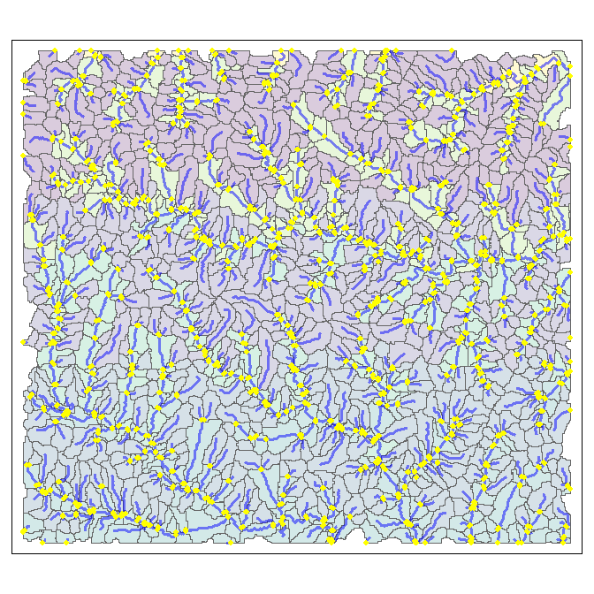
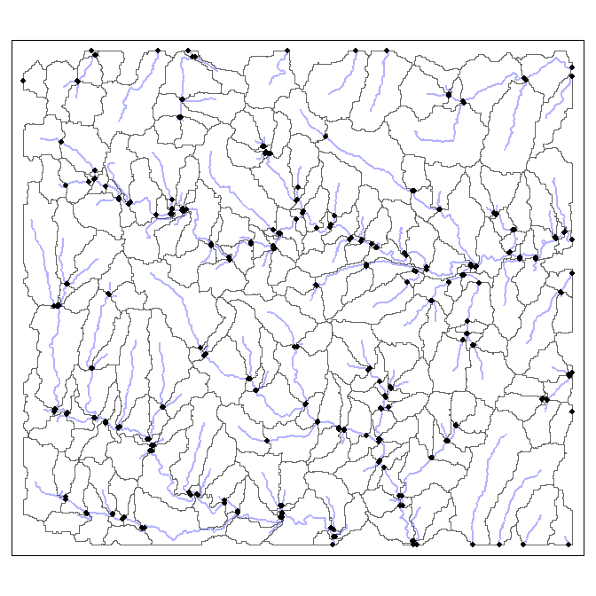

ihydro: Integrated hydrology tools for environmental science
================

-   <a href="#10-introduction" id="toc-10-introduction">1.0 Introduction</a>
-   <a href="#20-system-setup-and-installation"
    id="toc-20-system-setup-and-installation">2.0 System setup and
    installation</a>
-   <a href="#30-prepare-dem-and-sampling-points-for-for-analysis"
    id="toc-30-prepare-dem-and-sampling-points-for-for-analysis">3.0 Prepare
    DEM and Sampling Points for for analysis</a>
    -   <a href="#31-generate-toy-terrain-dataset-and-sampling-points"
        id="toc-31-generate-toy-terrain-dataset-and-sampling-points">3.1
        Generate toy terrain dataset and sampling points</a>
    -   <a href="#32-generate-predictor-layers"
        id="toc-32-generate-predictor-layers">3.2 Generate predictor layers</a>
    -   <a
        href="#33-generate-complete-geospatial-analysis-products-with-process_hydrology"
        id="toc-33-generate-complete-geospatial-analysis-products-with-process_hydrology">3.3
        Generate complete geospatial analysis products with
        <code>process_hydrology()</code></a>
    -   <a
        href="#34-add-layers-of-interest-to-complete-geospatial-analysis-products-with-process_loi"
        id="toc-34-add-layers-of-interest-to-complete-geospatial-analysis-products-with-process_loi">3.4
        Add layers of interest to complete geospatial analysis products with
        <code>process_loi()</code></a>
    -   <a
        href="#35-calculate-weighted-spatial-summaries-at-sampleing-points-attrib_points"
        id="toc-35-calculate-weighted-spatial-summaries-at-sampleing-points-attrib_points">3.5
        Calculate weighted spatial summaries at sampleing points
        <code>attrib_points()</code></a>
    -   <a
        href="#36-calculate-weighted-spatial-summaries-at-each-reach-attrib_points"
        id="toc-36-calculate-weighted-spatial-summaries-at-each-reach-attrib_points">3.6
        Calculate weighted spatial summaries at each reach
        <code>attrib_points()</code></a>
-   <a href="#40-generate-individual-geospatial-analysis-products"
    id="toc-40-generate-individual-geospatial-analysis-products">4.0
    Generate individual geospatial analysis products</a>
    -   <a href="#41-process-dem-with-process_flowdir"
        id="toc-41-process-dem-with-process_flowdir">4.1 Process DEM with
        <code>process_flowdir()</code></a>
    -   <a href="#42-generate-subbasins-generate_subbasins"
        id="toc-42-generate-subbasins-generate_subbasins">4.2 Generate Subbasins
        <code>generate_subbasins()</code></a>
    -   <a href="#43-generate-attributed-stream-lines-attrib_streamline"
        id="toc-43-generate-attributed-stream-lines-attrib_streamline">4.3
        Generate Attributed Stream Lines <code>attrib_streamline()</code></a>
    -   <a href="#44-insert-sampling-points-into-stream-layer-insert_points"
        id="toc-44-insert-sampling-points-into-stream-layer-insert_points">4.4
        Insert Sampling Points into Stream Layer
        <code>insert_points()</code></a>
    -   <a
        href="#45-trace-flow-paths-trace_flowpaths-and-generate-pairwise-distances-generate_pwisedist"
        id="toc-45-trace-flow-paths-trace_flowpaths-and-generate-pairwise-distances-generate_pwisedist">4.5
        Trace flow paths <code>trace_flowpaths()</code> and generate pairwise
        distances <code>generate_pwisedist()</code></a>

<!-- README.md is generated from README.Rmd. Please edit that file -->

## 1.0 Introduction



Aquatic environmental scientists are often tasked with relating
landscape factors to observed responses in streams, rivers and lakes.
The computational workflow for conducting these investigations is
complex. Simply describing how water flows and accumulates across the
landscape can be a challenge itself, but for aquatic scientists it is
only the first step. The stream network must then be extracted from the
landscape, and reaches (a.k.a. segments; i.e., stretches of river
between two confluences) identified and given unique identifiers. These
reaches must then be attributed to be informative (e.g., slope, stream
order, upstream channel length, etc.); and upstream-downstream
connectivity between reaches established.

Typically, sampling data is available at points along the stream
network. If the specific information about the location of these points
is to preserved (i.e., if samples are upstream and downstream of a
particular effluent outflow, but along the same stream reach), they must
be incorporated into the network. Once that is done, factors of interest
on the landscape (e.g., landcover, soils, geology, climate, etc.) must
be related to the reach (or sampling points). This alone can be complex
as the spatial configuration of these factors relative to flow direction
and accumulation are important. The ***ihydro*** package uses the
***hydroweight*** package to calculate these attributes.

The complexity of this workflow can be a rate limiting step in the
scope, content, quality, and applicability of aquatic environmental
scientist investigations. The ***ihydro*** package offers tools and
workflows to simplify these complex steps. It is capable of handling all
above computation steps, leaving researchers the task of identifying
layers of interest and modeling with (potentially) large numbers of
predictors.

The ***ihydro*** package also implements a novel form of describing
spatial autocorrelation among sites. Due to the linear nature of flow in
streams and rivers, autocorrelation tends to be asymmetric, with
downstream sites potentially more similar to upstream sites when they
are flow connected, than not flow connected (regardless of spatial
proximity). ***ihydro*** produces an asymmetric matrix that describes
the relationships between sampling points based on the proportions of an
upstream catchment that is shared with a target site. Proportion of
shared upstream catchment (rather than in-stream distance) is a more
relevant measure of spatial autocorrelation in streams because it
accounts for differences in catchment areas between points. For example,
if water chemistry samples are taken from a large 6th order stream, and
a upstream small 1st order tributary we would expect the small tributary
to have only a small impact on the larger stream. Hence autocorrelation
should be low because the tributary is not contributing much flow to the
large stream. If using in-stream distances, the assumed autocorrelation
may be high because the physical distance is small, but this would be
incorrect.

***ihydro*** stores its geospatial products in a file for easy of
retrieval and plotting in external software. It can be run in parallel
for increased speed (if enough memory is available), and is quick at
removing internal intermediate files to keep hard drives from filling up
too fast.

[Back to top](#contents)

## 2.0 System setup and installation

*WhiteboxTools* and *whitebox* are required for ***ihydro***. See
[whiteboxR](https://github.com/giswqs/whiteboxR) or below for
installation.

``` r
## Follow instructions for whitebox installation accordingly
## devtools::install_github("giswqs/whiteboxR") # For development version
## whitebox is now available on CRAN
#install.packages("whitebox")

library(whitebox)

if (F){
  install_whitebox()
  # Possible warning message:
  # ------------------------------------------------------------------------
  # Could not find WhiteboxTools!
  # ------------------------------------------------------------------------
  #
  # Your next step is to download and install the WhiteboxTools binary:
  #     > whitebox::install_whitebox()
  #
  # If you have WhiteboxTools installed already run `wbt_init(exe_path=...)`':
  #    > wbt_init(exe_path='/home/user/path/to/whitebox_tools')
  #
  # For whitebox package documentation, ask for help:
  #    > ??whitebox
  #
  # For more information visit https://giswqs.github.io/whiteboxR/
  #
  # ------------------------------------------------------------------------
}
```

[Back to top](#contents)

## 3.0 Prepare DEM and Sampling Points for for analysis

### 3.1 Generate toy terrain dataset and sampling points

Begin by bringing in the digital elevation model and using it to
generate terrain products. The DEM must be processed in a way to remove
depressions. Whitebox offers methods for breaching and filling DEMs to
remove depressions. These tools must be run before applying ihydro
tools.

Another factor to consider at this step is whether to burn stream
vectors into the DEM; tool allows for this, but there are several
caveats associated with this process. See
[here](https://proceedings.esri.com/library/userconf/proc99/proceed/papers/pap802/p802.htm#Trois)

``` r
## Load libraries
library(viridis)
library(ihydro)
library(mapview)
library(furrr)
library(whitebox)
library(terra)
library(sf)
library(dplyr)

# Many function in 'ihydro' can be run in parallel internally. However it’s important to remember that
# data has to be passed back and forth between the workers. This means that whatever performance gain you might have
# gotten from your parallelization can be crushed by moving large amounts of data around. In general, passing objects
# as file paths will be faster than passing whole sf or terra objects. Not returning products directly will also speed
# up function processing time dramatically. Products can always be retrieved/read in directly from the output .zip
# file.
if (T) plan(multisession, workers = 2)

## Generate save_dir as a temporary directory
save_dir <- tempdir()

## Import toy_dem from whitebox package
toy_file<-sample_dem_data()
toy_file <- system.file("extdata", "DEM.tif", package = "whitebox")
toy_dem <- rast(raster::raster(x = toy_file)) # reading the file from terra directly sometimes crashes R for some reason
crs(toy_dem) <- "epsg:3161"

## Write toy_dem to save_dir
writeRaster(
  x = toy_dem, filename = file.path(save_dir, "toy_dem.tif"),
  overwrite = TRUE
)

## Identify some sampling points
points<-xyFromCell(toy_dem,c(1291,1524,15954,24022)) %>% 
  vect(crs="epsg:3161") %>% 
  st_as_sf() %>% 
  mutate(Sites=row_number()) %>% 
  select(Sites, everything())

## Breach depressions to ensure continuous flow
wbt_breach_depressions(
  dem = file.path(save_dir, "toy_dem.tif"),
  output = file.path(save_dir, "toy_dem_breached.tif")
)

toy_dem<-rast(file.path(save_dir, "toy_dem_breached.tif"))
```

[Back to top](#contents)

### 3.2 Generate predictor layers

``` r

# Categorical Raster
wbt_pennock_landform_class(
  dem = file.path(save_dir, "toy_dem.tif"),
  output = file.path(save_dir, "landform_class.tif")
)

# Numeric Raster
wbt_ruggedness_index(
  dem = file.path(save_dir, "toy_dem.tif"),
  output = file.path(save_dir, "ruggedness_index.tif")
)

# Categorical/Numeric Polygon
lulc_p <- toy_dem
m <- c(0, 220, 1, 220, 300, 2, 300, 400, 3, 400, Inf, 4) 
rclmat <- matrix(m, ncol = 3, byrow = TRUE)
lulc_p <- classify(lulc_p, rclmat)
names(lulc_p)<-"lulc"
lulc_p <- as.polygons(lulc_p, dissolve = T, na.rm = T)
lulc_p <- st_as_sf(lulc_p)

set.seed(123)
lulc_p$var_1 <- sample(c(1:10), size = 4, replace = TRUE)
set.seed(123)
lulc_p$var_2 <- sample(c(20:30), size = 4, replace = TRUE)

lulc_p<-lulc_p %>% 
  select(var_1,var_2)

write_sf(lulc_p,file.path(save_dir,"lulc_p.shp"))

# Combine loi layers
output_filename_loi<-file.path(save_dir,"Processed_loi.zip")

loi_combined<-process_loi(
  dem=toy_dem,
  num_inputs=list(# Can be given as a mixture of input types (file paths, or any sf or terra format)
    ruggedness=file.path(save_dir, "ruggedness_index.tif"),
    lulc_numbpoly=lulc_p
  ),
  cat_inputs=list(# Can be given as a mixture of input types (file paths, or any sf or terra format)
    landform_class=file.path(save_dir, "landform_class.tif"),
    lulc_catpoly=lulc_p
  ),
  variable_names=list( # any unlisted inputs will be used in their entirety
    lulc_numbpoly=c("var_1"),
    lulc_catpoly=c("var_2")
  ),
  output_filename=output_filename_loi,
  return_products=T,
  temp_dir=NULL,
  verbose=T
)
#> [1] "Preparing DEM"
#> [1] "Preparing Numeric Inputs"
#> [1] "Preparing Categorical Inputs"
#> [1] "Combining Numeric Inputs"
#> [1] "Combining Categorical Inputs"
#> [1] "Generating Outputs"

# All layers have been transformed to rasters with 1 indicating presence, and NA for absence
plot(rast(loi_combined$cat_inputs),type="classes",col="darkgreen")
```


``` r
# Numeric Rasters
plot(rast(loi_combined$num_inputs),type="continuous")
```


[Back to top](#contents)

### 3.3 Generate complete geospatial analysis products with `process_hydrology()`

``` r

# Run complete hydrology processing tools in one function
output_filename_hydro<-file.path(save_dir,"Processed_Hydrology.zip")

hydro_out_comp<-process_hydrology(
  dem=toy_dem,
  output_filename=output_filename_hydro,
  threshold=1000L,
  extra_attr=c( # Additional attributes to calculate and add to outputs
    "link_slope",
    "cont_slope",
    "USChnLn_To",
    "Elevation",
    "StOrd_Hack",
    "StOrd_Str",
    "StOrd_Hort",
    "StOrd_Shr"
  ),
  points=points,
  snap_distance=10L,
  site_id_col="Sites",
  return_products=T,
  temp_dir=NULL,
  verbose=F
)
```

``` r

# Complete upstream catchments for each reach/sampling point are not stored, but can easily be retrieved
point_catchments<-get_catchment( # retrieve sampling point catchment
  input=hydro_out_comp,
  site_id_col="Sites",
  target_points=c("1","2","3","4")
)

subbasin_catchments<-get_catchment( # retrieve reach catchment
  input=hydro_out_comp,
  site_id_col=NULL,
  target_points=c("19")
)

mapview(hydro_out_comp$subbasins,zcol="link_id",legend=F,layer.name="")+
  mapview(hydro_out_comp$stream_lines,zcol="link_id",legend=F,layer.name="")+
  mapview(hydro_out_comp$links,zcol="link_id",legend=F,layer.name="")+
  mapview(hydro_out_comp$snapped_points,zcol="Sites",legend=F,color="red",layer.name="")+
  mapview(point_catchments,legend=F, color = "cyan", col.regions = "white", lwd = 3,alpha=0.8,layer.name="")+
  mapview(subbasin_catchments,legend=F, color = "Yellow", col.regions = "white", lwd = 3,alpha=0.8,layer.name="")
```


[Back to top](#contents)

### 3.4 Add layers of interest to complete geospatial analysis products with `process_loi()`

``` r

hydro_out_comp<-process_loi(
  input=hydro_out_comp,
  num_inputs=list( # named list of inputs to be considered numeric; can be a combination of file paths/object types
    ruggedness=file.path(save_dir, "ruggedness_index.tif"),
    lulc_numbpoly=file.path(save_dir,"lulc_p.shp")
  ),
  cat_inputs=list( # named list of inputs to be considered categorical
    landform_class=file.path(save_dir, "landform_class.tif"),
    lulc_catpoly=file.path(save_dir,"lulc_p.shp")
  ),
  variable_names=list( # a named list, When specified, only the given variables in a layer will be used
    lulc_numbpoly=c("var_1"), # In this case, the same polygon layer is used as both numeric and categorical
    lulc_catpoly=c("var_2")   # The `variable_names` argument allows the specification of which variables are what
  ),
  return_products=T, # these layers can get large, and it is generally not advised to return them into R 
  temp_dir=NULL,
  verbose=F
)
```

[Back to top](#contents)

### 3.5 Calculate weighted spatial summaries at sampleing points `attrib_points()`

``` r

loi<-list(numb=rast(loi_combined$num_inputs),
          cat=rast(loi_combined$cat_inputs))

loi_names<-lapply(loi,names) %>% unlist()
names(loi_names)<-loi_names
loi_names<-map(loi_names,~c("distwtd_mean",  "mean",  "min", "max"))

# A 'spec' table can be given to calculate attributes at only select sampling points,
# and/or to only calculate a subset of attributes from select sampling points
specification_table<-tibble(
  Sites=c("1","2","3"),
  loi=list(loi_names)
)
specification_table$loi[[2]]<-specification_table$loi[[2]][c(1:5)]
specification_table$loi[[2]][[1]]<-specification_table$loi[[2]][[1]][c(1:2)]

# specification_table$loi[[2]]

final_attributes_sub<-attrib_points(
  input=hydro_out_comp,
  spec=specification_table,
  weighting_scheme = c("lumped", "iFLO", "iFLS", "HAiFLO", "HAiFLS"),
  OS_combine=F,
  target_streamseg=F, # This will set the target_o parameter as the sampling point
  inv_function = function(x) {
    (x * 0.001 + 1)^-1
  },
  remove_region=NULL,
  return_products=T,
  temp_dir=NULL,
  verbose=F
)

# Site 2 should only contain mean and distwtd_mean variables for ruggedness
final_attributes_sub %>% 
  select(Sites,contains("ruggedness"))
#> # A tibble: 3 × 9
#>   Sites ruggedness_ind…¹ rugge…² rugge…³ rugge…⁴ rugge…⁵ rugge…⁶ rugge…⁷ rugge…⁸
#>   <chr> <chr>            <chr>   <chr>   <chr>   <chr>   <chr>   <chr>   <chr>  
#> 1 1     10.2604821508503 0.3374… 39.752… 10.260… 9.5551… 9.2993… 5.6975… 5.9174…
#> 2 2     16.6954987029686 <NA>    <NA>    16.559… 15.365… 15.278… 5.9973… 10.750…
#> 3 3     18.9960212670056 1.5622… 47.235… 18.996… 17.206… 16.244… 13.119… 9.9036…
#> # … with abbreviated variable names ¹​ruggedness_index_lumped_mean,
#> #   ²​ruggedness_index_lumped_min, ³​ruggedness_index_lumped_max,
#> #   ⁴​ruggedness_index_lumped_distwtd_mean, ⁵​ruggedness_index_iFLO_distwtd_mean,
#> #   ⁶​ruggedness_index_iFLS_distwtd_mean, ⁷​ruggedness_index_HAiFLO_distwtd_mean,
#> #   ⁸​ruggedness_index_HAiFLS_distwtd_mean
```

[Back to top](#contents)

### 3.6 Calculate weighted spatial summaries at each reach `attrib_points()`

``` r

# Warning this operation can be very slow
final_attributes_all<-attrib_points(
  input=hydro_out_comp,
  all_reaches=T, # This will calculate attributes for each reach
  weighting_scheme = c("HAiFLO", "HAiFLS"),
  loi_numeric_stats = c("distwtd_mean",  "mean",  "min", "max"),
  OS_combine=F,
  target_streamseg=T # This will set the target_o parameter as the entire reach
)

final_attributes_all
#> # A tibble: 29 × 47
#>    link_id distance_we…¹ weigh…² rugge…³ var_1…⁴ rugge…⁵ var_1…⁶ rugge…⁷ var_1…⁸
#>      <dbl> <list>        <list>    <dbl>   <dbl>   <dbl>   <dbl>   <dbl>   <dbl>
#>  1      26 <NULL>        <NULL>     16.3    3.48    8.30    3.04   15.5        2
#>  2      25 <NULL>        <NULL>     16.7    3.33    8.25    2.91   15.9        2
#>  3       1 <NULL>        <NULL>     10.2    6.34    6.48    3.83    8.32      10
#>  4       3 <NULL>        <NULL>     12.8    4.42    4.64    3.64   12.5        2
#>  5      22 <NULL>        <NULL>     17.3    2.87    8.07    2.45   16.7        2
#>  6       5 <NULL>        <NULL>     12.5    3.92    6.25    3.40   12.2        2
#>  7       6 <NULL>        <NULL>     18.9    2.51    9.36    1.93   18.5        2
#>  8      21 <NULL>        <NULL>     17.1    2.81    7.78    2.38   16.5        2
#>  9       4 <NULL>        <NULL>     12.1    3.88    5.01    3.37   11.7        2
#> 10      23 <NULL>        <NULL>     12.6    4.10    5.38    3.47   11.9        2
#> # … with 19 more rows, 38 more variables: ruggedness_index_lumped_min <dbl>,
#> #   var_1_lumped_min <dbl>, ruggedness_index_lumped_max <dbl>,
#> #   var_1_lumped_max <dbl>, ruggedness_index_lumped_sum <dbl>,
#> #   var_1_lumped_sum <dbl>, ruggedness_index_lumped_cell_count <dbl>,
#> #   var_1_lumped_cell_count <dbl>, ruggedness_index_HAiFLO_distwtd_mean <dbl>,
#> #   var_1_HAiFLO_distwtd_mean <dbl>, ruggedness_index_HAiFLO_distwtd_sd <dbl>,
#> #   var_1_HAiFLO_distwtd_sd <dbl>, …
```

[Back to top](#contents)

## 4.0 Generate individual geospatial analysis products

### 4.1 Process DEM with `process_flowdir()`

The process_flowdir() function starts the workflow and creates an output
zip file which stores results. It is important that functions are not
run repeatedly with the same output file, as later steps overwrite
results from previous iterations.

This function generates d8 pointer, flow accumulation, and stream layers
from the specified DEM, and flow accumulation threshold.

``` r

output_filename<-file.path(save_dir,"Processed_Hydrology_sub.zip")


hydro_out<-process_flowdir(
  dem=toy_dem,
  threshold=1000L,  
  return_products=T,
  output_filename=output_filename,
  temp_dir=NULL, 
  verbose=T
)
#> [1] "Generating d8 pointer"
#> d8_pointer - Elapsed Time (excluding I/O): 0.2s
#> [1] "Generating d8 flow accumulation"
#> d8_flow_accumulation - Elapsed Time (excluding I/O): 0.136s
#> d8_flow_accumulation - Elapsed Time (excluding I/O): 0.125s
#> [1] "Extracting Streams"
#> extract_streams - Elapsed Time (excluding I/O): 0.2s
#> [1] "Generating Output"

flow_accum<-log(rast(hydro_out$dem_accum_d8.tif))

plot(flow_accum,main="ln-Flow Accumulation")
```



[Back to top](#contents)

### 4.2 Generate Subbasins `generate_subbasins()`

The `generate_subbasins()` generates subbasins for each reach identified
in process_flowdir()

``` r

hydro_out1<-generate_subbasins(
  input=hydro_out,
  return_products=T,
  temp_dir=NULL,
  verbose=F
) 

# Note polygons are identified with 'link_id' field which matches stream segments generated below

mapview(hydro_out1$subbasins,zcol="link_id")
```


[Back to top](#contents)

### 4.3 Generate Attributed Stream Lines `attrib_streamline()`

``` r

hydro_out2<-attrib_streamline( 
  input=hydro_out1,
  extra_attr=c( # Additional attributes to calculate and add to outputs
    "link_slope",
    "cont_slope",
    "USChnLn_To",
    "Elevation",
    "StOrd_Hack",
    "StOrd_Str",
    "StOrd_Hort",
    "StOrd_Shr"
  ),
  return_products=T,
  temp_dir=NULL,
  verbose=F
)

# hydro_out2$links # Points containing pour points for each subbasins and upstream and downstream 'link_id's and 'extra_attr' fields

# hydro_out2$points # Points containing all points along the stream line, attributed with 'extra_attr' 

# hydro_out2$stream_lines # line segments for each subbasin, as well as and upstream and downstream 'link_id's and 'extra_attr' fields

mapview(hydro_out2$stream_lines,zcol="link_id")
```


[Back to top](#contents)

### 4.4 Insert Sampling Points into Stream Layer `insert_points()`

``` r

# Generate some artificial sampling points

points<-rast(hydro_out2$dem_streams_d8.tif) %>% 
  as.points() %>% 
  st_as_sf() %>% 
  filter(st_coordinates(.)[, 1] < 675000) %>% 
  rename(Sites=dem_streams_d8) %>% 
  .[c(10,12,50,100),] %>% 
  mutate(Sites=row_number()) %>% 
  st_jitter(5)

hydro_out25<-insert_points( 
  input=hydro_out2,
  points=points,
  site_id_col="Sites", # Column in points layer that corresponds to unique IDs that will be available in data products
  snap_distance=10L,
  return_products=T,
  temp_dir=NULL,
  verbose=F
)

# Segments get split at sampling points, with the most downstream segment retaining the original 'link_id' and 
# upstream segments getting increasingly larger decimal numbers

mapview(hydro_out25$subbasins,zcol="link_id",legend=F)+
  mapview(hydro_out25$stream_lines,zcol="link_id",legend=F)+
  mapview(hydro_out25$links,zcol="link_id",legend=F)+
  mapview(hydro_out25$snapped_points,zcol="Sites",legend=F,color="red")
```


[Back to top](#contents)

### 4.5 Trace flow paths `trace_flowpaths()` and generate pairwise distances `generate_pwisedist()`

``` r

hydro_out3<-trace_flowpaths(
  input=hydro_out25,
  return_products=T,
  temp_dir=NULL,
  verbose=F
)
```

``` r

hydro_out4<-generate_pwisedist(
  input=hydro_out3,
  return_products=T,
  temp_dir=NULL,
  verbose=F
)
```

[Back to top](#contents)
